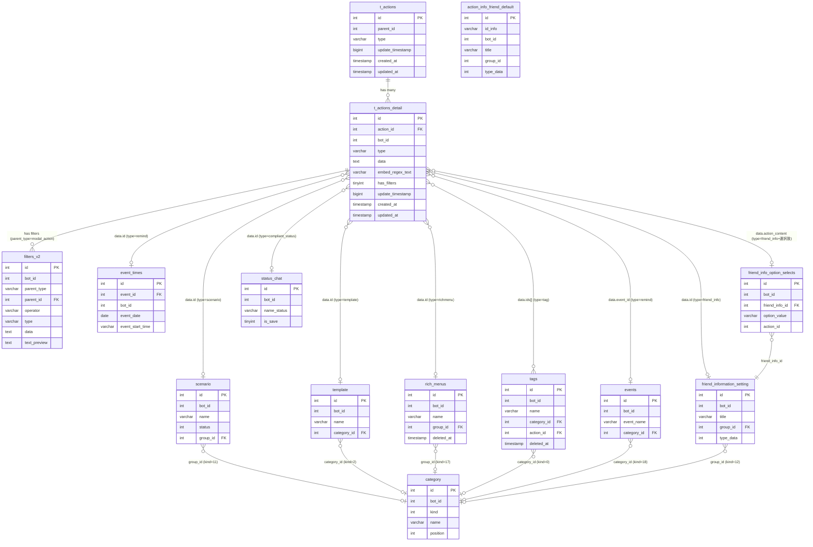

# DB Mapping — SC-004 Action Settings (Modal アクション)

**Component:** SC-004 Action Settings  
**Phiên bản:** 2025-05-20  
**Nguồn:** `db/schema/tables/`, `db/data/`, `src/web/sns-line/app/`, `src/web/sns-line/config/sns-line.php`  
**Độ tin cậy tổng thể:** **Cao** (schema xác nhận từ DB dump; data JSON xác nhận từ sample data)

---

## 1. Primary Tables

### 1.1 `t_actions` — Bảng cha action config

**Mục đích:** Lưu "container" cho một bộ action settings. Mỗi record đại diện cho một Action modal configuration.

```sql
CREATE TABLE `t_actions` (
  `id`               int(10) UNSIGNED NOT NULL AUTO_INCREMENT,
  `parent_id`        int(11) NOT NULL,
  `type`             varchar(255) NOT NULL,
  `update_timestamp` bigint(20) NOT NULL,
  `created_at`       timestamp NOT NULL DEFAULT CURRENT_TIMESTAMP,
  `updated_at`       timestamp NOT NULL DEFAULT CURRENT_TIMESTAMP ON UPDATE CURRENT_TIMESTAMP
);
```

| Cột | Kiểu | Nullable | Default | Mô tả |
|-----|------|----------|---------|-------|
| `id` | int(10) UNSIGNED | NO | AUTO_INCREMENT | Primary key |
| `parent_id` | int(11) | NO | — | ID của parent record (thường = 0, thực tế lookup qua FK ở bảng cha) |
| `type` | varchar(255) | NO | — | Context type — xem bảng enum bên dưới |
| `update_timestamp` | bigint(20) | NO | — | Unix timestamp khi cập nhật |
| `created_at` | timestamp | NO | CURRENT_TIMESTAMP | Thời điểm tạo |
| `updated_at` | timestamp | NO | CURRENT_TIMESTAMP | Thời điểm cập nhật cuối |

**Độ tin cậy:** **Cao** (đọc từ schema + sample data xác nhận)

**Data size:** 8.8MB

---

### 1.2 `t_actions_detail` — Bảng chi tiết từng action item

**Mục đích:** Mỗi record = 1 action item trong list. Một `t_actions` có thể có nhiều `t_actions_detail` (quan hệ 1-nhiều).

```sql
CREATE TABLE `t_actions_detail` (
  `id`               int(10) UNSIGNED NOT NULL AUTO_INCREMENT,
  `action_id`        int(11) NOT NULL,
  `bot_id`           int(11) DEFAULT NULL,
  `type`             varchar(255) NOT NULL,
  `data`             text NOT NULL,
  `embed_regex_text` varchar(255) DEFAULT NULL,
  `has_filters`      tinyint(4) NOT NULL DEFAULT '0',
  `update_timestamp` bigint(20) NOT NULL,
  `created_at`       timestamp NOT NULL DEFAULT CURRENT_TIMESTAMP,
  `updated_at`       timestamp NOT NULL DEFAULT CURRENT_TIMESTAMP ON UPDATE CURRENT_TIMESTAMP
);
```

| Cột | Kiểu | Nullable | Default | Mô tả |
|-----|------|----------|---------|-------|
| `id` | int(10) UNSIGNED | NO | AUTO_INCREMENT | Primary key |
| `action_id` | int(11) | NO | — | FK → `t_actions.id` |
| `bot_id` | int(11) | YES | NULL | Bot owner (một số record cũ có NULL) |
| `type` | varchar(255) | NO | — | Action type: `scenario`, `template`, `text`, `remind`, `tag`, `richmenu`, `bookmark`, `friend_info`, `compliant_status`, `block`, `form_answer`, `booking`, `product_page`, `conversion`, `other_text`, `keywords`, `phone`, `email`, `add_friend` |
| `data` | text | NO | — | JSON string — cấu trúc khác nhau theo `type` |
| `embed_regex_text` | varchar(255) | YES | NULL | Regex embed URL trong text action (dùng cho URL tracking detection) |
| `has_filters` | tinyint(4) | NO | 0 | 0=không có filter, 1=có filter (hiển thị badge 「絞込 設定済」) |
| `update_timestamp` | bigint(20) | NO | — | Unix timestamp khi cập nhật |
| `created_at` | timestamp | NO | CURRENT_TIMESTAMP | Thời điểm tạo |
| `updated_at` | timestamp | NO | CURRENT_TIMESTAMP | Thời điểm cập nhật cuối |

**Độ tin cậy:** **Cao** (đọc từ schema + sample data xác nhận nhiều type)

**Data size:** 14.7MB

---

### 1.3 `action_info_friend_default` — Default friend info fields per bot

**Mục đích:** Lưu danh sách các system default friend info fields (基本情報) theo từng bot. Dùng khi load action type `friend_info` với `group_id = -1`.

```sql
CREATE TABLE `action_info_friend_default` (
  `id`            int(10) UNSIGNED NOT NULL AUTO_INCREMENT,
  `id_info`       varchar(255) NOT NULL,
  `bot_id`        int(11) NOT NULL,
  `order`         int(11) NOT NULL DEFAULT '0',
  `title`         varchar(255) NOT NULL,
  `group_id`      int(11) NOT NULL DEFAULT '-1',
  `type_data`     int(11) NOT NULL COMMENT 'select=>1, input=>2, calendar=>3, image=>4, file=>5, point=>6',
  `default_value` varchar(500) DEFAULT NULL,
  `setting_value` text,
  `created_at`    timestamp NOT NULL DEFAULT CURRENT_TIMESTAMP,
  `updated_at`    timestamp NOT NULL DEFAULT CURRENT_TIMESTAMP ON UPDATE CURRENT_TIMESTAMP
);
```

| Cột | Kiểu | Nullable | Default | Mô tả |
|-----|------|----------|---------|-------|
| `id` | int(10) UNSIGNED | NO | AUTO_INCREMENT | Primary key |
| `id_info` | varchar(255) | NO | — | ID hệ thống: `d_1`=システム表示名, `d_2`=携帯電話, `d_3`=メールアドレス, `d_4`=生年月日, `d_6`=都道府県 |
| `bot_id` | int(11) | NO | — | Bot owner |
| `order` | int(11) | NO | 0 | Thứ tự hiển thị |
| `title` | varchar(255) | NO | — | Nhãn hiển thị (tiếng Nhật) |
| `group_id` | int(11) | NO | -1 | Luôn = -1 (基本情報) |
| `type_data` | int(11) | NO | — | Kiểu dữ liệu: 1=選択肢, 2=記述, 3=年月日, 6=ポイント |
| `default_value` | varchar(500) | YES | NULL | Giá trị mặc định |
| `setting_value` | text | YES | NULL | JSON config (setting_actions cho type=1) |
| `created_at` | timestamp | NO | CURRENT_TIMESTAMP | Thời điểm tạo |
| `updated_at` | timestamp | NO | CURRENT_TIMESTAMP | Thời điểm cập nhật |

**Ví dụ data thực tế:**
```sql
(6, 'd_1', 300, 0, 'システム表示名', -1, 2, NULL, NULL, ...)
(9, 'd_4', 300, 3, '生年月日', -1, 3, NULL, '{"action_mode":"1","setting_actions":[...]}', ...)
```

**Độ tin cậy:** **Cao**

---

### 1.4 `t_actions_detail_recover` — Bảng backup action details

**Mục đích:** Bảng phục hồi dữ liệu khi action bị xóa nhầm. Cùng cấu trúc với `t_actions_detail` nhưng không có `embed_regex_text` và `update_timestamp`.

```sql
CREATE TABLE `t_actions_detail_recover` (
  `id`          int(10) UNSIGNED NOT NULL AUTO_INCREMENT,
  `action_id`   int(11) NOT NULL,
  `bot_id`      int(11) DEFAULT NULL,
  `type`        varchar(255) NOT NULL,
  `data`        text NOT NULL,
  `has_filters` tinyint(4) NOT NULL DEFAULT '0',
  `created_at`  timestamp NOT NULL DEFAULT CURRENT_TIMESTAMP,
  `updated_at`  timestamp NOT NULL DEFAULT CURRENT_TIMESTAMP ON UPDATE CURRENT_TIMESTAMP
);
```

**Độ tin cậy:** **Cao**

---

## 2. Filter Table

### 2.1 `filters_v2` — Filter conditions cho action details

**Mục đích:** Lưu điều kiện lọc (絞込) cho từng `t_actions_detail`. Khi `parent_type = 'modal_action'` → `parent_id` = `t_actions_detail.id`.

```sql
CREATE TABLE `filters_v2` (
  `id`                    int(10) UNSIGNED NOT NULL AUTO_INCREMENT,
  `bot_id`                int(11) DEFAULT NULL,
  `parent_type`           varchar(255) DEFAULT NULL,
  `parent_id`             int(11) DEFAULT NULL,
  `operator`              varchar(100) DEFAULT NULL,
  `type`                  varchar(255) DEFAULT NULL,
  `data`                  text,
  `text_preview`          text,
  `created_at`            timestamp NOT NULL DEFAULT CURRENT_TIMESTAMP,
  `updated_at`            timestamp NOT NULL DEFAULT CURRENT_TIMESTAMP ON UPDATE CURRENT_TIMESTAMP,
  `rich_menu_item_id`     int(11) DEFAULT NULL,
  `rich_menu_redirect_id` int(11) DEFAULT NULL
);
```

| Cột | Kiểu | Nullable | Default | Mô tả |
|-----|------|----------|---------|-------|
| `id` | int(10) UNSIGNED | NO | AUTO_INCREMENT | Primary key |
| `bot_id` | int(11) | YES | NULL | Bot owner |
| `parent_type` | varchar(255) | YES | NULL | `'modal_action'` khi filter thuộc action detail |
| `parent_id` | int(11) | YES | NULL | FK → `t_actions_detail.id` (khi parent_type='modal_action') |
| `operator` | varchar(100) | YES | NULL | `'and'` hoặc `'or'` |
| `type` | varchar(255) | YES | NULL | Loại filter: `friend_name`, `tag`, `scenario`, `friend_info`, `day_add_friend`, `qr_code`, `conversion`, `status_search`... |
| `data` | text | YES | NULL | JSON config cho filter condition |
| `text_preview` | text | YES | NULL | Text preview hiển thị trên UI (đã set sẵn) |
| `rich_menu_item_id` | int(11) | YES | NULL | FK → rich menu item (khi parent_type là rich menu) |
| `rich_menu_redirect_id` | int(11) | YES | NULL | FK → rich menu redirect |

**Ví dụ data thực tế (modal_action):**
```sql
(2508, 542, 'modal_action', 85306, 'and', 'friend_name', '{"active":true,"checkbox_name":["0"],"keyword":"Hà Trangg"}', '', ...)
(2509, 542, 'modal_action', 85307, 'and', 'tag', '{"active":true,"tags_search":[18424,18399],"tag_condition":0}', 'filter 2, abc...', ...)
```

**Độ tin cậy:** **Cao** (xác nhận từ sample data và code `FilterV2::saveFilter`)

**Data size:** 17.8MB

---

## 3. Lookup Tables

### 3.1 `category` — Bảng folder/danh mục dùng chung

**Mục đích:** Bảng folder dùng chung cho nhiều loại entity (tag, scenario, template, rich menu, event, v.v.). Phân biệt qua cột `kind`.

```sql
CREATE TABLE `category` (
  `id`              int(11) NOT NULL AUTO_INCREMENT,
  `bot_id`          int(11) NOT NULL,
  `kind`            int(11) NOT NULL,
  `name`            varchar(100) NOT NULL,
  `position`        int(11) DEFAULT NULL,
  `is_deleted`      int(11) DEFAULT '0',
  `created_at`      timestamp NOT NULL DEFAULT CURRENT_TIMESTAMP,
  `updated_at`      timestamp NULL DEFAULT NULL ON UPDATE CURRENT_TIMESTAMP,
  `category_id_old` int(11) NOT NULL DEFAULT '-1'
);
```

**Giá trị `kind` liên quan đến SC-004 (từ `config/sns-line.php`):**

| `kind` | Loại category | Dùng cho action type |
|--------|--------------|---------------------|
| 0 | tag | `tag` — folder tag |
| 2 | template | `template` — folder template |
| 11 | scenario | `scenario` — folder scenario |
| 12 | information_friend | `friend_info` — folder friend info |
| 17 | rich_menus | `richmenu` — folder rich menu |
| 18 | event | `remind` — folder event/remind |

**Độ tin cậy:** **Cao** (xác nhận từ `config/sns-line.php` + `ActionDataModalService.php`)

**Data size:** 509KB

---

### 3.2 `scenario` — Danh sách kịch bản step delivery

```sql
CREATE TABLE `scenario` (
  `id`       int(11) NOT NULL AUTO_INCREMENT,
  `bot_id`   int(11) NOT NULL,
  `name`     varchar(200) NOT NULL,
  `status`   int(11) NOT NULL DEFAULT '0',
  `method`   int(11) NOT NULL,
  `group_id` int(11) NOT NULL DEFAULT '0',
  -- ... (thêm ~38 cột cho chain scenario sau kết thúc)
);
```

**Các cột quan trọng cho SC-004:**

| Cột | Kiểu | Mô tả |
|-----|------|-------|
| `id` | int(11) | PK — được lưu vào `t_actions_detail.data.id` khi type=scenario |
| `bot_id` | int(11) | Bot owner |
| `name` | varchar(200) | Tên scenario — cache vào `data.scenario_name` |
| `group_id` | int(11) | FK → `category.id` (kind=11) |
| `is_deleted` | int(11) | 0=active, 1=deleted |

**Độ tin cậy:** **Cao**

**Data size:** 300KB

---

### 3.3 `template` — Mẫu tin nhắn

**Cột quan trọng cho SC-004:**

| Cột | Mô tả |
|-----|-------|
| `id` | PK — được lưu vào `t_actions_detail.data.id` khi type=template |
| `bot_id` | Bot owner |
| `name` | Tên template — cache vào `data.template_name` |
| `category_id` | FK → `category.id` (kind=2) |

**Độ tin cậy:** **Cao** (DB index xác nhận bảng `template` với 33 cột)

**Data size:** 1.8MB

---

### 3.4 `rich_menus` — Rich menu

```sql
CREATE TABLE `rich_menus` (
  `id`           int(11) NOT NULL AUTO_INCREMENT,
  `group_id`     int(11) NOT NULL DEFAULT '0',
  `bot_id`       int(11) DEFAULT NULL,
  `name`         varchar(255) DEFAULT NULL,
  `rich_menu_id` varchar(100) DEFAULT NULL,
  `status`       tinyint(1) DEFAULT NULL,
  `deleted_at`   timestamp NULL DEFAULT NULL,
  -- ... (thêm ~31 cột)
);
```

**Các cột quan trọng cho SC-004:**

| Cột | Kiểu | Mô tả |
|-----|------|-------|
| `id` | int(11) | PK — được lưu vào `t_actions_detail.data.id` khi type=richmenu |
| `bot_id` | int(11) | Bot owner |
| `name` | varchar(255) | Tên rich menu — cache vào `data.richmenu_name` |
| `group_id` | int(11) | FK → `category.id` (kind=17) |
| `deleted_at` | timestamp | Soft delete |

**Độ tin cậy:** **Cao**

**Data size:** 207KB

---

### 3.5 `tags` — Danh sách tag

```sql
CREATE TABLE `tags` (
  `id`          int(12) NOT NULL AUTO_INCREMENT,
  `bot_id`      int(12) DEFAULT NULL,
  `name`        varchar(255) NOT NULL,
  `category_id` int(12) NOT NULL,
  `action_id`   int(11) DEFAULT NULL,
  `position`    int(12) NOT NULL,
  `deleted_at`  timestamp NULL DEFAULT NULL,
  -- ... (thêm ~23 cột)
);
```

**Các cột quan trọng cho SC-004:**

| Cột | Kiểu | Mô tả |
|-----|------|-------|
| `id` | int(12) | PK — được lưu vào `t_actions_detail.data.ids[]` khi type=tag |
| `bot_id` | int(12) | Bot owner |
| `name` | varchar(255) | Tên tag hiển thị |
| `category_id` | int(12) | FK → `category.id` (kind=0). 0 = 未分類 |
| `action_id` | int(11) | FK → `t_actions.id` (action preview khi add tag) |
| `deleted_at` | timestamp | Soft delete |

**Lưu ý:** Khi tạo tag mới inline (EP-10), insert với `action_id=NULL`, sau đó update `position = max(position) + 1`.

**Độ tin cậy:** **Cao**

**Data size:** 245KB

---

### 3.6 `events` — Remind events (bảng cha)

```sql
CREATE TABLE `events` (
  `id`                 int(10) UNSIGNED NOT NULL AUTO_INCREMENT,
  `form_answer_id`     int(11) DEFAULT NULL,
  `booking_calendar_id` int(11) DEFAULT NULL,
  `bot_id`             int(11) NOT NULL,
  `category_id`        int(11) NOT NULL DEFAULT '0',
  `position`           int(11) NOT NULL DEFAULT '1',
  `type`               int(11) NOT NULL DEFAULT '0',
  `event_name`         varchar(256) NOT NULL,
  `created_at`         timestamp NOT NULL DEFAULT CURRENT_TIMESTAMP,
  `updated_at`         timestamp NOT NULL DEFAULT CURRENT_TIMESTAMP ON UPDATE CURRENT_TIMESTAMP
);
```

**Các cột quan trọng cho SC-004:**

| Cột | Kiểu | Mô tả |
|-----|------|-------|
| `id` | int(10) UNSIGNED | PK — được lưu vào `t_actions_detail.data.event_id` khi type=remind |
| `bot_id` | int(11) | Bot owner |
| `event_name` | varchar(256) | Tên event — cache vào `data.remind_name` |
| `category_id` | int(11) | FK → `category.id` (kind=18). 0 = 未分類 |

**Độ tin cậy:** **Cao**

**Data size:** 187KB

---

### 3.7 `event_times` — Thời gian cụ thể của remind event

```sql
CREATE TABLE `event_times` (
  `id`                  int(10) UNSIGNED NOT NULL AUTO_INCREMENT,
  `event_id`            int(11) NOT NULL,
  `bot_id`              int(11) NOT NULL,
  `event_date`          date NOT NULL,
  `event_start_time`    varchar(16) NOT NULL,
  `count_user_registed` int(11) NOT NULL DEFAULT '0',
  `created_at`          timestamp NOT NULL DEFAULT CURRENT_TIMESTAMP,
  `updated_at`          timestamp NOT NULL DEFAULT CURRENT_TIMESTAMP ON UPDATE CURRENT_TIMESTAMP
);
```

**Các cột quan trọng cho SC-004:**

| Cột | Kiểu | Mô tả |
|-----|------|-------|
| `id` | int(10) UNSIGNED | PK — được lưu vào `t_actions_detail.data.id` khi type=remind (action=1) |
| `event_id` | int(11) | FK → `events.id` |
| `event_date` | date | Ngày event — từ `data.event_date` |
| `event_start_time` | varchar(16) | Giờ event — từ `data.event_start_time` (format `HH:MM`) |

**Logic đặc biệt:** Khi save action type=remind với type=1 (配信開始), hệ thống tìm hoặc tạo mới `event_times` record khớp với `event_id + event_date + event_start_time`.

**Độ tin cậy:** **Cao**

**Data size:** 213KB

---

### 3.8 `friend_information_setting` — Custom friend info fields

```sql
CREATE TABLE `friend_information_setting` (
  `id`          int(10) UNSIGNED NOT NULL AUTO_INCREMENT,
  `bot_id`      int(11) NOT NULL,
  `order`       int(11) NOT NULL DEFAULT '0',
  `title`       varchar(255) NOT NULL,
  `group_id`    int(11) NOT NULL DEFAULT '0',
  `type_data`   int(11) NOT NULL COMMENT 'select=>1, input=>2, calendar=>3, image=>4, file=>5, point=>6',
  `default_value` varchar(500) DEFAULT NULL,
  `setting_value` text,
  `total_user_has_value` int(11) NOT NULL DEFAULT '0',
  `calendar_id` bigint(20) DEFAULT NULL,
  `calendar_salon_id` bigint(20) DEFAULT NULL,
  `form_answer_detail_id` bigint(20) DEFAULT NULL,
  `created_at`  timestamp NOT NULL DEFAULT CURRENT_TIMESTAMP,
  `updated_at`  timestamp NOT NULL DEFAULT CURRENT_TIMESTAMP ON UPDATE CURRENT_TIMESTAMP
);
```

**Các cột quan trọng cho SC-004:**

| Cột | Kiểu | Mô tả |
|-----|------|-------|
| `id` | int(10) UNSIGNED | PK — được lưu vào `t_actions_detail.data.id` khi type=friend_info (giá trị dương). Giá trị âm = system fields (-1 đến -6) |
| `bot_id` | int(11) | Bot owner |
| `title` | varchar(255) | Tên field — cache vào `data.name` |
| `group_id` | int(11) | FK → `category.id` (kind=12). 0 = 未分類 |
| `type_data` | int(11) | Kiểu dữ liệu: 1=選択肢, 2=記述, 3=年月日, 4=image, 5=file, 6=ポイント — lưu vào `data.type` |
| `setting_value` | text | JSON cấu hình lựa chọn (khi type_data=1) |

**Độ tin cậy:** **Cao**

**Data size:** 627KB

---

### 3.9 `friend_info_option_selects` — Options cho friend info field kiểu 選択肢

```sql
CREATE TABLE `friend_info_option_selects` (
  `id`             int(10) UNSIGNED NOT NULL AUTO_INCREMENT,
  `bot_id`         int(11) NOT NULL,
  `friend_info_id` int(11) NOT NULL,
  `option_value`   varchar(255) DEFAULT NULL,
  `action_id`      int(11) DEFAULT NULL,
  `created_at`     timestamp NOT NULL DEFAULT CURRENT_TIMESTAMP,
  `updated_at`     timestamp NOT NULL DEFAULT CURRENT_TIMESTAMP ON UPDATE CURRENT_TIMESTAMP
);
```

**Cột quan trọng cho SC-004:**

| Cột | Kiểu | Mô tả |
|-----|------|-------|
| `id` | int(10) UNSIGNED | PK — lưu vào `data.action_content` khi type=friend_info + field_type=1 (選択肢) + action=2 |
| `friend_info_id` | int(11) | FK → `friend_information_setting.id` |
| `option_value` | varchar(255) | Giá trị option — match với `data.content` khi save |

**Logic save:** Khi save friend_info type=1, action=2: tìm `friend_info_option_selects` với `friend_info_id + option_value` → lưu found `id` vào `data.action_content`.

**Độ tin cậy:** **Cao** (xác nhận từ logic-spec)

**Data size:** 199KB

---

### 3.10 `status_chat` — Compliant status (対応ステータス)

```sql
CREATE TABLE `status_chat` (
  `id`          int(10) UNSIGNED NOT NULL AUTO_INCREMENT,
  `bot_id`      int(11) NOT NULL,
  `position`    int(11) NOT NULL DEFAULT '0',
  `name_status` varchar(255) NOT NULL,
  `color`       varchar(255) NOT NULL,
  `bg_status`   varchar(255) DEFAULT NULL,
  `bg_choose`   varchar(255) DEFAULT NULL,
  `is_save`     tinyint(4) NOT NULL DEFAULT '1',
  `count`       int(11) NOT NULL DEFAULT '0',
  `created_at`  timestamp NOT NULL DEFAULT CURRENT_TIMESTAMP,
  `updated_at`  timestamp NOT NULL DEFAULT CURRENT_TIMESTAMP ON UPDATE CURRENT_TIMESTAMP
);
```

**Các cột quan trọng cho SC-004:**

| Cột | Kiểu | Mô tả |
|-----|------|-------|
| `id` | int(10) UNSIGNED | PK — được lưu vào `t_actions_detail.data.id` khi type=compliant_status + action=1 |
| `bot_id` | int(11) | Bot owner |
| `name_status` | varchar(255) | Tên status — cache vào `data.content` |
| `color` | varchar(255) | Màu hex hoặc số |
| `bg_status` | varchar(255) | Màu nền |
| `is_save` | tinyint(4) | 1=active |

**Ví dụ data thực tế:**
```sql
(8, 300, 10, 'マガジンコメント', '1', '#FFCDCB', '1', 1, 0, ...)
(10, 300, 8, '質問', '2', '#FFDCA2', '#FF9D00', 1, 0, ...)
```

**Độ tin cậy:** **Cao**

**Data size:** 801KB

---

## 4. Action Type JSON Mapping

Mỗi `t_actions_detail` lưu JSON trong cột `data`. Cấu trúc JSON khác nhau theo `type`:

### 4.1 type = `scenario`

```json
{
  "action": 2,
  "id": 34,
  "start_day": 0,
  "scenario_name": "DQT0407_2"
}
```

| Field JSON | Kiểu | Tables tham chiếu | Ghi chú |
|-----------|------|-----------------|---------|
| `action` | INT (1/2/3) | — inline | 1=停止, 2=開始/再開, 3=途中から |
| `id` | INT | `scenario.id` | 0 nếu action=1 |
| `start_day` | INT | — inline | Ngày bắt đầu (chỉ khi action=3). 0 nếu action=1 hoặc 2 |
| `scenario_name` | STRING | cache từ `scenario.name` | Denormalized cache |

**Xác nhận từ sample data:** `(2, 6, NULL, 'scenario', '{"action":2,"id":34,"start_day":0,"scenario_name":"DQT0407_2"}', ...)`

---

### 4.2 type = `template`

```json
{
  "id": "46",
  "template_name": "text",
  "group_id": 7
}
```

| Field JSON | Kiểu | Tables tham chiếu | Ghi chú |
|-----------|------|-----------------|---------|
| `id` | STRING/INT | `template.id` | ID template được chọn |
| `template_name` | STRING | cache từ `template.name` | Có thể null |
| `group_id` | INT | `category.id` (kind=2) | Folder |
| `selected_group_id` | INT | — UI state | Không lưu DB (đôi khi xuất hiện) |

**Xác nhận từ sample data:** `(3, 6, NULL, 'template', '{"id":"46","template_name":"text","group_id":7}', ...)`

---

### 4.3 type = `text`

```json
{
  "content": "テキスト内容",
  "id": "46"
}
```

| Field JSON | Kiểu | Tables tham chiếu | Ghi chú |
|-----------|------|-----------------|---------|
| `content` | STRING (max 5000 chars) | — inline | Text content. Có thể chứa merge tags `[LINE_NAME]`, `[FRIEND_INFO_{hash_id}]`, v.v. |
| `id` | STRING/INT | (bot_id hoặc legacy) | Xuất hiện trong data cũ, không dùng |

**Lưu ý:** Khi save, `content` được xử lý qua `detectUrlInMessageTextV2()` → detect URLs → tạo tracking links. URL tracking có thể ghi vào `embed_regex_text`.

---

### 4.4 type = `remind`

```json
{
  "id": 61,
  "remind_name": " (2021-03-31 17:12)",
  "type": 1,
  "event_id": 3,
  "event_date": "2021-03-31",
  "event_start_time": "17:12"
}
```

| Field JSON | Kiểu | Tables tham chiếu | Ghi chú |
|-----------|------|-----------------|---------|
| `id` | INT | `event_times.id` | ID EventTimes record. -1 nếu type=0 (配信停止) |
| `type` | INT (0/1) | — inline | 0=配信停止, 1=配信開始 |
| `event_id` | INT | `events.id` | ID event (remind) |
| `remind_name` | STRING | cache từ `events.event_name` | Tên event với date/time |
| `event_date` | DATE | lưu vào `event_times.event_date` | Format `YYYY-MM-DD` |
| `event_start_time` | STRING | lưu vào `event_times.event_start_time` | Format `HH:MM` |

**Xác nhận từ sample data:** `(1207, 1118, 300, 'remind', '{"id":61,"remind_name":" (2021-03-31 17:12)"}', ...)`

---

### 4.5 type = `tag`

```json
{
  "ids": [375],
  "action": 1
}
```

| Field JSON | Kiểu | Tables tham chiếu | Ghi chú |
|-----------|------|-----------------|---------|
| `ids` | ARRAY INT | `tags.id` (multiple) | Danh sách tag IDs được chọn |
| `action` | INT (1/2) | — inline | 1=つける (gán tag), 2=はずす (bỏ tag) |

**Xác nhận từ sample data:** `(1383, 1307, 300, 'tag', '{"ids":[375],"action":1}', ...)`

---

### 4.6 type = `richmenu`

```json
{
  "action": 2,
  "id": 202,
  "richmenu_name": "richmneu1"
}
```

| Field JSON | Kiểu | Tables tham chiếu | Ghi chú |
|-----------|------|-----------------|---------|
| `action` | INT (1/2) | — inline | 1=表示停止, 2=表示する |
| `id` | INT | `rich_menus.id` | 0 nếu action=1 (停止) |
| `richmenu_name` | STRING | cache từ `rich_menus.name` | Denormalized cache |

**Xác nhận từ sample data:** `(2898, 2908, NULL, 'richmenu', '{"action":2,"id":202,"richmenu_name":"richmneu1"}', ...)`

---

### 4.7 type = `bookmark`

```json
{
  "id": "",
  "action": "2",
  "content": ""
}
```

| Field JSON | Kiểu | Tables tham chiếu | Ghi chú |
|-----------|------|-----------------|---------|
| `action` | STRING/INT (1/2) | — inline | 1=ブックマークする, 2=ブックマークを外す |
| `id`, `content` | (trống) | — | Không dùng — placeholder từ template rỗng |

**Xác nhận từ sample data:** `(84810, 27314, 528, 'bookmark', '{"id":"","action":"2","content":""}', ...)`

---

### 4.8 type = `friend_info`

```json
{
  "id": "60",
  "name": "point",
  "type": "6",
  "action": "1",
  "content": null,
  "action_content": null
}
```

```json
{
  "id": "60",
  "name": "point",
  "type": "6",
  "action": "2",
  "content": "2",
  "action_content": "2"
}
```

| Field JSON | Kiểu | Tables tham chiếu | Ghi chú |
|-----------|------|-----------------|---------|
| `id` | STRING/INT | `friend_information_setting.id` | ID field. Giá trị âm = system field (-1=system_name, -2=phone, -3=email, -4=birthday, -6=都道府県) |
| `name` | STRING | cache từ `friend_information_setting.title` | Tên field |
| `type` | STRING/INT | từ `friend_information_setting.type_data` | 1=選択肢, 2=記述, 3=年月日, 6=ポイント |
| `action` | STRING/INT | — inline | Thao tác (xem bảng enum) |
| `content` | STRING/DATE/INT | — inline | Giá trị nhập |
| `action_content` | INT/null | `friend_info_option_selects.id` | Option ID khi type=1 + action=2 |
| `is_random` | INT (0/1) | — inline | Chỉ khi type=6: 0=指定, 1=ランダム |
| `from`, `to` | INT | — inline | Range khi is_random=1 + type=6 |

**Xác nhận từ sample data:** `(74594, 22435, NULL, 'friend_info', '{"id":"60","name":"point","type":"6","action":"1","content":null,...}', ...)`

---

### 4.9 type = `compliant_status`

```json
{
  "id": "",
  "action": 1,
  "content": [],
  "is_expand_group": false
}
```

| Field JSON | Kiểu | Tables tham chiếu | Ghi chú |
|-----------|------|-----------------|---------|
| `action` | INT (1/2) | — inline | 1=ステータスをつける, 2=ステータスを外す |
| `id` | INT/STRING | `status_chat.id` | ID status (chỉ khi action=1). Rỗng khi action=2 |
| `content` | STRING/ARRAY | cache từ `status_chat.name_status` | Tên status. Rỗng khi action=2 |

**Xác nhận từ sample data:** `(84816, 27317, NULL, 'compliant_status', '{"id":"","action":1,"content":[],...}', ...)`

---

### 4.10 type = `block`

```json
{
  "id": "",
  "name": "",
  "type": "",
  "action": "2",
  "content": "",
  "action_content": 1
}
```

| Field JSON | Kiểu | Tables tham chiếu | Ghi chú |
|-----------|------|-----------------|---------|
| `action` | STRING/INT (1/2/3/4) | — inline | 1=ブロックする, 2=ブロック解除, 3=表示, 4=非表示 |
| Các field khác | (trống) | — | Placeholder từ template |

**Xác nhận từ sample data:** `(84819, 27319, NULL, 'block', '{"id":"","name":"","type":"","action":"2","content":"","action_content":1}', ...)`

---

### 4.11 Action-Only Types

| type | JSON data | Tables tham chiếu | Ghi chú |
|------|-----------|-----------------|---------|
| `form_answer` | `{"id": 1}` | `form_answer.id` | ID FormAnswer |
| `booking` | `{"id": 1}` | `b_event_detail.id` | ID BEventDetail (booking event) |
| `product_page` | `{"id": 1}` | product table id | ID sản phẩm |
| `conversion` | `{"id": 1}` | conversion table id | ID conversion page |
| `other_text` | `{"content": "テキスト"}` | — inline | Text hiển thị trực tiếp |
| `keywords` | `{"id": 1}` | keyword table id | ID auto reply keyword |
| `phone` | `{"content": "0901234567"}` | — inline | Số điện thoại |
| `email` | `{"content": "user@example.com"}` | — inline | Email |
| `add_friend` | `{"id": "@lineId"}` | — inline | LINE ID cho add friend |

---

## 5. UI ↔ DB Field Mapping

| UI Element | Label JP | DB Table | Column | Mapping Type | Confidence | Ghi chú |
|-----------|---------|---------|--------|-------------|-----------|---------|
| Dropdown ステップ | ステップ | `scenario` | `id`, `name` | FK + cache | **Cao** | Load theo folder (category kind=11) |
| Dropdown ステップ folder | — | `category` | `id`, `name`, `kind=11` | FK | **Cao** | `ActionDataModalService::getGroupsAndItemsOfStep()` |
| Radio action ステップ | 停止/開始/途中から | `t_actions_detail` | `data.action` (1/2/3) | Enum | **Cao** | |
| Input 途中から day | — | `t_actions_detail` | `data.start_day` | Số ngày | **Cao** | Chỉ khi action=3 |
| Dropdown テンプレート | テンプレート | `template` | `id`, `name` | FK + cache | **Cao** | Load theo folder (category kind=2) |
| Textarea テキスト | テキスト | `t_actions_detail` | `data.content` | Text | **Cao** | Max 5000 chars |
| Merge tag selector | — | `friend_information_setting` | `id` (Hashids) | Hash ID | **Cao** | `[FRIEND_INFO_{hash_id}]` |
| Dropdown リマインド event | — | `events` | `id`, `event_name` | FK + cache | **Cao** | Load theo folder (category kind=18) |
| Dropdown リマインド folder | — | `category` | `id`, `name`, `kind=18` | FK | **Cao** | |
| Date picker リマインド | — | `event_times` | `event_date` | Date | **Cao** | Format YYYY-MM-DD |
| Time picker リマインド | — | `event_times` | `event_start_time` | Time | **Cao** | Format HH:MM |
| Radio リマインド | 配信開始/配信停止 | `t_actions_detail` | `data.type` (1/0) | Enum | **Cao** | |
| Checkbox list タグ | タグ | `tags` | `id`, `name` | FK多対多 | **Cao** | `data.ids` = mảng tag IDs |
| Tag folder | — | `category` | `id`, `name`, `kind=0` | FK | **Cao** | |
| Radio action タグ | つける/はずす | `t_actions_detail` | `data.action` (1/2) | Enum | **Cao** | |
| Button 「タグ新規追加」 | — | `tags` | INSERT | Create | **Cao** | EP-10 tạo tag inline |
| Dropdown リッチメニュー | リッチメニュー | `rich_menus` | `id`, `name` | FK + cache | **Cao** | Load theo folder (category kind=17) |
| Radio action リッチメニュー | 表示する/表示停止 | `t_actions_detail` | `data.action` (2/1) | Enum | **Cao** | |
| Radio ブックマーク | ブックマークする/外す | `t_actions_detail` | `data.action` (1/2) | Enum | **Cao** | |
| Dropdown 友だち情報 field | — | `friend_information_setting` | `id`, `title`, `type_data` | FK + cache | **Cao** | System fields dùng ID âm |
| Dropdown 友だち情報 folder | — | `category` | `id`, `name`, `kind=12` | FK | **Cao** | Group -1=基本情報, -2=国内住所 |
| Radio action 友だち情報 | 削除/登録/etc | `t_actions_detail` | `data.action` | Enum | **Cao** | Giá trị khác nhau theo type |
| Input value 友だち情報 | — | `t_actions_detail` | `data.content` | Mixed | **Cao** | String/Date/Number theo type |
| Dropdown option 友だち情報 (type=1) | — | `friend_info_option_selects` | `id` → `data.action_content` | FK | **Cao** | |
| Toggle ランダム | — | `t_actions_detail` | `data.is_random` (0/1) | Bool | **Cao** | Chỉ type=6 (Point) |
| Input from/to range | — | `t_actions_detail` | `data.from`, `data.to` | INT | **Cao** | Chỉ type=6 + is_random=1 |
| Dropdown 対応ステータス | ステータス | `status_chat` | `id`, `name_status` | FK + cache | **Cao** | EP-12 load list |
| Radio action ステータス | つける/外す | `t_actions_detail` | `data.action` (1/2) | Enum | **Cao** | |
| Radio ブロック | ブロック/解除/表示/非表示 | `t_actions_detail` | `data.action` (1/2/3/4) | Enum | **Cao** | |
| Dropdown フォーム | フォーム | `form_answer` | `id`, `name` | FK | **Cao** | Action-only type |
| Dropdown 予約 | 予約 | `b_event_detail` | `id`, `title` | FK | **Cao** | Action-only type |
| Dropdown 商品 | 商品 | product table | `id`, `name` | FK | **Trung bình** | Tên bảng chưa xác nhận từ schema |
| Dropdown コンバージョン | コンバージョン | conversion table | `id`, `name` | FK | **Trung bình** | Tên bảng chưa xác nhận từ schema |
| Filter button 「絞込」 | 絞込 | `filters_v2` | `parent_type='modal_action'`, `parent_id=detail.id` | 1-nhiều | **Cao** | |
| Filter badge 「設定済」 | — | `t_actions_detail` | `has_filters` (0/1) | Bool | **Cao** | |

---

## 6. Enum / Status Values

### 6.1 `t_actions.type` — Context type của action

| Giá trị DB | Tần suất | Mô tả |
|-----------|---------|-------|
| `richmenu` | 371,533 (rất cao) | Rich menu button action |
| `friend_information` | 22,122 | Friend info action |
| `conversion` | 13,561 | Conversion action |
| `button` | 7,885 | Template button action |
| `qrcode` | 4,206 | QR code action |
| `add_tag` | 3,930 | Add tag preview action |
| `auto_reply` | 3,863 | Auto reply action |
| `setting_add_friend` | 3,423 | Add friend setting action |
| `url_redirect` | 2,263 | URL redirect action |
| `image_map` | 1,452 | Image map button action |
| `booking_event_day` | 1,312 | Booking event day action |
| `action_schedule` | 1,237 | Action schedule action |
| `booking_event` | 1,149 | Booking event action |
| `booking_calendar` | 821 | Booking calendar action |
| `step_message` | 437 | Step message action |
| `formanswer_open_link` | 407 | Form answer open link |
| `formanswer_reply` | 359 | Form answer reply action |
| `video` | 323 | Video message action |
| `form_answer` | 113 | Form answer action |
| `setting_message_booking` | 48 | Booking notification setting |
| `conversion_list` | 8 | Conversion list action |
| *+ nhiều type khác* | | Booking salon variants, calendar, staff... |

**Lưu ý:** `parent_id` thường = 0 — context FK được lưu ở bảng cha (vd: `buttons.action_id`, `auto_reply.action_id`, `tags.action_id`...).

### 6.2 `t_actions_detail.type` — Action item type

| Giá trị | Mô tả | Kết hợp được |
|---------|-------|-------------|
| `scenario` | Gán/dừng/đổi scenario | Có (tối đa 1) |
| `template` | Gửi template message | Có |
| `text` | Gửi text message | Có |
| `remind` | Cấu hình remind event | Có (tối đa 1) |
| `tag` | Gán/bỏ tags | Có |
| `richmenu` | Hiển thị/ẩn rich menu | Có (tối đa 1) |
| `bookmark` | Bookmark/unbookmark | Có |
| `friend_info` | Cập nhật friend info | Có |
| `compliant_status` | Cập nhật status chat | Có |
| `block` | Block/unblock/show/hide | Có |
| `form_answer` | Link đến form | Không (action-only) |
| `booking` | Link đến booking | Không (action-only) |
| `product_page` | Link đến product | Không (action-only) |
| `conversion` | Link đến conversion | Không (action-only) |
| `other_text` | Text khác (LINE reply) | Không (action-only) |
| `keywords` | Auto reply keyword | Không (action-only) |
| `phone` | Số điện thoại | Không (action-only) |
| `email` | Email address | Không (action-only) |
| `add_friend` | Add friend LINE ID | Không (action-only) |

### 6.3 `friend_information_setting.type_data` — Kiểu dữ liệu field

| Giá trị | Tên | UI input khi action=friend_info |
|---------|-----|--------------------------------|
| 1 | 選択肢 (dropdown choice) | Radio/dropdown từ `friend_info_option_selects` |
| 2 | 記述 (text input) | Textarea |
| 3 | 年月日 (date) | Date picker |
| 4 | image | Không hiển thị trong action |
| 5 | file | Không hiển thị trong action |
| 6 | ポイント (points) | Number input hoặc random range |

### 6.4 Action values cho `friend_info` type

| `type_data` | UI `action` | DB `action` | DB `action_content` | Mô tả |
|------------|------------|------------|-------------------|-------|
| 1 (選択肢) | 1 | 1 | NULL | 情報を削除 |
| 1 (選択肢) | 2 | 2 | `friend_info_option_selects.id` | 情報を登録 |
| 2 (記述) | 1 | 1 | NULL | 情報を削除 |
| 2 (記述) | 2 | 2 | NULL | 情報を登録 |
| 3 (年月日) | 1 | 1 | NULL | 情報を削除 |
| 3 (年月日) | 2 | 2 | NULL | 指定日付を登録 |
| 3 (年月日) | 3 | 3 | NULL | 当日日付を登録 |
| 6 (ポイント) | 0 (UI) | 1 (DB) | NULL | 情報を削除 |
| 6 (ポイント) | 1 (UI) | 2 (DB) | 1 | ポイント登録（上書き） |
| 6 (ポイント) | 2 (UI) | 2 (DB) | 2 | ポイントプラス |
| 6 (ポイント) | 3 (UI) | 2 (DB) | 3 | ポイントマイナス |

**Ghi chú quan trọng:** UI action value và DB action value KHÔNG giống nhau đối với type=6 (ポイント). Khi load từ DB: `db.action=1` → `ui.action=0`; `db.action=2` → `ui.action=db.action_content`.

### 6.5 `category.kind` — Loại folder (xác nhận từ config)

| `kind` | Loại | Dùng cho action type |
|--------|------|---------------------|
| 0 | tag | `tag` |
| 2 | template | `template` |
| 11 | scenario | `scenario` |
| 12 | information_friend | `friend_info` |
| 17 | rich_menus | `richmenu` |
| 18 | event | `remind` |

---

## 7. Cross-Feature Usage

SC-004 Action Settings là shared component được dùng bởi nhiều tính năng. Bảng `t_actions` được tham chiếu bởi các bảng sau:

| Bảng cha | Cột FK | Tính năng |
|---------|-------|-----------|
| `auto_reply` | `action_id` | Auto Reply |
| `broadcast` | (qua action_id trong scenario/step) | Broadcast Messaging |
| `tags` | `action_id` | Tag preview add action |
| `tags` | `limit_action_id` | Tag limit action |
| `form_answer` | `action_reply_id` | Form Answer (reply action) |
| `form_answer` | `action_open_id` | Form Answer (open action) |
| `calendar_courses` | `action_id_send_after_booking` | Lesson Calendar |
| `calendar_courses` | `action_id_send_approve_booking` | Lesson Calendar |
| `calendar_salon_courses` | `action_id_send_after_booking` | Salon Booking |
| `calendar_salon_courses` | `action_id_send_approve_booking` | Salon Booking |
| `calendar_salon_staffs` | `action_id_send_after_booking` | Salon Staff |
| `calendar_salon_staffs` | `action_id_send_approve_booking` | Salon Staff |
| `buttons` | `action_id` | Template Button |
| `rich_menu_items` | (action config) | Rich Menu Button |
| `action_schedules` | `action_id` | Action Schedule |
| `friend_info_option_selects` | `action_id` | Friend Info Option (action khi chọn option) |

**Lookup tables được share:**

| Bảng | Tính năng dùng chung |
|------|---------------------|
| `scenario` | FA-Step Message, FA-Auto Reply, FA-Broadcast, SC-004 |
| `template` | FA-Template Management, FA-Auto Reply, SC-004 |
| `rich_menus` | FA-Rich Menu, SC-004 |
| `tags` | FA-Tag Management, FA-Auto Reply, FA-Broadcast filter, SC-004 |
| `events` | FA-Remind, SC-004 |
| `friend_information_setting` | FA-Friend Info, SC-004 |
| `status_chat` | FA-Chat, SC-004 |
| `category` | Toàn bộ hệ thống (universal folder table) |
| `filters_v2` | FA-Broadcast filter, FA-Auto Reply filter, SC-004 |

---

## 8. ER Diagram



---

## 9. Unmapped Items

Các items chưa xác nhận được tên bảng chính xác từ schema:

| UI Element | Action Type | Bảng dự đoán | Cần điều tra |
|-----------|------------|-------------|-------------|
| Dropdown フォーム | `form_answer` | `form_answer` | Xác nhận cột: EP-01 response có `id`, `name` — bảng `form_answer` đã có trong DB index |
| Dropdown 予約 | `booking` | `b_event_detail` | DB index có `b_event_detail` với 48 cột — xác nhận cột `title` |
| Dropdown 商品 | `product_page` | Chưa rõ | DB index không có bảng `products` rõ ràng — cần grep thêm |
| Dropdown キーワード | `keywords` | Chưa rõ | Cần tìm bảng keyword trong DB index |
| Dropdown コンバージョン | `conversion` | Chưa rõ | Cần tìm bảng conversion trong DB index |
| `bot_line_user.rich_menu_id` | Áp dụng richmenu | `bot_line_user` | Khi action richmenu trigger → update `bot_line_user.rich_menu_id` — chưa verify |
| `bot_line_user` block fields | Áp dụng block action | `bot_line_user` | Block/hide áp dụng lên `bot_line_user` record — chưa xác định cột |
| `DeleteActionInSourceMessage` Job | Xóa action async | Spring Boot job | Background job chưa phân tích — cần `/spec-job` |

---

## 10. Ghi chú quan trọng

### 10.1 JSON denormalization trong `t_actions_detail.data`
- Các trường `scenario_name`, `template_name`, `richmenu_name`, `remind_name` là **cached copies** — có thể stale nếu parent record bị đổi tên.
- Thực tế ID references (`data.id`) là authoritative; tên chỉ dùng để hiển thị nhanh.

### 10.2 System friend info fields dùng ID âm
- `data.id` âm = system default field: -1=system_name, -2=phone, -3=email, -4=birthday, -6=都道府県
- Các field này đọc từ `action_info_friend_default` (theo bot), không phải `friend_information_setting`.

### 10.3 `parent_id` trong `t_actions` thường = 0
- Mối liên kết ngược (từ context về action) được lưu ở **bảng cha** (vd: `buttons.action_id = t_actions.id`), không phải trong `t_actions.parent_id`.
- `parent_id = 0` trong hầu hết các record data.

### 10.4 `bot_id` nullable trong `t_actions_detail`
- Nhiều record cũ có `bot_id = NULL` — data migration không đầy đủ.
- Code mới insert luôn có `bot_id`.

### 10.5 Consistency giữa `has_filters` và `filters_v2`
- `has_filters = 1` ↔ tồn tại ít nhất 1 record trong `filters_v2` với `parent_type='modal_action'` và `parent_id=detail.id`.
- Khi delete action detail → cascade delete filters_v2.
