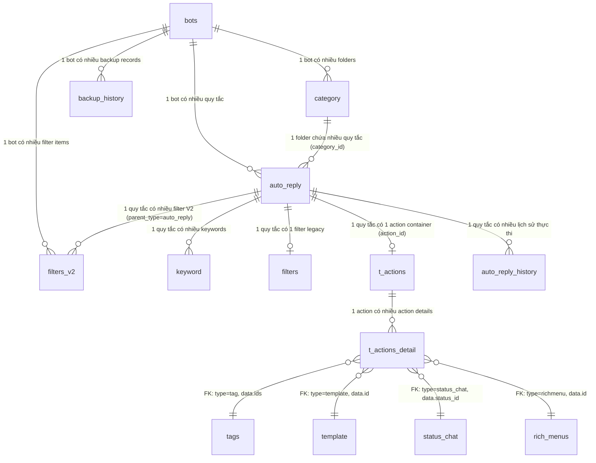

# FA-003 Tự động trả lời「自動応答」— DB Mapping

> Mapping giữa giao diện UI và cơ sở dữ liệu.
> Nguồn: `db/schema/tables/*.sql`, `db/index.md`, `logic-spec.md`, `api-spec.md`, `db-hint.md`.

---

## 1. Tổng quan bảng liên quan

### Primary Tables (trực tiếp — từ Models)

| # | Bảng | Model Laravel | Mô tả | Data size |
|---|------|---------------|-------|-----------|
| 1 | `auto_reply` | `AutoReply` | Bảng chính — lưu quy tắc tự động trả lời | 172KB |
| 2 | `keyword` | `Keyword` | Danh sách keyword gắn với từng quy tắc (1-N) | 49KB |
| 3 | `category` | `Category` | Folder phân loại (kind=1 cho auto-reply) | 509KB |
| 4 | `filters` | `Filter` | Bộ lọc đối tượng legacy (1-1 với auto_reply) | 477KB |
| 5 | `filters_v2` | `FilterV2` | Bộ lọc đối tượng V2 (1-N với auto_reply) | 17.8MB |
| 6 | `t_actions` | `Actions` | Action container — liên kết auto_reply với action details | 8.8MB |
| 7 | `t_actions_detail` | `ActionDetail` | Chi tiết hành động (gửi template, gán tag, v.v.) | 14.7MB |

### Secondary Tables (liên quan gián tiếp — FK, config, log)

| # | Bảng | Vai trò trong auto-reply | Data size |
|---|------|--------------------------|-----------|
| 8 | `bots` | Chủ sở hữu — mọi auto_reply thuộc 1 bot | 440KB |
| 9 | `auto_reply_history` | Lịch sử thực thi auto-reply (reply_id → line_id) | 757KB |
| 10 | `backup_history` | Kiểm tra bot đang backup → chặn mọi thao tác modify | 18KB |
| 11 | `tags` | Tham chiếu từ action details (gán/gỡ tag) | 245KB |
| 12 | `template` | Tham chiếu từ action details (gửi template message) | 1.8MB |
| 13 | `status_chat` | Tham chiếu từ action details (đổi trạng thái đối ứng) | 801KB |
| 14 | `rich_menus` | Tham chiếu từ action details (đổi Rich Menu) | 207KB |

---

## 2. Entity Details

### 2.1 `auto_reply` — Bảng chính quy tắc tự động trả lời

**Model**: `App\AutoReply` (`app/AutoReply.php`)
**Timestamps**: Có (`created_at`, `updated_at`)
**Soft delete**: Có (cột `is_deleted`, không dùng SoftDeletes trait)

| # | Cột | Kiểu DB | Nullable | Default | Key | Mô tả | Tin cậy |
|---|-----|---------|----------|---------|-----|-------|---------|
| 1 | `id` | int(11) | NO | — | PK | ID quy tắc | **Cao** |
| 2 | `bot_id` | int(11) | NO | — | FK → `bots.id` | Bot sở hữu quy tắc | **Cao** |
| 3 | `category_id` | int(11) | NO | — | FK → `category.id` (logic) | Folder chứa quy tắc. `0` = 「未分類」(không tham chiếu record thực) | **Cao** |
| 4 | `keyword_reaction_type` | tinyint(4) | YES | NULL | — | Loại phản ứng keyword: `0` = tất cả tin nhắn, `1` = theo keyword đã cài | **Cao** |
| 5 | `time_reaction_type` | tinyint(4) | YES | NULL | — | Loại phản ứng thời gian: `0` = 24/7, `1` = theo lịch trình | **Cao** |
| 6 | `trigger_kind` | int(11) | NO | — | — | Loại trigger (flow legacy): `0` = keyword, `1` = time | **Cao** |
| 7 | `logical` | int(11) | NO | — | — | Logic keyword: `0` = AND (tất cả phải khớp), `1` = OR (bất kỳ khớp) | **Cao** |
| 8 | `start_time` | time | YES | NULL | — | Giờ bắt đầu phản ứng (HH:mm) — khi `time_reaction_type=1` | **Cao** |
| 9 | `end_time` | time | YES | NULL | — | Giờ kết thúc phản ứng (HH:mm) — khi `time_reaction_type=1` | **Cao** |
| 10 | `day_of_week` | varchar(30) | YES | NULL | — | Ngày trong tuần, phân cách bằng `;`. VD: `"1;2;3;4;5"`. `1`=Thứ 2 → `7`=Chủ nhật | **Cao** |
| 11 | `position` | int(11) | YES | NULL | — | Vị trí sắp xếp trong folder. Tạo mới = max + 1 | **Cao** |
| 12 | `is_stopped` | int(11) | YES | NULL | — | Trạng thái: `0` = đang bật, `1` = đã tắt. Flow V2 luôn reset về `0` khi lưu | **Cao** |
| 13 | `response_number` | int(11) | YES | NULL | — | Số lần phản ứng: `0` = chỉ 1 lần, `1` = nhiều lần | **Cao** |
| 14 | `reply_kind` | int(11) | YES | NULL | — | Loại phản hồi (flow legacy): `0` = none, `1` = text, `2` = template | **Cao** |
| 15 | `reply_content` | text | YES | — | — | Nội dung phản hồi text. **Lưu ý: được base64_encode khi lưu, base64_decode khi đọc** | **Cao** |
| 16 | `action_id` | int(11) | YES | NULL | FK → `t_actions.id` | ID action container (flow V2). Liên kết đến bảng `t_actions` | **Cao** |
| 17 | `scenario_id` | int(11) | YES | NULL | FK → scenarios | ID step delivery (flow legacy) | **Cao** |
| 18 | `scenario_type` | int(11) | YES | 0 | — | Loại chuyển step (legacy): `0` = ngay lập tức, `1` = timer | **Cao** |
| 19 | `scenario_day` | int(11) | YES | 0 | — | Số ngày delay (khi `scenario_type=1`) | **Cao** |
| 20 | `scenario_time` | time | YES | NULL | — | Giờ delay (khi `scenario_type=1`) | **Cao** |
| 21 | `add_tag_ids` | varchar(200) | YES | NULL | — | Danh sách ID tags cần gán, phân cách bằng `,`. VD: `"1,5,12"` (flow legacy) | **Cao** |
| 22 | `remove_tag_ids` | varchar(200) | YES | NULL | — | Danh sách ID tags cần gỡ, phân cách bằng `,` (flow legacy) | **Cao** |
| 23 | `is_deleted` | int(11) | YES | 0 | — | Soft delete: `0` = chưa xóa, `1` = đã xóa | **Cao** |
| 24 | `created_at` | timestamp | NO | CURRENT_TIMESTAMP | — | Ngày tạo | **Cao** |
| 25 | `updated_at` | timestamp | YES | NULL (ON UPDATE) | — | Ngày cập nhật | **Cao** |
| 26 | `is_apply_active_friend` | tinyint(4) | NO | 1 | — | Đối tượng: `1` = bạn bè đang hoạt động, `0` = bạn bè đã block | **Cao** |
| 27 | `is_no_reply_button` | tinyint(4) | YES | 0 | — | `1` = không phản ứng với tin nhắn từ nút reply (quick reply buttons) | **Cao** |

**Indexes** (suy luận từ query patterns):
- PRIMARY KEY (`id`)
- INDEX trên `bot_id` (mọi query đều filter theo bot_id)
- INDEX trên `category_id` (query items theo folder)
- INDEX trên `is_deleted` (filter soft-deleted records)
- **Tin cậy**: **Trung bình** — suy luận từ query patterns, chưa đọc index definition trực tiếp

**Foreign Keys** (logic, không khai báo constraint trong schema):
| FK Column | Tham chiếu | Mô tả |
|-----------|-----------|-------|
| `bot_id` | `bots.id` | Bot sở hữu |
| `category_id` | `category.id` | Folder phân loại (0 = convention, không phải record) |
| `action_id` | `t_actions.id` | Action container (flow V2) |
| `scenario_id` | scenarios table | Step delivery (flow legacy) |

---

### 2.2 `keyword` — Keywords gắn với quy tắc

**Model**: `App\Keyword` (`app/Keyword.php`)
**Timestamps**: Có
**Quan hệ**: N-1 với `auto_reply` (nhiều keywords cho 1 quy tắc)

| # | Cột | Kiểu DB | Nullable | Default | Key | Mô tả | Tin cậy |
|---|-----|---------|----------|---------|-----|-------|---------|
| 1 | `id` | int(11) | NO | — | PK | ID keyword | **Cao** |
| 2 | `auto_reply_id` | int(11) | NO | — | FK → `auto_reply.id` | Quy tắc sở hữu keyword | **Cao** |
| 3 | `keyword` | varchar(200) | NO | — | — | Nội dung keyword. **Duy nhất trong toàn bot** (cross auto-reply) | **Cao** |
| 4 | `logical` | int(11) | YES | NULL | — | Loại so khớp: `0` = 完全一致 (exact match), `1` = 部分一致 (partial match) | **Cao** |
| 5 | `created_at` | timestamp | NO | CURRENT_TIMESTAMP | — | Ngày tạo | **Cao** |
| 6 | `updated_at` | timestamp | YES | NULL (ON UPDATE) | — | Ngày cập nhật | **Cao** |

**Indexes** (suy luận):
- PRIMARY KEY (`id`)
- INDEX trên `auto_reply_id` (JOIN query)

**Lưu ý**: Keywords bị **hard delete** khi xóa quy tắc hoặc folder (khác với auto_reply dùng soft delete).

---

### 2.3 `category` — Folder phân loại

**Model**: `App\Category` (`app/Category.php`)
**Timestamps**: Có
**Soft delete**: Có (cột `is_deleted`)
**Dùng chung**: Nhiều tính năng (tags, template, URL, landing, scenario, rich menus...) — phân biệt bằng cột `kind`

| # | Cột | Kiểu DB | Nullable | Default | Key | Mô tả | Tin cậy |
|---|-----|---------|----------|---------|-----|-------|---------|
| 1 | `id` | int(11) | NO | — | PK | ID folder | **Cao** |
| 2 | `bot_id` | int(11) | NO | — | FK → `bots.id` | Bot sở hữu | **Cao** |
| 3 | `kind` | int(11) | NO | — | — | Loại folder: **`1` = auto-reply**. Xem bảng Kind values | **Cao** |
| 4 | `name` | varchar(100) | NO | — | — | Tên folder | **Cao** |
| 5 | `position` | int(11) | YES | NULL | — | Vị trí sắp xếp | **Cao** |
| 6 | `is_deleted` | int(11) | YES | 0 | — | Soft delete: `0` = chưa xóa, `1` = đã xóa | **Cao** |
| 7 | `created_at` | timestamp | NO | CURRENT_TIMESTAMP | — | Ngày tạo | **Cao** |
| 8 | `updated_at` | timestamp | YES | NULL (ON UPDATE) | — | Ngày cập nhật | **Cao** |
| 9 | `category_id_old` | int(11) | NO | -1 | — | ID category cũ (migration data) | **Cao** |

**Category Kind values** (từ `config/sns-line.php`):

| Kind | Giá trị | Mô tả |
|------|---------|-------|
| tag | 0 | Folder tags |
| **reply** | **1** | **Folder auto-reply** |
| template | 2 | Folder templates |
| url | 3 | Folder URLs |
| landing | 10 | Folder landing pages |
| scenario | 11 | Folder scenarios |
| information_friend | 12 | Folder friend information |
| event_booking | 13 | Folder event booking |
| rich_menus | 17 | Folder rich menus |
| action_schedule | 20 | Folder action schedule |

**Lưu ý**: `category_id=0` trong `auto_reply` là folder mặc định「未分類」— **không phải record** trong bảng `category`, chỉ là convention.

---

### 2.4 `filters` — Bộ lọc đối tượng (Legacy)

**Model**: `App\Filter` (`app/Filter.php`)
**Timestamps**: Có
**Quan hệ**: 1-1 với `auto_reply` (qua `auto_reply_id`)
**Lưu ý**: Đây là hệ thống filter **cũ**. Flow V2 dùng `filters_v2`.

| # | Cột | Kiểu DB | Nullable | Default | Key | Mô tả | Tin cậy |
|---|-----|---------|----------|---------|-----|-------|---------|
| 1 | `id` | int(11) | NO | — | PK | ID filter | **Cao** |
| 2 | `auto_reply_id` | int(11) | YES | NULL | FK → `auto_reply.id` | Quy tắc liên quan | **Cao** |
| 3 | `broadcast_id` | int(11) | YES | NULL | FK → broadcasts | Broadcast liên quan (không dùng cho auto-reply) | **Cao** |
| 4 | `sms_schedule_id` | int(11) | YES | NULL | FK → sms_schedules | SMS schedule liên quan (không dùng cho auto-reply) | **Cao** |
| 5 | `name_filter` | text | YES | NULL | — | Tên bạn bè cần lọc | **Cao** |
| 6 | `name_filter_type` | varchar(20) | YES | NULL | — | Loại lọc tên | **Cao** |
| 7 | `tag_filter` | varchar(200) | YES | NULL | — | Danh sách tag IDs (CSV) | **Cao** |
| 8 | `tag_filter_option` | int(11) | YES | NULL | — | Logic tag: AND/OR | **Cao** |
| 9 | `from_date_filter` | date | YES | NULL | — | Ngày bắt đầu (ngày thêm bạn bè) | **Cao** |
| 10 | `to_date_filter` | date | YES | NULL | — | Ngày kết thúc | **Cao** |
| 11 | `scenario_filter` | int(11) | YES | NULL | — | Scenario ID filter | **Cao** |
| 12 | `scenario_filter_option` | int(11) | YES | NULL | — | Logic scenario | **Cao** |
| 13 | `scenario_start_day_filter` | int(11) | YES | NULL | — | Ngày bắt đầu scenario filter | **Cao** |
| 14 | `conversion_filter` | varchar(200) | YES | NULL | — | Conversion IDs (CSV) | **Cao** |
| 15 | `conversion_filter_option` | int(11) | YES | NULL | — | Logic conversion | **Cao** |
| 16 | `mark_filter` | varchar(20) | YES | NULL | — | Bookmark filter | **Cao** |
| 17 | `filter_preview_content` | text | YES | NULL | — | Nội dung preview hiển thị trên UI | **Cao** |
| 18 | `created_at` | datetime | NO | CURRENT_TIMESTAMP | — | Ngày tạo | **Cao** |
| 19 | `updated_at` | datetime | NO | (ON UPDATE) | — | Ngày cập nhật | **Cao** |

---

### 2.5 `filters_v2` — Bộ lọc đối tượng V2

**Model**: `App\FilterV2` (`app/FilterV2.php`)
**Timestamps**: Có
**Quan hệ**: N-1 với auto_reply (nhiều filter items cho 1 quy tắc, qua `parent_type='auto_reply'` + `parent_id`)
**Dùng chung**: Nhiều tính năng (broadcast, modal_action, v.v.) — phân biệt bằng `parent_type`

| # | Cột | Kiểu DB | Nullable | Default | Key | Mô tả | Tin cậy |
|---|-----|---------|----------|---------|-----|-------|---------|
| 1 | `id` | int(10) unsigned | NO | — | PK | ID filter item | **Cao** |
| 2 | `bot_id` | int(11) | YES | NULL | FK → `bots.id` | Bot sở hữu | **Cao** |
| 3 | `parent_type` | varchar(255) | YES | NULL | — | Loại đối tượng cha: `'auto_reply'`, `'broadcast'`, `'modal_action'`... | **Cao** |
| 4 | `parent_id` | int(11) | YES | NULL | — | ID đối tượng cha (= `auto_reply.id` khi `parent_type='auto_reply'`) | **Cao** |
| 5 | `operator` | varchar(100) | YES | NULL | — | Toán tử logic: `'and'` hoặc `'or'` | **Cao** |
| 6 | `type` | varchar(255) | YES | NULL | — | Loại filter: xem bảng Filter Types | **Cao** |
| 7 | `data` | text | YES | — | — | Dữ liệu filter chi tiết (JSON) — cấu trúc khác nhau theo `type` | **Cao** |
| 8 | `text_preview` | text | YES | — | — | Nội dung preview hiển thị trên UI | **Cao** |
| 9 | `created_at` | timestamp | NO | CURRENT_TIMESTAMP | — | Ngày tạo | **Cao** |
| 10 | `updated_at` | timestamp | NO | CURRENT_TIMESTAMP (ON UPDATE) | — | Ngày cập nhật | **Cao** |
| 11 | `rich_menu_item_id` | int(11) | YES | NULL | — | ID rich menu item (nullable) | **Cao** |
| 12 | `rich_menu_redirect_id` | int(11) | YES | NULL | — | ID rich menu redirect (nullable) | **Cao** |

**11 loại Filter Types** (từ logic-spec):

| Type | Mô tả | Data fields chính (JSON) |
|------|-------|--------------------------|
| `tag` | Lọc theo tag | `tags_search` (array IDs), `tag_option` (and/or) |
| `name` | Lọc theo tên bạn bè | `name_filter`, `name_filter_type` |
| `day_add_friend` | Lọc theo ngày thêm bạn bè | `day_filter_type` (0=khoảng thời gian, 1=số ngày), `modal_from_filter`, `modal_to_filter`, `duration_day_start`, `duration_day_end` |
| `scenario` | Lọc theo step subscription | `scenario_search` (ID), `scenario_option` |
| `qr_code` / `qr_code_action` | Lọc theo QR code | `qrs_search` (array IDs), `qr_option` |
| `conversion` | Lọc theo conversion | `conversion_search` (CSV IDs), `conversion_option` |
| `friend_info` | Lọc theo thông tin bạn bè | `friend_info_id`, `friend_info_type`, `value`, `limit_date`... |
| `mark` | Lọc theo bookmark | `mark_option` |
| `new_old_friend` | Lọc bạn bè mới/cũ | `new_old_option` |
| `status_chat` | Lọc theo trạng thái đối ứng | `status_chat_id` |
| `affiliater` | Lọc theo nguồn giới thiệu | `affiliater_id` |

---

### 2.6 `t_actions` — Action container

**Model**: `App\Actions` (`app/Actions.php`)
**Timestamps**: Có
**Quan hệ**: 1-1 với auto_reply (qua `auto_reply.action_id`), 1-N với `t_actions_detail`
**Dùng chung**: Nhiều tính năng (template, scenario, v.v.) — phân biệt bằng `type`

| # | Cột | Kiểu DB | Nullable | Default | Key | Mô tả | Tin cậy |
|---|-----|---------|----------|---------|-----|-------|---------|
| 1 | `id` | int(10) unsigned | NO | — | PK | ID action | **Cao** |
| 2 | `parent_id` | int(11) | NO | — | — | ID đối tượng cha (giá trị tùy context, không dùng FK constraint) | **Trung bình** |
| 3 | `type` | varchar(255) | NO | — | — | Loại action container (VD: `'auto_reply'`, `'template'`...) | **Trung bình** |
| 4 | `update_timestamp` | bigint(20) | NO | — | — | Timestamp cập nhật (dạng Unix epoch) | **Cao** |
| 5 | `created_at` | timestamp | NO | CURRENT_TIMESTAMP | — | Ngày tạo | **Cao** |
| 6 | `updated_at` | timestamp | NO | CURRENT_TIMESTAMP (ON UPDATE) | — | Ngày cập nhật | **Cao** |

---

### 2.7 `t_actions_detail` — Chi tiết hành động

**Model**: `App\ActionDetail` (`app/ActionDetail.php`)
**Timestamps**: Có
**Quan hệ**: N-1 với `t_actions` (nhiều details cho 1 action)

| # | Cột | Kiểu DB | Nullable | Default | Key | Mô tả | Tin cậy |
|---|-----|---------|----------|---------|-----|-------|---------|
| 1 | `id` | int(10) unsigned | NO | — | PK | ID action detail | **Cao** |
| 2 | `action_id` | int(11) | NO | — | FK → `t_actions.id` | Action container sở hữu | **Cao** |
| 3 | `bot_id` | int(11) | YES | NULL | FK → `bots.id` | Bot sở hữu | **Cao** |
| 4 | `type` | varchar(255) | NO | — | — | Loại hành động: xem bảng Action Types | **Cao** |
| 5 | `data` | text | NO | — | — | Dữ liệu chi tiết (JSON) — cấu trúc khác nhau theo `type` | **Cao** |
| 6 | `embed_regex_text` | varchar(255) | YES | NULL | — | Regex text nhúng (cho text type) | **Trung bình** |
| 7 | `has_filters` | tinyint(4) | NO | 0 | — | `1` = action detail có filter riêng (bảng `filters_v2`) | **Cao** |
| 8 | `update_timestamp` | bigint(20) | NO | — | — | Timestamp cập nhật | **Cao** |
| 9 | `created_at` | timestamp | NO | CURRENT_TIMESTAMP | — | Ngày tạo | **Cao** |
| 10 | `updated_at` | timestamp | NO | CURRENT_TIMESTAMP (ON UPDATE) | — | Ngày cập nhật | **Cao** |

**10 loại Action Types** (tương ứng SCR-RPL-04):

| Type | Mô tả JP | Mô tả | Data structure (JSON) | Tin cậy |
|------|----------|-------|----------------------|---------|
| `scenario` / `step` | 「ステップ」 | Thêm vào/chuyển step delivery | `{id: scenario_id, type: 'emergency'/'timer', day: N, time: 'HH:mm'}` | **Trung bình** |
| `template` | 「テンプレート」 | Gửi template message | `{id: template_id}` | **Trung bình** |
| `text` | 「テキスト」 | Gửi tin nhắn text | `{content: "text message"}` | **Trung bình** |
| `remind` | 「リマインド」 | Thiết lập reminder | `{event_id: N}` | **Trung bình** |
| `tag` | 「タグ」 | Gán/gỡ tag | `{ids: [tag_ids], action: 'add'/'remove'}` | **Trung bình** |
| `richmenu` | 「リッチメニュー」 | Đổi Rich Menu | `{id: richmenu_id}` | **Trung bình** |
| `bookmark` | 「ブックマーク」 | Gán bookmark | `{mark: 0/1}` | **Trung bình** |
| `friend_info` | 「友だち情報」 | Cập nhật thông tin bạn bè | `{friend_info_id: N, type: N, action: N, value: "..."}` | **Trung bình** |
| `status_chat` | 「対応ステータス」 | Đổi trạng thái đối ứng | `{status_id: N}` | **Trung bình** |
| `block` | 「ブロック」 | Block bạn bè | `{block: true}` | **Trung bình** |

> **Ghi chú Tin cậy**: Data structure suy luận từ `Actions::initDataAction()` — **Trung bình** vì là reverse-engineer từ code đọc data, không phải code ghi data.

---

### 2.8 `auto_reply_history` — Lịch sử thực thi

| # | Cột | Kiểu DB | Nullable | Default | Key | Mô tả | Tin cậy |
|---|-----|---------|----------|---------|-----|-------|---------|
| 1 | `id` | int(11) | NO | — | PK | ID record | **Cao** |
| 2 | `reply_id` | int(11) | NO | — | FK → `auto_reply.id` | Quy tắc đã được thực thi | **Cao** |
| 3 | `line_id` | int(11) | NO | — | FK → line_users | LINE user đã trigger quy tắc | **Cao** |
| 4 | `created_at` | timestamp | NO | CURRENT_TIMESTAMP | — | Thời điểm thực thi | **Cao** |
| 5 | `updated_at` | timestamp | YES | NULL (ON UPDATE) | — | Ngày cập nhật | **Cao** |

> **Ghi chú**: Bảng này dùng để theo dõi quy tắc nào đã được thực thi cho LINE user nào. Kết hợp với `response_number` (chỉ 1 lần / nhiều lần) để quyết định có thực thi lại không. **Tin cậy**: **Trung bình** — suy luận từ cấu trúc bảng và tên cột.

---

### 2.9 `backup_history` — Lịch sử backup

| # | Cột | Kiểu DB | Nullable | Default | Key | Mô tả | Tin cậy |
|---|-----|---------|----------|---------|-----|-------|---------|
| 1 | `id` | int(10) unsigned | NO | — | PK | ID record | **Cao** |
| 2 | `bot_id` | int(11) | NO | — | FK → `bots.id` | Bot đang backup | **Cao** |
| 3 | `code` | varchar(255) | NO | — | — | Mã backup | **Cao** |
| 4 | `line_account` | varchar(255) | NO | — | — | LINE account liên quan | **Cao** |
| 5 | `status` | int(11) | NO | 0 | — | `0`: Waiting, `1`: Doing, `2`: Done, `3`: Failure | **Cao** |
| 6 | `created_at` | timestamp | NO | CURRENT_TIMESTAMP | — | Ngày tạo | **Cao** |
| 7 | `updated_at` | timestamp | NO | CURRENT_TIMESTAMP (ON UPDATE) | — | Ngày cập nhật | **Cao** |

> **Vai trò trong auto-reply**: Khi `status` = 0 (Waiting) hoặc 1 (Doing), mọi thao tác modify (tạo/sửa/xóa quy tắc, folder) bị chặn với lỗi 500.

---

## 3. UI ↔ DB Field Mapping

### 3.1 SCR-RPL-01: Danh sách tự động trả lời

#### Table Columns

| # | UI Element | Label JP | DB Table | Column(s) | Mapping Type | Tin cậy | Ghi chú |
|---|-----------|----------|----------|-----------|-------------|---------|---------|
| 1 | Ngày tạo | 「作成日」 | `auto_reply` | `created_at` | Direct | **Cao** | Format hiển thị: `YYYY.MM.DD` |
| 2 | Trạng thái bật/tắt | 「稼働状況」 | `auto_reply` | `is_stopped` | Enum | **Cao** | `0` → ON (bật), `1` → OFF (tắt) |
| 3 | Keyword | 「キーワード」 | `keyword` | `keyword` | FK (JOIN) | **Cao** | JOIN `keyword` ON `auto_reply_id`. Hiển thị concatenated |
| 4 | Lịch trình | 「スケジュール」 | `auto_reply` | `day_of_week`, `start_time`, `end_time`, `keyword_reaction_type`, `time_reaction_type` | Computed | **Cao** | Tính từ nhiều cột. VD: "月,火,水 09:00~18:00" hoặc "常に（24/365）" |

#### Sidebar — Folder

| # | UI Element | Label JP | DB Table | Column(s) | Mapping Type | Tin cậy | Ghi chú |
|---|-----------|----------|----------|-----------|-------------|---------|---------|
| 1 | Tên folder | — | `category` | `name` | Direct | **Cao** | Filter: `kind=1`, `is_deleted=0`, `bot_id=current` |
| 2 | Folder mặc định | 「未分類」 | — | — | Convention | **Cao** | `category_id=0`, không có record trong DB |
| 3 | Số quy tắc trong folder | (count) | `auto_reply` | COUNT(*) | Aggregated | **Cao** | `COUNT(auto_reply WHERE category_id=X AND is_deleted=0)` |

#### Action Outcomes

| # | Action | Label JP | DB Table | Column(s) | Thao tác | Tin cậy |
|---|--------|----------|----------|-----------|----------|---------|
| 1 | Tạo mới | 「新規作成」 | `auto_reply` | * | INSERT | **Cao** |
| 2 | Xóa hàng loạt | 「一括削除」 | `auto_reply`, `keyword` | `is_deleted`, * | auto_reply: soft delete (`is_deleted=1`), keyword: hard delete | **Cao** |
| 3 | Đổi folder hàng loạt | 「一括フォルダ変更」 | `auto_reply` | `category_id`, `position` | UPDATE | **Cao** |
| 4 | Sắp xếp | 「並べ替え」 | `auto_reply` | `position` | UPDATE | **Cao** |
| 5 | Bật quy tắc | — | `auto_reply` | `is_stopped` | UPDATE → `0` | **Cao** |
| 6 | Tắt quy tắc | — | `auto_reply` | `is_stopped` | UPDATE → `1` | **Cao** |

---

### 3.2 SCR-RPL-02: Form tạo mới / chỉnh sửa

#### Phần 1: Lọc đối tượng —「アクション稼働対象絞り込み」

| # | UI Element | Label JP | DB Table | Column(s) | Mapping Type | Tin cậy | Ghi chú |
|---|-----------|----------|----------|-----------|-------------|---------|---------|
| 1 | Đối tượng active/block | 「有効友だち」/「ブロックした友だち」 | `auto_reply` | `is_apply_active_friend` | Enum | **Cao** | `1` = 有効友だち, `0` = ブロックした友だち |
| 2 | Số người phù hợp | 「対象人数」 | — | — | Computed (realtime) | **Cao** | Tính qua EP-15 (query `line_user` + `bot_line_user`), không lưu DB |
| 3 | Tóm tắt điều kiện lọc | 「対象条件」 | `filters_v2` | `text_preview` | Direct | **Cao** | Flow V2: concatenate `text_preview` của các filter items |
| 3b | Tóm tắt điều kiện (legacy) | 「対象条件」 | `filters` | `filter_preview_content` | Direct | **Cao** | Flow legacy: cột chuyên dụng |

#### Phần 2: Folder

| # | UI Element | Label JP | DB Table | Column(s) | Mapping Type | Tin cậy | Ghi chú |
|---|-----------|----------|----------|-----------|-------------|---------|---------|
| 1 | Dropdown folder | 「フォルダ」 | `auto_reply` | `category_id` | FK | **Cao** | FK logic → `category.id` (kind=1). `0` = 「未分類」 |

#### Phần 3: Keyword

| # | UI Element | Label JP | DB Table | Column(s) | Mapping Type | Tin cậy | Ghi chú |
|---|-----------|----------|----------|-----------|-------------|---------|---------|
| 1 | Cài đặt sử dụng | 「利用設定」 | `auto_reply` | `keyword_reaction_type` | Enum | **Cao** | `0` = 全てのメッセージに反応, `1` = 設定したキーワードに反応 |
| 2 | Checkbox bỏ qua reply button | 「【〇〇】のメッセージには反応させない」 | `auto_reply` | `is_no_reply_button` | Direct (Boolean) | **Cao** | `0` = unchecked, `1` = checked. 〇〇 = nút reply (không phải tên bot) |
| 3 | Điều kiện phản ứng | 「反応条件」 | `auto_reply` | `logical` | Enum | **Cao** | `0` = AND (全てのキーワードに当てはまる時), `1` = OR (どれか1つのキーワードに当てはまる時) |
| 4 | Nội dung keyword | 「キーワード」(text) | `keyword` | `keyword` | Direct | **Cao** | 1 quy tắc có thể có nhiều keywords (bảng con) |
| 5 | Loại so khớp | 「キーワード」(match type) | `keyword` | `logical` | Enum | **Cao** | `0` = 完全一致 (exact), `1` = 部分一致 (partial) |

#### Phần 4: Lịch trình

| # | UI Element | Label JP | DB Table | Column(s) | Mapping Type | Tin cậy | Ghi chú |
|---|-----------|----------|----------|-----------|-------------|---------|---------|
| 1 | Cài đặt phản ứng | 「反応設定」 | `auto_reply` | `time_reaction_type` | Enum | **Cao** | `0` = 常に（24/365）, `1` = 反応する曜日・時間を設定する |
| 2 | Ngày trong tuần | 「曜日設定」 | `auto_reply` | `day_of_week` | Direct (serialized) | **Cao** | Lưu dạng string phân cách `;`. VD: `"1;2;3;4;5"`. Giá trị: 1=月 → 7=日 |
| 3 | Giờ bắt đầu | 「時間帯設定」(từ) | `auto_reply` | `start_time` | Direct | **Cao** | Kiểu `time`, format HH:mm |
| 4 | Giờ kết thúc | 「時間帯設定」(đến) | `auto_reply` | `end_time` | Direct | **Cao** | Kiểu `time`, format HH:mm. Phải > start_time |

#### Phần 5: Hành động

| # | UI Element | Label JP | DB Table | Column(s) | Mapping Type | Tin cậy | Ghi chú |
|---|-----------|----------|----------|-----------|-------------|---------|---------|
| 1 | Số lần phản ứng | 「1度のみ」/「何度でも」 | `auto_reply` | `response_number` | Enum | **Cao** | `0` = 1度のみアクション稼働, `1` = 何度でもアクション稼働 |
| 2 | Action container | (ẩn) | `auto_reply` | `action_id` | FK | **Cao** | FK → `t_actions.id`. Flow V2 sử dụng action system |
| 3 | Chi tiết hành động | (modal SCR-RPL-04) | `t_actions_detail` | `type`, `data` | FK (nested) | **Cao** | Xem SCR-RPL-04 bên dưới |

#### Fields chỉ Flow Legacy (EP-04, EP-05)

| # | UI Element | DB Table | Column(s) | Mapping Type | Tin cậy | Ghi chú |
|---|-----------|----------|-----------|-------------|---------|---------|
| 1 | Loại trigger | `auto_reply` | `trigger_kind` | Enum | **Cao** | `0` = keyword, `1` = time |
| 2 | Loại reply | `auto_reply` | `reply_kind` | Enum | **Cao** | `0` = none, `1` = text, `2` = template |
| 3 | Nội dung text reply | `auto_reply` | `reply_content` | Direct (encoded) | **Cao** | base64_encode khi lưu |
| 4 | Template ID | `auto_reply` | (legacy lưu trong `reply_content`) | FK | **Trung bình** | `egg_id` → lưu vào `reply_content` khi `reply_kind=2` |
| 5 | Scenario | `auto_reply` | `scenario_id`, `scenario_type`, `scenario_day`, `scenario_time` | FK + Direct | **Cao** | — |
| 6 | Tags gán | `auto_reply` | `add_tag_ids` | Direct (CSV) | **Cao** | Phân cách bằng `,` |
| 7 | Tags gỡ | `auto_reply` | `remove_tag_ids` | Direct (CSV) | **Cao** | Phân cách bằng `,` |

---

### 3.3 SCR-RPL-03: Modal Filter —「絞り込み」

| # | Filter Type JP | DB Table | Column(s) | Mapping Type | Tin cậy | Ghi chú |
|---|---------------|----------|-----------|-------------|---------|---------|
| 1 | 「タグ」 | `filters_v2` | `type='tag'`, `data` JSON | FK (nested) | **Cao** | `data.tags_search` → array tag IDs |
| 2 | 「友だち名」 | `filters_v2` | `type='name'`, `data` JSON | Direct | **Cao** | `data.name_filter`, `data.name_filter_type` |
| 3 | 「友だち追加日」 | `filters_v2` | `type='day_add_friend'`, `data` JSON | Direct | **Cao** | `data.day_filter_type`, `data.modal_from_filter`, `data.modal_to_filter` |
| 4 | 「ステップ購読状況」 | `filters_v2` | `type='scenario'`, `data` JSON | FK (nested) | **Cao** | `data.scenario_search` → scenario ID |
| 5 | 「QRコードアクション」 | `filters_v2` | `type='qr_code'`, `data` JSON | FK (nested) | **Cao** | `data.qrs_search` → array QR code IDs |
| 6 | 「コンバージョン」 | `filters_v2` | `type='conversion'`, `data` JSON | FK (nested) | **Cao** | `data.conversion_search` → CSV conversion IDs |
| 7 | 「確認状況」 | — | — | — | **Thấp** | Không tìm thấy filter type tương ứng trong FilterV2. Có thể chỉ có trong flow legacy |
| 8 | 「友だち情報」 | `filters_v2` | `type='friend_info'`, `data` JSON | FK (nested) | **Cao** | `data.friend_info_id`, `data.value` |
| 9 | 「対応ステータス」 | `filters_v2` | `type='status_chat'`, `data` JSON | FK (nested) | **Cao** | `data.status_chat_id` → `status_chat.id` |
| 10 | 「アフィリエイター」 | `filters_v2` | `type='affiliater'`, `data` JSON | FK (nested) | **Cao** | `data.affiliater_id` |
| 11 | 「新規・既存 友だち」 | `filters_v2` | `type='new_old_friend'`, `data` JSON | Enum | **Cao** | `data.new_old_option` |
| — | Logic AND | `filters_v2` | `operator='and'` | Direct | **Cao** | Tất cả filter items với `operator='and'` |
| — | Logic OR | `filters_v2` | `operator='or'` | Direct | **Cao** | Tất cả filter items với `operator='or'` |

**Filter Legacy (bảng `filters`) — tương ứng flow cũ:**

| # | Filter Type | DB Column | Mapping | Tin cậy |
|---|------------|-----------|---------|---------|
| 1 | Tag | `tag_filter` (CSV IDs), `tag_filter_option` (AND/OR) | Direct | **Cao** |
| 2 | Tên bạn bè | `name_filter`, `name_filter_type` | Direct | **Cao** |
| 3 | Ngày thêm bạn bè | `from_date_filter`, `to_date_filter` | Direct | **Cao** |
| 4 | Scenario | `scenario_filter`, `scenario_filter_option` | Direct | **Cao** |
| 5 | Conversion | `conversion_filter`, `conversion_filter_option` | Direct | **Cao** |
| 6 | Bookmark | `mark_filter` | Direct | **Cao** |
| 7 | Preview | `filter_preview_content` | Direct | **Cao** |

---

### 3.4 SCR-RPL-04: Modal Action —「アクション」

| # | Action Type JP | DB Table | Column `type` | Data (JSON) | Mapping Type | Tin cậy |
|---|---------------|----------|---------------|-------------|-------------|---------|
| 1 | 「ステップ」 | `t_actions_detail` | `scenario` / `step` | `{id: scenario_id, type, day, time}` | FK (nested) | **Trung bình** |
| 2 | 「テンプレート」 | `t_actions_detail` | `template` | `{id: template_id}` | FK (nested) | **Trung bình** |
| 3 | 「テキスト」 | `t_actions_detail` | `text` | `{content: "..."}` | Direct (nested) | **Trung bình** |
| 4 | 「リマインド」 | `t_actions_detail` | `remind` | `{event_id: N}` | FK (nested) | **Trung bình** |
| 5 | 「タグ」 | `t_actions_detail` | `tag` | `{ids: [...], action: 'add'/'remove'}` | FK (nested) | **Trung bình** |
| 6 | 「リッチメニュー」 | `t_actions_detail` | `richmenu` | `{id: richmenu_id}` | FK (nested) | **Trung bình** |
| 7 | 「ブックマーク」 | `t_actions_detail` | `bookmark` | `{mark: 0/1}` | Direct (nested) | **Trung bình** |
| 8 | 「友だち情報」 | `t_actions_detail` | `friend_info` | `{friend_info_id, type, action, value}` | FK (nested) | **Trung bình** |
| 9 | 「対応ステータス」 | `t_actions_detail` | `status_chat` | `{status_id: N}` | FK (nested) | **Trung bình** |
| 10 | 「ブロック」 | `t_actions_detail` | `block` | `{block: true}` | Direct (nested) | **Trung bình** |

> **Ghi chú Tin cậy**: Data structure suy luận từ `Actions::initDataAction()` (code đọc data). Cấu trúc chính xác có thể có thêm fields.

---

## 4. Enum / Status Values

### 4.1 `auto_reply.is_stopped`

| DB Value | UI Display | Mô tả |
|----------|-----------|-------|
| `0` | ON (bật) | Quy tắc đang hoạt động |
| `1` | OFF (tắt) | Quy tắc đã tắt |

### 4.2 `auto_reply.keyword_reaction_type`

| DB Value | UI Display JP | Mô tả |
|----------|--------------|-------|
| `0` | 「全てのメッセージに反応」 | Phản ứng với tất cả tin nhắn |
| `1` | 「設定したキーワードに反応」 | Phản ứng theo keyword đã cài đặt |

### 4.3 `auto_reply.time_reaction_type`

| DB Value | UI Display JP | Mô tả |
|----------|--------------|-------|
| `0` | 「常に（24時間/365日）反応する」 | Phản ứng 24/7 |
| `1` | 「反応する曜日・時間を設定する」 | Theo lịch trình |

### 4.4 `auto_reply.logical` (và `keyword.logical`)

**Trong `auto_reply`:**

| DB Value | UI Display JP | Mô tả |
|----------|--------------|-------|
| `0` | 「全てのキーワードに当てはまる時に反応」 | AND — tất cả phải khớp |
| `1` | 「どれか1つのキーワードに当てはまる時に反応」 | OR — bất kỳ khớp |

**Trong `keyword`:**

| DB Value | UI Display JP | Mô tả |
|----------|--------------|-------|
| `0` | 「完全一致」 | Exact match |
| `1` | 「部分一致」 | Partial match |

### 4.5 `auto_reply.response_number`

| DB Value | UI Display JP | Mô tả |
|----------|--------------|-------|
| `0` | 「1度のみアクション稼働」 | Chỉ phản ứng 1 lần |
| `1` | 「何度でもアクション稼働」 | Phản ứng nhiều lần |

### 4.6 `auto_reply.is_apply_active_friend`

| DB Value | UI Display JP | Mô tả |
|----------|--------------|-------|
| `1` | 「有効友だち」 | Bạn bè đang hoạt động |
| `0` | 「ブロックした友だち」 | Bạn bè đã block |

### 4.7 `auto_reply.reply_kind` (flow legacy)

| DB Value | Mô tả |
|----------|-------|
| `0` | Không có reply |
| `1` | Reply bằng text (reply_content = base64 encoded) |
| `2` | Reply bằng template (reply_content = template ID) |

### 4.8 `auto_reply.trigger_kind` (flow legacy)

| DB Value | Mô tả |
|----------|-------|
| `0` | Trigger bằng keyword |
| `1` | Trigger bằng thời gian |

### 4.9 `auto_reply.scenario_type` (flow legacy)

| DB Value | Mô tả |
|----------|-------|
| `0` | Emergency — chuyển step ngay lập tức |
| `1` | Timer — chuyển step sau khoảng thời gian |

### 4.10 `auto_reply.is_deleted`

| DB Value | Mô tả |
|----------|-------|
| `0` | Chưa xóa (active) |
| `1` | Đã xóa (soft delete) |

### 4.11 `auto_reply.is_no_reply_button`

| DB Value | UI Display JP | Mô tả |
|----------|--------------|-------|
| `0` | Unchecked | Phản ứng bình thường |
| `1` | Checked「〇〇のメッセージには反応させない」 | Không phản ứng tin nhắn từ nút reply |

### 4.12 `category.kind` (liên quan auto-reply)

| DB Value | Loại | Mô tả |
|----------|------|-------|
| `1` | reply | Folder auto-reply |

### 4.13 `filters_v2.operator`

| DB Value | Mô tả |
|----------|-------|
| `'and'` | Điều kiện AND (tất cả phải thỏa mãn) |
| `'or'` | Điều kiện OR (bất kỳ thỏa mãn) |

### 4.14 `backup_history.status`

| DB Value | Mô tả |
|----------|-------|
| `0` | Waiting — chặn modify |
| `1` | Doing — chặn modify |
| `2` | Done — cho phép modify |
| `3` | Failure — cho phép modify |

### 4.15 `auto_reply.day_of_week` (giá trị trong chuỗi)

| DB Value | UI Display JP | Mô tả |
|----------|--------------|-------|
| `1` | 月 | Thứ 2 |
| `2` | 火 | Thứ 3 |
| `3` | 水 | Thứ 4 |
| `4` | 木 | Thứ 5 |
| `5` | 金 | Thứ 6 |
| `6` | 土 | Thứ 7 |
| `7` | 日 | Chủ nhật |

> Format lưu: phân cách bằng `;`. VD: `"1;2;3;4;5"` = thứ 2 đến thứ 6.

---

## 5. Unmapped Items

### 5.1 UI Fields không tìm thấy DB match

| # | UI Element | Screen | Lý do | Tin cậy |
|---|-----------|--------|-------|---------|
| 1 | 「対象人数」(số người phù hợp) | SCR-RPL-02 | Giá trị tính realtime qua EP-15, query `line_user` + `bot_line_user`, **không lưu DB** | **Cao** |
| 2 | 「確認状況」(filter type) | SCR-RPL-03 | Không tìm thấy filter type tương ứng trong `filters_v2`. Có thể chỉ tồn tại trong flow legacy hoặc đã bị loại bỏ | **Thấp** |

### 5.2 DB Columns không xuất hiện trực tiếp trên UI

| # | Bảng | Cột | Mô tả | Lý do |
|---|------|-----|-------|-------|
| 1 | `auto_reply` | `trigger_kind` | Loại trigger legacy | Chỉ dùng trong flow legacy (EP-04/05). Flow V2 dùng `keyword_reaction_type` + `time_reaction_type` |
| 2 | `auto_reply` | `reply_kind` | Loại reply legacy | Chỉ dùng trong flow legacy. Flow V2 dùng action system (`t_actions` + `t_actions_detail`) |
| 3 | `auto_reply` | `reply_content` | Nội dung reply legacy | Chỉ dùng trong flow legacy. Flow V2 lưu qua `t_actions_detail` type=text/template |
| 4 | `auto_reply` | `scenario_id`, `scenario_type`, `scenario_day`, `scenario_time` | Step delivery legacy | Chỉ dùng trong flow legacy. Flow V2 lưu qua `t_actions_detail` type=scenario |
| 5 | `auto_reply` | `add_tag_ids`, `remove_tag_ids` | Tags gán/gỡ legacy | Chỉ dùng trong flow legacy. Flow V2 lưu qua `t_actions_detail` type=tag |
| 6 | `auto_reply` | `position` | Vị trí sắp xếp | Dùng nội bộ (sort order), không hiển thị trực tiếp. Ảnh hưởng thứ tự danh sách |
| 7 | `auto_reply` | `is_deleted` | Soft delete flag | Dùng nội bộ (filter records đã xóa), không hiển thị |
| 8 | `category` | `category_id_old` | ID cũ (migration) | Dữ liệu migration, không liên quan UI |
| 9 | `t_actions` | `parent_id` | ID đối tượng cha | Dùng nội bộ, không hiển thị trên UI |
| 10 | `t_actions` | `update_timestamp` | Timestamp cập nhật | Dùng nội bộ |
| 11 | `t_actions_detail` | `embed_regex_text` | Regex text nhúng | Chức năng nâng cao, không rõ hiển thị UI |
| 12 | `t_actions_detail` | `update_timestamp` | Timestamp cập nhật | Dùng nội bộ |
| 13 | `filters_v2` | `rich_menu_item_id`, `rich_menu_redirect_id` | Rich menu IDs | Chỉ dùng khi `parent_type` liên quan rich menu, không dùng cho auto-reply |
| 14 | `auto_reply_history` | toàn bộ | Lịch sử thực thi | Không hiển thị trên UI auto-reply CRUD. Dùng bởi hệ thống xử lý webhook |

---

## 6. Entity Relationships (ER Diagram)



---

## 7. Data Flow tóm tắt

### Flow V2 (AJAX — hiện tại)

```
UI Form (SCR-RPL-02)
    │
    ├─ Lưu quy tắc ──→ auto_reply (INSERT/UPDATE)
    │                    ├── category_id (folder)
    │                    ├── keyword_reaction_type, time_reaction_type
    │                    ├── logical, response_number
    │                    ├── start_time, end_time, day_of_week
    │                    ├── is_apply_active_friend, is_no_reply_button
    │                    └── action_id ──→ t_actions (FK)
    │
    ├─ Lưu keywords ──→ keyword (INSERT/UPDATE/DELETE)
    │                    ├── auto_reply_id (FK)
    │                    ├── keyword, logical
    │                    └── [Cũ không còn trong list → DELETE]
    │
    ├─ Lưu filter ──→ filters_v2 (DELETE old + INSERT new)
    │                  ├── parent_type = 'auto_reply'
    │                  ├── parent_id = auto_reply.id
    │                  ├── operator = 'and' / 'or'
    │                  ├── type (11 loại)
    │                  └── data (JSON)
    │
    └─ Lưu actions ──→ t_actions + t_actions_detail
                       ├── t_actions.id ← auto_reply.action_id
                       └── t_actions_detail (nhiều records)
                           ├── type (10 loại)
                           └── data (JSON)
```

### Flow Legacy (form POST)

```
UI Form (SCR-RPL-02 legacy)
    │
    ├─ Lưu quy tắc ──→ auto_reply (INSERT/UPDATE)
    │                    ├── trigger_kind, reply_kind, reply_content
    │                    ├── scenario_id, scenario_type, scenario_day, scenario_time
    │                    ├── add_tag_ids, remove_tag_ids
    │                    └── (các cột chung giống V2)
    │
    ├─ Lưu keywords ──→ keyword (DELETE all + INSERT new)
    │
    └─ Lưu filter ──→ filters (INSERT/UPDATE 1 record)
                       └── auto_reply_id (FK)
```

---

## 8. Ghi chú bổ sung

### Dual System (Legacy vs V2)
Tính năng auto-reply tồn tại **2 hệ thống song song**:
- **Legacy** (EP-03/04/05): Dùng cột trực tiếp trong `auto_reply` (reply_kind, reply_content, scenario_*, tag_*) + bảng `filters`
- **V2** (EP-07/08): Dùng `t_actions` + `t_actions_detail` cho hành động + bảng `filters_v2` cho bộ lọc

Cả 2 flow ghi vào **cùng bảng `auto_reply`**, nhưng các cột legacy (reply_kind, reply_content, scenario_*, add_tag_ids, remove_tag_ids) **chỉ được ghi bởi flow legacy** và **không bị xóa** khi dùng flow V2 (dữ liệu cũ vẫn còn).

### Encoding đặc biệt
- `auto_reply.reply_content`: **base64_encode** khi lưu, **base64_decode** khi đọc (chỉ khi `reply_kind=1`)
- `auto_reply.day_of_week`: Phân cách bằng `;` (VD: `"1;2;3;4;5"`)
- `auto_reply.add_tag_ids` / `remove_tag_ids`: Phân cách bằng `,` (VD: `"1,5,12"`)
- `t_actions_detail.data`: JSON string
- `filters_v2.data`: JSON string

### Folder mặc định
`category_id=0` trong `auto_reply` là convention cho「未分類」— **không tồn tại record** trong bảng `category`. Code xử lý items_default riêng biệt.
