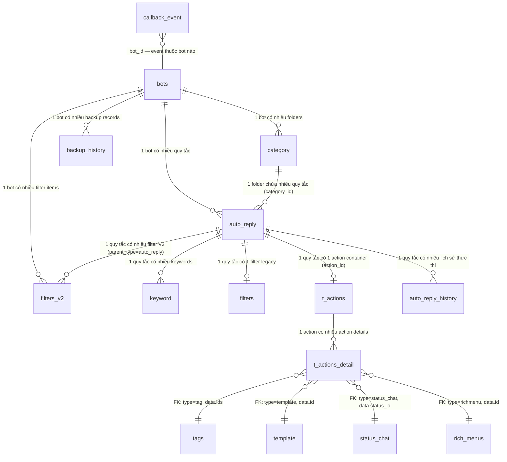
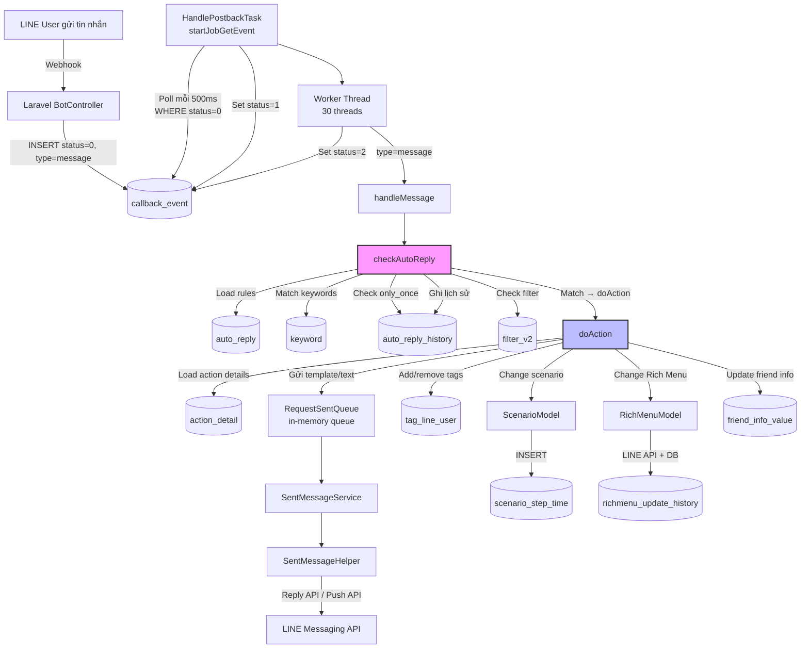

# FA-003 Tự động trả lời「自動応答」— Feature Spec

> Spec tổng hợp cuối cùng — kết hợp toàn bộ thông tin từ UI, API, Logic, DB và Job specs.
> Đây là tài liệu tham chiếu chính cho tính năng này.
> Ngày tạo: 2026-03-25
> Phiên bản: 2.0 (bổ sung Background Jobs — HandlePostbackTask, checkAutoReply, doAction)

---

## 1. Tổng quan

- **Mã tính năng**: FA-003
- **Tên**: Tự động trả lời
- **Tên JP**: 「自動応答」
- **Portal**: Admin
- **URL chính**: `/basic/reply`
- **Mô tả**: Thiết lập quy tắc tự động trả lời tin nhắn LINE dựa trên keyword, lịch trình và điều kiện lọc đối tượng. Khi người dùng LINE gửi tin nhắn phù hợp điều kiện, hệ thống tự động thực hiện hành động đã cấu hình (gửi template, gán tag, chuyển step, v.v.).
- **Phân loại**: Hỗ trợ khách hàng / Tự động hóa
- **Background Jobs**: Có — Spring Boot `HandlePostbackTask` xử lý thực thi auto-reply khi LINE user gửi tin nhắn. Laravel webhook INSERT vào bảng `callback_event`, Spring Boot poll và xử lý: match keyword + thời gian + filter → thực thi action (gửi template, gán tag, đổi scenario, đổi Rich Menu...). Chi tiết xem mục 7.

### Đối tượng sử dụng (Actors)

| Actor | Vai trò | Quyền |
|-------|---------|-------|
| Admin (LINE OA) | Tạo và quản lý các quy tắc tự động trả lời cho LINE Official Account | Toàn quyền — tạo, sửa, xóa, bật/tắt, sao chép quy tắc |
| Staff | Nhân viên do Admin tạo, truy cập cùng giao diện | Tùy role — có thể bị giới hạn quyền tạo/sửa/xóa tự động trả lời (cơ chế kiểm tra quyền Staff chưa được xác nhận rõ, tin cậy **Trung bình**) |
| LINE User | Người dùng cuối gửi tin nhắn qua LINE | Kích hoạt auto-reply khi gửi tin nhắn phù hợp điều kiện — xử lý qua background job (mục 7) |

### Phạm vi (Scope)

**Bao gồm:**
- CRUD quy tắc tự động trả lời (tạo, đọc, sửa, xóa)
- Quản lý folder phân loại quy tắc
- Cấu hình keyword trigger (exact/partial match, AND/OR logic)
- Cấu hình lịch trình phản ứng (24/7 hoặc theo ngày/giờ)
- Cấu hình đối tượng áp dụng (lọc bạn bè theo 11 loại điều kiện)
- Cấu hình hành động thực hiện (10 loại action qua SC-004)
- Sao chép (copy) quy tắc
- Bật/tắt, sắp xếp, di chuyển, xóa hàng loạt
- Tìm kiếm quy tắc theo keyword
- **Background job thực thi auto-reply**: Chuỗi xử lý từ LINE webhook → callback_event → keyword matching → action execution (mục 7)

**Không bao gồm:**
- Chi tiết giao diện bên trong từng loại action (thuộc SC-004 Action Settings)
- Chi tiết giao diện bên trong từng loại filter (thuộc SC-003 Friend Filter)
- Quản lý templates, tags, step delivery, rich menus (thuộc các tính năng FA khác)
- Logic xử lý các event type khác ngoài `message` (follow, unfollow, postback... — thuộc hệ thống callback chung)

### Ghi chú kiến trúc: Dual Flow (Legacy vs V2)

Tính năng tồn tại **2 flow song song** trong code:

| Đặc điểm | Flow Legacy | Flow V2 (hiện tại) |
|-----------|------------|---------------------|
| **Cơ chế** | Form POST truyền thống | AJAX (không reload trang) |
| **Tạo/Sửa** | EP-02 → EP-04 (store) / EP-03 → EP-05 (save) | EP-02 → EP-07 (init) → EP-08 (save) |
| **View** | `basic.reply.edit` | `basic.reply.create_v2` |
| **Hành động** | Cột trực tiếp trong `auto_reply` (reply_kind, reply_content, scenario_*, tag_*) | `t_actions` + `t_actions_detail` (SC-004 Action Settings) |
| **Filter** | Bảng `filters` (1 record / quy tắc) | Bảng `filters_v2` (N records / quy tắc, SC-003) |
| **Response** | Redirect back với flash message | JSON response |

> **Suy luận**: Flow V2 là flow đang được sử dụng (view `create_v2`). Flow Legacy vẫn tồn tại trong code nhưng có thể không còn được dùng trên giao diện mới. Tin cậy: **Trung bình**.

---

## 2. Các màn hình & Luồng xử lý End-to-End

### SCR-RPL-01: Danh sách tự động trả lời

- **URL**: `/basic/reply`
- **Tiêu đề**: 「自動応答」
- **Screenshot**: `ui/screenshots/main-list-clean.png`

#### Giao diện

Layout gồm 3 phần:
- **Header**: Heading「自動応答」với link hướng dẫn sử dụng「マニュアル」
- **Sidebar trái**: Quản lý folder「フォルダ」— tạo, sửa, xóa folder; lọc quy tắc theo folder
- **Khu vực chính (phải)**: Toolbar hành động + Bảng danh sách quy tắc

**Toolbar**: Nút「新規作成」(tạo mới),「並べ替え」(sắp xếp),「一括フォルダ変更」(đổi folder hàng loạt),「一括削除」(xóa hàng loạt).

**Bảng dữ liệu**: Checkbox chọn | Ngày tạo「作成日」| Trạng thái「稼働状況」| Keyword「キーワード」| Lịch trình「スケジュール」| Nút sửa | Nút xóa.

#### Luồng xử lý: Tải danh sách

```
[UI] Truy cập /basic/reply
  │
  ▼
[API] GET /basic/reply (EP-01)
  │ → Đọc cookie folder_reply → xác định folder đang chọn
  ▼
[Logic] ReplyController@index
  │ → getBotId() từ session
  │ → Kiểm tra folder tồn tại (category kind=1, is_deleted=0)
  │ → Nếu folder không hợp lệ → reset về 0 (未分類), cập nhật cookie
  ▼
[Response] Blade view basic.reply.index (folderCookie)
  │
  ▼
[UI] AJAX tải danh sách
  │
  ▼
[API] POST /ajax/get-list-group (EP-06)
  │ Request: { action: (default), group_id }
  ▼
[Logic] ReplyController@ajaxGetListCategory
  │ → Category::getListReplyCategories(bot_id)
  │ → Lấy items theo folder + items_default (category_id=0)
  │ → Sort theo position DESC
  ▼
[DB] SELECT category (kind=1, is_deleted=0) + auto_reply (is_deleted=0) JOIN keyword
  │
  ▼
[Response] JSON { status, groups, items_default, items, group_open, count_default }
  │
  ▼
[UI] Render sidebar folders + bảng danh sách quy tắc
```

#### Luồng xử lý: Bật/Tắt quy tắc

```
[UI] Toggle trạng thái ON/OFF trên dòng quy tắc
  │
  ▼
[API] POST /ajax/get-list-group (EP-06)
  │ Request: { action: "turnOnItem"/"turnOffItem", item_id }
  ▼
[Logic] ReplyController@ajaxGetListCategory
  │ → UPDATE auto_reply SET is_stopped = 0 (bật) hoặc 1 (tắt)
  ▼
[DB] UPDATE auto_reply SET is_stopped WHERE id = item_id
  │
  ▼
[Response] JSON cập nhật → UI refresh danh sách
```

#### Luồng xử lý: Xóa hàng loạt

```
[UI] Chọn checkbox nhiều quy tắc → Click「一括削除」
  │
  ▼
[API] POST /ajax/get-list-group (EP-06)
  │ Request: { action: "deleteItems", item_ids: [...] }
  ▼
[Logic] ReplyController@ajaxGetListCategory
  │ → Kiểm tra BackupHistory (status 0/1) → nếu đang backup → lỗi 500
  │ → Bulk soft delete: auto_reply.is_deleted = 1
  │ → Hard delete: tất cả keyword liên quan
  ▼
[DB] UPDATE auto_reply SET is_deleted=1 WHERE id IN (...) + DELETE keyword WHERE auto_reply_id IN (...)
  │
  ▼
[Response] JSON cập nhật → UI refresh danh sách
```

#### Luồng xử lý: Xóa folder

```
[UI] Click icon xóa folder trong sidebar
  │
  ▼
[API] POST /ajax/get-list-group (EP-06)
  │ Request: { action: "deleteGroup", group_id }
  ▼
[Logic] ReplyController@ajaxGetListCategory
  │ → Kiểm tra BackupHistory → nếu đang backup → lỗi 500
  │ → Soft delete folder: category.is_deleted = 1
  │ → Cascade: soft delete tất cả auto_reply trong folder
  │ → Cascade: hard delete tất cả keyword liên quan
  ▼
[DB] UPDATE category SET is_deleted=1
     + UPDATE auto_reply SET is_deleted=1 WHERE category_id = group_id
     + DELETE keyword WHERE auto_reply_id IN (...)
  │
  ▼
[Response] JSON cập nhật → UI refresh sidebar + danh sách
```

#### Luồng xử lý: Tìm kiếm theo keyword

```
[UI] Nhập keyword vào ô tìm kiếm (vị trí trên giao diện chưa xác nhận — xem TB-03)
  │
  ▼
[API] POST /ajax/get-list-group (EP-06)
  │ Request: { action: "searchByKeyWord", keyword, group_id }
  ▼
[Logic] ReplyController@ajaxGetListCategory
  │ → JOIN auto_reply + keyword → LIKE '%keyword%'
  │ → Filter: is_deleted=0, category_id, bot_id
  ▼
[DB] SELECT auto_reply JOIN keyword WHERE keyword.keyword LIKE '%...%'
  │
  ▼
[Response] JSON kết quả tìm kiếm → UI hiển thị
```

---

### SCR-RPL-02: Form tạo mới / Chỉnh sửa quy tắc

- **URL tạo mới**: `/basic/reply/new?group_id={folder_id}`
- **URL chỉnh sửa (V2)**: `/basic/reply/new?reply_id={id}`
- **URL chỉnh sửa (legacy)**: `/basic/reply/edit/{item_id}`
- **URL sao chép**: `/basic/reply/new?copy_id={id}`
- **Tiêu đề**: 「自動応答」
- **Screenshots**: `ui/screenshots/create-form.png`, `create-form-keyword.png`, `create-form-schedule.png`

#### Giao diện

Form dọc gồm 5 phần chính:
1. **「アクション稼働対象絞り込み」** — Lọc đối tượng áp dụng (active/blocked friends, modal filter SC-003)
2. **「フォルダ」** — Chọn folder phân loại
3. **「キーワード設定」** — Cài đặt keyword trigger (tất cả tin nhắn / theo keyword cụ thể)
4. **「スケジュール設定」** — Cài đặt lịch trình (24/7 / theo ngày giờ)
5. **「アクション設定」** — Cài đặt hành động (1 lần / nhiều lần, modal action SC-004)

Footer: Nút「戻る」(quay lại) và「登録」(lưu).

**Lưu ý**: Form không có trường nhập tên/tiêu đề cho quy tắc — quy tắc được định danh bằng keyword hoặc ID nội bộ.

#### Luồng xử lý: Tạo mới quy tắc (Flow V2)

```
[UI] Click「新規作成」từ SCR-RPL-01 → Navigate /basic/reply/new?group_id=0
  │
  ▼
[API] GET /basic/reply/new (EP-02)
  │ Params: group_id, (reply_id), (copy_id)
  ▼
[Logic] ReplyController@create
  │ → Lấy danh sách folders (Category kind=1)
  │ → Lấy danh sách scenarios, conversions, Rich Menus, StatusChat
  ▼
[Response] Blade view basic.reply.create_v2 (data phụ trợ cho dropdowns)
  │
  ▼
[UI] AJAX khởi tạo dữ liệu form
  │
  ▼
[API] POST /ajax/init-data-detail-auto-reply (EP-07)
  │ Request: { category_id }
  ▼
[Logic] ReplyController@initDataDetailAutoReply
  │ → Khởi tạo object auto_reply mặc định (tất cả = 0/null/empty)
  │ → Trả 1 keyword rỗng mặc định
  ▼
[Response] JSON { success, data_reply, list_keyword, detail_action_reply }
  │
  ▼
[UI] User cấu hình form 5 phần → Click「登録」
  │
  ▼
[API] POST /ajax/save-data-detail-auto-reply (EP-08)
  │ Request: { id: null, botIdCurrent, data_reply (JSON), list_keyword (JSON),
  │            item_search (JSON), item_search_or (JSON) }
  ▼
[Logic] ReplyController@saveDataDetailAutoReply
  │ 1. Kiểm tra botIdCurrent = getBotId() → lỗi nếu khác bot
  │ 2. Kiểm tra BackupHistory → lỗi 500 nếu đang backup
  │ 3. Validate:
  │    → keyword_reaction_type=1 → list_keyword không rỗng
  │    → time_reaction_type=1 → format HH:mm, end > start
  │ 4. Kiểm tra keyword trùng (cross auto-reply trong toàn bot)
  │ 5. INSERT auto_reply → set position = max + 1
  │ 6. INSERT keywords mới
  │ 7. FilterV2::saveFilter() → DELETE old + INSERT new (parent_type='auto_reply')
  ▼
[DB] INSERT auto_reply + INSERT keyword(s) + INSERT filters_v2(s)
  │ (+ t_actions, t_actions_detail nếu có action)
  ▼
[Response] JSON { success: true } → UI quay lại SCR-RPL-01
```

#### Luồng xử lý: Chỉnh sửa quy tắc (Flow V2)

```
[UI] Click dòng quy tắc từ SCR-RPL-01 → Navigate /basic/reply/new?reply_id={id}
  │
  ▼
[API] GET /basic/reply/new (EP-02) + POST /ajax/init-data-detail-auto-reply (EP-07)
  │ EP-07 Request: { id: reply_id }
  ▼
[Logic] ReplyController@initDataDetailAutoReply
  │ → Load AutoReply → populate object
  │ → Load Keywords
  │ → Nếu có action_id → load Actions + ActionDetail → enrich data
  ▼
[Response] JSON { data_reply (populated), list_keyword (existing), detail_action_reply (existing) }
  │
  ▼
[UI] Form hiển thị dữ liệu hiện tại → User chỉnh sửa → Click「登録」
  │
  ▼
[API] POST /ajax/save-data-detail-auto-reply (EP-08)
  │ Request: { id: reply_id, ... }
  ▼
[Logic] ReplyController@saveDataDetailAutoReply
  │ → AutoReply::update() (luôn set is_stopped=0 — tự động bật lại)
  │ → Keywords: update existing / create new / delete removed (whereNotIn)
  │ → FilterV2: replace toàn bộ (delete old + insert new)
  ▼
[DB] UPDATE auto_reply + UPSERT/DELETE keyword + DELETE/INSERT filters_v2
  │
  ▼
[Response] JSON { success: true }
```

#### Luồng xử lý: Sao chép quy tắc (Flow V2)

```
[UI] Action sao chép (chức năng tồn tại trong code, vị trí nút trên UI chưa xác nhận — xem TB-02)
  │ → Navigate /basic/reply/new?copy_id={id}
  ▼
[API] EP-02 + EP-07
  │ EP-07 Request: { copyId }
  ▼
[Logic] ReplyController@initDataDetailAutoReply
  │ → Load AutoReply gốc
  │ → Deep clone action: MessageTemplateController::cloneMutilpleAction()
  │   → Replicate t_actions → replicate t_actions_detail → clone FilterV2 (nếu has_filters=1)
  │ → KHÔNG clone keywords (list_keyword trả về rỗng)
  ▼
[Response] JSON { data_reply (populated), list_keyword (rỗng), detail_action_reply (cloned) }
  │
  ▼
[UI] User bổ sung keywords → Click「登録」→ lưu như tạo mới
```

#### Luồng lỗi khi lưu (Flow V2 — EP-08)

| Điều kiện | Response | Message |
|-----------|----------|---------|
| Đã đổi bot giữa chừng | `{success: false, msg: "..."}` | 「別のアカウントに切り替えたので、要求を処理できません。」 |
| Bot đang backup | HTTP 500, `{success: false, msg: MESSAGE_NOTIFY_BACKUP}` | Thông báo backup |
| Thiếu keyword | `{success: false, msg1: "..."}` | 「キーワードを1つ以上設定して下さい。」 |
| Thời gian không hợp lệ | `{success: false, msg2: "..."}` | 「時間帯を正しく指定して下さい。」 |
| Keyword đã tồn tại | `{success: false, msg: "...", arraySameWord: [0,2]}` | 「キーワードは既に登録されています。」 |

---

### SCR-RPL-03: Modal Lọc đối tượng —「絞り込み」(Shared SC-003)

- **Vị trí**: Modal overlay trên SCR-RPL-02
- **Tiêu đề**: 「絞り込み」
- **Screenshots**: `ui/screenshots/filter-modal.png`, `create-form-filter.png`

#### Giao diện

Modal dialog với:
- 2 khu vực điều kiện: AND「全て満たす」và OR「どれか1つ以上満たす」
- Panel chọn 11 loại điều kiện
- Nút「保存」(lưu) và nút đóng (X)

#### 11 loại điều kiện lọc

| # | Text JP | Filter Type (DB) | Bảng tham chiếu | Tin cậy |
|---|---------|-------------------|-----------------|---------|
| 1 | 「タグ」 | `tag` | `filters_v2` → `tags` | **Cao** |
| 2 | 「友だち名」 | `name` | `filters_v2` | **Cao** |
| 3 | 「友だち追加日」 | `day_add_friend` | `filters_v2` | **Cao** |
| 4 | 「ステップ購読状況」 | `scenario` | `filters_v2` → scenarios | **Cao** |
| 5 | 「QRコードアクション」 | `qr_code` | `filters_v2` → landing pages | **Cao** |
| 6 | 「コンバージョン」 | `conversion` | `filters_v2` → conversions | **Cao** |
| 7 | 「確認状況」 | — | — | **Thấp** — không tìm thấy type tương ứng trong FilterV2, có thể đã deprecated |
| 8 | 「友だち情報」 | `friend_info` | `filters_v2` → friend information | **Cao** |
| 9 | 「対応ステータス」 | `status_chat` | `filters_v2` → `status_chat` | **Cao** |
| 10 | 「アフィリエイター」 | `affiliater` | `filters_v2` | **Cao** |
| 11 | 「新規・既存 友だち」 | `new_old_friend` | `filters_v2` | **Cao** |

#### Luồng xử lý: Mở + Lưu filter

```
[UI] Click「絞込み」trong SCR-RPL-02 → Mở modal
  │
  ▼
[API] POST /ajax/init-data-filter (EP-13)
  │ Request: { parent_id: auto_reply_id, parent_type: "auto_reply" }
  ▼
[Logic] FilterController@initDataFilter
  │ → Query FilterV2 theo parent_type + parent_id
  │ → Tách: operator='and' / operator='or'
  │ → Enrich data theo type (load tag names, scenario names, etc.)
  ▼
[Response] JSON { itemFilterAnd, itemFilterOr, numberFilter }
  │
  ▼
[UI] User thêm/sửa điều kiện → Click「保存」
  │
  ▼
[API] POST /ajax/filter/save-filter-v2 (EP-16)
  │ Request: filter items AND/OR
  ▼
[Logic] FilterController@saveFilterV2
  │ → FilterV2::saveFilter() — validate, serialize, lưu DB
  ▼
[DB] DELETE filters_v2 (cũ) + INSERT filters_v2 (mới)
  │ parent_type='auto_reply', parent_id=auto_reply.id
  ▼
[Response] JSON success → Modal đóng, UI cập nhật「対象条件」và「対象人数」
```

---

### SCR-RPL-04: Modal Hành động —「アクション」(Shared SC-004)

- **Vị trí**: Modal overlay trên SCR-RPL-02
- **Tiêu đề**: 「アクション」
- **Screenshot**: `ui/screenshots/action-settings-modal.png`

#### Giao diện

Modal dialog với 10 nút chọn loại hành động + Nút「保存」.

#### 10 loại hành động

| # | Text JP | Action Type (DB) | Tính năng liên quan | Tin cậy |
|---|---------|-------------------|---------------------|---------|
| 1 | 「ステップ」 | `scenario` / `step` | FA-009 Step Delivery | **Trung bình** |
| 2 | 「テンプレート」 | `template` | FA-010, SC-001 Template Message | **Trung bình** |
| 3 | 「テキスト」 | `text` | — | **Trung bình** |
| 4 | 「リマインド」 | `remind` | FA-022 Remind Delivery | **Trung bình** |
| 5 | 「タグ」 | `tag` | FA-012, SC-002 Tag Selector | **Trung bình** |
| 6 | 「リッチメニュー」 | `richmenu` | FA-004 Rich Menu | **Trung bình** |
| 7 | 「ブックマーク」 | `bookmark` | — | **Trung bình** |
| 8 | 「友だち情報」 | `friend_info` | FA-015 Friend Information | **Trung bình** |
| 9 | 「対応ステータス」 | `status_chat` | FA-002 Chat Management | **Trung bình** |
| 10 | 「ブロック」 | `block` | — | **Trung bình** |

> Tin cậy **Trung bình** cho data structure — suy luận từ code đọc data (`Actions::initDataAction()`), không phải code ghi data.

#### Luồng xử lý

Actions được lưu qua hệ thống `t_actions` + `t_actions_detail` — là shared component SC-004. Khi user chọn loại action và cấu hình → dữ liệu được lưu vào `t_actions_detail.type` + `t_actions_detail.data` (JSON). Container `t_actions` liên kết với `auto_reply.action_id`.

---

### Luồng End-to-End: LINE user gửi tin nhắn → Auto-reply match → Action execution

> Luồng này mô tả toàn bộ lifecycle từ khi LINE user gửi tin nhắn đến khi hệ thống thực thi auto-reply. Phần CRUD cấu hình quy tắc ở các mục trên; phần thực thi runtime ở đây. Tin cậy: **Cao** — đọc trực tiếp từ source code Spring Boot.

```
[LINE User] Gửi tin nhắn qua LINE app
  │
  ▼
[LINE Platform] Webhook POST /line/callback/add/{bot_id}
  │
  ▼
[Laravel] BotController@callbackWebHook
  │ → Parse JSON event payload
  │ → INSERT callback_event (status=0, type="message", request=JSON, bot_id, line_id)
  ▼
[DB] callback_event (status=0 — STATUS_NEW)
  │
  ▼
[Spring Boot] HandlePostbackTask — startJobGetEvent (poll mỗi 500ms)
  │ → SELECT callback_event WHERE status=0
  │ → SET status=1 (STATUS_PROCESSING)
  │ → Đẩy vào in-memory queue (LinkedList<CallbackEvent>)
  ▼
[Spring Boot] Worker thread (1 trong 30 threads)
  │ → Lấy event từ in-memory queue
  │ → Lock theo line_id (ConcurrentHashMap) — tránh xử lý song song cùng user
  │ → switch type="message" → doHandleMessage(event)
  │   → parseCallbackEventData → List<LineCallback>
  │   → handleMessage(event, callback)
  │     → Tìm LineUser, Conversation
  │     → Kiểm tra conversation.isBlockedByBot()
  │       ├── Active user → checkAutoReply (load rules cho active users)
  │       └── Blocked user → handleMessageInactiveUser
  │           → Kiểm tra có rules cho inactive users?
  │           → Nếu có → checkAutoReply (load rules cho inactive users)
  │           → Nếu không → set STATUS_BLOCKED_BY_BOT, return
  ▼
[Spring Boot] checkAutoReply(bot, conversation, lineUser, callbackMessage, replyToken)
  │ → Load auto_reply rules (is_stopped!=1 AND is_deleted!=1)
  │ → Duyệt từng rule (KHÔNG break sau match — nhiều rules có thể match đồng thời):
  │   ① Kiểm tra only_once: auto_reply_history.existsByLineIdAndReplyId()
  │   ② Kiểm tra isNoReplyButton: text dạng「【...】」→ skip
  │   ③ Kiểm tra keyword match: native SQL matchingKeyword()
  │      - keywordReactionType=0 (ANY): luôn match
  │      - keywordReactionType=1 (SPECIFIC):
  │        · logical=0 (OR) + keyword.logical=0 (exact): val = keyword (utf8mb4_bin)
  │        · logical=0 (OR) + keyword.logical=1 (partial): LOCATE(keyword, val)
  │        · logical=1 (AND): tất cả keywords phải match (totalm == totalk)
  │   ④ Kiểm tra time match: dayOfWeek + startTime/endTime
  │   ⑤ Kiểm tra filter_v2 (FILTER_TYPE_AUTO_REPLY)
  │   → Nếu match → doAction() + lưu AutoReplyHistory
  ▼
[Spring Boot] doAction(actionIds, lineUser, conversation, replyToken, ...)
  │ → Load ActionDetail list cho mỗi actionId
  │ → Với mỗi ActionDetail (kiểm tra filter_v2 FILTER_TYPE_ACTION):
  │   ├── "template" → đẩy vào RequestSentQueue → SentMessageService → LINE API
  │   ├── "text"     → tạo message → RequestSentQueue → LINE API
  │   ├── "scenario" → ScenarioModel.startScenario() → scenario_step_time
  │   ├── "remind"   → startEvent() → event_step_time
  │   ├── "tag"      → add/remove TagLineUser + đệ quy doAction nếu tag có chained action
  │   ├── "richmenu" → RichMenuModel.updateRichMenu() → LINE Rich Menu API
  │   ├── "friend_info" → cập nhật friend_info_value
  │   ├── "bookmark" → đánh dấu/bỏ bookmark conversation
  │   ├── "block"    → block/unblock/hide/unhide user
  │   └── "compliant_status" → đổi status chat
  ▼
[Spring Boot] SentMessageService (consumer — in-memory RequestSentQueue)
  │ → SentMessageHelper.sentMessage()
  │ → MessageBuilder.build() → LINE SDK Message objects
  │ → Có replyToken → LINE Reply API
  │ → Không có replyToken → LINE Push API
  ▼
[LINE Platform] Gửi tin nhắn reply đến LINE User
  │
  ▼
[Spring Boot] Set callback_event status=2 (STATUS_DONE)
```

#### Luồng inactive user (bổ sung)

Khi `conversation.isBlockedByBot() = true`:
1. Kiểm tra có auto-reply rules cho inactive users (`is_apply_active_friend = 0`)
2. Nếu **không có** → set `STATUS_BLOCKED_BY_BOT`, return (không gửi reply)
3. Nếu **có** → chạy `checkAutoReply()` chỉ với rules inactive → nếu match → unhide conversation, lưu tin nhắn, update lastMessage

#### Cơ chế Confirm Message

Sau khi `checkAutoReply` trả `hasReply`, caller quyết định:
- `bot.isConfirmMessageAutoreply() && hasReply` → needConfirm = true (tin nhắn đã được auto-reply → tự confirm)
- `bot.isConfirmMessageButton()` && text dạng 【...】 → needConfirm = true
- `bot.isConfirmMessageStamp()` && type = sticker → needConfirm = true
- Nếu KHÔNG confirm → tạo `UnconfirmMessage` record → hiển thị thông báo cho admin trong chat

---

## 3. Data Model

### Bảng chính (Primary Tables)

| # | Bảng | Model | Mô tả | Data size |
|---|------|-------|-------|-----------|
| 1 | `auto_reply` | `AutoReply` | Bảng chính — lưu quy tắc tự động trả lời | 172KB |
| 2 | `keyword` | `Keyword` | Keywords gắn với quy tắc (1-N) | 49KB |
| 3 | `category` | `Category` | Folder phân loại (kind=1 cho auto-reply) | 509KB |
| 4 | `filters` | `Filter` | Bộ lọc legacy (1-1 với auto_reply) | 477KB |
| 5 | `filters_v2` | `FilterV2` | Bộ lọc V2 (N-N qua parent_type) | 17.8MB |
| 6 | `t_actions` | `Actions` | Action container (1-1 với auto_reply qua action_id) | 8.8MB |
| 7 | `t_actions_detail` | `ActionDetail` | Chi tiết hành động (N-1 với t_actions) | 14.7MB |

### Bảng phụ (Secondary Tables)

| # | Bảng | Vai trò | Data size |
|---|------|---------|-----------|
| 8 | `bots` | Chủ sở hữu — mọi auto_reply thuộc 1 bot | 440KB |
| 9 | `auto_reply_history` | Lịch sử thực thi (reply_id → line_id) — dùng kiểm tra `only_once` trong background job | 757KB |
| 10 | `backup_history` | Kiểm tra bot đang backup → chặn modify | 18KB |
| 11 | `tags` | Tham chiếu từ action/filter | 245KB |
| 12 | `template` | Tham chiếu từ action (gửi template) | 1.8MB |
| 13 | `status_chat` | Tham chiếu từ action (đổi trạng thái) | 801KB |
| 14 | `rich_menus` | Tham chiếu từ action (đổi rich menu) | 207KB |
| 15 | `callback_event` | Bảng queue chung cho hệ thống callback — Laravel webhook INSERT (status=0), Spring Boot poll và xử lý. State machine 11 trạng thái (chi tiết trong mục 7). Không riêng FA-003 | — |

### ER Diagram



---

## 4. Field Traceability Matrix

### SCR-RPL-02: Form chính

| # | UI Element JP | Màn hình | API Param (EP-08) | DB Table.Column | Hướng | Validation | Business Rule |
|---|--------------|----------|-------------------|-----------------|-------|-----------|---------------|
| 1 | 「有効友だち」/「ブロックした友だち」 | SCR-RPL-02 | `data_reply.is_apply_active_friend` | `auto_reply.is_apply_active_friend` | Đọc/Ghi | `1` hoặc `0` | — |
| 2 | 「対象人数」 | SCR-RPL-02 | — (EP-15) | Không lưu DB | Đọc | — | Tính realtime qua query line_user + bot_line_user |
| 3 | 「対象条件」 | SCR-RPL-02 | — | `filters_v2.text_preview` | Đọc | — | Concatenate preview các filter items |
| 4 | 「フォルダ」 | SCR-RPL-02 | `data_reply.category_id` | `auto_reply.category_id` | Đọc/Ghi | FK logic → category.id (kind=1). `0` = 未分類 | — |
| 5 | 「利用設定」 | SCR-RPL-02 | `data_reply.keyword_reaction_type` | `auto_reply.keyword_reaction_type` | Đọc/Ghi | `0` hoặc `1` | — |
| 6 | 「【〇〇】のメッセージには反応させない」 | SCR-RPL-02 | `data_reply.is_no_reply_button` | `auto_reply.is_no_reply_button` | Đọc/Ghi | Boolean | 〇〇 = nút reply (quick reply buttons), KHÔNG phải tên bot (BR-12) |
| 7 | 「反応条件」 | SCR-RPL-02 | `data_reply.logical` | `auto_reply.logical` | Đọc/Ghi | `0` (AND) / `1` (OR) | Chỉ hiện khi keyword_reaction_type=1 |
| 8 | 「キーワード」(text) | SCR-RPL-02 | `list_keyword[].keyword` | `keyword.keyword` | Đọc/Ghi | Bắt buộc ≥1 khi keyword mode | Duy nhất trong toàn bot (BR-01) |
| 9 | 「キーワード」(match type) | SCR-RPL-02 | `list_keyword[].logical` | `keyword.logical` | Đọc/Ghi | `0` (完全一致) / `1` (部分一致) | — |
| 10 | 「反応設定」 | SCR-RPL-02 | `data_reply.time_reaction_type` | `auto_reply.time_reaction_type` | Đọc/Ghi | `0` (24/7) / `1` (schedule) | — |
| 11 | 「曜日設定」 | SCR-RPL-02 | `data_reply.day_of_week` | `auto_reply.day_of_week` | Đọc/Ghi | Array → string `;` separated. 1=月→7=日 | Chỉ hiện khi time_reaction_type=1 (BR-06) |
| 12 | 「時間帯設定」(từ) | SCR-RPL-02 | `data_reply.start_time` | `auto_reply.start_time` | Đọc/Ghi | Format HH:mm | start < end (BR-10) |
| 13 | 「時間帯設定」(đến) | SCR-RPL-02 | `data_reply.end_time` | `auto_reply.end_time` | Đọc/Ghi | Format HH:mm | end > start (BR-10) |
| 14 | 「1度のみ」/「何度でも」 | SCR-RPL-02 | `data_reply.response_number` | `auto_reply.response_number` | Đọc/Ghi | `0` (1 lần) / `1` (nhiều lần) | Kết hợp với auto_reply_history để track |
| 15 | Action container (ẩn) | SCR-RPL-02 | `data_reply.action_id` | `auto_reply.action_id` | Đọc/Ghi | FK → t_actions.id | — |

### SCR-RPL-01: Danh sách

| # | UI Element JP | Màn hình | DB Table.Column | Hướng | Ghi chú |
|---|--------------|----------|-----------------|-------|---------|
| 16 | 「作成日」 | SCR-RPL-01 | `auto_reply.created_at` | Đọc | Format YYYY.MM.DD |
| 17 | 「稼働状況」 | SCR-RPL-01 | `auto_reply.is_stopped` | Đọc/Ghi | `0` → ON, `1` → OFF |
| 18 | 「キーワード」 | SCR-RPL-01 | `keyword.keyword` (JOIN) | Đọc | Concatenated từ bảng con |
| 19 | 「スケジュール」 | SCR-RPL-01 | `auto_reply.day_of_week` + `start_time` + `end_time` + `time_reaction_type` | Đọc | Computed: "月,火,水 09:00~18:00" hoặc "常に" |
| 20 | Folder name | SCR-RPL-01 sidebar | `category.name` (kind=1) | Đọc | 未分類 là convention (category_id=0) |
| 21 | Số quy tắc/folder | SCR-RPL-01 sidebar | COUNT(auto_reply) | Đọc | WHERE category_id=X AND is_deleted=0 |

---

## 5. Business Rules

### Rules CRUD (Laravel Web App)

| # | ID | Rule | Mô tả | Nơi enforce | Ảnh hưởng | Tin cậy |
|---|-----|------|-------|------------|----------|---------|
| 1 | BR-01 | Keyword duy nhất trong bot | Mỗi keyword chỉ được đăng ký 1 lần trong toàn bộ bot (cross auto-reply). Kiểm tra khi tạo mới và cập nhật | `ReplyController.php:187-199` (legacy), `ReplyController.php:979-1006` (V2) | Lỗi: 「キーワードは既に登録されています。」+ arraySameWord | **Cao** |
| 2 | BR-02 | Backup lock | Không cho phép tạo/sửa/xóa khi bot đang trong quá trình backup (BackupHistory status 0/1) | `ReplyController.php:143-149, 456-463, ...` | Lỗi HTTP 500 + MESSAGE_NOTIFY_BACKUP | **Cao** |
| 3 | BR-03 | Reply content encoding | Nội dung text reply được base64_encode khi lưu, base64_decode khi đọc (flow legacy, reply_kind=1) | `ReplyController.php:153-154`, `AutoReply.php:56` | — | **Cao** |
| 4 | BR-04 | Soft delete + Hard delete | Xóa auto_reply và folder dùng soft delete (is_deleted=1); xóa keywords dùng hard delete | `ReplyController.php:507-508, 580-582, 598-600` | — | **Cao** |
| 5 | BR-05 | Position ordering | Mỗi auto_reply có position trong folder. Tạo mới → position = max + 1. Sắp xếp → cập nhật position | `ReplyController.php:179-182, 978, 1033` | — | **Cao** |
| 6 | BR-06 | Day of week format | Ngày trong tuần lưu dạng string phân cách bằng `;` (VD: "1;2;3;4;5"). 1=月→7=日 | `ReplyController.php:174, 326, 1042` | — | **Cao** |
| 7 | BR-07 | Cascade delete folder | Xóa folder → soft delete tất cả auto_reply bên trong + hard delete keywords | `ReplyController.php:505-508` | — | **Cao** |
| 8 | BR-08 | V2 auto-enable | Khi lưu qua flow V2, is_stopped luôn reset về 0 (bật) | `ReplyController.php:1020, 1034` | Quy tắc tự động được bật lại sau mỗi lần sửa | **Cao** |
| 9 | BR-09 | Bot switch protection | Flow V2 kiểm tra botIdCurrent (request) = getBotId() (session). Ngăn lưu dữ liệu sai bot | `ReplyController.php:935-938` | Lỗi: 「別のアカウントに切り替えたので...」 | **Cao** |
| 10 | BR-10 | Time validation | Giờ bắt đầu < giờ kết thúc. Format HH:mm. Regex validate | `ReplyController.php:780-792, 959-972` | Lỗi: 「時間帯を正しく指定して下さい。」 | **Cao** |
| 11 | BR-11 | Copy action deep clone | Khi sao chép, action được deep clone: t_actions → t_actions_detail → filters_v2 (nếu has_filters=1). Keywords KHÔNG được clone | `MessageTemplateController.php:3910-3938` | — | **Cao** |
| 12 | BR-12 | Checkbox is_no_reply_button | Khi true, quy tắc không phản ứng với tin nhắn từ nút reply (quick reply buttons). 「〇〇」trong UI chỉ nút reply, không phải tên bot | `ReplyController.php:849, 892, 1021, 1035` | — | **Cao** |
| 13 | BR-13 | Filter dual system | 2 hệ thống filter song song: Filter (legacy, bảng filters) cho flow cũ và FilterV2 (bảng filters_v2) cho flow V2 | `ReplyController.php:213, 1073` | — | **Cao** |
| 14 | BR-14 | Default folder 未分類 | category_id=0 là convention cho「未分類」— không tồn tại record trong bảng category | `AutoReply.php:93, ReplyController.php:672-675` | Code xử lý items_default riêng | **Cao** |

### Rules Runtime (Spring Boot Background Job)

| # | ID | Rule | Mô tả | Nơi enforce | Ảnh hưởng | Tin cậy |
|---|-----|------|-------|------------|----------|---------|
| 15 | BR-15 | Multi-rule match | Nhiều rules có thể match đồng thời — vòng lặp KHÔNG break sau match đầu tiên. Mỗi rule match tạo riêng `AutoReplyHistory` entry | `HandlePostbackTask.java:1532-1628` | Nhiều actions có thể chạy cùng lúc cho 1 tin nhắn | **Cao** |
| 16 | BR-16 | Only once (response_number) | Nếu `response_number = 0` (chỉ 1 lần) và `auto_reply_history` đã có record cho cặp (lineId, replyId) → skip rule | `HandlePostbackTask.java:1534` | User chỉ nhận auto-reply 1 lần per rule | **Cao** |
| 17 | BR-17 | Skip reply button (isNoReplyButton) | Nếu `is_no_reply_button = 1` và text bắt đầu bằng「【」kết thúc bằng「】」→ skip rule. Tránh trigger auto-reply khi user click button/carousel | `HandlePostbackTask.java:1535-1539` | Tin nhắn dạng【text】bị bỏ qua | **Cao** |
| 18 | BR-18 | Keyword matching (native SQL) | Exact match: `val = keyword COLLATE utf8mb4_bin` (case-sensitive). Partial match: `LOCATE(keyword, val)`. Text input được `TextUtils.trimEnd()` trước khi so sánh | `AutoReplyKeywordRepository.java:18-19` | — | **Cao** |
| 19 | BR-19 | Active vs Inactive users | `is_apply_active_friend = 1` → rules cho active users. `= 0` → rules cho blocked/inactive users. Spring Boot load riêng theo trạng thái `conversation.isBlockedByBot()` | `HandlePostbackTask.java:1527-1530`, `AutoReply.java:22-24` | 2 tập rules riêng biệt theo trạng thái user | **Cao** |
| 20 | BR-20 | Tag action chaining (đệ quy) | Khi action type "tag" và tag có `actionId` → đệ quy gọi `doAction()`. Dùng `ignoreHandled` map để tránh vòng lặp vô tận. Tag có thể chain thêm scenario hoặc Rich Menu | `HandlePostbackTask.java:3364-3899` | Action chain có thể trigger thêm nhiều actions | **Cao** |
| 21 | BR-21 | Reply Token ưu tiên | Lần gửi đầu tiên dùng `replyToken` (LINE Reply API — miễn phí). Nếu token hết hạn hoặc đã dùng → fallback sang Push API (tính phí) | `SentMessageHelper.java:54-100` | Tiết kiệm quota LINE API | **Cao** |
| 22 | BR-22 | Concurrency lock theo user | `ConcurrentHashMap<String, LockWrapper>` lock theo `line_id` — đảm bảo 1 LINE user không bị xử lý song song bởi nhiều worker threads | `HandlePostbackTask.java:56-350` | Tránh race condition khi user gửi nhiều tin liên tiếp | **Cao** |

---

## 6. API Endpoints

| EP | Method | URI | Controller@Action | Mô tả | Liên kết UI |
|----|--------|-----|-------------------|-------|-------------|
| EP-01 | GET | `/basic/reply` | `ReplyController@index` | Trang danh sách | SCR-RPL-01 |
| EP-02 | GET | `/basic/reply/new` | `ReplyController@create` | Form tạo mới/sửa/sao chép | SCR-RPL-02 |
| EP-03 | GET | `/basic/reply/edit/{item_id}` | `ReplyController@edit` | Form sửa (legacy) | SCR-RPL-02 (legacy) |
| EP-04 | POST | `/basic/reply/store` | `ReplyController@store` | Lưu mới (legacy) | SCR-RPL-02 (legacy) |
| EP-05 | POST | `/basic/reply/save` | `ReplyController@save` | Cập nhật (legacy) | SCR-RPL-02 (legacy) |
| EP-06 | POST | `/ajax/get-list-group` | `ReplyController@ajaxGetListCategory` | AJAX đa năng — 10+ actions | SCR-RPL-01 |
| EP-07 | POST | `/ajax/init-data-detail-auto-reply` | `ReplyController@initDataDetailAutoReply` | Init data form V2 | SCR-RPL-02 |
| EP-08 | POST | `/ajax/save-data-detail-auto-reply` | `ReplyController@saveDataDetailAutoReply` | Lưu quy tắc V2 | SCR-RPL-02 |
| EP-09 | POST | `/ajax/get-keyword-reply` | `ReplyController@ajaxGetKeywordReply` | Lấy toàn bộ auto-reply + keyword | Nội bộ |
| EP-10 | POST | `/ajax/get-list-template` | `ReplyController@ajaxGetTemplateCategory` | Lấy templates theo folder | SCR-RPL-02 (legacy) |
| EP-11 | POST | `/ajax/get-list-tags` | `ReplyController@ajaxGetTagsCategory` | Lấy tags theo folder | SCR-RPL-02 (legacy) |
| EP-12 | GET | `/basic/reply/set-cookie` | `BasicController@folderSetCookie` | Lưu folder đang chọn vào cookie | SCR-RPL-01 |
| EP-13 | POST | `/ajax/init-data-filter` | `FilterController@initDataFilter` | Init data modal filter (SC-003) | SCR-RPL-03 |
| EP-14 | POST | `/ajax/get-bot-data` | `BotController@getBotData` | Lấy thông tin bot | SCR-RPL-02 |
| EP-15 | POST | `/ajax/filter/get-list-user` | `FilterController@ajaxGetListUserFilter` | Đếm bạn bè theo filter | SCR-RPL-02 |
| EP-16 | POST | `/ajax/filter/save-filter-v2` | `FilterController@saveFilterV2` | Lưu filter V2 (SC-003) | SCR-RPL-03 |

**Middleware chung**: `web` (session, CSRF), `NotifyChatworkRequestTimeSlow` (cảnh báo request chậm), `LogRequestMultipart` (log upload — không áp dụng cho EP-07, EP-08, EP-13, EP-16).

**Authorization**: Session-based (user đã login) + bot ownership (getBotId() từ session). Không phát hiện middleware kiểm tra quyền Staff riêng cho tính năng này (tin cậy **Trung bình**).

### EP-06: Chi tiết các actions

| Action | Params | Mô tả |
|--------|--------|-------|
| `addAndEditGroup` | `id`, `group_name` | Tạo mới/đổi tên folder |
| `deleteGroup` | `group_id` | Xóa folder (cascade) |
| `renameGroup` | `group_id`, `group_name` | Đổi tên folder |
| `turnOnItem` | `item_id` | Bật quy tắc (is_stopped=0) |
| `turnOffItem` | `item_id` | Tắt quy tắc (is_stopped=1) |
| `searchByKeyWord` | `keyword`, `group_id` | Tìm kiếm theo keyword |
| `deleteItem` | `item_id` | Xóa 1 quy tắc |
| `deleteItems` | `item_ids` | Xóa nhiều quy tắc |
| `sortItem` | `sort_ids`, `sort_position` | Sắp xếp quy tắc |
| `moveItem` | `item_ids`, `folder_move_id` | Di chuyển quy tắc sang folder khác |
| `sortFolder` | `sort_ids`, `sort_position` | Sắp xếp folders |

---

## 7. Background Jobs

> Mục này mô tả chuỗi xử lý background khi LINE user gửi tin nhắn và auto-reply được thực thi. Tin cậy: **Cao** — đọc trực tiếp từ source code Spring Boot. Chi tiết đầy đủ xem `job/job-spec.md`.

### Entry Point: HandlePostbackTask

- **File**: `src/job/linect-service/src/main/java/sns/line/task/HandlePostbackTask.java`
- **Feature Flag**: `ENABLE_POSTBACK` (trong `config.properties`)
- **Khởi tạo**: `AppMain.run()` → `handlePostbackTask.startHandleCallbackEvent()`
- **Thread pool**: 35 threads tổng — 3 polling loops + 30 worker threads + 2 spare

| Thread | Chức năng | Poll điều kiện | Sleep |
|--------|----------|---------------|-------|
| `startJobGetEvent` (1 thread) | Poll events mới → đẩy vào in-memory queue | `status = 0` (STATUS_NEW) | 500ms |
| `startJobGetMediaEvent` (1 thread) | Poll media events | `status = 30` (STATUS_MEDIA_NEW) | 500ms |
| `startJobGetImageMap` (1 thread) | Poll image map events | `status = 50` (STATUS_IMAGE_MAP_NEW) | 500ms |
| Worker threads (30 threads) | Lấy event từ queue → dispatch xử lý | In-memory `LinkedList<CallbackEvent>` | 500ms khi queue rỗng |

### Queue Table: `callback_event`

Bảng queue chung cho toàn bộ hệ thống callback (không riêng auto-reply).

- **Ai ghi**: Laravel — `BotController@callbackWebHook` (route `POST /line/callback/add/{bot_id}`)
- **Ai đọc**: Spring Boot — `HandlePostbackTask.startJobGetEvent()` poll mỗi 500ms
- **State Machine** (11 trạng thái):

| Giá trị | Hằng số | Ý nghĩa | Ai set |
|---------|---------|---------|--------|
| 0 | `STATUS_NEW` | Mới tạo, chờ xử lý | Laravel |
| 1 | `STATUS_PROCESSING` | Đang xử lý | Spring Boot |
| 2 | `STATUS_DONE` | Hoàn thành | Spring Boot |
| 3 | `STATUS_ERROR` | Lỗi xử lý | Spring Boot |
| 4 | `STATUS_UNKNOWN_EVENT` | Event type không nhận diện | Spring Boot |
| 5 | `STATUS_NOT_FRIEND` | LINE user chưa là bạn | Spring Boot |
| 6 | `STATUS_NOT_FOUND_BOT` | Không tìm thấy bot | Spring Boot |
| 7 | `STATUS_BLOCKED_BY_BOT` | User bị block, không có auto-reply cho inactive | Spring Boot |
| 8 | `STATUS_EXPIRED_BOT` | Bot hết hạn >7 ngày | Spring Boot |
| 9 | `STATUS_UNKNOWN_TYPE` | Type không hỗ trợ | Spring Boot |
| 10 | `STATUS_IGNORE_GROUP_MESSAGE` | Tin nhắn từ group | Spring Boot |

Media states: 30 (`STATUS_MEDIA_NEW`), 31 (`STATUS_MEDIA_PROCESSING`), 33 (`STATUS_MEDIA_ERROR`), 50 (`STATUS_IMAGE_MAP_NEW`).

### Processing Chain

```
LINE webhook → callback_event (status=0)
  → startJobGetEvent poll → status=1 → in-memory queue
  → Worker thread → switch type:
    "message"  → doHandleMessage → checkAutoReply → doAction
    "postback" → doHandlePostbackEvent
    "follow"   → doHandleFollowEvent
    "unfollow" → doHandleUnFollowEvent
    ...
  → status=2 (DONE)
```

**Với auto-reply (type="message")**:

1. `doHandleMessage(event)` → parse JSON → `handleMessage(event, callback)`
2. Tìm `LineUser`, `Conversation` → kiểm tra active/blocked
3. `checkAutoReply()` — load rules, duyệt từng rule, kiểm tra 5 điều kiện (only_once, isNoReplyButton, keyword, time, filter)
4. Khi match → `doAction()` — load ActionDetail, thực thi 10+ action types
5. Gửi messages: `RequestSentQueue` (in-memory) → `SentMessageService` → `SentMessageHelper` → LINE Reply/Push API

### Keyword Matching (Native SQL)

```sql
SELECT COUNT(keyword.id) as totalk,
       ? as val,
       (SELECT COUNT(keyword.id) FROM keyword
        WHERE keyword.auto_reply_id = ?
        AND CASE
          WHEN keyword.logical = 1 THEN LOCATE(keyword.keyword COLLATE 'utf8mb4_bin', val)
          ELSE val = keyword.keyword COLLATE 'utf8mb4_bin'
        END) as totalm
FROM keyword WHERE auto_reply_id = ?
```

- `keyword.logical = 0` → **exact match** (case-sensitive, `utf8mb4_bin`)
- `keyword.logical = 1` → **partial match** (LOCATE — tìm keyword trong text)
- `auto_reply.logical = 0` (AND): match khi `totalm == totalk` (tất cả keywords match)
- `auto_reply.logical = 1` (OR): match khi `totalm > 0` (ít nhất 1 keyword match)

> **CHÚ Ý**: Cột `logical` có ý nghĩa KHÁC NHAU giữa bảng `auto_reply` (AND/OR logic) và bảng `keyword` (exact/partial match type).

### doAction: 10+ Action Types

| Action Type | Mô tả | Bảng ảnh hưởng |
|-------------|-------|----------------|
| `scenario` | Bắt đầu/dừng scenario (step delivery) | `scenario_step_time` (gián tiếp qua ScenarioModel) |
| `template` | Gửi template message qua LINE API | `messages_v2s`, `source_messages` |
| `text` | Gửi text message qua LINE API | `messages_v2s`, `source_messages` |
| `remind` | Bắt đầu/dừng event remind | `event_step_time` (gián tiếp) |
| `tag` | Gán/gỡ tag cho LINE user. Có thể đệ quy `doAction()` nếu tag có chained action | `tag_line_user` |
| `richmenu` | Đổi Rich Menu cho user | `richmenu_update_history`, LINE Rich Menu API |
| `friend_info` | Cập nhật thông tin bạn bè | `friend_info_value` |
| `bookmark` | Đánh dấu/bỏ bookmark conversation | `conversation` |
| `block` | Block/unblock/hide/unhide user | `bot_line_user`, `conversation` |
| `compliant_status` | Thay đổi trạng thái chat | `conversation` |

### Message Sending Pipeline

```
doAction() → build RequestSentTemplateToUser
  → RequestSentQueue.pushRequestToQueue() (in-memory queue)
  → SentMessageService poll (thread pool)
  → SentMessageHelper.sentMessage()
    → TemplateCacheManager.getTemplate()
    → MessageBuilder.build() → LINE SDK Message objects
    → Có replyToken → LINE Reply API (ưu tiên, miễn phí)
    → Không có replyToken → LINE Push API (fallback, tính phí)
```

### Error Handling

| Tình huống | Xử lý | Kết quả |
|-----------|--------|---------|
| Exception trong `checkAutoReply` | try-catch → log error, tiếp tục → `replyCallback.accept(false)` | Auto-reply bị skip, event vẫn xử lý tiếp |
| Exception trong `doAction` (mỗi ActionDetail) | try-catch → log + Chatwork notification → tiếp tục action tiếp | Action lỗi bị skip, các actions khác vẫn chạy |
| Exception trong `doHandleMessage` | try-catch → set `STATUS_ERROR` + lưu `errorMessage` | Event marked lỗi trong DB |
| Bot không tìm thấy | Set `STATUS_NOT_FOUND_BOT` | Event bị skip |
| Bot hết hạn >7 ngày | Set `STATUS_EXPIRED_BOT` | Event bị skip |
| LINE API gửi tin lỗi | `retryPushRequestToQueue()` → đẩy lại vào retry queue | Retry gửi lại |
| Download media lỗi | Set `STATUS_MEDIA_ERROR` + Chatwork notification | Media event lỗi |

> Ghi chú: Hệ thống KHÔNG có message queue hay dead letter queue chuyên dụng. Error handling bằng try-catch + logging + Chatwork notification.

### Data Flow Diagram



---

## 8. Phụ thuộc chéo (Cross-references)

### Shared Components sử dụng

| SC-ID | Component | Tên JP | Cách sử dụng trong FA-003 |
|-------|-----------|--------|--------------------------|
| SC-003 | Friend Filter/Segment | 「絞り込み」 | SCR-RPL-03: Modal lọc đối tượng — 11 loại điều kiện AND/OR. Dùng chung với FA-002, FA-008, FA-009, FA-013, FA-024 |
| SC-004 | Action Settings | 「アクション設定」 | SCR-RPL-04: Modal hành động — 10 loại action. Dùng chung với FA-001, FA-007, FA-008, FA-009, FA-011, FA-012, FA-016, FA-017 |

### Tính năng liên quan

| FA-ID | Tên | Quan hệ |
|-------|-----|---------|
| FA-002 | Chat Management | Action「対応ステータス」đổi trạng thái + Filter「対応ステータス」. Job: doAction type "compliant_status" cập nhật conversation |
| FA-004 | Rich Menu | Action「リッチメニュー」đổi rich menu cho bạn bè. Job: doAction type "richmenu" → RichMenuModel → LINE API |
| FA-009 | Step Delivery | Action「ステップ」thêm vào / chuyển step delivery. Job: doAction type "scenario" → ScenarioModel → `scenario_step_time` |
| FA-010 | Template Message | Action「テンプレート」gửi template message (SC-001). Job: doAction type "template" → RequestSentQueue → LINE API |
| FA-012 | Tag Management | Action「タグ」gán/gỡ tag + Filter「タグ」lọc theo tag. Job: doAction type "tag" → add/remove TagLineUser + **đệ quy doAction nếu tag có chained action** |
| FA-015 | Friend Information | Action「友だち情報」cập nhật thông tin bạn bè + Filter「友だち情報」. Job: doAction type "friend_info" → update friend_info_value |
| FA-017 | QR Code Action | Filter「QRコードアクション」lọc theo QR code |
| FA-022 | Remind Delivery | Action「リマインド」thiết lập reminder. Job: doAction type "remind" → startEvent → `event_step_time` |
| FA-025 | Conversion | Filter「コンバージョン」lọc theo trạng thái chuyển đổi |

### Phụ thuộc Background Job (Spring Boot Tasks khác)

| Task Manager | Feature Flag | Quan hệ với FA-003 | Khi nào trigger |
|-------------|-------------|-------------------|----------------|
| `NewScenarioTaskV3` | `ENABLE_SCENARIO` | Xử lý scenario flow — khi auto-reply action type "scenario" tạo record trong `scenario_step_time`, task này poll và thực thi các bước scenario | Auto-reply match → doAction "scenario" → `ScenarioModel.startScenario()` |
| `EventBotTask` | `ENABLE_EVENT` | Xử lý event/remind flow — khi auto-reply action type "remind" tạo record trong `event_step_time`, task này poll và thực thi remind | Auto-reply match → doAction "remind" → `startEvent()` |
| `SentMessageService` | — (luôn chạy) | Consumer của `RequestSentQueue` — gửi messages qua LINE API khi auto-reply match và có template/text action | Auto-reply match → doAction "template"/"text" → `RequestSentQueue.pushRequestToQueue()` |

### Bảng dùng chung

| Bảng | Dùng bởi | Phân biệt bằng |
|------|----------|----------------|
| `category` | Tags, Templates, URLs, Landing, Scenarios, Rich Menus, Auto-reply... | Cột `kind` (auto-reply = 1) |
| `filters_v2` | Broadcast, Auto-reply, Modal action... | Cột `parent_type` |
| `t_actions` + `t_actions_detail` | Template, Scenario, Auto-reply... | Cột `type` trong t_actions |
| `callback_event` | Tất cả event types (message, postback, follow, unfollow...) | Cột `type` |

---

## 9. Gaps & Unknowns

### Từ Validation Report (5 vấn đề trung bình + 7 nhẹ)

| # | ID | Nội dung | Mức độ | Nguồn | Đề xuất xử lý |
|---|-----|---------|--------|-------|---------------|
| 1 | TB-01 | Checkbox「〇〇のメッセージには反応させない」— UI Spec ghi "〇〇 có thể là tên bot" nhưng code xác nhận đây là `is_no_reply_button` (không phản ứng tin nhắn từ nút reply) | Trung bình | validation-report | **ĐÃ XÁC NHẬN**: 〇〇 = nút reply (quick reply buttons). Job Spec bổ sung: kiểm tra text bắt đầu「【」kết thúc「】」. Ghi nhận trong BR-12, BR-17 |
| 2 | TB-02 | Chức năng sao chép (copy) quy tắc tồn tại trong code (EP-02 `copy_id`, EP-07 `copyId`) nhưng chưa quan sát được nút bấm trên giao diện | Trung bình | validation-report | Cần kiểm tra lại giao diện — nút copy có thể ẩn trong menu context hoặc action row |
| 3 | TB-03 | Chức năng tìm kiếm keyword tồn tại trong code (EP-06 action `searchByKeyWord`) nhưng UI Spec không liệt kê ô tìm kiếm | Trung bình | validation-report | Có thể ẩn khi danh sách trống (0 records). Cần kiểm tra lại khi có dữ liệu |
| 4 | TB-04 | Filter type「確認状況」(Confirmation status) không tìm thấy type tương ứng trong FilterV2. Có thể đã deprecated | Trung bình | validation-report | Cần thử chọn filter type này trên giao diện hoặc kiểm tra FilterController chi tiết |
| 5 | TB-05 | DB Mapping thiếu bảng `callback_event` — bảng queue chính cho hệ thống callback | Trung bình | validation-report | Bổ sung `callback_event` vào DB Mapping mục Secondary Tables. **ĐÃ GHI NHẬN** trong Data Model (mục 3) và Background Jobs (mục 7) |
| 6 | NHE-01 | UI Spec viết tiếng Việt không dấu | Nhẹ | validation-report | Không ảnh hưởng nội dung. Cần tái tạo nếu yêu cầu tuân thủ quy tắc ngôn ngữ |
| 7 | NHE-02 | DB Hint viết tiếng Việt không dấu | Nhẹ | validation-report | File nội bộ (_internal), ưu tiên thấp |
| 8 | NHE-03 | URL chỉnh sửa: UI Spec ghi `/basic/reply/{id}/edit` (suy luận) nhưng thực tế là `/basic/reply/edit/{item_id}` (legacy) hoặc `/basic/reply/new?reply_id=X` (V2) | Nhẹ | validation-report | **ĐÃ GHI NHẬN**: Cả 2 URL được document trong feature-spec (mục SCR-RPL-02) |
| 9 | NHE-04 | Nút「登録」thiếu mô tả response behavior chi tiết trong UI Spec | Nhẹ | validation-report | **ĐÃ GHI NHẬN**: Response lỗi chi tiết trong bảng "Luồng lỗi khi lưu" (mục SCR-RPL-02) |
| 10 | NHE-05 | Action type「ステップ」có 2 tên: `scenario` và `step` — chưa xác nhận giá trị thực tế trong DB | Nhẹ | validation-report | Cần kiểm tra data mẫu trong t_actions_detail |
| 11 | NHE-06 | Thứ tự xử lý rules runtime: Job Spec ghi "rules load từ DB theo thứ tự mặc định (không ORDER BY position)". CRUD sắp xếp theo `position DESC`. Thứ tự hiển thị UI có thể khác thứ tự xử lý runtime | Nhẹ | validation-report | Kiểm tra `AutoReplyRepository.java` — xác nhận ORDER BY clause |
| 12 | NHE-07 | Cột `logical` đa nghĩa: trong `auto_reply` = AND/OR logic, trong `keyword` = exact/partial match. Đúng theo code nhưng tên cột gây nhầm lẫn | Nhẹ | validation-report | Bổ sung cảnh báo trong DB Mapping. **ĐÃ GHI NHẬN** trong mục 7 Keyword Matching |

### Điểm chưa rõ bổ sung (từ UI Spec)

| # | Nội dung | Mức độ | Ghi chú |
|---|---------|--------|---------|
| 13 | Form không có trường nhập tên/tiêu đề cho quy tắc | Trung bình | Quy tắc có thể được định danh bằng keyword hoặc ID nội bộ |
| 14 | Chi tiết form cấu hình từng loại action trong modal SC-004 | Trung bình | Chưa mở từng action type để xem form con — thuộc phạm vi SC-004 |
| 15 | Chi tiết form cấu hình từng loại filter trong modal SC-003 | Trung bình | Chưa chọn từng filter type để xem form nhập — thuộc phạm vi SC-003 |
| 16 | Pagination khi danh sách có nhiều quy tắc | Thấp | Chưa quan sát được do danh sách trống (0 records) |
| 17 | Xác nhận trước khi xóa (confirm dialog) | Thấp | Suy luận có confirm nhưng chưa quan sát được |
| 18 | Cơ chế kiểm tra quyền Staff (Role/Permission) | Trung bình | Không phát hiện middleware riêng — có thể qua cơ chế khác (view/route group) |

---

## 10. Chất lượng Spec

### Metrics tổng hợp

| Tiêu chí | Đánh giá | Ghi chú |
|---------|---------|---------|
| UI spec đầy đủ | **Trung bình** | 4 màn hình, 4 user flows, flow diagram. Hạn chế: danh sách trống (0 records), tiếng Việt không dấu, một số suy luận chưa xác nhận |
| API spec đầy đủ | **Cao** | 16 endpoints đọc trực tiếp từ code, response mẫu JSON, phân biệt rõ Legacy vs V2 |
| Logic spec đầy đủ | **Cao** | 4 controllers, 7 models, 14 business rules, line number references |
| DB mapping đầy đủ | **Cao** | 14 bảng (7 primary + 7 secondary), 15 enum sections, ER diagram, dual system documented |
| Job spec đầy đủ | **Cao** | Processing chain, keyword matching SQL, state machine 11 trạng thái, error handling, thread model, data flow diagram — đọc trực tiếp từ source code Spring Boot |
| Cross-reference | **Cao** | 2 shared components (SC-003, SC-004), 9 tính năng liên quan, 3 background tasks phụ thuộc |

### Cross-validation

| Kiểm tra | Pass | Fail | Warn/Info | Tổng | Tỉ lệ |
|---------|------|------|-----------|------|--------|
| UI Fields → API Endpoints | 12 | 0 | 0 | 12 | 100% |
| API Endpoints → Logic Controllers | 16 | 0 | 0 | 16 | 100% |
| Models → DB Tables | 7 | 0 | 0 | 7 | 100% |
| DB Hint → DB Mapping | 8 | 0 | 0 | 8 | 100% |
| Enum UI ↔ DB | 9 | 0 | 0 | 9 | 100% |
| Network Calls → API | 4 | 0 | 0 | 4 | 100% |
| Job Spec tables → DB Mapping | 9 | 0 | 5 | 14 | 64% (PASS), 100% nếu tính INFO |
| Job Spec ↔ Logic Spec notes | 4 | 0 | 0 | 4 | 100% |
| Job Spec enum → DB Mapping | 7 | 0 | 1 | 8 | 88% (PASS) |
| **Tổng cộng** | **76** | **0** | **6** | **82** | **93% PASS** |

### Phân bố Confidence

| Mức độ tin cậy | Số lượng items | Tỉ lệ ước tính |
|---------------|---------------|----------------|
| **Cao** — từ source code / DB schema | ~90% fields, tất cả business rules (CRUD + runtime), tất cả endpoints, toàn bộ job spec | ~90% |
| **Trung bình** — suy luận có cơ sở | ~7% (action data structures, Staff authorization, dual flow usage) | ~7% |
| **Thấp** — phỏng đoán từ UI | ~3% (filter type 確認状況, pagination, confirm dialog) | ~3% |

### Vấn đề tồn đọng

| Mức độ | Số lượng | Trạng thái |
|--------|---------|-----------|
| Nghiêm trọng | 0 | — |
| Trung bình | 5 (TB-01 đã xác nhận, TB-05 đã ghi nhận, TB-02/03/04 cần kiểm tra thêm) | 2 đã giải quyết, 3 mở |
| Nhẹ | 7 (NHE-01/02 format, NHE-03/04/07 đã ghi nhận, NHE-05/06 cần kiểm tra) | 3 đã giải quyết, 2 ưu tiên thấp, 2 mở |

---

## 11. Enum / Status Reference

### Các giá trị enum chính

| Cột | Giá trị | Hiển thị JP | Ý nghĩa |
|-----|---------|------------|---------|
| `auto_reply.keyword_reaction_type` | `0` | 「全てのメッセージに反応」 | Phản ứng tất cả tin nhắn |
| | `1` | 「設定したキーワードに反応」 | Phản ứng theo keyword |
| `auto_reply.time_reaction_type` | `0` | 「常に（24時間/365日）反応する」 | 24/7 |
| | `1` | 「反応する曜日・時間を設定する」 | Theo lịch trình |
| `auto_reply.logical` | `0` | 「全てのキーワードに当てはまる時に反応」 | AND |
| | `1` | 「どれか1つのキーワードに当てはまる時に反応」 | OR |
| `keyword.logical` | `0` | 「完全一致」 | Exact match |
| | `1` | 「部分一致」 | Partial match |
| `auto_reply.response_number` | `0` | 「1度のみアクション稼働」 | Chỉ 1 lần |
| | `1` | 「何度でもアクション稼働」 | Nhiều lần |
| `auto_reply.is_apply_active_friend` | `1` | 「有効友だち」 | Bạn bè đang hoạt động |
| | `0` | 「ブロックした友だち」 | Bạn bè đã block |
| `auto_reply.is_stopped` | `0` | ON (bật) | Đang hoạt động |
| | `1` | OFF (tắt) | Đã tắt |
| `auto_reply.is_no_reply_button` | `0` | Unchecked | Phản ứng bình thường |
| | `1` | Checked | Không phản ứng tin nhắn từ nút reply |
| `auto_reply.day_of_week` | `1`~`7` | 月火水木金土日 | Thứ 2 ~ Chủ nhật (phân cách `;`) |
| `filters_v2.operator` | `'and'` | AND conditions | Tất cả phải thỏa mãn |
| | `'or'` | OR conditions | Bất kỳ thỏa mãn |
| `backup_history.status` | `0`/`1` | — | Chặn modify |
| | `2`/`3` | — | Cho phép modify |
| `category.kind` | `1` | — | Folder auto-reply |
| `callback_event.status` | `0`~`10`, `30`~`33`, `50` | — | State machine 11 trạng thái (chi tiết mục 7) |

---

## Tham chiếu chi tiết

| File | Nội dung |
|------|---------|
| `ui/ui-spec.md` | Spec giao diện chi tiết — layout, fields, user flows |
| `web/api-spec.md` | 16 endpoints chi tiết — params, response mẫu, validation |
| `web/logic-spec.md` | Controllers, models, business rules, config constants |
| `job/job-spec.md` | Background job chi tiết — HandlePostbackTask, checkAutoReply, doAction, keyword matching SQL, state machine, error handling |
| `db/db-mapping.md` | 14 bảng, field mapping, ER diagram, enum values, data flow |
| `_internal/validation-report.md` | 76/82 cross-validation PASS, 5 vấn đề trung bình, 7 nhẹ |
