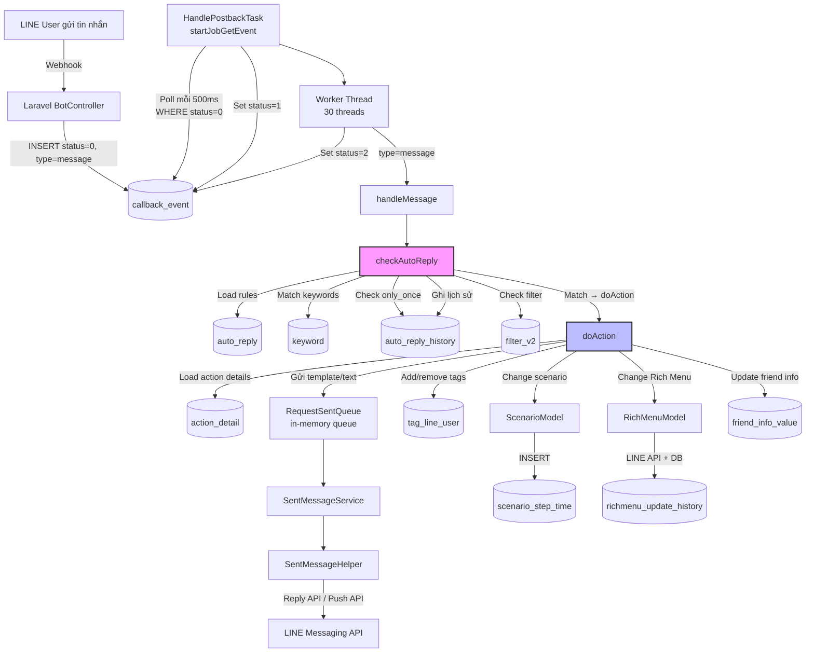

# FA-003 Tự động trả lời「自動応答」— Job Spec

> Phân tích từ source code Spring Boot (`src/job/`).
> Confidence: **Cao** — đọc trực tiếp từ code.

---

## Tổng quan

- **Tính năng liên quan**: FA-003 — Tự động trả lời「自動応答」
- **Mô tả**: Tính năng auto-reply **không có queue table riêng**. Việc thực thi auto-reply diễn ra **đồng bộ trong luồng xử lý callback event** — khi LINE user gửi tin nhắn, Spring Boot nhận callback event từ bảng `callback_event`, kiểm tra danh sách quy tắc auto-reply của bot, match keyword + thời gian + filter, rồi thực thi action (gửi template, gắn tag, thay đổi scenario, đổi Rich Menu...).
- **Kiểu giao tiếp**: Database Polling — Laravel webhook INSERT vào `callback_event` (status=0) → Spring Boot `HandlePostbackTask` poll và xử lý
- **Feature Flag**: `ENABLE_POSTBACK` (trong `config.properties`)
- **Đặc điểm**: Auto-reply không phải là task manager riêng — nó là **một bước xử lý bên trong** `HandlePostbackTask` khi nhận message event. Không có bảng queue trung gian riêng cho auto-reply.

---

## Queue Tables (Bảng trung gian Web ↔ Job)

### Bảng: `callback_event`
- **Entity JPA**: `CallbackEvent` (`@Table(name = "callback_event")`)
- **File Entity**: `src/job/linect-service/src/main/java/sns/line/models/backenddb/entities/CallbackEvent.java`
- **Ai ghi**: Laravel web app — controller `Admin\BotController@callbackWebHook` (route `POST /line/callback/add/{bot_id}`)
- **Trạng thái (State Machine)**:

| Giá trị | Hằng số | Ý nghĩa | Ai set |
|---------|---------|---------|--------|
| 0 | `STATUS_NEW` | Mới tạo, chờ xử lý | Laravel web app |
| 1 | `STATUS_PROCESSING` | Đang xử lý | Spring Boot — `startJobGetEvent()` |
| 2 | `STATUS_DONE` | Hoàn thành | Spring Boot — sau khi xử lý xong |
| 3 | `STATUS_ERROR` | Lỗi xử lý | Spring Boot — catch Exception |
| 4 | `STATUS_UNKNOWN_EVENT` | Event type không nhận diện được | Spring Boot |
| 5 | `STATUS_NOT_FRIEND` | LINE user chưa là bạn | Spring Boot |
| 6 | `STATUS_NOT_FOUND_BOT` | Không tìm thấy bot | Spring Boot |
| 7 | `STATUS_BLOCKED_BY_BOT` | User bị bot block (inactive), không có auto-reply cho inactive | Spring Boot |
| 8 | `STATUS_EXPIRED_BOT` | Bot hết hạn >7 ngày | Spring Boot |
| 9 | `STATUS_UNKNOWN_TYPE` | Type không hỗ trợ trong switch | Spring Boot |
| 10 | `STATUS_IGNORE_GROUP_MESSAGE` | Tin nhắn từ group (không phải user) | Spring Boot |
| 30 | `STATUS_MEDIA_NEW` | Chờ download media (image, video, file) | Spring Boot |
| 31 | `STATUS_MEDIA_PROCESSING` | Đang download media | Spring Boot |
| 33 | `STATUS_MEDIA_ERROR` | Lỗi download media | Spring Boot |
| 50 | `STATUS_IMAGE_MAP_NEW` | Chờ xử lý image map | Spring Boot |

- **Điều kiện poll**: `WHERE status = 0` (STATUS_NEW)
- **Tần suất poll**: 500ms khi có dữ liệu, 500ms sleep khi không có dữ liệu; 1000ms sleep khi exception
- **Columns**:
  - `id` (PK auto-increment)
  - `user_id` — admin_id của bot
  - `bot_id` — ID bot nhận event
  - `line_id` — LINE user ID (source.userId)
  - `type` — loại event: `message`, `postback`, `follow`, `unfollow`, `unsend`, `join`, `leave`, `videoPlayComplete`
  - `request` — JSON chứa toàn bộ event payload từ LINE
  - `status` — trạng thái xử lý (state machine ở trên)
  - `error_message` — thông báo lỗi (nếu có)
  - `created_at` — thời điểm tạo

- **Tin cậy**: **Cao** — `CallbackEvent.java`, `BotController.php:1776-1860`

### Bảng: `auto_reply` (đọc, không phải queue)
- **Entity JPA**: `AutoReply` (`@Table(name = "auto_reply")`)
- **File Entity**: `src/job/linect-service/src/main/java/sns/line/models/linedb/entities/AutoReply.java`
- **Vai trò**: Lưu cấu hình quy tắc auto-reply. Spring Boot **ĐỌC** bảng này khi xử lý message event để kiểm tra match.
- **Không phải queue table** — dữ liệu được Laravel web app CRUD quản lý, Spring Boot chỉ đọc.
- **Tin cậy**: **Cao** — `AutoReply.java`

### Bảng: `keyword` (đọc, không phải queue)
- **Entity JPA**: `KeywordReply` (`@Table(name = "keyword")`)
- **File Entity**: `src/job/linect-service/src/main/java/sns/line/models/linedb/entities/KeywordReply.java`
- **Vai trò**: Lưu danh sách keywords cho mỗi quy tắc auto-reply. Spring Boot dùng native query `matchingKeyword()` để kiểm tra keyword match.
- **Tin cậy**: **Cao** — `KeywordReply.java`, `AutoReplyKeywordRepository.java`

### Bảng: `auto_reply_history` (ghi)
- **Entity JPA**: `AutoReplyHistory` (`@Table(name = "auto_reply_history")`)
- **File Entity**: `src/job/linect-service/src/main/java/sns/line/models/linedb/entities/AutoReplyHistory.java`
- **Vai trò**: Ghi lại lịch sử LINE user đã trigger quy tắc auto-reply nào. Dùng để kiểm tra `only_once` (chỉ trả lời 1 lần).
- **Columns**: `id`, `line_id` (FK → line_users.id), `reply_id` (FK → auto_reply.id)
- **Tin cậy**: **Cao** — `AutoReplyHistory.java`, `AutoReplyHistoryRepository.java`

---

## Task Managers (Entry Points)

### HandlePostbackTask
- **File**: `src/job/linect-service/src/main/java/sns/line/task/HandlePostbackTask.java`
- **Feature flag**: `ConfigFile.ENABLE_POSTBACK`
- **Khởi tạo trong**: `AppMain.run()` — `handlePostbackTask.startHandleCallbackEvent()` (dòng 271-272)
- **Thread pool**: `Executors.newFixedThreadPool(MAX_THREAD + 5)` với `MAX_THREAD = 30` → tổng 35 threads
- **Kiến trúc nội bộ** (3 polling loops + 30 worker threads):

| Thread | Chức năng | Poll điều kiện | Sleep |
|--------|----------|---------------|-------|
| `startJobGetEvent` (1 thread) | Poll events mới → đẩy vào in-memory queue | `status = STATUS_NEW (0)` | 500ms |
| `startJobGetMediaEvent` (1 thread) | Poll media events → đẩy vào in-memory queue | `status = STATUS_MEDIA_NEW (30)` | 500ms |
| `startJobGetImageMap` (1 thread) | Poll image map events → đẩy vào in-memory queue | `status = STATUS_IMAGE_MAP_NEW (50)` | 500ms |
| Worker threads (30 threads) | Lấy event từ in-memory queue → dispatch xử lý | In-memory `LinkedList<CallbackEvent>` | 500ms khi queue rỗng |

- **Polling logic**:
  1. `startJobGetEvent` thread: `while(true)` → `callbackEventRepository.findAllByStatus(STATUS_NEW)` → set status=1 (PROCESSING) → `saveAll()` → thêm vào `callbackEventQueue` (LinkedList, synchronized)
  2. Worker threads: `while(true)` → `getCallbackEvent()` (poll từ LinkedList) → nếu có event → dispatch theo type
  3. Dispatch: switch `callbackEvent.getType()`:
     - `"message"` → `doHandleMessage(event)` — **đây là entry point cho auto-reply**
     - `"postback"` → `doHandlePostbackEvent(event)`
     - `"follow"` → `doHandleFollowEvent(event)`
     - `"unfollow"` → `doHandleUnFollowEvent(event)`
     - `"unsend"` → `doHandleUnsend(event)`
     - `"join"` → `doHandleJoinGroup(event)`
     - `"leave"` → `doHandleLeaveGroup(event)`
     - `"videoPlayComplete"` → `doHandleVideoPlayComplete(event)`

- **Concurrency**: Sử dụng `ConcurrentHashMap<String, LockWrapper>` để lock theo key (line_id), đảm bảo 1 user không bị xử lý song song bởi nhiều worker thread.
- **Tin cậy**: **Cao** — `HandlePostbackTask.java:56-350`

### SentMessageService (phụ trợ — gửi tin nhắn qua LINE API)
- **File**: `src/job/linect-service/src/main/java/sns/line/helper/SentMessageService.java`
- **Khởi tạo trong**: `AppMain.run()` — `sentMessageService.startService()` (dòng 205)
- **Vai trò**: Consumer của `RequestSentQueue` — lấy request gửi tin nhắn từ in-memory queue → build message → gọi LINE API
- **Thread pool**: `Executors.newFixedThreadPool(ConfigFile.MAX_SENT_MESSAGE_THREAD)`
- **Tin cậy**: **Cao** — `SentMessageService.java:15-80`

---

## Processing Chain (Chuỗi xử lý)

### Luồng chính: LINE user gửi tin nhắn → Auto-reply match → Thực thi action

```
LINE Platform → Webhook POST /line/callback/add/{bot_id}
  → Laravel BotController@callbackWebHook
  → INSERT callback_event (status=0, type="message", request=JSON)

Spring Boot HandlePostbackTask:
  startJobGetEvent polls callback_event WHERE status=0
  → set status=1, đẩy vào in-memory queue
  → Worker thread lấy event từ queue
  → switch type="message" → doHandleMessage(event)
    → parseCallbackEventData(event) → List<LineCallback>
    → handleMessage(event, callback)
      → Tìm LineUser, Conversation
      → Nếu conversation.isBlockedByBot() → handleMessageInactiveUser()
      → Lưu tin nhắn vào MessagesV2s
      → checkAutoReply(bot, conversation, lineUser, callbackMessage, replyToken, callback)
        → Load auto_reply rules cho bot
        → Với mỗi rule:
          ① Kiểm tra only_once (auto_reply_history)
          ② Kiểm tra skip reply button (isNoReplyButton)
          ③ Kiểm tra keyword match (matchingKeyword native query)
          ④ Kiểm tra time match (dayOfWeek + startTime/endTime)
          ⑤ Kiểm tra filter_v2 (FilterV2.FILTER_TYPE_AUTO_REPLY)
          → Nếu match → doAction() → thực thi actions
          → Lưu auto_reply_history
      → Cập nhật lastMessage, notify socket
  → set status=2 (DONE)
```

### Luồng inactive user: Bot đã block user nhưng có auto-reply cho inactive

```
handleMessage → conversation.isBlockedByBot() = true
  → handleMessageInactiveUser(event, callback, bot, lineUser, conversation)
    → Kiểm tra existsAllBy...IsApplyActiveFriend (inactive auto-reply rules tồn tại?)
    → Nếu không có → set STATUS_BLOCKED_BY_BOT, return
    → Nếu có → checkAutoReply() (chỉ load rules cho inactive users)
    → Nếu match → unhide conversation, lưu tin nhắn, update lastMessage
```

### Luồng doAction (thực thi actions khi auto-reply match)

```
doAction(botId, lineUser, conversation, replyToken, ..., actionIds, ...)
  → Load ActionDetail list cho mỗi actionId
  → Với mỗi ActionDetail:
    → Kiểm tra filter_v2 (FilterV2.FILTER_TYPE_ACTION)
    → Switch action.type:
      "scenario"  → set scenarioIdStart (bắt đầu/dừng scenario)
      "template"  → thêm vào actionTemplateIdList
      "text"      → tạo TemplateCacheManager text message
      "remind"    → startEvent (bắt đầu/dừng event remind)
      "tag"       → thêm vào listAddTag/listRemoveTag
      "richmenu"  → set setRichMenuId
      "friend_info" → cập nhật thông tin friend
      "bookmark"  → đánh dấu/bỏ bookmark conversation
      "block"     → block/unblock/hide/unhide user
      "compliant_status" → thay đổi status chat

  → Gửi templates qua LINE API:
    → Build RequestSentTemplateToUser
    → RequestSentQueue.pushRequestToQueue(rqSent) → in-memory queue
    → SentMessageService poll → SentMessageHelper.sentMessage()
      → MessageBuilder.build() → LINE SDK Message objects
      → Nếu có replyToken → LINE Reply API
      → Nếu không → LINE Push API

  → Xử lý tags:
    → LineUserModel.addTagToUserWithoutTagActionAndReturnNewTags()
    → Nếu tag có actionId → đệ quy doAction() cho tag action
    → Nếu tag có scenarioId → set scenarioIdStart
    → Nếu tag có richMenuId → set setRichMenuId
    → Remove tags: xóa TagLineUser records

  → Xử lý Rich Menu:
    → RichMenuModel.updateRichMenu() hoặc linkToDefault()

  → Bắt đầu Scenario:
    → ScenarioModel.startScenarioWithCreatedSentNow() hoặc startScenario()
```

---

## Services & Helpers (Chi tiết logic)

### HandlePostbackTask — checkAutoReply()
- **File**: `src/job/linect-service/src/main/java/sns/line/task/HandlePostbackTask.java`
- **Dòng**: 1523-1636
- **Input**: `Bot bot, Conversation conversation, LineUser lineUser, LineCallbackMessage callbackMessage, String replyToken, Consumer<Boolean> replyCallback`
- **Output**: Gọi `replyCallback.accept(true/false)` để báo caller có auto-reply hay không
- **Logic chi tiết**:
  1. **Load rules**: Phân nhánh theo `conversation.isBlockedByBot()`:
     - Blocked → `findAllByBotIdAndIsStopedIsNotAndIsDeletedIsNotAndIsApplyActiveFriend(botId, 1, 1, INACTIVE_TARGET_USER)` — chỉ lấy rules cho inactive users
     - Active → `findAllByBotIdAndIsStopedIsNotAndIsDeletedIsNotAndIsApplyActiveFriendIsNot(botId, 1, 1, INACTIVE_TARGET_USER)` — lấy rules cho active users
     - Điều kiện: `is_stopped != 1 AND is_deleted != 1`
  2. **Duyệt từng rule** (theo thứ tự từ DB, không sort theo position):
     - **Kiểm tra only_once**: `auto_reply_history.existsByLineIdAndReplyId()` → nếu `responseNumber != 0` (chỉ 1 lần) và đã replied → skip
     - **Kiểm tra skip reply button**: nếu `isNoReplyButton=1` và text bắt đầu bằng `「【」` kết thúc bằng `「】」` → skip (bỏ qua click button)
     - **Kiểm tra keyword**:
       - `keywordReactionType = KEYWORD_SPECIFIC (1)`: Dùng native SQL query `matchingKeyword()` trên bảng `keyword`
         - `logical = 0` (OR): match nếu `totalm > 0` (ít nhất 1 keyword match)
         - `logical = 1` (AND): match nếu `totalm == totalk` (tất cả keywords đều match)
         - Keyword matching trong SQL: `CASE WHEN keyword.logical = 1 THEN LOCATE(keyword COLLATE utf8mb4_bin, val) ELSE val = keyword COLLATE utf8mb4_bin END`
           - `logical=1` (partial match): LOCATE — tìm keyword trong text
           - `logical=0` (exact match): `val = keyword` — so sánh exact, case-sensitive (utf8mb4_bin)
       - `keywordReactionType = KEYWORD_ANY (0)`: Luôn match — bất kỳ tin nhắn nào
     - **Kiểm tra time**:
       - `timeReactionType = TIME_SPECIFIC (1)`: Kiểm tra `dayOfWeek` chứa ngày hiện tại VÀ `startTime <= now <= endTime`
       - `timeReactionType = TIME_ANY (0)`: Luôn match — bất kỳ thời điểm nào
     - **Kiểm tra filter**: `checkFilterV2()` → `LineUserModel.isValidFilterV2(FILTER_TYPE_AUTO_REPLY, autoReply.id, botId, lineUser.id, isBlocked)`
  3. **Khi match**:
     - Nếu rule có `actionId > 0` → gọi `doAction()` với triggerType:
       - `TYPE_AUTO_REPLY_ALL (5001)` nếu keywordReactionType = ANY
       - `TYPE_AUTO_REPLY_KEYWORD (5002)` nếu keywordReactionType = SPECIFIC
     - Lưu `AutoReplyHistory(lineId, replyId)` — ghi nhận user đã trigger rule này
     - **KHÔNG break sau match đầu tiên** — tiếp tục duyệt rule tiếp theo → **nhiều rules có thể match đồng thời**
  4. **Callback**: `replyCallback.accept(hasReply)` — thông báo cho caller để xác định confirm message hay không
- **Tables đọc**: `auto_reply`, `keyword`, `auto_reply_history`, `filter_v2`
- **Tables ghi**: `auto_reply_history`
- **Tin cậy**: **Cao** — `HandlePostbackTask.java:1523-1636`

### HandlePostbackTask — checkFilterV2()
- **File**: `HandlePostbackTask.java:1646-1648`
- **Logic**: Delegate sang `LineUserModel.isValidFilterV2(FilterV2.FILTER_TYPE_AUTO_REPLY, autoReply.getId(), botId, lineUserId, filterBlock)`
- **Bảng tham chiếu**: `filter_v2` với `type = "auto_reply"`
- **Tin cậy**: **Cao**

### HandlePostbackTask — doAction()
- **File**: `HandlePostbackTask.java:3364-3899`
- **Input**: `botId, lineUser, conversation, replyToken, scenarioIdStart, scenarioStartDay, scenarioStartTime, scenarioType, setRichMenuId, sentTemplateIds, listAddTag, listRemoveTag, actionIds, actionScenarioTypeMap, ignoreHandled, startedOtherScenario, startActionInfo`
- **Logic chi tiết**:
  1. Build messages cho `sentTemplateIds` (templates trực tiếp từ auto-reply rule — hiện tại luôn rỗng khi gọi từ checkAutoReply)
  2. Load `ActionDetail` list cho mỗi `actionId`
  3. Với mỗi `ActionDetail`:
     - Kiểm tra `action.botId` khớp (bỏ qua nếu khác bot)
     - Kiểm tra filter_v2 (`FILTER_TYPE_ACTION`)
     - Switch theo `action.type`: scenario, template, text, remind, tag, richmenu, friend_info, bookmark, block, compliant_status, v.v.
  4. Gửi templates: `RequestSentQueue.pushRequestToQueue(rqSent)` → đẩy vào in-memory queue → `SentMessageService` xử lý
  5. Xử lý tags: add/remove tags, đệ quy `doAction()` nếu tag có chained action
  6. Xử lý Rich Menu: `RichMenuModel.updateRichMenu()`
  7. Bắt đầu Scenario: `ScenarioModel.startScenarioWithCreatedSentNow()`
- **Đệ quy**: Có thể gọi lại `doAction()` khi tag có `actionId` → cần `ignoreHandled` map để tránh vòng lặp
- **Tables đọc**: `action`, `action_detail`, `template`, `source_messages`, `tags`, `tag_line_user`, `filter_v2`, `bot_line_user`, `conversation`, `rich_menus`, `scenario`, `friend_info_setting`, `friend_info_value`, `friend_info_option_selects`, `status_chat`
- **Tables ghi**: `tag_line_user`, `bot_line_user`, `conversation`, `line_user`, `friend_info_value`, `rich_menu_update_history` (gián tiếp qua RichMenuModel), `scenario_line_user` (gián tiếp qua ScenarioModel), `messages_v2s`, `source_messages`
- **Tin cậy**: **Cao** — `HandlePostbackTask.java:3364-3899`

### SentMessageHelper — sentMessage()
- **File**: `src/job/linect-service/src/main/java/sns/line/helper/SentMessageHelper.java`
- **Input**: `RequestSentTemplateToUser req`
- **Logic**:
  1. Validate bot và lineUser
  2. Với mỗi templateId → `TemplateCacheManager.getTemplate()` → `MessageBuilder.build()` → LINE SDK Message objects
  3. Nếu có `replyToken` → LINE Reply API (sử dụng token từ webhook event)
  4. Nếu không → LINE Push API (gửi trực tiếp tới user)
- **Tin cậy**: **Cao** — `SentMessageHelper.java:54-100`

### AutoReplyKeywordRepository — matchingKeyword()
- **File**: `src/job/linect-service/src/main/java/sns/line/models/linedb/repository/AutoReplyKeywordRepository.java`
- **Native SQL Query**:
```sql
SELECT COUNT(keyword.id) as totalk,
       ? as val,
       keyword.keyword as keyw,
       (SELECT COUNT(keyword.id) FROM keyword
        WHERE keyword.auto_reply_id = ?
        AND CASE
          WHEN keyword.logical = 1 THEN LOCATE(keyword.keyword COLLATE 'utf8mb4_bin', val)
          ELSE val = keyword.keyword COLLATE 'utf8mb4_bin'
        END) as totalm
FROM keyword
LEFT JOIN auto_reply ON auto_reply.id = keyword.auto_reply_id
WHERE auto_reply_id = ?
```
- **Giải thích**:
  - `totalk` = tổng số keywords của rule
  - `totalm` = số keywords match với text input
  - `keyword.logical = 1` → partial match (LOCATE — tìm keyword trong text)
  - `keyword.logical = 0` → exact match (so sánh bằng, case-sensitive qua utf8mb4_bin collation)
  - Text input được `TextUtils.trimEnd()` trước khi truyền vào
- **Tin cậy**: **Cao** — `AutoReplyKeywordRepository.java:18-19`

---

## External API Calls

| API | Service Class | Endpoint/Method | Khi nào gọi | Retry? |
|-----|-------------|-----------------|-------------|--------|
| LINE Messaging API — Reply | `SentMessageHelper` → LINE SDK | `replyMessage(replyToken, messages)` | Khi auto-reply match và có template/text action, lần gọi đầu tiên dùng replyToken | Có — qua `RequestSentQueue.retryPushRequestToQueue()` khi status=1000 |
| LINE Messaging API — Push | `SentMessageHelper` → LINE SDK | `pushMessage(lineUserId, messages)` | Khi replyToken đã hết hạn hoặc không có | Có — cùng cơ chế retry |
| LINE Messaging API — Rich Menu | `RichMenuModel` | `linkRichMenuIdToUser()` | Khi action type = "richmenu" | Không rõ — **Trung bình** |

---

## Data Flow Diagram



---

## Error Handling

| Tình huống | Xử lý | File:Line |
|-----------|--------|-----------|
| Exception trong `checkAutoReply` | `try-catch` → log error `#checkAutoReply Exception bot {id}`, tiếp tục xử lý (không throw) → `replyCallback.accept(false)` | `HandlePostbackTask.java:1630-1634` |
| Exception trong `doAction` (mỗi ActionDetail) | `try-catch` bên trong loop → log error + `NotifyUtils.sendReportChatworkLowPriority()` → tiếp tục action tiếp theo | `HandlePostbackTask.java:3777-3781` |
| Exception trong `doHandleMessage` | `try-catch` → set `STATUS_ERROR`, lưu `errorMessage` → `callbackEventRepository.save(event)` | `HandlePostbackTask.java:1052-1058` |
| Bot không tìm thấy | Set `STATUS_NOT_FOUND_BOT` → skip event | `HandlePostbackTask.java:1014-1016` |
| Bot hết hạn >7 ngày | Set `STATUS_EXPIRED_BOT` → skip event | `HandlePostbackTask.java:306-309` |
| LINE API gửi tin lỗi (status=1000) | `RequestSentQueue.retryPushRequestToQueue()` → đẩy lại vào retry queue | `SentMessageService.java:50-51` |
| Download media lỗi | Set `STATUS_MEDIA_ERROR` + log error + Chatwork notification | `HandlePostbackTask.java:1288-1292` |

> Ghi chú: Hệ thống KHÔNG có message queue hay dead letter queue. Error handling chủ yếu bằng try-catch + logging + Chatwork notification. Callback event status được cập nhật để tracking.

---

## Liên kết với Web App

| Action trên Web | Queue Table | Trường trigger | Task Manager | Kết quả |
|----------------|-------------|---------------|-------------|---------|
| LINE user gửi tin nhắn → LINE webhook → Laravel `callbackWebHook` | `callback_event` | `status=0, type="message"` | `HandlePostbackTask` | Kiểm tra auto-reply rules → nếu match → gửi reply, gắn tag, đổi scenario, v.v. |
| Admin tạo/sửa auto-reply rule (CRUD) | `auto_reply`, `keyword` | Không trigger job | Không — chỉ lưu cấu hình | Spring Boot đọc config mới lần tiếp theo có message event |
| Admin bật/tắt rule (`is_stopped`) | `auto_reply` | `is_stopped = 0/1` | Không — chỉ lưu cấu hình | Spring Boot kiểm tra `is_stopped != 1` khi load rules |
| Auto-reply match → action "template" | In-memory `RequestSentQueue` | Không qua DB | `SentMessageService` | Gửi template qua LINE Reply/Push API |
| Auto-reply match → action "scenario" | `scenario_step_time` (gián tiếp) | `status`, `time` | `NewScenarioTaskV3` (`ENABLE_SCENARIO`) | Bắt đầu scenario flow cho user |
| Auto-reply match → action "remind" | `event_step_time` (gián tiếp) | `status`, `time` | `EventBotTask` (`ENABLE_EVENT`) | Bắt đầu event/remind flow |
| Auto-reply match → action "richmenu" | `richmenu_update_history` (gián tiếp) | Rich Menu linking | Đồng bộ qua LINE API | Cập nhật Rich Menu cho user |

---

## Ghi chú bổ sung

### Thứ tự xử lý rules
- Các rules được load từ DB theo thứ tự mặc định (không ORDER BY position)
- **Nhiều rules có thể match** — vòng lặp KHÔNG break sau match đầu tiên
- Mỗi rule match sẽ tạo riêng `AutoReplyHistory` entry
- **Tin cậy**: **Cao** — `HandlePostbackTask.java:1532-1628`

### Active vs Inactive Users
- `is_apply_active_friend` trên bảng `auto_reply` phân biệt rules cho active/inactive users
- `ACTIVE_TARGET_USER = 1`, `INACTIVE_TARGET_USER = 0`
- Khi `conversation.isBlockedByBot()` → chỉ load rules có `is_apply_active_friend = INACTIVE_TARGET_USER (0)`
- Khi user active → load rules có `is_apply_active_friend != INACTIVE_TARGET_USER` (bao gồm null và 1)
- **Tin cậy**: **Cao** — `AutoReply.java:22-24`, `HandlePostbackTask.java:1527-1530`

### Cơ chế `isNoReplyButton`
- Khi `is_no_reply_button = 1` trên auto-reply rule → bỏ qua tin nhắn có dạng `「【...】」` (text bắt đầu bằng 【 và kết thúc bằng 】)
- Mục đích: tránh trigger auto-reply khi user click button/carousel (button text thường có format 【text】)
- **Tin cậy**: **Cao** — `HandlePostbackTask.java:1535-1539`

### Confirm Message Logic
- Sau khi `checkAutoReply` trả `hasReply`, caller quyết định tin nhắn có cần confirm không:
  - `bot.isConfirmMessageAutoreply() && hasReply` → needConfirm = true (tin nhắn đã được auto-reply → tự confirm)
  - `bot.isConfirmMessageButton()` && text dạng 【...】 → needConfirm = true
  - `bot.isConfirmMessageStamp()` && type = sticker → needConfirm = true
- Nếu KHÔNG confirm → tạo `UnconfirmMessage` record → hiển thị thông báo cho admin trong chat
- **Tin cậy**: **Cao** — `HandlePostbackTask.java:1312-1337`
