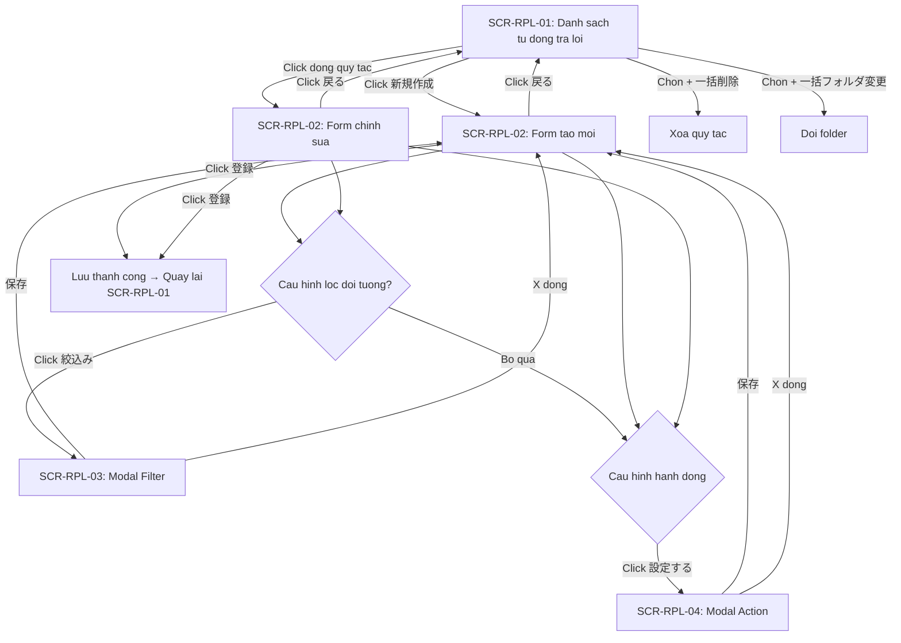

# FA-003 Tu dong tra loi — UI Spec

## Tong quan
- **Ma tinh nang**: FA-003
- **Ten**: Tu dong tra loi
- **Ten JP**: 「自動応答」
- **Mo ta**: Thiet lap quy tac tu dong tra loi tin nhan LINE dua tren keyword, lich trinh va dieu kien loc doi tuong. Khi nguoi dung LINE gui tin nhan phu hop dieu kien, he thong tu dong thuc hien hanh dong da cau hinh (gui template, gan tag, chuyen step, v.v.).
- **Portal**: Admin
- **URL pattern**: `/basic/reply`, `/basic/reply/new`
- **Phan loai**: Ho tro khach hang

## Doi tuong su dung (Actors)
| Actor | Vai tro | Quyen truy cap |
|-------|---------|----------------|
| Admin (LINE OA) | Tao va quan ly cac quy tac tu dong tra loi cho LINE Official Account | Toan quyen — tao, sua, xoa, bat/tat quy tac |
| Staff | Nhan vien do Admin tao, truy cap cung giao dien | Tuy role — co the bi gioi han quyen tao/sua/xoa tu dong tra loi |

## Cac man hinh

---

### SCR-RPL-01: Danh sach tu dong tra loi
- **URL**: `/basic/reply`
- **Tieu de trang**: 「自動応答」
- **Screenshot**: `screenshots/main-list-clean.png`

#### Layout tong the
- **Header**: Heading「自動応答」voi link「マニュアル」(den trang huong dan su dung tai lme.jp)
- **Sidebar trai**: Khu vuc quan ly folder (「フォルダ」), cho phep phan loai cac quy tac tu dong tra loi vao cac folder khac nhau
- **Khu vuc chinh (phai)**: Toolbar hanh dong phia tren + Bang du lieu danh sach quy tac

#### Sidebar — Quan ly Folder
| Vi tri | Element | Text JP | Loai | Hanh vi |
|--------|---------|---------|------|---------|
| Header sidebar | Label | 「フォルダ」 | Text | Tieu de khu vuc |
| Header sidebar | Icon button (+) | — | Button (icon) | Tao folder moi |
| Header sidebar | Icon button (edit) | — | Button (icon) | Chinh sua/xoa folder |
| Body sidebar | Folder item | 「未分類 (0)」 | Link/Button | Loc danh sach theo folder. So trong ngoac la so quy tac trong folder |

#### Thanh cong cu (Toolbar)
| Vi tri | Element | Text JP | Loai | Hanh vi |
|--------|---------|---------|------|---------|
| Trai | Button | 「新規作成」 | Button (primary) | Chuyen den man hinh tao moi tai `/basic/reply/new?group_id={folder_id}` |
| Phai | Link | 「並べ替え」 | Link | Sap xep lai thu tu cac quy tac (keo tha hoac sort) |
| Phai | Button/Text | 「一括フォルダ変更」 | Button | Doi folder hang loat cho cac quy tac da chon |
| Phai | Button/Text | 「一括削除」 | Button | Xoa hang loat cac quy tac da chon |

#### Bang du lieu
| # | Cot | Text JP | Kieu du lieu | Sortable? | Ghi chu |
|---|-----|---------|-------------|----------|---------|
| 1 | Checkbox chon | — | Checkbox | Khong | Checkbox o header la "chon tat ca", checkbox o moi dong la chon tung quy tac |
| 2 | Ngay tao | 「作成日」 | Date | Co the | Ngay tao quy tac tu dong tra loi |
| 3 | Trang thai hoat dong | 「稼働状況」 | Badge/Toggle | Khong | Trang thai bat/tat cua quy tac |
| 4 | Keyword | 「キーワード」 | Text | Khong | Hien thi keyword da cau hinh hoac「全てのメッセージ」neu phan ung voi tat ca |
| 5 | Lich trinh | 「スケジュール」 | Text | Khong | Hien thi lich trinh: 「常に」hoac cac ngay/gio cu the |
| 6 | (Cot trong) | — | Action | Khong | Nut chinh sua (chuyen den form edit) |
| 7 | (Cot trong) | — | Action | Khong | Nut xoa quy tac |

#### Pagination / Filtering
- **Loc theo folder**: Chon folder o sidebar trai de loc
- **Phan trang**: Chua quan sat duoc (danh sach trong voi 0 records) — can kiem tra khi co du lieu

#### Observations
- Bang hien thi trong (0 records) trong screenshot — chua the xac nhan format du lieu cu the trong cac cot
- Co 2 columnheader trong cuoi cung (ref e208, e209) khong co text — du kien la cac nut action (edit, delete) tren moi dong
- Sidebar folder hien chi co「未分類 (0)」— co the tao them folder qua icon (+)

---

### SCR-RPL-02: Tao moi / Chinh sua tu dong tra loi
- **URL**: `/basic/reply/new?group_id={folder_id}` (tao moi) hoac `/basic/reply/{id}/edit` (chinh sua, suy luan)
- **Tieu de trang**: 「自動応答」
- **Screenshot**: `screenshots/create-form.png`, `screenshots/create-form-keyword.png`, `screenshots/create-form-schedule.png`

#### Layout tong the
Form doc gom 5 phan (sections) chinh, xep theo thu tu tu tren xuong:
1. 「アクション稼働対象絞り込み」— Loc doi tuong ap dung
2. 「フォルダ」— Chon folder
3. 「キーワード設定」— Cai dat keyword kich hoat
4. 「スケジュール設定」— Cai dat lich trinh
5. 「アクション設定」— Cai dat hanh dong thuc hien

Footer co 2 nut:「戻る」(quay lai danh sach) va「登録」(luu).

#### Phan 1: Loc doi tuong — 「アクション稼働対象絞り込み」

| # | Label JP | Loai input | Bat buoc? | Gia tri mac dinh | Ghi chu |
|---|---------|-----------|----------|-----------------|---------|
| 1 | 「有効友だち」/「ブロックした友だち」 | Radio button group | Co | 「有効友だち」(suy luan) | Chon doi tuong: ban be dang hoat dong hoac ban be da block |
| 2 | 「絞込み」 | Button | Khong | — | Mo modal filter (SCR-RPL-03) de thiet lap dieu kien loc chi tiet |
| 3 | 「対象人数」 | Display (link) | — | "1人" | Hien thi so nguoi phu hop dieu kien. Click de xem danh sach (suy luan) |
| 4 | 「対象条件」 | Display | — | (trong) | Hien thi tom tat dieu kien loc da thiet lap |

#### Phan 2: Folder — 「フォルダ」

| # | Label JP | Loai input | Bat buoc? | Gia tri mac dinh | Ghi chu |
|---|---------|-----------|----------|-----------------|---------|
| 1 | 「フォルダ」 | Combobox (select) | Co | 「未分類」 | Chon folder de phan loai quy tac. Options lay tu danh sach folder cua tinh nang |

#### Phan 3: Keyword — 「キーワード設定」

| # | Label JP | Loai input | Bat buoc? | Gia tri mac dinh | Ghi chu |
|---|---------|-----------|----------|-----------------|---------|
| 1 | 「利用設定」 | Combobox (select) | Co | 「全てのメッセージに反応」 | 2 options: 「全てのメッセージに反応」(phan ung moi tin nhan), 「設定したキーワードに反応」(chi phan ung keyword cu the) |
| 2 | 「【〇〇】のメッセージには反応させない」 | Checkbox | Khong | Unchecked | Bo qua tin nhan tu [XX] — 〇〇 la placeholder, can xac minh y nghia cu the |
| 3 | 「反応条件」 | Combobox (select) | Co (khi keyword mode) | 「どれか1つのキーワードに当てはまる時に反応」 | Chi hien khi「利用設定」= 「設定したキーワードに反応」. 2 options: AND (tat ca keyword) / OR (bat ky keyword nao) |
| 4 | 「キーワード」 | Textbox + Combobox | Co (khi keyword mode) | — | Nhap keyword + chon kieu so khop. Combobox co 2 options: 「完全一致」(exact match), 「部分一致」(partial match) |
| 5 | (Nut them keyword) | Icon button (+) | — | — | Them dong keyword moi (co the nhap nhieu keyword) |

**Dieu kien hien thi (conditional display)**:
- Khi「利用設定」= 「全てのメッセージに反応」: chi hien checkbox「【〇〇】のメッセージには反応させない」
- Khi「利用設定」= 「設定したキーワードに反応」: hien them「反応条件」,「キーワード」va nut them keyword

#### Phan 4: Lich trinh — 「スケジュール設定」

| # | Label JP | Loai input | Bat buoc? | Gia tri mac dinh | Ghi chu |
|---|---------|-----------|----------|-----------------|---------|
| 1 | 「反応設定」 | Combobox (select) | Co | 「常に（24時間/365日）反応する」 | 2 options: luon phan ung (24/7) hoac cai dat theo ngay/gio |
| 2 | 「曜日設定」 | Checkbox group | Co (khi schedule mode) | Tat ca unchecked | Chi hien khi chon schedule mode. Gom: 「全選択」+ 7 ngay: 「月」「火」「水」「木」「金」「土」「日」 |
| 3 | 「時間帯設定」 | 2 x Time picker | Co (khi schedule mode) | 0:41 — 0:41 (gia tri mac dinh quan sat) | Khoang thoi gian phan ung: tu (から) — den. Format HH:mm |

**Dieu kien hien thi**:
- Khi「反応設定」= 「常に（24時間/365日）反応する」: an phan ngay/gio
- Khi「反応設定」= 「反応する曜日・時間を設定する」: hien「曜日設定」va「時間帯設定」

#### Phan 5: Hanh dong — 「アクション設定」

| # | Label JP | Loai input | Bat buoc? | Gia tri mac dinh | Ghi chu |
|---|---------|-----------|----------|-----------------|---------|
| 1 | 「1度のみアクション稼働」/「何度でもアクション稼働」 | Radio button group | Co | 「何度でもアクション稼働」(checked trong snapshot) | Chon che do: chi thuc hien 1 lan / thuc hien moi lan dieu kien thoa man |
| 2 | 「設定する」 | Button | — | — | Mo modal action (SCR-RPL-04) de cau hinh hanh dong cu the |

#### Footer actions
| Vi tri | Element | Text JP | Loai | Hanh vi |
|--------|---------|---------|------|---------|
| Trai | Link | 「戻る」 | Link | Quay lai danh sach tai `/basic/reply` |
| Phai | Button | 「登録」 | Button (primary) | Luu quy tac tu dong tra loi. POST du lieu len server |

#### Observations
- Form khong co truong nhap ten/tieu de cho quy tac — ten quy tac co the tu dong sinh tu keyword hoac khong co truong ten rieng
- Checkbox「【〇〇】のメッセージには反応させない」— 〇〇 co the la ten bot hoac ten tai khoan LINE OA, can kiem tra code
- Gia tri mac dinh time picker la 0:41 — co the la gia tri hien tai cua server khi load trang, khong phai gia tri co dinh
- Radio button「何度でもアクション稼働」duoc chon mac dinh (checked)
- Khu vuc「アクション設定」su dung shared component SC-004 (Action Settings)

---

### SCR-RPL-03: Modal Loc doi tuong — 「絞り込み」
- **URL**: Cung trang voi SCR-RPL-02 (modal overlay)
- **Tieu de modal**: 「絞り込み」
- **Screenshot**: `screenshots/filter-modal.png`, `screenshots/create-form-filter.png`

#### Layout tong the
- Modal dialog voi header (tieu de + nut dong)
- 2 khu vuc dieu kien: AND va OR
- Panel chon loai dieu kien (11 loai)
- Footer: nut「保存」

#### Cau truc dieu kien
| Khu vuc | Text JP | Mo ta |
|---------|---------|-------|
| AND conditions | 「「全て満たす」必要がある条件 (and条件)を追加」 | Dieu kien AND — tat ca phai thoa man |
| OR conditions | 「「どれか1つ以上満たす」必要がある条件 (or条件)を追加」 | Dieu kien OR — chi can 1 dieu kien thoa man |

#### Cac loai dieu kien (Filter types)
| # | Text JP | Kieu loc | Ghi chu |
|---|---------|---------|---------|
| 1 | 「タグ」 | Tag | Loc theo tag da gan cho ban be. Lien quan SC-002 (Tag Selector) |
| 2 | 「友だち名」 | Friend name | Loc theo ten ban be |
| 3 | 「友だち追加日」 | Friend added date | Loc theo ngay them ban be |
| 4 | 「ステップ購読状況」 | Step subscription status | Loc theo trang thai dang ky step delivery |
| 5 | 「QRコードアクション」 | QR Code Action | Loc theo hanh dong QR code da thuc hien |
| 6 | 「コンバージョン」 | Conversion | Loc theo trang thai chuyen doi |
| 7 | 「確認状況」 | Confirmation status | Loc theo trang thai xac nhan |
| 8 | 「友だち情報」 | Friend information | Loc theo thong tin tuy chinh cua ban be |
| 9 | 「対応ステータス」 | Response status | Loc theo trang thai doi ung |
| 10 | 「アフィリエイター」 | Affiliator | Loc theo nguon gioi thieu |
| 11 | 「新規・既存 友だち」 | New/Existing friend | Loc ban be moi hoac ban be cu |

#### Action buttons
| Vi tri | Element | Text JP | Loai | Hanh vi |
|--------|---------|---------|------|---------|
| Header | Button (X) | — | Icon button | Dong modal, khong luu |
| Footer | Button | 「保存」 | Button (primary) | Luu dieu kien loc va dong modal |

#### Observations
- Modal filter nay la shared component SC-003 (Friend Filter/Segment) — cung co 11 loai dieu kien giong nhu o cac tinh nang khac (FA-002, FA-008, FA-009, FA-013)
- Chua quan sat duoc giao dien chi tiet khi chon tung loai dieu kien (vi du: khi chon「タグ」thi form nhap tren nhu the nao)
- Co 2 zone dieu kien: AND va OR — cho phep ket hop logic phuc tap

---

### SCR-RPL-04: Modal Hanh dong — 「アクション」
- **URL**: Cung trang voi SCR-RPL-02 (modal overlay)
- **Tieu de modal**: 「アクション」
- **Screenshot**: `screenshots/action-settings-modal.png`

#### Layout tong the
- Modal dialog voi header (tieu de + nut dong)
- Khu vuc chinh: 10 nut chon loai hanh dong
- Footer: nut「保存」

#### Cac loai hanh dong (Action types)
| # | Text JP | Mo ta | Ghi chu |
|---|---------|-------|---------|
| 1 | 「ステップ」 | Them vao / chuyen step delivery | Lien quan FA-009 (Step Delivery) |
| 2 | 「テンプレート」 | Gui template message | Lien quan SC-001 (Template Message), FA-010 |
| 3 | 「テキスト」 | Gui tin nhan text | Gui tin nhan van ban truc tiep |
| 4 | 「リマインド」 | Thiet lap reminder | Lien quan FA-022 (Remind Delivery) |
| 5 | 「タグ」 | Gan / go tag | Lien quan SC-002 (Tag Selector), FA-012 |
| 6 | 「リッチメニュー」 | Doi Rich Menu | Lien quan FA-004 (Rich Menu) |
| 7 | 「ブックマーク」 | Gan bookmark | Danh dau ban be |
| 8 | 「友だち情報」 | Cap nhat thong tin ban be | Lien quan FA-015 (Friend Information) |
| 9 | 「対応ステータス」 | Doi trang thai doi ung | Lien quan FA-002 (Chat Management) |
| 10 | 「ブロック」 | Block ban be | Chan ban be tren he thong |

#### Action buttons
| Vi tri | Element | Text JP | Loai | Hanh vi |
|--------|---------|---------|------|---------|
| Header | Button (X) | — | Icon button | Dong modal, khong luu |
| Footer | Button | 「保存」 | Button (primary) | Luu cau hinh hanh dong va dong modal |

#### Observations
- Modal action nay la shared component SC-004 (Action Settings) — cung 10 loai hanh dong giong nhu o cac tinh nang khac (FA-001, FA-007, FA-012, FA-016, FA-017)
- Moi loai hanh dong khi chon se hien thi form cau hinh chi tiet tuong ung — chua quan sat duoc form con ben trong
- Co the chon nhieu hanh dong dong thoi (suy luan tu logic tinh nang)

---

## Network API Calls (quan sat tu Playwright)
| Method | URL | Mo ta |
|--------|-----|-------|
| POST | `/ajax/get-list-group` | Lay danh sach folders |
| POST | `/ajax/init-data-detail-auto-reply` | Khoi tao du lieu form tu dong tra loi (khi vao trang tao/sua) |
| POST | `/ajax/init-data-filter` | Khoi tao du lieu cho modal filter |
| POST | `/ajax/get-bot-data` | Lay thong tin bot/LINE OA |

---

## Luong nguoi dung (User Flows)

### Luong 1: Tao moi quy tac tu dong tra loi
1. Admin vao trang danh sach「自動応答」tai `/basic/reply` (SCR-RPL-01)
2. Click「新規作成」— chuyen den form tao moi (SCR-RPL-02) tai `/basic/reply/new?group_id=0`
3. Cau hinh loc doi tuong (tuy chon): click「絞込み」→ mo modal (SCR-RPL-03) → chon dieu kien → click「保存」
4. Chon folder phan loai
5. Cau hinh keyword: chon che do「全てのメッセージに反応」hoac「設定したキーワードに反応」, nhap keyword neu can
6. Cau hinh lich trinh: chon luon phan ung (24/7) hoac theo ngay/gio cu the
7. Cau hinh hanh dong: chon che do 1 lan / nhieu lan → click「設定する」→ mo modal (SCR-RPL-04) → chon loai hanh dong → cau hinh → click「保存」
8. Click「登録」de luu quy tac
9. He thong luu va quay lai danh sach (SCR-RPL-01)

### Luong 2: Chinh sua quy tac
1. Tai danh sach (SCR-RPL-01), click vao ten/dong cua quy tac can sua
2. Chuyen den form chinh sua (SCR-RPL-02) voi du lieu da dien san
3. Sua cac truong can thiet
4. Click「登録」de luu thay doi

### Luong 3: Xoa quy tac
1. Tai danh sach (SCR-RPL-01), chon checkbox cac quy tac can xoa
2. Click「一括削除」
3. Xac nhan xoa (suy luan — chua quan sat dialog confirm)
4. Quy tac bi xoa khoi danh sach

### Luong 4: Doi folder hang loat
1. Tai danh sach (SCR-RPL-01), chon checkbox cac quy tac can doi folder
2. Click「一括フォルダ変更」
3. Chon folder dich (suy luan — co the hien dropdown hoac modal)
4. Cac quy tac duoc chuyen sang folder moi

### Luong loi
- **Chua dien du thong tin bat buoc**: Nhan nut「登録」khi thieu thong tin → hien thi thong bao loi (suy luan)
- **Session het han**: Redirect ve trang login (chung cho toan he thong)

---

## Flow Diagram

---

## Shared Components su dung

| Ma SC | Ten | Noi su dung | Ghi chu |
|-------|-----|-------------|---------|
| SC-003 | Friend Filter/Segment 「絞り込み」 | SCR-RPL-03: Modal Filter | 11 loai dieu kien — giong FA-002, FA-008 |
| SC-004 | Action Settings 「アクション設定」 | SCR-RPL-04: Modal Action | 10 loai hanh dong — giong FA-001, FA-007, FA-012 |

---

## Phu thuoc cheo (Cross-references)

| Tinh nang | Ma | Lien ket |
|-----------|-----|---------|
| Tag Management | FA-012 | Tag duoc dung trong filter (SCR-RPL-03) va action (SCR-RPL-04) |
| Template Message | FA-010 / SC-001 | Action「テンプレート」gui template message |
| Step Delivery | FA-009 | Action「ステップ」them vao step |
| Rich Menu | FA-004 | Action「リッチメニュー」doi rich menu |
| Remind Delivery | FA-022 | Action「リマインド」thiet lap reminder |
| Friend Information | FA-015 | Action「友だち情報」va filter「友だち情報」 |
| Chat Management | FA-002 | Action「対応ステータス」va filter「対応ステータス」 |
| QR Code Action | FA-017 | Filter「QRコードアクション」 |
| Conversion | FA-025 | Filter「コンバージョン」 |

---

## Diem chua ro / Can xac minh

| # | Noi dung | Muc do | Ghi chu |
|---|---------|--------|---------|
| 1 | Checkbox「【〇〇】のメッセージには反応させない」— 〇〇 la gi? | Trung binh | Co the la ten bot, ten LINE OA, hoac placeholder cho ten cu the. Can kiem tra code |
| 2 | Co truong nhap ten/tieu de cho quy tac khong? | Trung binh | Form khong hien thi truong ten — quy tac co the duoc dinh danh bang keyword hoac ID noi bo |
| 3 | Format hien thi cac cot trong bang khi co du lieu | Thap | Bang trong (0 records) — chua xem duoc format cu the cua tung cot |
| 4 | Cac dong action tren moi row (edit, delete, toggle) | Trung binh | Co 2 columnheader trong — suy luan la nut edit va delete nhung chua xac nhan |
| 5 | Gia tri mac dinh cua time picker (0:41) | Thap | Co the la thoi gian hien tai cua server, khong phai gia tri co dinh |
| 6 | Chi tiet form cau hinh tung loai action trong modal | Trung binh | Chua mo tung action type de xem form con ben trong |
| 7 | Chi tiet form cau hinh tung loai filter trong modal | Trung binh | Chua chon tung filter type de xem form nhap dieu kien |
| 8 | Pagination khi danh sach co nhieu quy tac | Thap | Chua quan sat duoc do danh sach trong |
| 9 | Cach man hinh chinh sua khac voi tao moi | Thap | Suy luan URL `/basic/reply/{id}/edit` nhung chua xac nhan |
| 10 | Xac nhan truoc khi xoa (confirm dialog) | Thap | Suy luan co confirm nhung chua quan sat duoc |
