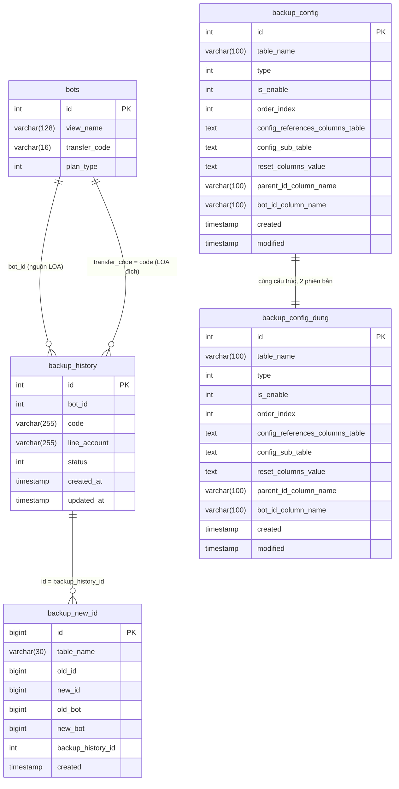

# FA-033「データコピー」— DB Mapping

**Feature**: データコピー (Data Copy)
**Portal**: Admin
**Ngày tạo**: 2026-03-30
**Nguồn**: DB schema + data + logic-spec + api-spec + db-hint

---

## 1. Primary Tables (Trực tiếp liên quan)

---

### 1.1 `backup_history`

**Vai trò**: Bảng trung tâm lưu lịch sử mỗi lần sao chép dữ liệu giữa các LOA. Laravel web chỉ INSERT với `status=0`; Spring Boot job poll bảng này để xử lý và cập nhật trạng thái.

**Schema**:

```sql
CREATE TABLE `backup_history` (
  `id`           int(10) UNSIGNED NOT NULL AUTO_INCREMENT PRIMARY KEY,
  `bot_id`       int(11) NOT NULL,
  `code`         varchar(255) NOT NULL,
  `line_account` varchar(255) NOT NULL,
  `status`       int(11) NOT NULL DEFAULT '0'
                 COMMENT '0: Waiting, 1: Doing; 2 Done; 3 Failure',
  `created_at`   timestamp NOT NULL DEFAULT CURRENT_TIMESTAMP,
  `updated_at`   timestamp NOT NULL DEFAULT CURRENT_TIMESTAMP ON UPDATE CURRENT_TIMESTAMP
);
```

| Column | Kiểu | Nullable | Default | Key | Mô tả |
|--------|------|----------|---------|-----|-------|
| `id` | int(10) UNSIGNED | NO | AUTO_INCREMENT | PK | Khóa chính |
| `bot_id` | int(11) | NO | — | — | ID LOA thực hiện sao chép (LOA nguồn) |
| `code` | varchar(255) | NO | — | — | `transfer_code` của LOA đích (mã nhận dữ liệu) |
| `line_account` | varchar(255) | NO | — | — | `view_name` của LOA đích — snapshot tại thời điểm sao chép |
| `status` | int(11) | NO | 0 | — | Trạng thái xử lý (xem bảng Enum bên dưới) |
| `created_at` | timestamp | NO | CURRENT_TIMESTAMP | — | Thời điểm tạo bản ghi (= thời điểm yêu cầu sao chép) |
| `updated_at` | timestamp | NO | CURRENT_TIMESTAMP ON UPDATE | — | Thời điểm cập nhật gần nhất |

**Indexes**: Không có index phụ được định nghĩa trong schema.

**Foreign Keys**: Không có foreign key khai báo (Laravel dùng direct query).

**Sample Data** (từ `reverse-spec/db/data/tables/backup_history.sql`):

```
id=108, bot_id=779, code='GNBGFMhyBH', line_account='test 5',       status=2, created_at='2023-08-23 07:30:48'
id=110, bot_id=542, code='GNBGFMhyBH', line_account='test 5',       status=3, created_at='2023-09-27 03:22:16'
id=101, bot_id=630, code='KJrmqs5tdN', line_account='test 6',        status=3, created_at='2023-06-22 08:53:17'
id=202, bot_id=46494, code='PrPyGnncPQ', line_account='Anh 1',      status=0, created_at='2026-03-03 08:58:16'
id=2,   bot_id=556,  code='e58JomaQ7U', line_account='test bill 2', status=2, created_at='2022-08-02 10:19:50'
```

> **Nhận xét**: Sample data xác nhận `code` là `transfer_code` (10-16 ký tự alphanumeric, VD: `GNBGFMhyBH`, `e58JomaQ7U`). Tồn tại cả status=0 (record mới chưa xử lý), status=2 (hoàn tất), status=3 (thất bại). Chưa tìm thấy status=1 hoặc status=4 trong data mẫu.

---

### 1.2 `bots` (columns liên quan)

**Vai trò**: Bảng chính của LOA. Cột `transfer_code` là khóa nhận dữ liệu mà Admin nhập vào UI. Cột `view_name` được dùng để hiển thị tên LOA đích sau khi tra cứu.

**Schema (chỉ các columns liên quan)**:

```sql
-- app/Bots.php → table: bots
`view_name`     varchar(128) DEFAULT NULL     -- Tên hiển thị của LOA
`transfer_code` varchar(16) DEFAULT NULL      -- Mã nhận dữ liệu (unique per bot)
`plan_type`     int(11) NOT NULL DEFAULT '1'
                COMMENT '1: standard 2: free'
```

| Column | Kiểu | Nullable | Default | Key | Mô tả |
|--------|------|----------|---------|-----|-------|
| `view_name` | varchar(128) | YES | NULL | — | Tên hiển thị LOA — hiện trên cột「コピー先アカウント名」|
| `transfer_code` | varchar(16) | YES | NULL | UNIQUE (suy luận) | Mã nhận dữ liệu — Admin nhập vào field「データ受信コード」|
| `plan_type` | int(11) | NO | 1 | — | 1=standard (dùng được), 2=free (bị block ở client-side) |

**Indexes**: `transfer_code` được dùng trong `WHERE transfer_code = ?` — cần index để tìm kiếm nhanh.

**Foreign Keys**: Không áp dụng (đây là bảng gốc).

---

## 2. Secondary Tables (Liên quan gián tiếp — hạ tầng backup)

---

### 2.1 `backup_config`

**Vai trò**: Bảng cấu hình hướng dẫn Spring Boot job biết cần sao chép những bảng nào và cách xử lý foreign key khi copy. Mỗi row = 1 bảng cần backup. Đây là **cấu hình hệ thống**, không phải dữ liệu người dùng — không hiển thị trực tiếp trên UI.

**Schema**:

```sql
CREATE TABLE `backup_config` (
  `id`                               int(11) NOT NULL AUTO_INCREMENT PRIMARY KEY,
  `table_name`                       varchar(100) NOT NULL,
  `type`                             int(11) NOT NULL COMMENT '1, Main table; 2 subtable',
  `is_enable`                        int(11) DEFAULT '1',
  `order_index`                      int(11) NOT NULL DEFAULT '1',
  `config_references_columns_table`  text,
  `config_sub_table`                 text,
  `reset_columns_value`              text,
  `parent_id_column_name`            varchar(100) DEFAULT NULL,
  `bot_id_column_name`               varchar(100) DEFAULT NULL,
  `created`                          timestamp NULL DEFAULT CURRENT_TIMESTAMP,
  `modified`                         timestamp NULL DEFAULT CURRENT_TIMESTAMP ON UPDATE CURRENT_TIMESTAMP
);
```

| Column | Kiểu | Nullable | Default | Key | Mô tả |
|--------|------|----------|---------|-----|-------|
| `id` | int(11) | NO | AUTO_INCREMENT | PK | Khóa chính (1001–1050) |
| `table_name` | varchar(100) | NO | — | — | Tên bảng cần backup (VD: `scenario`, `tags`, `rich_menus`) |
| `type` | int(11) | NO | — | — | 1=Main table (có bot_id), 2=Sub-table (cần parent FK) |
| `is_enable` | int(11) | YES | 1 | — | 1=enabled, 0=disabled (bỏ qua khi backup) |
| `order_index` | int(11) | NO | 1 | — | Thứ tự backup để đảm bảo FK integrity |
| `config_references_columns_table` | text | YES | NULL | — | JSON map: tên cột FK → tên bảng tham chiếu (để remap ID mới) |
| `config_sub_table` | text | YES | NULL | — | JSON map: tên sub-table → tên cột FK parent |
| `reset_columns_value` | text | YES | NULL | — | JSON: các cột cần reset về giá trị mặc định sau copy (VD: `count_user_tag=0`) |
| `parent_id_column_name` | varchar(100) | YES | NULL | — | Tên cột FK trỏ về bảng cha (dùng khi type=2) |
| `bot_id_column_name` | varchar(100) | YES | NULL | — | Tên cột `bot_id` trong bảng (để scope theo bot) |
| `created` | timestamp | YES | CURRENT_TIMESTAMP | — | Ngày tạo cấu hình |
| `modified` | timestamp | YES | CURRENT_TIMESTAMP ON UPDATE | — | Ngày sửa gần nhất |

**Sample Data (một số rows tiêu biểu)**:

```
id=1022, table_name='scenario',                type=1, is_enable=1, order_index=15
id=1006, table_name='tags',                    type=1, is_enable=1, order_index=6
id=1021, table_name='rich_menus',              type=1, is_enable=1, order_index=14
id=1019, table_name='auto_reply',              type=1, is_enable=1, order_index=13
id=1008, table_name='form_answer',             type=1, is_enable=1, order_index=8
id=1026, table_name='b_event_detail',          type=1, is_enable=1, order_index=11
id=1027, table_name='events',                  type=1, is_enable=1, order_index=19
id=1024, table_name='friend_information_setting', type=1, is_enable=1, order_index=16
id=1030, table_name='action_schedules',        type=1, is_enable=1, order_index=22
id=1031, table_name='add_friend_setting',      type=1, is_enable=0, order_index=23  ← disabled
id=1034, table_name='status_chat',             type=1, is_enable=1, order_index=26
id=1010, table_name='conversion',              type=1, is_enable=1, order_index=10
```

> **Nhận xét**: `backup_config` là cấu hình hiện tại (production), `backup_config_dung` là bản "dự phòng/thay thế" có cùng cấu trúc (tên `dung` = "dùng" tiếng Việt, hoặc backup copy). Hai bảng có nội dung tương tự nhau với một vài khác biệt nhỏ về version.

---

### 2.2 `backup_config_dung`

**Vai trò**: Bảng cấu hình backup phiên bản thứ hai — cùng cấu trúc với `backup_config`. Có thể là bản "đang dùng" (active) hoặc bản staging. Tên `dung` khả năng là tiếng Việt "dùng" (đang sử dụng).

**Schema**: Giống hoàn toàn `backup_config` (xem mục 2.1).

**Khác biệt với `backup_config`** (quan sát từ data):
- `backup_config_dung` id=1009: `table_name='form_answer_page'` — type=2, có subtable `form_answer_details`
- `backup_config` id=1009: `table_name='form_answer_details'` — type=2, không có subtable
- Một vài FK references JSON khác nhau giữa 2 bảng (minor version differences)

---

### 2.3 `backup_new_id`

**Vai trò**: Bảng tracking mapping ID cũ → ID mới sau khi sao chép. Spring Boot job ghi vào bảng này trong quá trình backup để biết record nào đã được copy (và ID mới là gì, phục vụ remap FK).

**Schema**:

```sql
CREATE TABLE `backup_new_id` (
  `id`                bigint(20) NOT NULL AUTO_INCREMENT PRIMARY KEY,
  `table_name`        varchar(30) DEFAULT NULL,
  `old_id`            bigint(20) DEFAULT NULL,
  `new_id`            bigint(20) DEFAULT NULL,
  `old_bot`           bigint(20) DEFAULT NULL,
  `new_bot`           bigint(20) DEFAULT NULL,
  `backup_history_id` int(11) DEFAULT NULL,
  `created`           timestamp NULL DEFAULT CURRENT_TIMESTAMP ON UPDATE CURRENT_TIMESTAMP
);
```

| Column | Kiểu | Nullable | Default | Key | Mô tả |
|--------|------|----------|---------|-----|-------|
| `id` | bigint(20) | NO | AUTO_INCREMENT | PK | Khóa chính |
| `table_name` | varchar(30) | YES | NULL | — | Tên bảng vừa được copy (VD: `t_actions`, `tags`, `scenario`) |
| `old_id` | bigint(20) | YES | NULL | — | ID record gốc trong LOA nguồn |
| `new_id` | bigint(20) | YES | NULL | — | ID record mới sau copy trong LOA đích |
| `old_bot` | bigint(20) | YES | NULL | — | bot_id của LOA nguồn |
| `new_bot` | bigint(20) | YES | NULL | — | bot_id của LOA đích |
| `backup_history_id` | int(11) | YES | NULL | FK(logical) | Tham chiếu đến `backup_history.id` của lần backup này |
| `created` | timestamp | YES | CURRENT_TIMESTAMP ON UPDATE | — | Thời điểm ghi record này |

**Sample Data**:

```
id=4,  table_name='t_actions',        old_id=52824,  new_id=54070,  old_bot=46254, new_bot=630, backup_history_id=149
id=5,  table_name='t_actions_detail', old_id=117218, new_id=119130, old_bot=46254, new_bot=630, backup_history_id=149
id=6,  table_name='t_actions',        old_id=52832,  new_id=54071,  old_bot=46254, new_bot=630, backup_history_id=149
```

> **Nhận xét**: 155,241 rows trong bảng này — rất lớn vì mỗi record của mỗi bảng được copy đều tạo 1 row mapping. Đây là bảng tracking nội bộ của Spring Boot job, không hiển thị trên UI. Liên kết với `backup_history` qua `backup_history_id`.

---

## 3. UI ↔ DB Field Mapping

### SCR-BK-01: データコピー (Trang chính)

#### 3.1 Form nhập mã nhận dữ liệu

| UI Element | Label JP | DB Table | Column | Mapping Type | Confidence | Ghi chú |
|------------|----------|----------|--------|-------------|------------|---------|
| Input field「データ受信コード」 | 「データ受信コード」 | `bots` | `transfer_code` | Direct | **Cao** | User nhập mã này, backend tìm `WHERE transfer_code = ?` |
| Hiển thị tên LOA đích (sau AJAX) | 「コピー先アカウント名」 | `bots` | `view_name` | Direct | **Cao** | Lấy từ response EP-03: `data.view_name` |
| Hidden input lưu transfer_code | (hidden) | `bots` | `transfer_code` | Direct | **Cao** | `<input name="transfer_code">` set bởi JS sau AJAX thành công |
| Plan type check (hidden) | `#plan_type` | `bots` | `plan_type` | Direct | **Cao** | Truyền từ server vào view, JS check `plan_type == 2` |

#### 3.2 Bảng lịch sử データコピー履歴

| UI Element | Label JP | DB Table | Column | Mapping Type | Confidence | Ghi chú |
|------------|----------|----------|--------|-------------|------------|---------|
| Cột thời gian | 「データコピー日時」 | `backup_history` | `created_at` | Direct | **Cao** | Định dạng hiển thị: `YYYY.MM.DD HH:mm` (JST); lưu UTC |
| Cột mã nhận | 「データ受信コード」 | `backup_history` | `code` | Direct | **Cao** | Xác nhận từ data mẫu: `code='GNBGFMhyBH'` khớp UI |
| Cột tên tài khoản đích | 「コピー先アカウント名」 | `backup_history` | `line_account` | Direct | **Cao** | Snapshot `view_name` tại thời điểm tạo — không thay đổi dù LOA đích đổi tên |
| Cột trạng thái (badge) | (không có tiêu đề) | `backup_history` | `status` | Enum | **Cao** | Xem bảng Enum bên dưới |

---

## 4. Enum / Status Values

### `backup_history.status`

| Giá trị DB | Tên constant (PHP) | Hiển thị UI (JP) | Nghĩa tiếng Việt | Nguồn xác nhận |
|:----------:|-------------------|------------------|-----------------|----------------|
| `0` | `BACKUP_CREATING` | 「処理中」 | Đang chờ / vừa tạo | Model constant + blade template |
| `1` | `BACKUP_PENDING` | 「処理中」 | Đang xử lý | Model constant + blade template |
| `2` | — | 「処理完了済」 | Đã hoàn tất | Blade: `else → '処理完了済'`; xác nhận từ data mẫu |
| `3` | — | 「処理完了済」 | Thất bại (nhưng hiển thị như hoàn tất) | Blade: `else → '処理完了済'`; data id=101 status=3 |
| `4` | — | 「処理中」 | Trạng thái xử lý khác | Blade template: `status == 4 → 処理中` |

> **Logic hiển thị (từ blade template)**:
> ```
> status IN (0, 1, 4)  →  「処理中」(badge xanh/vàng)
> status IN (2, 3)     →  「処理完了済」(badge xanh lá)
> ```
> **Lưu ý quan trọng**: Status=3 (Failure/Thất bại) hiển thị giống Status=2 (Done) trên UI. Người dùng không phân biệt được thành công hay thất bại chỉ nhìn vào badge. Đây có thể là thiết kế cố ý hoặc bug.

### `bots.plan_type`

| Giá trị DB | Hiển thị / Hành vi | Nghĩa tiếng Việt |
|:----------:|-------------------|-----------------|
| `1` | Tính năng データコピー hoạt động bình thường | Standard plan |
| `2` | Alert + redirect `/admin/home` (client-side) | Free plan — không được dùng |

---

## 5. Entity Relationships



**Ghi chú quan hệ**:
- `backup_history.bot_id` → `bots.id` (logical FK, không khai báo trong schema)
- `backup_history.code` = `bots.transfer_code` (lookup key, không phải FK)
- `backup_history.line_account` = snapshot của `bots.view_name` tại thời điểm backup (không cập nhật khi LOA đích đổi tên)
- `backup_new_id.backup_history_id` → `backup_history.id` (logical FK)
- `backup_new_id.old_bot` → `bots.id` (LOA nguồn)
- `backup_new_id.new_bot` → `bots.id` (LOA đích)

---

## 6. Unmapped Items

### 6.1 UI fields không tìm thấy DB match trực tiếp

| UI Element | Label JP | Ghi chú |
|------------|----------|---------|
| Danh sách checkbox loại dữ liệu (13 items) | 「ステップ配信」, 「テンプレート」, v.v. | Các checkbox đã bị **comment out** trong blade (`{{-- ... --}}`); form hiện tại không có checkbox chọn lọc — toàn bộ 13 loại được copy không có tùy chọn |
| Thông báo lỗi validation (flash message) | (vùng thông báo) | Lưu trong Laravel session (`$errors`), không persist vào DB |
| Loading overlay khi submit | (UI overlay) | Chỉ là UI state, không lưu DB |
| Preview tên LOA đích (trước khi confirm) | Vùng hiển thị sau「登録」click | Data tạm thời từ AJAX response, không lưu DB cho đến khi submit |

### 6.2 DB columns không xuất hiện trên UI

#### Bảng `backup_history`:

| Column | Lý do không hiển thị |
|--------|----------------------|
| `id` | Internal PK, không hiển thị (nhưng có thể dùng làm internal reference) |
| `updated_at` | Không hiển thị trên UI; dùng cho audit/debug nội bộ |

#### Bảng `backup_config` / `backup_config_dung`:

| Column | Lý do không hiển thị |
|--------|----------------------|
| Toàn bộ bảng | Cấu hình hệ thống nội bộ — chỉ Spring Boot job đọc, không expose lên UI Admin |

#### Bảng `backup_new_id`:

| Column | Lý do không hiển thị |
|--------|----------------------|
| Toàn bộ bảng | Tracking nội bộ của Spring Boot job — không expose lên UI; dùng cho debugging/audit kỹ thuật |

#### Bảng `bots` (columns liên quan nhưng không hiển thị trực tiếp):

| Column | Lý do không hiển thị |
|--------|----------------------|
| `bots.id` | Internal PK |
| `bots.plan_type` | Truyền vào view dưới dạng hidden input `#plan_type`; chỉ dùng cho JS check, không hiển thị cho user |

---

## 7. Bảng các DB thực tế được sao chép (từ `backup_config`)

Dựa trên data trong `backup_config` (`is_enable=1`), các bảng sau được sao chép thực tế:

| Order | Bảng DB | Loại dữ liệu UI tương ứng | is_enable |
|:-----:|---------|---------------------------|:---------:|
| 1 | `category` | (Folder/Category — shared) | 1 |
| 2 | `s_categories` | (Payment categories) | 1 |
| 3 | `site_script` | (Site script) | 1 |
| 4 | `t_actions` | (Action templates) | 1 |
| 5 | `t_actions_detail` | (Action details) | 1 |
| 6 | `tags` | 「タグ」 | 1 |
| 7 | `form_answer_folder` | (Folder form answer) | 1 |
| 8 | `form_answer` | 「フォーム作成」 | 1 |
| 9 | `form_answer_details` | (Form answer details) | 1 |
| 10 | `conversion` | 「コンバージョン」 | 1 |
| 11 | `s_items` | (Payment items) | **0 — disabled** |
| 11 | `b_event_detail` | 「イベント予約」 (booking detail) | 1 |
| 12 | `template` | 「テンプレート」 | 1 |
| 13 | `image_map` | (Template sub: image map) | 1 |
| 13 | `image_map_items` | (Template sub: image map items) | 1 |
| 13 | `tmp_button`, `tmp_introduction`, `tmp_location`, `tmp_question` | (Template sub-types) | 1 |
| 13 | `buttons` | (Template sub: buttons) | 1 |
| 13 | `auto_reply` | 「自動応答」 | 1 |
| 13 | `keyword` | (Auto reply keywords) | 1 |
| 14 | `rich_menus` | 「リッチメニュー」 | 1 |
| 15 | `scenario` | 「ステップ配信」 | 1 |
| 15 | `step_message` | (Scenario sub: step messages) | 1 |
| 16 | `friend_information_setting` | 「友だち情報」 | 1 |
| 16 | `friend_info_option_selects` | (Friend info sub: options) | 1 |
| 17 | `booking_calendar` | (Booking calendar) | **0 — disabled** |
| 19 | `events` | 「リマインド配信」 | 1 |
| 19 | `b_setting_date_event` | (Booking date setting) | 1 |
| 19 | `b_setting_basic_event` | (Booking basic setting) | 1 |
| 20 | `event_step` | (Event step delivery) | 1 |
| 21 | `event_times` | (Event times) | 1 |
| 22 | `action_schedules` | 「アクションスケジュール実行」 | 1 |
| 23 | `add_friend_setting` | 「友だち追加時設定」 | **0 — disabled** |
| 24 | `bot_service` | (Bot service config) | **0 — disabled** |
| 25 | `popup` | (Popup) | **0 — disabled** |
| 26 | `status_chat` | 「対応ステータス」 | 1 |
| 27 | `url` | (URL tracking) | 1 |
| 28 | `form_answer_setting` | (Form answer settings) | 1 |
| 29 | `rich_menu_items` | (Rich menu items) | 1 |
| 30 | `b_slot` | (Booking slot) | 1 |
| 30 | `b_plan_slot` | (Booking plan slot) | 1 |
| 31 | `b_info_setting` | (Booking info setting) | 1 |
| 32 | `filter_manager` | (Filter manager) | 1 |
| 33 | `richmenu_switch_item` | (Rich menu switch) | 1 |
| 34 | `cross_analysis` | (Cross analysis) | 1 |
| 35 | `csv_management` | (CSV management) | 1 |

> **Ghi chú**: Các bảng `is_enable=0` (`s_items`, `booking_calendar`, `add_friend_setting`, `bot_service`, `popup`) bị bỏ qua khi backup dù có trong config. Điều này giải thích tại sao UI hiển thị 13 loại nhưng thực tế backup nhiều bảng hơn (do mỗi loại có nhiều sub-table và helper tables).

---

## 8. Điểm đã xác nhận so với DB Hint ban đầu

| ID Hint | Điểm cần xác nhận | Kết quả xác nhận | Confidence |
|---------|------------------|-----------------|------------|
| DB-BK-01 | Tên bảng lịch sử sao chép | **`backup_history`** — xác nhận từ schema và model | **Cao** |
| DB-BK-02 | Tên bảng/cột mã nhận | **`bots.transfer_code`** (varchar 16) — không có bảng riêng | **Cao** |
| DB-BK-03 | Enum values của status | **0=Waiting, 1=Doing, 2=Done, 3=Failure, 4=Other** — xác nhận từ COMMENT schema + blade | **Cao** |
| DB-BK-04 | Cơ chế tạo mã nhận | **Lưu trong `bots.transfer_code`** — cơ chế tạo (random?) chưa xác nhận từ source | **Trung bình** |
| DB-BK-05 | DEEP COPY hay REFERENCE | **DEEP COPY** — `backup_new_id` track ID mới; `backup_config` hướng dẫn remap FK | **Cao** |
| DB-BK-06 | Bảng queue/job tracking | **`backup_history`** chính là queue table; Spring Boot poll `WHERE status IN (0,1)` | **Cao** |
| DB-BK-07 | Độ dài và charset của cột `code` | **`backup_history.code` = varchar(255)**, **`bots.transfer_code` = varchar(16)** — data thực tế ~10 ký tự | **Cao** |
