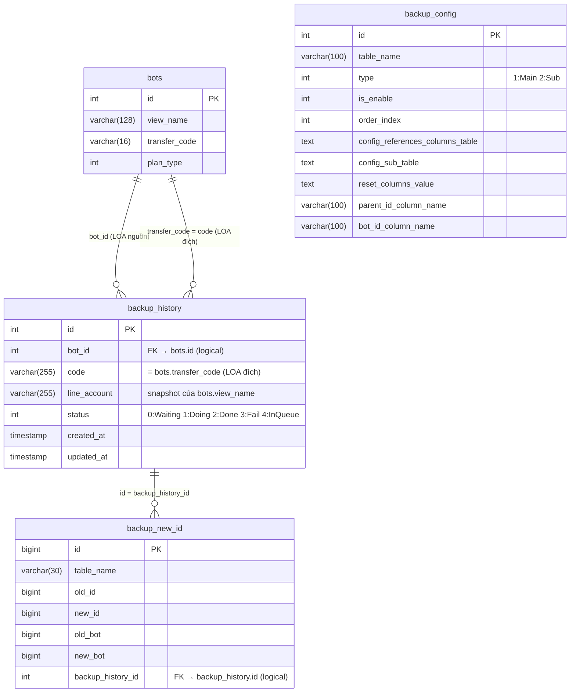
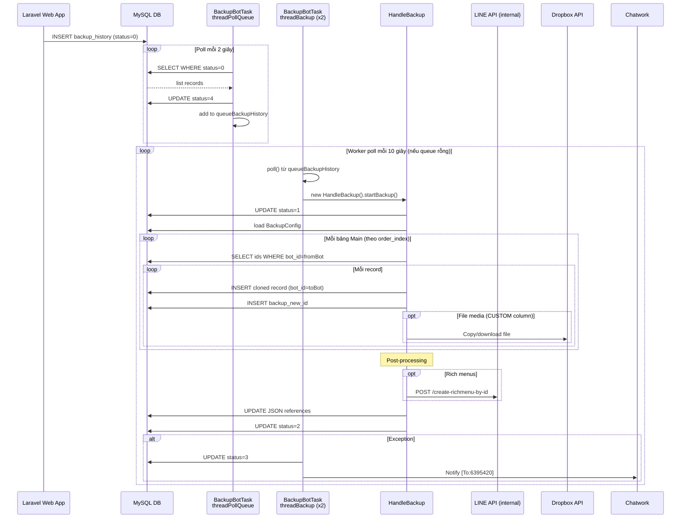

# FA-033「データコピー」— Feature Spec (Tổng hợp)

**Feature ID**: FA-033
**Feature Name**: データコピー (Sao chép dữ liệu)
**Portal**: Admin
**URL**: `/basic/backup`
**Ngày tạo**: 2026-03-30
**Trạng thái spec**: ĐẠT — sẵn sàng sử dụng

---

## Mục lục

1. [Tổng quan](#1-tổng-quan)
2. [Màn hình và Luồng xử lý end-to-end](#2-màn-hình-và-luồng-xử-lý-end-to-end)
3. [Data Model](#3-data-model)
4. [Field Traceability Matrix](#4-field-traceability-matrix)
5. [Business Rules](#5-business-rules)
6. [API Endpoints](#6-api-endpoints)
7. [Background Jobs](#7-background-jobs)
8. [Cross-references](#8-cross-references)
9. [Gaps và Unknowns](#9-gaps-và-unknowns)
10. [Chất lượng Spec](#10-chất-lượng-spec)

---

## 1. Tổng quan

### 1.1 Mục đích

Tính năng「データコピー」(Sao chép dữ liệu) cho phép Admin sao chép toàn bộ dữ liệu cấu hình đã thiết lập trong tài khoản LINE OA (LOA) hiện tại sang một LOA エルメ (LME) khác.

**Lý do tồn tại**: Hỗ trợ Admin tái sử dụng cấu hình (kịch bản, template, tag, v.v.) khi nhân rộng hoặc chuyển sang tài khoản mới mà không cần cấu hình lại từ đầu.

**Đặc điểm nổi bật**:
- Sao chép **toàn bộ** 13 loại dữ liệu (không cho chọn lọc — các checkbox đã bị comment out trong source code)
- Quy trình **bất đồng bộ** — web chỉ tạo queue record, Spring Boot background job xử lý thực tế
- Cơ chế **deep copy** — clone từng record và remap toàn bộ foreign key ID
- Bao gồm sao chép file media (ảnh, video, audio) qua Dropbox API và đăng ký rich menu với LINE API

### 1.2 Actors

| Actor | Quyền | Ghi chú |
|-------|-------|---------|
| **Admin** | Xem trang, nhập mã, thực hiện sao chép, xem lịch sử | Tính năng nằm trong nhóm「システム管理関連」— chỉ Admin có menu này |
| **Staff** | Không có quyền truy cập | Menu「データコピー」không hiển thị với Staff |
| **Free Plan Admin** | Bị block bởi JavaScript client-side | Alert + redirect `/admin/home` nếu `plan_type=2` |
| **Spring Boot Job** | Thực hiện sao chép dữ liệu thực tế | Chạy bất đồng bộ sau khi web tạo queue record |

### 1.3 Phạm vi — 13 loại dữ liệu được sao chép

| # | Loại dữ liệu (JP) | Loại dữ liệu (VN) | Bảng DB chính |
|---|-------------------|--------------------|---------------|
| 1 | 「ステップ配信」 | Gửi theo bước (Scenario) | `scenario`, `step_message` |
| 2 | 「テンプレート」 | Template | `template`, `image_map`, `tmp_button`, v.v. |
| 3 | 「タグ」 | Tag | `tags` |
| 4 | 「自動応答」 | Tự động trả lời | `auto_reply`, `keyword` |
| 5 | 「フォーム作成」 | Tạo form | `form_answer`, `form_answer_page`, v.v. |
| 6 | 「リッチメニュー」 | Rich menu | `rich_menus`, `rich_menu_items` |
| 7 | 「イベント予約」 | Đặt lịch sự kiện | `b_event_detail`, `events`, `event_times` |
| 8 | 「リマインド配信」 | Gửi nhắc nhở | `events`, `event_step` |
| 9 | 「友だち情報」 | Thông tin bạn bè | `friend_information_setting`, `friend_info_option_selects` |
| 10 | 「アクションスケジュール実行」 | Thực thi lịch hành động | `action_schedules` |
| 11 | 「対応ステータス」 | Trạng thái xử lý | `status_chat` |
| 12 | 「友だち追加時設定」 | Cài đặt khi thêm bạn | `add_friend_setting` (xử lý đặc biệt — update, không clone mới) |
| 13 | 「コンバージョン」 | Conversion | `conversion` |

**Dữ liệu KHÔNG được sao chép** (ngoài danh sách trên): cần thiết lập thủ công.

---

## 2. Màn hình và Luồng xử lý end-to-end

### 2.1 Màn hình: SCR-BK-01 — データコピー

**URL**: `/basic/backup`
**Screenshot**: `ui/screenshots/SCR-BK-01-main.png`

#### Layout

| Vùng | Nội dung |
|------|---------|
| **Header** | Logo エルメ, tên tài khoản, thống kê配信数, thông tin LINE公式アカウント |
| **Sidebar** | Menu điều hướng — nhóm「システム管理関連」đang active mục「データコピー」|
| **Block 1** | Tiêu đề「データコピー」+ mô tả chức năng |
| **Block 2** | Label「コピーされるデータ」+ danh sách 13 loại dữ liệu được sao chép |
| **Block 3** | Form nhập「データ受信コード」+ button「登録」(bước 1 AJAX check) → hiện row「コピー先アカウント名」+ button「コピー実行」(bước 2 submit) |
| **Block 4** | Bảng「データコピー履歴」— 4 cột: ngày giờ, mã nhận, tên tài khoản đích, trạng thái |

#### Form Fields

| Label JP | Tên field | Loại | Required | Validation hiển thị |
|----------|----------|------|----------|---------------------|
| 「データ受信コード」(Mã nhận dữ liệu) | `transfer_code` | text | Có | Thông báo lỗi server-side qua flash message |

#### Bảng lịch sử (4 cột)

| Cột | Label JP | DB | Ghi chú |
|-----|----------|-----|---------|
| 1 | 「データコピー日時」 | `backup_history.created_at` | Định dạng `YYYY.MM.DD HH:mm` (JST) |
| 2 | 「データ受信コード」 | `backup_history.code` | transfer_code của LOA đích |
| 3 | 「コピー先アカウント名」 | `backup_history.line_account` | Snapshot tên LOA đích — không thay đổi dù LOA đổi tên |
| 4 | (Trạng thái — không có tiêu đề cột) | `backup_history.status` | 「処理中」hoặc「処理完了済」 |

---

### 2.2 Luồng xử lý end-to-end

#### Luồng chính — Thực hiện sao chép thành công

```
[Admin] Vào /basic/backup
    ↓
[EP-01 GET] BasicController@backup
    → Query: tags, scenarios, templates, forms, auto-replies, rich menus,
             events, bookings, backup_history (desc created_at), plan_type
    → Render view basic.backup_new
    ↓
[JavaScript] Kiểm tra plan_type:
    - plan_type=2 (free) → alert「現在のプランは利用できない機能です。」→ redirect /admin/home
    - plan_type=1 (standard) → hiển thị trang bình thường
    ↓
[Admin] Nhập「データ受信コード」→ nhấn「登録」(Bước 1)
    ↓
[EP-03 AJAX POST /ajax/check-transfer-code] BotController@checkTransferCode
    → BotRepository@checkExistTransferCode(transfer_code)
        → SELECT * FROM bots WHERE transfer_code = ? AND transfer_code IS NOT NULL
    ┌─ Bot không tồn tại → Response: { success: false, message: "バックアップコードが存在しません。" }
    │      → JavaScript: alert(message)
    ├─ Bot là chính bot hiện tại → Response: { success: false, message: "現在のアカウントの..." }
    │      → JavaScript: alert(message)
    └─ Bot tồn tại & khác bot hiện tại → Response: { success: true, data: bot }
           → JavaScript: hiện row「コピー先アカウント名」
                         điền bots.view_name vào input disabled
                         set transfer_code vào hidden input #backup_data
    ↓
[Admin] Xác nhận tên LOA đích → nhấn「コピー実行」(Bước 2)
    ↓
[EP-02 POST /basic/backup/export-zip] BasicController@backupStore
    → Validate: transfer_code (required + exists:bots)
        - Fail → redirect back + $errors (flash message)
    → BotRepository@checkExistTransferCode(transfer_code) → bot đích
    → BackupHistory::create({ bot_id, code, line_account=bot.view_name, status=0 })
    → INSERT backup_history (status=0 = WAITING_BACKUP)
    → redirect()->back() (302 → GET /basic/backup)
    ↓
[Bảng lịch sử] Hiển thị dòng mới với status「処理中」
    ↓
    ============ BẮT ĐẦU XỬ LÝ KHÔNG ĐỒNG BỘ (Spring Boot) ============
    ↓
[Spring Boot: threadPollQueue — poll mỗi 2 giây]
    → SELECT backup_history WHERE status=0
    → UPDATE backup_history SET status=4 (IN_QUEUE)
    → Đưa vào in-memory queueBackupHistory (LinkedList, synchronized)
    ↓
[Spring Boot: threadBackup (2 workers) — poll queue mỗi 10 giây nếu rỗng]
    → Poll 1 item từ queueBackupHistory
    → HandleBackup.startBackup():
        1. init(): Load toàn bộ BackupConfig từ DB, đọc DB connection config
        2. UPDATE backup_history SET status=1 (DOING_BACKUP)
        3. Vòng lặp main tables (theo order_index ASC, is_enable=1):
           - getIds(tableName, WHERE bot_id=fromBot.id)
           - cloneRow(id, null, config) cho từng record:
             → SELECT * FROM table WHERE id=X
             → INSERT INTO table (bot_id=toBot.id, reset fields, remap FKs)
             → INSERT backup_new_id (table, old_id, new_id, old_bot, new_bot)
             → Clone sub-tables đệ quy
             → Copy file media (Dropbox API) nếu có CUSTOM column
        4. Post-processing:
           - Rich menus: gọi internal API /create-richmenu-by-id để đăng ký với LINE
           - Templates: replace [FRIEND_INFO_xxx], [FORM_xxx], [CONVERSION_xxx]
           - Forms: replace LIFF URL, fix event/remind FK references
           - Filters (filters_v2): clone với đầy đủ ID remapping
           - add_friend_setting: UPDATE (không clone mới) — remap action/template IDs
           - action_schedules: fix filter_ids
        5. UPDATE backup_history SET status=2 (COMPLETED_BACKUP)
    ↓
[Admin] Refresh trang → Bảng lịch sử hiển thị「処理完了済」
```

#### Luồng lỗi

| Case | Điều kiện | Hành vi |
|------|-----------|---------|
| Mã không tồn tại | EP-03: transfer_code không có trong `bots` | AJAX response `{ success: false }` → JS alert「バックアップコードが存在しません。」|
| Mã của chính bot hiện tại | EP-03: bot.id == current_bot_id | AJAX response `{ success: false }` → JS alert「現在のアカウントのデータ受信コードは入力できません。別のアカウントのコードを入力してください。」|
| Mã trống | EP-02: Validation fail `required` | Redirect back + flash error「が必要です。」|
| Mã không tồn tại (bypass AJAX) | EP-02: Validation fail `exists:bots` | Redirect back + flash error「バックアップコードが存在しません。」|
| Exception trong web request | EP-02: catch \Exception | Log error + redirect back |
| Job thất bại | Spring Boot: exception trong startBackup() | UPDATE status=3 (FAILURE) + Notify Chatwork [To:6395420] |
| Record không tồn tại trong DB khi clone | cloneRow(): result.wasNull | Log INFO + notify Chatwork + return -1000 (skip record) |
| File media không tồn tại | copyImage(): file local not found | Fallback: download từ ConfigFile.URL_MEDIA_BACKUP nếu có, else giữ path cũ |

---

## 3. Data Model

### 3.1 Entities chính

#### `backup_history` — Bảng trung tâm (queue + history)

```sql
CREATE TABLE `backup_history` (
  `id`           int(10) UNSIGNED NOT NULL AUTO_INCREMENT PRIMARY KEY,
  `bot_id`       int(11) NOT NULL,            -- LOA nguồn (thực hiện sao chép)
  `code`         varchar(255) NOT NULL,        -- transfer_code của LOA đích
  `line_account` varchar(255) NOT NULL,        -- Tên LOA đích (snapshot tại thời điểm tạo)
  `status`       int(11) NOT NULL DEFAULT '0'  COMMENT '0:Waiting, 1:Doing, 2:Done, 3:Failure',
  `created_at`   timestamp NOT NULL DEFAULT CURRENT_TIMESTAMP,
  `updated_at`   timestamp NOT NULL DEFAULT CURRENT_TIMESTAMP ON UPDATE CURRENT_TIMESTAMP
);
```

**State Machine — backup_history.status**:

| Giá trị | Constant PHP | Constant Java | Hiển thị UI | Ý nghĩa |
|:-------:|-------------|--------------|-------------|---------|
| **0** | `BACKUP_CREATING` | `STATUS_WAITING_BACKUP` | 「処理中」 | Laravel vừa INSERT, chờ Spring Boot poll |
| **1** | `BACKUP_PENDING` | `STATUS_DOING_BACKUP` | 「処理中」 | Spring Boot đang thực hiện copy |
| **2** | — | `STATUS_COMPLETED_BACKUP` | 「処理完了済」 | Sao chép hoàn thành thành công |
| **3** | — | `STATUS_FAILURE_BACKUP` | 「処理完了済」 | Sao chép thất bại (hiển thị giống status=2!) |
| **4** | — | `STATUS_IN_QUEUE` | 「処理中」 | Đã đưa vào in-memory queue, chờ worker thread |

> **Lưu ý**: Status=3 (thất bại) hiển thị「処理完了済」giống status=2 (thành công) — logic blade: `status IN (0,1,4) → 処理中`, còn lại → `処理完了済`. Người dùng không phân biệt được thành công hay thất bại qua badge.

#### `bots` — Columns liên quan

| Column | Kiểu | Mô tả |
|--------|------|-------|
| `id` | int | PK — LOA identifier |
| `view_name` | varchar(128) | Tên hiển thị LOA — dùng cho「コピー先アカウント名」|
| `transfer_code` | varchar(16) | Mã nhận dữ liệu — Admin nhập vào form (UNIQUE — suy luận, confidence Trung bình) |
| `plan_type` | int | 1=standard (dùng được), 2=free (bị block client-side) |

#### `backup_config` — Cấu hình bảng cần sao chép

Cấu hình hệ thống nội bộ, Spring Boot job đọc để biết bảng nào cần backup và cách remap FK. Không hiển thị trên UI.

| Column | Mô tả |
|--------|-------|
| `table_name` | Tên bảng MySQL cần copy |
| `type` | 1=Main table (có bot_id), 2=Sub-table |
| `is_enable` | 1=enabled, 0=skip |
| `order_index` | Thứ tự xử lý để đảm bảo FK integrity |
| `config_references_columns_table` | JSON: FK column → referenced table (hoặc "CUSTOM") |
| `config_sub_table` | JSON: sub-table → parent FK column |
| `reset_columns_value` | JSON: columns cần reset về default sau copy |

#### `backup_new_id` — Tracking ID cũ → ID mới

Bảng nội bộ Spring Boot ghi để remap FK và audit. Không hiển thị UI. 155,241 rows trong production.

| Column | Mô tả |
|--------|-------|
| `table_name` | Tên bảng vừa copy |
| `old_id` | ID record gốc (LOA nguồn) |
| `new_id` | ID record mới (LOA đích) |
| `old_bot` / `new_bot` | bot_id nguồn / đích |
| `backup_history_id` | FK → `backup_history.id` |

### 3.2 ER Diagram



---

## 4. Field Traceability Matrix

| # | UI Element | Màn hình | DB Table.Column | Hướng | Validation | Business Rule |
|---|------------|----------|-----------------|-------|------------|---------------|
| 1 | Input「データ受信コード」 | SCR-BK-01 Block 3 | `bots.transfer_code` | Write (lookup) | required; exists:bots | BR-01: varchar(16), duy nhất per bot |
| 2 | Hidden input transfer_code (sau AJAX) | SCR-BK-01 Form #backup_data | `bots.transfer_code` → `backup_history.code` | Write | Set bởi JavaScript sau EP-03 success | BR-09: flow 2 bước |
| 3 | Hiển thị「コピー先アカウント名」(sau AJAX) | SCR-BK-01 Block 3 (dynamic) | `bots.view_name` | Read (AJAX response) | — | BR-09: xác nhận trước khi submit |
| 4 | Hidden input plan_type | SCR-BK-01 (JavaScript) | `bots.plan_type` | Read | — | BR-03: plan_type=2 → block client-side |
| 5 | Cột「データコピー日時」 | SCR-BK-01 Block 4 | `backup_history.created_at` | Read | — | BR-07: sắp xếp DESC |
| 6 | Cột「データ受信コード」(lịch sử) | SCR-BK-01 Block 4 | `backup_history.code` | Read | — | Snapshot tại thời điểm tạo |
| 7 | Cột「コピー先アカウント名」(lịch sử) | SCR-BK-01 Block 4 | `backup_history.line_account` | Read | — | Snapshot `bots.view_name` — không thay đổi dù LOA đổi tên |
| 8 | Cột Status (không tiêu đề) | SCR-BK-01 Block 4 | `backup_history.status` | Read | — | BR-08: 0,1,4→「処理中」; 2,3→「処理完了済」|

---

## 5. Business Rules

| Rule ID | Rule | Nguồn | Confidence |
|---------|------|-------|------------|
| **BR-01** | Mỗi bot có một `transfer_code` duy nhất (varchar 16) dùng làm mã nhận dữ liệu | `bots.sql:61` | Cao |
| **BR-02** | Không thể sao chép dữ liệu sang chính bot hiện tại | `BotController.php:5947` (AJAX check) | Cao |
| **BR-03** | Free plan (`plan_type=2`) không được dùng tính năng データコピー — bị block bởi JavaScript (không phải server-side) | `backup_new.blade.php:1001-1004` | Cao |
| **BR-04** | Khi LOA đang nhận dữ liệu (backup_history có status 0 hoặc 1 với code=bot.transfer_code), các thao tác write trên LOA đó bị block | `PopupAjaxController.php:80`, `EventAjaxController.php:61`, `RichMenuService.php:61` | Cao |
| **BR-05** | Dữ liệu được sao chép gồm 13 loại (xem Mục 1.3). Toàn bộ được sao chép — không có tùy chọn chọn lọc (các checkbox đã bị comment out) | `backup_new.blade.php:232-235` | Cao |
| **BR-06** | Dữ liệu ngoài danh sách 13 loại KHÔNG được sao chép — phải cài đặt thủ công | `backup_new.blade.php:235` | Cao |
| **BR-07** | Lịch sử sao chép hiển thị tất cả records của bot hiện tại, sắp xếp mới nhất trước (DESC created_at) | `BasicController.php:1270` | Cao |
| **BR-08** | Status 0, 1, 4 hiển thị「処理中」; status 2, 3 hiển thị「処理完了済」— status=3 (thất bại) không phân biệt với status=2 (thành công) trên UI | `backup_new.blade.php:317` | Cao |
| **BR-09** | Flow 2 bước bắt buộc: Bước 1 — nhập mã + nhấn「登録」→ AJAX xác nhận tên LOA đích; Bước 2 — xác nhận + nhấn「コピー実行」→ submit form. Không thể bỏ qua bước 1 (transfer_code trong form được set bởi JS sau AJAX) | `backup_new.blade.php:1331-1363` | Cao |
| **BR-10** | Quá trình sao chép thực tế không diễn ra synchronous trong web request — web chỉ tạo bản ghi `backup_history` (status=0) để Spring Boot background job xử lý | `BasicController.php:1303`, `RichMenuService.php:54` | Cao |
| **BR-11** | `add_friend_setting` không được clone mới — chỉ UPDATE record của LOA đích bằng action_id và template_id đã remapped từ LOA nguồn | `doBackupAddFriendSetting()` + `backup_config.is_enable=0` cho add_friend_setting | Cao |
| **BR-12** | Sao chép bao gồm copy file vật lý (ảnh/video/audio) qua Dropbox API và đăng ký rich menu với LINE API | `copyImage()`, `createRichmenu()` trong BackupBotTask.java | Cao |
| **BR-13** | Tính năng có feature flag `ENABLE_BACKUP_BOT` — mặc định `false`; phải bật trong `config.properties` để kích hoạt background job | `ConfigFile.java:106`, `AppMain.java:249` | Cao |
| **BR-14** | Bảng `backup_history.line_account` là **snapshot** của `bots.view_name` tại thời điểm tạo — không tự cập nhật nếu LOA đích sau đó đổi tên | `BasicController.php:1303` | Cao |

---

## 6. API Endpoints

### Danh sách

| EP | Method | URL | Controller | Mục đích |
|----|--------|-----|-----------|---------|
| **EP-01** | GET | `/basic/backup` | `Basic\BasicController@backup` | Hiển thị trang データコピー |
| **EP-02** | POST | `/basic/backup/export-zip` | `Basic\BasicController@backupStore` | Đăng ký yêu cầu sao chép (Bước 2) |
| **EP-03** | POST | `/ajax/check-transfer-code` | `Admin\BotController@checkTransferCode` | Kiểm tra mã nhận (AJAX — Bước 1) |

**Middleware chung**: `web` (session, CSRF, cookie, auth), `NotifyChatworkRequestTimeSlow`, `LogRequestMultipart`
**Xác thực**: Session-based auth (`basic_access`), cần `current_bot_id` trong session.

---

### EP-01: GET `/basic/backup`

**Mô tả**: Tải trang với dữ liệu preview và lịch sử sao chép.

**Response**: HTML view `basic.backup_new`

**Dữ liệu truyền vào view** (query theo bot hiện tại):
- `folderTags`, `listTagFolderDefault` — Tags và folder
- `scenarioList` — Scenarios
- `folderTemplates`, `templateListFolderDefault` — Templates
- `folderFormanswer`, `formAnswerListFolderDefault` — Forms
- `folderAutoReply`, `autoReplyListFolderDefault` — Auto replies
- `richMenuList` — Rich menus
- `remindList` — Remind events
- `bookingList` — Booking events
- `backupHistory` — Lịch sử sao chép (sắp xếp DESC created_at)
- `plan_type` — Loại plan của bot

---

### EP-02: POST `/basic/backup/export-zip`

**Mô tả**: Bước 2/2 trong flow 2 bước — tạo queue record để Spring Boot xử lý sao chép.

**Request** (form POST, `application/x-www-form-urlencoded`):

| Param | Type | Required | Validation |
|-------|------|----------|------------|
| `transfer_code` | string | Có | `required\|exists:bots` |
| `_token` | string | Có | CSRF token |

**Validation Errors**:

| Rule | Thông báo JP |
|------|-------------|
| `required` | `が必要です。` |
| `exists:bots` | `バックアップコードが存在しません。` |

**Xử lý thành công**:
1. Validate transfer_code
2. BotRepository@checkExistTransferCode → tìm bot đích
3. BackupHistory::create({ bot_id, code, line_account=bot.view_name, status=0 })
4. redirect()->back() (302)

**Response**: `302 Redirect → GET /basic/backup`

**Lỗi**:

| Case | Hành vi |
|------|---------|
| Validation fail | Redirect back + flash $errors |
| Bot đích null sau checkExistTransferCode | BackupHistory không được tạo, silent redirect back |
| Exception | Log error + redirect back |

---

### EP-03: POST `/ajax/check-transfer-code`

**Mô tả**: Bước 1/2 trong flow 2 bước — AJAX kiểm tra mã và trả về tên LOA đích.

**Request**: JSON hoặc form POST

| Param | Type | Required |
|-------|------|----------|
| `transfer_code` | string | Có |

**Response thành công** (bot tìm thấy, không phải bot hiện tại):
```json
{
  "success": true,
  "data": {
    "id": 123,
    "transfer_code": "GNBGFMhyBH",
    "view_name": "アカウント名"
  }
}
```

**Response lỗi — mã của bot hiện tại**:
```json
{
  "success": false,
  "message": "現在のアカウントのデータ受信コードは入力できません。別のアカウントのコードを入力してください。"
}
```

**Response lỗi — mã không tồn tại**:
```json
{
  "success": false,
  "message": "バックアップコードが存在しません。"
}
```

**HTTP Status**: Luôn `200` kể cả khi có lỗi logic.

**Hành vi JavaScript sau AJAX**:
- Success: hiện row「コピー先アカウント名」, điền `view_name` vào input disabled, set transfer_code vào hidden input form `#backup_data`
- Failure: `alert(data.message)`

---

## 7. Background Jobs

### 7.1 Tổng quan

| Thành phần | Vai trò |
|-----------|---------|
| **Laravel Web App** | INSERT vào `backup_history` với `status=0` (WAITING_BACKUP) |
| **Spring Boot BackupBotTask** | Poll DB, xử lý copy, cập nhật status |
| **`backup_history`** | Cầu nối queue giữa web app và Spring Boot job |

**Feature flag**: `ENABLE_BACKUP_BOT=true` trong `config.properties` (mặc định `false`)

**File**: `reverse-spec/src/job/linect-service/src/main/java/sns/line/task/BackupBotTask.java`

### 7.2 State Machine

```
[Web] INSERT status=0 (WAITING_BACKUP)
         ↓ (threadPollQueue poll mỗi 2 giây)
     status=4 (IN_QUEUE) → đưa vào in-memory LinkedList
         ↓ (threadBackup 2 workers, poll queue mỗi 10 giây nếu rỗng)
     status=1 (DOING_BACKUP)
         ↓
     [Thành công] status=2 (COMPLETED_BACKUP)
     [Thất bại]   status=3 (FAILURE_BACKUP) + Notify Chatwork
```

### 7.3 Thread Pool

| Thread | Số lượng | Nhiệm vụ | Sleep khi rỗng |
|--------|---------|---------|---------------|
| `threadPollQueue` | 1 | Poll DB status=0 → set status=4 → đưa vào queue | 2 giây |
| `threadBackup` | 2 | Lấy từ queue → HandleBackup.startBackup() | 10 giây |

**ExecutorService**: `Executors.newCachedThreadPool()` — tạo thread mới on demand.

**Recovery sau restart**: Khi khởi động, load sẵn tất cả backup_history với `status=4` vào queue (để tiếp tục xử lý các job bị gián đoạn).

### 7.4 Processing Chain

```
HandleBackup.startBackup()
│
├─ 1. init() — Load BackupConfig từ DB, đọc JDBC connection config
├─ 2. UPDATE status=1 (DOING_BACKUP)
├─ 3. Vòng lặp main tables (theo order_index ASC, is_enable=1):
│   └─ doBackupTable() → getIds(WHERE bot_id=fromBot) → cloneRow() cho mỗi record
│       cloneRow() — hàm cốt lõi đệ quy:
│       - Check mapShareIdCloned (tránh duplicate)
│       - SELECT record từ DB
│       - BUILD INSERT động: reset fields, set bot_id=toBot, remap FK IDs, copy media files
│       - INSERT → lấy new_id → lưu backup_new_id
│       - Clone sub-tables đệ quy
│
├─ 4. Post-processing phase:
│   ├─ richMenusBackup → createRichmenu() [gọi LINE API internal]
│   ├─ templateBackups → replace [FRIEND_INFO_xxx], [FORM_xxx], [CONVERSION_xxx]
│   ├─ formAnswerBackups → replace LIFF URL links
│   ├─ formAnswerDetailBackups → fix event/remind FK
│   ├─ filterBackups → doBackupFilter() [clone filters_v2 với ID remapping]
│   ├─ doBackupAddFriendSetting() [UPDATE — không clone mới]
│   └─ actionSchedulesBackup → fix filter_ids
│
└─ 5. UPDATE status=2 (COMPLETED_BACKUP)
```

### 7.5 Thứ tự bảng được sao chép (top-level, is_enable=1)

Tổng cộng ~35 bảng main + nhiều sub-tables, theo order_index:

`category` (1) → `s_categories` (2) → `site_script` (3) → `t_actions` (4) → `t_actions_detail` (5) → `tags` (6) → `form_answer_folder` (7) → `form_answer` (+subs) (8) → `conversion` (10) → `b_event_detail` (11) → `template` (+subs) (12) → `auto_reply` (+keyword) (13) → `rich_menus` (14) → `scenario` (+step_message) (15) → `friend_information_setting` (+subs) (16) → `events` (19) → `event_step` (20) → `event_times` (21) → `action_schedules` (22) → `status_chat` (26) → `url` (27) → `form_answer_setting` (28) → `rich_menu_items` (29) → `b_slot` (+b_plan_slot) (30) → `b_info_setting` (31) → `filter_manager` (32) → `richmenu_switch_item` (33) → `cross_analysis` (34) → `csv_management` (35)

**Bảng disabled** (is_enable=0, xử lý riêng hoặc bỏ qua): `s_items`, `booking_calendar`, `add_friend_setting` (xử lý riêng), `bot_service`, `popup`

### 7.6 Data Flow Diagram



---

## 8. Cross-references

### 8.1 Shared Components sử dụng

| Component | Mô tả | Tác động |
|-----------|-------|---------|
| `BotRepository@checkExistTransferCode` | Tra cứu bot theo transfer_code | Dùng chung EP-02 và EP-03 |
| `Session getBotId()` | Lấy current_bot_id từ session | Dùng trong tất cả controllers liên quan |
| `NotifyUtils` | Gửi thông báo Chatwork khi lỗi | Dùng trong Spring Boot job |
| `Dropbox API` (v1 + v2) | Copy file media | `copyImage()` và `copyImage2()` |
| LINE API internal `/create-richmenu-by-id` | Đăng ký rich menu | Được gọi trong post-processing |

### 8.2 Các feature bị ảnh hưởng khi backup đang chạy (status 0 hoặc 1)

Khi backup đang chạy trên LOA đích, các write operations trên LOA đó bị block:

| Controller/Service | Điều kiện block | Hành vi |
|-------------------|----------------|---------|
| `PopupAjaxController` | `backup_history WHERE code=bot.transfer_code AND status IN (0,1)` | Return `{ status: false }` |
| `EventAjaxController` | Tương tự | Return error response |
| `RichMenuService.isRunningBackup()` | Tương tự | Block write operations trên rich menu |

> **Lưu ý quan trọng**: Block mechanism áp dụng trên **LOA đích** (account nhận dữ liệu), không phải LOA nguồn.

### 8.3 Liên kết với tính năng phát hành mã nhận

「データ受信コード」được lưu trong `bots.transfer_code` — mã này được tạo và hiển thị ở trang/tính năng khác (ngoài scope FA-033). Admin của LOA đích cần lấy mã từ trang cài đặt tương ứng trước khi cung cấp cho LOA nguồn.

---

## 9. Gaps và Unknowns

### 9.1 Điểm chưa rõ từ UI (BK-Q series)

| ID | Câu hỏi | Mức độ | Trạng thái |
|----|---------|--------|-----------|
| BK-Q01 | Mã「データ受信コード」được tạo ra ở đâu? Tài khoản nhận cần vào trang nào để lấy mã? | Cao | Chưa điều tra — ngoài scope FA-033 |
| BK-Q02 | Validation textbox「データ受信コード」: độ dài, ký tự hợp lệ, thông báo lỗi hiển thị trên UI? | Cao | **Một phần biết**: server-side validation `required\|exists:bots`; `bots.transfer_code` là varchar(16); data thực tế ~10 ký tự alphanumeric (`GNBGFMhyBH`) |
| BK-Q03 | Thông báo hiển thị sau khi nhấn「コピー実行」thành công là gì? Toast/alert/redirect? | Trung bình | **Biết**: Redirect back (302) — bảng lịch sử reload với dòng mới status「処理中」 |
| BK-Q04 | Cột Status có những giá trị nào ngoài`処理完了済`? | Cao | **Đã giải đáp**: 5 giá trị (0, 1, 2, 3, 4) — xem Mục 3.1 |
| BK-Q05 | Background job xử lý sao chép như thế nào? | Trung bình | **Đã giải đáp đầy đủ**: xem Mục 7 |
| BK-Q06 | Giới hạn số lần sao chép? Có rate limit không? | Thấp | Chưa tìm thấy giới hạn trong source code — khả năng không có |
| BK-Q07 | Bảng lịch sử có phân trang không? Bao nhiêu dòng tối đa? | Thấp | Chưa xác nhận — logic-spec: `BackupHistory(bot_id, desc created_at)` không có LIMIT |
| BK-Q08 | Staff có thể thấy/dùng tính năng này không? | Trung bình | **Một phần biết**: UI spec xác nhận Staff không có menu「データコピー」; middleware chưa verify server-side access control |
| BK-Q09 | Khi sao chép, dữ liệu ở tài khoản nguồn có bị thay đổi không? | Thấp | Không bị thay đổi — job chỉ SELECT từ nguồn, INSERT vào đích |
| BK-Q10 | Có thể sao chép từ nhiều LOA nguồn khác nhau sang cùng 1 LOA đích không? | Thấp | Không có giới hạn trong code — có thể được, nhưng mỗi lần chỉ 1 job được xử lý |

### 9.2 Vấn đề từ Validation Report

| ID | Vấn đề | Mức độ | Khuyến nghị |
|----|--------|--------|------------|
| V-API-01 | EP-02 description không làm rõ đây là bước 2 trong flow 2 bước | Nhẹ | Đã xử lý trong spec này (Mục 6 có ghi rõ "Bước 2/2") |
| V-API-02 | Request mẫu EP-02 dùng `transfer_code=ABCD1234EFGH5678` (16 ký tự) — không phản ánh thực tế (~10 ký tự) | Nhẹ | api-spec.md nên cập nhật mẫu |
| V-LOGIC-01 | Logic-spec thiếu constant `STATUS_IN_QUEUE=4` trong bảng BackupHistory status values | Trung bình | logic-spec.md nên bổ sung row này |
| V-LOGIC-02 | Logic-spec vẫn ghi "Giả thuyết" cho background job lifecycle — đã được xác nhận bởi job-spec | Nhẹ | logic-spec.md nên cập nhật wording |
| V-DB-01 | `bots.transfer_code` ghi là UNIQUE (suy luận) không có confidence level rõ | Nhẹ | db-mapping.md nên thêm ghi chú confidence Trung bình |

### 9.3 Điều cần lưu ý khi implement/test

| # | Điểm lưu ý |
|---|------------|
| 1 | **Status=3 (failure) hiển thị giống status=2 (success)** — người dùng không biết backup thất bại. Cần confirm đây là thiết kế cố ý hay bug trước khi test |
| 2 | **Free plan check là client-side only** — có thể bypass bằng API trực tiếp. Cần confirm server-side không có check |
| 3 | **Cơ chế tạo `transfer_code`** (khi nào được tạo, định dạng chính xác, có phân biệt hoa thường không) chưa được xác nhận từ source code |
| 4 | **`backup_config` vs `backup_config_dung`** — có 2 bảng cùng cấu trúc, Spring Boot đọc từ bảng nào chưa rõ (code đọc entity `BackupConfig` — cần kiểm tra JPA entity mapping) |
| 5 | **Không có thông báo khi backup thất bại** — Admin cần chủ động refresh để biết kết quả, và không thể phân biệt success/failure qua UI |

---

## 10. Chất lượng Spec

### 10.1 Metrics tổng hợp

| Tiêu chí | Kết quả |
|----------|---------|
| UI fields được mapped đến DB | 8/8 (100%) |
| Endpoints documented | 3/3 (100%) |
| DB tables primary documented | 4/4 (100%) — backup_history, bots, backup_config, backup_new_id |
| DB hint items resolved | 7/7 (100%) |
| Business rules extracted | 14 rules |
| Open questions (BK-Q) | 10 — 3 đã giải đáp, 2 một phần, 5 chưa điều tra |
| Cross-check passes | Tất cả pass (UI↔API, API↔Logic, Logic↔DB, Enum consistency, State machine consistency) |

### 10.2 Phân bố độ tin cậy

| Độ tin cậy | Thông tin |
|-----------|----------|
| **Cao** | Controller logic, API validation, BackupHistory schema, State machine (5 states), Job processing chain, Danh sách bảng backup_config, Error handling, Feature flag |
| **Trung bình** | Cơ chế tạo `transfer_code` (chưa tìm thấy code tạo mã), `bots.transfer_code` UNIQUE constraint (suy luận từ query, chưa xác nhận từ schema), Bảng nào trong backup_config vs backup_config_dung được Spring Boot sử dụng |
| **Thấp / Chưa rõ** | Nơi tạo mã nhận dữ liệu (trang/tính năng khác), Phân trang bảng lịch sử, Rate limit |

### 10.3 Đánh giá tổng thể

| Tiêu chí | Điểm |
|----------|------|
| Độ đầy đủ (coverage) | 9/10 |
| Độ nhất quán (consistency) | 9.5/10 |
| Độ rõ ràng (clarity) | 9/10 |
| Cross-reference | 10/10 |
| Job Spec (đặc biệt) | 10/10 |

**KẾT LUẬN**: Bộ specs FA-033 đạt chất lượng tốt. Job spec cực kỳ chi tiết với toàn bộ state machine, processing chain, error handling. DB mapping tổng hợp đầy đủ từ nhiều nguồn với sample data xác nhận thực tế. Tất cả cross-checks pass.

**4 vấn đề nhỏ** cần khắc phục trong các spec con (V-API-01, V-API-02, V-LOGIC-01, V-LOGIC-02, V-DB-01) — không ảnh hưởng đến độ tin cậy tổng thể.

---

*Tham chiếu spec con:*
- [ui/ui-spec.md](ui/ui-spec.md) — UI spec với screenshots
- [web/api-spec.md](web/api-spec.md) — API endpoints chi tiết
- [web/logic-spec.md](web/logic-spec.md) — Business logic và models
- [job/job-spec.md](job/job-spec.md) — Spring Boot background job
- [db/db-mapping.md](db/db-mapping.md) — Database mapping chi tiết
- [_internal/validation-report.md](_internal/validation-report.md) — Báo cáo kiểm tra chéo
