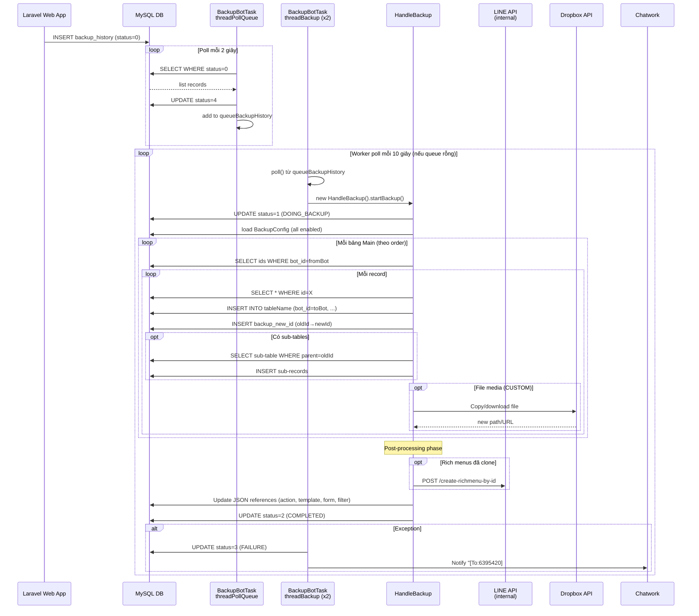

# FA-033「データコピー」— Job Spec

**Feature**: データコピー (Data Copy / Backup)
**Portal**: Admin
**Ngày tạo**: 2026-03-30
**Nguồn**: `reverse-spec/src/job/linect-service/src/main/java/sns/line/task/BackupBotTask.java`

---

## 1. Tổng quan

### 1.1 Tại sao cần background job

Tính năng データコピー sao chép toàn bộ dữ liệu cấu hình (scenario, template, tag, rich menu, form, v.v.) từ một LOA (bot nguồn) sang một LOA khác (bot đích). Khối lượng dữ liệu có thể rất lớn (hàng chục bảng, hàng nghìn records), cộng với việc cần:

- Copy file vật lý (ảnh, video, audio) sang thư mục mới trên filesystem hoặc Dropbox
- Gọi LINE API để đăng ký rich menu mới trên LINE platform
- Cập nhật tất cả foreign key ID sau khi clone để đảm bảo liên kết giữa các bảng chính xác

Toàn bộ quá trình này không thể thực hiện trong một web request — do đó được xử lý hoàn toàn bởi **Spring Boot background job**.

### 1.2 Kiểu giao tiếp: Database Polling Model

| Thành phần | Vai trò |
|-----------|---------|
| **Laravel web app** | INSERT vào `backup_history` với `status=0` (WAITING_BACKUP) khi Admin submit form |
| **Spring Boot job** | Poll liên tục `backup_history`, pick records có `status=0`, set `status=4` (IN_QUEUE), xử lý copy, cập nhật `status=2` (done) hoặc `status=3` (failure) |
| **Bảng trung gian** | `backup_history` — cầu nối giữa web app và background job |

### 1.3 Feature Flag

| Property | Class field | Default | Config key |
|----------|-------------|---------|-----------|
| `config.properties` | `ConfigFile.ENABLE_BACKUP_BOT` | `false` | `ENABLE_BACKUP_BOT` |

**Mức độ tin cậy**: **Cao** (đọc từ `ConfigFile.java:106` và `AppMain.java:249`)

---

## 2. Queue Tables

### 2.1 Bảng `backup_history` — Queue chính

**Entity JPA**: `sns.line.models.linedb.entities.BackupHistory`
**File**: `reverse-spec/src/job/linect-service/src/main/java/sns/line/models/linedb/entities/BackupHistory.java`

**Schema**:
```sql
CREATE TABLE `backup_history` (
  `id`           INT(10) UNSIGNED NOT NULL AUTO_INCREMENT,
  `bot_id`       INT(11) NOT NULL,           -- Bot nguồn (đang thực hiện sao chép)
  `code`         VARCHAR(255) NOT NULL,       -- transfer_code của bot đích
  `line_account` VARCHAR(255) NOT NULL,       -- Tên hiển thị của LOA đích (view_name)
  `status`       INT(11) NOT NULL DEFAULT '0',
  `created_at`   TIMESTAMP NOT NULL DEFAULT CURRENT_TIMESTAMP,
  `updated_at`   TIMESTAMP NOT NULL DEFAULT CURRENT_TIMESTAMP ON UPDATE CURRENT_TIMESTAMP
)
```

### 2.2 State Machine — Status

| Giá trị | Java Constant | Ý nghĩa | Hiển thị UI |
|---------|--------------|---------|-------------|
| **0** | `STATUS_WAITING_BACKUP` | Web app vừa tạo, đang chờ Spring Boot nhận | `処理中` |
| **1** | `STATUS_DOING_BACKUP` | Spring Boot đang xử lý copy | `処理中` |
| **2** | `STATUS_COMPLETED_BACKUP` | Sao chép hoàn thành thành công | `処理完了済` |
| **3** | `STATUS_FAILURE_BACKUP` | Sao chép thất bại do exception | `処理完了済` |
| **4** | `STATUS_IN_QUEUE` | Đã pick vào in-memory queue, chờ worker thread | `処理中` |

> **Lưu ý**: UI Blade template: `status == 0 || 1 || 4 → 処理中`, còn lại → `処理完了済`. Status 3 (failure) hiển thị giống success (`処理完了済`) — UI không phân biệt.

**Mức độ tin cậy**: **Cao** (constants từ BackupHistory.java, blade logic từ logic-spec)

### 2.3 Điều kiện poll

- **threadPollQueue** poll: `findAllByStatus(STATUS_WAITING_BACKUP)` → status = **0**
- **Khởi động**: load sẵn `findAllByStatus(STATUS_IN_QUEUE)` → status = **4** (recovery sau restart)
- **Worker thread** lấy từ in-memory queue: bất kỳ item nào đã ở status 4

### 2.4 Bảng `backup_config` — Cấu hình bảng cần copy

**Entity JPA**: `sns.line.models.linedb.entities.BackupConfig`
**File**: `reverse-spec/src/job/linect-service/src/main/java/sns/line/models/linedb/entities/BackupConfig.java`

| Field | Ý nghĩa |
|-------|---------|
| `table_name` | Tên bảng MySQL cần copy |
| `type` | 1 = TYPE_MAIN_TABLE (bảng chính có bot_id), 2 = TYPE_SUB_TABLE (bảng con, không có bot_id riêng) |
| `is_enable` | 1 = ENABLE, 0 = disabled (skip) |
| `order_index` | Thứ tự xử lý (main tables theo thứ tự tăng dần) |
| `config_references_columns_table` | JSON map: `{column_name: referenced_table}` — foreign key cần clone reference |
| `config_sub_table` | JSON map: `{sub_table: parent_column}` — bảng con cần clone theo parent |
| `reset_columns_value` | JSON: các cột cần reset về giá trị mặc định sau khi copy |
| `parent_id_column_name` | Cột parent ID trong sub-tables |
| `bot_id_column_name` | Tên cột chứa bot_id (VD: `bot_id`) |

**Các trường hợp đặc biệt trong `config_references_columns_table`**:
- Giá trị `"CUSTOM"` → logic xử lý đặc biệt (generate code mới, copy file, v.v.) trong `customValue()` method

### 2.5 Bảng `backup_new_id` — Ánh xạ ID cũ → ID mới

**Entity JPA**: `sns.line.models.linedb.entities.BackupNewId`
**File**: `reverse-spec/src/job/linect-service/src/main/java/sns/line/models/linedb/entities/BackupNewId.java`

Mỗi record clone thành công → lưu 1 row vào `backup_new_id` để traceability.

| Column | Ý nghĩa |
|--------|---------|
| `table_name` | Tên bảng |
| `old_id` | ID gốc (bot nguồn) |
| `new_id` | ID mới (bot đích) |
| `old_bot` | bot_id nguồn |
| `new_bot` | bot_id đích |
| `backup_history_id` | FK về `backup_history.id` |

---

## 3. Task Manager

### 3.1 Entry Point

**Class**: `BackupBotTask`
**File**: `reverse-spec/src/job/linect-service/src/main/java/sns/line/task/BackupBotTask.java`
**Extends**: `StoppableTask`

**Khởi động** (trong `AppMain.run()`):
```java
if (ConfigFile.ENABLE_BACKUP_BOT) {
    new BackupBotTask().startTask(executorService);
}
```

`executorService` là `Executors.newCachedThreadPool()` — tạo thread mới on demand, không giới hạn số thread.

**Mức độ tin cậy**: **Cao** (`AppMain.java:195,249`)

### 3.2 Thread Pool & Khởi tạo

`startTask(executorService)` khởi động **3 threads song song**:

| Thread | Số lượng | Nhiệm vụ |
|--------|---------|---------|
| `threadPollQueue` | 1 | Poll DB → đẩy vào in-memory queue |
| `threadBackup` | 2 | Lấy từ queue → gọi `HandleBackup.startBackup()` |

**In-memory queue**: `LinkedList<BackupHistory> queueBackupHistory` — dùng `synchronized` để thread-safe

### 3.3 threadPollQueue — Logic poll

```
1. Khởi động: load sẵn tất cả backup_history WHERE status=4 (STATUS_IN_QUEUE) → thêm vào queueBackupHistory
   (Recovery: nếu service restart giữa chừng, các job đang "in queue" sẽ được tiếp tục)

2. while(true):
   a. Kiểm tra isPrepareStop() → nếu true: return (graceful shutdown)
   b. findAllByStatus(STATUS_WAITING_BACKUP) → list records status=0
   c. Với mỗi record:
      - setStatus(STATUS_IN_QUEUE=4) → save → thêm vào queueBackupHistory
   d. Nếu list rỗng: sleep(2000ms)
   e. Nếu exception: log + notify Chatwork + sleep(5 phút)
```

**Tần suất poll**: Ngay lập tức khi có records, nếu không có → sleep 2 giây. **Mức độ tin cậy**: **Cao**

### 3.4 threadBackup — Logic worker

```
2 threads chạy song song, mỗi thread:
while(true):
   a. Kiểm tra isPrepareStop() → nếu true: return
   b. Lấy 1 item từ queueBackupHistory (synchronized poll)
   c. Nếu có item:
      - new HandleBackup(threadId, backupHistory).startBackup()
      - Nếu exception: setStatus(FAILURE=3) → save → notify Chatwork "[To:6395420]"
   d. Nếu queue rỗng: Thread.sleep(10000ms)
```

---

## 4. Processing Chain

### 4.1 Sơ đồ xử lý

```
HandleBackup.startBackup()
│
├─ 1. init()
│   └─ Load toàn bộ BackupConfig từ DB → mapConfig
│   └─ Đọc thông tin kết nối DB từ ConfigFile
│
├─ 2. SET backup_history.status = 1 (DOING_BACKUP)
│
├─ 3. Vòng lặp main tables (theo order_index ASC, is_enable=1)
│   └─ doBackupTable(backupConfig) cho từng bảng TYPE_MAIN_TABLE
│       └─ getIds(tableName, WHERE bot_id = fromBot.id)
│           └─ cloneRow(id, null, backupConfig) cho từng record
│
├─ 4. Post-processing (theo thứ tự)
│   ├─ richMenusBackup → createRichmenu() — gọi internal API đăng ký với LINE
│   ├─ formAnswerDetailBackups → doBackupFormAnswerDetail() — fix FK event/remind
│   ├─ templateBackups → doBackupTemplate() — replace [FRIEND_INFO_xxx], [FORM_xxx]
│   ├─ formAnswerBackups → doBackupFormAnswer() — replace link form trong message
│   ├─ eventStepBackups → doBackupEventStep() — replace link form
│   ├─ formAnswerPointSettingBackups → doBackupFormAnswerPointSetting()
│   ├─ bSlotBackups → doBackupBSlot() — fix plan_ids
│   ├─ doBackupAddFriendSetting() — copy 友達追加時設定
│   ├─ filterBackups → doBackupFilter() — copy filters_v2 với ID remapping
│   └─ actionSchedulesBackup → doBackupActionSchedules() — fix filter_ids
│
└─ 5. SET backup_history.status = 2 (COMPLETED_BACKUP)
```

### 4.2 `cloneRow()` — Thuật toán copy một record

Đây là hàm cốt lõi, được gọi đệ quy cho cả bảng chính và bảng con:

```
cloneRow(id, parentId, backupConfig):
1. Kiểm tra mapShareIdCloned["tableName_id"] → nếu đã clone: return newId (tránh duplicate)
2. SELECT * FROM tableName WHERE id = {id} (+ điều kiện đặc biệt nếu có)
3. BUILD INSERT statement động (reflection-based):
   - Cột "id" → set 0 (auto_increment)
   - Cột trong reset_columns_value → set giá trị reset
   - Cột bot_id_column_name → set toBot.id
   - Cột parent_id_column_name → set parentId mới
   - created_at / updated_at → set current timestamp
   - Cột foreign key (trong config_references_columns_table):
     * Giá trị "CUSTOM" → gọi customValue() (logic đặc biệt)
     * Giá trị khác → cloneRow() đệ quy cho referenced table → lấy ID mới
   - Cột thường → copy nguyên giá trị
4. INSERT INTO tableName → lấy generated key → newId
5. Lưu mapShareIdCloned["tableName_id"] = newId
6. Lưu BackupNewId(tableName, oldId, newId, fromBot, toBot, backupHistoryId)
7. Nếu có sub-tables (config_sub_table): cloneSubTable() cho từng sub-table
8. Nếu là "template" → updateSpecialDataTable() (clone sub-template)
9. Thêm vào danh sách post-processing nếu cần
```

**Kết nối DB**: Mỗi lần `cloneRow()` gọi `getConnection()` — tạo JDBC connection mới (URL, username, password từ `ConfigFile.Database`).

---

## 5. Danh sách bảng được copy

Dựa trên `backup_config` table data (is_enable=1), các bảng được copy theo thứ tự:

| order | Bảng (Main/Sub) | Loại | Tương ứng tính năng UI |
|-------|----------------|------|----------------------|
| 1 | `category` | Main | Thư mục/nhóm phân loại |
| 2 | `s_categories` | Main | Danh mục sản phẩm mới |
| 3 | `site_script` | Main | Script nhúng website |
| 4 | `t_actions` | Main | Action definitions |
| 5 | `t_actions_detail` | Main | Chi tiết action |
| 6 | `tags` | Main | タグ (Tag) |
| 7 | `form_answer_folder` | Main | Thư mục form |
| 8 | `form_answer` | Main | フォーム作成 (Form) |
| — | `form_answer_page` | Sub | Trang trong form |
| — | `form_answer_details` | Sub | Chi tiết form |
| — | `form_answer_setting_common` | Sub | Cài đặt chung form |
| — | `form_answer_point_setting` | Sub | Point setting form |
| 10 | `conversion` | Main | コンバージョン (Conversion) |
| 12 | `template` | Main | テンプレート (Template) |
| — | `image_map` | Sub | Image map |
| — | `image_map_items` | Sub | Item trong image map |
| — | `tmp_button` | Sub | Button template |
| — | `buttons` | Sub | Buttons |
| — | `tmp_introduction` | Sub | Introduction template |
| — | `tmp_location` | Sub | Location template |
| 13 | `auto_reply` | Main | 自動応答 (Auto-reply) |
| — | `keyword` | Sub | Keywords trong auto-reply |
| 14 | `rich_menus` | Main | リッチメニュー (Rich Menu) |
| 15 | `scenario` | Main | ステップ配信 (Scenario) |
| — | `step_message` | Sub | Step messages |
| 16 | `friend_information_setting` | Main | 友だち情報 (Friend Info) |
| — | `friend_info_option_selects` | Sub | Options trong friend info |
| 19 | `b_event_detail` | Main | Booking event detail |
| 19 | `events` | Main | イベント予約 (Event booking) |
| 20 | `event_step` | Main | Các bước event |
| 21 | `event_times` | Main | Lịch event |
| 22 | `action_schedules` | Main | アクションスケジュール実行 |
| 26 | `status_chat` | Main | 対応ステータス (Chat status) |
| 27 | `url` | Main | URL tracking |
| 28 | `form_answer_setting` | Main | Cài đặt form answer |
| 29 | `rich_menu_items` | Main | Items của rich menu |
| 30 | `b_slot` | Main | Booking slot |
| — | `b_plan_slot` | Sub | Plan slot |
| 31 | `b_info_setting` | Main | Booking info settings |
| 32 | `filter_manager` | Main | Filter manager |
| 33 | `richmenu_switch_item` | Main | Rich menu switch item |
| 34 | `cross_analysis` | Main | Cross analysis |
| 35 | `csv_management` | Main | CSV management |

**Bảng disabled (is_enable=0)**:
- `s_items` (id=1011) — Sản phẩm
- `booking_calendar` (id=1025) — Lịch booking
- `add_friend_setting` (id=1031) — Cài đặt thêm bạn (xử lý riêng qua `doBackupAddFriendSetting()`)
- `bot_service` (id=1032) — Bot service
- `popup` (id=1033) — Popup

**Mức độ tin cậy**: **Cao** (đọc từ `backup_config.sql` data)

---

## 6. Services & Helpers

### 6.1 `HandleBackup` (Inner static class trong `BackupBotTask`)

| Method | Input | Output | Mô tả |
|--------|-------|--------|-------|
| `startBackup()` | — | — | Entry point: init → SET status=1 → loop main tables → post-processing → SET status=2 |
| `init()` | — | — | Load BackupConfig map, đọc DB config |
| `doBackupTable(BackupConfig)` | config | — | getIds → cloneRow cho từng record |
| `cloneRow(id, parentId, BackupConfig)` | id, parentId | newId | Clone 1 record + sub-tables + references |
| `cloneSubTable(table, parentCol, oldParentId, newParentId)` | — | — | Clone tất cả sub-records theo parent |
| `customValue(tableName, columnName, id, valueOld, ...)` | — | newValue | Xử lý đặc biệt cho các cột CUSTOM |
| `doHandleBackupDataAction(id)` | t_actions_detail id | — | Remap ID references trong action data JSON |
| `doBackupTemplate(id)` | template id | — | Replace placeholders [FRIEND_INFO_xxx], [FORM_xxx] trong text template |
| `doBackupFormAnswer(id)` | form_answer id | — | Replace link form |
| `doBackupFormAnswerDetail(id)` | form_answer_details id | — | Fix event/remind ID references |
| `doBackupFormAnswerPointSetting(id)` | id | — | Replace message content |
| `doBackupEventStep(id)` | event_step id | — | Replace message content |
| `doBackupBSlot(id)` | b_slot id | — | Fix plan_ids |
| `doBackupAddFriendSetting(fromBot, toBot)` | bot IDs | — | Copy 友達追加時設定, remap action/template IDs |
| `doBackupFilter(FilterBackup)` | FilterBackup | — | Clone filters_v2 với đầy đủ ID remapping |
| `doBackupActionSchedules(id)` | action_schedules id | — | Fix filter_ids |
| `backupEventStepTime(oldEventTimeId, newEventTimeId)` | IDs | — | Copy event_step_time records cho event time mới |
| `updateSpecialDataTable(newId, BackupConfig)` | — | — | Handle template groups (sub-templates) |
| `copyImage(id, pathOld, folder, mediaType)` | — | newPath | Copy image file (filesystem hoặc Dropbox API 1) |
| `copyImage2(id, pathOld, folder, mediaType)` | — | newPath | Copy image/video file (Dropbox API 2 full access) |
| `detectReplaceTextMessage(messageContent)` | string | string | Replace [FRIEND_INFO_xxx], [FORM_xxx], [CONVERSION_xxx], [ITEM_xxx] |
| `replaceLinkForm(botNew, messageContent)` | — | string | Replace LIFF URL form trong content |
| `createRichmenu(id, botId)` | — | — | Gọi internal API `/create-richmenu-by-id` để đăng ký rich menu với LINE |

### 6.2 Xử lý CUSTOM columns

| Case (table.column) | Logic |
|--------------------|-------|
| `template.content` | Copy file media (image/video/audio) từ filesystem hoặc Dropbox |
| `template.thumbnail_path` | Copy thumbnail image |
| `tmp_button.img_path` | Copy button image |
| `auto_reply.add_tag_ids` / `remove_tag_ids` | Remap tag IDs (comma-separated list) |
| `friend_information_setting.setting_value` | Remap action_id trong JSON setting value |
| `booking_calendar.calendar_image` | Copy calendar image (Dropbox API 2) |
| `b_event_detail.image` | Copy booking event image |
| `event_step.templates_id` | Remap template ID list |
| `bot_service.service_code` | Generate random 10-char string mới |
| `popup.url_image` | Copy popup image |
| `conversion.unique_key` | Generate random 8-char unique code |
| `s_items.item_code` | Generate random 10-char unique code |
| `s_items.s_category_id` | Remap category ID (s_categories hoặc category) |
| `form_answer.unique_key` | Generate random 6-char unique code |
| `form_answer.image_header` | Copy form header image |
| `form_answer_details.file_upload` | Copy file upload |
| `form_answer_setting_common.image_header` | Copy image |
| `form_answer_page.page_image` | Copy page image |
| `form_answer_page.next_page_setting` | Clone referenced form_answer_pages trong JSON |
| `rich_menus.url_image` | Copy rich menu image |
| `rich_menu_items.content_open_url` | Remap ID dựa trên `type_open_url` (form/s_items/b_event_detail/conversion/booking_calendar/rich_menus) |
| `step_message.template_ids` | Remap template ID list (comma-separated) |
| `filter_manager.parent_id` | Remap parent ID theo loại entity |
| `url.user_id` | Set = toBot.adminId |
| `cross_analysis.filter_tag_ids` | Remap tag IDs |
| `csv_management.export_tags` / `export_friend_info_setting_value` | Remap IDs |

**Mức độ tin cậy**: **Cao** (đọc từ `customValue()` switch-case trong code)

### 6.3 Xử lý filters_v2

Sau khi clone các bảng có filter, `doBackupFilter()` clone tương ứng bảng `filters_v2` (điều kiện lọc):

| Filter type | Remap logic |
|-------------|-------------|
| `TYPE_RICHMENU` | Remap rich menu ID |
| `TYPE_TAG` | Remap tag ID list |
| `TYPE_SCENARIO` | Remap scenario ID |
| `TYPE_CONVERSION` | Remap conversion ID list |
| `TYPE_QR_CODE` | SKIP (bỏ qua) |
| `TYPE_QR_CODE_ACTION` | SKIP (bỏ qua) |
| `TYPE_FRIEND_INFO` | Remap friend_information_setting ID + action_id + friend_info_option_selects |
| `TYPE_AFFILIATER` | SKIP (bỏ qua) |
| `TYPE_STATUS_CHAT` | Remap status_chat ID list |
| Rich menu toggle (`FILTER_TYPE_FILTER_RICH_MENU_TOGGLE`) | Lấy filter IDs từ `richmenu_switch_item.filter_ids` → clone từng filter |

Mỗi filter cloned:
- `rich_menu_item_id` → remap
- `rich_menu_redirect_id` → remap
- Lưu vào `mapShareIdCloned["filters_v2_" + oldId]` và `backup_new_id`

---

## 7. Data Flow Diagram



---

## 8. Error Handling

### 8.1 Exception trong threadPollQueue

| Điều kiện | Hành vi |
|-----------|---------|
| Exception bất kỳ | Log ERROR + `NotifyUtils.sendMessageChatwork()` tới phòng Chatwork + `sleep(5 phút)` |

### 8.2 Exception trong threadBackup (HandleBackup)

| Điều kiện | Hành vi |
|-----------|---------|
| Exception trong `startBackup()` | `setStatus(STATUS_FAILURE_BACKUP=3)` → save → `NotifyUtils.sendReportChatworkLowPriority()` với `[To:6395420]` |

### 8.3 Exception trong `cloneRow()`

| Điều kiện | Hành vi |
|-----------|---------|
| Exception SQL/runtime | Log ERROR + `NotifyUtils.sendReportChatwork()` với `"316148419"` + return `-1000` |
| Record không tồn tại (result.wasNull) | Log INFO + notify Chatwork (nếu id != -1000) + return `-1000` |

### 8.4 Xử lý file media không tồn tại

| Điều kiện | Fallback |
|-----------|---------|
| File local không tồn tại | Nếu `ConfigFile.URL_MEDIA_BACKUP` không rỗng: download từ URL backup remote |
| File không download được | Log ERROR, giữ path cũ |
| Dropbox copy thất bại | Notify Chatwork + giữ path cũ |

### 8.5 Trường hợp đặc biệt

| Trường hợp | Xử lý |
|------------|-------|
| Record đã clone (trong `mapShareIdCloned`) | Skip, trả về ID mới đã có (tránh duplicate) |
| Bot nguồn hoặc bot đích không tồn tại | Throw `IllegalStateException` → bắt ở worker thread → status=3 |
| Filter type không hỗ trợ (TYPE_QR_CODE, TYPE_QR_CODE_ACTION, TYPE_AFFILIATER) | Log ERROR + `continue` (bỏ qua filter đó) |

---

## 9. Liên kết với Web App

### 9.1 Luồng đầy đủ từ click đến completion

```
[Admin] Nhập mã → Nhấn「登録」(Bước 1 AJAX check)
    → POST /ajax/check-transfer-code
    → Confirm tên account → Nhấn「コピー実行」(Bước 2 submit form)
    → POST /basic/backup/export-zip
    → Laravel: INSERT backup_history (bot_id=fromBot, code=toBot.transfer_code, status=0)
    → Redirect back (trang reload)
                              ↓ (async, ~2 giây poll)
    → Spring Boot threadPollQueue phát hiện status=0
    → Set status=4, đẩy vào queue
    → threadBackup pick job → HandleBackup.startBackup()
    → status=1 (DOING_BACKUP)
    → [Copy tất cả bảng theo thứ tự trong backup_config]
    → status=2 (COMPLETED) hoặc status=3 (FAILURE)

[Admin] Refresh trang → Bảng lịch sử hiển thị「処理完了済」
```

### 9.2 Block mechanism khi đang backup

Khi backup đang chạy (status 0 hoặc 1 trong `backup_history` cho `code = toBot.transfer_code`), **các thao tác write trên LOA đích bị block**:

| Controller/Service | Nơi kiểm tra | Hành vi nếu đang backup |
|-------------------|-------------|------------------------|
| `PopupAjaxController` | `backup_history WHERE code=bot.transfer_code AND status IN (0,1)` | Return `{status: false}` |
| `EventAjaxController` | Tương tự | Return error |
| `RichMenuService.isRunningBackup()` | Tương tự | Block write operations |

**Mức độ tin cậy**: **Cao** (từ logic-spec, đã xác nhận từ code)

### 9.3 `友達追加時設定` (Add Friend Setting) — Xử lý đặc biệt

Bảng `add_friend_setting` có `is_enable=0` trong `backup_config`, NHƯNG vẫn được xử lý riêng qua `doBackupAddFriendSetting()`:

- Không clone bản ghi mới (bảng đích đã có record tồn tại cho toBot)
- Chỉ **update** record của toBot: copy action_id và template_id với ID đã remapped từ bot nguồn

---

## 10. Bảng tóm tắt Confidence Levels

| Thông tin | Độ tin cậy | Nguồn |
|-----------|-----------|-------|
| Feature flag `ENABLE_BACKUP_BOT` | **Cao** | `ConfigFile.java:106`, `AppMain.java:249` |
| BackupHistory entity + status constants | **Cao** | `BackupHistory.java` |
| threadPollQueue: poll status=0, sleep 2s | **Cao** | `BackupBotTask.java:45-73` |
| threadBackup: 2 workers, sleep 10s nếu queue rỗng | **Cao** | `BackupBotTask.java:76-110` |
| cloneRow() algorithm (INSERT động + FK remapping) | **Cao** | `BackupBotTask.java:955-1196` |
| Danh sách bảng + thứ tự copy | **Cao** | `backup_config.sql` data |
| Post-processing phase (filter, template text, rich menu LINE API) | **Cao** | `BackupBotTask.java:187-240` |
| Dropbox file copy | **Cao** | `customValue()`, `copyImage()`, `copyImage2()` |
| Notify Chatwork user ID `6395420` khi failure | **Cao** | `BackupBotTask.java:98` |
| Status 3 (FAILURE) hiển thị giống status 2 trên UI | **Cao** | Logic-spec blade template |
| `add_friend_setting` update (không clone mới) | **Cao** | `doBackupAddFriendSetting()` + `is_enable=0` |
| Recovery cơ chế (load status=4 khi startup) | **Cao** | `BackupBotTask.java:46` |
| ExecutorService là CachedThreadPool | **Cao** | `AppMain.java:195` |
