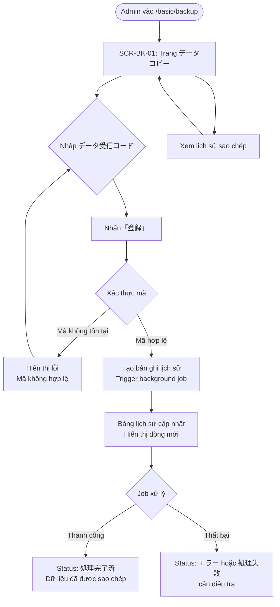

# UI Spec — データコピー (Sao chép dữ liệu)

**Feature ID**: FA-033
**URL**: `/basic/backup`
**Ngày phân tích**: 2026-03-30
**Nguồn**: Playwright CLI snapshot + screenshot
**Screenshot**: [SCR-BK-01-main.png](screenshots/SCR-BK-01-main.png)

---

## 1. Tổng quan tính năng

Tính năng「データコピー」(Sao chép dữ liệu) cho phép Admin sao chép toàn bộ dữ liệu đã thiết lập trong tài khoản LINE OA hiện tại sang một tài khoản エルメ (LME) khác. Bên nhận cần cung cấp "データ受信コード" (Mã nhận dữ liệu) để xác định tài khoản đích. Tính năng cũng hiển thị lịch sử các lần sao chép đã thực hiện.

**Mục đích**: Hỗ trợ Admin tái sử dụng cấu hình (kịch bản, template, tag, v.v.) khi nhân rộng hoặc chuyển sang tài khoản mới mà không cần cấu hình lại từ đầu.

---

## 2. Actors liên quan

| Actor | Quyền | Ghi chú |
|-------|-------|---------|
| **Admin** | Xem trang, nhập mã, thực hiện sao chép, xem lịch sử | Chỉ Admin mới có menu mục này |
| **Staff** | Không có quyền truy cập (menu không hiển thị với Staff) | Mục「データコピー」nằm trong nhóm "システム管理関連" — thường chỉ Admin |

---

## 3. Màn hình

### SCR-BK-01: データコピー (Sao chép dữ liệu)

**URL**: `/basic/backup`
**Screenshot**: [SCR-BK-01-main.png](screenshots/SCR-BK-01-main.png)

#### 3.1 Layout

| Vùng | Mô tả |
|------|-------|
| **Header** | Logo エルメ (L Message) bên trái, thông tin tài khoản (tên "Xoài"), thống kê配信数 (số lần gửi: 463/無制限 プロ), thông tin LINE公式アカウント (89/500 コミュニケーション), link「詳細を見る」 |
| **Sidebar trái** | Menu điều hướng dọc, nhóm "メインサービス" và "システム管理関連". Mục「データコピー」đang active trong nhóm "システム管理関連". Có nút「メニューを非表示」(Ẩn menu) ở cuối sidebar |
| **Main Content** | Tiêu đề trang + mô tả + danh sách dữ liệu được sao chép + form nhập mã + bảng lịch sử |

#### 3.2 Cấu trúc Main Content

**Block 1 — Tiêu đề & mô tả**

- Heading level 2:「データコピー」
- Mô tả:「このアカウントに設定されているデータを他のエルメにコピーすることが出来ます。」(Có thể sao chép dữ liệu đã thiết lập trong tài khoản này sang một エルメ khác.)

**Block 2 — Danh sách dữ liệu được sao chép**

- Label:「コピーされるデータ」(Dữ liệu được sao chép)
- Danh sách:
  - 「ステップ配信」(Gửi theo bước)
  - 「テンプレート」(Template)
  - 「タグ」(Tag)
  - 「自動応答」(Tự động trả lời)
  - 「フォーム作成」(Tạo form)
  - 「リッチメニュー」(Rich menu)
  - 「イベント予約」(Đặt lịch sự kiện)
  - 「リマインド配信」(Gửi nhắc nhở)
  - 「友だち情報」(Thông tin bạn bè)
  - 「アクションスケジュール実行」(Thực thi lịch hành động)
  - 「対応ステータス」(Trạng thái xử lý)
  - 「友だち追加時設定」(Cài đặt khi thêm bạn)
  - 「コンバージョン」(Conversion)
- Chú ý:「上記以外のデータはコピーされませんので、手動での設定をお願い致します。」(Dữ liệu ngoài danh sách trên sẽ không được sao chép, vui lòng thiết lập thủ công.)

**Block 3 — Form nhập mã**

- Section label:「データ受信コード入力」(Nhập mã nhận dữ liệu)
- Label field:「データ受信コード」(Mã nhận dữ liệu)
- Input: textbox (1 ô nhập liệu)
- Button:「登録」(Đăng ký / Thực hiện)

**Block 4 — Bảng lịch sử**

- Section label:「データコピー履歴」(Lịch sử sao chép dữ liệu)
- Table với 4 cột (xem bên dưới)

#### 3.3 Action Buttons

| Label (JP) | Vị trí | Loại | Hành vi |
|-----------|--------|------|---------|
| 「登録」(Đăng ký) | Bên phải textbox「データ受信コード」, Block 3 | Button — primary | Nhấn → Gửi yêu cầu sao chép dữ liệu đến tài khoản được xác định bởi mã nhận dữ liệu đã nhập |

#### 3.4 Form Fields

| Label (JP) | Tên field | Input Type | Required | Placeholder | Default | Validation hiển thị |
|-----------|----------|-----------|----------|-------------|---------|-------------------|
| 「データ受信コード」(Mã nhận dữ liệu) | data_receive_code | text | Có (ngầm định) | (không rõ từ snapshot) | Trống | Không rõ từ snapshot — cần điều tra |

#### 3.5 Data Table — Lịch sử sao chép

| STT | Tiêu đề cột (JP) | Dữ liệu mẫu | Kiểu dữ liệu | Ghi chú |
|-----|-----------------|-------------|-------------|---------|
| 1 | 「データコピー日時」(Ngày giờ sao chép) | `2023.09.27 12:22` | datetime (định dạng YYYY.MM.DD HH:mm) | Hiển thị theo múi giờ Nhật (JST) |
| 2 | 「データ受信コード」(Mã nhận dữ liệu) | `GNBGFMhyBH` | string (10 ký tự alphanumeric, có phân biệt hoa thường) | Mã dùng để tra cứu tài khoản nhận |
| 3 | 「コピー先アカウント名」(Tên tài khoản đích) | `test 5` | string | Tên hiển thị của tài khoản nhận |
| 4 | (Cột trạng thái — không có tiêu đề trong header, nhưng có dữ liệu) | `処理完了済` | enum/string | Trạng thái xử lý của lần sao chép |

> **Lưu ý**: Cột thứ 4 trong accessibility tree (ref=e166) không có tiêu đề cột, nhưng row data (ref=e172) có giá trị `処理完了済`. Cột này là trạng thái (Status).

#### 3.6 Observations

- Trang chỉ có **1 màn hình duy nhất** — không có tab, modal hay navigation nội trang.
- Tính năng hoạt động theo chiều **1 chiều**: tài khoản hiện tại là nguồn (sender), tài khoản nhận được xác định bởi mã nhận.
- Mã nhận dữ liệu (`データ受信コード`) có độ dài cố định 10 ký tự dựa trên dữ liệu mẫu (`GNBGFMhyBH`).
- Bảng lịch sử hiển thị toàn bộ lịch sử sao chép đã thực hiện từ tài khoản này (không phân trang rõ ràng trong snapshot).
- Không có nút「データ受信コードを発行」(Phát hành mã nhận) trên trang này — mã nhận được tạo ở trang khác (có thể là trang cài đặt tài khoản nhận).
- Trang thuộc nhóm "システム管理関連" (Quản lý hệ thống liên quan) trong sidebar, chỉ Admin mới có.
- Trạng thái`処理完了済` (Đã hoàn tất xử lý) gợi ý việc sao chép là **bất đồng bộ** — có thể do background job xử lý.

---

## 4. User Flows

### 4.1 Happy Path — Thực hiện sao chép dữ liệu thành công

1. Admin đăng nhập → Vào menu「データコピー」(`/basic/backup`)
2. Trang hiển thị thông tin tính năng, danh sách dữ liệu sao chép, form nhập mã
3. Admin nhập「データ受信コード」vào textbox
4. Admin nhấn「登録」
5. Hệ thống xác thực mã → Tạo bản ghi lịch sử → Trigger background job sao chép
6. Trang phản hồi (thông báo thành công hoặc reload bảng lịch sử)
7. Bảng lịch sử hiển thị dòng mới với trạng thái đang xử lý hoặc hoàn tất

### 4.2 Error Cases

| Case | Điều kiện | Hành vi dự kiến |
|------|-----------|----------------|
| Mã không hợp lệ | Nhập mã không tồn tại hoặc sai định dạng | Thông báo lỗi (cần điều tra nội dung lỗi) |
| Mã trống | Nhấn「登録」khi textbox trống | Validation lỗi phía client hoặc server |
| Sao chép sang chính tài khoản mình | Nhập mã nhận của chính tài khoản đang dùng | Hành vi chưa rõ — cần điều tra |
| Lỗi hệ thống | Background job thất bại | Cột Status có giá trị khác (ngoài `処理完了済`) |

---

## 5. Flow Diagram

---

## 6. Điểm chưa rõ / cần điều tra

| ID | Điểm chưa rõ | Mức độ |
|----|-------------|--------|
| BK-Q01 | Mã「データ受信コード」được tạo ra ở đâu? Tài khoản nhận cần vào trang nào để lấy mã? | Cao |
| BK-Q02 | Validation của textbox「データ受信コード」: độ dài, ký tự hợp lệ, thông báo lỗi khi sai? | Cao |
| BK-Q03 | Thông báo hiển thị sau khi nhấn「登録」thành công là gì? Toast/alert/redirect? | Trung bình |
| BK-Q04 | Cột Status có những giá trị nào ngoài`処理完了済`? (VD: `処理中`, `エラー`) | Cao |
| BK-Q05 | Background job xử lý sao chép như thế nào? Thứ tự ưu tiên giữa các loại dữ liệu? Retry khi lỗi? | Trung bình |
| BK-Q06 | Giới hạn số lần sao chép? Có rate limit không? | Thấp |
| BK-Q07 | Bảng lịch sử có phân trang không? Hiển thị bao nhiêu dòng tối đa? | Thấp |
| BK-Q08 | Staff có thể thấy/dùng tính năng này không? | Trung bình |
| BK-Q09 | Khi sao chép, dữ liệu ở tài khoản nguồn có bị thay đổi không? | Thấp |
| BK-Q10 | Có thể sao chép từ nhiều tài khoản nguồn khác nhau sang cùng 1 tài khoản đích không? | Thấp |
