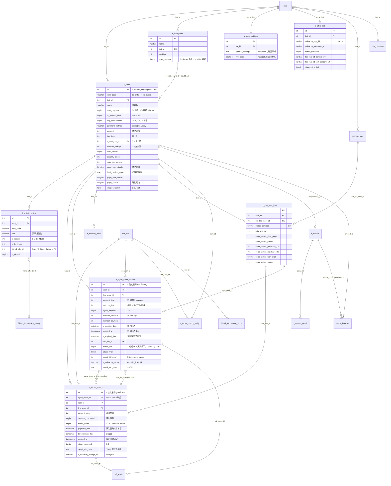
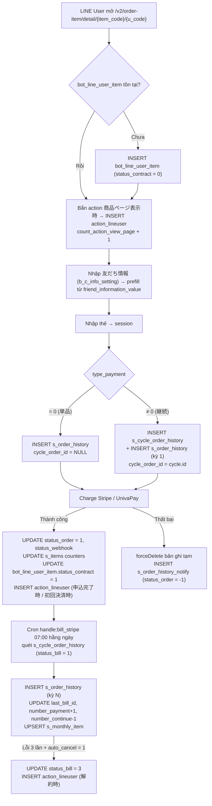

# DB Mapping — FA-026 「商品販売」/「単品商品」 (Bill Item / Sales Management V2)

> **Nguồn dữ liệu**
> - Schema: `db/schema/tables/{table}.sql` (đã làm sạch), index/AUTO_INCREMENT tra từ phần `ALTER TABLE` của dump gốc.
> - Data mẫu: `db/data/{table}.sql` (**lưu ý: nằm trực tiếp trong `db/data/`, không có thư mục con `tables/`**).
> - Đối chiếu code: `src/web/sns-line/app/Http/Controllers/Basic/SalesManagementV2Controller.php`, `app/SCategory.php`, `resources/views/basic/sales/v2/**`.
> - Đầu vào: `_internal/db-hint.md`, `web/api-spec.md`, `web/logic-spec.md`, `ui/ui-spec.md`.

> ⚠ **CẢNH BÁO QUAN TRỌNG VỀ DỮ LIỆU MẪU**
> Dump DB trong repo đến từ **môi trường khác** với hệ thống đang chạy (`form.watermeru.com`) mà UI được quan sát. Cụ thể:
>
> | Thực thể | Max id trong dump | Giá trị quan sát trên UI | Kết luận |
> |----------|------------------|--------------------------|---------|
> | `s_items` | `808` | `product_id` = 861 / 869 / 872 / 879 | Sản phẩm UI **không có** trong dump |
> | `s_order_history` | `3226` | 注文番号 3446, 3461 | Đơn UI **không có** trong dump |
> | `s_cycle_order_history` | `700` | 注文番号 767–772 | Đăng ký UI **không có** trong dump |
>
> → Toàn bộ **Sample Data** dưới đây lấy từ **dữ liệu thật trong dump**, không phải từ UI. Tuy nhiên **dãy số hoàn toàn nhất quán** (UI luôn lớn hơn max của dump một khoảng hợp lý), nên kết luận về "cột nào là 注文番号" vẫn ở mức tin cậy **Cao**.
> Một điểm khớp trực tiếp: `s_strip_bot.univapay_app_id = '11ebc45b-7eb2-b188-93bd-030f020ac456'` (bot_id 46587 trong dump) **trùng khít** với `storeId` UnivaPay quan sát trên UI → xác nhận cột này chính là 「storeId」.

---

## 1. Primary Tables

Bảng liên quan **trực tiếp** — tương ứng các Model Eloquent được `SalesManagementV2Controller` / `SalesStripePaymentController` sử dụng (xem `logic-spec.md` §3).

| Bảng | Model | Vai trò | Số cột | Data size | Tin cậy |
|------|-------|---------|--------|-----------|--------|
| `s_items` | `App\SItems` | ★ **Bảng sản phẩm trung tâm**. Một bảng chung cho **cả** 単品商品 và 継続商品 (phân biệt bằng `type_payment`), cả V1 và V2 (phân biệt bằng `is_product_new`). Chứa luôn toàn bộ cấu hình 4–5 trang「各種ページ」và 7 slot エルメアクション | 90 | 186KB | **Cao** |
| `s_order_history` | `App\OrderHistory` | ★ **Giao dịch thanh toán**. Vừa là "đơn 単品" (khi `cycle_order_id IS NULL`), vừa là "kỳ thanh toán của hợp đồng định kỳ" (khi `cycle_order_id` trỏ tới `s_cycle_order_history.id`) | 45 | 909KB | **Cao** |
| `s_cycle_order_history` | `App\CycleOrderHistory` | ★ **Hợp đồng đăng ký định kỳ** (subscription). 1 bản ghi = 1 lần friend đăng ký 継続商品 | 50 | 184KB | **Cao** |
| `s_categories` | `App\SCategory` | Folder chứa sản phẩm 「フォルダ」. Tách biệt theo loại: `type_payment = 0` (folder 単品) / `= 2` (folder 継続) | 7 | 20KB | **Cao** |
| `b_c_info_setting` | `App\BCInfoSetting` | Định nghĩa các trường thu thập 「2.友だち情報入力」 (1-n với sản phẩm). **Dùng chung với tính năng đặt lịch** (có cột `booking_calendar_id`) | 14 | 155KB | **Cao** |
| `s_store_settings` | `App\SStoreSetting` | Cài đặt cấp bot: 「特定商取引法に基づく表記」 (`info_store`) + template 「ご確認事項」 (`general_settings`). 1 bản ghi / bot | 6 | 16KB | **Cao** |
| `s_strip_bot` | `App\StripBot` | Khoá & cấu hình cổng thanh toán của bot (Stripe Connect + UnivaPay + TaxRate id + webhook). 1 bản ghi / bot | 30 | 75KB | **Cao** |

---

## 2. Secondary Tables

| Bảng | Model | Quan hệ với FA-026 | Tin cậy |
|------|-------|--------------------|--------|
| `bot_line_user_item` | `App\BotLineUserItem` | Trạng thái hợp đồng + bộ đếm số lần đã bắn エルメアクション của cặp (friend × sản phẩm). Quyết định 稼働回数「1度のみ」 | **Cao** |
| `s_monthly_item` | `App\SMonthlyItem` | Thống kê doanh số theo tháng (`bot_id + item_id + month + year`). ⚠ V2 đã comment out phần cập nhật khi refund/huỷ | **Cao** |
| `s_order_history_notify` | `App\OrderHistoryNotify` | Hàng đợi thông báo đơn hàng cho app mobile. `status_order` = `-1` mua lần đầu thất bại, `-2` huỷ đơn | **Cao** |
| `t_actions` / `t_actions_detail` | `App\Actions` (SC-004) | Đích của 7 cột `action_*_id` trên `s_items`. ✔ **Đã xác minh**: `App\Actions::$table = 't_actions'` (`app/Actions.php:10`), `App\ActionDetail::$table = 't_actions_detail'` (`app/ActionDetail.php:10`); schema `db/schema/tables/t_actions_detail.sql` tồn tại, không có `t_action_detail.sql`; `features/shared/registry.md` SC-004 cũng ghi cặp `t_actions` + `t_actions_detail`. Chuỗi `t_action_detail` xuất hiện trong code chỉ là **tên khoá mảng** `t_action_detail_id` (`ActionDetail.php:35`), không phải tên bảng | **Cao** |
| `action_lineuser` | `App\ActionLineUser` | Hàng đợi thực thi エルメアクション (`status = 0` chờ consumer). Cột `product_id` = `s_items.id`, `order_id` = id đơn, `type_start_scenario` = 12001/12002/13001…13007. ⚠ Xem bất thường #13 ở §8.3 (cột `table_history`) | **Cao** |
| `line_user` | `App\LineUser` | 「友だち名」 hiển thị ở 販売履歴 / 注文詳細 (`name`, `view_name`, `avatar_url`). Link `/basic/friendlist/my_page/{line_user.id}` | **Cao** |
| `bot_line_user` | — | Giải mã `u_code` ở trang public → xác định friend; kiểm tra block/kết bạn | **Cao** |
| `bots` | `App\Bot` | `liff_id` (sinh URL LIFF), `url_add_friend`, `view_name` (tên file CSV), `plan_type` (giới hạn số sản phẩm) | **Cao** |
| `bot_contracts` | — | `contract_type` (`free`/`standard`) → BR-01 giới hạn số sản phẩm; `status` → chặn bot hết hạn | **Cao** |
| `friend_information_setting` | — | Đích của `b_c_info_setting.friend_info_id > 0` — trường hồ sơ bạn bè tuỳ chỉnh (FA-015) | **Cao** |
| `friend_information_value` | — | Giá trị prefill trên trang 「お客様情報入力」 (theo `line_id`) | **Cao** |
| `jobs` / `failed_jobs` | — | Queue driver `database`. Job duy nhất của tính năng: `HandleWebhookUnivapay` (queue `default`) | **Cao** |
| `job_config_daily` | `JobConfigDaily` (Spring Boot) | ❌ **KHÔNG liên quan FA-026.** Hai cột `last_id_monitor_payment_history` và `last_id_monitor_s_order_history` là **dead columns**: có ánh xạ trong `JobConfigDaily.java:13-18` nhưng getter/setter **không được gọi ở bất kỳ đâu** trong codebase Java; `JobConfigDailyRepository` chỉ phục vụ `MonitorCalendarBookingTask` cho `salon_booking_last_id`/`lesson_booking_last_id` (salon/lesson booking). Laravel cũng không truy cập bảng này. **Không có task nào theo dõi `s_order_history`** — xem `job/job-spec.md` §1.3 | **Cao** |
| `sync_elasticsearch` | `App\SyncElasticsearch` | Connection riêng `mysql_step_message`; chỉ ghi khi `env('API_KEY_ES')` được set | **Cao** |
| `mobile_notify` | — | Thông báo push app. `type` = 8 (`bill_one`) / 9 (`bill_cycle`) | **Cao** |
| `aff_result` | — | `s_order_history.aff_result_id` / `s_cycle_order_history.aff_result_id` — liên kết affiliate | **Trung bình** |
| `user_access_bot` | — | Log truy cập của Staff (middleware `basic_access`) | **Cao** |

### Bảng được đề xuất kiểm chứng nhưng **KHÔNG liên quan** FA-026

| Bảng | Kết luận |
|------|---------|
| `payment_histories` | Lịch sử thanh toán **hợp đồng LME của chính bot** (cột `bot_contract_id`, `reason`, `rate`). Không có cột `item_id`. **Không liên quan** tới 商品販売 — tin cậy **Cao** |
| `request_paypal_item` | Log webhook PayPal cho **subscription hợp đồng LME**, chỉ được dùng bởi `Admin/UserController.php:4599` và `Console/Commands/VerifyPayPal.php`. Không có tham chiếu nào từ `SalesManagement*`. **Không liên quan** — tin cậy **Cao** |
| `csv_management` | Export CSV của bill-item chạy **đồng bộ** qua `Excel::download()`, không ghi bảng này |
| `action_schedules` | Thuộc tính năng アクション予約, sales không ghi vào bảng này |

> Tất cả các bảng liệt kê ở §1 và §2 **đều tồn tại** trong `db/index.md`. Không có bảng nào phải ghi "không tồn tại trong dump".

---

## 3. Entity Details

### 3.1 `s_items` — Sản phẩm (90 cột)

**Primary key**: `id` `int(10) UNSIGNED AUTO_INCREMENT` (`ALTER TABLE s_items ADD PRIMARY KEY (id)`).
**Index khác**: ❌ **KHÔNG có index nào ngoài PK** — không có index trên `bot_id`, `item_code`, `s_category_id`, `is_product_new`, `flag_environment` dù mọi truy vấn đều lọc theo các cột này. **Rủi ro hiệu năng** — tin cậy **Cao**.
**Foreign Keys khai báo**: ❌ không có. Toàn bộ là **FK logic** (LME không khai báo constraint).

#### Nhóm A — Định danh & phân loại (dùng chung V1/V2)

| Cột | Kiểu | Null | Default | Key | Mô tả |
|-----|------|------|---------|-----|-------|
| `id` | int(10) UNSIGNED | No | AI | **PK** | ★ = `product_id` trong URL LIFF |
| `item_code` | varchar(100) | Yes | NULL | (FK logic ← `b_c_info_setting.item_code`) | ★ Mã 10 ký tự `str_random(10)` dùng trong route public `/v2/order-item/*/{item_code}/*` |
| `bot_id` | int(11) | Yes | NULL | FK logic → `bots.id` | Bot sở hữu sản phẩm |
| `name` | varchar(500) | Yes | NULL | — | 「商品名（管理用）」/「管理名」 (client giới hạn 20 ký tự) |
| `s_category_id` | int(10) UNSIGNED | No | — | FK logic → `s_categories.id` | Folder; `0` = 未分類 (folder ảo, không có bản ghi DB) |
| `position` | int(11) | Yes | NULL | — | Thứ tự sắp xếp thủ công; hiển thị `ORDER BY position DESC` |
| `type_payment` | tinyint(4) | Yes | NULL | — | ★ Chu kỳ thanh toán: `0` once (単品), `1` weekly, `2` monthly, `3` 3month, `4` 6month, `5` yearly. **`= 0` → 単品商品; `<> 0` → 継続商品** |
| `is_product_new` | tinyint(4) | No | `0` | — | ★ `1` = V2 (màn hình hiện hành), `0` = V1 legacy |
| `flag_environment` | tinyint(4) | No | `0` | — | ★ `0` = テスト環境, `1` = 本番環境 (comment schema xác nhận) |
| `status_valid` | tinyint(4) | Yes | NULL | — | `1` hợp lệ / công khai, `0` ẩn. **V2 luôn ghi `1`** (`saveItem:933`) — không có chức năng ẩn ở V2 |
| `payment_method` | varchar(10) | Yes | NULL | — | ★ **Chuỗi**, không phải số: `'stripe'` \| `'univapay'` |
| `created_at` | timestamp | No | CURRENT_TIMESTAMP | — | 「作成日」 |
| `updated_at` | timestamp | No | CURRENT_TIMESTAMP ON UPDATE | — | — |

#### Nhóm B — Giá, thuế, tồn kho

| Cột | Kiểu | Null | Default | Mô tả |
|-----|------|------|---------|-------|
| `amount` | int(11) | No | `0` | 「商品価格」/「① 請求価格」 — đơn vị yên, số nguyên |
| `amount_first` | int(11) | No | `0` | 「初回トライアル価格」 — chỉ dùng khi `flag_first = 1` |
| `flag_first` | tinyint(4) | Yes | NULL | `1` = có giá kỳ đầu riêng (「有料」), `0`/NULL = không (「無料」) |
| `tax_item` | int(11) | No | `10` | 「消費税率」 — `10` hoặc `8`. **V2-only** |
| `number_charge` | int(11) | Yes | NULL | 「② 請求回数」 — `0` = 無制限; giá trị 2,3,4,5,6,9,12,18,24,36 |
| `flag_trial` | int(11) | No | `0` | `1` = bật 「トライアル期間設定」 |
| `time_trial` | int(11) | Yes | NULL | 「トライアル日数」 — số ngày; ép `NULL` khi `flag_trial != 1` |
| `auto_cancel` | tinyint(4) | Yes | NULL | 「請求エラー」: `1` = 自動解約する, `0` = 自動解約しない |
| `quantity_stock` | int(11) | Yes | NULL | 「在庫数」 — **V2-only** |
| `max_per_person` | int(11) | Yes | NULL | 「友だち1人当たりの購入上限」 — **V2-only**, ⚠ không enforce ở server |
| `flag_use_stock` | tinyint(4) | Yes | NULL | Toggle bật tồn kho. `0`/NULL → UI hiện 「無制限」 |
| `flag_use_max_per_person` | tinyint(4) | Yes | NULL | Toggle bật giới hạn/người |
| `flag_show_stock` | tinyint(4) | Yes | NULL | 「在庫数表示」 trên trang public |
| `flag_show_max_per_person` | tinyint(4) | Yes | NULL | 「友だち1人当たりの購入制限表示」 |

#### Nhóm C — Cấu hình「各種ページ」 (wizard 4–5 bước)

> ★ **Trả lời câu hỏi #3 của db-hint**: cấu hình 4–5 trang **KHÔNG** nằm ở bảng con và **KHÔNG** phải JSON — mỗi trường là **1 cột riêng** trên chính `s_items`. Ngoại lệ duy nhất là bảng field 「友だち情報入力」 → `b_c_info_setting`.

| Bước wizard | Cột nội dung (HTML) | Cột nhãn nút | Cột màu nền | Cột màu chữ | Ghi chú |
|-------------|--------------------|-------------|------------|------------|--------|
| 1.商品ページ | `page_start_simple` `longtext` (「商品案内」) + `image_product` `text` (CSV path, tối đa 5 ảnh) | `text_button_start` `text` | `color_button_start` `varchar(100)` | `color_text_button_start` `varchar(20)` | — |
| 2.友だち情報入力 | (bảng con `b_c_info_setting`) | `text_button_friend_info` `varchar(30)` | `bg_button_friend_info` `varchar(30)` | `color_button_friend_info` `varchar(30)` | — |
| 3.最終確認ページ | `final_confirm_page` `text` (「ご確認事項」) | `text_payment_button` `varchar(30)` | `bg_payment_button` `varchar(30)` | `color_payment_button` `varchar(30)` | ⚠ tên cột **lệch 1 bước** so với nhãn wizard |
| 4.申込完了後ページ | `page_end_simple` `longtext` + `url_page_outsite_end` `varchar(500)` + `flag_page_end` `tinyint` | `text_confirm_button` `varchar(30)` | `bg_confirm_button` `varchar(30)` | `color_confirm_button` `varchar(30)` | ⚠ tên cột lệch 1 bước |
| 5.解約用ページ (chỉ 継続) | `page_cancel` `longtext` (「解約案内」) | `text_button_cancel` `text` | `color_button_cancel` `varchar(100)` | `color_text_button_cancel` `varchar(20)` | — |

> ⚠ **Lệch tên cột ↔ nhãn wizard** (tin cậy **Cao**, đọc `steps/step-3.blade.php:40` & `steps/step-4.blade.php:12`):
> Mỗi bước wizard cấu hình **nút của trang TRƯỚC** trong luồng mua hàng. Vì thế:
> - Bước 3「最終確認ページ」 → nút 「最終確認にすすむ」 nằm ở trang **カード情報入力** → cột `text_payment_button`
> - Bước 4「申込完了後ページ」 → nút 「購入する」 nằm ở trang **最終確認** → cột `text_confirm_button`

`flag_page_end` (「申込完了後」 chế độ) — quan sát trong dump: `0`, `1`, `2`:

| Giá trị | Hiển thị UI | Hành vi (`confirm-order.js:70-80`) |
|--------|------------|-----------------------------------|
| `0` | 「テキスト入力」 | Render HTML `page_end_simple` |
| `1` | 「任意ページURL」 | Redirect `url_page_outsite_end` |
| `2` | 「ページを表示せずにトーク画面に戻る」 (mặc định UI) | Redirect về chat LINE (`bots.url_add_friend`) |

#### Nhóm D — 7 slot エルメアクション

| Slot UI (JP) | Cột action id | Cột 稼働回数 | Cột phụ | Áp dụng |
|-------------|--------------|-------------|--------|--------|
| 「商品ページ表示時」 | `action_show_page_id` int(11) | `number_action_show_page` tinyint (NOT NULL DEFAULT 0) | — | 単品 + 継続 |
| 「申込完了時」 | `action_contract_id` int(11) | `number_action_contract` tinyint | — | 単品 + 継続 |
| 「トライアル」 | `action_contract_trial_id` int(11) | `number_action_contract_trial` tinyint | `number_day_action_contract_trial` tinyint (「終了の N 日前」) | 継続 |
| 「初回決済時」 | `action_purchase_1st_id` int(10) UNSIGNED | `number_action_purchase_1st` tinyint | — | 継続 |
| 「2回目以降決済時」 | `action_purchase_2st_id` int(10) UNSIGNED | `number_action_purchase_2st` tinyint | `auto_action_purchase_2st` tinyint (⚠ UI đã comment out) | 継続 |
| 「決済エラー発生時」 | `action_buy_error_id` int(10) UNSIGNED | `number_action_buy_error` tinyint | — | 継続 |
| 「解約時」 | `action_cancel_payment_id` int(11) | `number_action_cancel_payment` tinyint | — | 継続 |
| *(V1 only, không có trên UI V2)* | `action_click_button_id` int(11) | — | — | V1 |

`number_action_*`: `1` = 「1度のみアクション稼働」 (mặc định), `0` = 「何度でもアクション稼働」 — đối chiếu bộ đếm tương ứng trên `bot_line_user_item`.

#### Nhóm E — Bộ đếm thống kê (tách đôi 本番/テスト)

| Cột 本番 | Cột テスト | Ý nghĩa | Hiển thị trên UI V2? |
|---------|----------|---------|---------------------|
| `number_register` | `number_register_test` | Số lượt đăng ký | ❌ (đã comment out trong blade) |
| `number_trial` | `number_trial_test` | Số đang trong trial | ✅ cột 「トライアル中」 |
| `number_cancel` | `number_cancel_test` | Số huỷ | ❌ |
| `number_refund` | `number_refund_test` | Số hoàn tiền | ❌ |
| `current_month_sales` | `current_month_sales_test` | Doanh số tháng hiện tại | ❌ |
| `sum_sales` | `sum_sales_test` | Tổng doanh số | ❌ |

#### Nhóm F — Cột legacy V1 (không xuất hiện trên UI V2)

| Cột | Kiểu | Vai trò V1 |
|-----|------|-----------|
| `flag_update_email` | tinyint(4) | Cờ cập nhật email friend sau khi mua |
| `flag_page_start` | tinyint(4) | Chế độ trang sản phẩm V1: `0` simple / `1` URL ngoài / `2` head+body. **V2 vẫn đọc** để quyết định có bắn action 「ページ表示時」 (`orderDetail:1630`) |
| `head_start`, `body_start` | text | HTML head/body trang sản phẩm V1 |
| `url_page_outsite_start` | varchar(500) | URL trang sản phẩm ngoài (V1) |
| `head_end`, `body_end` | text | HTML head/body trang hoàn tất V1 |
| `color_theme` | varchar(100) | Màu chủ đề V1 |
| `flag_msg_success` | tinyint(4) | Gửi tin LINE khi thanh toán thành công |
| `flag_msg_fail` | tinyint(4) | Gửi tin LINE khi bill lỗi — **V2 vẫn dùng** (BR-07) |
| `product_name` | text | 「表示商品名」 — **V2 vẫn dùng** (max 50) |
| `supplement_product` | text | 「説明」 — **V2 vẫn dùng** (max 50) |

#### Sample Data (`db/data/s_items.sql`, 171 bản ghi, 149 bản ghi `is_product_new = 1`)

```
id=157 | item_code='RL0bzicnN6' | bot_id=542 | name='sp bill chu ky 2' | flag_environment=1 | status_valid=1
      | type_payment=3 | number_charge=0 | amount=10000 | flag_first=0 | amount_first=0 | flag_trial=0
      | payment_method='stripe' | s_category_id=0 | position=1 | quantity_stock=94 | max_per_person=2
      | flag_use_stock=1 | flag_use_max_per_person=1 | tax_item=10 | auto_cancel=0 | is_product_new=1

id=158 | item_code='Sj8E8kUmF0' | bot_id=542 | name='test' | flag_environment=0 | type_payment=0
      | number_charge=NULL | amount=1567657 | flag_first=NULL | payment_method='stripe' | s_category_id=0
      | quantity_stock=NULL | flag_use_stock=0 | tax_item=10 | auto_cancel=NULL | is_product_new=1
      | number_register_test=2 | sum_sales_test=1567657

id=188 | item_code='YxXB5Z3B71' | name='bill stripe 2' | type_payment=1 | number_charge=2 | amount=2000
      | flag_first=1 | amount_first=500 | flag_trial=1 | time_trial=2 | s_category_id=7 | position=2
      | quantity_stock=10 | flag_use_stock=1 | tax_item=10 | auto_cancel=0
```

**Giá trị distinct thực tế trong dump**:

| Cột | Giá trị quan sát |
|-----|-----------------|
| `payment_method` | `'stripe'`, `'univapay'` |
| `type_payment` | `0`, `1`, `2`, `3` (dump chưa có `4`, `5`) |
| `number_charge` | `0`, `2`, `3`, `4`, `NULL` |
| `tax_item` | chỉ `10` (dump chưa có bản ghi `8`) |
| `status_valid` | `0`, `1` |
| `auto_cancel` | `0`, `1`, `NULL` |
| `flag_page_start` | `0`, `2` |
| `flag_page_end` | `0`, `1`, `2` |
| `is_product_new` | `0` (22 bản ghi), `1` (149 bản ghi) |

---

### 3.2 `s_order_history` — Giao dịch thanh toán (45 cột)

**PK**: `id` int(10) UNSIGNED AUTO_INCREMENT. **Không có index nào khác** (chỉ PK). **Không có FK khai báo**.

| Cột | Kiểu | Null | Default | Key | Mô tả |
|-----|------|------|---------|-----|-------|
| `id` | int(10) UNSIGNED | No | AI | **PK** | ★ = 「注文番号」 hiển thị trên UI (単品 và 決済履歴 của 継続) |
| `bot_id` | int(11) | Yes | NULL | FK logic → `bots.id` | — |
| `line_user_id` | int(11) | Yes | NULL | FK logic → `line_user.id` | 「友だち名」/「購入者名」 |
| `item_id` | int(11) | Yes | NULL | FK logic → `s_items.id` | Sản phẩm |
| `user_item_id` | int(11) | Yes | NULL | FK logic → `bot_line_user_item.id` | Bản ghi trạng thái friend×item |
| `cycle_order_id` | int(11) | Yes | NULL | FK logic → `s_cycle_order_history.id` | ★ **NULL = đơn 単品**; có giá trị = 1 kỳ thanh toán của hợp đồng định kỳ |
| `name_item` | varchar(500) | Yes | NULL | — | Snapshot tên sản phẩm tại thời điểm mua (**được đồng bộ ngược** khi đổi `s_items.name`) |
| `amount_order` | int(11) | No | `0` | — | 「決済金額（税込）」 = đơn giá × số lượng |
| `quantity_purchased` | tinyint(4) | Yes | NULL | — | 「購入個数」 |
| `status_order` | tinyint(4) | Yes | NULL | — | ★ `1` thành công, `2` đã huỷ/hoàn tiền, `3` bill lỗi (comment schema) |
| `status_trial` | tinyint(4) | No | `0` | — | Kỳ này thuộc giai đoạn trial |
| `payment_date` | datetime | Yes | NULL | — | ★ 「購入日時」 (chi tiết đơn 単品) và 「請求日」 (bảng 決済履歴) |
| `bill_success_date` | datetime | Yes | NULL | — | ★ 「決済日」 (bảng 決済履歴) — ngày thanh toán thực tế |
| `register_date` | datetime | Yes | NULL | — | Ngày đăng ký |
| `cancel_date` | datetime | Yes | NULL | — | Ngày huỷ |
| `refund_date` | datetime | Yes | NULL | — | Ngày hoàn tiền |
| `created_at` | timestamp | No | CURRENT_TIMESTAMP | — | ★ 「販売日時」 trên **danh sách** 販売履歴 |
| `updated_at` | timestamp | No | … ON UPDATE | — | — |
| `flag_environment` | tinyint(4) | No | `0` | — | 「本番/テスト」 |
| `name_friend` / `email_friend` / `phone_friend` | varchar(255) | Yes | NULL | — | Thông tin khách (V1 ghi; ⚠ V2 có bug `if($flagName = 0 …)` khiến `name_friend` luôn `null`) |
| `detail_info_user` | text | Yes | NULL | — | ★ **JSON** các câu trả lời 「友だち情報」 — nguồn duy nhất render khối này ở 注文詳細 |
| `msg_error_bill` | varchar(500) | Yes | NULL | — | Thông điệp lỗi bill (legacy) |
| `error_message` / `error_code` | varchar(255) | Yes | NULL | — | Lỗi từ cổng thanh toán (mới) |
| `status_webhook` | tinyint(4) | Yes | NULL | — | ★ `0` UNPROCESSED, `1` PROCESSED, `2` ERROR, `3` TIMEOUT, `4` TIMEOUT_WEBHOOK |
| `payment_new` | tinyint(4) | No | `0` | — | Cờ đánh dấu luồng thanh toán mới |
| `is_installment` | tinyint(4) | Yes | NULL | — | Số kỳ trả góp (dump: `1`, `3`, `6`, `24`) — chỉ với 単品 |
| `subscription_id` | varchar(255) | Yes | NULL | — | Id subscription bên cổng thanh toán |
| `aff_result_id` | int(11) | Yes | NULL | FK logic → `aff_result.id` | Affiliate |

**Nhóm cột Stripe** (`o_strip_*`): `o_strip_customer_id`, `o_strip_card_id`, `o_strip_last4` (varchar(100)), `o_strip_brand_name` (varchar(100)), `o_strip_charge_id`, `o_strip_pm_id`.
**Nhóm cột UnivaPay** (`o_univapay_*`): `o_univapay_email`, `o_univapay_name`, `o_univapay_last4`, `o_univapay_customer_code`, `o_univapay_customer_id`, `o_univapay_token`, `o_univapay_brand_name`, ★ `o_univapay_charge_id` (= `chargeId` quan sát trên UI).

#### Sample Data (1.418 bản ghi, id `18` → `3226`)

```
id=3220 | bot_id=46349 | line_user_id=26053606 | item_id=807 | user_item_id=0 | cycle_order_id=NULL
       | name_item='Univa 1 lần まことボット智恵' | amount_order=101 | status_order=1
       | payment_date='2026-03-30 17:05:10' | created_at='2026-03-30 08:05:09' | flag_environment=0
       | o_univapay_last4='4242' | o_univapay_brand_name='visa'
       | o_univapay_charge_id='11f12c0f-2bf1-3de0-a279-ab0516fe61bd'
       | o_univapay_customer_code='productwlAu7j1FfmpwrXOOYDzG' | quantity_purchased=1 | status_webhook=1
       | detail_info_user='[{"id":2150,"title":"お名前","type":"newname","required":"1","value":"Kim nè","friend_info_id":"-1",…}]'
```

> Bản ghi mẫu này **rất khớp** với đơn `3446` quan sát trên UI: `visa`, `4242`, `quantity_purchased = 1`, `o_univapay_charge_id` là UUID 36 ký tự, `o_univapay_customer_code` có tiền tố `product` + 20 ký tự ngẫu nhiên (đúng như `createCustomerIdUnivapay:3757`).

**Phân bố thực tế**: `status_order` ∈ {1, 2, 3} (2: 16 bản ghi, 3: 365 bản ghi); `status_webhook` ∈ {0, 1, NULL}; `cycle_order_id IS NULL` = 195/1418 bản ghi (13,7% là đơn 単品, phần còn lại là kỳ của hợp đồng định kỳ).

---

### 3.3 `s_cycle_order_history` — Hợp đồng định kỳ (50 cột)

**PK**: `id` int(10) UNSIGNED AUTO_INCREMENT. Không có index/FK khác.

| Cột | Kiểu | Null | Default | Mô tả |
|-----|------|------|---------|-------|
| `id` | int(10) UNSIGNED | No | AI | ★ = 「注文番号」 của đơn 継続 (dãy số **riêng biệt**) |
| `bot_id` / `line_user_id` / `item_id` / `user_item_id` | int(11) | Yes | NULL | FK logic |
| `name_item` | varchar(500) | Yes | NULL | Snapshot tên sản phẩm |
| `amount_item` | int(11) | No | `0` | 「販売価格」 tại thời điểm đăng ký (= `s_items.amount` khi đó) |
| `amount_first` | int(11) | Yes | NULL | Giá kỳ đầu / giá trial |
| `cycle_payment` | tinyint(4) | Yes | NULL | ★ Chu kỳ (snapshot của `s_items.type_payment`): `1` weekly … `5` yearly. Dump có đủ 1–5 |
| `number_continue` | int(11) | Yes | NULL | Số kỳ **còn lại**; `-1` = vô hạn |
| `number_payment` | int(11) | Yes | NULL | Số kỳ **đã thanh toán** |
| `c_register_date` | datetime | Yes | NULL | ★ 「購入日時」 (chi tiết đơn 継続) |
| `created_at` | timestamp | No | CURRENT_TIMESTAMP | ★ 「販売日時」 trên **danh sách** 販売履歴 (lệch ~1 giây so với `c_register_date`) |
| `c_cancel_date` / `c_refund_date` | datetime | Yes | NULL | Ngày huỷ / hoàn tiền |
| `c_expired_date` | datetime | Yes | NULL | ★ 「次回決済予定日」 — weekly được ép giờ `06:58:59` |
| `last_bill_id` | int(11) | Yes | NULL | FK logic → `s_order_history.id` — kỳ thanh toán gần nhất |
| `last_bill_time` | datetime | Yes | NULL | Thời điểm bill gần nhất |
| `flag_environment` | tinyint(4) | No | `0` | 本番/テスト |
| `number_trial_date` | int(11) | Yes | NULL | 「トライアル日数」 |
| `status_trial` | tinyint(4) | No | `0` | `1` = đang trial |
| `trial_expired_time` | datetime | Yes | NULL | Hạn trial (`Y-m-d 23:59:59`) |
| `status_bill` | tinyint(4) | Yes | NULL | ★ `1` 継続中, `2` 決済終了, `3` キャンセル済 |
| `count_bill_error` | int(11) | Yes | NULL | Số lần bill lỗi liên tiếp; `>= 3` + `auto_cancel = 1` → tự huỷ; reset `NULL` khi bill lại thành công |
| `quantity_purchased` | tinyint(4) | Yes | NULL | Số lượng đăng ký |
| `detail_info_user` | text | Yes | NULL | ★ JSON 「友だち情報」 |
| `status_webhook` | tinyint(4) | Yes | NULL | Thực tế **`0`…`4`**. ⚠ Comment trong schema chỉ ghi `0: unprocessed, 1: processed, 2: error` và `CycleOrderHistory` chỉ khai 3 hằng, nhưng code **mượn hằng của `OrderHistory`** để ghi `3` (TIMEOUT) và `4` (TIMEOUT_WEBHOOK) vào chính cột này — `HandleSendActionTrialV2.php:240` ghi `3`, `:151-152` đọc `{3,4}`; `SalesManagementV2Controller.php:1058-1064`. **Comment schema đã lỗi thời** |
| `payment_new` | tinyint(4) | No | `0` | — |
| `aff_result_id` | int(11) | Yes | NULL | Affiliate |
| `error_message` / `error_code` | varchar(255) | Yes | NULL | Lỗi cổng thanh toán |
| `name_friend` / `email_friend` / `phone_friend` | varchar(255) | Yes | NULL | Thông tin khách |

**Nhóm Stripe** (`c_strip_*`): `c_strip_customer_id`, `c_strip_card_id`, `c_strip_last4`, `c_strip_brand_name`, `c_strip_charge_id`, `c_strip_pm_id`, `c_strip_seti_id`.
**Nhóm UnivaPay** (`c_univapay_*`): `c_univapay_email`, `c_univapay_name`, `c_univapay_last4`, `c_univapay_customer_code`, `c_univapay_customer_id`, ★ `c_univapay_token` (= `recurringTokenId` quan sát trên UI), `c_univapay_brand_name`, `c_univapay_charge_id`.

#### Sample Data (218 bản ghi, id `15` → `700`)

```
id=699 | bot_id=46304 | line_user_id=26053564 | item_id=800 | user_item_id=807 | name_item='ck 1'
      | amount_item=16000 | amount_first=1320 | cycle_payment=2 | number_continue=1 | number_payment=1
      | c_register_date='2026-02-24 12:53:00' | created_at='2026-02-24 03:52:56'
      | last_bill_id=3211 | last_bill_time='2026-03-26 07:00:04' | flag_environment=0
      | number_trial_date=10 | status_trial=0 | trial_expired_time='2026-03-06 23:59:59'
      | status_bill=1 | c_expired_date='2026-04-26 06:58:59' | count_bill_error=NULL
      | c_univapay_last4='4242' | c_univapay_brand_name='visa'
      | c_univapay_token='11f11134-45fb-9ac8-b09b-ab6669ddd839' | quantity_purchased=3
      | detail_info_user='[{"id":2128,"title":"お名前",…,"value":"Quyen","friend_info_id":"-1","is_default":"1"},
                           {"id":2129,"title":"メールアドレス","type":"email",…,"value":"a@gmail.com","friend_info_id":"-3","is_default":"1"}]'
```

> ✔ `c_univapay_token` là UUID 36 ký tự — **khớp định dạng** `recurringTokenId` quan sát trên UI (`11f180fb-1585-3944-9725-37dd8c28e6ca`).
> ✔ `c_expired_date` weekly = `06:58:59` — đúng như BR-06 mô tả, và chính là giá trị dựng nên 「次回決済予定日」.

**Phân bố thực tế**: `status_bill` ∈ {1,2,3}; `cycle_payment` ∈ {1,2,3,4,5}; `number_continue` ∈ {-1,0..6}; `count_bill_error` ∈ {0,1,2,3,5,7,9,22,93,119,NULL}.

---

### 3.4 `s_categories` — Folder sản phẩm (7 cột)

| Cột | Kiểu | Null | Default | Mô tả |
|-----|------|------|---------|-------|
| `id` | int(10) UNSIGNED | No | AI (PK) | — |
| `name` | varchar(255) | No | — | Tên folder (client giới hạn 15 ký tự) |
| `bot_id` | int(10) UNSIGNED | No | — | FK logic → `bots.id` |
| `position` | int(11) | No | — | ★ Thứ tự |
| `type_payment` | tinyint(4) | Yes | NULL | ★ `0` = folder cho 単品, `2` = folder cho 継続. Dump còn giá trị `1` và `NULL` (legacy V1) |
| `created_at` / `updated_at` | timestamp | Yes | NULL | Thường `NULL` (Model không dùng timestamps ở nhiều nhánh) |

> ★ **Folder 「未分類」 KHÔNG có bản ghi trong DB** — là folder ảo `id = 0`, tương ứng `s_items.s_category_id = 0`. Tin cậy **Cao**.

> ⚠ **Hai nơi sắp xếp folder khác nhau** (giải đáp nghi vấn của db-hint — tin cậy **Cao**):
> - Sidebar 「フォルダ」: `SCategory::getListCategoryProducts()` → `ORDER BY position DESC, id DESC`, **có lọc** `type_payment`
> - Modal 「絞り込み」: `ajaxGetInitDataTabSetting():1383` → `ORDER BY position ASC`, **KHÔNG lọc** `type_payment` (hiện tất cả folder của bot)
> → Giải thích chính xác thứ tự đảo ngược quan sát trên UI (`未分類/Kim test 333/C/Kim test-1/B` vs `未分類/B/Kim test-1/C/Kim test 333`).

**Sample Data** (271 bản ghi):
```
(7,  'bill stripe',   542, 4, NULL, NULL, 2)
(8,  'bill univapay', 542, 5, NULL, NULL, 2)
(9,  'test product',  451, 6, NULL, NULL, 1)
(10, 'dfsdf',         606, 7, NULL, NULL, NULL)
```

---

### 3.5 `b_c_info_setting` — Trường thu thập 「友だち情報入力」 (14 cột)

| Cột | Kiểu | Null | Default | Mô tả |
|-----|------|------|---------|-------|
| `id` | int(10) UNSIGNED | No | AI (PK) | — |
| `bot_id` | int(11) | No | — | FK logic → `bots.id` |
| `booking_calendar_id` | int(11) | Yes | NULL | FK logic → tính năng đặt lịch (**NULL với bill-item**) |
| `item_id` | int(11) | Yes | NULL | ★ FK logic → `s_items.id` |
| `item_code` | varchar(100) | Yes | NULL | Bản sao `s_items.item_code` (denormalized) |
| `title` | varchar(255) | No | — | ★ 「表示項目名」 (client max 30) |
| `type` | int(11) | No | `1` | Loại trường. Dump: `0`, `1`, `2` |
| `setting` | varchar(255) | Yes | NULL | Kiểu nhập/validate. Dump: `'newname'`, `'name'`, `'kana'`, `'newkana'`, `'email'`, `'tel'`, `'numeric'`, `'none'` |
| `is_require` | int(11) | No | `1` | ★ `1` = 「必須」, `0` = 「任意」 |
| `order_index` | int(11) | No | `1` | Thứ tự hiển thị (cũng dùng để sắp xếp `detail_info_user` khi render 注文詳細) |
| `friend_info_id` | int(11) | No | `0` | ★ 「紐つけ友だち情報」 — xem bảng ánh xạ dưới |
| `is_default` | tinyint(4) | No | `0` | `1` = mục hệ thống 「お名前」/「メールアドレス」 (không xoá được) |
| `created_at` / `updated_at` | timestamp | Yes | NULL | — |

**Ánh xạ `friend_info_id`** (`SalesManagementV2Controller:707-723` — tin cậy **Cao**):

| Giá trị | Nhãn UI (JP) | Nguồn prefill |
|--------|-------------|--------------|
| `0` | 「利用しない」 | — |
| `-1` | 「システム表示名」 | `line_user.view_name` |
| `-2` | 「携帯電話」 | `line_user.phone_number` |
| `-3` | 「メールアドレス」 | `line_user.email` |
| `-6` | 「都道府県」 | `line_user.province` + danh sách 47 đô-đạo-phủ-huyện từ `config('sns-line.province_default')` |
| `> 0` | Tên trường tuỳ chỉnh | FK → `friend_information_setting.id`, giá trị từ `friend_information_value.value` |

**Sample Data** (970 bản ghi, 905 có `item_id`):
```
(2150, 46349, NULL, '2a78xkJoCc', 807, 'お名前',       1, 'newname', 1, 1, …, -1, 1)
(2151, 46349, NULL, '2a78xkJoCc', 807, 'メールアドレス', 1, 'email',   1, 2, …, -3, 1)
```
→ Khớp chính xác với mặc định 2 mục 「お名前」(`friend_info_id = -1`) + 「メールアドレス」(`friend_info_id = -3`) mà `initData()` sinh ra khi bảng rỗng.

---

### 3.6 `s_store_settings` — Cài đặt cấp bot (6 cột)

| Cột | Kiểu | Null | Mô tả |
|-----|------|------|-------|
| `id` | int(10) UNSIGNED | No | AI (PK) |
| `bot_id` | int(10) UNSIGNED | Yes | ★ FK logic → `bots.id`, **1 bản ghi / bot** |
| `general_settings` | text | Yes | ★ 「最終確認画面「ご確認事項」のテンプレート」 (SCR-BIL-21) |
| `info_store` | longtext | Yes | ★ 「特定商取引法に基づく表記」 (SCR-BIL-20) — **HTML nguyên khối** |
| `created_at` / `updated_at` | timestamp | Yes | — |

**Sample Data** (2 bản ghi):
```
id=1, bot_id=542
  general_settings = '<p>○支払の時期・方法</p>\n<p>test 1</p>\n<p style="padding-top:30px;">○引渡・提供時期</p>…'
  info_store = '<h2 style="padding:25px;…background-color:#08bf5a;…"><span id="toc1">事業者名</span></h2>\n<p …>…'
```

> ★ **Giải đáp ghi chú của db-hint** ("nội dung trang public giàu hơn nội dung trong editor"): **KHÔNG có bản ghi mặc định cấp hệ thống**. `detailStoreInfo():545` chỉ đọc `SStoreSetting::where('bot_id', …)->first()` rồi render thẳng `{!! $setting->info_store !!}` (`order/store-info.blade.php:87`). Toàn bộ nội dung 事業者名/所在地/統括責任者/連絡先/料金… đều nằm **bên trong chuỗi HTML `info_store`** — chúng **không phải cột riêng**. Nội dung phong phú quan sát trên trang public chính là **template mặc định do editor tự nạp khi tạo mới** (xem cấu trúc `<h2 id="toc1">事業者名</h2>` trong sample). Tin cậy **Cao**.

---

### 3.7 `s_strip_bot` — Cấu hình cổng thanh toán (30 cột)

| Nhóm | Cột | Mô tả |
|------|-----|-------|
| Khoá | `id` (PK), `bot_id` | 1 bản ghi / bot; **`timestamps = false`** |
| Stripe test | `strip_secret_test_key`, `strip_public_test_key`, `account_test_id` | Dùng khi `flag_environment = 0` |
| Stripe live | `strip_secret_live_key`, `strip_public_live_key`, `account_live_id` | Dùng khi `flag_environment = 1`; `account_live_id` → `accountPayment` (link dashboard) |
| Stripe trạng thái | `status_strip_bot` | Dump: `1`, `3`, `NULL`. `3` = đã hoàn tất liên kết |
| UnivaPay live | ★ `univapay_app_id` (= **storeId**), `univapay_app_token`, `univapay_secret`, `univapay_email` | — |
| UnivaPay test | `univapay_app_test_id`, `univapay_app_token_test`, `univapay_secret_test`, `univapay_email_test` | ⚠ `unlinkPaymentMethod` **không xoá** nhóm này |
| Webhook | `univapay_webhook`, `univapay_webhook_id`, `status_webhook` | `isProcessWithWebhook()` = `univapay_webhook_id` có + `status_webhook == 1` |
| Webhook Stripe | `stripe_status_webhook_test`, `stripe_status_webhook_live` | — |
| TaxRate | `tax_rate_id_percent_8`, `tax_rate_id_percent_10`, `tax_rate_id_test_percent_8`, `tax_rate_id_test_percent_10` | Chọn theo `s_items.tax_item` × `flag_environment` (BR-08) |
| Khác | `flag_image`, `flag_installment`, `flag_brand_card_univapay`, `status_connect_univapay` | `flag_brand_card_univapay` = CSV brand thẻ được phép (dump: `'0,1'`, `'0,1,2,3,4'`, `'4,3'`…) |

**Sample Data** (54 bản ghi) — ★ **khớp trực tiếp với UI**:
```
id=89 | bot_id=46587 | status_strip_bot=NULL
     | univapay_app_id='11ebc45b-7eb2-b188-93bd-030f020ac456'   ← TRÙNG storeId quan sát trên UI
     | univapay_webhook='https://booking.watermeru.com/mobile/…' | univapay_webhook_id=NULL
     | status_webhook=NULL | flag_brand_card_univapay='0,1'
```

---

### 3.8 `bot_line_user_item` — Trạng thái friend × sản phẩm (24 cột)

| Cột | Kiểu | Default | Mô tả |
|-----|------|---------|-------|
| `id` | int(10) UNSIGNED | AI (PK) | — |
| `bot_id`, `bot_line_user_id`, `item_id` | int(11) | NULL | FK logic → `bots`, `bot_line_user`, `s_items` |
| `status_contract` | tinyint(4) | `0` | ★ `0` unregister, `1` registered, `2` complete, `3` cancel (comment schema + `config/sns-line.php:420-425`) |
| `total_money` | int(11) | NULL | Tổng tiền đã chi cho sản phẩm này |
| `count_action_view_page` | int(11) | `0` | ★ Bộ đếm slot 「商品ページ表示時」 |
| `count_action_click_button` | int(11) | `0` | V1 only |
| `count_action_contract_trial` | int(11) | `0` | Slot 「トライアル」 |
| `count_action_contract` | int(11) | `0` | Slot 「申込完了時」 |
| `count_action_cancel` | int(11) | `0` | Slot 「解約時」 |
| `count_action_purchase_1st` | int(11) | `0` | Slot 「初回決済時」 |
| `count_action_purchase_2st` | int(11) | `0` | Slot 「2回目以降決済時」 |
| `count_action_buy_error` | tinyint(4) | `0` | Slot 「決済エラー発生時」 |
| `strip_customer_id`, `strip_card_id`, `univapay_token`, `univapay_customer_id` | varchar(255) | NULL | Thông tin thẻ lưu ở cấp friend×item |
| `contract_expired_time` | datetime | NULL | — |
| `number_trial_date` | int(11) | (NOT NULL) | — |
| `status_trial` | int(11) | `0` | — |
| `trial_expired_time` | datetime | (NOT NULL) | ⚠ Dump có giá trị `'0000-00-00 00:00:00'` |
| `created_at` / `updated_at` | timestamp | CURRENT_TIMESTAMP | — |

> ★ Quy tắc 「稼働回数」: `s_items.number_action_* = 1` (「1度のみ」) → chỉ bắn action khi `bot_line_user_item.count_action_* == 0`; `= 0` (「何度でも」) → luôn bắn. Tin cậy **Cao** (`functions.php:6526-6690`).

**Sample Data** (360 bản ghi, id 2 → 827):
```
id=827 | bot_id=542 | bot_line_user_id=27912935 | item_id=620 | status_contract=0 | total_money=NULL
      | count_action_view_page=2 | count_action_contract=0 | trial_expired_time='0000-00-00 00:00:00'
```

---

### 3.9 `s_monthly_item` — Thống kê tháng (19 cột)

PK `id`. Khoá logic: `bot_id + item_id + month + year`. 6 cặp counter 本番/テスト: `m_register(_test)`, `m_payment(_test)`, `m_trial(_test)`, `m_cancel(_test)`, `m_refund(_test)`, `m_sales(_test)`.

**Sample Data** (9.727 bản ghi):
```
(9776, 807, 46349, 4, 2026, 0,0,0,0,0,0, 0,0,0,0,0,0, '2026-03-31 15:05:07', '2026-03-31 15:05:07')
```
> Bản ghi được sinh hàng loạt bởi cron `refresh:month_sales` chạy 00:05 ngày 01 hằng tháng.
> ⚠ **Không xuất hiện trên bất kỳ màn hình V2 nào** — màn 「商品詳細」 của V2 dùng `ajaxGetSalesHistory()` truy vấn thẳng bảng lịch sử. Chỉ V1 (`/basic/item-monthly/{id}`) đọc bảng này.

---

### 3.10 `s_order_history_notify` — Hàng đợi thông báo app (37 cột)

Cấu trúc gần **giống hệt** `s_order_history` nhưng thiếu: `is_installment`, `subscription_id`, `payment_new`, `o_strip_pm_id`, `status_webhook`, `error_message`, `error_code`, `aff_result_id`; và có thêm `quantity_purchased NOT NULL DEFAULT 1`, `o_univapay_token` kiểu `text`.

`status_order` bổ sung 2 giá trị âm không có ở bảng gốc: `-1` = mua lần đầu **thất bại**, `-2` = **huỷ** đơn.

> ⚠ Model `OrderHistoryNotify` có `$guarded = ['o_strip_pm_id','payment_new']` — nhưng **2 cột này không tồn tại** trong bảng. Vô hại nhưng là dấu hiệu copy-paste. Tin cậy **Cao**.

---

## 4. UI ↔ DB Field Mapping theo màn hình

> **Mapping Type**: `Direct` (1 cột ↔ 1 field) · `Computed` (tính toán/derive) · `Enum` (giá trị mã hoá) · `FK` (join bảng khác) · `Aggregated` (SUM/COUNT) · `Generated` (sinh runtime, không lưu DB) · `JSON` (nằm trong blob JSON).

### SCR-BIL-01 — 商品一覧 > 単品商品

| UI Element | Label JP | DB Table | Column | Mapping Type | Confidence | Ghi chú |
|-----------|---------|----------|--------|-------------|-----------|--------|
| Checkbox chọn dòng | — | `s_items` | `id` | Direct | Cao | Chỉ dùng cho thao tác hàng loạt |
| Thumbnail | — | `s_items` | `image_product` | Computed | Cao | `getFirstImage()` — tách phần tử đầu của chuỗi CSV |
| Ngày tạo | 「作成日」 | `s_items` | `created_at` | Direct | Cao | Format `YYYY.MM.DD` |
| Tên quản lý (link) | 「管理名」 | `s_items` | `name` | Direct | Cao | Link tới `/basic/sales/get-single-item-detail/{hash_id}` |
| URL trang sản phẩm | 「商品ページ」 | `bots.liff_id` + `s_items.id` | — | Generated | Cao | `https://liff.line.me/{liffAppId}?product_id={s_items.id}&type=product-detail&ts={timestamp}` |
| Nút preview (👁) | — | `s_items` | `item_code` | Generated | Cao | `/v2/order-item/detail/{item_code}/preview` |
| Hệ thống thanh toán | 「決済システム」 | `s_items` | `payment_method` | Enum | Cao | `'stripe'`→「Stripe」, `'univapay'`→「UnivaPay」, khác→`-` |
| Giá | 「価格」 | `s_items` | `amount` | Direct | Cao | `formatNumber(amount) + 円` |
| Số đã bán | 「販売数」 | `s_order_history` | `SUM(quantity_purchased)` | **Aggregated** | Cao | `SCategory::getListItemOfCategory():99` — LEFT JOIN theo `item_id` **và** `flag_environment`, **không lọc `status_order`** |
| Tồn kho | 「在庫数」 | `s_items` | `quantity_stock` + `flag_use_stock` | Computed | Cao | `flag_use_stock = 1` → hiện số; ngược lại 「無制限」 |
| Toggle 本番/テスト | — | `s_items` | `flag_environment` | Enum (filter) | Cao | Điều kiện WHERE, không phải cột hiển thị |
| Danh sách folder | 「フォルダ」 | `s_categories` | `id`, `name`, `position` | FK | Cao | Lọc `type_payment = 0` (単品) |
| Số SP trong folder `(N)` | — | `s_items` | `COUNT(t.id)` | **Aggregated** | Cao | LEFT JOIN có lọc `is_product_new=1` + `flag_environment` + `type_payment` |
| Folder 「未分類」 | — | — | `s_items.s_category_id = 0` | **Computed** | Cao | ★ Folder ảo, **không có bản ghi** trong `s_categories` |

**Coverage SCR-BIL-01**: 14/14 = **100%**

### SCR-BIL-02 — 商品一覧 > 継続商品 (chênh lệch)

| UI Element | Label JP | DB Table | Column | Mapping Type | Confidence | Ghi chú |
|-----------|---------|----------|--------|-------------|-----------|--------|
| Nút mở modal URL | 「決済・変更・解約ページ」 | `bots.liff_id` + `s_items.id` | — | Generated | Cao | 3 URL: `type=product-detail` / `product-change` / `product-cancel` |
| Số đang trial | 「トライアル中」 | `s_items` | `number_trial` / `number_trial_test` | Direct | Cao | Chọn cột theo toggle 本番(`number_trial`)/テスト(`number_trial_test`) |
| Số đã bán | 「販売数」 | `s_cycle_order_history` | `SUM(quantity_purchased)` | **Aggregated** | Cao | Join `s_cycle_order_history` thay vì `s_order_history` |
| Danh sách folder | 「フォルダ」 | `s_categories` | `type_payment = 2` | FK | Cao | Folder 継続 tách biệt hoàn toàn với 単品 |
| Fallback 未分類 | — | `s_items` | `s_category_id IN (folder 単品)` | Computed | Cao | ⚠ `getListItemOfCategory():68-70` — với 継続, folder `0` **còn gộp thêm** các item nằm trong folder loại `type_payment = 0` |

**Coverage SCR-BIL-02**: 5/5 chênh lệch + 9 chung = **100%**

### SCR-BIL-04 — Modal 「商品名 詳細」 (継続商品)

| UI Element | Label JP | DB Table | Column | Mapping Type | Confidence |
|-----------|---------|----------|--------|-------------|-----------|
| Giá bán thường | 「通常販売価格（税込）」 | `s_items` | `amount` | Direct | Cao |
| Chu kỳ thanh toán | 「支払いサイクル」 | `s_items` | `type_payment` | Enum | Cao |
| Số kỳ kết thúc | 「請求終了回数」 | `s_items` | `number_charge` | Enum | Cao |
| Trial | 「トライアル期間/価格」 | `s_items` | `flag_trial`+`time_trial` / `flag_first`+`amount_first` | Computed | Cao |
| Giới hạn bán | 「販売上限数」 | `s_items` | `quantity_stock` + `flag_use_stock` | Computed | Cao |
| Giới hạn/người | 「1人が購入できる上限数」 | `s_items` | `max_per_person` + `flag_use_max_per_person` | Computed | Cao |
| 3 URL public | — | `s_items.id` + `bots.liff_id` | — | Generated | Cao |
| Môi trường | 本番/テスト | `s_items` | `flag_environment` | Enum | Cao |

**Coverage SCR-BIL-04**: 8/8 = **100%**

### SCR-BIL-05 — Form 単品商品 「基本設定」

| UI Element | Label JP | DB Table | Column | Mapping Type | Confidence | Ghi chú |
|-----------|---------|----------|--------|-------------|-----------|--------|
| Tên quản lý | 「商品名（管理用）」 | `s_items` | `name` | Direct | Cao | varchar(500); client giới hạn 20 |
| Folder | 「フォルダ」 | `s_items` | `s_category_id` | FK | Cao | Default `0`; server kiểm tra thuộc bot |
| Môi trường | 「販売環境設定」 | `s_items` | `flag_environment` | Enum | Cao | `1` 本番 (default UI), `0` テスト |
| Tên hiển thị | 「表示商品名」 | `s_items` | `product_name` | Direct | Cao | kiểu `text`; client giới hạn 50 |
| Mô tả | 「説明」 | `s_items` | `supplement_product` | Direct | Cao | kiểu `text`; client giới hạn 50 |
| Cổng thanh toán | 「利用する決済システム」 | `s_items` | `payment_method` | Enum | Cao | `'stripe'`/`'univapay'` — ⚠ khoá immutable **chỉ ở client** |
| Giá | 「商品価格」 | `s_items` | `amount` | Direct | Cao | min 100 (client) |
| Toggle tồn kho | 「在庫数」 | `s_items` | `flag_use_stock` + `quantity_stock` | Direct | Cao | — |
| Toggle giới hạn/người | 「友だち1人当たりの購入上限」 | `s_items` | `flag_use_max_per_person` + `max_per_person` | Direct | Cao | ⚠ không enforce ở server |
| Thuế | 「消費税率」 | `s_items` | `tax_item` | Enum | Cao | `10` (default) / `8` |
| (ẩn) | — | `s_items` | `item_code` | Generated | Cao | Sinh `str_random(10)` khi tạo mới |
| (ẩn) | — | `s_items` | `is_product_new = 1`, `status_valid = 1` | Direct | Cao | Luôn ghi cứng |
| (ẩn) | — | `s_items` | `type_payment = 0` | Direct | Cao | — |
| (ẩn) | — | `s_items` | `position = MAX(position)+1` | Computed | Cao | Trong phạm vi folder |

**Coverage SCR-BIL-05**: 14/14 = **100%**

### SCR-BIL-06 — Form 継続商品 「基本設定」 (trường bổ sung)

| UI Element | Label JP | DB Table | Column | Mapping Type | Confidence | Ghi chú |
|-----------|---------|----------|--------|-------------|-----------|--------|
| Giá kỳ | 「① 請求価格」 | `s_items` | `amount` | Direct | Cao | — |
| Số kỳ | 「② 請求回数」 | `s_items` | `number_charge` | Enum | Cao | `0` = 無制限 |
| Chu kỳ | 「支払いサイクル」 | `s_items` | `type_payment` | Enum | Cao | `1` 毎週 … `5` 毎年 |
| Lỗi thanh toán | 「請求エラー」 | `s_items` | `auto_cancel` | Enum | Cao | `1` 自動解約する / `0` しない |
| Toggle trial | 「トライアル期間設定」 | `s_items` | `flag_trial` + `time_trial` | Direct | Cao | `time_trial` ép `NULL` khi `flag_trial != 1` |
| Giá trial | 「トライアル価格」 | `s_items` | `flag_first` + `amount_first` | Enum + Direct | Cao | `0` 無料 / `1` 有料 |

**Coverage SCR-BIL-06**: 6/6 bổ sung = **100%**

### SCR-BIL-07 — 各種ページ > 1.商品ページ

| UI Element | Label JP | DB Table | Column | Mapping Type | Confidence | Ghi chú |
|-----------|---------|----------|--------|-------------|-----------|--------|
| Ảnh sản phẩm (tối đa 5) | 「商品画像」 | `s_items` | `image_product` | Computed | Cao | ★ **CSV path trong 1 cột `text`**, `implode(',')` — không phải bảng con |
| Hiện tồn kho | 「在庫数表示」 | `s_items` | `flag_show_stock` | Enum | Cao | ON/OFF |
| Hiện giới hạn/người | 「友だち1人当たりの購入制限表示」 | `s_items` | `flag_show_max_per_person` | Enum | Cao | ON/OFF |
| Nội dung HTML | 「商品案内」 | `s_items` | `page_start_simple` | Direct | Cao | `longtext`, HTML từ TinyMCE |
| Nhãn nút | 「ボタンテキスト」 | `s_items` | `text_button_start` | Direct | Cao | client max 15 |
| Màu nền nút | 「背景色」 | `s_items` | `color_button_start` | Direct | Cao | varchar(100) hex |
| Màu chữ nút | 「文字色」 | `s_items` | `color_text_button_start` | Direct | Cao | varchar(20) hex |

**Coverage SCR-BIL-07**: 7/7 = **100%**

### SCR-BIL-08 — 各種ページ > 2.友だち情報入力

| UI Element | Label JP | DB Table | Column | Mapping Type | Confidence | Ghi chú |
|-----------|---------|----------|--------|-------------|-----------|--------|
| Tên hiển thị mục | 「表示項目名」 | `b_c_info_setting` | `title` | Direct | Cao | client max 30 |
| Liên kết hồ sơ | 「紐つけ友だち情報」 | `b_c_info_setting` | `friend_info_id` | FK / Enum | Cao | `<0` mã hệ thống, `>0` FK `friend_information_setting.id` |
| Bắt buộc/tuỳ chọn | 「必須 / 任意」 | `b_c_info_setting` | `is_require` | Enum | Cao | `1`/`0` |
| Thứ tự (kéo thả) | — | `b_c_info_setting` | `order_index` | Direct | Cao | — |
| Mục hệ thống không xoá | — | `b_c_info_setting` | `is_default` | Enum | Cao | `1` với 「お名前」/「メールアドレス」 |
| Kiểu nhập | (ẩn) | `b_c_info_setting` | `type`, `setting` | Enum | Cao | `setting` ∈ newname/name/kana/newkana/email/tel/numeric/none |
| Liên kết sản phẩm | (ẩn) | `b_c_info_setting` | `item_id`, `item_code`, `bot_id` | FK | Cao | — |
| Nhãn nút | 「表示テキスト」 | `s_items` | `text_button_friend_info` | Direct | Cao | varchar(30), client max 15 |
| Màu nền nút | 「背景色」 | `s_items` | `bg_button_friend_info` | Direct | Cao | — |
| Màu chữ nút | 「文字色」 | `s_items` | `color_button_friend_info` | Direct | Cao | — |

**Coverage SCR-BIL-08**: 10/10 = **100%**

### SCR-BIL-09 — 各種ページ > 3.最終確認ページ

| UI Element | Label JP | DB Table | Column | Mapping Type | Confidence | Ghi chú |
|-----------|---------|----------|--------|-------------|-----------|--------|
| Nội dung | 「ご確認事項」 | `s_items` | `final_confirm_page` | Direct | Cao | `text` |
| Nút 「テンプレートを引用」 | — | `s_store_settings` | `general_settings` | FK | Cao | Chỉ nạp vào editor, chưa ghi DB |
| Nhãn nút | 「表示テキスト」 | `s_items` | ★ `text_payment_button` | Direct | Cao | ⚠ **tên cột lệch 1 bước** so với nhãn wizard |
| Màu nền | 「背景色」 | `s_items` | `bg_payment_button` | Direct | Cao | — |
| Màu chữ | 「文字色」 | `s_items` | `color_payment_button` | Direct | Cao | — |

**Coverage SCR-BIL-09**: 5/5 = **100%**

### SCR-BIL-10 — 各種ページ > 4.申込完了後ページ

| UI Element | Label JP | DB Table | Column | Mapping Type | Confidence | Ghi chú |
|-----------|---------|----------|--------|-------------|-----------|--------|
| Nhãn nút | 「表示テキスト」 | `s_items` | ★ `text_confirm_button` | Direct | Cao | ⚠ tên cột lệch 1 bước |
| Màu nền | 「背景色」 | `s_items` | `bg_confirm_button` | Direct | Cao | — |
| Màu chữ | 「文字色」 | `s_items` | `color_confirm_button` | Direct | Cao | — |
| Chế độ sau hoàn tất | 3 radio | `s_items` | `flag_page_end` | Enum | Cao | `2` = トーク画面に戻る (mặc định UI), `1` = URL, `0` = テキスト |
| URL tuỳ ý | 「任意ページURL」 | `s_items` | `url_page_outsite_end` | Direct | Cao | varchar(500) |
| Văn bản | 「テキスト入力」 | `s_items` | `page_end_simple` | Direct | Cao | `longtext` |

**Coverage SCR-BIL-10**: 6/6 = **100%**

### SCR-BIL-11 — 各種ページ > 5.解約用ページ (chỉ 継続)

| UI Element | Label JP | DB Table | Column | Mapping Type | Confidence |
|-----------|---------|----------|--------|-------------|-----------|
| Nội dung | 「解約案内」 | `s_items` | `page_cancel` | Direct | Cao |
| Nhãn nút | 「ボタンテキスト」 | `s_items` | `text_button_cancel` | Direct | Cao |
| Màu nền | 「背景色」 | `s_items` | `color_button_cancel` | Direct | Cao |
| Màu chữ | 「文字色」 | `s_items` | `color_text_button_cancel` | Direct | Cao |

**Coverage SCR-BIL-11**: 4/4 = **100%**

### SCR-BIL-12 / SCR-BIL-13 — アクション設定

| Slot UI (JP) | Trường | DB Table | Column | Mapping Type | Confidence |
|-------------|-------|----------|--------|-------------|-----------|
| 「商品ページ表示時」 | エルメアクション | `s_items` | `action_show_page_id` → `t_actions.id` | FK | Cao |
| | 稼働回数 | `s_items` | `number_action_show_page` | Enum | Cao |
| 「申込完了時」 | エルメアクション | `s_items` | `action_contract_id` | FK | Cao |
| | 稼働回数 | `s_items` | `number_action_contract` | Enum | Cao |
| 「トライアル」 | 終了の N 日前 | `s_items` | `number_day_action_contract_trial` | Direct | Cao |
| | エルメアクション | `s_items` | `action_contract_trial_id` | FK | Cao |
| | 稼働回数 | `s_items` | `number_action_contract_trial` | Enum | Cao |
| 「初回決済時」 | エルメアクション | `s_items` | `action_purchase_1st_id` | FK | Cao |
| | 稼働回数 | `s_items` | `number_action_purchase_1st` | Enum | Cao |
| 「2回目以降決済時」 | エルメアクション | `s_items` | `action_purchase_2st_id` | FK | Cao |
| | 稼働回数 | `s_items` | `number_action_purchase_2st` | Enum | Cao |
| 「決済エラー発生時」 | エルメアクション | `s_items` | `action_buy_error_id` | FK | Cao |
| | 稼働回数 | `s_items` | `number_action_buy_error` | Enum | Cao |
| 「解約時」 | エルメアクション | `s_items` | `action_cancel_payment_id` | FK | Cao |
| | 稼働回数 | `s_items` | `number_action_cancel_payment` | Enum | Cao |
| (chi tiết action) | Danh sách bước | `t_actions_detail` | `action_id`, `type`, `data` | FK | Trung bình |

**Coverage SCR-BIL-12/13**: 16/16 = **100%**

### SCR-BIL-14 — 商品詳細 (chỉ đọc)

| UI Element | Label JP | DB Table | Column | Mapping Type | Confidence | Ghi chú |
|-----------|---------|----------|--------|-------------|-----------|--------|
| Tên | 「商品名」 | `s_items` | `name` | Direct | Cao | — |
| Ảnh | 「イメージ」 | `s_items` | `image_product` | Computed | Cao | Ảnh đầu tiên |
| Ngày tạo | 「作成日」 | `s_items` | `created_at` | Direct | Cao | — |
| Cổng thanh toán | 「決済システム」 | `s_items` | `payment_method` | Enum | Cao | — |
| Giá | 「商品価格」 | `s_items` | `amount` | Direct | Cao | + 「（税込）」 |
| Ngày trial (継続) | 「トライアル日数」 | `s_items` | `flag_trial` + `time_trial` | Computed | Cao | `flag_trial != 1` → 「設定なし」 |
| Giá trial (継続) | 「初回トライアル価格」 | `s_items` | `flag_first` + `amount_first` | Computed | Cao | `flag_first != 1` → 「設定なし」 |
| Tồn kho | 「在庫数」 | `s_items` | `flag_use_stock` + `quantity_stock` | Computed | Cao | — |
| URL sản phẩm | 「商品ページ」 | `bots.liff_id` + `s_items.id` | — | Generated | Cao | — |
| URL đổi thẻ (継続) | 「カード情報変更ページ」 | idem, `type=product-change` | — | Generated | Cao | — |
| URL huỷ (継続) | 「解約用ページ」 | idem, `type=product-cancel` | — | Generated | Cao | — |
| Môi trường | 「本番/テスト」 | `s_items` | `flag_environment` | Enum | Cao | — |
| **Bảng 販売履歴 theo tháng** | | | | | | |
| Bộ chọn tháng | `2026/08` | — | query param `month` | Generated | Cao | Không lưu DB |
| Ngày bán (単品) | 「販売日時」 | `s_order_history` | `payment_date` | Direct | Cao | ⚠ khác list 販売履歴 (dùng `created_at`) |
| Ngày bán (継続) | 「販売日時」 | `s_cycle_order_history` | `created_at` | Direct | Cao | — |
| Tên friend | 「友だち名」 | `line_user` | `name`, `view_name`, `avatar_url` | FK | Cao | — |
| Mã đơn | 「注文番号」 | `s_order_history` / `s_cycle_order_history` | `id` | Direct | Cao | — |
| Giá bán (単品) | 「販売価格」 | `s_order_history` | `amount_order` | Direct | Cao | — |
| Giá bán (継続) | 「販売価格(税込)」 | `s_cycle_order_history` | `status_bill == 1 ? s_items.amount : amount_item` | **Computed** | Cao | Hợp đồng đang chạy hiển thị **giá hiện tại** của sản phẩm |
| Trạng thái | 「決済ステータス」 | (xem §5) | — | Enum | Cao | — |

**Coverage SCR-BIL-14**: 20/20 = **100%** (1 mục `Generated`, không cần cột DB)

### SCR-BIL-15 — 販売履歴 > 単品商品

| UI Element | Label JP | DB Table | Column | Mapping Type | Confidence | Ghi chú |
|-----------|---------|----------|--------|-------------|-----------|--------|
| Ngày bán | 「販売日時」 | `s_order_history` | ★ `created_at` | Direct | Cao | `YYYY.MM.DD HH:mm:ss` |
| Tên friend + avatar | 「友だち名」 | `line_user` | `name`, `view_name`, `avatar_url` | FK | Cao | LEFT JOIN `line_user.id = s_order_history.line_user_id` |
| Mã đơn | 「注文番号」 | `s_order_history` | ★ `id` | Direct | Cao | — |
| Tên sản phẩm | 「商品名」 | `s_order_history` | `name_item` | Direct | Cao | Snapshot, đồng bộ ngược khi đổi tên |
| Đơn giá | 「商品価格（税込）」 | `s_order_history` | `amount_order / quantity_purchased` | **Computed** | Cao | Chia ở client (blade `:194`) |
| Số lượng | 「購入個数」 | `s_order_history` | `quantity_purchased` | Direct | Cao | — |
| Tổng tiền | 「決済金額（税込）」 | `s_order_history` | `amount_order` | Direct | Cao | — |
| Cổng thanh toán | 「決済システム」 | `s_items` | `payment_method` | FK + Enum | Cao | JOIN `s_items` (select `s_items.payment_method`) |
| Trạng thái | 「決済ステータス」 | `s_order_history` | `status_order` + `status_webhook` | Enum | Cao | Xem §5 |
| Bộ lọc từ khoá | placeholder | `line_user.name`, `line_user.view_name`, `s_items.name`, `s_order_history.id` | — | Computed | Cao | 4 trường LIKE (không phải 3 như db-hint đoán) |
| Bộ lọc ngày | 開始/終了 | `s_order_history` | `payment_date` | Computed | Cao | ⚠ **lọc theo `payment_date`** dù cột hiển thị là `created_at` |
| Bộ lọc môi trường | 本番/テスト | `s_order_history` | `flag_environment` | Enum | Cao | — |
| Bộ lọc cổng | 「決済システム」 | `s_items` | `payment_method` | Enum | Cao | `-1` = 全て |
| Bộ lọc trạng thái | 「決済ステータス」 | `s_order_history` | `status_order` | Enum | Cao | `-1`/`1`/`2` |
| Bộ lọc sản phẩm | 商品 | `s_items` | `id IN (productIds)` | FK | Cao | — |
| Điều kiện ngầm | — | `s_order_history` | `cycle_order_id IS NULL` | Computed | Cao | ★ Loại các kỳ của hợp đồng định kỳ |
| Điều kiện ngầm | — | `s_items` | `is_product_new = 1` | Computed | Cao | Không bao giờ hiện dữ liệu V1 |

**Coverage SCR-BIL-15**: 17/17 = **100%**

### SCR-BIL-16 — 販売履歴 > 継続商品

| UI Element | Label JP | DB Table | Column | Mapping Type | Confidence | Ghi chú |
|-----------|---------|----------|--------|-------------|-----------|--------|
| Ngày bán | 「販売日時」 | `s_cycle_order_history` | ★ `created_at` | Direct | Cao | — |
| Tên friend | 「友だち名」 | `line_user` | `name`, `view_name`, `avatar_url` | FK | Cao | — |
| Mã đơn | 「注文番号」 | `s_cycle_order_history` | ★ `id` | Direct | Cao | Dãy số **riêng** với `s_order_history` |
| Tên sản phẩm | 「商品名」 | `s_cycle_order_history` | `name_item` | Direct | Cao | — |
| Giá bán | 「販売価格」 | `s_cycle_order_history` + `s_items` | `status_bill == 1 ? s_items.amount : amount_item` | **Computed** | Cao | — |
| Cổng thanh toán | 「決済システム」 | `s_items` | `payment_method` | FK + Enum | Cao | — |
| Trạng thái | 「決済ステータス」 | `s_cycle_order_history` + `s_order_history` | `status_trial`, `status_bill`, `last_bill_id`, `status_order` | **Computed** | Cao | 6 nhánh — xem §5 |
| Bộ lọc ngày | 開始/終了 | `s_cycle_order_history` | `last_bill_time` **OR** `c_register_date` | Computed | Cao | ⚠ Điều kiện `OR` giữa 2 cột |
| Bộ lọc trạng thái | checkbox ×4 | (composite) | `whereRaw` — xem §5 | Computed | Cao | `1` 契約中, `2` トライアル, `3` 解約, `4`/khác 期限切れ |
| JOIN ngầm | — | `s_order_history` | `id = s_cycle_order_history.last_bill_id` | FK | Cao | LEFT JOIN để lấy `status_order` |

**Coverage SCR-BIL-16**: 10/10 = **100%**

### SCR-BIL-18 — 注文詳細 (đơn 単品)

| UI Element | Label JP | DB Table | Column | Mapping Type | Confidence | Ghi chú |
|-----------|---------|----------|--------|-------------|-----------|--------|
| Người mua | 「購入者名」 | `line_user` | `name`, `view_name`, `avatar_url`, `id` | FK | Cao | Link `/basic/friendlist/my_page/{line_user.id}` |
| Tên sản phẩm | 「商品名」 | `s_order_history` | `name_item` | Direct | Cao | Link tới `s_items` qua hashId |
| Giá sản phẩm | 「商品価格」 | ★ `s_items` | `amount` | **FK** | Cao | ⚠ **Lấy giá HIỆN TẠI của sản phẩm**, không phải giá lúc mua |
| Số lượng | 「購入個数」 | `s_order_history` | `quantity_purchased` | Direct | Cao | — |
| Tổng tiền | 「決済金額」 | `s_order_history` | `amount_order` | Direct | Cao | — |
| Trạng thái | 「ステータス」 | `s_order_history` | `status_order` + `status_webhook` | Enum | Cao | — |
| Ngày mua | 「購入日時」 | `s_order_history` | ★ `payment_date` | Direct | Cao | ★ **Giải thích chênh 1 giây** so với 販売日時 (`created_at`) ở danh sách |
| Mã đơn | 「注文番号」 | `s_order_history` | `id` | Direct | Cao | — |
| Môi trường | 「本番/テスト」 | `s_order_history` | `flag_environment` | Enum | Cao | `0` テスト, `1` 本番決済 |
| Thẻ | 「カード情報」 | `s_order_history` | `o_strip_brand_name`+`o_strip_last4` hoặc `o_univapay_brand_name`+`o_univapay_last4` | Computed | Cao | `{brand} **** **** **** {last4}` |
| 友だち情報 → 「お名前」 | — | `s_order_history` | `detail_info_user` → `[].title/.value` | **JSON** | Cao | Sắp xếp lại theo `b_c_info_setting.order_index` |
| 友だち情報 → 「メールアドレス」 | — | idem | idem | **JSON** | Cao | — |
| Nút 「返金する」 | — | `s_order_history` | `status_order = 1` và `status_webhook ∉ {0,3,4}` | Computed | Cao | Điều kiện hiển thị |

**Coverage SCR-BIL-18**: 13/13 = **100%**

### SCR-BIL-19 — 注文詳細 (đơn 継続) + 決済履歴

| UI Element | Label JP | DB Table | Column | Mapping Type | Confidence | Ghi chú |
|-----------|---------|----------|--------|-------------|-----------|--------|
| Người mua | 「購入者名」 | `line_user` | `name`, `view_name` | FK | Cao | — |
| Tên sản phẩm | 「商品名」 | `s_cycle_order_history` | `name_item` | Direct | Cao | — |
| Giá bán | 「販売価格」 | `s_cycle_order_history` | `amount_item` | Direct | Cao | Snapshot khi đăng ký |
| Giá sản phẩm | 「商品価格」 | `s_items` | `amount` | FK | Cao | Giá hiện tại → giải thích vì sao là **2 giá trị riêng biệt** |
| Ngày trial | 「トライアル日数」 | `s_cycle_order_history` | `number_trial_date` | Direct | Cao | NULL → 「設定なし」 |
| Giá trial | 「初回トライアル価格」 | `s_cycle_order_history` | `amount_first` | Direct | Cao | NULL/0 → 「設定なし」 |
| Trạng thái | 「ステータス」 | `s_cycle_order_history` (+`s_order_history`) | `status_trial`, `status_bill`, `last_bill_id`, `status_order` | **Computed** | Cao | — |
| Ngày mua | 「購入日時」 | `s_cycle_order_history` | ★ `c_register_date` | Direct | Cao | ★ Giải thích chênh 1s với `created_at` ở danh sách |
| Ngày thanh toán kế | 「次回決済予定日」 | `s_cycle_order_history` | ★ `c_expired_date` (fallback `trial_expired_time + 1 day`) | **Computed** | Cao | ★★ **Giải đáp nghi vấn UI**: chuỗi 「07:00」 là **văn bản hard-code trong blade** (`cycle-history-detail.blade.php:146`), **không đọc từ DB**. Chỉ phần ngày lấy từ DB → giá trị `2026.07.27 07:00` sớm hơn 購入日時 là do `c_expired_date` của hợp đồng đã huỷ, không phải lỗi định dạng |
| Mã đơn | 「注文番号」 | `s_cycle_order_history` | `id` | Direct | Cao | — |
| Môi trường | 「本番/テスト」 | `s_cycle_order_history` | `flag_environment` | Enum | Cao | — |
| Thẻ | 「カード情報」 | `s_cycle_order_history` | `c_strip_brand_name`+`c_strip_last4` hoặc `c_univapay_brand_name`+`c_univapay_last4` | Computed | Cao | — |
| 友だち情報 | — | `s_cycle_order_history` | `detail_info_user` (JSON) | **JSON** | Cao | — |
| **Bảng 「決済履歴」** | | | | | | |
| Lần thanh toán | 「決済回数」 | — | ★ `index + 1` | **Computed** | Cao | ★ **KHÔNG có cột DB** — chỉ là số thứ tự dòng trong Vue (`v-for` index) |
| Ngày lập hoá đơn | 「請求日」 | `s_order_history` | `payment_date` | Direct | Cao | — |
| Ngày thanh toán | 「決済日」 | `s_order_history` | ★ `bill_success_date` | Direct | Cao | Rỗng nếu chưa thanh toán |
| Mã đơn kỳ | 「注文番号」 | `s_order_history` | ★ `id` | Direct | Cao | ★ **Cùng bảng, cùng dãy số** với đơn 単品 |
| Số tiền | 「決済額(税込)」 | `s_order_history` | `amount_order` | Direct | Cao | — |
| Trạng thái kỳ | 「ステータス」 | `s_order_history` + cha | `status_order`, `status_webhook`, `cycle.status_bill` | **Computed** | Cao | 4 nhánh — xem §5 |
| Link 「この決済を返金」 | — | `s_order_history` | `status_order = 1` và `status_webhook ∉ {0,3,4}` | Computed | Cao | — |
| Nút 「継続キャンセル（解約）」 | — | `s_cycle_order_history` | `status_bill = 1` và `cycle_payment != 0` | Computed | Cao | — |
| Quan hệ cha-con | — | `s_order_history` | `cycle_order_id = s_cycle_order_history.id` | **FK** | Cao | ★ Giải đáp: đây chính là quan hệ 1-n |

**Coverage SCR-BIL-19**: 22/22 = **100%**

### SCR-BIL-20 / SCR-BIL-21 — 各種設定 (cấp bot)

| UI Element | Label JP | DB Table | Column | Mapping Type | Confidence | Ghi chú |
|-----------|---------|----------|--------|-------------|-----------|--------|
| Editor 特商法 | 「特定商取引法に基づく表記」 | `s_store_settings` | `info_store` | Direct | Cao | HTML nguyên khối, 1 bản ghi/bot |
| Editor template | 「最終確認画面「ご確認事項」のテンプレート」 | `s_store_settings` | `general_settings` | Direct | Cao | — |
| Trạng thái Stripe | — | `s_strip_bot` | `status_strip_bot`, `account_live_id`, `account_test_id` | Enum | Cao | — |
| Email Stripe | — | (Stripe API) | — | Generated | Cao | Gọi `StripePayment::getInfoAccount()`, không lưu DB |
| Trạng thái UnivaPay | — | `s_strip_bot` | `univapay_app_id` | Computed | Cao | Có giá trị → đã liên kết |
| Email UnivaPay | — | `s_strip_bot` | `univapay_email` / `univapay_email_test` | Direct | Cao | — |
| URL webhook | — | `s_strip_bot` | `univapay_webhook` | Direct | Cao | Fallback `env('DOMAIN_WEBHOOK_UNIVAPAY_BILL') + 'product-callback/' + Hashids(bot_id)` |
| Nhập app token | — | `s_strip_bot` | `univapay_app_token`, `univapay_secret` | Direct | Cao | — |
| Huỷ liên kết (mật khẩu) | — | `users` | `password` | FK | Cao | `Hash::check` với `Auth::user()->password` |

**Coverage SCR-BIL-20/21**: 9/9 = **100%**

### SCR-BIL-22..25 — Trang public (LINE User)

| UI Element | Label JP | DB Table | Column | Mapping Type | Confidence | Ghi chú |
|-----------|---------|----------|--------|-------------|-----------|--------|
| Nội dung trang SP | 「商品案内」 | `s_items` | `page_start_simple`, `image_product`, `product_name`, `supplement_product`, `amount` | Direct | Cao | — |
| Tồn kho còn lại | 在庫 | Computed | `quantity_stock - SUM(...)` | **Aggregated** | Cao | 単品: `SUM(s_order_history.quantity_purchased WHERE status_order=1)`; 継続: `SUM(s_cycle_order_history.quantity_purchased WHERE status_bill<>3)` |
| Form thông tin khách | 「お客様情報」 | `b_c_info_setting` + `friend_information_value` + `line_user` | (xem SCR-BIL-08) | FK | Cao | Prefill từ hồ sơ bạn bè |
| Trang 特商法 | 「特定商取引法に基づく表記」 | `s_store_settings` | `info_store` | Direct | Cao | Render nguyên HTML |
| Trang huỷ | 「解約用ページ」 | `s_items` | `page_cancel`, `text_button_cancel` | Direct | Cao | — |
| Kiểm tra trạng thái hợp đồng | — | `bot_line_user_item` | `status_contract` | Enum | Cao | Quyết định thông điệp lỗi |
| Ghi nhận đơn | — | `s_order_history` (+ `s_cycle_order_history`) | (INSERT) | Direct | Cao | `CycleOrderHistory::createOrderPayment()` |

**Coverage SCR-BIL-22..25**: 7/7 = **100%**

### 📊 Tổng hợp Coverage

| Nhóm màn hình | UI element | Map được | Coverage |
|--------------|-----------|---------|---------|
| Danh sách sản phẩm (01, 02, 03, 04) | 27 | 27 | 100% |
| Form sản phẩm (05, 06, 07, 08, 09, 10, 11) | 52 | 52 | 100% |
| アクション設定 (12, 13) | 16 | 16 | 100% |
| 商品詳細 (14) | 20 | 20 | 100% |
| 販売履歴 (15, 16, 17) | 27 | 27 | 100% |
| 注文詳細 (18, 19) | 35 | 35 | 100% |
| 各種設定 (20, 21) | 9 | 9 | 100% |
| Public (22–25) | 7 | 7 | 100% |
| **TỔNG** | **193** | **193** | **100%** |

> Trong 193 element: **131 Direct**, **24 Computed/Aggregated**, **21 Enum**, **12 FK**, **5 Generated** (URL sinh runtime, không lưu DB). **Không có UI element nào không giải thích được bằng DB + code.**

---

## 5. Enum / Status Values

### 5.1 `s_order_history.status_order` — Trạng thái đơn 単品 & kỳ thanh toán

| Giá trị DB | Hiển thị UI (đơn 単品) | Hiển thị UI (bảng 決済履歴) | Điều kiện phụ |
|-----------|----------------------|--------------------------|--------------|
| `1` | 「決済成功」 | 「支払い済」 | `status_webhook ∉ {0,3,4}` |
| `1` | 「決済処理中」 | 「支払い処理中」 | `status_webhook ∈ {0,3,4}` |
| `2` | 「返金済み」 | 「返金済」 | — |
| `3` | *(không hiển thị ở list 単品)* | 「延滞中」 (chữ đỏ) | Khi hợp đồng cha `status_bill = 1` |
| `3` | — | 「キャンセル済」 (chữ đỏ) | Các trường hợp còn lại |

Nguồn: `list-order-history.blade.php:201-224`, `order-history/history-detail.blade.php:83-88`, `cycle-history-detail.blade.php:229-234`. Tin cậy **Cao**.

> ★ **Giải đáp `決済エラー`**: KHÔNG có badge 「決済エラー」 trên UI V2. Trạng thái lỗi thanh toán được biểu diễn bằng **`status_order = 3`** và hiển thị là 「延滞中」 (đơn 継続 chưa đủ 3 lần lỗi) hoặc 「キャンセル済」.
> ★ **Giải đáp `決済終了`**: đó là **`s_cycle_order_history.status_bill = 2`**, không phải giá trị của `status_order`.

### 5.2 `s_cycle_order_history.status_bill` + composite — Trạng thái hợp đồng 継続

| Điều kiện đầy đủ | Nhãn UI | Màu |
|-----------------|--------|-----|
| `status_trial=0` ∧ `last_bill_id` có ∧ `status_bill=1` ∧ `s_order_history.status_order<>3` | 「継続中」 | xanh dương `#5799DB` |
| `status_trial=0` ∧ `last_bill_id` có ∧ `status_bill=1` ∧ `s_order_history.status_order=3` | 「延滞中」 | đỏ `#F44336` |
| `status_trial=0` ∧ `last_bill_id` NULL ∧ `status_bill=1` | 「継続中」 | xanh dương |
| `status_trial=0` ∧ `status_bill=2` | 「決済終了」 | xám `#7D9195` |
| `status_trial=1` ∧ `status_bill=1` | 「トライアル中」 | vàng `#FEBA00` |
| `status_trial=1` ∧ `status_bill=2` | 「決済終了」 | xám |
| `status_bill=3` | 「キャンセル済」 | xám (secondary) |

Giá trị gốc: `status_bill` = `1` 継続中 / `2` 決済終了 (hết số kỳ) / `3` キャンセル済. `status_trial` = `1` đang trial. Tin cậy **Cao**.

**Bộ lọc `statusBillMany`** (modal 絞り込み → `whereRaw`):

| Checkbox UI | Giá trị gửi | Điều kiện SQL |
|------------|------------|--------------|
| 「継続中」 | `1` | `status_trial=0` ∧ ((`last_bill_id` có ∧ `status_bill=1` ∧ `status_order<>3`) ∨ (`last_bill_id` NULL ∧ `status_bill=1`)) |
| 「トライアル中」 | `2` | `status_trial=1 AND status_bill=1` |
| 「キャンセル済み」 | `3` | `status_bill=3` |
| 「延滞中」 | `4` (nhánh `else`) | `status_trial=0 AND last_bill_id` có `AND status_bill=1 AND status_order=3` |

### 5.3 `s_items.type_payment` — 単品 vs 継続 & chu kỳ

★ **Giải đáp câu hỏi #1 & #2 của db-hint** — tin cậy **Cao** (`config/sns-line.php:412-419`, `CycleOrderHistoryExportV2.php:27`):

| Giá trị DB | Ý nghĩa | Nhãn UI 「支払いサイクル」 | Loại sản phẩm |
|-----------|--------|-------------------------|--------------|
| `0` | once | — | **単品商品** |
| `1` | weekly | 「毎週」 | 継続商品 |
| `2` | monthly | 「毎月」 | 継続商品 |
| `3` | 3month | 「3ヶ月毎」 | 継続商品 |
| `4` | 6month | 「6ヶ月毎」 | 継続商品 |
| `5` | yearly | 「毎年」 | 継続商品 |

> ⚠ **Đính chính db-hint**: db-hint đoán 毎年=1 … 毎週=5. Thực tế **ngược lại**: 毎週=1 … 毎年=5. Thứ tự option trên UI (毎年 → 6ヶ月毎 → 3ヶ月毎 → 毎月 → 毎週) là **giảm dần theo giá trị** (5→4→3→2→1), mặc định chọn 「毎週」 = `1`.

> ★ **`typePayment` trong URL ≠ `s_items.type_payment`**. Query param `typePayment` chỉ là **cờ chọn tab** ở màn hình:
> - `typePayment = 0` → tab 単品商品, truy vấn `s_items.type_payment = 0`, folder `s_categories.type_payment = 0`
> - `typePayment ≠ 0` (giá trị `1` từ link chi tiết, `2` từ nút 新規作成) → tab 継続商品, truy vấn `s_items.type_payment <> 0`, folder `s_categories.type_payment = 2`
> Controller chỉ kiểm tra `== 0` hay `!= 0`, nên `1` và `2` cho kết quả **giống hệt nhau**. Tin cậy **Cao** (`index():130-138`).

### 5.4 `s_items.flag_environment` — 本番 / テスト

| Giá trị DB | Hiển thị | Hệ quả |
|-----------|---------|-------|
| `1` | 「本番」/「本番決済」 | Dùng `strip_secret_live_key`, `univapay_app_id`, `tax_rate_id_percent_*`; counter `number_*`, `sum_sales` |
| `0` | 「テスト」 | Dùng `strip_secret_test_key`, `univapay_app_test_id`, `tax_rate_id_test_percent_*`; counter `number_*_test`, `sum_sales_test`; tin LINE có prefix 「【ご注意】これはテスト決済なので実際には課金されません」 |

Comment schema xác nhận: `(0: mt test; 1:mt production)`. Tin cậy **Cao**.

### 5.5 `s_items.payment_method` — 決済システム

| Giá trị DB | Hiển thị | Ghi chú |
|-----------|---------|--------|
| `'univapay'` | 「UnivaPay」 | ★ **Chuỗi**, không phải số như db-hint đoán |
| `'stripe'` | 「Stripe」 | — |
| `NULL` / rỗng | `-` | Trang public chặn: 「決済できません。管理者に連絡してください。」 |
| `-1` (chỉ ở bộ lọc) | 「全て」 | Không lưu DB |

### 5.6 `s_items.is_product_new` — V1 / V2

| Giá trị | Ý nghĩa |
|--------|--------|
| `1` | Sản phẩm V2 — hiện trên 商品一覧 / 販売履歴 hiện hành. `saveItem()` **luôn** ghi `1` |
| `0` | Sản phẩm V1 legacy — chỉ hiện ở `/basic/list-items-old` |

Dump: 149 bản ghi `= 1`, 22 bản ghi `= 0`.

### 5.7 `s_items.status_valid`

| Giá trị | Ý nghĩa |
|--------|--------|
| `1` | Công khai. **V2 luôn ghi `1`** (`saveItem:933`) |
| `0` | Ẩn — trang public trả 「商品が非公開か、存在していません」. Chỉ V1 có nút bật/tắt (`changeValidItem`) |

→ **V2 không có chức năng ẩn sản phẩm**. Tin cậy **Cao**.

### 5.8 `s_items.auto_cancel` — 請求エラー

| Giá trị | Hiển thị | Hành vi |
|--------|---------|--------|
| `1` | 「自動解約する」 | `count_bill_error >= 3` → gọi API huỷ subscription + `status_bill = 3` |
| `0` | 「自動解約しない」 (mặc định UI) | Hợp đồng ở 「延滞中」 vô thời hạn |
| `NULL` | — | Với 単品 (`type_payment = 0`) cột này luôn `NULL` |

### 5.9 `s_items.tax_item` — 消費税率

| Giá trị | Hiển thị | TaxRate Stripe dùng |
|--------|---------|--------------------|
| `10` (default) | 「10 %」 | `tax_rate_id_percent_10` (本番) / `tax_rate_id_test_percent_10` (テスト) |
| `8` | 「8 %」 | `tax_rate_id_percent_8` / `tax_rate_id_test_percent_8` |

- TaxRate tạo với `inclusive = true` → **内税** (thuế đã bao gồm trong giá) → đúng với nhãn 「（税込）」 trên UI.
- ⚠ **UnivaPay hoàn toàn không xử lý thuế** — `createDataInvoice()` chỉ được gọi ở nhánh Stripe. Tin cậy **Cao**.
- Dump chỉ có giá trị `10` (chưa có bản ghi `8`).

### 5.10 Các enum nhỏ khác

| Cột | Giá trị | Hiển thị UI |
|-----|--------|------------|
| `s_items.number_action_*` | `1` / `0` | 「1度のみアクション稼働」 / 「何度でもアクション稼働」 |
| `s_items.flag_first` | `1` / `0`\|NULL | 「有料」 / 「無料」 |
| `s_items.flag_trial` | `1` / `0` | Toggle ON / OFF |
| `s_items.number_charge` | `0` | 「無制限」 |
| `s_items.number_charge` | 2,3,4,5,6,9,12,18,24,36 | 「N回」 |
| `s_items.flag_use_stock` | `0`\|NULL | Cột 在庫数 → 「無制限」 |
| `s_items.flag_page_end` | `0`/`1`/`2` | 「テキスト入力」/「任意ページURL」/「トーク画面に戻る」 |
| `b_c_info_setting.is_require` | `1` / `0` | 「必須」 / 「任意」 |
| `bot_line_user_item.status_contract` | `0`/`1`/`2`/`3` | unregister / registered / complete / cancel |
| `status_webhook` (cả 2 bảng) | `0`/`1`/`2`/`3`/`4` | UNPROCESSED / PROCESSED / ERROR / TIMEOUT / TIMEOUT_WEBHOOK |
| `s_order_history_notify.status_order` | `-1` / `-2` | Mua lần đầu thất bại / Huỷ đơn |
| `s_categories.type_payment` | `0` / `2` | Folder 単品 / Folder 継続 (dump còn `1`, `NULL` legacy) |
| `s_strip_bot.status_strip_bot` | `1` / `3` / NULL | Đang liên kết / Hoàn tất / Chưa liên kết |
| `s_cycle_order_history.cycle_payment` | `1`..`5` | Snapshot của `s_items.type_payment` |
| `s_items.flag_page_start` | `0` / `1` / `2` | (V1) simple / URL ngoài / head+body. V2: `!= 2` mới bắn action 「ページ表示時」 |

---

## 6. ★ Giải đáp — 3 định danh sản phẩm

Tin cậy **Cao** (đọc trực tiếp `list-items-v2.blade.php:383, 392`, `single-item-detail.blade.php:80`, `SItems.php:20`, `SalesManagementV2Controller.php:536`).

| Định danh | Ví dụ | Cột DB | Lưu trong DB? | Sinh ra ở đâu | Dùng ở đâu |
|----------|-------|--------|--------------|--------------|-----------|
| **`product_id`** (số) | `861`, `869`, `872`, `879` | `s_items.id` | ✅ **CÓ** — PK `int(10) UNSIGNED AUTO_INCREMENT` | MySQL AUTO_INCREMENT | URL LIFF công khai: `https://liff.line.me/{liffAppId}?product_id={s_items.id}&type=product-detail\|product-change\|product-cancel&ts={timestamp}` |
| **`hashId`** (12 ký tự) | `2EaJrg0jql1Y`, `V5ZebQ2DW6XO` | — | ❌ **KHÔNG** | Accessor `SItems::getHashIdAttribute()` → `Hashids::encode($this->id)`, thêm vào `$appends = ['hash_id']` | Route **admin**: `/basic/sales/get-single-item-detail/{hashId}`, query `?itemId={hashId}` khi `tab=edit-item`. Giải mã bằng `Hashids::decode()` |
| **`itemCode`** (10 ký tự) | `hmfP3WZZIE`, `p3LSgwdmdG`, `DeJPYpMobt` | `s_items.item_code` `varchar(100)` | ✅ **CÓ** | `randomItemCodeRecursion()` = `str_random(10)`, đệ quy tới khi không trùng | Route **public**: `/v2/order-item/{detail\|cancel\|change\|enter-friend-info\|enter-payment-info\|confirm-order}/{item_code}/{u_code?}`. Cũng được **denormalize** sang `b_c_info_setting.item_code` |
| **`hashBotId`** | `Dl7r7e6lbJje` | — | ❌ **KHÔNG** | `Hashids::encode($bot_id)` | `/v2/order-item/info-store?hashBotId=`, và URL webhook mặc định `product-callback/{Hashids(bot_id)}` |

**Tóm tắt**: 2/3 định danh sản phẩm là **hash sinh runtime**, chỉ `id` và `item_code` thực sự nằm trong DB. Ngoài ra còn 1 hash thứ tư cho **đơn hàng**:

| Định danh | Ví dụ | Cột DB | Sinh ra ở đâu |
|----------|-------|--------|--------------|
| Hash đơn 単品 | `aNArJja0ryE2` | — (từ `s_order_history.id`) | `$order->hashId = Hashids::encode($order->id)` (`ajaxListOrderHistory:1370`) |
| Hash đơn 継続 | `KpxaWoG0WgGm`, `d859bxwMqONg` | — (từ `s_cycle_order_history.id`) | idem |

> 💡 Quan sát thú vị xác nhận cơ chế Hashids: `KpxaWojwbgGm` (hash của **s_items.id = 872**) và `KpxaWoG0WgGm` (hash của **s_cycle_order_history.id = 772**) chia sẻ tiền tố `KpxaWo`; tương tự `d859bx17WONg` (item id) và `d859bxwMqONg` (cycle id 770). Đây là đặc trưng của Hashids với cùng `salt` — xác nhận cả 4 loại hash dùng **chung một cấu hình Hashids cấp ứng dụng**.

---

## 7. ★ Giải đáp — 2 chuỗi đánh số 注文番号

Tin cậy **Cao** (đọc `cycle-history-detail.blade.php:152, 226`, `list-order-history.blade.php:192, 285`, `history-detail.blade.php:101`).

| Chuỗi số | Ví dụ UI | Bảng | Cột | Ngữ cảnh hiển thị |
|---------|---------|------|-----|------------------|
| **Chuỗi lớn** (~3.400) | `3446`, `3461` | `s_order_history` | `id` (PK AUTO_INCREMENT) | ① 「注文番号」 ở danh sách 販売履歴 > 単品商品<br>② 「注文番号」 ở màn 注文詳細 (単品)<br>③ 「注文番号」 trong **bảng 決済履歴** của đơn 継続 |
| **Chuỗi nhỏ** (~770) | `767`, `768`, `770`, `772` | `s_cycle_order_history` | `id` (PK AUTO_INCREMENT) | ① 「注文番号」 ở danh sách 販売履歴 > 継続商品<br>② 「注文番号」 ở màn 注文詳細 (継続) |

**Quan hệ giữa 2 chuỗi** — ★ giải đáp câu hỏi #6 & #7 của db-hint:

```
s_cycle_order_history (id = 772)          ← "hợp đồng đăng ký định kỳ" (1 bản ghi/lần đăng ký)
        │  1
        │
        │  n   FK logic: s_order_history.cycle_order_id = 772
        ▼
s_order_history (id = 3461)               ← "kỳ thanh toán thứ 1" của hợp đồng 772
s_order_history (id = 3xxx)               ← "kỳ thanh toán thứ 2" …
```

- ✅ **Đúng như db-hint suy đoán**: đơn 単品 (`3446`) và giao dịch con của đăng ký 継続 (`3461`) **nằm cùng một bảng** `s_order_history`, dùng **chung một AUTO_INCREMENT**.
- Phân biệt: **`cycle_order_id IS NULL` ⇒ đơn 単品**; **`cycle_order_id` có giá trị ⇒ kỳ thanh toán của hợp đồng**.
- Danh sách 販売履歴 単品 lọc rõ `where('s_order_history.cycle_order_id', null)` (`:1310`) để không lẫn kỳ định kỳ.
- Chiều ngược lại: `s_cycle_order_history.last_bill_id` trỏ tới kỳ thanh toán **gần nhất** (denormalized để hiển thị nhanh).
- Trong dump: 195/1418 bản ghi `s_order_history` có `cycle_order_id IS NULL` (đơn 単品), 1.223 bản ghi là kỳ của hợp đồng — phù hợp với tỷ lệ 218 hợp đồng × nhiều kỳ.
- **Vì sao chuỗi 継続 nhỏ hơn nhiều**: mỗi hợp đồng chỉ sinh 1 bản ghi `s_cycle_order_history` nhưng sinh N bản ghi `s_order_history` (mỗi kỳ 1 bản ghi + các lần bill lỗi `status_order = 3`).

---

## 8. Unmapped Items

### 8.1 UI fields KHÔNG có cột DB tương ứng

| Màn hình | UI element | Nguồn thực tế | Lý do |
|---------|-----------|--------------|-------|
| SCR-BIL-01/02 | 「販売数」 | `SUM(history.quantity_purchased)` | Aggregated runtime, **không có cột đếm** |
| SCR-BIL-01/02 | Số sản phẩm trong folder `(N)` | `COUNT(t.id)` | Aggregated runtime |
| SCR-BIL-01/02 | Folder 「未分類」 | `s_category_id = 0` | ★ **Folder ảo**, không có bản ghi trong `s_categories` |
| SCR-BIL-01/02 | 「商品ページ」 URL | `bots.liff_id` + `s_items.id` + `time()` | Generated, `ts` là timestamp cache-buster |
| SCR-BIL-01/02 | Toggle 本番/テスト | Query param `flag_environment` | Chỉ là điều kiện lọc |
| SCR-BIL-01/02 | Chọn folder | Cookie `folder_sales` (TTL 14400 phút) | ★ **Ghi cookie, KHÔNG ghi DB** |
| SCR-BIL-02/04/14 | 3 URL 決済・変更・解約 | Generated từ `s_items.id` | — |
| SCR-BIL-05/06 | Bộ đếm ký tự `6/20文字` | Client-side | — |
| SCR-BIL-05..11 | Toàn bộ validation (100円, max 20/50/15/10 ký tự) | ★ **Chỉ ở client JS** | Server không validate |
| SCR-BIL-07 | Vị trí ảnh (ảnh 1 = main) | Thứ tự trong chuỗi CSV `image_product` | Không có cột `sort` cho ảnh |
| SCR-BIL-14 | Bộ chọn tháng `2026/08` | Query param `month` | — |
| SCR-BIL-15/16 | Từ khoá, khoảng ngày, bộ lọc | Query param | Không lưu preference |
| SCR-BIL-15 | 「商品価格（税込）」 | `amount_order / quantity_purchased` | Computed ở client — **không có cột đơn giá tại thời điểm mua** |
| SCR-BIL-19 | ★ 「決済回数」 | `index + 1` trong `v-for` | ★ **Không có cột DB**; nếu 1 kỳ bị lỗi và tạo nhiều bản ghi thì số này **không phản ánh** `number_payment` |
| SCR-BIL-19 | 「次回決済予定日」 phần 「07:00」 | ★ Chuỗi **hard-code** trong blade | Không đọc từ DB |
| SCR-BIL-19 | 「トライアル期間/価格」 → 「申込日から次回決済日まで」 | Nhãn mặc định khi `time_trial IS NULL` | — |
| SCR-BIL-20 | Các mục 事業者名 / 所在地 / 統括責任者 / 連絡先 / 料金 / 引き渡し時期 / 支払時期 / 商品代金以外の費用 / 返品条件 / 注意書き | ★ Nằm **bên trong** chuỗi HTML `s_store_settings.info_store` | **Không phải cột riêng** — không thể query từng mục |
| SCR-BIL-20/21 | Email Stripe hiển thị | Gọi Stripe API `getInfoAccount()` runtime | Không cache vào DB |
| SCR-BIL-24 | Màn hình chờ 「決済処理中」 | `status_webhook = 4` + polling | — |
| Mọi màn | `hashId`, `hashBotId`, hash đơn | `Hashids::encode()` runtime | — |

### 8.2 DB columns KHÔNG xuất hiện trên UI V2

#### `s_items` — phân nhóm 90 cột

**Nhóm 1 — V1-only (không xuất hiện trên bất kỳ màn hình V2 nào)** — 11 cột:

| Cột | Vai trò V1 | V2 còn đọc? |
|-----|-----------|------------|
| `flag_update_email` | Cờ cập nhật email friend | ❌ |
| `flag_page_start` | Chế độ trang sản phẩm (0/1/2) | ⚠ Có — điều kiện bắn action 「ページ表示時」 (`!= 2`) |
| `head_start` | HTML `<head>` trang SP V1 | ❌ |
| `body_start` | HTML `<body>` trang SP V1 | ❌ |
| `url_page_outsite_start` | URL trang SP ngoài | ❌ |
| `head_end` | HTML `<head>` trang hoàn tất V1 | ❌ |
| `body_end` | HTML `<body>` trang hoàn tất V1 | ❌ |
| `color_theme` | Màu chủ đề V1 | ❌ |
| `flag_msg_success` | Gửi tin LINE khi thành công | ⚠ V1 dùng |
| `flag_msg_fail` | Gửi tin LINE khi bill lỗi | ⚠ Có — BR-07 |
| `action_click_button_id` | Slot action 「ボタンクリック時」 (V1) | ❌ — V2 không có slot này trên UI |

**Nhóm 2 — V2-only (chỉ V2 dùng)** — 30 cột:

`quantity_stock`, `max_per_person`, `flag_use_stock`, `flag_use_max_per_person`, `flag_show_stock`, `flag_show_max_per_person`, `final_confirm_page`, `color_text_button_start`, `color_text_button_cancel`, `tax_item`, `s_category_id`, `is_product_new`, `action_purchase_1st_id`, `number_action_purchase_1st`, `action_purchase_2st_id`, `number_action_purchase_2st`, `auto_action_purchase_2st`, `action_buy_error_id`, `number_action_buy_error`, `number_day_action_contract_trial`, `text_button_friend_info`, `color_button_friend_info`, `bg_button_friend_info`, `text_confirm_button`, `bg_confirm_button`, `color_confirm_button`, `text_payment_button`, `bg_payment_button`, `color_payment_button`, `page_end_simple`\*

\* `page_end_simple` cũng tồn tại ở V1 nhưng V1 ưu tiên `head_end`/`body_end`.

Trong đó **KHÔNG hiển thị trên UI V2** (dù là V2-only):
| Cột | Lý do |
|-----|-------|
| `auto_action_purchase_2st` | ⚠ Khối radio trong `tabs/action.blade.php:335-341` **đã bị comment out** |
| `is_product_new` | Cờ nội bộ, luôn `= 1` |
| `s_category_id` | Hiển thị gián tiếp qua panel folder |

**Nhóm 3 — Dùng chung V1+V2 nhưng KHÔNG hiển thị trên UI V2** — 15 cột:

| Cột | Ghi chú |
|-----|--------|
| `status_valid` | V2 luôn ghi `1`, không có toggle |
| `position` | Chỉ dùng cho 「並べ替え」, không hiển thị giá trị |
| `item_code` | Chỉ xuất hiện gián tiếp trong URL preview |
| `number_register` / `number_register_test` | ⚠ Đã bị **comment out** trong blade (`list-items-v2.blade.php:407-408, 508-509`), thay bằng `totalBuy` |
| `number_cancel` / `number_cancel_test` | Chỉ dùng nội bộ |
| `number_refund` / `number_refund_test` | Chỉ dùng nội bộ |
| `current_month_sales` / `current_month_sales_test` | Reset về 0 mỗi tháng bởi cron |
| `sum_sales` / `sum_sales_test` | Không có màn hình nào hiển thị |
| `updated_at` | Không hiển thị |

**Nhóm 4 — Có hiển thị trên UI V2** — 34 cột còn lại (đã map đầy đủ ở §4).

#### `s_order_history` — cột không lên UI (18/45)

| Cột | Ghi chú |
|-----|--------|
| `bot_id` | Nội bộ |
| `user_item_id` | FK `bot_line_user_item`; dump có giá trị `0` (không hợp lệ) ở các bản ghi mới |
| `status_trial` | Nội bộ |
| `register_date`, `cancel_date`, `refund_date` | Không có màn nào hiển thị (chỉ dùng logic) |
| `name_friend`, `email_friend`, `phone_friend` | ⚠ V2 **không ghi** (bug `if($flagName = 0 …)`); UI đọc từ `detail_info_user` JSON |
| `o_strip_customer_id`, `o_strip_card_id`, `o_strip_pm_id` | Chỉ dùng để dựng link tới dashboard Stripe |
| `o_strip_charge_id`, `o_univapay_charge_id` | Chỉ dùng dựng link dashboard, không in ra |
| `o_univapay_email`, `o_univapay_name`, `o_univapay_customer_code`, `o_univapay_customer_id`, `o_univapay_token` | Nội bộ |
| `msg_error_bill`, `error_message`, `error_code` | ⚠ **Không có màn hình nào hiển thị lý do lỗi thanh toán** — Admin không xem được nguyên nhân bill fail |
| `payment_new`, `is_installment`, `subscription_id` | Nội bộ / trả góp đã tắt |
| `aff_result_id` | Affiliate |
| `updated_at` | — |

#### `s_cycle_order_history` — cột không lên UI (21/50)

`bot_id`, `user_item_id`, `number_continue`, `number_payment`, `c_refund_date`, `last_bill_time`, `status_webhook`, `payment_new`, `aff_result_id`, `error_message`, `error_code`, `name_friend`, `email_friend`, `phone_friend`, `quantity_purchased`\*, `trial_expired_time`\*\*, `c_strip_customer_id`, `c_strip_card_id`, `c_strip_charge_id`, `c_strip_pm_id`, `c_strip_seti_id`, `c_univapay_email`, `c_univapay_name`, `c_univapay_customer_code`, `c_univapay_customer_id`, `c_univapay_token`, `c_univapay_charge_id`, `count_bill_error`, `updated_at`.

\* `quantity_purchased` của 継続 **không hiển thị ở bất kỳ đâu** dù có tham gia tính tồn kho — **thiếu sót UI**.
\*\* `trial_expired_time` chỉ dùng làm fallback cho 「次回決済予定日」.

> ⚠ **`count_bill_error` không hiển thị** — Admin **không biết** hợp đồng đã lỗi bao nhiêu lần trước khi bị auto-cancel. Chỉ thấy badge 「延滞中」. Đây là gap UX đáng ghi nhận.

#### `s_categories`

| Cột | Ghi chú |
|-----|--------|
| `created_at`, `updated_at` | Thường `NULL` (Model không set) |
| `type_payment` | Không hiển thị — quyết định folder thuộc tab nào |

#### `b_c_info_setting`

| Cột | Ghi chú |
|-----|--------|
| `booking_calendar_id` | Của tính năng đặt lịch, luôn `NULL` với bill-item |
| `item_code` | Denormalized, không hiển thị |
| `type` | Không hiển thị (`0`/`1`/`2`) |
| `setting` | Không hiển thị trực tiếp — quyết định kiểu input trên trang public |

#### `s_strip_bot`

| Cột | Ghi chú |
|-----|--------|
| `flag_image` | ⚠ **Không tìm thấy tham chiếu** trong luồng FA-026 |
| `flag_installment` | Trả góp — `flagInstallment` hard-code `0` ở trang đổi thẻ |
| `flag_brand_card_univapay` | CSV brand thẻ được phép; không có UI cấu hình trong FA-026 |
| `stripe_status_webhook_test`, `stripe_status_webhook_live` | Không có UI |
| `status_connect_univapay` | Không có UI |
| `univapay_app_test_id`, `univapay_app_token_test`, `univapay_secret_test`, `univapay_email_test` | ⚠ UI 各種設定 chỉ có 1 bộ ô nhập (live); nhóm test không có UI để chỉnh/xoá |

#### `bot_line_user_item`

Toàn bộ 24 cột **đều không hiển thị trên UI** — bảng thuần nội bộ. Đáng chú ý: `total_money` (tổng chi của friend cho 1 sản phẩm) và 8 bộ đếm `count_action_*` **không có màn hình nào xem được**.

#### `s_monthly_item`

Toàn bộ 19 cột **không xuất hiện trên UI V2** (chỉ V1 `/basic/item-monthly/{id}` đọc). ⚠ Kết hợp với việc V2 đã comment out phần cập nhật khi refund/huỷ → **dữ liệu bảng này ở V2 là không đáng tin**.

#### `s_order_history_notify`

Toàn bộ 37 cột **không xuất hiện trên UI web** — chỉ app mobile đọc qua `EP-98`.

### 8.3 Bất thường / rủi ro schema phát hiện được

| # | Vấn đề | Tin cậy |
|---|--------|--------|
| 1 | ★ **Không có index nào ngoài PRIMARY KEY** trên `s_items`, `s_order_history`, `s_cycle_order_history`, `s_order_history_notify`, `s_monthly_item` — dù mọi truy vấn đều lọc `bot_id` + `flag_environment` + `is_product_new`. `s_order_history` đã 909KB / 1.418 dòng, `s_monthly_item` 1.3MB / 9.727 dòng | **Cao** |
| 2 | **Không có FOREIGN KEY constraint nào** — toàn bộ quan hệ là FK logic. Xoá sản phẩm để lại `s_order_history.item_id` mồ côi | **Cao** |
| 3 | `s_items.name` khai `varchar(500)` nhưng UI giới hạn 20 ký tự → **không có ràng buộc DB** cho giới hạn nghiệp vụ | **Cao** |
| 4 | `s_items.payment_method varchar(10)` — chuỗi tự do, không ENUM | **Cao** |
| 5 | `s_items.image_product text` lưu **CSV path** → không thể index/query theo ảnh, khó ràng buộc "tối đa 5 ảnh" | **Cao** |
| 6 | `s_order_history.quantity_purchased tinyint(4)` (max 127) trong khi `s_cycle_order_history.quantity_purchased` cũng `tinyint` — **giới hạn 127 sản phẩm/đơn** không được cảnh báo ở UI | **Cao** |
| 7 | `bot_line_user_item.trial_expired_time datetime NOT NULL` nhưng dump chứa `'0000-00-00 00:00:00'` → sẽ lỗi ở MySQL strict mode | **Cao** |
| 8 | `s_order_history.user_item_id = 0` ở các bản ghi mới (id 3220+) thay vì FK hợp lệ | **Trung bình** |
| 9 | `OrderHistoryNotify.$guarded = ['o_strip_pm_id','payment_new']` — 2 cột **không tồn tại** trong bảng `s_order_history_notify` | **Cao** |
| 10 | `s_categories.type_payment` có giá trị `1` và `NULL` trong dump nhưng V2 chỉ ghi `0`/`2` → folder legacy **không hiện ở tab nào** của V2 | **Cao** |
| 11 | `renameGroup` update bảng `category` thay vì `s_categories` (`SalesManagementV2Controller:390`) — bảng `category` tồn tại trong dump nhưng thuộc tính năng khác | **Cao** |
| 12 | ~~Model `Actions` dùng tên bảng `t_action_detail`~~ — **ĐÃ GIẢI QUYẾT**: bảng thật là `t_actions_detail`, chuỗi `t_action_detail` chỉ là tên khoá mảng `t_action_detail_id` (`ActionDetail.php:35`). Xem ghi chú ở §2 | ✔ Đã đóng |
| 13 | `action_lineuser` — `functions.php:8636` INSERT cột **`table_history`** nhưng schema dump (14 cột) và `db/index.md` **đều không có** cột này. Vì `ActionLineUser::$guarded = []` nên Eloquent đưa cột này vào câu INSERT ⇒ nếu DB thật thiếu cột thì **mọi エルメアクション bất đồng bộ sẽ lỗi**. Hệ thống đang chạy bình thường ⇒ nhiều khả năng **dump schema cũ hơn code**. Cần chạy `DESCRIBE action_lineuser` trên DB production để xác nhận | **Trung bình** |
| 14 | `s_cycle_order_history.status_webhook` — comment schema ghi `0/1/2` nhưng code ghi/đọc tới `3`/`4` (mượn hằng của `OrderHistory`). Comment schema lỗi thời — xem §3.3 | **Cao** |

---

## 9. Entity Relationships



### Luồng dữ liệu chính (1 lần mua)



---

## 10. Tóm tắt trả lời 12 câu hỏi ưu tiên của db-hint

| # | Câu hỏi | Trả lời | Tin cậy |
|---|---------|--------|--------|
| 1 | Bảng sản phẩm là gì? 1 bảng chung hay 2 bảng riêng? | ★ **1 bảng chung `s_items`**. Phân biệt bằng `type_payment` (`0` = 単品, `<> 0` = 継続) và `is_product_new` (`1` = V2, `0` = V1) | **Cao** |
| 2 | `typePayment` 0/1/2 map giá trị DB nào? | Query param `typePayment` **≠** cột `type_payment`. Param chỉ là cờ tab: `0` → 単品, `≠0` (cả `1` lẫn `2`) → 継続. Cột `s_items.type_payment` = chu kỳ: `0` once, `1` weekly, `2` monthly, `3` 3month, `4` 6month, `5` yearly. Cột `s_categories.type_payment`: `0` folder 単品, `2` folder 継続 | **Cao** |
| 3 | Cấu hình 4–5 trang lưu ở đâu? | ★ **Cột riêng trên chính `s_items`** (không phải bảng con, không phải JSON): `page_start_simple`, `final_confirm_page`, `page_end_simple`, `page_cancel`, `image_product`, 5 bộ `text_*`/`bg_*`/`color_*`, `flag_page_end`, `url_page_outsite_end`. Ngoại lệ: bảng field 「友だち情報入力」 → `b_c_info_setting` | **Cao** |
| 4 | Bảng field 「友だち情報入力」 và quan hệ với FA-015 | `b_c_info_setting` (1-n với `s_items` qua `item_id`). Cột `friend_info_id`: `>0` → FK `friend_information_setting.id` (FA-015); `-1`/`-2`/`-3`/`-6` = trường hệ thống của `line_user`; `0` = 利用しない | **Cao** |
| 5 | Cột `action_id_*` và 稼働回数 | Không có tiền tố `action_id_`. Thực tế: `action_show_page_id`, `action_contract_id`, `action_contract_trial_id`, `action_purchase_1st_id`, `action_purchase_2st_id`, `action_buy_error_id`, `action_cancel_payment_id` (+ `action_click_button_id` V1). 稼働回数 = `number_action_{tên tương ứng}` | **Cao** |
| 6 | Đơn 単品 (3446) và giao dịch con của 継続 (3461) cùng bảng? | ★ **CÓ** — cùng `s_order_history`, chung AUTO_INCREMENT. Phân biệt bằng `cycle_order_id IS NULL` | **Cao** |
| 7 | Đăng ký định kỳ (767–772) ở bảng nào, quan hệ 1-n? | `s_cycle_order_history` (PK `id` = 注文番号). Quan hệ 1-n: `s_order_history.cycle_order_id` → `s_cycle_order_history.id`. Chiều ngược: `last_bill_id` trỏ kỳ gần nhất | **Cao** |
| 8 | Enum đầy đủ 決済ステータス | Xem §5.1 (`status_order` 1/2/3 × `status_webhook`) và §5.2 (composite 6 nhánh cho 継続) | **Cao** |
| 9 | Bảng lưu 特商法 + template ご確認事項 | `s_store_settings` — `info_store` (特商法) và `general_settings` (template ご確認事項), khoá theo `bot_id`, 1 bản ghi/bot. **Không có bản ghi mặc định cấp hệ thống** | **Cao** |
| 10 | Cột lưu `chargeId` / `recurringTokenId` / `storeId` | `chargeId` (単品) → `s_order_history.o_univapay_charge_id`; `recurringTokenId` (継続) → `s_cycle_order_history.c_univapay_token`; `storeId` (bot) → `s_strip_bot.univapay_app_id` (**xác nhận trực tiếp bằng dữ liệu dump**) | **Cao** |
| 11 | Sản phẩm bị 削除 là hard hay soft delete? | ★ **HARD DELETE**. `s_items` **không có** cột `deleted_at` hay `flag_delete`; Model `SItems` **không dùng** `SoftDeletes`. Model event `deleting` xoá cứng `b_c_info_setting` theo `item_id`; event `deleted` xoá **file ảnh vật lý**. `s_order_history`/`s_cycle_order_history` chỉ **được ghi log**, không xoá → trở thành bản ghi mồ côi | **Cao** |
| 12 | Cột lưu `item_code` 10 ký tự | `s_items.item_code varchar(100)`, sinh bằng `str_random(10)` đệ quy tới khi unique. Cũng được denormalize sang `b_c_info_setting.item_code` | **Cao** |
