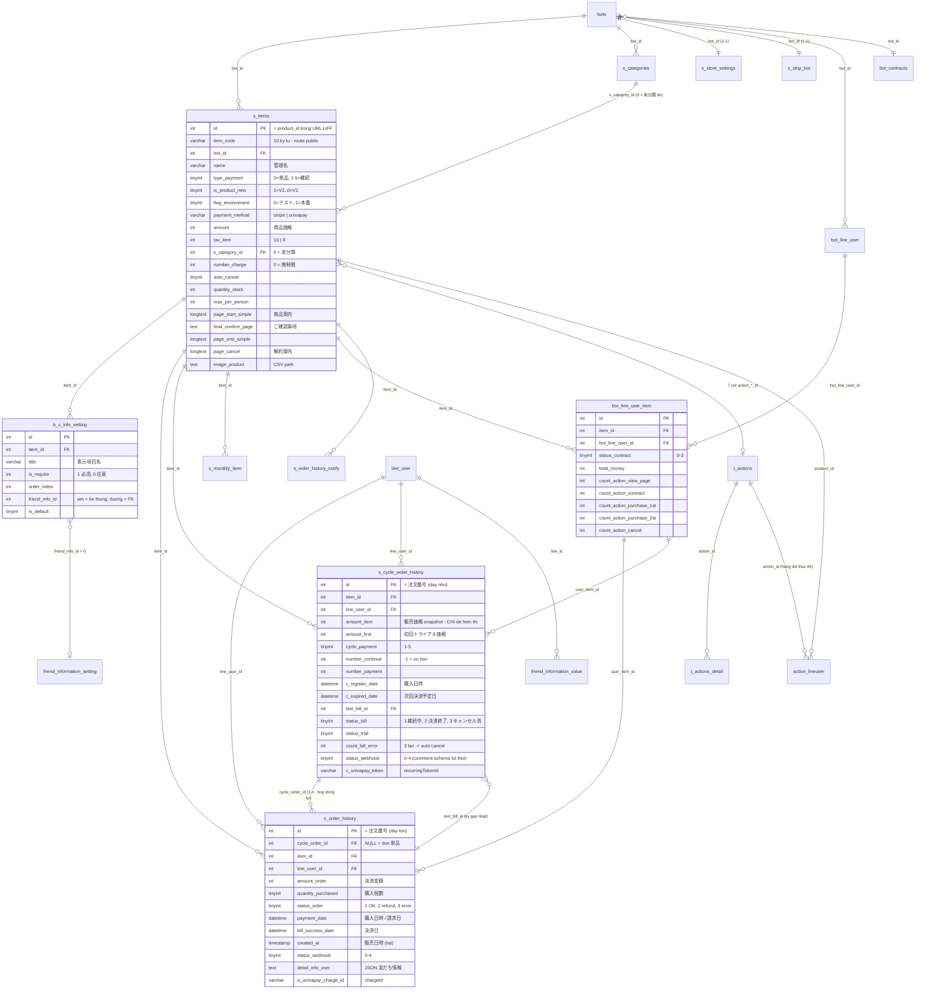

# FA-026 — 「商品販売」/「単品商品」・「継続商品」 (Bán hàng / Bill Item)

> **Trạng thái**: HOÀN THÀNH pipeline 7 bước · **Ngày biên soạn**: 2026-08-03 · **Agent**: spec-compiler
> **Portal**: Admin (LINE OA) + Staff · **URL gốc**: `/basic/sales/index`
> **Nguồn**: UI thật trên `https://form.watermeru.com` (môi trường テスト, tài khoản `bichhao_test`) + source Laravel 5 `src/web/sns-line/` + Spring Boot `src/job/linect-service/` + DB dump `db/`
> **Tài liệu chi tiết**: [`ui/ui-spec.md`](ui/ui-spec.md) · [`web/api-spec.md`](web/api-spec.md) · [`web/logic-spec.md`](web/logic-spec.md) · [`job/job-spec.md`](job/job-spec.md) · [`db/db-mapping.md`](db/db-mapping.md) · [`_internal/validation-report.md`](_internal/validation-report.md)

> ⚠ **Các bản đính chính đã áp dụng trong tài liệu này** (kết quả bước 6 — spec-validator). Nếu bạn đọc bản cũ của các spec con, hãy ưu tiên nội dung dưới đây:
> 1. **Giá kỳ định kỳ** = `s_items.amount` **HIỆN TẠI** × `quantity_purchased`. `s_cycle_order_history.amount_item` chỉ là **snapshot để hiển thị**, không tham gia tính tiền.
> 2. `job_config_daily.last_id_monitor_payment_history` / `last_id_monitor_s_order_history` là **dead columns** — **không có** task Spring Boot nào theo dõi `s_order_history`.
> 3. Tên bảng đúng: **`t_actions_detail`** (không phải `t_action_detail`), **`action_lineuser`** (không phải `action_line_users`).
> 4. `s_cycle_order_history.status_webhook` thực tế nhận **0…4** (comment schema ghi 0/1/2 đã lỗi thời).
> 5. 「支払いサイクル」: `1`=毎週, `2`=毎月, `3`=3ヶ月毎, `4`=6ヶ月毎, `5`=毎年. `payment_method` là **chuỗi** `'stripe'`/`'univapay'`.
> 6. Bộ lọc "bot hết hạn hợp đồng LME" **đã comment out ở J2 (UnivaPay)** nhưng **vẫn chạy ở J1 (Stripe)**.

---

## 1. Tổng quan

### 1.1 Mục đích

「商品販売」 là module **thương mại điện tử tích hợp trong LINE Official Account**. Admin tạo sản phẩm trong portal LME; hệ thống sinh ra một **chuỗi trang public chạy trong LIFF** để bạn bè LINE (LINE User) xem sản phẩm → nhập thông tin cá nhân → nhập thẻ tín dụng → xác nhận → hoàn tất thanh toán. Toàn bộ giao dịch đi qua cổng thanh toán bên thứ ba (**UnivaPay** hoặc **Stripe Connect**).

Điểm mạnh đặc thù: mỗi mốc trong vòng đời mua hàng (xem trang, hoàn tất, thanh toán kỳ đầu, kỳ tiếp, lỗi thanh toán, huỷ, sắp hết trial) đều có thể **kích hoạt エルメアクション** — gắn tag, gửi tin nhắn, chuyển bước kịch bản… Đây là điểm tích hợp mạnh nhất giữa bán hàng và automation của LME.

### 1.2 Actors

| Actor | Phạm vi | Cơ chế xác thực | Ghi chú |
|-------|---------|-----------------|---------|
| **Admin (LINE OA)** | Toàn bộ 3 tab: 商品一覧 / 販売履歴 / 各種設定. Tạo–sửa–xoá–sao chép sản phẩm, hoàn tiền, huỷ hợp đồng, cấu hình 特商法, liên kết cổng thanh toán | Middleware `basic_access` + `is_expire` + `check_remember_token` | Actor chính |
| **Staff** | **Cùng giao diện Admin**, bị chặn theo **whitelist route** (`BasicAccess.php:38-51`, `getRouterBotInvite()`). Route ngoài whitelist → redirect kèm lỗi 「この権限は許可されていません。」 | Như Admin + `session('is_bot_invite')` | ⚠ Quyền là **all-or-nothing theo route** — không có phân quyền chi tiết xem/sửa/xoá. Truy cập được ghi log vào `user_access_bot` 1 lượt/ngày. Danh sách route cụ thể trong whitelist **chưa xác minh** (tin cậy Trung bình) |
| **LINE User** | 4–5 trang public qua LIFF + trang 「特定商取引法に基づく表記」 | ❌ **Không có middleware auth** trên prefix `/v2` — định danh qua `u_code` (`bot_line_user`) truyền trong URL | Xem §2.4 |
| **Cổng thanh toán** | UnivaPay (iframe tokenization + webhook `charge_finished`), Stripe (Connect + PaymentIntent) | API key theo `flag_environment` | Bên thứ ba |

### 1.3 Phạm vi

**Thuộc FA-026**: quản trị sản phẩm, wizard 4–5 trang public, 7 slot エルメアクション, lịch sử bán hàng, hoàn tiền/huỷ, xuất CSV, cài đặt 特商法 cấp bot, liên kết Stripe/UnivaPay, toàn bộ luồng mua hàng public, thanh toán định kỳ tự động, webhook.

**KHÔNG thuộc FA-026**:
- Hợp đồng LME của chính bot (gói dịch vụ SaaS) → **FA-031**. Các bảng `payment_histories`, `request_paypal_item`, `bot_contracts` (phần thanh toán), cron `job:check_auto_payment_univapay` đều thuộc FA-031.
- Nội dung cấu hình chi tiết của エルメアクション → **SC-004** (`features/shared/action-settings/shared-spec.md`).
- Màn hình 「決済システム連携設定」 độc lập tại `/basic/list-items` → **FA-034** (nhưng endpoint `linkPayment` được dùng chung, xem EP-30).

### 1.4 Phân biệt 単品商品 vs 継続商品

Cả hai **dùng chung bảng `s_items`**, phân biệt bằng cột `type_payment`.

| Tiêu chí | 単品商品 (bán 1 lần) | 継続商品 (đăng ký định kỳ) |
|---------|---------------------|---------------------------|
| `s_items.type_payment` | `0` (once) | `1`…`5` (weekly / monthly / 3month / 6month / yearly) |
| Bảng lưu đơn | `s_order_history` với **`cycle_order_id IS NULL`** | `s_cycle_order_history` (hợp đồng) + N bản ghi `s_order_history` (mỗi kỳ 1 bản ghi, `cycle_order_id` = id hợp đồng) |
| 注文番号 | id của `s_order_history` (dãy lớn, ~3.400) | id của `s_cycle_order_history` (dãy nhỏ, ~770) — **2 dãy đánh số riêng biệt** |
| Số trang public | **4** (商品/友だち情報/最終確認/申込完了後) | **5** (thêm 解約用ページ) + trang **カード情報変更** |
| Số URL phân phối | 1 (`type=product-detail`) | 3 (`product-detail` / `product-change` / `product-cancel`) |
| Cấu hình riêng | 「商品価格」, 「購入個数」 | 「① 請求価格」×「② 請求回数」, 「支払いサイクル」, 「請求エラー(自動解約)」, 「トライアル設定」 |
| Số slot エルメアクション | **2** (SCR-BIL-12) | **7** (SCR-BIL-13) |
| Cột bảng danh sách riêng | 「価格」・「販売数」・「在庫数」 | thêm 「トライアル中」; cột URL thay bằng nút 「ページURL」 |
| Thao tác hàng loạt | 「一括返金実行」 | 「一括解約実行」 |
| Folder | `s_categories.type_payment = 0` | `s_categories.type_payment = 2` — **tách biệt hoàn toàn** |
| Job xử lý nền | Không (thanh toán 1 lần đồng bộ) | ★ **J1 (Stripe) / J2 (UnivaPay)** chạy 07:00 hằng ngày |

> ⚠ **`typePayment` trong URL ≠ cột `s_items.type_payment`**. Query param `typePayment` chỉ là **cờ chọn tab**: `0` → tab 単品, **khác 0** (cả `1` từ link chi tiết lẫn `2` từ nút 新規作成) → tab 継続. Controller chỉ kiểm tra `== 0` hay `!= 0` (`index():130-138`). Tin cậy **Cao**.

### 1.5 V2 hiện hành vs V1 legacy

Hệ thống có **4 thế hệ code chạy song song**, phân biệt bằng `s_items.is_product_new`.

| Nhóm | Controller | Nhận diện | Trạng thái |
|------|-----------|-----------|-----------|
| **V2 Admin (hiện hành)** | `Basic\SalesManagementV2Controller` (6.979 dòng) | `is_product_new = 1` | ★ Đang dùng — **toàn bộ 25 màn hình của spec này** |
| **V1 Admin (legacy)** | `Basic\SalesManagementController` (2.089 dòng) | `is_product_new = 0` | Còn route (`/basic/list-items-old`), phần lớn không dùng |
| **Public LINE User** | V2 `/v2/order-item/*` · V1 `/order-item/*` | — | V1 **đã vô hiệu hoá** (3/4 route `redirect()->route('404')` ngay dòng đầu) |
| **Thanh toán / Webhook / API mobile** | `SalesStripePaymentController`, `WebhookUnivapayControler`, `Api\SalesController` | — | Đang dùng |

Khác biệt then chốt giữa 2 thế hệ:

| Khía cạnh | V2 | V1 |
|----------|----|----|
| Validation server | ❌ **Không có** — toàn bộ ràng buộc ở client JS | ✅ Có `Validator::make` trong `validateItem()` |
| Giá tối thiểu | 100円 (chỉ client) | 50円 (server) |
| Tồn kho / 購入上限 / 消費税 | ✅ Có | ❌ Không có |
| Ẩn sản phẩm (`status_valid`) | ❌ Không có UI — `saveItem` **luôn** ghi `1` | ✅ Có nút bật/tắt (`changeValidItem`) |
| Cập nhật `s_monthly_item` khi refund/huỷ | ❌ **Đã comment out** | ✅ Còn |
| Danh sách hiển thị | Luôn lọc `is_product_new = 1` — **không bao giờ lẫn dữ liệu V1** | Luôn lọc `= 0` |

### 1.6 Môi trường 本番 / テスト

Mỗi sản phẩm thuộc **một trong hai môi trường**, quyết định bằng `s_items.flag_environment` (`0` = テスト, `1` = 本番). Đây là thuộc tính cấp sản phẩm, ảnh hưởng:

- Khoá API dùng: `strip_secret_test_key` vs `strip_secret_live_key`; `univapay_app_test_id` vs `univapay_app_id`
- TaxRate Stripe: `tax_rate_id_test_percent_*` vs `tax_rate_id_percent_*`
- Bộ counter thống kê **tách đôi**: `number_trial` vs `number_trial_test`, `sum_sales` vs `sum_sales_test`…
- Mọi truy vấn danh sách sản phẩm / lịch sử đều lọc theo cột này
- Tin nhắn LINE ở môi trường test có prefix 「【ご注意】これはテスト決済なので実際には課金されません」
- **API mobile chỉ trả dữ liệu 本番** (`Api/SalesController.php:27,30`)

---

## 2. Màn hình & Luồng xử lý end-to-end

**25 màn hình** SCR-BIL-01…SCR-BIL-25, chia 5 nhóm chức năng.

### 2.0 Sơ đồ điều hướng

```
Sidebar「その他の機能」→「商品販売」 (/basic/sales/index)
│
├── (a) Tab「商品一覧」(?tab=list-item)
│   ├── Sub-tab「単品商品」 (#buy-one) ............. SCR-BIL-01
│   ├── Sub-tab「継続商品」 (#cyclical-buying) ..... SCR-BIL-02
│   ├── Menu ••• mỗi dòng (コピー/削除) ............ SCR-BIL-03
│   ├── Modal「商品名 詳細」(3 URL, 継続) .......... SCR-BIL-04
│   ├── Form 新規作成 / 商品編集
│   │   ├── Tab「基本設定」単品 ................... SCR-BIL-05
│   │   ├── Tab「基本設定」継続 ................... SCR-BIL-06
│   │   ├── Tab「各種ページ」wizard 4–5 bước ...... SCR-BIL-07…11
│   │   └── Tab「アクション設定」2 / 7 slot ........ SCR-BIL-12 / 13
│   └── 商品詳細 (chỉ đọc) ........................ SCR-BIL-14
│
├── (b) Tab「販売履歴」
│   ├── Sub-tab「単品商品」 ....................... SCR-BIL-15
│   ├── Sub-tab「継続商品」 ....................... SCR-BIL-16
│   ├── Modal「絞り込み」 ......................... SCR-BIL-17
│   ├── 注文詳細 単品 + 返金する .................. SCR-BIL-18
│   └── 注文詳細 継続 + 決済履歴 .................. SCR-BIL-19
│
├── (c) Tab「各種設定」(?tab=setting)
│   ├── 「事業者・特商法設定」 (#tab-2) ............ SCR-BIL-20
│   └── 「最終確認画面」 (#tab-3) ................. SCR-BIL-21
│
└── (d) Trang public LINE User — /v2/order-item/*
    ├── 商品ページ ................................ SCR-BIL-22
    ├── お客様情報 ................................ SCR-BIL-23
    ├── 購入する商品 + カード情報入力 .............. SCR-BIL-24
    ├── 最終確認ページ ............................ (chưa chụp — EP-67)
    ├── 申込完了後 ................................ (chưa chụp — flag_page_end)
    └── 特定商取引法に基づく表記 ................... SCR-BIL-25
```

---

### 2.1 (a) Quản trị sản phẩm

#### SCR-BIL-01 / SCR-BIL-02 — Danh sách sản phẩm 「商品一覧」

📸 `01-list-main.png`, `14-list-item-tab.png`, `17-list-item-test-env.png`, `31-list-cyclical-test.png`

**Bố cục**: tab bar xanh (商品一覧/販売履歴/各種設定) → sub-tab (単品商品/継続商品) + Environment Toggle 「本番環境」/「テスト環境」 + dropdown 「表示設定」 (lọc cổng thanh toán) → 2 cột: panel folder trái · toolbar + bảng phải.

| Bước | Thao tác người dùng | UI | Endpoint | Business logic | DB | Kết quả |
|-----|--------------------|----|---------|----------------|----|---------|
| 1 | Mở `/basic/sales/index` | Trang HTML | **EP-01** | `SalesManagementV2Controller@index:93` — khôi phục folder từ cookie `folder_sales`; nếu folder đã bị xoá → reset `0`; nạp `maxItemBillOne`/`maxItemBillCycle` theo gói | Đọc `s_items`, `s_categories`, `s_strip_bot`, `bot_contracts`, `bots` | Render view `basic.sales.v2.index`; ghi lại cookie TTL 14400 phút |
| 2 | Đổi sub-tab / toggle môi trường / chọn folder | AJAX | **EP-24** (`action` rỗng) | `@ajaxGetListGroupProducts:315` — `SCategory::getListCategoryProducts()` lọc `type_payment` (0 hoặc 2); `getListItemOfCategory()` LEFT JOIN đếm 販売数 | `s_categories`, `s_items`, `s_order_history`/`s_cycle_order_history` (SUM) | JSON `{groups, items, group_open, count_default}` → Vue render lại bảng |
| 3 | Chọn folder | — | **EP-07** | `Basic\BasicController@folderSetCookie` | ❌ **Ghi cookie, không ghi DB** | Ghi nhớ folder đang mở |
| 4 | 「新規フォルダ」 / đổi tên | Popup | **EP-24** `action=addAndEditGroup` | Có `id` → rename; không → create với `position = max+1`, `type_payment` = 0/2 | INSERT/UPDATE `s_categories` | Panel folder cập nhật |
| 5 | 「並べ替え」 sản phẩm | Modal (chưa chụp) | **EP-24** `action=sortItem` | Gán `position` theo mảng **đảo ngược** (`array_reverse`) — khớp `ORDER BY position DESC` | UPDATE `s_items.position` | Thứ tự mới |
| 6 | 「一括フォルダ変更」 | Modal (chưa chụp) | **EP-24** `action=moveItem` | ⚠ Mọi item được đẩy lên `max(position)+1` **cùng một giá trị** → thứ tự trong folder đích không xác định | UPDATE `s_items.s_category_id`, `position` | — |
| 7 | Copy URL LIFF (📋) | Clipboard | — | URL sinh runtime `https://liff.line.me/{bots.liff_id}?product_id={s_items.id}&type=product-detail&ts={timestamp}` | — | `ts` là cache-buster, đổi mỗi lần load |
| 8 | Preview (👁) | Tab mới | **EP-60** | `@orderDetail` với `u_code = 'preview'` | — | Trang public chế độ preview |

**Điểm cần biết**
- Folder 「未分類」 **không có bản ghi DB** — là folder ảo `id = 0`, tương ứng `s_items.s_category_id = 0`.
- Số `(N)` trong tên folder thay đổi theo toggle môi trường (COUNT có lọc `flag_environment` + `is_product_new = 1` + `type_payment`).
- ⚠ Với tab 継続, folder `0` **còn gộp thêm** các item nằm trong folder loại `type_payment = 0` (`getListItemOfCategory():68-70`) → giải thích vì sao panel folder tab 継続 chỉ hiện 「未分類」.
- 「販売数」 là `SUM(quantity_purchased)` runtime, **không lọc `status_order`** → đơn đã hoàn tiền vẫn được tính.
- Bảng 本番 rỗng với tài khoản quan sát; dữ liệu mẫu chỉ có ở テスト.

#### SCR-BIL-03 — Menu thao tác dòng 「•••」

📸 `19-row-action-menu.png` · Chỉ 2 mục: 「コピー」, 「削除」 (không có 「編集」 — sửa đi qua trang chi tiết).

| Thao tác | Endpoint | Logic | DB |
|---------|---------|-------|----|
| 「コピー」 | **EP-19** `/ajax/sales/copy-item/{id}` | `@ajaxCopyItem:1408` — kiểm tra giới hạn gói → `replicate()` + sinh `item_code` mới → **clone toàn bộ 7 action** (`t_actions` + `t_actions_detail`) → reset counter về 0 → clone `b_c_info_setting` → **copy file ảnh vật lý** | INSERT `s_items`, `t_actions`, `t_actions_detail`, `b_c_info_setting` |
| 「削除」 | **EP-24** `action=deleteItem` | ★ **HARD DELETE** — `s_items` không có `deleted_at`, model không dùng `SoftDeletes`. Event `deleting` **xoá cứng** `b_c_info_setting` theo `item_id`; event `deleted` **xoá file ảnh vật lý** | DELETE `s_items` + `b_c_info_setting` |

> ⚠ **Hệ quả xoá**: `s_order_history` / `s_cycle_order_history` **chỉ được ghi log, không xoá** → trở thành bản ghi **mồ côi** (`item_id` trỏ vào sản phẩm không còn tồn tại). Xoá cả folder (`action=deleteGroup`) sẽ xoá **toàn bộ sản phẩm bên trong**.

#### SCR-BIL-04 — Modal 「商品名 詳細」 (chỉ 継続商品)

📸 `32-cyclical-page-url-modal.png` · Hiển thị 3 URL public (`type=product-detail` / `product-change` / `product-cancel` trên cùng `product_id`) + 7 thuộc tính chỉ đọc (通常販売価格 / トライアル期間・価格 / 支払いサイクル / 請求終了回数 / 販売上限数 / 1人が購入できる上限数 / 本番・テスト). Toàn bộ đọc từ `s_items`, không có endpoint riêng.

#### SCR-BIL-05 / SCR-BIL-06 — Form 「基本設定」

📸 `04-add-item-single.png`, `21-edit-item-form.png`, `10-add-item-cyclical.png`

| Bước | Thao tác | Endpoint | Logic | DB |
|-----|---------|---------|-------|----|
| 1 | Mở form (`?tab=add-item` / `edit-item`) | **EP-01** → **EP-10** | `@index` (giải mã `itemId` hashid, sai → 404) → `@initData:633` nạp `friend_information_setting`, `s_store_settings`, `detailActionItemV2` (7 slot), `listFriendInfo` (rỗng → trả 2 mục mặc định 「お名前」/「メールアドレス」) | Đọc `s_items`, `t_actions_detail`, `b_c_info_setting`, `s_store_settings` |
| 2 | (Khi sửa) nạp chi tiết | **EP-13** | `@ajaxGetItemDetail:292` — lọc `bot_id` ✔ | Đọc `s_items` |
| 3 | Bấm 「保存」 | **EP-12** ★ | `@saveItem:849` — whitelist 40 field; kiểm tra folder thuộc bot; **chỉ khi `type_payment != 0`** nạp thêm 22 field 継続; luôn ghi `is_product_new = 1`, `status_valid = 1`; tạo mới → kiểm tra giới hạn gói + `position = max+1`; **đổi `name` → đồng bộ ngược `name_item`** sang toàn bộ `s_order_history` + `s_cycle_order_history`; đồng bộ `b_c_info_setting` (mục thiếu trong payload **bị xoá cứng**) | INSERT/UPDATE `s_items`; UPDATE `s_order_history.name_item`, `s_cycle_order_history.name_item`; INSERT/UPDATE/DELETE `b_c_info_setting` |

> ⚠ **`saveItem` KHÔNG có transaction** (`DB::beginTransaction` đã comment tại `:1038`) và **KHÔNG có validation server** — xem BR-15.
> ⚠ 「利用する決済システム」 bị `disabled` sau lần lưu đầu tiên — nhưng **chỉ ở client** (`paymentMethodOld` trong `add-single-item.js:488,546`). Server vẫn nhận và ghi `payment_method` khi update.

#### SCR-BIL-07…11 — Tab 「各種ページ」 (wizard 4–5 bước)

📸 `05-add-item-pages.png`, `06-page2-friend-info.png`, `07-page3-final-confirm.png`, `08-page4-after-complete.png`, `11-cyclical-pages.png`, `12-cyclical-page5-cancel.png`

★ **Toàn bộ cấu hình 4–5 trang nằm trên chính `s_items` dưới dạng cột riêng** — không phải bảng con, không phải JSON. Ngoại lệ duy nhất: bảng field 「友だち情報入力」 → `b_c_info_setting`.

| Bước wizard | Nội dung | Cột nhãn nút | Cột màu nền | Cột màu chữ |
|------------|---------|-------------|------------|------------|
| 1.商品ページ | `page_start_simple` (TinyMCE) + `image_product` (CSV path, ≤5 ảnh) + `flag_show_stock` + `flag_show_max_per_person` | `text_button_start` | `color_button_start` | `color_text_button_start` |
| 2.友だち情報入力 | → bảng `b_c_info_setting` | `text_button_friend_info` | `bg_button_friend_info` | `color_button_friend_info` |
| 3.最終確認ページ | `final_confirm_page` (TinyMCE) | ★ `text_payment_button` | `bg_payment_button` | `color_payment_button` |
| 4.申込完了後ページ | `page_end_simple` + `url_page_outsite_end` + `flag_page_end` | ★ `text_confirm_button` | `bg_confirm_button` | `color_confirm_button` |
| 5.解約用ページ (継続) | `page_cancel` (TinyMCE) | `text_button_cancel` (max **10** ký tự) | `color_button_cancel` | `color_text_button_cancel` |

> ⚠ **Tên cột lệch 2 bước so với nhãn wizard** (`steps/step-3.blade.php:40`, `step-4.blade.php:12`): mỗi bước cấu hình **nút của trang TRƯỚC** trong luồng mua hàng.
> - Bước 3「最終確認ページ」 → nút 「最終確認にすすむ」 nằm trên trang **カード情報入力 (SCR-BIL-24)** → cột `text_payment_button`
> - Bước 4「申込完了後ページ」 → nút 「購入する」 nằm trên trang **最終確認** → cột `text_confirm_button`
> - Bước 1/2/5 khớp đúng.

Upload ảnh (**EP-23** `/ajax/upload-file` → `@uploadFile:569`): lưu vào `public_path(FOLDER_MEDIA + media/images/{admin_id}/{bot_id}/bill-item)`, tạo thư mục `0777`, resize về tối đa **2048px**, bỏ qua `image/svg+xml`. ⚠ **Không validate MIME/kích thước trước khi `move()`**. Trả về **chuỗi đường dẫn thuần**, không phải JSON.

Bước 2 (SCR-BIL-08): 2 field 「お名前」・「メールアドレス」 **không thể xoá và luôn bắt buộc** (`is_default = 1`) vì phải gửi sang cổng thanh toán. Cột 「紐つけ友だち情報」 (`friend_info_id`) ánh xạ: `0` 利用しない · `-1` システム表示名 · `-2` 携帯電話 · `-3` メールアドレス · `-6` 都道府県 · `>0` → FK `friend_information_setting.id` (FA-015).

Bước 3 (SCR-BIL-09): nút 「テンプレートを引用」 nạp `s_store_settings.general_settings` vào editor (chưa ghi DB). Khối cảnh báo pháp lý 改正特定商取引法 (hiệu lực 2022-06-01) yêu cầu hiển thị 6 mục ①…⑥ ở màn xác nhận cuối, trong đó ①②自動表示, ③〜⑥ Admin tự nhập.

Bước 4 (SCR-BIL-10): 3 lựa chọn loại trừ → `flag_page_end`: `0` テキスト入力 (render `page_end_simple`) · `1` 任意ページURL (redirect `url_page_outsite_end`) · `2` トーク画面に戻る (mặc định UI, redirect `bots.url_add_friend`).

#### SCR-BIL-12 / SCR-BIL-13 — Tab 「アクション設定」 (**SC-004**)

📸 `09-tab-action-setting.png`, `13-cyclical-action-setting.png`

| Nhóm | Slot 「エルメアクション」 | Cột `action_*_id` | Cột 「稼働回数」 | Cột phụ | 単品 | 継続 |
|------|------------------------|------------------|----------------|--------|:---:|:---:|
| 通常時 | 「商品ページ表示時」 | `action_show_page_id` | `number_action_show_page` | — | ✔ | ✔ |
| 通常時 | 「申込完了時」 | `action_contract_id` | `number_action_contract` | — | ✔ | ✔ |
| 通常時 | 「トライアル」 | `action_contract_trial_id` | `number_action_contract_trial` | `number_day_action_contract_trial` (「終了の N 日前」) | — | ✔ |
| 決済時 | 「初回決済時」 | `action_purchase_1st_id` | `number_action_purchase_1st` | — | — | ✔ |
| 決済時 | 「2回目以降決済時」 | `action_purchase_2st_id` | `number_action_purchase_2st` | `auto_action_purchase_2st` (⚠ UI comment out) | — | ✔ |
| エラー・解約時 | 「決済エラー発生時」 | `action_buy_error_id` | `number_action_buy_error` | — | — | ✔ |
| エラー・解約時 | 「解約時」 | `action_cancel_payment_id` | `number_action_cancel_payment` | — | — | ✔ |

Mỗi slot có radio 「稼働回数」: **`1` = 1度のみアクション稼働** (mặc định) / **`0` = 何度でもアクション稼働**, đối chiếu bộ đếm `bot_line_user_item.count_action_*`. Button 「設定」 (nền vàng) mở trình cấu hình action **SC-004** (ghi vào `t_actions` + `t_actions_detail`).

#### SCR-BIL-14 — 商品詳細 (chỉ đọc)

📸 `20-edit-item-detail.png` · **EP-02** (`@getItemDetail:259` — nhận hashid, lọc `bot_id` ✔) + **EP-22** (`@ajaxGetSalesHistory:491` — lịch sử theo **tháng**, params `month` dạng `YYYY/MM`, phân trang 20, lọc thêm `flag_environment` của chính item).

⚠ Khác biệt: bảng 販売履歴 ở đây lọc theo **tháng**; tab 販売履歴 chính lọc theo **khoảng ngày**. Với 単品 cột 「販売日時」 dùng `payment_date`, trong khi danh sách chính dùng `created_at`.

---

### 2.2 (b) Lịch sử bán hàng

#### SCR-BIL-15 / SCR-BIL-16 — 「販売履歴」

📸 `15-sales-history-menu.png`, `22-sales-history.png`, `23-sales-history-test-env.png`, `25-history-cyclical.png`

| Bước | Thao tác | Endpoint | Logic (`@ajaxListOrderHistory:1209`) | DB |
|-----|---------|---------|-------------------------------------|-----|
| 1 | Mở tab / đổi bộ lọc | **EP-14** | **2 nhánh truy vấn hoàn toàn khác nhau** theo `type_payment`. Phân trang 20/trang. Luôn lọc `s_items.is_product_new = 1` | — |
| | — 単品 | | `s_order_history` **+ `cycle_order_id IS NULL`** (loại các kỳ của hợp đồng); khoảng ngày lọc theo **`payment_date`** dù cột hiển thị là `created_at` | `s_order_history` ⨝ `line_user` ⨝ `s_items` |
| | — 継続 | | `s_cycle_order_history` LEFT JOIN `s_order_history` qua `last_bill_id`; khoảng ngày dùng điều kiện **OR** giữa `last_bill_time` và `c_register_date`; bộ lọc trạng thái dựng bằng `whereRaw` (4 nhánh) | `s_cycle_order_history` ⨝ `s_order_history` ⨝ `line_user` ⨝ `s_items` |
| 2 | Mở modal 「絞り込み設定」 | **EP-15** | `@ajaxGetInitDataTabSetting:1381` — nạp folder + sản phẩm. ⚠ `ORDER BY position ASC`, **KHÔNG lọc `type_payment`** → thứ tự folder khác panel sidebar (`ORDER BY position DESC, id DESC`, có lọc) | `s_categories`, `s_items` |
| 3 | 「CSV書出し」 | **EP-08** / **EP-09** | Gọi lại `ajaxListOrderHistory($request, true)` lấy Collection → lọc theo `list_order_id_selected` nếu có → `Excel::download()` **đồng bộ** (không queue, không ghi `csv_management`) | Đọc | 
| 4 | Tick đơn → 「一括返金実行」 | **EP-17** | `@cancelOrderMultiple:3519` — vòng lặp gọi `cancelOrderItemV2`; **luôn trả `{"success": true}`** dù từng đơn lỗi | Xem SCR-BIL-18 |
| 5 | Tick đơn → 「一括解約実行」 | **EP-18** | `@cancelCycleOrderMultiple:3533` — chỉ xử lý bản ghi `status_bill == 1 && cycle_payment != 0`; exception mỗi phần tử chỉ ghi log | Xem §2.5 |

Bộ lọc tìm kiếm khớp **4 trường** LIKE: `line_user.name`, `line_user.view_name`, `s_items.name`, id đơn. Khoảng ngày mặc định = **30 ngày gần nhất**.

**Badge 「決済ステータス」 là hyperlink ra dashboard cổng thanh toán**:
- 単品 → `https://merchant.univapay.com/dashboard/transactions/store/{s_strip_bot.univapay_app_id}/charge/{s_order_history.o_univapay_charge_id}`
- 継続 → `https://merchant.univapay.com/dashboard/stores/{...}/recurring-tokens/{s_cycle_order_history.c_univapay_token}/general`

#### SCR-BIL-17 — Modal 「絞り込み」

📸 `16-history-filter-modal.png` · 3 khối: 「商品選択」 (2 cột folder/sản phẩm) · 「決済システム」 (全て/UnivaPay/Stripe) · 「決済ステータス」 (全て/決済成功/返金済み) · nút 「決定」. Không có endpoint lưu — chỉ dựng params cho EP-14.

#### SCR-BIL-18 — 注文詳細 単品 + 「返金する」

📸 `24-order-history-detail.png` · **EP-05** (`@orderHistoryDetail:1095`)

```
Admin bấm 「返金する」 (nút đỏ)
  → EP-25 POST /ajax/cancel-order-v2   ⚠ KHÔNG có middleware auth (web.php:3849)
  → @cancelOrderV2:3192 → @cancelOrderItemV2:3405
      ├─ chỉ xử lý khi amount_order > 0
      ├─ Stripe: chọn secret key theo flag_environment;
      │          o_strip_charge_id bắt đầu bằng 'ch' → refundMoney()
      │          ngược lại → refundMoneyPaymentIntent()
      ├─ UnivaPay: refundMoney() → getRefundMoney() xác nhận
      ├─ autoRefund = 0 → CHỈ đổi trạng thái, KHÔNG gọi API hoàn tiền
      └─ Thành công → updateDataAfterRefund():3113
            ├─ bot_line_user_item.total_money  −= amount
            ├─ s_items.number_refund(_test) += 1 ; sum_sales(_test) −= amount
            ├─ nếu đơn KHÔNG thuộc hợp đồng định kỳ → number_cancel(_test) += 1
            └─ ⚠ TOÀN BỘ cập nhật s_monthly_item ĐÃ COMMENT OUT (:3120-3189)
  → UPDATE s_order_history: status_order = 2, cancel_date = now()
  → UI: badge đổi thành 「返金済み」
```

⚠ `@orderHistoryDetail` **không lọc `bot_id`** khi `find($orderId)` (`:1099`) → rủi ro IDOR (chỉ chặn gián tiếp qua `SItems::find()` sau đó). `@cycleOrderHistoryDetail` **có** lọc (`:1159`).

Khối 「友だち情報」 render từ **`detail_info_user` (JSON)** và được **sắp xếp lại theo `b_c_info_setting.order_index`** — không đọc từ `name_friend`/`email_friend` (2 cột này V2 không ghi do bug gán `=` thay `==`).

#### SCR-BIL-19 — 注文詳細 継続 + bảng 「決済履歴」

📸 `26-cycle-order-detail.png` · **EP-06** (`@cycleOrderHistoryDetail:1138`) — kèm `orderDetail` = danh sách `s_order_history WHERE cycle_order_id = {id}` chính là bảng 「決済履歴」.

| Cột bảng 決済履歴 | Nguồn |
|------------------|-------|
| 「決済回数」 | ★ **KHÔNG có cột DB** — chỉ là `index + 1` trong `v-for` của Vue. ⚠ Nếu 1 kỳ lỗi sinh nhiều bản ghi thì số này **không phản ánh** `number_payment` |
| 「請求日」 | `s_order_history.payment_date` |
| 「決済日」 | `s_order_history.bill_success_date` |
| 「注文番号」 | `s_order_history.id` — ★ **cùng bảng, cùng dãy số** với đơn 単品 |
| 「決済額(税込)」 | `s_order_history.amount_order` |
| 「ステータス」 | Computed từ `status_order` + `status_webhook` + `cycle.status_bill` |

★ **Giải đáp 「次回決済予定日」 hiển thị `2026.07.27 07:00`**: chuỗi 「07:00」 là **văn bản hard-code trong blade** (`cycle-history-detail.blade.php:146`), **không đọc từ DB**. Chỉ phần ngày lấy từ `c_expired_date`, với **nhánh fallback** `moment(trial_expired_time).add(1,'day')` khi `c_expired_date` rỗng. Xem §9 mục còn tồn về lý do ngày sớm hơn 購入日時.

---

### 2.3 (c) Cài đặt chung 「各種設定」

#### SCR-BIL-20 — 「事業者・特商法設定」 · SCR-BIL-21 — 「最終確認画面」

📸 `02-tab-setting.png`, `02-tab-setting-full.png`, `03-setting-final-confirm.png`

| Màn | Editor (TinyMCE **toolbar mở rộng**: thêm リンクの挿入・編集 + ソースコード) | Cột DB | Endpoint |
|-----|------------------------------------------------------------------|--------|---------|
| SCR-BIL-20 | 「特定商取引法に基づく表記」 | `s_store_settings.info_store` (longtext) | **EP-11** |
| SCR-BIL-21 | 「最終確認画面「ご確認事項」のテンプレート」 | `s_store_settings.general_settings` (text) | **EP-11** |

- Cài đặt ở **cấp bot** (1 bản ghi / bot), dùng chung cho mọi sản phẩm.
- ★ Các mục 事業者名 / 所在地 / 統括責任者 / 連絡先 / 料金 / 引き渡し時期 … **nằm bên trong chuỗi HTML `info_store`**, **không phải cột riêng** → không thể query từng mục.
- ★ **Không có bản ghi mặc định cấp hệ thống**. Nội dung phong phú quan sát trên trang public là **template mặc định do editor tự nạp khi tạo mới** (cấu trúc `<h2 id="toc1">事業者名</h2>`).
- ⚠ `@saveSettings:776` nhận **toàn bộ `$request->input()`** rồi `update()`/`create()` — model `$guarded = []` → **mass assignment không giới hạn** (rủi ro thực tế thấp vì bảng chỉ có 2 cột nội dung).

**Liên kết cổng thanh toán** (cùng tab 各種設定, không có SCR riêng trong bộ 25):

| Thao tác | Endpoint | Logic | DB |
|---------|---------|-------|-----|
| Liên kết UnivaPay | **EP-20** | `@iniSettingUnivapay:3713` — gọi `UnivapayPayment::getAccountInfo()`; thành công → lưu `univapay_app_id` **lấy từ response** (không lấy từ input) | Upsert `s_strip_bot` |
| Liên kết Stripe (OAuth) | **EP-26** / **EP-27** → **EP-30** → **EP-32** | `SalesManagementController@linkPayment:66` — `\Stripe\OAuth::token`; khi `status_strip_bot == 2` → **tạo 4 TaxRate** (test/live × 8%/10%) và lưu id vào `s_strip_bot`, rồi set `= 3`. Ràng buộc: `account_test_id` phải trùng `account_live_id` | `s_strip_bot` |
| Huỷ liên kết | **EP-21** | `@unlinkPaymentMethod:6867` — `Hash::check(password, Auth::user()->password)`; `type='stripe'` → xoá 6 cột Stripe; khác → xoá 4 cột UnivaPay. ⚠ **Không xoá nhóm khoá test UnivaPay** | `s_strip_bot`, đọc `users.password` |

---

### 2.4 (d) Luồng public — LINE User mua hàng

📸 `27-public-product-page.png`, `29-public-friend-info.png`, `30-public-payment-info.png`, `28-public-info-store.png`

⚠ **Toàn bộ prefix `/v2` KHÔNG có middleware xác thực** (`web.php:3735`). Định danh người mua dựa trên `u_code` (mã `bot_line_user`) truyền trong URL, lấy qua LIFF bằng **EP-88**.

#### Luồng chuẩn (happy path)

```
LINE User nhận tin nhắn có URL LIFF
  https://liff.line.me/{liff_id}?product_id={s_items.id}&type=product-detail&ts=…
        │
        ▼  EP-88 POST /ajax/get-ucode-by-line-user-id  (lineId → u_code, retry 15 lần)
        ▼
[SCR-BIL-22] EP-60  GET /v2/order-item/detail/{item_code}/{u_code}
   @orderDetail:1550
     ├─ item không tồn tại / status_valid != 1 → 「商品が非公開か、存在していません」
     ├─ CHẶN bot hết hạn: plan_type==1 && (expired_date+7d < now || bot_contract.status==3) → route('410')
     ├─ bot_line_user không tồn tại/bị block → redirect bots.url_add_friend
     ├─ CHẶN khi đang có đơn định kỳ chờ webhook (status_webhook ∈ {0,3,4})
     ├─ Tạo bot_line_user_item (status_contract = 0 unregister) nếu chưa có
     ├─ ★ Bắn エルメアクション「商品ページ表示時」 (khi action_show_page_id có + flag_page_start != 2)
     │     → INSERT action_lineuser (status=0, type_start_scenario 12001/13001)
     │     → count_action_view_page += 1
     ├─ Tính tồn kho còn lại:
     │     単品: quantity_stock − SUM(s_order_history.quantity_purchased WHERE status_order=1)
     │     継続: quantity_stock − SUM(s_cycle_order_history.quantity_purchased WHERE status_bill<>3)
     └─ Chọn public key Stripe theo flag_environment; OGP riêng cho crawler Facebook
        │  「お客様情報入力にすすむ」 (nhãn = text_button_start)
        ▼
[SCR-BIL-23] EP-65  GET /v2/order-item/enter-friend-info/{item_code}/{u_code}
   @viewEnterFriendInfo:1965
     └─ Nạp b_c_info_setting theo order_index; PREFILL từ hồ sơ bạn bè
          friend_info_id > 0 → friend_information_value.value (+ setting_actions)
          −1 view_name · −2 phone_number · −3 email · −6 province (+47 đô-đạo-phủ-huyện)
        │  「決済情報入力にすすむ」 (nhãn = text_button_friend_info)
        ▼
[SCR-BIL-24] EP-66  GET /v2/order-item/enter-payment-info/{item_code}/{u_code}
   @viewEnterPaymentInfo:2091
     └─ CHẶN khi chưa cấu hình cổng: thiếu bản ghi UnivaPay / thiếu public key Stripe /
        payment_method rỗng → 「決済できません。管理者に連絡してください。」
     └─ Form thẻ nằm trong IFRAME của UnivaPay (tokenization — dữ liệu thẻ KHÔNG đi qua server LME)
        │  EP-89 /ajax/univapay/sales/call-create-customer-id  (tạo customer_code = 'product'+20 ký tự)
        │  「最終確認にすすむ」 (nhãn = ★ text_payment_button, cấu hình ở bước 3 wizard)
        ▼
[最終確認ページ] EP-67 POST /v2/order-item/confirm-order/{item_code}/{u_code}
   @confirmOrder:2246
     └─ LƯU THÔNG TIN THẺ VÀO SESSION (không gửi kèm request thanh toán):
          session('univapaySalesV2') = {token, installment_count, customer_id, customer_code}
          session('stripeSalesV2')   = {card_id, token_id}
          session('stripeCustomerV2')= {last4, brandName, pm_id}
     └─ Hiển thị 「ご確認事項」 (final_confirm_page)
        │  「購入する」 (nhãn = ★ text_confirm_button, cấu hình ở bước 4 wizard)
        ▼
   ┌─────────────── THANH TOÁN ───────────────┐
   │  Stripe:   EP-80 → EP-81  (+ EP-83 khi confirm lỗi)                       │
   │  UnivaPay: EP-82 (toàn bộ luồng trong 1 request)                          │
   └───────────────────────────────────────────┘
        ▼
[申込完了後]  theo flag_page_end:
     0 → render HTML page_end_simple   1 → redirect url_page_outsite_end   2 → redirect chat LINE
        ▼
   ★ Bắn エルメアクション「申込完了時」 (+「初回決済時」/「2回目以降決済時」 với 継続)
        ▼
   Đơn xuất hiện ở SCR-BIL-15/16 với trạng thái 「決済成功」
```

#### Chi tiết 2 nhánh thanh toán

**Nhánh Stripe (2 bước)**

| Bước | Endpoint | Hành vi |
|-----|---------|--------|
| 1 | **EP-80** `/ajax/payment-intent` (`@paymentIntent:2408`) | Validate số lượng > 0 → **tính số tiền ở server** (BR-05) → tạo Stripe Customer + attach PaymentMethod → **tạo trước bản ghi order/cycle** (`CycleOrderHistory::createOrderPayment` với `status_webhook = 3 TIMEOUT`) → ⚠ **kiểm tra tồn kho SAU khi đã tạo bản ghi**, vượt thì xoá lại → `StripePayment::paymentIntents()`; nếu `amount == 0` (trial không có giá đầu) tạo **SetupIntent** thay vì PaymentIntent |
| 2 | **EP-81** `/ajax/payment-credit-card-item-v2` (`SalesStripePaymentController@paymentCreditCardItemV2:597`) | **Không charge lại** — chỉ ghi nhận kết quả (`$chargeSuccess = true` hard-code `:993`). Tạo/cập nhật `s_cycle_order_history` + `s_order_history` với `status_webhook = 1 PROCESSED` → `createDataInvoice()` phát hành hoá đơn **có thuế** → cập nhật hồ sơ bạn bè + `sync_elasticsearch` → affiliate → bắn action `contract` / `purchase_1st` / `purchase_2st`. ⚠ Kiểm tra tồn kho ở đây **đã comment out** (`:749-773`) |
| Lỗi | **EP-83** `/ajax/items/delete-order-confirm-fail` | `forceDelete()` bản ghi tạm |

**Nhánh UnivaPay (1 bước, bất đồng bộ)** — **EP-82** `@paymentCreditCardItemV2Univapay:4847`

```
Validate số lượng → ✔ KIỂM TRA TỒN KHO TRƯỚC khi tạo đơn (khác nhánh Stripe)
  → getInfoTokenSale() lấy thông tin thẻ
  → trialExpiredTime = now()+time_trial ngày, ép giờ 23:59:59
  → Đặt trước status_webhook theo isProcessWithWebhook($stripBot):
        true  (univapay_webhook_id có + s_strip_bot.status_webhook == 1) → 0 UNPROCESSED
        false                                                            → 3 TIMEOUT
  → charge với metadata.module = 'sales'
  ├─ CÓ webhook  → SalesService::checkStatusProcessCallback() : lặp tối đa 5 lần × sleep(1s)
  │                  chờ status_webhook ∈ {1,2}
  │                  hết 5 lần → status_webhook = 4 (TIMEOUT_WEBHOOK), trả result='pending'
  │                  → UI hiện màn hình chờ `wait-process.blade.php` → J4 dọn sau
  └─ KHÔNG webhook → polling getChargesSale() trực tiếp
  → Nếu xử lý > 2 phút → gửi tin LINE 「決済が完了しました。」/「決済に失敗しました。…」
  → Thành công: cập nhật hồ sơ bạn bè, sync_elasticsearch, affiliate, bắn 3 action
  → Exception → notifyChatwork() + HTTP 400
```

#### SCR-BIL-25 — 「特定商取引法に基づく表記」

📸 `28-public-info-store.png` · **EP-64** `/v2/order-item/info-store?hashBotId={Hashids(bot_id)}` → `@detailStoreInfo:545` đọc `s_store_settings.info_store` và render thẳng `{!! !!}`.

---

### 2.5 (e) Huỷ / hoàn tiền / đổi thẻ

#### Huỷ hợp đồng định kỳ 「解約」

| Nguồn kích hoạt | Endpoint | Logic |
|----------------|---------|-------|
| Admin — danh sách 「一括解約実行」 | **EP-18** | Vòng lặp `cancelCycleOrderItem` |
| Admin — 1 hợp đồng | **EP-16** | `@cancelCycleOrder:1047` |
| LINE User — trang 解約用ページ | **EP-62** (xem trang) → **EP-87** (thực hiện) | `user_cancel = 'customer'` → **luôn chạy** action 「解約時」 kể cả `flagExecuteAction = 0`, và tăng `count_action_cancel` |
| Tự động — cron | J1/J2 `cancelCycle()` | 3 lần lỗi liên tiếp + `auto_cancel = 1` (BR-07) |

```
cancelCycleOrderItem($orderId, $flagExecuteAction, $userCancel)   :3567
  ├─ ⛔ CHẶN khi status_webhook ∈ {0,3,4} → return false
  │     → UI: 「決済処理を行っていますので、操作できません。」
  ├─ UPDATE s_cycle_order_history: status_bill = 3, c_cancel_date = now()
  ├─ UPDATE s_items: number_cancel(_test) += 1
  │     nếu đang trial → number_trial(_test) −= 1
  ├─ ⚠ Cập nhật s_monthly_item ĐÃ COMMENT OUT (:3578-3617)
  ├─ sendActionOrderItem('cancel', …) → INSERT action_lineuser (mã 13007)
  ├─ UPDATE bot_line_user_item.status_contract = 3 (cancel)
  ├─ INSERT s_order_history_notify (status_order = −2)
  └─ MobileNotifyService::insertNotifyItem(PRODUCT_SALES_CYCLE_ADMIN_CANCEL = 9) → mobile_notify
```

⚠ **KHÔNG gọi API huỷ subscription bên cổng thanh toán** ở nhánh này. `UnivapayPayment::cancelSubcriptionSale()` chỉ được gọi từ 3 nơi phía web (`:4548`, `:6234`, `:6669`) trong nhánh auto-cancel — **không** trong `cancelCycle()` của 2 cron.

#### Trạng thái quyết định thông điệp trang 解約 / 変更 (`bot_line_user_item.status_contract`)

| Giá trị | Thông điệp |
|--------|-----------|
| `0` unregister | 「この商品は購入されていません。」 |
| `1` registered | Cho phép (nếu tìm được cycle `status_bill = 1`); nếu `cycle_payment == once && status_trial == 0` → 「試用期間が終了しました」 |
| `2` complete | 「既にキャンセルしました。」 |
| `3` cancel | 「キャンセル済です」 |

#### Đổi thẻ 「カード情報変更」 + retry bill quá hạn

```
LINE User mở URL type=product-change  (hoặc deep-link [CHANGE_{item_code}] trong tin báo lỗi)
  → EP-63 GET /v2/order-item/change/{item_code}/{u_code}   @orderChange:1820
       ├─ nạp flag_brand_card_univapay (CSV brand thẻ được phép, từ s_strip_bot)
       └─ ⚠ hard-code flagInstallment = 0 → tính năng trả góp ĐÃ TẮT ở trang đổi thẻ
  → Stripe:   EP-84 /ajax/update-payment-intent  →  EP-85 /ajax/change-card-item/v2
     UnivaPay: EP-86 /ajax/change-card-univapay/v2
       ├─ Điều kiện RETRY BILL: count_bill_error đã set  VÀ  c_expired_date < now()
       ├─ Chỉ đổi thẻ → update c_strip_*/c_univapay_* + payment_new = 1
       ├─ Bill lại THÀNH CÔNG → tạo s_order_history mới + createDataInvoice() (thuế)
       │     → last_bill_id, number_payment+1, number_continue−1, RESET count_bill_error = null
       └─ Bill lại THẤT BẠI  → count_bill_error += 1 → kiểm tra auto-cancel (BR-07)
  → (UnivaPay) kết quả về qua webhook metadata.module = 'sales_change_card'
       → SalesService::callbackChangeCard():809
```

---

## 3. Data Model

### 3.1 Bảng chính (7 primary)

| Bảng | Model | Vai trò | Cột |
|------|-------|---------|-----|
| `s_items` | `App\SItems` | ★ **Sản phẩm trung tâm** — 1 bảng chung cho 単品+継続, V1+V2. Chứa luôn toàn bộ cấu hình 4–5 trang public và 7 slot action | 90 |
| `s_order_history` | `App\OrderHistory` | ★ **Giao dịch thanh toán** — vừa là đơn 単品 (`cycle_order_id IS NULL`), vừa là kỳ thanh toán của hợp đồng | 45 |
| `s_cycle_order_history` | `App\CycleOrderHistory` | ★ **Hợp đồng đăng ký định kỳ** — 1 bản ghi = 1 lần friend đăng ký 継続商品 | 50 |
| `s_categories` | `App\SCategory` | Folder sản phẩm; `type_payment` `0`=単品 / `2`=継続 | 7 |
| `b_c_info_setting` | `App\BCInfoSetting` | Trường thu thập 「友だち情報入力」 (1-n với sản phẩm). **Dùng chung với tính năng đặt lịch** | 14 |
| `s_store_settings` | `App\SStoreSetting` | 特商法 + template ご確認事項, **1 bản ghi / bot** | 6 |
| `s_strip_bot` | `App\StripBot` | Khoá & cấu hình cổng thanh toán, **1 bản ghi / bot**, `timestamps = false` | 30 |

### 3.2 Bảng phụ trợ (17 secondary + 6 đề xuất bổ sung)

| Bảng | Vai trò với FA-026 |
|------|-------------------|
| `bot_line_user_item` | Trạng thái hợp đồng + **8 bộ đếm `count_action_*`** của cặp (friend × sản phẩm) → quyết định 稼働回数「1度のみ」 |
| `s_monthly_item` | Thống kê doanh số theo tháng (`bot_id+item_id+month+year`). ⚠ V2 không cập nhật khi refund/huỷ; **không hiển thị trên UI V2** |
| `s_order_history_notify` | Hàng đợi thông báo đơn hàng cho app mobile. `status_order` `-1` mua lần đầu thất bại / `-2` huỷ đơn |
| `t_actions` / **`t_actions_detail`** | Đích của 7 cột `action_*_id` → **SC-004** |
| **`action_lineuser`** | ★ Hàng đợi thực thi エルメアクション (cầu nối Laravel → Spring Boot) |
| `line_user`, `bot_line_user` | Tên/avatar người mua; giải mã `u_code`; kiểm tra block/kết bạn |
| `bots`, `bot_contracts` | `liff_id` (sinh URL), `url_add_friend`, `view_name` (tên file CSV), `plan_type` + `contract_type` (giới hạn số sản phẩm) |
| `friend_information_setting` / `friend_information_value` | Đích của `friend_info_id > 0` + giá trị prefill (FA-015) |
| `jobs` / `failed_jobs` | Queue driver `database`; job duy nhất `HandleWebhookUnivapay` |
| `sync_elasticsearch` | Connection riêng `mysql_step_message`; chỉ ghi khi `env('API_KEY_ES')` được set |
| `mobile_notify` | Push app; `type` = 8 (`bill_one`) / 9 (`bill_cycle`) |
| `aff_result` | Affiliate (`aff_result_id`) |
| `user_access_bot` | Log truy cập Staff |
| `users` | Đối chiếu mật khẩu khi huỷ liên kết cổng thanh toán |
| **Nên bổ sung** (validator T9) | `summary_message_send`, `notify_setting`, `conversation`, `backup_history`, `category`\*, `job_config_daily`\*\* |

\* `category` bị `renameGroup` update **nhầm** (bug). \*\* `job_config_daily` — xem dưới.

### 3.3 Bảng được xác nhận **KHÔNG** liên quan

| Bảng | Lý do |
|------|-------|
| `payment_histories` | Lịch sử thanh toán **hợp đồng LME của chính bot** (`bot_contract_id`) → **FA-031**. Không có cột `item_id` |
| `request_paypal_item` | Log webhook PayPal cho subscription hợp đồng LME → **FA-031** |
| `csv_management` | Export CSV của bill-item chạy **đồng bộ**, không qua bảng này |
| `action_schedules` | Thuộc tính năng アクション予約 riêng |
| `job_config_daily` | ★ 2 cột `last_id_monitor_payment_history` / `last_id_monitor_s_order_history` là **dead columns** — có ánh xạ trong `JobConfigDaily.java:13-18` nhưng getter/setter **không được gọi ở bất kỳ đâu**; `JobConfigDailyRepository` chỉ phục vụ `MonitorCalendarBookingTask`. **Không có task Spring Boot nào theo dõi `s_order_history`** |
| `t_actions_detail_recover` | Không liên quan |

### 3.4 ER Diagram



### 3.5 Ba định danh sản phẩm + hash đơn hàng

| Định danh | Ví dụ | Cột DB | Lưu DB? | Sinh ra ở đâu | Dùng ở đâu |
|----------|-------|--------|:-------:|--------------|-----------|
| **`product_id`** (số) | `861`, `872`, `879` | `s_items.id` | ✅ | MySQL AUTO_INCREMENT | URL LIFF công khai |
| **`hashId`** (12 ký tự) | `2EaJrg0jql1Y` | — | ❌ | `SItems::getHashIdAttribute()` → `Hashids::encode(id)`, `$appends` | Route **admin**: `/basic/sales/get-single-item-detail/{hashId}`, `?itemId=` |
| **`itemCode`** (10 ký tự) | `hmfP3WZZIE` | `s_items.item_code` | ✅ | `randomItemCodeRecursion()` = `str_random(10)` đệ quy tới khi unique | Route **public** `/v2/order-item/*/{item_code}/*`; denormalize sang `b_c_info_setting.item_code` |
| **`hashBotId`** | `Dl7r7e6lbJje` | — | ❌ | `Hashids::encode(bot_id)` | `/v2/order-item/info-store?hashBotId=`, URL webhook mặc định |
| Hash đơn 単品 / 継続 | `aNArJja0ryE2` / `KpxaWoG0WgGm` | — | ❌ | `Hashids::encode(order.id)` khi build response | Route chi tiết đơn |

---

## 4. Field Traceability Matrix

> Trích chọn **62 field trọng yếu**. Bảng đầy đủ **193/193 element (coverage 100%)** nằm ở [`db/db-mapping.md`](db/db-mapping.md) §4.
> **Hướng**: `ghi` = UI ghi xuống DB · `đọc` = UI chỉ hiển thị · `2 chiều` = vừa đọc vừa ghi (form edit).
> Cột **Validation** ghi rõ `(client)` khi ràng buộc **chỉ tồn tại ở JS** — server không kiểm tra.

| # | UI Element | Màn hình | DB Table.Column | Hướng | Validation | Business Rule |
|---|-----------|---------|-----------------|-------|-----------|---------------|
| 1 | 「商品名（管理用）」 | SCR-BIL-05/06 | `s_items.name` | 2 chiều | required, max 20 ký tự **(client)** | BR-02, BR-15; đổi giá trị → đồng bộ ngược `name_item` 2 bảng lịch sử |
| 2 | 「フォルダ」 | SCR-BIL-05/06 | `s_items.s_category_id` | 2 chiều | required; `!= 0` phải tồn tại + thuộc `bot_id` **(server)** | Lỗi → 「選択したフォルダーは、現在存在していません。」 |
| 3 | 「販売環境設定」 | SCR-BIL-05/06 | `s_items.flag_environment` | 2 chiều | — | BR-10 (`1`=本番 mặc định, `0`=テスト) |
| 4 | 「表示商品名」 | SCR-BIL-05/06 | `s_items.product_name` | 2 chiều | required, max 50 **(client)** | Hiển thị trên SCR-BIL-22 + placeholder `NAME` của action |
| 5 | 「説明」 | SCR-BIL-05/06 | `s_items.supplement_product` | 2 chiều | required, max 50 **(client)** | — |
| 6 | 「利用する決済システム」 | SCR-BIL-05/06 | `s_items.payment_method` | 2 chiều | required **(client)**; **chuỗi** `'stripe'`\|`'univapay'` | BR-03 — khoá immutable **chỉ ở client**, server vẫn cho đổi |
| 7 | 「商品価格」/「① 請求価格」 | SCR-BIL-05/06 | `s_items.amount` | 2 chiều | required, **min 100** **(client)** | BR-05 (V1 chỉ min 50 ở server) |
| 8 | 「② 請求回数」 | SCR-BIL-06 | `s_items.number_charge` | 2 chiều | select 0/2/3/4/5/6/9/12/18/24/36 | BR-06 — `0` = 無制限 → `number_continue = -1` |
| 9 | 「支払いサイクル」 | SCR-BIL-06 | `s_items.type_payment` | 2 chiều | select | ★ `1`=毎週 `2`=毎月 `3`=3ヶ月毎 `4`=6ヶ月毎 `5`=毎年 |
| 10 | 「請求エラー」自動解約 | SCR-BIL-06 | `s_items.auto_cancel` | 2 chiều | radio `1`/`0` | BR-07 — 3 lần lỗi liên tiếp |
| 11 | 「トライアル期間設定」 | SCR-BIL-06 | `s_items.flag_trial` + `time_trial` | 2 chiều | `time_trial` min 1 **(client)** | BR-09; `flag_trial != 1` → `time_trial` ép `NULL` |
| 12 | 「トライアル価格」 | SCR-BIL-06 | `s_items.flag_first` + `amount_first` | 2 chiều | `amount_first` min 100 khi `flag_first=1` **(client)** | BR-05, BR-09 |
| 13 | 「在庫数」 toggle + số | SCR-BIL-05/06 | `s_items.flag_use_stock` + `quantity_stock` | 2 chiều | min 0 **(client)** | BR-04 — enforce ở server (có race condition nhánh Stripe) |
| 14 | 「友だち1人当たりの購入上限」 | SCR-BIL-05/06 | `s_items.flag_use_max_per_person` + `max_per_person` | 2 chiều | min 1 **(client)** | ⚠ BR-04 — **KHÔNG enforce ở server**, có thể vượt bằng gọi API |
| 15 | 「消費税率」 | SCR-BIL-05/06 | `s_items.tax_item` | 2 chiều | radio 10/8, default 10 | BR-08 — 内税; ⚠ **UnivaPay không xử lý thuế** |
| 16 | 「商品画像」 (≤5) | SCR-BIL-07 | `s_items.image_product` | 2 chiều | ≤5 ảnh **(client)**; resize 2048px **(server)** | ★ CSV path trong 1 cột `text`; ảnh 1 = main; ⚠ không validate MIME trước `move()` |
| 17 | 「在庫数表示」 | SCR-BIL-07 | `s_items.flag_show_stock` | 2 chiều | toggle | Hiện/ẩn tồn kho trên SCR-BIL-22 |
| 18 | 「友だち1人当たりの購入制限表示」 | SCR-BIL-07 | `s_items.flag_show_max_per_person` | 2 chiều | toggle | — |
| 19 | 「商品案内」 (TinyMCE) | SCR-BIL-07 | `s_items.page_start_simple` | 2 chiều | — | **SC-005** toolbar rút gọn |
| 20 | 「ボタンテキスト」 bước 1 | SCR-BIL-07 | `s_items.text_button_start` | 2 chiều | max 15 **(client)** | Nhãn nút trên SCR-BIL-22 |
| 21 | 「背景色」/「文字色」 bước 1 | SCR-BIL-07 | `s_items.color_button_start` / `color_text_button_start` | 2 chiều | — | Color Picker (swatch tròn) |
| 22 | 「表示項目名」 | SCR-BIL-08 | `b_c_info_setting.title` | 2 chiều | max 30 **(client)** | Mục thiếu trong payload `saveItem` → **xoá cứng** |
| 23 | 「紐つけ友だち情報」 | SCR-BIL-08 | `b_c_info_setting.friend_info_id` | 2 chiều | — | `0`利用しない `-1`表示名 `-2`電話 `-3`メール `-6`都道府県 `>0`→FA-015 |
| 24 | 「必須 / 任意」 | SCR-BIL-08 | `b_c_info_setting.is_require` | 2 chiều | — | `1`/`0`; 「お名前」「メールアドレス」 luôn `1` |
| 25 | Thứ tự field | SCR-BIL-08 | `b_c_info_setting.order_index` | 2 chiều | — | Cũng dùng sắp xếp `detail_info_user` khi render SCR-BIL-18/19 |
| 26 | Mục hệ thống không xoá | SCR-BIL-08 | `b_c_info_setting.is_default` | ghi | — | `1` với 「お名前」/「メールアドレス」 — bắt buộc để gửi cổng thanh toán |
| 27 | 「表示テキスト」 bước 2 | SCR-BIL-08 | `s_items.text_button_friend_info` | 2 chiều | max 15 **(client)** | Nhãn nút SCR-BIL-23 |
| 28 | 「ご確認事項」 (TinyMCE) | SCR-BIL-09 | `s_items.final_confirm_page` | 2 chiều | required **(client)** | Nội dung ③〜⑥ 特商法 bắt buộc theo luật |
| 29 | 「テンプレートを引用」 | SCR-BIL-09 | `s_store_settings.general_settings` | đọc | — | Chỉ nạp vào editor, chưa ghi DB |
| 30 | 「表示テキスト」 bước 3 | SCR-BIL-09 | ★ `s_items.text_payment_button` | 2 chiều | max 15 **(client)** | ⚠ **Lệch bước**: nút này hiển thị trên SCR-BIL-24 |
| 31 | 「表示テキスト」 bước 4 | SCR-BIL-10 | ★ `s_items.text_confirm_button` | 2 chiều | max 15 **(client)** | ⚠ **Lệch bước**: nút 「購入する」 trên trang 最終確認 |
| 32 | 3 radio sau hoàn tất | SCR-BIL-10 | `s_items.flag_page_end` | 2 chiều | `=1` → `url_page_outsite_end` phải là URL **(client)** | BR-12 — `0`テキスト `1`URL `2`トーク画面 |
| 33 | 「任意ページURL」 | SCR-BIL-10 | `s_items.url_page_outsite_end` | 2 chiều | format URL **(client)** | — |
| 34 | 「テキスト入力」 | SCR-BIL-10 | `s_items.page_end_simple` | 2 chiều | required khi `flag_page_end=0` **(client)** | — |
| 35 | 「解約案内」 | SCR-BIL-11 | `s_items.page_cancel` | 2 chiều | — | Chỉ 継続 |
| 36 | 「ボタンテキスト」 bước 5 | SCR-BIL-11 | `s_items.text_button_cancel` | 2 chiều | **max 10** **(client)** | Khác các trang khác (15) |
| 37 | 7 slot エルメアクション | SCR-BIL-12/13 | `s_items.action_show_page_id`, `action_contract_id`, `action_contract_trial_id`, `action_purchase_1st_id`, `action_purchase_2st_id`, `action_buy_error_id`, `action_cancel_payment_id` | 2 chiều | — | FK → `t_actions.id` (**SC-004**); `action_contract_trial_id` ép `NULL` khi `flag_trial != 1` |
| 38 | 「稼働回数」 ×7 | SCR-BIL-12/13 | `s_items.number_action_*` | 2 chiều | radio | `1`=1度のみ (mặc định) → chỉ bắn khi `count_action_* == 0`; `0`=何度でも |
| 39 | 「終了の N 日前」 | SCR-BIL-13 | `s_items.number_day_action_contract_trial` | 2 chiều | spinbutton, default 0 | J2 so ngày `trial_expired_time − N` |
| 40 | (ẩn) mã sản phẩm | SCR-BIL-05 | `s_items.item_code` | ghi | — | BR-13 — `str_random(10)` đệ quy tới khi unique |
| 41 | (ẩn) cờ V2 + công khai | SCR-BIL-05 | `s_items.is_product_new = 1`, `status_valid = 1` | ghi | — | **Luôn ghi cứng** → V2 không có chức năng ẩn |
| 42 | 「販売数」 | SCR-BIL-01/02 | `SUM(quantity_purchased)` | đọc | — | Aggregated runtime; **không lọc `status_order`** |
| 43 | Số SP trong folder `(N)` | SCR-BIL-01/02 | `COUNT(s_items.id)` | đọc | — | Lọc `is_product_new=1` + `flag_environment` + `type_payment` |
| 44 | 「商品ページ」 URL | SCR-BIL-01/02/04/14 | `bots.liff_id` + `s_items.id` | đọc | — | **Generated** — `ts` = cache-buster |
| 45 | Folder đang mở | SCR-BIL-01/02 | ❌ cookie `folder_sales` | ghi | — | TTL 14400 phút, path `/basic/sales/index` — **không ghi DB** |
| 46 | 「販売日時」 danh sách | SCR-BIL-15/16 | `s_order_history.created_at` / `s_cycle_order_history.created_at` | đọc | — | ⚠ Lọc khoảng ngày lại dùng `payment_date` (単品) hoặc `last_bill_time` OR `c_register_date` (継続) |
| 47 | 「注文番号」 | SCR-BIL-15/18 | `s_order_history.id` | đọc | — | Dãy lớn (~3.400) |
| 48 | 「注文番号」 | SCR-BIL-16/19 | `s_cycle_order_history.id` | đọc | — | Dãy nhỏ (~770) — **2 chuỗi riêng biệt** |
| 49 | 「商品名」 lịch sử | SCR-BIL-15/16/18/19 | `s_order_history.name_item` / `s_cycle_order_history.name_item` | đọc | — | Snapshot, **đồng bộ ngược** khi đổi `s_items.name` |
| 50 | 「商品価格（税込）」 | SCR-BIL-15 | `amount_order / quantity_purchased` | đọc | — | **Computed ở client** — không có cột đơn giá tại thời điểm mua |
| 51 | 「購入個数」 | SCR-BIL-15/18 | `s_order_history.quantity_purchased` | ghi (public) | > 0 **(server)** | ⚠ `tinyint` → giới hạn 127/đơn, không cảnh báo ở UI |
| 52 | 「決済金額（税込）」 | SCR-BIL-15/18 | `s_order_history.amount_order` | ghi (public) | — | BR-05 — tính ở **server** |
| 53 | 「販売価格」 継続 | SCR-BIL-16/19 | `status_bill == 1 ? s_items.amount : s_cycle_order_history.amount_item` | đọc | — | ★ Hợp đồng đang chạy hiển thị **giá hiện tại**; `amount_item` chỉ là snapshot hiển thị |
| 54 | 「決済ステータス」 単品 | SCR-BIL-15/18 | `s_order_history.status_order` + `status_webhook` | đọc | — | §5.1 db-mapping; badge là **link ra UnivaPay dashboard** |
| 55 | 「決済ステータス」 継続 | SCR-BIL-16/19 | `status_trial` + `status_bill` + `last_bill_id` + `status_order` | đọc | — | **Composite 6 nhánh** |
| 56 | 「購入日時」 chi tiết | SCR-BIL-18/19 | `s_order_history.payment_date` / `s_cycle_order_history.c_register_date` | đọc | — | ★ Giải thích chênh ~1 giây so với `created_at` ở danh sách |
| 57 | 「次回決済予定日」 | SCR-BIL-19 | `s_cycle_order_history.c_expired_date` (fallback `trial_expired_time + 1 ngày`) | đọc | — | ★ 「07:00」 là **chuỗi hard-code trong blade**; weekly ép giờ `06:58:59` |
| 58 | 「決済回数」 | SCR-BIL-19 | ❌ **không có cột** — `index + 1` trong `v-for` | đọc | — | Không phản ánh `number_payment` khi có kỳ lỗi |
| 59 | 「カード情報」 | SCR-BIL-18/19 | `o_strip_brand_name`+`o_strip_last4` hoặc `o_univapay_brand_name`+`o_univapay_last4` (và bộ `c_*`) | đọc | — | `{brand} **** **** **** {last4}` |
| 60 | 「友だち情報」 | SCR-BIL-18/19 | `detail_info_user` (**JSON**) | ghi (public) / đọc | — | Sắp xếp lại theo `b_c_info_setting.order_index`; **không** đọc `name_friend`/`email_friend` |
| 61 | 「特定商取引法に基づく表記」 | SCR-BIL-20/25 | `s_store_settings.info_store` | 2 chiều | — | **SC-005** toolbar mở rộng; các mục 事業者名… nằm **trong** HTML, không phải cột riêng |
| 62 | Template 「ご確認事項」 | SCR-BIL-21 | `s_store_settings.general_settings` | 2 chiều | — | 1 template cấp bot → nhiều sản phẩm |

---

## 5. Business Rules

### 5.1 Bảng tổng hợp 14 rule chính thức (BR-01…BR-14) + 1 rule bổ sung

| Mã | Tên | Nội dung | Nơi enforce | Tin cậy |
|----|-----|---------|------------|--------|
| **BR-01** | Giới hạn số sản phẩm theo gói | `contract_type == 'free'` **hoặc** `plan_type == 2` → **1 sản phẩm** mỗi loại; `flag_contract_new == 1` + `contract_type == 'standard'` → **10**; còn lại không giới hạn. Đếm chỉ tính `is_product_new = 1`, tách 単品 (`type_payment == 0`) và 継続 (`<> 0`) | **Server** — `canCreateItemByPlan:816`, áp ở `saveItem:954` + `ajaxCopyItem:1415`. V1 riêng: `plan_type==2` → 1 単品 + 1 継続 | Cao |
| **BR-02** | Ràng buộc nhập liệu form | V2: `name` ≤20 · `product_name` ≤50 · `supplement_product` ≤50 · `amount` ≥100 · `amount_first` ≥100 · `time_trial` ≥1 · `quantity_stock` ≥0 · `max_per_person` ≥1 · 4 nhãn nút ≤15 · `text_button_cancel` ≤10 · `title` (項目名) ≤30 · tên folder ≤15 | ⚠ **CHỈ CLIENT** (`add-single-item.js:600-655`). V1 có server-side: `amount` min **50**, `amount1st` min 50, `freetrial_days` min 1 | Cao |
| **BR-03** | 決済システム không đổi được sau khi lưu | Sau lần lưu đầu, dropdown bị `disabled` | ⚠ **CHỈ CLIENT** (`paymentMethodOld`). `saveItem` vẫn nhận `payment_method` khi update | Cao |
| **BR-04** | 在庫数 & 購入上限 | Tồn kho còn lại = `quantity_stock − SUM(...)`, chỉ chặn khi `flag_use_stock == 1`.<br>単品: `SUM(s_order_history.quantity_purchased WHERE status_order=1)`; 継続: `SUM(s_cycle_order_history.quantity_purchased WHERE status_bill<>3)`; luôn lọc `flag_environment` | Tồn kho: **Server** — UnivaPay kiểm **trước** khi tạo đơn (`:4939`); Stripe kiểm **sau** khi tạo (`:2563-2583`, race condition); `paymentCreditCardItemV2` đã comment out.<br>⚠ `max_per_person`: **KHÔNG có bất kỳ kiểm tra nào ở server** — chỉ alert JS | Cao |
| **BR-05** | Công thức tính tiền | **Kỳ đầu** (`paymentIntent:2437-2449`, UnivaPay `:4968-4980`):<br>`type_payment=0` → `amount`<br>`≠0` + `flag_trial≠1` + `flag_first=1` → `amount_first`<br>`≠0` + `flag_trial≠1` + `flag_first≠1` → `amount`<br>`≠0` + `flag_trial=1` + `flag_first=1` → `amount_first`<br>`≠0` + `flag_trial=1` + `flag_first≠1` → **`0`** (chỉ tạo SetupIntent lưu thẻ)<br>Tổng = số tiền kỳ đầu **× số lượng**.<br>★ **Kỳ tiếp theo (cron)** = **`s_items.amount` HIỆN TẠI × `quantity_purchased`** — **KHÔNG** dùng `amount_item` | **Server**. `HandleBillStripe.php:173,186`; `HandleSendActionTrialV2.php:180,189` (nhánh `amount_first` **đã comment out** `:174-178`) | Cao |
| **BR-06** | Chu kỳ & ngày hết hạn kỳ kế | `type_payment`: `0` once · `1` weekly · `2` monthly · `3` 3month · `4` 6month · `5` yearly (`config/sns-line.php:412-419`).<br>`calculateNextExpiredDateItem()`: weekly = `+7 days` ép giờ **`06:58:59`** (trước cron 07:00); còn lại uỷ quyền `UserPointSettings::nextExpire*ItemItem`.<br>`number_charge = 0` → `number_continue = -1` (vô hạn). Hết số kỳ → `status_bill = 2` + `status_contract = 2` | **Server** | Cao |
| **BR-07** | 請求エラー 3 lần → tự động huỷ | Lần lỗi đầu: `count_bill_error = 1` **và** tạo `s_order_history` với `status_order = 3`; các lần sau `+1`. **Reset về `NULL`** khi bill lại thành công. Khi `count_bill_error >= 3` **và** `auto_cancel == 1` → huỷ hợp đồng.<br>Nếu `auto_cancel = 0` → hợp đồng ở 「延滞中」 **vô thời hạn**, mỗi kỳ sinh thêm 1 dòng lỗi.<br>Khi `flag_msg_fail == 1` → gửi tin LINE 「{商品名}の定期決済に失敗しました。…[CHANGE_{item_code}]」. Đồng thời bắn action `bill_error` + `insertMobileNotify(money_bill = 4)` | **Server** — `:4542-4554`, `:6232-6235`, `:6667-6670`, `SalesStripePaymentController:1586-1591` | Cao |
| **BR-08** | 消費税 10% / 8% | `tax_item` default `10`. Ánh xạ TaxRate Stripe theo `tax_item × flag_environment` (4 cột trên `s_strip_bot`). TaxRate tạo với `inclusive = true` → **内税**, khớp nhãn 「（税込）」.<br>⚠ **UnivaPay hoàn toàn không xử lý thuế** — `createDataInvoice()` chỉ gọi ở nhánh Stripe | **Server** (Stripe only) | Cao |
| **BR-09** | トライアル | `flag_trial = 1` + `time_trial` (ngày). Hạn trial = `now()->addDay(time_trial)->format('Y-m-d 23:59:59')`. Khi có trial: `status_trial = 1`, `number_payment = 0`, `number_continue = number_charge` (chưa trừ).<br>Huỷ trong trial → `number_trial(_test) − 1` và `number_cancel(_test) + 1`.<br>Action `contract_trial` **chỉ được bắn bởi cron J2** (lời gọi trong controller đã comment out) | **Server** | Cao |
| **BR-10** | 本番 / テスト | `flag_environment` là thuộc tính **cấp sản phẩm**, quyết định khoá API, TaxRate, bộ counter tách đôi, prefix tin nhắn test. Mọi truy vấn danh sách/lịch sử đều lọc. API mobile **chỉ trả 本番** | **Server** | Cao |
| **BR-11** | Trạng thái đơn hàng | `s_order_history.status_order`: `1` 決済成功 · `2` 返金済み/キャンセル · `3` 決済エラー/延滞<br>`s_cycle_order_history.status_bill`: `1` 継続中 · `2` 決済終了 · `3` キャンセル済<br>`bot_line_user_item.status_contract`: `0` unregister · `1` registered · `2` complete · `3` cancel<br>`status_webhook`: `0` UNPROCESSED · `1` PROCESSED · `2` ERROR · `3` TIMEOUT · `4` TIMEOUT_WEBHOOK (**cả 2 bảng**) | — | Cao |
| **BR-12** | Trang hoàn tất | `flag_page_end`: `0` render HTML `page_end_simple` · `1` redirect `url_page_outsite_end` · `2` redirect chat LINE (`bots.url_add_friend`) | **Client** (`confirm-order.js:70-80`) + server trả `urlRedirectChat` | Cao |
| **BR-13** | Sinh `item_code` | `str_random(10)`, kiểm tra trùng trong `s_items.item_code`, đệ quy tới khi unique | **Server** | Cao |
| **BR-14** | Chặn thao tác khi đang chờ webhook | Khi `status_webhook ∈ {0, 3, 4}`: Admin **không huỷ được** hợp đồng; LINE User **không mở được** trang mua lại / trang 解約 / trang đổi thẻ. Thông điệp thống nhất 「決済処理を行っていますので、操作できません。」 | **Server** | Cao |
| **BR-15**\* | Không có validation server ở V2 | `saveItem` **không dùng `Validator`** — chỉ kiểm tra `s_category_id` thuộc bot và giới hạn gói. Endpoint lại thuộc `/ajax/*` nên **được miễn CSRF** ⇒ giá `0円`, tên 10.000 ký tự, `max_per_person` bất kỳ đều được server chấp nhận | ❌ Không enforce | Cao |

\* BR-15 do spec-compiler bổ sung để gom nhóm; không có trong đánh số gốc của logic-spec.

### 5.2 ★ Danh sách rule **chỉ được enforce ở client** (điểm quan trọng nhất khi implement lại)

| Rule | Vị trí client | Rủi ro nếu bỏ qua client |
|------|--------------|-------------------------|
| Giá tối thiểu **100円** | `add-single-item.js:608`, `:638` | Tạo sản phẩm giá 0円 hoặc âm |
| Giới hạn ký tự **20 / 50 / 30 / 15 / 10** | `add-single-item.js:605-615`, `:642`, `:880`; `list-items-v2.js:367`,`:394` | `s_items.name` khai `varchar(500)` → chấp nhận tới 500 ký tự; các cột `text` không giới hạn |
| Khoá **決済システム** sau khi lưu | `paymentMethodOld` (`:488`, `:546`) | Đổi cổng thanh toán của sản phẩm đã có đơn → khoá API không khớp `charge_id` đã lưu |
| **購入上限 `max_per_person`** | `order/detail.blade.php:550-551` + thuộc tính `max` của input | ⚠ Người mua vượt giới hạn bằng cách gọi thẳng API |
| **Số lượng ảnh tối đa 5** | Counter `1/5` trong uploader | `image_product` là CSV không giới hạn phần tử |
| Định dạng **URL** của `url_page_outsite_end` | `add-single-item.js:628` | Redirect tới chuỗi không hợp lệ |
| 「決済回数」 hiển thị | `v-for` index | Không phải rule, nhưng không phản ánh `number_payment` |

> Kết hợp với việc **`/ajax/*` được miễn CSRF** và nhiều endpoint bill-item **không có middleware auth**, đây là bề mặt tấn công đáng kể — xem §10 R6, R7.

---

## 6. API Endpoints

**82 mã EP** (EP-01…EP-98, đánh số theo khối, có khoảng trống chủ ý), chia **6 nhóm A–F**.

### Middleware theo nhóm route

| Vị trí group | Prefix | Middleware stack |
|-------------|--------|------------------|
| `web.php:81` | (root) | `NotifyChatworkRequestTimeSlow` — bọc toàn bộ |
| `web.php:869` | `basic` | `basic_access`, `https_protocol`\*, `is_expire`, `check_remember_token` |
| `web.php:894` | `basic/sales` | (kế thừa `:869`) |
| `web.php:2454` | `ajax` | `check_login`\*\*, `check_remember_token` |
| `web.php:2746` | `ajax/sales` | (kế thừa `:2454`) |
| `web.php:3735` | `v2` | ⚠ **Không có middleware auth** |
| `api.php:30`,`:38` | `api/mobile` | `mobile-auth` (JWT) |

\* `https_protocol` **hiện là no-op** (logic redirect đã comment). \*\* `check_login` chỉ kiểm `Auth::check()`; chưa đăng nhập **không redirect** mà trả response rỗng.

**CSRF miễn trừ** (`VerifyCsrfToken.php`): `/ajax/*`, `/api/mobile/*`, `/product-callback/*`, `/mobile/univapay-callback-payment`.

---

### Nhóm A — Admin V2 (hiện hành)

| ID | Method | URL | Controller@Method | Màn hình |
|----|--------|-----|-------------------|---------|
| EP-01 | GET | `/basic/sales/index` | `SalesManagementV2Controller@index:93` | SCR-BIL-01/02/05…13/15/16/20/21 (điều hướng bằng `?tab=`) |
| EP-02 | GET | `/basic/sales/get-single-item-detail/{hashId}` | `@getItemDetail:259` | SCR-BIL-14 |
| EP-03 | GET | `/basic/sales/add-single-item` | ⚠ `@viewAddSingleItem` — **method không tồn tại** | — (route chết) |
| EP-04 | GET | `/basic/sales/preview-invoice/{hashId}` | `@previewInvoice:565` | — (chưa có SCR) |
| EP-05 | GET | `/basic/sales/order-history-detail/{hashId}` | `@orderHistoryDetail:1095` | SCR-BIL-18 |
| EP-06 | GET | `/basic/sales/cycle-order-history-detail/{hashId}` | `@cycleOrderHistoryDetail:1138` | SCR-BIL-19 |
| EP-07 | GET | `/basic/sales/set-cookie` | `Basic\BasicController@folderSetCookie` | SCR-BIL-01/02 |
| EP-08 | POST | `/basic/order-history/export-csv-v2` | `@exportCsvOrderHistory:6918` | SCR-BIL-15 |
| EP-09 | POST | `/basic/cycle-order-history/export-csv-v2` | `@exportCsvCycleOrderHistory:6949` | SCR-BIL-16 |
| EP-10 | POST | `/ajax/sales/init-data` | `@initData:633` | SCR-BIL-05…13 |
| EP-11 | POST | `/ajax/sales/save-settings` | `@saveSettings:776` | SCR-BIL-20/21 |
| **EP-12** | POST | `/ajax/sales/save-item` ★ | `@saveItem:849` | SCR-BIL-05…13 |
| EP-13 | GET | `/ajax/sales/get-item-detail/{id}` | `@ajaxGetItemDetail:292` | SCR-BIL-05/06 |
| EP-14 | POST | `/ajax/sales/get-list-order-history` | `@ajaxListOrderHistory:1209` | SCR-BIL-15/16 |
| EP-15 | POST | `/ajax/sales/get-init-data-tab-setting` | `@ajaxGetInitDataTabSetting:1381` | SCR-BIL-17 |
| EP-16 | POST | `/ajax/sales/cancel-cycle-order` | `@cancelCycleOrder:1047` | SCR-BIL-19 |
| EP-17 | POST | `/ajax/sales/cancel-order-multiple` | `@cancelOrderMultiple:3519` | SCR-BIL-15 |
| EP-18 | POST | `/ajax/sales/cancel-cycle-order-multiple` | `@cancelCycleOrderMultiple:3533` | SCR-BIL-16 |
| EP-19 | POST | `/ajax/sales/copy-item/{id}` | `@ajaxCopyItem:1408` | SCR-BIL-03 |
| EP-20 | POST | `/ajax/sales/ini-setting-univapay` | `@iniSettingUnivapay:3713` | 各種設定 (SCR-BIL-20 khu vực) |
| EP-21 | POST | `/ajax/sales/unlink-payment-method` | `@unlinkPaymentMethod:6867` | 各種設定 |
| EP-22 | POST | `/ajax/sales/get-sales-history` | `@ajaxGetSalesHistory:491` | SCR-BIL-14 |
| EP-23 | POST | `/ajax/upload-file` | `@uploadFile:569` | SCR-BIL-07 |
| **EP-24** | POST | `/ajax/get-list-group-products` ★ đa hành động | `@ajaxGetListGroupProducts:315` | SCR-BIL-01/02/03 |
| EP-25 | POST | `/ajax/cancel-order-v2` | `@cancelOrderV2:3192` — ⚠ **không auth** | SCR-BIL-18/19 |
| EP-26 | GET | `/sales/stripe/production/connect` | Closure (`web.php:3865`) | 各種設定 |
| EP-27 | GET | `/sales/stripe/test/connect` | Closure (`web.php:3873`) | 各種設定 |

**EP-24 — bảng `action`**: *(rỗng)* chỉ trả danh sách · `addAndEditGroup` · `deleteItem` · `deleteGroup` (xoá cả sản phẩm bên trong) · `renameGroup` ⚠ update sai bảng `category` · `sortItem` (đảo ngược) · `sortFolder` · `moveItem`.

### Nhóm B — Admin V1 legacy (26 endpoint)

| ID | Method | URL | Method (`SalesManagementController`) | Ghi chú |
|----|--------|-----|--------------------------------------|--------|
| EP-30 | GET | `/basic/list-items` | `@linkPayment:66` | ★ Callback OAuth Stripe — **chồng lấn FA-034** |
| EP-31 | GET | `/basic/list-items-old` | `@listItemOld:294` | Danh sách V1 |
| EP-32 | GET | `/basic/list-item/check-step3-stripe` | `@checkStep3Stripe:533` | — |
| EP-33 | GET | `/basic/list-item/change-valid-item` | `@changeValidItem:557` | ⚠ không lọc `bot_id` |
| EP-34 | GET | `/basic/add-item` | `@addItem:578` | — |
| EP-35 | POST | `/basic/store-item` | `@storeItem:604` | ✅ có `Validator::make` |
| EP-36 | GET | `/basic/edit-item/{id}` | `@editItem:784` | — |
| EP-37 | POST | `/basic/save-item/{id}` | `@saveItem:806` | ✅ có validate; cascade `amount1st`/`name`/`amount` |
| EP-38 | GET | `/basic/item-monthly/{id}` | `@itemMonthly:1110` | Đọc `s_monthly_item` |
| EP-39 / EP-40 | GET | `/basic/order-history` · `/basic/cycle-order-history` | `:1123` · `:1155` | Lọc `is_product_new = 0` |
| EP-41 / EP-42 | GET | `.../edit/{id}` | `@editOrder:1187` · `@editCycleOrder:1229` | ⚠ IDOR |
| EP-43 / EP-44 | GET | `.../export-csv` | `:1141` · `:1173` | Đồng bộ |
| EP-45 | POST | `/ajax/sort-items` | `@sortItems:517` | ⚠ không lọc `bot_id` |
| EP-46…EP-55 | POST | `/ajax/get-list-data-item`, `/ajax/save-order`, `/ajax/save-cycle-order`, `/ajax/cancel-order`, `/ajax/cancel-cycle-order`, `/ajax/init-data-action-item`, `/ajax/bill-item-sort-item-setting`, `/ajax/bill-item-save-info-setting`, `/ajax/bill-item-delete-item-friend-info`, `/ajax/get-info-friend-order-index` | `:453`, `:1204`, `:1252`, `:1381`, `:1277`, `:1760`, `:1898`, `:1926`, `:1968`, `:2001` | ⚠ **Toàn bộ không có middleware auth** |

> `@addOrEditCategoryItem:2047` **không có route nào trỏ tới** → dead code.

### Nhóm C — Public LINE User

| ID | Method | URL | Controller@Method | Màn hình |
|----|--------|-----|-------------------|---------|
| EP-60 | GET | `/v2/order-item/detail/{item_code}/{u_code?}` | `@orderDetail:1550` | **SCR-BIL-22** |
| EP-61 | GET | `/v2/order-item/index/...` | ⚠ `@orderIndex` — **method không tồn tại** | — (route chết) |
| EP-62 | GET | `/v2/order-item/cancel/{item_code}/{u_code?}` | `@orderCancel:1727` | 解約用ページ (cấu hình ở SCR-BIL-11) |
| EP-63 | GET | `/v2/order-item/change/{item_code}/{u_code?}` | `@orderChange:1820` | カード情報変更ページ |
| EP-64 | GET | `/v2/order-item/info-store/{type?}` | `@detailStoreInfo:545` | **SCR-BIL-25** |
| EP-65 | GET | `/v2/order-item/enter-friend-info/...` | `@viewEnterFriendInfo:1965` | **SCR-BIL-23** |
| EP-66 | GET | `/v2/order-item/enter-payment-info/...` | `@viewEnterPaymentInfo:2091` | **SCR-BIL-24** |
| EP-67 | POST | `/v2/order-item/confirm-order/...` | `@confirmOrder:2246` | 最終確認画面 (chưa chụp) |
| EP-70 | GET | `/order-item/detail/...` (V1) | `:1490` | `is_product_new=1` → redirect `v2.orderDetail` |
| EP-71/72/73 | GET | `/order-item/index\|cancel\|change/...` (V1) | `:1572`, `:1635`, `:1690` | **`redirect()->route('404')` ngay dòng đầu** |

### Nhóm D — Thanh toán (public, không auth)

| ID | Method | URL | Controller@Method | Màn hình |
|----|--------|-----|-------------------|---------|
| EP-80 | POST | `/ajax/payment-intent` | `@paymentIntent:2408` | SCR-BIL-24 (Stripe bước 1) |
| EP-81 | POST | `/ajax/payment-credit-card-item-v2` | `SalesStripePaymentController@paymentCreditCardItemV2:597` | SCR-BIL-24 (Stripe bước 2) |
| EP-82 | POST | `/ajax/payment-credit-card-item-v2-univapay` | `@paymentCreditCardItemV2Univapay:4847` | SCR-BIL-24 (UnivaPay) |
| EP-83 | POST | `/ajax/items/delete-order-confirm-fail` | `@deletePaymentOrderConfirmFail:4833` | SCR-BIL-24 |
| EP-84 | POST | `/ajax/update-payment-intent` | `@updatePaymentIntent:5994` | カード情報変更 |
| EP-85 | POST | `/ajax/change-card-item/v2` | `@changeCardItem:6154` | カード情報変更 |
| EP-86 | POST | `/ajax/change-card-univapay/v2` | `@changeCardUnivapay:6488` | カード情報変更 |
| EP-87 | POST | `/ajax/mobile/cancel-cycle-order` | `@cancelCycleOrder:1047` | 解約用ページ |
| EP-88 | POST | `/ajax/get-ucode-by-line-user-id` | `@getUcodeByLineUserId:1688` | SCR-BIL-22/24 (LIFF) |
| EP-89 | POST | `/ajax/univapay/sales/call-create-customer-id` | `@createCustomerIdUnivapay:3749` | SCR-BIL-24 |
| EP-90 / EP-91 | POST | `/ajax/payment-credit-card-item` · `/ajax/change-card-item` | `SalesStripePaymentController:58` · `:1533` | V1 legacy |

### Nhóm E — Webhook

| ID | Method | URL | Ghi chú |
|----|--------|-----|--------|
| **EP-94** | POST | `/mobile/univapay-callback-payment` | ★ **Webhook đang hoạt động**. Chỉ xử lý `event == 'charge_finished'` + `metadata.module ∈ {sales, sales_change_card, sales_job, …}` → `HandleWebhookUnivapay::dispatch()`. **Luôn trả `{"status":"success"}`** |
| EP-95 | POST | `/product-callback/{bot_id}` | ⚠ **Thân hàm đã comment out hoàn toàn** (`:3806-3885`) — luôn trả `{"status": true}` mà không xử lý gì |

### Nhóm F — API mobile (`mobile-auth`)

| ID | Method | URL | Controller@Method | Ghi chú |
|----|--------|-----|-------------------|--------|
| EP-96 | POST | `/api/mobile/get-history-sales` | `Api\SalesController@getHistorySales:17` | Chỉ dữ liệu **本番** + `is_product_new = 1`, phân trang 15 |
| EP-97 | POST | `/api/mobile/get-detail-order` | `@getOrderDetail:76` | Kèm `current_amount` (giá hiện tại để so sánh) |
| EP-98 | POST | `/api/mobile/get-detail-order-notify` | `@getNotifyOrderDetail:184` | Đọc `s_order_history_notify` |

### Quy ước mã lỗi

**Gần như mọi lỗi đều trả HTTP 200**, phân biệt bằng field `status` / `success` / `result` trong body. Ngoại lệ duy nhất: HTTP **500** khi đang backup (V1 `store-item`/`save-item`) và HTTP **400** khi exception ở EP-82.

| Thông điệp (JP) | Ngữ cảnh |
|-----------------|---------|
| 「決済処理を行っていますので、操作できません。」 | `status_webhook ∈ {0,3,4}` (BR-14) |
| 「在庫切りです。{n}以下入力してください」 / 「在庫がないので、購入できません。販売者に連絡してください。」 | Tồn kho (BR-04) |
| 「購入数量は1以上で入力してください。」 | Số lượng ≤ 0 |
| 「商品が非公開か、存在していません」 | Item không tồn tại / `status_valid != 1` |
| 「決済できません。管理者に連絡してください。」 | Chưa cấu hình cổng thanh toán |
| 「現在のプランは利用できない機能です。アップグレードが必要になります。」 | Vượt giới hạn gói (BR-01) |
| 「選択したフォルダーは、現在存在していません。」 | Folder bị xoá ở tab khác |
| 「パスワードが間違っています。」 | Sai mật khẩu khi huỷ liên kết |
| Bộ 17 thông điệp lỗi thẻ Stripe · Bộ thông điệp lỗi UnivaPay | Map từ mã lỗi cổng thanh toán |

---

## 7. Background Jobs

### 7.1 Phân tầng

```
┌──────────────────────────────────────────────────────────────────────────┐
│ TẦNG A — Laravel (Artisan cron + queued job)     ★ TẦNG CHÍNH của FA-026  │
│  · TOÀN BỘ nghiệp vụ tiền: charge định kỳ, trial, auto-cancel, hoá đơn   │
│    thuế, thống kê, cứu đơn treo, tự sửa webhook                          │
│  · 5 cron (J1–J5) + 1 queued job (bảng `jobs`, driver database)          │
│  · Ghi thẳng vào s_cycle_order_history / s_order_history / s_items /     │
│    s_monthly_item — chính là dữ liệu hiển thị trên SCR-BIL-14/15/16/19   │
└──────────────────────────────────────────────────────────────────────────┘
                    │ chỉ đẩy hàng đợi (INSERT bảng trung gian)
                    ▼
┌──────────────────────────────────────────────────────────────────────────┐
│ TẦNG B — Spring Boot `linect-service` (polling DB)   ☆ TẦNG PHỤ TRỢ      │
│  · KHÔNG có bất kỳ code thanh toán nào (đã grep xác nhận 0 kết quả)      │
│  · Chỉ tiêu thụ 3 hàng đợi do Laravel ghi:                               │
│      action_lineuser     → S1 ActionService → gửi tin エルメアクション      │
│      mobile_notify       → S2 HandlePushMessageNotifyService → Firebase   │
│      sync_elasticsearch  → S3 SyncEsTask → đồng bộ hồ sơ bạn bè          │
│  · Đọc s_items / s_order_history / s_cycle_order_history CHỈ ĐỂ ĐỌC —    │
│    thay placeholder trong nội dung tin nhắn                              │
└──────────────────────────────────────────────────────────────────────────┘
```

> ★ **Không có tầng nào khác**. `job_config_daily` chứa 2 cột nghe như monitor đơn hàng nhưng là **dead columns** (§3.3).

### 7.2 Tầng Laravel — 5 Artisan cron

| # | Command | Lịch (`Console/Kernel.php`) | Vai trò | Ghi chú |
|---|---------|---------------------------|--------|--------|
| **J1** | `handle:bill_stripe` | `dailyAt('07:00')` (`:160`) | ★★ **Thanh toán định kỳ 継続商品 qua STRIPE** | Quét `s_cycle_order_history` `status_bill = 1` + `item.is_product_new = 1`; tới hạn khi `(trial_expired_time < now && status_trial=1)` **hoặc** `(c_expired_date < now && status_trial=0)`; charge `autoPaymentIntents()` off-session (không 3DS); `createDataInvoice()` phát hành hoá đơn thuế; cập nhật state machine + thống kê; bắn `purchase_1st`/`purchase_2st`/`bill_error`/`contract_trial`/`cancel` |
| **J2** | `handle:HandleSendActionTrialV2` | `dailyAt('07:00')` (`:172`) | ★★ **(A)** Bắn action 「トライアル終了の N 日前」 cho **cả 2 cổng** · **(B)** **Thanh toán định kỳ qua UNIVAPAY** | Tên command gây hiểu nhầm; thực tế làm 2 việc trên cùng truy vấn với J1. `billItemUnivapay()` gắn `metadata.module = 'sales_job'` |
| **J3** | `refresh:month_sales` | `dailyAt('00:05')` (`:161`) | ★ Chốt sổ thống kê tháng — **chỉ chạy ngày 01** | Reset `current_month_sales(_test) = 0`; tạo `s_monthly_item` tháng mới; **carry-over `m_trial`, `m_trial_test`** |
| **J4** | `recover:payment_univapay_timeout` | `everyFiveMinutes()` (`:186`) | ★ Cứu đơn treo > 15 phút | `SalesService::getOrderTimeout()` → tra charge thật → **khoá lạc quan** `4 → 3` → `HandleWebhookUnivapay::dispatch(from_job=true)` |
| **J5** | `univapay:check_status_webhook` | `dailyAt('01:00')` (`:159`) | Tự kiểm tra & sửa cấu hình webhook UnivaPay của từng bot | Ghi `s_strip_bot.status_webhook` — chính là đầu vào của `isProcessWithWebhook()` |

> ⚠ **Không có feature flag, không có `withoutOverlapping()`** cho J1–J5. Nếu J1 chạy quá 24h sẽ chồng lần chạy sau.
> `job:check_auto_payment_univapay` (06:30) là auto-bill **hợp đồng bot SaaS** → **FA-031**, không thuộc FA-026. `job:check_auto_payment` đã comment out.

### 7.3 ★ Phân công J1 = Stripe / J2 = UnivaPay — và khác biệt nghiệp vụ

| Job | Cổng | Bộ lọc "bot hết hạn hợp đồng LME" | Trạng thái |
|-----|------|-----------------------------------|-----------|
| **J1** | Stripe | `HandleBillStripe.php:102-106` — `plan_type == 1 && expired_date < now() − 7 ngày` → `continue` | ✅ **Đang chạy** (có 7 ngày ân hạn) |
| **J2** | UnivaPay | `HandleSendActionTrialV2.php:165-169` — khối `if (...) return false;` | ❌ **Đã comment out** |

⇒ **J2 vẫn tiếp tục trừ tiền khách hàng của những bot đã hết hạn hợp đồng LME, trong khi J1 thì không.** Rủi ro thanh toán và pháp lý. Lưu ý thêm: khối bị comment dùng `return false` (thoát cả command) chứ không phải `continue` — nếu khôi phục cần sửa thành `continue`.

### 7.4 Queued job Laravel (duy nhất)

**`App\Jobs\HandleWebhookUnivapay`** — queue `default`, connection `database` (bảng `jobs`).

| Dispatch từ | Điều kiện |
|------------|----------|
| `WebhookUnivapayControler.php:34` | Webhook thật (EP-94), `event == 'charge_finished'` + module whitelist |
| `SalesService.php:2564`, `:2695` | Self-dispatch từ J4 (`from_job = true`) |

Định tuyến theo `metadata.module`: `sales` → `handleOrderCallback()` · `sales_change_card` → `callbackChangeCard()` · `sales_job` → `callbackJob()`.

⚠ **Không khai báo `$tries`, `$timeout`, `$queue`, `$connection`; `handle()` không có try/catch** → exception rơi thẳng `failed_jobs`, không retry.

**Bảo vệ idempotency của `callbackJob()`** (`:1254-1263`):
```php
if (status_webhook == PROCESSED(1) || status_webhook == ERROR(2))   return false;  // đã xử lý
elseif (status_webhook == TIMEOUT(3) && !isset($data['from_job']))  return;        // chỉ cron được xử lý
```

### 7.5 Tầng Spring Boot — 3 service polling

| # | Service | Feature flag | Trạng thái | Cơ chế |
|---|---------|-------------|-----------|--------|
| **S1** | `helper/ActionService.java` ★ | `ENABLE_ACTION_SERVICE` | **BẬT** (mặc định code, không có trong `config.properties`) | **21 thread** (1 nạp hàng đợi + 20 xử lý). Poll `findTop100ByStatus(0)` → set `status=1` cả lô → `LinkedList` RAM; rỗng → `sleep(500ms)`. **Khoá theo LINE User** (`"line_" + lineUserId`, timeout 60s) → mọi action của cùng 1 người được **tuần tự hoá** |
| **S2** | `threads/notify/HandlePushMessageNotifyService.java` | `ENABLE_HANDLE_PUSH_MESSAGE_NOTIFY` | ⚠ **TẮT mặc định** | 1 thread, `sleep(60s)`. Duyệt `notify_setting` theo `next_notify_time` (15ph…24h) → gộp mọi thông báo chờ thành **1 push duy nhất** 「新しい通知があります。」 |
| **S3** | `task/SyncEsTask.java` | `ENABLE_SYNC_ES_TASK` | **BẬT** | Poll `findTop200ByStatusOrderByIdAsc(0)` |

> ⚠ S2 tắt ⇒ `mobile_notify` do sales ghi ra sẽ **tồn đọng `status = 0`** nếu không có instance khác bật flag này.

### 7.6 Bảng hàng đợi

| Bảng | State machine | Nơi INSERT (Laravel) | Consumer |
|------|--------------|---------------------|---------|
| **`action_lineuser`** ★ | `0` NEW → `1` IN_QUEUE → `2` DONE / `3` FAILURE | `functions.php:8625-8637` (trong `sendAction()`, nhánh async), gọi qua `sendActionOrderItem():6526` | **S1 ActionService** |
| `mobile_notify` | `0` → `1` | `MobileNotifyService::insertNotifyItem():338`, `insertMobileNotify():6765` | S2 (đang tắt) |
| `sync_elasticsearch` | `0` WAIT → `1` SYNCING → `2` SUCCESS / `3` ERROR | 5 điểm gọi; **chỉ ghi khi `env('API_KEY_ES')` được set** | S3 |
| `jobs` / `failed_jobs` | Laravel queue | `HandleWebhookUnivapay::dispatch()` | `queue:work` |
| `s_order_history_notify` | — | 12+ điểm gọi; `status_order` `-1`/`-2` | App mobile qua EP-98 |

**Ánh xạ `type_start_scenario`** (`TriggerStartActionConstants.java:62-71`):

| Mã | Hằng số Java | Slot UI | Nơi bắn |
|----|-------------|--------|--------|
| `12001` | `TYPE_ITEM_1_SHOW` | 単品 ページ表示時 | `functions.php:6557` |
| `12002` | `TYPE_ITEM_1_COMPLETED` | 単品 申込完了時 | `functions.php:6595` |
| `12003` | `TYPE_ITEM_1_CANCEL` | 単品 (khai báo nhưng **không nơi nào bắn**) | — |
| `13001` | `TYPE_ITEM_CYCLE_SHOW` | 継続 ページ表示時 | `functions.php:6557` |
| `13002` | `TYPE_ITEM_CYCLE_COMPLETED` | 継続 申込完了時 | `functions.php:6595` |
| `13003` | `TYPE_ITEM_CYCLE_TRIAL_FINISH` | 継続 トライアル終了 N 日前 | `HandleSendActionTrialV2.php:115`, `HandleBillStripe.php:638` |
| `13004` | `TYPE_ITEM_CYCLE_BILL_FIRST` | 継続 初回決済時 | `HandleBillStripe.php:541`, `HandleSendActionTrialV2.php:533` |
| `13005` | `TYPE_ITEM_CYCLE_BILL_NEXT` | 継続 2回目以降決済時 | `HandleBillStripe.php:550`, `:542` |
| `13006` | `TYPE_ITEM_CYCLE_BILL_ERROR` | 継続 決済エラー発生時 | `HandleBillStripe.php:370`, `:388` |
| `13007` | `TYPE_ITEM_CYCLE_BILL_CANCEL` | 継続 解約時 | `HandleBillStripe.php:810`, `:813` |

⚠ **Bug xác nhận**: `functions.php:6557` — biến `$sItem` chưa khởi tạo trong case `view_page` → nhánh này **luôn ghi `13001`** kể cả với 単品商品.

### 7.7 Placeholder sản phẩm do Spring Boot thay thế

`ActionModel.java:288-397` — chỉ chạy khi `productId != null && > 0`:

| Key | Nguồn |
|-----|-------|
| `NAME` | `s_items.product_name` |
| `AMOUNT_ORDER` | ⚠ Tính = **giá hiện tại của `s_items`** × quantity (xem R1) |
| `ORDER_ID` | `orderId` trong hàng đợi (単品 → `s_order_history.id`; 継続 → `s_cycle_order_history.id`) |
| `ORDER_DATE` | 単品 → `payment_date`; 継続 → `c_register_date` |
| `QUANTITY_ORDER` | `quantity_purchased` |
| `CYCLE` | `s_items.type_payment` → nhãn JP (`0`→「一回支払い」…`5`→「毎年」) |

---

## 8. Phụ thuộc chéo (Cross-references)

### 8.1 Shared components

| Mã | Component | Trạng thái registry | Vị trí trong FA-026 |
|----|-----------|--------------------|--------------------|
| **SC-004** | Action Settings 「アクション設定」 | ✅ **ĐÃ SCAN** — [`features/shared/action-settings/shared-spec.md`](../../shared/action-settings/shared-spec.md) | **Xác nhận sử dụng**: SCR-BIL-12 (2 slot) + SCR-BIL-13 (**7 slot** chia 3 nhóm). UI mỗi slot = radio 「稼働回数」 + label 「エルメアクション」 + button 「設定」 nền vàng. Ghi vào `t_actions` + `t_actions_detail` |
| **SC-005** | Rich Text / Message Editor (TinyMCE 7) | ⏳ CHƯA SCAN | **Xác nhận sử dụng**: **6 vị trí** với **2 cấp toolbar** — *rút gọn*: 商品案内 (SCR-BIL-07), ご確認事項 (SCR-BIL-09), テキスト入力 申込完了後 (SCR-BIL-10), 解約案内 (SCR-BIL-11); *mở rộng* (thêm リンクの挿入・編集 + ソースコード): 特商法 (SCR-BIL-20), テンプレート最終確認 (SCR-BIL-21) |
| **SC-003** | Friend Filter / Segment 「絞り込み」 | ✅ ĐÃ SCAN | ⚠ **Nghi ngờ — cần quyết định**: modal SCR-BIL-17 dùng **cùng pattern layout** (2 cột folder/item + radio + nút 「決定」) nhưng **miền dữ liệu là ĐƠN HÀNG, không phải bạn bè** (商品選択 + 決済システム + 決済ステータス). Cần chốt coi là biến thể SC-003 hay SC mới |
| **SC-001** Template Message · **SC-002** Tag Selector | — | ❌ **Không dùng trực tiếp** — chỉ có thể xuất hiện **gián tiếp bên trong modal SC-004** |
| **SC-006** Delivery Target · **SC-007** Schedule/Timer | — | ❌ Không dùng |

### 8.2 Shared component candidates (chờ tạo mã SC)

| Candidate | Lần xác nhận tại FA-026 | Tình trạng chung |
|-----------|------------------------|-----------------|
| **Folder Management Panel** 「フォルダ」 | **Lần 5** — SCR-BIL-01/02: panel 「フォルダ」 + nút ➕/sort, 「未分類 (N)」 id=0, toolbar 「一括フォルダ変更」, cookie `set-cookie?folder_id=..&type=sales`, param `s_category_id`. **Đặc thù**: count `(N)` đổi theo toggle 本番/テスト; thứ tự folder trong panel **khác** thứ tự trong modal lọc | ✅ Đã xác nhận ở **5 tính năng** (FA-004, FA-011, FA-015, FA-021, FA-026) → **ưu tiên cao nhất tạo SC-008** |
| **Drag-drop Sortable List** 「並べ替え」 | **Lần 6** — SCR-BIL-01/02: nút 「並べ替え」 sản phẩm + nút sort trong panel folder (`href=""` → JS, **chưa snapshot được modal**) | ✅ Đã xác nhận ở **6 tính năng** (FA-041, FA-035, FA-015, FA-020, FA-021, FA-026) → nên tạo SC với 2 biến thể (drag-handle vs nút ⬆/⬇) |
| **Color Picker** | SCR-BIL-07…11 — cặp 「背景色」/「文字色」 nút CTA ở cả 5 trang public. Biến thể **swatch tròn** | 3 biến thể đã gặp: palette preset (FA-041) · hex text input (FA-021) · swatch tròn (FA-026) → đủ điều kiện tạo SC |
| **Environment Toggle** 「本番環境/テスト環境」 | **Mới phát hiện tại FA-026** — SCR-BIL-01/02 + SCR-BIL-15/16. Segmented control 2 nút, ánh xạ `flag_environment`; khi ở テスト hiện dòng nhắc thẻ giả (link `#modalFakeCard`) | Cần xác nhận ở tính năng có tích hợp thanh toán khác (FA-020) trước khi tạo SC |
| **Payment Status Badge → cổng thanh toán** | **Mới phát hiện tại FA-026** — SCR-BIL-15/16/18/19. Badge trạng thái **đồng thời là hyperlink** ra `merchant.univapay.com` | Cần xác nhận ở FA-020 (決済連携) |

### 8.3 Liên hệ với tính năng khác

| Tính năng | Quan hệ |
|----------|--------|
| **FA-031** Hợp đồng và thanh toán | ⚠ **Ranh giới quan trọng**: `payment_histories`, `request_paypal_item`, cron `job:check_auto_payment_univapay` thuộc **FA-031** (thanh toán gói SaaS của bot), **KHÔNG thuộc FA-026**. Điểm giao: FA-026 đọc `bot_contracts.contract_type` + `bots.plan_type` để áp BR-01, và J1 bỏ qua hợp đồng của bot đã hết hạn (J2 thì không) |
| **FA-034** 決済システム連携設定 (`/basic/list-items`) | ★ **Chồng lấn endpoint**: EP-30 `linkPayment` (callback OAuth Stripe + tạo 4 TaxRate) nằm ở URL của FA-034 nhưng phục vụ trực tiếp FA-026. Bảng `s_strip_bot` dùng chung |
| **FA-015** 友だち情報管理 | `b_c_info_setting.friend_info_id > 0` → FK `friend_information_setting.id`; giá trị prefill từ `friend_information_value` |
| **FA-013 / FA-038** Danh sách & chi tiết bạn bè | Link 「購入者名」 → `/basic/friendlist/my_page/{line_user.id}` |
| **FA-035** Quản lý nhân viên | Quyết định whitelist route của Staff (`getRouterBotInvite()`) |
| **FA-020 / FA-021** Đặt lịch salon / sự kiện | Dùng chung `b_c_info_setting` (cột `booking_calendar_id`), `s_strip_bot`, và cùng tích hợp Stripe/UnivaPay → pattern thanh toán có thể tái sử dụng |
| **FA-006** Cài đặt thông báo | `notify_setting` quyết định chu kỳ push của S2 |

---

## 9. Gaps và Unknowns

### 9.1 ★ Backfill — 9/16 mục 「Điểm chưa rõ」 của ui-spec ĐÃ CÓ LỜI GIẢI

| # (ui-spec §8) | Câu hỏi ban đầu | ✅ Lời giải | Nguồn |
|---------------|----------------|-----------|-------|
| **1** | Ý nghĩa `typePayment` (0/1/2) | Query param `typePayment` **≠** cột `s_items.type_payment`. Param chỉ là cờ tab: `0` → 単品; **khác 0** (cả `1` lẫn `2`) → 継続, cho kết quả **giống hệt nhau**. Cột `type_payment` = chu kỳ `0`…`5` | `db-mapping` §5.3; `index():130-138` |
| **2** | Quan hệ 3 định danh sản phẩm | `product_id` = `s_items.id` (DB) · `hashId` = `Hashids::encode(id)` (runtime, không lưu) · `itemCode` = `s_items.item_code` `str_random(10)` (DB). Xem §3.5 | `db-mapping` §6 |
| **8** | Bộ giá trị đầy đủ 「決済ステータス」 | 単品: `status_order` `1`決済成功/`2`返金済み/`3`延滞・キャンセル × `status_webhook ∈{0,3,4}` → 決済処理中. 継続: **composite 6 nhánh** từ `status_trial`+`status_bill`+`last_bill_id`+`status_order`. **Không có badge 「決済エラー」**; 「決済終了」 = `status_bill = 2` | `db-mapping` §5.1, §5.2 |
| **9** | Panel folder tab 継続 chỉ hiện 「未分類」 | Folder **tách biệt theo loại**: `s_categories.type_payment = 0` (単品) vs `= 2` (継続). Tài khoản quan sát chưa tạo folder 継続 nào. Ngoài ra `getListItemOfCategory():68-70` khiến folder `0` của tab 継続 còn **gộp thêm** item nằm trong folder loại `0` | `logic-spec` `index:130-138`; `db-mapping` §3.4 |
| **10** | 「次回決済予定日」 sớm hơn 「購入日時」 | **Phần giờ đã giải đáp**: chuỗi 「07:00」 là **văn bản hard-code trong blade** (`cycle-history-detail.blade.php:146`), không đọc từ DB. Blade có **nhánh fallback** `moment(trial_expired_time).add(1,'day')` khi `c_expired_date` rỗng. **Phần ngày còn tồn** — xem §9.3 T3 | `db-mapping` §4 SCR-BIL-19 |
| **12** | Kết nối Stripe | Có đủ luồng OAuth Stripe Connect: EP-26/EP-27 (redirect) → EP-30 `linkPayment` (callback, tạo 4 TaxRate) → EP-32. Khoá lưu ở `s_strip_bot` (6 cột Stripe). Tài khoản quan sát chưa liên kết nên dropdown chỉ có UnivaPay | `api-spec` EP-26/27/30/32; `db-mapping` §3.7 |
| **13** | Background job cho thanh toán định kỳ | ✅ Xác nhận đầy đủ: **5 Laravel cron + 1 queued job + 3 Spring Boot service**. J1 = Stripe, J2 = UnivaPay + trial action. Xem §7 | toàn bộ `job-spec` |
| **14** | Phân quyền Staff | Middleware `basic_access` áp **whitelist route** qua `getRouterBotInvite()`; route ngoài whitelist → redirect kèm 「この権限は許可されていません。」. **Không có Policy/Gate**, không phân quyền chi tiết theo chức năng ⇒ **all-or-nothing theo route**. Truy cập ghi log `user_access_bot` 1 lượt/ngày. ⚠ Danh sách route cụ thể **chưa xác minh** | `logic-spec` §8 (`BasicAccess.php:38-51, 65-72`) |
| **15** | Nội dung mặc định trang 特商法 | ★ **KHÔNG có bản ghi mặc định cấp hệ thống**. `detailStoreInfo():545` chỉ đọc `s_store_settings` của bot rồi render thẳng. Nội dung phong phú trên trang public là **template mặc định do editor tự nạp khi tạo mới** (cấu trúc `<h2 id="toc1">事業者名</h2>`) | `db-mapping` §3.6 |

### 9.2 Mục còn thực sự chưa rõ (7/16)

| # | Vấn đề | Trạng thái | Đề xuất |
|---|--------|-----------|--------|
| **3** | Trạng thái mở rộng khi bật toggle 「在庫数」/「購入上限」/「トライアル期間設定」/「トライアル価格 有料」 | ⚠ **Một phần** — các cột DB liên quan đã xác định đầy đủ (`quantity_stock`, `max_per_person`, `time_trial`, `amount_first`) và validation client đã biết (BR-02). **Chưa có ảnh chụp UI** vì quy tắc không thay đổi dữ liệu | Đọc Blade `tabs/basic.blade.php` hoặc chụp lại ở tài khoản test riêng |
| **4** | Modal 「新規フォルダ」・「並べ替え」・「一括フォルダ変更」・`#modalFakeCard` | ⚠ **Một phần** — endpoint & logic đã rõ (EP-24 `addAndEditGroup`/`sortFolder`/`sortItem`/`moveItem`), **chỉ thiếu snapshot UI** | Chụp bổ sung; `#modalFakeCard` chứa danh sách thẻ test |
| **5** | Dialog xác nhận khi 「削除」/「返金する」/「一括解約実行」 | ⚠ Chưa chụp (không thao tác vì thay đổi dữ liệu). Hành vi backend đã rõ hoàn toàn | Đọc `public/js/sales/v2/*.js` |
| **6** | Trang public 「3.最終確認ページ」 và 「4.申込完了後ページ」 | ⚠ **Một phần** — hành vi đã rõ qua EP-67 + `flag_page_end` (BR-12), **thiếu ảnh chụp** | Truy cập `/v2/order-item/confirm-order/...` |
| **7** | Trang public 「カード情報変更ページ」 và 「解約用ページ」 | ⚠ **Một phần** — EP-62/EP-63 + `page_cancel`/`text_button_cancel` đã rõ, **thiếu ảnh chụp** | Chụp `/v2/order-item/change\|cancel/{code}/preview` |
| **11** | Cơ chế 「呼び出しコード」 nhắc trong banner preview | ❌ **Chưa rõ** — không tìm thấy UI tạo mã này trong phạm vi FA-026 | Có thể thuộc FA-010 (テンプレート) hoặc FA-004 (リッチメニュー) — tra cứu khi spec các tính năng đó |
| **16** | Định dạng & cột của file CSV xuất | ⚠ **Một phần** — đã biết: chạy đồng bộ qua `Excel::download()`, tên file `単品商品販売履歴_{botName}_{YmdHis}.csv` / `継続商品販売履歴_…`, class `CycleOrderHistoryExportV2` (nhãn chu kỳ `:27`, nhãn trạng thái `:80-106`). **Chưa liệt kê đủ danh sách cột** | Đọc trọn `app/Exports/CycleOrderHistoryExportV2.php` + `OrderHistoryExportV2.php` |

### 9.3 Vấn đề còn tồn từ validation-report

**Đã xử lý trong tài liệu này**: **N1, N2, N3** (3 Nghiêm trọng — đã sửa trực tiếp ở spec con và áp dụng vào đây), **T1, T4, T5** (đã sửa), **T2** (backfill §9.1), **T7** (bảng cầu nối EP ↔ SCR-BIL ở §6), **L5** (cập nhật `features/admin/index.md`).

| # | Mức | Nội dung còn tồn | Ảnh hưởng |
|---|-----|-----------------|----------|
| **T3** | Trung bình | Lý do 「次回決済予定日」 `2026.07.27` **sớm hơn** 「購入日時」 `2026.07.28` chưa đủ căn cứ. 2 khả năng có cơ sở: (a) `c_expired_date IS NULL` → blade rơi vào fallback `trial_expired_time + 1 ngày`; (b) dữ liệu test bị chỉnh tay. **Không xác minh được** vì bản ghi `id=772` **không có trong dump** (max id = 700) | Chỉ ảnh hưởng hiểu đúng dữ liệu mẫu, không ảnh hưởng implement |
| **T6** | Trung bình | **7 endpoint có route nhưng thiếu mô tả logic**: EP-04 `previewInvoice`, EP-07 `folderSetCookie`, EP-15 `ajaxGetInitDataTabSetting`\*, EP-26/EP-27 (2 closure OAuth Stripe), EP-34 `addItem` V1, EP-36 `editItem` V1, EP-88 `getUcodeByLineUserId`\* | \* EP-15 và EP-88 đã được mô tả một phần trong tài liệu này (§2.2, §2.4). Còn lại chủ yếu là V1 legacy / route phụ |
| **T8** | Trung bình | `db-mapping` §4 không có mục mapping riêng cho **SCR-BIL-03** và **SCR-BIL-17** (con số 193 vẫn nhất quán: 03 đóng góp 0 element dữ liệu; element của 17 gộp vào 15/16) | Đã bù trong tài liệu này (§2.1 SCR-BIL-03, §2.2 SCR-BIL-17) |
| **T9** | Trung bình | `db-mapping` §2 **thiếu 6 bảng phụ**: `summary_message_send`, `notify_setting`, `conversation`, `backup_history`, `category`, `users` | Đã liệt kê ở §3.2 tài liệu này; chưa có mô tả cột chi tiết |
| **T10** | Trung bình | `_internal/db-hint.md` còn **3 phỏng đoán sai chưa đính chính**: (a) 支払いサイクル đảo ngược; (b) `payment_method` là TINYINT; (c) `flag_page_end` thứ tự `0`=トーク画面 (thực tế `0`=テキスト, `2`=トーク画面) | ⚠ db-hint là **file nội bộ, chỉ dùng làm đầu vào bước 5** — **KHÔNG dùng để implement**. Giá trị đúng nằm ở tài liệu này và `db/db-mapping.md` |
| **L1** | Nhẹ | ui-spec SCR-BIL-09 thiếu Observations cảnh báo "nút cấu hình ở bước này hiển thị ở trang trước" (SCR-BIL-10 có) | Đã bù ở §2.1 (bảng lệch tên cột) |
| **L2** | Nhẹ | db-hint ghi 「決済回数」 là cột `INT` | Thực tế **không có cột DB** — đã ghi rõ ở §4 #58 |
| **L3** | Nhẹ | api-spec §1 lệch 4 số dòng trích dẫn `VerifyCsrfToken.php` (19→16, 26→25, 46→42, 47→52) | **Kết luận nội dung hoàn toàn đúng** — cả 4 route đều có trong `$except` |
| **L4** | Nhẹ | ui-spec tham chiếu screenshot bằng **tên file trần** thay vì markdown link → không click mở được (33/33 file đều tồn tại, 0 link hỏng) | Chỉ ảnh hưởng trải nghiệm đọc |
| **L6** | Nhẹ | `type_start_scenario` của case `click_button` ghi là `billItemClickButton` (trông như hằng số PHP) ở logic-spec, còn job-spec không có mã số tương ứng | Slot này **chỉ tồn tại ở V1** (`action_click_button_id`), không có trên UI V2 → ưu tiên thấp |
| **L7** | Nhẹ | job-spec §9 tiêu đề tạo token `SCR-BIL-` không có số khi grep | Vô hại |
| **L8** | Nhẹ | **Ngoài phạm vi tính năng**: `CLAUDE.md` §5 ghi sai đường dẫn `db/data/tables/{table}.sql` — thực tế file data nằm **thẳng trong `db/data/`** (`db/schema/tables/` thì có thật) | Nên sửa để agent sau không đọc trượt |

### 9.4 Không thể xác minh (ghi nhận, không đoán)

1. **Nguyên nhân chính xác** của 「次回決済予定日」 `2026.07.27` ở đơn `772` — bản ghi **không tồn tại trong dump** (`s_cycle_order_history` max id = 700).
2. Cột **`table_history`** có tồn tại trên **DB production** hay không — dump 14 cột không có; cần `DESCRIBE action_lineuser` trên môi trường thật.
3. **Danh sách route cụ thể** trong whitelist Staff (`getRouterBotInvite()`).
4. **Hành vi vận hành thực tế** của `ENABLE_HANDLE_PUSH_MESSAGE_NOTIFY` — có thể có instance khác dùng `config.properties` khác.

---

## 10. Rủi ro & Bug đã phát hiện

> Hợp nhất **20 rủi ro** (logic-spec §11) + **18 rủi ro** (job-spec §10.4) + **14 bất thường schema** (db-mapping §8.3), **đã khử trùng lặp** (nhiều mục cùng gốc). Sắp xếp theo mức nghiêm trọng.

### 10.1 🔴 Nghiêm trọng — ảnh hưởng tiền bạc / bảo mật / toàn vẹn dữ liệu

| # | Vấn đề | `file:line` | Tin cậy |
|---|--------|------------|--------|
| **R1** | ★ **Kỳ định kỳ charge giá HIỆN TẠI của sản phẩm.** Cả 2 cron đều dùng `s_items.amount` × `quantity_purchased`, **không** dùng `s_cycle_order_history.amount_item` đã chốt lúc đăng ký. Nếu Admin đổi giá sau khi khách đăng ký, khách bị trừ **giá mới** ở kỳ kế **mà không được thông báo**. Cùng gốc: placeholder `AMOUNT_ORDER` trong tin nhắn action cũng đọc giá hiện tại → tin nhắn lệch với số tiền thực trừ và lệch với 「決済履歴」 | `HandleBillStripe.php:173,186` · `HandleSendActionTrialV2.php:180,189` · `ActionModel.java:302-337` | **Cao** |
| **R2** | **Nhánh dùng `amount_first` cho kỳ đầu đã bị comment out ở cron** → cron **luôn charge giá thường**, không bao giờ áp 初回価格. Trái với cấu hình 「トライアル価格 有料」 trên UI | `HandleBillStripe.php:174-178` | **Cao** |
| **R3** | **J2 (UnivaPay) vẫn charge khách của bot đã hết hạn hợp đồng LME**, trong khi J1 (Stripe) bỏ qua (có 7 ngày ân hạn). Bộ lọc ở J2 nằm trọn trong comment. Rủi ro thanh toán + pháp lý. Ngoài ra khối bị comment dùng `return false` (thoát cả command) thay vì `continue` | `HandleSendActionTrialV2.php:165-169` vs `HandleBillStripe.php:102-106` | **Cao** |
| **R4** | **Không có `DB::transaction` ở BẤT KỲ đâu** — cả controller (`saveItem` `:1038`, `ajaxGetListGroupProducts` `:318`,`:474`,`:484` đều đã comment) lẫn 5 cron. Chuỗi ghi sau khi charge thành công gồm 5 bảng (`s_order_history` → `s_cycle_order_history` → `s_items` → `s_monthly_item` → `bot_line_user_item`) **không nguyên tử** ⇒ chết giữa chừng = đã trừ tiền nhưng counter/thống kê sai | Toàn bộ J1–J5 + V2 controller | **Cao** |
| **R5** | **Endpoint thanh toán + bill-item AJAX hoàn toàn KHÔNG có middleware auth** — nhóm route `:3824–4034` gồm cả EP-25 (huỷ/hoàn tiền 1 đơn) và toàn bộ EP-46…EP-55 của V1. Chỉ dựa vào `botIdCurrent` gửi từ client | `web.php:3824-3962`, `:3849` | **Cao** |
| **R6** | **`saveItem` không có validation server** — mọi ràng buộc (100円, 20/50/15/10 ký tự) chỉ ở JS, endpoint lại **được miễn CSRF** (thuộc `/ajax/*`). Giá `0円`, tên 10.000 ký tự đều được chấp nhận | `SalesManagementV2Controller.php:849` | **Cao** |
| **R7** | **`max_per_person` (購入上限) không được enforce ở server** — grep toàn `app/` chỉ thấy trong `$request->only()` của `saveItem`. Người mua vượt giới hạn bằng cách gọi API trực tiếp | `:862-868` | **Cao** |
| **R8** | **Ghi Stripe secret key ra log** | `SalesManagementController.php:90, 91, 131, 132` | **Cao** |
| **R9** | **Cập nhật `s_monthly_item` khi refund/huỷ đã bị comment out ở V2** → **thống kê tháng sai lệch có hệ thống**. Nhánh V1 vẫn còn logic này. Kết hợp với việc bảng không hiển thị trên UI V2 ⇒ dữ liệu bảng này ở V2 **không đáng tin** | `:3120-3189`, `:3578-3617` | **Cao** |
| **R10** | **`cancelCycle()` của cả 2 cron KHÔNG gọi API huỷ subscription** bên UnivaPay/Stripe → hợp đồng bị cron tự huỷ **có thể còn subscription sống** ở cổng thanh toán, tiếp tục trừ tiền khách | `HandleBillStripe.php:757`, `HandleSendActionTrialV2.php:737` | Trung bình (tác động) / Cao (code) |
| **R11** | **Race condition tồn kho ở nhánh Stripe** — kiểm tra tồn kho chạy **sau khi** đã tạo bản ghi đơn (vượt thì xoá lại). Đồng thời `SalesStripePaymentController::paymentCreditCardItemV2` có kiểm tra tồn kho **đã comment out** ⇒ hàng rào duy nhất là `paymentIntent()`. 2 người mua đồng thời có thể cùng vượt tồn kho | `:2553-2583` · `SalesStripePaymentController.php:749-773` | Trung bình / Cao |
| **R12** | **IDOR** — `orderHistoryDetail` không lọc `bot_id` (`:1099`); V1 `sortItems` (`:523`), `changeValidItem` (`:562`), `saveOrder`/`saveCycleOrder` (`:992`,`:1212`,`:1260`), `cancelOrder` (`:1389`) đều update không lọc `bot_id` | nhiều vị trí | Cao (V1) / Trung bình (V2) |
| **R13** | **Tin nhắn LINE báo thanh toán định kỳ THÀNH CÔNG không bao giờ được gửi** — `sendBillInfoMessage` chỉ gửi `$textNew` (biến này chỉ được gán ở nhánh `'error'`); `$textStart` (prefix cảnh báo test) và `$textEnd` (chi tiết đơn) **không bao giờ được dùng**. Ngoài ra `sendBillInfoMessage(type='success')` cũng không được gọi ở đâu trong `handle()` | `HandleBillStripe.php:874-903` | **Cao** |
| **R14** | ⚠ **Không có index nào ngoài PRIMARY KEY** trên `s_items`, `s_order_history`, `s_cycle_order_history`, `s_order_history_notify`, `s_monthly_item` — dù mọi truy vấn đều lọc `bot_id` + `flag_environment` + `is_product_new`. `s_monthly_item` đã 9.727 dòng / 1.3MB | `db/schema/all-tables.sql:9751-9752` | **Cao** |
| **R15** | **Không có FOREIGN KEY constraint nào** — toàn bộ là FK logic. Xoá sản phẩm (**HARD DELETE**) để lại `s_order_history.item_id` mồ côi, xoá cứng `b_c_info_setting` và **xoá file ảnh vật lý** | `SItems.php:28-67` | **Cao** |

### 10.2 🟡 Trung bình — sai nghiệp vụ / mất dữ liệu cục bộ / vận hành

| # | Vấn đề | `file:line` | Tin cậy |
|---|--------|------------|--------|
| **R16** | `$sItem` **chưa khởi tạo** trong case `view_page` → nhánh này **luôn ghi mã `13001`** (`TYPE_ITEM_CYCLE_SHOW`) kể cả với 単品商品 → sai thống kê theo trigger type (không ảnh hưởng việc gửi tin vì Spring Boot dùng `action_id`) | `functions.php:6557` | **Cao** |
| **R17** | `if ($flagName = 0 && …)` là phép **gán** thay vì so sánh → `s_order_history.name_friend` **luôn `null`** | `SalesStripePaymentController.php:70, 77, 621, 632` | **Cao** |
| **R18** | `getMessageError` fallback luôn rơi vào `processing_error` → **message gốc của Stripe bị nuốt**, Admin/khách không biết lý do thật | `SalesStripePaymentController.php:1832-1836` | **Cao** |
| **R19** | **Export CSV trả `null`** khi `bots.view_name` rỗng → `$fileName` không được gán, trình duyệt nhận response rỗng | `:6944`, `:6975` | **Cao** |
| **R20** | `renameGroup` update bảng **`category`** thay vì `s_categories` (bảng `category` tồn tại nhưng thuộc tính năng khác). Nhánh này hiện UI không dùng (UI dùng `addAndEditGroup`) | `:390` | **Cao** (code) |
| **R21** | **2 route trỏ tới method không tồn tại**: `/basic/sales/add-single-item` → `@viewAddSingleItem`; `/v2/order-item/index/...` → `@orderIndex` (đã grep xác nhận 0 kết quả) | `web.php:900`, `:3738` | **Cao** |
| **R22** | Webhook `/product-callback/{bot_id}` **rỗng hoàn toàn** — thân hàm comment out, luôn trả `{"status": true}`. Webhook thật đi qua `WebhookUnivapayControler` | `:3806-3885` | **Cao** |
| **R23** | So sánh `$u_code != 'preivew'` — **lỗi chính tả** `preview` → chế độ preview vẫn truy vấn `bot_line_user` | `:1998` | **Cao** |
| **R24** | **Spring Boot: bản ghi kẹt vĩnh viễn ở `status = 1`** — nếu process chết sau `saveAll(status=1)` mà trước khi xử lý xong. **Không có cơ chế nào quét lại `status = 1`** | `ActionService.java:61-67` | **Cao** |
| **R25** | **`status = 3 (FAILURE)` là trạng thái cuối, KHÔNG retry** — `findTop100ByStatus` chỉ tìm `status = 0`. Action gửi lỗi **mất luôn**. Không có dead letter queue, không có exponential backoff ở cả 2 tầng | `ActionService.java:136` | **Cao** |
| **R26** | `HandleWebhookUnivapay` **không try/catch, không `$tries`/`$timeout`** → rơi thẳng `failed_jobs`, không retry tự động | `HandleWebhookUnivapay.php:37-73` | **Cao** |
| **R27** | `SalesService::callbackJob()` cập nhật `status_webhook` **TRƯỚC** khối `try` → nếu thân `try` ném lỗi, `status_webhook` đã là `1`/`2` ⇒ **J4 không cứu lại nữa** → đơn **kẹt vĩnh viễn** | `SalesService.php:1265-1271` | Trung bình |
| **R28** | `refreshMonthSales` **không có try/catch** → 1 item lỗi làm **chết cả command**, các item sau không được reset `current_month_sales` → thống kê sai **cả tháng** | `refreshMonthSales.php:41-91` | **Cao** |
| **R29** | `getOrderTimeout()` đứng **cuối** `RecoverPaymentUnivapayTimeout::handle()` và **không có try/catch** → lỗi ở lesson/salon/event **chặn luôn phần sales** | `RecoverPaymentUnivapayTimeout.php:60-63` | **Cao** |
| **R30** | Khối catch của nhánh bill UnivaPay **chỉ ghi log, KHÔNG gọi `notifyChatwork`** → lỗi thanh toán **im lặng**, vận hành không biết | `HandleSendActionTrialV2.php:136-138` | **Cao** |
| **R31** | `->get()` load **toàn bộ** bản ghi vào RAM, không `chunk()`, không phân trang → rủi ro OOM + N+1 query (mỗi item 1 query `Bots`) | `HandleBillStripe.php:76-81` · `refreshMonthSales.php:55` | **Cao** |
| **R32** | Thao tác hàng loạt **luôn trả `{"success": true}`** dù từng đơn lỗi; exception mỗi phần tử chỉ ghi log ⇒ Admin **không biết đơn nào thất bại** | `:3528`, `:3557` | **Cao** |
| **R33** | `moveItem` đẩy **mọi item lên cùng một giá trị** `max(position)+1` → thứ tự trong folder đích **không xác định** | `:416-436` | Trung bình |
| **R34** | `uploadFile` **không validate MIME/kích thước trước khi `move()`** — chỉ kiểm tra sau khi đã lưu vào thư mục `0777` | `:569-588` | **Cao** |
| **R35** | `saveSettings` nhận **toàn bộ `$request->input()`**, model `$guarded = []` → **mass assignment không giới hạn** (rủi ro thực tế thấp vì bảng chỉ có 2 cột nội dung) | `:776-790` | **Cao** |
| **R36** | ⚠ **`ENABLE_HANDLE_PUSH_MESSAGE_NOTIFY` mặc định TẮT** → `mobile_notify` do sales ghi ra **tồn đọng `status = 0`** nếu không có instance khác bật flag | `ConfigFile.java:121`, `AppMain.java:224-226` | Cao (code) / Trung bình (vận hành) |
| **R37** | ⚠ **Nghi vấn lệch schema**: `functions.php:8636` INSERT cột **`table_history`** vào `action_lineuser`, nhưng schema dump (14 cột) và `db/index.md:20` **đều không có** cột này. Vì `$guarded = []` nên Eloquent đưa cột vào INSERT ⇒ nếu DB thật thiếu cột thì **mọi エルメアクション async sẽ chết**. Hệ thống đang chạy ⇒ nhiều khả năng dump cũ hơn code | `functions.php:8636` | Trung bình |
| **R38** | **UnivaPay hoàn toàn không xử lý thuế** — `createDataInvoice()` chỉ được gọi ở nhánh Stripe, dù `tax_item` vẫn được lưu và UI vẫn hiện 「（税込）」 | `:6311-6324` | **Cao** |
| **R39** | **Trùng lặp code nghiêm trọng**: `cancelCycle`, `calculateNextExpiredDateItemJob`, `createOrderNotify` tồn tại **3 bản** (2 command + `SalesService`). Sửa nghiệp vụ ở 1 nơi rất dễ bỏ sót 2 nơi còn lại | J1/J2/`SalesService` | **Cao** |
| **R40** | `unlinkPaymentMethod` **không xoá nhóm khoá test UnivaPay** (`univapay_app_test_id`, `univapay_app_token_test`, `univapay_secret_test` vẫn còn sau khi "huỷ liên kết") | `:6867-6890` | **Cao** |

### 10.3 🟢 Nhẹ — schema / UX / nợ kỹ thuật

| # | Vấn đề | Tin cậy |
|---|--------|--------|
| **R41** | `s_order_history.quantity_purchased` và `s_cycle_order_history.quantity_purchased` là **`tinyint(4)` (max 127)** — giới hạn 127 sản phẩm/đơn **không được cảnh báo ở UI** | Cao |
| **R42** | `bot_line_user_item.trial_expired_time datetime NOT NULL` nhưng dump chứa `'0000-00-00 00:00:00'` → **lỗi ở MySQL strict mode** | Cao |
| **R43** | `s_order_history.user_item_id = 0` ở các bản ghi mới (id 3220+) thay vì FK hợp lệ | Trung bình |
| **R44** | `OrderHistoryNotify.$guarded = ['o_strip_pm_id','payment_new']` — **2 cột này không tồn tại** trong bảng `s_order_history_notify` (dấu hiệu copy-paste, vô hại) | Cao |
| **R45** | `s_categories.type_payment` có giá trị `1` và `NULL` trong dump (legacy V1) nhưng V2 chỉ ghi `0`/`2` → **folder legacy không hiện ở tab nào** của V2 | Cao |
| **R46** | `s_cycle_order_history.status_webhook` — **comment schema ghi `0/1/2` đã lỗi thời**; code mượn hằng của `OrderHistory` để ghi `3`/`4` vào chính cột này | Cao |
| **R47** | `s_items.name varchar(500)` nhưng UI giới hạn 20 ký tự · `payment_method varchar(10)` chuỗi tự do không ENUM · `image_product text` lưu CSV path (không index/query được, khó ràng buộc "tối đa 5 ảnh") | Cao |
| **R48** | ⚠ **Gap UX**: `count_bill_error` **không hiển thị ở đâu** → Admin **không biết** hợp đồng đã lỗi bao nhiêu lần trước khi bị auto-cancel, chỉ thấy badge 「延滞中」 | Cao |
| **R49** | ⚠ **Gap UX**: `msg_error_bill`, `error_message`, `error_code` **không có màn hình nào hiển thị** → Admin không xem được **lý do** thanh toán thất bại | Cao |
| **R50** | `s_cycle_order_history.quantity_purchased` **không hiển thị ở bất kỳ đâu** dù có tham gia tính tồn kho — thiếu sót UI | Cao |
| **R51** | `s_monthly_item` **không xuất hiện trên bất kỳ màn hình V2 nào** (chỉ V1 `/basic/item-monthly/{id}` đọc) — kết hợp R9 ⇒ dữ liệu bảng này ở V2 không đáng tin | Cao |
| **R52** | `bot_line_user_item` — **toàn bộ 24 cột không hiển thị trên UI**, kể cả `total_money` và 8 bộ đếm `count_action_*` (không có màn hình nào xem được) | Cao |
| **R53** | `s_strip_bot.flag_image` — **không tìm thấy tham chiếu** nào trong luồng FA-026; `flag_installment` / `flag_brand_card_univapay` / `status_connect_univapay` / `stripe_status_webhook_*` **không có UI cấu hình** | Cao |
| **R54** | `auto_action_purchase_2st` — khối radio trong `tabs/action.blade.php:335-341` **đã bị comment out** → cột còn nhưng UI không có | Cao |
| **R55** | `flagInstallment` **hard-code `0`** ở trang đổi thẻ → **tính năng trả góp đã bị tắt** | Cao |
| **R56** | Method chết: `getInfoProductSales():6903` (không route), `saveOrder():3709` (thân hàm rỗng), `addOrEditCategoryItem():2047` (V1, không route, `catch` trả `status = true`) | Cao |
| **R57** | V1 `itemMonthly:1115` dùng `=` thay `==` (gán thay so sánh); `ajaxBillItemSortItemSetting:1984` so sánh `order_index` với **object Model** thay vì giá trị → logic dồn thứ tự sai | Cao |
| **R58** | `https_protocol` middleware **hiện là no-op** — toàn bộ logic redirect HTTPS đã bị comment (`HttpsProtocol.php:18-20`) | Cao |
| **R59** | `check_login` middleware: nếu chưa đăng nhập **không redirect** mà trả response rỗng → client khó phân biệt lỗi auth với lỗi khác | Cao |

---

## 11. Chất lượng Spec

### 11.1 Metrics

| Chỉ số | Giá trị |
|--------|--------|
| **Màn hình** | **25** (SCR-BIL-01…25), đánh số liên tục, không trùng/thiếu |
| Screenshot | 33 tham chiếu / **33 tồn tại** (0 link hỏng); 32 snapshot accessibility tree `.yml` |
| **Endpoints** | **82 mã** EP-01…EP-98, **6 nhóm** A–F. Trong đó **15 endpoint trọng yếu** có bảng params + JSON mẫu + bảng mã lỗi |
| **Bảng DB** | **7 primary** + **17 secondary** = 24 (+6 đề xuất bổ sung) |
| — bảng xác nhận **KHÔNG** liên quan | 6 (`payment_histories`, `request_paypal_item`, `csv_management`, `action_schedules`, `job_config_daily`, `t_actions_detail_recover`) |
| **Business rules** | **14** chính thức (BR-01…BR-14, **14/14 có `file:line`**) + 1 bổ sung (BR-15) |
| Controllers phân tích | 4 (V2 6.979 dòng · V1 2.089 · StripePayment 1.840 · Api\Sales 357) |
| Models Eloquent | 12 |
| **Jobs** | **5 Artisan cron (J1–J5)** + **1 queued job** (`HandleWebhookUnivapay`) + **3 Spring Boot service** (S1–S3) |
| Queue tables | 4 (`action_lineuser`, `mobile_notify`, `sync_elasticsearch`, `jobs`) + `s_order_history_notify` |
| **Coverage UI ↔ DB** | ★ **193/193 = 100%** |
| — phân rã | **131 Direct** · **24 Computed/Aggregated** · **21 Enum** · **12 FK** · **5 Generated** |
| Nhóm enum được định nghĩa | 10 |
| Rủi ro / bug đã hợp nhất | **59** (R1…R59) — từ 20 (logic) + 18 (job) + 14 (schema), sau khử trùng lặp |

### 11.2 Phân bố mức tin cậy

| Nguồn | Mức tin cậy | Ghi chú |
|-------|------------|--------|
| URL / Controller@Method / middleware | **Cao** | Đọc trực tiếp `routes/web.php`, `routes/api.php`, `Kernel.php` |
| 14/14 Business Rules | **Cao** | Toàn bộ có `file:dòng` cụ thể; spot-check 15/16 vị trí **khớp chính xác từng dòng** |
| Mapping UI ↔ DB (193 element) | **Cao** | Gần như toàn bộ ở mức Cao; duy nhất `t_actions_detail.data` ở mức Trung bình |
| Cấu trúc schema, enum, index, FK | **Cao** | Đọc trực tiếp `db/schema/tables/*.sql` + `ALTER TABLE` của dump gốc |
| Phân tầng Laravel ↔ Spring Boot | **Cao** | Bác bỏ giả thuyết đầu vào bằng bằng chứng grep cụ thể (0 kết quả) |
| Phân quyền Staff (danh sách route) | **Trung bình** | Chưa đọc được `getRouterBotInvite()` và bảng phân quyền |
| Tác động vận hành của flag Spring Boot | **Trung bình** | Có thể có instance khác dùng `config.properties` khác |
| `table_history` trên DB production | **Trung bình** | Dump có thể cũ hơn code |
| Dữ liệu mẫu (Sample Data) | **Trung bình** | ⚠ Dump đến từ **môi trường khác** với UI quan sát |

### 11.3 Vấn đề còn tồn theo mức độ (sau bước 7)

| Mức độ | Ban đầu | Đã xử lý | **Còn tồn** | Mã còn tồn |
|--------|:------:|:-------:|:----------:|-----------|
| **Nghiêm trọng** | 3 | 3 (N1, N2, N3) | **0** | — |
| **Trung bình** | 10 | 5 (T1, T2, T4, T5, T7) | **5** | T3, T6, T8\*, T9\*, T10 |
| **Nhẹ** | 8 | 1 (L5) | **7** | L1\*, L2\*, L3, L4, L6, L7, L8 |
| **TỔNG** | 21 | 9 | **12** | |

\* T8, T9, L1, L2 đã được **bù nội dung trong feature-spec này**, chỉ còn tồn ở file spec con.

### 11.4 Nguồn dữ liệu & giới hạn

| Nguồn | Chi tiết | Giới hạn đã biết |
|-------|---------|-----------------|
| **UI thật** | `https://form.watermeru.com`, tài khoản `bichhao_test` (田中 太郎-Thanhntp142), thu thập 2026-08-03 bằng playwright-cli | Chỉ có dữ liệu ở **môi trường テスト** (本番 rỗng). Không thao tác ghi dữ liệu (quy tắc an toàn) ⇒ thiếu snapshot của các modal và dialog xác nhận |
| **Source code** | Laravel 5 `src/web/sns-line/` + Spring Boot `src/job/linect-service/` | Đầy đủ; trích dẫn `file:line` đã spot-check |
| **DB dump** | `db/schema/tables/*.sql` + `db/data/*.sql` | ⚠ **Đến từ môi trường KHÁC** với UI quan sát: `s_items` max id `808` (UI: 861–879) · `s_order_history` max `3226` (UI: 3446, 3461) · `s_cycle_order_history` max `700` (UI: 767–772). Dãy số nhất quán nên kết luận về "cột nào là 注文番号" vẫn **Cao**; nhưng **không thể tra cứu bản ghi cụ thể** quan sát trên UI.<br>★ Một điểm khớp trực tiếp: `s_strip_bot.univapay_app_id = '11ebc45b-7eb2-b188-93bd-030f020ac456'` **trùng khít** `storeId` trên UI |

### 11.5 Ưu tiên việc cần làm tiếp

1. **Trước khi implement lại** — chốt lời giải cho R1 (giá kỳ định kỳ), R2 (`amount_first` bị bỏ qua), R3 (J2 charge bot hết hạn): đây là 3 điểm ảnh hưởng **trực tiếp tới tiền của khách hàng cuối**.
2. **Bổ sung ảnh chụp** cho 4 mục còn thiếu ở §9.2 (#3, #4, #5, #6/#7) tại tài khoản test riêng, nơi được phép thao tác.
3. **Xác minh trên DB production**: `DESCRIBE action_lineuser` (R37) và đọc `getRouterBotInvite()` (phân quyền Staff).
4. **Tạo SC-008 Folder Management Panel** và SC cho Drag-drop Sortable List — đã đủ 5–6 tính năng xác nhận.
5. Đọc trọn `CycleOrderHistoryExportV2.php` / `OrderHistoryExportV2.php` để hoàn tất mục §9.2 #16 (định dạng CSV).

---

_Tài liệu này là output của agent **spec-compiler** (bước 7 của pipeline `/spec`) — tổng hợp từ `ui/ui-spec.md`, `web/api-spec.md`, `web/logic-spec.md`, `job/job-spec.md`, `db/db-mapping.md` và `_internal/validation-report.md`._
