# Job Spec — FA-026 「商品販売」/「単品商品」・「継続商品」 (Bill Item / Sales Management V2)

> **Nguồn**: đọc trực tiếp source Laravel 5 tại `src/web/sns-line/` và Spring Boot tại `src/job/linect-service/`.
> Mọi đường dẫn ghi dạng `src/web/sns-line/...:dòng` hoặc `src/job/linect-service/src/main/java/sns/line/...:dòng`.
> **Mức độ tin cậy** được ghi cho từng nhóm kết luận.

---

## 1. Tổng quan

### 1.1 Tại sao tính năng này cần xử lý nền

FA-026 có **6 nhóm hành vi không thể xử lý đồng bộ trong request HTTP**:

| # | Hành vi nghiệp vụ (nhìn từ UI) | Lý do phải chạy nền |
|---|-------------------------------|--------------------|
| 1 | 「次回決済予定日」 của 継続商品 tự động trừ tiền khi tới hạn | Không có ai bấm nút — phải có cron quét theo lịch |
| 2 | Bảng 「決済履歴」 (SCR-BIL-19) sinh thêm dòng theo từng kỳ 決済回数 | Mỗi kỳ bill thành công sinh 1 `s_order_history` mới, do cron tạo |
| 3 | Action slot 「トライアル終了の N 日前」 (SCR-BIL-13) | Cần scheduled trigger so ngày, không gắn với thao tác người dùng |
| 4 | 請求エラー 3 lần liên tiếp + `auto_cancel = 1` → tự huỷ hợp đồng | Bộ đếm lỗi tích luỹ qua nhiều lần chạy cron |
| 5 | 「エルメアクション」 (7 slot action) gửi tin nhắn LINE sau khi mua/lỗi/huỷ | Gửi LINE mất thời gian → đẩy vào hàng đợi cho worker khác |
| 6 | Thanh toán UnivaPay không trả kết quả ngay (webhook `charge_finished`) | Kết quả về bất đồng bộ + cần cơ chế cứu đơn treo |

### 1.2 Phân tầng — CẢ HAI tầng đều tham gia, nhưng vai trò rất khác nhau

```
┌───────────────────────────────────────────────────────────────────────────┐
│ TẦNG A — Laravel (Artisan cron + queued job)   ★ TẦNG CHÍNH của FA-026     │
│  · Toàn bộ nghiệp vụ tiền: charge định kỳ, trial, auto-cancel, thống kê   │
│  · 5 cron + 1 queued job (bảng `jobs`, driver database)                    │
│  · Ghi kết quả vào s_cycle_order_history / s_order_history / s_items /     │
│    s_monthly_item — chính là dữ liệu hiển thị trên SCR-BIL-14/15/16/19     │
└───────────────────────────────────────────────────────────────────────────┘
                                    │ chỉ đẩy hàng đợi (INSERT bảng trung gian)
                                    ▼
┌───────────────────────────────────────────────────────────────────────────┐
│ TẦNG B — Spring Boot (`linect-service`, polling DB)   ☆ TẦNG PHỤ TRỢ       │
│  · KHÔNG hề có code thanh toán. Chỉ tiêu thụ 3 hàng đợi do Laravel ghi:    │
│    1. `action_lineuser`     → ActionService  → gửi tin LINE エルメアクション │
│    2. `mobile_notify`       → HandlePushMessageNotifyService → Firebase    │
│    3. `sync_elasticsearch`  → SyncEsTask     → đồng bộ hồ sơ bạn bè sang ES│
│  · Đọc `s_items` / `s_order_history` / `s_cycle_order_history` CHỈ ĐỂ ĐỌC  │
│    — thay thế placeholder trong nội dung tin nhắn (không ghi 3 bảng này)   │
└───────────────────────────────────────────────────────────────────────────┘
```

### 1.3 Bằng chứng: Spring Boot KHÔNG có task thanh toán nào

Tin cậy **Cao**.

```
grep -rniE "univapay|stripe|subscription|paymentintent|charge_finished|s_cycle_order|billstripe|trial" \
     --include=*.java  task/ helper/ threads/ utils/
→ 0 kết quả
```

- Trong `src/job/linect-service/src/main/java/sns/line/task/` (32 file) **không có file nào** tên/nội dung liên quan sales, order, payment, bill, subscription.
- `OrderHistoryRepository` (`models/linedb/repository/OrderHistoryRepository.java`) chỉ khai báo **duy nhất 1 method đọc**: `countByCycleOrderIdAndBotId(long, long)`.
- `CycleOrderHistoryRepository` (`models/linedb/repository/CycleOrderHistoryRepository.java`) là JpaRepository **rỗng hoàn toàn** — chỉ dùng `findById()` kế thừa.
- Cả hai chỉ được gọi từ **1 nơi duy nhất**: `models/ActionModel.java:307, 312, 316, 346, 351, 363, 368` — đều trong khối thay thế placeholder nội dung tin nhắn.

**Đính chính giả thuyết "task monitor `s_order_history`"** — tin cậy **Cao**:
`job_config_daily` có cột `last_id_monitor_payment_history` và `last_id_monitor_s_order_history`, và entity `models/linedb/entities/JobConfigDaily.java:13-18` có ánh xạ cho chúng. **Nhưng getter/setter của 2 cột này KHÔNG được gọi ở bất kỳ đâu** trong toàn bộ codebase Java (grep `getLastIdMonitorSOrderHistory|getLastIdMonitorPaymentHistory` → 0 kết quả ngoài chính file entity). `JobConfigDailyRepository` chỉ được dùng bởi `task/MonitorCalendarBookingTask.java:28, 124` — và task đó chỉ đọc/ghi `salon_booking_last_id` / `lesson_booking_last_id`.
→ **2 cột này là di tích chết (dead columns) của một task đã bị gỡ bỏ. Không có task monitor `s_order_history` trong bản source hiện tại.**
Phía Laravel cũng **không truy cập** `job_config_daily` (grep toàn `app/` → 0 kết quả).

### 1.4 Feature flag áp dụng cho FA-026

Spring Boot đọc `src/job/linect-service/config.properties` khi khởi động (`ConfigFile.java`), mặc định trong code nếu key vắng mặt.

| Flag | Mặc định code | Có trong `config.properties`? | Giá trị hiệu lực | Ảnh hưởng tới FA-026 |
|------|--------------|------------------------------|-----------------|---------------------|
| `ENABLE_ACTION_SERVICE` | `true` (`ConfigFile.java:106`, đọc `:254` với default `"1"`) | ❌ không có | **BẬT** | ★ Quyết định 7 slot エルメアクション có được gửi hay không |
| `ENABLE_SYNC_ES_TASK` | `true` (`:114`, đọc `:263` default `"1"`) | ❌ không có | **BẬT** | Đồng bộ hồ sơ bạn bè sau khi mua |
| `ENABLE_HANDLE_PUSH_MESSAGE_NOTIFY` | `false` (`:121`, đọc `:267` default `"0"`) | ❌ không có | **TẮT** | ⚠ Push Firebase cho app mobile **không chạy** trên instance này |
| `ENABLE_NOTIFY_CHATWORK` | `true` (`:100`) | ✅ `config.properties:24` → `0` | **TẮT** | Cảnh báo Chatwork phía Spring Boot bị tắt |

> ⚠ **Lưu ý quan trọng**: `ENABLE_HANDLE_PUSH_MESSAGE_NOTIFY` mặc định `0` → `HandlePushMessageNotifyService` **không được khởi động** (`AppMain.java:224-226`). Nghĩa là `mobile_notify` do sales ghi ra sẽ **tồn đọng status = 0** nếu không có instance khác bật flag này. Tin cậy **Cao** về code, **Trung bình** về vận hành thực tế (có thể có instance khác dùng file properties khác).

Laravel **không có feature flag** cho các cron — chúng luôn chạy nếu `schedule:run` được cron hệ điều hành gọi (`src/web/sns-line/app/Console/Kernel.php:140-197`). Tin cậy **Cao**.

---

## 2. Queue Tables (bảng trung gian)

### 2.1 Bảng `action_lineuser` — hàng đợi エルメアクション ★ quan trọng nhất

Cầu nối Laravel → Spring Boot. Tin cậy **Cao**.

| Thuộc tính | Giá trị |
|-----------|---------|
| Schema | `db/schema/tables/action_lineuser.sql` (14 cột) |
| Model Eloquent (ghi) | `App\ActionLineUser` — `src/web/sns-line/app/ActionLineUser.php:10`, `$guarded = []`, `timestamps = true` |
| Entity JPA (đọc) | `sns.line.models.linedb.entities.ActionLineUser` — `models/linedb/entities/ActionLineUser.java:6` `@Table(name = "action_lineuser")` |
| Repository | `models/linedb/repository/ActionLineUserRepository.java:9` → `List<ActionLineUser> findTop100ByStatus(int status)` |
| Nơi INSERT | `src/web/sns-line/app/Helpers/functions.php:8625-8637` (trong `sendAction()`, nhánh async) |

**State machine `status`** (`ActionLineUser.java:9-12`, khớp comment schema):

| Giá trị | Hằng số Java | Ý nghĩa | Ai đặt |
|--------|-------------|---------|--------|
| `0` | `STATUS_NEW` | Chưa chạy | Laravel `sendAction()` (`functions.php:8634`) |
| `1` | `STATUS_IN_QUEUE` | Đang chạy / đã nạp vào hàng đợi RAM | Spring Boot `ActionService.java:63-64` |
| `2` | `STATUS_DONE` | Thành công | Spring Boot `ActionService.java:133` |
| `3` | `STATUS_FAILURE` | Thất bại | Spring Boot `ActionService.java:136` (khi `ActionModel.doAction` ném exception) |

```
Laravel INSERT (status=0)
        │
        ▼  poll findTop100ByStatus(0)   ~ mỗi 500ms khi rỗng
   status = 1  (batch update ngay khi lấy ra, tránh 2 instance cùng xử lý)
        │
        ▼  ActionModel.doAction()
   status = 2 (DONE)   hoặc   status = 3 (FAILURE)
```

**Điều kiện poll & tần suất** — `helper/ActionService.java:49-89`:
- Query: `findTop100ByStatus(STATUS_NEW)` → **lô tối đa 100 bản ghi**, không lọc thời gian, không lọc bot.
- Có bản ghi → set `status = 1` cho cả lô, `saveAll()`, đẩy vào `LinkedList` trong RAM, **lặp lại ngay không nghỉ**.
- Không có bản ghi → `Thread.sleep(500)` (**0,5 giây**).
- Exception → `Thread.sleep(1000)` rồi lặp lại.

**Cột do FA-026 ghi** (`functions.php:8625-8637` qua `sendActionOrderItem()` tại `:6526`):

| Cột | Giá trị từ sales |
|-----|-----------------|
| `bot_id` | `s_items.bot_id` |
| `line_user_id` | `s_cycle_order_history.line_user_id` / `s_order_history.line_user_id` |
| `type` | `t_actions.type` (loại action: `template`, `scenario`, `tag`, `remind`…) |
| `action_id` | `s_items.action_show_page_id` / `action_contract_id` / `action_contract_trial_id` / `action_purchase_1st_id` / `action_purchase_2st_id` / `action_buy_error_id` / `action_cancel_payment_id` |
| `product_id` | **`s_items.id`** — dùng để thay placeholder tên/giá sản phẩm |
| `order_id` | `s_order_history.id` (単品) hoặc **`s_cycle_order_history.id`** (継続) |
| `type_start_scenario` | Mã 12001/12002/13001…13007 (bảng ở mục 2.1.1) |
| `status` | `0` |
| `from_id`, `user_booking_id`, `profile_send` | `null` với sales |

#### 2.1.1 Ánh xạ `type_start_scenario` — Laravel ↔ Spring Boot

Hằng số Java: `src/job/linect-service/src/main/java/sns/line/values/TriggerStartActionConstants.java:62-71`. Tin cậy **Cao**.

| Mã | Hằng số Java | Slot action trên UI (SCR-BIL-12/13) | Nơi bắn (Laravel) |
|----|-------------|-------------------------------------|------------------|
| `12001` | `TYPE_ITEM_1_SHOW` | 単品: ページ表示時 | `functions.php:6557` |
| `12002` | `TYPE_ITEM_1_COMPLETED` | 単品: 申込完了時 | `functions.php:6595` |
| `12003` | `TYPE_ITEM_1_CANCEL` | 単品: (khai báo nhưng **không nơi nào bắn**) | — |
| `13001` | `TYPE_ITEM_CYCLE_SHOW` | 継続: ページ表示時 | `functions.php:6557` |
| `13002` | `TYPE_ITEM_CYCLE_COMPLETED` | 継続: 申込完了時 | `functions.php:6595` |
| `13003` | `TYPE_ITEM_CYCLE_TRIAL_FINISH` | 継続: トライアル終了の N 日前 | `HandleSendActionTrialV2.php:115`, `HandleBillStripe.php:638` |
| `13004` | `TYPE_ITEM_CYCLE_BILL_FIRST` | 継続: 初回決済時 | `HandleBillStripe.php:541`, `HandleSendActionTrialV2.php:533` |
| `13005` | `TYPE_ITEM_CYCLE_BILL_NEXT` | 継続: 2回目以降決済時 | `HandleBillStripe.php:550`, `HandleSendActionTrialV2.php:542` |
| `13006` | `TYPE_ITEM_CYCLE_BILL_ERROR` | 継続: 決済失敗時 | `HandleBillStripe.php:370`, `HandleSendActionTrialV2.php:388` |
| `13007` | `TYPE_ITEM_CYCLE_BILL_CANCEL` | 継続: 解約時 | `HandleBillStripe.php:810`, `HandleSendActionTrialV2.php:813` |

> ⚠ **Bug xác nhận** (tin cậy **Cao**): tại `functions.php:6557` (case `view_page`), biến `$sItem` chưa được khởi tạo trước khi so sánh, khiến nhánh này **luôn ghi `13001`** kể cả với 単品商品 → action 「ページ表示時」 của 単品 bị gắn nhầm mã `TYPE_ITEM_CYCLE_SHOW`. Không gây lỗi gửi tin (Spring Boot vẫn thực thi bằng `action_id`), nhưng làm sai thống kê theo trigger type.

> ⚠ **Nghi vấn lệch schema** (tin cậy **Trung bình**): `functions.php:8636` truyền thêm `'table_history' => …`, nhưng `db/schema/tables/action_lineuser.sql` **không có cột `table_history`** (14 cột, khớp `db/index.md:20`). Vì `$guarded = []`, Eloquent sẽ đưa cột này vào INSERT → nếu DB thật thiếu cột thì **mọi action async sẽ chết**. Hệ thống đang chạy được ⇒ nhiều khả năng **dump schema đã cũ hơn code**. Cần đối chiếu lại DB production trước khi kết luận.

### 2.2 Bảng `mobile_notify` — hàng đợi thông báo app mobile

Tin cậy **Cao** về cấu trúc, **Trung bình** về vận hành (flag đang tắt).

| Thuộc tính | Giá trị |
|-----------|---------|
| Nơi INSERT (Laravel) | `MobileNotifyService::insertNotifyItem()` — `src/web/sns-line/app/Services/Notify/MobileNotifyService.php:338`; và legacy `insertMobileNotify()` — `functions.php:6765` |
| Entity JPA (đọc) | `models/linedb/entities/MobileNotify.java` |
| Repository | `models/linedb/repository/MobileNotifyRepository.java` |
| Consumer | `threads/notify/HandlePushMessageNotifyService.java` (flag `ENABLE_HANDLE_PUSH_MESSAGE_NOTIFY` — **mặc định TẮT**) |

**State machine `status`**: `0` = chưa push → `1` = đã push (`HandlePushMessageNotifyService.java:74` `updateStatusByBotIdAndStatus(1, botId, 0)`).

**Hằng số `action` do FA-026 dùng** — `src/web/sns-line/app/MobileNotify.php:58-69`:

| Hằng số | Giá trị | Tình huống |
|---------|--------|-----------|
| `PRODUCT_SALES_ONE_TIMES_SUCCESS` | `5` | 単品 mua thành công |
| `PRODUCT_SALES_ONE_TIMES_FAIL` | `6` | 単品 mua thất bại |
| `PRODUCT_SALES_CYCLE_FIRST_SUCCESS` | `7` | 継続 kỳ đầu thành công (`HandleBillStripe.php:411`) |
| `PRODUCT_SALES_CYCLE_TRIAL_START` | `8` | Bắt đầu trial |
| `PRODUCT_SALES_CYCLE_ADMIN_CANCEL` | `9` | Admin huỷ hợp đồng |
| `PRODUCT_SALES_CYCLE_JOB_CANCEL` | `10` | **Cron tự huỷ** (auto-cancel 3 lần lỗi) |
| `PRODUCT_SALES_CYCLE_FAIL` | `11` | 継続 bill lỗi (`HandleBillStripe.php:261`) |
| `PRODUCT_SALES_CYCLE_SECOND_SUCCESS` | `12` | 継続 kỳ 2 trở đi thành công (`HandleBillStripe.php:408`) |

**Điều kiện poll** — `HandlePushMessageNotifyService.java:24-96`:
- Vòng `while(true)`, cuối mỗi vòng `Thread.sleep(60000)` — **60 giây/vòng**.
- Không quét thẳng `mobile_notify` mà duyệt `notify_setting` (`selectAppNotificationSettings()`, `:33`), với mỗi bot kiểm tra đã tới `next_notify_time` chưa (chu kỳ 15ph/30ph/1h/3h/6h/12h/24h — `getSchedule()` `:104-138`).
- Tới hạn → `countByBotIdAndStatus(botId, 0)` (`:71`); nếu > 0 → **gộp tất cả thông báo chờ thành 1 push duy nhất** 「新しい通知があります。アプリからご確認ください。」 (`:75`) rồi cập nhật badge (`:77`).
- ⚠ Push **không chứa nội dung đơn hàng**; app phải tự gọi API `getNotifyOrderDetail` (`Api/SalesController.php:184`) để lấy chi tiết.

### 2.3 Bảng `sync_elasticsearch` — hàng đợi đồng bộ hồ sơ bạn bè

Tin cậy **Cao**.

| Thuộc tính | Giá trị |
|-----------|---------|
| Connection | **`mysql_step_message`** (riêng, không phải DB chính) — `src/web/sns-line/app/SyncElasticsearch.php:10` |
| Nơi INSERT (sales) | `SalesManagementV2Controller.php:5786`; `SalesStripePaymentController.php:563, 1330`; `SalesService.php:653`; `functions.php:8584` |
| Điều kiện ghi | **Chỉ khi `env('API_KEY_ES')` được cấu hình**, ngược lại `insertElasticsearch()` trả `null` (`SyncElasticsearch.php:15-20`) |
| Entity JPA | `models/historydb/entities/SyncElasticsearch.java:8` `TABLE_NAME = "sync_elasticsearch"` |
| Consumer | `task/SyncEsTask.java` (flag `ENABLE_SYNC_ES_TASK`, **mặc định BẬT**) |

**State machine `status`** (`SyncElasticsearch.java:12`): `0` `STATUS_WAIT_SYNC` → `1` `STATUS_SYNCHRONIZING` → `2` `STATUS_SYNC_SUCCESS` / `3` `STATUS_SYNC_ERROR`.
**Điều kiện poll** (`SyncEsTask.java:53-58`): `findTop200ByStatusOrderByIdAsc(0)` — lô 200 bản ghi, có chặn khi hàng đợi RAM đầy (`RequestSyncElasticsearchQueue.MAX_QUEUE`, `:49`).

### 2.4 Bảng `jobs` — Laravel queue (driver `database`)

Tin cậy **Cao**.

| Thuộc tính | Giá trị |
|-----------|---------|
| Schema | `db/schema/tables/jobs.sql` — `id, queue, payload, attempts, reserved_at, available_at, created_at` |
| Bảng lỗi | `failed_jobs` |
| Connection / queue | `env('QUEUE_DRIVER', 'database')` (`config/queue.php:18`), queue **`default`** |
| Job duy nhất của FA-026 | `App\Jobs\HandleWebhookUnivapay` — `src/web/sns-line/app/Jobs/HandleWebhookUnivapay.php:15` |
| Nơi dispatch | `WebhookUnivapayControler.php:34` (webhook thật); `SalesService.php:2564`, `:2695` (self-dispatch từ cron recover) |

⚠ Job **không khai báo** `$tries`, `$timeout`, `$queue`, `$connection`; `handle()` **không có try/catch** (`:37-73`) → exception rơi thẳng vào `failed_jobs`, không có retry tự động.

### 2.5 Bảng KHÔNG được FA-026 sử dụng

Tin cậy **Cao** (đã grep xác nhận).

| Bảng | Kết luận |
|------|---------|
| `csv_management` | ❌ Export CSV của sales chạy **đồng bộ** qua `Excel::download()` (`SalesManagementV2Controller.php:6918, 6949`). Bảng này chỉ phục vụ import/export danh sách bạn bè. |
| `action_schedules` | ❌ Sales không ghi vào bảng này. Thuộc tính năng アクション予約 riêng. |
| `job_config_daily` | ❌ 2 cột `last_id_monitor_payment_history` / `last_id_monitor_s_order_history` là **dead columns** (mục 1.3). |

---

## 3. Task Managers / Commands

### 3.1 Tầng Laravel — 5 Artisan Command theo lịch

Lịch lấy từ `src/web/sns-line/app/Console/Kernel.php:140-197`. Tin cậy **Cao**.

| # | Command (signature) | Class | Lịch (dòng Kernel) | Vai trò với FA-026 |
|---|--------------------|-------|-------------------|-------------------|
| J1 | `handle:bill_stripe` | `HandleBillStripe` (76 KB) | `dailyAt('07:00')` — `:160` | ★★ **Thanh toán định kỳ 継続商品 qua Stripe** |
| J2 | `handle:HandleSendActionTrialV2` | `HandleSendActionTrialV2` (75 KB) | `dailyAt('07:00')` — `:172` | ★★ **Action trước khi trial kết thúc + thanh toán định kỳ qua UnivaPay** |
| J3 | `refresh:month_sales` | `refreshMonthSales` | `dailyAt('00:05')` — `:161` | ★ Chốt sổ thống kê tháng (chỉ chạy ngày 01) |
| J4 | `recover:payment_univapay_timeout` | `RecoverPaymentUnivapayTimeout` | `everyFiveMinutes()` — `:186` | ★ Cứu đơn treo > 15 phút |
| J5 | `univapay:check_status_webhook` | `CheckStatusWebhook` | `dailyAt('01:00')` — `:159` | Tự sửa cấu hình webhook UnivaPay của từng bot |

> **Không có feature flag, không có `withoutOverlapping()`** cho J1–J5 → nếu J1 chạy quá 24h sẽ chồng lần chạy sau. Tin cậy **Cao**.
> `job:check_auto_payment_univapay` (`:151`, 06:30) là auto-bill **hợp đồng bot (SaaS)** — **không thuộc FA-026**.
> `job:check_auto_payment` (`:149`) **đã bị comment out**.

#### J1 — `handle:bill_stripe` (`app/Console/Commands/HandleBillStripe.php`)

**Entry point**: `handle()` — `:74`.
**Dependency inject** (`:62`): `StripePayment $stripPayment`, `MobileNotifyService $mobileNotifyService`.
**Thread pool**: ❌ không có — **vòng `foreach` tuần tự, đơn luồng** (`:83`).

**Truy vấn quét** (`:76-81`):
```php
CycleOrderHistory::query()
    ->whereHas('item', fn($q) => $q->where('is_product_new', 1))   // chỉ V2
    ->where('status_bill', 1)                                       // 継続中
    ->get();                                                        // ⚠ load TOÀN BỘ vào RAM
```
⚠ **Không phân trang, không `chunk()`** → toàn bộ hợp đồng đang hoạt động của mọi bot được nạp một lần. Rủi ro OOM khi dữ liệu lớn. Tin cậy **Cao**.

**Bộ lọc bỏ qua trong vòng lặp** (theo thứ tự):

| Dòng | Điều kiện bỏ qua | Log |
|------|-----------------|-----|
| `:86-90` | Bản ghi đã bị xoá giữa chừng (re-fetch theo `id`) | `job payment cycle: {id} deleted` |
| `:91-95` | `s_items` không tồn tại hoặc `is_product_new == 0` | `job payment cycle old or deleted` |
| `:97-100` | `status_bill == 3` (đã huỷ giữa chừng) | `job payment cycle: {itemId} cancel` |
| `:102-106` | `bots.plan_type == 1` và `expired_date < now() - 7 ngày` | `bot expired_date < now` |
| `:164` | `item.status_valid != 1`, `item.payment_method != 'stripe'`, thiếu `s_strip_bot` / `bot_line_user_item` / `line_user` | — |

**Điều kiện tới hạn thanh toán** (`:108`) — đây chính là logic sinh 「次回決済予定日」:
```php
(trial_expired_time  < now()  AND status_trial == 1)   // hết hạn dùng thử → bill lần đầu
OR
(c_expired_date      < now()  AND status_trial == 0)   // hết kỳ → bill kỳ tiếp
```

**Số tiền charge** (`:173-186`): `s_items.amount × s_cycle_order_history.quantity_purchased`.
⚠ Nhánh dùng `amount_first` cho kỳ đầu **đã bị comment out** (`:174-178`) → **cron luôn charge giá thường `amount`, không bao giờ dùng 初回価格**. Tin cậy **Cao**.

**Gọi thanh toán** (`:235-242`): `StripePayment::autoPaymentIntents($secretKey, $amount, $description, $c_strip_customer_id, $pmId, $emailCustomer)` — off-session, không 3DS.
Khoá bí mật chọn theo `flag_environment` (`:167-171`): `0` → `strip_secret_test_key`, `1` → `strip_secret_live_key`.

#### J2 — `handle:HandleSendActionTrialV2` (`app/Console/Commands/HandleSendActionTrialV2.php`)

**Entry point**: `handle()` — `:80`. **Dependency inject** (`:64`): `UnivapayPayment`, `MobileNotifyService`. Thread pool: ❌ không có.

Tên command gây hiểu nhầm — thực tế làm **2 việc** trong cùng 1 vòng lặp trên cùng truy vấn với J1 (`:82-87`):

| Nhiệm vụ | Dòng | Điều kiện |
|---------|------|----------|
| **A. Bắn action 「トライアル終了の N 日前」** | `:110-125` | `date(trial_expired_time - item.number_day_action_contract_trial ngày) == date(hôm nay)` (`:111`) → `sendActionOrderItem('contract_trial', …)` (`:115`) |
| **B. Thanh toán định kỳ qua UnivaPay** | `:127-138` | `item.payment_method == 'univapay'` **và** cùng điều kiện tới hạn như J1 (`:131`) → `billItemUnivapay($cycle)` (`:132`) |

→ **Phân công rõ ràng: J1 lo Stripe, J2 lo UnivaPay.** Tin cậy **Cao**.

⚠️ **Khác biệt nghiệp vụ giữa J1 và J2 — bộ lọc "bot hết hạn hợp đồng LME"** (tin cậy **Cao**, đã xác minh source):

| Job | Vị trí | Trạng thái | Hành vi |
|-----|--------|-----------|---------|
| J1 (Stripe) | `HandleBillStripe.php:102-106` | ✅ **Đang chạy** | `if ($bot->plan_type == 1 && expired_date < now() - 7 ngày) continue;` — bỏ qua hợp đồng của bot đã hết hạn quá **7 ngày ân hạn** |
| J2 (UnivaPay) | `HandleSendActionTrialV2.php:165-169` | ❌ **Đã comment out** | Khối `if (!empty($bot) && $bot->plan_type == 1 && strtotime($bot->expired_date) < time()) return false;` nằm trọn trong comment |

⇒ **J2 vẫn tiếp tục trừ tiền khách hàng của những bot đã hết hạn hợp đồng LME, trong khi J1 thì không.** Hành vi lệch nhau giữa hai cổng thanh toán cho cùng một nghiệp vụ — rủi ro thanh toán và pháp lý. Lưu ý thêm: khối bị comment dùng `return false` (thoát cả command) chứ không phải `continue`, nên kể cả khi bật lại cũng sẽ dừng toàn bộ vòng lặp ở bot hết hạn đầu tiên — cần sửa thành `continue` nếu khôi phục.

**`billItemUnivapay($cycle)`** — `:145`:
1. **Chốt chặn trùng lặp** (`:149-156`): nếu `status_webhook ∈ {0 UNPROCESSED, 3 TIMEOUT, 4 TIMEOUT_WEBHOOK}` → `return` ngay (đang có giao dịch xử lý dở).
2. Lấy thông tin thẻ: `getInfoTokenSale($botKey, 1, c_univapay_token, 0, flag_environment)` (`:216`).
3. **Gắn metadata cho webhook** (`:226-230`):
   ```php
   ['module' => 'sales_job',
    'cycle_order_id' => Hashids::encode($cycle->id),
    'bot_id'         => Hashids::encode($cycle->bot_id)]
   ```
4. **Đặt trước `status_webhook`** theo khả năng nhận webhook (`:232-242`):
   - `isProcessWithWebhook($botKey)` (`functions.php:138`) = `true` → `status_webhook = 0 (UNPROCESSED)`
   - `false` → `status_webhook = 3 (TIMEOUT)`
5. Charge: `chargeMoneyUnivapaySale(...)` (`:244-252`), lưu `c_univapay_charge_id` (`:256-258`).
6. **Rẽ nhánh** (`:261-275`):
   - Có `chargeId` **và** có webhook → **`return true` ngay**, kết quả sẽ về qua `HandleWebhookUnivapay` → `SalesService::callbackJob()`.
   - Không webhook → polling `getChargesSale()` (`:266`); nếu `status == 'pending'` → `return true` (để cron J4 dọn sau).
   - Xong → `status_webhook = 1 (PROCESSED)` (`:278-280`).

#### J3 — `refresh:month_sales` (`app/Console/Commands/refreshMonthSales.php`)

**Entry point**: `handle()` — `:41`. Không inject gì. Không thread pool.

| Bước | Dòng | Hành vi |
|-----|------|--------|
| Cổng chặn | `:54` | `if ($date == '01')` — **chỉ chạy vào ngày 01 hằng tháng**; 30 ngày còn lại chạy rỗng |
| Quét | `:55` | `SItems::query()->get()` — **TOÀN BỘ `s_items` của mọi bot, không lọc gì** ⚠ |
| Bỏ qua | `:57` | Bot `is_deleted != 0` |
| Reset | `:59-62` | `s_items.current_month_sales = 0`, `current_month_sales_test = 0` |
| Tạo bản ghi tháng mới | `:64-89` | `s_monthly_item` cho `(bot_id, item_id, tháng hiện tại, năm)` nếu chưa có |
| Carry-over | `:74-79`, `:84-88` | Chép `m_trial`, `m_trial_test` từ tháng trước sang tháng mới — **số hợp đồng đang trial phải được mang sang** |

⚠ `SItems::query()->get()` không lọc bot còn sống trước khi load → N+1 query (mỗi item 1 query `Bots`). Tin cậy **Cao**.

#### J4 — `recover:payment_univapay_timeout` (`app/Console/Commands/RecoverPaymentUnivapayTimeout.php`)

**Entry point**: `handle()` — `:58`. Gọi 4 service, phần của FA-026 là dòng cuối:
```php
$this->salesService->getOrderTimeout();      // :63
```
Chi tiết `getOrderTimeout()` ở mục 5.1.

#### J5 — `univapay:check_status_webhook` (`app/Console/Commands/CheckStatusWebhook.php`)

**Entry point**: `handle()` — `:41`.

| Bước | Dòng | Hành vi |
|-----|------|--------|
| Quét | `:43-46` | `s_strip_bot` có `univapay_app_id` **và** `univapay_webhook_id` khác null |
| Kiểm tra | `:52` | `UnivapayPayment::getWebhook($univapayBot, 1)` |
| Điều kiện phải sửa | `:63` | URL khác cả 3 dạng hợp lệ, **hoặc** `active != true`, **hoặc** `'charge_finished'` không nằm trong `triggers` |
| Tự sửa | `:64` | `updateWebhook($univapayBot, 1)` |
| Ghi kết quả | `:72-84` | OK → `s_strip_bot.status_webhook = 1`; lỗi → `= 0` + `notifyChatwork(...)` |

→ Cột `s_strip_bot.status_webhook` này chính là đầu vào của `isProcessWithWebhook()` (`functions.php:138`), quyết định J2 và luồng mua hàng đi nhánh webhook hay nhánh polling. Tin cậy **Cao**.

### 3.2 Tầng Spring Boot — 3 service polling

Khởi động tại `AppMain.run()` — `src/job/linect-service/src/main/java/sns/line/AppMain.java:208-345`.

#### S1 — `ActionService` ★ (consumer chính của FA-026)

| Thuộc tính | Giá trị |
|-----------|---------|
| Class | `sns.line.helper.ActionService` — `helper/ActionService.java:15` (`extends StoppableTask`) |
| Khởi tạo | `AppMain.java:179` (`private final ActionService actionService = new ActionService()`) |
| Khởi động | `AppMain.java:215-217` — `if (ConfigFile.ENABLE_ACTION_SERVICE) actionService.startService();` |
| Feature flag | `ENABLE_ACTION_SERVICE` — **BẬT** (mục 1.4) |
| **Thread pool** | `Executors.newFixedThreadPool(MAX_ACTION_LINE_USER_THREAD + 1)` = **21 thread** (`:93`) — **1 thread nạp hàng đợi + 20 thread xử lý** |
| Kích thước pool | `ConfigFile.MAX_ACTION_LINE_USER_THREAD = 20` (`ConfigFile.java:80`) — **hard-code, không đọc từ `config.properties`** |
| Dừng an toàn | `AppMain.java:641` `actionService.requestStop()`; `:401-402` chờ `isStopped()` |

**Thread nạp hàng đợi** — `startJobAddActionToQueue()` (`:49-89`): xem mục 2.1.

**20 thread xử lý** (`:95-124`):
```java
while (true) {
    if (AppMain.getInstance().isPrepareStop()) break;
    ActionLineUser request = getRequestFromQueue();      // poll() từ LinkedList, có synchronized
    if (request == null) { Thread.sleep(200); continue; }  // rỗng → nghỉ 200ms
    boolean lockSuccess = tryLockKind(request.getLockKind(), request);
    if (lockSuccess) doActions(request.getLockKind(), singletonList(request));
    // lock thất bại → bản ghi được xếp chờ trong lockedQueueMap, xử lý sau khi release
}
```

**Cơ chế khoá theo LINE User** — `ActionLineUser.getLockKind()` (`ActionLineUser.java:108-110`) trả `"line_" + lineUserId`:
> **Mọi action của cùng 1 LINE User được tuần tự hoá** — 2 action cho cùng người không chạy song song (tránh đảo thứ tự tin nhắn). Timeout khoá `LOCK_LINE_TIMEOUT = 60000` (60 giây, `:17`).
> Sau khi xử lý xong, `releaseKind(kind)` trả về danh sách đang chờ và **`doActions()` gọi đệ quy** để xử lý tiếp (`:143-147`).

#### S2 — `HandlePushMessageNotifyService`

| Thuộc tính | Giá trị |
|-----------|---------|
| Class | `threads/notify/HandlePushMessageNotifyService.java:16` (`implements Runnable`) |
| Khởi động | `AppMain.java:224-226` → `startHandlePushMessageNotifyApp()` (`:543-545`) → `getExecutorService().execute(...)` |
| Feature flag | `ENABLE_HANDLE_PUSH_MESSAGE_NOTIFY` — **TẮT mặc định** ⚠ |
| Thread | **1 thread** trên executor chung |
| Chu kỳ | `Thread.sleep(60000)` cuối mỗi vòng (`:95`); exception → `sleep(30000)` (`:93`) |

#### S3 — `SyncEsTask`

| Thuộc tính | Giá trị |
|-----------|---------|
| Class | `task/SyncEsTask.java:29` (`extends StoppableTask`) |
| Khởi động | `AppMain.java:258-260` |
| Feature flag | `ENABLE_SYNC_ES_TASK` — **BẬT** |
| Lô poll | `findTop200ByStatusOrderByIdAsc(STATUS_WAIT_SYNC)` (`:53`) |

---

## 4. Processing Chain

### 4.1 Chuỗi J1 — thanh toán định kỳ Stripe (đồng bộ hoàn toàn)

```
Cron 07:00
  → HandleBillStripe::handle()                                   HandleBillStripe.php:74
    → CycleOrderHistory (status_bill=1, is_product_new=1)              :76-81
    → [foreach] lọc → kiểm tra tới hạn                                  :86-108
      → StripePayment::autoPaymentIntents()  ─── HTTPS ──► Stripe API   :235
        ├─ THÀNH CÔNG (responseIntent.status == 'succeeded')            :251
        │   → INSERT/UPDATE s_order_history (status_order=1)            :465 / :470
        │   → StripePayment::createDataInvoice() ── HTTPS ──► Stripe    :528  (thuế 内税 8%/10%)
        │   → sendActionOrderItem('purchase_1st' | 'purchase_2st')      :541 / :550
        │       └─► INSERT action_lineuser (status=0) ──► [Spring Boot S1]
        │   → UPDATE bot_line_user_item (total_money, contract_expired_time, status_contract) :558
        │   → UPDATE s_cycle_order_history (state machine)              :570-655
        │   → UPDATE s_items + s_monthly_item (counter thống kê)        :591-679
        │   → MobileNotifyService::insertNotifyItem()                   :695
        │       └─► INSERT mobile_notify (status=0) ──► [Spring Boot S2]
        └─ THẤT BẠI                                                     :259
            → INSERT s_order_history (status_order=3, msg_error_bill)   :269
            → UPDATE s_cycle_order_history.count_bill_error += 1        :306 / :311
            → sendActionOrderItem('bill_error')                         :370
            → sendBillInfoMessage(type='error') ── HTTPS ──► LINE API   :379
            → [nếu auto_cancel=1 && count_bill_error>=3] cancelCycle()   :387
            → INSERT s_order_history_notify + mobile_notify             :320 / :405
```

### 4.2 Chuỗi J2 — thanh toán định kỳ UnivaPay (bất đồng bộ qua webhook)

```
Cron 07:00
  → HandleSendActionTrialV2::handle()                       HandleSendActionTrialV2.php:80
    ├─ [A] tới ngày "N ngày trước hết trial"                        :111
    │    → sendActionOrderItem('contract_trial')                    :115
    │        └─► INSERT action_lineuser ──► [Spring Boot S1]
    └─ [B] payment_method == 'univapay' && tới hạn                  :129-133
         → billItemUnivapay($cycle)                                 :145
           → chốt chặn status_webhook ∈ {0,3,4} → return            :149
           → UnivapayPayment::getInfoTokenSale() ── HTTPS ──► UnivaPay :216
           → SET status_webhook = 0 (có webhook) | 3 (không)        :234-242
           → chargeMoneyUnivapaySale(metadata.module='sales_job') ──► UnivaPay :244
           │
           ├─ CÓ webhook → return ngay                              :261-263
           │     ⋮ (bất đồng bộ)
           │     UnivaPay ──charge_finished──► POST /mobile/univapay-callback-payment
           │       → WebhookUnivapayControler@webhook          WebhookUnivapayControler.php:34
           │       → HandleWebhookUnivapay::dispatch()  [bảng `jobs`, queue default]
           │       → queue:work → HandleWebhookUnivapay::handle()   HandleWebhookUnivapay.php:37
           │       → module == 'sales_job' → SalesService::callbackJob()   :69
           │           → SalesService.php:1239 — hoàn tất y hệt nhánh thành công/thất bại của J1
           │
           └─ KHÔNG webhook → polling getChargesSale()              :266
                → status='pending' → return (để J4 dọn)             :269-272
                → xong → status_webhook = 1 (PROCESSED)             :278
```

### 4.3 Chuỗi J4 — cứu đơn treo (fallback khi webhook không tới)

```
Cron mỗi 5 phút
  → RecoverPaymentUnivapayTimeout::handle()          RecoverPaymentUnivapayTimeout.php:58
    → SalesService::getOrderTimeout()                              :63
      → SalesService.php:2470 — quét s_order_history:
           status_webhook ∈ {0,3,4}
           AND (o_univapay_charge_id IS NOT NULL OR o_strip_charge_id IS NOT NULL)
           AND cycle_order_id IS NULL          ← chỉ đơn 単品
           AND created_at < now() - 15 phút
      → SalesService.php:2569 — quét s_cycle_order_history (cùng điều kiện, bỏ cycle_order_id)
      → [foreach] tra trạng thái charge thật:
           univapay → getChargesSale(retry=80)                      :2497
                      (status 'authorized' được coi như 'successful' :2505-2510)
           stripe   → retrievePaymentIntent()                       :2527
      → nếu status ∈ {successful, failed}:
           ├─ KHOÁ LẠC QUAN cho bản ghi TIMEOUT_WEBHOOK(4):         :2547-2559
           │    UPDATE ... WHERE status_webhook=4 SET status_webhook=3
           │    if (affected != 1) continue;   ← instance khác đã giành, bỏ qua
           └─ HandleWebhookUnivapay::dispatch($dataCharge + from_job=true)  :2564
                → SalesService::handleOrderCallback() / callbackJob()
```

> **Khoá lạc quan** (`:2548-2558`) là cơ chế **duy nhất** chống xử lý trùng khi có nhiều instance chạy `queue:work` / nhiều server cron. Tin cậy **Cao**.

### 4.4 Chuỗi S1 — thực thi エルメアクション (Spring Boot)

```
[Bảng action_lineuser status=0]
  → ActionService.startJobAddActionToQueue()             ActionService.java:49
      findTop100ByStatus(0) → status=1 → LinkedList RAM        :61-67
  → 1 trong 20 thread: getRequestFromQueue()                   :104
  → tryLockKind("line_{lineUserId}")                           :113
  → doActions() → ActionModel.doAction(request)                :132
      ActionModel.java:38 → nạp LineUser theo line_user_id     :39
      → doAction(botId, lineUser, …, productId, orderId, …, actionId, …)   :58
        → ActionDetailRepository.findAllByActionId(actionId)   :119
        → [foreach ActionDetail] theo action.type:
            "template" → thay placeholder sản phẩm (mục 5.3)   :288-397
                       → TemplateCacheManager.addTextMessage() :398
            "scenario" / "tag" / "remind" / "richmenu" / …
        → gửi qua SentMessageHelper ──► LINE Messaging API
  → status = 2 (DONE) | 3 (FAILURE)                            :133 / :136
  → releaseKind(kind) → xử lý đệ quy hàng chờ cùng LINE User   :143-147
```

---

## 5. Services & Helpers

### 5.1 `App\Services\Sales\SalesService` — `src/web/sns-line/app/Services/Sales/SalesService.php` (2.945 dòng)

Inject (`:57-67`): `MobileNotifyService`, `TemplateService`, `MessageService`, `StripePayment`.

| Method | Dòng | Input | Output | Logic | Bảng đọc | Bảng ghi |
|--------|------|-------|--------|-------|----------|---------|
| `getOrderTimeout()` | `:2469` | — | `void` | Quét đơn treo > 15 phút → tra charge thật → dispatch `HandleWebhookUnivapay(from_job=true)` | `s_order_history`, `s_cycle_order_history`, `s_strip_bot`, `s_items` | `s_order_history.status_webhook`, `s_cycle_order_history.status_webhook`, `jobs` |
| `callbackJob($data,$paymentMethod)` | `:1239` | Payload charge + `metadata.module='sales_job'` | `bool` | ★ **Xử lý kết quả bill định kỳ UnivaPay do J2 khởi tạo** | `s_cycle_order_history`, `s_items`, `bots`, `bot_line_user_item`, `line_user`, `s_strip_bot`, `s_monthly_item`, `conversation` | `s_cycle_order_history`, `s_order_history`, `s_items`, `s_monthly_item`, `bot_line_user_item`, `s_order_history_notify`, `mobile_notify`, `action_lineuser` |
| `handleOrderCallback($data,$paymentMethod)` | `:174` | Payload charge + `module='sales'` | `bool` | Hoàn tất đơn mua lần đầu (web) — cũng được J4 gọi lại với `from_job=true` (`:176`) | như trên | như trên |
| `callbackChangeCard($data,$paymentMethod)` | `:809` | `module='sales_change_card'` | `bool` | Kết quả đổi thẻ + retry bill quá hạn | `s_cycle_order_history` | `s_cycle_order_history`, `s_order_history` |
| `getDataCallback($data,$paymentMethod)` | `:120` (private) | Payload webhook | `array` 12 khoá | Chuẩn hoá payload; **giải Hashids** `cycle_order_id`/`order_id`/`bot_id` (`:123-134`); chuẩn hoá `statusPayment` cho Stripe (`succeeded`→`successful`, `:143`) | — | — |
| `cancelCycleJob($cycle,$botItem,$item)` | `:2134` | Bản ghi cycle | `bool` | Huỷ hợp đồng **từ job** | `s_items`, `s_monthly_item` | `s_cycle_order_history`, `s_items`, `s_monthly_item`, `bot_line_user_item`, `action_lineuser` |
| `calculateNextExpiredDateItemJob($expireDate,$type,$date)` | `:1697` | Ngày hết hạn, chu kỳ, ngày mốc | `string` | Tính 「次回決済予定日」 | — | — |
| `checkStatusProcessCallback($orderId,$type)` | `:2377` | id đơn, loại | `bool` | Polling **đồng bộ** trong request web: 5 lần × `sleep(1)` chờ `status_webhook ∈ {1,2}` | `s_order_history` / `s_cycle_order_history` | — |
| `sendNotifyExecutionTimeMoreThanTwoMinute($type,$bot,$lineUser)` | `:97` | — | `void` | Gửi tin LINE khi xử lý > 120 giây; tăng `bots.free_send_count` + `updateMessageSendCount(bot, date, 3, 1)` | `bots` | `bots`, `summary_message_send` |
| `createOrderNotify(...)` | `:2355` (private) | — | `int` | INSERT `s_order_history_notify` | — | `s_order_history_notify` |

**Bảo vệ idempotency của `callbackJob()`** (`:1254-1263`) — tin cậy **Cao**:
```php
if (status_webhook == PROCESSED(1) || status_webhook == ERROR(2))   return false;  // đã xử lý
elseif (status_webhook == TIMEOUT(3) && !isset($data['from_job']))  return;        // chỉ cron mới được xử lý
```

### 5.2 Helper trong 2 Command (bản sao gần như y hệt nhau)

| Method | HandleBillStripe | HandleSendActionTrialV2 | Vai trò |
|--------|-----------------|------------------------|--------|
| `calculateNextExpiredDateItemJob($expireDate,$type,$date)` | `:710` | `:691` | Tính ngày hết hạn kỳ kế theo `cycle_payment` (1 週/2 月/3 3ヶ月/4 6ヶ月/5 年) |
| `createOrderNotify(...)` | `:735` | `:716` | INSERT `s_order_history_notify` với `status_order`: `-1` mua lần đầu thất bại, `-2` huỷ đơn (`HandleBillStripe.php:751`) |
| `cancelCycle($cycle,$botItem,$item)` | `:757` | `:737` | ★ **Tự huỷ hợp đồng** khi lỗi 3 lần |
| `sendBillInfoMessage($cycle,$bot,$amount,$itemCode,$type,$lineId,$conversationId)` | `:874` | — | Gửi tin LINE thông báo kết quả bill |
| `createMessage(...)` | `:~907` | — | Bọc LINE Bot SDK, đếm `free_send_count` |

> ⚠ **Trùng lặp code nghiêm trọng**: `cancelCycle`, `calculateNextExpiredDateItemJob`, `createOrderNotify` tồn tại **3 bản** (2 command + `SalesService`). Sửa nghiệp vụ ở 1 nơi rất dễ bỏ sót 2 nơi còn lại. Tin cậy **Cao**.

**`cancelCycle()` làm gì** (`HandleBillStripe.php:757-870`):

| Bước | Dòng (HandleBillStripe) | Hành vi |
|-----|------------------------|--------|
| 1 | `:767` | `s_cycle_order_history.status_bill = 3` (キャンセル済) |
| 2 | `:771-796` | `s_items.number_cancel(_test) + 1`; nếu đang trial thì thêm `number_trial(_test) - 1` |
| 3 | `:~773`, `:~792` | `s_monthly_item.m_cancel(_test) + 1` |
| 4 | `:810` | `sendActionOrderItem('cancel', action_cancel_payment_id, …)` → INSERT `action_lineuser` mã `13007` |
| 5 | `:~845` | `bot_line_user_item.status_contract = 3 (cancel)` |
| 6 | `:826` | `createOrderNotify(...)` → `s_order_history_notify` |
| 7 | `:861` | `insertNotifyItem(PRODUCT_SALES_CYCLE_JOB_CANCEL = 10)` → `mobile_notify` |

⚠ **KHÔNG gọi API huỷ subscription bên cổng thanh toán** trong `cancelCycle()` của cả 2 command. Tin cậy **Cao**.
→ Với UnivaPay, `cancelSubcriptionSale()` (`UnivapayPayment.php:1995`) chỉ được gọi từ **phía web** (`SalesManagementV2Controller.php:4548, 6234, 6669`). Nghĩa là hợp đồng bị cron tự huỷ **có thể còn subscription sống bên UnivaPay** nếu nó từng được tạo bằng `chargeMoneySubcriptionUnivapay()`. **Rủi ro nghiệp vụ — cần xác minh thêm với vận hành** (tin cậy **Trung bình** về tác động).

### 5.3 Spring Boot — `sns.line.models.ActionModel` (69.958 byte)

| Method | Dòng | Input | Output | Logic |
|--------|------|-------|--------|-------|
| `doAction(ActionLineUser)` | `:38` | 1 bản ghi hàng đợi | `void` | Nạp `LineUser` theo `line_user_id`; dựng `StartActionInfo(typeStartScenario, fromId)`; uỷ quyền cho overload đầy đủ (`:58`). Không thấy `LineUser` → log error, **không throw** → bản ghi vẫn được đánh `DONE` |
| `doAction(botId, lineUser, …, productId, orderId, …)` | `:84` | 21 tham số | `void` | Duyệt `t_action_detail` theo `action_id` (`:119`); bỏ qua detail khác bot (`:124-127`); kiểm tra filter (`:128-133`); rẽ theo `action.getType()`: `scenario` / `template` / `remind` / `tag` / … |
| `replaceProductInfo(content, map, resolver)` | (gọi tại `:289`) | Nội dung template | `String` | ★ Thay placeholder sản phẩm — **cầu nối duy nhất giữa Spring Boot và dữ liệu FA-026** |

**Bảng placeholder sản phẩm** — `ActionModel.java:288-397`. Tin cậy **Cao**.
Chỉ chạy khi `productId != null && productId > 0` (`:288`).

| Key | Dòng | Nguồn dữ liệu | Ghi chú |
|-----|------|--------------|--------|
| `NAME` | `:291-298` | `s_items.product_name` (表示商品名) | Không tìm thấy item → log `Replace item not found` |
| `AMOUNT_ORDER` | `:299-337` | Tính = `amount × quantity` | Xem công thức bên dưới |
| `ORDER_ID` | `:338-340` | Chính `orderId` trong hàng đợi | 単品 → `s_order_history.id`; 継続 → `s_cycle_order_history.id` |
| `ORDER_DATE` | `:341-357` | 単品 → `s_order_history.payment_date`; 継続 → `s_cycle_order_history.c_register_date` | Format `DateTimeUtils.FORMAT_DATE_1` |
| `QUANTITY_ORDER` | `:358-374` | `quantity_purchased` của bảng tương ứng | |
| `CYCLE` | `:375-393` | `s_items.type_payment` → nhãn JP | `0`→「一回支払い」, `1`→「毎週」, `2`→「毎月」, `3`→「3ヶ月毎」, `4`→「6ヶ月毎」, `5`→「毎年」 |

**Công thức `AMOUNT_ORDER`** (`:302-337`) — logic quan trọng:
```java
isFirstTime = true;
if (type_payment == 0)          quantity = s_order_history.quantity_purchased;
else {
    quantity = s_cycle_order_history.quantity_purchased;
    count = OrderHistoryRepository.countByCycleOrderIdAndBotId(orderId, botId);   // :316
    if (count >= 2) isFirstTime = false;      // đã có ≥ 2 kỳ ⇒ không phải kỳ đầu
}
if (isFirstTime) {
    if (flag_trial == 1)  amount = (flag_first == 1) ? amount_first : 0;
    else                  amount = (flag_first == 1) ? amount_first : amount;
} else                    amount = s_items.amount;
return amount * quantity;
```
⚠ **Rủi ro chính xác** (tin cậy **Cao**): công thức đọc **giá hiện tại của `s_items`**, không đọc `s_order_history.amount_order` đã chốt. Nếu Admin sửa giá sản phẩm sau khi khách mua, tin nhắn action sẽ hiển thị **giá mới**, lệch với số tiền thực tế đã trừ và lệch với 「決済履歴」 trên SCR-BIL-19.

---

## 6. External API Calls

### 6.1 Từ tầng Laravel (cron/job)

| API | Helper / method | Nơi gọi | Mục đích | Môi trường |
|-----|----------------|---------|---------|-----------|
| **Stripe** `PaymentIntent` (off-session) | `StripePayment::autoPaymentIntents()` — `app/Helpers/StripePayment.php:376` | `HandleBillStripe.php:235` | ★ Trừ tiền định kỳ, không 3DS | `strip_secret_test_key` / `strip_secret_live_key` theo `flag_environment` |
| **Stripe** `InvoiceItem` + `Invoice` | `StripePayment::createDataInvoice()` — `:488` | `HandleBillStripe.php:528` | Phát hành hoá đơn có 消費税 (内税) 8%/10%; **tự tạo TaxRate và lưu ngược `s_strip_bot`** nếu thiếu (`:515-529`) | như trên |
| **Stripe** `Customer.retrieveSource` | `StripePayment::getCardInfo()` — `:161` | `HandleBillStripe.php:443` | Lấy last4 / brand ghi vào `s_order_history` | như trên |
| **Stripe** `PaymentMethod.retrieve` | `StripePayment::getPaymentMethod()` — `:558` | `HandleBillStripe.php:449` | như trên (khi dùng `pm_` thay `card_`) | như trên |
| **Stripe** `PaymentIntent.retrieve` | `StripePayment::retrievePaymentIntent()` — `:571` | `SalesService.php:2527` (J4) | Tra kết quả thật của đơn treo | như trên |
| **UnivaPay** `GET /stores/{id}/tokens/{token}` | `UnivapayPayment::getInfoTokenSale()` — `app/Helpers/UnivapayPayment.php:1076` | `HandleSendActionTrialV2.php:216` | Lấy thông tin thẻ trước khi charge | `univapay_app_test_id`/`univapay_secret_test` vs bản live |
| **UnivaPay** `POST /charges` | `UnivapayPayment::chargeMoneyUnivapaySale()` — `:1156` | `HandleSendActionTrialV2.php:244` | ★ Trừ tiền định kỳ; gắn `metadata.module = 'sales_job'` | như trên |
| **UnivaPay** `GET /charges/{id}` | `UnivapayPayment::getChargesSale()` — `:1525` | `HandleSendActionTrialV2.php:266`; `SalesService.php:2497` (retry **80 lần**) | Polling khi không có webhook / cứu đơn treo | như trên |
| **UnivaPay** `GET /webhooks/{id}` | `UnivapayPayment::getWebhook()` — `:1383` | `CheckStatusWebhook.php:52` | Kiểm tra cấu hình webhook | live |
| **UnivaPay** `PATCH /webhooks/{id}` | `UnivapayPayment::updateWebhook()` — `:1452` | `CheckStatusWebhook.php:64` | Tự sửa URL / `active` / trigger `charge_finished` | live |
| **LINE Messaging API** `push`/`reply` | LINE Bot SDK (`use LINE\LINEBot`, `CurlHTTPClient` — `HandleBillStripe.php:29, 34`) | `HandleBillStripe.php:956, 963, 971` qua `sendBillInfoMessage()` `:874` | Báo khách 「定期決済に失敗しました」 kèm deep-link `[CHANGE_{item_code}]` | Channel access token của bot |
| **Chatwork** | `notifyChatwork()` — `functions.php:8742` | `HandleBillStripe.php:683, 702`; `HandleSendActionTrialV2.php:124`; `CheckStatusWebhook.php:81, 85` | Cảnh báo vận hành | — |

**Nội dung tin LINE khi bill lỗi** (`HandleBillStripe.php:886`):
```
{name_item}の定期決済に失敗しました。登録しているクレジットカードのご利用状況を
ご確認ください。クレジットカード情報変更はこちら [CHANGE_{item_code}]
```
Môi trường test có prefix 「【ご注意】これはテスト決済なので実際には課金されません」 (`:880`).

> ⚠ **Bug xác nhận** (tin cậy **Cao**) — `HandleBillStripe.php:874-903`: nhánh `$type == 'success'` dựng biến `$textMiddle` (`:888-893`) nhưng thân hàm chỉ gửi `$message['content'] = $textNew` (`:896`), mà `$textNew` **chỉ được gán ở nhánh `'error'`** (`:886`). Hai biến `$textStart` (`:879-883`) và `$textEnd` (`:894`) cũng **không bao giờ được dùng**.
> → **Tin nhắn LINE báo thanh toán định kỳ THÀNH CÔNG không bao giờ được gửi**, và tin báo lỗi **mất phần prefix cảnh báo test + phần chi tiết đơn hàng**. Ngoài ra `sendBillInfoMessage(type='success')` cũng không được gọi ở bất kỳ đâu trong `handle()`.

### 6.2 Từ tầng Spring Boot

| API | Nơi gọi | Mục đích | Ghi chú |
|-----|---------|---------|--------|
| **LINE Messaging API** | `ActionModel` → `TemplateCacheManager.addTextMessage()` (`:398`) → `SentMessageHelper` / `SentMessageService` | Gửi nội dung 7 slot エルメアクション | ★ Đây là cách tin nhắn action thực sự tới tay khách |
| **Firebase Cloud Messaging** | `FirebaseMessagingModel.sentNotifyv2(bot, null, "【{viewName}】", "新しい通知があります。アプリからご確認ください。", -1)` — `HandlePushMessageNotifyService.java:75` | Push app mobile | Flag đang TẮT |
| **Elasticsearch** | `SyncEsTask.java:170` `doSyncEs()` | Đồng bộ hồ sơ bạn bè sau khi mua | Chỉ chạy khi Laravel có `API_KEY_ES` |

> ❌ Spring Boot **không gọi Stripe, không gọi UnivaPay** ở bất kỳ đâu (mục 1.3).

---

## 7. Data Flow diagram

```mermaid
flowchart TD
    subgraph WEB["Laravel Web — thao tác đồng bộ"]
        UI["Admin/LINE User<br/>SCR-BIL-01..25"]
        CTRL["SalesManagementV2Controller<br/>SalesStripePaymentController"]
        UI --> CTRL
    end

    subgraph CRON["Laravel — Artisan cron (schedule:run)"]
        J1["J1 handle:bill_stripe<br/>07:00 — Stripe"]
        J2["J2 handle:HandleSendActionTrialV2<br/>07:00 — trial + UnivaPay"]
        J3["J3 refresh:month_sales<br/>00:05 ngày 01"]
        J4["J4 recover:payment_univapay_timeout<br/>mỗi 5 phút"]
        J5["J5 univapay:check_status_webhook<br/>01:00"]
    end

    subgraph EXT["Cổng thanh toán / LINE"]
        STRIPE["Stripe API"]
        UNIVA["UnivaPay API"]
        LINEAPI["LINE Messaging API"]
    end

    subgraph DB["MySQL — bảng nghiệp vụ"]
        CYCLE[("s_cycle_order_history")]
        ORDER[("s_order_history")]
        ITEMS[("s_items")]
        MONTHLY[("s_monthly_item")]
        BLUI[("bot_line_user_item")]
        SBOT[("s_strip_bot")]
    end

    subgraph QUEUE["MySQL — bảng hàng đợi"]
        JOBS[("jobs / failed_jobs")]
        ALU[("action_lineuser<br/>status 0→1→2/3")]
        MNOTI[("mobile_notify<br/>status 0→1")]
        SYNCES[("sync_elasticsearch<br/>status 0→1→2/3")]
        OHN[("s_order_history_notify")]
    end

    subgraph SPRING["Spring Boot linect-service — polling DB"]
        AS["S1 ActionService<br/>ENABLE_ACTION_SERVICE=ON<br/>21 thread, poll 100/lô, sleep 500ms"]
        AM["ActionModel.doAction<br/>thay placeholder NAME/AMOUNT_ORDER/…"]
        PUSH["S2 HandlePushMessageNotifyService<br/>ENABLE_HANDLE_PUSH_MESSAGE_NOTIFY=OFF<br/>sleep 60s"]
        SES["S3 SyncEsTask<br/>ENABLE_SYNC_ES_TASK=ON<br/>poll 200/lô"]
        FCM["Firebase FCM"]
        ES["Elasticsearch"]
    end

    CTRL -->|"INSERT tạm status_webhook"| CYCLE
    CTRL --> ORDER

    J1 -->|"status_bill=1 + tới hạn"| CYCLE
    J1 -->|autoPaymentIntents| STRIPE
    J1 -->|createDataInvoice| STRIPE
    J1 --> ORDER
    J1 --> ITEMS
    J1 --> MONTHLY
    J1 --> BLUI
    J1 -->|"sendBillInfoMessage (chỉ nhánh error)"| LINEAPI

    J2 -->|chargeMoneyUnivapaySale<br/>metadata.module=sales_job| UNIVA
    J2 --> CYCLE
    J3 -->|"reset current_month_sales<br/>carry-over m_trial"| ITEMS
    J3 --> MONTHLY
    J5 -->|getWebhook / updateWebhook| UNIVA
    J5 -->|status_webhook 0/1| SBOT

    UNIVA -.->|"charge_finished webhook"| WHC["WebhookUnivapayControler@webhook"]
    WHC -->|dispatch| JOBS
    JOBS --> HWU["HandleWebhookUnivapay::handle()"]
    HWU -->|"module=sales"| HOC["SalesService::handleOrderCallback"]
    HWU -->|"module=sales_job"| CJ["SalesService::callbackJob"]
    HWU -->|"module=sales_change_card"| CCC["SalesService::callbackChangeCard"]
    CJ --> CYCLE
    CJ --> ORDER
    HOC --> ORDER

    J4 -->|"status_webhook∈{0,3,4}<br/>created_at < now-15p"| ORDER
    J4 --> CYCLE
    J4 -->|"getChargesSale / retrievePaymentIntent"| UNIVA
    J4 --> STRIPE
    J4 -->|"khoá lạc quan 4→3<br/>dispatch from_job=true"| JOBS

    J1 -->|sendActionOrderItem| ALU
    J2 --> ALU
    CJ --> ALU
    CTRL --> ALU
    J1 --> MNOTI
    CJ --> MNOTI
    J1 --> OHN
    CJ --> OHN
    CTRL --> SYNCES

    ALU -->|"findTop100ByStatus(0)"| AS
    AS -->|"khoá line_{lineUserId}"| AM
    AM -->|"đọc s_items / s_order_history / s_cycle_order_history"| ITEMS
    AM --> ORDER
    AM --> CYCLE
    AM -->|"gửi tin エルメアクション"| LINEAPI
    AS -->|"status=2 DONE / 3 FAILURE"| ALU

    MNOTI -->|"countByBotIdAndStatus(0)"| PUSH
    PUSH --> FCM
    SYNCES --> SES
    SES --> ES
```



---

## 8. Error Handling

### 8.1 Laravel

| Nơi | Cơ chế | Chi tiết | Tin cậy |
|-----|--------|---------|--------|
| `HandleBillStripe::handle()` | `try/catch` **bên trong** vòng lặp (`:84`, `:699`) | Lỗi 1 hợp đồng → log + `notifyChatwork('HandleBillStripe cycle error : {id} ---> {msg}')` (`:702`) + `continue` → **các hợp đồng còn lại vẫn chạy** ✔ | Cao |
| `HandleSendActionTrialV2::handle()` | **2 khối `try/catch` riêng** trong vòng lặp (`:110-125` cho action, `:127-138` cho bill) | Lỗi action không chặn bill và ngược lại. ⚠ Khối bill (`:136-138`) **chỉ ghi log, KHÔNG gọi `notifyChatwork`** → lỗi thanh toán UnivaPay **im lặng** | Cao |
| `refreshMonthSales::handle()` | ❌ **Không có try/catch** | 1 item lỗi → **toàn bộ command chết**, các item sau **không được reset `current_month_sales`** → thống kê tháng sai cả tháng | Cao |
| `RecoverPaymentUnivapayTimeout::handle()` | ❌ Không có try/catch ở command | Lỗi ở `getBookingTimeout()` của lesson/salon/event sẽ **chặn `salesService->getOrderTimeout()`** vì nó nằm cuối (`:63`) | Cao |
| `CheckStatusWebhook::handle()` | `try/catch` trong vòng lặp (`:50`, `:86`) | Lỗi → `Log::error` + `notifyChatwork` (`:88`) + tiếp bot sau ✔ | Cao |
| `HandleWebhookUnivapay::handle()` | ❌ **Không có try/catch** (`:37-73`) | Exception → bản ghi rơi vào `failed_jobs`. **Không khai báo `$tries`/`$timeout`** → phụ thuộc hoàn toàn tham số CLI `queue:work`. **Không có retry logic riêng** | Cao |
| `SalesService::callbackJob()` | `try/catch` từ `:1271` | Cập nhật `status_webhook` **trước** khi vào `try` (`:1265-1269`) → nếu thân `try` ném lỗi, `status_webhook` đã là `1`/`2` ⇒ **J4 sẽ không cứu lại nữa** → đơn kẹt vĩnh viễn | Trung bình |
| Transaction | ❌ **Không có `DB::transaction` ở bất kỳ command nào** | Chuỗi ghi `s_order_history` → `s_cycle_order_history` → `s_items` → `s_monthly_item` → `bot_line_user_item` **không nguyên tử**. Chết giữa chừng ⇒ đã trừ tiền nhưng counter thống kê sai | Cao |

**Logging**: toàn bộ 2 command lớn dùng `customeCreateFileLog($level, '', $message, 'job_crontab')` — ghi file log riêng theo kênh `job_crontab`, **không ghi DB**. Các mốc log chính: `job auto payment stripe sales cycle order start >>` (`HandleBillStripe.php:82`) … `<<` (`:706`); `start job trial >>` (`HandleSendActionTrialV2.php:89`) … `end job trial >>` (`:142`).

**Cảnh báo Chatwork** — `notifyChatwork()` (`functions.php:8742`):

| Thông điệp | Nơi | Ý nghĩa |
|-----------|-----|--------|
| `HandleBillStripe cycle error : {cycleId} ---> {msg}` | `HandleBillStripe.php:702` | Bất kỳ exception nào trong 1 hợp đồng |
| `job auto payment stripe: empty order history {cycleId}` | `HandleBillStripe.php:683` | Charge thành công nhưng không tạo được `s_order_history` — **bất thường nghiêm trọng: đã trừ tiền khách nhưng mất bản ghi** |
| `HandleSendActionTrialV2 send action trial error: cycleId:: {id} ---> {msg}` | `HandleSendActionTrialV2.php:124` | Lỗi khi bắn action trial |
| `status webhook univapay error botId: {id}` | `CheckStatusWebhook.php:81, 88` | Không sửa được cấu hình webhook của bot |

### 8.2 Spring Boot

| Nơi | Cơ chế | Chi tiết |
|-----|--------|---------|
| `ActionService.doActions()` | `try/catch/finally` (`:131-140`) | Exception → `logE("#Send messsage error: ", ex)` + `status = STATUS_FAILURE (3)`. **`finally` luôn `save(request)`** → không bao giờ kẹt ở `status = 1` do exception ✔ |
| `ActionService.startJobAddActionToQueue()` | `try/catch` (`:75-82`) | Lỗi DB → `LOGGER.error` + `Thread.sleep(1000)` + lặp lại — **không thoát vòng lặp** ✔ |
| `HandlePushMessageNotifyService` | `try/catch` (`:31, 90-94`) | Exception → `printStackTrace` + `sleep(30000)` + lặp |
| **Retry** | ❌ **Không có** | `status = 3 (FAILURE)` là **trạng thái cuối** — `findTop100ByStatus` chỉ tìm `status = 0`. Bản ghi FAILURE **không bao giờ được thử lại tự động** |
| **Kẹt `status = 1`** | ⚠ **Rủi ro thật** | Nếu process chết sau `saveAll(status=1)` (`:64`) mà trước khi xử lý xong, bản ghi kẹt vĩnh viễn ở `1` — **không có cơ chế nào quét lại `status = 1`**. Tin cậy **Cao** |
| Dừng an toàn | `AppMain.java:401-402, 641` | `requestStop()` + chờ `isStopped()`; các thread kiểm tra `isNeedStop()` / `isPrepareStop()` mỗi vòng |

> **Không có dead letter queue, không có exponential backoff** ở cả hai tầng.

---

## 9. Liên kết với Web App (SCR-BIL-XX)

Tin cậy **Cao** trừ nơi ghi khác.

| # | Thao tác trên UI | Màn hình | Ghi vào | Job/Command xử lý | Kết quả hiển thị lại ở đâu |
|---|-----------------|---------|--------|------------------|---------------------------|
| 1 | Cấu hình 「決済サイクル」+「決済回数」 khi tạo 継続商品 | SCR-BIL-06 | `s_items.type_payment`, `number_charge` | **J1** (Stripe) / **J2** (UnivaPay) đọc để tính kỳ | 「次回決済予定日」 trên SCR-BIL-19 = `s_cycle_order_history.c_expired_date` |
| 2 | LINE User hoàn tất mua 継続商品 | SCR-BIL-24 | `s_cycle_order_history` (`status_bill=1`) + `s_order_history` kỳ 1 | J1/J2 tiếp quản từ kỳ 2 | SCR-BIL-16 「継続商品販売履歴」, SCR-BIL-19 bảng 「決済履歴」 |
| 3 | Đặt 「無料期間設定」(トライアル) + 「トライアル終了の N 日前」 | SCR-BIL-06, SCR-BIL-13 | `s_items.flag_trial`, `time_trial`, `number_day_action_contract_trial`, `action_contract_trial_id` | **J2 nhiệm vụ A** (`:111-121`) so ngày → `action_lineuser` mã `13003` | Tin nhắn LINE tới khách (do **Spring Boot S1** gửi) |
| 4 | Hết hạn trial → thu tiền lần đầu | — (tự động) | — | **J1** `:108` nhánh `trial_expired_time < now && status_trial=1` | `status_trial: 1 → 0`, dòng mới trong 「決済履歴」 SCR-BIL-19; nhãn đổi 「トライアル中」→「継続中」 SCR-BIL-16 |
| 5 | Kỳ thanh toán tới hạn | — (tự động) | — | **J1/J2** `:108` / `:131` | `number_payment + 1`, `number_continue - 1`, `c_expired_date` = kỳ kế; dòng mới 「決済履歴」 |
| 6 | Hết số kỳ (`number_continue - 1 == 0`) | — | — | **J1** `:652-654` → `status_bill = 2`; `:635` → `bot_line_user_item.status_contract = 2` | Nhãn 「決済終了」 trên SCR-BIL-16 |
| 7 | Thanh toán thất bại | — | — | **J1** `:259` / **J2** `:288` | `count_bill_error + 1`; `s_order_history` `status_order = 3` → nhãn 「延滞中」 SCR-BIL-16; cột 「エラー内容」 = `msg_error_bill` |
| 8 | Bật 「決済失敗時にメッセージを送る」 (`flag_msg_fail`) | SCR-BIL-06 | `s_items.flag_msg_fail` | **J1** `:377-381` → `sendBillInfoMessage(type='error')` | Tin LINE 「定期決済に失敗しました…[CHANGE_{item_code}]」 |
| 9 | Bật 「請求エラー3回で自動解約」 (`auto_cancel`) | SCR-BIL-06 | `s_items.auto_cancel` | **J1** `:382-394` / **J2** `:400-412` → `cancelCycle()` khi `count_bill_error >= 3` | Nhãn 「キャンセル済」 SCR-BIL-16; `s_items.number_cancel + 1` hiển thị SCR-BIL-14 |
| 10 | Tắt `auto_cancel` | SCR-BIL-06 | — | **J1** `:332-365`: `countBill == 3` → chỉ **dời `c_expired_date`** sang kỳ kế; `countBill >= 4` → reset `count_bill_error = 1` và tạo `s_order_history` lỗi mới | Hợp đồng ở trạng thái 「延滞中」 **vô thời hạn**, mỗi kỳ sinh thêm 1 dòng lỗi |
| 11 | Cấu hình 7 slot エルメアクション | SCR-BIL-12 / SCR-BIL-13 | `s_items.action_*_id`, `number_action_*` | Laravel `sendActionOrderItem()` → **`action_lineuser`** → **Spring Boot S1** | Tin nhắn LINE; counter `bot_line_user_item.count_action_*`; số liệu thống kê SCR-BIL-14 |
| 12 | Xem 「今月の売上」 / 「累計売上」 | SCR-BIL-01, SCR-BIL-14 | — | **J1/J2** cộng `s_items.current_month_sales(_test)`, `sum_sales(_test)`; **J3** reset `current_month_sales` về 0 vào 00:05 ngày 01 | Ô 「今月の売上」 reset đầu tháng |
| 13 | Xem thống kê tháng (`s_monthly_item`) | SCR-BIL-14 | — | **J1** `:137-160` tự tạo bản ghi tháng nếu thiếu; **J3** tạo trước + carry-over `m_trial` | ⚠ **V2 KHÔNG cập nhật `s_monthly_item` khi refund/huỷ từ web** (`SalesManagementV2Controller.php:3120-3189`, `:3578-3617` đã comment out) → **số liệu tháng lệch với thực tế** |
| 14 | Admin bấm 「キャンセル」 hợp đồng | SCR-BIL-16, SCR-BIL-19 | `cancelCycleOrder` (web, đồng bộ) | Không có job — nhưng **chặn khi `status_webhook ∈ {0,3,4}`** (`:1058-1064`), tức trong lúc J2/webhook đang xử lý | Thông điệp 「決済処理を行っていますので、操作できません。」 |
| 15 | LINE User đổi thẻ 「クレジットカード情報変更」 | Trang public (từ deep-link `[CHANGE_{item_code}]` của J1) | `changeCardItem` / `changeCardUnivapay` (web) | UnivaPay: webhook `module='sales_change_card'` → `SalesService::callbackChangeCard()` | Bill lại kỳ quá hạn ngay; `count_bill_error` reset `null` |
| 16 | Mua hàng bị treo (UnivaPay chậm) | SCR-BIL-24 | `status_webhook = 4 (TIMEOUT_WEBHOOK)` sau 5 lần polling × 1s | **J4** (mỗi 5 phút, đơn > 15 phút) | Đơn được chốt trạng thái, xuất hiện ở SCR-BIL-15/16; app mobile nhận `mobile_notify` |
| 17 | Liên kết UnivaPay 「決済連携」 | SCR-BIL-20 | `s_strip_bot.univapay_webhook_id` | **J5** (01:00) kiểm tra & tự sửa; ghi `s_strip_bot.status_webhook` | Trạng thái liên kết trên màn 設定; quyết định J2 đi nhánh webhook hay polling |
| 18 | Xuất CSV lịch sử bán hàng | SCR-BIL-15, SCR-BIL-16 | — | ❌ **Không có job** — `Excel::download()` chạy **đồng bộ** (`:6918`, `:6949`) | Tải file ngay. ⚠ `bots.view_name` rỗng → trả `null`, response rỗng |

---

## 10. Kết luận

### 10.1 Tính năng này dùng job của tầng nào?

**Dùng CẢ HAI tầng, nhưng phân vai hoàn toàn khác nhau** — tin cậy **Cao**:

| Tầng | Vai trò | Mức độ quan trọng |
|------|--------|------------------|
| **Laravel (cron + queued job)** | **Toàn bộ nghiệp vụ tiền tệ**: charge định kỳ, xử lý trial, đếm lỗi, auto-cancel, phát hành hoá đơn thuế, thống kê doanh số, cứu đơn treo, tự sửa webhook | ★★★ **TẦNG CHÍNH — không có tầng này thì 継続商品 hoàn toàn không hoạt động** |
| **Spring Boot (`linect-service`)** | **Chỉ là worker gửi tin nhắn**: tiêu thụ `action_lineuser` để gửi 7 slot エルメアクション qua LINE; phụ thêm `mobile_notify` (Firebase) và `sync_elasticsearch` | ★★ **TẦNG PHỤ TRỢ — không có tầng này thì tiền vẫn trừ đúng, chỉ là khách không nhận được tin nhắn action** |

### 10.2 Job nào là chính

**Xếp theo mức độ then chốt:**

1. **`handle:bill_stripe` (J1, 07:00)** — ★ quan trọng nhất. Là **trái tim** của 継続商品 với `payment_method = 'stripe'`. Xử lý trọn vẹn: tới hạn → charge → hoá đơn thuế → cập nhật state machine → thống kê → bắn action → thông báo.
2. **`handle:HandleSendActionTrialV2` (J2, 07:00)** — ★ ngang hàng J1 nhưng cho `payment_method = 'univapay'`, **cộng thêm** nhiệm vụ độc quyền là bắn action 「トライアル終了の N 日前」 (mã `13003`) cho **cả hai cổng thanh toán**.
3. **`ActionService` (Spring Boot, luôn chạy)** — ★ là **con đường DUY NHẤT** để 7 slot エルメアクション thực sự tới tay khách. Laravel chỉ INSERT hàng đợi rồi trả về ngay.
4. **`recover:payment_univapay_timeout` (J4, mỗi 5 phút)** — mạng lưới an toàn cho đơn treo, có khoá lạc quan chống xử lý trùng.
5. **`HandleWebhookUnivapay` (queued job)** — job Laravel **duy nhất** của tính năng; là điểm hội tụ của cả webhook thật lẫn fallback từ J4.
6. **`refresh:month_sales` (J3)** và **`univapay:check_status_webhook` (J5)** — phụ trợ, ảnh hưởng gián tiếp.

### 10.3 Xác nhận các giả thuyết đầu vào

| Giả thuyết ban đầu | Kết luận | Tin cậy |
|-------------------|---------|--------|
| Có task Spring Boot monitor `s_order_history` (do cột `job_config_daily.last_id_monitor_s_order_history`) | ❌ **SAI** — 2 cột đó là dead columns, getter/setter không được gọi ở đâu; `JobConfigDailyRepository` chỉ phục vụ `MonitorCalendarBookingTask` (salon/lesson booking) | Cao |
| `CycleOrderHistoryRepository` / `OrderHistoryRepository` được task nào đó dùng để xử lý nghiệp vụ | ❌ **SAI** — chỉ được `ActionModel` dùng để **đọc** khi thay placeholder nội dung tin nhắn | Cao |
| Có task Spring Boot xử lý thanh toán/subscription | ❌ **SAI** — grep `univapay|stripe|subscription|paymentintent|charge|trial` trên `task/`, `helper/`, `threads/`, `utils/` → **0 kết quả** | Cao |
| `action_lineuser` là cầu nối Laravel → Spring Boot | ✅ **ĐÚNG** — `ActionService` là consumer, state machine 0→1→2/3 | Cao |
| `csv_management` không được sales dùng | ✅ **ĐÚNG** — export chạy đồng bộ | Cao |
| `action_schedules` không liên quan | ✅ **ĐÚNG** | Cao |

### 10.4 Rủi ro / bug phát hiện ở tầng job

| # | Vị trí | Vấn đề | Tin cậy |
|---|--------|--------|--------|
| 1 | `HandleBillStripe.php:874-903` | `sendBillInfoMessage` chỉ gửi `$textNew` (chỉ gán ở nhánh `error`) → **tin báo thanh toán thành công không bao giờ được gửi**; `$textStart` (cảnh báo test) và `$textEnd` (chi tiết đơn) **không bao giờ dùng** | Cao |
| 2 | `HandleBillStripe.php:174-178` | Nhánh dùng `amount_first` cho kỳ đầu **đã comment out** → cron **luôn charge `amount`**, không bao giờ áp 初回価格 | Cao |
| 2b | `HandleBillStripe.php:173,186`; `HandleSendActionTrialV2.php:180,189` | Cả 2 cron charge **`s_items.amount` HIỆN TẠI** × `quantity_purchased`, **không** dùng `s_cycle_order_history.amount_item` đã chốt lúc đăng ký → Admin đổi giá thì khách bị trừ giá mới ở kỳ kế mà không được báo. Cùng gốc với rủi ro #9. Đính chính này đã đồng bộ vào `web/logic-spec.md` BR-05 | Cao |
| 2c | `HandleSendActionTrialV2.php:165-169` | Bộ lọc "bot hết hạn hợp đồng LME" **đã comment out** ở J2 nhưng vẫn chạy ở J1 (`HandleBillStripe.php:102-106`, có 7 ngày ân hạn) → **J2 vẫn charge khách của bot đã hết hạn, J1 thì không**. Ngoài ra khối bị comment dùng `return false` (thoát cả command) thay vì `continue` | Cao |
| 3 | `HandleBillStripe.php:76-81`, `refreshMonthSales.php:55` | `->get()` load **toàn bộ** bản ghi vào RAM, không `chunk()` → rủi ro OOM + N+1 query | Cao |
| 4 | `refreshMonthSales.php:41-91` | **Không có try/catch** → 1 item lỗi làm chết cả command, các item sau không được reset `current_month_sales` | Cao |
| 5 | Toàn bộ J1–J5 | **Không có `DB::transaction`** cho chuỗi ghi 5 bảng sau khi charge thành công → tiền đã trừ mà counter/thống kê có thể sai | Cao |
| 6 | `HandleBillStripe.php:757`, `HandleSendActionTrialV2.php:737` | `cancelCycle()` **không gọi API huỷ subscription** bên UnivaPay/Stripe → hợp đồng bị cron huỷ có thể còn subscription sống ở cổng thanh toán | Trung bình |
| 7 | `ActionService.java:61-67` | Không có cơ chế quét lại `status = 1` → process chết giữa chừng làm bản ghi **kẹt vĩnh viễn** | Cao |
| 8 | `ActionService.java:136` | `status = 3 (FAILURE)` là trạng thái cuối, **không retry** — action gửi lỗi mất luôn | Cao |
| 9 | `ActionModel.java:302-337` | `AMOUNT_ORDER` đọc **giá hiện tại `s_items`**, không đọc `s_order_history.amount_order` đã chốt → tin nhắn hiển thị sai nếu Admin sửa giá sau khi khách mua | Cao |
| 10 | `functions.php:6557` | `$sItem` chưa khởi tạo trong case `view_page` → **luôn ghi mã `13001`** kể cả 単品商品 | Cao |
| 11 | `HandleSendActionTrialV2.php:136-138` | Khối catch của nhánh bill UnivaPay **chỉ log, không `notifyChatwork`** → lỗi thanh toán im lặng | Cao |
| 12 | `HandleWebhookUnivapay.php:37-73` | Không try/catch, không `$tries`/`$timeout` → rơi thẳng `failed_jobs`, không retry | Cao |
| 13 | `SalesService.php:1265-1271` | `status_webhook` được set **trước** khối `try` → exception trong `try` khiến đơn kẹt (J4 không cứu lại vì `status_webhook` đã là 1/2) | Trung bình |
| 14 | `RecoverPaymentUnivapayTimeout.php:60-63` | `salesService->getOrderTimeout()` đứng cuối, **không try/catch** → lỗi ở lesson/salon/event chặn luôn phần sales | Cao |
| 15 | `ConfigFile.java:121` | `ENABLE_HANDLE_PUSH_MESSAGE_NOTIFY = false` mặc định và không có trong `config.properties` → `mobile_notify` do sales ghi có thể **tồn đọng `status = 0`** | Trung bình |
| 16 | `functions.php:8636` vs `db/schema/tables/action_lineuser.sql` | INSERT truyền `table_history` nhưng schema dump không có cột này → nghi dump cũ hơn code, cần đối chiếu DB production | Trung bình |
| 17 | `ConfigFile.java:80` | `MAX_ACTION_LINE_USER_THREAD = 20` **hard-code**, không đọc từ `config.properties` → không thể tinh chỉnh khi tải cao | Cao |
| 18 | J1/J2 cùng `dailyAt('07:00')`, `calculateNextExpiredDateItemJob` weekly ép giờ `06:58:59` | Hai cron nặng chạy đồng thời trên cùng truy vấn `status_bill=1`; **không có `withoutOverlapping()`** | Cao |
