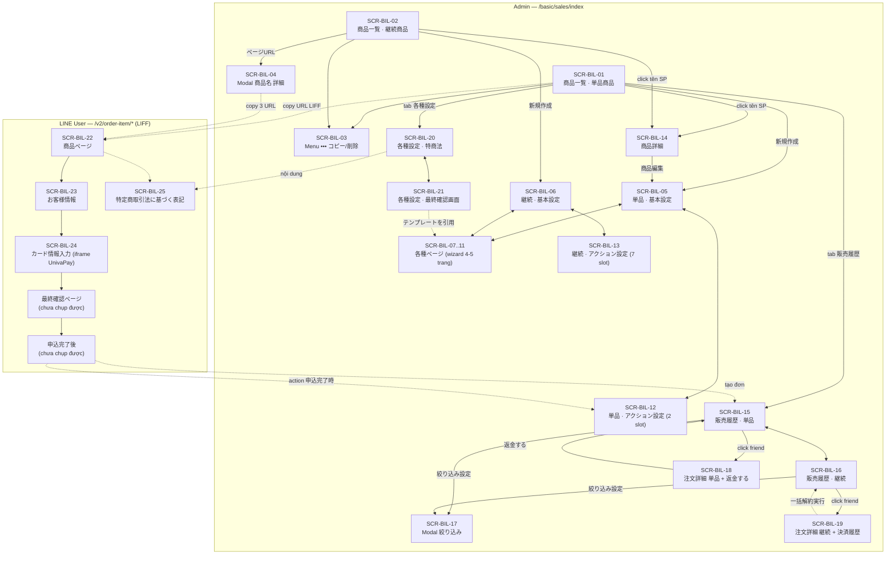

# FA-026 — Bán hàng 「商品販売」/「単品商品」 — UI Spec

> **Nguồn dữ liệu**: 32 snapshot accessibility tree + 33 screenshot thu thập bằng playwright-cli từ `https://form.watermeru.com` (môi trường LME).
> **Ngày thu thập**: 2026-08-03 · **Tài khoản quan sát**: `bichhao_test` (田中 太郎-Thanhntp142)
> **Mức độ tin cậy chung**: **Trung bình** — toàn bộ nội dung dưới đây được quan sát trực tiếp từ UI, chưa đối chiếu source code/DB.

---

## 1. Tổng quan tính năng

「商品販売」 (Bán hàng) là module thương mại điện tử tích hợp trong LINE Official Account của LME. Admin tạo **sản phẩm** và LME sinh ra một **chuỗi trang public (LIFF)** để bạn bè LINE (LINE User) xem sản phẩm → nhập thông tin cá nhân → nhập thẻ tín dụng → xác nhận → hoàn tất thanh toán. Toàn bộ giao dịch được xử lý qua cổng thanh toán bên thứ ba (quan sát thấy **UnivaPay**; UI cũng liệt kê **Stripe** trong bộ lọc nhưng tài khoản quan sát chưa kết nối).

Tính năng chia thành **2 loại sản phẩm** (2 sub-tab riêng biệt, dữ liệu và cột bảng khác nhau):

| Loại | Tên JP | Đặc điểm |
|------|--------|----------|
| Sản phẩm đơn lẻ | 「単品商品」 | Thanh toán 1 lần, có 購入個数 (số lượng), 4 trang public |
| Sản phẩm định kỳ | 「継続商品」 | Thanh toán lặp lại theo chu kỳ, có 請求設定 (giá × số lần) + トライアル (dùng thử), 5 trang public (thêm trang huỷ), có trang đổi thẻ |

Ba khu vực chức năng chính (tab bar màu xanh trên cùng):

| Tab | Tên JP | Mô tả |
|-----|--------|-------|
| Danh sách sản phẩm | 「商品一覧」 | CRUD sản phẩm, quản lý folder, sinh URL trang bán hàng |
| Lịch sử bán hàng | 「販売履歴」 | Danh sách đơn hàng, lọc, xuất CSV, hoàn tiền / huỷ hàng loạt |
| Cài đặt chung | 「各種設定」 | Thông tin doanh nghiệp (特商法) + template màn hình xác nhận cuối |

Điểm đặc thù quan trọng: mỗi sản phẩm thuộc **một trong hai môi trường** 「本番環境」 (production — thanh toán thật) hoặc 「テスト環境」 (test — không trừ tiền, dùng để kiểm tra action). Toggle môi trường xuất hiện ở cả 商品一覧 và 販売履歴, lọc dữ liệu độc lập.

---

## 2. Actors liên quan

| Actor | Phạm vi truy cập | Ghi chú |
|-------|-----------------|---------|
| **Admin (LINE OA)** | Toàn bộ 3 tab, tạo/sửa/xoá/copy sản phẩm, hoàn tiền, huỷ đăng ký định kỳ, cấu hình 特商法 | Actor chính quan sát được |
| **Staff** | Chưa quan sát được — không có UI phân quyền hiển thị trong phạm vi tính năng | **Chưa rõ** — cần kiểm tra role permission ở FA-035 |
| **LINE User** | 4–5 trang public qua LIFF (`liff.line.me/2010511641-dvrbtPpN?product_id={id}&type=...`) + trang 「特定商取引法に基づく表記」 | Không cần đăng nhập LME; định danh qua LIFF/LINE |
| **Cổng thanh toán (UnivaPay)** | Nhận thông tin thẻ qua iframe, trả trạng thái thanh toán; link đối soát trực tiếp sang `merchant.univapay.com` | Bên thứ ba |

---

## 3. Cấu trúc điều hướng

```
Sidebar「その他の機能」→「商品販売」 (/basic/sales/index)
│
├── Tab「商品一覧」(?tab=list-item)
│   ├── Sub-tab「単品商品」(#buy-one)          → SCR-BIL-01
│   ├── Sub-tab「継続商品」(#cyclical-buying)  → SCR-BIL-02
│   ├── Toggle 本番環境 / テスト環境
│   ├── Menu ••• mỗi dòng (コピー/削除)        → SCR-BIL-03
│   ├── Modal「商品名 詳細」(継続商品)          → SCR-BIL-04
│   ├── 新規作成 / 商品編集 (?tab=add-item | edit-item)
│   │   ├── Tab「基本設定」単品                → SCR-BIL-05
│   │   ├── Tab「基本設定」継続                → SCR-BIL-06
│   │   ├── Tab「各種ページ」(wizard 4–5 trang) → SCR-BIL-07..11
│   │   └── Tab「アクション設定」               → SCR-BIL-12 / SCR-BIL-13
│   └── 商品詳細 (/get-single-item-detail/{hashId}) → SCR-BIL-14
│
├── Tab「販売履歴」
│   ├── Sub-tab「単品商品」                    → SCR-BIL-15
│   ├── Sub-tab「継続商品」                    → SCR-BIL-16
│   ├── Modal「絞り込み」                      → SCR-BIL-17
│   ├── 注文詳細 単品 (/order-history-detail/{hash})       → SCR-BIL-18
│   └── 注文詳細 継続 (/cycle-order-history-detail/{hash}) → SCR-BIL-19
│
├── Tab「各種設定」(?tab=setting)
│   ├── Sub-tab「事業者・特商法設定」(#tab-2)   → SCR-BIL-20
│   └── Sub-tab「最終確認画面」(#tab-3)        → SCR-BIL-21
│
└── Trang public (LINE User) — /v2/order-item/...
    ├── 商品ページ (detail)                    → SCR-BIL-22
    ├── お客様情報 (enter-friend-info)          → SCR-BIL-23
    ├── 購入する商品 + カード情報入力 (enter-payment-info) → SCR-BIL-24
    └── 特定商取引法に基づく表記 (info-store)    → SCR-BIL-25
```

### URL đã quan sát

| URL | Vai trò |
|-----|---------|
| `/basic/sales/index` | Entry point (mặc định tab 商品一覧, sub-tab 単品商品) |
| `/basic/sales/index?tab=list-item` | Tab danh sách sản phẩm |
| `/basic/sales/index?tab=setting` | Tab cài đặt chung |
| `/basic/sales/index?typePayment=0&tab=add-item&flag_environment=1&s_category_id=0&payment_method=` | Tạo mới 単品商品 (`typePayment=0`, `flag_environment=1` = 本番) |
| `/basic/sales/index?typePayment=2&tab=add-item&flag_environment=0&s_category_id=0&payment_method=` | Tạo mới 継続商品 (`typePayment=2` ở nút 新規作成 tab 継続, `flag_environment=0` = テスト) |
| `/basic/sales/index?typePayment=0&tab=edit-item&itemId={hashId}&group_open=0&paymentMethod=` | Chỉnh sửa sản phẩm |
| `/basic/sales/get-single-item-detail/{hashId}?typePayment=0&flag_environment=0&s_category_id=0&payment_method=` | Xem chi tiết sản phẩm (dòng 継続 dùng `typePayment=1`) |
| `/basic/sales/order-history-detail/{hash}` | Chi tiết đơn 単品 |
| `/basic/sales/cycle-order-history-detail/{hash}` | Chi tiết đơn 継続 |
| `/basic/sales/set-cookie?folder_id=0&type=sales` | Ghi nhớ folder đang mở (cookie) |
| `/ajax/get-list-group-products` (POST) | Nạp danh sách folder sản phẩm |
| `/v2/order-item/detail/{itemCode}/preview` | Preview trang sản phẩm public |
| `/v2/order-item/enter-friend-info/{itemCode}/preview` | Preview trang nhập thông tin khách |
| `/v2/order-item/enter-payment-info/{itemCode}/preview` | Preview trang nhập thẻ |
| `/v2/order-item/change/{itemCode}/preview` | Preview trang đổi thẻ (継続) |
| `/v2/order-item/cancel/{itemCode}/preview` | Preview trang huỷ (継続) |
| `/v2/order-item/info-store?hashBotId={hashBotId}[&type=preview]` | Trang 特商法 của toàn bot |
| `https://liff.line.me/2010511641-dvrbtPpN?product_id={id}&type=product-detail\|product-change\|product-cancel&ts={timestamp}` | URL phân phối thật gửi cho LINE User |
| `https://merchant.univapay.com/dashboard/transactions/store/{storeId}/charge/{chargeId}` | Link đối soát giao dịch 単品 |
| `https://merchant.univapay.com/dashboard/stores/{storeId}/recurring-tokens/{tokenId}/general` | Link đối soát đăng ký định kỳ |

---

## 4. Đặc tả từng màn hình

### SCR-BIL-01 — Danh sách sản phẩm đơn lẻ 「商品一覧 > 単品商品」
📸 `01-list-main.png`, `14-list-item-tab.png`, `17-list-item-test-env.png`, `18-list-test-env-click.png`

**Layout**
- Sidebar trái: menu chung LME (mục 「商品販売」 nằm trong nhóm 「その他の機能」)
- Header: chọn bot 「bichhao_test」, icon QR, 配信数 / サポート / お知らせ, tên user
- Tab bar (nền xanh): 「商品一覧」・「販売履歴」・「各種設定」
- Sub-tab: 「単品商品」・「継続商品」 (bên trái) — Toggle 「本番環境」/「テスト環境」 + dropdown 「表示設定」 (bên phải)
- Body 2 cột: **cột trái = panel folder**, **cột phải = toolbar + bảng sản phẩm**

**Tabs / Sub-navigation**

| Cấp | Mục | Đích |
|-----|-----|------|
| Tab chính | 「商品一覧」 | `?tab=list-item` |
| Tab chính | 「販売履歴」 | `#` (JS switch) |
| Tab chính | 「各種設定」 | `?tab=setting` |
| Sub-tab | 「単品商品」 | `#buy-one` |
| Sub-tab | 「継続商品」 | `#cyclical-buying` |

**Action Buttons**

| Label JP | Kiểu | Vị trí | Hành vi quan sát được |
|----------|------|--------|----------------------|
| 「本番環境」 | Toggle button | Thanh sub-tab, phải | Lọc sản phẩm môi trường production (`flag_environment=1`) |
| 「テスト環境」 | Toggle button | Thanh sub-tab, phải | Lọc sản phẩm môi trường test (`flag_environment=0`). Khi active, hiện dòng gợi ý 「※テスト決済をする場合は<u>こちら</u>のダミーカード番号をご利用ください」 (link `#modalFakeCard`) |
| 「表示設定」 (select) | Dropdown | Thanh sub-tab, phải cùng | Lọc theo cổng thanh toán: 「全て」(mặc định) / 「UnivaPay」/「Stripe」 |
| ➕ (icon) | Icon button | Header panel folder | Thêm folder mới (chưa snapshot được popup) |
| ⇅ (icon sort) | Icon button | Header panel folder | Sắp xếp folder (chưa snapshot được modal) |
| 「新規作成」 | Primary button (xanh) | Toolbar trên bảng, trái | Điều hướng sang form tạo mới, mang theo `typePayment`, `flag_environment`, `s_category_id` hiện tại |
| 「並べ替え」 | Secondary button | Toolbar, phải | Sắp xếp thứ tự sản phẩm (`href=""` → mở modal bằng JS, chưa snapshot được) |
| 「一括フォルダ変更」 | Secondary button | Toolbar, phải cùng | Chuyển nhiều sản phẩm (đã tick checkbox) sang folder khác |
| 📋 (copy) | Icon trong ô URL | Cột 「商品ページ」 | Copy URL LIFF vào clipboard |
| 👁 (eye) | Icon link | Cột 「商品ページ」 | Mở preview `/v2/order-item/detail/{itemCode}/preview` |
| ••• | Icon menu | Cột cuối mỗi dòng | Mở menu thao tác dòng → SCR-BIL-03 |

**Panel folder (cột trái)**

| Thành phần | Nội dung quan sát |
|-----------|------------------|
| Tiêu đề | 「フォルダ」 |
| Folder mặc định | 「未分類 (N)」 — N thay đổi theo môi trường: `(0)` ở 本番, `(3)` ở テスト (単品) |
| Folder người dùng | 「Kim test 333 (0)」,「C (0)」,「Kim test-1 (0)」,「B (0)」 |
| Ghi chú | Số trong ngoặc = số sản phẩm trong folder theo môi trường đang chọn. Chọn folder ghi cookie qua `/basic/sales/set-cookie?folder_id=0&type=sales` |

**Data Table** (môi trường テスト)

| Cột (JP) | Kiểu dữ liệu | Dữ liệu mẫu |
|---------|-------------|-------------|
| (checkbox) | Boolean, có checkbox chọn tất cả ở header | — |
| 「作成日 / 管理名」 | Thumbnail ảnh + ngày `YYYY.MM.DD` + link tên sản phẩm | `2026.07.17` / `item item`; `2026.07.16` / `ITEM2`; `2026.07.02` / `item 1` |
| 「商品ページ」 | Textbox read-only chứa URL + nút copy + nút preview | `https://liff.line.me/2010511641-dvrbtPpN?product_id=872&type=product-detail&ts=1785739339` |
| 「決済システム」 | Text | `UnivaPay` |
| 「価格」 | Số + đơn vị 円 | `100円`, `101円` |
| 「販売数」 | Số nguyên | `0`, `1`, `2` |
| (ngăn cách) | Ký tự `/` | `/` |
| 「在庫数」 | Số nguyên hoặc `無制限` | `無制限` |
| (thao tác) | Icon ••• | — |

**Observations**
- Tên sản phẩm liên kết tới `/basic/sales/get-single-item-detail/{hashId}` — hashId là chuỗi 12 ký tự (vd `2EaJrg0jql1Y`, `V5ZebQ2DW6XO`, `KpxaWojwbgGm`)
- URL LIFF chứa `product_id` dạng số nguyên tăng dần (861, 869, 872) — khác với hashId dùng trong route admin, và khác với `itemCode` 10 ký tự dùng ở route preview (`hmfP3WZZIE`, `p3LSgwdmdG`, `t3XSR7yF0l`) → **3 định danh khác nhau cho cùng 1 sản phẩm**
- Tham số `ts=` trong URL LIFF là Unix timestamp, thay đổi mỗi lần load trang → chống cache
- Ở môi trường 本番, bảng rỗng (0 sản phẩm) với tài khoản quan sát
- Khi ở 本番, dòng nhắc dùng thẻ giả không hiển thị

---

### SCR-BIL-02 — Danh sách sản phẩm định kỳ 「商品一覧 > 継続商品」
📸 `31-list-cyclical-test.png`

**Layout**: giống SCR-BIL-01, nhưng bảng có cột khác.

**Data Table**

| Cột (JP) | Kiểu dữ liệu | Dữ liệu mẫu |
|---------|-------------|-------------|
| (checkbox) | Boolean | — |
| 「作成日 / 管理名」 | Thumbnail + ngày + link | `2026.07.28` / `item định kỳ2`; `2026.07.17` / `item4`; `2026.07.16` / `item 3`; `2026.07.16` / `item22` |
| 「決済・変更・解約ページ」 | **Button** 「ページURL」 (nền xanh) | mở modal SCR-BIL-04 |
| 「決済システム」 | Text | `UnivaPay` |
| 「価格」 | Số + 円 | `100円`, `102円`, `100円`, `105円` |
| 「トライアル中」 | Số nguyên | `0` (tất cả dòng) |
| 「販売数」 | Số nguyên | `2`, `0`, `1`, `1` |
| 「在庫数」 | Số hoặc `無制限` | `無制限` |
| (thao tác) | Icon ••• | — |

**Observations**
- Khác biệt then chốt so với 単品: có thêm cột 「トライアル中」 (số người đang trong kỳ dùng thử) và cột URL được thay bằng button mở modal (vì có tới 3 URL khác nhau)
- Panel folder chỉ hiện 「未分類 (4)」 — các folder khác không hiển thị ở tab 継続商品 (khác với 単品 hiển thị 5 folder) → **Điểm chưa rõ**: có thể folder được lọc theo loại sản phẩm
- Nút 「新規作成」 tại tab này dùng `typePayment=2`, trong khi link chi tiết của dòng dùng `typePayment=1` → **2 giá trị khác nhau cùng chỉ loại 継続**

---

### SCR-BIL-03 — Menu thao tác trên dòng 「•••」
📸 `19-row-action-menu.png`

**Layout**: dropdown nhỏ neo vào ô cuối của dòng.

**Action Buttons**

| Label JP | Hành vi dự kiến |
|----------|----------------|
| 「コピー」 | Nhân bản sản phẩm |
| 「削除」 | Xoá sản phẩm |

**Observations**
- Menu chỉ có 2 mục; không có 「編集」 (chỉnh sửa đi qua trang chi tiết → nút 「商品編集」)
- Không quan sát được dialog xác nhận khi xoá (không click do quy tắc không thay đổi dữ liệu)
- Menu này xuất hiện ở cả tab 単品商品 và 継続商品

---

### SCR-BIL-04 — Modal 「商品名 詳細」 — các URL trang public (継続商品)
📸 `32-cyclical-page-url-modal.png`

**Layout**: modal dialog giữa màn hình, nút ✕ góc phải, tiêu đề 「商品名 詳細」, 2 khối nội dung.

**Khối 1 — 「各種案内ページ」**

| Nhãn JP | Nội dung | Thao tác |
|---------|---------|---------|
| 「商品ページ」 | `https://liff.line.me/2010511641-dvrbtPpN?product_id=879&type=product-detail&ts=1785739755` | 📋 copy · 👁 preview → `/v2/order-item/detail/DeJPYpMobt/preview` |
| 「カード情報変更ページ」 | `...?product_id=879&type=product-change&ts=...` | 📋 copy · 👁 preview → `/v2/order-item/change/DeJPYpMobt/preview` |
| 「解約用ページ」 | `...?product_id=879&type=product-cancel&ts=...` | 📋 copy · 👁 preview → `/v2/order-item/cancel/DeJPYpMobt/preview` |

**Khối 2 — 「商品詳細」** (chỉ đọc)

| Nhãn JP | Giá trị mẫu |
|---------|------------|
| 「本番/テスト」 | `テスト` |
| 「通常販売価格（税込）」 | `100円` |
| 「トライアル期間/価格」 | `申込日から次回決済日まで / 設定なし` |
| 「支払いサイクル」 | `毎週` |
| 「請求終了回数」 | `3回` |
| 「販売上限数」 | `設定なし` |
| 「1人が購入できる上限数」 | `設定なし` |

**Observations**
- Modal chỉ tồn tại ở tab 継続商品 — 単品商品 hiển thị URL trực tiếp trong bảng vì chỉ có 1 URL
- 3 loại trang phân biệt bằng query `type=product-detail | product-change | product-cancel` trên cùng `product_id`

---

### SCR-BIL-05 — Form sản phẩm đơn lẻ — tab 「基本設定」
📸 `04-add-item-single.png` (tạo mới), `21-edit-item-form.png` (chỉnh sửa)

**Layout**
- Tiêu đề `<h2>`「単品商品」
- Khối header form: 「商品名（管理用）」 + 「フォルダ」 (2 cột)
- Khối 「販売環境設定」: 2 radio card
- Tab bar cấp 3: 「基本設定」・「各種ページ」・「アクション設定」
- Nội dung tab: 「商品設定」 → 「販売設定」 → 「税率設定」 → nút lưu

**Form Fields**

| Nhãn JP | Kiểu | Bắt buộc | Giới hạn / Mặc định | Giá trị mẫu (bản edit) |
|---------|------|---------|--------------------|----------------------|
| 「商品名（管理用）」 | Text input | Có (nhãn có badge) | Counter `0/20文字` | `item 1` (`6/20文字`) |
| 「フォルダ」 | Select | Không | Mặc định 「未分類」; options: 未分類 / Kim test 333 / C / Kim test-1 / B | 未分類 |
| 「販売環境設定」 | Radio card | Có | Mặc định 「本番環境」 khi tạo mới | Bản edit đang chọn 「テスト環境」 |
| — 「本番環境」 | Radio | — | Mô tả: 「実際に決済が行われます」 | — |
| — 「テスト環境」 | Radio | — | Mô tả: 「決済は行われません / アクションの確認に利用します」 + link 「こちら」 (`#modalFakeCard`) tới danh sách thẻ giả | — |

**Khối 「商品設定」**

| Nhãn JP | Kiểu | Bắt buộc | Giới hạn / Ghi chú | Giá trị mẫu |
|---------|------|---------|-------------------|------------|
| 「LINEトーク画面 表示設定」 | Nhóm | — | Cảnh báo 「※配信後は変更が反映されない場合があります。」 | — |
| — 「表示商品名」 | Textarea | Có | Counter `0/50文字` | `item 1` (`6/50文字`) |
| — 「説明」 | Textarea | Có | Counter `0/50文字` | `item 1` (`6/50文字`) |
| — (preview) | Vùng xem trước bong bóng LINE | — | Hiển thị 「表示商品名」 (và 「説明」) như tin nhắn LINE | — |
| 「利用する決済システム」 | Select | Có | Options: 「選択してください」(mặc định) / 「UnivaPay」. Cảnh báo 「※保存後の変更はできません」 | `UnivaPay` — **select bị `disabled` ở màn edit** |
| 「商品価格」 | Number (spinbutton) + hậu tố 「円（税込）」 | Có | Mặc định `100`; cảnh báo 「※100円未満の設定はできません」 | `100` |

**Khối 「販売設定」**

| Nhãn JP | Kiểu | Mặc định | Ghi chú |
|---------|------|---------|--------|
| 「在庫数」 | Toggle ON/OFF | `OFF` | Có icon ❓ tooltip. Khi OFF → 在庫 = 無制限 (khớp cột 在庫数 = `無制限` trong danh sách) |
| 「友だち1人当たりの購入上限」 | Toggle ON/OFF | `OFF` | Giới hạn số lần mua trên mỗi friend |

**Khối 「税率設定」**

| Nhãn JP | Kiểu | Mặc định | Options |
|---------|------|---------|--------|
| 「消費税率」 | Radio | `10 %` | `10 %` / `8 %` (thuế suất tiêu dùng Nhật Bản) |

**Action Buttons**

| Label JP | Kiểu | Hành vi |
|----------|------|---------|
| 「保存」 | Primary (xanh) | Lưu sản phẩm |
| 「戻る」 | Secondary (xám) | Quay lại danh sách |

**Observations**
- Khi bật toggle 「在庫数」 / 「友だち1人当たりの購入上限」 sẽ hiện thêm ô nhập số — **chưa quan sát được** (không thao tác thay đổi state)
- 「利用する決済システム」 bị vô hiệu hoá vĩnh viễn sau lần lưu đầu tiên → ràng buộc nghiệp vụ quan trọng
- Form tạo mới và form chỉnh sửa **dùng chung layout**, khác biệt duy nhất là dữ liệu và trạng thái `disabled` của select cổng thanh toán

---

### SCR-BIL-06 — Form sản phẩm định kỳ — tab 「基本設定」
📸 `10-add-item-cyclical.png`

**Layout**: giống SCR-BIL-05 nhưng tiêu đề `<h2>`「継続商品」 và bổ sung 2 khối 「請求設定」・「トライアル設定」.

**Form Fields — phần chung** (giống SCR-BIL-05)
- 「商品名（管理用）」 `0/20文字`, 「フォルダ」 (chỉ có option 「未分類」 ở tab này), 「販売環境設定」, 「表示商品名」 `0/50文字`, 「説明」 `0/50文字`, 「利用する決済システム」
- **Không có** trường 「商品価格」 ở khối 商品設定 (thay bằng 「① 請求価格」 trong 請求設定)

**Khối 「請求設定」**
Ghi chú hướng dẫn: 「① 請求価格 × ② 請求回数 の組み合わせで、分割払い形式の請求ができます。例）10,000円の商品を5回払いで請求する設定 ① 2,000円 × ② 5回 = 10,000円」

| Nhãn JP | Kiểu | Bắt buộc | Mặc định / Options |
|---------|------|---------|-------------------|
| 「① 請求価格」 | Number + 「円（税込）」 | Có | `100`; cảnh báo 「※100円未満の設定はできません」 |
| 「② 請求回数」 | Select | Có | 「無制限」(selected) / 2回 / 3回 / 4回 / 5回 / 6回 / 9回 / 12回 / 18回 / 24回 / 36回 |
| 「支払いサイクル」 | Select | Có | Options: 毎年 / 6ヶ月毎 / 3ヶ月毎 / 毎月 / 「毎週」(selected trong snapshot) |
| 「請求エラー（3回連続で決済エラーが発生した時）」 | Radio | Có | 「自動解約する」 / 「自動解約しない」 — screenshot cho thấy 「自動解約しない」 đang chọn |

Chú thích hiển thị dưới 支払いサイクル:
- 「◯決済日を基準に、設定した支払いサイクルで請求が行われます。月初や月末に決済日を変更することはできません。」
- 「例）支払いサイクル：毎月で1/10に初回決済の場合 次回は2/10に決済が行われます。」
- 「◯請求日が請求月にない場合、該当月の最終日に請求いたします。」
- 「例）支払いサイクル：毎月で3/31に初回決済の場合、次回請求日が4/30となります。」

**Khối 「販売設定」**: giống SCR-BIL-05 (「在庫数」 OFF, 「友だち1人当たりの購入上限」 OFF)

**Khối 「トライアル設定」**

| Nhãn JP | Kiểu | Mặc định | Ghi chú |
|---------|------|---------|--------|
| 「トライアル期間設定」 | Toggle ON/OFF | `OFF` | Bật để cấu hình số ngày dùng thử |
| 「トライアル価格」 | Radio | 「無料」 | 「無料」 / 「有料」 |

**Khối 「税率設定」**: giống SCR-BIL-05 (`10 %` mặc định / `8 %`)

**Action Buttons**: 「保存」 / 「戻る」

**Observations**
- Vùng preview bong bóng LINE ở form 継続 hiển thị URL dạng `https://step.lme.jp/basic/form-answer/form-render/2rdfdg/` — mẫu placeholder minh hoạ tin nhắn sẽ gửi cho friend
- Khi bật 「トライアル期間設定」 sẽ hiện ô nhập số ngày; khi chọn 「有料」 sẽ hiện ô nhập giá dùng thử — **chưa quan sát được**
- Modal SCR-BIL-04 cho thấy giá trị hiển thị của trial khi không cấu hình: 「申込日から次回決済日まで / 設定なし」

---

### SCR-BIL-07 — Tab 「各種ページ」 → 「1.商品ページ」
📸 `05-add-item-pages.png` (単品), `11-cyclical-pages.png` (継続)

**Layout**
- Giữ nguyên header form (商品名/フォルダ/販売環境設定/tab bar)
- 「ページリスト（クリックで編集）」 — thanh wizard ngang, các bước nối bằng mũi tên `>`:
  - **単品商品**: 4 bước — 「1.商品ページ」→「2.友だち情報入力」→「3.最終確認ページ」→「4.申込完了後ページ」 (bước 「5.解約用ページ」 tồn tại trong DOM nhưng **không render** trên màn hình)
  - **継続商品**: 5 bước — có thêm 「5.解約用ページ」
- Bên dưới: panel chỉnh sửa của bước đang chọn

**Action Buttons**

| Label JP | Kiểu | Hành vi |
|----------|------|---------|
| 「保存・プレビュー ➡」 | Button (góc phải panel) | Lưu rồi mở preview trang public |
| 「保存」 | Primary | Lưu |
| 「戻る」 | Link (`#basic`) | Quay lại tab 基本設定 |

**Form Fields — 「1.商品ページ」**

| Nhãn JP | Kiểu | Mặc định / Giới hạn | Ghi chú |
|---------|------|--------------------|--------|
| 「商品画像」 | Uploader nhiều ảnh | Counter `1/5` (tối đa 5 ảnh) | Ghi chú 「※1がメインイメージとして設定されます」 |
| 「在庫数表示」 | Toggle | `ON` | Hiện/ẩn số tồn kho trên trang public |
| 「友だち1人当たりの購入制限表示」 | Toggle | `ON` | Hiện/ẩn giới hạn mua trên trang public |
| 「商品案内」 | **Rich text editor (TinyMCE 7)** | Nội dung mẫu: 「商品案内を入力する。」/「この項目は各種ページ>1.商品ページ>商品案内 から編集できます。」 | Toolbar: 元に戻す / やり直す / Block 段落 / Text color / 太字 / 斜体 / 左寄せ・中央揃え・右寄せ・両端揃え / ••• |
| 「ボタン設定 > ボタンテキスト」 | Text input | Mặc định 「お客様情報入力にすすむ」, counter `12/15` | Tối đa 15 ký tự |
| 「背景色」 | Color picker | Xanh lá (mặc định) | Màu nền nút CTA |
| 「文字色」 | Color picker | Trắng (mặc định) | Màu chữ nút CTA |

**Observations**
- Wizard cho phép click trực tiếp vào bất kỳ bước nào để chỉnh sửa (không bắt buộc tuần tự)
- Panel của 単品 và 継続 **hoàn toàn giống nhau** ở bước 1

---

### SCR-BIL-08 — Tab 「各種ページ」 → 「2.友だち情報入力」
📸 `06-page2-friend-info.png`

**Layout**: wizard giữ nguyên, panel hiển thị bảng cấu hình field thu thập thông tin.

**Action Buttons**

| Label JP | Kiểu | Hành vi |
|----------|------|---------|
| 「追加」 | Button (trên bảng) | Thêm field thu thập thông tin mới |
| ✏️ / 🗑 (icon) | Icon cuối mỗi dòng | Sửa / Xoá field |
| 「保存」 / 「戻る」 (`#step-1`) | | |

**Data Table**

| Cột (JP) | Kiểu dữ liệu | Dữ liệu mẫu |
|---------|-------------|-------------|
| 「表示項目名」 | Link (mở form sửa) | `お名前`, `メールアドレス` |
| 「紐つけ友だち情報」 | Text — trường friend info được map | `システム表示名`, `メールアドレス` |
| 「必須 / 任意」 | Badge | `必須` (cả 2 dòng) |
| (thao tác) | 2 icon | — |

**Form Fields — 「ボタン設定」**

| Nhãn JP | Kiểu | Mặc định / Giới hạn |
|---------|------|--------------------|
| 「表示テキスト」 | Text input | 「決済情報入力にすすむ」, counter `10/15` |
| 「カラー設定 > 背景色」 | Color picker | Xanh lá |
| 「カラー設定 > 文字色」 | Color picker | Trắng |

**Observations**
- Ghi chú ràng buộc quan trọng: 「「お名前」「メールアドレス」項目は決済システムに回答情報を連携しなければならいないため、必須の回答と項目となります」 → 2 field này **không thể xoá và luôn bắt buộc** vì phải gửi sang cổng thanh toán
- Cột 「紐つけ友だち情報」 cho thấy dữ liệu nhập được ghi ngược lại vào hồ sơ friend (liên quan FA-015 友だち情報管理)

---

### SCR-BIL-09 — Tab 「各種ページ」 → 「3.最終確認ページ」
📸 `07-page3-final-confirm.png`

**Layout**: khối cảnh báo pháp lý (nền nhạt) → nút 「テンプレートを引用」 → TinyMCE → 「ボタン設定」 → nút lưu.

**Nội dung cảnh báo pháp lý** (hiển thị nguyên văn)
- 「改正特定商取引法の施行（2022年6月1日から）に伴い、注文確定の直前段階（最終確認画面）において「①分量」「②販売価格・対価」「③支払の時期・方法」「④引渡・提供時期」「⑤申込みの撤回、解除に関すること」「⑥申込期間（期限のある場合）」の表示が義務化されました。（詳細は<u>こちら</u>）」 — link tới `caa.go.jp` (Cơ quan Tiêu dùng Nhật Bản)
- 「最終確認画面では①・②が自動表示されますが、③~⑥は自動表示されませんので適宜必要な項目をご入力ください。」
- 「各種設定 > 最終確認画面 > 最終確認画面からテンプレートが設定できます。」

**Action Buttons**

| Label JP | Kiểu | Hành vi |
|----------|------|---------|
| 「テンプレートを引用」 | Button | Chèn nội dung template đã lưu tại SCR-BIL-21 |
| 「保存」 / 「戻る」 (`#step-2`) | | |

**Form Fields**

| Nhãn JP | Kiểu | Nội dung mẫu / Giới hạn |
|---------|------|------------------------|
| (nội dung 「ご確認事項」) | TinyMCE (toolbar đầy đủ hơn: thêm インデントを減らす/増やす) | 「◯支払の時期・方法」/「◯引渡・提供時期」/「◯申込みの撤回、解除に関すること」/「◯申込期間（期限のある場合）」 |
| 「ボタン設定 > 表示テキスト」 | Text input | 「最終確認にすすむ」, counter `8/15` |
| 「カラー設定 > 背景色 / 文字色」 | Color picker | Xanh lá / Trắng |

---

### SCR-BIL-10 — Tab 「各種ページ」 → 「4.申込完了後ページ」
📸 `08-page4-after-complete.png`

**Form Fields — 「ボタン設定」**

| Nhãn JP | Kiểu | Mặc định / Giới hạn |
|---------|------|--------------------|
| 「表示テキスト」 | Text input | 「購入する」, counter `4/15` |
| 「カラー設定 > 背景色 / 文字色」 | Color picker | Xanh lá / Trắng |

**Form Fields — hành vi sau khi hoàn tất** (3 lựa chọn loại trừ, radio)

| Nhãn JP | Kiểu | Trường đi kèm | Mặc định |
|---------|------|--------------|---------|
| 「ページを表示せずにトーク画面に戻る」 | Radio | — | **checked** |
| 「任意ページURL」 | Radio | Text input (URL tuỳ ý) | — |
| 「テキスト入力」 | Radio | TinyMCE — nội dung mẫu 「ご購入ありがとうございました。」/「ページを閉じてください。」 | — |

**Action Buttons**: 「保存」 / 「戻る」 (`#step-3`)

**Observations**
- 「ボタン設定」 tại bước này là nút 「購入する」 hiển thị ở **trang xác nhận cuối** (nút chốt đơn), không phải nút trên trang hoàn tất

---

### SCR-BIL-11 — Tab 「各種ページ」 → 「5.解約用ページ」 (chỉ 継続商品)
📸 `12-cyclical-page5-cancel.png`

**Form Fields**

| Nhãn JP | Kiểu | Nội dung mẫu / Giới hạn |
|---------|------|------------------------|
| 「解約案内」 | TinyMCE | 「このページから解約ができます。」 |
| 「ボタン設定 > ボタンテキスト」 | Text input | 「解約する」, counter `4/10` — **tối đa 10 ký tự** (khác các trang khác là 15) |
| 「背景色」/「文字色」 | Color picker | Xanh lá / Trắng |

**Action Buttons**: 「保存」 / 「戻る」 (`#step-4`)

---

### SCR-BIL-12 — Tab 「アクション設定」 — sản phẩm đơn lẻ
📸 `09-tab-action-setting.png`

**Layout**: 2 card, mỗi card = 1 điểm kích hoạt action.

| Card (JP) | Trường | Kiểu | Mặc định |
|-----------|-------|------|---------|
| 「商品ページ表示時」 | 「稼働回数」 | Radio | 「1度のみアクション稼働」 (checked) / 「何度でもアクション稼働」 |
| | 「エルメアクション」 | Button 「設定」 (nền vàng) | Mở trình cấu hình action (SC-004) |
| 「申込完了時」 | 「稼働回数」 | Radio | 「1度のみアクション稼働」 (checked) / 「何度でもアクション稼働」 |
| | 「エルメアクション」 | Button 「設定」 | Mở trình cấu hình action (SC-004) |

**Action Buttons**: 「保存」 / 「戻る」 (`#info-item`)

---

### SCR-BIL-13 — Tab 「アクション設定」 — sản phẩm định kỳ
📸 `13-cyclical-action-setting.png`

**Layout**: 3 nhóm, tổng **7 điểm kích hoạt action**.

| Nhóm (JP) | Điểm kích hoạt (JP) | Trường đặc thù |
|-----------|--------------------|---------------|
| 「通常時アクション」 | 「商品ページ表示時」 | — |
| | 「申込完了時」 | — |
| | 「トライアル」 | 「終了の [0] 日前」 (spinbutton, mặc định `0`) |
| 「決済時アクション」 | 「初回決済時」 | — |
| | 「2回目以降決済時」 | — |
| 「決済エラー・解約時アクション」 | 「決済エラー発生時」 | — |
| | 「解約時」 | — |

Mỗi điểm kích hoạt đều có:
- 「稼働回数」: radio 「1度のみアクション稼働」 (mặc định checked) / 「何度でもアクション稼働」
- 「エルメアクション」: button 「設定」 → mở trình cấu hình action

**Action Buttons**: 「保存」 / 「戻る」 (`#info-item`)

**Observations**
- Đây là điểm tích hợp mạnh nhất giữa module bán hàng và automation của LME: mua hàng / lỗi thanh toán / huỷ đăng ký đều có thể trigger gắn tag, gửi tin nhắn, chuyển step...
- 「トライアル」 action chạy trước khi kỳ dùng thử kết thúc N ngày → gợi ý có **background job scheduler** quét hàng ngày

---

### SCR-BIL-14 — Chi tiết sản phẩm 「商品詳細」 (chỉ đọc)
📸 `20-edit-item-detail.png`

**Layout**: tiêu đề 「商品詳細」 + nút 「商品編集」 góc phải → bảng thuộc tính (2 cột nhãn/giá trị) → khối 「販売履歴」 theo tháng → nút 「戻る」.

**Action Buttons**

| Label JP | Kiểu | Hành vi |
|----------|------|---------|
| 「商品編集」 | Primary (góc phải) | `/basic/sales/index?typePayment=0&tab=edit-item&itemId={hashId}&group_open=0&paymentMethod=` |
| ◀ / ▶ + ô chọn tháng | Điều hướng | Đổi tháng của bảng 販売履歴 |
| 「戻る」 | Secondary | Quay lại danh sách |

**Bảng thuộc tính**

| Nhãn JP | Giá trị mẫu |
|---------|------------|
| 「商品名」 | `item 1` |
| 「イメージ」 | (placeholder ảnh — chưa upload) |
| 「作成日」 | `2026.07.02` |
| 「決済システム」 | `UnivaPay` |
| 「商品価格」 | `100円（税込）` |
| 「在庫数」 | `設定なし` |
| 「商品ページ」 | link `https://liff.line.me/2010511641-dvrbtPpN?product_id=861&type=product-detail&ts=1785739415` + nút copy |
| 「本番/テスト」 | `テスト` |

**Khối 「販売履歴」**

| Thành phần | Nội dung |
|-----------|---------|
| Bộ chọn tháng | `2026/08` (mặc định tháng hiện tại) + mũi tên ◀ ▶ + icon lịch |
| Cột bảng | 「販売日時 / 友だち名」・「注文番号」・「販売価格」・「決済ステータス ❓」 |
| Dữ liệu | Rỗng ở tháng `2026/08` |
| Phân trang | Có (`navigation`, rỗng) |

**Observations**
- Bảng 販売履歴 ở đây lọc theo **tháng**, khác với tab 販売履歴 chính lọc theo **khoảng ngày**
- Cột 「決済ステータス」 có icon ❓ tooltip giải thích ý nghĩa các trạng thái

---

### SCR-BIL-15 — Lịch sử bán hàng 「販売履歴 > 単品商品」
📸 `15-sales-history-menu.png`, `22-sales-history.png`, `23-sales-history-test-env.png`

**Layout**
- Sub-tab: 「単品商品」/「継続商品」 + toggle 「本番環境」/「テスト環境」 (không có dropdown 表示設定 ở tab này)
- Toolbar: ô tìm kiếm → nút 絞り込み設定 → 2 ô ngày → nút CSV書出し
- Bảng đơn hàng
- Footer cố định: 「選択中 N件」 + nút 「一括返金実行」

**Action Buttons / Form Fields**

| Label JP | Kiểu | Mặc định | Hành vi |
|----------|------|---------|---------|
| (ô tìm kiếm) | Text input + icon 🔍 | placeholder 「友だち名・商品名・注文番号」 | Tìm theo tên friend / tên sản phẩm / mã đơn |
| 「絞り込み設定」 | Button | — | Mở modal SCR-BIL-17 |
| (ngày bắt đầu) | Date input | `2026-07-04` | Hiển thị dạng `07/04/2026` trên giao diện |
| (ngày kết thúc) | Date input | `2026-08-03` | Hiển thị dạng `08/03/2026` — mặc định = **30 ngày gần nhất** |
| 「CSV書出し」 | Button | — | Xuất danh sách đơn ra CSV |
| 「一括返金実行」 | Button (footer) | disabled khi 選択中 0件 | Hoàn tiền hàng loạt các đơn đã tick |

**Data Table**

| Cột (JP) | Kiểu dữ liệu | Dữ liệu mẫu |
|---------|-------------|-------------|
| (checkbox) | Boolean + chọn tất cả | — |
| 「販売日時 / 友だち名」 | Datetime `YYYY.MM.DD HH:mm:ss` + avatar + link tên friend | `2026.07.16 18:22:45` / `Bích Hảo/Bích Hảo` → `/basic/sales/order-history-detail/aNArJja0ryE2` |
| 「注文番号」 | Số nguyên | `3446` |
| 「商品名」 | Text | `ITEM2` |
| 「商品価格（税込）」 | Số + 円 | `101円` |
| 「購入個数」 | Số nguyên | `1` |
| 「決済金額（税込）」 | Số + 円 | `101円` |
| 「決済システム」 | Text | `UnivaPay` |
| 「決済ステータス ❓」 | Badge (link ngoài) | `決済成功` → `https://merchant.univapay.com/dashboard/transactions/store/11ebc45b-7eb2-b188-93bd-030f020ac456/charge/11f180f7-e7ec-c9fa-ad06-171c944d43c3` |

**Observations**
- Tên friend hiển thị dạng `{tên hiển thị}/{tên hệ thống}` — click vào đi tới **chi tiết đơn hàng**, không phải trang friend
- Badge trạng thái là **link ra dashboard UnivaPay** kèm `storeId` + `chargeId` → hai ID này được lưu trong DB
- Ở môi trường 本番 bảng rỗng; dữ liệu mẫu chỉ có ở テスト

---

### SCR-BIL-16 — Lịch sử bán hàng 「販売履歴 > 継続商品」
📸 `25-history-cyclical.png`

**Layout**: giống SCR-BIL-15, khác bộ cột và nút hành động hàng loạt.

**Data Table**

| Cột (JP) | Kiểu dữ liệu | Dữ liệu mẫu |
|---------|-------------|-------------|
| (checkbox) | Boolean | — |
| 「販売日時 / 友だち名」 | Datetime + link | `2026.07.28 19:43:00` / `Bích Hảo/Bích Hảo` → `/basic/sales/cycle-order-history-detail/KpxaWoG0WgGm` |
| 「注文番号」 | Số nguyên | `772`, `770`, `768`, `767` |
| 「商品名」 | Text | `item định kỳ2`, `item định kỳ2`, `item 3`, `item22` |
| 「販売価格」 | Số + 円 | `100円`, `100円`, `100円`, `105円` |
| 「決済システム」 | Text | `UnivaPay` |
| 「決済ステータス ❓」 | Badge (link ngoài) | `キャンセル済` (772, 770, 767), `決済終了` (768) → `https://merchant.univapay.com/dashboard/stores/{storeId}/recurring-tokens/{tokenId}/general` |

**Action Buttons**: giống SCR-BIL-15 nhưng footer là **「一括解約実行」** (huỷ đăng ký hàng loạt) thay cho 「一括返金実行」.

**Observations**
- Bảng 継続 **không có** cột 「購入個数」 và 「決済金額（税込）」 (đăng ký định kỳ luôn 1 suất)
- Trạng thái quan sát được: `キャンセル済` (đã huỷ), `決済終了` (kết thúc thanh toán). Từ SCR-BIL-15 còn có `決済成功`, và modal lọc có thêm `返金済み`
- Hai đơn 772 và 770 trỏ về **cùng một** `recurring-token` UnivaPay (`11f180fb-1585-3944-9725-37dd8c28e6ca`) — có thể do thao tác test lặp

---

### SCR-BIL-17 — Modal 「絞り込み」 (lọc lịch sử bán hàng)
📸 `16-history-filter-modal.png`

**Layout**: modal, nút ✕ góc trái tiêu đề, tiêu đề 「絞り込み」, 3 khối, nút 「決定」 dưới cùng.

**Khối 「商品選択」** — 2 cột

| Cột | Nội dung |
|-----|---------|
| Trái (danh sách folder) | 「未分類」(đang chọn, nền xanh) ·「B」·「Kim test-1」·「C」·「Kim test 333」 |
| Phải (sản phẩm trong folder) | checkbox 「item 1」·「ITEM2」·「item item」 |

**Khối 「決済システム」** — radio: 「全て」(checked) / 「UnivaPay」/「Stripe」

**Khối 「決済ステータス」** — radio: 「全て」(checked) / 「決済成功」/「返金済み」

**Action Buttons**: 「決定」 (primary, giữa)

**Observations**
- Bộ giá trị 決済ステータス trong modal (`決済成功`, `返金済み`) **khác** với giá trị hiển thị thực tế trong bảng (`決済成功`, `キャンセル済`, `決済終了`) → modal này chụp ở sub-tab 単品商品; sub-tab 継続商品 nhiều khả năng có bộ trạng thái khác (**chưa xác nhận**)
- Thứ tự folder trong modal (未分類/B/Kim test-1/C/Kim test 333) khác thứ tự panel folder ở SCR-BIL-01 (未分類/Kim test 333/C/Kim test-1/B) → **hai nguồn sắp xếp khác nhau**

---

### SCR-BIL-18 — Chi tiết đơn hàng đơn lẻ 「注文詳細」
📸 `24-order-history-detail.png` · URL `/basic/sales/order-history-detail/aNArJja0ryE2`

**Layout**: tiêu đề 「注文詳細」 → bảng thuộc tính đơn → khối 「友だち情報」 → 2 nút hành động.

**Bảng thuộc tính đơn**

| Nhãn JP | Kiểu | Giá trị mẫu |
|---------|------|------------|
| 「購入者名」 | Avatar + link tới friend | `Bích Hảo/Bích Hảo` → `/basic/friendlist/my_page/26271265` |
| 「商品名」 | Link tới chi tiết sản phẩm | `ITEM2` → `/basic/sales/get-single-item-detail/V5ZebQ2DW6XO?typePayment=0&screen=history` |
| 「商品価格」 | Text | `101円（税込）` |
| 「購入個数」 | Số | `1` |
| 「決済金額」 | Text | `101円（税込）` |
| 「ステータス」 | Badge link ngoài | `決済成功` → UnivaPay charge |
| 「購入日時」 | Datetime | `2026.07.16 18:22:46` |
| 「注文番号」 | Số | `3446` |
| 「本番/テスト」 | Text | `テスト` |
| 「カード情報」 | Text (masked) | `visa **** **** **** 4242` |

**Khối 「友だち情報」** — dữ liệu khách nhập ở SCR-BIL-23

| Nhãn JP | Giá trị mẫu |
|---------|------------|
| 「お名前」 | `Bích Hảo` |
| 「メールアドレス」 | `haohao82711@gmail.com` |

**Action Buttons**

| Label JP | Kiểu | Hành vi |
|----------|------|---------|
| 「戻る」 | Secondary (xám) | Quay lại danh sách |
| 「返金する」 | **Danger (đỏ)** | Hoàn tiền đơn hàng |

**Observations**
- Thời gian ở bảng danh sách (`18:22:45`) chênh 1 giây so với chi tiết (`18:22:46`) → **hai cột thời gian khác nhau** (thời điểm tạo đơn vs thời điểm thanh toán thành công)
- 「友だち情報」 chính là các field được cấu hình ở SCR-BIL-08

---

### SCR-BIL-19 — Chi tiết đơn định kỳ 「注文詳細」 + 「決済履歴」
📸 `26-cycle-order-detail.png` · URL `/basic/sales/cycle-order-history-detail/KpxaWoG0WgGm`

**Bảng thuộc tính đơn**

| Nhãn JP | Giá trị mẫu | Ghi chú |
|---------|------------|--------|
| 「購入者名」 | `Bích Hảo/Bích Hảo` → `/basic/friendlist/my_page/26271265` | |
| 「商品名」 | `item định kỳ2` → `/basic/sales/get-single-item-detail/ynVgbwD9W9OJ?screen=history` | |
| 「販売価格」 | `100円` | **chỉ có ở đơn 継続** |
| 「商品価格」 | `100円（税込）` | |
| 「トライアル日数」 | `設定なし` | **chỉ có ở đơn 継続** |
| 「初回トライアル価格」 | `設定なし` | **chỉ có ở đơn 継続** |
| 「ステータス」 | badge `キャンセル済` → UnivaPay recurring-token | |
| 「購入日時」 | `2026.07.28 19:43:01` | |
| 「次回決済予定日」 | `2026.07.27 07:00` | **chỉ có ở đơn 継続** |
| 「注文番号」 | `772` | |
| 「本番/テスト」 | `テスト` | |
| 「カード情報」 | `visa **** **** **** 4242` | |

**Khối 「友だち情報」**: 「お名前」 `Bích Hảo` · 「メールアドレス」 `haohao82711@gmail.com`

**Data Table 「決済履歴」**

| Cột (JP) | Kiểu dữ liệu | Dữ liệu mẫu |
|---------|-------------|-------------|
| 「決済回数」 | Số nguyên | `1` |
| 「請求日」 | Date | `2026.07.28` |
| 「決済日」 | Date | `2026.07.28` |
| 「注文番号」 | Số nguyên | `3461` |
| 「決済額(税込)」 | Số + 円 | `100円` |
| 「ステータス」 | Text (màu đỏ) | `キャンセル済` |
| (cột trống) | — | dự phòng nút thao tác |

**Action Buttons**: 「戻る」 (không có nút 返金する trên đơn 継続 ở trạng thái `キャンセル済`)

**Observations**
- **Bất thường dữ liệu**: 「次回決済予定日」 `2026.07.27 07:00` **trước** 「購入日時」 `2026.07.28 19:43:01` → có thể do dữ liệu test bị chỉnh tay, hoặc logic tính ngày dựa trên chu kỳ 毎週 lùi về. Cần xác minh ở tầng code
- 「注文番号」 ở cấp đăng ký (`772`) khác 「注文番号」 ở cấp giao dịch trong 決済履歴 (`3461`) → **2 chuỗi đánh số riêng biệt**: đăng ký định kỳ và giao dịch thanh toán. Đáng chú ý: `3461` cùng dãy số với đơn 単品 `3446` → nhiều khả năng dùng chung bảng giao dịch
- Đơn 継続 không có nút 「一括解約」/「解約する」 trên màn chi tiết — việc huỷ thực hiện từ danh sách (nút 「一括解約実行」) hoặc từ trang public 解約用ページ

---

### SCR-BIL-20 — Cài đặt 「各種設定 > 事業者・特商法設定」
📸 `02-tab-setting.png`, `02-tab-setting-full.png`

**Layout**: tab bar chính → sub-tab 「事業者・特商法設定」(#tab-2) / 「最終確認画面」(#tab-3) → khối hướng dẫn → heading + nút preview → TinyMCE → nút lưu.

**Nội dung hướng dẫn**
- 「トラブル防止・消費者保護のため「特定商取引法に基づく表記」の公開が義務付けられています。」
- 「入力された内容は「特定商取引法に基づく表記」ページに表示されます。(空欄の項目は表示されません)」

**Action Buttons**

| Label JP | Kiểu | Hành vi |
|----------|------|---------|
| 「保存・プレビュー ➡」 | Link button | `/v2/order-item/info-store?hashBotId=Dl7r7e6lbJje&type=preview` |
| 「保存」 | Primary | Lưu |
| 「戻る」 | Link | `/basic/sales/index?tab=list-item` |

**Form Fields**

| Nhãn JP | Kiểu | Nội dung mẫu |
|---------|------|-------------|
| 「特定商取引法に基づく表記」 | TinyMCE (toolbar mở rộng: có thêm 「リンクの挿入・編集」 và 「ソースコード」) | 「◯ 事業者名」/「◯ 事業者所在地」/「◯ 統括責任者」/「◯ 連絡先」/「◯ 料金」/「◯ 商品等の引き渡し時期・発送方法」 |

**Observations**
- Cài đặt ở **cấp bot** (`hashBotId`), dùng chung cho mọi sản phẩm — không phải cấp sản phẩm
- Toolbar TinyMCE ở đây phong phú hơn các editor trong form sản phẩm (có chèn link + xem HTML)

---

### SCR-BIL-21 — Cài đặt 「各種設定 > 最終確認画面」
📸 `03-setting-final-confirm.png`

**Layout**: heading 「最終確認画面「ご確認事項」のテンプレート登録」 → khối cảnh báo pháp lý → TinyMCE → nút lưu.

**Nội dung cảnh báo**: giống SCR-BIL-09, thêm câu 「この設定では最終確認ページに表示される「ご確認事項」項目のテンプレート登録ができます。」

**Form Fields**

| Nhãn JP | Kiểu | Nội dung mẫu |
|---------|------|-------------|
| (template 「ご確認事項」) | TinyMCE (toolbar mở rộng) | 「○支払の時期・方法」/「○引渡・提供時期」/「○申込みの撤回、解除に関すること」/「○申込期間(期限のある場合)」 |

**Action Buttons**: 「保存」 / 「戻る」 (`#tab-2`)

**Observations**
- Template này được dùng bởi nút 「テンプレートを引用」 ở SCR-BIL-09 → quan hệ 1 template cấp bot → nhiều sản phẩm

---

### SCR-BIL-22 — [Public/LINE User] Trang sản phẩm 「商品ページ」
📸 `27-public-product-page.png` · URL preview `/v2/order-item/detail/hmfP3WZZIE/preview` · Page title = tên sản phẩm (`item 1`)

**Layout**: mobile-first, card giữa màn hình, nền trắng.
- Banner cam cảnh báo preview: 「この画面はプレビューとなります。」/「このページのURLを配信することはできません。」/「配信するときは必ず「呼び出しコード」を利用してください。」
- Card sản phẩm
- Footer cố định (chỉ ở chế độ preview): 「配信用URL」 + ô URL + nút 「コピー」

**Nội dung hiển thị**

| Nhãn JP | Giá trị mẫu | Nguồn cấu hình |
|---------|------------|---------------|
| 「商品名」 | `item 1` | 「表示商品名」 (SCR-BIL-05) |
| 「価格（税込）」 | `¥ 100` | 「商品価格」 |
| (nội dung tự do) | 「商品案内を入力する。」/「この項目は各種ページ>1.商品ページ>商品案内 から編集できます。」 | 「商品案内」 TinyMCE (SCR-BIL-07) |

**Action Buttons**

| Label JP | Kiểu | Hành vi |
|----------|------|---------|
| 「お客様情報入力にすすむ」 | Primary (màu theo 背景色/文字色 đã cấu hình) | Sang SCR-BIL-23 |
| 「戻る」 | Secondary | Quay lại |
| 「特定商取引法に基づく表記」 | Link | `/v2/order-item/info-store?hashBotId=Dl7r7e6lbJje` → SCR-BIL-25 |
| 「コピー」 | Button (footer preview) | Copy 「配信用URL」 `https://liff.line.me/2010511641-dvrbtPpN?product_id=861&ts=1785739680` |

**Observations**
- Trong bản preview **không** hiển thị 在庫数 / 購入制限 do sản phẩm mẫu tắt các tuỳ chọn đó (`設定なし`)
- URL 配信用 ở footer **không có** tham số `type=` — khác URL trong bảng danh sách (có `type=product-detail`)

---

### SCR-BIL-23 — [Public/LINE User] Nhập thông tin khách 「お客様情報」
📸 `29-public-friend-info.png` · URL `/v2/order-item/enter-friend-info/{itemCode}/preview`

**Form Fields**

| Nhãn JP | Kiểu | Bắt buộc | Placeholder |
|---------|------|---------|------------|
| 「お名前」 | Text input | Có (badge 必須 cạnh nhãn) | — |
| 「メールアドレス」 | Email input | Có (badge 必須) | `your@email.com` |

**Action Buttons**

| Label JP | Kiểu | Hành vi |
|----------|------|---------|
| 「決済情報入力にすすむ」 | Primary | Sang SCR-BIL-24 |
| 「戻る」 | Secondary | Về SCR-BIL-22 |

**Observations**
- Danh sách field khớp chính xác bảng cấu hình ở SCR-BIL-08; nhãn nút khớp 「表示テキスト」 đã cấu hình
- Nếu Admin thêm field tuỳ chỉnh ở SCR-BIL-08 thì trang này sẽ có thêm ô — **chưa quan sát được**

---

### SCR-BIL-24 — [Public/LINE User] Xác nhận & nhập thẻ 「購入する商品」+「カード情報入力」
📸 `30-public-payment-info.png` · URL `/v2/order-item/enter-payment-info/{itemCode}/preview`

**Layout**: 2 khối — tóm tắt đơn hàng và form thẻ (iframe của cổng thanh toán).

**Khối 「購入する商品」**

| Thành phần | Giá trị mẫu |
|-----------|------------|
| Tên sản phẩm | `item 1` |
| 「数量」 | `0` (trong preview) |
| Đơn giá | `¥ 100 （税込）` |
| 「合計(税込)」 | `¥0` (trong preview) |

**Khối 「カード情報入力」 — iframe UnivaPay** (banner 「テストモード」)

| Nhãn JP | Kiểu | Placeholder / Mặc định |
|---------|------|----------------------|
| 「メールアドレス」 | Email input | `example@email.com` |
| 「電話番号」 | Select quốc gia + text input | 「日本 +81」 |
| 「カード名義」 | Text input | `TARO YAMADA` |
| 「カード番号」 | Text input | `4444 3333 2222 1111` |
| 「有効期限（月/年）」 | Text input | `12/26` |
| 「セキュリティコード」 | Text input | `123` |
| 「個人情報取得への同意」 | Checkbox | chưa tick |
| 「個人情報の取扱いについて」 | Link | `https://univapaycast.com/handling02/` |

**Action Buttons**

| Label JP | Kiểu | Hành vi |
|----------|------|---------|
| 「最終確認にすすむ」 | Primary | Sang trang xác nhận cuối (「最終確認ページ」 — **chưa chụp được**) |
| 「戻る」 | Secondary | Về SCR-BIL-23 |

**Observations**
- Form thẻ nằm trong **iframe của UnivaPay** → dữ liệu thẻ không đi qua server LME (mô hình tokenization, giảm phạm vi PCI-DSS)
- Snapshot ghi nhận 3 lỗi + 6 cảnh báo console — nhiều khả năng do chạy ở chế độ preview không có phiên LIFF thật
- 「数量」 = `0` và 「合計」 = `¥0` là do preview không có ngữ cảnh đơn hàng thật; ở luồng thật có bộ chọn số lượng (đơn mẫu 3446 có 購入個数 = 1)
- Chưa quan sát được màn 「3.最終確認ページ」 và 「4.申込完了後ページ」 ở phía public

---

### SCR-BIL-25 — [Public/LINE User] Trang 「特定商取引法に基づく表記」
📸 `28-public-info-store.png` · URL `/v2/order-item/info-store?hashBotId=Dl7r7e6lbJje&type=preview` · Page title 「商品販売（各種プレビュー）」

**Layout**: một trang tĩnh gồm heading 「特定商取引法に基づく表記」 + các mục `<h2>` + đoạn văn, nút 「戻る」 cuối trang.

**Nội dung mẫu quan sát được**

| Mục (JP) | Nội dung |
|----------|---------|
| 「事業者名」 | `株式会社ミショナ` |
| 「事業者所在地」 | `東京都渋谷区松濤1-28-2` |
| 「統括責任者」 | `佐藤 太郎` |
| 「連絡先」 | `090-1234-5678` |
| 「料金」 | `各販売ページをご参照下さい。` |
| 「商品等の引き渡し時期・発送方法」 | `申し込み手続き完了後、サービス提供を開始致します。` |
| 「代金の支払時期及び方法」 | `支払方法：クレジットカードによる決済がご利用頂けます。` / `支払時期：商品注文確定時でお支払いが確定致します。` |
| 「商品代金以外に必要な費用」 | `特にありません。` |
| 「返品時の条件または中途解約や退会条件」 | `各販売ページをご参照下さい。` |
| 「表現、及び商品に関する注意書き」 | `本商品に示された表現や再現性には個人差があり、必ずしも利益や効果を保証したものではございません。事業者所在地` |

**Observations**
- Nội dung được render từ HTML lưu ở SCR-BIL-20 — trang mẫu này giàu thông tin hơn nội dung placeholder trong editor, cho thấy tài khoản đã lưu nội dung thật hoặc hệ thống có **nội dung mặc định cấp hệ thống**
- Mục cuối kết thúc bằng chuỗi thừa `事業者所在地` — dấu hiệu dữ liệu mẫu bị lỗi nhập, không phải lỗi giao diện

---

## 5. User Flows

### 5.1 Happy path — Admin tạo sản phẩm đơn lẻ và phát hành

1. Admin mở sidebar 「その他の機能 > 商品販売」 → SCR-BIL-01
2. Chọn môi trường (「本番環境」 hoặc 「テスト環境」) và folder đích
3. Bấm 「新規作成」 → SCR-BIL-05 (tab 「基本設定」)
4. Nhập 「商品名（管理用）」, chọn 「フォルダ」, chọn 「販売環境設定」
5. Nhập 「表示商品名」・「説明」 (hiển thị trong tin nhắn LINE), chọn 「利用する決済システム」 = 「UnivaPay」, nhập 「商品価格」 ≥ 100
6. (Tuỳ chọn) bật 「在庫数」・「友だち1人当たりの購入上限」; chọn 「消費税率」 10% hoặc 8%
7. Bấm 「保存」 → sản phẩm được tạo, sinh `product_id` + URL LIFF
8. Sang tab 「各種ページ」 → SCR-BIL-07: upload ảnh (tối đa 5), soạn 「商品案内」, chỉnh nhãn/màu nút → 「保存」
9. Bước 「2.友だち情報入力」 (SCR-BIL-08): xác nhận 2 field bắt buộc 「お名前」・「メールアドレス」, thêm field khác nếu cần → 「保存」
10. Bước 「3.最終確認ページ」 (SCR-BIL-09): bấm 「テンプレートを引用」 để lấy nội dung 「ご確認事項」 từ 各種設定 → 「保存」
11. Bước 「4.申込完了後ページ」 (SCR-BIL-10): chọn hành vi sau mua (về LINE / URL tuỳ ý / văn bản) → 「保存」
12. Sang tab 「アクション設定」 (SCR-BIL-12): cấu hình action cho 「商品ページ表示時」 và 「申込完了時」 → 「保存」
13. Quay lại SCR-BIL-01, copy URL ở cột 「商品ページ」 → dùng trong tin nhắn broadcast/step/rich menu

### 5.2 Happy path — Admin tạo sản phẩm định kỳ

Giống 5.1, khác ở bước 5–6 và 12:
- SCR-BIL-06: cấu hình 「① 請求価格」 × 「② 請求回数」, 「支払いサイクル」, 「請求エラー」 (自動解約する/しない), 「トライアル設定」
- SCR-BIL-11: soạn thêm trang 「5.解約用ページ」
- SCR-BIL-13: cấu hình 7 action slot (bao gồm 「初回決済時」・「2回目以降決済時」・「決済エラー発生時」・「解約時」・「トライアル終了 N 日前」)
- Phát hành: bấm 「ページURL」 (SCR-BIL-04) để lấy 3 URL (商品/カード情報変更/解約)

### 5.3 Happy path — LINE User mua hàng

```
Nhận tin nhắn LINE có URL LIFF
  → SCR-BIL-22 商品ページ: xem tên/giá/mô tả → bấm 「お客様情報入力にすすむ」
  → SCR-BIL-23 お客様情報: nhập 「お名前」+「メールアドレス」 → 「決済情報入力にすすむ」
  → SCR-BIL-24 カード情報入力: xem tóm tắt 購入する商品, nhập thẻ trong iframe UnivaPay,
     tick 「個人情報取得への同意」 → 「最終確認にすすむ」
  → 最終確認ページ: đọc 「ご確認事項」 → bấm nút chốt (nhãn cấu hình ở SCR-BIL-10, mặc định 「購入する」)
  → 申込完了後: theo cấu hình → về màn chat LINE / URL tuỳ ý / văn bản cảm ơn
  → Action 「申込完了時」 chạy (gắn tag / gửi tin / chuyển step...)
  → Đơn xuất hiện ở SCR-BIL-15 với trạng thái 「決済成功」
```

### 5.4 Luồng hoàn tiền (単品商品)

```
SCR-BIL-15 販売履歴 > 単品商品
  ├── Cách 1: tick nhiều đơn → footer 「選択中 N件」 → 「一括返金実行」
  └── Cách 2: click tên friend → SCR-BIL-18 注文詳細 → nút đỏ 「返金する」
        → (dialog xác nhận — chưa quan sát được)
        → Trạng thái đổi sang 「返金済み」 (giá trị có trong bộ lọc SCR-BIL-17)
```

### 5.5 Luồng huỷ đăng ký định kỳ (継続商品)

```
Phía Admin:
  SCR-BIL-16 販売履歴 > 継続商品 → tick đơn → 「一括解約実行」
    → Trạng thái đổi sang 「キャンセル済」
    → Action 「解約時」 chạy

Phía LINE User:
  URL 解約用ページ (type=product-cancel) → đọc 「解約案内」 → bấm 「解約する」
    → Trạng thái đổi sang 「キャンセル済」

Tự động (hệ thống):
  3 lần liên tiếp lỗi thanh toán + cấu hình 「自動解約する」
    → hệ thống tự huỷ; Action 「決済エラー発生時」 và 「解約時」 chạy
```

### 5.6 Luồng đổi thẻ (継続商品)

```
Admin copy URL カード情報変更ページ (type=product-change) từ modal SCR-BIL-04
  → gửi cho LINE User
  → User nhập thẻ mới → cập nhật recurring token trên UnivaPay
```

### 5.7 Error cases quan sát được / suy luận

| Tình huống | Biểu hiện | Nguồn |
|-----------|----------|-------|
| Bot chưa kết nối LINE OA | Modal chặn toàn màn hình 「エルメとLINE公式アカウントの接続が切断されています」 với 3 bước hướng dẫn bật Webhook + nút 「ONに変更したので確認ページにすすむ」 | Quan sát trực tiếp (`01-list-main.png`) |
| Nhập giá < 100 | Cảnh báo 「※100円未満の設定はできません」 | Nhãn cảnh báo trên form (chưa test submit) |
| Đổi cổng thanh toán sau khi lưu | Select bị `disabled` — không thể thao tác | Quan sát ở `21-edit-item-form` |
| Nhập quá giới hạn ký tự | Counter `N/20文字`, `N/50文字`, `N/15`, `N/10` | Chưa test vượt ngưỡng |
| Xoá field 「お名前」/「メールアドレス」 | Bị chặn — 「決済システムに回答情報を連携しなければならいない」 | Ghi chú trên SCR-BIL-08 |
| Lỗi thanh toán 3 lần liên tiếp (継続) | Tuỳ cấu hình 「自動解約する」/「自動解約しない」 | Nhãn trên SCR-BIL-06 |
| Danh sách rỗng | Bảng chỉ có header, không có thông báo empty state | Môi trường 本番 |
| Nút hành động hàng loạt khi chưa chọn | 「選択中 0件」 + nút 「一括返金実行」/「一括解約実行」 vẫn hiển thị | Chưa test click |

---

## 6. Flow Diagram



---

## 7. Shared components phát hiện

| Component | Mã SC | Vị trí trong FA-026 | Trạng thái |
|-----------|-------|--------------------|-----------|
| Action Settings 「エルメアクション」 | **SC-004** | SCR-BIL-12 (2 slot), SCR-BIL-13 (7 slot) — button 「設定」 nền vàng | **Xác nhận sử dụng** |
| Friend Filter / Segment 「絞り込み」 | **SC-003** (biến thể) | SCR-BIL-17 — modal 「絞り込み」 với 商品選択 theo folder + 決済システム + 決済ステータス | **Nghi ngờ** — đây là bộ lọc **đơn hàng**, không phải lọc **bạn bè**; cấu trúc modal (2 cột folder/item + radio + nút 決定) giống pattern SC-003 nhưng miền dữ liệu khác |
| Rich Text / Message Editor (TinyMCE 7) | **SC-005** (biến thể) | 6 vị trí: 商品案内 (SCR-BIL-07), ご確認事項 (SCR-BIL-09), テキスト入力 申込完了後 (SCR-BIL-10), 解約案内 (SCR-BIL-11), 特商法 (SCR-BIL-20), テンプレート最終確認 (SCR-BIL-21) | **Xác nhận sử dụng** — 2 cấp toolbar: rút gọn (trong form sản phẩm) và mở rộng (có リンク挿入 + ソースコード, ở 各種設定) |
| Folder Management Panel | (chờ SC-008) | SCR-BIL-01/02 — panel 「フォルダ」 + 「未分類 (N)」 + nút ➕/⇅ + 「一括フォルダ変更」 + cookie `set-cookie?folder_id=..&type=sales` | **Xác nhận lần 5** |
| Drag-drop Sortable List | (chờ SC mới) | SCR-BIL-01/02 — nút 「並べ替え」 (sản phẩm) + nút sort trong panel folder | **Xác nhận lần 6** (chưa snapshot được modal) |
| Color Picker | (chờ SC) | SCR-BIL-07..11 — cặp 「背景色」/「文字色」 cho nút CTA trên trang public | **Xác nhận** — biến thể swatch tròn (giống FA-021) |
| Environment Toggle 「本番環境/テスト環境」 | (mới) | SCR-BIL-01/02, SCR-BIL-15/16 | **Nghi ngờ mới** — pattern segmented control lọc dữ liệu theo môi trường thanh toán; hiện chỉ thấy ở FA-026 |
| Payment Status Badge → link cổng thanh toán | (mới) | SCR-BIL-15/16/18/19 | **Nghi ngờ mới** — badge trạng thái là hyperlink ra `merchant.univapay.com`; có thể dùng lại ở FA-020 (đặt lịch salon có 決済連携) |

**Không sử dụng**: SC-001 (Template Message), SC-002 (Tag Selector), SC-006 (Delivery Target Selector), SC-007 (Schedule/Timer) — trừ trường hợp xuất hiện gián tiếp bên trong modal SC-004.

---

## 8. Điểm chưa rõ / cần điều tra

| # | Vấn đề | Lý do chưa rõ | Đề xuất |
|---|--------|--------------|---------|
| 1 | Ý nghĩa chính xác của `typePayment` (0 / 1 / 2) | Nút 新規作成 tab 継続 dùng `typePayment=2` nhưng link chi tiết dòng 継続 dùng `typePayment=1`; 単品 luôn là `0` | Đọc `SalesController` trong `src/web/` |
| 2 | Quan hệ 3 định danh sản phẩm: `product_id` (số), `hashId` 12 ký tự, `itemCode` 10 ký tự | Ba giá trị khác nhau xuất hiện ở 3 loại URL của cùng 1 sản phẩm | Đối chiếu schema + hàm hash trong code |
| 3 | Trạng thái mở rộng khi bật toggle 「在庫数」/「友だち1人当たりの購入上限」/「トライアル期間設定」/「トライアル価格 有料」 | Không thao tác đổi state (quy tắc không thay đổi dữ liệu) | Đọc Blade template hoặc chụp lại có bật toggle |
| 4 | Modal 「新規フォルダ」・「並べ替え」・「一括フォルダ変更」・`#modalFakeCard` | Chưa được click nên chưa có snapshot | Chụp bổ sung |
| 5 | Dialog xác nhận khi 「削除」/「返金する」/「一括解約実行」 | Không thao tác vì thay đổi dữ liệu | Đọc code JS xác nhận |
| 6 | Trang public 「3.最終確認ページ」 và 「4.申込完了後ページ」 | Preview 2 trang này chưa được chụp | Truy cập `/v2/order-item/...` các route còn lại |
| 7 | Trang public 「カード情報変更ページ」 và 「解約用ページ」 | Đã có URL preview nhưng chưa chụp | Chụp `/v2/order-item/change|cancel/{code}/preview` |
| 8 | Bộ giá trị đầy đủ của 「決済ステータス」 | Quan sát: `決済成功`, `決済終了`, `キャンセル済`; modal lọc còn `返金済み`. Có thể còn trạng thái lỗi/chờ | Đọc constant trong code + DB |
| 9 | Panel folder ở tab 継続商品 chỉ hiển thị 「未分類」 | Không rõ folder được lọc theo loại sản phẩm hay do dữ liệu | Kiểm tra `/ajax/get-list-group-products` |
| 10 | 「次回決済予定日」 (`2026.07.27`) sớm hơn 「購入日時」 (`2026.07.28`) | Bất thường logic hoặc dữ liệu test bị chỉnh | Đọc logic tính ngày trong job/controller |
| 11 | Cơ chế 「呼び出しコード」 nhắc trong banner preview | Banner yêu cầu dùng "mã gọi" khi phân phối thay vì URL trực tiếp — chưa thấy UI tạo mã này trong FA-026 | Có thể thuộc FA khác (template/rich menu); cần tra cứu |
| 12 | Kết nối Stripe | UI liệt kê Stripe trong 表示設定 và modal lọc, nhưng select 「利用する決済システム」 chỉ có UnivaPay | Kiểm tra cấu hình cấp bot / màn hình kết nối cổng thanh toán |
| 13 | Background job cho thanh toán định kỳ | Có 「次回決済予定日」, 「請求日」, action 「トライアル終了の N 日前」 → gần như chắc chắn có scheduled job Spring Boot | Chạy `/spec-job bill-item` |
| 14 | Phân quyền Staff | Không có dấu hiệu phân quyền trong UI đã chụp | Kiểm tra middleware route + FA-035 |
| 15 | Nội dung mặc định trang 特商法 | Trang public hiển thị nội dung đầy đủ (株式会社ミショナ...) trong khi editor chỉ có placeholder `◯ 事業者名`... | Kiểm tra fallback nội dung mặc định trong code |
| 16 | Định dạng và cột của file CSV xuất từ 「CSV書出し」 | Chưa bấm nút | Đọc code export |

---

_Tài liệu này là output của agent **ui-parser**, dùng làm đầu vào cho **web-analyzer** (bước 3) và **db-mapper** (bước 5) trong pipeline `/spec`._
