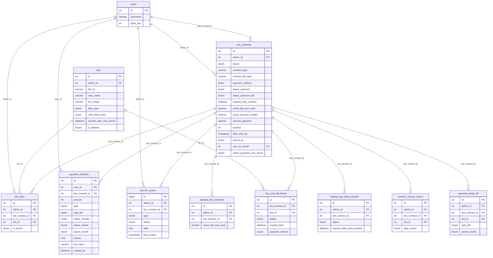

# DB Mapping — FA-031: Hợp đồng và Thanh toán (Billing Plan)

| Thuộc tính | Giá trị |
|-----------|---------|
| Mã tính năng | FA-031 |
| Tên tính năng | Hợp đồng và Thanh toán (Billing Plan) |
| Ngày tạo | 2026-06-05 |
| Nguồn | Schema từ `db/schema/tables/`, logic-spec, api-spec |

---

## 1. Primary Tables (Bảng chính)

### 1.1 `bot_contracts` — Hợp đồng chính

**Mô tả**: Lưu toàn bộ thông tin hợp đồng giữa admin và hệ thống LME. Một admin có thể có nhiều hợp đồng (mỗi hợp đồng cho một LINE OA slot).

**Data size**: 306KB (xem `db/index.md`)

#### Columns

| Column | Kiểu | Nullable | Default | Mô tả |
|--------|------|----------|---------|-------|
| `id` | int(10) UNSIGNED | NOT NULL | auto | PK |
| `admin_id` | int(11) | YES | NULL | FK → `users.id` — admin sở hữu hợp đồng |
| `bot_id` | int(11) | YES | NULL | Bot ID tham chiếu (có thể null nếu chưa gắn bot) |
| `number_slot` | int(11) | NOT NULL | 0 | Số slot LOA trong hợp đồng |
| `amount_payment` | varchar(500) | YES | NULL | Số tiền thanh toán (lưu dạng string) |
| `stripe_customer_id` | varchar(255) | YES | NULL | Stripe customer ID (legacy) |
| `stripe_card_id` | varchar(255) | YES | NULL | Stripe card ID (legacy) |
| `univa_transaction_token` | varchar(500) | YES | NULL | Token giao dịch Univapay |
| `univa_customer_code` | varchar(100) | YES | NULL | Mã khách hàng Univapay |
| `univa_customer_id` | varchar(100) | YES | NULL | ID khách hàng Univapay |
| `univa_email` | varchar(255) | YES | NULL | Email đăng ký Univapay |
| `payment_method` | tinyint(4) | YES | NULL | **1=card, 2=chuyển khoản** |
| `univa_last_four_card` | varchar(50) | YES | NULL | 4 số cuối thẻ chính Univapay |
| `univa_branch_card` | varchar(100) | YES | NULL | Branch của thẻ |
| `univa_bank_branch_code` | varchar(255) | YES | NULL | Mã chi nhánh ngân hàng |
| `univa_bank_account_holder_name` | varchar(255) | YES | NULL | Tên chủ tài khoản ngân hàng |
| `expired_date_bank_transfer` | datetime | YES | NULL | Hạn chót chuyển khoản |
| `univa_bank_name` | varchar(500) | YES | NULL | Tên ngân hàng nhận chuyển khoản |
| `univa_branch_name` | varchar(500) | YES | NULL | Tên chi nhánh ngân hàng nhận |
| `univa_account_number` | varchar(255) | YES | NULL | Số tài khoản ngân hàng nhận |
| `univa_charge_id` | varchar(255) | YES | NULL | Charge ID tại Univapay (pending transfer) |
| `payout_amount_add_slot` | int(11) | YES | NULL | Số tiền thêm slot |
| `number_slot_plus` | int(11) | YES | NULL | Số slot thêm |
| `status` | tinyint(4) | NOT NULL | 0 | **Trạng thái hợp đồng** (xem enum bên dưới) |
| `expired_date_contract` | datetime | YES | NULL | Ngày hết hạn hợp đồng (= ngày phải charge tiếp) |
| `status_payment` | tinyint(4) | YES | NULL | **Trạng thái thanh toán** (xem enum) |
| `error_message` | varchar(255) | YES | NULL | Thông báo lỗi thanh toán |
| `contract_type` | varchar(100) | YES | NULL | Loại hợp đồng: `free`, `standard`, `pro`, `enterprise`, `enterprise_pro` |
| `contract_bill_type` | varchar(100) | YES | NULL | Chu kỳ thanh toán: `month` hoặc `year` |
| `is_active` | tinyint(4) | NOT NULL | 0 | 0=inactive, 1=active |
| `date_add_contract` | datetime | YES | NULL | Ngày bắt đầu hợp đồng |
| `date_cancel_contract` | datetime | YES | NULL | Ngày hủy hợp đồng |
| `status_payment_fail` | tinyint(4) | NOT NULL | 0 | Số lần thanh toán thất bại (0-5, 5=force cancel) |
| `first_error_payment` | datetime | YES | NULL | Thời điểm lỗi đầu tiên |
| `expired_retry_payment` | datetime | YES | NULL | Thời điểm retry tiếp theo |
| `created_at` | timestamp | NOT NULL | CURRENT_TIMESTAMP | Thời điểm tạo |
| `updated_at` | timestamp | NOT NULL | CURRENT_TIMESTAMP ON UPDATE | Thời điểm cập nhật |
| `flag_contract_new` | tinyint(4) | NOT NULL | 0 | Cờ hợp đồng mới (Univapay) |
| `datetime_first_payment` | datetime | YES | NULL | Thời điểm thanh toán đầu tiên |
| `process_status` | tinyint(4) | NOT NULL | 1 | Trạng thái xử lý nội bộ |
| `error_code` | varchar(255) | YES | NULL | Mã lỗi Univapay |
| `date_execute_rate` | timestamp | YES | NULL | Ngày tính tỷ lệ affiliate |
| `cancel_by` | tinyint(4) | YES | NULL | **0=job tự động, 1=user** |
| `user_id_cancel` | bigint(20) | YES | NULL | FK → `users.id` — người hủy hợp đồng |
| `user_date_cancel` | timestamp | YES | NULL | Thời điểm người dùng yêu cầu hủy |
| `bill_type_old` | varchar(10) | YES | NULL | Chu kỳ thanh toán cũ (khi đổi chu kỳ) |
| `release_date_transfer` | timestamp | YES | NULL | Ngày giải phóng chuyển khoản |
| `payment_method_old` | tinyint(4) | YES | NULL | Phương thức thanh toán cũ |
| `position` | int(11) | YES | NULL | Vị trí hiển thị (drag & drop) |
| `date_add_loa` | timestamp | YES | NULL | Ngày kết nối LINE OA |
| `univa_last_four_card_old` | varchar(255) | YES | NULL | 4 số cuối thẻ cũ (khi đổi thẻ) |
| `status_payment_max_friend` | tinyint(4) | YES | 1 | **Trạng thái TT max friend** (0=chưa bill, 1=đã bill) |

**Ghi chú quan trọng**:
- Không có cột `plan_id` hay FK sang bảng plans — `contract_type` lưu dạng string trực tiếp
- `bot_id` trong bảng này có thể là legacy (bảng `bot_slots` là liên kết chính thức contract↔bot)
- 52 cột tổng, đây là bảng trung tâm của tính năng billing

---

### 1.2 `bot_life_cycles` — Lịch sử sự kiện hợp đồng

**Mô tả**: Ghi lại toàn bộ sự kiện quan trọng liên quan đến hợp đồng (kết nối, thanh toán, thay đổi, hủy). Mỗi hành động quan trọng được log vào đây.

**Data size**: 1.1MB

#### Columns

| Column | Kiểu | Nullable | Default | Mô tả |
|--------|------|----------|---------|-------|
| `id` | bigint(20) UNSIGNED | NOT NULL | auto | PK |
| `admin_id` | int(10) | NOT NULL | — | FK → `users.id` — admin liên quan |
| `bot_contract_id` | int(11) | NOT NULL | — | FK → `bot_contracts.id` |
| `type` | tinyint(4) | NOT NULL | — | **Loại sự kiện** (1-28, xem enum) |
| `status` | tinyint(4) | NOT NULL | — | **Nhóm sự kiện** (1=START, 2=PAYMENT, 3=CHANGED, 4=CANCELED) |
| `data` | text | YES | NULL | JSON dữ liệu chi tiết sự kiện |
| `created_at` | timestamp | YES | NULL | Thời điểm ghi log |
| `updated_at` | timestamp | YES | NULL | Thời điểm cập nhật |
| `time_action` | timestamp | YES | NULL | Thời điểm thực hiện hành động thực tế |

**Cấu trúc JSON trong cột `data`**:
```json
{
  "bot_id": int,
  "bot_name": string,
  "bot_image": string,
  "bot_line_id": string,
  "bot_name_new": string,
  "bot_image_new": string,
  "bot_line_id_new": string,
  "plan": string,
  "operator_id": int,
  "operator_name": string,
  "operator_email": string,
  "amount": int,
  "type_bill": int,
  "payment_method": int,
  "payment_id": string,
  "friend_number": int,
  "last4_card_main": string,
  "last4_card_sub": string,
  "next_date_payment": string,
  "remain_upgrade_day": int,
  "staff_name": string,
  "staff_email": string,
  "staff_id": int,
  "extend_time_start": string,
  "extend_time_end": string
}
```

---

### 1.3 `payment_histories` — Lịch sử thanh toán

**Mô tả**: Ghi lại tất cả giao dịch thanh toán (thành công, thất bại, hoàn tiền). Với year contract, tạo 1 bản ghi cha (`parent_month=1`) và 12 bản ghi con phân bổ tháng (`parent_month=0`).

**Data size**: 18.0MB

#### Columns

| Column | Kiểu | Nullable | Default | Mô tả |
|--------|------|----------|---------|-------|
| `id` | int(11) | NOT NULL | auto | PK |
| `user_id` | int(11) | YES | NULL | FK → `users.id` |
| `bot_id` | bigint(20) UNSIGNED | YES | NULL | FK → `bots.id` |
| `bot_contract_id` | int(11) | YES | NULL | FK → `bot_contracts.id` |
| `reason` | char(162) | YES | NULL | Lý do thanh toán (xem danh sách reason) |
| `amount` | int(11) | YES | NULL | Số tiền (đơn vị: yên Nhật, không có dấu thập phân) |
| `rate` | double(8,2) | NOT NULL | — | Tỷ lệ affiliate |
| `remain_day` | int(11) | YES | NULL | Số ngày còn lại của kỳ thanh toán |
| `reason_detail` | text | YES | NULL | Mô tả chi tiết reason |
| `bot_name` | varchar(255) | YES | NULL | Tên bot tại thời điểm thanh toán (snapshot) |
| `type` | tinyint(2) | YES | 0 | **Kiểu bản ghi**: 0=thất bại, 1=thành công |
| `type_bill` | tinyint(4) | NOT NULL | 1 | **Loại phương thức**: 1=stripe_card, 2=univapay_card, 3=univapay_transfer |
| `stripe_card_id` | varchar(255) | YES | NULL | Stripe card ID (legacy) |
| `stripe_customer_id` | varchar(255) | YES | NULL | Stripe customer ID (legacy) |
| `stripe_charge_id` | varchar(255) | YES | NULL | Stripe charge ID (legacy) |
| `created_at` | datetime | YES | NULL | Thời điểm ghi nhận |
| `updated_at` | timestamp | NOT NULL | CURRENT_TIMESTAMP ON UPDATE | Cập nhật |
| `server_id` | int(11) | YES | NULL | ID server xử lý |
| `univapay_transaction_token` | varchar(255) | YES | NULL | Token giao dịch Univapay |
| `univapay_customer_id` | varchar(255) | YES | NULL | Customer ID Univapay |
| `number_slot_bill` | int(11) | NOT NULL | 1 | Số slot được tính phí |
| `status_transfer` | int(11) | NOT NULL | 0 | **Trạng thái chuyển khoản**: 0=chưa, 1=đã nhận tiền |
| `univa_charge_id` | varchar(255) | YES | NULL | Charge ID Univapay |
| `amount_refund` | double | YES | NULL | Số tiền hoàn |
| `reason_refund` | varchar(255) | YES | NULL | Lý do hoàn tiền |
| `refund_date` | datetime | YES | NULL | Ngày hoàn tiền |
| `contract_type_before_refund` | int(11) | YES | NULL | Loại hợp đồng trước khi hoàn |
| `contract_type_after_refund` | int(11) | YES | NULL | Loại hợp đồng sau khi hoàn |
| `next_bill_date_after_refund` | datetime | YES | NULL | Ngày thanh toán tiếp sau hoàn |
| `refund_method` | int(11) | YES | NULL | Phương thức hoàn |
| `refund_reason` | int(11) | YES | NULL | Mã lý do hoàn |
| `refund_description` | text | YES | NULL | Mô tả hoàn tiền |
| `admin_action_refund` | int(11) | YES | NULL | Admin thực hiện hoàn |
| `status_refund` | tinyint(4) | NOT NULL | 0 | **0=chưa hoàn, 1=đã hoàn** |
| `payment_date` | datetime | YES | NULL | Ngày thanh toán chính thức |
| `id_parent` | int(11) | YES | NULL | ID bản ghi cha (với bản ghi phân bổ tháng) |
| `parent_month` | tinyint(4) | NOT NULL | 1 | **1=bản ghi gốc, 0=bản ghi phân bổ tháng (year contract)** |
| `number_bill` | int(11) | YES | NULL | Số thứ tự lần bill |
| `flag_display` | tinyint(4) | NOT NULL | 1 | 1=hiển thị, 0=ẩn |
| `remain_day_upgrade` | int(11) | YES | 0 | Số ngày còn lại khi nâng cấp |
| `last_four_card` | varchar(16) | YES | NULL | 4 số cuối thẻ tại thời điểm charge |

---

## 2. Secondary Tables (Bảng phụ)

### 2.1 `bot_slots` — Liên kết hợp đồng ↔ Bot

**Mô tả**: Bảng trung gian liên kết `bot_contracts` với `bots`. Một hợp đồng có `number_slot` slots, mỗi slot là một bản ghi trong bảng này.

**Data size**: 68KB

#### Columns

| Column | Kiểu | Nullable | Default | Mô tả |
|--------|------|----------|---------|-------|
| `id` | int(10) UNSIGNED | NOT NULL | auto | PK |
| `admin_id` | int(11) | YES | NULL | FK → `users.id` |
| `bot_contract_id` | int(11) | YES | NULL | FK → `bot_contracts.id` |
| `bot_id` | int(11) | YES | NULL | FK → `bots.id` |
| `is_active` | tinyint(4) | NOT NULL | 1 | 0=inactive, 1=active |
| `created_at` | timestamp | NOT NULL | CURRENT_TIMESTAMP | Thời điểm tạo |
| `updated_at` | timestamp | NOT NULL | CURRENT_TIMESTAMP ON UPDATE | Cập nhật |

---

### 2.2 `subcard_bot_contracts` — Thẻ thanh toán phụ

**Mô tả**: Lưu thông tin thẻ phụ (sub card) để fallback khi thẻ chính charge thất bại.

**Data size**: 8KB

#### Columns

| Column | Kiểu | Nullable | Default | Mô tả |
|--------|------|----------|---------|-------|
| `id` | int(10) UNSIGNED | NOT NULL | auto | PK |
| `admin_id` | int(11) | NOT NULL | — | FK → `users.id` |
| `bot_contract_id` | int(11) | NOT NULL | — | FK → `bot_contracts.id` |
| `univa_transaction_token` | varchar(255) | NOT NULL | — | Token giao dịch Univapay thẻ phụ |
| `univa_customer_code` | varchar(255) | NOT NULL | — | Mã khách hàng Univapay thẻ phụ |
| `univa_customer_id` | varchar(255) | NOT NULL | — | ID khách hàng Univapay thẻ phụ |
| `univa_email` | varchar(255) | NOT NULL | — | Email Univapay thẻ phụ |
| `univa_last_four_card` | varchar(10) | NOT NULL | — | 4 số cuối thẻ phụ |
| `created_at` | timestamp | YES | NULL | Thời điểm đăng ký |
| `updated_at` | timestamp | YES | NULL | Cập nhật |

---

### 2.3 `bot_card_bill_friend` — Tính phí theo số bạn bè (Max Friend)

**Mô tả**: Queue xử lý tính phí bổ sung cho bot có >100,000 bạn bè. Được xử lý bởi job `HandleBillMaxFriend` chạy hàng ngày lúc 06:00.

**Data size**: 4KB

#### Columns

| Column | Kiểu | Nullable | Default | Mô tả |
|--------|------|----------|---------|-------|
| `id` | int(10) UNSIGNED | NOT NULL | auto | PK |
| `bot_contract_id` | int(11) | NOT NULL | — | FK → `bot_contracts.id` |
| `bot_id` | int(11) | NOT NULL | — | FK → `bots.id` |
| `univa_transaction_token` | varchar(512) | YES | NULL | Token Univapay cho charge max friend |
| `univa_customer_code` | varchar(128) | YES | NULL | Mã khách hàng |
| `univa_customer_id` | varchar(128) | YES | NULL | ID khách hàng Univapay |
| `univa_last_four_card` | varchar(128) | YES | NULL | 4 số cuối thẻ |
| `univa_branch_card` | varchar(128) | YES | NULL | Branch thẻ |
| `univa_charge_id` | varchar(128) | YES | NULL | Charge ID Univapay |
| `expired_date` | datetime | YES | NULL | Ngày hết hạn (trigger charge khi quá ngày) |
| `status` | tinyint(4) | NOT NULL | 0 | **Trạng thái** (xem enum) |
| `created_at` | timestamp | NOT NULL | CURRENT_TIMESTAMP | Tạo |
| `updated_at` | timestamp | NOT NULL | CURRENT_TIMESTAMP ON UPDATE | Cập nhật |
| `amount_payment` | varchar(256) | YES | NULL | Số tiền tính phí |
| `expired_date_bank_transfer` | datetime | YES | NULL | Hạn chuyển khoản (nếu transfer) |
| `error_code` | varchar(64) | YES | NULL | Mã lỗi Univapay |
| `error_message` | varchar(500) | YES | NULL | Thông báo lỗi |
| `payment_method` | tinyint(4) | YES | 1 | 1=card, 2=transfer |
| `process_status` | tinyint(4) | YES | 0 | Trạng thái xử lý nội bộ |
| `univa_email` | varchar(256) | YES | NULL | Email Univapay |
| `univa_bank_branch_code` | varchar(64) | YES | NULL | Mã chi nhánh ngân hàng |
| `univa_bank_account_holder_name` | varchar(256) | YES | NULL | Tên chủ tài khoản |
| `univa_bank_name` | varchar(256) | YES | NULL | Tên ngân hàng |
| `univa_branch_name` | varchar(256) | YES | NULL | Tên chi nhánh |
| `univa_account_number` | varchar(256) | YES | NULL | Số tài khoản nhận |
| `is_old_bill_max_friend` | tinyint(4) | YES | 0 | 0=thẻ mới (Univapay), 1=thẻ cũ |
| `count_bill_friend_success` | tinyint(4) | YES | 0 | Số lần charge thành công |

---

### 2.4 `request_get_bank_transfer` — Queue lấy thông tin ngân hàng

**Mô tả**: Queue cho job `RecoverUpdateInfoUnivapay` (chạy mỗi 5 phút) để recover thông tin tài khoản ngân hàng chưa nhận được từ Univapay.

**Data size**: 706B

#### Columns

| Column | Kiểu | Nullable | Default | Mô tả |
|--------|------|----------|---------|-------|
| `id` | int(10) UNSIGNED | NOT NULL | auto | PK |
| `admin_id` | int(11) | YES | NULL | FK → `users.id` |
| `bot_contract_id` | int(11) | YES | NULL | FK → `bot_contracts.id` |
| `expired_date_bank_transfer` | datetime | YES | NULL | Hạn chuyển khoản của charge đang pending |
| `amount` | int(11) | YES | 0 | Số tiền cần chuyển khoản |
| `status` | tinyint(4) | YES | 0 | **0=chờ lấy thông tin, 1=đã done, 2=đã close** |
| `created_at` | timestamp | NOT NULL | CURRENT_TIMESTAMP | Tạo |
| `updated_at` | timestamp | NOT NULL | CURRENT_TIMESTAMP ON UPDATE | Cập nhật |

---

### 2.5 `contract_cancel_reason` — Lý do hủy hợp đồng

**Mô tả**: Lưu lý do khi admin hủy hợp đồng hoặc ngắt kết nối bot. Được điền bởi web app khi user xác nhận hủy.

**Data size**: 96KB

#### Columns

| Column | Kiểu | Nullable | Default | Mô tả |
|--------|------|----------|---------|-------|
| `id` | int(10) UNSIGNED | NOT NULL | auto | PK |
| `admin_id` | int(11) | YES | NULL | FK → `users.id` |
| `bot_contract_id` | int(11) | YES | NULL | FK → `bot_contracts.id` |
| `reason` | text | YES | NULL | Lý do hủy (text) |
| `note` | text | YES | NULL | Ghi chú thêm |
| `type_cancel` | tinyint(4) | YES | NULL | **1=xóa bot free, 2=hủy hợp đồng** |
| `created_at` | timestamp | NOT NULL | CURRENT_TIMESTAMP | Thời điểm |
| `updated_at` | timestamp | NOT NULL | CURRENT_TIMESTAMP ON UPDATE | Cập nhật |
| `bot_name` | varchar(255) | YES | NULL | Tên bot tại thời điểm hủy (snapshot) |
| `user_id` | int(11) | YES | NULL | FK → `users.id` — người thực hiện |
| `bot_id` | int(11) | YES | NULL | FK → `bots.id` |

---

### 2.6 `payment_detail_aff` — Chi tiết Affiliate từ thanh toán

**Mô tả**: Ghi nhận commission affiliate khi hợp đồng được charge thành công. Liên kết với `payment_histories`.

**Data size**: 3.6MB

#### Columns quan trọng

| Column | Kiểu | Nullable | Default | Mô tả |
|--------|------|----------|---------|-------|
| `id` | int(10) UNSIGNED | NOT NULL | auto | PK |
| `admin_id` | int(11) | YES | NULL | FK → `users.id` |
| `status` | int(11) | NOT NULL | 0 | 0=chưa thanh toán, 1=đã thanh toán |
| `amount` | int(11) | NOT NULL | 0 | Tổng số tiền hợp đồng |
| `rate` | double | YES | NULL | Tỷ lệ affiliate |
| `sub_amount` | double | NOT NULL | 0 | Số tiền commission |
| `bot_id` | int(11) | YES | NULL | FK → `bots.id` |
| `bot_contract_id` | int(11) | YES | NULL | FK → `bot_contracts.id` |
| `bot_name` | varchar(255) | YES | NULL | Tên bot (snapshot) |
| `remain_day` | int(11) | YES | NULL | Số ngày |
| `user_id` | int(11) | YES | NULL | FK → `users.id` — affiliate user |
| `type_bill` | tinyint(4) | NOT NULL | 1 | 1=stripe, 2=univapay_card, 3=univapay_transfer |
| `parent_month` | tinyint(4) | NOT NULL | 1 | 1=cha, 0=phân bổ tháng |
| `status_refund` | tinyint(4) | NOT NULL | 0 | 0=chưa hoàn, 1=đã hoàn |

---

### 2.7 `bots` — Thông tin LINE OA Bot (các cột liên quan)

**Mô tả**: Bảng chính của bot — chỉ liệt kê các cột liên quan đến FA-031 billing.

**Data size**: 440KB | Tổng cột: 113

#### Columns liên quan FA-031

| Column | Kiểu | Nullable | Default | Mô tả |
|--------|------|----------|---------|-------|
| `id` | int | NOT NULL | auto | PK |
| `admin_id` | int | — | — | FK → `users.id` |
| `line_id` | varchar(50) | YES | NULL | LINE Official Account ID (@xxx) |
| `view_name` | varchar(128) | YES | NULL | Tên bot (hiển thị) |
| `expired_date` | datetime | YES | NULL | Ngày hết hạn bot |
| `expired_date_free_plan` | datetime | YES | NULL | Ngày hết hạn free plan |
| `bot_image` | varchar(500) | YES | NULL | URL ảnh đại diện bot |
| `is_deleted` | tinyint(1) | NOT NULL | 0 | Đánh dấu đã xóa |
| `plan_type` | int(11) | NOT NULL | 1 | **1=standard, 2=free** |
| `max_friend_plan` | tinyint(4) | NOT NULL | 0 | **Trạng thái max friend plan** (xem enum) |
| `expired_date_max_friend` | datetime | YES | NULL | Ngày hết hạn plan max friend |

---

## 3. Enum / Status Values

### 3.1 `bot_contracts.status` — Trạng thái hợp đồng

| Giá trị DB | Constant | Hiển thị UI (JP) | Mô tả |
|-----------|---------|-----------------|-------|
| `0` | `UNREGISTER` | — | Chưa đăng ký (bị loại khỏi query thông thường) |
| `1` | `REGISTERED` | 正常 / 契約中 | Đang hoạt động bình thường |
| `2` | `WAITING_CANCEL` | 解約待ち | Đã yêu cầu hủy, chờ hết hạn |
| `3` | `CANCEL` | 解約済み | Đã hủy hoàn toàn |

**Nguồn**: Cao — từ source code `app/BotContracts.php` + COMMENT trong schema

**Ghi chú UI**: Trạng thái "延滞中" (quá hạn) và "入金待ち" (chờ chuyển khoản) là trạng thái **tổng hợp** từ nhiều cột (`status` + `status_payment` + `payment_method` + `expired_date_contract`), không phải giá trị đơn lẻ trong DB.

---

### 3.2 `bot_contracts.status_payment` — Trạng thái thanh toán kỳ hiện tại

| Giá trị DB | Mô tả | Set bởi |
|-----------|-------|---------|
| `0` | Chưa bill (mới tạo) | Web app |
| `1` | Đã bill thành công | AutoPaymentJobUnivapay (sau charge OK) |
| `2` | Bill lỗi | AutoPaymentJobUnivapay (sau charge fail) |
| `5` | Đang chờ xác nhận chuyển khoản | AutoPaymentJobUnivapay Phase 4 |

**Nguồn**: Cao — từ COMMENT schema + logic-spec

---

### 3.3 `bot_contracts.payment_method` — Phương thức thanh toán

| Giá trị DB | Hiển thị UI (JP) | Mô tả |
|-----------|-----------------|-------|
| `1` | カード決済 | Thanh toán thẻ (Stripe legacy hoặc Univapay card) |
| `2` | 銀行振込 | Chuyển khoản ngân hàng (Univapay transfer) |

**Nguồn**: Cao — từ COMMENT schema

---

### 3.4 `bot_contracts.contract_type` — Loại hợp đồng (Plan)

| Giá trị DB | Hiển thị UI (JP) | Mô tả |
|-----------|-----------------|-------|
| `free` | フリー | Plan miễn phí |
| `standard` | スタンダード | Plan tiêu chuẩn |
| `pro` | プロ | Plan Pro |
| `enterprise` | エンタープライズ | Plan Enterprise |
| `enterprise_pro` | エンタープライズPro | Plan Enterprise Pro (biến thể) |

**Nguồn**: Cao — từ `reason` mapping trong `UserController@ajaxPaymentHistories`

---

### 3.5 `bot_contracts.contract_bill_type` — Chu kỳ thanh toán

| Giá trị DB | Hiển thị UI (JP) | Mô tả |
|-----------|-----------------|-------|
| `month` | 毎月払い | Thanh toán hàng tháng |
| `year` | 年間一括払い | Thanh toán hàng năm (1 lần/năm) |

**Nguồn**: Cao — từ logic-spec

---

### 3.6 `bot_contracts.status_payment_fail` — Số lần thanh toán thất bại

| Giá trị DB | Mô tả | Hành động hệ thống |
|-----------|-------|-------------------|
| `0` | Không có lỗi | — |
| `1` | Thất bại lần 1 | Gửi mail, retry ngay |
| `2` | Thất bại lần 2 | Retry sau 2 ngày |
| `3` | Thất bại lần 3 | Retry sau 5 ngày |
| `4` | Thất bại lần 4 | Gửi mail cảnh báo, retry sau 6 ngày |
| `5` | Thất bại lần 5 | Force cancel, gửi mail, hide richmenu |

**Nguồn**: Cao — từ COMMENT schema + job-spec

---

### 3.7 `bot_contracts.cancel_by` — Nguyên nhân hủy

| Giá trị DB | Constant | Mô tả |
|-----------|---------|-------|
| `0` | `CANCEL_BY_JOBS` | Hủy bởi job tự động (force cancel do lỗi TT) |
| `1` | `CANCEL_BY_USER` | Hủy theo yêu cầu người dùng |

**Nguồn**: Cao — từ COMMENT schema + source code

---

### 3.8 `payment_histories.type` — Loại kết quả thanh toán

| Giá trị DB | Mô tả |
|-----------|-------|
| `0` | Thanh toán thất bại |
| `1` | Thanh toán thành công |

**Nguồn**: Cao — từ logic-spec

---

### 3.9 `payment_histories.type_bill` — Phương thức thanh toán khi ghi nhận

| Giá trị DB | COMMENT schema | Mô tả |
|-----------|--------------|-------|
| `1` | stripe_card | Thẻ Stripe (legacy) |
| `2` | univapay_card | Thẻ Univapay |
| `3` | univapay_transfer | Chuyển khoản Univapay |

**Nguồn**: Cao — từ COMMENT schema

---

### 3.10 `payment_histories.status_transfer` — Trạng thái chuyển khoản

| Giá trị DB | Mô tả |
|-----------|-------|
| `0` | Chưa nhận tiền chuyển khoản |
| `1` | Đã xác nhận nhận tiền chuyển khoản |

**Nguồn**: Cao — từ logic-spec (scope `typeBill`: `status_transfer=1 AND type_bill=3`)

---

### 3.11 `payment_histories.parent_month` — Bản ghi gốc hay phân bổ

| Giá trị DB | COMMENT | Mô tả |
|-----------|---------|-------|
| `1` | parent mount | Bản ghi gốc (tháng hoặc năm) |
| `0` | chia monthly | Bản ghi phân bổ tháng (year contract — 12 bản ghi con) |

**Nguồn**: Cao — từ COMMENT schema + job-spec

---

### 3.12 `payment_histories.status_refund`

| Giá trị DB | Constant | Mô tả |
|-----------|---------|-------|
| `0` | `STATUS_REFUND_AVAILABLE` | Chưa hoàn tiền (thanh toán hợp lệ) |
| `1` | `STATUS_REFUND_REFUNDED` | Đã hoàn tiền |

**Nguồn**: Cao — từ source code `app/PaymentHistories.php`

---

### 3.13 `bots.max_friend_plan` — Trạng thái plan tính phí theo bạn bè

| Giá trị DB | Mô tả | Set bởi |
|-----------|-------|---------|
| `0` | Không tính phí theo bạn bè | Web app |
| `1` | Đang có plan max friend, hoạt động bình thường | Web app |
| `2` | Free (đã hủy charge nhưng vẫn còn hiệu lực) | Web app / cancelTransfer |
| `3` | Lỗi charge max friend | HandleBillMaxFriend (thất bại) |

**Nguồn**: Cao — từ logic-spec + job-spec

---

### 3.14 `bots.plan_type` — Loại plan của bot

| Giá trị DB | Mô tả |
|-----------|-------|
| `1` | Standard (mặc định) |
| `2` | Free |

**Nguồn**: Cao — từ COMMENT schema

---

### 3.15 `bot_life_cycles.status` — Nhóm sự kiện

| Giá trị DB | Constant | Mô tả |
|-----------|---------|-------|
| `1` | `START` | Sự kiện bắt đầu/kết nối |
| `2` | `PAYMENT` | Sự kiện thanh toán |
| `3` | `CHANGED` | Sự kiện thay đổi |
| `4` | `CANCELED` | Sự kiện hủy |

**Nguồn**: Cao — từ COMMENT schema + source code

---

### 3.16 `bot_life_cycles.type` — Loại sự kiện chi tiết

**Nhóm START (status=1)**:

| Giá trị DB | Constant | Hiển thị UI (JP) |
|-----------|---------|-----------------|
| `1` | `CONNECT_BOT_FREE` | フリープランで接続 |
| `2` | `CONNECT_WITH_PLAN` | 有料プランで接続 |

**Nhóm PAYMENT (status=2)**:

| Giá trị DB | Constant | Hiển thị UI (JP) |
|-----------|---------|-----------------|
| `3` | `PLAN_MONTHLY` | プラン 開始（毎月） |
| `4` | `PLAN_YEARLY` | プラン 開始（年間） |
| `5` | `UPGRADE_PLAN_PRO` | プロプラン アップグレード |
| `6` | `BILL_FRIEND_USE` | 友達数課金 |
| `7` | `UPDATE_PLAN_MONTH` | ご利用プラン 更新（毎月） |
| `8` | `UPDATE_PLAN_YEAR` | ご利用プラン 更新（年間） |
| `9` | `RECONTRACT` | 再契約 |
| `10` | `EXTEND_MORE_1_YEAR` | 1年延長 |

**Nhóm CHANGED (status=3)**:

| Giá trị DB | Constant | Hiển thị UI (JP) |
|-----------|---------|-----------------|
| `11` | `CHANGE_MAIN_CARD` | メインクレジットカード変更 |
| `12` | `REGISTER_SUB_CARD` | サブクレジットカード登録 |
| `13` | `CHANGE_SUB_CARD` | サブクレジットカード変更 |
| `14` | `REGISTER_CHANGE_PAYMENT_METHOD_CARD` | 支払方法変更（→カード） |
| `22` | `REGISTER_CHANGE_PAYMENT_METHOD_TRANSFER` | 支払方法変更（→銀行振込） |
| `15` | `REGISTER_CHANGE_PAYMENT_TIMES_YEAR` | 支払い期間変更申し込み（毎月→年間一括） |
| `23` | `REGISTER_CHANGE_PAYMENT_TIMES_MONTH` | 支払い期間変更申し込み（年間一括→毎月） |
| `16` | `REPLACE_ACCOUNT_LINE` | LINE公式アカウント 差し替え |
| `24` | `ADD_STAFF` | スタッフ追加 |
| `25` | `DELETE_STAFF` | スタッフ削除 |
| `26` | `REMOVE_SUB_CARD` | サブクレジットカード削除 |

**Nhóm CANCELED (status=4)**:

| Giá trị DB | Constant | Hiển thị UI (JP) |
|-----------|---------|-----------------|
| `17` | `CANCEL_TRANSFER` | 振込キャンセル |
| `18` | `WAITING_CANCEL` | 解約申し込み |
| `19` | `CANCELED` | 解約完了 |
| `20` | `BILL_ERROR` | 決済エラー |
| `21` | `FORCE_CANCEL` | 強制解約 |
| `27` | `REMOVE_CANCEL` | 解約キャンセル |
| `28` | `DELETE_ACCOUNT` | LOA接続解除 |

**Nguồn**: Cao — từ source code `app/BotLifeCycle.php`

---

### 3.17 `bot_card_bill_friend.status`

| Giá trị DB | Mô tả |
|-----------|-------|
| `0` | Đã bill thành công (sẵn sàng charge kỳ tiếp) |
| `1` | Lỗi bill — không charge được |
| `2` | Lần đầu chưa charge thành công (cần retry) |
| `4` | Đang xử lý transfer (chuyển khoản) |

**Nguồn**: Cao — từ COMMENT schema

---

### 3.18 `request_get_bank_transfer.status`

| Giá trị DB | Mô tả |
|-----------|-------|
| `0` | Đang chờ lấy thông tin ngân hàng từ Univapay |
| `1` | Đã lấy được thông tin (done) |
| `2` | Đã close/không cần nữa |

**Nguồn**: Cao — từ COMMENT schema

---

## 4. UI ↔ DB Field Mapping theo màn hình

### 4.1 SCR-BLP-01: Danh sách hợp đồng

| UI Element | Label JP | DB Table | Column | Mapping Type | Confidence | Ghi chú |
|-----------|---------|---------|--------|-------------|-----------|--------|
| Tên bot | LINE公式アカウント名 | `bots` | `view_name` | Direct | Cao | Join qua `bot_slots` |
| LINE ID | @xxx | `bots` | `line_id` | Direct | Cao | Join qua `bot_slots` |
| Ảnh đại diện bot | アイコン | `bots` | `bot_image` | Direct | Cao | URL ảnh |
| Loại plan | ご利用プラン | `bot_contracts` | `contract_type` | Enum | Cao | `free`/`standard`/`pro`/`enterprise` |
| Chu kỳ thanh toán | お支払い期間 | `bot_contracts` | `contract_bill_type` | Enum | Cao | `month`/`year` |
| Trạng thái hợp đồng | ステータス | `bot_contracts` | `status` + `status_payment` + `payment_method` + `expired_date_contract` | Computed | Cao | Tổng hợp nhiều cột |
| Số tiền thanh toán | ご利用料金 | `bot_contracts` | `amount_payment` | Direct | Cao | String — cần parse |
| Phương thức thanh toán | 決済方法 | `bot_contracts` | `payment_method` | Enum | Cao | 1=card, 2=transfer |
| Ngày kết nối LOA | LOA接続日 | `bot_contracts` | `date_add_loa` | Direct | Cao | timestamp |
| Ngày hết hạn / charge tiếp | 次回決済(更新)日 | `bot_contracts` | `expired_date_contract` | Direct | Cao | — |
| Hạn chuyển khoản | 振込期限 | `bot_contracts` | `expired_date_bank_transfer` | Direct | Cao | Chỉ khi payment_method=2 |
| Tên ngân hàng | 銀行名 | `bot_contracts` | `univa_bank_name` | Direct | Cao | Chỉ khi transfer |
| Tên chi nhánh ngân hàng | 支店名 | `bot_contracts` | `univa_branch_name` | Direct | Cao | — |
| Số tài khoản ngân hàng | 口座番号 | `bot_contracts` | `univa_account_number` | Direct | Cao | — |
| Tên chủ tài khoản | 口座名義 | `bot_contracts` | `univa_bank_account_holder_name` | Direct | Cao | — |
| Số lần TT thất bại | (nội bộ) | `bot_contracts` | `status_payment_fail` | Direct | Cao | Xác định nhóm overdueDataContract |
| Plan max friend | (nội bộ) | `bots` | `max_friend_plan` | Enum | Cao | 0/1/2/3 |
| Số bạn bè | (max friend item) | `bot_line_users` (COUNT) | — | Aggregated | Trung bình | `BotLineUser` count |
| Vị trí card (drag&drop) | (nội bộ) | `bot_contracts` | `position` | Direct | Cao | — |

**Nguồn response field → DB column**:

| API Response Field | DB Column |
|-------------------|-----------|
| `id` | `bot_contracts.id` |
| `bot_id_current` | `bot_slots.bot_id` |
| `view_name` | `bots.view_name` |
| `bot_image` | `bots.bot_image` |
| `plan_type` | `bots.plan_type` |
| `expired_date` | `bots.expired_date` |
| `line_id` | `bots.line_id` |
| `max_friend_plan` | `bots.max_friend_plan` |
| `expired_date_max_friend` | `bots.expired_date_max_friend` |
| `status` | `bot_contracts.status` |
| `payment_method` | `bot_contracts.payment_method` |
| `status_payment` | `bot_contracts.status_payment` |
| `status_payment_fail` | `bot_contracts.status_payment_fail` |
| `contract_type` | `bot_contracts.contract_type` |
| `contract_bill_type` | `bot_contracts.contract_bill_type` |
| `amount_payment` | `bot_contracts.amount_payment` |
| `expired_date_contract` | `bot_contracts.expired_date_contract` |
| `univa_bank_name` | `bot_contracts.univa_bank_name` |
| `univa_branch_name` | `bot_contracts.univa_branch_name` |
| `univa_account_number` | `bot_contracts.univa_account_number` |
| `univa_bank_account_holder_name` | `bot_contracts.univa_bank_account_holder_name` |
| `expired_date_bank_transfer` | `bot_contracts.expired_date_bank_transfer` |
| `history_type_bill` | `payment_histories.type_bill` (subquery max id) |
| `history_type` | `payment_histories.type` (subquery max id) |
| `history_parent_month` | `payment_histories.parent_month` (subquery) |
| `history_status_transfer` | `payment_histories.status_transfer` (subquery) |
| `history_amount_payment` | `payment_histories.amount` (subquery) |

---

### 4.2 SCR-BLP-02: Chi tiết hợp đồng

| UI Element | Label JP | DB Table | Column | Mapping Type | Confidence | Ghi chú |
|-----------|---------|---------|--------|-------------|-----------|--------|
| Tên bot | LINE公式アカウント名 | `bots` | `view_name` | Direct | Cao | — |
| LINE ID | LINE ID | `bots` | `line_id` | Direct | Cao | — |
| Trạng thái hợp đồng | ステータス | `bot_contracts` | `status` | Enum | Cao | Kết hợp với status_payment |
| Ngày kết nối LOA | LINE公式アカウント接続日 | `bot_contracts` | `date_add_loa` | Direct | Cao | — |
| Loại plan | ご契約プラン | `bot_contracts` | `contract_type` | Enum | Cao | — |
| Ngày bắt đầu thanh toán | お支払い開始日 | `bot_contracts` | `date_add_contract` | Direct | Cao | — |
| Số tiền | ご利用料金 | `bot_contracts` | `amount_payment` | Direct | Cao | — |
| Chu kỳ thanh toán | お支払い期間 | `bot_contracts` | `contract_bill_type` | Enum | Cao | — |
| Ngày charge tiếp | 次回決済日 | `bot_contracts` | `expired_date_contract` | Direct | Cao | — |
| Phương thức thanh toán | 決済方法 | `bot_contracts` | `payment_method` | Enum | Cao | — |
| 4 số cuối thẻ chính | メイン決済カード情報 | `bot_contracts` | `univa_last_four_card` | Direct | Cao | — |
| 4 số cuối thẻ phụ | サブ決済カード情報 | `subcard_bot_contracts` | `univa_last_four_card` | Direct | Cao | Qua model SubcardBotContract |
| Người hủy hợp đồng | 解約操作者 | `users` | `username` | FK | Cao | Via `bot_contracts.user_id_cancel` |
| Tên admin | 主管理者 | `users` | `username` | FK | Cao | Via `bot_contracts.admin_id` |

**Bảng lịch sử hoạt động (操作履歴)**:

| UI Element | Label JP | DB Table | Column | Mapping Type | Confidence | Ghi chú |
|-----------|---------|---------|--------|-------------|-----------|--------|
| Tên sự kiện | イベント名 | `bot_life_cycles` | `type` (→ appended `title`) | Enum+Computed | Cao | Type 1-28 mapping sang tiếng Nhật |
| Nhóm sự kiện | カテゴリ | `bot_life_cycles` | `status` | Enum | Cao | 1=START, 2=PAYMENT, 3=CHANGED, 4=CANCELED |
| Thời điểm | 実施日時 | `bot_life_cycles` | `time_action` | Direct | Cao | `created_at` làm fallback |
| Thông tin chi tiết | 詳細 | `bot_life_cycles` | `data` (JSON) | Direct (JSON) | Cao | JSON chứa operator, amount, plan... |
| Filter ngày bắt đầu | 開始日 | `bot_life_cycles` | `created_at` | Direct (WHERE >=) | Cao | — |
| Filter ngày kết thúc | 終了日 | `bot_life_cycles` | `created_at` | Direct (WHERE <=) | Cao | — |
| Filter theo hợp đồng | (nội bộ) | `bot_life_cycles` | `bot_contract_id` | FK | Cao | — |

---

### 4.3 SCR-BLP-03: Lịch sử thanh toán (領収書)

**Panel trái — Tổng quan theo năm** (type=1):

| UI Element | Label JP | DB Table | Column | Mapping Type | Confidence | Ghi chú |
|-----------|---------|---------|--------|-------------|-----------|--------|
| Năm/tháng | 年月 | `payment_histories` | `created_at` (GROUP BY YYYY-MM) | Aggregated | Cao | — |
| Tổng tiền theo tháng | ご請求額 | `payment_histories` | `SUM(amount)` | Aggregated | Cao | — |

**Panel phải — Chi tiết tháng** (type=2 hoặc type=3):

| UI Element | Label JP | DB Table | Column | Mapping Type | Confidence | Ghi chú |
|-----------|---------|---------|--------|-------------|-----------|--------|
| Ngày ký hợp đồng/gia hạn | 契約(更新)日 | `payment_histories` | `payment_date` hoặc `created_at` | Direct | Trung bình | `payment_date` NULL → dùng `created_at` |
| Tên LINE OA | LINE公式アカウント名 | `payment_histories` | `bot_name` | Direct (snapshot) | Cao | Snapshot tại thời điểm thanh toán |
| Số tiền (税込) | 利用料 (税込) | `payment_histories` | `amount` | Direct | Cao | Đơn vị yên |
| Loại plan | 契約プラン | `payment_histories` | `reason` (→ mapped to plan) | Computed | Cao | Dùng reason mapping để suy ra plan |
| Chu kỳ thanh toán | 支払い | `payment_histories` | `type_bill` | Enum | Cao | 1=card tháng (Stripe), 2=card tháng (Univapay), 3=transfer |
| Phương thức TT | 決済方法 | `payment_histories` | `type_bill` | Enum | Cao | 1,2=card; 3=transfer |
| Ghi chú | 備考 | `payment_histories` | `reason_detail` | Direct | Trung bình | Có thể NULL |
| Charge ID (UUID) | 課金ID | `payment_histories` | `univa_charge_id` | Direct | Cao | Univapay charge ID |
| Loại bản ghi | (nội bộ filter) | `payment_histories` | `type` | Direct | Cao | Chỉ hiển thị `type=1` (thành công) |
| Lọc hoàn tiền | (nội bộ filter) | `payment_histories` | `status_refund` | Direct | Cao | Chỉ hiển thị `status_refund=0` |
| Bản ghi gốc | (nội bộ filter) | `payment_histories` | `parent_month` | Direct | Cao | Year: chỉ `parent_month=1` |

---

### 4.4 SCR-BLP-04: Lịch sử ngắt kết nối LOA

| UI Element | Label JP | DB Table | Column | Mapping Type | Confidence | Ghi chú |
|-----------|---------|---------|--------|-------------|-----------|--------|
| Ngày giờ ngắt kết nối | 接続解除日時 | `bot_life_cycles` | `time_action` | Direct | Cao | Filter `type=28` (DELETE_ACCOUNT) |
| Tên LINE OA | LINE公式アカウント名 | `bot_life_cycles` | `data->bot_name` | Direct (JSON) | Cao | Snapshot trong JSON data |
| LINE ID | LINE ID (@xxx) | `bot_life_cycles` | `data->bot_line_id` | Direct (JSON) | Cao | Snapshot trong JSON data |
| Người thực hiện | 操作したユーザー | `bot_life_cycles` | `data->operator_name` | Direct (JSON) | Cao | Snapshot trong JSON data |
| Filter theo admin | (nội bộ) | `bot_life_cycles` | `admin_id` | Direct | Cao | — |

**Query filter đặc biệt**: `disconnect_account=true` → query `WHERE type = 28` (DELETE_ACCOUNT)

---

### 4.5 SCR-BLP-05: Phát hành báo giá (見積書)

| UI Element | Label JP | DB Table | Column | Mapping Type | Confidence | Ghi chú |
|-----------|---------|---------|--------|-------------|-----------|--------|
| Danh sách bot free | (dropdown LOA) | `bots` | `id`, `view_name`, `line_id` | Direct | Cao | Filter `plan_type=2, is_deleted=0` |
| Loại plan chọn | 契約プラン | — | (query param `contract_type`) | — | Cao | Không lưu DB |
| Chu kỳ TT chọn | 支払い期間 | — | (query param `bill_type`) | — | Cao | Không lưu DB |
| Phí cơ bản | 基本料金 | `users` | `basic_fee` (admin_id=1) | Direct | Trung bình | Lấy từ admin system |
| Tên trên báo giá | 宛名 | — | (query param `invoice_name`) | — | Cao | Không lưu DB — chỉ vào PDF |
| Hợp đồng hiện tại của bot | (nếu bot_id có) | `bot_contracts` | Nhiều cột | Direct | Cao | JOIN qua `bot_slots` |

**Ghi chú**: Màn hình này về cơ bản chỉ **đọc** dữ liệu để hiển thị và generate PDF. Không có INSERT/UPDATE DB khi xem báo giá.

---

## 5. Quan hệ giữa các bảng (ER Diagram)



---

## 6. Luồng DB theo từng Action

### 6.1 Kết nối LOA free plan (「フリープランで接続する」)

```
INSERT bot_contracts (status=1, contract_type='free', payment_method=NULL, ...)
INSERT bot_slots (bot_contract_id=new_id, bot_id=..., is_active=1)
INSERT bot_life_cycles (type=1 CONNECT_BOT_FREE, status=1 START)
```

### 6.2 Hủy chuyển khoản (「振込キャンセル」) — EP-10

```
-- Trường hợp hủy chuyển khoản thường:
SELECT payment_histories WHERE bot_contract_id=? (để biết reason/lý do)
[Gọi Univapay API hủy charge]
UPDATE bot_contracts SET status=3 HOẶC về lại plan cũ (tùy reason)
INSERT bot_life_cycles (type=17 CANCEL_TRANSFER, status=4 CANCELED)

-- Trường hợp max-friend:
SELECT bot_card_bill_friend WHERE bot_contract_id=?
UPDATE bot_card_bill_friend SET process_status=2, status=...
UPDATE bots SET max_friend_plan=2 HOẶC 3
INSERT bot_life_cycles (type=17 CANCEL_TRANSFER)
```

### 6.3 Drag & Drop thứ tự hợp đồng (EP-09)

```
UPDATE bot_contracts SET position=? WHERE id IN (order array)
-- Dùng CategoryService::updatePosition('bot_contracts', $data['order'], 'DESC')
```

### 6.4 Job charge thẻ thành công (AutoPaymentJobUnivapay Phase 3)

```
INSERT payment_histories (type=1, type_bill=2, reason='standard_month'|..., amount=..., parent_month=1)
INSERT payment_histories × 12 (parent_month=0, id_parent=parent_id) -- chỉ cho year
INSERT payment_detail_aff (nếu có affiliate)
UPDATE bot_contracts SET status_payment=1, expired_date_contract=nextDate
INSERT bot_life_cycles (type=7 UPDATE_PLAN_MONTH hoặc 8 UPDATE_PLAN_YEAR)
```

### 6.5 Job tạo charge chuyển khoản (AutoPaymentJobUnivapay Phase 4)

```
INSERT payment_histories (type_bill=3, status_transfer=0)
UPDATE bot_contracts SET
  status_payment=5,
  univa_account_number=...,
  univa_bank_name=...,
  univa_branch_name=...,
  univa_bank_branch_code=...,
  univa_bank_account_holder_name=...,
  expired_date_bank_transfer=now+37days
INSERT|UPDATE request_get_bank_transfer (status=0)
```

### 6.6 Job hủy hợp đồng (AutoPaymentJobUnivapay Phase 5)

```
UPDATE bot_contracts SET status=3, date_cancel_contract=now, cancel_by=0|1
UPDATE rich_menus SET status_line=0, status_link=2, is_updated=2 -- ẩn richmenu
[clearDataCancelContract(botId)]
INSERT bot_life_cycles (type=21 FORCE_CANCEL hoặc 19 CANCELED, status=4)
-- Nếu không còn bot_slot:
DELETE bot_slots WHERE bot_contract_id=?
DELETE bot_contracts WHERE id=?
```

---

## 7. Unmapped Items

### 7.1 UI Elements chưa tìm thấy DB match rõ ràng

| UI Element | Màn hình | Ghi chú |
|-----------|---------|--------|
| 課金ID (billing UUID) hiển thị trên SCR-BLP-01 | SCR-BLP-01 | Có thể là `payment_histories.univa_charge_id` hoặc `bot_contracts.univa_charge_id` — cần xác nhận |
| Trạng thái "口座発行中" (đang tạo tài khoản NH) | SCR-BLP-01 | Computed: `payment_method=2 AND status_payment=5 AND univa_account_number IS NULL` — không có cột riêng |
| クーポンコード (mã coupon) | SCR-BLP-02 | Không tìm thấy cột `coupon_code` trong `bot_contracts` schema (52 cột) — có thể lưu trong bảng khác chưa tìm thấy hoặc tính năng chưa implement |
| Ngày ký hợp đồng (契約(更新)日) chính xác | SCR-BLP-03 | `payment_date` có thể NULL, `created_at` là fallback |
| Số LOA (số slot) trong báo giá | SCR-BLP-05 | Có thể tính từ `number_slot` trong `bot_contracts`, hoặc là input tự do trong form |

### 7.2 DB Columns có trong schema nhưng chưa thấy mapping UI rõ ràng

| Table | Column | Ghi chú |
|-------|--------|--------|
| `bot_contracts` | `payout_amount_add_slot` | Liên quan đến tính năng thêm slot — chưa thấy trong UI spec |
| `bot_contracts` | `number_slot_plus` | Số slot thêm — chưa thấy |
| `bot_contracts` | `process_status` | Trạng thái xử lý nội bộ — không hiển thị UI |
| `bot_contracts` | `release_date_transfer` | Chưa thấy hiển thị |
| `bot_contracts` | `flag_contract_new` | Cờ phân biệt Stripe vs Univapay — chỉ dùng trong job |
| `bot_contracts` | `bill_type_old` | Lưu chu kỳ cũ khi đổi — không hiển thị UI |
| `bot_contracts` | `payment_method_old` | Lưu phương thức cũ — không hiển thị |
| `bot_contracts` | `datetime_first_payment` | Không thấy hiển thị |
| `payment_histories` | `stripe_card_id`, `stripe_customer_id`, `stripe_charge_id` | Legacy Stripe — không hiển thị |
| `payment_histories` | `contract_type_before_refund`, `contract_type_after_refund` | Liên quan đến luồng hoàn tiền — có thể ở tính năng khác |
| `payment_histories` | `refund_method`, `refund_reason`, `admin_action_refund` | Luồng hoàn tiền — System Admin feature? |
| `payment_histories` | `server_id` | Nội bộ infrastructure |
| `payment_histories` | `number_bill` | Số thứ tự bill — chưa thấy hiển thị |
| `bot_card_bill_friend` | `is_old_bill_max_friend` | Cờ nội bộ phân biệt thẻ cũ/mới |
| `bot_card_bill_friend` | `count_bill_friend_success` | Counter nội bộ |
| `payment_detail_aff` | Toàn bộ | Affiliate commission — thuộc tính năng affiliate |
| `contract_cancel_reason` | `type_cancel` | 1=delete bot free, 2=cancel contract — chưa thấy hiển thị |
| `request_get_bank_transfer` | Toàn bộ | Queue nội bộ — không hiển thị UI |

### 7.3 Bảng dự đoán trong db-hint nhưng không tồn tại

| Bảng dự đoán | Thực tế |
|-------------|--------|
| `bot_plans` hoặc `plans` | **Không tồn tại** — plan_type lưu trực tiếp trong `bot_contracts.contract_type` (string) |
| `credit_cards` | **Không tồn tại** — thông tin thẻ lưu inline trong `bot_contracts` và `subcard_bot_contracts` |
| `bank_transfers` | **Không tồn tại** — thông tin transfer lưu inline trong `bot_contracts` |
| `coupons` | **Chưa tìm thấy** — cột `coupon_code` không có trong schema `bot_contracts` |
| `billings` | **Không tồn tại** — dùng `payment_histories` |
| `invoices` | **Chưa tìm thấy** — PDF generate on-the-fly |

---

## 8. Ghi chú kỹ thuật quan trọng

### 8.1 Không có bảng Plans riêng

Hệ thống **không có bảng plans/pricing riêng**. Giá cả được tính toán từ:
- Config `sns-line.plan_pro_fee` (từ Laravel config file)
- `basic_fee` lấy từ admin mặc định (user `id=1`)
- Hàm helper `calculateSaleEnterprise($basicFee, $contractType, $billType, $numberSlot)`
- UI báo giá hiển thị giá được tính động phía server

### 8.2 Thông tin thẻ lưu inline (không có bảng riêng)

- **Thẻ chính**: lưu trong `bot_contracts` (các cột `univa_*`)
- **Thẻ phụ**: lưu trong `subcard_bot_contracts`
- Không có bảng `credit_cards` tập trung

### 8.3 Trạng thái UI là computed từ nhiều cột

Trạng thái hiển thị trên UI không map 1:1 với một cột:

| Hiển thị UI | Điều kiện DB |
|------------|------------|
| 正常 (bình thường) | `status=1 AND status_payment IN(0,1) AND expired > now` |
| 延滞中 (quá hạn) | `status=1 AND (payment lỗi) AND expired_date_contract < now` |
| 入金待ち (chờ TT) | `payment_method=2 AND status_payment NOT IN(1,2) AND univa_account_number IS NOT NULL` |
| 口座発行中 (tạo TK) | `payment_method=2 AND status_payment=5 AND univa_account_number IS NULL` |
| 解約待ち (chờ hủy) | `status=2` |
| 解約済み (đã hủy) | `status=3` |
| 強制解約 (cưỡng chế) | `status=3 AND cancel_by=0` |

### 8.4 Year contract tạo nhiều bản ghi payment

Khi charge thành công year contract:
- 1 bản ghi cha: `parent_month=1`
- 12 bản ghi con: `parent_month=0, id_parent=parent_id`
- Query hiển thị chỉ lấy `parent_month=1` hoặc `(remain_day < 365 OR parent_month=1)`

### 8.5 Reason field trong payment_histories

`payment_histories.reason` là chuỗi xác định plan + action, ví dụ:
- `standard_month` — charge thường tháng cho standard
- `pro_year_transfer` — charge chuyển khoản năm cho pro
- `payment_max_friend_100000_{totalFriend}` — charge max friend
- `pay_monthly_fee`, `pay_year_fee` — các reason cũ
- Đây là cách duy nhất để reverse-engineer plan từ payment history khi không JOIN bot_contracts
