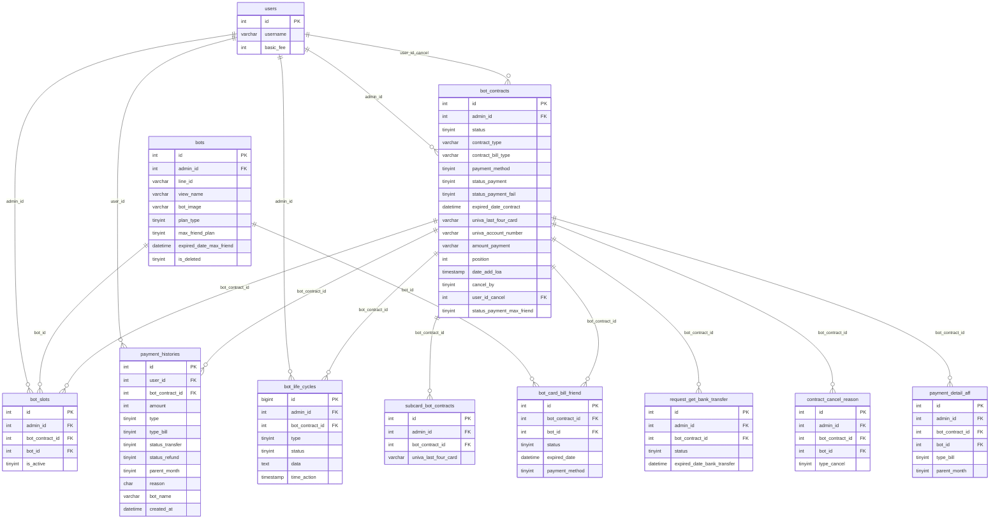

# FA-031: Hợp đồng và Thanh toán (「契約プラン・決済情報」)

> **Trạng thái**: ĐẠT — sẵn sàng cho PM/tester/dev đọc  
> **Ngày compile**: 2026-06-05  
> **Nguồn dữ liệu**: ui-spec.md · api-spec.md · logic-spec.md · job-spec.md · db-mapping.md · validation-report.md

---

## 1. Tổng quan

### Mục đích

Tính năng FA-031 cho phép Admin (chủ tài khoản LME) quản lý toàn bộ vòng đời hợp đồng của các LINE Official Account (LOA) đang kết nối với hệ thống LME. Bao gồm: xem danh sách và chi tiết từng hợp đồng, theo dõi trạng thái thanh toán, tải lãnh thụ thư (領収書), xem lịch sử ngắt kết nối LOA, và phát hành báo giá cho khách hàng.

### Actors

| Actor | Vai trò | Phạm vi |
|-------|---------|---------|
| Admin | Chủ tài khoản LME | Xem và thao tác toàn bộ hợp đồng của mình |
| Staff | Nhân viên do Admin tạo | Xem được hợp đồng của bot được phân quyền (qua `pointSettings` permission) |
| System (Laravel Jobs) | Tự động | Charge thẻ, gia hạn, hủy hợp đồng tự động |

### Phạm vi

- Portal: Admin Portal (`/basic/`, `/admin/`)
- Không bao gồm: tạo hợp đồng mới, thay đổi thẻ thanh toán (endpoint chưa phân tích đầy đủ — xem mục 9)
- Giao diện nhóm menu: 「契約関連」 trong Sidebar Admin

### Danh sách màn hình

| Mã | Tên màn hình | URL | Mô tả |
|----|-------------|-----|-------|
| SCR-BLP-01 | Danh sách hợp đồng | `/basic/point-settings` | Màn hình chính — danh sách tất cả LOA và trạng thái hợp đồng |
| SCR-BLP-02 | Chi tiết hợp đồng | `/basic/detail-contract/{id}` | Chi tiết một hợp đồng + lịch sử hoạt động |
| SCR-BLP-03 | Lịch sử thanh toán / Lãnh thụ thư | `/basic/payment-history` | Xem và tải lãnh thụ thư theo năm/tháng |
| SCR-BLP-04 | Lịch sử ngắt kết nối LOA | `/basic/disconnect-history` | Log ngắt kết nối LOA khỏi hệ thống |
| SCR-BLP-05 | Phát hành báo giá | `/admin/plan-estimation` | Tính phí và tạo file PDF báo giá |

### API Endpoints tóm tắt

| # | Method | URL | Màn hình | Mô tả |
|---|--------|-----|---------|-------|
| EP-01 | GET | `/basic/point-settings` | SCR-BLP-01 | Render trang danh sách |
| EP-02 | POST | `/ajax/point-settings/get-data-contract` | SCR-BLP-01 | Lấy dữ liệu danh sách hợp đồng (AJAX) |
| EP-03 | GET | `/basic/payment-history` | SCR-BLP-03 | Render trang lãnh thụ thư |
| EP-04 | GET | `/ajax/payment-history` | SCR-BLP-03 | Lấy dữ liệu thanh toán theo năm/tháng/ngày |
| EP-05 | GET | `/basic/disconnect-history` | SCR-BLP-04 | Render trang lịch sử ngắt kết nối |
| EP-06 | GET | `/ajax/bot-life-cycle` | SCR-BLP-04 | Lấy dữ liệu lịch sử sự kiện LOA |
| EP-07 | GET | `/basic/detail-contract/{id}` | SCR-BLP-02 | Render trang chi tiết hợp đồng |
| EP-08 | GET | `/admin/plan-estimation` | SCR-BLP-05 | Render trang báo giá (có thể có params) |
| EP-09 | POST | `/ajax/point-settings/save-contract-position` | SCR-BLP-01 | Lưu thứ tự drag & drop hợp đồng |
| EP-10 | POST | `/ajax/point-settings/cancel-univa-charge/{id}/{type?}` | SCR-BLP-01/02 | Hủy chuyển khoản đang pending |
| EP-11 | POST | `/ajax/point-settings/payment-history` | SCR-BLP-03 | Lấy lịch sử thanh toán (API cũ — song song với EP-04) |
| EP-12 | GET | `/basic/detail-contract/{id}/cancel` | Phụ SCR-BLP-02 | Trang xác nhận hủy hợp đồng |

---

## 2. Màn hình và Luồng xử lý End-to-End

### SCR-BLP-01: Danh sách hợp đồng

**URL**: `/basic/point-settings`  
**Tiêu đề trang**: 「契約情報・領収書」  
**Controller**: `V2\Bill\ListPageController@indexView`

#### Giao diện

```
[Sidebar — nhóm 契約関連]
  [Header: 契約情報・領収書]
  [Button: ご契約に関する注意事項] [Button: 接続解除履歴] [Button: 領収書の発行]
  [Banner thông báo — hiện theo điều kiện]
  [Bộ lọc: Checkbox 契約中 | Checkbox 解約済み | Textbox tìm kiếm]
  [Bảng danh sách hợp đồng — 8 cột]
  [Pagination: 100件/ページ]
```

#### Luồng tải dữ liệu

```
Người dùng mở trang
  → GET /basic/point-settings
  → V2\Bill\ListPageController@indexView
  → Lấy bot active, đếm free bots, trả về view HTML
  → JS tự động gọi POST /ajax/point-settings/get-data-contract
  → V2\Bill\ListPageController@getDataContract
  → Query: BotContracts JOIN bot_slots LEFT JOIN bots LEFT JOIN (subquery payment_histories lần gần nhất)
  → Phân loại thành 6 nhóm (xem Business Rules)
  → Trả về JSON → JS render bảng danh sách
```

#### Các cột bảng SCR-BLP-01

| Cột | Nhãn JP | Nguồn DB | Ghi chú |
|-----|---------|---------|--------|
| 1 | LINE公式アカウント名 | `bots.view_name`, `bots.line_id`, `bots.bot_image` | Join qua `bot_slots` |
| 2 | ご利用プラン | `bot_contracts.contract_type` + `contract_bill_type` | Enum: free/standard/pro/enterprise |
| 3 | ステータス | Computed từ `status` + `status_payment` + `payment_method` + `expired_date_contract` | Xem bảng status bên dưới |
| 4 | ご利用料金 / 振込情報 | `bot_contracts.amount_payment`, `expired_date_bank_transfer` | Tùy trạng thái |
| 5 | 決済方法 | `bot_contracts.payment_method` + `univa_last_four_card` | 1=card, 2=transfer |
| 6 | 次回決済(更新)日 | `bot_contracts.expired_date_contract` | — |
| 7 | LOA接続日 | `bot_contracts.date_add_loa` | — |
| 8 | 契約の変更・解約 | Conditional buttons | Tùy trạng thái |

#### Bảng Trạng thái hiển thị (Computed)

| Hiển thị UI (JP) | Điều kiện DB |
|-----------------|-------------|
| 正常 | `status=1 AND status_payment IN(0,1) AND expired > now` |
| 延滞中 | `status=1 AND (payment lỗi) AND expired_date_contract < now` |
| 入金待ち | `payment_method=2 AND status_payment NOT IN(1,2) AND univa_account_number IS NOT NULL` |
| 口座発行中 | `payment_method=2 AND status_payment=5 AND univa_account_number IS NULL` |
| 解約待ち | `status=2` |
| 解約済み | `status=3` |
| 強制解約 | `status=3 AND cancel_by=0` |

#### Nút Action theo trạng thái (Cột 8)

| Button JP | Hiển thị khi |
|----------|-------------|
| 「詳細を確認」 | Status là 延滞中 |
| 「契約詳細」 | Status là 正常, 解約待ち, 入金待ち |
| 「アカウントの操作」 | Status là 解約済み, 強制解約 |
| 「振込キャンセル」 | Status là 入金待ち (điều kiện cụ thể chưa xác nhận đầy đủ) |

#### Banner thông báo (theo điều kiện)

**Banner nâng cấp plan** (`アップグレードが必要です`):
- Hiển thị khi tổng bạn bè vượt 50,000 người
- Nội dung: 「総友だち数が50,000人を超えました。YYYY/MM/DDまでにプロプランへのアップグレードが必要です。」

**Banner lỗi thanh toán** (`決済エラー`):
- Hiển thị khi bot có lỗi thanh toán
- Có button 「詳細を確認」→ chuyển sang SCR-BLP-02
- Có thể hiển thị nhiều banner cùng lúc cho nhiều bot

#### Modal điều khoản hợp đồng (「ご契約に関する注意事項」)

Kích hoạt bởi button ở header. Nội dung chính:
- Thẻ tín dụng hiển thị là "L Message" / "エルメッセージ" trên sao kê
- Hủy hợp đồng bất cứ lúc nào — không hoàn tiền theo ngày
- Không thể downgrade từ plan trả phí
- Hợp đồng tự động gia hạn (kể cả 年間一括払い)
- Thanh toán qua hệ thống của 株式会社ユニヴァ・ペイキャスト
- Chuyển khoản vào tài khoản mang tên 「ｶ)ﾕﾆｳﾞｧﾍﾟｲｷｬｽﾄ」

---

### SCR-BLP-02: Chi tiết hợp đồng

**URL**: `/basic/detail-contract/{id}` (ví dụ: `/basic/detail-contract/1283`)  
**Breadcrumb**: 契約情報・領収書 > 契約詳細  
**Controller**: `Basic\UserController@detailContract`

#### Luồng tải dữ liệu

```
Người dùng click 「契約詳細」 từ SCR-BLP-01
  → GET /basic/detail-contract/{id}
  → Basic\UserController@detailContract
  → authenticationBotContract($user, $id) — kiểm tra quyền
    → Nếu không có quyền: 404
  → Lấy SubcardBotContract theo bot_contract_id
  → Hash bot ID bằng Hashids
  → Nếu có user_id_cancel: lấy tên người hủy từ users
  → Render view basic.bill.detail
  → Trang load xong: JS gọi GET /ajax/bot-life-cycle?bot_contract_id={id}&per_page=100
    → Lấy lịch sử sự kiện từ bot_life_cycles
    → Render khu vực 操作履歴
```

#### Thông tin hợp đồng (Contract Info)

| Label JP | DB Table.Column | Ghi chú |
|---------|----------------|--------|
| (Tên bot + LINE ID) | `bots.view_name`, `bots.line_id` | Hiển thị đầu trang |
| ステータス | Computed (xem bảng status SCR-BLP-01) | Kèm deadline nếu đang lỗi |
| LINE公式アカウント接続日 | `bot_contracts.date_add_loa` | — |
| ご契約プラン | `bot_contracts.contract_type` | free/standard/pro/enterprise |
| お支払い開始日 | `bot_contracts.date_add_contract` | — |
| ご利用料金 | `bot_contracts.amount_payment` | String, cần parse |
| お支払い期間 | `bot_contracts.contract_bill_type` | month/year |
| 次回決済日 | `bot_contracts.expired_date_contract` | — |
| 決済方法 | `bot_contracts.payment_method` | 1=card, 2=transfer |
| メイン決済カード情報 | `bot_contracts.univa_last_four_card` | 4 số cuối, hiển thị `****-****-****-XXXX` |
| サブ決済カード情報 | `subcard_bot_contracts.univa_last_four_card` | Nếu có thẻ phụ |
| クーポンコード | Chưa xác định (xem mục 9) | Có button nhập coupon — endpoint chưa tìm được |
| 主管理者 | `users.username` (via `bot_contracts.admin_id`) | — |

#### Nút hành động trên trang chi tiết

| Button JP | Hành vi | Hiển thị khi |
|----------|---------|-------------|
| 「次回決済から年払いに変更する」 | Thay đổi chu kỳ thanh toán sang năm | Đang ở chu kỳ 毎月払い |
| 「メインカード情報を変更する」 | Mở form/modal thay đổi thẻ chính | Luôn hiển thị nếu có thẻ |
| 「サブカード情報を変更する」 | Mở form/modal thay đổi thẻ phụ | Khi có thẻ phụ |
| 「カード情報を削除」 | Xóa thẻ phụ | Khi có thẻ phụ |
| 「クーポンコードを入力する」 | Mở input nhập coupon | Luôn hiển thị |
| 「主管理者を変更する」 | Mở form/modal đổi admin chính | Luôn hiển thị |
| 「有料プラン解約へ進む」 | Bắt đầu luồng hủy plan trả phí → EP-12 | Trong section 解約する |
| 「接続解除へ進む」 | Bắt đầu luồng ngắt kết nối LOA | Trong section 接続解除 |
| 「戻る」 | Quay lại SCR-BLP-01 | Footer |

**Lưu ý section 解約する**: Text hướng dẫn: 「有料プランを解約できます。ダウングレードはできません」  
**Lưu ý section 接続解除**: Cảnh báo: 「接続を解除すると、エルメ上のデータが全て消去されます」

#### Khu vực Lịch sử hoạt động (操作履歴)

**Nguồn dữ liệu**: bảng `bot_life_cycles` — lọc theo `bot_contract_id`

**Bộ lọc**:
- Button「全件表示」
- Date picker「開始日」và「終了日」
- Filter theo loại sự kiện: …開始 / …決済 / …変更 / …解約・エラー

**Các loại sự kiện (type) quan sát được trong production**:

| Tên sự kiện JP | Type | Nhóm |
|---------------|------|------|
| 決済エラー | 20 | CANCELED |
| クーポンコードの適用 | (chưa xác định type) | CHANGED |
| プロプラン 更新（毎月） | 7 | PAYMENT |
| メインクレジットカード変更 | 11 | CHANGED |
| サブクレジットカード変更 | 13 | CHANGED |
| サブクレジットカード登録 | 12 | CHANGED |
| 支払い期間変更申し込み(年間一括 → 毎月) | 23 | CHANGED |
| 支払い期間変更申し込み(毎月 → 年間一括) | 15 | CHANGED |

---

### SCR-BLP-03: Lịch sử thanh toán / Lãnh thụ thư

**URL**: `/basic/payment-history`  
**Tiêu đề**: 「決済履歴・領収書のダウンロード」  
**Controller**: `Basic\UserController@paymentHistories`

#### Luồng tải dữ liệu

```
Người dùng mở trang
  → GET /basic/payment-history
  → Render view với biến user
  → JS gọi GET /ajax/payment-history?year={currentYear}&type=1
    → Basic\UserController@ajaxPaymentHistories (type=1)
    → GROUP BY tháng, SUM amount
    → Trả về {year-month: total_amount} cho panel trái

Người dùng click 「詳細を確認 >」của một tháng
  → GET /ajax/payment-history?year={year}&month={month}&type=2&per_page=100&page=1&order[column]=created_at&order[dir]=DESC
    → Trả về danh sách payment_histories của tháng đó
    → Panel phải cập nhật bảng chi tiết

Người dùng click 「一括ダウンロード」
  → Tương tự type=2 nhưng thêm get_all=1 hoặc download_invoice=1
  → Tải file PDF lãnh thụ thư
```

#### Cấu trúc giao diện (2 panel)

**Panel trái — 年間決済一覧**:
- Navigation năm (prev/next)
- Bảng 12 tháng: Năm/tháng | ご請求額 | 「詳細を確認 >」

**Panel phải — Chi tiết tháng**:
- Header: tháng đang xem + 2 tab: 「一括発行」/ 「個別発行」
- Button 「一括ダウンロード」

| Cột | Nhãn JP | DB Column |
|-----|---------|---------|
| 1 | 契約(更新)日 | `payment_histories.payment_date` hoặc `created_at` (sortable) |
| 2 | LINE公式アカウント名 | `payment_histories.bot_name` (snapshot tại thời điểm TT) |
| 3 | 利用料 (税込) | `payment_histories.amount` |
| 4 | 契約プラン | Suy ra từ `payment_histories.reason` (xem mapping reason→plan) |
| 5 | 支払い | `payment_histories.type_bill` (1,2=card; 3=transfer) |
| 6 | 決済方法 | `payment_histories.type_bill` + 4 số cuối thẻ |
| 7 | 備考 | `payment_histories.reason_detail` |
| 8 | 課金ID | `payment_histories.univa_charge_id` |

**Điều kiện lọc bản ghi hợp lệ** (scope `typeBill`):
- Card: `type=1 AND type_bill IN(1,2)`
- Transfer: `status_transfer=1 AND type_bill=3`
- Không tính hoàn tiền: `status_refund=0`
- Year contract: chỉ lấy `parent_month=1` (bản ghi gốc, không lấy 12 bản ghi phân bổ)

---

### SCR-BLP-04: Lịch sử ngắt kết nối LOA

**URL**: `/basic/disconnect-history`  
**Breadcrumb**: TOP > 接続解除履歴  
**Controller**: `V2\Bill\ListPageController@disconnectHistoryView`

#### Luồng tải dữ liệu

```
Người dùng mở trang
  → GET /basic/disconnect-history
  → Render view (không có biến đặc biệt)
  → JS gọi GET /ajax/bot-life-cycle?page=1&per_page=100&disconnect_account=true
    → Basic\UserController@botLifeCycles
    → Query bot_life_cycles WHERE type = 28 (DELETE_ACCOUNT)
    → Trả về danh sách sự kiện ngắt kết nối
```

#### Bảng lịch sử ngắt kết nối

| Cột | Nhãn JP | DB Source |
|-----|---------|---------|
| 1 | 接続解除日時 | `bot_life_cycles.time_action` |
| 2 | LINE公式アカウント名 | `bot_life_cycles.data->bot_name` + `data->bot_line_id` (JSON snapshot) |
| 3 | 操作したユーザー | `bot_life_cycles.data->operator_name` (JSON snapshot) |

**Cảnh báo hiển thị**: 「接続解除したLINE公式アカウントの復元はできません。」

---

### SCR-BLP-05: Phát hành báo giá

**URL**: `/admin/plan-estimation`  
**Tiêu đề**: 「見積書発行」  
**Controller**: `Admin\BotController@PlanEstimation`

#### Luồng xử lý

```
Người dùng mở trang (có thể có query params)
  → GET /admin/plan-estimation[?contract_type=pro&bill_type=year&bot_id=xxx&invoice_name=xxx]
  → Admin\BotController@PlanEstimation
  → Lấy danh sách bot free (listBotFree) để hiển thị trong dropdown
  → Nếu có bot_id: lấy thông tin bot và hợp đồng hiện tại
  → Lấy basic_fee từ admin id=1
  → Render view admin.plan_estimate.plan_estimation

Người dùng điền form và click 「料金を計算」
  → Tính phí phía server (hoặc JS) theo plan × bill_type × số slot
  → Hiển thị 「お支払い金額（税込）」

Người dùng click 「見積書をダウンロード」
  → Generate PDF báo giá và tải xuống
```

#### Form 4 bước

| Bước | Label JP | Loại input | Ghi chú |
|------|---------|-----------|--------|
| ① | 宛名を入力 | Textbox + combobox kính ngữ | Giá trị kính ngữ chưa xác định |
| ② | お申し込み予定プランを選択 | Dropdown | Các plan option chưa quan sát được |
| ③ | 決済期間を選択 | Radio: 毎月払い / 年間一括払い | Mặc định: 毎月払い |
| ④ | 接続枠数を選択 | Spinbutton số | Mặc định: 1 |

**Lưu ý kỹ thuật**: Màn hình này chỉ đọc dữ liệu để tính toán và tạo PDF. Không có INSERT/UPDATE DB khi xem báo giá.

---

## 3. Data Model

### Entities chính

| Bảng | Vai trò | Data size |
|------|---------|---------|
| `bot_contracts` | Bảng trung tâm — lưu hợp đồng (52 cột) | 306KB |
| `bot_life_cycles` | Log lịch sử mọi sự kiện hợp đồng | 1.1MB |
| `payment_histories` | Ghi nhận từng giao dịch thanh toán | 18.0MB |
| `bot_slots` | Liên kết contract ↔ bot (N:N trung gian) | 68KB |
| `bots` | Thông tin LINE OA Bot | 440KB |
| `subcard_bot_contracts` | Thẻ thanh toán phụ | 8KB |
| `bot_card_bill_friend` | Queue charge phí max friend | 4KB |
| `request_get_bank_transfer` | Queue recover thông tin ngân hàng | 706B |
| `contract_cancel_reason` | Lưu lý do hủy hợp đồng | 96KB |
| `payment_detail_aff` | Chi tiết affiliate commission | 3.6MB |

**Lưu ý quan trọng**: Hệ thống **không có bảng plans/pricing riêng**. Giá cả được tính toán từ config (`sns-line.plan_pro_fee`) và hàm helper `calculateSaleEnterprise()`.

### ER Diagram



---

## 4. Field Traceability Matrix

| # | UI Element | Màn hình | DB Table.Column | Hướng | Confidence | Business Rule |
|---|-----------|---------|----------------|-------|-----------|--------------|
| 1 | LINE公式アカウント名 | SCR-BLP-01 | `bots.view_name` | Read | Cao | Join qua `bot_slots` |
| 2 | LINE ID (@xxx) | SCR-BLP-01 | `bots.line_id` | Read | Cao | Join qua `bot_slots` |
| 3 | Ảnh đại diện | SCR-BLP-01 | `bots.bot_image` | Read | Cao | URL ảnh |
| 4 | ご利用プラン | SCR-BLP-01 | `bot_contracts.contract_type` | Read | Cao | Enum: free/standard/pro/enterprise |
| 5 | Chu kỳ thanh toán | SCR-BLP-01 | `bot_contracts.contract_bill_type` | Read | Cao | Enum: month/year |
| 6 | ステータス | SCR-BLP-01 | Computed (4 cột) | Read | Cao | Xem bảng trạng thái computed |
| 7 | ご利用料金 | SCR-BLP-01 | `bot_contracts.amount_payment` | Read | Cao | String — cần parse |
| 8 | 決済方法 | SCR-BLP-01 | `bot_contracts.payment_method` | Read | Cao | 1=card, 2=transfer |
| 9 | 次回決済(更新)日 | SCR-BLP-01 | `bot_contracts.expired_date_contract` | Read | Cao | — |
| 10 | LOA接続日 | SCR-BLP-01 | `bot_contracts.date_add_loa` | Read | Cao | — |
| 11 | 振込期限 | SCR-BLP-01 | `bot_contracts.expired_date_bank_transfer` | Read | Cao | Chỉ khi payment_method=2 |
| 12 | Vị trí card (drag&drop) | SCR-BLP-01 | `bot_contracts.position` | Read/Write | Cao | EP-09 update |
| 13 | ステータス | SCR-BLP-02 | `bot_contracts.status` + computed | Read | Cao | — |
| 14 | LINE公式アカウント接続日 | SCR-BLP-02 | `bot_contracts.date_add_loa` | Read | Cao | — |
| 15 | ご契約プラン | SCR-BLP-02 | `bot_contracts.contract_type` | Read | Cao | — |
| 16 | お支払い開始日 | SCR-BLP-02 | `bot_contracts.date_add_contract` | Read | Cao | — |
| 17 | ご利用料金 | SCR-BLP-02 | `bot_contracts.amount_payment` | Read | Cao | — |
| 18 | お支払い期間 | SCR-BLP-02 | `bot_contracts.contract_bill_type` | Read | Cao | — |
| 19 | 次回決済日 | SCR-BLP-02 | `bot_contracts.expired_date_contract` | Read | Cao | — |
| 20 | 決済方法 | SCR-BLP-02 | `bot_contracts.payment_method` | Read | Cao | — |
| 21 | メイン決済カード情報 | SCR-BLP-02 | `bot_contracts.univa_last_four_card` | Read | Cao | Hiển thị `****-XXXX` |
| 22 | サブ決済カード情報 | SCR-BLP-02 | `subcard_bot_contracts.univa_last_four_card` | Read | Cao | — |
| 23 | クーポンコード | SCR-BLP-02 | Chưa xác định | Read/Write | Thấp | Xem Gaps mục 9 |
| 24 | 主管理者 | SCR-BLP-02 | `users.username` (via `bot_contracts.admin_id`) | Read | Cao | — |
| 25 | Tên sự kiện log | SCR-BLP-02 | `bot_life_cycles.type` → title (appended) | Read | Cao | 28 loại type |
| 26 | Thời điểm log | SCR-BLP-02 | `bot_life_cycles.time_action` | Read | Cao | — |
| 27 | Tổng tiền theo tháng | SCR-BLP-03 | `SUM(payment_histories.amount)` GROUP BY tháng | Read | Cao | Chỉ type=1, status_refund=0 |
| 28 | 契約(更新)日 | SCR-BLP-03 | `payment_histories.payment_date` hoặc `created_at` | Read | Trung bình | `payment_date` có thể NULL |
| 29 | 利用料 (税込) | SCR-BLP-03 | `payment_histories.amount` | Read | Cao | — |
| 30 | 契約プラン | SCR-BLP-03 | `payment_histories.reason` → plan name | Read | Cao | Dùng reason mapping |
| 31 | 支払い | SCR-BLP-03 | `payment_histories.type_bill` | Read | Cao | 1,2=card; 3=transfer |
| 32 | 課金ID (UUID) | SCR-BLP-03 | `payment_histories.univa_charge_id` | Read | Cao | — |
| 33 | 接続解除日時 | SCR-BLP-04 | `bot_life_cycles.time_action` | Read | Cao | Filter type=28 |
| 34 | LINE OA name (lịch sử ngắt) | SCR-BLP-04 | `bot_life_cycles.data->bot_name` (JSON) | Read | Cao | Snapshot tại thời điểm ngắt |
| 35 | 操作したユーザー | SCR-BLP-04 | `bot_life_cycles.data->operator_name` (JSON) | Read | Cao | — |
| 36 | Danh sách bot free | SCR-BLP-05 | `bots.view_name`, `bots.line_id` | Read | Cao | Filter plan_type=2, is_deleted=0 |

---

## 5. Business Rules

### BR-01: Phân loại hợp đồng thành 6 nhóm

Khi lấy dữ liệu EP-02, hệ thống phân loại tất cả hợp đồng thành 6 nhóm để render các khu vực khác nhau trên trang:

| Nhóm (key JSON) | Điều kiện | Mô tả |
|----------------|-----------|-------|
| `cancelDataContract` | `status == 3` (CANCEL) | Hợp đồng đã hủy hoàn toàn |
| `overdueDataContract` | Payment lỗi (`status_bill_card` hoặc `status_bill_transfer`) VÀ `expired_date_contract < now` | Quá hạn thanh toán |
| `transferDataContract` | `payment_method==2` VÀ `status_payment NOT IN(1,2)` HOẶC `status_payment_max_friend==0` | Đang chờ xác nhận chuyển khoản |
| `data` (otherDataContract) | Các hợp đồng bình thường còn lại | Hoạt động bình thường |
| `maxFriendDataContract` | Clone của item có `max_friend_plan==1` | Item phụ plan tính phí theo số bạn bè |
| `maxFriendErrorDataContract` | Clone của item có `max_friend_plan==3` | Item phụ max friend có lỗi |

**Điều kiện thanh toán lỗi**:
- `status_bill_card` = `payment_method==1 AND status_payment==2 AND status_payment_fail < 5`
- `status_bill_transfer` = `payment_method==2 AND (status_payment==5 OR status_payment==2) AND status_payment_fail < 5`

**Thứ tự query**: `ORDER BY position DESC, date_cancel_contract DESC, id DESC`

### BR-02: Quy tắc max_friend_plan

Mỗi hợp đồng có thể có thêm khoản phí bổ sung nếu số bạn bè vượt 100,000 người:

| `bots.max_friend_plan` | Ý nghĩa | Set bởi |
|----------------------|---------|---------|
| `0` | Không tính phí theo bạn bè | Web app |
| `1` | Đang có plan max friend, hoạt động bình thường | Web app |
| `2` | Free — đã hủy charge nhưng vẫn còn hiệu lực | cancelTransfer hoặc web app |
| `3` | Lỗi charge max friend | Job `HandleBillMaxFriend` khi thất bại |

Khi `max_friend_plan IN(1,3)`, mỗi hợp đồng được clone thêm 1 "item phụ" hiển thị trong danh sách với `contract_max_friend=1`. Phí tính bằng `calculateBillMaxFriend(totalFriend)` × 12 nếu year contract.

### BR-03: Retry schedule khi thanh toán thất bại

| `status_payment_fail` | Hành động | Mail gửi cho user |
|----------------------|-----------|-----------------|
| 0 | Không có lỗi | — |
| 1 | Retry ngay hôm đó (23:59:59) | Có — 「L Messageの決済失敗のお知らせ」 |
| 2 | Retry sau +2 ngày | — |
| 3 | Retry sau +5 ngày | — |
| 4 | Retry sau +6 ngày | Có — 「エルメ機能停止前日のご連絡」 |
| 5 | Force cancel: set `status=3`, hide richmenu, dừng hoàn toàn | Có — 「エルメ機能停止のご連絡」 |

### BR-04: Quy tắc tính phí

- Phí cơ bản lấy từ `users.basic_fee` của admin id=1 (admin hệ thống)
- Plan Pro fee lấy từ config `sns-line.plan_pro_fee`
- Enterprise fee tính bằng `calculateSaleEnterprise($basicFee, $contract_type, $contract_bill_type, $number_slot)`
- Year contract: tổng phí được tạo 1 bản ghi cha + 12 bản ghi phân bổ tháng trong `payment_histories`
- Không có bảng plans/pricing riêng — giá hardcode trong config và helper functions

### BR-05: Quy tắc hủy chuyển khoản (振込キャンセル)

Khi hủy chuyển khoản pending (EP-10), hệ thống cố gắng khôi phục hợp đồng về trạng thái trước đó dựa trên `reason` trong `PaymentHistories`:

| Reason gốc | Hành động khôi phục |
|-----------|-------------------|
| Upgrade từ free (`upgradeFromFree`) | Về lại free plan, `contract_bill_type=month`, `payment_method=card` |
| Upgrade từ standard (`upgradeFromStandard`) | Về lại standard plan |
| Gia hạn (`extendContract`) | Khôi phục `expired_date_contract` về giá trị trước |
| Mặc định | Hủy hoàn toàn (`status=3`) |

### BR-06: Quy tắc lọc payment history hợp lệ

Chỉ hiển thị bản ghi thỏa mãn:
- **Card**: `type=1 AND type_bill IN(1,2)`
- **Transfer**: `status_transfer=1 AND type_bill=3`
- **Không hoàn tiền**: `status_refund=0`
- **Year contract**: chỉ lấy `parent_month=1` (bản ghi gốc)
- **Điều kiện thêm**: `remain_day < 365 OR (remain_day >= 365 AND parent_month = 1)`

### BR-07: Phân quyền truy cập

- `basic_access` middleware: kiểm tra role 0/1/2/-1
- Staff chỉ thấy hợp đồng của các bot họ được phân quyền qua `getListBotIdStaffManagement($userId, 'pointSettings')`
- `authenticationBotContract()`: kiểm tra từng hợp đồng cụ thể khi vào SCR-BLP-02 — throw 404 nếu không có quyền

---

## 6. API Endpoints

### Danh sách đầy đủ 12 endpoints

| # | Method | URL | Controller@Method | Màn hình | Confidence |
|---|--------|-----|------------------|---------|-----------|
| EP-01 | GET | `/basic/point-settings` | `V2\Bill\ListPageController@indexView` | SCR-BLP-01 | Cao |
| EP-02 | POST | `/ajax/point-settings/get-data-contract` | `V2\Bill\ListPageController@getDataContract` | SCR-BLP-01 | Cao |
| EP-03 | GET | `/basic/payment-history` | `Basic\UserController@paymentHistories` | SCR-BLP-03 | Cao |
| EP-04 | GET | `/ajax/payment-history` | `Basic\UserController@ajaxPaymentHistories` | SCR-BLP-03 | Cao |
| EP-05 | GET | `/basic/disconnect-history` | `V2\Bill\ListPageController@disconnectHistoryView` | SCR-BLP-04 | Cao |
| EP-06 | GET | `/ajax/bot-life-cycle` | `Basic\UserController@botLifeCycles` | SCR-BLP-04 | Cao |
| EP-07 | GET | `/basic/detail-contract/{id}` | `Basic\UserController@detailContract` | SCR-BLP-02 | Cao |
| EP-08 | GET | `/admin/plan-estimation` | `Admin\BotController@PlanEstimation` | SCR-BLP-05 | Cao |
| EP-09 | POST | `/ajax/point-settings/save-contract-position` | `V2\Bill\ListPageController@saveContractPosition` | SCR-BLP-01 | Cao |
| EP-10 | POST | `/ajax/point-settings/cancel-univa-charge/{id}/{type?}` | `V2\Bill\ListPageController@cancelTransfer` | SCR-BLP-01/02 | Cao |
| EP-11 | POST | `/ajax/point-settings/payment-history` | `PointSettingController@initDataHistoryPayment` | SCR-BLP-03 | Cao (API cũ) |
| EP-12 | GET | `/basic/detail-contract/{id}/cancel` | `V2\Bill\ListPageController@confirmCancelView` | Phụ SCR-BLP-02 | Cao |

### Middleware

| Middleware | Áp dụng cho | Mô tả |
|-----------|-----------|-------|
| `basic_access` | EP-01, EP-03, EP-05, EP-07 | Kiểm tra đăng nhập + quyền truy cập trang |
| `admin_access` | EP-08 | Chỉ Admin (không phải Staff) |
| `check_login` | EP-02, EP-04, EP-06, EP-09, EP-10, EP-11 | Xác thực đăng nhập AJAX |
| `check_remember_token` | Tất cả | Xác thực remember token |

### Ghi chú về endpoints thiếu phân tích (Gaps — xem mục 9)

Các button sau trong SCR-BLP-02 **chưa tìm thấy** endpoint tương ứng:
- 「メインカード情報を変更する」— thay đổi thẻ chính
- 「サブカード情報を変更する」/ 「カード情報を削除」— thẻ phụ
- 「クーポンコードを入力する」— nhập coupon
- 「主管理者を変更する」— đổi admin chính
- POST xác nhận hủy hợp đồng (EP-12 chỉ có GET)

---

## 7. Background Jobs (Laravel Artisan Commands)

> **Quan trọng**: Tất cả billing jobs của FA-031 là **Laravel Artisan Console Commands** chạy theo cron schedule, được định nghĩa trong `app/Console/Kernel.php`. **KHÔNG phải Spring Boot**. Spring Boot chỉ xử lý tin nhắn (broadcast, scenario, event, richmenu...).

### Danh sách Commands

| Command Class | Signature | Lịch chạy | Mô tả |
|--------------|-----------|-----------|-------|
| `AutoPaymentJobUnivapay` | `job:check_auto_payment_univapay` | Hàng ngày **06:30** | Job chính — 5 phases |
| `HandleBillMaxFriend` | `handle:bill_max_friend` | Hàng ngày **06:00** | Charge phí >100k bạn bè |
| `CheckStatusWebhook` | `univapay:check_status_webhook` | Hàng ngày **01:00** | Kiểm tra webhook Univapay |
| `RecoverUpdateInfoUnivapay` | `recover:RecoverUpdateInfoUnivapay` | Mỗi **5 phút** | Recover thông tin ngân hàng pending |
| `AutoPaymentJob` | `job:check_auto_payment` | **Đã comment — không chạy** | Legacy Stripe — deprecated |

### AutoPaymentJobUnivapay — 5 Phases (chạy lúc 06:30 hàng ngày)

```
handle()
  ├── Phase 1: Charge bằng Stripe (legacy)
  │     → BotContracts::getBotNeedChargeByStripe()
  │     → StripePayment::autoPaymentIntents(...)
  │     → Nếu thất bại lần 5: force cancel + hide richmenu
  │
  ├── Phase 2: Gia hạn free plan hết hạn
  │     → BotRepository::getBotExpiredFreePlan()
  │     → UPDATE bots.expired_date_free_plan + bot_contracts.expired_date_contract
  │     → INSERT payment_detail_aff (amount=0) nếu có affiliate
  │
  ├── Phase 3: Charge thẻ Univapay Card
  │     → BotContracts::getBotNeedChargeByUnivapayCard()
  │     → UnivapayPayment::chargeMoneyUnivapayJob(...)
  │     → Fallback: SubcardBotContract → charge thẻ phụ
  │     → Nếu thành công: INSERT payment_histories (type=1), UPDATE expired_date_contract
  │     → Nếu thất bại lần 5: force cancel + hide richmenu
  │
  ├── Phase 4: Tạo charge chuyển khoản Univapay Transfer
  │     → BotContracts::getBotNeedChargeByUnivapayTransfer() (trước 30 ngày)
  │     → UnivapayPayment::createTokenTransferJob(...)
  │     → UnivapayPayment::chargeMoneyUnivapayJobBankTransfer(...)
  │     → UPDATE bot_contracts: status_payment=5, thông tin ngân hàng
  │     → INSERT/UPDATE request_get_bank_transfer (status=0)
  │
  └── Phase 5: Hủy hợp đồng + Dọn dẹp
        → BotContracts::getBotNeedCancel()
        → UPDATE status=3, date_cancel_contract=now
        → UPDATE rich_menus (status_line=0) — ẩn tất cả richmenu
        → clearDataCancelContract($botId)
        → Nếu không còn bot_slot: DELETE bot_slots + DELETE bot_contracts
        → INSERT bot_life_cycles (type=21 FORCE_CANCEL hoặc 19 CANCELED)
```

### HandleBillMaxFriend (chạy lúc 06:00 hàng ngày)

- Điều kiện kích hoạt: `bot_card_bill_friend.status IN(0,2) AND expired_date <= now AND totalFriend > 100,000`
- Charge thẻ Univapay: `UnivapayPayment::chargeMoneyUnivapayJob()`
- Fallback: charge thẻ phụ (`SubcardBotContract`)
- Nếu thất bại: `bots.max_friend_plan = 3`, `bot_contracts.status_payment_max_friend = 3`
- Nếu thành công: INSERT `payment_histories` với `reason = 'payment_max_friend_100000_{totalFriend}'`
- Ghi log `BotLifeCycle` type `BILL_FRIEND_USE (6)`

### CheckStatusWebhook (chạy lúc 01:00 hàng ngày)

- Kiểm tra webhook Univapay cho tất cả bot có `univapay_app_id` và `univapay_webhook_id`
- Xác minh URL webhook, `active=true`, trigger `charge_finished`
- Nếu sai cấu hình: gọi `UnivapayPayment::updateWebhook()` để sửa
- Notify Chatwork nếu lỗi

### RecoverUpdateInfoUnivapay (chạy mỗi 5 phút)

- Xử lý `request_get_bank_transfer WHERE status=0` (chưa lấy được thông tin NH)
- Tìm `bot_contracts` có `univa_account_number IS NULL`
- Gọi `UnivapayPayment::getInfoTokenJob()` để lấy thông tin từ Univapay
- Nếu có số tài khoản: UPDATE `bot_contracts` + gửi mail `SendMailUpdateAccountNumber` cho admin

### Ghi chú kỹ thuật quan trọng

**Phát hiện trùng thẻ — sleep để tránh rate limit**:
- Stripe: sleep 180 giây khi nhiều hợp đồng dùng cùng thẻ
- Univapay card: sleep 330 giây

**Year contract — phân bổ payment_histories**:
- Khi charge thành công: 1 bản ghi cha (`parent_month=1`) + 12 bản ghi con (`parent_month=0`)
- Mỗi bản ghi con = 1/12 tổng tiền, đại diện cho 1 tháng trong năm

**Side effect khi force cancel**:
- `UPDATE rich_menus SET status_line=0, status_link=2, is_updated=2` — ẩn toàn bộ richmenu của bot
- Gọi `clearDataCancelContract($botId)` — vô hiệu hóa dữ liệu liên quan đến bot

---

## 8. Phụ thuộc chéo (Cross-references)

### Shared Components đang sử dụng

Không phát hiện shared component nào được dùng chính thức trong tính năng này (chưa có trong `features/shared/registry.md`).

### Liên kết với Features khác

| Feature | Liên hệ | Mô tả |
|---------|---------|-------|
| FA-032 Add Bot Router (giả định) | Đầu vào | Khi kết nối LOA mới → tạo bot_contract, ghi `BotLifeCycle` type `CONNECT_BOT_FREE (1)` hoặc `CONNECT_WITH_PLAN (2)` |
| FA-039 Register Account (giả định) | Đầu vào | Tạo admin account → chuẩn bị cho hợp đồng đầu tiên |
| Tính năng Richmenu | Bị ảnh hưởng | Khi force cancel hợp đồng: richmenu của bot bị ẩn (`rich_menus.status_line=0`) |
| Tính năng Affiliate | Bị ảnh hưởng | Mỗi lần charge thành công: INSERT `payment_detail_aff` với commission |
| Tính năng Staff Management | Phân quyền | Staff chỉ xem hợp đồng của bot được phân quyền qua `pointSettings` permission |
| Tính năng Univapay Webhook | Infrastructure | Webhook `charge_finished` từ Univapay cập nhật trạng thái `bot_contracts.status_payment` |

---

## 9. Gaps và Unknowns

### Vấn đề Trung bình — cần điều tra thêm

**[M1] 4 button SCR-BLP-02 thiếu endpoints**

Các button sau hiển thị trong UI nhưng chưa tìm được endpoint tương ứng:

| Button JP | Trạng thái phân tích |
|----------|---------------------|
| 「メインカード情報を変更する」 | Endpoint POST chưa tìm thấy trong api-spec |
| 「サブカード情報を変更する」/「カード情報を削除」 | Endpoint POST chưa tìm thấy |
| 「クーポンコードを入力する」 | Endpoint POST chưa tìm thấy |
| 「主管理者を変更する」 | Endpoint POST chưa tìm thấy |
| POST xác nhận hủy hợp đồng | EP-12 chỉ có GET (confirm page); endpoint POST thực thi hủy chưa có |

**Đề xuất**: Grep source code với từ khóa `changeCard`, `coupon`, `changeAdmin`, `cancelContract` để tìm thêm endpoints.

**[M2] Coupon code — chưa xác định hoàn toàn**

- UI SCR-BLP-02: Có button 「クーポンコードを入力する」và log sự kiện 「クーポンコードの適用」trong production
- API Spec: Không tìm thấy endpoint xử lý coupon
- DB: Không tìm thấy cột `coupon_code` trong `bot_contracts` (52 cột), không tìm thấy bảng `coupons`
- Khả năng: Coupon lưu trong bảng riêng chưa được phân tích, hoặc là tính năng đang implement dở

### Vấn đề Nhẹ — ghi nhận, không blocking

| # | Vấn đề | Vị trí |
|---|--------|--------|
| N1 | Modal thay đổi thẻ chính/phụ — nội dung chưa quan sát được | ui-spec.md |
| N2 | Modal xác nhận hủy plan (有料プラン解約へ進む) — chưa quan sát | ui-spec.md |
| N3 | Modal xác nhận ngắt kết nối LOA — chưa quan sát | ui-spec.md |
| N4 | Form nhập coupon — chưa click vào button nên chưa quan sát | ui-spec.md |
| N5 | Giá trị combobox kính ngữ và dropdown plan tại SCR-BLP-05 — không visible từ snapshot | ui-spec.md |
| N6 | EP-12 `confirmCancelView` — chưa phân tích logic trong logic-spec | logic-spec.md |
| N7 | EP-11 (API cũ) — chưa xác nhận có còn được dùng song song hay không | api-spec.md |
| N8 | `strip_bots` table — được dùng bởi CheckStatusWebhook nhưng chưa có trong db-mapping | db-mapping.md |
| N9 | `rich_menus` bị UPDATE khi force cancel — side effect chưa documented đầy đủ trong db-mapping | db-mapping.md |
| N10 | `CancelContractService` — độ tin cậy Thấp, chưa đọc chi tiết | logic-spec.md |
| N11 | Điều kiện cụ thể hiển thị button「振込キャンセル」vs「契約詳細」khi status 入金待ち — cần xem code | logic-spec.md |

---

## 10. Chất lượng Spec

### Tổng kết đánh giá từ Validation Report

| Chiều đánh giá | Điểm | Ghi chú |
|---------------|------|--------|
| Độ đầy đủ UI Spec | 9/10 | Thiếu nội dung modal và một số action |
| Độ đầy đủ API Spec | 8/10 | Thiếu ~4 endpoints cho actions thay đổi thẻ/coupon/admin |
| Độ đầy đủ Logic Spec | 8/10 | Thiếu 2 controllers, CancelContractService chưa đầy đủ |
| Độ đầy đủ Job Spec | 9/10 | Rất đầy đủ và chính xác |
| Độ đầy đủ DB Mapping | 9/10 | Thiếu `strip_bots`, `rich_menus`, coupon table |
| Nhất quán Cross-spec | 8/10 | Enum nhất quán; coupon là vấn đề chính chưa resolve |
| **Tổng thể** | **ĐẠT** | Bao phủ đầy đủ các luồng chính |

### % Fields mapped

- SCR-BLP-01: ~95% fields xác định được DB source
- SCR-BLP-02: ~90% fields xác định được DB source (coupon, modal actions chưa xác định)
- SCR-BLP-03: ~95% fields xác định được DB source
- SCR-BLP-04: ~100% fields xác định được DB source
- SCR-BLP-05: ~80% (dropdown options chưa xác định)

### Confidence Distribution

| Mức độ | % trong spec |
|--------|------------|
| Cao (từ source code/DB schema trực tiếp) | ~80% |
| Trung bình (suy luận từ UI + code) | ~15% |
| Thấp (chỉ quan sát từ UI) | ~5% |

### Open Questions cho PM/Dev

1. **Coupon code**: Bảng DB lưu ở đâu? Endpoint xử lý là gì? Tính năng đã live hay đang develop?
2. **Thay đổi thẻ chính/phụ**: Endpoint thực sự là gì? Có dùng Univapay tokenization flow không?
3. **Đổi admin chính**: Endpoint xử lý ở controller nào? Logic phân quyền sau khi đổi ra sao?
4. **Hủy hợp đồng (POST)**: Endpoint POST sau EP-12 (GET confirm page) là gì? `CancelContractService` xử lý ra sao?
5. **EP-11 (API cũ)**: Có còn được dùng trong production không? Hay chỉ là legacy code chờ xóa?
6. **HandleBillStripe**: Scope chính xác là gì? Có hợp đồng LOA nào vẫn đang dùng Stripe không, hay toàn bộ đã migrate sang Univapay?
