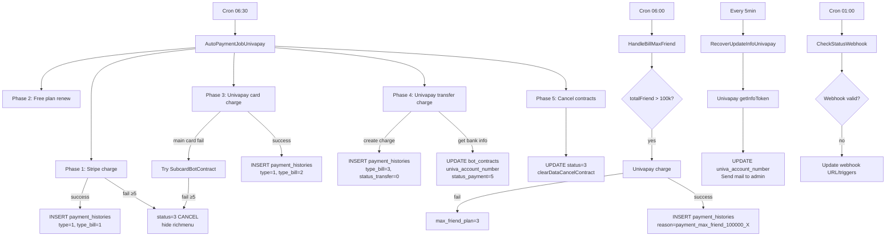

# Job Spec — FA-031: Hợp đồng và Thanh toán (Billing Plan)

## 1. Tổng quan

| Thuộc tính | Giá trị |
|-----------|---------|
| Mã tính năng | FA-031 |
| Kiến trúc job | Laravel Artisan Console Commands — KHÔNG phải Spring Boot |
| Scheduler | Laravel `App\Console\Kernel` — dùng `Schedule` của Laravel |
| Entry point | `app/Console/Kernel.php` — phương thức `schedule(Schedule $schedule)` |
| Log file | `job_crontab` (qua helper `customeCreateFileLog`) |
| Notify khi lỗi | `notifyChatwork(...)` |

> **Quan trọng**: Billing jobs của FA-031 được thực hiện bởi **Laravel Artisan Commands** chạy theo cron schedule, KHÔNG liên quan đến Spring Boot job service. Spring Boot chỉ xử lý các tác vụ tin nhắn (broadcast, scenario, event, richmenu...).

---

## 2. Danh sách Commands và Schedule

| Command Class | Signature | Lịch chạy | Mô tả |
|--------------|-----------|-----------|-------|
| `AutoPaymentJobUnivapay` | `job:check_auto_payment_univapay` | Hàng ngày lúc **06:30** | Job chính: charge thẻ Stripe + Univapay card + Univapay transfer + hủy hợp đồng |
| `HandleBillMaxFriend` | `handle:bill_max_friend` | Hàng ngày lúc **06:00** | Charge phí theo số bạn bè (>100k friends) |
| `HandleBillStripe` | `handle:bill_stripe` | Hàng ngày lúc **07:00** | Charge Stripe cho sản phẩm bán lẻ (cycle order) — không liên quan trực tiếp billing contract |
| `CheckStatusWebhook` | `univapay:check_status_webhook` | Hàng ngày lúc **01:00** | Kiểm tra và cập nhật trạng thái webhook Univapay |
| `RecoverUpdateInfoUnivapay` | `recover:RecoverUpdateInfoUnivapay` | Mỗi **5 phút** | Recover thông tin tài khoản ngân hàng cho chuyển khoản pending |
| `AutoPaymentJob` | `job:check_auto_payment` | **Đã comment** (không chạy) | Job cũ dùng Stripe — đã deprecated |
| `changeStatusBillFail` | `change:status_bill_fail` | Không có trong schedule | Utility thủ công — cập nhật trạng thái bill fail |

**File schedule**: `app/Console/Kernel.php`

---

## 3. Queue Tables (DB Tables được poll/xử lý)

| Table | Điều kiện query | Mô tả |
|-------|----------------|-------|
| `bot_contracts` | `status != 0` + điều kiện theo từng loại charge | Table chính — trạng thái hợp đồng |
| `bot_slots` | JOIN với `bot_contracts` | Liên kết contract ↔ bot |
| `payment_histories` | INSERT mới khi charge thành công/thất bại | Lưu lịch sử thanh toán |
| `bot_life_cycles` | INSERT via `BotLifeCycle::addState()` | Log sự kiện billing |
| `bot_card_bill_friend` | `status IN (0,2)` AND `expired_date <= now()` | Queue bill max friend |
| `request_get_bank_transfer` | `status = 0` | Queue lấy thông tin ngân hàng pending |
| `bots` | UPDATE khi charge | Đồng bộ `expired_date`, `status_bill_fail` |
| `payment_detail_aff` | INSERT khi charge thành công | Ghi nhận affiliate commission |
| `rich_menus` | UPDATE khi hủy contract | Ẩn richmenu khi contract bị force cancel |

---

## 4. Command: AutoPaymentJobUnivapay (Job Chính)

**File**: `app/Console/Commands/AutoPaymentJobUnivapay.php`  
**Signature**: `job:check_auto_payment_univapay`  
**Schedule**: Hàng ngày lúc **06:30**  
**Mức độ tin cậy**: **Cao** — đọc trực tiếp từ source code

### 4.1 Luồng xử lý (5 phase tuần tự)

```
handle()
  ├── Phase 1: Charge bằng Stripe (legacy)
  │     BotContracts::getBotNeedChargeByStripe()
  │     → StripePayment::autoPaymentIntents(...)
  │
  ├── Phase 2: Gia hạn free plan hết hạn
  │     BotRepository::getBotExpiredFreePlan()
  │     → UPDATE bots.expired_date_free_plan + bot_contracts.expired_date_contract
  │
  ├── Phase 3: Charge thẻ Univapay Card
  │     BotContracts::getBotNeedChargeByUnivapayCard()
  │     → UnivapayPayment::chargeMoneyUnivapayJob(...)
  │     → Fallback: SubcardBotContract → charge thẻ phụ
  │
  ├── Phase 4: Tạo charge chuyển khoản Univapay Transfer
  │     BotContracts::getBotNeedChargeByUnivapayTransfer()
  │     → UnivapayPayment::createTokenTransferJob(...)
  │     → UnivapayPayment::chargeMoneyUnivapayJobBankTransfer(...)
  │     → Trạng thái payment: 5 (chờ xác nhận chuyển khoản)
  │
  └── Phase 5: Hủy hợp đồng + Dọn dẹp
        BotContracts::getBotNeedCancel()
        → UPDATE status = 3 (CANCEL)
        → clearDataCancelContract($botId)
        → BotContracts::getListContractCanceled()
        → DELETE bot_slots + DELETE bot_contracts nếu không còn bot
```

### 4.2 Phase 1: Charge Stripe (Legacy)

**Điều kiện query** (`getBotNeedChargeByStripe()`):
- `payment_method = 1` VÀ `stripe_customer_id NOT NULL`
- Hợp đồng đã hết hạn (`expired_date_contract <= now`)
- `status_payment_fail` trong giới hạn retry

**Logic xử lý**:
1. Skip nếu `expired_date_contract > now` (chưa hết hạn)
2. Tính `nextExpireDate` theo `contract_bill_type` (month/year)
3. Gọi `StripePayment::autoPaymentIntents()` → PaymentIntent Stripe
4. **Nếu thất bại**: tăng `status_payment_fail` +1, tính `expired_retry_payment`, gửi mail thông báo
5. **Nếu thất bại lần 5**: set `status = 3` (CANCEL), hide richmenu, gọi `clearDataCancelContract()`
6. INSERT `payment_histories` (type=1 thành công, type=0 thất bại)

**Retry schedule** (tính từ `first_error_payment`):
| Lần thất bại | Retry sau |
|-------------|-----------|
| 1 | Ngay hôm đó (23:59:59) |
| 2 | +2 ngày |
| 3 | +5 ngày |
| 4 | +6 ngày |
| 5+ | Force cancel |

**Mail thông báo** (gửi ở lần thất bại 1, 4, 5):
| Lần | Subject |
|-----|---------|
| 1 | `L Messageの決済失敗のお知らせ` |
| 4 | `エルメ機能停止前日のご連絡` |
| 5 | `エルメ機能停止のご連絡` |

### 4.3 Phase 2: Gia hạn Free Plan

**Điều kiện**: Bot free plan đã hết `expired_date_free_plan`

**Logic**:
1. Tính `nextExpireDate` từ `expired_date_free_plan` hiện tại
2. UPDATE `bots.expired_date_free_plan = nextExpireDate`
3. UPDATE `bot_contracts.expired_date_contract = nextExpireDate`
4. INSERT `payment_detail_aff` (amount=0) nếu user có affiliate

### 4.4 Phase 3: Charge Thẻ Univapay Card

**Điều kiện query** (`getBotNeedChargeByUnivapayCard()`):
- `payment_method = 1` VÀ `univa_customer_id NOT NULL` VÀ `stripe_customer_id IS NULL`
- Hợp đồng đã hết hạn
- `status_payment_fail` trong giới hạn retry

**Logic charge**:
1. Tính `amount` bằng `calculateSaleEnterprise($basicFee, $contract_type, $contract_bill_type, $number_slot)`
2. Phát hiện trùng last4 card → sleep 330 giây (tránh rate limit)
3. Gọi `UnivapayPayment::chargeMoneyUnivapayJob($payment_method, $token, $amount, $univa_customer_id, $metadata, true)`
4. **Nếu thất bại**: fallback charge thẻ phụ (`SubcardBotContract`)
5. **Nếu vẫn thất bại**: tăng `status_payment_fail`, retry schedule tương tự Stripe
6. **Nếu thất bại lần 5**: force cancel, hide richmenu
7. **Nếu thành công**: UPDATE `bot_contracts.status_payment = 1`, `expired_date_contract = nextExpireDate`

**Payload metadata gửi lên Univapay**:
```json
{
  "botContractId": "<id>",
  "actionBill": "bill_job"
}
```

**Reason trong `payment_histories`** (theo plan × bill_type):
| Contract type | Bill type | Reason |
|--------------|-----------|--------|
| standard | month | `standard_month` |
| standard | year | `standard_year` |
| enterprise | month | `enterprise_month` |
| enterprise | year | `enterprise_year` |
| enterprise_pro | month | `enterprise_pro_month` |
| enterprise_pro | year | `enterprise_pro_year` |
| pro | month | `pro_month` |
| pro | year | `pro_year` |

### 4.5 Phase 4: Tạo Charge Chuyển Khoản Univapay Transfer

**Điều kiện query** (`getBotNeedChargeByUnivapayTransfer()`):
- `payment_method = 2` (chuyển khoản)
- `expired_date_contract <= now + 30 ngày` (báo trước 30 ngày)

**Logic**:
1. Gọi `UnivapayPayment::createTokenTransferJob($univa_customer_id, $email)` → tạo transfer token
2. Gọi `UnivapayPayment::chargeMoneyUnivapayJobBankTransfer(...)` → tạo charge chuyển khoản
3. Gọi `UnivapayPayment::getInfoTokenJob(...)` → lấy thông tin ngân hàng (bank name, branch, account number...)
4. UPDATE `bot_contracts`:
   - `status_payment = 5` (chờ chuyển khoản)
   - `univa_bank_name`, `univa_account_number`, `univa_branch_name`, `univa_bank_branch_code`, `univa_bank_account_holder_name`
   - `expired_date_bank_transfer = now + 30 + 7 ngày` (env: `UNIVAPAY_EXPIRED_TRANSFER`)
5. INSERT/UPDATE `request_get_bank_transfer` (status=0 nếu chưa có account_number, 1 nếu đã có)

**Payload metadata**:
```json
{
  "botContractId": "<id>",
  "actionBill": "bill_job_transfer",
  "operator_id": "<admin_id>"
}
```

**Reason trong `payment_histories`** (theo plan × bill_type):
| Contract type | Bill type | Reason |
|--------------|-----------|--------|
| standard | month | `standard_month_transfer` |
| standard | year | `standard_year_transfer` |
| enterprise | month | `enterprise_month_transfer` |
| enterprise | year | `enterprise_year_transfer` |
| pro | month | `pro_month_transfer` |
| pro | year | `pro_year_transfer` |

### 4.6 Phase 5: Hủy Hợp Đồng

**Điều kiện query** (`getBotNeedCancel()`):
- Hợp đồng `status = WAITING_CANCEL (2)` VÀ đã qua `expired_date_contract`
- Hợp đồng có payment lỗi (>5 lần) VÀ quá hạn

**Logic**:
1. Xác định `cancelBy`:
   - `status == WAITING_CANCEL` → `CANCEL_BY_USER (1)`
   - Còn lại → `CANCEL_BY_JOBS (0)`
2. UPDATE `bot_contracts.status = 3`, `date_cancel_contract = now`
3. Hide tất cả richmenu của bot: `status_line = 0, status_link = 2, is_updated = 2`
4. Gọi `clearDataCancelContract($botId)` — xóa/vô hiệu hóa dữ liệu liên quan
5. Ghi log `BotLifeCycle`:
   - `CANCEL_BY_JOBS` → type `FORCE_CANCEL (21)`
   - `CANCEL_BY_USER` → type `CANCELED (19)` (kèm tên người hủy)

**Dọn dẹp hợp đồng đã hủy** (`getListContractCanceled()`):
- Lấy hợp đồng `status = 3`, đã hết hạn, không còn bot_slot nào
- Nếu không còn bot slot → DELETE `bot_slots` + DELETE `bot_contracts`

---

## 5. Command: HandleBillMaxFriend

**File**: `app/Console/Commands/HandleBillMaxFriend.php`  
**Signature**: `handle:bill_max_friend`  
**Schedule**: Hàng ngày lúc **06:00**  
**Mức độ tin cậy**: **Cao**

### 5.1 Mục đích

Charge phí bổ sung cho các bot có số bạn bè vượt **100,000 người**. Tính phí theo `calculateBillMaxFriend($totalFriend)`.

### 5.2 Điều kiện kích hoạt

```
bot_card_bill_friend
  JOIN bot_contracts ON bot_contracts.id = bot_card_bill_friend.bot_contract_id
WHERE bot_card_bill_friend.status IN (0, 2)   -- pending hoặc cần retry
  AND bot_card_bill_friend.expired_date <= now
  AND (
    (is_old_bill_max_friend = 1 AND payment_method = 1)  -- thẻ cũ
    OR
    (is_old_bill_max_friend = 0 AND bot_contracts.payment_method = 1)  -- thẻ mới
  )
```

Và phải thỏa mãn:
- `totalFriend > 100,000`
- `bots.max_friend_plan IN (2, 3)` (free hoặc lỗi trước)
- Contract type phù hợp với `flag_contract_new`

### 5.3 Logic tính phí

| Loại contract | Cách tính |
|--------------|-----------|
| Thẻ cũ (`is_old_bill_max_friend = 1`) | `calculateBillMaxFriend(totalFriend)` × 1 tháng |
| Thẻ mới, year, còn thời gian đến expire | `calculateBillMaxFriend(totalFriend, days)` — tính theo ngày còn lại |
| Thẻ mới, year, đã hết hoặc = expire | `calculateBillMaxFriend(totalFriend) × 12` |
| Thẻ mới, month | `calculateBillMaxFriend(totalFriend)` × 1 tháng |

### 5.4 Luồng charge thẻ (Card)

1. Gọi `UnivapayPayment::chargeMoneyUnivapayJob(1, $token, $amountBill, $customerId, $metadata)`
2. Nếu thất bại: fallback → charge thẻ phụ (`SubcardBotContract`)
3. **Nếu charge thất bại**:
   - `bots.max_friend_plan = 3` (lỗi)
   - `bot_card_bill_friend.status = 1`
   - `bot_contracts.status_payment_max_friend = 3`
4. **Nếu charge thành công**:
   - Gọi `UnivapayPayment::getChargesJob($charge)` — xác nhận charge status
   - Tính `expiredDate` tiếp theo
   - UPDATE `bot_card_bill_friend`: `process_status = 1, univa_charge_id, expired_date, count_bill_friend_success +1`
   - `bot_contracts.status_payment_max_friend = 1`
   - INSERT `payment_histories` với `reason = 'payment_max_friend_100000_{totalFriend}'`
   - Ghi log `BotLifeCycle` type `BILL_FRIEND_USE (6)`

### 5.5 Luồng charge chuyển khoản (Transfer)

Xử lý `bot_card_bill_friend` với `bot_contracts.payment_method = 2` có `expired_date <= now + 30 ngày`:

1. Tạo token: `UnivapayPayment::createTokenTransferJob($univa_customer_id, $email)`
2. Charge: `UnivapayPayment::chargeMoneyUnivapayJobBankTransfer(...)`
3. Nếu thất bại: `process_status = 2, status = 1, max_friend_plan = 3`
4. Nếu thành công: Lấy thông tin ngân hàng, UPDATE `bot_card_bill_friend` với thông tin ngân hàng

---

## 6. Command: CheckStatusWebhook

**File**: `app/Console/Commands/CheckStatusWebhook.php`  
**Signature**: `univapay:check_status_webhook`  
**Schedule**: Hàng ngày lúc **01:00**  
**Mức độ tin cậy**: **Cao**

### Mục đích

Kiểm tra và cập nhật trạng thái webhook Univapay cho tất cả bot có `univapay_app_id` và `univapay_webhook_id`.

### Logic

1. Query `StripBot` WHERE `univapay_app_id NOT NULL` AND `univapay_webhook_id NOT NULL`
2. Gọi `UnivapayPayment::getWebhook($univapayBot, 1)` — lấy thông tin webhook hiện tại
3. Kiểm tra:
   - URL webhook có đúng không (phải là `mobile/univapay-callback-payment`)
   - `active = true`
   - Trigger `charge_finished` có trong danh sách
4. Nếu sai → gọi `UnivapayPayment::updateWebhook($univapayBot, 1)` để cập nhật
5. UPDATE `strip_bots.status_webhook = 1` (OK) hoặc `0` (lỗi)
6. Notify Chatwork nếu lỗi

---

## 7. Command: RecoverUpdateInfoUnivapay

**File**: `app/Console/Commands/RecoverUpdateInfoUnivapay.php`  
**Signature**: `recover:RecoverUpdateInfoUnivapay`  
**Schedule**: Mỗi **5 phút**  
**Mức độ tin cậy**: **Cao**

### Mục đích

Recover thông tin tài khoản ngân hàng cho các hợp đồng chuyển khoản đã tạo charge nhưng chưa nhận được thông tin ngân hàng (`univa_account_number IS NULL`).

### Logic

1. Query `request_get_bank_transfer WHERE status = 0` (chưa lấy được thông tin)
2. Với mỗi record: tìm `bot_contracts` có `payment_method = 2, univa_account_number IS NULL, univa_charge_id NOT NULL`
3. Gọi `UnivapayPayment::getInfoTokenJob($payment_method, $token)` — lấy thông tin từ Univapay
4. Nếu có `accountNumber`: UPDATE `bot_contracts` với thông tin ngân hàng + UPDATE `request_get_bank_transfer.status = 1`
5. Gửi mail `SendMailUpdateAccountNumber` thông báo thông tin ngân hàng cho admin

---

## 8. External API Calls

### 8.1 Univapay API

**File Helper**: `app/Helpers/UnivapayPayment.php`  
**Base URL**: `https://api.univapay.com/stores/{STORE_ID}/`  
**Authentication**: `Bearer {UNIVAPAY_APP_SECRET}.{UNIVAPAY_APP_TOKEN}`

| Method | Endpoint | Mục đích | Dùng trong |
|--------|---------|---------|------------|
| `chargeMoneyUnivapayJob(...)` | `POST /charges` | Charge thẻ Univapay | AutoPaymentJobUnivapay, HandleBillMaxFriend |
| `chargeMoneyUnivapayJobBankTransfer(...)` | `POST /charges` | Tạo charge chuyển khoản | AutoPaymentJobUnivapay, HandleBillMaxFriend |
| `createTokenTransferJob(...)` | `POST /tokens` | Tạo transfer token | AutoPaymentJobUnivapay, HandleBillMaxFriend |
| `getInfoTokenJob($payment_method, $token)` | `GET /tokens/{token}` | Lấy thông tin ngân hàng | AutoPaymentJobUnivapay, RecoverUpdateInfoUnivapay |
| `getChargesJob($charge)` | `GET /charges/{chargeId}` | Kiểm tra trạng thái charge | HandleBillMaxFriend |
| `cancelChargeJob($chargeId)` | `POST /charges/{chargeId}/cancels` | Hủy charge (background job) | Không thấy trong schedule commands |
| `getWebhook($univapayBot, $type)` | `GET /webhooks/{webhookId}` | Lấy thông tin webhook | CheckStatusWebhook |
| `updateWebhook($univapayBot, $type)` | `PUT /webhooks/{webhookId}` | Cập nhật webhook | CheckStatusWebhook |

**Metadata payload chuẩn** (gửi kèm charge):
```json
{
  "botContractId": "<id>",
  "actionBill": "bill_job | bill_job_transfer | job_max_friend | bill_max_friend_transfer"
}
```

### 8.2 Stripe API

**File Helper**: `app/Helpers/StripePayment.php`  
**Trạng thái**: Legacy — vẫn dùng cho một số bot cũ có `stripe_customer_id`

| Method | Mục đích | Dùng trong |
|--------|---------|------------|
| `autoPaymentIntents($secretKey, $amount, $desc, $customerId, $cardId)` | Tạo PaymentIntent | AutoPaymentJobUnivapay Phase 1 |
| `getCardInfo($customerId, $cardId)` | Lấy thông tin thẻ | AutoPaymentJobUnivapay Phase 1 |

---

## 9. Data Flow Diagram



---

## 10. Status Transitions

### bot_contracts.status_payment

| Giá trị | Ý nghĩa | Set bởi |
|---------|---------|---------|
| 1 | Thanh toán thành công | AutoPaymentJobUnivapay (sau charge thành công) |
| 2 | Thanh toán thất bại | AutoPaymentJobUnivapay (sau charge thất bại) |
| 5 | Đang chờ xác nhận chuyển khoản | AutoPaymentJobUnivapay Phase 4 |

### bot_contracts.status_payment_fail

| Giá trị | Hành động |
|---------|-----------|
| 0 | Không có lỗi |
| 1-4 | Đang retry — gửi mail ở lần 1, 4 |
| 5 | Force cancel — gửi mail, set status=3, hide richmenu |

### bot_contracts.status

| Giá trị | Ý nghĩa | Set bởi |
|---------|---------|---------|
| 1 | REGISTERED (active) | Web app |
| 2 | WAITING_CANCEL | Web app (user đặt hủy) |
| 3 | CANCEL | AutoPaymentJobUnivapay Phase 5 (hoặc force cancel) |

### bots.max_friend_plan

| Giá trị | Ý nghĩa | Set bởi |
|---------|---------|---------|
| 0 | Không tính phí theo bạn bè | Web app |
| 1 | Đang có plan max friend, bình thường | Web app |
| 2 | Free (chưa charge) | Web app / cancelTransfer |
| 3 | Lỗi charge max friend | HandleBillMaxFriend (thất bại) |

---

## 11. Error Handling

| Loại lỗi | Xử lý | Notify |
|----------|-------|--------|
| Charge thất bại (lần 1-4) | Tăng `status_payment_fail`, set `expired_retry_payment` | Gửi mail cho user |
| Charge thất bại (lần 5) | Force cancel hợp đồng, hide richmenu | Gửi mail cho user |
| User bị xóa (`User NULL`) | Set `status = 3`, continue | Không |
| Exception trong loop | Log lỗi, `continue` — xử lý contract tiếp theo | `notifyChatwork(...)` |
| Max friend charge lỗi | `max_friend_plan = 3`, `status = 1` trong `bot_card_bill_friend` | Không (chỉ log) |
| Webhook Univapay lỗi | `status_webhook = 0`, cố cập nhật lại | `notifyChatwork(...)` |

---

## 12. Liên kết Web App → Job → Kết quả

| Hành động Web App | Job được trigger | Kết quả |
|------------------|-----------------|---------|
| User đăng ký contract mới với Univapay card | AutoPaymentJobUnivapay Phase 3 (ngày hôm sau 06:30 nếu gần expired) | Charge thẻ, gia hạn `expired_date_contract` |
| User chọn payment method = chuyển khoản | AutoPaymentJobUnivapay Phase 4 (30 ngày trước expired, 06:30) | Tạo charge, gửi thông tin ngân hàng |
| User đặt hủy hợp đồng (`status = 2`) | AutoPaymentJobUnivapay Phase 5 (sau ngày hết hạn, 06:30) | Hủy hoàn toàn, `CANCELED` lifecycle event |
| Charge thất bại liên tục | AutoPaymentJobUnivapay (retry theo schedule) → Phase 5 lần thứ 5 | Force cancel |
| Bot có >100k friends | HandleBillMaxFriend (06:00 hàng ngày) | Charge phí thêm, ghi nhận vào `payment_histories` |
| Chuyển khoản pending, chưa có số tài khoản | RecoverUpdateInfoUnivapay (mỗi 5 phút) | Lấy thông tin ngân hàng, gửi mail |
| Webhook Univapay bị sai cấu hình | CheckStatusWebhook (01:00 hàng ngày) | Cập nhật lại webhook |

---

## 13. Ghi chú đặc biệt

### 13.1 Payment histories — phân bổ theo tháng (year contract)

Khi charge thành công cho hợp đồng `contract_bill_type = 'year'`, ngoài bản ghi chính (`parent_month = 1`), job còn tạo thêm 12 bản ghi phân bổ (`parent_month = 0`) — mỗi bản ghi là 1/12 tổng số tiền, đại diện cho từng tháng trong năm. Tương tự cho `payment_detail_aff`.

### 13.2 Phát hiện trùng thẻ

Khi charge nhiều hợp đồng cùng số thẻ (last4), job sleep để tránh rate limit:
- Stripe: sleep **180 giây**
- Univapay card: sleep **330 giây**

### 13.3 Bot bị xóa user

Nếu `admin_id` của contract trỏ đến user đã bị xóa khỏi DB, job set `status = 3` (CANCEL) ngay mà không charge.

### 13.4 AutoPaymentJob (Legacy)

`AutoPaymentJob` (signature: `job:check_auto_payment`) là command cũ chỉ dùng Stripe. Hiện tại đã bị **comment** trong Kernel schedule và có comment `// không dùng nữa` trong file source. Không nên tham chiếu logic này.

### 13.5 HandleBillStripe

`HandleBillStripe` xử lý Stripe cho **sản phẩm bán lẻ** (cycle order từ tính năng Sales/EC), không liên quan đến billing hợp đồng LINE OA. Được liệt kê ở đây để tránh nhầm lẫn.
