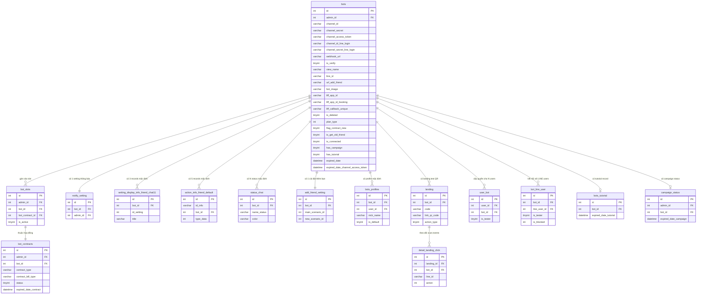

# FA-042 — DB Mapping: Add Bot Router (bot-add-v2)

> Agent: db-mapper | Tạo: 2026-05-14

---

## Tổng quan

FA-042 là wizard kết nối LINE Official Account (LOA) với LME. Đây là tính năng **write-heavy**: toàn bộ luồng wizard tạo ra nhiều records trên nhiều bảng. Không có thao tác READ phức tạp để hiển thị — chủ yếu là INSERT/UPDATE.

**Bảng trung tâm**: `bots` — mọi bảng khác đều foreign key về `bots.id`.

---

## Primary Tables (trực tiếp liên quan)

### 1. `bots` (bảng chính)

**Vai trò**: Lưu toàn bộ thông tin LINE Official Account kết nối với LME. Đây là bảng trung tâm của tính năng.

**Thao tác**:
- INSERT với `is_deleted=2` tại EP-04 (`step2Check`) — trạng thái tạm
- UPDATE nhiều lần trong EP-04: sau khi set webhook, sau khi lấy bot info từ LINE API, sau khi tạo LIFF apps
- UPDATE `is_deleted=0` tại EP-05 (`step2CheckFriend`) — kích hoạt khi QR scan thành công
- DELETE (xóa bản ghi) tại EP-06 (`deleteBot`) — nếu timeout 180 giây
- READ tại EP-03 (`step2Validate`) — kiểm tra `channel_id` unique

| Column | Kiểu | Nullable | Default | Mô tả | Set tại |
|--------|------|----------|---------|-------|---------|
| `id` | int(12) | NO | AUTO | Primary key | INSERT |
| `admin_id` | int(12) | NO | - | FK → users.id (admin tạo bot) | INSERT |
| `channel_id` | varchar(128) | YES | NULL | Messaging API Channel ID (user nhập) | INSERT |
| `channel_secret` | varchar(500) | YES | NULL | Messaging API Channel Secret (user nhập) | INSERT |
| `channel_access_token` | varchar(500) | YES | NULL | Access token Messaging API (lấy từ LINE API) | INSERT → UPDATE |
| `channel_id_line_login` | varchar(255) | YES | NULL | LINE Login Channel ID (user nhập) | UPDATE (sau khi tạo LIFF) |
| `channel_secret_line_login` | varchar(255) | YES | NULL | LINE Login Channel Secret (user nhập) | UPDATE (sau khi tạo LIFF) |
| `login_channel_id` | varchar(255) | YES | NULL | Trường dự phòng — có thể là alias LINE Login Channel ID | Cần xác nhận thêm |
| `webhook_url` | varchar(500) | NO | '' | URL webhook đã set lên LINE: `{DOMAIN}/line/callback/add/{id}` | UPDATE (sau set webhook) |
| `is_verify` | tinyint(1) | NO | 0 | 1 = webhook đã được verify | UPDATE = 1 (sau set webhook) |
| `view_name` | varchar(128) | YES | NULL | Tên hiển thị bot lấy từ LINE API `/v2/bot/info` | UPDATE |
| `line_id` | varchar(50) | YES | NULL | LINE Basic ID của OA lấy từ `/v2/bot/info` | UPDATE |
| `url_add_friend` | varchar(128) | YES | NULL | URL thêm bạn LINE lấy từ `/v2/bot/info` | UPDATE |
| `bot_image` | varchar(500) | YES | NULL | URL avatar bot lấy từ `/v2/bot/info` | UPDATE |
| `liff_app_id` | varchar(50) | YES | NULL | LIFF ID cho流入アクション (tạo qua LINE LIFF API) | UPDATE |
| `liff_callback_unique` | varchar(50) | YES | NULL | Unique code dùng khi callback LIFF (set khi tạo LIFF mới) | UPDATE |
| `liff_app_id_booking` | varchar(64) | YES | NULL | LIFF ID cho各種フォーム (tạo qua LINE LIFF API) | UPDATE |
| `url_liff_app_callback` | varchar(255) | YES | NULL | Callback URL cho LIFF booking app | UPDATE |
| `is_deleted` | tinyint(1) | NO | 0 | 2=tạm, 0=active, xem Enum bên dưới | INSERT=2, UPDATE=0 (khi QR OK) |
| `expired_date` | datetime | YES | NULL | Hạn dùng (theo contract), đặt = NOW() khi INSERT tạm | INSERT=NOW(), UPDATE=contract.expired_date |
| `expired_date_channel_access_token` | datetime | YES | NULL | Hạn token Messaging API = NOW() + 28 ngày | UPDATE |
| `flag_contract_new` | tinyint(4) | NO | 0 | 1 = bot tạo mới sau 01/05/2023 | INSERT=1 |
| `is_get_old_friend` | tinyint(4) | NO | 0 | 1 = bật tính năng import bạn cũ | INSERT=1 |
| `is_connected` | tinyint(4) | YES | 0 | 1 = đã kết nối | INSERT=1 |
| `transfer_code` | varchar(16) | YES | NULL | Mã chuyển nhượng bot | INSERT |
| `role_add_bot` | tinyint(4) | NO | 0 | 0=primary admin, 1=deputy, 2=manager, 3=support | INSERT |
| `user_add` | int(11) | YES | NULL | User ID người thêm bot | INSERT |
| `plan_type` | int(11) | NO | 1 | 1=standard, 2=free | UPDATE (khi QR scan thành công) |
| `has_campaign` | tinyint(4) | YES | 0 | 0=no, 1=yes — đủ điều kiện dùng campaign 7 ngày | UPDATE |
| `has_tutorial` | tinyint(4) | YES | 0 | 1 = đã tạo tutorial record | UPDATE=1 |
| `bot_name` | varchar(128) | YES | NULL | Tên bot (field, khác với view_name) | Có thể cùng view_name |
| `id_bot_change` | int(11) | YES | NULL | FK bot cũ khi thực hiện đổi bot | Dùng khi botIdChange |
| `free_send_count` | int(11) | NO | 0 | Số lần gửi free (tăng khi botIdChange scan QR) | UPDATE++ |
| `created_at` | datetime | YES | NULL | Thời điểm tạo bot | Auto |
| `updated_at` | datetime | YES | NULL | Thời điểm cập nhật cuối | Auto |

**Ghi chú cột quan trọng**:
- `channel_id_line_login` và `channel_secret_line_login` — xác nhận **Cao** là cột lưu LINE Login credentials (có trong schema)
- `login_channel_id` — tồn tại trong schema (L.45) nhưng vai trò chưa rõ, có thể là legacy field hoặc alias
- Không tìm thấy cột `client_access_token` riêng — access token LINE Login có thể không được lưu vào DB (chỉ dùng tạm để tạo LIFF)

---

### 2. `bot_slots`

**Vai trò**: Mỗi slot đại diện cho 1 LOA license đã mua theo hợp đồng. Khi bot kết nối thành công với plan trả phí → gán `bot_id` vào slot.

**Thao tác**:
- READ tại EP-04: lấy `admin_id` từ `bot_slot_id`, kiểm tra slot có `bot_id` chưa
- UPDATE `bot_id` tại EP-05 (Case A — plan trả phí): gán bot vào slot
- INSERT (tạo slot mới) tại EP-05 (Case B — free plan): tạo slot mới kèm bot_id

| Column | Kiểu | Nullable | Default | Mô tả |
|--------|------|----------|---------|-------|
| `id` | int(10) UNSIGNED | NO | AUTO | Primary key |
| `admin_id` | int(11) | YES | NULL | FK → users.id (admin sở hữu slot) |
| `bot_contract_id` | int(11) | YES | NULL | FK → bot_contracts.id |
| `bot_id` | int(11) | YES | NULL | FK → bots.id — NULL khi slot trống, có giá trị sau khi gán bot |
| `is_active` | tinyint(4) | NO | 1 | 1=active |
| `created_at` | timestamp | NO | CURRENT_TIMESTAMP | |
| `updated_at` | timestamp | NO | CURRENT_TIMESTAMP | |

---

### 3. `notify_setting`

**Vai trò**: Cài đặt thông báo mặc định cho bot mới. INSERT 1 record với tất cả giá trị mặc định ngay khi bot được tạo (EP-04, bước 6).

**Thao tác**: INSERT tại EP-04

| Column (chính) | Kiểu | Default | Mô tả |
|----------------|------|---------|-------|
| `id` | int(10) UNSIGNED | AUTO | Primary key |
| `bot_id` | int(11) | NULL | FK → bots.id |
| `admin_id` | int(11) | NULL | FK → users.id |
| `user_id` | int(11) | NULL | FK → users.id (người dùng) |
| `pc_notification_settings` | int(11) | 1 | PC notification bật mặc định |
| `app_notification_settings` | int(11) | 0 | App notification tắt mặc định |
| `chatWork_notification_settings` | int(11) | 0 | ChatWork notification tắt mặc định |
| `is_notify_chat11` | tinyint(4) | 1 | |
| `is_notify_add_friend` | tinyint(4) | 1 | |
| `is_notify_send_all` | tinyint(4) | 1 | |
| `is_notify_qr_code` | tinyint(4) | 1 | |
| `is_notify_form` | tinyint(4) | 1 | |
| `is_notify_conversion` | tinyint(4) | 1 | |
| `is_notify_action_schedule` | tinyint(4) | 1 | |
| `is_notify_calendar_booking` | tinyint(4) | 1 | |
| `is_notify_event_booking` | tinyint(4) | 1 | |
| `is_notify_items` | tinyint(4) | 1 | |
| `is_notify_asp` | tinyint(4) | 1 | |
| `is_notify_send_error` | tinyint(4) | 1 | |
| `is_notify_system_notify` | tinyint(4) | 1 | |
| `is_notify_lesson_booking` | tinyint(4) | 1 | |
| `is_notify_salon_booking` | tinyint(4) | 1 | |
| `created_at` | timestamp | CURRENT_TIMESTAMP | |

> **Ghi chú**: Bảng có ~65 cột, hầu hết là các flag thông báo với default values. Chỉ liệt kê các cột quan trọng.

---

### 4. `setting_display_info_friend_chat11`

**Vai trò**: Cài đặt hiển thị thông tin bạn bè trong chat 1-1. INSERT 3 records mặc định khi tạo bot (EP-04, bước 7).

**Thao tác**: INSERT 3 records tại EP-04

| Column | Kiểu | Nullable | Default | Mô tả |
|--------|------|----------|---------|-------|
| `id` | int(10) UNSIGNED | NO | AUTO | Primary key |
| `bot_id` | int(11) | NO | - | FK → bots.id |
| `type` | int(11) | NO | 0 | 0=default, 1=custom |
| `id_setting` | int(11) | NO | - | ID loại setting (1=LINE名, 2=友だち追加日時, 3=システム表示名) |
| `line_id` | int(11) | YES | NULL | |
| `order` | int(11) | NO | 0 | Thứ tự hiển thị |
| `title` | varchar(255) | YES | NULL | Tên hiển thị |
| `value` | varchar(500) | YES | NULL | Giá trị |
| `created_at` | timestamp | NO | CURRENT_TIMESTAMP | |
| `updated_at` | timestamp | NO | CURRENT_TIMESTAMP | |

**3 records mặc định được tạo**:
| Record | `id_setting` | `title` (dự kiến) |
|--------|-------------|------------------|
| 1 | 1 | LINE名 (tên LINE) |
| 2 | 2 | 友だち追加日時 (ngày thêm bạn) |
| 3 | 3 | システム表示名 (tên hiển thị hệ thống) |

---

### 5. `action_info_friend_default`

**Vai trò**: Thông tin hành động mặc định của bạn bè (custom fields hiển thị trong profile bạn bè). INSERT 5 records mặc định khi tạo bot (EP-04, bước 8).

**Thao tác**: INSERT 5 records tại EP-04

| Column | Kiểu | Nullable | Default | Mô tả |
|--------|------|----------|---------|-------|
| `id` | int(10) UNSIGNED | NO | AUTO | Primary key |
| `id_info` | varchar(255) | NO | - | Mã định danh loại thông tin (vd: `system_display`, `phone_number`, `email`, `birthday`, `province`) |
| `bot_id` | int(11) | NO | - | FK → bots.id |
| `order` | int(11) | NO | 0 | Thứ tự hiển thị |
| `title` | varchar(255) | NO | - | Nhãn hiển thị |
| `group_id` | int(11) | NO | -1 | Nhóm |
| `type_data` | int(11) | NO | - | Loại dữ liệu: 1=select, 2=input, 3=calendar, 4=image, 5=file, 6=point |
| `default_value` | varchar(500) | YES | NULL | Giá trị mặc định |
| `setting_value` | text | YES | NULL | Cài đặt thêm |
| `created_at` | timestamp | NO | CURRENT_TIMESTAMP | |

**5 records mặc định được tạo**:
| Record | `id_info` |
|--------|----------|
| 1 | `system_display` |
| 2 | `phone_number` |
| 3 | `email` |
| 4 | `birthday` |
| 5 | `province` |

---

### 6. `status_chat`

**Vai trò**: Danh sách trạng thái chat mặc định của bot. INSERT nhiều records từ config `sns-line.status_default_v2` khi tạo bot (EP-04, bước 9).

**Thao tác**: INSERT N records tại EP-04 (số lượng theo config)

| Column | Kiểu | Nullable | Default | Mô tả |
|--------|------|----------|---------|-------|
| `id` | int(10) UNSIGNED | NO | AUTO | Primary key |
| `bot_id` | int(11) | NO | - | FK → bots.id |
| `position` | int(11) | NO | 0 | Thứ tự hiển thị |
| `name_status` | varchar(255) | NO | - | Tên trạng thái (vd: 「未対応」,「対応中」,「対応済み」) |
| `color` | varchar(255) | NO | - | Màu hiển thị (HEX code) |
| `bg_status` | varchar(255) | YES | NULL | Màu nền trạng thái |
| `bg_choose` | varchar(255) | YES | NULL | Màu nền khi chọn |
| `is_save` | tinyint(4) | NO | 1 | 1=lưu |
| `count` | int(11) | NO | 0 | Số lượng chat với trạng thái này |
| `created_at` | timestamp | NO | CURRENT_TIMESTAMP | |

---

### 7. `add_friend_setting`

**Vai trò**: Cài đặt hành động khi thêm bạn (kịch bản, tag, v.v.). INSERT 1 record mặc định khi tạo bot (EP-04, bước 10).

**Thao tác**: INSERT 1 record tại EP-04

> **Lưu ý tên bảng**: Logic-spec ghi `add_friend_settings` (có 's') nhưng bảng thực tế trong DB là `add_friend_setting` (không có 's'). Model `AddFriendSetting` map đúng với `add_friend_setting`.

| Column | Kiểu | Nullable | Default | Mô tả |
|--------|------|----------|---------|-------|
| `id` | int(11) | NO | AUTO | Primary key |
| `bot_id` | int(11) | NO | - | FK → bots.id |
| `main_scenario_id` | int(11) | YES | NULL | Kịch bản chính |
| `new_scenario_id` | int(11) | YES | NULL | Kịch bản cho bạn mới |
| `old_scenario_id` | int(11) | YES | NULL | Kịch bản cho bạn cũ |
| `new_tag_id` | int(11) | YES | NULL | Tag cho bạn mới |
| `old_tag_id` | int(11) | YES | NULL | Tag cho bạn cũ |
| `new_delay_type` | tinyint(1) | NO | 0 | Loại delay cho bạn mới |
| `old_delay_type` | tinyint(1) | NO | 0 | Loại delay cho bạn cũ |
| `action_add_old_friend` | tinyint(4) | NO | 0 | Hành động khi thêm bạn cũ |
| `created_at` | int(11) | NO | - | Unix timestamp tạo |
| `updated_at` | int(11) | YES | NULL | Unix timestamp cập nhật |

---

### 8. `bots_profiles`

**Vai trò**: Profile mặc định của bot (dùng trong chat). INSERT 1 record mặc định khi tạo bot (EP-04, bước 13).

**Thao tác**: INSERT 1 record tại EP-04

| Column | Kiểu | Nullable | Default | Mô tả |
|--------|------|----------|---------|-------|
| `id` | int(10) UNSIGNED | NO | AUTO | Primary key |
| `bot_id` | int(11) | NO | - | FK → bots.id |
| `user_id` | int(11) | NO | - | FK → users.id (admin tạo) |
| `avt_path` | varchar(255) | YES | NULL | Đường dẫn avatar |
| `nick_name` | varchar(255) | NO | - | Tên hiển thị profile |
| `is_default` | tinyint(4) | NO | 0 | 1=profile mặc định |
| `position` | int(11) | NO | 1 | Thứ tự |
| `created_at` | timestamp | YES | NULL | |
| `updated_at` | timestamp | YES | NULL | |

**Record mặc định được tạo**: `is_default=1`, `nick_name` = tên admin, `avt_path` = avatar admin.

---

### 9. `landing`

**Vai trò**: Landing page test cho QR scan. INSERT 1 record tạm để tạo QR code scan khi kết nối bot (EP-04, bước 15c). Record này bị xóa sau khi tester scan QR thành công (EP-05).

**Thao tác**: INSERT 1 record tại EP-04, Force Delete tại EP-05

| Column (chính) | Kiểu | Default | Mô tả |
|----------------|------|---------|-------|
| `id` | int(10) UNSIGNED | AUTO | Primary key — trả về là `landingId` trong response EP-04 |
| `bot_id` | int(11) | - | FK → bots.id |
| `name` | varchar(255) | NULL | Tên landing (tạm) |
| `code` | varchar(100) | NULL | Code ngẫu nhiên 6 ký tự (dùng trong LIFF URL) |
| `link_qr_code` | varchar(255) | NULL | Path file QR code PNG (trả về là `urlQrCode`) |
| `action_type` | tinyint(4) | 1 | 2 = action nhiều lần (dùng cho QR test) |
| `status` | tinyint(4) | 1 | 1=public |
| `deleted_at` | timestamp | NULL | Soft delete khi QR scan thành công |
| `created_at` | timestamp | NULL | |
| `updated_at` | timestamp | CURRENT_TIMESTAMP | |

**Ghi chú**: QR code PNG được tạo tại đường dẫn `/images/{userId}/{botId}/landing/{timestamp}_{landingId}.png` (300×300 px), encode URL `https://line.me/R/app/{liffId}?uLand={code}`.

---

### 10. `user_bot`

**Vai trò**: Quyền sử dụng bot cho admin/staff. INSERT records cho danh sách `ids[]` truyền vào EP-04 (bước 14).

**Thao tác**: INSERT N records tại EP-04 (1 record cho mỗi user trong `ids[]`)

| Column | Kiểu | Nullable | Default | Mô tả |
|--------|------|----------|---------|-------|
| `id` | int(12) | NO | AUTO | Primary key |
| `user_id` | int(12) | NO | - | FK → users.id |
| `bot_id` | int(12) | YES | NULL | FK → bots.id |
| `is_tester` | tinyint(1) | NO | 0 | 1=là tester |
| `is_deleted` | tinyint(1) | NO | 0 | 0=active |
| `created_at` | datetime | NO | - | |
| `updated_at` | datetime | YES | NULL | |

---

## Secondary Tables (liên quan gián tiếp)

### 11. `bot_contracts`

**Vai trò**: Hợp đồng gói dịch vụ. Liên quan khi QR scan thành công.
- **READ** tại EP-05 (Case A): lấy `expired_date` và `contract_type` của contract liên kết với slot
- **UPDATE** tại EP-05 (Case A, non-enterprise): gán `bot_id` vào contract
- **INSERT** tại EP-05 (Case B — free plan): tạo contract mới với `contract_type='free'`

| Column (chính) | Kiểu | Mô tả |
|----------------|------|-------|
| `id` | int(10) UNSIGNED | Primary key |
| `admin_id` | int(11) | FK → users.id |
| `bot_id` | int(11) | FK → bots.id (update sau khi bot kết nối) |
| `number_slot` | int(11) | Số slot trong hợp đồng |
| `contract_type` | varchar(100) | Loại contract (vd: 'enterprise', 'free') |
| `contract_bill_type` | varchar(100) | Chu kỳ thanh toán (vd: 'month') |
| `status` | tinyint(4) | 0=chưa hđ, 1=đang hđ, 2=chờ hủy, 3=đã hủy |
| `expired_date_contract` | datetime | Hạn hợp đồng — copy vào `bots.expired_date` |
| `is_active` | tinyint(4) | 0=inactive, 1=active |
| `flag_contract_new` | tinyint(4) | 0=cũ, 1=mới (sau 01/05/2023) |

---

### 12. `bots_tutorial`

**Vai trò**: Trạng thái onboarding tutorial của bot. INSERT khi bot tạo thành công (EP-04, bước 17).

**Thao tác**:
- INSERT 1 record tại EP-04 với `expired_date_tutorial = NOW() + 7 ngày`
- UPDATE `expired_date_tutorial = NULL` tại EP-05 (Case B — free plan)

| Column | Kiểu | Default | Mô tả |
|--------|------|---------|-------|
| `id` | int(10) UNSIGNED | AUTO | Primary key |
| `bot_id` | int(11) | - | FK → bots.id |
| `status_template` | tinyint(4) | 0 | 0=chưa done, 1=done |
| `status_tag` | tinyint(4) | 0 | |
| `status_send_all` | tinyint(4) | 0 | |
| `status_qr_code` | tinyint(4) | 0 | |
| `expired_date_tutorial` | datetime | NULL | Hạn tutorial (NULL = đã hủy) |
| `created_at` | timestamp | CURRENT_TIMESTAMP | |

---

### 13. `campaign_status`

**Vai trò**: Trạng thái campaign 7 ngày đầu. UPSERT khi tạo bot mới không có slot và không có botIdChange (EP-04, bước 16d).

**Thao tác**: INSERT hoặc UPDATE tại EP-04

| Column | Kiểu | Default | Mô tả |
|--------|------|---------|-------|
| `id` | int(10) UNSIGNED | AUTO | Primary key |
| `admin_id` | int(11) | NULL | FK → users.id |
| `bot_id` | int(11) | NULL | FK → bots.id |
| `expired_date_campaign` | datetime | NULL | Hết hạn campaign = `bots.created_at + 7 ngày 23:59` |
| `status_show_campaign` | tinyint(4) | 0 | 0=show modal, 1=show float, 2=float next day |
| `close_date` | datetime | NULL | Thời điểm user đóng banner campaign |

---

### 14. `bot_line_user`

**Vai trò**: Quan hệ bot ↔ LINE user (bạn bè). **Chỉ READ** trong EP-05 — kiểm tra tester đã scan QR chưa, sau đó UPDATE `is_tester=1`.

**Thao tác**:
- READ tại EP-05: tìm record `bot_id + line_user_id + is_blocked=0`
- UPDATE `is_tester=1` tại EP-05 (khi QR scan thành công)

| Column (chính) | Kiểu | Mô tả |
|----------------|------|-------|
| `id` | int(11) | Primary key |
| `line_user_id` | int(11) | FK → line_user.id |
| `bot_id` | int(11) | FK → bots.id |
| `is_blocked` | int(11) | 0=không block |
| `is_tester` | tinyint(1) | 0=không, 1=tester (set sau khi scan QR) |
| `is_friend` | int(11) | 0=không, 1=là bạn |
| `followed_at` | timestamp | Thời điểm thêm bạn |

---

### 15. `detail_landing_click`

**Vai trò**: Log click/scan từ QR landing page. **Chỉ READ** trong EP-05 — tìm `line_id` của tester đã scan QR từ landing.

**Thao tác**: READ tại EP-05

| Column (chính) | Kiểu | Mô tả |
|----------------|------|-------|
| `id` | int(10) UNSIGNED | Primary key |
| `landing_id` | int(11) | FK → landing.id |
| `bot_id` | int(11) | FK → bots.id |
| `line_id` | varchar(255) | LINE User ID của người scan |
| `action` | int(11) | 1=click, 2=added (thêm bạn) |
| `time_click` | datetime | Thời điểm click/scan |
| `bot_line_user_id` | int(11) | FK → bot_line_user.id |
| `is_old_friend` | tinyint(4) | 0=bạn mới, 1=bạn cũ |

---

## UI ↔ DB Field Mapping

| UI Element | Màn hình | DB Table | Column | Mapping Type | Confidence | Ghi chú |
|-----------|---------|---------|--------|-------------|-----------|---------|
| 「{username} 様」 | SCR-BAV-01 | users | `name` hoặc `username` | Read | Trung bình | `$username` từ controller — cần xác nhận tên cột |
| 「Messaging APIのチャネルID」 | SCR-BAV-05 | bots | `channel_id` | Direct write | Cao | User nhập, trim whitespace |
| 「Messaging APIのチャネルシークレット」 | SCR-BAV-05 | bots | `channel_secret` | Direct write | Cao | User nhập |
| 「LINEログインのチャネルID」 | SCR-BAV-05 | bots | `channel_id_line_login` | Direct write | Cao | Xác nhận từ schema — cột tồn tại |
| 「LINEログインのチャネルシークレット」 | SCR-BAV-05 | bots | `channel_secret_line_login` | Direct write | Cao | Xác nhận từ schema |
| QR Code image | SCR-BAV-07 | landing | `link_qr_code` | Computed | Cao | Path PNG file 300×300, trả về qua `urlQrCode` trong response EP-04 |
| Bot name hiển thị | SCR-BAV-08 | bots | `view_name` | Computed | Cao | Lấy từ LINE API `/v2/bot/info` |
| Bot name (check-auth-bot) | SCR-BAV-10 | bots | `view_name` | Read | Cao | `response.data.bot_name` map với `bots.view_name` |
| channel_access_token (internal) | - | bots | `channel_access_token` | Computed | Cao | Lấy từ LINE API, không hiển thị UI |
| webhook_url (internal) | - | bots | `webhook_url` | Computed | Cao | Format: `{DOMAIN}/line/callback/add/{bot_id}` |
| is_verify (internal) | - | bots | `is_verify` | Computed | Cao | Set = 1 sau khi set webhook thành công |
| landing test ID | - | landing | `id` | Computed | Cao | Trả về là `landingId` trong response EP-04 |
| Plan type | - | bots | `plan_type` | Computed | Cao | 1=standard (có slot), 2=free (không slot) |
| Bot active status | - | bots | `is_deleted` | Computed | Cao | 0=active (sau QR scan), 2=temporary |
| Bot LINE ID | - | bots | `line_id` | Computed | Cao | Lấy từ LINE API `/v2/bot/info` |
| URL thêm bạn | - | bots | `url_add_friend` | Computed | Cao | Lấy từ LINE API `/v2/bot/info` |
| Avatar bot | - | bots | `bot_image` | Computed | Cao | Lấy từ LINE API `/v2/bot/info` |
| LIFF app ID | - | bots | `liff_app_id` | Computed | Cao | Lấy từ LINE LIFF API |
| LIFF booking ID | - | bots | `liff_app_id_booking` | Computed | Cao | Lấy từ LINE LIFF API |
| has_campaign | - | bots | `has_campaign` | Computed | Cao | 1 nếu bot tạo trong 7 ngày từ khi đăng ký |
| Campaign expired date | - | campaign_status | `expired_date_campaign` | Computed | Cao | `bots.created_at + 7 ngày 23:59` |

---

## Enum/Status Values

| Table | Field | DB Value | UI Display / Ý nghĩa |
|-------|-------|----------|----------------------|
| `bots` | `is_deleted` | 0 | Bot active — đang hoạt động bình thường |
| `bots` | `is_deleted` | 2 | Bot temporary — đang trong quá trình kết nối (chờ QR scan) |
| `bots` | `plan_type` | 1 | Standard — plan trả phí (có `bot_slot_id`) |
| `bots` | `plan_type` | 2 | Free — plan miễn phí |
| `bots` | `is_verify` | 0 | Webhook chưa được verify |
| `bots` | `is_verify` | 1 | Webhook đã được verify và set |
| `bots` | `is_connected` | 0 | Bot chưa kết nối |
| `bots` | `is_connected` | 1 | Bot đã kết nối |
| `bots` | `role_add_bot` | 0 | Primary admin |
| `bots` | `role_add_bot` | 1 | Deputy manager |
| `bots` | `role_add_bot` | 2 | Manager |
| `bots` | `role_add_bot` | 3 | Support |
| `bots` | `flag_contract_new` | 0 | Bot cũ (tạo trước 01/05/2023) |
| `bots` | `flag_contract_new` | 1 | Bot mới (tạo sau 01/05/2023) |
| `bots` | `has_campaign` | 0 | Không đủ điều kiện campaign |
| `bots` | `has_campaign` | 1 | Đủ điều kiện campaign (trong 7 ngày đầu) |
| `bots` | `has_tutorial` | 0 | Chưa có tutorial |
| `bots` | `has_tutorial` | 1 | Đã có tutorial record |
| `bot_contracts` | `contract_type` | 'free' | Hợp đồng free plan |
| `bot_contracts` | `contract_type` | 'enterprise' | Hợp đồng enterprise |
| `bot_contracts` | `contract_bill_type` | 'month' | Thanh toán theo tháng |
| `bot_contracts` | `status` | 0 | Chưa hợp đồng |
| `bot_contracts` | `status` | 1 | Đang hợp đồng |
| `bot_contracts` | `status` | 2 | Chờ hủy hợp đồng |
| `bot_contracts` | `status` | 3 | Đã hủy hợp đồng |
| `landing` | `action_type` | 1 | Action 1 lần |
| `landing` | `action_type` | 2 | Action nhiều lần (dùng cho landing test QR) |
| `detail_landing_click` | `action` | 1 | Click |
| `detail_landing_click` | `action` | 2 | Added (thêm bạn — tức là scan QR thành công) |
| `action_info_friend_default` | `type_data` | 1 | Select |
| `action_info_friend_default` | `type_data` | 2 | Input (text) |
| `action_info_friend_default` | `type_data` | 3 | Calendar |
| `action_info_friend_default` | `type_data` | 4 | Image |
| `action_info_friend_default` | `type_data` | 5 | File |
| `action_info_friend_default` | `type_data` | 6 | Point |

---

## ER Diagram (mermaid)



---

## Thứ tự tạo dữ liệu (EP-04: step2Check)

```
1. INSERT bots (is_deleted=2) ────────────────────── lấy bot_id
2. INSERT notify_setting (bot_id=bot_id)
3. INSERT setting_display_info_friend_chat11 × 3
4. INSERT action_info_friend_default × 5
5. INSERT status_chat × N (từ config)
6. INSERT add_friend_setting (bot_id=bot_id)
7. LINE API: PUT webhook → UPDATE bots (webhook_url, is_verify, expired_date_token)
8. LINE API: GET bot/info → UPDATE bots (view_name, line_id, url_add_friend, bot_image)
9. INSERT bots_profiles (bot_id, user_id, is_default=1)
10. INSERT user_bot × N (cho mỗi user trong ids[])
11. [Nếu LIFF mới]
    a. LINE Login API → lấy tokenLineLogin
    b. LINE LIFF API → liffId1 → UPDATE bots (liff_app_id, liff_callback_unique, channel_id_line_login, channel_secret_line_login)
    c. INSERT landing (action_type=2, code=random6)
    d. Generate QR PNG → UPDATE landing (link_qr_code)
    e. LINE LIFF API → liffId2 → UPDATE bots (liff_app_id_booking, url_liff_app_callback)
12. [Nếu không có bot_slot_id và không botIdChange]
    UPSERT campaign_status (expired_date_campaign = created_at + 7 ngày)
    UPDATE bots (has_campaign)
13. INSERT bots_tutorial (expired_date_tutorial = NOW() + 7 ngày)
14. UPDATE bots (has_tutorial = 1)
15. DB::commit()
16. Return: {bot_new_id, urlQrCode, landingId}
```

---

## Thứ tự cập nhật dữ liệu (EP-05: step2CheckFriend — khi QR scan thành công)

```
Case A — Có bot_slot_id (plan trả phí):
1. UPDATE bots: is_deleted=0, expired_date=contract.expired_date, plan_type=1
2. UPDATE bot_slots: bot_id = bot_id
3. [Nếu không phải enterprise] UPDATE bot_contracts: bot_id = bot_id
4. INSERT bots_life_cycle (TYPE=START/CONNECT_WITH_PLAN)
5. UPDATE bot_line_user: is_tester=1
6. Force delete landing record
7. Firebase subscribe topic

Case B — Không có bot_slot_id (free plan):
1. UPDATE bots: plan_type=2, is_deleted=0, is_get_old_friend=1
2. UPDATE bots_tutorial: expired_date_tutorial = null
3. INSERT bot_contracts (contract_type='free', contract_bill_type='month')
4. INSERT bot_slots (admin_id, bot_id, bot_contract_id)
5. INSERT bots_life_cycle (TYPE=START/CONNECT_BOT_FREE)
6. UPDATE bot_line_user: is_tester=1
7. Force delete landing record
```

---

## Unmapped Items

| Item | Ghi chú |
|------|---------|
| `bots.login_channel_id` | Tồn tại trong schema nhưng vai trò chưa rõ — có thể là legacy field song song với `channel_id_line_login` |
| `client_access_token` (LINE Login) | Logic-spec đề cập nhưng **không tìm thấy cột** trong `bots` schema — khả năng cao không lưu vào DB, chỉ dùng tạm để gọi LIFF API |
| `bots_life_cycle` | Model `BotLifeCycle` được tham chiếu nhưng tên bảng chưa xác định (không có trong db/index.md — cần verify) |
| `PaymentDetailAff` | Model affiliate — bảng tên chưa xác định, liên quan đến referrer. Không trong scope chính của FA-042 |
| `PaymentHistories` | Model lịch sử thanh toán — UPDATE `bot_name` cho records null. Tên bảng chưa xác nhận |
| `UserFirebaseToken` | Model Firebase token — dùng để lấy tokens đăng ký push notification. Không trong scope chính |
| `line_user` | Bảng tham chiếu trong EP-05 (tìm `line_user_id` từ `line_id`) — không đọc schema nhưng được tham chiếu gián tiếp qua `bot_line_user.line_user_id` |
| `setting_display_info_friend_chat11` | Logic-spec và model dùng `chat_11` (hai chữ số), nhưng schema file thực tế là `setting_display_info_friend_chat11` (liền). Cần chú ý khi viết query |

---

**Confidence tổng thể**: Cao — dữ liệu mapping được xác nhận trực tiếp từ source code (logic-spec) và schema DB.
