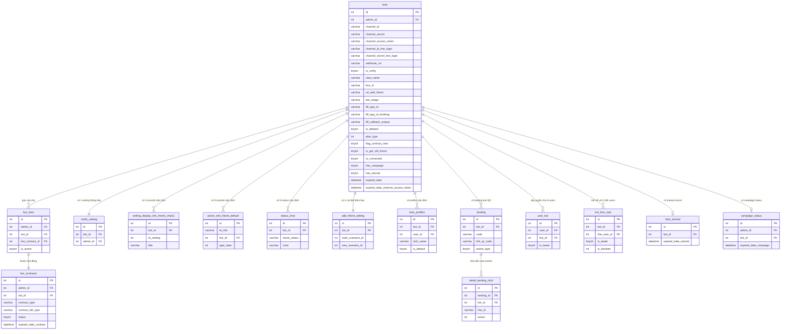

# FA-042 — Add Bot Router (「新規LOA接続」)

**Mã**: FA-042 | **Portal**: Admin | **URL**: `/admin/bot-add-v2`  
**Trạng thái spec**: Hoàn thành | **Ngày**: 2026-05-14

---

## 1. Tổng quan

### Mục đích

Wizard hướng dẫn Admin kết nối một LINE Official Account (LOA) mới với hệ thống LME. Đây là tính năng **onboarding bắt buộc** — Admin phải hoàn thành wizard này trước khi có thể sử dụng bất kỳ tính năng nào của LME cho LOA đó.

Wizard gồm 2 lớp điều hướng:
- `currentStep` (1–6): điều hướng cấp cao (chào mừng → điều kiện → wizard con → hoàn thành / lỗi / cảnh báo)
- `roadStep` (1–5): điều hướng nội bộ trong wizard con (bước 1–5 kết nối thực tế)

Toàn bộ giao diện là **Vue.js SPA** — không reload trang giữa các bước. Source: Blade template `bot_add_v3.blade.php` + JS file `add_bot.js`.

### Actors

| Actor | Vai trò | Quyền truy cập |
|-------|---------|---------------|
| Admin | Người dùng chính — thực hiện toàn bộ wizard kết nối LOA | Toàn quyền trên tính năng |
| Staff | Không có quyền truy cập | Bị chặn — chỉ Admin mới tạo bot |

### Phạm vi

- **Bao gồm**: Toàn bộ wizard 5 roadStep kết nối LOA mới, validate credentials LINE API, tạo bot + LIFF apps + QR code, polling xác nhận kết nối, xử lý free plan và paid plan, affiliate tracking, tutorial onboarding
- **Không bao gồm**: Quản lý bot sau khi kết nối (thuộc tính năng khác), quản lý hợp đồng / bot_slots (FA-031), chi tiết tính năng tutorial (/manual/tutorial), modal mời Staff và đổi owner bot (flow phụ, chưa phân tích đầy đủ)

---

## 2. Màn hình & Luồng xử lý End-to-End

### Luồng chính (Happy Path)

```mermaid
flowchart TD
    A[SCR-BAV-01\nChào mừng] -->|Click 無料で利用開始| B[SCR-BAV-02\nĐiều kiện tiên quyết]
    B -->|Click 接続設定に進む| C[SCR-BAV-03\nStep1: Xác nhận Channel ID]
    C -->|Check checkbox + 次へ進む| D[SCR-BAV-04\nStep2: Tạo LINE Login Channel]
    D -->|4 checkboxes + 次へ進む| E[SCR-BAV-05\nStep3: Nhập thông tin API]
    D -->|前のステップに戻る| C
    E -->|Nhập 4 fields + 次へ進む\nEP-02×2 validate| F[SCR-BAV-06\nStep4: Cài đặt Webhook]
    E -->|前のステップに戻る| D
    E -->|API error| E
    F -->|Check + 次へ進む\nEP-03 check webhook\nEP-04 tạo bot + QR| G[SCR-BAV-07\nStep5: QR Test]
    F -->|前のステップに戻る| E
    G -->|Polling EP-05 mỗi 5s\nThành công trong 180s| H[SCR-BAV-08\nHoàn thành kết nối]
    G -->|Timeout 180s / fail_provider\nEP-06 deleteBot| J[SCR-BAV-09\nLỗi kết nối]
    G -->|前のステップに戻る| F
    J -->|ステップ1に戻って再設定| C
    H -->|Click エルメの設定に進む\nEP-07 check-auth-bot| K{has_campaign = 1?}
    K -->|Có campaign| L[/manual/tutorial?botId=X]
    K -->|Không có campaign| M[SCR-BAV-10\nCảnh báo 未認証アカウント]
    M -->|Click 設定に進む| L
```

### Chi tiết từng bước

#### SCR-BAV-01 — Màn hình chào mừng (`currentStep === 1`)

Màn hình đầu tiên khi Admin truy cập `/admin/bot-add-v2`. Hiển thị 3 card tính năng nổi bật (gửi tin nhắn phân đoạn, đặt lịch, thanh toán LINE) và thẻ chào mừng cá nhân hóa với tên Admin (`{username} 様`).

**User action**: Click「無料で利用開始 ›」→ `nextStep()` → `currentStep = 2` (không API call).

#### SCR-BAV-02 — Điều kiện tiên quyết (`currentStep === 2`)

Video hướng dẫn Vimeo (~2 phút) + 4 điều kiện bắt buộc đọc trước khi kết nối. Điểm đáng chú ý: điều kiện số 4 cảnh báo rằng nếu tổng bạn bè (友だち追加数 - ブロック) >= 100,000 người phải điền「利用申請フォーム」trước — tuy nhiên hệ thống **không validate** điều này, chỉ thông báo.

**User action**: Click「接続設定に進む ›」→ `nextStep()` → `currentStep = 3, roadStep = 1` (không API call).

#### SCR-BAV-03 — Wizard Step 1: Xác nhận Channel ID (`currentStep === 3, roadStep === 1`)

Hướng dẫn Admin xác nhận Channel ID giống nhau giữa LINE OA Manager và LINE Developers. Có video hướng dẫn Vimeo (4:48). Có 1 checkbox phải check trước khi tiếp tục.

**Sidebar progress**: Hiển thị 4 bước tiếp theo (Step 2–5) ở trạng thái thu gọn.

**User action**: Check `checkboxes.step1Checkbox1` → Click「次へ進む」→ reset checkbox → `roadStep = 2` (không API call).

#### SCR-BAV-04 — Wizard Step 2: Tạo LINE Login Channel (`currentStep === 3, roadStep === 2`)

9 bước hướng dẫn chi tiết tạo LINE Login Channel kèm ảnh minh họa + video Vimeo (3:52). Cột phải có 4 checkbox xác nhận — tất cả 4 phải được check mới cho phép tiếp tục.

**User action**: Check cả 4 checkboxes → Click「次へ進む」→ `roadStep = 3` (không API call). Back → reset cả 4 checkbox.

#### SCR-BAV-05 — Wizard Step 3: Nhập thông tin API (`currentStep === 3, roadStep === 3`)

Form nhập 4 thông tin API. Đây là bước duy nhất trong wizard có API call validation. Watch tự động trim whitespace cho cả 4 input.

**User action**: Nhập 4 fields → Click「次へ進む」→ gọi `submitForm()`:

```
1. POST EP-02 {channel_id, channel_secret, type: 'channel'}
   → Thành công: lưu channel_access_token vào Vue data
   → Thất bại: hiển thị lỗi errors.channel (dừng)

2. POST EP-02 {channel_id, channel_secret, type: 'client'}
   → Thành công: lưu client_access_token vào Vue data, roadStep = 4
   → Thất bại: hiển thị lỗi errors.client (dừng)
```

**Error messages**:
- `channel_id_exist`: LOA đã kết nối với LME rồi → link check user
- `access_token_error`: Thông tin Messaging API sai → link support
- `errors.client` (truthy): Thông tin LINE Login sai

#### SCR-BAV-06 — Wizard Step 4: Cài đặt Webhook (`currentStep === 3, roadStep === 4`)

Hướng dẫn 4 bước bật Webhook trên LINE OA Manager + video Vimeo. Cột phải có 1 checkbox xác nhận và nút submit. Khi submit, gọi 2 API liên tiếp — nếu cả 2 thành công mới chuyển sang roadStep 5.

**User action**: Check `canNext` → Click「次へ進む」→ gọi `checkWebhook()`:

```
POST EP-03 {channel_access_token}
→ Webhook OFF: errorWebhook = msg (hiển thị cảnh báo đỏ)
→ Webhook ON: gọi showQrCode()
      POST EP-04 {channel_id_new, channel_secret_new, client_id_new, client_secret_new, bot_slot_id, type, botIdChange, ids}
      → Thành công: roadStep = 5, lưu qrCode URL + bot_new_id + landingId, bắt đầu countdown 180s
      → Thất bại: alert(msg), roadStep = 3
```

**Lưu ý**: Tại bước này, bot đã được INSERT vào DB với `is_deleted=2` (trạng thái tạm).

#### SCR-BAV-07 — Wizard Step 5: QR Test (`currentStep === 3, roadStep === 5`)

Hiển thị QR code động (URL từ response EP-04). Admin dùng điện thoại scan QR → add friend bot → gửi sticker. Hệ thống polling mỗi 5 giây để kiểm tra.

**Cơ chế polling**:
```
setInterval(mỗi 1 giây):
  time-- (đếm ngược từ 180)
  if (time % 5 === 0): gọi checkFriend()
  if (time === 0): gọi deleteBot() → currentStep = 5 (timeout)

checkFriend():
  POST EP-05 {bot_id, bot_slot_id, type, botIdChange, landing_id}
  → success=false: tiếp tục polling
  → success='fail_provider': gọi deleteBot() → currentStep = 5
  → success=true + botIdChange: gọi saveStep1() (đổi bot)
  → success=true: clearInterval, currentStep = 4
```

#### SCR-BAV-08 — Hoàn thành kết nối (`currentStep === 4`)

Màn hình chúc mừng đơn giản với 3 ảnh (avatar bot + link icon + LINE avatar). **Cũng được hiển thị khi URL có `?status=successful`** (xử lý trong `mounted()`).

**User action**: Click「エルメの設定に進む ›」→ gọi `checkAuthBot()`:

```
POST EP-07 {bot_id}
→ success=true: redirect /manual/tutorial?botId={hash_bot_id}
→ success=false: lưu bot_name, currentStep = 6
```

#### SCR-BAV-09 — Lỗi kết nối (`currentStep === 5`)

Được kích hoạt khi: (1) countdown 180s hết, (2) `fail_provider` từ EP-05, (3) sau `deleteBot()`.

Cho phép thử lại từ đầu hoặc mua dịch vụ hỗ trợ kết nối có phí (link ngoài).

**User action**: Click「ステップ1に戻って再設定」→ `currentStep = 3, roadStep = 1`, reset tất cả checkboxes.

#### SCR-BAV-10 — Cảnh báo 未認証アカウント (`currentStep === 6`)

Hiển thị khi bot chưa được LINE Corp xác thực (未認証 vs 認証済み). Có video giải thích + tên bot từ response EP-07. Hạn chế chính: không gửi được tin nhắn ngay cho toàn bộ bạn bè.

**User action**: Click「動画の内容を理解したのでエルメの設定に進む」→ `redirectToManual()` → redirect `/manual/tutorial?botId={bot_new_id}`.

---

## 3. Data Model

### Entities chính

| Entity | Bảng | Vai trò trong FA-042 |
|--------|------|---------------------|
| Bot | `bots` | Thực thể trung tâm — lưu toàn bộ thông tin LOA |
| Bot Slot | `bot_slots` | Slot license — gán bot vào slot hợp đồng |
| Bot Contract | `bot_contracts` | Hợp đồng dịch vụ — xác định plan type và expired date |
| Notify Setting | `notify_setting` | Cài đặt thông báo mặc định (1 record/bot) |
| Chat Display Setting | `setting_display_info_friend_chat11` | Cài đặt hiển thị trong chat 1-1 (3 records/bot) |
| Friend Default Fields | `action_info_friend_default` | Custom fields profile bạn bè (5 records/bot) |
| Chat Status | `status_chat` | Trạng thái chat mặc định (N records từ config) |
| Friend Add Setting | `add_friend_setting` | Cài đặt khi thêm bạn (1 record/bot) |
| Bot Profile | `bots_profiles` | Profile hiển thị trong chat (1 record/bot) |
| Test Landing | `landing` | Landing page tạm cho QR scan test (xóa sau khi scan xong) |
| Bot User | `user_bot` | Quyền truy cập bot cho admin/staff |
| Bot Line User | `bot_line_user` | Quan hệ bot ↔ LINE user (bạn bè) |
| Landing Click | `detail_landing_click` | Log scan event từ QR landing |
| Bot Tutorial | `bots_tutorial` | Trạng thái onboarding tutorial |
| Campaign Status | `campaign_status` | Trạng thái campaign 7 ngày đầu |

### ER Diagram



### Thứ tự tạo dữ liệu (EP-04 step2Check — trong 1 transaction)

```
1.  INSERT bots (is_deleted=2) ──────────────────── lấy bot_id
2.  INSERT notify_setting
3.  INSERT setting_display_info_friend_chat11 × 3
4.  INSERT action_info_friend_default × 5
5.  INSERT status_chat × N (từ config sns-line)
6.  INSERT add_friend_setting
7.  LINE API: PUT webhook → UPDATE bots (webhook_url, is_verify=1, expired_date_token)
8.  LINE API: GET /v2/bot/info → UPDATE bots (view_name, line_id, url_add_friend, bot_image)
9.  INSERT bots_profiles (is_default=1)
10. INSERT user_bot × N (cho ids[])
11. [Nếu bot hoàn toàn mới — liff_callback_unique == null]
    a. LINE Login API → tokenLineLogin
    b. LINE LIFF API → liffId1 → UPDATE bots (liff_app_id, liff_callback_unique, channel_id_line_login, channel_secret_line_login)
    c. INSERT landing (action_type=2, code=random 6 ký tự)
    d. Generate QR PNG 300×300 → UPDATE landing (link_qr_code)
    e. LINE LIFF API → liffId2 → UPDATE bots (liff_app_id_booking, url_liff_app_callback)
12. [Nếu không có bot_slot_id và không botIdChange]
    UPSERT campaign_status (expired_date_campaign = bots.created_at + 7 ngày 23:59)
    UPDATE bots (has_campaign = 0 hoặc 1)
13. INSERT bots_tutorial (expired_date_tutorial = NOW() + 7 ngày)
14. UPDATE bots (has_tutorial = 1)
15. DB::commit()
```

### Thứ tự cập nhật khi QR scan thành công (EP-05 step2CheckFriend)

```
Case A — Có bot_slot_id (plan trả phí):
1. UPDATE bots: is_deleted=0, expired_date=contract.expired_date, plan_type=1
2. UPDATE bot_slots: bot_id = bot_id
3. [Nếu không phải enterprise] UPDATE bot_contracts: bot_id = bot_id
4. INSERT bots_life_cycle (TYPE=START/CONNECT_WITH_PLAN)
5. UPDATE bot_line_user: is_tester=1
6. Force delete landing
7. Firebase: subscribe topic cho bot_id

Case B — Không có bot_slot_id (free plan):
1. UPDATE bots: plan_type=2, is_deleted=0, is_get_old_friend=1
2. UPDATE bots_tutorial: expired_date_tutorial = null
3. INSERT bot_contracts (contract_type='free', contract_bill_type='month')
4. INSERT bot_slots (admin_id, bot_id, bot_contract_id)
5. INSERT bots_life_cycle (TYPE=START/CONNECT_BOT_FREE)
6. UPDATE bot_line_user: is_tester=1
7. Force delete landing
```

---

## 4. Field Traceability Matrix

| # | UI Element | Màn hình | DB Table | Column | Hướng | Validation | Business Rule |
|---|-----------|---------|---------|--------|-------|-----------|--------------|
| 1 | 「{username} 様」 | SCR-BAV-01 | users | `name` / `username` | DB→UI | — | Lấy từ session Auth, tên cột cần xác nhận thêm |
| 2 | 「Messaging APIのチャネルID」 | SCR-BAV-05 | bots | `channel_id` | Input→DB | required, unique (is_deleted=0) | BR-002 |
| 3 | 「Messaging APIのチャネルシークレット」 | SCR-BAV-05 | bots | `channel_secret` | Input→DB | required | — |
| 4 | 「LINEログインのチャネルID」 | SCR-BAV-05 | bots | `channel_id_line_login` | Input→DB | required | — |
| 5 | 「LINEログインのチャネルシークレット」 | SCR-BAV-05 | bots | `channel_secret_line_login` | Input→DB | required | — |
| 6 | QR Code image | SCR-BAV-07 | landing | `link_qr_code` | DB→UI | — | URL PNG 300×300, generate sau EP-04 thành công |
| 7 | Bot name hiển thị (SCR-BAV-08) | SCR-BAV-08 | bots | `view_name` | DB→UI | — | Lấy từ LINE API `/v2/bot/info` |
| 8 | Bot name (cảnh báo 未認証) | SCR-BAV-10 | bots | `view_name` | DB→UI | — | Từ response EP-07 `bot_name` |
| 9 | channel_access_token (internal) | — | bots | `channel_access_token` | Computed | — | Lấy từ LINE API, không hiển thị UI |
| 10 | webhook_url (internal) | — | bots | `webhook_url` | Computed | — | Format: `{DOMAIN}/line/callback/add/{bot_id}` |
| 11 | is_verify (internal) | — | bots | `is_verify` | Computed | — | Set = 1 sau set webhook thành công |
| 12 | Landing test ID | — | landing | `id` | Computed | — | Trả về là `landingId` trong response EP-04 |
| 13 | Plan type | — | bots | `plan_type` | Computed | — | 1=standard (có slot), 2=free (không slot) |
| 14 | Bot active status | — | bots | `is_deleted` | Computed | — | 2=tạm (khi tạo), 0=active (sau QR scan) |
| 15 | Bot LINE ID | — | bots | `line_id` | Computed | — | Lấy từ LINE API `/v2/bot/info` |
| 16 | URL thêm bạn | — | bots | `url_add_friend` | Computed | — | Lấy từ LINE API `/v2/bot/info` |
| 17 | Avatar bot | — | bots | `bot_image` | Computed | — | Lấy từ LINE API `/v2/bot/info` |
| 18 | LIFF app ID (流入) | — | bots | `liff_app_id` | Computed | — | Lấy từ LINE LIFF API |
| 19 | LIFF app ID (フォーム) | — | bots | `liff_app_id_booking` | Computed | — | Lấy từ LINE LIFF API, botPrompt=aggressive |
| 20 | has_campaign | — | bots | `has_campaign` | Computed | — | BR-005: 1 nếu tạo trong 7 ngày từ khi đăng ký |
| 21 | Campaign expired date | — | campaign_status | `expired_date_campaign` | Computed | — | bots.created_at + 7 ngày 23:59 |
| 22 | client_access_token (LINE Login) | — | — | **Không có cột DB** | Memory only | — | Chỉ dùng tạm để tạo LIFF app, không persist (Gap G-01) |

---

## 5. Business Rules

### BR-001: Bot slot đã được kết nối
Khi truy cập EP-01 với `bot_slot_id` hợp lệ, nếu slot đã có `bot_id` khác null → redirect về `adminIndex`. Không cho phép gán 1 slot cho 2 bot.

**Confidence**: Cao | **Source**: `BotController@botAddV2` L.385–411

### BR-002: Channel ID unique
`channel_id` phải unique — không trùng với bất kỳ bot nào có `is_deleted=0`. Kiểm tra tại cả EP-02 (`step2Validate`) và EP-04 (`step2Check`). Nếu trùng → lỗi `channel_id_exist` → hiển thị link kiểm tra email đăng ký.

**Confidence**: Cao | **Source**: `step2Validate` L.4435–4487

### BR-003: Bot lifecycle — trạng thái tạm
Bot được INSERT với `is_deleted=2` tại EP-04. Chỉ được kích hoạt (`is_deleted=0`) tại EP-05 sau khi tester scan QR thành công. Nếu timeout 180 giây → EP-06 xóa hoàn toàn bot và toàn bộ dữ liệu liên quan (hard delete cascade).

**Confidence**: Cao | **Source**: `step2Check` L.5058–5739, `deleteBot` L.5741–5762

### BR-004: Free plan limit — chỉ 1 bot free/admin
Admin chỉ được có **1 bot free plan** (`plan_type=2, is_deleted=0`). Áp dụng cho admin đăng ký sau ngày `2021-07-01`. Kiểm tra tại cả EP-04 (L.5631–5639) và EP-05 (L.4676–4684). Vi phạm → lỗi「現在のプランは利用できない機能です」.

**Confidence**: Cao | **Source**: `step2Check` + `step2CheckFriend`

### BR-005: Campaign eligibility — 7 ngày đầu
Bot đủ điều kiện campaign (`has_campaign=1`) nếu được tạo trong vòng 7 ngày kể từ khi admin đăng ký. Xác định bằng: `bots.created_at + 7 ngày >= NOW`. Kết quả lưu vào `bots.has_campaign` và `campaign_status.expired_date_campaign`. Quyết định redirect tutorial hay hiển thị cảnh báo 未認証.

**Confidence**: Cao | **Source**: `step2Check` L.5631+ (điều kiện campaign)

### BR-006: LIFF app — chỉ tạo mới khi cần
Chỉ tạo 2 LIFF apps khi `bot.liff_callback_unique == null` (bot hoàn toàn mới). Tạo 2 LIFF apps: (1) cho流入アクション, (2) cho各種フォーム với `botPrompt=aggressive`. **Lưu ý quan trọng**: `client_access_token` (LINE Login token dùng để tạo LIFF) **không được lưu vào DB** — chỉ dùng trong memory trong request đó, sau đó mất.

**Confidence**: Cao | **Source**: `step2Check` L.5200+

### BR-007: QR test timeout — 180 giây
Frontend polling tối đa 180 giây (setInterval 1 giây, check API mỗi 5 giây). Khi hết giờ → gọi EP-06 `deleteBot()` xóa bot tạm → chuyển sang SCR-BAV-09. Logic phía client trong `add_bot.js`.

**Confidence**: Trung bình | **Source**: `add_bot.js` (client-side logic)

### BR-008: Webhook URL format
Webhook URL phải theo format: `{DOMAIN_ENDPOINT_WEBHOOK}/line/callback/add/{bot_id}`. Nếu `DOMAIN_ENDPOINT_WEBHOOK` không được set trong config → fallback: `url('line/callback/add/' . $bot_id)`.

**Confidence**: Cao | **Source**: `step2Check` L.5100+

### BR-009: Affiliate referrer tracking
Khi bot kết nối thành công, nếu admin có `user_introduce` hoặc `user_introduce_2` (referrer affiliate) → tạo `PaymentDetailAff` record và gửi email thông báo nếu `is_receive_notification=1`.

**Confidence**: Cao | **Source**: `step2CheckFriend` (Case A và B)

### BR-010: Tutorial record — 7 ngày
Tạo `BotsTutorial` record khi bot được INSERT (EP-04), với `expired_date_tutorial = NOW() + 7 ngày`. Sau khi QR scan thành công với **free plan** (Case B): `expired_date_tutorial = null` (hủy timer tutorial).

**Confidence**: Trung bình | **Source**: `step2Check` L.5700+, `step2CheckFriend` L.4800+

### BR-011: Tài khoản 10万人+ phải đăng ký trước
Nếu tổng bạn bè (友だち追加数 - ブロック) >= 100,000 → phải điền「利用申請フォーム」(Tayori form) trước khi kết nối. **Hệ thống chỉ thông báo tại SCR-BAV-02, không tự động kiểm tra hay chặn**.

**Confidence**: Cao | **Source**: ui-spec SCR-BAV-02, điều kiện số 4

### BR-012: Đặc biệt — test account hardcoded
Channel ID `2008763594` được hardcode trong source code để xử lý campaign eligibility mà không gọi LINE API thực. Đây là account test nội bộ.

**Confidence**: Cao | **Source**: `step2Check` L.5150+ (hardcoded condition)

---

## 6. API Endpoints

| EP | Method | URL | Controller@Method | Mô tả | Khi dùng |
|----|--------|-----|-------------------|-------|---------|
| EP-01 | GET | `/admin/bot-add-v2` | `BotController@botAddV2` | Render wizard, kiểm tra bot_slot_id | Mở trang |
| EP-02 | POST | `/admin/step2-check-validate` | `BotController@step2Validate` | Validate credentials với LINE API (2 lần) | SCR-BAV-05 submit |
| EP-03 | POST | `/admin/check-enable-use-webhook` | `BotController@checkEnableWebhook` | Kiểm tra webhook LINE đang bật | SCR-BAV-06 submit |
| EP-04 | POST | `/admin/step2-check` | `BotController@step2Check` | Tạo bot + LIFF + QR code (endpoint chính) | Sau EP-03 thành công |
| EP-05 | POST | `/admin/step2-check-friend` | `BotController@step2CheckFriend` | Polling kiểm tra scan QR (mỗi 5 giây) | SCR-BAV-07, tối đa 36 lần |
| EP-06 | POST | `/admin/step2-delete-bot` | `BotController@deleteBot` | Xóa bot tạm + cleanup | Timeout 180 giây / fail_provider |
| EP-07 | POST | `/admin/check-auth-bot` | `BotController@checkAuthBot` | Kiểm tra has_campaign → quyết định redirect | SCR-BAV-08, sau click nút |
| EP-08 | POST | `/admin/step4-choose-free-plan` | `BotController@step4ChooseFreePlan` | Cập nhật plan type (downgrade → free) | Flow phụ sau QR success |
| EP-09 | POST | `/ajax/check-enable-use-webhook-modal` | `BotController@checkEnableWebhookModal` | Kiểm tra webhook + cập nhật is_connected | Modal context (không phải wizard chính) |

Tất cả endpoints yêu cầu middleware: `check_login` + `check_remember_token`.  
Chi tiết request/response từng endpoint: xem `web/api-spec.md`.

### Enum is_connected (bổ sung từ validation-report)

| Giá trị | Ý nghĩa | Set tại |
|---------|---------|---------|
| 0 | Bot chưa kết nối | Default |
| 1 | Bot đã kết nối thành công | INSERT tại EP-04 |
| 2 | Webhook URL không khớp với URL LME | EP-09 |
| 3 | Webhook đang tắt (inactive) | EP-09 |

---

## 7. Background Jobs

Tính năng này **không có background job** (Spring Boot). Toàn bộ xử lý là synchronous trong HTTP request:
- LINE API calls: được gọi trực tiếp từ PHP controller trong request
- QR polling: do frontend (JavaScript) thực hiện, không có queue
- Firebase subscribe: gọi trực tiếp từ `step2CheckFriend` (synchronous)
- Email affiliate: gọi trực tiếp từ controller (có thể async qua Laravel queue — cần xác nhận)

---

## 8. Phụ thuộc chéo (Cross-references)

### External APIs (LINE)

| # | Method | URL | Mục đích | Gọi từ |
|---|--------|-----|---------|--------|
| 1 | POST | `api.line.me/v2/oauth/accessToken` | Lấy channel access token (Messaging API) | EP-02, EP-04 |
| 2 | PUT | `api.line.me/v2/bot/channel/webhook/endpoint` | Set webhook URL | EP-02 (tạm), EP-04 (thật) |
| 3 | GET | `api.line.me/v2/bot/channel/webhook/endpoint` | Kiểm tra trạng thái webhook | EP-03, EP-09, EP-04 |
| 4 | GET | `api.line.me/v2/bot/info` | Lấy thông tin bot (tên, LINE ID, avatar) | EP-04 |
| 5 | POST | `api.line.me/v2/oauth/accessToken` | Lấy token LINE Login (client credentials) | EP-04 |
| 6 | POST | `api.line.me/liff/v1/apps` | Tạo LIFF app 流入アクション | EP-04 |
| 7 | POST | `api.line.me/liff/v1/apps` | Tạo LIFF app 各種フォーム (botPrompt=aggressive) | EP-04 |
| 8 | GET | `api.line.me/v2/bot/followers/ids?limit=1000` | Kiểm tra số bạn bè → xác định campaign | EP-04 |

Tất cả LINE API calls được wrap trong `try/catch`. Lỗi → `DB::rollBack()` + response JSON `success=false`. Có Chatwork notification khi lỗi nghiêm trọng.

### Internal References

- Sau khi kết nối xong → redirect `/manual/tutorial?botId=X` (tính năng Tutorial Onboarding — FA chưa xác định)
- `bot_slots` được quản lý từ tính năng Hợp đồng (FA-031)
- QR Landing page liên quan đến tính năng Landing/QR Code (FA-017)
- Firebase push notification: `UserFirebaseToken` + `FirebaseService::subscribeTopic()` — dùng khi bot kết nối với plan trả phí

### Shared Components

Tính năng này không sử dụng shared components đã đăng ký (SC-001~SC-007). Có **step indicator** riêng (vertical sidebar với 5 roadStep) — đã ghi nhận trong `features/shared/pending-refs.md` để xem xét trở thành shared component.

### Ghi chú kỹ thuật

**QR Code Generation**:
- Thư viện: `Bacon\QrCode` (PHP) với Png renderer + Writer
- QR code thêm bạn: 200×200 px, encode `url_add_friend` từ LINE
- QR code landing test: 300×300 px, encode `https://line.me/R/app/{liffId}?uLand={code}`
- Lưu tại: `/images/{userId}/{botId}/landing/{timestamp}_{landingId}.png`

**Firebase**: Khi bot kết nối với plan trả phí → đăng ký Firebase topic cho `bot_id`. Dùng `UserFirebaseToken` model để lấy tokens.

**Logging**: `addLogUserAction()` mọi action. `Log::info/debug/error()` xuyên suốt. `notifyChatwork()` khi lỗi nghiêm trọng.

---

## 9. Gaps và Unknowns

| # | Gap | Mức độ | Nguồn | Đề xuất xử lý |
|---|-----|--------|-------|---------------|
| G-01 | `client_access_token` (LINE Login token) không lưu vào DB — chỉ dùng trong memory để tạo LIFF app rồi mất. Không có cột tương ứng trong `bots` | Trung bình | db-mapping Unmapped, validation-report #1 | Xác nhận: LIFF booking có cần token này không? Nếu hết hạn LIFF thì cần refresh như thế nào? |
| G-02 | `bots.login_channel_id` — cột tồn tại trong schema nhưng không thấy set trong flow step2Check. Có thể là legacy field song song với `channel_id_line_login` | Trung bình | db-mapping Unmapped, validation-report #2 | Đọc git blame migrations để tìm commit tạo cột này. Xác nhận có deprecated không |
| G-03 | `bots_life_cycle` — tên bảng DB chưa xác nhận (không có trong db/index.md). Model `BotLifeCycle` được tham chiếu nhiều lần trong EP-05 | Trung bình | db-mapping Unmapped, validation-report #3 | Tìm trong `db/index.md` với từ khóa "life_cycle" hoặc "lifecycle" |
| G-04 | EP-02 response khi `type=client` — field name trong response JSON có phải là `channel_access_token` hay `client_access_token`? UI spec ghi "lưu client_access_token" nhưng API spec chỉ ghi `channel_access_token` | Trung bình | api-spec EP-02, validation-report #4 | Đọc `step2Validate` L.4435–4487 để xem chính xác response field name khi type=client |
| G-05 | `bots.is_connected` enum thiếu giá trị 2 (webhook URL sai) và 3 (webhook tắt) trong db-mapping ban đầu — đã bổ sung trong feature-spec này (xem section 6) | Nhẹ | api-spec EP-09, validation-report #9 | Đã xử lý trong feature-spec — cần cập nhật db-mapping.md |
| G-06 | `PaymentDetailAff` và `PaymentHistories` — tên bảng DB thực tế chưa xác nhận | Nhẹ | db-mapping Unmapped, validation-report #7 | Tìm trong `db/index.md` với từ khóa "payment", "aff". Không ảnh hưởng flow chính |
| G-07 | SCR-BAV-06 và SCR-BAV-07 thiếu screenshot path rõ ràng trong ui-spec | Nhẹ | ui-spec, validation-report #5 | Bổ sung path screenshot và chụp thực tế nếu cần |
| G-08 | Modal「確認アカウントの承認」(Staff invite) và「Owner Bot変更の承認」— chi tiết UI chưa được phân tích. Flow phụ qua URL params `user_access_link_invite` và `user_access_link_edit_owner_bot` | Nhẹ | ui-spec Flow 5, validation-report #8 | Phân tích thêm include files: `admin.employee.modal-confirm-approve-invite-staff` + `modal-confirm-approve-change-owner-bot` nếu cần spec đầy đủ |
| G-09 | `botIdChange` flow (đổi bot thay vì thêm mới) — logic `saveStep1()` chạy 6 lần step 1→6 chưa được phân tích đầy đủ | Nhẹ | ui-spec Điểm chưa rõ #6 | Đọc controller `/ajax/admin/step1-change-new-bot` nếu cần spec flow đổi bot |

---

## 10. Enum / Status Reference

| Table | Field | Value | Ý nghĩa |
|-------|-------|-------|---------|
| `bots` | `is_deleted` | 0 | Bot active — đang hoạt động bình thường |
| `bots` | `is_deleted` | 2 | Bot temporary — đang trong quá trình kết nối (chờ QR scan) |
| `bots` | `plan_type` | 1 | Standard — plan trả phí (có `bot_slot_id`) |
| `bots` | `plan_type` | 2 | Free — plan miễn phí |
| `bots` | `is_verify` | 0 | Webhook chưa được verify |
| `bots` | `is_verify` | 1 | Webhook đã được verify và set |
| `bots` | `is_connected` | 0 | Bot chưa kết nối |
| `bots` | `is_connected` | 1 | Bot đã kết nối thành công |
| `bots` | `is_connected` | 2 | Webhook URL không khớp với URL LME |
| `bots` | `is_connected` | 3 | Webhook đang tắt (inactive) |
| `bots` | `role_add_bot` | 0 | Primary admin |
| `bots` | `role_add_bot` | 1 | Deputy manager |
| `bots` | `role_add_bot` | 2 | Manager |
| `bots` | `role_add_bot` | 3 | Support |
| `bots` | `flag_contract_new` | 0 | Bot cũ (tạo trước 01/05/2023) |
| `bots` | `flag_contract_new` | 1 | Bot mới (tạo sau 01/05/2023) |
| `bots` | `has_campaign` | 0 | Không đủ điều kiện campaign 7 ngày |
| `bots` | `has_campaign` | 1 | Đủ điều kiện campaign (trong 7 ngày đầu đăng ký) |
| `bot_contracts` | `contract_type` | `'free'` | Hợp đồng free plan |
| `bot_contracts` | `contract_type` | `'enterprise'` | Hợp đồng enterprise |
| `bot_contracts` | `contract_bill_type` | `'month'` | Thanh toán theo tháng |
| `bot_contracts` | `status` | 0 | Chưa có hợp đồng |
| `bot_contracts` | `status` | 1 | Đang hợp đồng |
| `bot_contracts` | `status` | 2 | Chờ hủy hợp đồng |
| `bot_contracts` | `status` | 3 | Đã hủy hợp đồng |
| `landing` | `action_type` | 1 | Action 1 lần |
| `landing` | `action_type` | 2 | Action nhiều lần (dùng cho QR test landing) |
| `detail_landing_click` | `action` | 1 | Click |
| `detail_landing_click` | `action` | 2 | Added (thêm bạn thành công = QR scan thành công) |
| `action_info_friend_default` | `type_data` | 1 | Select |
| `action_info_friend_default` | `type_data` | 2 | Input (text) |
| `action_info_friend_default` | `type_data` | 3 | Calendar |
| `action_info_friend_default` | `type_data` | 4 | Image |
| `action_info_friend_default` | `type_data` | 5 | File |
| `action_info_friend_default` | `type_data` | 6 | Point |

---

## 11. Chất lượng Spec

| Metric | Giá trị |
|--------|---------|
| Số màn hình spec'd | 10/10 (100%) — SCR-BAV-01 đến SCR-BAV-10 |
| Số endpoints spec'd | 9/9 (100%) — EP-01 đến EP-09 |
| Số business rules | 12 (BR-001 đến BR-012) |
| Số models identified | 18 models |
| DB coverage (model → bảng) | 16/18 (89%) — 2 model chưa xác nhận tên bảng |
| DB coverage (UI → DB) | 21 fields mapped, 1 gap xác nhận (client_access_token không persist) |
| External LINE API calls | 8 calls được document đầy đủ |
| Confidence chung | **Cao** — phân tích trực tiếp từ Blade template, JS, PHP controller, và DB schema |
| Open gaps | 9 (0 Nghiêm trọng, 4 Trung bình, 5 Nhẹ) |
| Validation result | **ĐẠT** — không có vấn đề Nghiêm trọng nào cần chặn |

**Nguồn dữ liệu**:
- `src/web/sns-line/app/Http/Controllers/Admin/BotController.php` (L.385–5935)
- `src/web/sns-line/resources/views/admin/bots/bot_add_v3.blade.php`
- `src/web/sns-line/public/js/add_bot.js`
- `db/schema/tables/bots.sql`, `bot_slots.sql`, `bot_contracts.sql`, và các bảng liên quan
