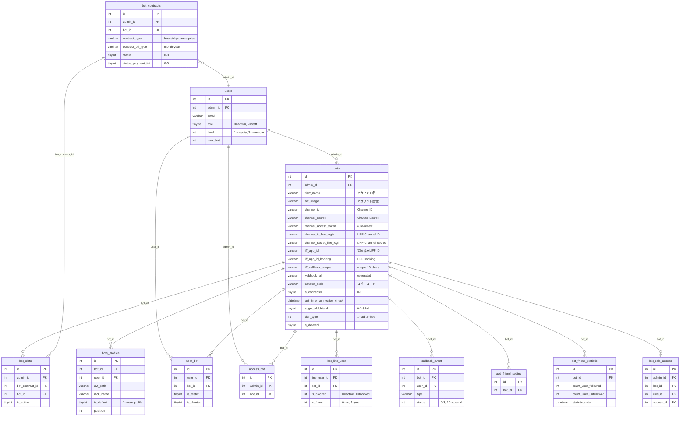

# DB Mapping — 「LOA接続設定」(Cài đặt kết nối LOA)

**Feature ID**: bot-edit
**Ngày phân tích**: 2026-03-30
**Nguồn**: DB schema (`reverse-spec/db/schema/tables/`) + logic-spec + api-spec + job-spec + sample data
**Confidence tổng thể**: Cao (cross-reference code + schema + sample data)

---

## 1. Primary Tables (trực tiếp liên quan)

Các bảng mà controllers/models trong logic-spec khai báo và thao tác trực tiếp.

| # | Bảng | Model Eloquent | Vai trò | Endpoints liên quan |
|---|------|---------------|---------|---------------------|
| 1 | `bots` | `App\Bots` | Bảng chính — lưu toàn bộ thông tin LOA | EP-01 ~ EP-13 |
| 2 | `bots_profiles` | `App\BotsProfiles` | Profile chat — đồng bộ ảnh/tên với bots | EP-02, EP-05 |
| 3 | `user_bot` | `App\BotUsers` | Pivot: gán user (staff/manager) cho bot | EP-02 |
| 4 | `access_bot` | `App\AccessBot` | Quyền truy cập bot cho admin/staff phụ | EP-01 (query) |
| 5 | `bot_line_user` | `App\BotLineUser` | Bạn bè LINE liên kết với bot | EP-04 (job INSERT) |

## 2. Secondary Tables (liên quan gián tiếp)

Các bảng liên quan qua FK, config, hoặc side effects.

| # | Bảng | Vai trò | Liên kết |
|---|------|---------|---------|
| 6 | `users` | Admin/Staff accounts — sở hữu bots | `bots.admin_id` → `users.id` |
| 7 | `bot_slots` | Slot quản lý bot trong hợp đồng | `bot_slots.bot_id` → `bots.id` |
| 8 | `bot_contracts` | Hợp đồng thanh toán (plan, billing) | `bot_contracts.id` → `bot_slots.bot_contract_id` |
| 9 | `callback_event` | Webhook callback events | `callback_event.bot_id` → `bots.id` |
| 10 | `add_friend_setting` | Cài đặt hành động khi có bạn mới | `add_friend_setting.bot_id` → `bots.id` |
| 11 | `bot_friend_statistic` | Thống kê bạn bè theo ngày | `bot_friend_statistic.bot_id` → `bots.id` |
| 12 | `bot_line_login` | LINE Login channel (có thể legacy) | `bot_line_login.bot_id` → `bots.id` |
| 13 | `bot_role_access` | Phân quyền truy cập module cho staff | `bot_role_access.bot_id` → `bots.id` |

---

## 3. Entity Details

### 3.1 Bảng `bots` (Primary)

**Model**: `App\Bots` | **PK**: `id` int(12) | **Timestamps**: `created_at`, `updated_at` | **Guarded**: `[]`

#### Columns liên quan đến tính năng bot-edit

| Cột | Kiểu | Nullable | Default | Key | Mô tả | Dùng bởi EP |
|-----|------|----------|---------|-----|-------|-------------|
| `id` | int(12) | NOT NULL | — | PK | Bot ID — xuất hiện trong URL, Webhook URL | Tất cả |
| `admin_id` | int(12) | NOT NULL | — | FK → users.id | Admin sở hữu bot | EP-01, EP-02 |
| `id_bot_change` | int(11) | NULL | NULL | — | ID bot thay thế (LOA入れ替え) | EP-08 |
| `line_id` | varchar(50) | NULL | NULL | — | LINE ID (@xxx) | — |
| `order` | int(11) | NOT NULL | 0 | — | Thứ tự sắp xếp trong danh sách | SCR-BE-02 (並べ替え) |
| `bot_name` | varchar(128) | NULL | NULL | — | Tên nội bộ (không hiển thị trên UI bot-edit) | — |
| `view_name` | varchar(128) | NULL | NULL | — | Tên hiển thị LOA (「アカウント名」) | EP-02 save |
| `bot_image` | varchar(500) | NULL | NULL | — | URL/path ảnh đại diện (「アカウント画像」) | EP-02, EP-05 |
| `webhook_url` | varchar(500) | NOT NULL | — | — | Webhook URL (generated: domain + bot_id) | EP-01 display |
| `channel_id` | varchar(128) | NULL | NULL | — | Messaging API Channel ID (read-only trên UI) | EP-02 |
| `channel_secret` | varchar(500) | NULL | NULL | — | Messaging API Channel Secret | EP-02 save |
| `channel_access_token` | varchar(500) | NULL | NULL | — | Access token LINE (auto-renew 30 ngày) | EP-02, EP-03, EP-05 |
| `channel_id_line_login` | varchar(255) | NULL | NULL | — | LINE Login Channel ID (「チャネル ID」LIFF) | EP-02, EP-06 |
| `channel_secret_line_login` | varchar(255) | NULL | NULL | — | LINE Login Channel Secret (「チャネルシークレット」LIFF) | EP-02, EP-06 |
| `liff_app_id` | varchar(50) | NULL | NULL | — | LIFF App ID chính — 流入アクション用 (「接続済みLIFF ID」) | EP-02, EP-06 |
| `liff_app_id_booking` | varchar(64) | NULL | NULL | — | LIFF App ID booking — 各種フォーム用 | EP-02, EP-06 |
| `liff_app_id_old` | varchar(255) | NULL | NULL | — | Backup LIFF App ID cũ (lần thay đổi đầu tiên) | EP-02, EP-06 |
| `liff_callback_unique` | varchar(50) | NULL | NULL | — | Random string 10 ký tự — unique per bot | EP-01, EP-02, EP-06 |
| `url_liff_app_callback` | varchar(255) | NULL | NULL | — | URL callback cho LIFF App booking | EP-02, EP-06 |
| `transfer_code` | varchar(16) | NULL | NULL | — | Mã transfer code (「コピーコード」trên UI) | EP-13 |
| `backup_code` | varchar(16) | NULL | NULL | — | Mã backup code | — |
| `is_connected` | tinyint(4) | NULL | 0 | — | Trạng thái kết nối: 0/1/2/3 | EP-03, EP-07, EP-11, EP-12 |
| `last_time_connection_check` | datetime | NULL | NULL | — | Thời điểm kiểm tra kết nối gần nhất | EP-03, EP-11 |
| `expired_date_channel_access_token` | datetime | NULL | NULL | — | Hạn access token (now + 28 ngày) | EP-02 |
| `renew_channel_access_error` | tinyint(4) | NOT NULL | 0 | — | 0=renew OK, 1=renew fail | EP-02 |
| `is_get_old_friend` | tinyint(4) | NOT NULL | 0 | — | Flag lấy bạn bè cũ: 0/1/3/fail | EP-04 |
| `plan_type` | int(11) | NOT NULL | 1 | — | 1=standard, 2=free | EP-08 check |
| `is_deleted` | tinyint(1) | NOT NULL | 0 | — | Soft delete flag | Tất cả |
| `url_add_friend` | varchar(128) | NULL | NULL | — | URL thêm bạn (khi tạo mới) | EP-02 create |
| `domain_url_shorten` | varchar(255) | NULL | NULL | — | Domain rút gọn URL tùy chỉnh | EP-02 save |
| `has_campaign` | tinyint(4) | NULL | 0 | — | 0=không, 1=có campaign | EP-10 |
| `is_verify` | tinyint(1) | NOT NULL | 0 | — | Tài khoản đã xác thực (verified LINE account) | EP-04 check |
| `role_add_bot` | tinyint(4) | NOT NULL | 0 | — | Quyền người tạo bot: 0=primary, 1=deputy, 2=manager, 3=support | EP-02 create |
| `user_add` | int(11) | NULL | NULL | — | User ID người tạo bot | EP-02 create |
| `bot_error_message` | text | NULL | NULL | — | Thông báo lỗi bot (xóa khi save) | EP-02 |
| `phone` | varchar(20) | NULL | NULL | — | Số điện thoại | EP-02 |
| `today_add_new_friend` | int(11) | NOT NULL | 0 | — | Bạn mới hôm nay | SCR-BE-02 display |
| `yesterday_add_new_friend` | int(11) | NOT NULL | 0 | — | Bạn mới hôm qua | SCR-BE-02 display |
| `today_block_friend` | int(11) | NOT NULL | 0 | — | Block hôm nay | SCR-BE-02 display |
| `yesterday_block_friend` | int(11) | NOT NULL | 0 | — | Block hôm qua | SCR-BE-02 display |
| `free_send_count` | int(11) | NOT NULL | 0 | — | Số tin nhắn free đã gửi | SCR-BE-02 display |
| `message_sent_count` | int(11) | NOT NULL | 0 | — | Số tin nhắn LOA đã gửi | SCR-BE-02 display |
| `status_bill_fail` | tinyint(4) | NOT NULL | 0 | — | Trạng thái thanh toán: 0~5 | SCR-BE-02 display |
| `bill_bot_type` | varchar(255) | NOT NULL | 'month' | — | Loại thanh toán: month/year | SCR-BE-02 display |
| `flag_get_old_friend` | tinyint(4) | NULL | 0 | — | Flag khác (có thể legacy) — khác `is_get_old_friend` | — |
| `flag_contract_new` | tinyint(4) | NOT NULL | 0 | — | 0=old (trước 1.5.2023), 1=new | — |
| `chat_enable` | int(4) | NULL | 0 | — | Bật/tắt chat | — |
| `bot_type` | int(4) | NULL | 0 | — | 0=LINE, 1=OLIOA | — |
| `max_friend_plan` | tinyint(4) | NOT NULL | 0 | — | 0=chưa max, 1=max bạn bè theo plan | — |
| `mobile_profile_selected_id` | int(10) UNSIGNED | NULL | NULL | — | Profile ID đang chọn trên mobile | — |
| `key_chatgpt` | varchar(255) | NULL | NULL | — | API key ChatGPT (nếu có) | — |

#### Columns KHÔNG liên quan trực tiếp (bỏ qua trong mapping)

Các cột về Stripe/billing (`strip_*`, `product_id`, `plan_id`, `subscription_id`), Google Sheets (`google_sheet_*`), affiliate (`store_olioa_id`), tutorial, popup settings, v.v. — không xuất hiện trên UI bot-edit.

#### Sample Data (bot_id = 1057 — Xuka_BOT_Booking)

| Cột | Giá trị |
|-----|---------|
| `id` | 1057 |
| `admin_id` | 513 |
| `view_name` | `'Xuka_BOT_Booking'` |
| `bot_image` | `'https://profile.line-scdn.net/0hYsEkuPwwBlx4...'` |
| `webhook_url` | `'https://booking.watermeru.com/line/callback/add/1057'` |
| `channel_id` | `'1623434246'` |
| `channel_secret` | `'058a91a81994ce8e6b1b241fb7540e77'` |
| `channel_id_line_login` | `'2006160353'` |
| `channel_secret_line_login` | `'fe96384af7daddc93c3378dad8f7b0bb'` |
| `liff_app_id` | `'2006160353-4k6p8oYj'` |
| `liff_app_id_booking` | `'2006160353-ZPDbARpw'` |
| `liff_callback_unique` | `'8I5mbHlYDr'` |
| `transfer_code` | `'j8iDxYFiBi'` |
| `url_liff_app_callback` | `'https://lme.watermeru.com/liff-callback/8I5mbHlYDr'` |
| `is_connected` | `1` |
| `last_time_connection_check` | `'2025-12-10 01:00:01'` |
| `plan_type` | `1` (standard) |
| `is_get_old_friend` | `3` (hoàn thành) |
| `expired_date_channel_access_token` | `'2026-02-28 00:00:00'` |
| `renew_channel_access_error` | `0` |
| `is_deleted` | `0` |
| `role_add_bot` | `0` (primary admin) |
| `message_sent_count` | `0` |

---

### 3.2 Bảng `bots_profiles`

**Model**: `App\BotsProfiles` | **PK**: `id` int(10) UNSIGNED | **Timestamps**: `created_at`, `updated_at`

| Cột | Kiểu | Nullable | Default | Key | Mô tả |
|-----|------|----------|---------|-----|-------|
| `id` | int(10) UNSIGNED | NOT NULL | — | PK | Auto-increment ID |
| `bot_id` | int(11) | NOT NULL | — | FK → bots.id | Bot liên kết |
| `user_id` | int(11) | NOT NULL | — | FK → users.id | User tạo profile |
| `avt_path` | varchar(255) | NULL | NULL | — | URL/path ảnh đại diện profile |
| `nick_name` | varchar(255) | NOT NULL | — | — | Tên hiển thị profile |
| `is_default` | tinyint(4) | NOT NULL | 0 | — | 1 = profile mặc định (đồng bộ với bots) |
| `position` | int(11) | NOT NULL | 1 | — | Thứ tự sắp xếp |

**Vai trò**: Mỗi bot có nhiều profiles (dùng cho chat). Profile `is_default = 1` là profile chính — được tự động cập nhật `avt_path` và `nick_name` khi save bot (EP-02) hoặc đồng bộ từ LINE (EP-05).

#### Sample Data (bot_id = 300)

```
(id=13, bot_id=300, user_id=115, avt_path='/msg_template/media/image-thumbnail/115/300/...', nick_name='zizi', is_default=1, position=1)
```

---

### 3.3 Bảng `user_bot`

**Model**: `App\BotUsers` | **PK**: `id` int(12)

| Cột | Kiểu | Nullable | Default | Key | Mô tả |
|-----|------|----------|---------|-----|-------|
| `id` | int(12) | NOT NULL | — | PK | Auto-increment ID |
| `user_id` | int(12) | NOT NULL | — | FK → users.id | User (staff/manager) được gán |
| `bot_id` | int(12) | NULL | NULL | FK → bots.id | Bot được gán |
| `is_tester` | tinyint(1) | NOT NULL | 0 | — | Flag tester |
| `is_deleted` | tinyint(1) | NOT NULL | 0 | — | Soft delete |
| `created_at` | datetime | NOT NULL | — | — | Ngày tạo |
| `updated_at` | datetime | NULL | NULL | — | Ngày cập nhật |

**Vai trò**: Bảng pivot liên kết user (staff/manager) với bot. Khi save bot-edit (EP-02): soft-delete tất cả (`is_deleted = 1`) rồi upsert lại theo danh sách `ids` từ request.

#### Sample Data

```
(id=1, user_id=7, bot_id=4, is_tester=0, is_deleted=0)
(id=5, user_id=21, bot_id=13, is_tester=0, is_deleted=1)
```

---

### 3.4 Bảng `access_bot`

**Model**: `App\AccessBot` | **PK**: `id` int(10) UNSIGNED

| Cột | Kiểu | Nullable | Default | Key | Mô tả |
|-----|------|----------|---------|-----|-------|
| `id` | int(10) UNSIGNED | NOT NULL | — | PK | Auto-increment ID |
| `admin_id` | int(11) | NOT NULL | — | FK → users.id | Admin/Staff được cấp quyền |
| `bot_id` | int(11) | NOT NULL | — | FK → bots.id | Bot được truy cập |
| `created_at` | datetime | NOT NULL | — | — | Ngày tạo |
| `updated_at` | datetime | NOT NULL | — | — | Ngày cập nhật |

**Vai trò**: Quyền truy cập bot cho admin/staff phụ. Dùng trong EP-01 để kiểm tra user có quyền xem bot không.

---

### 3.5 Bảng `bot_line_user`

**Model**: `App\BotLineUser` | **PK**: `id` int(11)

| Cột | Kiểu | Nullable | Default | Key | Mô tả |
|-----|------|----------|---------|-----|-------|
| `id` | int(11) | NOT NULL | — | PK | Auto-increment ID |
| `line_user_id` | int(11) | NOT NULL | — | FK | ID LINE user nội bộ |
| `bot_id` | int(11) | NOT NULL | — | FK → bots.id | Bot liên kết |
| `affiliater_id` | int(11) | NULL | NULL | FK | Affiliater giới thiệu |
| `rich_menu_id` | int(11) | NULL | NULL | FK | Rich menu đang gán |
| `followed_at` | timestamp | NULL | NULL | — | Thời điểm follow |
| `is_blocked` | int(11) | NULL | 0 | — | 0=active, 1=blocked |
| `status` | int(11) | NULL | 0 | — | Trạng thái |
| `is_friend` | int(11) | NOT NULL | 0 | — | 0=không, 1=bạn bè |
| `is_tester` | tinyint(1) | NOT NULL | 0 | — | Flag tester |
| `contact_status` | int(11) | NOT NULL | 0 | — | 0=chưa đăng ký, 1=đăng ký, 2=hợp đồng, 3=hủy |
| `created_at` | timestamp | NOT NULL | CURRENT_TIMESTAMP | — | Ngày tạo |
| `updated_at` | timestamp | NULL | ON UPDATE CURRENT_TIMESTAMP | — | Ngày cập nhật |

**Vai trò**: Danh sách bạn bè LINE của bot. Khi user nhấn「既存友だち情報取得」(EP-04), background job lấy followers từ LINE API rồi INSERT vào bảng này. Cột `is_blocked` và `is_friend` dùng để tính「総友だち数」,「有効友だち数」,「ブロック数」trên SCR-BE-02.

---

### 3.6 Bảng `users` (Secondary)

| Cột liên quan | Kiểu | Mô tả |
|---------------|------|-------|
| `id` | int(11) PK | User ID |
| `admin_id` | int(12) | Admin gốc (self-reference cho admin chính) |
| `role` | tinyint(1) | -1=admin hệ thống, 0=admin gốc, 1=user thường, 2=staff |
| `level` | int(11) | 1=deputy (副管理人), 2=manager, 3+=support |
| `max_bot` | int(11) | Giới hạn số bot tối đa |
| `is_deleted` | tinyint(1) | Soft delete |

**Vai trò**: Admin sở hữu bot (`bots.admin_id → users.id`). Cột `role` và `level` quyết định quyền trên UI.

---

### 3.7 Bảng `bot_slots` (Secondary)

| Cột | Kiểu | Nullable | Default | Key | Mô tả |
|-----|------|----------|---------|-----|-------|
| `id` | int(10) UNSIGNED | NOT NULL | — | PK | Slot ID |
| `admin_id` | int(11) | NULL | NULL | FK → users.id | Admin sở hữu |
| `bot_contract_id` | int(11) | NULL | NULL | FK → bot_contracts.id | Hợp đồng liên kết |
| `bot_id` | int(11) | NULL | NULL | FK → bots.id | Bot gán vào slot |
| `is_active` | tinyint(4) | NOT NULL | 1 | — | 0=inactive, 1=active |

**Vai trò**: Mỗi hợp đồng (`bot_contracts`) có nhiều slots, mỗi slot gắn 1 bot. Dùng trong EP-01 (kiểm tra `bot_slot_id` thuộc admin) và EP-08 (thay thế LOA).

---

### 3.8 Bảng `bot_contracts` (Secondary)

| Cột liên quan | Kiểu | Mô tả |
|---------------|------|-------|
| `id` | int(10) UNSIGNED PK | Contract ID |
| `admin_id` | int(11) | FK → users.id |
| `bot_id` | int(11) | FK → bots.id |
| `number_slot` | int(11) | Số slot |
| `contract_type` | varchar(100) | Loại: free, standard, enterprise, pro |
| `contract_bill_type` | varchar(100) | month / year |
| `status` | tinyint(4) | 0=chưa HĐ, 1=đang HĐ, 2=chờ hủy, 3=đã hủy |
| `status_payment_fail` | tinyint(4) | 0=no_fail, 1~5=các mức lỗi |
| `is_active` | tinyint(4) | 0=inactive, 1=active |
| `payment_method` | tinyint(4) | 1=card, 2=transfer |

**Vai trò**: Quản lý hợp đồng thanh toán. Cột `contract_type` + `contract_bill_type` quyết định「利用プラン」hiển thị trên SCR-BE-02. Cột `status_payment_fail` ảnh hưởng hiển thị badge「エルメ利用料の決済に失敗しました」.

---

### 3.9 Bảng `callback_event` (Secondary)

| Cột | Kiểu | Mô tả |
|-----|------|-------|
| `id` | int(10) UNSIGNED PK | Event ID |
| `user_id` | int(11) | FK → users.id |
| `bot_id` | int(11) | FK → bots.id |
| `type` | varchar(255) | Loại event: 'follow', etc. |
| `status` | int(11) | 0=chưa xử lý, 1=đang, 2=đã, 3=lỗi |

**Vai trò**: Khi save bot (EP-02), reset status từ 10 về 0 — đánh dấu callback events cần xử lý lại sau khi thay đổi cấu hình.

---

### 3.10 Bảng `add_friend_setting` (Secondary)

| Cột liên quan | Kiểu | Mô tả |
|---------------|------|-------|
| `id` | int(11) PK | Setting ID |
| `bot_id` | int(11) FK | Bot liên kết |
| `main_scenario_id` | int(11) | Scenario chính |

**Vai trò**: Cài đặt hành động khi có bạn mới/cũ follow. Được tạo mặc định khi bot mới được tạo (EP-02 create).

---

### 3.11 Bảng `bot_friend_statistic` (Secondary)

| Cột | Kiểu | Mô tả |
|-----|------|-------|
| `id` | int(10) UNSIGNED PK | Statistic ID |
| `bot_id` | int(11) FK | Bot liên kết |
| `count_user_followed` | int(11) | Số follow trong ngày |
| `count_user_unfollowed` | int(11) | Số unfollow trong ngày |
| `statistic_date` | datetime | Ngày thống kê |

**Vai trò**: Thống kê bạn bè theo ngày. Dùng để tính「総友だち数」,「有効友だち数」trên SCR-BE-02 (có thể aggregated).

---

## 4. UI ↔ DB Field Mapping

### 4.1 SCR-BE-01:「LOA接続設定」(/admin/bot-edit)

| UI Element | Label (JP) | DB Table | Column | Mapping Type | Confidence | Ghi chú |
|-----------|-----------|----------|--------|-------------|------------|---------|
| Ảnh đại diện | 「アカウント画像」 | `bots` | `bot_image` | Direct | **Cao** | Lưu URL hoặc path. Accessor wrap bằng `asset()` nếu không chứa `https`. Upload path: `media/images/{adminId}/{botId}/bot/` |
| Tên LOA | 「アカウント名」 | `bots` | `view_name` | Direct | **Cao** | varchar(128), required, max 100 (validate) |
| Channel ID | 「Channel ID」 | `bots` | `channel_id` | Direct | **Cao** | varchar(128), read-only trên UI, dùng để lấy token |
| Channel Secret | 「Channel Secret」 | `bots` | `channel_secret` | Direct | **Cao** | varchar(500), whitespace bị trim trước khi lưu |
| Webhook URL | 「Webhook URL」 | `bots` | `webhook_url` | Computed | **Cao** | Generated: `env('DOMAIN_ENDPOINT_WEBHOOK') + 'line/callback/add/' + bot_id`. Lưu trong DB nhưng hiển thị read-only |
| LINE Login Channel ID | 「チャネル ID」(LIFF) | `bots` | `channel_id_line_login` | Direct | **Cao** | varchar(255) |
| LINE Login Channel Secret | 「チャネルシークレット」(LIFF) | `bots` | `channel_secret_line_login` | Direct | **Cao** | varchar(255) |
| LIFF ID | 「接続済みLIFF ID」 | `bots` | `liff_app_id` | Direct | **Cao** | varchar(50), read-only, format: `{channelId}-{suffix}` |
| Mã copy | 「コピーコード」 | `bots` | `transfer_code` | Direct | **Cao** | varchar(16), read-only, 10 ký tự alphanumeric |
| Trạng thái kết nối | (badge/icon) | `bots` | `is_connected` | Enum | **Cao** | 0=lỗi auth, 1=OK, 2=webhook URL sai, 3=webhook tắt |
| — (hidden) | — | `bots` | `channel_access_token` | Computed | **Cao** | Auto-generated khi save Channel Secret. Không hiển thị trên UI |
| — (hidden) | — | `bots` | `expired_date_channel_access_token` | Computed | **Cao** | now + 28 ngày khi token mới. Không hiển thị trên UI |
| — (hidden) | — | `bots` | `liff_callback_unique` | Computed | **Cao** | Random 10 chars, sinh 1 lần. Không hiển thị trực tiếp |
| — (hidden) | — | `bots` | `liff_app_id_booking` | Computed | **Cao** | LIFF App booking — không hiển thị riêng trên UI |
| — (hidden) | — | `bots` | `url_liff_app_callback` | Computed | **Cao** | URL callback LIFF booking |
| — (hidden) | — | `bots` | `liff_app_id_old` | Direct | **Cao** | Backup LIFF ID cũ, lần đầu thay đổi |
| Ảnh profile (sync) | — | `bots_profiles` | `avt_path` | Direct | **Cao** | Đồng bộ khi save bot hoặc「情報更新」. WHERE `is_default = 1` |
| Tên profile (sync) | — | `bots_profiles` | `nick_name` | Direct | **Cao** | Đồng bộ khi save bot hoặc「情報更新」. WHERE `is_default = 1` |

### 4.2 SCR-BE-02:「アカウント一覧」(/admin/home)

| UI Element | Label (JP) | DB Table | Column | Mapping Type | Confidence | Ghi chú |
|-----------|-----------|----------|--------|-------------|------------|---------|
| Ảnh + Tên LOA | 「LINE公式アカウント」 | `bots` | `bot_image`, `view_name` | Direct | **Cao** | Hiển thị cả ảnh và tên |
| Quyền | 「操作権限」 | `user_bot` / logic | `user.role`, `user.level` | Computed | **Cao** | role=0 → 「主管理者」; level=1 → 「副管理人」. Tính từ user hiện tại + user_bot pivot |
| Tổng bạn bè | 「総友だち数」 | `bot_line_user` | COUNT(*) | Aggregated | **Cao** | COUNT bạn bè WHERE `is_friend = 1`. Có thể kết hợp `bot_friend_statistic` |
| Bạn bè active | 「有効友だち数」 | `bot_line_user` | COUNT(*) | Aggregated | **Cao** | 総友だち数 - ブロック数 |
| Số block | 「ブロック数」 | `bot_line_user` | COUNT(*) WHERE `is_blocked = 1` | Aggregated | **Cao** | Đếm bạn bè đã block |
| Tin nhắn L Message | 「エルメ配信数」 | `bot_contracts` / logic | — | Computed | **Trung bình** | Tính từ plan limits — `∞` khi unlimited. Không có 1 cột rõ ràng |
| Tin nhắn LOA | 「LOA配信数」 | `bots` | `message_sent_count` | Direct | **Cao** | Số tin nhắn LOA đã gửi |
| Gói sử dụng | 「利用プラン」 | `bot_contracts` | `contract_type`, `contract_bill_type` | Computed | **Cao** | Kết hợp: `free` → 「フリー」, `standard` + `year` → 「スタンダード（年間一括）」, `pro` + `year` → 「プロ（年間一括）」 |
| Trạng thái thanh toán lỗi | (badge đỏ) | `bot_contracts` | `status_payment_fail` | Enum | **Cao** | > 0 → hiển thị「エルメ利用料の決済に失敗しました」, ẩn cột 操作権限 |

### 4.3 SCR-BE-02: Tab Filter

| Tab (JP) | DB Table | Column | Filter | Confidence |
|----------|----------|--------|--------|------------|
| 「接続済」 | `bots` | `is_connected` | `is_connected = 1` | **Cao** |
| 「未接続」 | `bots` | `is_connected` | `is_connected != 1` (hoặc `= 0`) | **Trung bình** — có thể bao gồm 0, 2, 3 |

### 4.4 SCR-BE-03:「LOA入れ替え」

| UI Element | DB Table | Column | Mapping Type | Confidence | Ghi chú |
|-----------|----------|--------|-------------|------------|---------|
| Bot hiện tại | `bots` | `id`, `view_name` | Direct | **Cao** | Redirect nếu `plan_type = 2` (free) |
| Slot ID | `bot_slots` | `id` | Direct | **Cao** | Truyền qua URL param |

---

## 5. Enum / Status Values

### 5.1 `bots.is_connected` — Trạng thái kết nối

| DB Value | Ý nghĩa | UI Display | Set bởi |
|----------|---------|-----------|---------|
| `0` | Lỗi xác thực (auth fail) | (icon lỗi đỏ) | EP-03, EP-07, Daily Job |
| `1` | Kết nối OK | (icon xanh) / 「正常に接続しています。」 | EP-03, EP-07, EP-11, EP-12, Daily Job |
| `2` | Webhook URL sai | 「webhookの設定が間違っています」 | EP-03, EP-07, Daily Job |
| `3` | Webhook bị tắt | 「一度オフしてからオンにして下さい」 | EP-03, EP-07, Daily Job |

### 5.2 `bots.is_get_old_friend` — Flag lấy bạn bè cũ

| DB Value | Ý nghĩa | Ghi chú |
|----------|---------|---------|
| `0` | Chưa yêu cầu | Mặc định |
| `1` | Đang xử lý | Background job đang chạy |
| `3` | Hoàn thành | Job đã lấy xong danh sách bạn bè |
| `fail` (config value) | API không hỗ trợ | Tài khoản chưa verified |

### 5.3 `bots.plan_type` — Loại plan

| DB Value | Ý nghĩa | UI Display |
|----------|---------|-----------|
| `1` | Standard | (hiển thị chi tiết từ `bot_contracts.contract_type`) |
| `2` | Free | 「フリー」 |

### 5.4 `bots.renew_channel_access_error` — Trạng thái renew token

| DB Value | Ý nghĩa |
|----------|---------|
| `0` | Renew thành công |
| `1` | Renew thất bại |

### 5.5 `bots.role_add_bot` — Quyền người tạo bot

| DB Value | Ý nghĩa | Comment DB |
|----------|---------|-----------|
| `0` | Primary admin | primary admin |
| `1` | Deputy manager | Deputy manager (副管理人) |
| `2` | Manager | manager |
| `3` | Support | support |

### 5.6 `bots.status_bill_fail` — Trạng thái thanh toán thất bại

| DB Value | Ý nghĩa | Comment DB |
|----------|---------|-----------|
| `0` | Không lỗi | no_fail |
| `1` | Lỗi lần đầu | first_fail |
| `2` | Lỗi khi retry | retry_fail |
| `3` | Lỗi 3 ngày | 3day_fail |
| `4` | Lỗi 6 ngày | 6day_fail |
| `5` | Lỗi 7 ngày | 7day_fail |

### 5.7 `bot_contracts.contract_type` + `contract_bill_type` — Gói sử dụng UI

| contract_type | contract_bill_type | UI Display (JP) |
|--------------|-------------------|----------------|
| `free` | `month` | 「フリー」 |
| `standard` | `month` | 「スタンダード」 |
| `standard` | `year` | 「スタンダード（年間一括）」 |
| `pro` | `month` | 「プロ」 |
| `pro` | `year` | 「プロ（年間一括）」 |
| `enterprise` | `month` | 「エンタープライズ」 |

### 5.8 `bot_contracts.status_payment_fail` — Trạng thái thanh toán contract

| DB Value | Ý nghĩa | UI Display |
|----------|---------|-----------|
| `0` | Không lỗi | (hiển thị bình thường) |
| `1` ~ `5` | Các mức lỗi | 「エルメ利用料の決済に失敗しました」 + badge「再決済」 |

### 5.9 `users.role` — Vai trò user

| DB Value | Ý nghĩa | UI Display trên SCR-BE-02 |
|----------|---------|--------------------------|
| `-1` | Admin hệ thống (system) | — |
| `0` | Admin gốc (chủ tài khoản) | 「主管理者」 |
| `1` | User thường | — |
| `2` | Staff | Theo `level` |

### 5.10 `users.level` — Cấp độ user

| DB Value | Ý nghĩa | UI Display trên SCR-BE-02 |
|----------|---------|--------------------------|
| `1` | Deputy manager | 「副管理人」 |
| `2` | Manager | — |
| `3+` | Support | — |

### 5.11 `callback_event.status` — Trạng thái xử lý event

| DB Value | Ý nghĩa |
|----------|---------|
| `0` | Chưa xử lý |
| `1` | Đang xử lý |
| `2` | Đã xử lý |
| `3` | Xử lý lỗi |
| `10` | Đặc biệt — reset về 0 khi save bot |

---

## 6. Unmapped Items

### 6.1 UI fields không tìm thấy DB match rõ ràng

| UI Element | Label (JP) | Lý do | Confidence |
|-----------|-----------|-------|------------|
| Nút「接続チェック」 | — | Action button, không lưu DB (chỉ trigger API call + update `is_connected`) | **Cao** |
| Nút「情報更新」 | — | Action button, trigger LINE API sync | **Cao** |
| Nút「既存友だち情報取得」 | — | Action button, set flag `is_get_old_friend` | **Cao** |
| Nút「保存」 | — | Action button, trigger EP-02 | **Cao** |
| 「エルメ配信数」(∞ unlimited) | — | Tính toán từ logic plan — không có 1 cột DB rõ ràng lưu giá trị "∞" | **Trung bình** — có thể dựa vào `free_send_count` hoặc plan limits |
| 「並べ替え」(sort order) | — | Có thể UPDATE `bots.order`, nhưng logic sort chưa xác nhận rõ từ code | **Trung bình** |

### 6.2 DB columns trong `bots` không xuất hiện trên UI bot-edit

| Column | Kiểu | Mô tả | Lý do không hiển thị |
|--------|------|-------|---------------------|
| `bot_name` | varchar(128) | Tên nội bộ (khác `view_name`) | Có thể legacy hoặc dùng nội bộ |
| `line_id` | varchar(50) | LINE ID (@xxx) | Không hiển thị trên trang bot-edit |
| `store_olioa_id` | int(11) | ID cửa hàng OLIOA | Hệ thống OLIOA, không liên quan |
| `introduce`, `introduce2`, `introduce3` | text | Giới thiệu | Dùng ở trang khác |
| `is_confirm`, `general_money`, `vip_money`, `svip_money`, `ssvip_money` | mixed | Cài đặt phí | Module thanh toán riêng |
| `is_aff_view` | tinyint(1) | Hiển thị affiliate | Module affiliate |
| `strip_*` (customer_id, card_id, etc.) | varchar | Stripe billing | Module thanh toán |
| `product_id`, `plan_id`, `subscription_id` | varchar | Stripe subscription | Module thanh toán |
| `strip_email` | varchar | Email Stripe | Module thanh toán |
| `login_channel_id` | varchar(255) | Channel ID login (có thể legacy) | Có thể trùng với `channel_id_line_login` |
| `tag_add_friend` | varchar(128) | Tag khi thêm bạn | Module tag |
| `google_sheet_*` | mixed | Google Sheets integration | Module Google Sheets |
| `key_chatgpt` | varchar(255) | API key ChatGPT | Module AI chat |
| `server_id` | int(11) | Server ID | Internal config |
| `bot_type` | int(4) | 0=LINE, 1=OLIOA | Phân loại hệ thống |
| `chat_enable` | int(4) | Bật/tắt chat | Module chat |
| `setting_info_my_page` | text | Cài đặt My Page | Module my page |
| `type_job` | int(11) | Loại job | Internal |
| `count_user_unconfirm` | int(11) | Số user chưa xác nhận | Module thống kê |
| `confirm_message_*` | tinyint(4) | Cài đặt xác nhận tin nhắn | Module chat settings |
| `setting_shortcut` | tinyint(4) | Phím tắt gửi tin | Module chat |
| `flag_contract_new` | tinyint(4) | Flag hợp đồng mới/cũ | Module billing |
| `max_friend_plan` | tinyint(4) | Max bạn bè theo plan | Module plan limits |
| `mobile_profile_selected_id` | int(10) | Profile trên mobile | Module mobile |
| `datetime_first_payment` | datetime | Ngày thanh toán đầu | Module billing |
| `count_app_notify` | int(11) | Đếm app notification | Module notification |
| `bot_deletion_auth_code` | varchar(255) | Mã xóa bot | Module xóa bot |
| `time_click_modal_notify` | datetime | Thời điểm click modal | UX tracking |
| `preview_after_send` | tinyint(4) | Preview sau khi gửi | Module chat |
| `datetime_trial`, `datetime_show_trial` | datetime | Trial period | Module trial |
| `has_tutorial` | tinyint(4) | Flag tutorial | Module onboarding |
| `first_date_check_friend` | datetime | Ngày kiểm tra bạn bè đầu tiên | Internal |
| `flag_get_old_friend` | tinyint(4) | Flag khác (có thể legacy, khác `is_get_old_friend`) | Có thể trùng lặp |
| `is_shorten_url` | tinyint(4) | Bật rút gọn URL | Module URL shortener |
| `expired_date` | datetime | Hạn sử dụng | Module billing |
| `expired_date_free_plan` | datetime | Hạn plan free | Module billing |
| `invoice_name` | varchar(255) | Tên hóa đơn | Module billing |
| `type_customer` | varchar(255) | 1=cá nhân, 2=doanh nghiệp | Module billing |
| `format_gg_type` | tinyint(4) | Kiểu format Google | Module Google integration |

---

## 7. Entity Relationships (ER Diagram)



---

## 8. Tóm tắt DB Changes theo Action

| Action (UI) | Bảng `bots` (columns) | Bảng `bots_profiles` | Bảng `user_bot` | Bảng khác |
|-------------|----------------------|---------------------|-----------------|-----------|
| 「保存」(EP-02) | `view_name`, `channel_secret`, `channel_access_token`, `bot_image`, `domain_url_shorten`, `channel_id_line_login`, `channel_secret_line_login`, `liff_app_id`, `liff_app_id_booking`, `liff_callback_unique`, `url_liff_app_callback`, `liff_app_id_old`, `expired_date_channel_access_token`, `renew_channel_access_error`, `bot_error_message` (xóa) | UPDATE `avt_path`, `nick_name` WHERE `is_default=1` | Soft-delete all → upsert | `callback_event`: status 10→0 |
| 「情報更新」(EP-05) | `bot_image`, `view_name` | UPDATE `avt_path`, `nick_name` WHERE `is_default=1` | — | — |
| 「接続チェック」(EP-03) | `is_connected` (0/1/2/3), `last_time_connection_check` | — | — | — |
| 「既存友だち情報取得」(EP-04) | `is_get_old_friend` (→ 1) | — | — | Job: INSERT `bot_line_user` |
| LIFF reconnect「はい」(EP-06) | `liff_app_id`, `liff_app_id_booking`, `liff_app_id_old`, `liff_callback_unique`, `channel_id_line_login`, `channel_secret_line_login`, `url_liff_app_callback` | — | — | — |
| 「チェックする」(EP-07) | `is_connected` (0/1/2/3) | — | — | — |
| Set time webhook (EP-11) | `is_connected` (→ 1), `last_time_connection_check` (→ now + 6 tháng) | — | — | — |
| Set domain (EP-12) | `is_connected` (→ 1) | — | — | LINE API: PUT webhook endpoint |
| Daily Job (Spring Boot) | `is_connected` (0/1/2/3), `last_time_connection_check` | — | — | — |
| Reactive Token Refresh | `channel_access_token` | — | — | — |

---

## 9. Job ↔ DB Interaction

### Job 1: Kiểm tra trạng thái kết nối (Daily 01:00 AM)

| Thao tác | Bảng | Columns | Điều kiện |
|----------|------|---------|-----------|
| SELECT (poll) | `bots` | `*` | `is_connected = 1 AND is_deleted = 0` |
| UPDATE | `bots` | `is_connected`, `last_time_connection_check` | Theo kết quả kiểm tra 3 lớp |

### Job 2: Reactive Token Refresh (on-demand)

| Thao tác | Bảng | Columns | Điều kiện |
|----------|------|---------|-----------|
| SELECT | `bots` | `channel_id`, `channel_secret`, `channel_access_token` | Khi LINE API trả lỗi token |
| UPDATE | `bots` | `channel_access_token` | Sau khi lấy token mới từ LINE OAuth API |

### Job "Lấy bạn bè cũ" (KHÔNG tìm thấy trong Spring Boot)

| Thao tác dự kiến | Bảng | Columns | Ghi chú |
|------------------|------|---------|---------|
| SELECT (poll) | `bots` | `is_get_old_friend` | Flag = 1 → bắt đầu lấy. **Nhưng KHÔNG tìm thấy consumer trong Spring Boot** |
| INSERT | `bot_line_user` | `line_user_id`, `bot_id`, etc. | Từ LINE Followers API |
| UPDATE | `bots` | `is_get_old_friend` | → 3 (hoàn thành) hoặc fail |

> **Confidence**: Cao — đã grep toàn bộ codebase Spring Boot, không tìm thấy job poll `is_get_old_friend`. Có thể xử lý bởi Laravel queue hoặc artisan command.

---

## 10. Ghi chú bổ sung

### 10.1 Webhook URL — Computed, không phải user input
- **DB column**: `bots.webhook_url` (varchar 500) — lưu giá trị nhưng read-only trên UI
- **Công thức**: `env('DOMAIN_ENDPOINT_WEBHOOK') + 'line/callback/add/' + bots.id`
- **Production**: `https://cb.lme.jp/line/callback/add/{botId}`
- **Test server**: `https://booking.watermeru.com/line/callback/add/{botId}`
- **Confidence**: Cao — xác nhận từ sample data: bot 1057 → `webhook_url = 'https://booking.watermeru.com/line/callback/add/1057'`

### 10.2 Hashids Encoding — Bot ID trên URL
- URL parameter `id` luôn encode bằng Hashids (ví dụ: `/admin/bot-edit?id=xxx`)
- Một số AJAX endpoint nhận `bot_id` plain (EP-03, EP-05, EP-07, EP-11, EP-12)
- **DB lưu plain int** — decode trước khi query

### 10.3 Hai cột tên khác nhau
- `bots.bot_name` (varchar 128) — tên nội bộ, có thể NULL, không hiển thị trên UI bot-edit
- `bots.view_name` (varchar 128) — tên hiển thị trên UI, map với「アカウント名」
- **Confidence**: Cao — xác nhận từ code `botChange()` lưu `bot_name` (request param) vào `view_name` (DB column)

### 10.4 Hai cột LIFF App
- `bots.liff_app_id` (varchar 50) — LIFF App chính cho 流入アクション (landing pages, surveys)
- `bots.liff_app_id_booking` (varchar 64) — LIFF App cho 各種フォーム (forms, calendars, events)
- UI chỉ hiển thị「接続済みLIFF ID」= `liff_app_id`, không hiển thị `liff_app_id_booking`

### 10.5 `flag_get_old_friend` vs `is_get_old_friend`
- Bảng `bots` có **2 cột** liên quan đến lấy bạn bè cũ:
  - `is_get_old_friend` (tinyint 4, default 0) — cột chính, dùng bởi EP-04 (`addFlagGetOldFriend`)
  - `flag_get_old_friend` (tinyint 4, default 0) — có thể legacy hoặc dùng mục đích khác
- **Confidence**: Trung bình — chưa xác nhận rõ vai trò của `flag_get_old_friend` trong code

### 10.6 `login_channel_id` vs `channel_id_line_login`
- `bots.login_channel_id` (varchar 255) — có thể legacy
- `bots.channel_id_line_login` (varchar 255) — cột chính, dùng trong `botChange()` và `reCreateLiffApp()`
- **Confidence**: Trung bình — `login_channel_id` không xuất hiện trong logic-spec, có thể là phiên bản cũ
