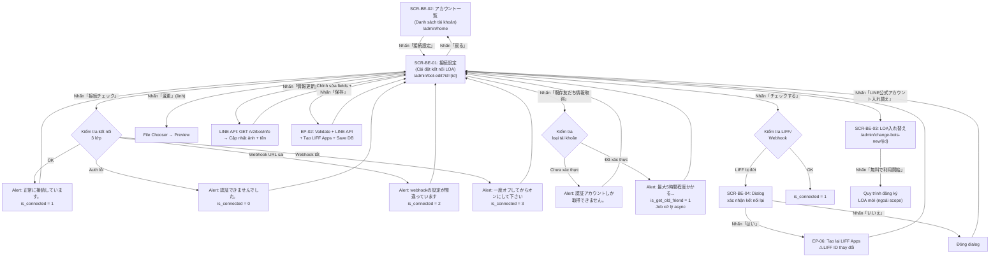
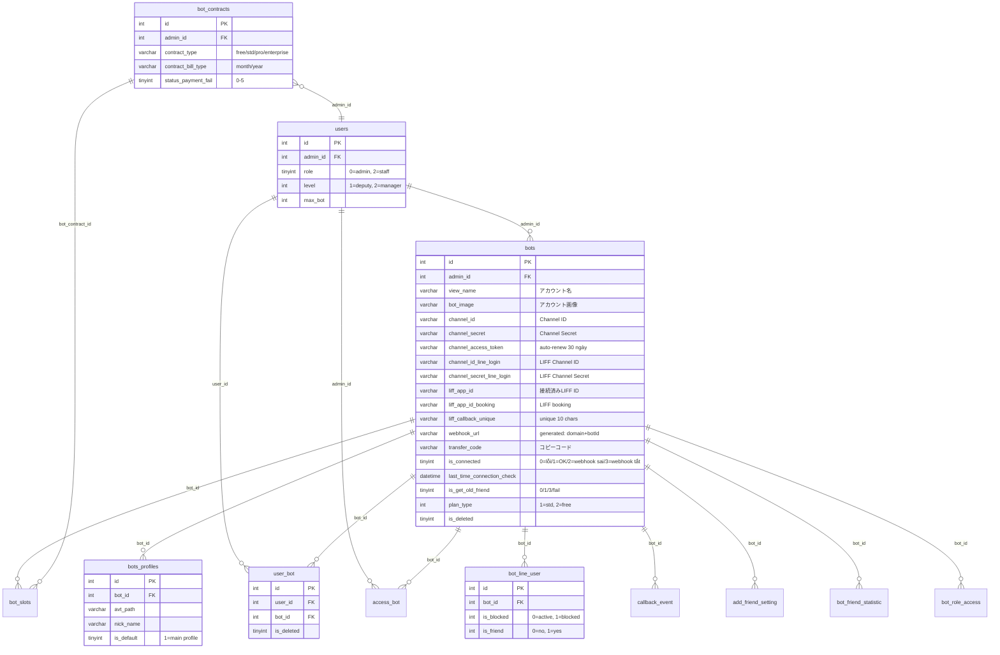
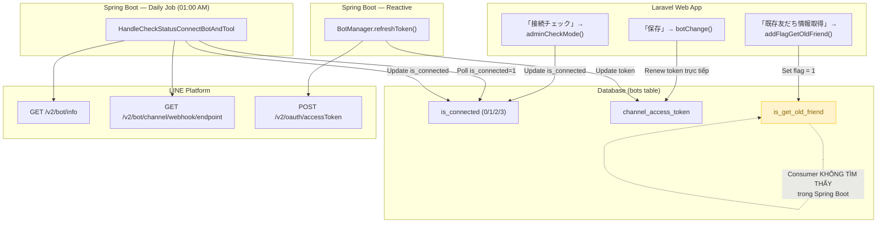

# Feature Spec — 「LOA接続設定」(Cài đặt kết nối LOA)

**Feature ID**: bot-edit
**Ngày tổng hợp**: 2026-03-30
**Nguồn**: UI scan (Playwright CLI) + Laravel source code + Spring Boot source code + DB schema + sample data
**Validation**: ĐẠT — 7/7 cross-checks pass (xem `_internal/validation-report.md`)

---

## 1. Tổng quan

### Mục đích

Tính năng「LOA接続設定」cho phép Admin quản lý toàn bộ cấu hình kết nối giữa L Message (エルメ) và LINE Official Account (LOA). Đây là trang quản trị trung tâm cho việc thiết lập và duy trì kết nối giữa hệ thống L Message với LINE Platform.

### Actors

| Actor | Vai trò | Ghi chú |
|-------|---------|---------|
| **Admin (主管理者)** | Toàn quyền: xem, chỉnh sửa, kiểm tra kết nối, thay thế LOA, lấy thông tin bạn bè | `users.role = 0` |
| **Admin (副管理人)** | Có thể xem và chỉnh sửa (quyền hạn tương đương, không có middleware chặn riêng) | `users.level = 1` |
| **Staff** | Không truy cập — sidebar menu ẩn mục này. Backend **không có middleware chặn rõ ràng** | Xem mục Gaps |
| **Background Job (Spring Boot)** | Kiểm tra kết nối hàng ngày, làm mới token tự động | Timer 01:00 AM daily |

### Phạm vi

| Chức năng | Mô tả |
|-----------|-------|
| Xem/chỉnh sửa thông tin LOA | Tên, ảnh đại diện, Channel Secret, LIFF credentials |
| Kiểm tra trạng thái kết nối | 3 lớp: Bot Info API → Webhook URL → Webhook Active |
| Quản lý LIFF App | Kiểm tra, kết nối lại khi bị đứt |
| Đồng bộ từ LINE Manager | Lấy ảnh/tên mới nhất từ LINE Platform |
| Lấy thông tin bạn bè hiện có | Yêu cầu tài khoản verified, xử lý bất đồng bộ (tối đa 5 giờ) |
| Thay thế LOA | Chuyển sang LOA mới (không áp dụng cho gói free) |
| Sao chép dữ liệu (Data Copy) | Dùng mã「コピーコード」để copy cấu hình giữa các LOA |

### Entry Point

Từ trang「アカウント一覧」(`/admin/home`) → nhấn nút「接続設定」trên dòng LOA tương ứng → navigate đến `/admin/bot-edit?id={id}`.

---

## 2. Các màn hình và Luồng xử lý end-to-end

### 2.1 SCR-BE-01:「LOA接続設定」(Cài đặt kết nối LOA)

**URL**: `/admin/bot-edit?id={id}` (id = Hashids encoded)

#### Layout

```
+------------------------------------------------------------------+
| Header: L Message logo                                           |
+----------+-------------------------------------------------------+
| Sidebar  | Toolbar: 「接続設定」(title)                            |
|          |   [接続チェック] [既存友だち情報取得]                      |
|          |   [LINE公式アカウント入れ替え]                            |
|          +-------------------------------------------------------+
|          | Section 1: LINE公式アカウント表示                         |
|          |   - アカウント画像 + [変更]                               |
|          |   - アカウント名 (textbox)                               |
|          |   - [情報更新]                                           |
|          +-------------------------------------------------------+
|          | Section 2: 接続情報                                      |
|          |   - Channel ID (read-only)                              |
|          |   - Channel Secret (textbox)                            |
|          |   - Webhook URL (read-only)                             |
|          +-------------------------------------------------------+
|          | Section 3: LINEログイン（LIFF）設定情報                    |
|          |   - LIFFアプリ接続確認 + [チェックする]                    |
|          |   - チャネル ID (textbox)                                |
|          |   - チャネルシークレット (textbox)                        |
|          |   - 接続済みLIFF ID (read-only)                          |
|          +-------------------------------------------------------+
|          | Section 4: データコピー                                   |
|          |   - コピーコード (read-only + copy icon)                  |
|          +-------------------------------------------------------+
|          | Footer: [保存] [戻る]                                    |
+----------+-------------------------------------------------------+
```

#### Luồng: Lưu thay đổi (「保存」)

```
User nhấn「保存」
  → UI: POST /admin/bot-save (EP-02)
  → API: BotController@botChange
  → Logic:
    1. Validate: bot_name required|max:100
    2. Nếu channel_secret thay đổi:
       → LINE API: POST /v2/oauth/accessToken (Messaging API)
       → Thành công: lưu channel_access_token, expired_date +28 ngày
       → Thất bại: trả lỗi「入力した情報が間違っています...」
    3. Nếu LINE Login credentials thay đổi:
       → LINE API: POST /v2/oauth/accessToken (LINE Login)
       → Tạo 2 LIFF Apps mới (POST /liff/v1/apps)
       → Cập nhật: liff_app_id, liff_app_id_booking, liff_callback_unique
       → Backup: liff_app_id_old (lần đầu)
    4. Xử lý ảnh: upload → resize max 2048px → lưu
    5. Cập nhật DB:
       → bots: view_name, channel_secret, channel_access_token, bot_image, ...
       → bots_profiles (is_default=1): avt_path, nick_name
       → user_bot: soft-delete all → upsert lại
       → callback_event: status 10 → 0
  → Response: { success: true }
  → UI: thông báo thành công
```

#### Luồng: Kiểm tra kết nối (「接続チェック」)

```
User nhấn「接続チェック」
  → UI: POST /admin/bot/check-mode (EP-03)
  → API: UserController@adminCheckMode
  → Logic (3 lớp kiểm tra):
    1. GET /v2/bot/info → xác nhận token hợp lệ
       → Thất bại: is_connected = 0 → Alert「認証できませんでした。」
    2. GET /v2/bot/channel/webhook/endpoint → lấy endpoint URL
       → So sánh với expected: DOMAIN_ENDPOINT_WEBHOOK + 'line/callback/add/' + botId
       → URL khác: is_connected = 2 → Alert「webhookの設定が間違っています」
    3. Kiểm tra active flag
       → active = false: is_connected = 3 → Alert「一度オフしてからオンにして下さい」
    4. Tất cả OK: is_connected = 1 → Alert「正常に接続しています。」
  → DB: UPDATE bots SET is_connected, last_time_connection_check
```

#### Luồng: Lấy thông tin bạn bè hiện có (「既存友だち情報取得」)

```
User nhấn「既存友だち情報取得」
  → UI: POST /ajax/add-flag-get-old-friend (EP-04)
  → API: BotController@addFlagGetOldFriend
  → Logic:
    1. Gọi LINE API: GET /v2/bot/followers/ids
       → Thất bại (unverified account): is_get_old_friend = fail
         → Alert「認証アカウントしか取得できません。」
       → Thành công: is_get_old_friend = 1 (đang xử lý)
         → Alert「既存友だち情報の取得には最大5時間程度かかる場合があります。ページを閉じてください。」
    2. Background job xử lý async (xem mục 7 - Gaps)
  → DB: UPDATE bots SET is_get_old_friend
```

#### Luồng: Đồng bộ từ LINE Manager (「情報更新」)

```
User nhấn「情報更新」
  → UI: POST /ajax/reGetAvatarBot (EP-05)
  → API: BotController@reGetAvatarBot
  → Logic:
    1. GET /v2/bot/info → lấy pictureUrl, displayName
    2. Cập nhật DB:
       → bots: bot_image, view_name
       → bots_profiles (is_default=1): avt_path, nick_name
  → Response: { success: true, img: "...", nick_name: "..." }
  → UI: cập nhật ảnh và tên hiển thị
```

#### Luồng: Kiểm tra LIFF (「チェックする」)

```
User nhấn「チェックする」
  → UI: POST /ajax/check-enable-use-webhook-modal (EP-07)
  → API: BotController@checkEnableWebhookModal
  → Logic:
    1. GET /v2/bot/channel/webhook/endpoint
       → active = false: is_connected = 3 → lỗi, flagError = 1
       → URL khác expected: is_connected = 2 → lỗi, flagError = 1
       → OK: is_connected = 1 → success
  → Nếu LIFF bị đứt: hiển thị SCR-BE-04 (dialog xác nhận kết nối lại)
```

#### Luồng: Kết nối lại LIFF (SCR-BE-04 → 「はい」)

```
User nhấn「はい」trong dialog cảnh báo
  → UI: POST /ajax/bot/re-create-liffapp (EP-06)
  → API: BotController@reCreateLiffApp
  → Logic:
    1. POST /v2/oauth/accessToken (LINE Login) → tokenLineLogin
    2. Nếu liffAppError = 1: tạo LIFF App chính (流入アクション用)
    3. Nếu liffAppErrorBooking = 1: tạo LIFF App booking (各種フォーム用)
    4. Cập nhật DB: liff_app_id, liff_app_id_booking, liff_app_id_old, ...
  → **Cảnh báo**: LIFF ID thay đổi → 回答フォーム, 商品, カレンダー予約, イベント予約, 流入アクション có thể bị ảnh hưởng
```

#### Luồng: Thay đổi ảnh đại diện (「変更」)

```
User nhấn「変更」→ File Chooser → chọn ảnh
  → Preview ảnh mới trên giao diện
  → User nhấn「保存」→ xử lý trong luồng Save (EP-02)
  → Logic: Image::make() → resize max 2048px → lưu media/images/{adminId}/{botId}/bot/
```

---

### 2.2 SCR-BE-02:「アカウント一覧」(Danh sách tài khoản)

**URL**: `/admin/home`

#### Layout

```
+------------------------------------------------------------------+
| Header: L Message logo                                           |
+----------+-------------------------------------------------------+
| Sidebar  | お知らせ (Thông báo)                                    |
|          |   Bảng: 投稿日 | お知らせ内容                            |
|          +-------------------------------------------------------+
|          | アカウント一覧                                           |
|          |   Tabs: [接続済] [未接続]                                |
|          |   Buttons: [エンタープライズプラン申込]                    |
|          |            [LINE公式アカウント追加] [並べ替え]             |
|          |   Table: danh sách LOA (15 items/page)                  |
|          |   Pagination                                            |
+----------+-------------------------------------------------------+
```

#### Luồng: Load danh sách (EP-09)

```
User truy cập /admin/home
  → API: UserController@index
  → Logic: Render view, danh sách bot load async qua JavaScript (AJAX)
  → Data hiển thị per LOA:
    - Ảnh + Tên: bots.bot_image, bots.view_name
    - Quyền: users.role (0=主管理者) hoặc users.level (1=副管理人)
    - Thống kê: COUNT(bot_line_user) → tổng bạn bè, active, block
    - Tin nhắn: bots.message_sent_count (LOA), plan limits (エルメ)
    - Gói: bot_contracts.contract_type + contract_bill_type
    - Thanh toán lỗi: bot_contracts.status_payment_fail > 0 → badge đỏ
```

#### Tabs filter

| Tab | DB Filter | Confidence |
|-----|-----------|------------|
| 「接続済」 | `bots.is_connected = 1` | Cao |
| 「未接続」 | `bots.is_connected != 1` (có thể bao gồm 0, 2, 3) | Trung bình |

#### Action buttons per LOA

| Trạng thái | Buttons |
|------------|---------|
| Hoạt động bình thường | 「アップグレード」+「接続設定」 |
| Gói cao (プロ trở lên) | 「接続設定」only |
| Thanh toán thất bại | 「再決済」+「接続設定」 |

---

### 2.3 SCR-BE-03:「LOA入れ替え」(Thay thế LOA)

**URL**: `/admin/change-bots-new/{id}`

#### Luồng: Thay thế LOA (EP-08)

```
User nhấn「LINE公式アカウント入れ替え」(từ SCR-BE-01)
  → API: BotController@adminChangeNewBot
  → Logic:
    1. Decode id → tìm bot
    2. Nếu plan_type = 2 (free) → redirect về /admin/home
    3. Render view: trang đăng ký LOA mới (landing page marketing)
  → User nhấn「無料で利用開始」→ bắt đầu quy trình đăng ký LOA mới (ngoài scope)
```

---

### 2.4 SCR-BE-04:「LIFFアプリ接続確認ダイアログ」

**Dialog modal trên SCR-BE-01** — chỉ xuất hiện khi LIFF bị đứt.

#### Nội dung cảnh báo

> LIFFアプリの接続が切れているため再接続処理を行います。再接続処理を行なった場合、すでに作成済みの回答フォーム、商品、カレンダー予約、イベント予約、流入アクションが利用できなくなる場合があります。

(Kết nối LIFF App đã bị đứt, sẽ thực hiện kết nối lại. Nếu thực hiện kết nối lại, các form trả lời, sản phẩm, đặt lịch calendar, đặt lịch sự kiện, hành động thu hút đã tạo trước đó có thể không sử dụng được.)

| Nút | Hành vi |
|-----|---------|
| 「はい」 | → EP-06: kết nối lại LIFF App (tạo LIFF mới, LIFF ID thay đổi) |
| 「いいえ」/ [X] | Đóng dialog, không thay đổi |

---

### Flow Diagram tổng thể



---

## 3. Data Model

### Entities chính

| # | Bảng | Model | Vai trò | PK |
|---|------|-------|---------|-----|
| 1 | `bots` | `App\Bots` | Bảng trung tâm — lưu toàn bộ thông tin LOA, credentials, trạng thái | `id` int(12) |
| 2 | `bots_profiles` | `App\BotsProfiles` | Profile chat — đồng bộ ảnh/tên với bots (profile `is_default = 1`) | `id` int(10) |
| 3 | `user_bot` | `App\BotUsers` | Pivot: gán user (staff/manager) cho bot | `id` int(12) |
| 4 | `access_bot` | `App\AccessBot` | Quyền truy cập bot cho admin/staff phụ | `id` int(10) |
| 5 | `bot_line_user` | `App\BotLineUser` | Danh sách bạn bè LINE của bot | `id` int(11) |
| 6 | `users` | — | Admin/Staff accounts | `id` int(11) |
| 7 | `bot_slots` | `App\BotSlots` | Slot quản lý bot trong hợp đồng | `id` int(10) |
| 8 | `bot_contracts` | `App\BotContracts` | Hợp đồng thanh toán (plan, billing) | `id` int(10) |
| 9 | `callback_event` | — | Webhook callback events | `id` int(10) |
| 10 | `add_friend_setting` | — | Cài đặt hành động khi có bạn mới | `id` int(11) |
| 11 | `bot_friend_statistic` | — | Thống kê bạn bè theo ngày | `id` int(10) |
| 12 | `bot_line_login` | — | LINE Login channel (có thể legacy) | — |
| 13 | `bot_role_access` | — | Phân quyền truy cập module cho staff | — |

### ER Diagram



---

## 4. Field Traceability Matrix

### SCR-BE-01:「LOA接続設定」

| # | UI Element | Label (JP) | DB Table.Column | Hướng | Validation | Business Rule |
|---|-----------|-----------|----------------|-------|------------|---------------|
| 1 | Ảnh đại diện | 「アカウント画像」 | `bots.bot_image` | R/W | File ảnh, resize max 2048px | BR-12~15: Upload path `media/images/{adminId}/{botId}/bot/`. Nếu `url_image = '/images/camera.png'` → xóa ảnh |
| 2 | Tên LOA | 「アカウント名」 | `bots.view_name` | R/W | `required\|max:100` | DB column varchar(128). **Lưu ý**: `bots.bot_name` là cột khác (tên nội bộ, không hiển thị trên UI) |
| 3 | Channel ID | 「Channel ID」 | `bots.channel_id` | R | — (read-only) | Set khi kết nối LOA lần đầu, không chỉnh sửa |
| 4 | Channel Secret | 「Channel Secret」 | `bots.channel_secret` | R/W | — | BR-08~11: Whitespace bị trim. Thay đổi → tự động gọi LINE OAuth API lấy token mới |
| 5 | Webhook URL | 「Webhook URL」 | `bots.webhook_url` | R | — (computed, read-only) | BR-18: `env('DOMAIN_ENDPOINT_WEBHOOK') + 'line/callback/add/' + botId` |
| 6 | LIFF Channel ID | 「チャネル ID」 | `bots.channel_id_line_login` | R/W | — | BR-03~07: Thay đổi → tạo lại 2 LIFF Apps |
| 7 | LIFF Channel Secret | 「チャネルシークレット」 | `bots.channel_secret_line_login` | R/W | — | BR-03~07: Thay đổi → tạo lại 2 LIFF Apps |
| 8 | LIFF ID | 「接続済みLIFF ID」 | `bots.liff_app_id` | R | — (read-only) | Format: `{channelId}-{suffix}`, sinh bởi LINE Platform |
| 9 | Mã copy | 「コピーコード」 | `bots.transfer_code` | R | — (read-only + copy icon) | BR-31~32: varchar(16), 10 ký tự alphanumeric |
| 10 | Access Token (ẩn) | — | `bots.channel_access_token` | — | — | Auto-generated khi save Channel Secret. Token 30 ngày, buffer 28 ngày |
| 11 | Token expiry (ẩn) | — | `bots.expired_date_channel_access_token` | — | — | now + 28 ngày khi token mới |
| 12 | LIFF unique (ẩn) | — | `bots.liff_callback_unique` | — | — | BR-06: Random 10 chars, unique toàn hệ thống, sinh 1 lần per bot |
| 13 | LIFF Booking (ẩn) | — | `bots.liff_app_id_booking` | — | — | LIFF App cho 各種フォーム, không hiển thị riêng trên UI |
| 14 | LIFF Old (ẩn) | — | `bots.liff_app_id_old` | — | — | BR-05: Backup LIFF ID cũ, lưu 1 lần khi thay đổi lần đầu |
| 15 | Trạng thái kết nối | — | `bots.is_connected` | R | — | BR-16: 0=auth lỗi, 1=OK, 2=webhook URL sai, 3=webhook tắt |
| 16 | Profile ảnh (sync) | — | `bots_profiles.avt_path` | W | — | BR-33~34: Đồng bộ khi save bot hoặc「情報更新」. WHERE `is_default = 1` |
| 17 | Profile tên (sync) | — | `bots_profiles.nick_name` | W | — | BR-33~34: Đồng bộ khi save bot hoặc「情報更新」. WHERE `is_default = 1` |

### SCR-BE-02:「アカウント一覧」

| # | UI Element | Label (JP) | DB Table.Column | Hướng | Validation | Business Rule |
|---|-----------|-----------|----------------|-------|------------|---------------|
| 18 | Ảnh + Tên LOA | 「LINE公式アカウント」 | `bots.bot_image`, `bots.view_name` | R | — | — |
| 19 | Quyền | 「操作権限」 | `users.role`, `users.level` | R | — | role=0 → 「主管理者」; level=1 → 「副管理人」 |
| 20 | Tổng bạn bè | 「総友だち数」 | `bot_line_user` COUNT | R | — | COUNT(*) WHERE is_friend = 1 |
| 21 | Bạn bè active | 「有効友だち数」 | computed | R | — | 総友だち数 - ブロック数 |
| 22 | Số block | 「ブロック数」 | `bot_line_user` COUNT WHERE is_blocked=1 | R | — | — |
| 23 | Tin nhắn L Message | 「エルメ配信数」 | computed (plan limits) | R | — | ∞ khi unlimited. Không có 1 cột DB rõ ràng |
| 24 | Tin nhắn LOA | 「LOA配信数」 | `bots.message_sent_count` | R | — | — |
| 25 | Gói sử dụng | 「利用プラン」 | `bot_contracts.contract_type` + `contract_bill_type` | R | — | Kết hợp: `standard` + `year` → 「スタンダード（年間一括）」 |
| 26 | Thanh toán lỗi | (badge đỏ) | `bot_contracts.status_payment_fail` | R | — | > 0 → badge「エルメ利用料の決済に失敗しました」 |

---

## 5. Business Rules

### 5.1 Hashids Encoding (BR-01, BR-02)

| Rule | Mô tả | Confidence |
|------|-------|------------|
| BR-01 | Bot ID trên URL và request luôn được encode bằng Hashids. Decode trước khi query DB | **Cao** |
| BR-02 | Một số AJAX endpoint nhận `bot_id` plain (EP-03, EP-05, EP-07, EP-11, EP-12) | **Cao** |

### 5.2 LIFF App Management (BR-03 ~ BR-07)

| Rule | Mô tả | Confidence |
|------|-------|------------|
| BR-03 | Mỗi bot có 2 LIFF Apps: `liff_app_id` (流入アクション用) và `liff_app_id_booking` (各種フォーム用) | **Cao** |
| BR-04 | Thay đổi LINE Login credentials → tạo lại cả 2 LIFF Apps | **Cao** |
| BR-05 | LIFF App cũ backup vào `liff_app_id_old` (chỉ lần đầu thay đổi) | **Cao** |
| BR-06 | `liff_callback_unique`: random 10 ký tự, unique toàn hệ thống, sinh 1 lần per bot | **Cao** |
| BR-07 | LIFF App booking dùng URL prefix từ env(`URL_OUTSIDE_STEP`) nếu có, fallback `url()` | **Cao** |

### 5.3 Channel Access Token (BR-08 ~ BR-11)

| Rule | Mô tả | Confidence |
|------|-------|------------|
| BR-08 | Thay đổi Channel Secret → tự động gọi LINE OAuth API lấy access token mới (30 ngày) | **Cao** |
| BR-09 | Token lưu với `expired_date_channel_access_token = now + 28 ngày` (buffer 2 ngày) | **Cao** |
| BR-10 | Reset `renew_channel_access_error = 0` khi lấy token thành công | **Cao** |
| BR-11 | Whitespace trong `channel_secret` bị trim (`preg_replace('/\s+/', '')`) | **Cao** |

### 5.4 Image Handling (BR-12 ~ BR-15)

| Rule | Mô tả | Confidence |
|------|-------|------------|
| BR-12 | Path ảnh: `media/images/{adminId}/{botId}/bot/{timestamp}{random6}.{ext}` | **Cao** |
| BR-13 | Upload resize max 2048px (giữ aspect ratio) | **Cao** |
| BR-14 | `url_image == '/images/camera.png'` → xóa ảnh (`bot_image = null`) | **Cao** |
| BR-15 | Ảnh có thể upload trực tiếp (file) hoặc clone từ URL (`link_of_image`) | **Cao** |

### 5.5 Connection Check (BR-16 ~ BR-19)

| Rule | Mô tả | Confidence |
|------|-------|------------|
| BR-16 | `is_connected` states: 0=auth lỗi, 1=OK, 2=webhook URL sai, 3=webhook tắt | **Cao** |
| BR-17 | Kiểm tra 3 lớp: (1) Bot Info API → (2) Webhook endpoint URL → (3) Webhook active flag | **Cao** |
| BR-18 | Webhook URL expected: `env('DOMAIN_ENDPOINT_WEBHOOK') + 'line/callback/add/' + botId` | **Cao** |
| BR-19 | `setTimeCheckWebHook` set `last_time_connection_check = now + 6 tháng` (tránh check liên tục) | **Cao** |

### 5.6 Get Old Friends (BR-20 ~ BR-23)

| Rule | Mô tả | Confidence |
|------|-------|------------|
| BR-20 | Chỉ tài khoản verified/certified mới lấy được danh sách bạn bè | **Cao** |
| BR-21 | `is_get_old_friend`: 0=chưa, 1=đang xử lý, 3=hoàn thành, fail=API không hỗ trợ | **Cao** |
| BR-22 | Nếu đang xử lý (khác 3 và khác fail) → không set lại flag (tránh restart job) | **Cao** |
| BR-23 | Thời gian xử lý: tối đa 5 giờ | **Cao** |

### 5.7 Bot Creation (BR-24 ~ BR-28)

| Rule | Mô tả | Confidence |
|------|-------|------------|
| BR-24 | Giới hạn số bot: `countBot < admin.max_bot` | **Cao** |
| BR-25 | URL thêm bạn (`url_add_friend`) phải unique per admin | **Cao** |
| BR-26 | Bot đã bị xóa (is_deleted=1) có cùng URL → khôi phục thay vì tạo mới | **Cao** |
| BR-27 | Webhook URL tự sinh: `env('DOMAIN_ENDPOINT_WEBHOOK') + 'line/callback/add/' + bot_id` | **Cao** |
| BR-28 | Tự tạo `AddFriendSetting` mặc định cho bot mới | **Cao** |

### 5.8 LOA Replacement (BR-29 ~ BR-30)

| Rule | Mô tả | Confidence |
|------|-------|------------|
| BR-29 | Bot free (`plan_type = 2`) không cho phép thay thế → redirect | **Cao** |
| BR-30 | Trang thay thế dùng chung view `admin.bots.bot_add_v3` (flow đăng ký mới) | **Cao** |

### 5.9 Data Copy (BR-31 ~ BR-32)

| Rule | Mô tả | Confidence |
|------|-------|------------|
| BR-31 | Transfer code phải tồn tại và NOT NULL trong DB | **Cao** |
| BR-32 | Không thể nhập transfer code của chính bot hiện tại | **Cao** |

### 5.10 Profile Sync (BR-33 ~ BR-34)

| Rule | Mô tả | Confidence |
|------|-------|------------|
| BR-33 | Save bot (EP-02): tự động cập nhật `bots_profiles` (is_default=1) với `avt_path`, `nick_name` | **Cao** |
| BR-34 | Đồng bộ từ LINE (EP-05): cập nhật cả `bots` và `bots_profiles` (is_default=1) | **Cao** |

### 5.11 Free Plan Flag (BR-35 ~ BR-36)

| Rule | Mô tả | Confidence |
|------|-------|------------|
| BR-35 | `flagChangeFreePlan`: User đăng ký sau 2021-07-01 → flag = 1 (chính sách mới) | **Cao** |
| BR-36 | `botFreeNumber`: Đếm số bot free (plan_type=2, is_deleted=0) của admin | **Cao** |

---

## 6. API Endpoints

### Tổng quan

| EP | Method | URL | Controller@Action | Mô tả |
|----|--------|-----|-------------------|-------|
| EP-01 | GET | `/admin/bot-edit` | `BotController@botAdd` | Hiển thị trang cài đặt |
| EP-02 | POST | `/admin/bot-save` | `BotController@botChange` | Lưu thay đổi (endpoint phức tạp nhất) |
| EP-03 | POST | `/admin/bot/check-mode` | `UserController@adminCheckMode` | Kiểm tra kết nối 3 lớp |
| EP-04 | POST | `/ajax/add-flag-get-old-friend` | `BotController@addFlagGetOldFriend` | Lấy thông tin bạn bè |
| EP-05 | POST | `/ajax/reGetAvatarBot` | `BotController@reGetAvatarBot` | Đồng bộ ảnh/tên từ LINE |
| EP-06 | POST | `/ajax/bot/re-create-liffapp` | `BotController@reCreateLiffApp` | Kết nối lại LIFF App |
| EP-07 | POST | `/ajax/check-enable-use-webhook-modal` | `BotController@checkEnableWebhookModal` | Kiểm tra Webhook/LIFF |
| EP-08 | GET | `/admin/change-bots-new/{id}` | `BotController@adminChangeNewBot` | Trang thay thế LOA |
| EP-09 | GET | `/admin/home` | `UserController@index` | Trang danh sách tài khoản |
| EP-10 | POST | `/admin/check-auth-bot` | `BotController@checkAuthBot` | Kiểm tra bot có campaign |
| EP-11 | POST | `/ajax/set-time-check-webhook` | `BotController@setTimeCheckWebHook` | Set thời gian check webhook |
| EP-12 | POST | `/admin/bot/set-domain` | `UserController@adminSetDomain` | Cập nhật webhook URL trên LINE |
| EP-13 | POST | `/ajax/check-transfer-code` | `BotController@checkTransferCode` | Kiểm tra mã transfer code |

### Mapping Endpoint ↔ Màn hình ↔ Action

| EP | Màn hình | UI Action | LINE API | DB Changes |
|----|----------|-----------|----------|------------|
| EP-01 | SCR-BE-01 | Load trang | — | — |
| EP-02 | SCR-BE-01 | 「保存」 | OAuth, LIFF Create | bots, bots_profiles, user_bot, callback_event |
| EP-03 | SCR-BE-01 | 「接続チェック」 | Bot Info, Webhook | bots (is_connected, last_time_check) |
| EP-04 | SCR-BE-01 | 「既存友だち情報取得」 | Followers | bots (is_get_old_friend) |
| EP-05 | SCR-BE-01 | 「情報更新」 | Bot Info | bots, bots_profiles |
| EP-06 | SCR-BE-04 | 「はい」 | OAuth, LIFF Create | bots (liff_*) |
| EP-07 | SCR-BE-01 | 「チェックする」 | Webhook | bots (is_connected) |
| EP-08 | SCR-BE-03 | Navigate | — | — |
| EP-09 | SCR-BE-02 | Load trang | — | — |
| EP-11 | SCR-BE-01 | Tự động | — | bots (is_connected, last_time_check) |
| EP-12 | SCR-BE-01 | Tự động | PUT Webhook | bots (is_connected) |
| EP-13 | SCR-BE-01 | 「データコピー」 | — | — (chỉ query) |

### Error Responses tổng hợp

| EP | HTTP | Message (JP) | Điều kiện |
|----|------|-------------|-----------|
| EP-02 | 200 | 「契約以上に追加できません。」 | Vượt max_bot |
| EP-02 | 200 | 「入力した情報が間違っています。WEBブラウザの自動翻訳機能が原因の可能性がございますので、自動翻訳を無効にした状態でお試しください。」 | Channel Secret sai |
| EP-02 | 200 | 「LINEログイン設定情報に誤りがあります。再確認してください。」 | LINE Login sai hoặc LIFF App tạo thất bại |
| EP-03 | 200 | 「認証できませんでした。」 | Token hết hạn/sai |
| EP-03 | 200 | 「webhookの設定が間違っています」 | Webhook URL không khớp |
| EP-03 | 200 | 「一度オフしてからオンにして下さい」 | Webhook tắt |
| EP-04 | 200 | 「認証アカウントしか取得できません。」 | Tài khoản chưa verified |
| EP-06 | 200 | 「LINEログイン設定情報に誤りがあります。再確認してください。」 | LINE Login sai |
| EP-06 | 200 | 「ステップ4の入力内容に誤りがあります。再確認してください。」 | Tạo LIFF booking thất bại |
| EP-07 | 200 | 「Webhookをオンにして下さい。既にオンの場合は、一度オフにしてから再度オンに変更して下さい。」 | Webhook tắt/URL sai |
| EP-13 | 200 | 「現在のアカウントのデータ受信コードは入力できません。別のアカウントのコードを入力してください。」 | Self-copy |
| EP-13 | 200 | 「バックアップコードが存在しません。」 | Code không tồn tại |

### LINE API Dependencies

| API | Method | URL | Dùng bởi |
|-----|--------|-----|----------|
| Bot Info | GET | `https://api.line.me/v2/bot/info` | EP-03, EP-05 |
| Webhook Endpoint | GET | `https://api.line.me/v2/bot/channel/webhook/endpoint` | EP-03, EP-07 |
| Set Webhook | PUT | `https://api.line.me/v2/bot/channel/webhook/endpoint` | EP-12 |
| Access Token | POST | `https://api.line.me/v2/oauth/accessToken` | EP-02, EP-06 |
| Create LIFF App | POST | `https://api.line.me/liff/v1/apps` | EP-02, EP-06 |
| Get Followers | GET | `https://api.line.me/v2/bot/followers/ids` | EP-04 |

### Middleware

| Middleware | Áp dụng | Mô tả |
|-----------|---------|-------|
| `web` | Tất cả | Session-based authentication |
| `NotifyChatworkRequestTimeSlow` | Tất cả | Monitor performance |
| `LogRequestMultipart` | EP-02 và các AJAX routes | Log multipart request |

---

## 7. Background Jobs

### Job 1: Kiểm tra trạng thái kết nối bot (Daily)

| Thuộc tính | Chi tiết |
|-----------|---------|
| **Task Manager** | `HandleCheckStatusConnectBotAndTool` |
| **File** | `reverse-spec/src/job/linect-service/src/main/java/sns/line/task/HandleCheckStatusConnectBotAndTool.java` |
| **Schedule** | Timer 01:00 AM daily (java.util.Timer, lặp mỗi 24 giờ) |
| **Feature Flag** | `ENABLE_HANDLE_CHECK_STATUS_CONNECT_BOT_AND_TOOL` (default: `false`) |
| **Thread Pool** | `Executors.newSingleThreadExecutor()` (1 thread) |
| **Polling** | `SELECT * FROM bots WHERE is_connected = 1 AND is_deleted = 0 ORDER BY id ASC` (phân trang) |
| **Confidence** | **Cao** |

**Thuật toán**:
1. Query batch bot có `is_connected = 1, is_deleted = 0`
2. Mỗi bot: reload từ DB → skip nếu `lastTimeConnectionCheck < 2 ngày` hoặc `> NOW` (future)
3. Kiểm tra 3 lớp:
   - **Lớp 1**: GET `/v2/bot/info` → thất bại → `is_connected = 0`
   - **Lớp 2**: GET `/v2/bot/channel/webhook/endpoint` → URL khác expected → `is_connected = 2`
   - **Lớp 3**: `active == false` → `is_connected = 3`
   - Tất cả OK → `is_connected = 1`
4. Error handling: try-catch per bot → log + Chatwork notification → continue

### Job 2: Làm mới Channel Access Token (Reactive)

| Thuộc tính | Chi tiết |
|-----------|---------|
| **Loại** | Reactive on-demand (không phải job riêng) |
| **Trigger** | Bất kỳ job nào gọi LINE API bị lỗi "access token invalid" |
| **Method** | `BotManager.refreshToken(bot)` |
| **Rate Limit** | 1 lần/ngày per bot (code enforce qua `botLastRefreshToken` map) |
| **LINE API** | POST `/v2/oauth/accessToken` (client_credentials) |
| **Confidence** | **Cao** |

### Data Flow: Web ↔ Job ↔ LINE Platform



---

## 8. Phụ thuộc chéo (Cross-references)

### Tính năng ảnh hưởng khi thay đổi LIFF

Khi kết nối lại LIFF (EP-06), LIFF ID thay đổi → các tính năng sau có thể bị ảnh hưởng:

| Tính năng (JP) | Tên (VN) | Lý do |
|---------------|----------|-------|
| 回答フォーム | Form trả lời | Sử dụng LIFF App để mở form trong LINE |
| 商品 | Sản phẩm | Sử dụng LIFF App cho flow mua hàng |
| カレンダー予約 | Đặt lịch calendar | Sử dụng LIFF App booking |
| イベント予約 | Đặt lịch sự kiện | Sử dụng LIFF App booking |
| 流入アクション | Hành động thu hút | Sử dụng LIFF App chính |

### Bảng DB dùng chung

| Bảng | Tính năng khác sử dụng |
|------|----------------------|
| `bots` | Tất cả tính năng (bảng trung tâm) |
| `bots_profiles` | Chat module (nhiều profiles cho operators) |
| `bot_line_user` | Danh sách bạn bè, phân đoạn, broadcast |
| `callback_event` | Webhook processing, auto-reply |
| `bot_contracts` | Billing, plan management |
| `bot_slots` | Contract management, LOA replacement |

### Tích hợp bên ngoài

| Service | Mục đích | Khi nào |
|---------|----------|---------|
| LINE Messaging API | Xác thực, kiểm tra kết nối, webhook | EP-02, EP-03, EP-05 |
| LINE Login API | Xác thực LIFF credentials | EP-02, EP-06 |
| LINE LIFF API | Tạo LIFF App | EP-02, EP-06 |
| Chatwork | Notification lỗi cho dev team | Spring Boot error handling |

---

## 9. Gaps và Unknowns

### 9.1 Vấn đề từ Validation Report

| # | Mức độ | Mô tả | Nguồn |
|---|--------|-------|-------|
| 1 | **Nhẹ** | SCR-BE-02: Danh sách bot load async qua JS (AJAX) — endpoint cụ thể nào load danh sách bot chưa xác định (nằm ngoài scope trang bot-edit) | UI Spec |
| 2 | **Nhẹ** | Logic Spec section 5.1 ghi "Background job (Spring Boot) poll database, thấy flag = 1" nhưng Job Spec xác nhận **KHÔNG tìm thấy job này trong Spring Boot** hiện tại | Logic Spec vs Job Spec |
| 3 | **Nhẹ** | Logic Spec section 5.3 ghi "Background job kiểm tra và renew token trước khi hết hạn" nhưng Job Spec xác nhận renew token là **reactive, không scheduled** | Logic Spec vs Job Spec |
| 4 | **Nhẹ** | `is_get_old_friend` value `fail` ghi là "config value" — chưa xác nhận giá trị DB thực tế (có thể là số nguyên, không phải string "fail") | DB Mapping |
| 5 | **Nhẹ** | Tab「未接続」: filter logic chưa rõ — có thể bao gồm `is_connected` = 0, 2, 3 | UI Spec + DB Mapping |

### 9.2 Điểm chưa rõ từ UI Analysis

| # | Câu hỏi | Mức độ |
|---|---------|--------|
| 1 | Staff truy cập `/admin/bot-edit`: sidebar ẩn menu, nhưng backend **không có middleware chặn**. Nếu Staff biết URL → có thể truy cập? | **Cao** |
| 2 | Quyền「副管理人」có bị hạn chế field nào không? Code không phân biệt rõ | **Cao** |
| 3 | Khi「保存」thành công/thất bại, thông báo gì trên UI? Toast hay alert? | **Trung bình** |
| 4 | Sau khi kết nối lại LIFF (「はい」), LIFF ID cũ có bị xóa trên LINE Platform không? Hay chỉ tạo mới? | **Trung bình** |
| 5 | Copy code (「コピーコード」) sinh khi nào? Có thể regenerate không? | **Thấp** |
| 6 | Webhook URL domain (`booking.watermeru.com` vs `cb.lme.jp`) — cấu hình per-environment, production dùng `cb.lme.jp` | **Thấp** |

### 9.3 Jobs không tìm thấy trong Spring Boot

| Job dự kiến | Mô tả | Kết luận |
|------------|-------|---------|
| Poll `is_get_old_friend = 1` | Lấy danh sách bạn bè từ LINE Followers API → INSERT `bot_line_user` | **Không tìm thấy** trong codebase Spring Boot. Có thể xử lý bởi Laravel queue/artisan command hoặc đã bị loại bỏ. Confidence: Cao (đã grep toàn bộ codebase) |
| Poll `expired_date_channel_access_token` | Renew token trước khi hết hạn | **Không tìm thấy**. Token renewal là reactive (khi LINE API trả lỗi token invalid). Laravel web app tự renew khi save bot. Confidence: Cao |

### 9.4 DB Columns có thể legacy/trùng lặp

| Column | Ghi chú | Confidence |
|--------|---------|------------|
| `bots.bot_name` vs `bots.view_name` | `bot_name` là tên nội bộ (có thể legacy), `view_name` là tên hiển thị trên UI | **Cao** |
| `bots.login_channel_id` vs `bots.channel_id_line_login` | `login_channel_id` có thể legacy, `channel_id_line_login` là cột chính dùng trong code | **Trung bình** |
| `bots.flag_get_old_friend` vs `bots.is_get_old_friend` | 2 cột khác nhau, `is_get_old_friend` là cột chính dùng bởi EP-04 | **Trung bình** |

---

## 10. Chất lượng Spec

### Coverage Metrics

| Metric | Giá trị | Đánh giá |
|--------|---------|----------|
| UI screens covered | 4/4 | **100%** |
| API endpoints documented | 13/13 | **100%** |
| Controllers documented | 2/2 (BotController + UserController) | **100%** |
| Controller methods | 15/15 | **100%** |
| Eloquent Models mapped | 9/9 | **100%** |
| Primary DB tables | 5/5 | **100%** |
| Secondary DB tables | 8/8 | **100%** |
| UI ↔ DB field mapping | 26/26 fields | **100%** |
| Enum/Status values | 11 types documented | **Đầy đủ** |
| Business rules | 36 rules (BR-01 ~ BR-36) | **Đầy đủ** |
| LINE API dependencies | 6 endpoints | **Đầy đủ** |
| Cross-validation checks | 7/7 passed | **100%** |

### Confidence Distribution

| Level | Số lượng | Ghi chú |
|-------|---------|---------|
| **Cao** | ~90% nội dung | Từ source code trực tiếp (Laravel + Spring Boot) + DB schema + sample data |
| **Trung bình** | ~8% | Suy luận từ code + UI (VD: tab「未接続」filter, `エルメ配信数` computation) |
| **Thấp** | ~2% | Phỏng đoán (VD: legacy columns, `flag_get_old_friend` purpose) |

### Open Questions

| Category | Số lượng | Priority |
|----------|---------|----------|
| Staff access control | 2 | Cao |
| Missing job consumers | 2 | Trung bình (đã ghi nhận, không block) |
| UI feedback messages | 2 | Trung bình |
| Legacy columns | 3 | Thấp |

### Validation Summary

Validation Report (`_internal/validation-report.md`) kết luận **ĐẠT** với:
- 5/5 spec files đạt 10/10
- 7/7 cross-checks pass (UI↔API, API↔Logic, Logic↔DB, DB hint↔DB mapping, Enum consistency, Job↔Logic, API↔DB)
- 5 vấn đề phát hiện đều ở mức **Nhẹ** — không ảnh hưởng tính đúng đắn
