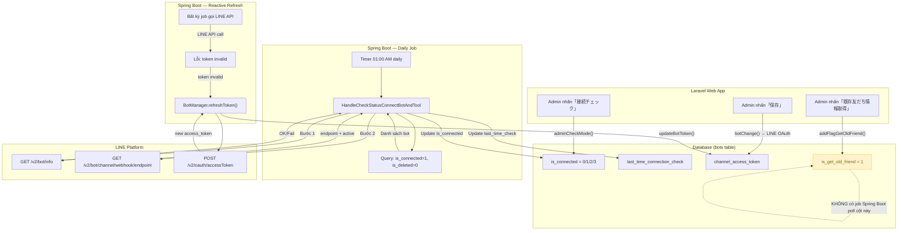

# 「LOA接続設定」(Cài đặt kết nối LOA) — Job Spec

> Phân tích từ source code Spring Boot (`reverse-spec/src/job/linect-service/src/main/java/sns/line/`).
> Ngày phân tích: 2026-03-30
> Confidence: Cao (đọc trực tiếp từ code) — trừ khi ghi chú khác.

---

## Tổng quan

- **Tính năng liên quan**: bot-edit — Cài đặt kết nối LOA
- **Mô tả**: Tính năng LOA接続設定 liên quan đến 2 background jobs trong Spring Boot:
  1. **Kiểm tra trạng thái kết nối bot** — Job định kỳ hàng ngày quét tất cả bot có `is_connected = 1` → kiểm tra LINE API (Bot Info + Webhook endpoint + Webhook active) → cập nhật `is_connected` nếu kết nối bị lỗi
  2. **Làm mới channel access token (on-demand)** — Không phải job định kỳ, mà là cơ chế reactive: khi bất kỳ job nào gọi LINE API bị lỗi "access token invalid" → tự động gọi `BotManager.refreshToken()` để tạo token mới
- **Kiểu giao tiếp**:
  - Job 1 (Check Connection): Timer-based Scheduling (chạy 1 lần/ngày lúc 01:00)
  - Job 2 (Refresh Token): Reactive on-demand (khi gặp lỗi token expired)
- **Feature Flag**: `ENABLE_HANDLE_CHECK_STATUS_CONNECT_BOT_AND_TOOL` (trong `config.properties`)

### Về Job "Lấy bạn bè cũ" (is_get_old_friend)

Logic-spec ghi nhận rằng Laravel web app set `bots.is_get_old_friend = 1` khi user nhấn「既存友だち情報取得」. Tuy nhiên, **trong codebase Spring Boot hiện tại, KHÔNG tìm thấy task manager nào poll cột `is_get_old_friend`**. Entity `Bot.java` không map cột này. Có 2 khả năng:

1. **Job này đã bị loại bỏ** khỏi Spring Boot và được xử lý bằng cách khác (ví dụ: Laravel queue hoặc artisan command)
2. **Job này tồn tại ở phiên bản cũ** của codebase và đã bị xóa

**Confidence**: Cao — đã grep toàn bộ codebase Spring Boot, không tìm thấy `is_get_old_friend` hay `getIsGetOldFriend` hay `followerIds`/`getFollowerIds`.

### Về Job "Renew Channel Access Token" định kỳ

Logic-spec ghi nhận cột `expired_date_channel_access_token` và `renew_channel_access_error` trong bảng `bots`. Tuy nhiên, **trong codebase Spring Boot hiện tại, KHÔNG tìm thấy task manager nào poll theo `expired_date_channel_access_token`**. Entity `Bot.java` không map cột này. Thay vào đó, hệ thống dùng cơ chế reactive:

- Khi bất kỳ job nào (gửi tin nhắn, kiểm tra kết nối...) gọi LINE API và nhận lỗi token expired → `BotManager.refreshToken()` tự động renew
- Laravel web app tự renew token khi save bot (`botChange()` method gọi LINE OAuth API trực tiếp)

**Confidence**: Cao — đã grep toàn bộ codebase, chỉ tìm thấy reactive refresh, không có scheduled renewal.

---

## Queue Tables (Bảng trung gian Web ↔ Job)

### Bảng: `bots` (dùng làm flag polling)

Tính năng này **không dùng queue table riêng**. Thay vào đó, cột `is_connected` trong bảng `bots` vừa là trạng thái hiển thị, vừa là điều kiện polling cho job kiểm tra kết nối.

- **Entity JPA**: `Bot` (`@Table(name = "bots")`)
- **File Entity**: `reverse-spec/src/job/linect-service/src/main/java/sns/line/models/linedb/entities/Bot.java`
- **Trạng thái `is_connected` (State Machine)**:

| Giá trị | Ý nghĩa | Ai set | Ghi chú |
|---------|---------|--------|---------|
| 0 | Lỗi xác thực (auth fail) | Spring Boot job / Laravel web | Token không hợp lệ hoặc exception |
| 1 | Kết nối OK | Spring Boot job / Laravel web | Tất cả kiểm tra đều pass |
| 2 | Webhook URL sai | Spring Boot job / Laravel web | URL không khớp với expected |
| 3 | Webhook bị tắt | Spring Boot job / Laravel web | `active == false` trên LINE Platform |

- **Điều kiện poll**: `WHERE is_connected = 1 AND is_deleted = 0` (chỉ kiểm tra bot đang kết nối OK)
- **Tần suất poll**: 1 lần/ngày lúc 01:00 AM (Timer schedule, không phải while-true loop)
- **Thêm điều kiện skip** (trong code xử lý):
  - Skip nếu `lastTimeConnectionCheck` chênh lệch < 2 ngày so với hiện tại (tránh check quá thường xuyên)
  - Skip nếu `is_connected` đã là 0, 2, hoặc 3 (đã biết lỗi, không cần check lại)
  - Skip nếu `lastTimeConnectionCheck` là thời điểm trong tương lai (có nghĩa Laravel đã set thủ công, ví dụ +6 tháng)

---

## Task Managers (Entry Points)

### HandleCheckStatusConnectBotAndTool

- **File**: `reverse-spec/src/job/linect-service/src/main/java/sns/line/task/HandleCheckStatusConnectBotAndTool.java`
- **Feature flag**: `ConfigFile.ENABLE_HANDLE_CHECK_STATUS_CONNECT_BOT_AND_TOOL`
- **Khởi tạo trong**: `AppMain.run()` — `new HandleCheckStatusConnectBotAndTool().startTask()`
- **Thread pool**: `Executors.newSingleThreadExecutor()` (1 thread duy nhất)
- **Scheduling logic**: Timer-based, KHÔNG phải while-true polling loop
  - Dùng `java.util.Timer` + `TimerTask`
  - Chạy lần đầu vào 01:00 AM ngày tiếp theo
  - Lặp lại mỗi 24 giờ (`DAY_AS_MILLIS = 86400000`)
  - Nếu khởi động trước 01:00 → chạy 01:00 cùng ngày
  - Nếu khởi động sau 01:00 → chạy 01:00 ngày hôm sau

#### Thuật toán xử lý `handle()`:
```
1. startId = 0
2. WHILE TRUE:
   a. Query: findAllByIsConnectedAndIsDeleteAndIdGreaterThanOrderByIdAsc(1, 0, startId)
      → Lấy tất cả bot có is_connected=1, is_deleted=0, id > startId (phân trang)
   b. Nếu danh sách rỗng → BREAK (kết thúc)
   c. startId = id cuối cùng trong batch
   d. FOR EACH bot:
      i.   Reload bot từ DB (BotManager.getNewBot)
      ii.  Skip nếu lastTimeConnectionCheck < 2 ngày
      iii. Skip nếu is_connected đã là 0, 2, 3
      iv.  Skip nếu lastTimeConnectionCheck > NOW (future — set bởi Laravel)
      v.   KIỂM TRA 1: Gọi LINE Bot Info API
           - Thất bại → is_connected = 0, update DB → continue
      vi.  KIỂM TRA 2: Gọi LINE Webhook Endpoint API
           - Thất bại → is_connected = 0, update DB → continue
           - So sánh endpoint URL với expected (DOMAIN_ENDPOINT_WEBHOOK + "/line/callback/add/" + botId)
           - URL khác → is_connected = 2, update DB → continue
      vii. KIỂM TRA 3: Kiểm tra active flag
           - active == false → is_connected = 3, update DB → continue
      viii. TẤT CẢ OK → is_connected = 1, update DB
   e. Thread.sleep(1000) — nghỉ 1 giây giữa các batch
```

---

## Processing Chain (Chuỗi xử lý)

### Luồng 1: Kiểm tra trạng thái kết nối bot (Daily)

```
Timer (01:00 AM daily)
  → HandleCheckStatusConnectBotAndTool.handle()
  → Query bots WHERE is_connected=1, is_deleted=0 (phân trang theo id)
  → FOR EACH bot:
    → BotManager.getNewBot(botId) — reload từ DB
    → Skip nếu không cần kiểm tra (< 2 ngày / is_connected != 1 / future date)
    → Gọi LINE Bot Info API (GET /v2/bot/info)
    → Gọi LINE Webhook Endpoint API (GET /v2/bot/channel/webhook/endpoint)
    → So sánh webhook URL + kiểm tra active flag
    → UPDATE bots SET is_connected=?, last_time_connection_check=? WHERE id=?
```

### Luồng 2: Làm mới Channel Access Token (Reactive)

```
Bất kỳ job nào gọi LINE API
  → LINE API trả lỗi "Confirm that the access token in the authorization header is valid"
  → Caller kiểm tra: bot có channelId + channelSecret?
    → CÓ: BotManager.refreshToken(bot)
      → Rate limit check (1 lần/ngày per bot — VALID_TIME_REFRESH = 1 day)
      → POST LINE OAuth API (v2/oauth/accessToken) với grant_type=client_credentials
      → Thành công: UPDATE bots SET channel_access_token=? WHERE id=?
      → Retry request ban đầu với token mới
    → KHÔNG: Bỏ qua (không thể refresh)
```

---

## Services & Helpers (Chi tiết logic)

### BotManager (Token Refresh)

- **File**: `reverse-spec/src/job/linect-service/src/main/java/sns/line/helper/BotManager.java`
- **Mô tả**: Quản lý cache bot và cơ chế làm mới token

#### Method: `refreshToken(Bot bot)`
- **Input**: `Bot` — đối tượng bot cần refresh token
- **Output**: `Bot` — đối tượng bot đã reload từ DB (có thể có token mới)
- **Logic chi tiết**:
  1. Kiểm tra rate limit: nếu bot đã refresh trong vòng 1 ngày (`VALID_TIME_REFRESH = DAY_IN_MILLIS`) → return bot hiện tại, không refresh lại
  2. Ghi nhận thời điểm refresh vào `botLastRefreshToken` map
  3. Gọi LINE OAuth API: `POST v2/oauth/accessToken` với:
     - `grant_type`: `client_credentials`
     - `client_id`: `bot.getChannelId()`
     - `client_secret`: `bot.getChannelSecret()`
  4. Thành công → `BotRepository.updateBotToken(newToken, botId)` — UPDATE DB
  5. Thất bại → chỉ log, không retry
  6. Reload bot từ DB qua `getNewBot(botId)` và return
- **Tables đọc/ghi**: `bots` (đọc bot info, ghi `channel_access_token`)

#### Method: `getBot(long id)` và `getNewBot(long id)`
- **Mô tả**: Cache bot trong memory với TTL 2 phút (`VALID_TIME_LOAD_BOT = 2 * 60000`)
- `getBot`: Trả bot từ cache nếu còn valid, reload từ DB nếu expired
- `getNewBot`: Luôn reload từ DB (force refresh)

### SentMessageHelper (Caller tiêu biểu)

- **File**: `reverse-spec/src/job/linect-service/src/main/java/sns/line/helper/SentMessageHelper.java`
- **Mô tả**: Helper gửi tin nhắn LINE — minh họa cách gọi `refreshToken`

#### Pattern sử dụng refreshToken:
```java
// Khi LINE API trả lỗi token invalid:
if (response.getMessage().contains("Confirm that the access token in the authorization header is valid")) {
    if (!TextUtils.isEmpty(bot.getChannelId()) && !TextUtils.isEmpty(bot.getChannelSecret())) {
        Bot botRefresh = BotManager.refreshToken(bot);
        if (!botRefresh.getChannelAccessToken().equals(bot.getChannelAccessToken())) {
            // Token đã đổi → retry request
            return callSent(isFirstMessage, botRefresh, lineUser, req, listMax5Msg);
        }
    }
}
```

### HandleGetMessageError (Caller khác)

- **File**: `reverse-spec/src/job/linect-service/src/main/java/sns/line/task/HandleGetMessageError.java`
- **Mô tả**: Xử lý message errors, cũng gọi `refreshToken` khi gặp lỗi token expired
- **Cùng pattern**: Gọi LINE API → lỗi → `BotManager.refreshToken()` → retry

---

## External API Calls

| API | Service Interface | Endpoint | Khi nào gọi | Retry? | Confidence |
|-----|------------------|----------|-------------|--------|------------|
| LINE Bot Info API | `ILineService.getBotProfile()` | `GET /v2/bot/info` | Job kiểm tra kết nối (bước 1) | Không | **Cao** |
| LINE Webhook Endpoint API | `ILineService.getEndpoint()` | `GET /v2/bot/channel/webhook/endpoint` | Job kiểm tra kết nối (bước 2) | Không | **Cao** |
| LINE OAuth API | `ILineService.generateAccessToken()` | `POST /v2/oauth/accessToken` | Reactive refresh khi token expired | Không (rate limit 1/ngày) | **Cao** |

### Chi tiết API Calls

#### LINE Bot Info API
- **URL**: `https://api.line.me/v2/bot/info`
- **Method**: GET
- **Header**: `Authorization: Bearer {channel_access_token}`
- **Response thành công**: `BotInfoResponse` (thông tin bot)
- **Mục đích trong job**: Xác nhận token và kết nối bot còn hợp lệ

#### LINE Webhook Endpoint API
- **URL**: `https://api.line.me/v2/bot/channel/webhook/endpoint`
- **Method**: GET
- **Header**: `Authorization: Bearer {channel_access_token}`
- **Response**: `JsonObject` chứa `endpoint` (URL string) và `active` (boolean)
- **Mục đích trong job**: So sánh webhook URL hiện tại với expected URL, kiểm tra active flag

#### LINE OAuth API (Token Refresh)
- **URL**: `https://api.line.me/v2/oauth/accessToken`
- **Method**: POST (form-urlencoded)
- **Body**: `grant_type=client_credentials`, `client_id={channelId}`, `client_secret={channelSecret}`
- **Response**: `AccessTokenResponse` chứa `access_token` (30-day token)
- **Rate limit bên Job**: 1 lần/ngày per bot (code enforce qua `botLastRefreshToken` map)

---

## Data Flow Diagram



---

## Error Handling

| Tình huống | Xử lý | File | Confidence |
|-----------|--------|------|------------|
| Exception trong vòng lặp kiểm tra 1 bot | `try-catch` → log error → `is_connected = 0` → update DB → **gửi Chatwork notification** (`NotifyUtils.sendReportChatwork`) → tiếp tục bot tiếp theo | `HandleCheckStatusConnectBotAndTool.java:165-170` | **Cao** |
| Exception ngoài vòng lặp (toàn bộ job) | `try-catch` → log error → **gửi Chatwork notification** → job kết thúc (đợi ngày mai chạy lại) | `HandleCheckStatusConnectBotAndTool.java:179-183` | **Cao** |
| LINE Bot Info API thất bại | `is_connected = 0` → update DB → continue sang bot tiếp | `HandleCheckStatusConnectBotAndTool.java:110-114` | **Cao** |
| LINE Webhook Endpoint API thất bại | `is_connected = 0` → update DB → continue sang bot tiếp | `HandleCheckStatusConnectBotAndTool.java:131-135` | **Cao** |
| Webhook URL không khớp | `is_connected = 2` → update DB → continue | `HandleCheckStatusConnectBotAndTool.java:143-147` | **Cao** |
| Webhook inactive | `is_connected = 3` → update DB → continue | `HandleCheckStatusConnectBotAndTool.java:150-156` | **Cao** |
| Token refresh thất bại (`BotManager`) | Chỉ log, không retry, không notification → trả về bot với token cũ | `BotManager.java:75-77` | **Cao** |
| Token refresh exception (`BotManager`) | Log error → trả về bot reload từ DB | `BotManager.java:79-81` | **Cao** |

> Ghi chú: Hệ thống KHÔNG có message queue hay dead letter queue. Error handling chủ yếu bằng try-catch + logging + Chatwork notification cho team dev (Chatwork user IDs: 6155382, 6395420).

---

## Liên kết với Web App

| Action trên Web | Ảnh hưởng đến Job | Trường liên quan | Kết quả |
|----------------|-------------------|-----------------|---------|
| 「保存」(`botChange()`) | Renew token trực tiếp (không qua job) | `channel_access_token`, `expired_date_channel_access_token` (+ 28 ngày) | Token mới lưu vào DB, job dùng token mới khi tiếp theo gọi API |
| 「接続チェック」(`adminCheckMode()`) | Cập nhật `is_connected` — ảnh hưởng polling scope của daily job | `is_connected` (0/1/2/3), `last_time_connection_check` | Nếu set `is_connected = 1` → job sẽ kiểm tra bot này vào ngày mai. Nếu set khác 1 → job sẽ skip |
| `setTimeCheckWebHook()` (set thủ công) | Set `last_time_connection_check = now + 6 tháng` → job sẽ skip bot này 6 tháng | `is_connected = 1`, `last_time_connection_check` = future | Job thấy `lastTimeConnectionCheck > NOW` → skip |
| 「既存友だち情報取得」(`addFlagGetOldFriend()`) | Set `is_get_old_friend = 1` — **KHÔNG có job Spring Boot xử lý** | `is_get_old_friend` | Cột được set nhưng không có consumer trong Spring Boot hiện tại |
| Bất kỳ thao tác nào khiến LINE API trả lỗi token | Trigger reactive `BotManager.refreshToken()` | `channel_access_token` | Token mới được lưu vào DB |

---

## Cấu hình liên quan

| Config | Giá trị mặc định | File | Mô tả |
|--------|------------------|------|-------|
| `ENABLE_HANDLE_CHECK_STATUS_CONNECT_BOT_AND_TOOL` | `false` (0) | `ConfigFile.java:121` | Bật/tắt job kiểm tra kết nối bot |
| `DOMAIN_ENDPOINT_WEBHOOK` | `https://cb.lme.jp` | `ConfigFile.java:67` | Domain dùng so sánh webhook URL |

---

## Tóm tắt phát hiện

### Jobs liên quan trực tiếp đến tính năng bot-edit

| # | Job | Loại | Tồn tại? | Feature Flag | Confidence |
|---|-----|------|---------|--------------|------------|
| 1 | Kiểm tra trạng thái kết nối bot | Timer schedule (01:00 daily) | **Có** | `ENABLE_HANDLE_CHECK_STATUS_CONNECT_BOT_AND_TOOL` | **Cao** |
| 2 | Làm mới channel access token | Reactive (on-demand) | **Có** (cơ chế, không phải job riêng) | N/A | **Cao** |
| 3 | Lấy bạn bè cũ (poll `is_get_old_friend`) | Database polling | **Không tìm thấy** trong codebase | N/A | **Cao** (đã grep toàn bộ) |
| 4 | Renew token định kỳ (poll `expired_date_channel_access_token`) | Database polling | **Không tìm thấy** trong codebase | N/A | **Cao** (đã grep toàn bộ) |

### Kết luận kiến trúc

- **Kiểm tra kết nối**: Spring Boot chạy daily job lúc 01:00 AM, quét tất cả bot có `is_connected = 1`, kiểm tra 3 lớp (Bot Info → Webhook URL → Webhook Active), cập nhật trạng thái. Laravel web app cũng kiểm tra real-time khi user nhấn「接続チェック」. Hai cơ chế bổ sung nhau.
- **Token renewal**: Không có job định kỳ renew. Laravel renew khi save bot (+28 ngày). Spring Boot renew reactive khi gặp lỗi. Rate limit 1 lần/ngày per bot để tránh loop.
- **Old friend fetching**: Cột `is_get_old_friend` tồn tại trong DB nhưng không có consumer Spring Boot. Có thể được xử lý bởi Laravel scheduled command hoặc đã bị loại bỏ.
