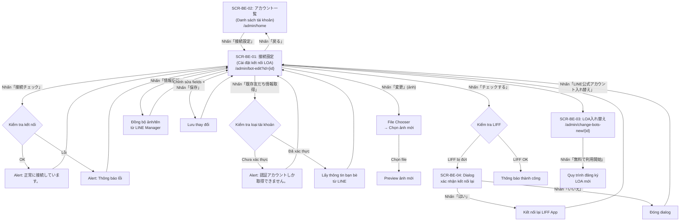

# UI Spec — 「LOA接続設定」(Cài đặt kết nối LOA)

**Feature ID**: bot-edit
**URL chính**: `/admin/bot-edit?id={id}`
**Ngày phân tích**: 2026-03-30
**Nguồn**: Playwright CLI snapshots + screenshots

---

## 1. Tổng quan

Tính năng「LOA接続設定」cho phép Admin quản lý cấu hình kết nối giữa L Message (エルメ) và LINE Official Account (LOA). Bao gồm:

- Xem và chỉnh sửa thông tin hiển thị LOA (ảnh, tên)
- Quản lý thông tin kết nối Messaging API (Channel ID, Channel Secret, Webhook URL)
- Quản lý thông tin LINE Login / LIFF (Channel ID, Channel Secret, LIFF ID)
- Kiểm tra trạng thái kết nối
- Lấy thông tin bạn bè hiện có từ LINE
- Thay thế LOA bằng tài khoản khác
- Sao chép dữ liệu giữa các LOA (Data Copy)

**Entry point**: Từ trang「アカウント一覧」(`/admin/home`), nhấn nút「接続設定」trên dòng LOA tương ứng.

## 2. Actors

| Actor | Vai trò trong tính năng |
|-------|------------------------|
| **Admin (主管理者)** | Toàn quyền: xem, chỉnh sửa, kiểm tra kết nối, thay thế LOA, lấy thông tin bạn bè |
| **Admin (副管理人)** | Có thể xem và chỉnh sửa (cần xác nhận quyền chính xác từ backend) |
| **Staff** | Không truy cập được trang này (sidebar menu chỉ hiện cho Admin) |

---

## 3. Danh sách màn hình

| Screen ID | Tên (JP) | Tên (VN) | URL |
|-----------|----------|----------|-----|
| SCR-BE-01 | LOA接続設定 | Cài đặt kết nối LOA | `/admin/bot-edit?id={id}` |
| SCR-BE-02 | アカウント一覧 | Danh sách tài khoản | `/admin/home` |
| SCR-BE-03 | LOA入れ替え | Thay thế LOA | `/admin/change-bots-new/{id}` |
| SCR-BE-04 | LIFFアプリ接続確認ダイアログ | Dialog xác nhận kết nối LIFF | (dialog trên SCR-BE-01) |

---

## 4. Chi tiết từng màn hình

### SCR-BE-01:「LOA接続設定」(Cài đặt kết nối LOA)

**URL**: `/admin/bot-edit?id={id}`
**Screenshot**: `screenshots/SCR-BE-01-main.png`

#### Layout

```
+------------------------------------------------------------------+
| Header: L Message logo                                           |
+----------+-------------------------------------------------------+
| Sidebar  | Toolbar: 「接続設定」(title)                            |
| (menu    |   [接続チェック] [既存友だち情報取得]                      |
|  chính)  |   [LINE公式アカウント入れ替え]                            |
|          +-------------------------------------------------------+
|          | Section 1: LINE公式アカウント表示                         |
|          |   - アカウント画像 + [変更]                               |
|          |   - アカウント名 (textbox)                               |
|          |   - [情報更新]                                           |
|          +-------------------------------------------------------+
|          | Section 2: 接続情報                                      |
|          |   - Channel ID (read-only)                              |
|          |   - Channel Secret (textbox)                            |
|          |   - Webhook URL (read-only)                             |
|          +-------------------------------------------------------+
|          | Section 3: LINEログイン（LIFF）設定情報                    |
|          |   - LIFFアプリ接続確認 + [チェックする]                    |
|          |   - チャネル ID (textbox)                                |
|          |   - チャネルシークレット (textbox)                        |
|          |   - 接続済みLIFF ID (read-only)                          |
|          +-------------------------------------------------------+
|          | Section 4: データコピー                                   |
|          |   - コピーコード (read-only + copy icon)                  |
|          +-------------------------------------------------------+
|          | Footer: [保存] [戻る]                                    |
+----------+-------------------------------------------------------+
```

#### Action Buttons

| Label (JP) | Type | Vị trí | Hành vi |
|------------|------|--------|---------|
| 「接続チェック」 | button | Toolbar | Gọi API kiểm tra kết nối → JS alert "正常に接続しています。" (khi OK) hoặc thông báo lỗi |
| 「既存友だち情報取得」 | button | Toolbar | Gọi API lấy thông tin bạn bè hiện có → JS alert "認証アカウントしか取得できません。" (khi tài khoản chưa xác thực) |
| 「LINE公式アカウント入れ替え」 | button | Toolbar | Navigate đến `/admin/change-bots-new/{id}` (SCR-BE-03) |
| 「変更」 | button | Section 1 | Mở file chooser để upload ảnh đại diện mới |
| 「情報更新」 | button | Section 1 | Đồng bộ ảnh và tên từ LINE Official Account Manager (khi đã thay đổi bên LINE) |
| 「チェックする」 | button | Section 3 | Kiểm tra kết nối LIFF → mở dialog xác nhận (SCR-BE-04) nếu kết nối bị đứt |
| 「保存」 | button | Footer | Lưu tất cả thay đổi (tên, Channel Secret, LIFF Channel ID, LIFF Channel Secret) |
| 「戻る」 | link | Footer | Navigate về `/admin/home` (SCR-BE-02) |

#### Form Fields

| Label (JP) | Input Type | Required | Placeholder | Default | Validation | Ghi chú |
|------------|-----------|----------|-------------|---------|------------|---------|
| 「アカウント画像」 | file (ẩn, trigger qua nút「変更」) | Không | - | Ảnh hiện tại từ LOA | Chỉ chấp nhận file ảnh | Upload thay đổi ảnh đại diện |
| 「アカウント名」 | textbox | Có | - | Tên LOA hiện tại (VD: "Xuka_BOT_Booking") | Cần xác nhận max length | Chỉnh sửa tên hiển thị trong L Message |
| 「Channel Secret」 | textbox | Có | - | Giá trị hiện tại (VD: "058a91a81994ce8e6b1b241fb7540e77") | Cần xác nhận format | Messaging API Channel Secret |
| 「チャネル ID」(LIFF) | textbox | Có | - | Giá trị hiện tại (VD: "2006160353") | Cần xác nhận format (số) | LINE Login Channel ID |
| 「チャネルシークレット」(LIFF) | textbox | Có | - | Giá trị hiện tại (VD: "fe96384af7daddc93c3378dad8f7b0bb") | Cần xác nhận format | LINE Login Channel Secret |

#### Read-only Fields

| Label (JP) | Giá trị mẫu | Ghi chú |
|------------|-------------|---------|
| 「Channel ID」 | 1623434246 | Messaging API Channel ID — không chỉnh sửa được |
| 「Webhook URL」 | https://booking.watermeru.com/line/callback/add/1057 | URL webhook cố định theo bot — không chỉnh sửa được |
| 「接続済みLIFF ID」 | 2006160353-4k6p8oYj | LIFF App ID đã kết nối — không chỉnh sửa được |
| 「コピーコード」 | j8iDxYFiBi | Mã dùng cho tính năng Data Copy — có icon copy để sao chép vào clipboard |

#### Observations

- Page title trên toolbar là「接続設定」(khác với tên tính năng đầy đủ「LOA接続設定」)
- Section 1 có note:「LINE公式アカウント管理画面で 画像・アカウント名を変更した場合」→ gợi ý rằng nút「情報更新」dùng để đồng bộ từ LINE Manager, không phải lưu thay đổi local
- Channel ID (Messaging API) là read-only → được set khi kết nối LOA lần đầu
- Webhook URL chứa domain (`booking.watermeru.com`) và bot ID (`1057`) → được sinh tự động
- LIFF ID format: `{channelId}-{suffix}` → được sinh bởi LINE Platform
- Copy code (`j8iDxYFiBi`) — mã ngẫu nhiên 10 ký tự, dùng cho tính năng「データコピー」(sao chép cấu hình giữa các LOA)
- Sidebar menu hiển thị mục「LINE公式アカウント設定」trong nhóm「システム管理関連」— đây là entry point từ sidebar

---

### SCR-BE-02:「アカウント一覧」(Danh sách tài khoản)

**URL**: `/admin/home`

#### Layout

```
+------------------------------------------------------------------+
| Header: L Message logo                                           |
+----------+-------------------------------------------------------+
| Sidebar  | お知らせ (Thông báo)                                    |
|          |   Bảng: 投稿日 | お知らせ内容                            |
|          +-------------------------------------------------------+
|          | アカウント一覧                                           |
|          |   Tabs: [接続済] [未接続]                                |
|          |   Buttons: [エンタープライズプラン申込]                    |
|          |            [LINE公式アカウント追加] [並べ替え]             |
|          |   Table: danh sách LOA                                  |
|          |   Pagination                                            |
+----------+-------------------------------------------------------+
```

#### Tabs

| Tab (JP) | Mô tả |
|----------|-------|
| 「接続済」 | Danh sách LOA đã kết nối thành công với L Message |
| 「未接続」 | Danh sách LOA chưa kết nối (bảng trống trong snapshot) |

#### Action Buttons (trên toolbar)

| Label (JP) | Type | Hành vi |
|------------|------|---------|
| 「エンタープライズプラン申込」 | button | Đăng ký gói Enterprise |
| 「LINE公式アカウント追加」 | button | Thêm LOA mới → navigate đến `/admin/bot-add` |
| 「並べ替え」 | button | Sắp xếp lại thứ tự LOA |

#### Data Table — Tab「接続済」

| Column Header (JP) | Dữ liệu mẫu | Kiểu | Sortable | Ghi chú |
|---------------------|-------------|------|----------|---------|
| 「LINE公式アカウント」 | Xuka_BOT_Booking, Bot 88 | Ảnh + Tên (clickable) | Không rõ | Click vào tên/ảnh → có thể navigate |
| 「操作権限」 | 主管理者, 副管理人 | Text | Không rõ | Quyền của user hiện tại trên LOA này |
| 「総友だち数」 | 1, 9, 30 | Số | Không rõ | Tổng số bạn bè |
| 「有効友だち数」 | 1, 9, 24 | Số | Không rõ | Số bạn bè đang hoạt động |
| 「ブロック数」 | 0, 6, 3 | Số | Không rõ | Số bạn bè đã block |
| 「エルメ配信数」 | ∞, 1 | Số hoặc ∞ | Không rõ | Số tin nhắn L Message còn lại (∞ = unlimited) |
| 「LOA配信数」 | 0, 1, 89 | Số | Không rõ | Số tin nhắn LOA đã gửi. Có tooltip icon |
| 「利用プラン」 | フリー, スタンダード（年間一括）, プロ（年間一括）, プロ | Text | Không rõ | Gói sử dụng hiện tại |
| (Actions) | - | Buttons | - | Tùy trạng thái LOA |

#### Action Buttons trong Table (per row)

| Trạng thái LOA | Buttons hiển thị | Hành vi |
|-----------------|-----------------|---------|
| Hoạt động bình thường | 「アップグレード」+「接続設定」 | Upgrade gói + vào trang cài đặt kết nối |
| Hoạt động, gói cao nhất (プロ trở lên) | 「接続設定」 | Chỉ vào trang cài đặt kết nối (không có Upgrade) |
| Thanh toán thất bại | 「再決済」+「接続設定」 | Thanh toán lại + vào trang cài đặt kết nối |
| Chưa hoàn tất kết nối | 「接続設定」 | Vào trang cài đặt kết nối |

#### Trạng thái đặc biệt

- Khi thanh toán thất bại: cột「操作権限」hiển thị「エルメ利用料の決済に失敗しました」(màu đỏ/warning) thay vì quyền
- Các cột thống kê (友だち数, 配信数, プラン) bị ẩn khi thanh toán thất bại

#### Pagination

- Hiển thị: "全16件中 1～15件を表示中" (15 items/page)
- Navigation: số trang + nút「Next」

#### Observations

- Tab「未接続」có cùng cấu trúc bảng nhưng trống (không có dữ liệu trong snapshot)
- LOA có quyền「副管理人」vẫn hiển thị đầy đủ thống kê và nút「接続設定」
- Nút「アップグレード」không hiển thị cho LOA đã ở gói cao (プロ trở lên) → cần xác nhận logic chính xác
- Pagination 15 items/page

---

### SCR-BE-03:「LOA入れ替え」(Thay thế LOA)

**URL**: `/admin/change-bots-new/{id}`
**Screenshot**: `screenshots/SCR-BE-03-change-bots.png`

#### Layout

```
+------------------------------------------------------------------+
| Header: L Message logo                                           |
+----------+-------------------------------------------------------+
| Sidebar  | Landing page giới thiệu tính năng                     |
|          |   - 3 blocks giới thiệu:                               |
|          |     - メッセージをセグメント配信                          |
|          |     - 予約を簡単管理                                     |
|          |     - LINE上で決済も完結                                 |
|          |   - Chào mừng: テスト：ゴー・トゥイ・ガン 様              |
|          |   - [無料で利用開始]                                     |
+----------+-------------------------------------------------------+
```

#### Action Buttons

| Label (JP) | Type | Hành vi |
|------------|------|---------|
| 「無料で利用開始」 | button (CTA chính, nổi bật) | Bắt đầu quy trình đăng ký LOA mới để thay thế LOA hiện tại |

#### Observations

- Trang này là landing page marketing, giới thiệu 3 tính năng chính của L Message
- Hiển thị tên user:「テスト：ゴー・トゥイ・ガン 様」
- Mục đích: khi Admin muốn thay thế LOA hiện tại bằng LOA mới, bắt đầu từ quy trình đăng ký lại
- Sau khi nhấn「無料で利用開始」→ quy trình kết nối LOA mới (nằm ngoài scope tính năng bot-edit)
- Sidebar vẫn hiển thị đầy đủ menu

---

### SCR-BE-04:「LIFFアプリ接続確認ダイアログ」(Dialog xác nhận kết nối LIFF)

**URL**: Dialog modal trên SCR-BE-01

#### Layout

```
+----------------------------------------------+
| [X] (close button)                           |
|                                              |
| LIFFアプリの接続が切れているため              |
| 再接続処理を行います。                        |
| 再接続処理を行なった場合、すでに作成済みの    |
| 回答フォーム、商品、カレンダー予約、          |
| イベント予約、流入アクションが                |
| 利用できなくなる場合があります。              |
|                                              |
|        [はい]    [いいえ]                     |
+----------------------------------------------+
```

#### Nội dung cảnh báo

> LIFFアプリの接続が切れているため再接続処理を行います。再接続処理を行なった場合、すでに作成済みの回答フォーム、商品、カレンダー予約、イベント予約、流入アクションが利用できなくなる場合があります。

(Dịch: Kết nối LIFF App đã bị đứt, sẽ thực hiện kết nối lại. Nếu thực hiện kết nối lại, các form trả lời, sản phẩm, đặt lịch calendar, đặt lịch sự kiện, hành động thu hút đã tạo trước đó có thể không sử dụng được.)

#### Action Buttons

| Label (JP) | Type | Hành vi |
|------------|------|---------|
| 「はい」 | button | Xác nhận → thực hiện kết nối lại LIFF App |
| 「いいえ」 | button | Hủy → đóng dialog |
| [X] | button (góc trên phải) | Đóng dialog |

#### Observations

- Dialog chỉ xuất hiện khi kết nối LIFF đang bị đứt (trạng thái lỗi)
- Cảnh báo rằng việc kết nối lại có thể ảnh hưởng đến: 回答フォーム (form), 商品 (sản phẩm), カレンダー予約 (đặt lịch), イベント予約 (sự kiện), 流入アクション (hành động thu hút)
- Đây là thao tác có rủi ro cao → cần confirmation dialog

---

## 5. User Flows

### Flow 1: Xem và chỉnh sửa cài đặt kết nối (Happy Path)

1. Admin vào `/admin/home` (SCR-BE-02)
2. Tìm LOA trong tab「接続済」
3. Nhấn「接続設定」→ navigate đến `/admin/bot-edit?id={id}` (SCR-BE-01)
4. Xem/chỉnh sửa thông tin: tên, Channel Secret, LIFF Channel ID, LIFF Channel Secret
5. Nhấn「保存」→ lưu thay đổi
6. Nhấn「戻る」→ quay về `/admin/home`

### Flow 2: Kiểm tra kết nối

1. Ở SCR-BE-01, nhấn「接続チェック」
2. Hệ thống kiểm tra kết nối với LINE Platform
3. Hiển thị JS alert:
   - Thành công: "正常に接続しています。"
   - Thất bại: thông báo lỗi (cần xác nhận message cụ thể)

### Flow 3: Lấy thông tin bạn bè hiện có

1. Ở SCR-BE-01, nhấn「既存友だち情報取得」
2. Hệ thống kiểm tra loại tài khoản
3. Nếu tài khoản chưa xác thực → JS alert: "認証アカウントしか取得できません。"
4. Nếu tài khoản đã xác thực → thực hiện lấy thông tin (cần xác nhận flow cụ thể)

### Flow 4: Thay đổi ảnh đại diện

1. Ở SCR-BE-01, nhấn「変更」(bên cạnh ảnh)
2. File chooser mở → chọn file ảnh
3. Ảnh mới hiển thị preview
4. Nhấn「保存」để lưu

### Flow 5: Đồng bộ thông tin từ LINE Manager

1. Admin thay đổi ảnh/tên trên LINE Official Account Manager (bên ngoài L Message)
2. Vào SCR-BE-01, nhấn「情報更新」
3. Hệ thống gọi LINE API lấy thông tin mới
4. Ảnh và tên được cập nhật

### Flow 6: Kiểm tra và kết nối lại LIFF

1. Ở SCR-BE-01, nhấn「チェックする」
2. Nếu LIFF đang kết nối OK → thông báo thành công (cần xác nhận)
3. Nếu LIFF bị đứt → hiển thị dialog cảnh báo (SCR-BE-04)
4. Nhấn「はい」→ hệ thống kết nối lại LIFF App
5. Nhấn「いいえ」→ đóng dialog, không thay đổi

### Flow 7: Thay thế LOA

1. Ở SCR-BE-01, nhấn「LINE公式アカウント入れ替え」
2. Navigate đến `/admin/change-bots-new/{id}` (SCR-BE-03)
3. Nhấn「無料で利用開始」→ bắt đầu quy trình đăng ký LOA mới

### Flow 8: Sao chép dữ liệu (Data Copy)

1. Ở SCR-BE-01, section「データコピー」
2. Copy「コピーコード」(nhấn icon copy)
3. Dùng mã này ở tính năng「データコピー」(`/basic/backup`) trên LOA đích

---

## 6. Flow Diagram



---

## 7. Điểm chưa rõ / cần điều tra

| # | Câu hỏi | Mức độ | Cần xác nhận từ |
|---|---------|--------|----------------|
| 1 | Nút「アップグレード」hiển thị theo logic nào? Có phải chỉ ẩn khi gói = プロ trở lên? | Trung bình | Backend / Source code |
| 2 | Khi nhấn「接続チェック」mà kết nối lỗi, thông báo lỗi cụ thể là gì? | Trung bình | Backend / Source code |
| 3 | Khi nhấn「既存友だち情報取得」cho tài khoản đã xác thực, flow cụ thể như thế nào? Có loading/progress không? | Trung bình | Backend / Source code |
| 4 | Validation rules cho các textbox: max length, format, ký tự cho phép? | Cao | Backend / Source code |
| 5 | Quyền「副管理人」có thể chỉnh sửa tất cả fields hay bị hạn chế? | Cao | Backend / Source code |
| 6 | Nút「情報更新」gọi LINE API nào? Có cập nhật DB local không? | Trung bình | Backend / Source code |
| 7 | Khi nhấn「チェックする」mà LIFF đang OK, phản hồi cụ thể là gì? | Thấp | Backend / Source code |
| 8 | Sau khi kết nối lại LIFF (nhấn「はい」), LIFF ID có thay đổi không? | Cao | Backend / Source code |
| 9 | Staff có thể truy cập `/admin/bot-edit` không? Hay bị redirect? | Trung bình | Backend / Source code |
| 10 | Khi「保存」thành công/thất bại, thông báo gì? Toast/alert? | Trung bình | Backend / Source code |
| 11 | Copy code (「コピーコード」) được sinh khi nào? Có thể regenerate không? | Thấp | Backend / Source code |
| 12 | Tab「未接続」: LOA nào xuất hiện ở đây? LOA chưa kết nối hoặc bị disconnect? | Trung bình | Backend / Source code |
| 13 | Khi LOA ở trạng thái「決済に失敗しました」, có thể vào「接続設定」và chỉnh sửa bình thường không? | Trung bình | Backend / Source code |
| 14 | Webhook URL domain (`booking.watermeru.com`) — có phải là cấu hình per-environment không? | Thấp | Cấu hình hệ thống |
