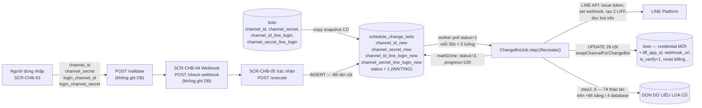

# DB Mapping — FA-044: Đổi LINE Official Account (LOA入れ替え / Change Bot)

> Tài liệu ánh xạ UI ↔ Database cho tính năng `change-bot` (portal Admin).

| Mục | Giá trị |
|-----|--------|
| Phiên bản | **v2 (viết lại toàn bộ)** — thay thế hoàn toàn bản v1 |
| Ngày cập nhật | 2026-08-19 |
| Repo web | `src/web/sns-line` @ nhánh **`release_step_20260805`**, commit **`da839e26e4`** (2026-08-18) |
| Repo job | `src/job/linect-service` @ nhánh **`release-t07-2026`**, commit **`debe45bc`** (2026-08-13) |
| Trạng thái tính năng | **ĐÃ HOÀN THIỆN VÀ ĐANG CHẠY PRODUCTION** — worker `ChangeBotTask` + `ChangeBotJob` có thật, thao tác trên **hơn 60 bảng thuộc 4 database** |
| Đầu vào | `_internal/db-hint.md` (v2), `ui/ui-spec.md` (v2, 12 màn hình), `web/api-spec.md` (v2, 11 endpoint), `web/logic-spec.md` (v2, 18 business rule), `job/job-spec.md` (v2), `db/index.md`, `db/schema/tables/*.sql`, `db/data/*.sql`, migrations Laravel, entity JPA |

---

## 1. Nguồn dữ liệu & cảnh báo

### ⚠ Cảnh báo 1 — Bảng chính `schedule_change_bots` KHÔNG có trong dump DB

| Hạng mục | Kết quả xác minh (đã chạy lại 2026-08-19) |
|---------|------------------------------------------|
| `db/schema/tables/schedule_change_bots.sql` | **KHÔNG tồn tại** (310 file schema, không có file này) |
| `db/data/schedule_change_bots.sql` | **KHÔNG tồn tại** (292 file data) |
| `db/index.md` | **Không liệt kê** trong 308 bảng |

Dump DB được tạo **trước** migration `2026_04_17_125226`. Nguồn schema thay thế — dựng từ **3 nguồn code**, đối chiếu chéo:

| Nguồn | Đường dẫn | Cung cấp |
|-------|----------|---------|
| Migration tạo bảng | `src/web/sns-line/database/migrations/2026_04_17_125226_create_schedule_change_bots_table.php` | 15 cột gốc + comment `type`/`status` |
| Migration bổ sung | `src/web/sns-line/database/migrations/2026_06_06_131356_add_message_error_to_schedule_change_bots_table.php` | `message_error text NULL AFTER progress` |
| **Entity JPA (worker)** | `src/job/linect-service/src/main/java/sns/line/models/linedb/entities/ScheduleChangeBot.java` | Xác nhận chéo tên cột + kiểu Java |

**Phát hiện quan trọng khi đối chiếu migration ↔ entity JPA:**

> Entity `ScheduleChangeBot.java` khai báo **15 field** cho 15 cột đầu, **THIẾU hoàn toàn field `messageError`** tương ứng cột `message_error`.
> Hệ quả: worker Java **không có đường nào ghi vào `message_error`** — `markError()` (`ScheduleChangeBotRepository.java:32-34`) chỉ đặt `status = 4, updated_at = NOW()`.
> Trong khi đó Laravel **vẫn đọc và trả cột này cho FE** (`Ajax/ChangeBotController.php:288`) ⇒ **người dùng luôn thấy `message_error = null` khi job thất bại**. Đây là khoảng trống thật giữa 2 repo, không phải lỗi tài liệu. **Tin cậy: Cao**.
>
> Entity cũng **không khai báo `STATUS_CANCEL = 5`** (chỉ có `STATUS_DRAFT`..`STATUS_ERROR`) — giá trị `5` là "phía Laravel biết, phía Java không biết", nên bản ghi đã huỷ vĩnh viễn không bị worker nhặt. **Tin cậy: Cao**.

**Hệ quả về độ tin cậy:**

- Tên cột, kiểu, nullable, default, comment: **Cao** — 2 nguồn độc lập (migration PHP + entity Java) khớp nhau hoàn toàn.
- Index / FK / charset / collation thực tế trong MySQL: **Thấp** — migration không khai báo index nào ngoài PK; không có cách xác minh với dump hiện tại.
- **KHÔNG có sample data.** Mọi giá trị mẫu trong tài liệu này là suy ra từ code / response API / native query, **không phải dữ liệu quan sát**.

→ **Hành động cần thiết: export lại DB** (`mysqldump`) sau khi migration đã chạy trên môi trường đích, rồi tách lại theo hướng dẫn `CLAUDE.md` mục "Database — Cách đọc". Ưu tiên xác minh index trên `(status, id)` — worker quét `findTop50ByStatusOrderByIdAsc(1)` **mỗi 30 giây × 5 luồng**, thiếu index sẽ full-scan liên tục.

### ⚠ Cảnh báo 2 — Cột `bots.campaign_change_bot`: XÁC MINH LẠI TRÊN NHÁNH MỚI → **vẫn là cột chết**

Migration `2026_04_20_165013_add_campaign_change_bot_for_bots_table.php` thêm `campaign_change_bot timestamp NULL` vào `bots`.

| Kiểm tra (chạy lại trên `release_step_20260805`) | Kết quả |
|-------------------------------------------------|---------|
| `db/schema/tables/bots.sql` chứa cột | **KHÔNG** — 115 cột, không có |
| `db/data/bots.sql` — danh sách cột trong `INSERT INTO` | **KHÔNG** — 115 cột, không có |
| `db/index.md` báo `bots` có bao nhiêu cột | **113** (index tự nó cũng lệch với schema file — xem Cảnh báo 4) |
| Grep `campaign_change_bot` trong `src/web/sns-line/app/` | **1 kết quả**: `Ajax/ChangeBotController.php:96` — nhưng đó là **key JSON** của response `/init`, giá trị `Carbon::parse($bot->created_at)->addMonth()->endOfDay()` **tính lại tại chỗ** |
| Grep trong `resources/` | **1 kết quả**: `views/basic/modal-campaign-changebot.blade.php:42` — trùng tên **file ảnh** `bg_modal_campaign_change_bot.png`, không liên quan |
| Grep trong `public/_assets/modules/change_bots/` | **1 kết quả**: `js/change_new.js:123` — đọc **key JSON** `data.campaign_change_bot`, không phải cột DB |
| Grep `campaign_change_bot` / `campaignChangeBot` trong toàn repo job Java | **0 kết quả** |

→ **Kết luận v1 được XÁC NHẬN LẠI: cột chết (dead column).** Không có writer, không có reader. Trớ trêu: response API `/init` trả về **một key trùng tên** nhưng giá trị được tính runtime từ `bots.created_at`, dễ khiến người đọc response tưởng là giá trị cột. **Tin cậy: Cao**.

### ⚠ Cảnh báo 3 — Dump DB cũ hơn source code

Dump `bots` gồm **223 bản ghi**, 115 cột, `created_at` sớm nhất 2021-06. Không có `campaign_change_bot`, không có `schedule_change_bots`, không có `richmenu_switch_item` trong tập bảng worker (xem Cảnh báo 5). Tất cả các con số phân bố dữ liệu trong tài liệu này là **của dump cũ**, dùng để tham chiếu độ lớn, không phải trạng thái production hiện tại.

### ⚠ Cảnh báo 4 — Sai lệch đường dẫn dump data

`db/index.md` (dòng 3 và mục "Cách dùng") ghi data nằm ở **`db/data/tables/{table}.sql`**. Thực tế đã kiểm tra:

| Đường dẫn | Tồn tại |
|-----------|:-------:|
| `db/schema/tables/{table}.sql` | ✅ 310 file |
| `db/data/tables/` | ❌ **không có thư mục này** |
| `db/data/{table}.sql` (phẳng) | ✅ 292 file |

→ Agent đọc data phải dùng **`db/data/{table}.sql`**. `db/index.md` cần sửa lại chỉ dẫn. (Ghi nhận này giữ lại từ v1 và **đã xác minh lại**.)

### Ghi chú 5 — Tên bảng rich menu switch

Tên bảng đã được xác minh chéo trên 3 nguồn độc lập (bản `job-spec.md` trước đó ghi số nhiều, nay đã sửa):

| Nguồn | Tên thật |
|-------|---------|
| `db/index.md` dòng 237 | `richmenu_switch_item` — 8 cột, 112KB |
| `db/schema/tables/` | `richmenu_switch_item.sql` |
| Entity JPA `RichmenuSwitchItem.java:6` | `@Table(name = "richmenu_switch_item")` |

→ **Tên đúng: `richmenu_switch_item` (số ít)**. Cả tài liệu này và `job/job-spec.md` đều đã dùng tên đúng.

---

## 2. Primary Tables

| Bảng | Database | Vai trò trong FA-044 | Thao tác | Nguồn schema | Tin cậy |
|------|----------|---------------------|----------|--------------|--------|
| **`schedule_change_bots`** | linedb | **Bảng trung tâm & hàng đợi duy nhất.** Mỗi bản ghi = 1 yêu cầu đổi LOA. Chứa snapshot credential cũ + credential mới, `status`, `progress`. Hệ thống **không dùng message broker** — toàn bộ điều phối Laravel ↔ Spring Boot đi qua bảng này | Laravel: **INSERT** (`execute`), **UPDATE `status`** (`deleteReservation` → 5, `executeReservation` → 1), **SELECT** (`init`, `progress`), **DELETE** (rollback race condition). Worker: **SELECT** (poll `status=1`), **UPDATE `status`/`progress`** (2/3/4) | ⚠ **Migration + entity JPA** — không có trong dump | Cấu trúc: **Cao**; index/FK: **Thấp** |
| **`bots`** | linedb | Bot L Message hiện tại. Vừa là **nguồn** điều kiện nghiệp vụ (`plan_type`, `created_at` → campaign; `channel_*` cũ → snapshot; `admin_id`, `is_deleted` → quyền), vừa là **đích cuối cùng** của việc đổi LOA — worker ghi credential + LIFF + webhook mới vào đây ở step 1 | Laravel: **chỉ SELECT**. Worker: **UPDATE 28 cột** (`swapChannelForChangeBot`), **UPDATE `expired_date_free_plan`**, **UPDATE `count_app_notify`**, **DELETE bot tạm** | `db/schema/tables/bots.sql` + 223 bản ghi mẫu | **Cao** |

> **Ranh giới trách nhiệm quan trọng**: Laravel **không bao giờ** ghi vào `bots` trong luồng FA-044 mới (khác hẳn luồng PHP cũ `Admin\ChangeBotController@store` — xem mục 8). Việc thay LOA thật sự **100% do worker Java thực hiện**. **Tin cậy: Cao**.

---

## 3. Secondary Tables

Đã xác minh **từng bảng** trong `db/index.md` trước khi đưa vào. Giữ lại cả những bảng **đã kiểm tra và xác định không dùng**, để lần validate/spec sau không phải điều tra lại.

| Bảng | Trong `db/index.md` | Liên quan như thế nào | Thao tác trong FA-044 | Tin cậy |
|------|:-------------------:|----------------------|----------------------|--------|
| `user_staff_bots` | ✅ 14 cột, 95KB | Guard quyền truy cập màn hình khi actor là **Staff** — `BotController@userCanAccessChangeBot` (`:7306-7316`) đọc `bot_id`, `user_invite_id`, `status = 1 (accept)` | **Chỉ SELECT** | Cao |
| `bot_contracts` | ✅ 52 cột | Cột `contract_type` (`varchar(100)`, giá trị mẫu `'standard'` / `'free'`) — điều kiện phụ hiển thị **SCR-CHB-11** (modal quảng bá): `botInfo.plan_type === 2 \|\| botInfo.contract_type === 'free'` | **Chỉ SELECT** (gián tiếp qua biến view `$getBotInfo`) | **Thấp** — không truy được nơi `$getBotInfo` được share (grep `getBotInfo`, `View::share`, `view()->share` trong `app/` đều không có kết quả). Ánh xạ dựa trên trùng tên cột + trùng tập giá trị mẫu |
| `bot_slots` | ✅ 7 cột, 68KB | Query string `bot_slot_id` được `adminChangeNewBot` (`:7265`) nhận và mã hoá lại truyền vào view | **Không đọc, không ghi** — không có consumer nào trong `change_bot_new/` | Cao (là "không dùng") |
| `user_bot` | ✅ 7 cột, 1KB | **Không liên quan** — đã kiểm tra: không controller/model nào trong luồng FA-044 chạm tới. Bảng gắn user↔bot cho tester, tách biệt với `user_staff_bots` | Không | Cao (là "không liên quan") |
| `bot_line_user` | ✅ 26 cột, 137.2MB | (a) **Worker XOÁ toàn bộ** ở step 2 — xem mục 4. (b) EP-10 `step2CheckFriend` kiểm tra user test đã kết bạn LOA mới, `UPDATE is_tester = 1` | (a) DELETE + UPDATE bởi worker. (b) SELECT + UPDATE — **nhánh đổi-LOA của EP-10 nay MỒ CÔI** | Cao |
| `line_user` | ✅ 18 cột, 139.1MB | EP-10 (nhánh mồ côi): tra `line_user` theo `line_id` để xác định người dùng test. **Worker KHÔNG chạm bảng này** | **Chỉ SELECT**, ngoài luồng chính | Cao |
| `summary_message_send` | ✅ 9 cột | EP-10 (nhánh mồ côi): `updateMessageSendCount($botId, today, 3)` | INSERT hoặc UPDATE, ngoài luồng chính | Cao |
| `landing` | ✅ 77 cột, 607KB | (a) **Worker UPDATE** QR + reset 4 counter ở step 1. (b) EP-10 (mồ côi) `Landing::forceDelete()` | (a) UPDATE bởi worker. (b) DELETE — ngoài luồng chính | Cao |
| `detail_landing_click` | ✅ 22 cột, 253KB | (a) **Worker DELETE** ở step 6. (b) EP-10 (mồ côi) SELECT lấy `line_id` người quét QR test | Cao |
| `conversation` | ✅ 29 cột, 68.8MB | (a) **Worker DELETE + migrate** ở step 2. (b) EP-10 (mồ côi) SELECT | Cao |
| `messages_v2s` | ✅ 20 cột, 56.2MB | (a) **Worker DELETE + migrate** ở step 3 (historydb). (b) EP-10 (mồ côi) INSERT qua `MessageService` | Cao |
| `schedule_send_chat`, `sms_schedules`, `sending_schedule_setting`, `action_schedules` | ✅ | **Không liên quan** tới `schedule_change_bots` dù tên gần giống. `action_schedules` chỉ tham gia JOIN khi worker dọn `action_schedule_history` | Cao (là "không liên quan trực tiếp") |

> ⚠ Thay đổi so với v1: EP-10 (`POST /admin/step2-check-friend`) **không còn là đường tạo bản ghi thực tế**. `api-spec.md` v2 xác định nhánh đổi-LOA của endpoint này **đã mồ côi**; đường tạo bản ghi duy nhất hiện nay là **EP-06 `/admin/ajax/change-bot/execute`**. Các bảng thuộc EP-10 vẫn giữ trong danh sách nhưng đánh dấu "ngoài luồng chính".

---

## 4. Bảng do worker Spring Boot thao tác — **MỤC QUAN TRỌNG NHẤT**

> **Kết luận nghiệp vụ trước tiên (dành cho PM/QA):**
>
> Khi đổi LOA, **toàn bộ dữ liệu người dùng cuối gắn với LOA cũ bị XOÁ VĨNH VIỄN, không thể khôi phục** — danh sách bạn bè, lịch sử hội thoại, toàn bộ tin nhắn, tag đã gắn, thông tin bạn bè, tiến trình kịch bản, đơn hàng, đặt chỗ/đặt lịch, câu trả lời form, URL rút gọn và toàn bộ số liệu thống kê.
>
> **Cấu hình do Admin tạo thì được GIỮ** — kịch bản, form, sự kiện, rich menu, landing page, tag, item bán hàng, lịch, tin phát sóng — chỉ bị **reset về 0 các bộ đếm** và (với rich menu / landing / LIFF) được **dựng lại trên LOA mới**.
>
> Đây chính là cơ sở kỹ thuật cho câu 「現在のアカウントに紐づくデータは引き継がれません」 và 「入れ替えを実行すると元に戻せません」 trên UI. **Tin cậy: Cao** (đọc trực tiếp native query trong repository Java).

Nguồn: `job/job-spec.md` mục 5 + đọc lại repository Java. Cột "Có trong `db/index.md`" là kết quả **đối chiếu thật** với 308 bảng của dump.

### 4.0 Bản đồ bước ↔ progress

| Bước | Method | `progress` sau bước | Nhóm bảng chính |
|------|--------|:-------------------:|-----------------|
| Claim | `markProcessing()` | **0** (+ `status = 2`) | `schedule_change_bots` |
| Step 1 | `step1Recreate()` | **15** | `bots`, `bots_profiles`, `landing`, `rich_menus`, `richmenu_update_history`, `bot_landing_page_add_friend`, `callback_event` |
| Step 2 | `step2DataCleanup()` | **30** | Bạn bè / hội thoại / kịch bản / đơn hàng / popup |
| Step 3 | `step3MessageCleanup()` | **45** | Tin nhắn (historydb) + `message_error`, `status_chat`, `broadcast` |
| Step 4 | `step4FormEventCleanup()` | **60** | Form / sự kiện / đặt chỗ |
| Step 5 | `step5InfoCalendarCleanup()` | **80** | Thông tin bạn bè / tag / Google Calendar / URL rút gọn |
| Step 6 | `step6FinalCleanup()` | *(không set riêng)* | Lịch / khoá học / thống kê / cross-analysis + xoá bot tạm |
| Kết thúc | `markDone()` | **100** (+ `status = 3`) | `schedule_change_bots` |

> Hằng số `PROGRESS_STEP_6 = 100` **không được dùng** — `markDone()` hard-code `progress = 100` trong SQL. FE do đó nhảy thẳng **80 → 100**, đứng yên ở 80% suốt step 6 (bước nặng nhất về số bảng). QA sẽ quan sát thấy hiện tượng này.

---

### 4.1 Nhóm A — Bảng **BỊ XOÁ VĨNH VIỄN** (DELETE)

47 thao tác DELETE. Không có bản ghi nào được backup trước khi xoá; không có transaction bao trọn job.

#### A.1 — linedb (`ChangeBotDataCleanupRepository.java`)

| # | Bảng | DB | Thao tác | Điều kiện | Bước | Repository : dòng | Trong `db/index.md` | Cột / Data size |
|:-:|------|----|----------|-----------|:----:|-------------------|:-------------------:|-----------------|
| 1 | `conversation` | linedb | **DELETE** | `bot_id = ?` | step2 | `ChangeBotDataCleanupRepository.java:70-71` | ✅ | 29 cột / **68.8MB** |
| 2 | `bot_line_user` | linedb | **DELETE** | `bot_id = ?` | step2 | `:75-76` | ✅ | 26 cột / **137.2MB** |
| 3 | `scenario_lineuser` | linedb | **DELETE** | `bot_id = ?` | step2 | `:90-91` | ✅ | 16 cột / 218KB |
| 4 | `scenario_step_time` | linedb | **DELETE** | `bot_id = ?` | step2 | `:95-96` | ✅ | 10 cột / 10KB *(không có file data)* |
| 5 | `mobile_notify` | linedb | **DELETE** | `bot_id = ?` | step2 | `:112-113` | ✅ | 31 cột / **87.6MB** |
| 6 | `conversion_result` | linedb | **DELETE** | JOIN `conversion` ON `conversion.id = conversion_result.conversion_id`, `conversion.bot_id = ?` | step2 | `:117-119` | ✅ | 7 cột / 3KB |
| 7 | `s_cycle_order_history` | linedb | **DELETE** | `bot_id = ?` | step2 | `:123-124` | ✅ | 50 cột / 184KB |
| 8 | `bot_line_user_item` | linedb | **DELETE** | `bot_id = ?` | step2 | `:128-129` | ✅ | 24 cột / 83KB |
| 9 | `s_order_history` | linedb | **DELETE** | `bot_id = ?` | step2 | `:133-134` | ✅ | 45 cột / 909KB |
| 10 | `s_order_history_notify` | linedb | **DELETE** | `bot_id = ?` | step2 | `:138-139` | ✅ | 37 cột / 436KB |
| 11 | `detail_action_popup` | linedb | **DELETE** | JOIN `popup` ON `popup.id = detail_action_popup.popup_id`, `popup.bot_id = ?` | step2 | `:152-153` | ✅ | 6 cột / 317KB |
| 12 | `message_error` | linedb | **DELETE** | `bot_id = ?` | step3 | `:159-160` | ✅ | 18 cột / 3.0MB |
| 13 | `unconfirm_message` | linedb | **DELETE** | `bot_id = ?` | step3 | `:164-165` | ✅ | 6 cột / 335KB |
| 14 | `time_action_landing` | linedb | **DELETE** | `bot_id = ?` | step3 | `:169-170` | ✅ | 7 cột / 86KB |
| 15 | `form_answer_result` | linedb | **DELETE** | JOIN `form_answer` ON `form_answer.id = form_answer_result.form_id`, `form_answer.bot_id = ?` | step4 | `:186-187` | ✅ | 11 cột / 2.3MB |
| 16 | `form_answer_user_accept` | linedb | **DELETE** | JOIN `form_answer`, `form_answer.bot_id = ?` | step4 | `:196-197` | ✅ | 8 cột / 10KB |
| 17 | `user_open_formanswer` | linedb | **DELETE** | `bot_id = ?` | step4 | `:201-202` | ✅ | 8 cột / 90KB |
| 18 | `user_event` | linedb | **DELETE** | `bot_id = ?` | step4 | `:206-207` | ✅ | 8 cột / 43KB |
| 19 | `event_step_time` | linedb | **DELETE** | `bot_id = ? AND user_booking_id IS NOT NULL` | step4 | `:211-212` | ✅ | 15 cột / 1.4MB |
| 20 | `b_user_booking` | linedb | **DELETE** | JOIN `b_event_detail` ON `b_event_detail.id = b_user_booking.event_detail_id`, `b_event_detail.bot_id = ?` | step4 | `:216-217` | ✅ | 49 cột / 723KB |
| 21 | `friend_information_value` | linedb | **DELETE** | `bot_id = ?` | step5 | `:233-234` | ✅ | 9 cột / 134KB |
| 22 | `tag_line_user` | linedb | **DELETE** | JOIN `tags` ON `tags.id = tag_line_user.tag_id`, `tags.bot_id = ?` | step5 | `:243-244` | ✅ | 6 cột / 134KB |
| 23 | `b_c_user_booking` | linedb | **DELETE** | `bot_id = ?` | step5 | `:253-254` | ✅ | 25 cột / 121KB |
| 24 | `mobile_notify` *(lần 2 — nhắc lịch)* | linedb | **DELETE** | `bot_id = ? AND type = 1 AND is_confirm = 0 AND status = 1` | step5 | `:258-259` | ✅ | (đã xoá hết ở #5, câu này dư thừa) |
| 25 | `action_limit_tags` | linedb | **DELETE** | `bot_id = ?` | step5 | `:263-264` | ✅ | 8 cột / 23KB |
| 26 | `calendar_course_bookings` | linedb | **DELETE** | JOIN `calendar_management` ON `calendar_management.id = calendar_course_bookings.calendar_id`, `bot_id = ?` | step6 | `:285-286` | ✅ | 41 cột / **7.0MB** |
| 27 | `action_schedule_history` | linedb | **DELETE** | JOIN `action_schedules`, `action_schedules.bot_id = ?` | step6 | `:302-303` | ✅ | 9 cột / 791KB |
| 28 | `action_schedules_line_users` | linedb | **DELETE** | JOIN `action_schedules`, `action_schedules.bot_id = ?` | step6 | `:307-308` | ✅ | 7 cột / 2.8MB |
| 29 | `calendar_salon_line_booking` | linedb | **DELETE** | `bot_id = ?` | step6 | `:312-313` | ✅ | 49 cột / **14.0MB** |
| 30 | `bot_friend_statistic` | linedb | **DELETE** | `bot_id = ?` | step6 | `:317-318` | ✅ | 7 cột / 209KB |
| 31 | `cross_analysis_items` | linedb | **DELETE** | `bot_id = ?` | step6 | `:322-323` | ✅ | 14 cột / 2.9MB |
| 32 | `cross_item_line_user` | linedb | **DELETE** | `bot_id = ?` | step6 | `:327-328` | ✅ | 12 cột / 324KB |
| 33 | `detail_click_richmenu` | linedb | **DELETE** | `bot_id = ?` | step6 | `:332-333` | ✅ | 10 cột / 162KB |
| 34 | `detail_landing_click` | linedb | **DELETE** | `bot_id = ?` | step6 | `:337-338` | ✅ | 22 cột / 253KB |
| 35 | `collect_open_landings` | linedb | **DELETE** | `bot_id = ?` | step6 | `:342-343` | ✅ | 12 cột / 132KB |
| 36 | `landing_histories` | linedb | **DELETE** | `bot_id = ?` | step6 | `:347-348` | ✅ | 21 cột / 88KB |
| 37 | `event_step_time` *(lần 2 — remind)* | linedb | **DELETE** | JOIN `events`, `event_step_time.bot_id = ? AND events.type IN (0,4,5,6) AND event_step_time.status = 0` | step6 | `:352-354` | ✅ | (bổ sung cho #19) |

#### A.2 — historydb (`ChangeBotHistoryCleanupRepository.java`)

| # | Bảng | DB | Thao tác | Điều kiện | Bước | Repository : dòng | Trong `db/index.md` | Cột / Data size |
|:-:|------|----|----------|-----------|:----:|-------------------|:-------------------:|-----------------|
| 38 | `messages` | historydb | **DELETE** | `bot_id = ?` | step3 | `ChangeBotHistoryCleanupRepository.java:20-21` | ✅ | 19 cột / **25.2MB** |
| 39 | `messages_v2s` | historydb | **DELETE** | `bot_id = ?` | step3 | `:25-26` | ✅ | 20 cột / **56.2MB** |
| 40 | `messages_page_2` | historydb | **DELETE** | `bot_id = ?` | step3 | `:30-31` | ✅ | 19 cột / 105KB |
| 41 | `messages_old` | historydb | **DELETE** | `bot_id = ?` | step3 | `:35-36` | ✅ | 19 cột / 261KB |
| 42 | `step_message_history` | historydb | **DELETE** | `bot_id = ?` | step3 | `:40-41` | ✅ | 10 cột / 2.3MB |

#### A.3 — urldb (`ChangeBotUrlCleanupRepository.java`)

| # | Bảng | DB | Thao tác | Điều kiện | Bước | Repository : dòng | Trong `db/index.md` | Cột / Data size |
|:-:|------|----|----------|-----------|:----:|-------------------|:-------------------:|-----------------|
| 43 | `url_shorten` | urldb | **DELETE** | JOIN `url` ON `url.id = url_shorten.url_id`, `url.bot_id = ?` | step5 | `ChangeBotUrlCleanupRepository.java:20-22` | ✅ | 15 cột / **817.0MB** ⚠ bảng lớn nhất toàn hệ thống |
| 44 | `detail_url_click` | urldb | **DELETE** | JOIN `url`, `url.bot_id = ?` | step5 | `:26-28` | ✅ | 8 cột / 541KB |
| 45 | `url_shorten_detail` | urldb | **DELETE** | JOIN `url`, `url.bot_id = ?` | step5 | `:32-34` | ✅ | 9 cột / 157KB |

#### A.4 — backenddb & bảng khác

| # | Bảng | DB | Thao tác | Điều kiện | Bước | Repository : dòng | Trong `db/index.md` | Cột / Data size |
|:-:|------|----|----------|-----------|:----:|-------------------|:-------------------:|-----------------|
| 46 | `callback_event` | backenddb | **DELETE** | `bot_id = ?` | step1 (1.10) | `models/backenddb/repository/CallbackEventRepository.java:26-29` | ✅ | 10 cột / **21.2MB** |
| 47 | `bots` *(bot tạm)* | linedb | **DELETE** | `id = :tempBotId AND is_deleted = 2` | step6 | `BotRepository.java:192-196` | ✅ | 115 cột / 440KB |

> ⚠ **Nợ kỹ thuật — orphan record**: khi xoá bot tạm ở #47, worker **chỉ xoá row trong `bots`**, không dọn child record (`notify_setting`, `action_info_friend_default`, `status_chat`, `add_friend_setting`, `setting_display_info_friend_chat11`…). Tài liệu thiết kế nội bộ `src/job/linect-service/ai-plan_mode/m_202605_change_bot_34632.md:551` xác nhận đây là hành vi cố ý "khớp PHP". Orphan **có thật** nhưng vô hại vì bot tạm không còn hiển thị. **Tin cậy: Cao**.
>
> ⚠ **Không có dump nào cho `bots` với `is_deleted = 2`** — 223/223 bản ghi trong dump đều `is_deleted = 0`, và 0/223 có `id_bot_change` khác NULL. Nghĩa là **không xác minh được** cơ chế bot tạm bằng dữ liệu mẫu hiện có. **Tin cậy: Cao** cho code, **không có dữ liệu** để xác minh vận hành.

---

### 4.2 Nhóm B — Bảng **ĐƯỢC GIỮ** (chỉ UPDATE / reset counter / INSERT)

Dữ liệu **không mất**; chỉ số liệu thống kê về 0 hoặc cấu hình được trỏ lại LOA mới.

| # | Bảng | DB | Thao tác | Cột bị đụng | Điều kiện | Bước | Repository : dòng | Trong `db/index.md` | Cột / Data size |
|:-:|------|----|----------|-------------|-----------|:----:|-------------------|:-------------------:|-----------------|
| B1 | **`bots`** | linedb | **UPDATE** | **28 cột** — xem §5.2 | `id = :id` | step1 (1.8) | `BotRepository.java:122-152` | ✅ | 115 cột / 440KB |
| B2 | `bots` | linedb | **UPDATE** | `expired_date_free_plan` (gia hạn 1 tháng nếu đã hết hạn) | `id = :id AND plan_type != 1` | step1 (1.9) | `BotRepository.java:180-186` | ✅ | — |
| B3 | `bots` | linedb | **UPDATE** | `count_app_notify = 0` | `id = :id` | step5 | `BotRepository.java:170-173` | ✅ | — |
| B4 | `bots_profiles` | linedb | **UPDATE** | `avt_path`, `nick_name` (avatar + tên hiển thị mặc định) | `bot_id = ? AND is_default = 1` | step1 (1.11) | `ChangeBotDataCleanupRepository.java:22-23` | ✅ | 9 cột / 133KB |
| B5 | `landing` | linedb | **UPDATE** | `link_qr_code`, `path_landing` + **reset** `total_user_click`, `total_user_friend`, `count_action_web`, `count_action` = 0 | `id = ?` (lặp từng landing) | step1 (1.13) | `:27-30` | ✅ | 77 cột / 607KB |
| B6 | `rich_menus` | linedb | **UPDATE** | `rich_menu_id` (id LINE mới), `status_link = 0`, `url_image` | `id = ?` (lặp từng rich menu) | step1 (1.14) | `:34-36` | ✅ | 37 cột / 207KB |
| B7 | `richmenu_update_history` | linedb | **INSERT** | `is_updated = 1`, `status = 0`, `rich_menu_id_current`, `rich_menu_id_old` | mỗi rich menu được tạo lại | step1 (1.14) | `:40-44` | ✅ | 12 cột / 888KB |
| B8 | `bot_landing_page_add_friend` | linedb | **UPDATE** | `conversion_code` (script ASP mới) | `bot_setting_aff_id = ?` | step1 (1.15) | `:48-50` | ✅ | 9 cột / 34KB |
| B9 | `scenario` | linedb | **UPDATE** | `count_follow = 0`, `count_stop = 0`, `count_unfinish = 0` | `bot_id = ?` | step2 | `:100-101` | ✅ | 44 cột / 300KB |
| B10 | `step_message` | linedb | **UPDATE** | `send_count = 0` | JOIN `scenario` ON `scenario.id = step_message.scenario_id`, `scenario.bot_id = ?` | step2 | `:105-108` | ✅ | 26 cột / 620KB |
| B11 | `s_items` | linedb | **UPDATE** | 12 counter về 0: `number_register`, `number_trial`, `number_cancel`, `number_refund`, `number_register_test`, `number_trial_test`, `number_cancel_test`, `number_refund_test`, `current_month_sales`, `sum_sales`, `current_month_sales_test`, `sum_sales_test` | `bot_id = ?` | step2 | `:143-148` | ✅ | 90 cột / 186KB |
| B12 | `status_chat` | linedb | **UPDATE** | `count = 0` | `bot_id = ?` | step3 | `:174-175` | ✅ | 11 cột / 801KB |
| B13 | **`broadcast`** | linedb | **UPDATE** | `send_count = 0` | `bot_id = ?` | step3 | `:179-180` | ✅ | 24 cột / 740KB |
| B14 | `form_answer` | linedb | **UPDATE** | `count_user_reply = 0` | `bot_id = ?` | step4 | `:191-192` | ✅ | 74 cột / 1.9MB |
| B15 | `b_slot` | linedb | **UPDATE** | `use_people = 0` | `bot_id = ?` | step4 | `:221-222` | ✅ | 80 cột / 391KB |
| B16 | `b_plan_slot` | linedb | **UPDATE** | `remain_limit = 0` | JOIN `b_slot`, `b_slot.bot_id = ?` | step4 | `:226-227` | ✅ | 48 cột / 204KB |
| B17 | `friend_information_setting` | linedb | **UPDATE** | `total_user_has_value = 0` | `bot_id = ?` | step5 | `:238-239` | ✅ | 14 cột / 627KB |
| B18 | `tags` | linedb | **UPDATE** | `count_user_tag = 0` | `bot_id = ?` | step5 | `:248-249` | ✅ | 29 cột / 245KB |
| B19 | `csv_management` | linedb | **UPDATE** | `total_line_user = 0`, `line_user_ids = NULL`, `filter_update_status = CsvManagement.STATUS_NEW` | `bot_id = ?` | step5 | `:268-271` (tham số tại `ChangeBotJob.java:305`) | ✅ | 25 cột / 52KB |
| B20 | `add_friend_setting` | linedb | **INSERT** (nếu chưa có) | dòng mặc định | `NOT EXISTS (... WHERE bot_id = ?)` | step5 | `:275-279` | ✅ | 26 cột / 143KB |
| B21 | `b_c_google_calendar` | linedb | **UPDATE → NULL** | `google_calendar_id`, `channel_id`, `resource_id`, `access_token`, `sync_token_google_calendar`, `datetime_connect_google_calendar`, `google_calendar_list` | `bot_id = ?` | step5 | `:54-58` | ✅ | 15 cột / 62KB |
| B22 | `b_c_setting_user_booking` | linedb | **UPDATE → NULL** | `datetime_connect_google_calendar` | `bot_id = ?` | step5 | `:62-64` | ✅ | 14 cột / 3KB |
| B23 | `calendar_course_receptions` | linedb | **UPDATE** | 6 counter về 0: `total_booking`, `total_approve`, `total_request`, `total_request_cancel`, `total_request_booking_wait_cancel`, `total_cancel` | JOIN `calendar_course` → `calendar_management`, `bot_id = ?` | step6 | `:290-298` | ✅ | 17 cột / 696KB |
| B24 | **`schedule_change_bots`** | linedb | **UPDATE** | `status`, `progress`, `updated_at` | `id = :id` (claim thêm `AND status = 1`) | step 0..7 | `ScheduleChangeBotRepository.java:16-34` | ❌ **không có trong dump** | — |

---

### 4.3 Nhóm C — Bảng được **DI CHUYỂN** từ bot tạm về bot thật (UPDATE `bot_id`)

Chỉ chạy khi `findTempBotIdForChangeBot(botId)` trả về id (`SELECT id FROM bots WHERE is_deleted = 2 AND id_bot_change = :botId LIMIT 1`, `BotRepository.java:188-190`). Bot tạm hứng webhook của LOA mới trong lúc thiết lập; dữ liệu phát sinh ở giai đoạn đó được **dồn về bot thật**.

| # | Bảng | DB | Thao tác | Điều kiện | Bước | Repository : dòng |
|:-:|------|----|----------|-----------|:----:|-------------------|
| C1 | `conversation` | linedb | **UPDATE** `bot_id = botId` | `bot_id = tempBotId` | step2 (sau khi DELETE #1) | `ChangeBotDataCleanupRepository.java:80-81` |
| C2 | `bot_line_user` | linedb | **UPDATE** `bot_id = botId` | `bot_id = tempBotId` | step2 (sau khi DELETE #2) | `:85-86` |
| C3 | `messages_v2s` | historydb | **UPDATE** `bot_id = botId` | `bot_id = tempBotId` | step3 (sau khi DELETE #39) | `ChangeBotHistoryCleanupRepository.java:45-46` |

> **Thứ tự quan trọng**: DELETE của bot cũ chạy **trước**, migrate của bot tạm chạy **sau** — nếu đảo thứ tự sẽ xoá luôn dữ liệu vừa dồn về. **Tin cậy: Cao**.

---

### 4.4 Nhóm D — Bảng worker chỉ **ĐỌC** (SELECT / tham gia JOIN)

| Bảng | DB | Vai trò | Trong `db/index.md` |
|------|----|---------|:-------------------:|
| `bots` | linedb | `findFirstByIdAndIsDelete`, `findTempBotIdForChangeBot`, `countByLiffCallbackUnique` (sinh `liff_callback_unique` không trùng, tối đa 20 lần) | ✅ |
| `landing` | linedb | `landingRepo.findAllByBotId` — duyệt để sinh lại QR | ✅ |
| `rich_menu_items` | linedb | Dựng lại `areas` cho rich menu trên LOA mới | ✅ 31 cột / 656KB |
| **`richmenu_switch_item`** | linedb | Xác định item nào cần chuyển sang URL LIFF | ✅ 8 cột / 112KB |
| `bot_setting_aff` | linedb | Sinh lại conversion script landing ASP | ✅ 28 cột / 397KB |
| `form_answer` | linedb | Dựng `buildAffUrl` cho conversion script | ✅ |
| `b_event_detail` | linedb | JOIN xác định `b_user_booking` cần xoá | ✅ 48 cột / 228KB |
| `b_c_google_calendar` | linedb | Đọc `access_token` (parse JSON) + `channel_id` + `resource_id` để gọi Google `channels/stop` | ✅ |
| `conversion`, `popup`, `tags`, `calendar_management`, `calendar_course`, `action_schedules`, `events`, `b_slot`, `scenario` | linedb | Chỉ tham gia mệnh đề JOIN của các câu DELETE/UPDATE | ✅ tất cả |
| `url` | urldb | JOIN xác định `url_shorten` / `detail_url_click` / `url_shorten_detail` cần xoá. **Bản ghi `url` KHÔNG bị xoá** | ✅ 20 cột / 3.2MB |

---

### 4.5 Tổng kết số lượng

| Nhóm | Số thao tác | Số bảng riêng biệt | Database |
|------|:-----------:|:------------------:|----------|
| A — DELETE vĩnh viễn | 47 | **44** (`mobile_notify`, `event_step_time` bị xoá 2 lần với điều kiện khác nhau; `bots` là bot tạm) | linedb (37), historydb (5), urldb (3), backenddb (1), linedb-`bots` (1) |
| B — GIỮ, chỉ UPDATE/INSERT | 24 | **22** (`bots` xuất hiện 3 lần) | linedb (24) |
| C — Migrate từ bot tạm | 3 | 3 | linedb (2), historydb (1) |
| D — Chỉ đọc / JOIN | — | **~18** | linedb, urldb |
| **Tổng bảng bị worker GHI (A+B+C)** | **74 thao tác** | **≈ 66 bảng riêng biệt** | **4 database** |

Đối chiếu `db/index.md`: **65/66 bảng có thật trong dump 308 bảng**. Bảng duy nhất thiếu là `schedule_change_bots` (Cảnh báo 1).

---

## 5. Entity Details

### 5.1 `schedule_change_bots` — ⚠ Schema từ **MIGRATION + ENTITY JPA**, KHÔNG phải dump DB

**Nguồn:** `2026_04_17_125226_create_schedule_change_bots_table.php` + `2026_06_06_131356_add_message_error_to_schedule_change_bots_table.php` + `ScheduleChangeBot.java`.

#### Columns

| Cột | Kiểu | Nullable | Default | Key | Field entity Java | Mô tả |
|-----|------|:--------:|---------|-----|-------------------|-------|
| `id` | `int(10) unsigned AUTO_INCREMENT` | No | — | **PK** | `long id` (`:22-25`) | Khoá chính. Lộ ra client dưới tên `schedule_id` |
| `bot_id` | `int(11)` | Yes | NULL | — *(logic FK, không constraint)* | `Long botId` (`:27-28`) | Bot **CŨ** đang được thay thế → `bots.id` |
| `type` | `tinyint(4)` | Yes | NULL | — | `Integer type` (`:30-31`) | `1: now (IMMEDIATE)`, `2: schedule (SCHEDULED)` — comment trong migration. **Worker không đọc cột này** |
| `channel_id` | `varchar(500)` | Yes | NULL | — | `String channelId` (`:33-34`) | Snapshot Messaging API channel ID **CŨ** (copy từ `bots.channel_id` lúc INSERT) |
| `channel_secret` | `varchar(500)` | Yes | NULL | — | `String channelSecret` (`:36-37`) | Snapshot secret **CŨ**. ⚠ **plaintext** |
| `channel_id_line_login` | `varchar(500)` | Yes | NULL | — | `String channelIdLineLogin` (`:39-40`) | Snapshot LINE Login channel ID **CŨ** |
| `channel_secret_line_login` | `varchar(500)` | Yes | NULL | — | `String channelSecretLineLogin` (`:42-43`) | Snapshot LINE Login secret **CŨ**. ⚠ **plaintext** |
| `channel_id_new` | `varchar(500)` | Yes | NULL | — | `String channelIdNew` (`:45-46`) | **Messaging API channel ID MỚI** — worker bắt buộc phải có, rỗng → `markError` |
| `channel_secret_new` | `varchar(500)` | Yes | NULL | — | `String channelSecretNew` (`:48-49`) | **Secret MỚI** — bắt buộc. ⚠ **plaintext** |
| `channel_id_line_login_new` | `varchar(500)` | Yes | NULL | — | `String channelIdLineLoginNew` (`:51-52`) | LINE Login channel ID **MỚI** |
| `channel_secret_line_login_new` | `varchar(500)` | Yes | NULL | — | `String channelSecretLineLoginNew` (`:54-55`) | LINE Login secret **MỚI**. ⚠ **plaintext** |
| `status` | `tinyint(4)` | Yes | NULL | — | `Integer status` (`:57-58`) | Comment migration: `0: draft, 1: waiting, 2: processing, 3: done, 4: error` — ⚠ **thiếu `5: cancel`** dù Laravel dùng |
| `progress` | `int(11)` | Yes | `0` | — | `Integer progress` (`:60-61`) | 0..100. **Chỉ worker ghi**; FE polling đọc |
| `message_error` | `text` | Yes | NULL | — | ❌ **KHÔNG CÓ FIELD** | Laravel đọc và trả cho FE; **worker không bao giờ ghi** → luôn NULL. Xem Cảnh báo 1 |
| `created_at` | `timestamp` | Yes | NULL | — | `LocalDateTime createdAt` (`:63-64`) | Model PHP có accessor ép format `Y-m-d H:i:s` khi đọc |
| `updated_at` | `timestamp` | Yes | NULL | — | `LocalDateTime updatedAt` (`:66-67`) | Worker set `NOW()` ở **mọi** UPDATE |

#### Indexes

| Index | Cột | Nguồn | Tin cậy |
|-------|-----|-------|--------|
| `PRIMARY` | `id` | `$table->increments('id')` | **Cao** |
| *(không có index nào khác)* | — | Migration không khai báo `index()` / `unique()` / `foreign()` | **Cao** cho migration; **Thấp** cho trạng thái production (có thể đã ALTER thủ công) |

⚠ **Rủi ro hiệu năng đã xác định**: các truy vấn sau đều thiếu index hỗ trợ —

| Truy vấn | Nơi gọi | Tần suất |
|---------|---------|---------|
| `WHERE status = 1 ORDER BY id ASC LIMIT 50` | Worker `findTop50ByStatusOrderByIdAsc` | **mỗi 30 giây × 5 luồng** |
| `WHERE bot_id = ? AND status IN (0,1,2)` | BR-01, BR-01b, BR-04 | mỗi lần submit |
| `WHERE channel_id_new = ? AND channel_secret_new = ? AND status IN (1,2)` | BR-03 | mỗi lần thực thi reservation |
| `WHERE bot_id = ? ORDER BY id DESC LIMIT 1` | `init()` | mỗi lần load trang |

#### Foreign Keys

**Không có FK nào.** `bot_id` là quan hệ logic thuần tuý (migration không gọi `->foreign()`). Nghĩa là **xoá bot không tự dọn schedule** — không có `ON DELETE CASCADE`. **Tin cậy: Cao**.

#### Constraints ở tầng ứng dụng (không có ở DB)

| Ràng buộc | Cách thực thi | Vị trí |
|----------|--------------|--------|
| 1 bot ≤ 1 bản ghi active (`status ∈ {0,1,2}`) | (a) check-then-insert; (b) `PlanLimitGuard::rollbackIfOverLimit` đếm lại **sau** INSERT, xoá bản dư (id lớn hơn bị xoá) | `Ajax/ChangeBotController.php:221-231`, `:248-264`; `app/Services/PlanLimitGuard.php:100-124,208-235` |
| Claim optimistic của worker | `UPDATE ... WHERE id = :id AND status = 1`, kiểm tra số dòng ảnh hưởng | `ScheduleChangeBotRepository.java:18-19` |
| Chống trùng theo bot trong 1 instance | `Set<Long> activeBotIds` in-memory | `ChangeBotTask.java:32,94,105` |

#### Sample Data

**KHÔNG CÓ.** Bảng không tồn tại trong dump. Không xác minh được: phân bố `status`/`type` thực tế, có bản ghi nào kẹt `PROCESSING (2)` không, `message_error` có bản ghi nào khác NULL không, `channel_secret*` có được mã hoá ở tầng ứng dụng không (model `$guarded = []`, **không có mutator** → gần như chắc chắn plaintext, **Tin cậy: Trung bình**).

---

### 5.2 `bots` — cột liên quan FA-044

**Nguồn:** `db/schema/tables/bots.sql` (115 cột) + `db/data/bots.sql` (**223 bản ghi**).

#### Columns — 15 cột được worker gán giá trị MỚI (tham số hoá)

`BotRepository.swapChannelForChangeBot` (`BotRepository.java:122-152`) — native query, gọi tại `ChangeBotJob.java:188-206` (step 1.8).

| # | Cột | Kiểu | Nullable | Default | Giá trị worker ghi | Non-NULL trong dump |
|:-:|-----|------|:--------:|---------|--------------------|:-------------------:|
| 1 | `channel_id` | `varchar(128)` | Yes | NULL | `:channelId` = `schedule.channel_id_new` | 211/223 |
| 2 | `channel_secret` | `varchar(500)` | Yes | NULL | `:channelSecret` = `channel_secret_new`. ⚠ dump cho thấy **plaintext hex 32 ký tự** | 220/223 |
| 3 | `channel_access_token` | `varchar(500)` | Yes | NULL | `:channelAccessToken` — token vừa issue qua `POST /v2/oauth/accessToken` | — |
| 4 | `channel_id_line_login` | `varchar(255)` | Yes | NULL | `:channelIdLineLogin` = `channel_id_line_login_new` | **189/223** ⚠ |
| 5 | `channel_secret_line_login` | `varchar(255)` | Yes | NULL | `:channelSecretLineLogin` = `channel_secret_line_login_new` | **189/223** ⚠ |
| 6 | `line_id` | `varchar(50)` | Yes | NULL | `:lineId` = `basicId` từ `GET /v2/bot/info`. Mẫu: `'@146jcxzt'` | 220/223 |
| 7 | `view_name` | `varchar(128)` | Yes | NULL | `:viewName` = `displayName` từ LINE API | 223/223 |
| 8 | `url_add_friend` | `varchar(128)` | Yes | NULL | `:urlAddFriend` = `https://line.me/R/ti/p/{basicId}`. Mẫu: `'https://line.me/R/ti/p/%40146jcxzt'` | — |
| 9 | `bot_image` | `varchar(500)` | Yes | NULL | `:botImage` = `pictureUrl` từ LINE API | 72/223 |
| 10 | `expired_date_channel_access_token` | `datetime` | Yes | NULL | `:expiredDateChannelAccessToken` = `NOW() + 28 ngày` (`CHANGE_BOT CHANNEL_ACCESS_TOKEN_VALID_DAYS = 28`) | 214/223 |
| 11 | `liff_app_id` | `varchar(50)` | Yes | NULL | `:liffAppId` — LIFF app 「流入アクション用」 vừa tạo | 220/223 |
| 12 | `liff_app_id_booking` | `varchar(64)` | Yes | NULL | `:liffAppIdBooking` — LIFF app 「各種フォーム用」 (`botPrompt = aggressive`) | 189/223 |
| 13 | `liff_callback_unique` | `varchar(50)` | Yes | NULL | `:liffCallbackUnique` — chuỗi 10 ký tự sinh ngẫu nhiên, thử tối đa 20 lần cho tới khi `countByLiffCallbackUnique = 0` | 220/223 |
| 14 | `url_liff_app_callback` | `varchar(255)` | Yes | NULL | `:urlLiffAppCallback` = `{HOST_SNSLINE}/liff-callback/{unique}` | 214/223 |
| 15 | `webhook_url` | `varchar(500)` | **No** | — | `:webhookUrl` = `{DOMAIN_ENDPOINT_WEBHOOK}/line/callback/add/{botId}`. Mẫu dump: `'https://lme.watermeru.com/line/callback/add/300'` | 221/223 |

#### Columns — 13 cột được worker đặt **GIÁ TRỊ CỐ ĐỊNH** trong cùng câu UPDATE

| # | Cột | Kiểu | Giá trị đặt cứng | Ý nghĩa nghiệp vụ |
|:-:|-----|------|------------------|-------------------|
| 16 | `liff_app_id_old` | `varchar(255)` | `NULL` | Xoá dấu vết LIFF cũ |
| 17 | `is_verify` | `tinyint(1)` | `1` | **Đánh dấu đã xác thực** — khác hẳn luồng PHP cũ vốn đặt `0`. Dump: 222/223 = `1` |
| 18 | `is_get_old_friend` | `tinyint(4)` | `1` | Bật cờ lấy bạn bè cũ trên LOA mới |
| 19 | `message_sent_count` | `int(11)` | `0` | Reset bộ đếm tin đã gửi |
| 20 | `google_sheet_access_token` | `text` | `NULL` | Ngắt kết nối Google Sheet |
| 21 | `google_sheet_id` | `text` | `NULL` | như trên |
| 22 | `datetime_connect_google_sheet` | `datetime` | `NULL` | như trên |
| 23 | `renew_channel_access_error` | `tinyint(4)` | `0` | Xoá cờ lỗi gia hạn token |
| 24 | `status_bill_fail` | `tinyint(4)` | `0` | Xoá trạng thái lỗi thanh toán |
| 25 | `first_bill_fail_date` | `datetime` | `NULL` | như trên |
| 26 | `expired_retry_bill` | `datetime` | `NULL` | như trên |
| 27 | `count_user_unconfirm` | `int(11)` | `0` | Reset đếm user chưa xác nhận |
| 28 | `updated_at` | `datetime` | `NOW()` | Dấu thời gian |

> **Số cột worker ghi vào `bots`**: đếm trực tiếp trên native query `BotRepository.java:123-151` → **15 cột tham số hoá + 13 cột giá trị cố định = 28 cột `SET`** (`id` chỉ nằm ở `WHERE`). `job/job-spec.md` đã được đồng bộ con số này. **Tin cậy: Cao**.

#### Columns — cột `bots` khác được FA-044 dùng

| Cột | Kiểu | Nullable | Default | Key | Ai dùng | Mô tả |
|-----|------|:--------:|---------|-----|---------|-------|
| `id` | `int(12)` | No | — | PK | Cả 2 | Mã hoá Hashids thành `{hash_id}` trên URL |
| `admin_id` | `int(12)` | No | — | — | Laravel | Guard quyền: `bots.admin_id == Auth::id()` (BR-10) |
| `is_deleted` | `tinyint(1)` | No | `0` | — | Cả 2 | `0` = sống (BR-15), `2` = **bot tạm** (worker tìm & xoá). Dump: 223/223 = `0` |
| `id_bot_change` | `int(11)` | Yes | NULL | — | Worker | Trỏ về bot thật, dùng tìm bot tạm (`is_deleted = 2 AND id_bot_change = :botId`). Dump: **0/223 non-NULL** |
| `plan_type` | `int(11)` | No | `1` | — | Laravel | Comment schema: `1: standard 2: free`. Dump: **`1` ×187 (83.9%), `2` ×36 (16.1%)** |
| `created_at` | `datetime` | Yes | NULL | — | Laravel | Mốc tính campaign: `created_at + 1 tháng, endOfDay()`. Mẫu: `'2021-06-30 18:57:43'` |
| `expired_date_free_plan` | `datetime` | Yes | NULL | — | Worker | Gia hạn 1 tháng nếu đã hết hạn (chỉ `plan_type != 1`) |
| `count_app_notify` | `int(11)` | Yes | `0` | — | Worker | Reset về 0 ở step 5. Dump: 223/223 non-NULL |
| `free_send_count` | `int(11)` | No | `0` | — | Laravel | Đọc trong `App\Bots`, không hiển thị ở FA-044 |
| `has_campaign` | `tinyint(4)` | Yes | `0` | — | ❌ **không dùng** | Cột trùng nghĩa với cờ `has_campaign` trong response `/init`, nhưng response **tính lại runtime** từ `plan_type` + `created_at`. Dump: 223/223 = `0` |
| **`campaign_change_bot`** | `timestamp` | Yes | NULL | — | ❌ **không ai** | **CỘT CHẾT** — xem Cảnh báo 2. Không có trong dump |

#### Indexes / Foreign Keys

File `db/schema/tables/bots.sql` đã được làm sạch (bỏ `ENGINE`/`CHARSET`/`COLLATE`) và **không chứa khai báo `KEY`/`PRIMARY KEY`** — index nằm ở phần `ALTER TABLE` của dump gốc, không được tách vào file này. **Không xác minh được index của `bots` từ nguồn hiện có. Tin cậy: Thấp.**

#### Sample Data (223 bản ghi)

| Chỉ số | Giá trị |
|-------|---------|
| Tổng bản ghi | **223** |
| `plan_type` | `1` (standard) ×**187**, `2` (free) ×**36** |
| `is_deleted` | `0` ×223 (không có bot tạm nào trong dump) |
| `is_verify` | `1` ×222, `0` ×1 |
| `has_campaign` | `0` ×223 |
| `id_bot_change` | NULL ×223 |
| `channel_secret` | plaintext, **hex 32 ký tự** |
| `webhook_url` mẫu | `https://lme.watermeru.com/line/callback/add/300` — khớp cấu trúc `{DOMAIN_ENDPOINT_WEBHOOK}line/callback/add/{botId}` mà worker ghi ⇒ **xác nhận BR-14 và câu hỏi #8 của db-hint** |
| `line_id` mẫu | `@146jcxzt` |
| `url_add_friend` mẫu | `https://line.me/R/ti/p/%40146jcxzt` |

---

### 5.3 `user_staff_bots` (secondary — guard quyền)

| Cột dùng | Kiểu | Nullable | Default | Mô tả |
|---------|------|:--------:|---------|-------|
| `bot_id` | `int(10) unsigned` | No | — | Bot được mời |
| `user_invite_id` | `int(10) unsigned` | Yes | NULL | User được mời (so với `Auth::id()`) |
| `status` | `tinyint(4)` | No | `1` | Comment: `0: no action, 1: accept, 2: reject`. Guard yêu cầu `= 1` |
| `role_id` | `int(10) unsigned` | No | — | ⚠ **FA-044 KHÔNG kiểm tra role** — mọi staff đã accept đều vào được màn hình đổi LOA |

Truy vấn: `SELECT EXISTS(... WHERE bot_id = ? AND user_invite_id = ? AND status = 1)` — **chỉ đọc**. Data: 14 cột / 95KB.

---

### 5.4 `bot_contracts` (secondary — điều kiện phụ SCR-CHB-11)

| Cột dùng | Kiểu | Nullable | Default | Mô tả |
|---------|------|:--------:|---------|-------|
| `contract_type` | `varchar(100)` | Yes | NULL | Loại hợp đồng. Dump: **`'standard'` ×290, `'free'` ×79** |
| `is_active` | `tinyint(4)` | No | `0` | Comment: `0:inactive, 1:active` |
| `status` | `tinyint(4)` | No | `0` | Comment: `0:chưa hợp đồng, 1:đang hđ, 2:chờ hủy hđ, 3:đã hủy hđ` |

**Tin cậy: Thấp.** `modal-campaign-changebot.blade.php:154` đọc `botInfo.contract_type === 'free'`, nhưng biến view `$getBotInfo` **không tìm thấy nơi khai báo** trong `src/web/sns-line/app/`. Ánh xạ dựa trên trùng tên cột + trùng tập giá trị mẫu. Ngoài ra modal này **hiện bị tắt cứng** (`showModalCampaignChangebot()` mở đầu bằng `return;`) nên tác động thực tế = 0.

---

## 6. UI ↔ DB Field Mapping theo từng màn hình

**Mapping Type**:
`Direct` — cột lưu thẳng giá trị | `Computed` — dẫn xuất/tính toán từ cột | `Enum` — mã số ↔ nhãn hiển thị | `FK` — quan hệ khoá ngoại | `Aggregated` — tổng hợp nhiều dòng | **`External`** — dữ liệu runtime (LINE API / biến môi trường), **không lưu trong DB LME**.

> Tính năng này có **tỉ lệ `External` rất cao** — đây là đặc trưng kiến trúc, không phải thiếu sót mapping. FA-044 là "cầu nối" giữa LME và LINE Platform.

### 6.1 SCR-CHB-01 — Trang chiến dịch (Campaign Landing)

| UI Element | Label 「JP」 | DB Table | Column | Mapping Type | Confidence | Ghi chú |
|-----------|-------------|----------|--------|--------------|:----------:|--------|
| Số ngày countdown (2 chữ số) | 「日」 | `bots` | `created_at` | **Computed** | Cao | `created_at + 1 tháng, endOfDay()` − `now()`, chia lấy ngày, `Math.min(days, 99)`, pad 2 chữ số (`change_new.js:405-447`) |
| Số giờ countdown | 「時間」 | `bots` | `created_at` | **Computed** | Cao | như trên |
| Số phút countdown | 「分」 | `bots` | `created_at` | **Computed** | Cao | Cập nhật mỗi 5000ms |
| Điều kiện hiển thị màn hình | — | `bots` | `plan_type`, `created_at` | **Computed** | Cao | `has_campaign = (plan_type === 2) && (now < created_at + 1 tháng)` (BR-08, `ChangeBotController.php:58-59`) |

> Chuỗi fallback `campaign_countdown = '06 日 15 時間 39 分'` là **hardcode** trong `ChangeBotController@init:89`, chỉ hiện khi JS parse `campaign_change_bot` thất bại — xem mục 9.

### 6.2 SCR-CHB-02 — Chọn phương thức đổi

| UI Element | Label 「JP」 | DB Table | Column | Mapping Type | Confidence | Ghi chú |
|-----------|-------------|----------|--------|--------------|:----------:|--------|
| Thẻ "đổi ngay" | 「すぐにLINE公式アカウントを入れ替える」 | `schedule_change_bots` | `type` | **Enum** | Cao | `immediate` → `type = 1`, `status` khởi tạo `1 (WAITING)` (BR-11) |
| Thẻ "đặt trước" | 「LINE公式アカウント入れ替え予約をする」 | `schedule_change_bots` | `type` | **Enum** | Cao | `scheduled` → `type = 2`, `status` khởi tạo `0 (DRAFT)` |
| Dòng countdown | 「キャンペーン終了まであと：」 | `bots` | `created_at` | **Computed** | Cao | Cùng nguồn SCR-CHB-01 |
| Lớp phủ chỉ trên thẻ scheduled | 「スタンダードプラン以上のご契約でご利用できます」 | `bots` | `plan_type` | **Enum** | Cao | `plan_type = 2` (free) **và** còn trong kỳ campaign |
| Lớp phủ `.lock-free-plan` trùm cả 2 thẻ | — | `bots` | `plan_type`, `created_at` | **Computed** | Cao | `plan_type = 2` **và** ngoài kỳ campaign |

### 6.2b SCR-CHB-02F — Chọn phương thức đổi, biến thể gói フリー + campaign

> Biến thể của §6.2, quan sát live 2026-09-12 (`ui/ui-spec.md` §SCR-CHB-02F). **Màn hình này không ghi DB** — toàn bộ là giá trị dẫn xuất từ `bots`.

| UI Element | Label 「JP」 | DB Table | Column | Mapping Type | Confidence | Ghi chú |
|-----------|-------------|----------|--------|--------------|:----------:|--------|
| Điều kiện hiển thị banner campaign | 「キャンペーン終了まであと：」 | `bots` | `plan_type`, `created_at` | **Computed** | Cao | Hiện khi `plan_type = 2` (free) **và** `now() < created_at + 1 tháng` (`ChangeBotController@init:89-96`). **Không ghi DB** |
| Điều kiện khoá thẻ 「予約」 | 「スタンダードプラン以上のご契約でご利用できます」 | `bots` | `plan_type` | **Computed** | Cao | `plan_type = 2` ⇒ thẻ đặt lịch bị phủ `.lock` và mất `cursor:pointer` (L4). Cùng nguồn với §6.2 và §7.4. **Không ghi DB** |
| Countdown 「NN日NN時間NN分」 | — | `bots` | `created_at` | **Computed** | Cao | Tính lại phía server mỗi lần `/init` (`:96`); cột `bots.campaign_change_bot` **không được đọc**. **Không ghi DB** |

### 6.3 SCR-CHB-03 — Nhập thông tin kết nối

⚠ **Ánh xạ tên field ↔ tên cột** khác nhau — điểm dễ nhầm nhất của tính năng này (`ChangeBotController@execute:238-241`).

| UI Element | Label 「JP」 | Payload AJAX | DB Table | Column | Mapping Type | Confidence | Ghi chú |
|-----------|-------------|--------------|----------|--------|--------------|:----------:|--------|
| Input section 1 | 「チャネルID」(Messaging API) | `channel_id` | `schedule_change_bots` | **`channel_id_new`** | **Direct** | Cao | `required\|max:500`; placeholder 「例: 1234567890」 |
| Input section 1 | 「チャネルシークレット」(Messaging API) | `channel_secret` | `schedule_change_bots` | **`channel_secret_new`** | **Direct** | Cao | `required\|max:500`; plaintext |
| Input section 2 | 「チャネルID」(LINE Login) | `login_channel_id` | `schedule_change_bots` | **`channel_id_line_login_new`** | **Direct** | Cao | `required\|max:500` |
| Input section 2 | 「チャネルシークレット」(LINE Login) | `login_channel_secret` | `schedule_change_bots` | **`channel_secret_line_login_new`** | **Direct** | Cao | `required\|max:500`; plaintext |

> Đồng thời 4 cột snapshot **CŨ** (`channel_id`, `channel_secret`, `channel_id_line_login`, `channel_secret_line_login`) được copy từ `bots` hiện tại lúc INSERT (`:234-237`, BR-16) — **không có UI element nào tương ứng**.
>
> Nút 「次に進む」 → `POST /validate` **không ghi DB**, chỉ SELECT `bots` để kiểm tra trùng `channel_id` với `is_deleted = 0` (BR-02, `ChangeBotRequest::withValidator`).

### 6.4 SCR-CHB-04 — Cấu hình Webhook URL (**MÀN HÌNH MỚI**)

| UI Element | Label 「JP」 | DB Table | Column | Mapping Type | Confidence | Ghi chú |
|-----------|-------------|----------|--------|--------------|:----------:|--------|
| Ô hiển thị URL + tooltip | 「発行されたWebhook URL」 | — | — | **External** | Cao | **Không từ DB.** `env('DOMAIN_ENDPOINT_WEBHOOK') . 'line/callback/add/0'`, fallback `url('line/callback/add/0')` (`ChangeBotController.php:127`, BR-14). Cột `bots.webhook_url` có cấu trúc tương tự nhưng **không được đọc để hiển thị**; worker mới là bên ghi vào cột đó (với `{botId}` thật, không phải `0`) |
| Banner thành công | 「チャネル情報の読み込みが完了しました。Webhook URLを発行しました。」 | — | — | *(không map)* | Cao | Hiển thị cứng khi `currentStep === 'webhook'` |
| Preview toggle + 「ON」 | 「Webhookの利用」 | — | — | *(không map)* | Cao | Ảnh minh hoạ CSS thuần, **không phản ánh trạng thái webhook thật** |

> Nút 「接続情報の確認にすすむ」 → `POST /check-webhook` (**EP-11 MỚI**) **không đọc/ghi DB** — chỉ gọi LINE API `lineChanelAccessToken()` + `checkWebhook()` (BR-05).

### 6.5 SCR-CHB-05 — Xác nhận thông tin kết nối

| UI Element | Label 「JP」 | DB Table | Column | Mapping Type | Confidence | Ghi chú |
|-----------|-------------|----------|--------|--------------|:----------:|--------|
| Ảnh đại diện | — | — | — | **External** | Cao | LINE `GET /v2/bot/info` → `pictureUrl`. Cột `bots.bot_image` tồn tại nhưng **không được đọc** |
| Tên LOA | — | — | — | **External** | Cao | LINE `displayName`. `bots.view_name` **không được đọc** |
| Badge 「有効」 ×3 | 「有効」 | — | — | *(không map — hardcode Blade)* | Cao | Server trả `messaging_api.status = 'valid'` / `line_login.status = 'valid'` nhưng UI **không đọc** |
| LINE ID | 「LINE ID：」 | — | — | **External** | Cao | LINE `basicId`. `bots.line_id` **không được đọc** |
| Tag gói LOA | — | — | — | **External** | Cao | `planLOA(getLimitMessageLine(...))` từ `GET /v2/bot/message/quota` (BR-12). `bots.limit_message_loa` **không được đọc** |
| Số bạn bè | 「友だち数：」 | — | — | **External** | Cao | `followers − blocks` từ `GET /v2/bot/insight/followers` (BR-13). **Không** `COUNT(bot_line_user)` |
| Tên channel Messaging API | 「チャネル名」 | — | — | **External** | Cao | Server gán = `displayName` |
| Channel ID Messaging API | 「チャネルID」 | `schedule_change_bots` | `channel_id_new` | **Direct** | Trung bình | Hiển thị lại input người dùng; **chưa persist** tại thời điểm này — chỉ ghi khi bấm 「この内容で接続する」 |
| Channel secret Messaging API (đã mask) | 「チャネルシークレット」 | `schedule_change_bots` | `channel_secret_new` | **Direct** | Trung bình | Mask `3 đầu + '••••••••••••' + 3 cuối` (`:143`); DB lưu **plaintext đầy đủ** |
| Bot ID | 「Bot ID」 | — | — | **External** | Cao | Server gán = `basicId` |
| Channel ID LINE Login | 「チャネルID」 | `schedule_change_bots` | `channel_id_line_login_new` | **Direct** | Trung bình | như trên |
| Channel secret LINE Login (đã mask) | 「チャネルシークレット」 | `schedule_change_bots` | `channel_secret_line_login_new` | **Direct** | Trung bình | như trên |

**Action Outcome — 「この内容で接続する」:**

| Điều kiện | Thay đổi DB |
|----------|-------------|
| `type = immediate`, qua hết guard | **INSERT `schedule_change_bots`**: `bot_id`; 4 cột snapshot cũ ← `bots`; 4 cột `*_new` ← input; `type = 1`; `status = 1 (WAITING)`; `progress = 0`; `created_at`/`updated_at` = now |
| `type = scheduled`, qua hết guard | **INSERT** giống trên nhưng `type = 2`; `status = 0 (DRAFT)` |
| Guard gói cước BR-09 fail | **Không INSERT** — 「現在のプランは利用できない機能です。アップグレードが必要になります。」 |
| Guard BR-01 fail (đã có bản ghi active) | **Không INSERT** |
| Race condition 2 tab (BR-01b) | **INSERT rồi DELETE** bản vừa tạo (`PlanLimitGuard::rollbackIfOverLimit` → `$schedule->delete()`) |

### 6.6 SCR-CHB-06 — Đang xử lý đổi LOA

| UI Element | Label 「JP」 | DB Table | Column | Mapping Type | Confidence | Ghi chú |
|-----------|-------------|----------|--------|--------------|:----------:|--------|
| Thanh tiến độ + số 「{n}%」 | — | `schedule_change_bots` | `progress` | **Direct** | Cao | Mốc 0/15/30/45/60/80/100 — **worker ghi**, polling 3s/lần đọc |
| Toast lỗi | — | `schedule_change_bots` | `message_error` | **Direct** | Cao | ⚠ **Luôn NULL** — entity Java thiếu field, worker không bao giờ ghi. FE hiện fallback `'Error'` |
| Điều kiện vào màn hình | 「LINE公式アカウント入れ替え中」 | `schedule_change_bots` | `status` | **Enum** | Cao | `status = 2 (PROCESSING)` → `is_processing = true` từ `/init` |

**Action Outcome — worker:**

| Sự kiện | Thay đổi DB |
|--------|-------------|
| Worker claim | `UPDATE schedule_change_bots SET status = 2, progress = 0, updated_at = NOW() WHERE id = ? AND status = 1` |
| Step 1 xong | `progress = 15` + **UPDATE `bots` 28 cột** + 6 bảng cấu hình khác (§4.2 B1–B8) |
| Step 2..6 | `progress = 30/45/60/80` + **74 thao tác DELETE/UPDATE trên ≈66 bảng, 4 database** (§4) |
| Hoàn tất | `UPDATE ... SET status = 3, progress = 100, updated_at = NOW()` |
| Lỗi | `UPDATE ... SET status = 4, updated_at = NOW()` (**không ghi `message_error`**) |

### 6.7 SCR-CHB-07 — Đã có đặt lịch (Reservation)

| UI Element | Label 「JP」 | DB Table | Column | Mapping Type | Confidence | Ghi chú |
|-----------|-------------|----------|--------|--------------|:----------:|--------|
| Ngày giờ đặt lịch | 「予約操作日時:」 | `schedule_change_bots` | `created_at` | **Direct** | Cao | Model PHP format `Y-m-d H:i:s`, client format lại `Y年M月D日 HH:mm` |
| Badge đặt lịch | 「入れ替え予約が設定されています」 | `schedule_change_bots` | `status` | **Enum** | Cao | Đúng nghĩa với `status = 0 (DRAFT)`. ⚠ `init()` **không lọc status** nên card vẫn dựng cho mọi status, sau đó bị JS ép sang màn hình khác |
| Ảnh đại diện | — | — | — | **External** | Cao | LINE API — gọi bằng `channel_id_new`/`channel_secret_new` **lấy từ DB** |
| Tên LOA | — | — | — | **External** | Cao | LINE `displayName` |
| LINE ID | 「LINE ID：」 | — | — | **External** | Cao | LINE `basicId` |

> Tải trang có reservation phát sinh **4 request đồng bộ tới LINE API**, không cache.

### 6.8 SCR-CHB-08 — Modal hoàn tất đổi LOA

| UI Element | Label 「JP」 | DB Table | Column | Mapping Type | Confidence | Ghi chú |
|-----------|-------------|----------|--------|--------------|:----------:|--------|
| Tên LOA | — | — | — | **External** | Cao | `confirmData.bot_name` — snapshot từ `/validate`, **không đọc lại DB** (`progress()` trả `confirm_data = null`) |
| ID | 「ID：」 | — | — | **External** | Cao | `confirmData.bot_id_line` |
| Tag gói | — | — | — | **External** | Cao | `confirmData.plan_name` |
| Số bạn bè | 「友だち数：」 | — | — | **External** | Cao | `confirmData.friend_count` |
| Badge | 「接続済み」 | — | — | *(không map — hardcode)* | Cao | Điều kiện ngầm: `schedule_change_bots.status = 3 (DONE)` |

### 6.9 SCR-CHB-09 — Modal xoá đặt lịch

| UI Element | Label 「JP」 | DB Table | Column | Mapping Type | Confidence | Ghi chú |
|-----------|-------------|----------|--------|--------------|:----------:|--------|
| Tên LOA | — | — | — | **External** | Cao | `reservation.bot_name` |
| LINE ID | 「LINE ID：」 | — | — | **External** | Cao | `reservation.bot_id_line` |
| Tag gói | — | — | — | **External** | Cao | `reservation.plan_name` |

**Action Outcome:**

| Hành động | Thay đổi DB |
|----------|-------------|
| 「削除する」 → `POST /delete-reservation` | **UPDATE** `schedule_change_bots SET status = 5 (CANCEL), updated_at = now() WHERE bot_id = ? AND id = ?`. **KHÔNG DELETE** dù comment code ghi `TODO: replace with real DB deletion`. Worker Java **không biết giá trị 5** ⇒ bản ghi vĩnh viễn không bị nhặt |

### 6.10 SCR-CHB-10 — Modal xác nhận thực thi

| UI Element | Label 「JP」 | DB Table | Column | Mapping Type | Confidence | Ghi chú |
|-----------|-------------|----------|--------|--------------|:----------:|--------|
| Tên LOA / LINE ID / Tag gói / Avatar | — | — | — | **External** | Cao | Giống SCR-CHB-09 |

**Action Outcome:**

| Hành động | Thay đổi DB |
|----------|-------------|
| 「入れ替えを実行する」 → `POST /execute-reservation`, qua hết 4 guard | **UPDATE** `schedule_change_bots SET status = 1 (WAITING), updated_at = now() WHERE bot_id = ? AND id = ?` → worker nhặt trong ≤ 30 giây |
| Guard BR-09 fail (`bots.plan_type = 2`) | Không đổi — 「現在のプランは利用できない機能です。…」 |
| Guard BR-04 fail (đang có `WAITING`/`PROCESSING`) | Không đổi |
| Guard BR-02 fail (`bots.channel_id = channel_id_new` với `is_deleted = 0`) | Không đổi |
| Guard BR-03 fail (reservation khác cùng `channel_id_new` + `channel_secret_new` đang `WAITING`/`PROCESSING`) | Không đổi |

### 6.11 SCR-CHB-11 — Modal quảng bá chiến dịch (toàn hệ thống)

| UI Element | Label 「JP」 | DB Table | Column | Mapping Type | Confidence | Ghi chú |
|-----------|-------------|----------|--------|--------------|:----------:|--------|
| Điều kiện hiển thị | — | `bots` / `bot_contracts` | `plan_type`, `created_at` / `contract_type` | **Computed** | **Thấp** | `botInfo.plan_type === 2 \|\| botInfo.contract_type === 'free'` — nguồn `$getBotInfo` chưa truy được |
| Trạng thái "đã đóng hôm nay" | — | — | — | *(không map — localStorage)* | Cao | Key `mcc_dismissed_{userId}_{botId}`, giá trị `YYYY-M-D`. Mất khi đổi trình duyệt |

> Modal hiện **bị tắt cứng** — `showModalCampaignChangebot()` mở đầu bằng `return;`.

### 6.12 SCR-CHB-12 — Trang chặn theo gói (Plan blocked)

| UI Element | Label 「JP」 | DB Table | Column | Mapping Type | Confidence | Ghi chú |
|-----------|-------------|----------|--------|--------------|:----------:|--------|
| Điều kiện chặn | 「スタンダードプラン以上のご契約でご利用できます」 | `bots` | `plan_type`, `created_at` | **Enum** | Cao | `plan_type = 2` **và** (`type_change = 'scheduled'` **hoặc** hết campaign). Sau đó redirect `/admin/bot-add` |

> Màn hình này chỉ phục vụ route legacy `/admin/change-bot-sub/{id}`, **không nằm trên luồng FA-044 chính**.

---

## 7. Enum / Status Values

### 7.1 `schedule_change_bots.status` — **AI ĐẶT GIÁ TRỊ NÀO**

Đây là bảng quan trọng nhất để hiểu ranh giới trách nhiệm Laravel ↔ worker Java.

| Giá trị | Hằng số PHP | Hằng số Java | Ý nghĩa nghiệp vụ | Biểu hiện UI 「JP」 | **Bên đặt giá trị** |
|:------:|-------------|--------------|------------------|--------------------|---------------------|
| `0` | `STATUS['DRAFT']` (`ScheduleChangeBot.php:17`) | `STATUS_DRAFT` (`ScheduleChangeBot.java:13`) — **khai báo nhưng không dùng ở đâu** | Đặt trước, chưa chạy | SCR-CHB-07 「入れ替え予約が設定されています」 | **Laravel** — `execute()` với `type = 2` |
| `1` | `STATUS['WAITING']` (`:18`) | `STATUS_WAITING` (`:14`) | Đã vào hàng đợi, chờ worker | Không có UI riêng (JS ép về SCR-CHB-02) | **Laravel** — `execute()` với `type = 1`, hoặc `executeReservation()` |
| `2` | `STATUS['PROCESSING']` (`:19`) | `STATUS_PROCESSING` (`:15`) | Worker đang xử lý | SCR-CHB-06 + thanh `progress` | **Worker Java** — `markProcessing()` |
| `3` | `STATUS['DONE']` (`:20`) | `STATUS_DONE` (`:16`) | Hoàn tất | SCR-CHB-08 modal 「入れ替えが完了しました」 | **Worker Java** — `markDone()` |
| `4` | `STATUS['ERROR']` (`:21`) | `STATUS_ERROR` (`:17`) | Lỗi | Toast `'ERROR'` (từ `/init`) hoặc `'Error'` fallback (từ `/progress`) | **Worker Java** — `markError()` |
| `5` | `STATUS['CANCEL']` (`:22`) | ❌ **không tồn tại phía Java** | Đã huỷ đặt trước | Không có UI riêng — thẻ reservation biến mất | **Laravel** — `deleteReservation()` |

**Tóm tắt phân chia:**

| Bên | Giá trị đặt được |
|-----|-----------------|
| Laravel (PHP) | **0, 1, 5** |
| Worker Java | **2, 3, 4** |

> ⚠ **Không có bên nào chuyển `2 → 1`.** Nếu worker bị kill giữa chừng, bản ghi kẹt vĩnh viễn ở `PROCESSING (2)`: web coi bot đang bận (BR-01 chặn tạo mới), worker chỉ quét `status = 1` nên không nhặt lại. Khắc phục hiện chỉ có cách **sửa `status` về `1` trong DB bằng tay** — nhưng job **không idempotent hoàn toàn** (chạy lại sẽ tạo thêm LIFF app mới và ghi thêm `richmenu_update_history`). **Tin cậy: Cao**.
>
> ⚠ Comment của cột trong migration ghi `0: draft, 1: waiting, 2: processing, 3: done, 4: error` — **thiếu `5: cancel`**. Cần cập nhật comment DB.

### 7.2 `schedule_change_bots.type`

| Giá trị | Hằng số PHP | Hằng số Java | UI 「JP」 | Ghi chú |
|:------:|-------------|--------------|----------|--------|
| `1` | `TYPE['IMMEDIATE']` | `TYPE_NOW` (`ScheduleChangeBot.java:19`) | 「すぐにLINE公式アカウントを入れ替える」 | `status` khởi tạo = `1 (WAITING)` |
| `2` | `TYPE['SCHEDULED']` | `TYPE_SCHEDULE` (`:20`) | 「LINE公式アカウント入れ替え予約をする」 | `status` khởi tạo = `0 (DRAFT)` |

> **Worker KHÔNG đọc cột `type`** — mọi bản ghi `status = 1` đều xử lý như nhau. Bảng cũng **không có cột thời điểm hẹn** (`scheduled_at` không tồn tại) ⇒ **"đặt lịch" chỉ là lưu nháp**, hệ thống không tự chạy vào thời điểm nào; người dùng phải quay lại bấm thực thi thủ công. **Tin cậy: Cao**.

### 7.3 `schedule_change_bots.progress` — mốc ↔ bước worker

| Giá trị | Hằng số Java | Bước worker | Nội dung |
|:------:|--------------|-------------|---------|
| `0` | — (hard-code trong SQL `markProcessing`) | Claim | Worker vừa khoá bản ghi |
| `15` | `PROGRESS_STEP_1` (`ChangeBotConstants.java:12`) | `step1Recreate()` | Issue 2 access token, set webhook, tạo 2 LIFF app, đọc bot profile, **UPDATE `bots` 28 cột**, gia hạn free plan, xoá `callback_event`, cập nhật `bots_profiles`, sinh lại QR add-friend + QR mọi landing (reset 4 counter), dựng lại **toàn bộ rich menu** trên LOA mới, cập nhật conversion script |
| `30` | `PROGRESS_STEP_2` (`:13`) | `step2DataCleanup()` | Xoá bạn bè / hội thoại / kịch bản / đơn hàng / popup; migrate từ bot tạm; reset counter `scenario`, `step_message`, `s_items` |
| `45` | `PROGRESS_STEP_3` (`:14`) | `step3MessageCleanup()` | Xoá 5 bảng tin nhắn (historydb) + `message_error`, `unconfirm_message`, `time_action_landing`; reset `status_chat.count`, `broadcast.send_count` |
| `60` | `PROGRESS_STEP_4` (`:15`) | `step4FormEventCleanup()` | Xoá form/sự kiện/đặt chỗ; reset `form_answer.count_user_reply`, `b_slot.use_people`, `b_plan_slot.remain_limit` |
| `80` | `PROGRESS_STEP_5` (`:16`) | `step5InfoCalendarCleanup()` | Xoá thông tin bạn bè / tag; ngắt Google Calendar watch; reset `tags.count_user_tag`, `csv_management`; xoá URL rút gọn (urldb); `bots.count_app_notify = 0` |
| *(không set)* | `PROGRESS_STEP_6 = 100` (`:17`) — **KHÔNG ĐƯỢC DÙNG** | `step6FinalCleanup()` | Xoá lịch/khoá học/thống kê/cross-analysis + **xoá bot tạm** |
| `100` | hard-code trong SQL `markDone` | Kết thúc | `status = 3` |

> ⚠ **Biểu hiện QA quan sát được**: thanh tiến độ **đứng yên ở 80%** suốt step 6 (bước nặng nhất về số bảng), rồi nhảy thẳng lên 100%. Đây là **hành vi bình thường**, không phải treo.

### 7.4 `bots.plan_type`

| Giá trị | Ý nghĩa | Phân bố trong dump (223 bản ghi) | Biểu hiện UI |
|:------:|--------|:--------------------------------:|-------------|
| `1` | standard (trả phí) | **187 (83.9%)** | Dùng đầy đủ cả 2 phương thức, không bị lớp phủ nào |
| `2` | **free** | **36 (16.1%)** | `is_free_plan = true` → khoá thẻ 「予約」; hết campaign → khoá cả 2 thẻ; **guard backend BR-09 chặn cả `/execute` và `/execute-reservation`** |

Comment schema: `'1: standard 2: free'` (`db/schema/tables/bots.sql`). **Tin cậy: Cao.**

Ý nghĩa nghiệp vụ của giá trị `2 (free)` trong FA-044:

| Tình huống | Kết quả |
|-----------|--------|
| `plan_type = 2` + trong kỳ campaign (`now < created_at + 1 tháng`) + chọn **đổi ngay** | ✅ Cho phép |
| `plan_type = 2` + trong kỳ campaign + chọn **đặt lịch** | ❌ Chặn — 「現在のプランは利用できない機能です。アップグレードが必要になります。」 |
| `plan_type = 2` + hết kỳ campaign (bất kỳ phương thức) | ❌ Chặn |
| `plan_type = 1` | ✅ Không giới hạn |

---

## 8. Bảng bị ảnh hưởng ở bản CŨ Laravel (`Admin\ChangeBotController@store`) — mục tham chiếu đối chiếu

**Ngoài phạm vi luồng FA-044 hiện tại** (`Admin\ChangeBotController@store`, `ChangeBotController.php:48-174`, thuộc route legacy). Giữ lại để so sánh vì phần lớn nghiệp vụ dọn dữ liệu bắt nguồn từ đây.

### 8.1 So sánh PHP cũ ↔ Worker Java mới

| Nhóm bảng | PHP cũ (`@store`) | Java mới (`ChangeBotJob`) | Nhận xét |
|-----------|-------------------|---------------------------|---------|
| `bots` | UPDATE `admin_id`, `view_name`, `line_id`, `url_add_friend`, `channel_secret`, `channel_access_token`, **`is_verify = 0`**, ảnh (`:95-127`) | UPDATE **28 cột**, **`is_verify = 1`**, thêm LIFF/webhook/hạn token/reset billing (`BotRepository.java:123-152`) | **KHÁC** — PHP chỉ đổi token do người dùng dán vào và đặt `is_verify = 0` (chờ verify lại); Java tự issue token qua API và đặt `is_verify = 1` ngay |
| `step_message.send_count` | reset 0, lặp từng scenario (`:131-137`) | reset 0 bằng 1 câu JOIN (`:105-108`) | **GIỐNG** nghiệp vụ, Java hiệu quả hơn |
| **`broadcast`** | **DELETE toàn bộ** (`:138`) | chỉ **UPDATE `send_count` = 0** (`:179-180`) | ⚠ **KHÁC QUAN TRỌNG** — Java **GIỮ LẠI** cấu hình tin phát sóng, chỉ xoá số liệu đã gửi |
| **`url`** | **DELETE** (`:146`) | **GIỮ NGUYÊN** | ⚠ **KHÁC QUAN TRỌNG** — Java giữ URL gốc, chỉ xoá `url_shorten` / `url_shorten_detail` / `detail_url_click` |
| `detail_url_click`, `url_shorten_detail`, `url_shorten` | DELETE theo vòng lặp từng `url_id` (`:139-145`) | DELETE 1 câu JOIN (`ChangeBotUrlCleanupRepository.java:20-34`) | **GIỐNG** |
| `scenario_lineuser` | DELETE (`:147`) | DELETE (`:90-91`) | **GIỐNG** |
| `form_answer_result` | DELETE theo vòng lặp từng form (`:148-152`) | DELETE 1 câu JOIN (`:186-187`) | **GIỐNG** |
| `messages` | DELETE theo `conversation_id`, lặp từng conversation (`:153-157`) | DELETE theo `bot_id`, **thêm** `messages_v2s`, `messages_page_2`, `messages_old`, `step_message_history` | **JAVA RỘNG HƠN** — PHP bỏ sót 4 bảng lịch sử |
| `conversation` | `Conversation::deleteConversationByBotId` (`:158`) | DELETE `bot_id = ?` (`:70-71`) | **GIỐNG** |
| `tag_line_user` | DELETE theo `line_user_id` từng bạn bè (`:159-163`) | DELETE 1 câu JOIN qua `tags.bot_id` (`:243-244`) | **GIỐNG** |
| `bot_line_user` | `BotLineUser::deleteAllFriend` (`:164`) | DELETE `bot_id = ?` (`:75-76`) | **GIỐNG** |
| Rich menu / LIFF / QR / Google Calendar / landing | **PHP không xử lý gì** | Java xử lý đầy đủ ở step 1 và 5 | **JAVA BỔ SUNG HOÀN TOÀN** |
| Đơn hàng, đặt chỗ, lịch, popup, thống kê, cross-analysis, thông tin bạn bè, tag counter, CSV | **PHP không xử lý** | Java xử lý (≈45 thao tác) | **JAVA BỔ SUNG HOÀN TOÀN** |
| **Tổng quy mô** | **11 nhóm bảng** + reset `step_message.send_count` | **74 thao tác trên ≈66 bảng, 4 database** | — |

### 8.2 Kết luận đối chiếu

Luồng Java là **SIÊU TẬP** của luồng PHP cũ về mặt dọn dữ liệu, **trừ đúng 2 điểm PHP xoá mạnh tay hơn**:

| # | Bảng | PHP cũ | Java mới | Đánh giá |
|:-:|------|--------|----------|---------|
| 1 | `broadcast` | DELETE hết | chỉ reset `send_count = 0` | **Thay đổi nghiệp vụ có chủ đích** — cấu hình do Admin tạo phải sống sót qua lần đổi LOA |
| 2 | `url` (urldb) | DELETE hết | giữ nguyên, chỉ xoá bảng con thống kê | như trên |

**Tin cậy: Cao** — đối chiếu trực tiếp source PHP và native query Java.

---

## 9. Unmapped Items

### 9.1 UI field KHÔNG có DB match

#### (a) Nhóm **External** — dữ liệu runtime từ LINE API / biến môi trường (nhóm lớn nhất)

| Trường | Xuất hiện tại | Nguồn thật | Có cột DB "tương tự" nhưng KHÔNG dùng |
|--------|--------------|-----------|--------------------------------------|
| `bot_name` (tên LOA) | SCR-CHB-05, 07, 08, 09, 10 | `GET /v2/bot/info` → `displayName` | `bots.view_name` (223/223 non-NULL), `bots.bot_name` — **không được đọc** |
| `bot_id_line` (LINE ID) | SCR-CHB-05, 07, 08, 09, 10 | `GET /v2/bot/info` → `basicId` | `bots.line_id` (220/223 non-NULL) — **không được đọc** |
| `avatar_url` | SCR-CHB-05, 07, 09, 10 | `GET /v2/bot/info` → `pictureUrl` | `bots.bot_image` (72/223 non-NULL) — **không được đọc** |
| `friend_count` | SCR-CHB-05, 08 | `GET /v2/bot/insight/followers` → `followers − blocks` | `bot_line_user` (137.2MB, có thể `COUNT`) — **không được dùng** |
| `plan_name` (tag gói LOA) | SCR-CHB-05, 08, 09, 10 | `GET /v2/bot/message/quota` → `planLOA()` (BR-12) | `bots.limit_message_loa` — **không được đọc** |
| `channel_name` (Messaging API) | SCR-CHB-05 | Server gán = `displayName` | — |
| `Bot ID` (khối Messaging API) | SCR-CHB-05 | `basicId` | — |
| **`webhook_url`** | SCR-CHB-04 | `env('DOMAIN_ENDPOINT_WEBHOOK') . 'line/callback/add/0'` — **biến môi trường, không phải LINE API, không phải DB** | `bots.webhook_url` (`varchar(500) NOT NULL`, 221/223 non-NULL) — worker **ghi** vào cột này (với `{botId}` thật) nhưng UI **không đọc** |
| `messaging_api.status` / `line_login.status` | server trả `'valid'`, UI bỏ qua | Suy ra từ việc lấy token thành công | — |

> **Đặc điểm kiến trúc quan trọng**: **không có bảng cache** cho bất kỳ trường nào ở trên. Mỗi lần load `/init` (khi có reservation) phát sinh **4 HTTP request đồng bộ** tới LINE. Nếu channel bị thu hồi hoặc LINE downtime, toàn bộ khối thông tin LOA hiển thị rỗng trong khi `reservation.exists` vẫn `true`.

#### (b) Giá trị **hardcode** trong code (không phải DB, không phải LINE API)

| Giá trị | Vị trí | Chi tiết |
|--------|--------|---------|
| `campaign_countdown` | `Ajax/ChangeBotController.php:89` | Chuỗi cứng `'06 日 15 時間 39 分'`. JS ưu tiên tính lại từ key `campaign_change_bot` (chính là `bots.created_at + 1 tháng`), **nhưng nếu parse lỗi UI hiện đúng số giả `06/15/39`** |
| Khối `reservation` nhánh `SCHEDULED` của `execute()` | `ChangeBotController.php:266-279` | `bot_name = 'エルメ公式アカウント名'`, `bot_id_line = '@lme_official'`, `plan_name = 'コミュニケーションプラン'`, `friend_count = 1240`, `avatar_url = ''` — **dữ liệu demo hoàn toàn**. FE may mắn bỏ qua và tự dựng lại từ `confirmData` |
| `confirm_data: null` | `ChangeBotController@progress:290` | Hardcode `null` → modal hoàn tất dùng snapshot `confirmData` từ `/validate`, **không đọc lại DB** |
| Badge 「有効」 ×3 | `index.blade.php` SCR-CHB-05 | Hardcode Blade; UI không đọc `messaging_api.status` / `line_login.status` |
| Badge 「接続済み」 | `index.blade.php` SCR-CHB-08 | Hardcode; điều kiện ngầm `status = 3` |
| Banner 「チャネル情報の読み込みが完了しました。…」 + preview toggle 「ON」 | `index.blade.php` SCR-CHB-04 | Hardcode; **không phản ánh trạng thái webhook thật** |

#### (c) Dữ liệu client-only

| Trường | Lưu ở đâu | Ghi chú |
|--------|----------|---------|
| Trạng thái "đã đóng modal campaign hôm nay" | **localStorage** `mcc_dismissed_{userId}_{botId}` (`YYYY-M-D`) | Không có bảng DB → mất khi đổi trình duyệt/xoá cache |
| `selectedMethod` (`immediate` / `scheduled`) trước khi submit | State Vue | Chỉ thành `type` khi INSERT |
| `formErrors`, `confirmData`, `currentStep`, `webhook_url` | State Vue | Không persist |

#### (d) Trường bị comment trong Blade (server có dữ liệu nhưng không render)

| Trường | Màn hình | Ghi chú |
|--------|---------|---------|
| `reservation.plan_name` | SCR-CHB-07 | Comment trong Blade |
| `reservation.friend_count` 「友だち数」 | SCR-CHB-07 | Comment trong Blade |
| `line_login.channel_name` 「チャネル名」 | SCR-CHB-05 | Comment tại `index.blade.php:455` — server cũng không trả trường này |

### 9.2 DB column KHÔNG xuất hiện trên UI

| Bảng | Cột | Lý do không map | Mức độ |
|------|-----|----------------|--------|
| `bots` | **`campaign_change_bot`** | **CỘT CHẾT**. Migration `2026_04_20_165013` thêm `timestamp NULL`. **Không dòng code nào đọc/ghi** ở cả 2 repo (đã grep lại trên nhánh mới: `app/`, `resources/`, `public/_assets/`, toàn bộ Java). API `/init` trả **key JSON trùng tên** nhưng giá trị tính lại runtime từ `created_at`. Cột cũng **không có trong dump** | ⚠ **Cao** — dễ gây hiểu nhầm khi đọc response API |
| `schedule_change_bots` | **`message_error`** | **Cột tồn tại trong DB (migration 2026-06-06) nhưng entity JPA `ScheduleChangeBot.java` KHÔNG khai báo field tương ứng** ⇒ worker **không bao giờ ghi**. Laravel vẫn đọc & trả cho FE (`:288`) ⇒ **luôn NULL**. UI có chỗ hiển thị (toast lỗi SCR-CHB-06) nhưng luôn rơi vào fallback `'Error'` | ⚠ **Cao** — chẩn đoán lỗi job hiện phải xem log Java / Chatwork |
| `bots` | `has_campaign` | Cột tồn tại (`tinyint(4) DEFAULT 0`, dump 223/223 = `0`) nhưng cờ `has_campaign` trong response `/init` **tính lại runtime** từ `plan_type` + `created_at`. Cột không có consumer | Trung bình |
| `bots` | `id_bot_change` | Chỉ worker dùng (tìm bot tạm). **Không lên UI**. Dump: 0/223 non-NULL ⇒ không xác minh được bằng dữ liệu mẫu | Trung bình |
| `schedule_change_bots` | `channel_id`, `channel_secret`, `channel_id_line_login`, `channel_secret_line_login` | **Snapshot credential CŨ** — ghi lúc INSERT (BR-16) nhưng **không màn hình nào hiển thị**, và **worker cũng không đọc** (entity có field nhưng `ChangeBotJob` chỉ dùng `*_new`). Mục đích suy đoán: lưu vết / rollback thủ công | ⚠ Cao — dữ liệu nhạy cảm (**plaintext secret**) lưu mà không có consumer |
| `schedule_change_bots` | `type` | Ghi nhưng **worker không đọc**; chỉ ảnh hưởng gián tiếp tới `status` khởi tạo. Không hiển thị trực tiếp ở màn hình nào | Thấp |
| `schedule_change_bots` | `bot_id`, `id`, `updated_at` | Khoá / metadata; `id` lộ ra client dưới tên `schedule_id` | Thấp |
| `bots` | 13 cột bị worker **đặt cứng** ở step 1 (`liff_app_id_old`, `is_verify`, `is_get_old_friend`, `message_sent_count`, `google_sheet_*`, `renew_channel_access_error`, `status_bill_fail`, `first_bill_fail_date`, `expired_retry_bill`, `count_user_unconfirm`) | Bị ghi nhưng **không có UI element nào của FA-044 hiển thị**. Tác động thấy được ở các tính năng khác (billing, Google Sheet) | ⚠ Trung bình — **tác dụng phụ chéo tính năng**: đổi LOA **ngắt kết nối Google Sheet** và **xoá trạng thái lỗi thanh toán** mà UI không hề cảnh báo |
| `user_staff_bots` | `role_id` | FA-044 không kiểm tra role, chỉ kiểm tra `status = accept` → phân quyền chi tiết bị bỏ qua | Trung bình |
| `bot_slots` | toàn bộ | `bot_slot_id` truyền qua view nhưng không consumer nào đọc | Trung bình |

### 9.3 Cần export lại DB để xác nhận

| # | Hạng mục | Vì sao |
|:-:|---------|--------|
| 1 | **Toàn bộ bảng `schedule_change_bots`** — cấu trúc thật, index, charset/collation, FK | Bảng trung tâm, hiện chỉ dựng từ migration + entity |
| 2 | Có index trên `(status, id)` không | Worker quét `WHERE status = 1 ORDER BY id ASC LIMIT 50` **mỗi 30s × 5 luồng** — thiếu index = full-scan liên tục |
| 3 | Có index trên `(bot_id, status)` không | BR-01 / BR-01b / BR-04 truy vấn mỗi lần submit |
| 4 | Sample data `schedule_change_bots` — phân bố `status`/`type` | Xác minh: có bản ghi nào kẹt `PROCESSING (2)` không; `message_error` có bản ghi nào khác NULL không (nếu có thì là di sản luồng PHP cũ) |
| 5 | `bots.campaign_change_bot` — cột có tồn tại trên production không, có dữ liệu không | Xác nhận kết luận "cột chết" |
| 6 | `bots` với `is_deleted = 2` (bot tạm) | Dump hiện có 0 bản ghi ⇒ không xác minh được cơ chế bot tạm |
| 7 | `channel_secret*` có encryption ở tầng DB không | Dump `bots.channel_secret` cho thấy plaintext hex 32 ký tự; `schedule_change_bots` giả định tương tự (**Tin cậy: Trung bình**) |
| 8 | Có unique constraint nào đảm bảo "1 bot ≤ 1 schedule active" không | Hiện chỉ chặn ở tầng ứng dụng (`PlanLimitGuard`, không dùng khoá DB) |
| 9 | Bổ sung `richmenu_switch_item` vào tập bảng đã xác minh | Đã có trong dump; chỉ cần đảm bảo job-spec dùng đúng tên |

---

## 10. ER Diagram

```mermaid
erDiagram
    bots ||--o{ schedule_change_bots : "bot_id (logic, KHÔNG có FK)"
    bots ||--o{ user_staff_bots : "bot_id — guard quyền Staff"
    bots ||--o{ bot_contracts : "bot_id — contract_type cho SCR-CHB-11"
    bots ||--o{ bot_slots : "bot_id — chỉ truyền qua view, không dùng"
    bots ||--o| bots : "id_bot_change — bot tạm (is_deleted=2)"

    bots ||--o{ bots_profiles : "worker UPDATE avatar/nickname (step1)"
    bots ||--o{ landing : "worker UPDATE QR + reset counter (step1)"
    bots ||--o{ rich_menus : "worker UPDATE rich_menu_id (step1)"
    rich_menus ||--o{ rich_menu_items : "worker ĐỌC dựng lại areas"
    rich_menu_items ||--o{ richmenu_switch_item : "worker ĐỌC"
    bots ||--o{ richmenu_update_history : "worker INSERT (step1)"
    bots ||--o{ bot_setting_aff : "worker ĐỌC → conversion script"
    bot_setting_aff ||--o{ bot_landing_page_add_friend : "worker UPDATE conversion_code"
    bots ||--o{ callback_event : "worker DELETE (backenddb, step1)"

    bots ||--o{ bot_line_user : "worker DELETE + migrate (step2)"
    bots ||--o{ conversation : "worker DELETE + migrate (step2)"
    bots ||--o{ scenario : "worker RESET counter (step2)"
    scenario ||--o{ step_message : "worker RESET send_count"
    bots ||--o{ s_items : "worker RESET 12 counter (step2)"
    bots ||--o{ s_order_history : "worker DELETE (step2)"

    bots ||--o{ messages : "worker DELETE (historydb, step3)"
    bots ||--o{ messages_v2s : "worker DELETE + migrate (historydb, step3)"
    bots ||--o{ broadcast : "worker RESET send_count — GIỮ cấu hình"
    bots ||--o{ status_chat : "worker RESET count"

    bots ||--o{ form_answer : "worker RESET count_user_reply (step4)"
    form_answer ||--o{ form_answer_result : "worker DELETE"
    bots ||--o{ b_slot : "worker RESET use_people (step4)"
    b_slot ||--o{ b_plan_slot : "worker RESET remain_limit"

    bots ||--o{ tags : "worker RESET count_user_tag (step5)"
    tags ||--o{ tag_line_user : "worker DELETE"
    bots ||--o{ friend_information_setting : "worker RESET total_user_has_value"
    bots ||--o{ b_c_google_calendar : "worker RESET về NULL (step5)"
    bots ||--o{ url : "GIỮ NGUYÊN (urldb)"
    url ||--o{ url_shorten : "worker DELETE (urldb, step5)"
    url ||--o{ url_shorten_detail : "worker DELETE"
    url ||--o{ detail_url_click : "worker DELETE"

    bots ||--o{ calendar_management : "worker JOIN"
    calendar_management ||--o{ calendar_course : "worker JOIN"
    calendar_course ||--o{ calendar_course_receptions : "worker RESET 6 counter (step6)"
    calendar_management ||--o{ calendar_course_bookings : "worker DELETE"
    bots ||--o{ cross_analysis_items : "worker DELETE (step6)"
    bots ||--o{ bot_friend_statistic : "worker DELETE (step6)"
```

### Luồng dữ liệu credential (quan trọng nhất)

---

## 11. Đánh giá coverage

### 11.1 Phân bố ánh xạ

Đơn vị đếm: **UI element mang dữ liệu** (dữ liệu hiển thị + form field + điều kiện hiển thị có tham số) trên **12 màn hình SCR-CHB-01..12**. Không đếm text tĩnh, nhãn, ảnh trang trí, nút không mang dữ liệu.

| Loại | Số element | Tỉ lệ |
|------|:----------:|------:|
| **Map được vào DB** (Direct / Computed / Enum) | **24** | **49.0%** |
| **External** (LINE API / biến môi trường — không tồn tại trong DB) | **21** | **42.9%** |
| **Không map được** (hardcode Blade / localStorage) | **4** | **8.2%** |
| **Tổng** | **49** | 100% |

**Hai cách tính coverage:**

| Cách tính | Công thức | Kết quả |
|----------|----------|--------:|
| **Thô** (mẫu số = mọi element) | 24 / 49 | **49.0%** |
| **Trừ nhóm External** (mẫu số = element có thể tồn tại trong DB) | 24 / 28 | **85.7%** |

**Diễn giải**: coverage DB thô chỉ ~49% **không phải do thiếu sót mapping** mà là **đặc trưng kiến trúc** — FA-044 là tính năng "cầu nối" giữa LME và LINE Platform; gần một nửa thông tin hiển thị được lấy runtime từ LINE Messaging API và **cố ý không persist**. 4 element còn lại không map là hardcode Blade + localStorage, cũng không phải lỗ hổng tài liệu.

### 11.2 Phân bố độ tin cậy (trên 24 element map được vào DB)

| Mức | Số element | Tỉ lệ | Cơ sở |
|-----|:----------:|------:|-------|
| **Cao** | **19** | **79.2%** | Migration / entity JPA / model / native query khai báo tường minh; với `bots` còn có 223 bản ghi mẫu xác nhận |
| **Trung bình** | **4** | **16.7%** | 4 trường credential ở SCR-CHB-05 — hiển thị lại input người dùng, **chưa persist** tại thời điểm hiển thị (chỉ ghi khi submit) |
| **Thấp** | **1** | **4.2%** | Điều kiện hiển thị SCR-CHB-11 qua `bot_contracts.contract_type` — nguồn biến view `$getBotInfo` chưa truy được |

### 11.3 Phân bố Mapping Type (24 element DB)

| Mapping Type | Số lượng |
|-------------|:--------:|
| Direct | **11** |
| Computed | **7** |
| Enum | **6** |
| FK | 0 |
| Aggregated | **0** |

> **Không có element nào loại `Aggregated`** — kể cả 「友だち数」, vốn hoàn toàn có thể `COUNT(bot_line_user)` (bảng 137.2MB) nhưng lại lấy từ LINE API.
>
> **Không có element nào loại `FK`** — phù hợp với việc `schedule_change_bots` không có FK nào.

### 11.4 Coverage theo màn hình

| Màn hình | Tổng element | DB | External | Không map | % DB |
|---------|:------------:|:--:|:--------:|:---------:|-----:|
| SCR-CHB-01 Campaign | 4 | 4 | 0 | 0 | 100% |
| SCR-CHB-02 Chọn phương thức | 5 | 5 | 0 | 0 | 100% |
| SCR-CHB-03 Nhập kết nối | 4 | 4 | 0 | 0 | 100% |
| **SCR-CHB-04 Webhook (MỚI)** | 3 | 0 | 1 | 2 | **0%** |
| SCR-CHB-05 Xác nhận | 13 | 4 | 8 | 1 | 31% |
| SCR-CHB-06 Processing | 3 | 3 | 0 | 0 | 100% |
| SCR-CHB-07 Reservation | 5 | 2 | 3 | 0 | 40% |
| SCR-CHB-08 Modal hoàn tất | 5 | 0 | 4 | 1 | 0% |
| SCR-CHB-09 Modal xoá | 3 | 0 | 3 | 0 | 0% |
| SCR-CHB-10 Modal thực thi | 3 | 0 | 3 | 0 | 0% |
| SCR-CHB-11 Modal campaign | 2 | 1 | 0 | 1 | 50% |
| SCR-CHB-12 Plan blocked | 1 | 1 | 0 | 0 | 100% |
| **Tổng** | **49** | **24** | **21** | **4** | **49.0%** |

> **SCR-CHB-04** (màn hình mới) có coverage DB = 0% vì toàn bộ nội dung là hướng dẫn tĩnh + 1 URL dựng từ biến môi trường.
> **SCR-CHB-08/09/10** coverage DB = 0% vì chỉ hiển thị lại **thẻ tài khoản LOA** — dữ liệu 100% từ LINE API; DB tham gia gián tiếp qua guard và lệnh UPDATE `status` (đã tính vào Action Outcome, không tính là element hiển thị).

### 11.5 Coverage phía worker (bổ sung — chiều DB, không phải chiều UI)

| Chỉ số | Giá trị |
|-------|--------:|
| Bảng bị worker GHI (DELETE/UPDATE/INSERT) | **≈66** |
| Trong đó đã xác minh tồn tại trong `db/index.md` | **65 / 66 (98.5%)** |
| Bảng thiếu | **1** — `schedule_change_bots` (dump cũ hơn migration) |
| Database liên quan | **4** — linedb, historydb, urldb, backenddb |
| Bảng worker chỉ ĐỌC / JOIN | ≈18 (tất cả đều có trong dump) |

### 11.6 Rủi ro tài liệu

| Rủi ro | Ảnh hưởng | Giảm thiểu |
|--------|----------|-----------|
| Schema `schedule_change_bots` chỉ từ migration + entity | Nếu production đã ALTER thủ công (thêm index, đổi kiểu), tài liệu sai lệch | Export lại DB (§9.3) |
| Không có sample data bảng chính | Không xác minh được phân bố `status`/`progress` thực tế, không biết có bản ghi kẹt `PROCESSING` không | Query production hoặc export lại |
| Dump `bots` không có bản ghi `is_deleted = 2` | Cơ chế "bot tạm" (nhóm C — migrate dữ liệu) chưa xác minh được bằng dữ liệu | Query production `SELECT * FROM bots WHERE is_deleted = 2` |
| `$getBotInfo` không truy được | Mapping `bot_contracts.contract_type` ở mức **Thấp** | Tìm nơi share biến view (có thể ở package/vendor hoặc middleware chưa clone) |
| ~~`job-spec.md` ghi sai tên `richmenu_switch_items` và số cột `bots` (25 thay vì 28)~~ | **ĐÃ KHẮC PHỤC** — `job-spec.md` đã sửa thành `richmenu_switch_item` và 28 cột | — |
| `db/index.md` chỉ sai đường dẫn data + báo `bots` 113 cột (thực tế 115) | Agent sau có thể đọc nhầm đường dẫn | Regenerate `db/index.md` |

---

## 12. Đính chính so với bản v1

Bản v1 của tài liệu này được viết khi repo job còn ở nhánh `release-t04-2026` — thời điểm worker **chưa được merge**. Nhánh `release-t07-2026` (commit `debe45bc`) chứa đầy đủ implementation. Các khẳng định sau của **db-mapping v1 nay BỊ BÁC BỎ**:

| # | Khẳng định của db-mapping v1 | Thực tế trên nhánh mới |
|:-:|------------------------------|------------------------|
| 1 | §7.4 "**Không thể trả lời được** danh sách bảng bị dọn ở bản mới, vì worker chưa được xác định vị trí" | **SAI** — worker có thật: `ChangeBotTask.java` + `ChangeBotJob.java` (833 dòng) + 3 cleanup repository. Danh sách đầy đủ **≈66 bảng / 74 thao tác / 4 database** đã lập ở §4 |
| 2 | §7.4 giả thuyết B "Worker chưa được viết (tính năng chưa hoàn thiện)" | **BỊ LOẠI** — tính năng **đã hoàn thiện và đang chạy production**, khởi động tại `AppMain.java:328-330` sau feature flag `ENABLE_CHANGE_BOT_TASK` |
| 3 | §8.3 "`schedule_change_bots.status` = 2/3/4 — **Không ai ghi** ⇒ bản ghi kẹt `WAITING(1)` vĩnh viễn" | **SAI** — worker ghi cả 3 giá trị: `markProcessing()` → 2, `markDone()` → 3, `markError()` → 4 (`ScheduleChangeBotRepository.java:18-34`) |
| 4 | §8.3 "`progress` — không ai ghi ⇒ luôn hiển thị `0%`" | **SAI** — worker cập nhật 6 mốc: 0 → 15 → 30 → 45 → 60 → 80 → 100 |
| 5 | §8.3 "`bots.channel_id`, `channel_secret`, `channel_id_line_login`, `channel_secret_line_login` — **không tìm thấy** bên ghi ⇒ **việc đổi LOA thực sự chưa được thực hiện bởi code nào trong repo**" | **SAI hoàn toàn** — `BotRepository.swapChannelForChangeBot` (`:122-152`) UPDATE **28 cột** của `bots`, gọi tại `ChangeBotJob.java:188-206` (step 1.8) |
| 6 | §8.4 #4 "`bots.channel_id_line_login` — dump hiện tại **100% NULL** ⇒ rollback LINE Login bất khả thi" | **SAI** — đếm lại dump: **189/223 bản ghi (84.8%) có giá trị**. `channel_secret_line_login` cũng 189/223. Khẳng định "100% NULL" của v1 là sai số liệu |
| 7 | §8.2 "`schedule_change_bots.progress`, `message_error` — có UI nhưng **không có writer** ⇒ luôn `0`/`NULL`" | **ĐÚNG MỘT NỬA** — `progress` **có writer** (worker). `message_error` **vẫn không có writer**, nhưng vì lý do khác v1 nêu: **entity JPA thiếu field `messageError`**, không phải vì worker không tồn tại |
| 8 | §10.4 bảng coverage theo **11 màn hình** SCR-CHB-01..11 | **LỖI THỜI** — ui-spec v2 có **12 màn hình**; `SCR-CHB-04` mới (Webhook) được chèn vào, mọi mã từ 04 trở đi **dịch +1**. Bảng coverage đã lập lại ở §11.4 |
| 9 | §10.1 coverage "23/46 = 50.0%, trừ External = 88.5%" | **LỖI THỜI** — số liệu mới trên 12 màn hình: **24/49 = 49.0%**, trừ External = **85.7%** |
| 10 | §3 "`bot_line_user`, `line_user`, `landing`, `conversation`, `messages_v2s`, `summary_message_send` liên quan qua **EP-10 — đường tạo bản ghi thực tế đang chạy**" | **LỖI THỜI** — api-spec v2 xác định **nhánh đổi-LOA của EP-10 nay MỒ CÔI**; đường tạo bản ghi duy nhất là **EP-06** `/admin/ajax/change-bot/execute`. Các bảng trên nay liên quan chủ yếu **vì worker thao tác**, không phải vì EP-10 |

### Các khẳng định của v1 **VẪN ĐÚNG** (đã xác minh lại trên nhánh mới)

| # | Khẳng định | Trạng thái |
|:-:|-----------|-----------|
| 1 | `schedule_change_bots` không có trong dump; schema phải dựng từ migration | ✅ Xác minh lại — vẫn đúng, nay bổ sung nguồn thứ 3 là entity JPA |
| 2 | `bots.campaign_change_bot` là **cột chết** — không writer, không reader | ✅ Grep lại toàn bộ 2 repo trên nhánh mới — vẫn đúng |
| 3 | `db/data/tables/` không tồn tại; data nằm phẳng ở `db/data/{table}.sql` | ✅ Xác minh lại — 292 file phẳng |
| 4 | `schedule_change_bots` không có index nào ngoài PK, không có FK | ✅ Vẫn đúng theo migration — nay có thêm bằng chứng rủi ro (worker quét mỗi 30s × 5 luồng) |
| 5 | Ràng buộc "1 bot ≤ 1 schedule active" chỉ ở tầng ứng dụng | ✅ Vẫn đúng, nay có thêm lớp `PlanLimitGuard::rollbackIfOverLimit` (BR-01b) |
| 6 | `channel_secret*` lưu **plaintext** | ✅ Dump `bots.channel_secret` = hex 32 ký tự plaintext; model `$guarded = []` không có mutator |
| 7 | Nhóm `External` là nhóm unmapped lớn nhất; không có bảng cache cho dữ liệu LINE API | ✅ Vẫn đúng, nay tăng thêm 1 trường (`webhook_url` từ biến môi trường) |
| 8 | `bot_slots` và `user_bot` — đã xác minh **không dùng** | ✅ Giữ nguyên trong §3 để lần sau khỏi điều tra lại |
