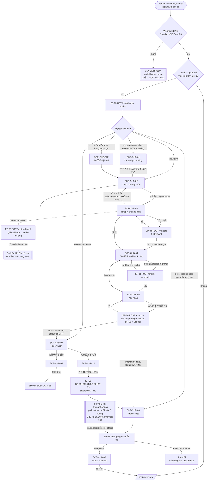
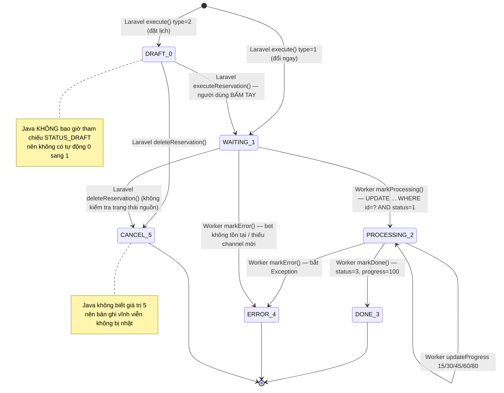

# FA-044 — Đổi LINE Official Account 「LOA入れ替え」 (Change Bot)

**Mã**: FA-044 | **Portal**: Admin (LINE OA) | **Viết tắt màn hình**: `CHB` | **URL chính**: `GET /admin/change-bots-new/{hash_bot_id}`
**Trạng thái tính năng**: **ĐÃ HOÀN THIỆN — ĐANG CHẠY PRODUCTION** | **Trạng thái spec**: Hoàn thành (**v3**) | **Ngày**: 2026-09-12

| Nguồn phân tích | Giá trị |
|-----------------|---------|
| Repo web | `src/web/sns-line` @ nhánh **`release_step_20260827`**, commit **`6b7458b6c5`** (2026-09-12) |
| Repo job | `src/job/linect-service` @ nhánh **`release-t07-2026`**, commit **`debe45bc`** (2026-08-13) — **không quét lại** ở vòng này |
| Phương pháp | **Code-first (v2) + QUÉT LIVE BỔ SUNG (v3)**. v2 dựng từ Blade + JS + CSS + Controller + Request + Model + migration + Spring Boot worker + entity/repository JPA. v3 bổ sung bằng chứng runtime từ phiên Playwright CLI **2026-09-12** trên staging `https://form.watermeru.com` |
| Bằng chứng runtime | **14 screenshot thật** trong [`ui/screenshots/`](ui/screenshots/) + 15 snapshot a11y + network log. 2 bot đã quét: `BOT_SERVER_FORM` (`bot_id = 541`, hash `1QxJWzneWNne`, gói 「おまとめ（スタンダード）」) và `Anh lme1` (hash `6darjNPer9oz`, gói フリー đang trong kỳ campaign) |
| Spec con | [`ui/ui-spec.md`](ui/ui-spec.md) **(v3)** · [`web/api-spec.md`](web/api-spec.md) · [`web/logic-spec.md`](web/logic-spec.md) · [`job/job-spec.md`](job/job-spec.md) · [`db/db-mapping.md`](db/db-mapping.md) · [`_internal/db-hint.md`](_internal/db-hint.md) **(v3)** |
| Kiểm tra chéo | [`_internal/validation-report.md`](_internal/validation-report.md) **(v3)** — **CẦN SỬA: 0 Nghiêm trọng / 3 Trung bình / 6 Nhẹ**; **cả 9 vấn đề V-01…V-09 đã được áp dụng sửa chữa ở vòng này** (§12.2) |

> **Vòng v3 thay đổi gì**: `ui/ui-spec.md` và `_internal/db-hint.md` được cập nhật bằng dữ liệu quét live; `web/`, `job/`, `db/` **không chạy lại agent** vì source FA-044 **không đổi** giữa `release_step_20260805` và `release_step_20260827` (đối chiếu bằng `git diff`), nhưng **đã được sửa tại chỗ** theo 9 mục của validation-report v3.
> **Bản v1 đã bị bác bỏ hoàn toàn** (kết luận sai "backend dummy / tính năng chưa hoàn thiện") — xem §13.

---

## 1. Tổng quan

### 1.1 ⚠ CẢNH BÁO NGHIỆP VỤ QUAN TRỌNG NHẤT

> ## **ĐỔI LINE OFFICIAL ACCOUNT SẼ XOÁ VĨNH VIỄN TOÀN BỘ DỮ LIỆU VẬN HÀNH CỦA LOA CŨ.**
>
> **Thao tác này KHÔNG THỂ HOÀN TÁC. Không có backup tự động. Không có transaction bao trọn tiến trình.**

Khi worker chạy xong, **những dữ liệu sau BỊ XOÁ VĨNH VIỄN** khỏi hệ thống:

| Nhóm | Bị xoá |
|------|--------|
| Bạn bè & hội thoại | Toàn bộ danh sách bạn bè (`bot_line_user`), toàn bộ hội thoại (`conversation`) |
| Tin nhắn | **Toàn bộ lịch sử tin nhắn** trên 5 bảng historydb (`messages`, `messages_v2s`, `messages_page_2`, `messages_old`, `step_message_history`) |
| Tag & thông tin bạn bè | Mọi tag đã gắn cho bạn bè (`tag_line_user`), mọi giá trị friend info đã thu thập (`friend_information_value`) |
| Kịch bản đang chạy | Tiến trình từng bạn bè trong kịch bản (`scenario_lineuser`, `scenario_step_time`) |
| Form / sự kiện / booking | Câu trả lời form (`form_answer_result`), đăng ký sự kiện (`user_event`), đặt chỗ (`b_user_booking`, `b_c_user_booking`, `calendar_course_bookings`, `calendar_salon_line_booking`) |
| Đơn hàng | `s_order_history`, `s_order_history_notify`, `s_cycle_order_history`, `bot_line_user_item` |
| URL rút gọn | `url_shorten`, `url_shorten_detail`, `detail_url_click` (bảng `url_shorten` là bảng lớn nhất hệ thống — **817 MB**) |
| Thống kê | `bot_friend_statistic`, `cross_analysis_items`, `cross_item_line_user`, `detail_click_richmenu`, `detail_landing_click`, `collect_open_landings`, `landing_histories` |

**Chỉ các bảng ĐỊNH NGHĨA do Admin tạo được GIỮ** — kịch bản (`scenario`, `step_message`), form (`form_answer`), sự kiện, rich menu (`rich_menus`), landing page (`landing`), tag (`tags`), item bán hàng (`s_items`), lịch, tin phát sóng (`broadcast`) — nhưng **mọi bộ đếm bị reset về 0** và rich menu / landing / LIFF được **dựng lại trên LOA mới**.

**Quy mô**: **74 thao tác ghi trên ≈66 bảng riêng biệt thuộc 4 database** (`linedb`, `historydb`, `urldb`, `backenddb`) — trong đó **47 thao tác DELETE**. Chi tiết đầy đủ: **§8 — Tác động dữ liệu khi đổi LOA**. **Tin cậy: Cao** (đọc trực tiếp từng native query trong repository Java).

**Tác dụng phụ chéo tính năng mà UI KHÔNG cảnh báo** (`BotRepository.java:123-152`, step 1.8):
- `google_sheet_access_token = NULL`, `google_sheet_id = NULL`, `datetime_connect_google_sheet = NULL` ⇒ **ngắt kết nối Google Sheet** của bot.
- `status_bill_fail = 0`, `first_bill_fail_date = NULL`, `expired_retry_bill = NULL`, `renew_channel_access_error = 0` ⇒ **xoá sạch trạng thái lỗi thanh toán**.
- `b_c_google_calendar` bị reset về NULL toàn bộ cột kết nối ⇒ **ngắt đồng bộ Google Calendar** (kèm gọi API `channels/stop`).

UI chỉ cảnh báo chung chung 「旧アカウントの友だち・配信データは引き継がれません」 và 「入れ替えを実行すると元に戻せません」 (`index.blade.php:162, 196-197, 460-466`) — **không nêu cụ thể Google Sheet, Google Calendar và trạng thái thanh toán**. **Tin cậy: Cao**.

> ⚠ **Rủi ro thứ hai, cũng không có cảnh báo nào trên UI — cửa sổ mất sự kiện webhook**: xem **§2.6**. Trong khoảng từ khi người dùng gõ credential ở SCR-CHB-03 đến khi worker hoàn tất step 1, **mọi sự kiện LINE phát sinh trên LOA mới bị mất im lặng**.

### 1.2 Mục đích

Cho phép Admin **thay LINE Official Account (LOA) đang kết nối với L Message bằng một LOA khác**, giữ nguyên tài khoản/không gian cấu hình L Message hiện tại — kịch bản, template, rich menu, form, lời chào… tiếp tục hoạt động trên LOA mới — nhưng **xoá toàn bộ dữ liệu vận hành gắn với LOA cũ** (§1.1).

Mô tả trên UI (`index.blade.php:132-133`):
> 「現在エルメと接続しているLINE公式アカウントを、別のLINE公式アカウントに入れ替えます。入れ替え方法を選択してください。」

### 1.3 Hai phương thức đổi

| Phương thức | Giá trị JS | `type` DB | `status` khởi tạo | Ý nghĩa |
|-------------|-----------|:---------:|:-----------------:|---------|
| **Đổi ngay** 「すぐにLINE公式アカウントを入れ替える」 | `immediate` | `1` (IMMEDIATE) | `1` (WAITING) | Đưa ngay vào hàng đợi, worker nhặt trong ≤ 30 giây, UI hiển thị tiến độ % |
| **Đặt lịch** 「LINE公式アカウント入れ替え予約をする」 | `scheduled` | `2` (SCHEDULED) | `0` (DRAFT) | Lưu sẵn thông tin LOA thay thế, khi cần chỉ 1 click để thực thi |

> ⚠ 「予約」 **KHÔNG phải hẹn giờ tự động** — xem §2.7.

### 1.4 Đường vào tính năng *(xác nhận live 2026-09-12)*

| Mục | Nội dung | Tin cậy |
|-----|---------|--------|
| Điểm vào trên UI | Sidebar Admin → 「**エルメシステム設定**」 → 「**LINE公式アカウント入れ替え**」. Trên tài khoản đã quét, mục này **đã được ghim vào nhóm 「お気に入り」** nên xuất hiện ngay dòng đầu sidebar | **Cao** cho link + URL (quan sát trực tiếp); **Trung bình** cho vị trí trong cây menu gốc |
| URL | `GET /admin/change-bots-new/{hash_bot_id}` — ví dụ live `https://form.watermeru.com/admin/change-bots-new/1QxJWzneWNne` | **Cao** |
| `hash_bot_id` là gì | **Hashids của `bots.id`** — chuỗi ~12 ký tự (`1QxJWzneWNne` ↔ `bot_id = 541`; `6darjNPer9oz` ↔ bot `Anh lme1`) | **Cao** |
| ⚠ KHÔNG phải | **Không phải** mã LOA 6 ký tự hiển thị ở danh sách bot (VD `WqxDdq`). Nhập mã đó vào URL → **bị redirect `/basic/overview`** | **Cao** (thử live) |
| ⚠ Ràng buộc phiên | Bot trong URL **khác** bot đang chọn trong session (`getBotId()`) → cũng **redirect `/basic/overview`** (`BotController.php:7262`) | **Cao** |
| API gọi khi load trang | `GET /admin/ajax/change-bot/init?bot_id={id}&type=` → **HTTP 200 OK** (bắt live: `bot_id=541`) | **Cao** — đóng vĩnh viễn nghi vấn "backend dummy" của spec v1 |

### 1.5 Actors

| Actor | Quyền truy cập | Cơ sở |
|-------|---------------|-------|
| **Admin (chủ LINE OA)** | Có — nếu `bots.admin_id == Auth::id()` | `BotController.php:7306-7316` (`userCanAccessChangeBot`) |
| **Staff đã accept lời mời** | Có — tồn tại `user_staff_bots` với `bot_id`, `user_invite_id = Auth::id()`, `status = STATUS_ACCEPT` | cùng method |
| **LINE User** | Không liên quan | — |

⚠ **Không có kiểm tra permission theo custom role của Staff** — `userCanAccessChangeBot()` chỉ kiểm tra `status = accept`, bỏ qua `user_staff_bots.role_id`. Mọi Staff đã accept đều thực hiện được thao tác phá huỷ dữ liệu này. **Tin cậy: Cao**.

Middleware nhóm route (`routes/web.php:96`): `['admin_access', 'https_protocol', 'check_remember_token']`, prefix `/admin`.

### 1.6 Phạm vi

- **Bao gồm**: **14 mục màn hình** (12 màn hình wizard + biến thể **SCR-CHB-02F** + rào chắn **BLK-WEBHOOK**), **11 endpoint**, **18 business rule** (+2 quy tắc UI phát hiện từ live), guard gói cước `#39230`, worker Spring Boot 6 bước, toàn bộ tác động dữ liệu trên 4 database.
- **Không bao gồm**: wizard kết nối LOA lần đầu (**FA-042** Add Bot Router), quản lý hợp đồng / gói cước (**FA-031**), các thế hệ code "change bot" cũ (`change_new_bot.blade.php`, `change_bots.blade.php`, route `/admin/change-bot-sub` + view `bot_add_v3`).
- **BLK-WEBHOOK thuộc layout chung, KHÔNG thuộc FA-044** — được mô tả ở đây vì nó **chặn thật** luồng FA-044.

---

## 2. Các màn hình & Luồng xử lý end-to-end

### 2.0 Bảng tổng hợp 14 mục màn hình

Toàn bộ wizard chạy **trọn vẹn trong 1 URL** `/admin/change-bots-new/{hash_bot_id}` — SPA Vue 2, el `#change-new-bot` (`index.blade.php:21`).

**Chú thích nguồn quan sát**:
**[live]** = quan sát bằng thao tác người dùng thật trên hệ thống đang chạy (chỉ điều hướng + click, **không submit**) → nội dung **Cao**.
**[render client-side]** = render bằng cách gán `currentStep` / `confirmData` / `reservation` / `progress` trực tiếp vào Vue instance → **nhãn / nút / văn bản tĩnh / bố cục = Cao** (Blade render thật), **giá trị dữ liệu động = GIẢ, KHÔNG dùng được**.

| Mã | Tên màn hình | `currentStep` | Nguồn quan sát | Screenshot | Blade | Endpoint |
|----|-------------|--------------|----------------|-----------|-------|----------|
| SCR-CHB-01 | Trang chiến dịch (Campaign Landing) | `campaign` | **[live]** ⚠ ảnh bị BLK-WEBHOOK che 2/3 phía trên | [`scr-chb-01-campaign.png`](ui/screenshots/scr-chb-01-campaign.png) | `:24` | EP-01, EP-03 |
| SCR-CHB-02 | Chọn phương thức đổi | `select` *(mặc định)* | **[live]** | [`scr-chb-02-select.png`](ui/screenshots/scr-chb-02-select.png) · [`…-immediate.png`](ui/screenshots/scr-chb-02-select-immediate.png) · [`…-scheduled.png`](ui/screenshots/scr-chb-02-select-scheduled.png) | `:93` | EP-01, EP-03 |
| **SCR-CHB-02F** | **Biến thể gói フリー trong kỳ campaign** ← **MỚI (v3)** | `select` + `isFreePlan && has_campaign` | **[live]** | [`scr-chb-02-select-free-plan.png`](ui/screenshots/scr-chb-02-select-free-plan.png) | `:113-122`, `:186-189` | EP-03 |
| SCR-CHB-03 | Nhập thông tin kết nối (4 field channel) | `input` | **[live]** | [`scr-chb-03-input.png`](ui/screenshots/scr-chb-03-input.png) | `:209` | EP-04, EP-05 |
| SCR-CHB-04 | Cấu hình Webhook URL *(mới ở v2)* | `webhook` | **[render client-side]** | [`scr-chb-04-webhook.png`](ui/screenshots/scr-chb-04-webhook.png) | `:289` | EP-11 |
| SCR-CHB-05 | Xác nhận thông tin kết nối | `confirm` | **[render client-side]** | [`scr-chb-05-confirm.png`](ui/screenshots/scr-chb-05-confirm.png) | `:403` | EP-06 |
| SCR-CHB-06 | Đang xử lý đổi LOA (progress bar) | `processing` | **[render client-side]** | [`scr-chb-06-processing.png`](ui/screenshots/scr-chb-06-processing.png) | `:477` | EP-07 |
| SCR-CHB-07 | Đã có đặt lịch (Reservation) | `reservation` | **[render client-side]** | [`scr-chb-07-reservation.png`](ui/screenshots/scr-chb-07-reservation.png) | `:505` | EP-03, EP-08, EP-09 |
| SCR-CHB-08 | Modal hoàn tất đổi LOA | `showSuccessModal` | **[render client-side]** | [`modal-showSuccessModal.png`](ui/screenshots/modal-showSuccessModal.png) | `:549` | — |
| SCR-CHB-09 | Modal xoá đặt lịch | `showDeleteModal` | **[render client-side]** | [`modal-showDeleteModal.png`](ui/screenshots/modal-showDeleteModal.png) | `:579` | EP-08 |
| SCR-CHB-10 | Modal xác nhận thực thi | `showExecuteModal` | **[render client-side]** | [`modal-showExecuteModal.png`](ui/screenshots/modal-showExecuteModal.png) | `:615` | EP-09 |
| SCR-CHB-11 | Modal quảng bá chiến dịch (toàn hệ thống) | — | **[không render được]** — code chết (`return;`) | *(không có — hợp lệ)* | `modal-campaign-changebot.blade.php` | — |
| SCR-CHB-12 | Trang chặn theo gói (Plan blocked) | — | **[live]** — `alert()` gốc chặn snapshot | *(không có — hợp lệ)* | `change_bot_plan_blocked.blade.php` | EP-02 *(legacy)* |
| **BLK-WEBHOOK** | **Modal chặn webhook ngắt kết nối** ← **MỚI (v3)**, **thuộc layout chung** | — | **[live]** | [`blocker-modal-webhook-off.png`](ui/screenshots/blocker-modal-webhook-off.png) | layout, `#modalWebhookONCallbackFail` | — |

> **14/14 đường dẫn ảnh trỏ tới file có thật, 0 ảnh chết** (kiểm chứng ở validation-report v3). 2 mục không có ảnh đều **có lý do chính đáng**: SCR-CHB-11 là code chết nên không bao giờ render; SCR-CHB-12 bị `alert()` gốc trình duyệt chặn snapshot.

### 2.1 Flow 0 — Tiền đề trước khi vào được luồng *(xác nhận live)*

| # | Điều kiện | Nếu không thoả |
|:-:|----------|---------------|
| 0.1 | URL chứa **Hashids của `bots.id`**, **không phải** mã LOA 6 ký tự | Redirect `/basic/overview` (**Cao**, thử live) |
| 0.2 | Bot trong URL **trùng bot đang chọn trong session** (`getBotId()`) | Redirect `/basic/overview` (`BotController.php:7262`) |
| 0.3 | Bot **không ở trạng thái webhook LINE bị ngắt kết nối** | **BLK-WEBHOOK** bung ra phủ kín trang, **chặn mọi thao tác** kể cả nút 「アカウント入れ替えをはじめる」 ⇒ **không bắt đầu được luồng** (§2.5) |
| 0.4 | Gói cước: bot **フリー** chỉ vào được nhánh `immediate`, và chỉ trong 1 tháng kể từ `bots.created_at` | Thẻ 「予約」 bị khoá (SCR-CHB-02F) hoặc cả 2 thẻ bị khoá (biến thể chưa quan sát được) |

### 2.2 Luồng A — Đổi ngay (IMMEDIATE)

| # | User action | UI | API endpoint | Business logic | DB | Worker | Response | UI update |
|:-:|------------|----|--------------|----------------|----|--------|----------|-----------|
| 1 | Mở `/admin/change-bots-new/{hash}` | — | **EP-01** `BotController@adminChangeNewBot` | BR-10 guard ownership + session | SELECT `bots` | — | HTML SPA | Render `#change-new-bot` |
| 2 | *(tự động)* `mounted()` | — | **EP-03** `/ajax/change-bot/init` | BR-08 tính campaign; đọc schedule mới nhất | SELECT `bots`, `schedule_change_bots` (+4 LINE API nếu có schedule) | — | `{is_free_plan, has_campaign, reservation, is_processing, progress, schedule}` | SCR-CHB-01 / **SCR-CHB-02** / **SCR-CHB-02F** |
| 3 | Chọn thẻ 「すぐに…」 | SCR-CHB-02 | — | `selectMethod('immediate')` — BR-09b chặn gói free (`change_new.js:153`) | — | — | — | Bật nút 「次に進む」 |
| 4 | Bấm 「**次に進む**」 | SCR-CHB-02 | — | `goToInput()` (`change_new.js:157-161`) — **chỉ đổi state, không rời trang** | — | — | — | **SCR-CHB-03** |
| 5 | Gõ `channel_id` / `channel_secret` | SCR-CHB-03 | **EP-05** `/set-webhook` | Debounce 600ms; `setWebhookUrl()` — **BR-14** | — | — | `{success:true}` | **Không hiển thị gì** (thất bại im lặng — E8) |
| 6 | Bấm 「**次に進む**」 | SCR-CHB-03 | **EP-04** `/validate` | `ChangeBotRequest` (BR-02) → 5 LINE API (BR-06, BR-07, BR-12, BR-13) → tính `webhook_url` (BR-14) | **Không ghi DB**; SELECT `bots` để check trùng | — | Thông tin LOA + `webhook_url` + ⚠ 2 access token thô | **SCR-CHB-04** |
| 7 | Copy URL, dán vào LINE Developers, bật 「Webhookの利用」, bấm 「**接続情報の確認にすすむ**」 | SCR-CHB-04 | **EP-11** `/check-webhook` | `checkWebhook()` đọc cờ `active` — **BR-05** | Không ghi DB | — | `{success:true}` | **SCR-CHB-05** (thất bại → toast E7, đứng lại SCR-CHB-04) |
| 8 | Bấm 「この内容で接続する」 | SCR-CHB-05 | **EP-06** `/execute` | **BR-09** guard gói `#39230` → **BR-01** pre-check → INSERT (**BR-16** snapshot) → **BR-01b** `PlanLimitGuard::rollbackIfOverLimit` | **INSERT `schedule_change_bots`** `type=1`, `status=1 (WAITING)`, `progress=0` | — | `{processing:true, schedule:{id}}` | **SCR-CHB-06** + bật polling |
| 9 | *(chờ)* | SCR-CHB-06 | **EP-07** `/progress` mỗi **3 giây** | Scope kép `bot_id` (session) + `schedule_id` | SELECT `schedule_change_bots` | `ChangeBotTask` nhặt trong ≤ 30s → `ChangeBotJob` 6 bước, ghi `progress` 0→15→30→45→60→**80**→100 | `{progress, completed, confirm_data:null}` | Thanh tiến độ % — ⚠ **đứng yên rất lâu ở 80%** rồi nhảy thẳng 100% (§7.4) |
| 10 | *(job xong)* | SCR-CHB-06 | EP-07 | `completed = (status === DONE)` | `status = 3`, `progress = 100` | `markDone()` | `{completed:true}` | **SCR-CHB-08** modal hoàn tất |
| 11 | Bấm 「閉じる」 | SCR-CHB-08 | — | — | — | — | — | `window.location.href = '/basic/overview'` |

> ⚠ **Quan sát live quan trọng (L5)** — **nhánh `immediate` và `scheduled` render SCR-CHB-03 GIỐNG HỆT NHAU**: `diff scr-03-input.txt scheduled-next.txt` chỉ khác **số thứ tự `ref=eNNN`** do playwright-cli tự sinh, **không khác một ký tự nội dung nào**; ảnh chụp 2 nhánh có md5 trùng khớp. Không có nhãn/nút/gợi ý nào phân biệt phương thức đã chọn.
> → **Hệ quả UX**: sau khi rời SCR-CHB-02, **người dùng không còn manh mối nào trên màn hình để biết mình đang ở luồng "đổi ngay" hay "đặt trước"** cho tới tận khi bấm 「この内容で接続する」 ở SCR-CHB-05. **Tin cậy: Cao**.

> ⚠ **Quan sát live (L6)** — **`cancelInput()` KHÔNG reset `selectedMethod`** (`change_new.js:231-233`): bấm 「キャンセル」 ở SCR-CHB-03 chỉ đặt `currentStep = 'select'`. Quay về SCR-CHB-02 thì thẻ **vẫn đang được chọn** và nút 「次に進む」 **vẫn ở trạng thái enabled** — bấm tiếp là vào thẳng lại SCR-CHB-03. Đối lập với `confirmDeleteReservation()` (`:370-373`) vốn **có** reset `selectedMethod = null` ⇒ chứng minh mẫu code reset tồn tại trong file, `cancelInput()` bỏ sót. **Tin cậy: Cao** (đọc code + snapshot `select-scheduled.txt` cho thấy nút mất `[disabled]`).

### 2.3 Luồng B — Đặt lịch (SCHEDULED)

| # | User action | UI | API endpoint | Business logic | DB | Response | UI update |
|:-:|------------|----|--------------|----------------|----|----------|-----------|
| 1–7 | Như Luồng A nhưng chọn thẻ 「…予約をする」 | | | Gói free **không chọn được** `scheduled` (BR-09, BR-09b) — **xác nhận live** tại SCR-CHB-02F | | | |
| 8 | Bấm 「この内容で接続する」 | SCR-CHB-05 | **EP-06** `/execute` với `type=scheduled` | BR-09 + BR-01 + BR-01b | **INSERT** `type=2`, **`status=0 (DRAFT)`** | `{reservation:…, schedule:{id, created_at}}` | **SCR-CHB-07** — client tự dựng thẻ từ `confirmData` |
| 9 | Vào lại trang sau đó | — | **EP-03** `/init` | Đọc schedule mới nhất; gọi **4 LINE API live** bằng `channel_id_new` / `channel_secret_new` đã lưu | SELECT | `reservation.exists = true` | Vào thẳng **SCR-CHB-07** |

**B1 — Xoá đặt lịch**: SCR-CHB-07 → 「接続予約を削除」 → **SCR-CHB-09** → 「削除する」 → **EP-08** `/delete-reservation` → `UPDATE status = 5 (CANCEL)` (**soft-cancel, không DELETE row**) → về SCR-CHB-02 với `selectedMethod = null`.

**B2 — Thực thi đặt lịch**: SCR-CHB-07 → 「LINE公式アカウント 入れ替えを実行」 → **SCR-CHB-10** → 「入れ替えを実行する」 → **EP-09** `/execute-reservation` → 4 guard (BR-09, BR-04, BR-02, BR-03) → `UPDATE status = 1 (WAITING)` → **SCR-CHB-06** + polling.

### 2.4 SCR-CHB-02F — Biến thể gói フリー trong kỳ campaign *(MỚI ở v3, quan sát live)*

Điều kiện: `currentStep === 'select'` **và** `isFreePlan && has_campaign`. Bản v2 code-first đã **dự đoán đúng** biến thể này nhưng chưa mô tả hình dạng. Ảnh: [`scr-chb-02-select-free-plan.png`](ui/screenshots/scr-chb-02-select-free-plan.png) — bot `Anh lme1` (hash `6darjNPer9oz`), snapshot `free-select.txt`.

| Vùng | Nội dung quan sát được | Tin cậy |
|------|----------------------|--------|
| Banner campaign (`.cb-campaign-banner`) | Dải **nền gradient xanh lá** chiếm hết chiều ngang card, bo góc, đặt **trên cùng** thân trang. Dòng 1: icon `info-circle-filled` trắng + 「LINE公式アカウント入れ替え機能」 (trắng đậm) + 「無料開放キャンペーン」 (**màu vàng**). Dòng 2: 「キャンペーン終了まであと：28日07時間40分」 (trắng, cỡ nhỏ) | **Cao** |
| Thẻ 「すぐにLINE公式アカウントを入れ替える」 | **Bình thường, chọn được** — giữ `[cursor=pointer]` trong cây a11y | **Cao** |
| Thẻ 「LINE公式アカウント入れ替え予約をする」 | **BỊ KHOÁ** — phủ overlay **xám đậm bán trong suốt** trùm cả thẻ; **mất `[cursor=pointer]`**; giữa thẻ có **icon ổ khoá** + 2 dòng 「スタンダードプラン以上のご契約で」/「ご利用できます」 | **Cao** — khớp guard `selectMethod()` (`change_new.js:153`) và class binding `locked` (`index.blade.php:186-189`) |
| Nút 「次に進む」 | Vẫn `[disabled]` khi chưa chọn gì | **Cao** |
| Header trang | Xuất hiện thêm nút 「アップグレード」 → `/admin/bot-add?upgrade_bot_id=6darjNPer9oz` — **thuộc layout chung**, không thuộc FA-044 | **Cao** |

> ⚠ Biến thể thứ 3 (`isFreePlan && !has_campaign` — lớp phủ `.lock-free-plan` trùm **cả 2 thẻ**, `index.blade.php:138-143`) **chưa quan sát được** vì cả 2 bot đã quét đều không ở trạng thái này. **Cao** ở mức code, **Thấp** ở mức biểu hiện thị giác — xem §10(b) U-03.

### 2.5 BLK-WEBHOOK — Rào chắn ngoài phạm vi FA-044 *(MỚI ở v3, quan sát live)*

> **Phạm vi**: modal `#modalWebhookONCallbackFail` **KHÔNG thuộc FA-044** — nó nằm trong layout chung (`layout.v2.basic.main`) và xuất hiện trên **mọi trang** Admin/Basic của bot có webhook LINE đang ngắt kết nối. Ghi vào đây vì nó là **rào chắn thực tế của luồng FA-044**.

Ảnh: [`blocker-modal-webhook-off.png`](ui/screenshots/blocker-modal-webhook-off.png), snapshot `free-plan.txt`. **Tin cậy: Cao** (quan sát trực tiếp, bot `Anh lme1`).

**Hành vi quan sát được**: modal **tự bung ngay khi tải trang** `/admin/change-bots-new/{hash}`, **phủ kín phần trên trang** và **chặn mọi thao tác** — bao gồm cả nút 「アカウント入れ替えをはじめる」 của SCR-CHB-01. Trong cây a11y nó là `dialog [active]` **đứng trước** toàn bộ nội dung trang. Người dùng phải xử lý modal (bấm 「Webhook URLを上書き保存したので確認ページにすすむ」, 「この案内を半年間表示しない」, hoặc `×`) mới bắt đầu được luồng FA-044.

| Vùng | Text 「JP」 |
|------|-----------|
| Tiêu đề (đỏ) | 「エルメとLINE公式アカウントの接続が切断されています」 |
| Mô tả | 「エルメとLINE公式アカウントを接続するためには以下の操作を行なってください。」 |
| Bước 1 | 「LINE公式アカウント管理画面の 設定 > Messaging API >Webhook URL を表示」 |
| Bước 2 | 「※ エルメのWebhook URLが正しく設定されている場合「https://cb.lmes.jp/~」が表示されます。」 |
| Bước 3 | 「他社システムのWebhook URLが設定されていないかを確認する。」 + ô `textbox [disabled]` chứa Webhook URL của bot + nút copy |
| Hộp cảnh báo đỏ | 「他社システムのWebhook URLを上書きすると、他社システム側の稼働が停止します。」/「仕様上、エルメと他社システムの併用はできません。」 |
| Nút chính / phụ | 「Webhook URLを上書き保存したので確認ページにすすむ」 / 「この案内を半年間表示しない」 |

**Giá trị quan sát được**: ô bước 3 hiển thị `https://cb-dev.lmes.jp/line/callback/add/47014` (staging); ảnh minh hoạ hiển thị `https://cb.lmes.jp/line/callback/add/` (production). ⇒ **Xác nhận dạng Webhook URL thật của hệ thống: `{DOMAIN_ENDPOINT_WEBHOOK}/line/callback/add/{bot_id}`**.

> ⚠ **Bài học vận hành cho các phiên quét sau**: đây là **lần thứ 2** modal này làm hỏng bộ ảnh quét (lần 1 tại FA-028). Ảnh [`scr-chb-01-campaign.png`](ui/screenshots/scr-chb-01-campaign.png) bị chính modal này che 2/3 phía trên. Khi quét bất kỳ tính năng nào, **kiểm tra `dialog [active]` ở đầu snapshot trước khi chụp ảnh**.

### 2.6 ⚠ Webhook URL hậu tố `/0` — CÓ CHỦ Ý, nhưng tạo cửa sổ mất sự kiện *(CHỐT ở v3)*

**Kết luận: `/0` là placeholder tiền-swap CÓ CHỦ Ý, KHÔNG phải bug.** Chuỗi bằng chứng (**Tin cậy: Cao**):

| # | Bằng chứng | `file:line` |
|:-:|-----------|------------|
| 1 | `validateChannel()` dựng `webhook_url` hiển thị ở SCR-CHB-04 với **hậu tố cứng `/0`** | `app/Http/Controllers/Ajax/ChangeBotController.php:127` |
| 2 | Helper `setWebhookUrl()` — bên **thực sự ghi** endpoint lên LINE ở EP-05 — cũng hardcode **cùng chuỗi `/0`** | `app/Helpers/functions.php:5824` |
| 3 | ⇒ URL **hiển thị** và URL **được ghi tự động** là **một**; không mâu thuẫn nội bộ. Mục đích duy nhất: thoả điều kiện "Webhook đang bật" để `checkWebhook()` (EP-11) đi qua — ở SCR-CHB-03/04 **chưa tồn tại bản ghi `bots` nào** cho LOA mới | (1)+(2) |
| 4 | Worker Java **ghi đè bằng URL thật** ngay ở **step 1 (progress 15)**: `DOMAIN_ENDPOINT_WEBHOOK + "/line/callback/add/" + botId` → lưu vào `bots.webhook_url` | `ChangeBotJob.java:163-165, 206`; `BotRepository.java:139, 168` |
| 5 | Dump DB xác nhận dạng thật: **215/221** bản ghi `bots.webhook_url` có hậu tố **trùng đúng `bots.id`** ⇒ `47014` quan sát ở BLK-WEBHOOK cũng chỉ là một `bots.id`, **không phải cột khác** | `db/data/bots.sql`; `db/db-mapping.md:452, 773` |

> ## ⚠ **HỆ QUẢ VẬN HÀNH — CỬA SỔ MẤT SỰ KIỆN WEBHOOK (không có cảnh báo nào trên UI)**
>
> Trong khoảng từ khi **EP-05 ghi `/0`** lên LOA mới (SCR-CHB-03) cho tới khi **worker hoàn tất step 1**, LOA mới trỏ webhook vào một URL **không route được tới bot nào**:
> - Route `POST /line/callback/add/{bot_id}` (`routes/web.php:2508`) → `callbackWebHook()` nhận `bot_id = "0"`.
> - Vì trong PHP **`empty("0") === true`**, hàm **short-circuit ngay tại `if (empty($bot_id))`** (`app/Http/Controllers/Admin/BotController.php:2008-2011`), trả `{"status":"Ok"}` **HTTP 200** và **bỏ qua toàn bộ mảng `events`** mà không lưu gì.
> - LINE nhận 200 OK ⇒ **không retry**.
>
> ⇒ **Mọi sự kiện LINE phát sinh trên LOA mới trong cửa sổ đó (tin nhắn đến, follow/unfollow…) BỊ MẤT VĨNH VIỄN, im lặng.**
>
> **Độ dài cửa sổ** = thời gian người dùng ở SCR-CHB-03→04→05 + độ trễ hàng đợi worker (quét 30 giây/lần) + thời gian chạy step 1.
> **Tin cậy: Cao** (đọc trực tiếp source). **Chưa tài liệu nào khác của dự án nêu rủi ro này** — xem G-04 / TD-B03.

### 2.7 ⚠ 「予約」 KHÔNG phải hẹn giờ tự động

**Đây là thiết kế cố ý, không phải thiếu sót.** Bằng chứng (**Tin cậy: Cao**):

| Bằng chứng | Vị trí |
|-----------|--------|
| Query poll của worker cứng `status = 1` — `findTop50ByStatusOrderByIdAsc(1)` | `ScheduleChangeBotRepository.java:14` |
| Java **không tham chiếu** `STATUS_DRAFT` ở bất kỳ đâu ngoài dòng khai báo (grep toàn repo = 1 kết quả) | `ScheduleChangeBot.java:13` |
| Bảng **không có cột thời điểm hẹn** — không có `scheduled_at` | migration `2026_04_17_125226` |
| Đường duy nhất `DRAFT(0) → WAITING(1)` là `executeReservation()` **do người dùng bấm tay** | `Ajax/ChangeBotController.php:339` |
| Laravel không có console command / scheduler nào chạm bảng này | grep `app/Console/` = 0 kết quả |

⇒ 「予約」 nghĩa là **"đăng ký sẵn thông tin LOA thay thế, chờ bấm thực thi thủ công"**. Đây cũng là lý do UI **không có bất kỳ input ngày/giờ nào** và tính năng **không dùng SC-007 (Schedule/Timer Settings)**.

### 2.8 SCR-CHB-12 — Trang chặn theo gói *(xác nhận live 100%)*

`change_bot_plan_blocked.blade.php`, render bởi `BotController@adminChangeBotSub` khi bot free vi phạm điều kiện (`BotController.php:7288-7292`).

**Quan sát live 2026-09-12** — truy cập `/admin/change-bot-sub/6darjNPer9oz?type_change=scheduled` với bot gói フリー:
1. Trang trả về **hộp thoại `alert()` gốc của trình duyệt** — playwright-cli báo `Modal state: ["alert" dialog with message "スタンダードプラン以上のご契約でご利用できます"]` và **từ chối snapshot**. Nội dung alert **khớp chính xác** chuỗi trong code.
2. Sau khi chấp nhận alert → **redirect sang `/admin/bot-add`**, title trang mới 「LOA選択（プラン選択）」.
3. **Trang không có DOM nào khác** ngoài alert → xác nhận đây là HTML trần không kế thừa layout.

**Tin cậy: Cao**. Màn hình này **không còn nằm trên luồng chính FA-044** (vì `goToInput()` không còn điều hướng sang `/change-bot-sub`); chức năng tương đương nay do guard `#39230` ở backend đảm nhiệm — trả toast 「現在のプランは利用できない機能です。アップグレードが必要になります。」 ngay trong SPA.

### 2.9 Flow Diagram



### 2.10 Danh sách lỗi hiển thị được / bị nuốt

| # | Tình huống | Thông điệp 「JP」 | Hiển thị? |
|:-:|-----------|-----------------|:---------:|
| E1 | Thiếu field / vượt 500 ký tự | 「チャネルIDを入力してください」 v.v. (4 field × 2 rule) | ✔ dưới từng field |
| E2 | LOA mới đã kết nối L Message (BR-02) | 「このLINE公式アカウントは、すでにL Messageに接続されています。…」 | ✔ dưới field `channel_id` |
| E3/E6 | Credential Messaging API / LINE Login sai | 「入力した情報に誤りがありますので、…」 | ✔ toast |
| E4 | `getLineInfoBot` rỗng | 「認証できませんでした。」 | ✔ toast |
| E5 | Response thiếu `userId` | 「入力した情報が間違っています。再確認してください。」 | ✔ toast |
| **E7** | **Webhook chưa bật** (BR-05, tại SCR-CHB-04) | 「Webhookをオンにして下さい。 既にオンの場合は、一度オフにしてから再度オンに変更して下さい。」 | ✔ toast, đứng lại SCR-CHB-04 |
| E7b | Thiếu channel_id/secret khi check webhook | 「入力情報が不足しています。」 | ✔ toast |
| E8 | Đặt webhook endpoint tự động thất bại | 「Webhookエンドポイントの設定に失敗しました」 | ❌ **bị nuốt** — JS chỉ `.fail()` reset key |
| E9 | Đang có tiến trình đổi (BR-01) | 「LOA変更処理中のため、変更できません。…」 | ✔ toast (đã sửa — FE đọc `r.msg`) |
| **E9b** | **Bị chặn bởi gói cước (BR-09)** | 「現在のプランは利用できない機能です。アップグレードが必要になります。」 | ✔ toast tại SCR-CHB-05 |
| E9c | Race condition 2 tab (BR-01b) | 「LOA変更処理中のため、…」 | ✔ toast |
| E10/E10b/E11/E12 | 4 guard của `executeReservation` | (BR-04 / BR-09 / BR-02 / BR-03) | ✔ toast tại SCR-CHB-10 |
| E13 | Job chuyển `ERROR(4)` / `CANCEL(5)` | `message_error` từ DB — **luôn NULL** ⇒ fallback `'Error'` | ✔ toast nhưng **vô nghĩa**, màn hình đứng ở SCR-CHB-06 |
| E15 | Xoá reservation thất bại | server có `message` | ❌ **bị nuốt** — `if (!r.success) return;` (`change_new.js:369`) |
| E16 | `schedule_id` không thuộc bot hiện tại | HTTP 404 `Schedule not found` | ❌ client không xử lý → im lặng, polling tiếp tục |
| E17 | Bot bị `is_deleted` | HTTP 404 `Bot not found` | ❌ không xử lý — trang đứng ở `select` với dữ liệu mặc định |

> ⚠ **Toàn bộ E1–E18 chưa quan sát được trên runtime** (không submit form). **Nội dung thông điệp = Cao** (đọc source); **cách hiển thị = Trung bình** — xem §10(b) U-05.

### 2.11 Hai lỗi hiển thị đã xác nhận trên runtime

| # | Lỗi | Vị trí | Bằng chứng runtime | Tin cậy |
|:-:|-----|--------|-------------------|--------|
| 1 | Link ở SCR-CHB-04 ghi 「**LL**INE Developersコンソールを開く ↗」 — **thừa 1 chữ `L`** | `index.blade.php:381` | `scr-chb-04-webhook.txt` (`generic: LLINE Developersコンソールを開く ↗`) + ảnh | **Cao** |
| 2 | SCR-CHB-05 dùng 「LINEログイン**チャンネル**」 trong khi mọi nơi khác trong cùng tính năng dùng 「チャネ**ル**」 — **lệch thuật ngữ chuẩn của LINE** | `index.blade.php:451` — **hit duy nhất** của `チャンネル` trong file (`grep -c` = 1) | `scr-chb-05-confirm.txt` | **Cao** |

Cả 2 đều **hiển thị thật với người dùng cuối**. Cần sửa.

---

## 3. Data Model

### 3.1 `schedule_change_bots` — bảng trung tâm & hàng đợi duy nhất

⚠ **Bảng này KHÔNG có trong dump DB của dự án** (dump tạo trước migration `2026_04_17_125226`). Schema dưới đây dựng từ **2 nguồn code độc lập, khớp nhau hoàn toàn**: migration Laravel + entity JPA của worker. **Tin cậy cấu trúc: Cao; index/FK/charset thực tế: Thấp.**

| Cột | Kiểu | Null | Default | Field entity Java | Mô tả |
|-----|------|:----:|---------|-------------------|-------|
| `id` | `int unsigned AI` | No | — | `long id` | PK. Lộ ra client dưới tên `schedule_id` |
| `bot_id` | `int(11)` | Yes | NULL | `Long botId` | Bot **CŨ** đang được thay thế (FK logic, **không có constraint**) |
| `type` | `tinyint(4)` | Yes | NULL | `Integer type` | `1: now`, `2: schedule`. **Worker không đọc cột này** |
| `channel_id` | `varchar(500)` | Yes | NULL | `String channelId` | Snapshot Messaging channel **CŨ** |
| `channel_secret` | `varchar(500)` | Yes | NULL | `String channelSecret` | Snapshot secret CŨ — ⚠ **plaintext** |
| `channel_id_line_login` | `varchar(500)` | Yes | NULL | `String channelIdLineLogin` | Snapshot LINE Login channel CŨ |
| `channel_secret_line_login` | `varchar(500)` | Yes | NULL | `String channelSecretLineLogin` | ⚠ **plaintext** |
| `channel_id_new` | `varchar(500)` | Yes | NULL | `String channelIdNew` | **Messaging channel MỚI — bắt buộc**, rỗng → `markError` |
| `channel_secret_new` | `varchar(500)` | Yes | NULL | `String channelSecretNew` | **Bắt buộc** — ⚠ **plaintext** |
| `channel_id_line_login_new` | `varchar(500)` | Yes | NULL | `String channelIdLineLoginNew` | LINE Login channel MỚI |
| `channel_secret_line_login_new` | `varchar(500)` | Yes | NULL | `String channelSecretLineLoginNew` | ⚠ **plaintext** |
| `status` | `tinyint(4)` | Yes | NULL | `Integer status` | Comment migration: `0:draft, 1:waiting, 2:processing, 3:done, 4:error` — ⚠ **thiếu `5:cancel`** dù Laravel dùng |
| `progress` | `int(11)` | Yes | `0` | `Integer progress` | 0..100. **Chỉ worker ghi**; FE polling đọc |
| `message_error` | `text` | Yes | NULL | ❌ **KHÔNG CÓ FIELD** | Laravel đọc & trả cho FE; **worker không bao giờ ghi** ⇒ **luôn NULL** |
| `created_at` / `updated_at` | `timestamp` | Yes | NULL | `LocalDateTime` | Model PHP có accessor ép format `Y-m-d H:i:s` khi đọc |

**Index**: chỉ `PRIMARY(id)`. **Không có FK nào** — xoá bot không tự dọn schedule. **Model Eloquent** `App\ScheduleChangeBot` khai báo `$guarded = []` (mass assignment mở).

⚠ **Rủi ro hiệu năng đã xác định** — 4 truy vấn nóng đều thiếu index hỗ trợ:

| Truy vấn | Nơi gọi | Tần suất |
|---------|---------|---------|
| `WHERE status = 1 ORDER BY id ASC LIMIT 50` | Worker poll | **mỗi 30 giây × 5 luồng** |
| `WHERE bot_id = ? AND status IN (0,1,2)` | BR-01 / BR-01b / BR-04 | mỗi lần submit |
| `WHERE channel_id_new = ? AND channel_secret_new = ? AND status IN (1,2)` | BR-03 | mỗi lần thực thi reservation |
| `WHERE bot_id = ? ORDER BY id DESC LIMIT 1` | `init()` | mỗi lần load trang |

### 3.2 `bots` — đích cuối cùng của việc đổi LOA

Laravel **không bao giờ ghi** vào `bots` trong luồng FA-044; việc thay LOA **100% do worker Java thực hiện** ở step 1.8 qua `BotRepository.swapChannelForChangeBot` — **UPDATE 28 cột** (15 tham số hoá + 13 giá trị cố định), `BotRepository.java:122-152`.

| Nhóm | Cột |
|------|-----|
| **15 cột nhận giá trị mới** | `channel_id`, `channel_secret`, `channel_access_token`, `channel_id_line_login`, `channel_secret_line_login`, `line_id` (=`basicId`), `view_name` (=`displayName`), `url_add_friend`, `bot_image` (=`pictureUrl`), `expired_date_channel_access_token` (= `NOW()+28 ngày`), `liff_app_id`, `liff_app_id_booking`, `liff_callback_unique`, `url_liff_app_callback`, **`webhook_url`** (= `{DOMAIN_ENDPOINT_WEBHOOK}/line/callback/add/{botId}` — **thay cho `/0` tạm**, §2.6) |
| **13 cột đặt cứng** | `liff_app_id_old=NULL`, `is_verify=1`, `is_get_old_friend=1`, `message_sent_count=0`, **`google_sheet_access_token=NULL`**, **`google_sheet_id=NULL`**, **`datetime_connect_google_sheet=NULL`**, `renew_channel_access_error=0`, **`status_bill_fail=0`**, **`first_bill_fail_date=NULL`**, **`expired_retry_bill=NULL`**, `count_user_unconfirm=0`, `updated_at=NOW()` |

Cột `bots` khác dùng bởi FA-044: `id` (Hashids → `{hash_bot_id}`), `admin_id` (BR-10), `is_deleted` (BR-15; `=2` là **bot tạm**), `id_bot_change` (worker tìm bot tạm), `plan_type` (`1:standard`, `2:free` — BR-08/BR-09, khớp `COMMENT` trong `db/schema/tables/bots.sql:54`), `created_at` (mốc campaign), `expired_date_free_plan`, `count_app_notify`, `view_name` (tên bot ở header).

⚠ **Cột chết**: `bots.campaign_change_bot` (migration `2026_04_20_165013`) — **không có writer, không có reader** trên cả 2 repo. Response `/init` trả **key JSON trùng tên** nhưng giá trị tính lại runtime từ `bots.created_at + 1 tháng`. **Tin cậy: Cao**.

### 3.3 Bảng phụ (chỉ đọc)

| Bảng | Vai trò | Tin cậy |
|------|---------|--------|
| `user_staff_bots` | Guard quyền Staff (`bot_id`, `user_invite_id`, `status = 1`). ⚠ **`role_id` không được kiểm tra** | Cao |
| `bot_contracts` | `contract_type` (`'standard'`/`'free'`) — điều kiện phụ hiển thị SCR-CHB-11 | **Thấp** — không truy được nơi share biến view `$getBotInfo`; modal này đang bị tắt cứng ⇒ tác động thực tế = 0 |
| `bot_slots` | `bot_slot_id` truyền qua view nhưng **không consumer nào đọc** | Cao (là "không dùng") |

### 3.4 ER Diagram

```mermaid
erDiagram
    bots ||--o{ schedule_change_bots : "bot_id (logic, KHÔNG có FK)"
    bots ||--o{ user_staff_bots : "guard quyền Staff"
    bots ||--o{ bot_contracts : "contract_type (SCR-CHB-11)"
    bots ||--o| bots : "id_bot_change — bot tạm (is_deleted=2)"

    bots ||--o{ bots_profiles : "worker UPDATE avatar/nickname (step1)"
    bots ||--o{ landing : "worker UPDATE QR + reset counter (step1)"
    bots ||--o{ rich_menus : "worker UPDATE rich_menu_id (step1)"
    rich_menus ||--o{ rich_menu_items : "worker ĐỌC dựng lại areas"
    rich_menu_items ||--o{ richmenu_switch_item : "worker ĐỌC"
    bots ||--o{ richmenu_update_history : "worker INSERT (step1)"
    bots ||--o{ callback_event : "worker DELETE (backenddb, step1)"

    bots ||--o{ bot_line_user : "worker DELETE + migrate (step2)"
    bots ||--o{ conversation : "worker DELETE + migrate (step2)"
    bots ||--o{ scenario : "worker RESET counter (step2)"
    scenario ||--o{ step_message : "worker RESET send_count"
    bots ||--o{ s_order_history : "worker DELETE (step2)"

    bots ||--o{ messages : "worker DELETE (historydb, step3)"
    bots ||--o{ messages_v2s : "worker DELETE + migrate (historydb, step3)"
    bots ||--o{ broadcast : "worker RESET send_count — GIỮ cấu hình"

    bots ||--o{ form_answer : "worker RESET count_user_reply (step4)"
    form_answer ||--o{ form_answer_result : "worker DELETE"
    bots ||--o{ b_slot : "worker RESET use_people (step4)"

    bots ||--o{ tags : "worker RESET count_user_tag (step5)"
    tags ||--o{ tag_line_user : "worker DELETE"
    bots ||--o{ friend_information_setting : "worker RESET (step5)"
    bots ||--o{ b_c_google_calendar : "worker RESET về NULL (step5)"
    bots ||--o{ url : "GIỮ NGUYÊN (urldb)"
    url ||--o{ url_shorten : "worker DELETE (urldb, step5)"

    calendar_course ||--o{ calendar_course_receptions : "worker RESET 6 counter (step6)"
    bots ||--o{ cross_analysis_items : "worker DELETE (step6)"
    bots ||--o{ bot_friend_statistic : "worker DELETE (step6)"
```



### 3.5 State machine — **ai đặt trạng thái nào**

| Giá trị | Hằng số | **Bên đặt** | Biểu hiện UI |
|:------:|---------|-------------|-------------|
| `0` | `DRAFT` | **Laravel** — `execute()` với `type = 2` | SCR-CHB-07 「入れ替え予約が設定されています」 |
| `1` | `WAITING` | **Laravel** — `execute()` với `type = 1`, hoặc `executeReservation()` | (bị JS ép về SCR-CHB-02 — xem G-06) |
| `2` | `PROCESSING` | **Worker Java** — `markProcessing()` | SCR-CHB-06, polling 3s |
| `3` | `DONE` | **Worker Java** — `markDone()` (`progress = 100`) | SCR-CHB-08 modal hoàn tất |
| `4` | `ERROR` | **Worker Java** — `markError()` (**không ghi `message_error`**) | Toast `'Error'`, đứng ở SCR-CHB-06 |
| `5` | `CANCEL` | **Laravel** — `deleteReservation()`. ⚠ Java **không có hằng `STATUS_CANCEL`** | Thẻ đặt lịch biến mất |

> **Nhất quán enum: 6/6 tài liệu khớp hoàn toàn, 0 sai lệch** (validation-report v3 §B.6).



---

## 4. Field Traceability Matrix

**Hướng**: `→` client gửi lên & persist | `←` server trả về hiển thị | `↔` cả hai | `—` không persist.
Trường lấy runtime từ LINE API ghi `— (External: LINE API)`.

| # | UI Element 「JP」 | Màn hình | DB Table.Column | Hướng | Validation | Business Rule |
|:-:|------------------|----------|-----------------|:-----:|-----------|---------------|
| 1 | Countdown 「日/時間/分」 (định dạng `NN日NN時間NN分`) | SCR-CHB-01, 02, **02F** | `bots.created_at` (Computed: `+1 tháng, endOfDay()`) | ← | — | BR-08 |
| 2 | Điều kiện hiện campaign / banner campaign | SCR-CHB-01, **02F** | `bots.plan_type`, `bots.created_at` (Computed) | ← | — | BR-08 |
| 3 | Thẻ 「すぐに…入れ替える」 | SCR-CHB-02 | `schedule_change_bots.type = 1` (Enum) | → | — | BR-11 |
| 4 | Thẻ 「…予約をする」 | SCR-CHB-02 | `schedule_change_bots.type = 2` (Enum) | → | — | BR-11, BR-09 |
| 5 | Lớp phủ khoá thẻ scheduled (icon ổ khoá, mất `cursor:pointer`) | **SCR-CHB-02F** | `bots.plan_type` (Enum) | ← | — | BR-09b |
| 6 | Lớp phủ `.lock-free-plan` cả 2 thẻ *(chưa quan sát được)* | SCR-CHB-02 | `bots.plan_type`, `bots.created_at` | ← | — | BR-09b |
| 7 | 「チャネルID **\***」(Messaging API) | SCR-CHB-03 | **`schedule_change_bots.channel_id_new`** | → | `required\|max:500` | BR-02, BR-06 |
| 8 | 「チャネルシークレット **\***」(Messaging API) | SCR-CHB-03 | **`schedule_change_bots.channel_secret_new`** | → | `required\|max:500` | BR-06 |
| 9 | 「チャネルID **\***」(LINE Login) | SCR-CHB-03 | **`schedule_change_bots.channel_id_line_login_new`** | → | `required\|max:500` | BR-07 |
| 10 | 「チャネルシークレット **\***」(LINE Login) | SCR-CHB-03 | **`schedule_change_bots.channel_secret_line_login_new`** | → | `required\|max:500` | BR-07 |
| 11 | *(ngầm)* snapshot 4 credential CŨ | SCR-CHB-03 → EP-06 | `schedule_change_bots.channel_id`, `.channel_secret`, `.channel_id_line_login`, `.channel_secret_line_login` ← `bots.*` | → | — | **BR-16** |
| 12 | 「発行されたWebhook URL」 (hậu tố `/0`) | SCR-CHB-04 | — (External: `env('DOMAIN_ENDPOINT_WEBHOOK')`); **worker ghi bản thật vào `bots.webhook_url`** | ← | — | **BR-14** |
| 13 | Nút 「接続情報の確認にすすむ」 | SCR-CHB-04 | — (không ghi DB) | — | `empty()` inline | **BR-05** |
| 14 | Ảnh đại diện LOA | SCR-CHB-05, 07, 08, 09, 10 | — (External: LINE API `pictureUrl`) | ← | — | — |
| 15 | Tên LOA | SCR-CHB-05, 07, 08, 09, 10 | — (External: LINE API `displayName`) | ← | — | — |
| 16 | 「LINE ID：」 | SCR-CHB-05, 07, 08, 09, 10 | — (External: LINE API `basicId`) | ← | — | — |
| 17 | Tag gói LOA *(ẩn ở SCR-CHB-07)* | SCR-CHB-05, 08, 09, 10 | — (External: LINE API `/v2/bot/message/quota`) | ← | — | **BR-12** |
| 18 | 「友だち数：」 *(ẩn ở SCR-CHB-07, 09, 10)* | SCR-CHB-05, 08 | — (External: LINE API `followers − blocks`) | ← | — | **BR-13** |
| 19 | 「チャネル名」(Messaging API) | SCR-CHB-05 | — (External: server gán = `displayName`) | ← | — | — |
| 20 | 「Bot ID」 | SCR-CHB-05 | — (External: `basicId`) | ← | — | — |
| 21 | 「チャネルID」 hiển thị lại | SCR-CHB-05 | `schedule_change_bots.channel_id_new` *(chưa persist tại thời điểm hiển thị)* | ← | — | — |
| 22 | 「チャネルシークレット」 (masked) | SCR-CHB-05 | `schedule_change_bots.channel_secret_new` — server mask `3 đầu + 12 dấu '•' + 3 cuối`; **DB lưu plaintext** | ← | — | — |
| 23 | 「チャネルID」 LINE Login hiển thị lại | SCR-CHB-05 | `schedule_change_bots.channel_id_line_login_new` | ← | — | — |
| 24 | 「チャネルシークレット」 LINE Login (masked) | SCR-CHB-05 | `schedule_change_bots.channel_secret_line_login_new` | ← | — | — |
| 25 | Badge 「有効」 ×3 | SCR-CHB-05 | — (hardcode Blade; server trả `'valid'` nhưng UI không đọc) | — | — | — |
| 26 | Thanh tiến độ + 「{n}%」 | SCR-CHB-06 | `schedule_change_bots.progress` (**worker ghi**) | ← | — | — |
| 27 | Toast lỗi tiến trình | SCR-CHB-06 | `schedule_change_bots.message_error` — ⚠ **LUÔN NULL** | ← | — | — |
| 28 | Điều kiện vào màn hình processing | SCR-CHB-06 | `schedule_change_bots.status = 2` (Enum) | ← | — | — |
| 29 | 「予約操作日時:」 | SCR-CHB-07 | `schedule_change_bots.created_at` (Computed: `Y年M月D日 HH:mm`) | ← | — | — |
| 30 | Badge 「入れ替え予約が設定されています」 | SCR-CHB-07 | `schedule_change_bots.status = 0` (Enum) | ← | — | — |
| 31 | Badge 「接続済み」 | SCR-CHB-08 | — (hardcode; điều kiện ngầm `status = 3`) | — | — | — |
| 32 | Nút 「削除する」 | SCR-CHB-09 | `schedule_change_bots.status → 5` | → | — | — |
| 33 | Nút 「入れ替えを実行する」 | SCR-CHB-10 | `schedule_change_bots.status → 1` | → | — | BR-09, BR-04, BR-02, BR-03 |
| 34 | Điều kiện hiện modal campaign | SCR-CHB-11 | `bots.plan_type` / `bot_contracts.contract_type` *(**Tin cậy: Thấp**)* | ← | — | — |
| 35 | "Đã đóng modal hôm nay" | SCR-CHB-11 | — (localStorage `mcc_dismissed_{userId}_{botId}`) | — | — | — |
| 36 | Điều kiện chặn theo gói | SCR-CHB-12 | `bots.plan_type`, `bots.created_at` (Enum) | ← | — | BR-09b |
| 37 | `{hash_bot_id}` trên URL | Mọi màn hình | `bots.id` (Computed: **Hashids**) | ← | — | BR-10 |
| 38 | Webhook URL trong ô copy | **BLK-WEBHOOK** *(ngoài FA-044)* | `bots.webhook_url` (Direct) | ← | — | BR-14 |

> **Coverage**: 24/49 element map được vào DB (**49,0%** thô) — xem §12.1 để hiểu vì sao đây **không phải thiếu sót mapping**.

---

## 5. Business Rules

### 5.1 18 quy tắc nghiệp vụ chính thức

| ID | Quy tắc | `file:dòng` | Tin cậy |
|----|---------|------------|---------|
| **BR-01** | **Một bot chỉ có tối đa 1 schedule active** (`status ∈ {0,1,2}`). Vi phạm → 「LOA変更処理中のため、変更できません。処理完了後に再度お試しください。」 + `logInfo` | `Ajax/ChangeBotController.php:221-231`; `Admin/BotController.php:4795-4818` | Cao |
| **BR-01b** | **[#39230] Chốt chặn SAU INSERT (chống race condition)**: đếm lại số bản ghi active có `id <= id vừa tạo`; nếu `> 1` thì **xoá chính bản vừa tạo** và trả lỗi. Bản ghi tạo TRƯỚC được giữ | `Ajax/ChangeBotController.php:248-264`; `app/Services/PlanLimitGuard.php:100-124, 208-235` | Cao |
| **BR-02** | **LOA mới không được trùng bot đang hoạt động**: không tồn tại `bots.channel_id = <channel_id mới>` với `is_deleted = 0` | `app/Http/Requests/ChangeBotRequest.php:33-43`; `Ajax/ChangeBotController.php:325-328` | Cao |
| **BR-03** | **LOA mới không được là target của reservation khác đang chờ/chạy**: không có `schedule_change_bots` khác cùng (`channel_id_new`, `channel_secret_new`) với `status ∈ {1,2}` | `Ajax/ChangeBotController.php:330-337` | Cao |
| **BR-04** | **Không thực thi reservation khi bot đang có tiến trình chạy** (`WAITING`/`PROCESSING`) | `Ajax/ChangeBotController.php:318-319` | Cao |
| **BR-05** | **Webhook của LOA mới phải đang bật** mới đi tiếp từ `webhook` sang `confirm`. `checkWebhook()` → `GET /v2/bot/channel/webhook/endpoint`, đọc cờ `active` | `Ajax/ChangeBotController.php:168-171`; `app/Helpers/functions.php:4262` | Cao |
| **BR-06** | **Credential Messaging API phải hợp lệ**: lấy được access token và `GET /v2/bot/info` trả object có `userId` | `Ajax/ChangeBotController.php:105-114` | Cao |
| **BR-07** | **Credential LINE Login phải hợp lệ** (`client_credentials`) | `Ajax/ChangeBotController.php:117-118`; `app/Helpers/functions.php:5844-5868` | Cao |
| **BR-08** | **Điều kiện campaign**: `has_campaign = (bots.plan_type === 2) && (now < bots.created_at + 1 tháng, endOfDay)` | `Ajax/ChangeBotController.php:58-59` | Cao |
| **BR-09** | **[#39230] Guard gói cước ở BACKEND**: bot trả phí không giới hạn; bot free (`plan_type = 2`) **chỉ được đổi NGAY** trong campaign 1 tháng kể từ `bots.created_at`, và **KHÔNG được dùng đặt lịch**. Vi phạm → 「現在のプランは利用できない機能です。アップグレードが必要になります。」 + `logInfo('[#39230] …')`. Áp dụng ở `execute()` và `executeReservation()`. ⚠ `executeReservation()` gọi **không truyền `$type`** ⇒ chặn **toàn bộ** bot free | `Ajax/ChangeBotController.php:26-37`, `:208-218`, `:309-317` | Cao |
| **BR-09b** | **Guard gói cước phía màn hình**: `adminChangeBotSub()` trả view `change_bot_plan_blocked` (SCR-CHB-12, **xác nhận live**); JS `selectMethod()` chặn chọn thẻ 「予約」 (**xác nhận live** tại SCR-CHB-02F) | `Admin/BotController.php:7288-7292`; `change_new.js:153-155` | Cao |
| **BR-10** | **Quyền truy cập màn hình**: bot trong URL phải trùng `getBotId()` (session) **và** user là owner (`bots.admin_id`) hoặc staff đã accept (`user_staff_bots.status = STATUS_ACCEPT`) | `Admin/BotController.php:7262-7264`, `:7281-7283`, `:7306-7316` | Cao |
| **BR-11** | **Ánh xạ phương thức**: `immediate` → `type = 1`, `status = WAITING(1)`; `scheduled` → `type = 2`, `status = DRAFT(0)` | `Ajax/ChangeBotController.php:203, 242` | Cao |
| **BR-12** | **Tên gói LOA suy ra từ quota tin nhắn LINE**: `< 200` → rỗng; `200–4999` → 「コミュニケーションプラン」; `5000–29999` → `Lite`; `>= 30000` → `Standard` | `app/Helpers/functions.php:4286` | Cao |
| **BR-13** | **Số bạn bè hiển thị** = `followers − blocks` từ `GET /v2/bot/insight/followers?date=<hôm nay>` — **không** `COUNT(bot_line_user)` | `Ajax/ChangeBotController.php:80, 134`; `app/Helpers/functions.php:5793-5819` | Cao |
| **BR-14** | **Webhook endpoint được ghi đè** thành `env('DOMAIN_ENDPOINT_WEBHOOK') . 'line/callback/add/0'` (fallback `url(...)`); **cùng chuỗi này** trả về FE ở `webhook_url`. ⚠ Worker sau đó ghi lại với `{botId}` **thật** ở step 1 — xem §2.6 về **cửa sổ mất sự kiện** | `app/Helpers/functions.php:5824`; `Ajax/ChangeBotController.php:127`; `ChangeBotJob.java:163-166` | Cao |
| **BR-15** | **Bot phải tồn tại và chưa bị xoá** (`bots.is_deleted = 0`) ở mọi endpoint ghi dữ liệu | `Ajax/ChangeBotController.php:43-44`, `:200-201` | Cao |
| **BR-16** | **Bản ghi lưu SNAPSHOT credential**: `execute()` chép 4 credential **cũ** từ `bots` và 4 credential **mới** từ request tại thời điểm tạo — worker dùng snapshot này, **không đọc lại `bots`** | `Ajax/ChangeBotController.php:232-244` | Cao |

### 5.2 Quy tắc UI bổ sung phát hiện từ quét live *(không thuộc bộ 18 chính thức)*

| ID | Quy tắc | Nguồn | Tin cậy |
|----|---------|-------|---------|
| **BR-L1** | **Rào chắn webhook cấp layout**: bot có webhook LINE ngắt kết nối thì modal `#modalWebhookONCallbackFail` chặn **toàn bộ** thao tác trên trang change-bot ⇒ **không vào được luồng FA-044**. *(Quy tắc của layout chung, không nằm trong code FA-044)* | Quan sát live (`blocker-modal-webhook-off.png`, `free-plan.txt`) | Cao |
| **BR-L2** | **Ghi nhớ phương thức đã chọn**: 「キャンセル」 ở SCR-CHB-03 **không reset** `selectedMethod` ⇒ quay về SCR-CHB-02 với thẻ vẫn chọn và nút 「次に進む」 vẫn enabled. **Cần chốt với nghiệp vụ** đây là chủ ý hay thiếu sót | `change_new.js:231-233` vs `:370-373`; snapshot `select-scheduled.txt` | Cao |

### 5.3 Nhóm `#39230` — guard gói cước backend + chống race condition ⭐

| Trước (v1) | Sau (`release_step_20260805` trở đi) |
|-----------|-------------------------------------|
| Rule "bot free chỉ được đổi trong campaign 1 tháng, không được đặt lịch" **chỉ nằm ở màn hình** ⇒ POST thẳng endpoint là tạo được bản ghi dù đã hết campaign | **BR-09** — `botCanChangeBot()` áp dụng ở cả `execute()` và `executeReservation()` |
| BR-01 là pattern `check-then-insert` ⇒ 2 tab bấm cùng lúc vẫn tạo được 2 bản ghi active | **BR-01b** — `PlanLimitGuard::rollbackIfOverLimit()` đếm lại sau INSERT, **xoá bản ghi tạo sau**, trả lỗi cho đúng request đó |

**`App\Services\PlanLimitGuard`** (236 dòng) — điểm cần nhớ:
- **KHÔNG dùng khoá nào** — không `GET_LOCK`, không `lockForUpdate`, không transaction. Doc-block giải thích named lock bị loại vì gắn với connection, dễ degrade âm thầm khi đổi connection pool.
- Cơ chế: `isOverLimit($query, $newId, $limit)` đếm số bản ghi cùng phạm vi có `id <= $newId` = **"thứ tự"** của bản ghi vừa tạo; `thứ tự > $limit` ⇒ thừa ⇒ `$rollback()`.
- **Quy tắc "ai bị xoá"**: id nhỏ hơn (tạo TRƯỚC) được **GIỮ**; id lớn hơn (tạo SAU) bị **XOÁ** — tránh trường hợp cả hai cùng tự xoá.
- **Giới hạn đã biết**: nếu gọi **bên trong** `DB::beginTransaction()`, MySQL REPEATABLE READ khiến `count()` không thấy bản ghi mà transaction song song vừa commit ⇒ vẫn có thể lọt. **FA-044 gọi ngoài transaction ⇒ chặn được đầy đủ.**
- Ở FA-044, `$limit = 1` — "hạn mức" ở đây thực chất là **hạn mức đồng thời** (1 tiến trình đổi LOA tại một thời điểm), không phải hạn mức gói cước.
- ⚠ Nhánh `step2CheckFriend` (đã mồ côi) **không có** BR-09 và **không dùng** `PlanLimitGuard` → TD-B20.

---

## 6. API Endpoints

| ID | Method | URL | Controller@method | Nút / hành động kích hoạt | Trạng thái sử dụng |
|----|--------|-----|-------------------|--------------------------|-------------------|
| **EP-01** | GET | `/admin/change-bots-new/{id}` | `Admin\BotController@adminChangeNewBot` (`:7256`) | Sidebar 「エルメシステム設定」→「LINE公式アカウント入れ替え」. `{id}` = **Hashids của `bots.id`** | **Đang dùng** |
| EP-02 | GET | `/admin/change-bot-sub/{id}` | `Admin\BotController@adminChangeBotSub` (`:7275`) | *(không còn link nào trỏ tới)* — render SCR-CHB-12 hoặc view `bot_add_v3` | **Mồ côi (legacy)** |
| **EP-03** | GET | `/admin/ajax/change-bot/init` | `Ajax\ChangeBotController@init` (`:39`) | `mounted()` khi tải trang. Gọi **4 LINE API** nếu có schedule | **Đang dùng** (`change_new.js:112`) — **xác nhận live 200 OK** |
| **EP-04** | POST | `/admin/ajax/change-bot/validate` | `@validateChannel` (`:101`) | Nút 「**次に進む**」 ở **SCR-CHB-03** (`index.blade.php:273`, `@click="validateAndConfirm"`) | **Đang dùng** (`change_new.js:202`) |
| **EP-05** | POST | `/admin/ajax/change-bot/set-webhook` | `@setWebhook` (`:176`) | *(ngầm)* debounce **600ms** khi gõ `channel_id`/`channel_secret` ở SCR-CHB-03 | **Đang dùng** (`change_new.js:175-194`) |
| **EP-06** | POST | `/admin/ajax/change-bot/execute` | `@execute` (`:196`) | Nút 「この内容で接続する」 ở SCR-CHB-05. **Đường tạo bản ghi `schedule_change_bots` chính** | **Đang dùng** (`change_new.js:286`) |
| **EP-07** | GET | `/admin/ajax/change-bot/progress` | `@progress` (`:283`) | Polling **3 giây/lần** ở SCR-CHB-06. Scope kép chống IDOR | **Đang dùng** (`change_new.js:332`) |
| **EP-08** | POST | `/admin/ajax/change-bot/delete-reservation` | `@deleteReservation` (`:294`) | Nút 「削除する」 ở SCR-CHB-09 → `status = CANCEL(5)` (**soft-cancel**) | **Đang dùng** (`change_new.js:364`) |
| **EP-09** | POST | `/admin/ajax/change-bot/execute-reservation` | `@executeReservation` (`:306`) | Nút 「入れ替えを実行する」 ở SCR-CHB-10 → `DRAFT(0) → WAITING(1)`; 4 guard | **Đang dùng** (`change_new.js:383`) |
| EP-10 | POST | `/admin/step2-check-friend` | `Admin\BotController@step2CheckFriend` (`:4738`) | Polling kiểm tra kết bạn ở wizard kết nối bot | **Đang dùng cho luồng THÊM BOT**; **nhánh đổi-LOA MỒ CÔI** |
| **EP-11** | POST | `/admin/ajax/change-bot/check-webhook` | `@checkWebhookEnabled` (`:156`) | Nút 「**接続情報の確認にすすむ**」 ở **SCR-CHB-04** (`index.blade.php:387`, `@click="goToConfirm"`) | **Đang dùng** (`change_new.js:242`) |

> ✅ **Nhãn nút EP-04 / EP-11 trong bảng trên là nhãn ĐÚNG theo Blade** (`:273` và `:387`) — đã áp dụng sửa theo **V-01**. Chuỗi 「次へ」 **không tồn tại** trong Blade. Bằng chứng runtime: [`scr-chb-03-input.png`](ui/screenshots/scr-chb-03-input.png), [`scr-chb-04-webhook.png`](ui/screenshots/scr-chb-04-webhook.png).

**Middleware** (EP-01…EP-09, EP-11): `NotifyChatworkRequestTimeSlow`, `admin_access`, `https_protocol` (**no-op** — thân hàm bị comment), `check_remember_token`, + nhóm `web` (session + CSRF). Nhóm route có `prefix => '/admin'` (`routes/web.php:96`) nên **URL thật có thêm `/admin`**.

### 6.1 ⚠ Bảo mật response `POST /validate` (EP-04) — hai vấn đề ĐỘC LẬP, cả hai đều CÒN ĐÚNG

Đọc nguyên vẹn response (`Ajax/ChangeBotController.php:129-153`):

| Trường trả về | Dạng | Đánh giá |
|--------------|------|---------|
| `channel_access_token` | **THÔ** | ⚠ `:136` — **token đầy đủ quyền Messaging API của LOA mới bị đẩy xuống browser dù UI KHÔNG dùng tới** |
| `channel_access_token_line_login` | **THÔ** | ⚠ `:137` — như trên |
| `messaging_api.channel_secret_masked` | `substr(secret,0,3) . '••••••••••••' . substr(secret,-3)` | ✅ **Đã mask** `:143` |
| `line_login.channel_secret_masked` | như trên | ✅ **Đã mask** `:149` |
| `channel_secret` / `login_channel_secret` thô | **KHÔNG tồn tại trong response** | ✅ |

> **Phân định dứt khoát — ĐỪNG GỘP 2 VIỆC NÀY**:
> 1. **Vấn đề TRUYỀN TẢI** (TD-B01): `channel_secret` **đã được mask** ở tầng hiển thị, **NHƯNG `channel_access_token` và `channel_access_token_line_login` VẪN được trả THÔ** xuống browser (`:136-137`). ⇒ Cảnh báo cũ **"token trả thô xuống browser" VẪN CÒN ĐÚNG 100%**. Việc có `channel_secret_masked` **không** bác bỏ cảnh báo này.
> 2. **Vấn đề LƯU TRỮ** (TD-B02): 4 cột `schedule_change_bots.*_secret*` là `varchar(500)` **plaintext, không mã hoá**, cộng `$guarded = []`. Đây là **chủ đề KHÁC**, độc lập với response API, và **cũng vẫn đúng**.
>
> ⚠ Giá trị `abcd****wxyz` / `efgh****stuv` quan sát được trên ảnh SCR-CHB-05 là **dữ liệu giả bơm client**, **KHÔNG phải** định dạng mask của server (server dùng 3 ký tự + 12 dấu `•` + 3 ký tự). **Tin cậy: Cao** (kiểm chứng lại tại `:143`/`:149`).

**Chi tiết đầy đủ** (request/response mẫu, bảng lỗi từng endpoint, LINE API gọi kèm): → [`web/api-spec.md`](web/api-spec.md).

---

## 7. Background Jobs

**Không có message broker.** Toàn bộ điều phối Laravel ↔ Spring Boot đi qua đúng một bảng `schedule_change_bots`.

```
Laravel Ajax\ChangeBotController@execute / @executeReservation
        │  INSERT / UPDATE  →  schedule_change_bots.status = 1 (WAITING)
        ▼
MySQL `schedule_change_bots`  ← hàng đợi duy nhất
        ▲                        │  SELECT ... WHERE status = 1 LIMIT 50
        │  UPDATE progress/status ▼
Spring Boot ChangeBotTask (while(true) + Thread.sleep) → ChangeBotJob
```

### 7.1 Cấu hình vận hành

| Hạng mục | Giá trị | Nguồn |
|----------|---------|-------|
| **Feature flag** | **`ENABLE_CHANGE_BOT_TASK`** (mặc định **`false`**) | `ConfigFile.java:141`, `:298`, `:427-428` |
| Điểm khởi động | `if (ConfigFile.ENABLE_CHANGE_BOT_TASK) { new ChangeBotTask().startTask(); }` | **`AppMain.java:328-330`** |
| Số luồng | `MAX_CHANGE_BOT_THREAD` — mặc định **5** | `ConfigFile.java:83`, `:246` |
| Query poll | `findTop50ByStatusOrderByIdAsc(1)` → `SELECT * FROM schedule_change_bots WHERE status = 1 ORDER BY id ASC LIMIT 50` | `ScheduleChangeBotRepository.java:14`; `ChangeBotTask.java:83` |
| **Chu kỳ khi rảnh** | **30.000 ms** (`SCAN_INTERVAL_MS`) | `ChangeBotConstants.java:24` |
| Chu kỳ sau khi xử lý 1 bản ghi | 1.000 ms (`PER_RECORD_DELAY_MS`) | `ChangeBotConstants.java:26` |
| Backoff khi vòng lặp lỗi | 60.000 ms (`ERROR_BACKOFF_MS`) | `ChangeBotConstants.java:25` |
| Mỗi vòng xử lý tối đa | **1 bản ghi** rồi quét lại | `ChangeBotTask.java:99` |
| Dừng êm | `AppMain.isPrepareStop()` \|\| `isNeedStop()` | `ChangeBotTask.java:59-62` |

### 7.2 Chống double-pick — **2 tầng**

| Tầng | Cơ chế | Vị trí |
|------|--------|--------|
| **In-memory** (trong 1 instance) | `Set<Long> activeBotIds = ConcurrentHashMap.newKeySet()`; `if (!activeBotIds.add(botId)) continue;` — bỏ qua, **giữ nguyên `status = 1`**, chạy ở vòng sau; gỡ trong `finally` | `ChangeBotTask.java:32, 94, 105` |
| **DB optimistic** (giữa nhiều instance) | `UPDATE schedule_change_bots SET status=2, progress=0, updated_at=NOW() WHERE id=:id AND status=1` — kiểm tra **rows-affected**; `0` ⇒ instance khác đã claim → log + `return` | `ScheduleChangeBotRepository.java:18-19`; `ChangeBotJob.java:92-96` |

### 7.3 `ChangeBotJob.process()` — 6 bước & bảng mốc `progress`

| Mốc | Bước | Method | Nội dung |
|:---:|------|--------|---------|
| **0** | Claim | `markProcessing()` (`ChangeBotJob.java:92`) | `status = 2`, `progress = 0` |
| **15** | Step 1 | `step1Recreate()` (`:148-222`) | **Dựng lại kết nối LINE cho LOA mới**: issue 2 access token → **set webhook URL thật `/{botId}`** → sinh `liff_callback_unique` → **tạo 2 LIFF app** → đọc bot profile → **`swapChannelForChangeBot` (UPDATE 28 cột `bots`)** → gia hạn free plan → xoá `callback_event` → cập nhật `bots_profiles` → **sinh lại QR thêm bạn + QR mọi landing** → **dựng lại toàn bộ rich menu trên LOA mới** → cập nhật conversion script landing ASP |
| **30** | Step 2 | `step2DataCleanup()` (`:227-249`) | Xoá bạn bè, hội thoại, kịch bản đang chạy, đơn hàng, popup; migrate dữ liệu từ bot tạm |
| **45** | Step 3 | `step3MessageCleanup()` (`:254-273`) | Xoá 5 bảng tin nhắn (historydb) + `message_error`, `unconfirm_message`; reset `status_chat`, `broadcast.send_count` |
| **60** | Step 4 | `step4FormEventCleanup()` (`:278-291`) | Xoá form answer / sự kiện / booking; reset `b_slot`, `b_plan_slot` |
| **80** | Step 5 | `step5InfoCalendarCleanup()` (`:296-322`) | Xoá friend info value, tag đã gắn; **ngắt Google Calendar** (`channels/stop`); xoá URL rút gọn (urldb) |
| *(không set)* | Step 6 | `step6FinalCleanup()` (`:327-348`) | Xoá lịch/khoá học/thống kê/cross-analysis; **xoá bot tạm** |
| **100** | Kết thúc | `markDone()` (`:131`) | `status = 3`, `progress = 100` |

### 7.4 ⚠ Hiện tượng "đứng ở 80% rồi nhảy thẳng 100%" — **hành vi bình thường, KHÔNG phải treo**

Hằng **`PROGRESS_STEP_6 = 100`** được khai báo (`ChangeBotConstants.java:17`) nhưng **KHÔNG BAO GIỜ được dùng** — `markDone()` hard-code `progress = 100` trong SQL.

⇒ **Thanh tiến độ ở SCR-CHB-06 đứng yên ở 80% trong suốt step 6** (bước nặng nhất về số bảng: lịch, khoá học, thống kê, cross-analysis, xoá bot tạm) rồi **nhảy thẳng lên 100%**.

**QA và người dùng sẽ quan sát thấy hiện tượng này — đây KHÔNG phải lỗi treo.** **Tin cậy: Cao** (`job/job-spec.md` §4, `job-spec.md:186-188`).

### 7.5 Tiền kiểm tra trong `process()` (`ChangeBotJob.java:87-113`)

| # | Kiểm tra | Không đạt thì |
|:-:|----------|---------------|
| 1 | `markProcessing` trả 0 dòng | `return` im lặng (instance khác đã claim) |
| 2 | `botRepo.findFirstByIdAndIsDelete(botId, 0)` — bot còn sống | log warn + `markError()` → `status = 4` |
| 3 | `channel_id_new` / `channel_secret_new` không rỗng | log warn + `markError()` → `status = 4` |
| 4 | Tra **bot tạm**: `SELECT id FROM bots WHERE is_deleted = 2 AND id_bot_change = :botId LIMIT 1` | `tempBotId = null` → bỏ qua toàn bộ thao tác migrate ở step 2/3/6 |

> **Bot tạm là gì**: trong luồng thiết lập trên web, LOA mới được gắn tạm vào một record `bots` với `is_deleted = 2, id_bot_change = <bot thật>` để hứng webhook trước khi chuyển đổi. Dữ liệu bạn bè/tin nhắn phát sinh giai đoạn đó được worker **dồn về bot thật** ở step 2 và 3, rồi xoá record tạm ở step 6.

### 7.6 Xử lý lỗi & thông báo

| Tầng | Phạm vi | Hành động |
|------|---------|-----------|
| Vòng lặp worker (`ChangeBotTask.java:68-73`) | Mọi exception 1 vòng quét | Log + Chatwork `[To:6395420]` + `sleep(60s)` — **luồng không chết** |
| Dispatch (`:99-104`) | Exception lọt khỏi `process()` | Log + Chatwork; `finally` luôn gỡ `activeBotIds` |
| Job (`ChangeBotJob.java:133-142`) | Toàn bộ 6 step | Log + Chatwork + `markError()` → `status = 4` |
| Rich menu (`:518-520`) / Google Calendar (`:806-810`) / QR landing (`:464-467`) | Từng phần tử | Log warn + `continue` — 1 phần tử lỗi không hỏng cả job |

**Chatwork**: `NotifyUtils.sendReportChatwork` — phòng mặc định `291087346`, chỉ gửi khi `ENABLE_NOTIFY_CHATWORK` bật, bỏ qua trên `https://lme.watermeru.com`.

### 7.7 API ngoài mà worker gọi

| API | Endpoint | Bước | Lỗi thì sao |
|-----|----------|:----:|-------------|
| LINE — issue token (Messaging / Login) | `POST /v2/oauth/accessToken` | 1.1, 1.2 | `throw` → `ERROR` |
| LINE — set webhook | `PUT /v2/bot/channel/webhook/endpoint` | 1.3 | `throw` → `ERROR` |
| LINE LIFF — tạo app | `POST https://api.line.me/liff/v1/apps` | 1.5, 1.6 | `throw`; LIFF thứ 2 lỗi → **rollback xoá LIFF thứ 1** |
| LINE — bot info | `GET /v2/bot/info` | 1.7 | Không throw, dùng chuỗi rỗng |
| LINE Rich Menu — delete/create/upload/alias | `/v2/bot/richmenu*`, `api-data.line.me` | 1.14 | Chỉ log, `continue` theo từng menu |
| Media server nội bộ | `GET {HOST_SNSLINE_MEDIA}{url_image}` | 1.14 | Bỏ qua rich menu đó |
| Google Calendar | `POST https://www.googleapis.com/calendar/v3/channels/stop` | Step 5 | try-catch riêng mỗi lịch, log warn |

---

## 8. Tác động dữ liệu khi đổi LOA

> **Mục có giá trị cao nhất với PM / QA.** Nguồn: `db/db-mapping.md` §4 + `job/job-spec.md` §5 — đọc trực tiếp từng native query trong repository Java. **Tin cậy: Cao**.

### 8.0 Tổng kết số lượng *(con số chuẩn — đã thống nhất theo V-04)*

| Nhóm | Số thao tác | Số bảng riêng biệt | Database |
|------|:-----------:|:------------------:|----------|
| **A — XOÁ vĩnh viễn (DELETE)** | **47** | **44** | linedb (38), historydb (5), urldb (3), backenddb (1) |
| **B — GIỮ (UPDATE / reset counter / INSERT)** | 24 | 22 | linedb |
| **C — Migrate từ bot tạm (UPDATE `bot_id`)** | 3 | 3 | linedb (2), historydb (1) |
| **D — Chỉ đọc / JOIN** | — | ≈18 | linedb, urldb |
| **Tổng bảng bị worker GHI (A+B+C)** | **74 thao tác** | **≈ 66 bảng** | **4 database** |

Đối chiếu với dump 308 bảng của dự án: **65/66 bảng có thật (98,5%)**; bảng duy nhất thiếu là `schedule_change_bots`.

### 8.1 Nhóm A — Bảng **BỊ XOÁ VĨNH VIỄN**

| Miền nghiệp vụ | Bảng | DB | Bước | Kích thước dump |
|---------------|------|----|:----:|-----------------|
| **Bạn bè & hội thoại** | `conversation` | linedb | 2 | 68.8 MB |
| | `bot_line_user` | linedb | 2 | **137.2 MB** |
| **Tin nhắn** | `messages` | historydb | 3 | 25.2 MB |
| | `messages_v2s` | historydb | 3 | 56.2 MB |
| | `messages_page_2` | historydb | 3 | 105 KB |
| | `messages_old` | historydb | 3 | 261 KB |
| | `step_message_history` | historydb | 3 | 2.3 MB |
| | `message_error` *(bảng lỗi gửi tin, khác cột cùng tên)* | linedb | 3 | 3.0 MB |
| | `unconfirm_message` | linedb | 3 | 335 KB |
| **Tag & friend info** | `tag_line_user` (JOIN `tags.bot_id`) | linedb | 5 | 134 KB |
| | `friend_information_value` | linedb | 5 | 134 KB |
| | `action_limit_tags` | linedb | 5 | 23 KB |
| **Kịch bản đang chạy** | `scenario_lineuser` | linedb | 2 | 218 KB |
| | `scenario_step_time` | linedb | 2 | 10 KB |
| **Form / sự kiện / booking** | `form_answer_result` (JOIN `form_answer`) | linedb | 4 | 2.3 MB |
| | `form_answer_user_accept` | linedb | 4 | 10 KB |
| | `user_open_formanswer` | linedb | 4 | 90 KB |
| | `user_event` | linedb | 4 | 43 KB |
| | `event_step_time` *(2 lần: `user_booking_id IS NOT NULL` ở step 4; remind chưa gửi ở step 6)* | linedb | 4, 6 | 1.4 MB |
| | `b_user_booking` (JOIN `b_event_detail`) | linedb | 4 | 723 KB |
| | `b_c_user_booking` | linedb | 5 | 121 KB |
| | `calendar_course_bookings` (JOIN `calendar_management`) | linedb | 6 | 7.0 MB |
| | `calendar_salon_line_booking` | linedb | 6 | 14.0 MB |
| **Đơn hàng** | `s_order_history` | linedb | 2 | 909 KB |
| | `s_order_history_notify` | linedb | 2 | 436 KB |
| | `s_cycle_order_history` | linedb | 2 | 184 KB |
| | `bot_line_user_item` | linedb | 2 | 83 KB |
| **URL rút gọn** | `url_shorten` (JOIN `url.bot_id`) | **urldb** | 5 | **817.0 MB** ⚠ bảng lớn nhất hệ thống |
| | `url_shorten_detail` | urldb | 5 | 157 KB |
| | `detail_url_click` | urldb | 5 | 541 KB |
| **Thống kê & tracking** | `bot_friend_statistic` | linedb | 6 | 209 KB |
| | `cross_analysis_items` | linedb | 6 | 2.9 MB |
| | `cross_item_line_user` | linedb | 6 | 324 KB |
| | `detail_click_richmenu` | linedb | 6 | 162 KB |
| | `detail_landing_click` | linedb | 6 | 253 KB |
| | `collect_open_landings` | linedb | 6 | 132 KB |
| | `landing_histories` | linedb | 6 | 88 KB |
| | `time_action_landing` | linedb | 3 | 86 KB |
| **Khác** | `mobile_notify` *(2 lần: toàn bộ ở step 2; nhắc lịch ở step 5 — câu 2 dư thừa)* | linedb | 2, 5 | **87.6 MB** |
| | `conversion_result` (JOIN `conversion`) | linedb | 2 | 3 KB |
| | `detail_action_popup` (JOIN `popup`) | linedb | 2 | 317 KB |
| | `action_schedule_history` (JOIN `action_schedules`) | linedb | 6 | 791 KB |
| | `action_schedules_line_users` | linedb | 6 | 2.8 MB |
| | `callback_event` | **backenddb** | 1 | 21.2 MB |
| | `bots` *(chỉ bot tạm: `id = tempBotId AND is_deleted = 2`)* | linedb | 6 | — |

⚠ **Orphan record**: khi xoá bot tạm, worker **chỉ xoá row trong `bots`**, không dọn child (`notify_setting`, `action_info_friend_default`, `status_chat`, `add_friend_setting`, `setting_display_info_friend_chat11`). Là hành vi cố ý "khớp PHP"; orphan **có thật** nhưng vô hại vì bot tạm không còn hiển thị.

### 8.2 Nhóm B — Bảng **ĐƯỢC GIỮ** (chỉ reset counter / trỏ lại LOA mới)

| Miền nghiệp vụ | Bảng | Cột bị đụng | Bước |
|---------------|------|-------------|:----:|
| **Bot** | `bots` | **28 cột** (§3.2); + `expired_date_free_plan`; + `count_app_notify = 0` | 1, 5 |
| | `bots_profiles` | `avt_path`, `nick_name` (`is_default = 1`) | 1 |
| **Rich menu / landing / LIFF** | `landing` | `link_qr_code`, `path_landing` + **reset** `total_user_click`, `total_user_friend`, `count_action_web`, `count_action` | 1 |
| | `rich_menus` | `rich_menu_id` (id LINE mới), `status_link = 0`, `url_image` | 1 |
| | `richmenu_update_history` | **INSERT** mỗi rich menu được tạo lại | 1 |
| | `bot_landing_page_add_friend` | `conversion_code` (script ASP mới) | 1 |
| **Kịch bản** | `scenario` | `count_follow`, `count_stop`, `count_unfinish` = 0 | 2 |
| | `step_message` | `send_count = 0` (JOIN `scenario`) | 2 |
| **Bán hàng** | `s_items` | **12 counter** về 0 (`number_*`, `*_sales`) | 2 |
| **Tin nhắn / chat** | `status_chat` | `count = 0` | 3 |
| | **`broadcast`** | `send_count = 0` — **cấu hình phát sóng được GIỮ** (PHP cũ xoá hẳn) | 3 |
| **Form / booking** | `form_answer` | `count_user_reply = 0` | 4 |
| | `b_slot` | `use_people = 0` | 4 |
| | `b_plan_slot` | `remain_limit = 0` (JOIN `b_slot`) | 4 |
| **Tag / friend info** | `tags` | `count_user_tag = 0` | 5 |
| | `friend_information_setting` | `total_user_has_value = 0` | 5 |
| | `csv_management` | `total_line_user = 0`, `line_user_ids = NULL`, `filter_update_status = STATUS_NEW` | 5 |
| | `add_friend_setting` | **INSERT** nếu chưa có | 5 |
| **Google Calendar** | `b_c_google_calendar` | 7 cột kết nối → **NULL** ⇒ **ngắt đồng bộ** | 5 |
| | `b_c_setting_user_booking` | `datetime_connect_google_calendar = NULL` | 5 |
| **Lịch / khoá học** | `calendar_course_receptions` | **6 counter** về 0 | 6 |
| **Hàng đợi** | `schedule_change_bots` | `status`, `progress`, `updated_at` | 0..7 |

> ⚠ **`url` (bản ghi URL gốc) KHÔNG bị xoá** — chỉ dữ liệu rút gọn/thống kê click bị xoá. Đây là khác biệt có chủ đích so với luồng PHP cũ (PHP xoá hẳn `url` và `broadcast`).

### 8.3 Nhóm C — Migrate từ bot tạm

Chỉ chạy khi tìm thấy `tempBotId`. **Thứ tự quan trọng**: DELETE của bot cũ chạy **trước**, migrate chạy **sau** — đảo thứ tự sẽ xoá luôn dữ liệu vừa dồn về.

| Bảng | DB | Thao tác | Bước |
|------|----|----------|:----:|
| `conversation` | linedb | `UPDATE bot_id = botId WHERE bot_id = tempBotId` | 2 |
| `bot_line_user` | linedb | như trên | 2 |
| `messages_v2s` | historydb | như trên | 3 |

---

## 9. Phụ thuộc chéo (Cross-references)

### 9.1 Tính năng liên quan

| Mã | Tính năng | Quan hệ |
|----|-----------|---------|
| **FA-042** | Add Bot Router 「新規LOA接続」 (`/admin/bot-add-v2`) | Cùng thao tác trên `bots`, LIFF, QR, webhook. View `bot_add_v3` + `EP-10 step2CheckFriend` thuộc FA-042 nhưng **từng chứa nhánh tạo `schedule_change_bots`** — nay mồ côi. Banner khoá gói và SCR-CHB-12 đều điều hướng tới `/admin/bot-add` |
| **FA-031** | Hợp đồng / gói cước | `bots.plan_type` (BR-08, BR-09) và `bot_contracts.contract_type` (SCR-CHB-11) là nguồn quyết định quyền dùng FA-044 |
| **FA-045** | *(qua shared component)* | Dùng chung 3 pattern với FA-044: Account Card, Risk Confirm Modal, Copy-to-clipboard Field — nay **đã đủ 2 tính năng ⇒ nên tạo SC chính thức** |
| **FA-028** | *(qua rào chắn)* | **BLK-WEBHOOK** đã từng làm hỏng bộ ảnh quét của FA-028 — đây là lần thứ 2 |
| **FA-017** | *(qua shared component)* | Copy-to-clipboard Field xuất hiện **7 nơi** với 3 markup khác nhau, **không có component chung** |

### 9.2 Shared components

Đối chiếu [`features/shared/registry.md`](../../shared/registry.md) (SC-001…SC-007) và [`features/shared/pending-refs.md`](../../shared/pending-refs.md):

| Hạng mục | Trạng thái |
|---------|-----------|
| **SC-001…SC-007 đã đăng ký** | **KHÔNG dùng cái nào** — kết luận này được **GIỮ NGUYÊN sau quét live**, không phát hiện thêm shared component đã đăng ký nào. Đặc biệt **không dùng SC-007** (Schedule/Timer Settings) dù có khái niệm 「予約」 — xem §2.7 |
| **`App\Services\PlanLimitGuard`** | **Ứng viên shared component cấp SERVICE** — dùng chung bởi **18 feature** qua hằng `FEATURE_*` (`PlanLimitGuard.php:68-85`): `richmenu`, `image_richmenu`, `form_answer`, `csv_export`, `qr_code`, `popup`, `action_schedule`, `salon_calendar`, `salon_course`, `salon_staff`, `lesson_calendar`, `lesson_course`, `event_booking`, `item`, `cross`, `conversion`, `staff_management`, **`change_bot`** |
| **Account Card** `.cb-account-card` | Lặp **5 lần** trong FA-044. **Đính chính từ quét live: có 3 biến thể hiển thị** — (a) đầy đủ (SCR-CHB-05: badge 「有効」 + chip gói + chip 「友だち数」); (b) có chip gói, **không** có 友だち数 (SCR-CHB-09/10); (c) rút gọn nhất (SCR-CHB-07: chỉ avatar + tên + 「LINE ID：」). ⇒ **SC phải cho bật/tắt từng chip**, không phải 1 layout cố định. Cộng FA-045 (biến thể "compact") → **đủ 2 tính năng, nên tạo SC** |
| **Risk Confirm Modal** | **Bổ sung từ live: thứ tự khối KHÁC nhau** — SCR-CHB-09 = hộp cảnh báo **trước** thẻ tài khoản; SCR-CHB-10 = hộp lưu ý **sau** thẻ tài khoản ⇒ SC cần slot linh hoạt, không cố định thứ tự body. Khớp gần hoàn toàn với modal của FA-045 → **đủ điều kiện tạo SC** |
| **Copy-to-clipboard Field** | SCR-CHB-04 (`.cb-webhook__url-row` + nút 「コピー」 + toast + fallback `execCommand`). **Phát hiện thêm 1 instance NGOÀI FA-044**: modal chung `#modalWebhookONCallbackFail` dùng `<input disabled>` + nút copy → biến thể markup thứ 3. Cộng FA-045 (2 biến thể) + FA-017 (7 nơi) → **đủ điều kiện tạo SC, cần bao quát 4 biến thể markup** |
| **Step Indicator "numbered section"** | `.cb-input__section-number` đánh số 1/2 ở SCR-CHB-03 rồi **tiếp tục số 3 ở SCR-CHB-04** — numbering trải qua 2 màn hình (**xác nhận live**). **Biến thể thứ 3** so với FA-039 (horizontal) / FA-042 (vertical sidebar) / FA-045 (`<lme-steps>` chính thức). Khi tạo SC cho `<lme-steps>` phải ghi chú FA-044 **không dùng** component đó |
| **Banner theo gói/campaign** *(ứng viên MỚI, Trung bình)* | SCR-CHB-02F: banner gradient xanh lá full-width. Blade còn biến thể thứ 2 `.cb-plan-banner` (`:102-108`, hướng dẫn nâng gói) **chưa quan sát được**. Cần đối chiếu với các tính năng khác trước khi tạo SC |
| **Lock Overlay theo gói** *(ứng viên MỚI, Cao)* | SCR-CHB-02F: overlay xám bán trong suốt + icon ổ khoá + 「スタンダードプラン以上のご契約でご利用できます」, và **gỡ `cursor:pointer`** (kiểm chứng được bằng snapshot). FA-044 có 2 cấp khoá: khoá 1 thẻ (`.cb-select__lock-overlay`) và khoá cả khối (`.lock-free-plan`, chưa quan sát). Pattern này nhiều khả năng lặp ở nhóm 「有料プラン限定」 |

### 9.3 Hệ thống ngoài

| Hệ thống | Dùng ở đâu |
|---------|-----------|
| **LINE Messaging API** | `/v2/oauth/accessToken`, `/v2/bot/info`, `/v2/bot/insight/followers`, `/v2/bot/message/quota`, `/v2/bot/channel/webhook/endpoint` (GET + PUT), `/v2/bot/richmenu*` |
| **LINE Login API** | `/v2/oauth/accessToken` (login channel) |
| **LINE LIFF API** | `POST`/`DELETE https://api.line.me/liff/v1/apps` |
| **Google Calendar API** | `POST https://www.googleapis.com/calendar/v3/channels/stop` |
| **Chatwork** | Cảnh báo lỗi worker (`NotifyUtils`, phòng `291087346`) |

---

## 10. Gaps và Unknowns

> **Phân định rạch ròi 2 nhóm.** Nhóm **(a)** là **gap thật của hệ thống / spec — cần hành động**. Nhóm **(b)** là **chưa quan sát được do ràng buộc an toàn dữ liệu hoặc thiếu môi trường** — **KHÔNG phải lỗi spec**: đã được khai báo minh bạch và gắn nhãn tin cậy đúng mức ở mọi tài liệu.

### (a) Gaps của hệ thống & spec — cần hành động

| # | Mức | Vấn đề | Bằng chứng | Hành động đề xuất |
|:-:|-----|--------|-----------|-------------------|
| **G-01** | 🔴 Cao | **Không có recovery cho bản ghi kẹt `PROCESSING(2)`** — query poll chỉ lấy `status = 1`, không job nào reset `2 → 1`. Nếu service bị kill giữa chừng, bot **bị khoá khỏi mọi lần đổi sau** (BR-01 chặn). Đối chiếu: `HandleFormAnswerSyncGoogleSheetTask.java:62-63` có `resetProcessing*` khi khởi động | `ScheduleChangeBotRepository.java:14` | Bổ sung task reset khi khởi động, hoặc quy trình vận hành thủ công |
| **G-02** | 🔴 Cao | **Không có transaction bao trọn job, không có timeout tổng** — mỗi native query có `@Transactional` riêng ở mức method. Job fail giữa chừng để lại trạng thái **dở dang** (ví dụ: channel đã đổi ở step 1 nhưng dữ liệu cũ chưa dọn hết) | `ChangeBotDataCleanupRepository.java`; `LiffApiClient.java:24-28` | Cần quy trình khắc phục thủ công cho trường hợp job lỗi |
| **G-03** | 🔴 Cao | **`message_error` không bao giờ được ghi** — entity JPA thiếu field `messageError`, `markError()` chỉ set `status = 4`. Laravel vẫn trả cột này cho FE ⇒ **user luôn thấy `null` khi lỗi**, toast rơi về `'Error'`; chẩn đoán phải xem log Java / Chatwork | `ScheduleChangeBotRepository.java:32-34`; `Ajax/ChangeBotController.php:288` | Bổ sung field + `markError(id, message)` |
| **G-04** | 🔴 Cao | **Cửa sổ mất sự kiện webhook `/0`** (§2.6) — từ SCR-CHB-03 tới khi worker xong step 1, `callbackWebHook()` nhận `bot_id = "0"`, short-circuit tại `empty("0") === true`, trả 200 và **bỏ qua toàn bộ `events`** ⇒ **sự kiện LINE bị mất vĩnh viễn, im lặng**. **Không có cảnh báo nào trên UI** | `app/Helpers/functions.php:5824`; `Admin/BotController.php:2008-2011`; `routes/web.php:2508` | Cân nhắc: (a) cảnh báo trên UI về cửa sổ này; (b) đặt webhook thật ngay khi tạo bot tạm thay vì `/0` |
| **G-05** | 🟡 TB | **Chạy lại KHÔNG idempotent** — sửa `status` về `1` thì worker nhặt lại, nhưng sẽ **tạo thêm LIFF app mới** và **ghi thêm `richmenu_update_history`** | `ChangeBotJob.java:171-182`; `ChangeBotDataCleanupRepository.java:40-44` | Thêm guard kiểm tra LIFF đã tồn tại trước khi tạo |
| **G-06** | 🟡 TB | **`/init` không lọc `status`** — dòng `whereIn('status', $status)` bị comment ⇒ `$status` là **biến chết**; truy vấn luôn trả bản ghi mới nhất kể cả `DONE`/`ERROR`/`CANCEL`. FE phải "chữa cháy" bằng đoạn ép step. Riêng `WAITING(1)` bị ép về `select` **dù job đang chờ nhận việc** | `Ajax/ChangeBotController.php:54`; `change_new.js:140-148` | Bỏ comment dòng lọc; xử lý `WAITING` như `PROCESSING` ở FE |
| **G-07** | 🟡 TB | **`progress()` trả `confirm_data = null` hardcode** — nếu user F5 giữa chừng rồi job xong, `confirmData` mất ⇒ **modal hoàn tất hiển thị rỗng**. **Đã có bằng chứng runtime**: ảnh [`modal-showSuccessModal.png`](ui/screenshots/modal-showSuccessModal.png) chụp đúng trạng thái suy biến này (tên rỗng, 「ID：」 rỗng, 「友だち数：0」, không chip gói, badge 「接続済み」 vẫn hiện vì hardcode) | `Ajax/ChangeBotController.php:290`; `change_new.js:347` | Trả dữ liệu LOA mới thật từ server |
| **G-08** | 🟡 TB | **2 lỗi hiển thị trên UI** (§2.11): 「**LL**INE Developersコンソールを開く」 (thừa 1 chữ L) và 「LINEログイン**チャンネル**」 (lệch thuật ngữ) — **đã xác nhận hiển thị thật với người dùng cuối** | `index.blade.php:381`, `:451` | Sửa 1 ký tự + thống nhất thuật ngữ về 「チャネル」 |
| **G-09** | 🟡 TB | **`cancelInput()` không reset `selectedMethod`** (BR-L2) **+ 2 nhánh render SCR-CHB-03 giống hệt nhau** (L5) ⇒ người dùng mất dấu phương thức đã chọn từ SCR-CHB-03 tới SCR-CHB-05 | `change_new.js:231-233`; `diff scr-03-input.txt scheduled-next.txt` | Chốt với nghiệp vụ: reset hay giữ; bổ sung chỉ báo phương thức trên SCR-CHB-03/04/05 |
| **G-10** | 🟢 Thấp | **`bots.campaign_change_bot` là cột chết** — không writer, không reader trên cả 2 repo; response `/init` trả key JSON **trùng tên** nhưng giá trị tính runtime ⇒ dễ gây hiểu nhầm | grep toàn `app/`, `resources/`, `public/`, repo Java | Xoá cột hoặc dùng đúng mục đích |
| **G-11** | 🟢 Thấp | Child record của bot tạm bị **orphan** sau khi xoá row `bots` | `BotRepository.java:192-196` | Chấp nhận (vô hại) hoặc mở task dọn |
| **G-12** | 🟢 Thấp | Nguồn biến view **`$getBotInfo`** (SCR-CHB-11) **không truy được** — grep `View::share` trong `app/` = 0 kết quả ⇒ mapping `bot_contracts.contract_type` chỉ đạt **Thấp**. Tác động thực tế = 0 vì modal đang bị tắt cứng | `modal-campaign-changebot.blade.php:154` | Tìm nơi share biến (có thể ở vendor/middleware chưa clone) |

### (b) Chưa quan sát được do ràng buộc an toàn — **KHÔNG phải lỗi spec**

> Các mục dưới đây **không phải khoảng trống chất lượng của spec**. Chúng là hệ quả trực tiếp của nguyên tắc dự án **"KHÔNG thay đổi dữ liệu trên hệ thống"** và của việc thiếu môi trường / dữ liệu mẫu. Mọi mục đều đã được **khai báo minh bạch** trong ui-spec (§"GIỚI HẠN THU THẬP") và db-hint (hệ thống nhãn 🟢 LIVE-THẬT / 🟡 CODE / 🔴 GIẢ-CLIENT), và **mức tin cậy đã bị hạ đúng chỗ**.

| # | Chưa quan sát được | Ràng buộc | Spec xử lý | Việc cần làm sau |
|:-:|-------------------|-----------|-----------|------------------|
| **U-01** | **Toàn bộ dữ liệu động của SCR-CHB-04…10** — `webhook_url` thật, thông tin LOA thật, `progress` thật, ngày giờ reservation thật | Cần **credential LINE Developers thật của một LOA đích** và phải **submit** `/validate`, `/check-webhook`, `/execute` ⇒ **vi phạm nguyên tắc không thay đổi dữ liệu**. Ngoài ra **không có bản ghi `schedule_change_bots`** nào sẵn có trên 2 bot đã quét | ✅ **Rất tốt** — khai báo ở bảng "GIỚI HẠN THU THẬP"; **liệt kê đích danh từng token giả** (`DUMMY`, `@dummy999`, `1234567890`, `abcd****wxyz`, `Udummybotid0001`, `1,234`, `45%`, 「2026年9月12日 16:00」) kèm **lệnh cấm `db-mapper` map chúng** | Quét lại khi có **LOA test riêng** trên staging |
| **U-02** | **Bảng `schedule_change_bots` chưa có trong dump DB** ⇒ không xác minh được index thật, charset, FK, và **không có sample data** | Dump export **trước** khi migration `2026_04_17_125226` chạy trên môi trường lấy dump | ✅ Ghi nhận nhất quán ở **5 tài liệu**; schema dựng từ 2 nguồn code độc lập khớp hoàn toàn | Export lại DB → tách bảng → regenerate `db/index.md`. Ưu tiên kiểm tra index `(status, id)` và `(bot_id, status)` |
| **U-03** | **Biến thể `isFreePlan && !has_campaign`** (lớp phủ `.lock-free-plan` trùm cả 2 thẻ) | Cả 2 bot đã quét đều không ở trạng thái này — bot フリー còn **28 ngày** campaign | ✅ Gắn đúng: **Cao** ở mức code (`index.blade.php:138-143`), **Thấp** ở mức biểu hiện | Quét với bot フリー đã quá 1 tháng |
| **U-04** | **Polling `/progress` thật** — chu kỳ 3s, thanh tiến độ chạy theo thời gian thực, chuyển sang modal 完了 | Không có bản ghi `schedule_change_bots` để poll | ✅ Gắn **Trung bình**; giá trị `45%` khai báo rõ là bơm tay | Cần bản ghi thật |
| **U-05** | **Toàn bộ thông điệp lỗi E1–E18 trên runtime** (toast đỏ, `error-message` dưới field, `$.LoadingOverlay`) | Không submit form nên không kích hoạt được nhánh lỗi nào | ✅ Phân tách đúng: **nội dung thông điệp = Cao** (đọc source), **cách hiển thị = Trung bình** | — |
| **U-06** | **Vị trí gốc của mục 「LINE公式アカウント入れ替え」 trong cây menu sidebar** | Tài khoản quét đã **ghim mục này vào 「お気に入り」** nên không thấy nhánh gốc | ✅ Gắn **Cao** cho URL/link, **Trung bình** cho vị trí trong cây menu | Quét bằng tài khoản chưa ghim favourite |
| **U-07** | **Định dạng ngày 「予約操作日時」 với dữ liệu thật** — quan sát 「2026年9月12日 16:00」 (tháng/ngày **không pad 0**) nhưng chạy trên giá trị **giả** | Không có reservation thật | ✅ Gắn **Trung bình** và nói rõ lý do | Đối chiếu với `schedule_change_bots.created_at` thật |
| **U-08** | **Giá trị thực tế của `ENABLE_CHANGE_BOT_TASK` / `MAX_CHANGE_BOT_THREAD` trên production** | File `.properties` không nằm trong repo, đọc runtime qua `ConfigFile.loadConfig` | ✅ `job-spec` §12 #1 ghi nhận + đề xuất cách xác minh (log khởi động) | Hỏi vận hành |
| **U-09** | **Các trạng thái UI chưa chụp được**: `$.LoadingOverlay`, toast, `error-message` dưới field | Không submit form | ✅ Component `lme-*` đã đạt **Cao** cho các màn hình đã chụp; các state trên vẫn **Trung bình** | Quét khi có LOA test |

---

## 11. Rủi ro bảo mật & Nợ kỹ thuật

### 11.1 ĐÃ VÁ ở nhánh hiện hành — 5 mục

| # | Vấn đề của bản cũ | Cách vá | `file:dòng` |
|---|-------------------|---------|------------|
| **FIX-01** | Thiếu guard gói cước phía backend | Thêm `botCanChangeBot()` (BR-09) ở `execute()` + `executeReservation()` | `Ajax/ChangeBotController.php:26-37, 208-218, 309-317` |
| **FIX-02** | Race condition `check-then-insert` ở BR-01 | Thêm `PlanLimitGuard::rollbackIfOverLimit()` (BR-01b) | `Ajax/ChangeBotController.php:248-264` |
| **FIX-03** | `execute()` trả lỗi ở key `msg` trong khi FE đọc `message` | FE nay đọc `r.msg` và hiện toast | `change_new.js:299-302` |
| **FIX-04** | Bước `input`/`confirm` là code chết; `goToInput()` redirect sang `/admin/change-bot-sub/…` | `goToInput()` nay đặt `this.currentStep = 'input'` — toàn bộ wizard chạy trong SPA | `change_new.js:157-161` |
| **FIX-05** | Kiểm tra webhook nằm lẫn trong `validateChannel` | Tách thành **EP-11** + màn hình **SCR-CHB-04** | `Ajax/ChangeBotController.php:156-174`; `index.blade.php:289` |

### 11.2 CÒN TỒN TẠI — các mục nổi bật

| # | Mức | Vấn đề | `file:dòng` |
|---|-----|--------|------------|
| **TD-B01** | 🔴 Nghiêm trọng (bảo mật) | **`channel_access_token` thô của cả Messaging API và LINE Login được trả xuống browser** trong response `/validate`, trong khi UI **không dùng tới**. ⚠ Việc `channel_secret` **đã** được mask (`channel_secret_masked`) **KHÔNG** bác bỏ mục này — xem §6.1 | `Ajax/ChangeBotController.php:136-137` |
| **TD-B02** | 🔴 Nghiêm trọng (bảo mật) | **Channel secret lưu plaintext** trong 4 cột `*_secret*` của `schedule_change_bots`, và bị **trả nguyên vẹn ra front-end** vì `init()` serialize cả object `$schedule`. **Vấn đề LƯU TRỮ, độc lập với TD-B01** | migration `2026_04_17_125226`; `Ajax/ChangeBotController.php:95, 232-244, 277` |
| **TD-B03** | 🔴 Nghiêm trọng | **Cửa sổ mất sự kiện webhook** (§2.6 / G-04) | `functions.php:5824`; `Admin/BotController.php:2008-2011` |
| **TD-B04** | 🔴 Nghiêm trọng | `init()` có `whereIn('status', $status)` **bị comment** ⇒ reservation "sống" cả khi đã DONE/ERROR/CANCEL, phải chữa cháy ở JS | `Ajax/ChangeBotController.php:54` |
| **TD-B05** | 🔴 Nghiêm trọng | `deleteReservation()` **không kiểm tra trạng thái nguồn** → set `CANCEL(5)` được lên bản ghi **đang `PROCESSING`** (worker vẫn chạy) hoặc đã `DONE`. Entity Java lại **không có** hằng `STATUS_CANCEL` | `Ajax/ChangeBotController.php:297-300` |
| **TD-B06** | 🔴 Nghiêm trọng | `executeReservation()` **không kiểm tra trạng thái nguồn phải là `DRAFT`** → có thể "hồi sinh" bản ghi `CANCEL(5)`/`ERROR(4)`/`DONE(3)` về `WAITING(1)` và cho worker **chạy lại toàn bộ tiến trình phá huỷ** | `Ajax/ChangeBotController.php:339-340` |
| **TD-B07** | 🔴 Nghiêm trọng | `setWebhook()` **ghi đè cấu hình webhook trên LINE Developers** của LOA mới chỉ dựa trên debounce 600ms khi gõ phím — không xác nhận, không FormRequest, không giới hạn tần suất. Có thể **phá hỏng tích hợp của công cụ bên thứ 3** | `Ajax/ChangeBotController.php:176-194` |
| **TD-B08** | 🟡 TB | **Không validate `type`** (`in:immediate,scheduled`) → `Undefined index` → HTTP 500. Dòng này chạy **trước** guard `#39230` nên guard không cứu được | `Ajax/ChangeBotController.php:203` |
| **TD-B10** | 🟡 TB | **Mass assignment mở**: `ScheduleChangeBot::$guarded = []` và `Bots::$guarded = []` | `app/ScheduleChangeBot.php:10` |
| **TD-B11** | 🟡 TB | `schedule_change_bots` **không có index nào ngoài PK** — 4 truy vấn nóng full-scan (§3.1); worker quét **mỗi 30 giây × 5 luồng** | migration `2026_04_17_125226` |
| **TD-B12** | 🟡 TB | `init()` gọi **4 API LINE đồng bộ mỗi lần load trang**, không cache, không timeout tường minh | `Ajax/ChangeBotController.php:66-69` |
| **TD-B13** | 🟡 TB | Mọi helper LINE **nuốt exception** và trả giá trị mặc định ⇒ **lỗi mạng/timeout bị báo cho user thành "thông tin nhập sai"** | `app/Helpers/functions.php` khu vực `:5793-5900` |
| **TD-B19** | 🔴 Nghiêm trọng (kiến trúc) | **Nhiều thế hệ code change-bot song song** mà không xoá: `change_new_bot.blade.php`, `change_bots.blade.php`, `bot_add_v3` + `/change-bot-sub`, `change_bot_new/` | `routes/web.php:208-223, 389, 391` |
| **TD-B20** | 🟡 TB | **Nhánh mồ côi `step2CheckFriend` KHÔNG có guard `#39230` và KHÔNG dùng `PlanLimitGuard`** — nếu bật lại đường EP-02 thì **cả hai lỗ hổng cũ quay lại** | `Admin/BotController.php:4790-4820` |
| **TD-B21** | 🟢 Thấp (bảo mật UI) | **Toggle ẩn/hiện secret ĐÃ BỊ COMMENT** ⇒ **2 field channel secret không còn được che**, nguy cơ shoulder-surfing. **Xác nhận live**: cả 4 ô ở SCR-CHB-03 là `textbox` thường trong cây a11y, **không ô nào là password field** ⇒ nâng tin cậy từ Trung bình lên **Cao** ở cả code lẫn biểu hiện | `index.blade.php:234, 236, 260, 262`; snapshot `scr-03-input.txt` |

> **Lỗi nuốt im lặng còn sót**: `confirmDeleteReservation()` dùng `if (!r.success) return;` (`change_new.js:369`) và `set-webhook` chỉ có `.fail()` reset key ⇒ 2 lỗi này **không bao giờ hiển thị**. `executeConnect()` đã được vá (FIX-03).

### 11.3 RÁC CODE — 6 mục

> ⚠ **Bối cảnh bắt buộc**: những dấu vết dưới đây là **tàn dư của giai đoạn prototype, KHÔNG phải bằng chứng tính năng chưa hoàn thiện**. Tính năng đã chạy production — `GET /init` trả **200 OK** trên hệ thống đang chạy (xác nhận live 2026-09-12). Chính comment `(dummy)` ở `routes/web.php:211` đã khiến spec v1 kết luận sai toàn bộ.

| # | Dấu vết | `file:dòng` | Ảnh hưởng thực tế |
|---|---------|------------|-------------------|
| **TD-C01** | Comment `// Change Bot AJAX APIs (dummy)` | `routes/web.php:211` | **Không có** — 8 endpoint bên dưới đều là code thật đang chạy. Chỉ gây hiểu nhầm khi đọc code. **Nên xoá** |
| **TD-C02** | `/** TODO: replace with real DB deletion */` | `Ajax/ChangeBotController.php:293` | **Không có** — method vẫn UPDATE `status = CANCEL` thật; soft-cancel là lựa chọn hợp lý (giữ audit trail) |
| **TD-C03** | `/** TODO: replace with real execution logic */` | `Ajax/ChangeBotController.php:305` | **Không có** — "thực thi" là trách nhiệm của worker; method chỉ cần đẩy `status = WAITING`. TODO lỗi thời |
| **TD-C04** | `campaign_countdown` hardcode `'06 日 15 時間 39 分'` | `Ajax/ChangeBotController.php:89` | **Rất nhỏ** — FE ưu tiên `campaign_change_bot` để tự tính đồng hồ |
| **TD-C05** | Nhánh `SCHEDULED` của `execute()` trả khối `reservation` **demo hoàn toàn** (「エルメ公式アカウント名」, `@lme_official`, 「コミュニケーションプラン」, `friend_count = 1240`) | `Ajax/ChangeBotController.php:266-279` (giá trị `:271-275`) | **Không có** — FE bỏ qua, tự dựng `reservation` từ `confirmData`. **Cần dọn** |
| **TD-C06** | **2 lỗi hiển thị trên UI** (§2.11) | `index.blade.php:381`, `:451` | **Có** — người dùng cuối nhìn thấy. Sửa 1 ký tự + thống nhất thuật ngữ |

> Bổ sung dọn dẹp: CSS chết `.cb-campaign-page__phone*` (`change_new.css:1367+`), `__account*` (`:1410-1462`); `.cb-select__card.locked` khai báo 2 lần; biến `bot_slot_id` / `typeChange` / `hash_id` / `username` truyền vào view nhưng **không consumer**; `showGuide` luôn `false` ⇒ nút 「使い方を見る」 (7 chỗ) và 2 sidebar 動画マニュアル **luôn ẩn** (**xác nhận live**: không xuất hiện lần nào trong cây a11y); `openLineAdmin()` không còn Blade nào gọi.

---

## 12. Chất lượng Spec

### 12.1 Metrics

| Chỉ số | Giá trị |
|-------|---------|
| Số mục màn hình spec'd | **14/14 (100%)** — SCR-CHB-01…12 + **SCR-CHB-02F** + **BLK-WEBHOOK** |
| **Screenshot thật** | **14 ảnh** trong `ui/screenshots/`; **14/14 đường dẫn trỏ tới file có thật, 0 ảnh chết**. 12/14 mục có ảnh; 2 mục không ảnh đều có lý do chính đáng (SCR-CHB-11 code chết; SCR-CHB-12 bị `alert()` chặn snapshot) |
| Nguồn quan sát | **[live] 5 màn hình** (SCR-CHB-01, 02, 02F, 03, 12) **+ BLK-WEBHOOK** · **[render client-side] 7 màn hình** (SCR-CHB-04…10) · **[code-only] 1** (SCR-CHB-11) |
| Số endpoint spec'd | **11/11 (100%)** — EP-01…EP-11 (EP-02, EP-10 là legacy/mồ côi, vẫn document) |
| Số business rule | **18 chính thức** (BR-01, BR-01b, BR-02…BR-09, BR-09b, BR-10…BR-16) **+ 2 quy tắc UI từ live** (BR-L1, BR-L2) |
| Số error case | **18** (E1…E18, có E7b, E9b, E9c, E10b) |
| Bảng bị worker GHI | **≈66 bảng riêng biệt / 74 thao tác** trên **4 database** (linedb, historydb, urldb, backenddb) |
| Bảng đã xác minh tồn tại trong dump | **65/66 (98,5%)** — thiếu duy nhất `schedule_change_bots` |
| Bước worker | 6 bước + claim + markDone; 7 mốc `progress` |
| Coverage UI ↔ DB (thô) | **24/49 = 49,0%** |
| Coverage UI ↔ DB (trừ nhóm External) | **24/28 = 85,7%** |
| Phân bố độ tin cậy (24 element map được vào DB) | **Cao 19 (79,2%)** · Trung bình 4 (16,7%) · **Thấp 1 (4,2%)** |
| Phân bố Mapping Type | Direct 11 · Computed 7 · Enum 6 · FK 0 · Aggregated 0 |
| **Phát hiện runtime L1–L18** | **18/18 KHÔNG mâu thuẫn spec code-first** — 11 phát hiện **xác nhận** spec cũ đúng, 7 phát hiện **bổ sung** thông tin mới |
| Nhất quán enum giữa 6 tài liệu | **0 sai lệch** (`status`, `type`, `progress`, `plan_type`, `message_error`) |
| LINE API được document | **7 endpoint** Messaging/Login/LIFF + 1 Google Calendar |
| **Số vấn đề còn mở** | **12 gap hệ thống/spec** (§10a: 4 Cao, 5 TB, 3 Thấp) + **9 mục chưa quan sát được** (§10b — KHÔNG phải lỗi spec) |
| Confidence chung | **Cao** — code-first đọc trực tiếp Blade/JS/PHP/migration/entity JPA/native query, **cộng bằng chứng runtime** cho 5 màn hình + toàn bộ văn bản tĩnh của 7 màn hình còn lại |

> **Diễn giải coverage 49,0%**: **không phải thiếu sót mapping** mà là **đặc trưng kiến trúc**. FA-044 là tính năng "cầu nối" giữa LME và LINE Platform — 21/49 element (42,9%) là dữ liệu runtime lấy từ LINE API hoặc biến môi trường và **cố ý không persist** (không có bảng cache nào). 4 element còn lại là hardcode Blade + localStorage.

### 12.2 Kết quả validation (v3)

**Kết luận validation: CẦN SỬA — 0 Nghiêm trọng / 3 Trung bình / 6 Nhẹ.**
**Cả 9 vấn đề đều sửa được bằng chỉnh sửa tại chỗ — KHÔNG cần chạy lại sub-agent nào, và ĐÃ ĐƯỢC ÁP DỤNG SỬA CHỮA ở vòng này.**

| Mã | Mức | Nội dung | Cách áp dụng vào feature-spec này |
|----|-----|---------|-----------------------------------|
| **V-01** | 🟡 TB | `api-spec.md` **hoán đổi nhãn nút** EP-04 / EP-11 *(tồn đọng N-01 vòng trước)* | ✅ **ĐÃ ÁP DỤNG** — §6 dùng nhãn ĐÚNG: **EP-04 ↔ 「次に進む」** (`index.blade.php:273`), **EP-11 ↔ 「接続情報の確認にすすむ」** (`:387`); chuỗi 「次へ」 không tồn tại trong Blade |
| **V-02** | 🟡 TB | Tham chiếu `app/Helpers/functions.php` **lệch ~40 dòng** trên nhánh `release_step_20260827` | ✅ **ĐÃ ÁP DỤNG** — §5.1 dùng dòng thật: `setWebhookUrl` → `:5824` (BR-14), `lineLoginAccessToken` → `:5844-5868` (BR-07), `lineFollowers` → `:5793-5819` (BR-13), `checkWebhook` → `:4262` (BR-05), `planLOA` → `:4286` (BR-12) |
| **V-03** | 🟡 TB | ui-spec/db-hint để ngỏ câu hỏi `/0` vs `/{bot_id}` ở mức **Thấp** trong khi câu trả lời đã có sẵn | ✅ **ĐÃ ÁP DỤNG** — §2.6 **chốt kết luận "có chủ ý"** với 5 bằng chứng, nâng lên **Cao**, **và bổ sung rủi ro cửa sổ mất sự kiện** thành **G-04 / TD-B03** |
| **V-04** | 🟢 Nhẹ | `job-spec.md` vẫn dùng "hơn 60 thao tác" *(tồn đọng N-04)* | ✅ **ĐÃ ÁP DỤNG** — §1.1, §8.0, §12.1 đều dùng con số chuẩn **74 thao tác trên ≈66 bảng riêng biệt thuộc 4 database** |
| **V-05** | 🟢 Nhẹ | `ui-spec.md:1107` trích bộ mã EP cũ *(tồn đọng N-06)* | ✅ **ĐÃ ÁP DỤNG** — feature-spec dùng bộ mã hiện hành: EP-04 `/validate`, EP-05 `/set-webhook`, EP-06 `/execute`, EP-07 `/progress` |
| **V-06** | 🟢 Nhẹ | `db-mapping.md` §6 thiếu mục cho **SCR-CHB-02F** | ✅ **ĐÃ ÁP DỤNG** — §2.4 mô tả đầy đủ; §4 Field Matrix có dòng #1, #2, #5 gắn SCR-CHB-02F (`bots.plan_type`, `bots.created_at`, đều **Computed**, **không ghi DB**) |
| **V-07** | 🟢 Nhẹ | 4 câu hỏi #9–#12 của `db-hint.md` v3 chưa được `db-mapping.md` liên kết trả lời | ✅ **ĐÃ ÁP DỤNG** — #9 (`47014` là cột nào) trả lời tại §2.5 + §2.6; #10 (Hashids ↔ `bots.id`) tại §1.4 + §4 dòng #37; #11 (cảnh báo dữ liệu giả) và #12 (trùng #1) xử lý ở §10(b) U-01/U-02 |
| **V-08** | 🟢 Nhẹ | ui-spec tự mâu thuẫn ở bảng mức tin cậy: xếp SCR-CHB-01 vào nhóm "Cao" dù ảnh bị che; bỏ sót BLK-WEBHOOK khỏi danh sách có ảnh | ✅ **ĐÃ ÁP DỤNG** — §2.0 ghi rõ *"SCR-CHB-01 **[live]** ⚠ ảnh bị BLK-WEBHOOK che 2/3 phía trên"*, và **BLK-WEBHOOK có dòng riêng kèm ảnh** |
| **V-09** | 🟢 Nhẹ | ui-spec (SCR-CHB-06) thiếu hiện tượng "đứng yên ở 80% rồi nhảy thẳng 100%" mà job-spec đã chỉ ra | ✅ **ĐÃ ÁP DỤNG** — §7.4 là mục riêng, cộng ghi chú ở bước 9 của Luồng A (§2.2) |

### 12.3 Điểm mạnh của vòng v3

1. **Kỷ luật phân biệt nguồn dữ liệu — điểm sáng nhất.** 3 nhãn nguồn (🟢 LIVE-THẬT / 🟡 CODE / 🔴 GIẢ-CLIENT), liệt kê **đích danh từng token giả**, cấm `db-mapper` map chúng.
2. **Tự bác bỏ chính quan sát của mình khi source nói khác** — L11 chỉ ra `abcd****wxyz` **không phải** định dạng mask của server; đã kiểm chứng và đúng.
3. **Không nâng khống mức tin cậy** — rà soát toàn bộ 1131 dòng ui-spec **không tìm thấy trường hợp gán Cao sai chỗ nào**.
4. **18/18 phát hiện runtime không bác bỏ spec code-first nào** — bộ spec v2 đã **dự đoán đúng** cả biến thể SCR-CHB-02F lẫn hành vi `alert()` của SCR-CHB-12.
5. **Ghi nhận rào chắn ngoài phạm vi đúng đắn** — BLK-WEBHOOK mô tả đầy đủ vì chặn thật, nhưng gắn nhãn rõ "thuộc layout chung, KHÔNG thuộc FA-044".
6. **6/9 vấn đề của vòng trước đã được sửa đúng**, trong đó có toàn bộ mức Nghiêm trọng và Trung bình.

### 12.4 Nguồn dữ liệu

- `src/web/sns-line/app/Http/Controllers/Ajax/ChangeBotController.php` (343 dòng)
- `src/web/sns-line/app/Http/Controllers/Admin/BotController.php` (`:2000-2014`, `:4738-4830`, `:7256-7316`)
- `src/web/sns-line/app/Services/PlanLimitGuard.php` (236 dòng)
- `src/web/sns-line/app/Helpers/functions.php` (`:4262`, `:4286`, `:5793-5900`)
- `src/web/sns-line/app/ScheduleChangeBot.php`, `app/Bots.php`, `app/Http/Requests/ChangeBotRequest.php`
- `src/web/sns-line/resources/views/admin/bots/change_bot_new/index.blade.php` (670 dòng) · `change_bot_plan_blocked.blade.php` · `basic/modal-campaign-changebot.blade.php`
- `src/web/sns-line/public/_assets/modules/change_bots/js/change_new.js` (467 dòng) + `css/change_new.css`
- `src/web/sns-line/database/migrations/2026_04_17_125226_*`, `2026_06_06_131356_*`, `2026_04_20_165013_*`
- `src/job/linect-service/.../task/ChangeBotTask.java`, `threads/changebot/ChangeBotJob.java` (833 dòng), `ChangeBotConstants.java`, `LiffApiClient.java`, `RichMenuApiClient.java`, `GoogleCalendarStopWatchClient.java`
- `src/job/linect-service/.../models/{linedb,historydb,urldb,backenddb}/repository/ChangeBot*CleanupRepository.java`, `BotRepository.java`, `ScheduleChangeBotRepository.java`
- `db/index.md`, `db/schema/tables/bots.sql`, `db/data/bots.sql` (223 bản ghi)
- **Runtime (2026-09-12)**: `raw/features/change-bot/screenshots/` (14 ảnh), `raw/features/change-bot/snapshots/` (15 snapshot a11y), `raw/features/change-bot/network/main.txt`

---

## 13. Lịch sử phiên bản & Đính chính

### 13.1 v2 → v3 (2026-08-19 → 2026-09-12)

| Thay đổi | Chi tiết |
|---------|---------|
| **Bằng chứng runtime** | Từ "**không có ảnh**" (v2 cố ý để trống `ui/screenshots/`) thành **14 screenshot thật** + 15 snapshot a11y + network log |
| **Mục màn hình mới** | **SCR-CHB-02F** (biến thể gói フリー + campaign) và **BLK-WEBHOOK** (rào chắn layout chung) |
| **Đường vào tính năng** | Mục hoàn toàn mới (§1.4) — sidebar 「エルメシステム設定」, URL, Hashids, 2 điều kiện redirect |
| **Chốt điểm mở** | `/0` vs `/{bot_id}` **chốt là có chủ ý** + **phát hiện rủi ro mới**: cửa sổ mất sự kiện webhook (G-04 / TD-B03) |
| **Phát hiện UX/lỗi mới** | 2 nhánh render SCR-CHB-03 giống hệt nhau (L5); `cancelInput()` không reset `selectedMethod` (L6); 2 lỗi hiển thị 「LLINE」 và 「チャンネル」 (L9, L10) |
| **Nâng mức tin cậy** | 2 field secret không được che: Trung bình → **Cao** (code + biểu hiện); component `lme-*`: Trung bình → **Cao** cho màn hình đã chụp; countdown SCR-CHB-01: Trung bình → **Cao** |
| **Đóng nghi vấn v1** | `GET /init?bot_id=541&type=` trả **200 OK** trên hệ thống đang chạy ⇒ nghi vấn "backend dummy" **đóng vĩnh viễn** |
| **Không đổi** | `web/`, `job/`, `db/` — source FA-044 không đổi giữa `release_step_20260805` và `release_step_20260827` (đối chiếu `git diff`); chỉ sửa tại chỗ theo V-01…V-09 |

### 13.2 Đính chính so với feature-spec v1

Bản v1 viết khi repo còn ở **web `release_step_20260623` + job `release-t04-2026` (2026-04-18)** — nhánh job lúc đó **cũ hơn nhánh web khoảng 3 tháng và CHƯA CÓ code change-bot nào**. Cộng thêm comment lỗi thời `// Change Bot AJAX APIs (dummy)` và 2 comment `TODO: replace with real …`, v1 kết luận sai rằng tính năng "chưa hoàn thiện / backend dummy".

**Thực tế: tính năng đã hoàn thiện và đang chạy production — nay có thêm bằng chứng runtime.**

| # | Khẳng định của v1 | Thực tế | Bằng chứng |
|:-:|-------------------|---------|-----------|
| 1 | "Worker xử lý `schedule_change_bots` **không tồn tại**" | **CÓ THẬT** — `ChangeBotTask.java` + `ChangeBotJob.java` (833 dòng) + 3 API client + 3 cleanup repository | `AppMain.java:328-330` |
| 2 | "`progress` **mãi bằng 0**" | **6 mốc thật**: 0 → 15 → 30 → 45 → 60 → 80 → 100 | `ChangeBotJob.java:115-131` |
| 3 | "Bản ghi **kẹt `WAITING(1)` vĩnh viễn**" | Worker quét `findTop50ByStatusOrderByIdAsc(1)` **mỗi 30 giây × 5 luồng** | `ChangeBotTask.java:83` |
| 4 | "Bot **bị khoá vĩnh viễn**" | **KHÔNG** — job luôn kết thúc ở `DONE(3)` hoặc `ERROR(4)`. *(Ngoại lệ duy nhất: kẹt `PROCESSING(2)` khi service bị kill — G-01)* | `ScheduleChangeBotRepository.java:22-34` |
| 5 | "EP `/validate`, `/execute`, `/progress` là code chết trên UI" | **Cả ba đang được dùng** — và `GET /init` **trả 200 OK trên hệ thống đang chạy** (xác nhận live 2026-09-12) | `change_new.js:202, 286, 332`; `network/main.txt` |
| 6 | "Bản ghi `schedule_change_bots` do `BotController@step2CheckFriend` tạo" | **SAI cho màn hình `change_bot_new`** — nay do **`Ajax\ChangeBotController@execute` (EP-06)** tạo; `step2CheckFriend` mới là phần **mồ côi** | `Ajax/ChangeBotController.php:232-244` |
| 7 | "**Tính năng chưa hoàn thiện / backend dummy**" | **ĐÃ CHẠY PRODUCTION.** Comment `(dummy)` và 2 `TODO` là **rác code sót lại** (TD-C01…C03) | `routes/web.php:211` |
| 8 | "Câu hỏi mở: dữ liệu bạn bè LOA cũ được giữ hay xoá?" | **Đã trả lời dứt điểm: XOÁ.** **74 thao tác trên ≈66 bảng / 4 database** — §1.1 và §8 | `ChangeBotDataCleanupRepository.java:70-76` |
| 9 | "**Không có guard gói cước ở backend**" | **ĐÃ THÊM** guard `#39230` (BR-09) — **xác nhận live** qua SCR-CHB-02F và SCR-CHB-12 | `Ajax/ChangeBotController.php:26-37` |
| 10 | "**Không có bảo vệ race condition**" | **ĐÃ THÊM** `PlanLimitGuard::rollbackIfOverLimit` (BR-01b) | `app/Services/PlanLimitGuard.php` |
| 11 | "Modal thành công luồng `immediate` hiển thị **rỗng**" | **ĐÃ SỬA** — modal nay bind `confirmData.*`. *(Nhưng trạng thái suy biến vẫn có thật khi F5 giữa chừng — G-07, có ảnh chứng minh)* | `index.blade.php:555-571` |
| 12 | "`executeConnect()` **nuốt lỗi im lặng**" | **ĐÃ SỬA** — `showToast(r.msg \|\| 'Error', 'error')` | `change_new.js:298-301` |
| 13 | "Kiểm tra webhook nằm trong `validateChannel`" | **ĐÃ TÁCH** sang endpoint riêng **EP-11** + màn hình mới **SCR-CHB-04** | `Ajax/ChangeBotController.php:156-174` |
| 14 | Bộ mã màn hình cũ (`input`=03, `confirm`=04, `processing`=05…) | **ĐÁNH SỐ LẠI** — chèn `webhook` thành **SCR-CHB-04**, các màn sau **dịch +1**; v3 thêm **SCR-CHB-02F** và **BLK-WEBHOOK** | §2.0 |

---

*Tài liệu này là bản tổng hợp (`spec-compiler`, **v3 — 2026-09-12**). Chi tiết đầy đủ nằm ở 5 spec con: [`ui/ui-spec.md`](ui/ui-spec.md) (v3) · [`web/api-spec.md`](web/api-spec.md) · [`web/logic-spec.md`](web/logic-spec.md) · [`job/job-spec.md`](job/job-spec.md) · [`db/db-mapping.md`](db/db-mapping.md). Báo cáo kiểm tra chéo: [`_internal/validation-report.md`](_internal/validation-report.md) (v3 — 0 Nghiêm trọng / 3 Trung bình / 6 Nhẹ; **cả 9 vấn đề đã được áp dụng sửa chữa vào tài liệu này** — §12.2).*
