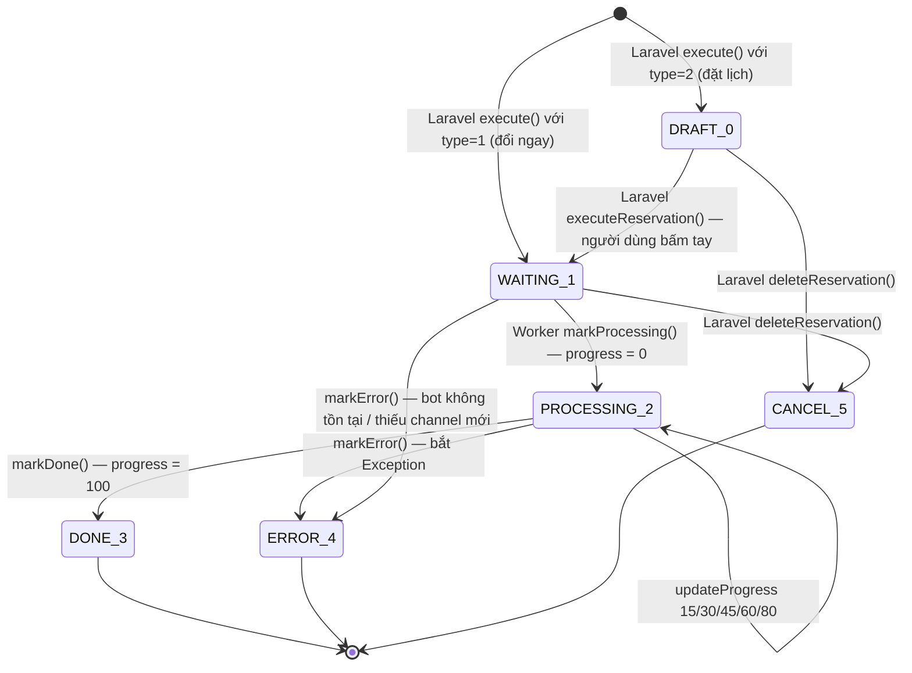
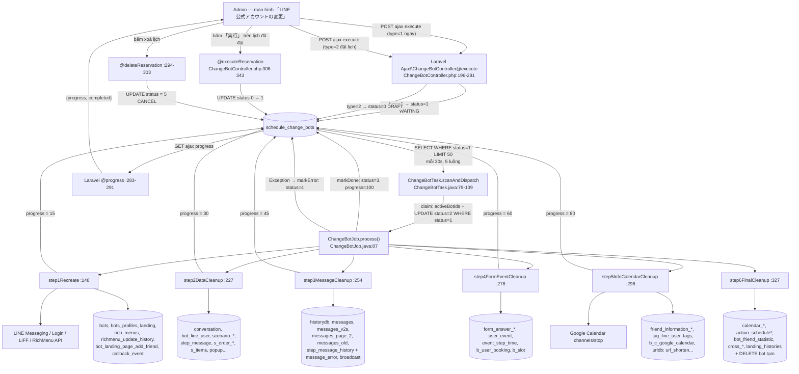

# Job Spec — Change Bot / Đổi LINE Official Account (FA-044)

| Mục | Giá trị |
|-----|---------|
| Tính năng | FA-044 — Change Bot / Đổi LINE Official Account |
| Nguồn worker | `src/job/linect-service` @ nhánh `release-t07-2026`, commit `debe45bc` (2026-08-13) |
| Nguồn web đối chiếu | `src/web/sns-line` @ nhánh `release_step_20260805` |
| Ngày cập nhật | 2026-08-19 |
| Độ tin cậy tổng thể | **Cao** — toàn bộ nội dung đọc trực tiếp từ source Java + native query trong repository |
| Trạng thái | Worker **đã tồn tại và đang chạy trên production** |

---

## 1. Tổng quan

### 1.1 Tại sao tính năng này cần background job

Đổi LINE Official Account (LOA) là thao tác **nặng và dài**: một request HTTP không thể hoàn thành trong timeout của PHP-FPM vì phải:

1. Gọi **6+ nhóm LINE API** tuần tự (issue access token cho 2 channel, set webhook, tạo 2 LIFF app, đọc bot profile, xoá + tạo lại **toàn bộ** rich menu kèm upload ảnh, upsert alias).
2. Sinh lại QR code (QR thêm bạn + QR của **mọi** landing page).
3. Gọi Google Calendar API để ngắt kết nối watch channel của **mọi** lịch đang đồng bộ.
4. **Xoá/reset dữ liệu vận hành của LOA cũ — 74 thao tác trên ≈66 bảng riêng biệt** thuộc 4 database (linedb, historydb, urldb, backenddb) (chi tiết: `db/db-mapping.md` §4.5) — với bot có vài trăm nghìn bạn bè thì đây là hàng triệu row.

Vì vậy web chỉ ghi một bản ghi hàng đợi rồi trả về ngay; toàn bộ công việc do Spring Boot worker thực hiện, còn trình duyệt polling `progress` để hiển thị thanh tiến độ.

### 1.2 Kiểu giao tiếp — Database Polling

```
Laravel (Ajax\ChangeBotController@execute / @executeReservation)
        │  INSERT / UPDATE  →  schedule_change_bots.status = 1 (WAITING)
        ▼
MySQL `schedule_change_bots`  ← hàng đợi duy nhất, không có message broker
        ▲                        │  SELECT ... WHERE status = 1
        │  UPDATE progress/status ▼
Spring Boot ChangeBotTask (while(true) + Thread.sleep) → ChangeBotJob
```

Hệ thống **không** dùng message broker; toàn bộ điều phối nằm trong bảng `schedule_change_bots`.

### 1.3 Feature flag

| Hạng mục | Giá trị | Nguồn |
|----------|---------|-------|
| Flag bật task | `ENABLE_CHANGE_BOT_TASK` | `src/job/linect-service/src/main/java/sns/line/ConfigFile.java:141` (mặc định `false`) |
| Cách đọc flag | `ENABLE_CHANGE_BOT_TASK = Integer.parseInt(prop.getProperty("ENABLE_CHANGE_BOT_TASK","0")) > 0` | `ConfigFile.java:298` |
| Log xác nhận khi bật | `Config enable: ENABLE_CHANGE_BOT_TASK` | `ConfigFile.java:427-428` |
| Điểm khởi động | `if (ConfigFile.ENABLE_CHANGE_BOT_TASK) { new ChangeBotTask().startTask(); }` | `src/job/linect-service/src/main/java/sns/line/AppMain.java:328-330` |
| Số luồng | `MAX_CHANGE_BOT_THREAD` (mặc định `5`) | `ConfigFile.java:83`, `ConfigFile.java:246` |

---

## 2. Queue table `schedule_change_bots`

### 2.1 Cấu trúc bảng và mapping sang entity JPA

Bảng do Laravel tạo: `src/web/sns-line/database/migrations/2026_04_17_125226_create_schedule_change_bots_table.php`, bổ sung `message_error` tại `2026_06_06_131356_add_message_error_to_schedule_change_bots_table.php`.

Entity worker: `src/job/linect-service/src/main/java/sns/line/models/linedb/entities/ScheduleChangeBot.java:8-9` (`@Entity @Table(name = "schedule_change_bots")`).

| Cột DB | Kiểu | Field entity | Dòng | Ý nghĩa |
|--------|------|--------------|------|---------|
| `id` | int AI | `long id` | `ScheduleChangeBot.java:22-25` | Khoá chính |
| `bot_id` | int | `Long botId` | `:27-28` | Bot đang đổi LOA |
| `type` | tinyint | `Integer type` | `:30-31` | `1` = ngay, `2` = đặt lịch |
| `channel_id` | varchar(500) | `String channelId` | `:33-34` | Channel Messaging **cũ** (chỉ lưu vết, worker không dùng) |
| `channel_secret` | varchar(500) | `String channelSecret` | `:36-37` | Secret cũ (lưu vết) |
| `channel_id_line_login` | varchar(500) | `String channelIdLineLogin` | `:39-40` | LINE Login channel cũ (lưu vết) |
| `channel_secret_line_login` | varchar(500) | `String channelSecretLineLogin` | `:42-43` | Secret LINE Login cũ (lưu vết) |
| `channel_id_new` | varchar(500) | `String channelIdNew` | `:45-46` | **Channel Messaging mới — bắt buộc** |
| `channel_secret_new` | varchar(500) | `String channelSecretNew` | `:48-49` | **Secret Messaging mới — bắt buộc** |
| `channel_id_line_login_new` | varchar(500) | `String channelIdLineLoginNew` | `:51-52` | LINE Login channel mới |
| `channel_secret_line_login_new` | varchar(500) | `String channelSecretLineLoginNew` | `:54-55` | Secret LINE Login mới |
| `status` | tinyint | `Integer status` | `:57-58` | Xem 2.2 |
| `progress` | int | `Integer progress` | `:60-61` | 0→100, FE polling đọc cột này |
| `message_error` | text | *(không có trong entity)* | — | Chỉ Laravel đọc; **worker không ghi cột này** (xem mục 10) |
| `created_at` / `updated_at` | datetime | `createdAt` / `updatedAt` | `:63-67` | Worker cập nhật `updated_at = NOW()` ở mọi UPDATE |

### 2.2 Hằng số status

| Giá trị | Hằng số Java | Hằng số PHP | Ai đặt |
|---------|--------------|-------------|--------|
| `0` | `STATUS_DRAFT` (`ScheduleChangeBot.java:13`) | `STATUS['DRAFT']` (`app/ScheduleChangeBot.php:17`) | Laravel `execute()` khi `type = 2` (đặt lịch) |
| `1` | `STATUS_WAITING` (`:14`) | `STATUS['WAITING']` (`:18`) | Laravel `execute()` (type=1) hoặc `executeReservation()` |
| `2` | `STATUS_PROCESSING` (`:15`) | `STATUS['PROCESSING']` (`:19`) | **Worker** — `markProcessing()` |
| `3` | `STATUS_DONE` (`:16`) | `STATUS['DONE']` (`:20`) | **Worker** — `markDone()` |
| `4` | `STATUS_ERROR` (`:17`) | `STATUS['ERROR']` (`:21`) | **Worker** — `markError()` |
| `5` | *(không có trong Java)* | `STATUS['CANCEL']` (`app/ScheduleChangeBot.php:22`) | Chỉ Laravel — `deleteReservation()` |

Type: `TYPE_NOW = 1`, `TYPE_SCHEDULE = 2` (`ScheduleChangeBot.java:19-20`). **Worker không đọc `type`** — mọi bản ghi `status = 1` đều được xử lý như nhau.

### 2.3 State machine thật



Điểm quan trọng: **chỉ `1 → 2` là do worker khởi động**. Worker **không tự chuyển `0 → 1` theo thời gian** — không có bất kỳ tham chiếu nào tới `STATUS_DRAFT` ngoài dòng khai báo `ScheduleChangeBot.java:13` (kiểm chứng bằng grep toàn repo job: chỉ 1 kết quả duy nhất là dòng khai báo). Giá trị `5 (CANCEL)` cũng không tồn tại phía Java nên bản ghi đã huỷ vĩnh viễn không bị worker nhặt.

### 2.4 Điều kiện poll

| Hạng mục | Giá trị thật | Nguồn |
|----------|--------------|-------|
| Query poll | `findTop50ByStatusOrderByIdAsc(1)` — derived query Spring Data: `SELECT * FROM schedule_change_bots WHERE status = 1 ORDER BY id ASC LIMIT 50` | `models/linedb/repository/ScheduleChangeBotRepository.java:14`; gọi tại `task/ChangeBotTask.java:83` |
| Giới hạn batch | 50 (`ChangeBotConstants.SCAN_LIMIT = 50`, `threads/changebot/ChangeBotConstants.java:28`) | |
| Không có điều kiện thời gian | Worker **không** so `created_at`/`updated_at` với `NOW()` — không có khái niệm "đến giờ mới chạy" | `ScheduleChangeBotRepository.java:14` |
| Chu kỳ khi rảnh | `SCAN_INTERVAL_MS = 30_000` ms (30 giây) | `ChangeBotConstants.java:24`, dùng tại `ChangeBotTask.java:67` |
| Chu kỳ khi vừa xử lý xong 1 bản ghi | `PER_RECORD_DELAY_MS = 1_000` ms | `ChangeBotConstants.java:26`, `ChangeBotTask.java:67` |
| Backoff khi vòng lặp ném exception | `ERROR_BACKOFF_MS = 60_000` ms | `ChangeBotConstants.java:25`, `ChangeBotTask.java:72` |
| Thread pool | `MAX_CHANGE_BOT_THREAD` luồng (mặc định 5), chạy trên `AppMain.getInstance().getExecutorService()` | `ChangeBotTask.java:36-55` |
| Mỗi vòng xử lý tối đa | **1 bản ghi** rồi `return true` để quét lại | `ChangeBotTask.java:99` |

---

## 3. Task Manager — `ChangeBotTask`

File: `src/job/linect-service/src/main/java/sns/line/task/ChangeBotTask.java` (extends `StoppableTask`).

### 3.1 Khởi động

```
AppMain.java:328  if (ConfigFile.ENABLE_CHANGE_BOT_TASK) {
AppMain.java:329      new ChangeBotTask().startTask();
```

`startTask()` (`ChangeBotTask.java:34-55`): đặt trạng thái running, đọc `MAX_CHANGE_BOT_THREAD` (ép về `1` nếu ≤ 0 — `:37-39`), rồi submit N `Runnable` vào executor service dùng chung; mỗi luồng mang `threadId` từ 1..N để prefix log (`ChangeBotJob.java:82` — `tag = threadId + "#"`).

### 3.2 Vòng lặp `runWorker` (`ChangeBotTask.java:57-77`)

```java
while (true) {
    if (AppMain.getInstance().isPrepareStop() || isNeedStop()) return;   // :59-62
    boolean processed = scanAndDispatch(threadId);                        // :64
    sleep(processed ? PER_RECORD_DELAY_MS : SCAN_INTERVAL_MS);            // :67
}   // catch Exception → log + Chatwork + sleep(ERROR_BACKOFF_MS)         // :68-73
```

Vòng lặp thoát êm khi ứng dụng chuẩn bị reboot (`isPrepareStop`) hoặc task bị yêu cầu dừng (`isNeedStop`).

### 3.3 Cơ chế claim — chống double-pick

Có **hai tầng** chống xử lý trùng:

1. **Tầng in-memory (chống trùng theo bot, trong cùng 1 instance)** — `Set<Long> activeBotIds = ConcurrentHashMap.newKeySet()` (`ChangeBotTask.java:32`). Trước khi xử lý: `if (!activeBotIds.add(botId)) continue;` (`:94`) — nếu bot đó đang được luồng khác chạy thì **bỏ qua, giữ nguyên `status = 1`**, sẽ chạy ở vòng quét sau. Xoá khỏi set trong `finally` (`:105`).
2. **Tầng DB (chống trùng giữa nhiều instance)** — câu UPDATE có điều kiện trong `ChangeBotJob.process()`:
   ```sql
   UPDATE `schedule_change_bots` SET `status` = 2, `progress` = 0, `updated_at` = NOW()
   WHERE `id` = :id AND `status` = 1
   ```
   `ScheduleChangeBotRepository.java:18-19`. Hàm trả về số dòng bị ảnh hưởng; nếu `0` nghĩa là instance khác đã claim trước → `ChangeBotJob.java:92-96` log `"process skip — record already picked up by another instance"` và `return` ngay, không xử lý gì.

### 3.4 Delegation

`scanAndDispatch` (`ChangeBotTask.java:79-109`) tạo `new ChangeBotJob(threadId, schedule, this).process()` (`:98`). Mọi exception lọt ra ngoài `process()` được bắt tại `:99-104`, log lỗi và bắn Chatwork, **không** retry trong cùng vòng.

---

## 4. Processing Chain — `ChangeBotJob`

File: `src/job/linect-service/src/main/java/sns/line/threads/changebot/ChangeBotJob.java` (833 dòng). Router: `process()` — `:87-143`.

### 4.1 Bảng tiến độ tổng quan (đây là giá trị FE thấy)

| Thứ tự | Bước | Method | Dòng | `progress` sau bước | Hằng số |
|--------|------|--------|------|---------------------|---------|
| 0 | Claim bản ghi | `scheduleRepo.markProcessing()` | `:92` | **0** (kèm `status = 2`) | native query `ScheduleChangeBotRepository.java:18` |
| 1 | Dựng lại kết nối LINE cho LOA mới | `step1Recreate()` | `:114` → `:148-222` | **15** | `PROGRESS_STEP_1` (`ChangeBotConstants.java:12`) |
| 2 | Dọn dữ liệu bạn bè / hội thoại / kịch bản / đơn hàng | `step2DataCleanup()` | `:117` → `:227-249` | **30** | `PROGRESS_STEP_2` (`:13`) |
| 3 | Dọn tin nhắn (historydb) + thống kê tin nhắn | `step3MessageCleanup()` | `:120` → `:254-273` | **45** | `PROGRESS_STEP_3` (`:14`) |
| 4 | Dọn form / sự kiện / đặt chỗ | `step4FormEventCleanup()` | `:123` → `:278-291` | **60** | `PROGRESS_STEP_4` (`:15`) |
| 5 | Dọn thông tin bạn bè, tag, Google Calendar, URL rút gọn | `step5InfoCalendarCleanup()` | `:126` → `:296-322` | **80** | `PROGRESS_STEP_5` (`:16`) |
| 6 | Dọn lịch/khoá học/thống kê + xoá bot tạm | `step6FinalCleanup()` | `:129` → `:327-348` | *(không set riêng)* | — |
| 7 | Kết thúc | `scheduleRepo.markDone()` | `:131` | **100** (kèm `status = 3`) | native query `ScheduleChangeBotRepository.java:28` |

> Lưu ý: hằng số `PROGRESS_STEP_6 = 100` (`ChangeBotConstants.java:17`) **không được dùng** — `markDone()` hard-code `progress = 100` trong SQL. Vì thế FE nhảy thẳng từ 80 → 100 khi step 6 (bước nặng nhất về số bảng) hoàn tất; đây là điểm "đứng yên ở 80%" mà QA có thể quan sát thấy.

### 4.2 Tiền kiểm tra trong `process()` (`ChangeBotJob.java:87-113`)

| # | Kiểm tra | Dòng | Không đạt thì |
|---|----------|------|---------------|
| 1 | `markProcessing` trả 0 dòng | `:92-96` | `return` im lặng (bản ghi thuộc instance khác) |
| 2 | `botRepo.findFirstByIdAndIsDelete(botId, 0)` — bot còn sống | `:99-104` | log warn + `markError()` → `status = 4` |
| 3 | `channel_id_new` / `channel_secret_new` không rỗng | `:105-109` | log warn + `markError()` → `status = 4` |
| 4 | Tra bot tạm: `findTempBotIdForChangeBot(botId)` = `SELECT id FROM bots WHERE is_deleted = 2 AND id_bot_change = :botId LIMIT 1` | `:111-112`; query tại `BotRepository.java:188-190` | `tempBotId = null` → bỏ qua toàn bộ thao tác migrate ở step 2/3/6 |

**Bot tạm là gì**: trong luồng thiết lập trên web (`Admin\BotController`, xem `app/Http/Controllers/Admin/BotController.php:5550`, `:6333`, `:6380`), LOA mới được gắn tạm vào một record `bots` với `is_deleted = 2, id_bot_change = <bot thật>` để hứng webhook trước khi chuyển đổi. Dữ liệu bạn bè/tin nhắn phát sinh trong giai đoạn đó nằm dưới `tempBotId` và được worker **dồn về bot thật** ở step 2 và 3, rồi xoá record tạm ở step 6.

### 4.3 Step 1 — `step1Recreate()` (`:148-222`) → progress 15

Đây là bước duy nhất gọi API ngoài, và là bước duy nhất `throws Exception` (mọi lỗi ở đây làm cả bản ghi chuyển `ERROR`).

| # | Thao tác | Dòng | API ngoài | DB đọc/ghi | Lỗi thì sao |
|---|----------|------|-----------|-----------|-------------|
| 1.1 | Issue channel access token cho Messaging channel mới — `generateAccessToken(channel_id_new, channel_secret_new)` | `:152-155`, helper `:353-368` | `POST /v2/oauth/accessToken` (LINE Messaging API, `grant_type=client_credentials`) | — | `throw new Exception("Cannot generate access token for new messaging channel")` |
| 1.2 | Issue access token cho LINE Login channel mới | `:157-161` | LINE Login token endpoint (cùng helper) | — | `throw ... "for new LINE Login channel"` |
| 1.3 | Set webhook `{DOMAIN_ENDPOINT_WEBHOOK}/line/callback/add/{botId}` | `:163-166`, helper `:370-383` | `PUT /v2/bot/channel/webhook/endpoint` | — | `throw ... "Cannot set webhook endpoint to ..."` |
| 1.4 | Sinh `liff_callback_unique` 10 ký tự, thử tối đa 20 lần cho tới khi không trùng | `:168`, helper `:398-406` | — | `SELECT COUNT(*) FROM bots WHERE liff_callback_unique = ?` (`BotRepository.java:175-176`) | Hết 20 lần → nối thêm `_ + timestamp` (`:405`) |
| 1.5 | Tạo LIFF app "流入アクション用" — view `full`, endpoint `{HOST_SNSLINE}/liff-callback/{unique}` | `:170-175` | `POST https://api.line.me/liff/v1/apps` (`LiffApiClient.java:35-68`) | — | `throw ... "Cannot create LIFF login app"` |
| 1.6 | Tạo LIFF app "各種フォーム用" — thêm `botPrompt = aggressive` | `:177-182` | như trên | — | **Rollback**: xoá LIFF vừa tạo ở 1.5 (`liffClient.deleteLiffApp`, `:180`) rồi `throw` |
| 1.7 | Đọc profile LOA mới (`basicId`, `displayName`, `pictureUrl`); dựng `url_add_friend = https://line.me/R/ti/p/{basicId}` | `:184-186`, helper `:385-396` | `GET /v2/bot/info` | — | Không throw — nếu response null thì các trường để rỗng (`:390-394`) |
| 1.8 | **Hoán đổi channel trong `bots`** — `swapChannelForChangeBot()` | `:188-206` | — | `UPDATE bots ...` (`BotRepository.java:122-152`) | Lỗi SQL → exception, bản ghi → `ERROR` |
| 1.9 | Gia hạn gói free 1 tháng nếu đã hết hạn (chỉ bot `plan_type != 1`) | `:208` | — | `UPDATE bots SET expired_date_free_plan = CASE WHEN ... THEN DATE_ADD(NOW(), INTERVAL 1 MONTH) ...` (`BotRepository.java:180-186`) | — |
| 1.10 | Xoá callback event tồn đọng của bot | `:209` | — | `DELETE FROM callback_event WHERE bot_id = ?` (backenddb — `models/backenddb/repository/CallbackEventRepository.java:28`) | — |
| 1.11 | Cập nhật avatar + tên hiển thị mặc định của bot | `:211` | — | `UPDATE bots_profiles SET avt_path, nick_name WHERE bot_id = ? AND is_default = 1` (`ChangeBotDataCleanupRepository.java:22-23`) | — |
| 1.12 | Sinh lại QR "thêm bạn" (200px) ra `{PHP_PUBLIC_FOLDER}{FOLDER_MEDIA}/qr_image/qr_add_friend_bot_{botId}.png` | `:213`, helper `:433-441` | — | ghi file, không ghi DB | Chỉ log warn (`:439`), không throw |
| 1.13 | Sinh lại QR cho **mọi landing page** + cập nhật link, đồng thời **reset toàn bộ counter landing** | `:215`, helper `:443-470` | — | đọc `landing` (`landingRepo.findAllByBotId`); `UPDATE landing SET link_qr_code, total_user_click = 0, total_user_friend = 0, count_action_web = 0, count_action = 0, path_landing` (`ChangeBotDataCleanupRepository.java:27-30`) | QR lỗi → `continue`, bỏ qua landing đó (`:464-467`) |
| 1.14 | **Dựng lại toàn bộ rich menu trên LOA mới** | `:217`, helper `:475-522` | `DELETE /v2/bot/richmenu/{id}`, `POST /v2/bot/richmenu`, `POST https://api-data.line.me/v2/bot/richmenu/{id}/content`, alias update/create | đọc `rich_menus`, `rich_menu_items`, `richmenu_switch_item`; ghi `UPDATE rich_menus SET rich_menu_id, status_link = 0, url_image` (`ChangeBotDataCleanupRepository.java:34-36`) + `INSERT INTO richmenu_update_history` (`:40-44`) | try-catch **theo từng rich menu** (`:518-520`) — 1 menu lỗi không làm hỏng cả job |
| 1.15 | Cập nhật script chuyển đổi trên landing page ngoài (ASP) | `:219`, helper `:738-755` | — | đọc `bot_setting_aff`, `form_answer`; ghi `UPDATE bot_landing_page_add_friend SET conversion_code WHERE bot_setting_aff_id = ?` (`ChangeBotDataCleanupRepository.java:48-50`) | — |

Chi tiết nội dung `UPDATE bots` ở 1.8 (`BotRepository.java:123-152`):

- Gán mới: `channel_id`, `channel_secret`, `channel_access_token`, `channel_id_line_login`, `channel_secret_line_login`, `line_id` (= basicId), `view_name` (= displayName), `url_add_friend`, `bot_image` (= pictureUrl), `expired_date_channel_access_token` (= `NOW() + 28 ngày`, `ChangeBotConstants.CHANNEL_ACCESS_TOKEN_VALID_DAYS = 28`), `liff_app_id`, `liff_app_id_booking`, `liff_callback_unique`, `url_liff_app_callback`, `webhook_url`.
- Đặt cứng: `liff_app_id_old = NULL`, `is_verify = 1`, `is_get_old_friend = 1`, `message_sent_count = 0`, `google_sheet_access_token = NULL`, `google_sheet_id = NULL`, `datetime_connect_google_sheet = NULL`, `renew_channel_access_error = 0`, `status_bill_fail = 0`, `first_bill_fail_date = NULL`, `expired_retry_bill = NULL`, `count_user_unconfirm = 0`, `updated_at = NOW()`.

Xây `areas` cho rich menu (`buildAreas` `:524-559`, `buildAction` `:561-630`, `buildUrlAction` `:642-688`): mỗi item được dựng lại action theo `action_type` (`SHARE_TEXT`, `CAMERA`, `CAMERA_ROLL`, `SHARE_LOCATION`, `OPEN_PROFILE`, `OPEN_FRIEND`, `SETTING_CUSTOM`, `RICH`, `TEXT`, `EMAIL`, `PHONE`, `ACCOUNT_LINE`, `URL`, `DELETE_RICH`). Nếu item có `action_id > 0`, có richmenu-switch, hoặc `show_rich_menu_action = 0` thì buộc chuyển sang URL LIFF `https://liff.line.me/{liff}?action_richmenu={hashid(itemId)}` (`:580`, `:645-648`). Alias được đặt là `{PREFIX_ALIAS_ID_RICHMENU}-{richId}` (`:513`, mặc định prefix `richmenu` — `ConfigFile.java:143`). Ảnh rich menu lấy từ đĩa `PHP_PUBLIC_FOLDER`, nếu không có thì tải từ `HOST_SNSLINE_MEDIA` về file tạm (`resolveImageFile` `:696-733`).

### 4.4 Step 2 — `step2DataCleanup()` (`:227-249`) → progress 30

Thứ tự gọi (mỗi dòng là 1 native query, xem bảng mục 5): xoá `conversation` → xoá `bot_line_user` → **nếu có bot tạm**: dồn `conversation` và `bot_line_user` từ `tempBotId` về `botId` → xoá `scenario_lineuser`, `scenario_step_time` → reset `step_message.send_count`, reset counter `scenario` → xoá `mobile_notify`, `conversion_result`, `s_cycle_order_history`, `bot_line_user_item`, `s_order_history`, `s_order_history_notify` → reset counter `s_items` → xoá `detail_action_popup`.

Không có try-catch riêng: lỗi bất kỳ → lan lên `process()` → `ERROR`.

### 4.5 Step 3 — `step3MessageCleanup()` (`:254-273`) → progress 45

- historydb: xoá `messages`, `messages_v2s`, `messages_page_2`, `messages_old`, `step_message_history`; nếu có bot tạm thì dồn `messages_v2s` từ `tempBotId` về `botId` (`:263-265`).
- linedb: xoá `message_error`, `unconfirm_message`, `time_action_landing`; reset `status_chat.count = 0`, `broadcast.send_count = 0`.

### 4.6 Step 4 — `step4FormEventCleanup()` (`:278-291`) → progress 60

Xoá `form_answer_result`, reset `form_answer.count_user_reply`, xoá `form_answer_user_accept`, `user_open_formanswer`, `user_event`, `event_step_time` (bản ghi có `user_booking_id`), `b_user_booking`; reset `b_slot.use_people = 0` và `b_plan_slot.remain_limit = 0`.

### 4.7 Step 5 — `step5InfoCalendarCleanup()` (`:296-322`) → progress 80

- Thông tin bạn bè & tag: xoá `friend_information_value`, reset `friend_information_setting.total_user_has_value`, xoá `tag_line_user`, reset `tags.count_user_tag`, xoá `action_limit_tags`, reset `csv_management`, chèn `add_friend_setting` nếu thiếu.
- Google Calendar: `disconnectGoogleCalendars()` (`:308`, helper `:796-812`) — với mỗi bản ghi `b_c_google_calendar` của bot, lấy `access_token` (parse JSON, `extractAccessTokenFromJson` `:818-826`) rồi gọi `POST https://www.googleapis.com/calendar/v3/channels/stop`; sau đó **reset sạch** cột kết nối trong `b_c_google_calendar` và `b_c_setting_user_booking`, xoá `b_c_user_booking`, xoá `mobile_notify` loại nhắc lịch.
- `bots.count_app_notify = 0` (`:314`, `BotRepository.java:170-173`).
- urldb: xoá `url_shorten`, `detail_url_click`, `url_shorten_detail` theo `url.bot_id`.

### 4.8 Step 6 — `step6FinalCleanup()` (`:327-348`) → không set progress riêng, kết thúc bằng `markDone` = 100

Xoá `calendar_course_bookings`, reset counter `calendar_course_receptions`, xoá `action_schedule_history`, `action_schedules_line_users`, `calendar_salon_line_booking`, `bot_friend_statistic`, `cross_analysis_items`, `cross_item_line_user`, `detail_click_richmenu`, `detail_landing_click`, `collect_open_landings`, `landing_histories`, `event_step_time` (remind). Cuối cùng, nếu có bot tạm: `DELETE FROM bots WHERE id = :tempBotId AND is_deleted = 2` (`:343-346`, `BotRepository.java:192-196`).

---

## 5. Dọn dữ liệu khi đổi LOA — bảng đầy đủ

> **Kết luận nghiệp vụ trước tiên**: khi đổi LOA, **toàn bộ dữ liệu người dùng cuối gắn với LOA cũ bị XOÁ VĨNH VIỄN** — danh sách bạn bè, lịch sử hội thoại, toàn bộ tin nhắn, tag đã gắn, thông tin bạn bè (friend_information), tiến trình kịch bản, đơn hàng, đặt chỗ/đặt lịch, câu trả lời form, URL rút gọn và toàn bộ số liệu thống kê. **Cấu hình do Admin tạo thì được GIỮ** — kịch bản (`scenario`, `step_message`), form (`form_answer`), sự kiện (`events`, `b_event_detail`), rich menu (`rich_menus`), landing page (`landing`), tag (`tags`), item bán hàng (`s_items`), lịch (`calendar_management`, `calendar_course`) đều còn nguyên, chỉ bị **reset về 0 các bộ đếm** và (với rich menu/landing/LIFF) được **dựng lại trên LOA mới**.

### 5.1 `ChangeBotDataCleanupRepository` (linedb) — `models/linedb/repository/ChangeBotDataCleanupRepository.java`

| Bảng | Thao tác | Điều kiện | Dòng |
|------|----------|-----------|------|
| `bots_profiles` | UPDATE `avt_path`, `nick_name` | `bot_id = ? AND is_default = 1` | `:22-23` |
| `landing` | UPDATE `link_qr_code`, `path_landing`, và **reset** `total_user_click`, `total_user_friend`, `count_action_web`, `count_action` = 0 | `id = ?` (từng landing) | `:27-30` |
| `rich_menus` | UPDATE `rich_menu_id`, `status_link = 0`, `url_image` | `id = ?` (từng rich menu) | `:34-36` |
| `richmenu_update_history` | **INSERT** (`is_updated = 1`, `status = 0`) | mỗi rich menu tạo lại | `:40-44` |
| `bot_landing_page_add_friend` | UPDATE `conversion_code` | `bot_setting_aff_id = ?` | `:48-50` |
| `b_c_google_calendar` | UPDATE về NULL: `google_calendar_id`, `channel_id`, `resource_id`, `access_token`, `sync_token_google_calendar`, `datetime_connect_google_calendar`, `google_calendar_list` | `bot_id = ?` | `:54-58` |
| `b_c_setting_user_booking` | UPDATE `datetime_connect_google_calendar = NULL` | `bot_id = ?` | `:62-64` |
| `conversation` | **DELETE** | `bot_id = ?` | `:70-71` |
| `bot_line_user` | **DELETE** | `bot_id = ?` | `:75-76` |
| `conversation` | UPDATE `bot_id = botId` (dồn từ bot tạm) | `bot_id = tempBotId` | `:80-81` |
| `bot_line_user` | UPDATE `bot_id = botId` (dồn từ bot tạm) | `bot_id = tempBotId` | `:85-86` |
| `scenario_lineuser` | **DELETE** | `bot_id = ?` | `:90-91` |
| `scenario_step_time` | **DELETE** | `bot_id = ?` | `:95-96` |
| `scenario` | UPDATE `count_follow = 0`, `count_stop = 0`, `count_unfinish = 0` | `bot_id = ?` | `:100-101` |
| `step_message` | UPDATE `send_count = 0` | JOIN `scenario` ON `scenario.id = step_message.scenario_id`, `scenario.bot_id = ?` | `:105-108` |
| `mobile_notify` | **DELETE** | `bot_id = ?` | `:112-113` |
| `conversion_result` | **DELETE** | JOIN `conversion` ON `conversion.id = conversion_result.conversion_id`, `conversion.bot_id = ?` | `:117-119` |
| `s_cycle_order_history` | **DELETE** | `bot_id = ?` | `:123-124` |
| `bot_line_user_item` | **DELETE** | `bot_id = ?` | `:128-129` |
| `s_order_history` | **DELETE** | `bot_id = ?` | `:133-134` |
| `s_order_history_notify` | **DELETE** | `bot_id = ?` | `:138-139` |
| `s_items` | UPDATE về 0: `number_register`, `number_trial`, `number_cancel`, `number_refund`, `number_register_test`, `number_trial_test`, `number_cancel_test`, `number_refund_test`, `current_month_sales`, `sum_sales`, `current_month_sales_test`, `sum_sales_test` | `bot_id = ?` | `:143-148` |
| `detail_action_popup` | **DELETE** | JOIN `popup` ON `popup.id = detail_action_popup.popup_id`, `popup.bot_id = ?` | `:152-153` |
| `message_error` | **DELETE** | `bot_id = ?` | `:159-160` |
| `unconfirm_message` | **DELETE** | `bot_id = ?` | `:164-165` |
| `time_action_landing` | **DELETE** | `bot_id = ?` | `:169-170` |
| `status_chat` | UPDATE `count = 0` | `bot_id = ?` | `:174-175` |
| `broadcast` | UPDATE `send_count = 0` | `bot_id = ?` | `:179-180` |
| `form_answer_result` | **DELETE** | JOIN `form_answer` ON `form_answer.id = form_answer_result.form_id`, `form_answer.bot_id = ?` | `:186-187` |
| `form_answer` | UPDATE `count_user_reply = 0` | `bot_id = ?` | `:191-192` |
| `form_answer_user_accept` | **DELETE** | JOIN `form_answer`, `form_answer.bot_id = ?` | `:196-197` |
| `user_open_formanswer` | **DELETE** | `bot_id = ?` | `:201-202` |
| `user_event` | **DELETE** | `bot_id = ?` | `:206-207` |
| `event_step_time` | **DELETE** | `bot_id = ? AND user_booking_id IS NOT NULL` | `:211-212` |
| `b_user_booking` | **DELETE** | JOIN `b_event_detail` ON `b_event_detail.id = b_user_booking.event_detail_id`, `b_event_detail.bot_id = ?` | `:216-217` |
| `b_slot` | UPDATE `use_people = 0` | `bot_id = ?` | `:221-222` |
| `b_plan_slot` | UPDATE `remain_limit = 0` | JOIN `b_slot`, `b_slot.bot_id = ?` | `:226-227` |
| `friend_information_value` | **DELETE** | `bot_id = ?` | `:233-234` |
| `friend_information_setting` | UPDATE `total_user_has_value = 0` | `bot_id = ?` | `:238-239` |
| `tag_line_user` | **DELETE** | JOIN `tags` ON `tags.id = tag_line_user.tag_id`, `tags.bot_id = ?` | `:243-244` |
| `tags` | UPDATE `count_user_tag = 0` | `bot_id = ?` | `:248-249` |
| `b_c_user_booking` | **DELETE** | `bot_id = ?` | `:253-254` |
| `mobile_notify` | **DELETE** (nhắc lịch chưa xác nhận) | `bot_id = ? AND type = 1 AND is_confirm = 0 AND status = 1` | `:258-259` |
| `action_limit_tags` | **DELETE** | `bot_id = ?` | `:263-264` |
| `csv_management` | UPDATE `total_line_user = 0`, `line_user_ids = NULL`, `filter_update_status = CsvManagement.STATUS_NEW` | `bot_id = ?` | `:268-271` (tham số truyền tại `ChangeBotJob.java:305`) |
| `add_friend_setting` | **INSERT** nếu chưa có | `NOT EXISTS (SELECT 1 ... WHERE bot_id = ?)` | `:275-279` |
| `calendar_course_bookings` | **DELETE** | JOIN `calendar_management` ON `calendar_management.id = calendar_course_bookings.calendar_id`, `bot_id = ?` | `:285-286` |
| `calendar_course_receptions` | UPDATE về 0: `total_booking`, `total_approve`, `total_request`, `total_request_cancel`, `total_request_booking_wait_cancel`, `total_cancel` | JOIN `calendar_course` → `calendar_management`, `bot_id = ?` | `:290-298` |
| `action_schedule_history` | **DELETE** | JOIN `action_schedules`, `action_schedules.bot_id = ?` | `:302-303` |
| `action_schedules_line_users` | **DELETE** | JOIN `action_schedules`, `action_schedules.bot_id = ?` | `:307-308` |
| `calendar_salon_line_booking` | **DELETE** | `bot_id = ?` | `:312-313` |
| `bot_friend_statistic` | **DELETE** | `bot_id = ?` | `:317-318` |
| `cross_analysis_items` | **DELETE** | `bot_id = ?` | `:322-323` |
| `cross_item_line_user` | **DELETE** | `bot_id = ?` | `:327-328` |
| `detail_click_richmenu` | **DELETE** | `bot_id = ?` | `:332-333` |
| `detail_landing_click` | **DELETE** | `bot_id = ?` | `:337-338` |
| `collect_open_landings` | **DELETE** | `bot_id = ?` | `:342-343` |
| `landing_histories` | **DELETE** | `bot_id = ?` | `:347-348` |
| `event_step_time` | **DELETE** (remind chưa gửi) | JOIN `events`, `event_step_time.bot_id = ? AND events.type IN (0,4,5,6) AND event_step_time.status = 0` | `:352-354` |

### 5.2 `ChangeBotHistoryCleanupRepository` (historydb) — `models/historydb/repository/ChangeBotHistoryCleanupRepository.java`

| Bảng | Thao tác | Điều kiện | Dòng |
|------|----------|-----------|------|
| `messages` | **DELETE** | `bot_id = ?` | `:20-21` |
| `messages_v2s` | **DELETE** | `bot_id = ?` | `:25-26` |
| `messages_page_2` | **DELETE** | `bot_id = ?` | `:30-31` |
| `messages_old` | **DELETE** | `bot_id = ?` | `:35-36` |
| `step_message_history` | **DELETE** | `bot_id = ?` | `:40-41` |
| `messages_v2s` | UPDATE `bot_id = botId` (dồn từ bot tạm) | `bot_id = tempBotId` | `:45-46` |

### 5.3 `ChangeBotUrlCleanupRepository` (urldb) — `models/urldb/repository/ChangeBotUrlCleanupRepository.java`

| Bảng | Thao tác | Điều kiện | Dòng |
|------|----------|-----------|------|
| `url_shorten` | **DELETE** | JOIN `url` ON `url.id = url_shorten.url_id`, `url.bot_id = ?` | `:20-22` |
| `detail_url_click` | **DELETE** | JOIN `url`, `url.bot_id = ?` | `:26-28` |
| `url_shorten_detail` | **DELETE** | JOIN `url`, `url.bot_id = ?` | `:32-34` |

**Đáng chú ý**: bảng `url` (bản ghi URL gốc) **KHÔNG bị xoá** — chỉ dữ liệu rút gọn/thống kê click bị xoá. Đây là khác biệt so với luồng PHP cũ (xem 5.5).

### 5.4 Bảng khác bị worker chạm (ngoài 3 repository cleanup)

| Bảng | Thao tác | Repository / dòng |
|------|----------|-------------------|
| `bots` | UPDATE hoán đổi channel + reset cờ | `BotRepository.java:122-152` |
| `bots` | UPDATE `expired_date_free_plan` | `BotRepository.java:180-186` |
| `bots` | UPDATE `count_app_notify = 0` | `BotRepository.java:170-173` |
| `bots` | **DELETE** bot tạm | `BotRepository.java:192-196` — `id = tempBotId AND is_deleted = 2` |
| `callback_event` (backenddb) | **DELETE** | `models/backenddb/repository/CallbackEventRepository.java:26-29` |
| `schedule_change_bots` | UPDATE status/progress | `ScheduleChangeBotRepository.java:16-34` |

### 5.5 So sánh với luồng cũ phía Laravel (`Admin\ChangeBotController@store`)

File: `src/web/sns-line/app/Http/Controllers/Admin/ChangeBotController.php:48-174`.

| Nhóm | PHP cũ | Java mới | Nhận xét |
|------|--------|----------|----------|
| `bots` | UPDATE `admin_id`, `view_name`, `line_id`, `url_add_friend`, `channel_secret`, `channel_access_token`, `is_verify = 0`, ảnh (`:95-127`) | UPDATE 28 cột (15 tham số + 13 giá trị cố định), `is_verify = 1`, thêm LIFF/webhook/hạn token (`BotRepository.java:123-152`) | **Khác**: PHP chỉ đổi token thủ công người dùng dán vào và đặt `is_verify = 0`; Java tự issue token qua API và đặt `is_verify = 1` |
| `step_message.send_count` | reset về 0 (`:131-137`, lặp từng scenario trong PHP) | reset về 0 bằng 1 câu JOIN (`ChangeBotDataCleanupRepository.java:105-108`) | **Giống** về nghiệp vụ, Java hiệu quả hơn |
| `broadcast` | **DELETE** toàn bộ (`:138`) | chỉ **UPDATE `send_count` = 0** (`:179-180`) | **Khác quan trọng** — Java **giữ lại** cấu hình tin phát sóng, chỉ xoá số liệu đã gửi |
| `url` | **DELETE** (`:146`) | **giữ nguyên** | **Khác** — Java giữ URL gốc, chỉ xoá `url_shorten` / `url_shorten_detail` / `detail_url_click` |
| `detail_url_click`, `url_shorten_detail`, `url_shorten` | DELETE theo vòng lặp từng `url_id` (`:139-145`) | DELETE 1 câu JOIN (`ChangeBotUrlCleanupRepository.java:20-34`) | **Giống** |
| `scenario_lineuser` | DELETE (`:147`) | DELETE (`:90-91`) | **Giống** |
| `form_answer_result` | DELETE theo vòng lặp từng form (`:148-152`) | DELETE 1 câu JOIN (`:186-187`) | **Giống** |
| `messages` | DELETE theo `conversation_id`, lặp từng conversation (`:153-157`) | DELETE theo `bot_id`, và thêm `messages_v2s`, `messages_page_2`, `messages_old`, `step_message_history` (historydb) | **Java rộng hơn** — PHP bỏ sót 4 bảng lịch sử |
| `conversation` | `Conversation::deleteConversationByBotId` (`:158`) | DELETE `bot_id = ?` (`:70-71`) | **Giống** |
| `tag_line_user` | DELETE theo `line_user_id` từng bạn bè (`:159-163`) | DELETE 1 câu JOIN qua `tags.bot_id` (`:243-244`) | **Giống** |
| `bot_line_user` | `BotLineUser::deleteAllFriend` (`:164`) | DELETE `bot_id = ?` (`:75-76`) | **Giống** |
| Tổng số nhóm bảng | **11 nhóm** + reset `step_messages.send_count` | **74 thao tác trên ≈66 bảng riêng biệt** thuộc 4 database (chi tiết: `db/db-mapping.md` §4.5) | Java bao phủ rộng hơn nhiều: đơn hàng, đặt chỗ, lịch, popup, thống kê, cross-analysis, thông tin bạn bè, tag counter, CSV, Google Calendar, LIFF, rich menu, landing |
| Rich menu / LIFF / QR / Google Calendar | **PHP `store()` không xử lý** | Java xử lý đầy đủ ở step 1 và 5 | Java bổ sung hoàn toàn |

Kết luận đối chiếu: luồng Java là **siêu tập** của luồng PHP cũ về mặt dọn dữ liệu, trừ **hai điểm PHP xoá mạnh tay hơn**: PHP xoá hẳn `broadcast` và `url`, còn Java chỉ reset counter (`broadcast.send_count`) và giữ `url`. Đây là thay đổi nghiệp vụ có chủ đích — cấu hình do Admin tạo phải sống sót qua lần đổi LOA.

---

## 6. Services & Helpers

### 6.1 `LiffApiClient` — `threads/changebot/LiffApiClient.java`

| Method | Dòng | Input | Output | Logic |
|--------|------|-------|--------|-------|
| `createLiffApp(accessToken, viewType, viewUrl, botPrompt, description)` | `:35-68` | Access token của **LINE Login channel** (không phải Messaging), `viewType = "full"`, endpoint LIFF, `botPrompt` (`aggressive` cho LIFF form), mô tả | `liffId` hoặc `null` | `POST https://api.line.me/liff/v1/apps`; timeout connect 15s / read 30s (`:24-28`); không throw, trả `null` khi lỗi |
| `deleteLiffApp(accessToken, liffId)` | `:74-91` | token + liffId | `boolean` | `DELETE /liff/v1/apps/{liffId}`; trả `true` khi `liffId` rỗng; dùng để rollback ở `ChangeBotJob.java:180` |

Bảng liên quan: kết quả ghi vào `bots.liff_app_id` và `bots.liff_app_id_booking` qua `swapChannelForChangeBot`.

### 6.2 `RichMenuApiClient` — `threads/changebot/RichMenuApiClient.java`

| Method | Dòng | Input | Output | Logic |
|--------|------|-------|--------|-------|
| `createRichMenu(token, width, height, selected, name, chatBarText, areas)` | `:38-72` | kích thước + mảng `areas` dựng từ `rich_menu_items` | `richMenuId` hoặc `null` | `POST /v2/bot/richmenu`; `chatBarText` rỗng → mặc định 「チェック」(`:48`) |
| `uploadImage(token, richMenuId, File)` | `:74-92` | file ảnh JPEG | `boolean` | `POST https://api-data.line.me/v2/bot/richmenu/{id}/content`; false nếu file không tồn tại |
| `deleteRichMenu(token, richMenuId)` | `:94-111` | id cũ | `boolean` | `DELETE /v2/bot/richmenu/{id}`; true nếu id rỗng |
| `upsertAlias(token, aliasId, richMenuId)` | `:117-152` | alias `{prefix}-{richId}` | `boolean` | Thử `POST /v2/bot/richmenu/alias/{aliasId}` (update); thất bại thì `POST /v2/bot/richmenu/alias` (create) |

Timeout: connect 15s, read/write 60s (`:31-35`). Bảng liên quan: `rich_menus`, `rich_menu_items`, `richmenu_switch_item`, `richmenu_update_history`.

### 6.3 `GoogleCalendarStopWatchClient` — `threads/changebot/GoogleCalendarStopWatchClient.java`

| Method | Dòng | Input | Output | Logic |
|--------|------|-------|--------|-------|
| `stop(accessToken, channelId, resourceId)` | `:32-55` | token Google (trích từ JSON trong `b_c_google_calendar.access_token`), `channel_id`, `resource_id` | `boolean` | `POST https://www.googleapis.com/calendar/v3/channels/stop`; Google trả `204 No Content` khi thành công (`:49`); thiếu tham số → log warn + `false` (`:33-36`) |

Tương đương PHP `gCalendarController::stopWatchEvent`. Gọi từ `ChangeBotJob.disconnectGoogleCalendars()` (`:796-812`).

### 6.4 `ShareDbRepository` — `models/ShareDbRepository.java`

Container Spring gom toàn bộ repository, worker truy cập qua `AppMain.getShareRepository()` (`ChangeBotJob.java:61`). Bốn getter liên quan tính năng này:

| Getter | Dòng |
|--------|------|
| `getScheduleChangeBotRepository()` | `:376-380` |
| `getChangeBotDataCleanupRepository()` | `:383-387` |
| `getChangeBotHistoryCleanupRepository()` | `:390-394` |
| `getChangeBotUrlCleanupRepository()` | `:397-401` |

Ngoài ra `ChangeBotJob` còn dùng: `BotRepository`, `RichMenuRepository`, `RichMenuItemRepository`, `RichmenuSwitchItemRepository`, `BotSettingAffRepository`, `BCGoogleCalendarRepository`, `FormAnswerRepository`, `BEventDetailRepository`, `LandingQRRepository`, `CallbackEventRepository` (`ChangeBotJob.java:61-75`).

### 6.5 Helper nội bộ trong `ChangeBotJob`

| Helper | Dòng | Vai trò |
|--------|------|---------|
| `generateAccessToken` | `:353-368` | Issue channel access token qua `RequestHelper.getLineService().generateAccessToken()` |
| `setWebhookEndpoint` | `:370-383` | Đặt webhook, kết quả lấy qua callback `ResponseLine` |
| `getBotInfo` | `:385-396` | Đọc `basicId` / `displayName` / `pictureUrl` |
| `generateUniqueLiffCallback` / `randomString` | `:398-414` | Sinh chuỗi 10 ký tự không trùng trong `bots.liff_callback_unique` |
| `regenerateAddFriendQr` | `:433-441` | QR 200px (`QR_SIZE_ADD_FRIEND`) |
| `regenerateLandingQrs` | `:443-470` | QR 300px (`QR_SIZE_LANDING`) cho từng landing + reset counter |
| `recreateRichmenusOnLine` / `buildAreas` / `buildAction` / `buildUrlAction` / `liffActionUrl` / `uri` | `:475-688` | Dựng lại rich menu và action trên LOA mới |
| `resolveImageFile` | `:696-733` | Lấy ảnh rich menu từ đĩa, fallback tải từ `HOST_SNSLINE_MEDIA` |
| `updateLandingPageScripts` / `buildAffUrl` / `generateConversionCode` / `notFoundUrl` | `:738-794` | Sinh lại đoạn script gắn nút 「友だち追加」 trên landing page ASP |
| `disconnectGoogleCalendars` / `extractAccessTokenFromJson` | `:796-826` | Ngắt watch channel Google Calendar |

---

## 7. External API Calls

| API | Endpoint | Dùng ở bước | Xử lý lỗi |
|-----|----------|-------------|-----------|
| LINE Messaging — issue token | `POST /v2/oauth/accessToken` (qua `RequestHelper.getLineService().generateAccessToken`) | 1.1 (Messaging mới) | `null` → `throw` → bản ghi `ERROR` (`ChangeBotJob.java:153-155`) |
| LINE Login — issue token | cùng helper, dùng cặp `channel_id_line_login_new` | 1.2 | `null` → `throw` → `ERROR` (`:159-161`) |
| LINE Messaging — set webhook | `PUT /v2/bot/channel/webhook/endpoint` | 1.3 | `false` → `throw` → `ERROR` (`:164-166`) |
| LINE LIFF — tạo app | `POST https://api.line.me/liff/v1/apps` | 1.5, 1.6 | `null` → `throw`; LIFF thứ 2 lỗi thì xoá LIFF thứ 1 trước (`:177-182`) |
| LINE LIFF — xoá app | `DELETE https://api.line.me/liff/v1/apps/{liffId}` | rollback 1.6 | Chỉ log (`LiffApiClient.java:85-89`) |
| LINE Messaging — bot info | `GET /v2/bot/info` | 1.7 | Response `null` → dùng chuỗi rỗng, **không** throw (`:390-394`) |
| LINE Rich Menu — xoá | `DELETE /v2/bot/richmenu/{id}` | 1.14 | Chỉ log, tiếp tục (`RichMenuApiClient.java:104-110`) |
| LINE Rich Menu — tạo | `POST /v2/bot/richmenu` | 1.14 | `null` → `continue`, bỏ qua menu đó (`ChangeBotJob.java:505-508`) |
| LINE Rich Menu — upload ảnh | `POST https://api-data.line.me/v2/bot/richmenu/{id}/content` | 1.14 | `false` → `continue` (`:509-512`) |
| LINE Rich Menu — alias | `POST /v2/bot/richmenu/alias/{aliasId}` → fallback `POST /v2/bot/richmenu/alias` | 1.14 | Kết quả không được kiểm tra, chỉ log (`:514`) |
| Media server nội bộ | `GET {HOST_SNSLINE_MEDIA}{url_image}` | 1.14 (khi ảnh không có trên đĩa) | `null` → bỏ qua rich menu đó (`:719-732`) |
| Google Calendar | `POST https://www.googleapis.com/calendar/v3/channels/stop` | Step 5 | try-catch riêng mỗi lịch, chỉ log warn (`:806-810`) |

---

## 8. Data Flow



---

## 9. Error Handling

### 9.1 Phân tầng try-catch

| Tầng | Vị trí | Phạm vi bắt | Hành động |
|------|--------|-------------|-----------|
| Vòng lặp worker | `ChangeBotTask.java:68-73` | Mọi exception của 1 vòng quét | Log error, gửi Chatwork `[To:6395420]`, `sleep(60s)`, tiếp tục vòng lặp — **luồng không chết** |
| Dispatch | `ChangeBotTask.java:99-104` | Exception lọt ra khỏi `process()` | Log + Chatwork; `finally` luôn gỡ `activeBotIds` (`:105`) |
| Job | `ChangeBotJob.java:133-142` | Toàn bộ 6 step | Log error, Chatwork, `markError()` → `status = 4`; nếu chính `markError` cũng lỗi thì chỉ log (`:139-141`) |
| Rich menu | `ChangeBotJob.java:518-520` | Từng rich menu | Log warn, chuyển sang rich menu kế tiếp |
| Google Calendar | `ChangeBotJob.java:806-810` | Từng lịch | Log warn, chuyển sang lịch kế tiếp |
| QR landing | `ChangeBotJob.java:464-467` | Từng landing | Log warn, `continue` |

### 9.2 Cột `message_error`

Cột tồn tại trong bảng (migration `2026_06_06_131356`) và **được Laravel trả về cho FE** khi status là `ERROR`/`CANCEL`:

```php
return response()->json(['success' => false, 'message' => 'ERROR', 'message_error' => $schedule->message_error]);
```
(`src/web/sns-line/app/Http/Controllers/Ajax/ChangeBotController.php:288`)

Nhưng **worker không ghi cột này**: entity `ScheduleChangeBot.java` không khai báo field `messageError`, và `markError()` chỉ đặt `status = 4, updated_at = NOW()` (`ScheduleChangeBotRepository.java:32-34`). Grep toàn repo job cho `message_error`/`messageError` không có kết quả nào thuộc luồng change-bot. ⇒ **Người dùng luôn thấy `message_error = null`** khi job thất bại; chẩn đoán phải xem log Java hoặc thông báo Chatwork. Đây là khoảng trống thật, cần báo cho team web/job.

### 9.3 Thông báo Chatwork

`NotifyUtils.sendReportChatwork(clazz, message, throwable)` — `src/job/linect-service/src/main/java/sns/line/utils/NotifyUtils.java:63-68`; phòng mặc định `291087346`, chỉ gửi khi `ENABLE_NOTIFY_CHATWORK` bật (`:64`), bỏ qua trên môi trường `https://lme.watermeru.com` (`:80`). Message luôn prefix `[To:6395420]` để gọi người phụ trách.

### 9.4 Retry / recovery / timeout

| Cơ chế | Có/Không | Chứng cứ |
|--------|----------|----------|
| Retry trong cùng vòng | **Không** — Javadoc `ChangeBotTask.java:26-27` ghi rõ "Task không retry trong cùng vòng — fail thì set `status = 4`, admin/web sẽ flip về `1` nếu muốn chạy lại" | |
| Recovery bản ghi kẹt `PROCESSING (2)` | **Không** — query poll chỉ lấy `status = 1`; không có job nào reset `2 → 1` (khác với `HandleFormAnswerSyncGoogleSheetTask.java:62-63` vốn có `resetProcessing*` khi khởi động) | `ScheduleChangeBotRepository.java:14` |
| Timeout tổng cho 1 job | **Không** — không có deadline; chỉ có timeout HTTP từng request (15s connect, 30–60s read) | `LiffApiClient.java:24-28`, `RichMenuApiClient.java:31-35` |
| Xử lý lại thủ công | Có — sửa `status` về `1` trong DB thì worker nhặt lại; nhưng job **không idempotent hoàn toàn**: chạy lại sẽ tạo thêm LIFF app mới và ghi thêm `richmenu_update_history` | `ChangeBotJob.java:171-182`, `ChangeBotDataCleanupRepository.java:40-44` |
| Transaction bao trọn job | **Không** — mỗi native query có `@Transactional` riêng ở mức method. Job fail giữa chừng để lại trạng thái **dở dang** (ví dụ: channel đã đổi ở step 1 nhưng dữ liệu cũ chưa dọn hết) | `ChangeBotDataCleanupRepository.java` (mỗi method 1 `@Transactional`) |

---

## 10. Liên kết với Web App

| Hành động trên web | Endpoint Laravel | Ghi vào `schedule_change_bots` | Bước worker | Kết quả người dùng thấy |
|--------------------|------------------|-------------------------------|-------------|-------------------------|
| Chọn 「今すぐ変更」 và submit | `@execute` (`Ajax/ChangeBotController.php:196`) | INSERT: `type = 1`, `status = 1`, `channel_*_new` từ form, `channel_*` từ bot hiện tại | Nhặt trong ≤ 30s | Màn hình tiến độ bắt đầu polling từ 0% |
| Chọn 「予約する」 (đặt lịch) | `@execute` với `type = 2` | INSERT: `type = 2`, `status = 0 (DRAFT)` | **Không** — worker bỏ qua `status = 0` | Hiện thẻ 「接続予約」 chờ người dùng bấm thực thi |
| Bấm thực thi lịch đã đặt | `@executeReservation` (`:306-343`) | UPDATE `status = 1` (`:339`) | Nhặt trong ≤ 30s | Chuyển sang màn hình tiến độ |
| Bấm xoá lịch đặt | `@deleteReservation` (`:294-303`) | UPDATE `status = 5` | **Không bao giờ** nhặt (Java không biết giá trị 5) | Thẻ đặt lịch biến mất |
| Trình duyệt polling | `@progress` (`:283-291`) | đọc `progress`, `status` | — | Thanh tiến độ 0 → 15 → 30 → 45 → 60 → 80 → 100; `completed = true` khi `status = 3`; `success = false` khi `status ∈ {4, 5}` |
| Mở lại màn hình khi đang chạy | `@init` (`:39`) | đọc `status`/`progress` (`:70-71`) | — | Khôi phục màn hình tiến độ đúng % đang chạy |

Ràng buộc phía web (worker không kiểm tra lại): 1 bot chỉ có 1 bản ghi active — `execute()` chặn nếu đã tồn tại bản ghi `status ∈ {0,1,2}` (`:221-231`) và còn `PlanLimitGuard::rollbackIfOverLimit` xoá bản ghi vừa tạo nếu phát hiện race (`:248-264`). `executeReservation()` còn chặn khi LOA mới đã được kết nối ở bot khác (`:324-337`).

---

## 11. Đính chính so với job-spec v1

Bản v1 được viết khi repo job còn ở nhánh `release-t04-2026` (2026-04-18), thời điểm worker **chưa được merge**. Nhánh `release-t07-2026` (commit `debe45bc`, 2026-08-13) chứa đầy đủ implementation. Các khẳng định sau của v1 **bị bác bỏ**:

| # | Khẳng định v1 | Thực tế trên `release-t07-2026` |
|---|---------------|--------------------------------|
| 1 | "Worker chưa tồn tại; đây chỉ là hợp đồng suy luận" | **SAI**. Worker có thật: `ChangeBotTask.java` (5.3KB) + `ChangeBotJob.java` (833 dòng) + 3 API client + 3 cleanup repository, được khởi động tại `AppMain.java:328-330` |
| 2 | "`progress` mãi bằng 0, thanh tiến độ đứng yên" | **SAI**. `progress` được cập nhật 6 mốc: 0 (claim) → 15 → 30 → 45 → 60 → 80 → 100 (`ChangeBotJob.java:115-131`) |
| 3 | "Bản ghi `WAITING` nằm mãi trong bảng, không ai xử lý" | **SAI**. `findTop50ByStatusOrderByIdAsc(1)` quét mỗi 30 giây với 5 luồng (`ChangeBotTask.java:83`, `ChangeBotConstants.java:24`) |
| 4 | "Bot bị khoá vĩnh viễn vì có bản ghi active không bao giờ kết thúc" | **SAI**. Job luôn kết thúc ở `DONE (3)` hoặc `ERROR (4)`; bản ghi rời khỏi tập `{0,1,2}` nên web mở khoá cho lần đổi kế tiếp |
| 5 | "Câu hỏi mở: dữ liệu bạn bè LOA cũ được giữ hay xoá?" | **Đã trả lời dứt điểm**: **XOÁ**. `DELETE FROM bot_line_user WHERE bot_id = ?` và `DELETE FROM conversation WHERE bot_id = ?` (`ChangeBotDataCleanupRepository.java:70-76`), kèm các thao tác dọn khác — tổng cộng **74 thao tác trên ≈66 bảng riêng biệt** thuộc 4 database (chi tiết: `db/db-mapping.md` §4.5) — xem mục 5 |
| 6 | "Chưa rõ hệ thống dùng cơ chế điều phối nào" | **Đã rõ**: Database Polling thuần, feature flag `ENABLE_CHANGE_BOT_TASK`, đúng khuôn mẫu `StoppableTask` của các task khác trong `sns.line.task` |

### 11.1 Kiểm chứng lại: "đặt lịch chỉ là lưu nháp"?

**Khẳng định này ĐÚNG và vẫn còn giá trị**, nhưng lý do đã đổi — không phải vì thiếu worker mà vì **thiết kế cố ý**:

- Java **không hề tham chiếu** `STATUS_DRAFT` ở bất kỳ đâu ngoài dòng khai báo `ScheduleChangeBot.java:13` (grep `STATUS_DRAFT` toàn repo job trả về đúng 1 kết quả).
- Query poll cứng `status = 1` (`ScheduleChangeBotRepository.java:14`); không có query nào lọc theo thời gian, và bảng cũng **không có cột thời điểm hẹn** (không có `scheduled_at` — xem migration `2026_04_17_125226`).
- Đường duy nhất `0 → 1` là `Ajax\ChangeBotController@executeReservation()` (`app/Http/Controllers/Ajax/ChangeBotController.php:339`) — do người dùng bấm.
- Phía Laravel cũng không có console command / scheduler nào chạm bảng này (grep `ScheduleChangeBot` trong `app/Console/` không có kết quả; chỉ 3 file dùng bảng: `Admin/BotController.php`, `Ajax/ChangeBotController.php`, `app/ScheduleChangeBot.php`).

⇒ **Kết luận: "đặt lịch" (`type = 2`) chỉ lưu sẵn thông tin channel mới; hệ thống KHÔNG tự chạy vào thời điểm nào cả — người dùng vẫn phải quay lại bấm thực thi thủ công.** Độ tin cậy: **Cao**.

---

## 12. Điểm còn chưa rõ

| # | Vấn đề | Vì sao chưa xác định được | Đề xuất xác minh |
|---|--------|---------------------------|------------------|
| 1 | Giá trị thực tế của `ENABLE_CHANGE_BOT_TASK` và `MAX_CHANGE_BOT_THREAD` trên production | File `.properties` không nằm trong repo (đọc runtime qua `ConfigFile.loadConfig`) | Hỏi vận hành hoặc xem log khởi động tìm dòng `Config enable: ENABLE_CHANGE_BOT_TASK` và `0#ChangeBotTask start with thread count = N` |
| 2 | Ai — nếu có — dọn bản ghi kẹt `PROCESSING (2)` khi service bị kill giữa chừng | Không tìm thấy cơ chế recovery trong source | Cần quy trình vận hành thủ công, hoặc mở task bổ sung |
| 3 | Cột `message_error` bỏ trống là chủ ý hay thiếu sót | Migration thêm cột (2026-06-06) muộn hơn code Java; entity Java không có field tương ứng | Đối chiếu với ticket phát triển; nếu là thiếu sót thì cần bổ sung `markError(id, message)` |
| 4 | Bảng `schedule_change_bots` có index trên `status` hay không | Migration `2026_04_17_125226` không khai báo index nào; chưa xác minh trên production | `SHOW INDEX FROM schedule_change_bots` — 5 luồng quét mỗi 30 giây sẽ full-scan nếu thiếu index |
| 5 | Child record của bot tạm (`NotifySetting`, `ActionInfoFriendDefault`, `StatusChat`, `AddFriendSetting`, `SettingDisplayInfoFriendChat11`) có bị orphan sau khi xoá bot tạm không | Java chỉ xoá row trong `bots` (`BotRepository.java:192-196`), không dọn child — tài liệu thiết kế nội bộ `src/job/linect-service/ai-plan_mode/m_202605_change_bot_34632.md:551` xác nhận đây là hành vi "khớp PHP", không dọn | Nếu cần dọn thì mở task riêng; hiện tại orphan là **có thật** nhưng vô hại vì bot tạm không còn hiển thị |
