# UI Spec — FA-044: Đổi LINE Official Account (LOA入れ替え / Change Bot)

| Thuộc tính | Giá trị |
|-----------|---------|
| Mã tính năng | **FA-044** |
| Tên JP | 「LINE公式アカウント入れ替え機能」/ title trang 「LOA入れ替え」 |
| Portal | Admin (LINE OA) |
| Viết tắt màn hình | `CHB` |
| URL chính | `GET /admin/change-bots-new/{hash_id}` |
| Controller | `Admin\BotController@adminChangeNewBot` (`app/Http/Controllers/Admin/BotController.php:7256-7273`) |
| View | `resources/views/admin/bots/change_bot_new/index.blade.php` (670 dòng) |
| JS | `public/_assets/modules/change_bots/js/change_new.js` (467 dòng, Vue 2, el `#change-new-bot`) |
| CSS | `public/_assets/modules/change_bots/css/change_new.css` |
| Layout kế thừa | `layout.v2.basic.main` (`index.blade.php:1`) |
| Background job | **Có** — Spring Boot `ChangeBotTask` + `ChangeBotJob` (xem §"Tiến trình nền") |

## Nguồn dữ liệu spec — BẢN v3 (code-first + quét live bổ sung)

> | Mục | Giá trị |
> |-----|--------|
> | Ngày cập nhật | **2026-09-12** (bản v2 code-first: 2026-08-19) |
> | Repo web | `src/web/sns-line` @ nhánh **`release_step_20260827`**, commit **`6b7458b6c5`** (2026-09-12). Số dòng `index.blade.php` (670) và `change_new.js` (467) **không đổi** so với `release_step_20260805` → mọi tham chiếu `file:line` của bản v2 vẫn đúng. **Tin cậy: Cao** |
> | Repo job | `src/job/linect-service` @ nhánh **`release-t07-2026`**, commit **`debe45bc`** (2026-08-13) — **chưa quét lại** ở phiên này |
> | Phương pháp | **Code-first (v2) + QUÉT LIVE BỔ SUNG (v3)**. Bản v2 dựng hoàn toàn từ Blade + JS + CSS + Controller + Model + Request + Spring Boot job, không có ảnh. Bản v3 bổ sung bằng chứng runtime từ phiên quét Playwright CLI ngày 2026-09-12 trên môi trường staging `https://form.watermeru.com` |
> | Bot đã quét | (a) Bot **trả phí** `BOT_SERVER_FORM` — `bot_id = 541`, hash `1QxJWzneWNne`, gói 「おまとめ（スタンダード）」; (b) Bot **gói フリー** `Anh lme1` — hash `6darjNPer9oz`, đang trong kỳ campaign (còn 28日07時間41分) |
> | Tài khoản quét | 「田中 太郎-Thanhntp142」 |
> | Viewport | 1280×720 rồi 1600×1200 |
> | Ảnh & snapshot gốc | `raw/features/change-bot/screenshots/`, `raw/features/change-bot/snapshots/`, `raw/features/change-bot/network/main.txt`. Ảnh đã copy sang `ui/screenshots/` |
>
> **⚠ GIỚI HẠN THU THẬP — đọc trước khi tin bất kỳ giá trị dữ liệu nào ở SCR-CHB-04..10:**
>
> | Nhóm màn hình | Cách quan sát | Hệ quả về tin cậy |
> |--------------|--------------|------------------|
> | SCR-CHB-01, 02, 02F, 03, 12 | **Thao tác người dùng thật** trên hệ thống đang chạy (chỉ điều hướng + click chọn thẻ, **không submit**) | Toàn bộ nội dung quan sát được → **Cao** |
> | SCR-CHB-04, 05, 06, 07, 08, 09, 10 | **Render bằng cách gán `currentStep` / `confirmData` / `reservation` / `progress` trực tiếp vào Vue instance phía client** | **Nhãn, nút, văn bản tĩnh, bố cục, thứ tự trường → Cao** (Blade render thật). **Giá trị dữ liệu động, định dạng số/ngày thực tế, hành vi chuyển bước → chưa xác nhận runtime → Trung bình** |
>
> Lý do không quan sát được bằng thao tác thật: các bước từ SCR-CHB-04 trở đi đòi hỏi **credential LINE Developers thật của một LOA đích** và phải **submit** (`POST /validate`, `/check-webhook`, `/execute`) — vi phạm nguyên tắc "không thay đổi dữ liệu" của dự án; đồng thời **không có bản ghi `schedule_change_bots` nào sẵn có** trên 2 bot đã quét để vào thẳng SCR-CHB-07.
>
> Mọi giá trị chứa `DUMMY`, `@dummy999`, `1234567890`, `2345678901`, `abcd****wxyz`, `efgh****stuv`, `Udummybotid0001`, `1,234`, `45%`, `2026年9月12日 16:00` trong tài liệu này là **dữ liệu giả do bơm phía client**, KHÔNG phải dữ liệu thật từ API/DB.
>
> **Mức độ tin cậy chung:**
> - Cấu trúc DOM, nhãn tiếng Nhật, tên hàm JS, endpoint, điều kiện `v-if`, luồng chuyển step → **Cao** (đọc trực tiếp từ source).
> - Hình dạng/bố cục thực tế khi render và hành vi các component `lme-*` → **Cao đối với các màn hình đã có ảnh** trong `ui/screenshots/` (SCR-CHB-02, 02F, 03, 04, 05, 06, 07, 08, 09, 10, **BLK-WEBHOOK**); riêng **SCR-CHB-01** tuy có ảnh nhưng chỉ **Trung bình cho bố cục** (ảnh bị BLK-WEBHOOK che phần trên — xem §SCR-CHB-01); vẫn **Trung bình** cho các trạng thái chưa chụp được (`$.LoadingOverlay`, toast, `error-message` dưới field, biến thể `isFreePlan && !has_campaign`).
> - **Giá trị dữ liệu động** hiển thị ở SCR-CHB-04..10 → **không dùng được** làm nguồn cho `db-mapper`: toàn bộ là dữ liệu giả bơm từ client (xem bảng giới hạn ở trên).
>
> ⚠ **Bản v1 của spec này đã bị bác bỏ ở nhiều điểm cốt lõi.** Xem §"Đính chính so với bản v1" ở cuối tài liệu. Tính năng **ĐÃ HOÀN THIỆN VÀ ĐANG CHẠY TRÊN PRODUCTION** — mọi kết luận cũ dạng "backend dummy / code chết / tính năng chưa hoàn thiện" đều không còn hiệu lực.

## Tổng quan tính năng

Tính năng cho phép Admin **thay LINE Official Account (LOA) đang kết nối với L Message bằng một LOA khác**, giữ nguyên tài khoản/không gian dữ liệu L Message hiện tại (kịch bản, template, lời chào… tiếp tục hoạt động trên LOA mới).

Mô tả trong UI (`index.blade.php:132-133`):
> 「現在エルメと接続しているLINE公式アカウントを、別のLINE公式アカウントに入れ替えます。入れ替え方法を選択してください。」

Điểm được UI nhấn mạnh nhiều lần: **dữ liệu gắn với bạn bè của LOA cũ (thông tin bạn bè, lịch sử gửi, tag) KHÔNG được chuyển sang LOA mới** (`index.blade.php:162, 197, 464, 641`).

Có 2 phương thức đổi:

| Phương thức | Giá trị JS | `ScheduleChangeBot::TYPE` | `status` khởi tạo | Mô tả |
|------------|-----------|--------------------------|-------------------|-------|
| Đổi ngay | `immediate` | `IMMEDIATE = 1` | `WAITING = 1` | Đưa ngay vào hàng đợi job, theo dõi tiến độ % |
| Đặt lịch / đăng ký trước | `scheduled` | `SCHEDULED = 2` | `DRAFT = 0` | Đăng ký sẵn thông tin LOA thay thế, khi cần chỉ 1 click để thực thi |

**Toàn bộ wizard chạy trọn vẹn trong 1 URL** `/admin/change-bots-new/{hash_id}` (SPA Vue, `index.blade.php:21` `<div id="change-new-bot" v-cloak>`) — từ chọn phương thức → nhập channel → cấu hình webhook → xác nhận → thực thi → theo dõi tiến độ. **Tin cậy: Cao**.

## Actors

| Actor | Quyền truy cập | Cơ sở |
|-------|---------------|-------|
| **Admin (chủ LINE OA)** | Có — nếu `bots.admin_id == Auth::id()` | `BotController.php:7306-7316` (`userCanAccessChangeBot`) |
| **Staff** | Có — nếu tồn tại `user_staff_bots` với `bot_id`, `user_invite_id = Auth::id()`, `status = STATUS_ACCEPT` | cùng method trên |
| **LINE User** | Không liên quan | — |

Ràng buộc bảo mật bổ sung (`BotController.php:7262`):
- `$botId` giải mã từ Hashids trong URL **phải bằng** `getBotId()` (bot đang active trong session) → chặn truy cập chéo tài khoản.
- Bot phải tồn tại (`Bots::find`), nếu không → `redirect('/basic/overview')`.
- **Không** có kiểm tra permission theo custom role của Staff — mọi Staff đã accept đều vào được màn hình đổi LOA. **Tin cậy: Cao** trong phạm vi method này.

Middleware của nhóm route (`routes/web.php:96`, đóng ở `:589`): `['admin_access', 'https_protocol', 'check_remember_token']`, prefix `/admin`. **Tin cậy: Cao**.

## Đường vào tính năng (xác nhận live 2026-09-12)

| Mục | Nội dung | Tin cậy |
|-----|---------|--------|
| Điểm vào trên UI | Sidebar Admin → 「エルメシステム設定」 → 「LINE公式アカウント入れ替え」. Trên tài khoản đã quét, mục này **đã được ghim vào nhóm 「お気に入り」** ở đầu sidebar nên xuất hiện ngay dòng đầu (snapshot `main.txt`) | **Cao** (link + URL quan sát trực tiếp); vị trí trong cây menu gốc: **Trung bình** (tài khoản quét đã ghim favourite nên không thấy nhánh gốc) |
| URL | `GET /admin/change-bots-new/{hash_bot_id}` — ví dụ live `https://form.watermeru.com/admin/change-bots-new/1QxJWzneWNne` | **Cao** |
| `hash_bot_id` là gì | **Hashids của `bots.id`** — chuỗi ~12 ký tự (VD `1QxJWzneWNne` ↔ `bot_id = 541`; `6darjNPer9oz` ↔ bot `Anh lme1`) | **Cao** |
| ⚠ KHÔNG phải | **Không phải** mã LOA 6 ký tự hiển thị ở cột danh sách bot (VD `WqxDdq`). Nhập mã đó vào URL → **bị redirect `/basic/overview`** | **Cao** (thử live) |
| ⚠ Ràng buộc phiên | Nếu bot trong URL **khác** bot đang chọn trong session (`getBotId()`) → cũng **redirect `/basic/overview`** (`BotController.php:7262`) | **Cao** |
| API gọi khi load trang | `GET /admin/ajax/change-bot/init?bot_id={id}&type=` → **HTTP 200 OK**. Bắt được live: `.../init?bot_id=541&type=` (`raw/features/change-bot/network/main.txt`) | **Cao** |

## Bảng tổng hợp màn hình

Đánh số lại từ đầu cho bản v2 (tập màn hình đã thay đổi: **thêm bước Webhook**, gỡ vai trò của `bot_add_v3` khỏi luồng chính).

| Mã | Tên màn hình | Điều kiện hiển thị | URL | Mô tả |
|----|-------------|-------------------|-----|-------|
| SCR-CHB-01 | Trang chiến dịch (Campaign Landing) | `currentStep === 'campaign'` | `/admin/change-bots-new/{hash_id}` | Landing quảng bá 「1ヶ月無料開放キャンペーン」 + đồng hồ đếm ngược |
| SCR-CHB-02 | Chọn phương thức đổi | `currentStep === 'select'` (mặc định) | `/admin/change-bots-new/{hash_id}` | 2 thẻ lựa chọn: đổi ngay / đặt trước |
| **SCR-CHB-02F** | **Chọn phương thức đổi — biến thể gói フリー trong kỳ campaign** ← **MỚI (quét live 2026-09-12)** | `currentStep === 'select'` **và** `isFreePlan && has_campaign` | `/admin/change-bots-new/{hash_id}` | Như SCR-CHB-02 + banner campaign xanh lá phía trên + thẻ 「予約」 bị phủ khoá |
| SCR-CHB-03 | Nhập thông tin kết nối | `currentStep === 'input'` | `/admin/change-bots-new/{hash_id}` | Form 4 field channel (Messaging API + LINE Login) |
| **SCR-CHB-04** | **Cấu hình Webhook URL** ← **MỚI** | `currentStep === 'webhook'` | `/admin/change-bots-new/{hash_id}` | Hiển thị Webhook URL để copy + hướng dẫn dán vào LINE Developers + bật 「Webhookの利用」 |
| SCR-CHB-05 | Xác nhận thông tin kết nối | `currentStep === 'confirm'` | `/admin/change-bots-new/{hash_id}` | Hiển thị thông tin LOA mới lấy từ LINE API để xác nhận |
| SCR-CHB-06 | Đang xử lý đổi LOA | `currentStep === 'processing'` | `/admin/change-bots-new/{hash_id}` | Progress bar %, polling 3s/lần |
| SCR-CHB-07 | Đã có đặt lịch (Reservation) | `currentStep === 'reservation'` | `/admin/change-bots-new/{hash_id}` | Thẻ hiển thị LOA đã đăng ký sẵn + 2 nút xoá/thực thi |
| SCR-CHB-08 | Modal hoàn tất đổi LOA | `showSuccessModal === true` | (modal) | Thông báo đổi thành công + thẻ LOA mới |
| SCR-CHB-09 | Modal xoá đặt lịch | `showDeleteModal === true` | (modal) | Xác nhận xoá reservation |
| SCR-CHB-10 | Modal xác nhận thực thi | `showExecuteModal === true` | (modal) | Xác nhận chạy đổi LOA từ reservation |
| SCR-CHB-11 | Modal quảng bá chiến dịch (toàn hệ thống) | `#modalCampaignChangebot` trong header | mọi trang Admin/Basic | Popup ảnh quảng bá — **hiện bị vô hiệu hoá bằng `return;`** |
| SCR-CHB-12 | Trang chặn theo gói (Plan blocked) | Render server-side từ `/admin/change-bot-sub/{id}` | `/admin/change-bot-sub/{hash_id}` | Trang HTML trần chỉ có `alert()` + redirect |
| **BLK-WEBHOOK** | **Modal chặn 「エルメとLINE公式アカウントの接続が切断されています」** ← **MỚI (quét live 2026-09-12)** — thuộc **layout chung**, KHÔNG thuộc FA-044 | Bot có webhook LINE đang ngắt kết nối | mọi trang Admin/Basic của bot đó | `#modalWebhookONCallbackFail` — **phủ kín trang change-bot và chặn mọi thao tác**, kể cả nút 「アカウント入れ替えをはじめる」 của SCR-CHB-01 |

> **Ghi chú về route `/admin/change-bot-sub/{id}`** (`BotController@adminChangeBotSub`, `:7275-7299`): route này render `admin.bots.bot_add_v3` — đây là **luồng thêm/kết nối bot cũ (legacy)**, KHÔNG còn nằm trong luồng đổi LOA của FA-044. Trên nhánh `release_step_20260805`, `change_new.js` **không còn điều hướng tới URL này** ở bất kỳ đâu. Route vẫn tồn tại (bookmark/luồng khác), nhưng nằm ngoài phạm vi FA-044. **Tin cậy: Cao**.

## Chi tiết từng màn hình

### SCR-CHB-01 — Trang chiến dịch (Campaign Landing)

`index.blade.php:24-90` | class gốc `.change-bot-page.cb-campaign-page`

**Screenshot**: 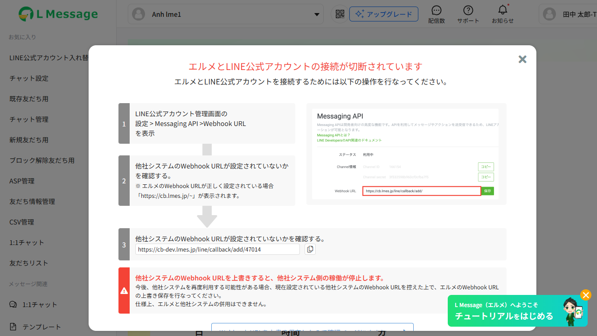

**Nguồn quan sát**: **Live thật** — bot gói フリー `Anh lme1` (hash `6darjNPer9oz`), snapshot `raw/features/change-bot/snapshots/free-plan.txt`, quét 2026-09-12. ⚠ Ảnh chụp bị **modal chặn `#modalWebhookONCallbackFail` phủ kín 2/3 phía trên** (xem BLK-WEBHOOK) — chỉ đọc được phần dưới (「アカウント入れ替えをはじめる」,「トップに戻る」) và một phần countdown; toàn bộ cây a11y vẫn đầy đủ trong snapshot. **Tin cậy: Cao** cho nội dung, **Trung bình** cho cảm quan bố cục (ảnh bị che).

**Xác nhận live 2026-09-12** (snapshot `free-plan.txt`): cấu trúc headline đúng như mô tả code-first — badge 「LINE公式アカウント」 → dòng 「＼」 + 「入れ替え機能」 + 「／」 → 「1ヶ月」 + 「無料開放」 + 「キャンペーン」 → 「キャンペーン終了まであと」 với 3 cụm 2 chữ số 「2」「8」日 : 「0」「7」時間 : 「4」「1」分, phân cách bằng `:`. Mỗi chữ số là **một phần tử DOM riêng** (đúng như `countdownParts.d1/d2/h1/h2/m1/m2`). → **nâng mức tin cậy phần countdown từ Trung bình lên Cao**.

Hiển thị khi `has_campaign = true` **và** chưa có reservation **và** không đang xử lý (`change_new.js:124-129`).

#### Layout

| Vùng | Nội dung |
|------|---------|
| Logo (`.cb-campaign-page__logo`) | `/images/logo_icon.png`, alt "L Message" (`:25-27`) |
| Stage (`.cb-campaign-page__stage.white-box`) | Cột trái: headline + hero + countdown. Cột phải: ảnh `/images/campaign-changebot/mobile-guide.svg` (inline style `height:600px; margin-top:48px; margin-right:144px`, `:81`) |
| Headline | Badge ảnh `/images/line_message.png` + 「LINE公式アカウント」; dòng dưới 「＼ 入れ替え機能 ／」 |
| Hero | Badge 「1ヶ月」 + 「無料開放」 + dòng block 「キャンペーン」 |
| Countdown | Nhãn 「キャンペーン終了まであと」, 3 cụm 2 chữ số cách nhau bởi `:` — 日 / 時間 / 分 |
| Footer (`.cb-campaign-page__footer`) | Nút CTA + link quay lại |

Không có breadcrumb, không có step indicator ở màn hình này.

#### Action Buttons

| Label 「JP」 | Loại | Vị trí | Hành vi | Hàm JS / Endpoint |
|-------------|------|--------|---------|-------------------|
| 「アカウント入れ替えをはじめる」 | `<button class="cb-campaign-page__cta">` | Footer | `currentStep = 'select'` — chỉ đổi state, không gọi API | `startFromCampaign()` (`change_new.js:449-451`) |
| 「トップに戻る」 | `<a href="javascript:void(0)">` | Footer, dưới CTA | `window.location.href = '/basic/overview'` | `backToTop()` (`:453-455`) |

#### Dữ liệu hiển thị

| Tiêu đề 「JP」 | Kiểu | Nguồn field |
|---------------|------|------------|
| 「日」 (2 chữ số) | string | `countdownParts.d1` / `d2` |
| 「時間」 (2 chữ số) | string | `countdownParts.h1` / `h2` |
| 「分」 (2 chữ số) | string | `countdownParts.m1` / `m2` |

Logic đồng hồ (`change_new.js:405-447`):
- `startCampaignCountdown()` gọi `updateCountdownParts()` ngay rồi lặp mỗi **5000ms**.
- `getRemainingSeconds()` ưu tiên `campaignEndsAt` (= `data.campaign_change_bot` từ `/init`, format `Y-m-d H:i:s`). Nếu parse lỗi → fallback **parse chuỗi tiếng Nhật** `campaign_countdown` bằng regex `(\d+)\s*日` / `時間` / `分`.
- Số ngày bị chặn tối đa 99 (`Math.min(days, 99)`), pad 2 chữ số.
- Khi hết giờ: toàn bộ digit về `'0'`, huỷ timer. **Không tự chuyển step** — trang vẫn đứng ở campaign cho tới khi user bấm CTA. **Tin cậy: Cao**.

#### Trạng thái màn hình
Chỉ 1 trạng thái tĩnh + đồng hồ chạy. Không có loading / error / empty riêng.

#### Observations
- CSS có sẵn cả một bộ class mô phỏng điện thoại (`.cb-campaign-page__phone*` `change_new.css:1367+`, `__account*` `:1410-1462`) nhưng **không markup nào trong Blade dùng chúng** → CSS chết; dấu vết bản dựng trước dùng HTML mô phỏng, sau thay bằng 1 ảnh SVG. **Tin cậy: Cao**.
- Ảnh `mobile-guide.svg` gắn inline style cứng, không responsive. **Tin cậy: Trung bình** (biểu hiện thực tế trên màn hình nhỏ chưa quan sát).

### SCR-CHB-02 — Chọn phương thức đổi

**Screenshot (gói trả phí, chưa chọn)**: 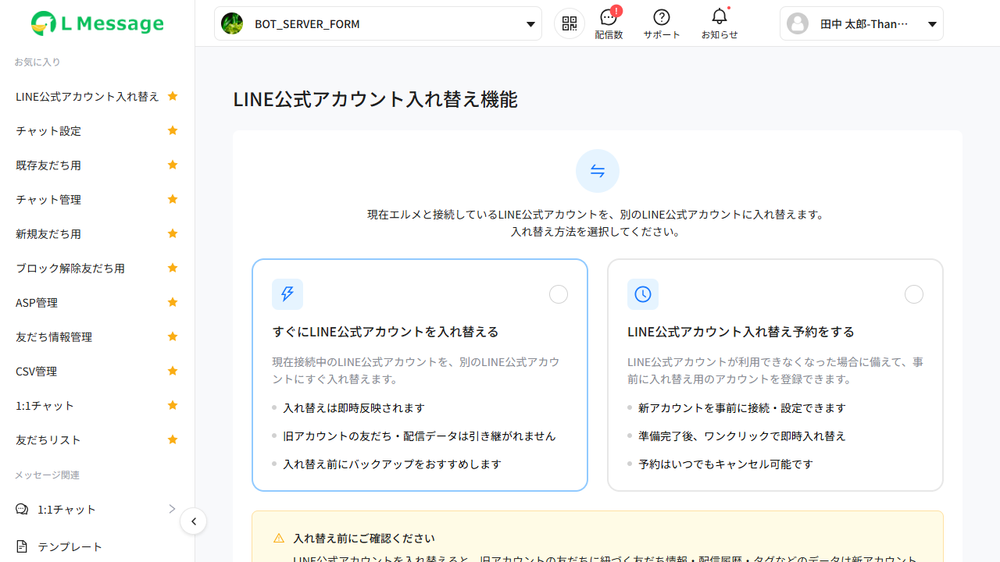
**Screenshot (đã chọn 「すぐに…」)**: 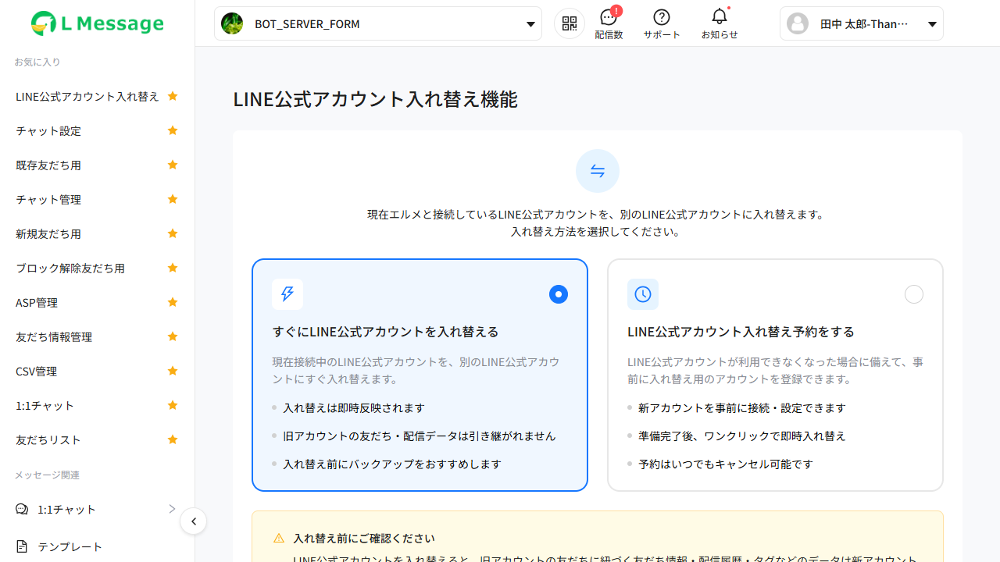
**Screenshot (đã chọn 「…予約をする」)**: 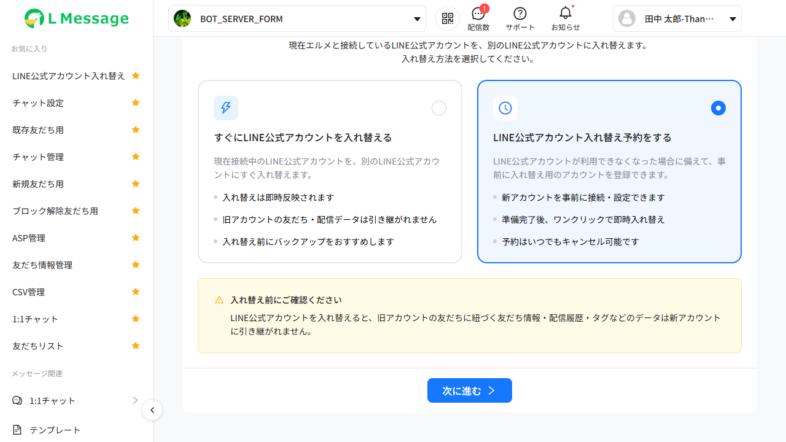

**Nguồn quan sát**: **Live thật** — bot trả phí `BOT_SERVER_FORM` (`bot_id = 541`, hash `1QxJWzneWNne`, gói 「おまとめ（スタンダード）」), snapshots `main.txt` / `scr-chb-02-select.txt` / `select-scheduled.txt`, quét 2026-09-12. **Tin cậy: Cao**.

**Xác nhận live**: với gói trả phí **không có banner nào** (cả `.cb-plan-banner` lẫn `.cb-campaign-banner`); 2 thẻ nằm ngang bằng nhau, mỗi thẻ có icon vuông bo góc ở trái-trên và **radio tròn rỗng ở phải-trên**; nút 「次に進む」 (kèm icon `>`) nằm **căn giữa** ở footer và **disabled** (nền xám) khi `selectedMethod === null` — snapshot `main.txt` ghi rõ `button "次に進む right" [disabled]`. Sau khi click 1 thẻ, snapshot `select-scheduled.txt` cho thấy nút **mất thuộc tính `[disabled]`** và có `[cursor=pointer]`. Nút 「使い方を見る」 **không xuất hiện** trong cây a11y → xác nhận `showGuide` luôn `false`. **Tin cậy: Cao**.

`index.blade.php:93-206`. Đây là **step mặc định** (`change_new.js:4`: `currentStep: changeSuccess == 1 ? 'processing' : 'select'`).

#### Layout

| Vùng | Nội dung |
|------|---------|
| Header (`.change-bot-page__header`) | Tiêu đề 「LINE公式アカウント入れ替え機能」 + nút phẳng 「使い方を見る」 (**ẩn** — `v-if="showGuide"`) |
| Banner khoá gói (`.cb-plan-banner`) | `v-if="isFreePlan && !has_campaign"` — hướng dẫn nâng gói (`:102-108`) |
| Banner chiến dịch (`.cb-campaign-banner`) | `v-if="has_campaign"` — icon `info-circle-filled` + text + đồng hồ (`:113-122`) |
| Body (`.cb-select__body`) | Icon mũi tên hoán đổi (SVG inline) + mô tả 2 dòng |
| 2 thẻ lựa chọn (`.cb-select__cards`) | Thẻ 「すぐに…」 và thẻ 「…予約をする」 |
| Hộp cảnh báo (`.cb-warning-box`) | 「入れ替え前にご確認ください」 |
| Footer (`.cb-footer`) | Nút 「次に進む」 |

Không có breadcrumb ở step này (breadcrumb chỉ có ở `input`, `webhook`, `confirm`).

#### Action Buttons

| Label 「JP」 | Loại | Vị trí | Hành vi | Hàm JS / Endpoint |
|-------------|------|--------|---------|-------------------|
| 「使い方を見る」 (icon `qrcode-outlined`) | `lme-button-flat` size md | Header | `window.open('https://lme.jp/manual/loa_replacement/', '_blank')` | `redirectManualChangeBot()` (`:457-459`) — **nút bị ẩn vì `showGuide` luôn `false`** |
| Thẻ 「すぐにLINE公式アカウントを入れ替える」 | Card clickable (`.cb-select__card`) | Cột trái | `selectedMethod = 'immediate'` | `selectMethod('immediate')` (`:152-155`) |
| Thẻ 「LINE公式アカウント入れ替え予約をする」 | Card clickable | Cột phải | `selectedMethod = 'scheduled'` | `selectMethod('scheduled')` |
| 「スタンダードプラン」 | `<a href="/admin/bot-add">` | Trong banner khoá gói + trong lớp phủ khoá | Điều hướng sang trang nâng gói | — |
| 「次に進む」 (icon `right-outlined`) | `lme-button-default` type primary size lg | Footer | `:disabled="!canProceedSelect"`; **chuyển sang SCR-CHB-03 ngay trong trang** | `goToInput()` (`:157-161`) |

`goToInput()` — **ĐÃ SỬA trên nhánh mới** (`change_new.js:157-161`):

```js
goToInput() {
    if (!this.canProceedSelect) return;
    this.currentStep = 'input';
    this.resetFormErrors();
},
```

→ Không còn `window.location.href = '/admin/change-bot-sub/...'`. Wizard chạy **hoàn toàn nội bộ trong SPA**. **Tin cậy: Cao**.

`selectMethod(method)` guard (`change_new.js:153`):

```js
if ((this.isFreePlan && method === 'scheduled') || (this.isFreePlan && !this.has_campaign)) return;
```

→ gói free **không bao giờ** chọn được `scheduled`; gói free ngoài kỳ campaign thì **không chọn được gì**.

#### Form Fields

Không có input HTML nào. Lựa chọn biểu diễn bằng radio giả `.cb-select__card-radio` (chấm hiện khi card có class `selected`).

| "Field" | Kiểu | Bắt buộc | Default | Validation client-side |
|---------|------|---------|---------|----------------------|
| `selectedMethod` | enum `immediate` \| `scheduled` | Có (để bật nút) | `null` | `canProceedSelect = selectedMethod !== null` (`change_new.js:93-95`) |

#### Dữ liệu hiển thị

| Nhãn 「JP」 | Kiểu | Nguồn field |
|------------|------|------------|
| 「キャンペーン終了まであと：{giá trị}」 | string | `campaignCountdown` — khởi tạo từ `data.campaign_countdown` (`/init`), sau đó bị `updateCountdownParts()` ghi đè thành `NN日NN時間NN分` (`change_new.js:433`) |
| Nội dung thẻ immediate | tĩnh | `:159-163` — 「入れ替えは即時反映されます」/「旧アカウントの友だち・配信データは引き継がれません」/「入れ替え前にバックアップをおすすめします」 |
| Nội dung thẻ scheduled | tĩnh | `:181-185` — 「新アカウントを事前に接続・設定できます」/「準備完了後、ワンクリックで即時入れ替え」/「予約はいつでもキャンセル可能です」 |
| Cảnh báo | tĩnh | `:196-197` — 「入れ替え前にご確認ください」+「LINE公式アカウントを入れ替えると、旧アカウントの友だちに紐づく友だち情報・配信履歴・タグなどのデータは新アカウントに引き継がれません。」 |

#### Trạng thái màn hình

| Trạng thái | Điều kiện | Biểu hiện |
|-----------|----------|----------|
| Bình thường (gói trả phí) | `isFreePlan = false` | 2 thẻ chọn được, không banner khoá |
| Free + trong kỳ campaign | `isFreePlan && has_campaign` | Banner campaign hiện; **chỉ thẻ scheduled** bị phủ `.cb-select__lock-overlay` với icon `lock-filled` + 「スタンダードプラン以上のご契約でご利用できます」 (`:186-189`); thẻ immediate dùng được |
| Free + hết kỳ campaign | `isFreePlan && !has_campaign` | Banner khoá gói (`:102-108`) + lớp phủ `.lock-free-plan` trùm **cả khối 2 thẻ** (`:138-143`) |
| Chưa chọn | `selectedMethod === null` | Nút 「次に進む」 disabled |

#### Observations
- Thẻ scheduled dùng đồng thời 2 cơ chế khoá: binding class `locked` (`:168`) và overlay riêng (`:186`); CSS `.cb-select__card.locked` được khai báo **2 lần** (`change_new.css:96` và `:100`). **Tin cậy: Cao**.
- Nút 「使い方を見る」 xuất hiện ở **5 header** trong Blade (`:97, 214, 294, 408, 509`) nhưng tất cả đều `v-if="showGuide"`, mà `showGuide` khởi tạo `false` (`change_new.js:76`) và **không có dòng code nào gán lại** → nút và 2 sidebar 動画マニュアル **luôn ẩn**. **Tin cậy: Cao**.

### SCR-CHB-02F — Chọn phương thức đổi, biến thể gói フリー + campaign ← **MỚI (quét live)**

`index.blade.php:113-122` (banner) + `:186-189` (lớp phủ khoá) | `currentStep === 'select'` **và** `isFreePlan && has_campaign`

**Screenshot**: 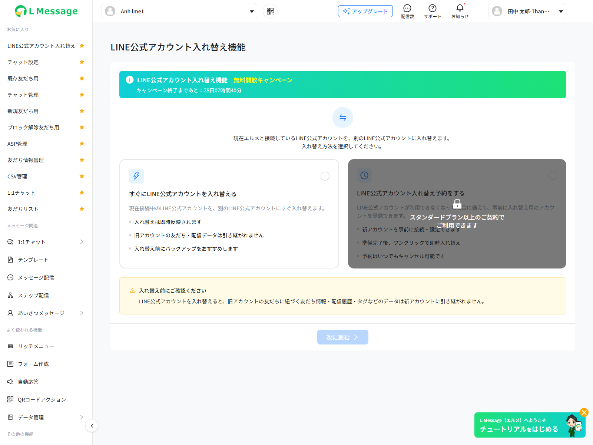

**Nguồn quan sát**: **Live thật** — bot gói フリー `Anh lme1` (hash `6darjNPer9oz`), snapshot `free-select.txt`, quét 2026-09-12. **Tin cậy: Cao**.

Bản v2 code-first đã dự đoán đúng biến thể này ở bảng "Trạng thái màn hình" của SCR-CHB-02 nhưng **chưa mô tả hình dạng**. Quét live bổ sung:

| Vùng | Nội dung quan sát được |
|------|----------------------|
| Banner campaign (`.cb-campaign-banner`) | Dải **nền gradient xanh lá** chiếm hết chiều ngang card, bo góc, đặt **trên cùng** thân trang. Dòng 1: icon `info-circle-filled` trắng + 「LINE公式アカウント入れ替え機能」 (trắng đậm) + 「無料開放キャンペーン」 (**màu vàng**). Dòng 2: 「キャンペーン終了まであと：28日07時間40分」 (trắng, cỡ nhỏ) |
| Thẻ 「すぐにLINE公式アカウントを入れ替える」 | **Bình thường, chọn được** — giữ `[cursor=pointer]` trong cây a11y |
| Thẻ 「LINE公式アカウント入れ替え予約をする」 | **BỊ KHOÁ** — phủ lớp **overlay xám đậm bán trong suốt** trùm cả thẻ; **mất `[cursor=pointer]`** trong cây a11y; ở giữa thẻ có **icon ổ khoá** + 2 dòng chữ 「スタンダードプラン以上のご契約で」 / 「ご利用できます」 (chia làm 2 text node) |
| Nút 「次に進む」 | Vẫn `[disabled]` khi chưa chọn gì |
| Header trang (layout chung) | Xuất hiện thêm nút 「アップグレード」 → `/admin/bot-add?upgrade_bot_id=6darjNPer9oz` — **thuộc layout chung**, không thuộc FA-044 |

**Xác nhận cơ chế khoá**: cây a11y cho thấy thẻ `scheduled` **không có `[cursor=pointer]`** trong khi thẻ `immediate` có → khớp với guard `selectMethod()` (`change_new.js:153`) và class binding `locked`. **Tin cậy: Cao**.

> ⚠ Biến thể thứ 3 (`isFreePlan && !has_campaign` — lớp phủ `.lock-free-plan` trùm **cả 2 thẻ**) **chưa quan sát được** vì cả 2 bot đã quét đều không rơi vào trạng thái này (bot フリー còn 28 ngày campaign). Vẫn giữ **Tin cậy: Cao** ở mức code (`index.blade.php:138-143`), **Thấp** ở mức biểu hiện thị giác.

### SCR-CHB-03 — Nhập thông tin kết nối

**Screenshot**: 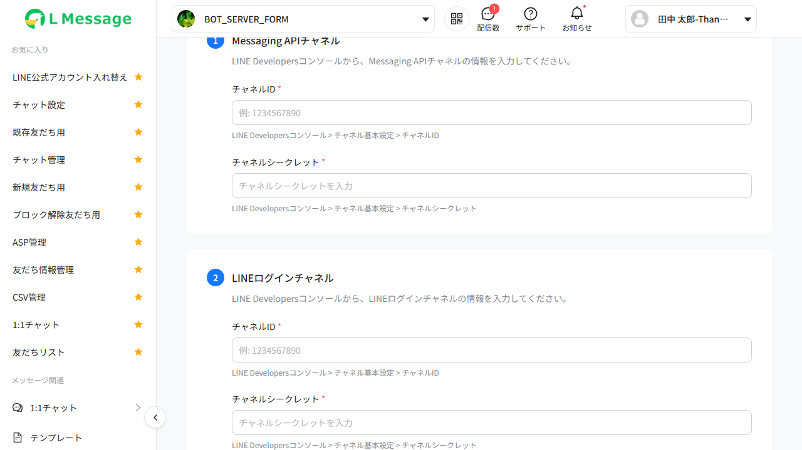

**Nguồn quan sát**: **Live thật** — bot trả phí `BOT_SERVER_FORM`, đi đúng luồng SCR-CHB-02 → 「次に進む」. Snapshot nhánh `immediate`: `scr-03-input.txt`; nhánh `scheduled`: `scheduled-next.txt`. **Tin cậy: Cao**.

> **Xác nhận live quan trọng — 2 nhánh render GIỐNG HỆT NHAU**: `diff scr-03-input.txt scheduled-next.txt` chỉ khác **số thứ tự `ref=eNNN`** do playwright-cli tự sinh, **không khác một ký tự nội dung nào**; ảnh chụp 2 nhánh có md5 trùng khớp. Không có nhãn/nút/gợi ý nào phân biệt phương thức đã chọn. **Tin cậy: Cao**.
> → Hệ quả UX: sau khi rời SCR-CHB-02, **người dùng không còn manh mối nào trên màn hình để biết mình đang ở luồng "đổi ngay" hay "đặt trước"** cho tới tận khi bấm 「この内容で接続する」 ở SCR-CHB-05.

**Xác nhận live cấu trúc**: breadcrumb 「LINE公式アカウント設定」 (link `?`) → 「接続情報入力」; 2 section đánh số 「1」「Messaging APIチャネル」 và 「2」「LINEログインチャネル」, mỗi section 2 field; nhãn field hiển thị kèm dấu **`*`** (「チャネルID *」,「チャネルシークレット *」) — chi tiết này **không có trong bản v2 code-first**. Placeholder đúng như code (「例: 1234567890」 / 「チャネルシークレットを入力」), hint dưới mỗi field đúng như code. Footer 2 nút 「キャンセル」 + 「次に進む」 `[disabled]`. Sidebar 「動画マニュアル」 **không xuất hiện** → xác nhận luôn ẩn. **Tin cậy: Cao**.

> **Xác nhận live về che secret**: cả 4 ô đều là `textbox` thường trong cây a11y, **không ô nào là password field** → xác nhận điểm #10 (2 field channel secret không còn được che). **Nâng mức tin cậy biểu hiện thực tế từ Trung bình lên Cao**.

`index.blade.php:208-286`. Vào từ SCR-CHB-02 qua `goToInput()`, hoặc quay lại từ SCR-CHB-04 qua `backToInput()`.

#### Layout

| Vùng | Nội dung |
|------|---------|
| Breadcrumb | `lme-breadcrumb` items = 「LINE公式アカウント設定」 (href `?`) → 「接続情報入力」 (`:210`) |
| Header | Tiêu đề + 「使い方を見る」 (ẩn) |
| Main (`.cb-input__main`) | **2 section** đánh số 1/2 + footer |
| Sidebar phải (`.cb-input__sidebar`) | 「動画マニュアル」 — `v-if="showGuide"` → **luôn ẩn** (`:277-284`) |
| Footer (`.cb-input__footer`) | 「キャンセル」 + 「次に進む」 |

Step indicator: **không có** component wizard riêng; dùng số thứ tự section `.cb-input__section-number` (1 / 2), tiếp nối sang số 3 ở SCR-CHB-04.

#### Form Fields

| # | Label 「JP」 | Section | v-model | Input type | Bắt buộc | Placeholder | Default | Validation client-side |
|---|-------------|---------|---------|-----------|---------|-------------|---------|----------------------|
| 1 | 「チャネルID」 | 1 — 「Messaging APIチャネル」 | `form.channel_id` | `lme-input` text, `required`, size lg, width 100% | Có | 「例: 1234567890」 | `''` | Chỉ `trim() !== ''` qua `canSubmitInput` |
| 2 | 「チャネルシークレット」 | 1 — 「Messaging APIチャネル」 | `form.channel_secret` | `lme-input` (**không còn type password** — xem cảnh báo dưới) | Có | 「チャネルシークレットを入力」 | `''` | như trên |
| 3 | 「チャネルID」 | 2 — 「LINEログインチャネル」 | `form.login_channel_id` | `lme-input` text | Có | 「例: 1234567890」 | `''` | như trên |
| 4 | 「チャネルシークレット」 | 2 — 「LINEログインチャネル」 | `form.login_channel_secret` | `lme-input` | Có | 「チャネルシークレットを入力」 | `''` | như trên |

- `canSubmitInput` (`change_new.js:96-101`): cả 4 field sau `trim()` phải khác rỗng → mới bật nút 「次に進む」.
- **Không có** kiểm tra định dạng số / độ dài ở client. Ràng buộc `required|max:500` chỉ tồn tại ở server (`app/Http/Requests/ChangeBotRequest.php:11-16`).
- Lỗi hiển thị qua `:error-message="formErrors.<field>[0]"` — `formErrors` khởi tạo là **chuỗi rỗng** (`change_new.js:26-31`), chỉ thành mảng khi server trả `errors` (`change_new.js:219`). Trước đó `''[0]` = `undefined` → không lỗi hiển thị. Server trả dạng `{'success': false, 'errors': MessageBag}` (`app/Http/Requests/BaseRequest.php:16-21`). **Tin cậy: Cao**.
- Hint dưới mỗi field: 「LINE Developersコンソール > チャネル基本設定 > チャネルID」 / 「… > チャネルシークレット」.
- Mô tả section 1 (`:226`): 「LINE Developersコンソールから、Messaging APIチャネルの情報を入力してください。」; section 2 (`:251`): 「LINE Developersコンソールから、LINEログインチャネルの情報を入力してください。」

> ⚠ **Toggle hiện/ẩn secret ĐÃ BỊ VÔ HIỆU HOÁ**: các attribute `:type`, `:suffix`, `@suffix-click="toggleSecretVisibility(...)"`, `:show-password` đều bị comment trong Blade (`:234, 236, 260, 262`). Hệ quả: **2 field channel secret không còn được che**. Hàm `toggleSecretVisibility()` (`change_new.js:167-173`) và 2 biến `form.*_secret_visible` trở thành code không dùng. **Tin cậy: Cao** cho phần code; **Trung bình** cho biểu hiện thực tế (phụ thuộc default type của `lme-input`).

#### Hành vi ngầm — tự đặt Webhook endpoint

`watch` trên `form.channel_id` và `form.channel_secret` gọi `scheduleWebhookSetup()` (`change_new.js:79-82, 175-194`):
- Chỉ chạy khi `currentStep === 'input'` và cả 2 giá trị khác rỗng.
- Debounce **600ms**; chống lặp bằng `webhookSetupLastKey = channelId + '|' + channelSecret`.
- `POST /admin/ajax/change-bot/set-webhook` với `{ bot_id, channel_id, channel_secret }` → server gọi LINE API `setWebhookUrl($channelAccessToken)` (`ChangeBotController.php:176-194`).
- Nếu `.fail()` thì reset key để cho phép thử lại.
- **Không hiển thị bất kỳ phản hồi nào lên UI** (không toast, không trạng thái) → người dùng không biết endpoint đã được đặt hay chưa. **Tin cậy: Cao**.

#### Action Buttons

| Label 「JP」 | Loại | Vị trí | Hành vi | Hàm JS / Endpoint |
|-------------|------|--------|---------|-------------------|
| 「キャンセル」 | `lme-button-flat` lg | Footer trái | `currentStep = 'select'` | `cancelInput()` (`:231-233`) |
| 「次に進む」 | `lme-button-default` primary lg | Footer phải | `:disabled="!canSubmitInput"`; xác thực credential qua LINE API rồi sang SCR-CHB-04 | `validateAndConfirm()` → `POST /admin/ajax/change-bot/validate` |

`validateAndConfirm()` (`change_new.js:196-229`):
- Payload `{ bot_id, channel_id, channel_secret, login_channel_id, login_channel_secret, type: selectedMethod }`.
- `beforeSend` bật `$.LoadingOverlay('show')`, `always` tắt + `loading = false`.
- `r.success = false` + có `r.message` → toast lỗi rồi `return`. Nếu có `r.errors` → merge vào `formErrors` (hiện lỗi dưới từng field).
- Thành công → `confirmData = r.data`, `webhook_url = r.data.webhook_url || ''`, **`currentStep = 'webhook'`** (KHÔNG phải `'confirm'`). **Tin cậy: Cao**.

#### Trạng thái màn hình

| Trạng thái | Biểu hiện |
|-----------|----------|
| Nhập chưa đủ 4 field | Nút 「次に進む」 disabled |
| Đang submit | `$.LoadingOverlay` phủ toàn trang |
| Lỗi field (validation server) | `error-message` dưới field tương ứng |
| Lỗi nghiệp vụ (credential sai, LOA đã kết nối…) | Toast đỏ |

#### Observations
- Breadcrumb item đầu có `href: '?'` — placeholder, click sẽ về chính URL hiện tại kèm `?`. **Tin cậy: Cao**.
- **Lựa chọn phương thức KHÔNG bị reset khi bấm 「キャンセル」** — `cancelInput()` chỉ đặt `this.currentStep = 'select'`, **không** gán lại `selectedMethod = null` (`change_new.js:231-233`). Hệ quả quan sát được: quay về SCR-CHB-02 thì thẻ vẫn đang được chọn và nút 「次に進む」 **vẫn ở trạng thái enabled**, người dùng bấm tiếp là vào thẳng lại SCR-CHB-03. Đối lập với `confirmDeleteReservation()` (`:370-373`) vốn reset `selectedMethod = null`. **Tin cậy: Cao** (đọc code + quan sát nút enabled ở snapshot `select-scheduled.txt`).
- Nhãn field hiển thị dấu bắt buộc **`*`** sau tên (「チャネルID *」) — chi tiết chỉ thấy được khi quét live, do `lme-input` tự render từ prop `required`. **Tin cậy: Cao**.
- Section 3 「応答設定のWebhookをONにする」 (bản v1) **đã tách thành màn hình riêng SCR-CHB-04**. Hàm `openLineAdmin()` (`change_new.js:402`) mở `https://manager.line.biz/` **không còn được Blade nào gọi** → code không dùng. **Tin cậy: Cao**.
- Không còn ký tự `>` thừa như bản v1 — Blade nay đóng tag `lme-input` đúng (`:237-238, 263-264`). **Tin cậy: Cao**.

### SCR-CHB-04 — Cấu hình Webhook URL ← **MÀN HÌNH MỚI**

`index.blade.php:288-400` | `currentStep === 'webhook'`

**Screenshot**: 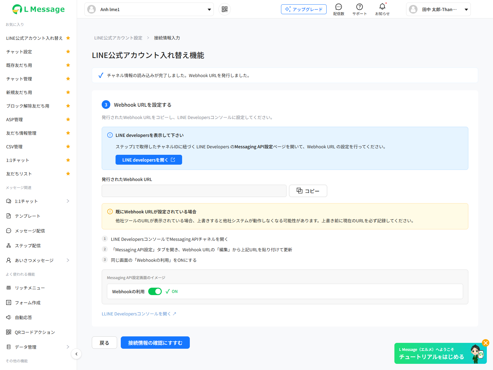

**Nguồn quan sát**: **Render client-side** — gán `currentStep = 'webhook'` trực tiếp vào Vue instance (không có credential LINE thật để đi qua `POST /validate`). Snapshot `scr-chb-04-webhook.txt`, bot `Anh lme1`. → **Nhãn / nút / hướng dẫn / bố cục = Cao** (Blade render thật); **giá trị `webhook_url` = chưa quan sát được** — ô URL rỗng vì `confirmData` không được bơm `webhook_url`.

**Xác nhận live toàn bộ văn bản tĩnh** (snapshot `scr-chb-04-webhook.txt`): banner 「チャネル情報の読み込みが完了しました。Webhook URLを発行しました。」, card số 「3」「Webhook URLを設定する」, mô tả, hộp info 「LINE developersを表示して下さい」 + nút 「LINE developersを開く」 (icon `export`), nhãn 「発行されたWebhook URL」 + nút 「コピー」, hộp cảnh báo 「既にWebhook URLが設定されている場合」, 3 bước 1/2/3, preview 「Messaging API設定画面のイメージ」 + 「Webhookの利用」 + 「ON」, link cuối, footer 「戻る」 + 「接続情報の確認にすすむ」 — **khớp 100%** với mô tả code-first. **Tin cậy: Cao**.

Vào từ SCR-CHB-03 sau khi `POST /validate` thành công. Đây là bước tách riêng việc **phát hành + kiểm tra Webhook** khỏi `validateChannel` (bản v1 kiểm tra webhook ngay trong `/validate`).

#### Layout

| Vùng | Nội dung |
|------|---------|
| Breadcrumb | giống SCR-CHB-03 (`:290`) |
| Header | Tiêu đề + 「使い方を見る」 (ẩn) |
| Banner thành công (`.cb-webhook__banner`) | Icon check + 「チャネル情報の読み込みが完了しました。Webhook URLを発行しました。」 (`:300-307`) |
| Card section 3 (`.cb-input__card`) | Số `3` + tiêu đề 「Webhook URLを設定する」 (`:309-313`) |
| Mô tả | 「発行されたWebhook URLをコピーし、LINE Developersコンソールに設定してください。」 (`:315`) |
| Hộp thông tin (`.cb-webhook__info`) | 「LINE developersを表示して下さい」 + hướng dẫn + nút mở LINE Developers (`:317-331`) |
| Khối URL (`.cb-webhook__url`) | Nhãn 「発行されたWebhook URL」 + ô hiển thị URL + nút 「コピー」 (`:333-346`) |
| Hộp cảnh báo (`.cb-webhook__warn`) | 「既にWebhook URLが設定されている場合」 (`:348-359`) |
| 3 bước (`.cb-webhook__steps`) | Hướng dẫn 1/2/3 (`:361-365`) |
| Preview (`.cb-webhook__preview`) | 「Messaging API設定画面のイメージ」 + toggle giả + nhãn 「ON」 (`:367-380`) |
| Link | 「LLINE Developersコンソールを開く ↗」 (`:381`) |
| Footer | 「戻る」 + 「接続情報の確認にすすむ」 |
| Sidebar phải | 「動画マニュアル」 → 「Webhook URLの設定方法」 — `v-if="showGuide"` → **luôn ẩn** (`:391-398`) |

#### Dữ liệu hiển thị

| Nhãn 「JP」 | Kiểu | Nguồn field từ API response |
|------------|------|----------------------------|
| 「発行されたWebhook URL」 (giá trị) | string (URL) | `webhook_url` ← `r.data.webhook_url` của `POST /validate`. Server dựng: `env('DOMAIN_ENDPOINT_WEBHOOK') . 'line/callback/add/0'`, fallback `url('line/callback/add/0')` (`app/Http/Controllers/Ajax/ChangeBotController.php:127`) |
| tooltip của ô URL | string | `:title="webhook_url"` (`:336`) |

Nội dung tĩnh quan trọng:

| Vị trí | Text 「JP」 |
|-------|-----------|
| Banner | 「チャネル情報の読み込みが完了しました。Webhook URLを発行しました。」 |
| Hộp info — tiêu đề | 「LINE developersを表示して下さい」 |
| Hộp info — nội dung | 「ステップ1で取得したチャネルIDに紐づく LINE Developers の**Messaging API設定**ページを開いて、Webhook URL の設定を行ってください。」 |
| Hộp cảnh báo — tiêu đề | 「既にWebhook URLが設定されている場合」 |
| Hộp cảnh báo — nội dung | 「他社ツールのURLが表示されている場合、上書きすると他社システムが動作しなくなる可能性があります。上書き前に現在のURLを必ず記録してください。」 |
| Bước 1 | 「LINE DevelopersコンソールでMessaging APIチャネルを開く」 |
| Bước 2 | 「「Messaging API設定」タブを開き、Webhook URLの「編集」から上記URLを貼り付けて更新」 |
| Bước 3 | 「同じ画面の「Webhookの利用」をONにする」 |
| Preview | 「Messaging API設定画面のイメージ」 / 「Webhookの利用」 / 「ON」 |

#### Action Buttons

| Label 「JP」 | Loại | Vị trí | Hành vi | Hàm JS / Endpoint |
|-------------|------|--------|---------|-------------------|
| 「LINE developersを開く」 (icon `export-outlined`) | `lme-button-default` primary md | Hộp info | `window.open('https://developers.line.biz/console/','_blank')` | `openLineDevelopers()` (`:403`) |
| 「コピー」 (icon copy SVG) | `lme-button-flat` lg | Cạnh ô URL | Copy `webhook_url` vào clipboard, toast xanh 「Webhook URLをコピーしました。」 | `copyWebhookUrl()` (`:259-269`) — ưu tiên `navigator.clipboard.writeText`, fallback `fallbackCopy()` dùng `<textarea>` ẩn + `document.execCommand('copy')` (`:271-281`) |
| 「LLINE Developersコンソールを開く ↗」 | `<a class="cb-webhook__link">` | Cuối card | như trên | `@click.prevent="openLineDevelopers"` |
| 「戻る」 | `lme-button-flat` lg | Footer trái | `currentStep = 'input'` | `backToInput()` (`:235-237`) |
| 「接続情報の確認にすすむ」 | `lme-button-default` primary lg | Footer phải | **Kiểm tra webhook đã bật chưa**, đạt thì sang SCR-CHB-05 | `goToConfirm()` → `POST /admin/ajax/change-bot/check-webhook` |

`goToConfirm()` (`change_new.js:239-257`) — **endpoint MỚI**:
- Payload `{ bot_id, channel_id, channel_secret }`.
- Server (`ChangeBotController@checkWebhookEnabled`, `:156-174`): lấy access token → gọi helper `checkWebhook($channelAccessToken)`.
- `r.success = false` → toast `r.message` (fallback `'Webhookをオンにして下さい。'`) và **ở lại SCR-CHB-04**.
- Thành công → `currentStep = 'confirm'`.
- `$.LoadingOverlay` bật/tắt trong `beforeSend`/`always`. **Tin cậy: Cao**.

#### Trạng thái màn hình

| Trạng thái | Biểu hiện |
|-----------|----------|
| Bình thường | Hiển thị URL webhook, nút copy sẵn sàng |
| `webhook_url` rỗng | Ô URL trống; `copyWebhookUrl()` `return` sớm, không toast (`:262`) |
| Đang kiểm tra webhook | `$.LoadingOverlay` toàn trang |
| Webhook chưa bật | Toast đỏ 「Webhookをオンにして下さい。 既にオンの場合は、一度オフにしてから再度オンに変更して下さい。」, đứng lại màn hình này |
| Copy thành công | Toast xanh 「Webhook URLをコピーしました。」 |

#### Observations
- **Trùng lặp cơ chế**: `set-webhook` (auto, debounce 600ms ở SCR-CHB-03) đã tự đặt Webhook URL qua LINE API, nhưng SCR-CHB-04 vẫn hướng dẫn người dùng **dán URL thủ công**. Nhiều khả năng là 2 lớp phòng vệ (auto set có thể thất bại im lặng). **Tin cậy: Cao** cho việc cả 2 cùng tồn tại; **Trung bình** cho lý do thiết kế.
- **Lỗi chính tả**: link `:381` ghi 「**LL**INE Developersコンソールを開く」 (thừa 1 chữ L). **Tin cậy: Cao**.
- Toggle preview `.cb-webhook__toggle` là span thuần CSS (`change_new.css:608-627`), không tương tác được — chỉ là ảnh minh hoạ. **Tin cậy: Cao**.
- Nút copy dùng `document.execCommand('copy')` làm fallback — API đã deprecated nhưng vẫn hoạt động trên các trình duyệt hiện tại. **Tin cậy: Cao**.

### SCR-CHB-05 — Xác nhận thông tin kết nối

**Screenshot**: 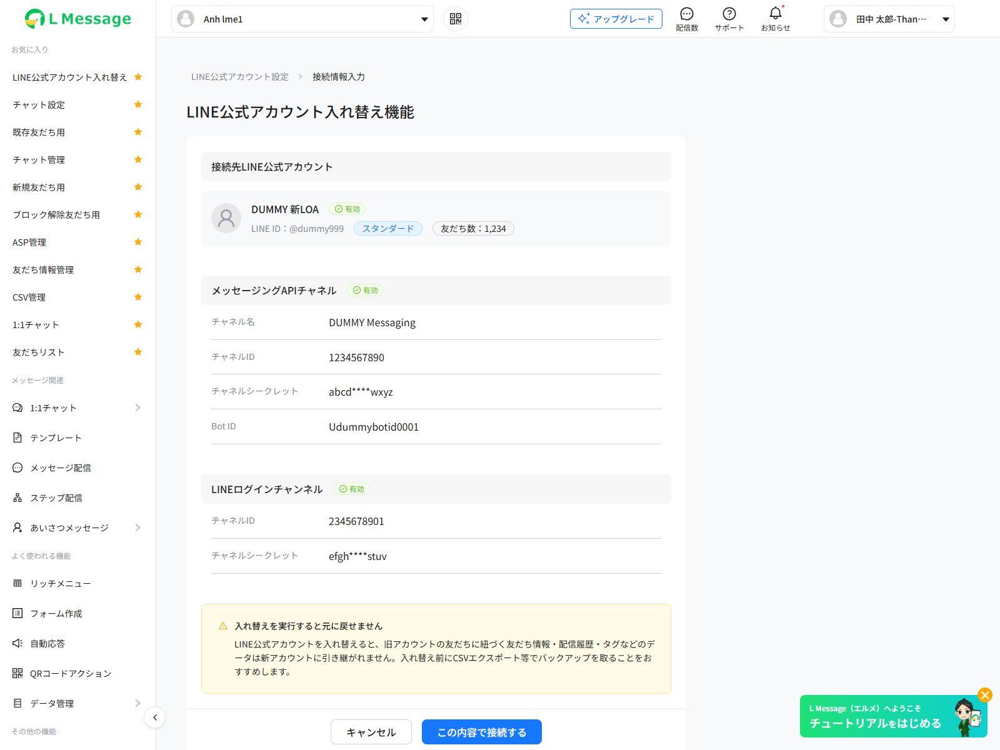

**Nguồn quan sát**: **Render client-side** — gán `currentStep = 'confirm'` + bơm `confirmData` giả. Snapshot `scr-chb-05-confirm.txt`. → **Nhãn / thứ tự trường / badge / bố cục = Cao**; **mọi giá trị hiển thị là dữ liệu giả** (`DUMMY 新LOA`, `@dummy999`, 「スタンダード」, 「友だち数：1,234」, `DUMMY Messaging`, `1234567890`, `abcd****wxyz`, `Udummybotid0001`, `2345678901`, `efgh****stuv`).

**Xác nhận live bố cục**: breadcrumb giống SCR-CHB-03 (item 2 vẫn là 「接続情報入力」 — **xác nhận lỗi breadcrumb không đổi theo bước**); 3 section có header nền xám kèm badge 「有効」 (icon `check-circle`); Section 1 là thẻ tài khoản 1 dòng (avatar tròn + tên + badge 「有効」, dòng dưới 「LINE ID：…」 + chip gói + chip 「友だち数：…」); Section 2 và 3 là **bảng 2 cột nhãn/giá trị**, mỗi dòng có gạch dưới mảnh. Hộp cảnh báo vàng 「入れ替えを実行すると元に戻せません」 ở cuối, footer 「キャンセル」 + 「この内容で接続する」 (nút xanh). **Tin cậy: Cao**.

`index.blade.php:402-474`. Vào từ SCR-CHB-04 sau khi `check-webhook` trả `success = true`.

#### Layout
Breadcrumb (item 2 vẫn là 「接続情報入力」) → Header → `.cb-confirm__body` gồm 3 section + hộp cảnh báo → footer 2 nút.

#### Dữ liệu hiển thị

**Section 1 — 「接続先LINE公式アカウント」** (thẻ `.cb-account-card`, `:414-436`):

| Nhãn 「JP」 | Kiểu | Nguồn (field trong response `/validate`) |
|------------|------|------------------------------------------|
| Ảnh đại diện | image URL | `confirmData.avatar_url` (LINE `pictureUrl`); rỗng → SVG avatar mặc định 48px; lỗi tải → `altImageAvatar(this)` |
| Tên LOA | string | `confirmData.bot_name` (LINE `displayName`) |
| Badge 「有効」 | tĩnh | icon `check-circle-outlined` — **hardcode trong Blade**, không đọc từ `status` |
| 「LINE ID：」 | string | `confirmData.bot_id_line` (LINE `basicId`) |
| Tag gói | string | `confirmData.plan_name` (server: `planLOA($limitMessageLOA, true)`) |
| 「友だち数：」 | number, `.toLocaleString()`, fallback `'0'` | `confirmData.friend_count` = `followers - blocks` |

**Section 2 — 「メッセージングAPIチャネル」** + badge 「有効」 (`:437-448`):

| Nhãn 「JP」 | Nguồn |
|------------|-------|
| 「チャネル名」 | `confirmData.messaging_api.channel_name` (server gán = `bot_name`) |
| 「チャネルID」 | `confirmData.messaging_api.channel_id` |
| 「チャネルシークレット」 | `confirmData.messaging_api.channel_secret_masked` — server mask `3 ký tự đầu + '••••••••••••' + 3 ký tự cuối` (`ChangeBotController.php:143`) |
| 「Bot ID」 | `confirmData.messaging_api.bot_id` (server gán = `basicId`) |

**Section 3 — 「LINEログインチャンネル」** + badge 「有効」 (`:449-459`):

| Nhãn 「JP」 | Nguồn |
|------------|-------|
| 「チャネルID」 | `confirmData.line_login.channel_id` |
| 「チャネルシークレット」 | `confirmData.line_login.channel_secret_masked` |

> Dòng 「チャネル名」 của LINE Login **đã bị comment** (`index.blade.php:455`) — server không trả `line_login.channel_name`.

Hộp cảnh báo `.cb-warning-box` (`:460-466`): 「入れ替えを実行すると元に戻せません」 + 「…入れ替え前にCSVエクスポート等でバックアップを取ることをおすすめします。」

#### Action Buttons

| Label 「JP」 | Loại | Vị trí | Hành vi | Hàm JS / Endpoint |
|-------------|------|--------|---------|-------------------|
| 「キャンセル」 | `lme-button-flat` lg | Footer trái | **`currentStep = 'webhook'`** (quay về SCR-CHB-04, không phải input) | `cancelConfirm()` (`change_new.js:323-325`) |
| 「この内容で接続する」 | `lme-button-default` primary lg | Footer phải | Tạo bản ghi `schedule_change_bots` | `executeConnect()` → `POST /admin/ajax/change-bot/execute` |

`executeConnect()` (`change_new.js:283-321`):
- Payload giống `/validate`.
- `r.success = false` → **toast `r.msg || 'Error'`** (đã sửa so với bản v1 vốn `return` im lặng). **Tin cậy: Cao**.
- `selectedMethod === 'immediate'`: `currentStep='processing'`, `progress=0`, `schedule_id = r.data.schedule.id`, bắt đầu polling.
- `selectedMethod === 'scheduled'`: dựng object `reservation` **từ `confirmData` phía client** (không dùng object `reservation` server trả), `date = r.data.schedule.created_at`, `schedule_id = r.data.schedule.id`, `currentStep='reservation'`.

#### Trạng thái màn hình

| Trạng thái | Biểu hiện |
|-----------|----------|
| Bình thường | 3 section + cảnh báo |
| Đang submit | `$.LoadingOverlay` toàn trang |
| Lỗi (gói cước / đang có tiến trình) | Toast đỏ với `r.msg` |

#### Observations
- 3 badge 「有効」 là tĩnh trong Blade; các field `messaging_api.status` / `line_login.status` server trả `'valid'` nhưng UI không dùng → nếu backend đổi status, UI vẫn luôn báo hợp lệ. **Tin cậy: Cao**.
- Server vẫn trả `channel_access_token` và `channel_access_token_line_login` trong response `/validate` (`ChangeBotController.php:136-137`) — **token nhạy cảm bị đẩy xuống browser dù UI không dùng**. **Tin cậy: Cao** (cảnh báo bảo mật).

### SCR-CHB-06 — Đang xử lý đổi LOA

**Screenshot**: 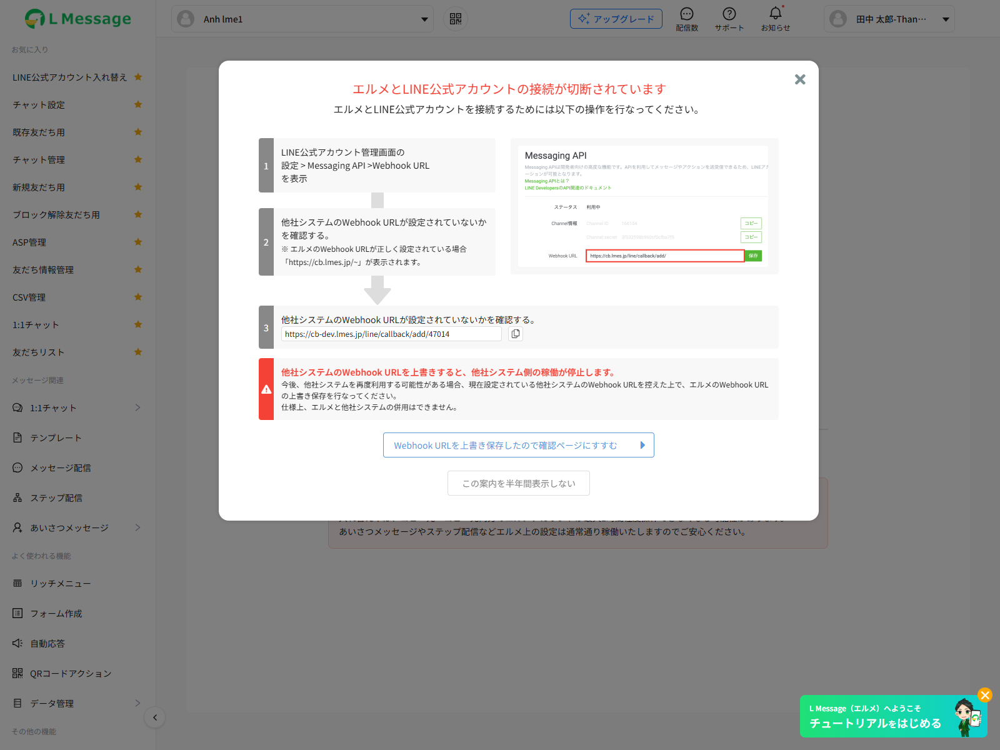

**Nguồn quan sát**: **Render client-side** — gán `currentStep = 'processing'` + `progress = 45`. Snapshot `scr-chb-06-processing.txt`. → Nhãn/bố cục **Cao**; giá trị `45%` là giả, **chưa quan sát được polling thật** (không có bản ghi `schedule_change_bots` để poll, cũng chưa xác nhận được chu kỳ 3s trên runtime).

**Xác nhận live**: hiển thị đúng 「LINE公式アカウント入れ替え中」 → 2 dòng mô tả → 「45%」 → hộp 「注意事項」 + đoạn văn 2 dòng, **không có nút nào**. **Tin cậy: Cao** cho tập phần tử.

`index.blade.php:476-502` | `.cb-processing`, container ép `min-height:calc(100vh - 120px)`.

#### Layout
Logo `/images/logo-lme.png` (32px) → khối nội dung căn giữa: tiêu đề + mô tả + spinner + progress bar → hộp lưu ý `.cb-error-box`.

#### Dữ liệu hiển thị

| Nhãn 「JP」 | Kiểu | Nguồn |
|------------|------|-------|
| 「LINE公式アカウント入れ替え中」 | tĩnh | `:483`, icon `warning-circle-outlined` |
| 「現在、LINE公式アカウントの入れ替え作業を行なっております。作業完了までエルメの操作はできません。作業完了までは最大1時間程度かかる場合があります。」 | tĩnh | `:485` |
| Thanh tiến độ | number 0..100 | `progress` → `:style="{ width: progress + '%' }"` |
| 「{progress}%」 | number | `progress` |
| 「注意事項」 + 「入れ替え中は、コピー元・コピー先両方のエルメアカウントが最大1時間程度操作できなくなる可能性があります。あいさつメッセージやステップ配信などエルメ上の設定は通常通り稼働いたしますのでご安心ください。」 | tĩnh | `:496-498` |

#### Action Buttons
**Không có nút nào.** Người dùng bị "khoá" ở màn hình này cho tới khi polling báo hoàn tất.

#### Polling (`change_new.js:327-351`)
- `setInterval` mỗi **3000ms** gọi `GET /admin/ajax/change-bot/progress?schedule_id={id}`.
- `r.success = false` → dừng timer + toast `r.message_error || 'Error'` (server trả khi status = ERROR(4) hoặc CANCEL(5), `ChangeBotController.php:288`).
- `r.data.progress` → cập nhật thanh.
- `r.data.completed = true` (status = DONE(3)) → dừng timer, `confirmData = r.data.confirm_data || confirmData`, bật `showSuccessModal`.

> Server hiện trả `'confirm_data' => null` (`ChangeBotController.php:290`) → `confirmData` giữ nguyên giá trị từ `/validate` (hoặc từ `reservation` nếu vào bằng luồng thực thi đặt lịch). Đây chính là lý do modal thành công **không còn rỗng** như bản v1. **Tin cậy: Cao**.

#### Trạng thái màn hình

| Đường vào | Nguồn |
|----------|-------|
| Vào thẳng khi tải trang | `changeSuccess == 1` (query `change_success=1`) → step khởi tạo là `processing` (`change_new.js:4`) |
| Vào từ `/init` | `data.is_processing` (schedule.status = PROCESSING) **hoặc** `typeParam === 'change_sub'` (`change_new.js:135-139`) |
| Vào từ execute | `executeConnect()` với `immediate` |
| Vào từ reservation | `confirmExecuteReplacement()` |
| Lỗi | Toast đỏ, **màn hình vẫn đứng ở processing** — không tự thoát về `select`. **Tin cậy: Cao** |
| **Thanh tiến độ đứng yên rất lâu ở 80% rồi nhảy thẳng 100%** — hằng `PROGRESS_STEP_6 = 100` (`ChangeBotConstants.java:17`) **không được dùng**; `markDone()` hard-code `progress = 100` trong SQL, nên suốt step 6 (bước nặng nhất về số bảng) FE vẫn hiển thị 80%. **Tin cậy: Cao** | `job/job-spec.md` §4 (`job-spec.md:186-188`) |

#### Observations
- `executeConnect()` viết `setTimeout(self.pollProgress(), 1000)` (`change_new.js:306`) — gọi hàm **ngay lập tức** rồi truyền `undefined` cho `setTimeout` → delay 1s không có tác dụng. Không phá luồng vì `pollProgress` tự dùng `setInterval`. **Tin cậy: Cao** (bug nhỏ).
- Không có timeout tổng cho polling: nếu job treo ở `PROCESSING`, trang gọi API mỗi 3s vô hạn. **Tin cậy: Cao**.
- `beforeDestroy()` dọn `progressTimer`, `countdownTimer`, `webhookSetupTimer` (`change_new.js:462-466`) — Vue root instance hầu như không bị destroy nên chỉ có tác dụng phòng vệ.

### SCR-CHB-07 — Đã có đặt lịch (Reservation)

`index.blade.php:504-546` | `.cb-reservation`

**Screenshot**: 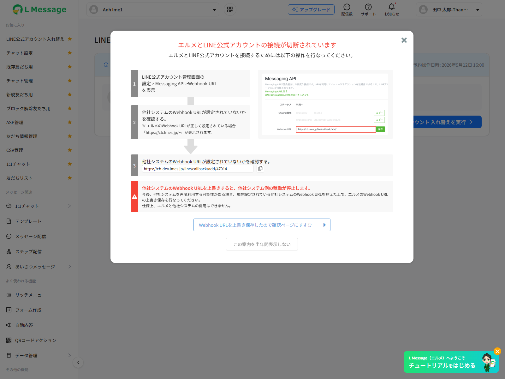

**Nguồn quan sát**: **Render client-side** — gán `currentStep = 'reservation'` + bơm object `reservation` giả. Snapshot `scr-chb-07-reservation.txt`. → Nhãn/nút/bố cục **Cao**; giá trị giả.

**Xác nhận live cấu trúc hiển thị**: tiêu đề 「入れ替え予約が設定されています」 (icon `time-circle`) ở trái ‖ dòng 「予約操作日時: 2026年9月12日 16:00」 ở phải; thẻ LOA gồm **avatar + `bot_name` + 「LINE ID：{bot_id_line}」** — xác nhận `plan_name` và 「友だち数」 **KHÔNG hiển thị** (đúng như code, đã bị comment tại `index.blade.php:534-535`); 2 nút 「接続予約を削除」 (icon `delete`) và 「LINE公式アカウント 入れ替えを実行」 (icon `right`). **Tin cậy: Cao** cho tập phần tử.

> ⚠ Định dạng ngày quan sát được là 「2026年9月12日 16:00」 — **tháng/ngày KHÔNG pad 0** (`9月12日`, không phải `09月12日`). Đây là kết quả `formatDate(..., 'Y年M月D日 HH:mm')` chạy trên giá trị **giả** được bơm; cần xác nhận lại với dữ liệu thật từ `schedule_change_bots.created_at`. **Tin cậy: Trung bình**.

Vào khi `/init` trả `data.reservation.exists = true` → đồng thời set `selectedMethod = 'scheduled'` (`change_new.js:130-134`); hoặc sau khi `executeConnect()` với `scheduled`.

#### Layout
Header (tiêu đề + 「使い方を見る」 ẩn) → thẻ `.cb-reservation__card`:
- Header thẻ: icon `time-circle-outlined` + 「入れ替え予約が設定されています」 (trái) ‖ 「予約操作日時: {ngày giờ}」 (phải).
- Body: thẻ tài khoản `.cb-account-card` + hàng nút hành động `.cb-reservation__actions`.

#### Dữ liệu hiển thị

| Nhãn 「JP」 | Kiểu | Nguồn |
|------------|------|-------|
| 「予約操作日時:」 | datetime | `formatDate(reservation.date, 'Y年M月D日 HH:mm')` — `formatDate` gán vào `Vue.prototype` (`index.blade.php:656`) |
| Avatar | image | `reservation.avatar_url` (fallback SVG + `altImageAvatar`) |
| Tên LOA | string | `reservation.bot_name` |
| 「LINE ID：」 | string | `reservation.bot_id_line` |

> Hai dòng `plan_name` và 「友だち数」 **đã bị comment** trong Blade (`:534-535`) — dữ liệu vẫn có trong state nhưng không hiển thị.

#### Action Buttons

| Label 「JP」 | Loại | Vị trí | Hành vi | Hàm JS |
|-------------|------|--------|---------|--------|
| 「接続予約を削除」 (icon `delete-outlined`) | `lme-button-flat` lg | Body, trái | `showDeleteModal = true` | `openDeleteModal()` (`:358`) |
| 「LINE公式アカウント 入れ替えを実行」 (icon `right-outlined`) | `lme-button-default` primary lg | Body, phải | `showExecuteModal = true` | `openExecuteModal()` (`:377`) |

#### Trạng thái màn hình
- Chỉ 1 trạng thái. Sau khi xoá reservation thành công → quay về `select` với `selectedMethod = null` (`change_new.js:370-373`).
- **Nguồn dữ liệu khi tải lại trang**: `init()` gọi LINE API **live** bằng `channel_id_new` / `channel_secret_new` đã lưu (`ChangeBotController.php:61-83`) → nếu channel bị thu hồi, các trường sẽ rỗng nhưng `exists` vẫn `true`. **Tin cậy: Cao**.

### SCR-CHB-08 — Modal hoàn tất đổi LOA

`index.blade.php:548-576` | `lme-modal` `v-model="showSuccessModal"`, `:header="true"`, `:width="663"`, `@close="closeSuccessModal"`

**Screenshot**: 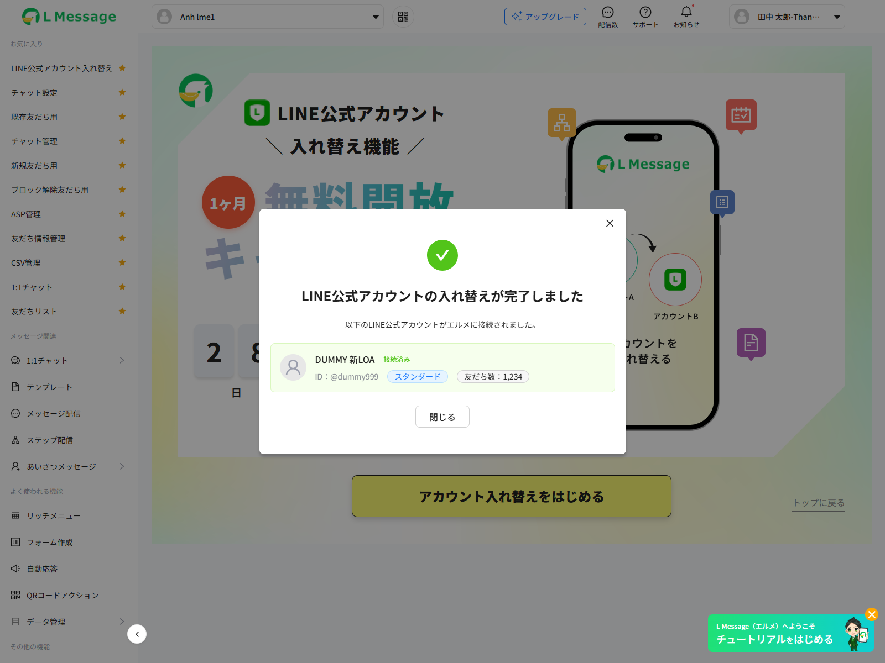

**Nguồn quan sát**: **Render client-side** — bật `showSuccessModal = true` mà **không** bơm `confirmData`. Snapshot `modal-showSuccessModal.txt`.

> **Bằng chứng runtime về trạng thái suy biến (degraded state)**: khi `confirmData` rỗng, modal **vẫn render** nhưng: tên LOA **rỗng**, dòng 「ID：」 **không có giá trị**, 「友だち数：0」 (fallback `'0'` của `.toLocaleString()`), **không có chip gói**; badge 「接続済み」 vẫn hiện vì là chuỗi hardcode trong Blade. → Đây đúng là biểu hiện của rủi ro đã nêu ở mục "Điểm chưa rõ" #21 (`progress()` trả `confirm_data = null`; nếu user F5 giữa chừng rồi job hoàn tất, modal sẽ trông như thế này). **Tin cậy: Cao** cho biểu hiện suy biến.
>
> **Xác nhận field binding**: 5 trường của modal đều bind vào **`confirmData`** (không phải biến riêng): `avatar_url`, `bot_name`, `bot_id_line`, `plan_name`, `friend_count` (`index.blade.php:555-571`). **Tin cậy: Cao**.

| Thành phần | Nội dung / Nguồn |
|-----------|------------------|
| Icon | `check-circle-filled` 64px, màu `#52C41A` |
| Tiêu đề | 「LINE公式アカウントの入れ替えが完了しました」 |
| Mô tả | 「以下のLINE公式アカウントがエルメに接続されました。」 |
| Thẻ tài khoản | avatar `confirmData.avatar_url` / `confirmData.bot_name` / badge 「接続済み」 / 「ID：{confirmData.bot_id_line}」 / `confirmData.plan_name` / 「友だち数：{confirmData.friend_count}」 (`.toLocaleString()`, fallback `'0'`) |
| Nút 「閉じる」 | `lme-button-flat` lg → `closeSuccessModal()` → `showSuccessModal=false` rồi `window.location.href = '/basic/overview'` (`change_new.js:353-356`) |

> ✅ **ĐÃ SỬA so với bản v1**: modal nay bind `confirmData.*` chứ không phải `reservation.*` (`index.blade.php:555-571`). Luồng `immediate` do đó hiển thị đầy đủ tên/ID/gói/số bạn bè lấy từ response `/validate`. Luồng thực thi đặt lịch cũng đúng vì `confirmExecuteReplacement()` gán `confirmData = reservation` trước khi polling (`change_new.js:394`). **Tin cậy: Cao**.

### SCR-CHB-09 — Modal xoá đặt lịch

`index.blade.php:578-612` | `lme-modal` `:header="false"`, `:width="503"`

**Screenshot**: 

**Nguồn quan sát**: **Render client-side** (`showDeleteModal = true` trên nền SCR-CHB-07 giả). Snapshot `modal-showDeleteModal.txt`. Nhãn/nút/bố cục **Cao**; giá trị giả (`DUMMY 予約LOA`, `@dummy999`, 「スタンダード」).

**Xác nhận live**: thứ tự khối trong modal là **header tuỳ biến → mô tả → hộp cảnh báo 「この操作は元に戻せません」 → thẻ tài khoản → footer 2 nút**. Trong modal này thẻ tài khoản **CÓ hiển thị chip gói** 「スタンダード」 (khác SCR-CHB-07 vốn ẩn `plan_name`). **Tin cậy: Cao**.

| Thành phần | Nội dung |
|-----------|---------|
| Header tuỳ biến (`.cb-modal-header-custom`) | icon `delete-outlined` đỏ + 「接続予約を削除」 + icon `close-outlined` (→ `closeDeleteModal()`) |
| Mô tả | 「接続予約を削除すると、事前に設定した接続情報が破棄されます。再度入れ替えを行う場合は、最初から設定し直す必要があります。」 |
| Hộp cảnh báo (`.cb-delete-modal__warning`) | 「この操作は元に戻せません」 / 「削除後に入れ替えを行うには、再度チャネル情報の入力が必要です。」 |
| Thẻ tài khoản | `reservation.avatar_url`, `reservation.bot_name`, 「LINE ID：{reservation.bot_id_line}」, `reservation.plan_name` |
| 「キャンセル」 | `lme-button-flat` md → `closeDeleteModal()` |
| 「削除する」 (icon `delete-outlined`) | `lme-button-risk` type primary md → `confirmDeleteReservation()` |

`confirmDeleteReservation()` (`change_new.js:361-375`):
- `POST /admin/ajax/change-bot/delete-reservation` `{ bot_id, schedule_id }`, có LoadingOverlay.
- Thành công → đóng modal, `reservation.exists = false`, `currentStep='select'`, `selectedMethod=null`.
- `if (!r.success) return;` → **vẫn không thông báo lỗi** (chưa sửa).
- Server set `status = CANCEL(5)`, **không xoá bản ghi** (`ChangeBotController.php:294-303`). Message server 「接続予約を削除しました」 **không được client hiển thị**. **Tin cậy: Cao**.

### SCR-CHB-10 — Modal xác nhận thực thi đổi LOA

`index.blade.php:614-650` | `lme-modal` `:header="false"`, `:width="503"`

**Screenshot**: 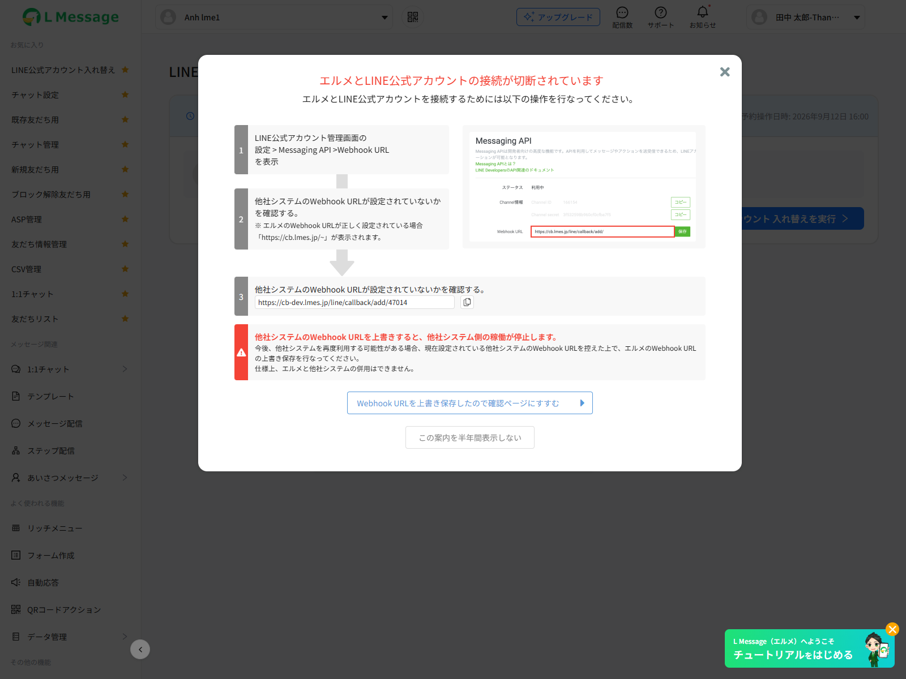

**Nguồn quan sát**: **Render client-side** (`showExecuteModal = true`). Snapshot `modal-showExecuteModal.txt`. Nhãn/nút/bố cục **Cao**; giá trị giả.

**Xác nhận live**: thứ tự khối là **header tuỳ biến 「LINE公式アカウント入れ替えの実行確認」 → mô tả → thẻ tài khoản (có chip gói) → hộp 「入れ替え実行後の注意事項」 3 dòng → footer 「キャンセル」 + 「入れ替えを実行する」**. Lưu ý thứ tự **khác SCR-CHB-09** (ở CHB-09 hộp cảnh báo đứng TRƯỚC thẻ tài khoản, ở CHB-10 đứng SAU). **Tin cậy: Cao**.

| Thành phần | Nội dung |
|-----------|---------|
| Header tuỳ biến | icon `error-outlined` vàng + 「LINE公式アカウント入れ替えの実行確認」 + nút đóng |
| Mô tả | 「以下のLINE公式アカウントへの入れ替えを実行します。この操作を実行すると、現在のアカウントとの接続は解除されます。」 |
| Thẻ tài khoản | `reservation.avatar_url`, `reservation.bot_name`, 「LINE ID：」, `reservation.plan_name` |
| Hộp lưu ý 「入れ替え実行後の注意事項」 | 3 dòng: 「現在のアカウントに紐づくデータは引き継がれません」/「入れ替え処理中はエルメの操作ができなくなります」/「この操作は元に戻すことができません」 |
| 「キャンセル」 | `lme-button-flat` md → `closeExecuteModal()` |
| 「入れ替えを実行する」 (icon `right-outlined`) | `lme-button-default` primary md → `confirmExecuteReplacement()` |

`confirmExecuteReplacement()` (`change_new.js:380-398`):
- `POST /admin/ajax/change-bot/execute-reservation` `{ bot_id, schedule_id }`.
- `r.success = false` → **toast `r.message`**.
- Thành công → đóng modal, `currentStep='processing'`, `confirmData = reservation`, `progress=0`, bắt đầu polling.

### SCR-CHB-11 — Modal quảng bá chiến dịch (toàn hệ thống)

File: `resources/views/basic/modal-campaign-changebot.blade.php`, được `@include` trong header layout Admin/Basic → xuất hiện trên **mọi trang**, không riêng FA-044.

| Thành phần | Chi tiết |
|-----------|---------|
| Container | `#modalCampaignChangebot.mcc-modal`, `display:none`, `z-index:10500` |
| Dialog | 480×480px, nền `/images/campaign-changebot/bg_modal_campaign_change_bot.png` (center/cover), bo 8px |
| Ảnh nội dung | `/images/campaign-changebot/modal-body.png`, `pointer-events:none` |
| Nút đóng | SVG tròn 40px góc trên phải → `closeModalCampaignChangebot()` |
| Nút CTA | Vùng **trong suốt** đè lên ảnh → `openDetailCampaignChangebot()` → `window.location.href = '/admin/change-bots-new/' + botInfo.hash_botId` |
| Nhãn ẩn (a11y) | `#mccTitle.sr-only` 「LINE公式アカウント 入れ替え機能 1ヶ月無料開放」 |

Điều kiện hiển thị `shouldShowModalCampaignChangebot()`: `botInfo.created_at` hợp lệ, chưa bị đóng trong ngày (localStorage `mcc_dismissed_{userId}_{botId}` = `YYYY-M-D`), `Date.now() <= created_at + 1 tháng`, và (`botInfo.plan_type === 2` hoặc `botInfo.contract_type === 'free'`).

#### Observations
- **`showModalCampaignChangebot()` vẫn bắt đầu bằng `return;`** (`modal-campaign-changebot.blade.php:104-105`) → modal **đang bị tắt hoàn toàn**; logic phía sau không chạy. **Xác nhận lại trên nhánh `release_step_20260827` ngày 2026-09-12: vẫn còn nguyên `return;`** → SCR-CHB-11 tiếp tục là **code chết**. **Tin cậy: Cao**.
- **Xác nhận quét live**: trong toàn bộ phiên quét (kể cả bot gói フリー `Anh lme1` — đúng đối tượng mà `shouldShowModalCampaignChangebot()` nhắm tới, `plan_type = 2`, còn trong 1 tháng đầu), modal `#modalCampaignChangebot` **không xuất hiện lần nào** trong cây a11y. **Tin cậy: Cao**.
- Toàn bộ nội dung quảng bá nằm trong ảnh PNG, CTA là vùng trong suốt định vị tuyệt đối → không a11y, không responsive. **Tin cậy: Cao**.

### SCR-CHB-12 — Trang chặn theo gói (Plan blocked)

File: `resources/views/admin/bots/change_bot_plan_blocked.blade.php`. Render bởi `BotController@adminChangeBotSub` khi bot free vi phạm điều kiện.

| Thành phần | Nội dung |
|-----------|---------|
| Trang | HTML trần, **không kế thừa layout**, không header/sidebar; `<title>LOA入れ替え</title>` |
| Hành vi | `alert('スタンダードプラン以上のご契約でご利用できます');` rồi `window.location.href = '/admin/bot-add';` |

Điều kiện chặn (`BotController.php:7288-7292`):

```php
$isFreePlan = $bot->plan_type === 2;
$hasCampaign = $isFreePlan && Carbon::now()->lt(Carbon::parse($bot->created_at)->addMonth()->endOfDay());
if ($isFreePlan && ($typeChange === 'scheduled' || !$hasCampaign)) { → change_bot_plan_blocked }
```

**Nguồn quan sát**: **Live thật** — truy cập `https://form.watermeru.com/admin/change-bot-sub/6darjNPer9oz?type_change=scheduled` với bot gói フリー `Anh lme1`, ngày 2026-09-12. Snapshot `scr-12-plan-blocked.txt`.

**Xác nhận live (chính xác từng bước)**:
1. Trang trả về **hộp thoại `alert()` gốc của trình duyệt** — playwright-cli báo `Modal state: ["alert" dialog with message "スタンダードプラン以上のご契約でご利用できます"]` và **từ chối snapshot** vì trang ở trạng thái modal. → Nội dung alert **khớp chính xác** chuỗi trong code.
2. Sau khi chấp nhận alert → **redirect sang `/admin/bot-add`**, title trang mới là 「LOA選択（プラン選択）」.
3. **Trang không có DOM nào khác** ngoài alert — xác nhận đây là HTML trần không kế thừa layout.

**Tin cậy: Cao** (quan sát trực tiếp). Không có screenshot vì không chụp được trang khi alert đang mở.

> Màn hình này **không còn nằm trên luồng chính FA-044** (vì `goToInput()` không còn điều hướng sang `/change-bot-sub`). Chức năng tương đương nay do guard `#39230` ở backend `ChangeBotController` đảm nhiệm — trả toast 「現在のプランは利用できない機能です。アップグレードが必要になります。」 ngay trong SPA. **Tin cậy: Cao**.

### BLK-WEBHOOK — Modal chặn 「エルメとLINE公式アカウントの接続が切断されています」 ← **MỚI (quét live)**

> **Phạm vi**: modal này **KHÔNG thuộc FA-044** — nó nằm trong layout chung (`layout.v2.basic.main`) và xuất hiện trên mọi trang Admin/Basic của bot có webhook LINE đang ngắt kết nối. Ghi vào đây vì nó là **rào chắn thực tế của luồng FA-044**, cần được mô tả trong user flow.

`#modalWebhookONCallbackFail` | **Screenshot**: 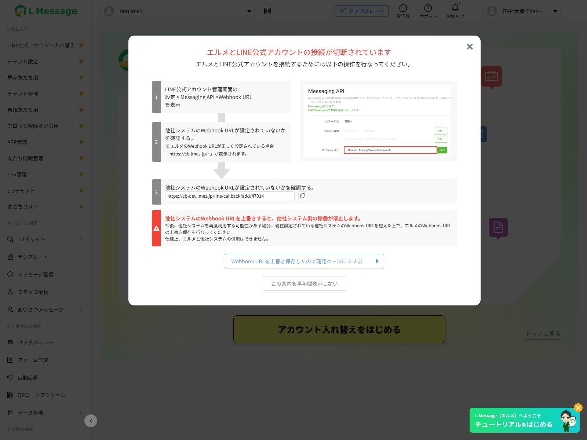

**Nguồn quan sát**: **Live thật** — bot gói フリー `Anh lme1` (hash `6darjNPer9oz`), snapshot `free-plan.txt`, quét 2026-09-12. **Tin cậy: Cao**.

#### Hành vi quan sát được

- Modal **tự bung ngay khi tải trang** `/admin/change-bots-new/{hash}`, **phủ kín phần trên trang** và **chặn mọi thao tác** — bao gồm cả nút 「アカウント入れ替えをはじめる」 của SCR-CHB-01. Trong cây a11y nó là `dialog [active]` **đứng trước** toàn bộ nội dung trang.
- Hệ quả: với bot có webhook OFF, **người dùng không thể bắt đầu luồng FA-044** cho tới khi xử lý xong modal này (bấm 「Webhook URLを上書き保存したので確認ページにすすむ」, hoặc 「この案内を半年間表示しない」, hoặc nút `×`).

#### Nội dung (nguyên văn)

| Vùng | Text 「JP」 |
|------|-----------|
| Tiêu đề (đỏ) | 「エルメとLINE公式アカウントの接続が切断されています」 |
| Mô tả | 「エルメとLINE公式アカウントを接続するためには以下の操作を行なってください。」 |
| Bước 1 | 「LINE公式アカウント管理画面の 設定 > Messaging API >Webhook URL を表示」 |
| Bước 2 | 「他社システムのWebhook URLが設定されていないかを確認する。」 / 「※ エルメのWebhook URLが正しく設定されている場合「https://cb.lmes.jp/~」が表示されます。」 |
| Bước 3 | 「他社システムのWebhook URLが設定されていないかを確認する。」 + ô `textbox [disabled]` chứa Webhook URL của bot + nút copy |
| Hộp cảnh báo đỏ | 「他社システムのWebhook URLを上書きすると、他社システム側の稼働が停止します。」 / 「今後、他社システムを再度利用する可能性がある場合、現在設定されている他社システムのWebhook URLを控えた上で、エルメのWebhook URLの上書き保存を行なってください。」 / 「仕様上、エルメと他社システムの併用はできません。」 |
| Nút chính | 「Webhook URLを上書き保存したので確認ページにすすむ」 |
| Nút phụ | 「この案内を半年間表示しない」 |
| Ảnh minh hoạ | Ảnh chụp màn hình 「Messaging API」 của LINE Developers, có ô Webhook URL viền đỏ + nút 「保存」 xanh |

**Giá trị quan sát được**: ô bước 3 hiển thị `https://cb-dev.lmes.jp/line/callback/add/47014` (môi trường staging), ảnh minh hoạ hiển thị `https://cb.lmes.jp/line/callback/add/` (production). → **Xác nhận dạng Webhook URL thật của hệ thống: `{DOMAIN_ENDPOINT_WEBHOOK}/line/callback/add/{bot_id}`**. **Tin cậy: Cao**.

> ✅ **ĐÃ CHỐT (không còn là điểm mở)**: URL trong modal này có hậu tố **`/{bot_id}`** (`.../add/47014`), trong khi `app/Http/Controllers/Ajax/ChangeBotController.php:127` dựng URL cho SCR-CHB-04 với hậu tố cứng **`/0`**. Đây là **hai giai đoạn của cùng một route** `POST /line/callback/add/{bot_id}` (`routes/web.php:2508`), **có chủ ý**:
> 1. `/0` là **placeholder tiền-swap** — ở SCR-CHB-03/04 chưa tồn tại bản ghi `bots` nào cho LOA mới. Chính helper **thực sự ghi** endpoint lên LINE ở EP-05 cũng hardcode cùng chuỗi `/0` (`app/Helpers/functions.php:5824`) ⇒ URL **hiển thị** và URL **được ghi** là một, không mâu thuẫn nội bộ. Mục đích duy nhất: thoả điều kiện "Webhook đang bật" để `checkWebhook()` (EP-11) đi qua.
> 2. `/{bot_id}` **thật** được worker Java ghi đè ngay ở **step 1 (progress 15)**: `ChangeBotJob.java:163-165, 206` → lưu vào `bots.webhook_url` (`db/db-mapping.md` §9.1 (`:783`)). Vì vậy `47014` chỉ là một `bots.id`, **không phải cột khác**.
> **Tin cậy: Cao** cho sự khác biệt, **Cao** cho lý do.
>
> ⚠ **Hệ quả vận hành — cửa sổ mất sự kiện webhook**: trong khoảng thời gian từ khi EP-05 ghi `/0` lên LOA mới (SCR-CHB-03) cho tới khi worker hoàn tất step 1, LOA mới trỏ webhook vào một URL **không route được tới bot nào**: `callbackWebHook()` nhận `bot_id = "0"`, mà `empty("0")` trong PHP là `true` ⇒ trả `{"status": "Ok"}` và **bỏ qua toàn bộ `events`** mà không lưu gì (`Admin\BotController.php:2005-2011`). ⇒ **Mọi sự kiện LINE phát sinh trong cửa sổ đó bị mất vĩnh viễn** (tin nhắn đến, follow/unfollow…). **Tin cậy: Cao** (đọc trực tiếp source).

## Các nhánh biến thể

### Tham số truyền vào view (`BotController@adminChangeNewBot`, `:7265-7271`)

| Biến | Nguồn | Hidden input | Dùng ở đâu |
|------|-------|-------------|-----------|
| `bot_id` | Hashids decode từ `{id}` | `#botIdChange` (`:16`) | `this.botId` → payload mọi AJAX |
| `bot_slot_id` | query `bot_slot_id` | `#botSlotId` (`:17`) | Gán vào `this.botSlotId` nhưng **không dùng ở đâu cả** |
| `typeChange` | query `type_change` | `#typeChange` (`:18`) | Gán vào `this.typeChange` nhưng **không dùng ở đâu cả** trong `change_new.js` |
| `type` | query `type` | `#typeParam` (`:19`) | `this.typeParam` → gửi kèm `/init`, và `=== 'change_sub'` ép step processing |
| `changeSuccess` | query `change_success` (mặc định `0`) | inline `var changeSuccess` (`:657`) | `changeSuccess == 1` → step khởi tạo là `processing` |
| `hash_id`, `username` | `Hashids::encode($bot_slot_id)`, `Auth::user()->username` | — | **Không được view này dùng** |

### Nhánh `type=change_sub`

| Ảnh hưởng | Chi tiết |
|----------|---------|
| Backend `/init` | Mở rộng tập status quan tâm thêm `DONE(3)` — nhưng dòng `whereIn('status', $status)` vẫn bị **comment** (`ChangeBotController.php:54`), nên biến `$status` **không có tác dụng** |
| Frontend | Ép `currentStep = 'processing'` không cần biết trạng thái thực (`change_new.js:135`) |

### Nhánh `typeChange` (`type_change=immediate|scheduled`)
Chỉ có ý nghĩa ở route `/admin/change-bot-sub/{id}` (guard chặn gói free với `scheduled`). Trên màn hình FA-044 nó là **biến không dùng**.

### Nhánh `changeSuccess`
`?change_success=1` → mở thẳng SCR-CHB-06. Do `schedule_id` lúc đó còn `null`, polling chỉ khởi động nếu `/init` trả về `schedule_id` (`change_new.js:138`).

### Nhánh theo gói & chiến dịch

| `is_free_plan` | `has_campaign` | Hành vi |
|---------------|---------------|---------|
| `false` (gói trả phí) | `false` | Dùng đầy đủ cả 2 phương thức |
| `true` | `true` (trong 1 tháng kể từ `bots.created_at`) | Hiện SCR-CHB-01 (nếu chưa có reservation/processing); ở SCR-CHB-02 chỉ dùng được `immediate`, thẻ `scheduled` bị khoá |
| `true` | `false` (quá 1 tháng) | Toàn bộ khối lựa chọn bị phủ khoá, chỉ còn đường nâng gói `/admin/bot-add` |

Backend tính (`ChangeBotController@init`, `:58-59`):

```php
$campaignChangeBot = Carbon::parse($bot->created_at)->addMonth()->endOfDay();
$hasCampaign = $bot->plan_type === 2 && Carbon::now()->lt($campaignChangeBot);
```

`is_free_plan` = `$bot->plan_type === 2` (`bots.plan_type`: `1 = standard`, `2 = free`).

**Guard gói cước ở backend (ticket #39230)** — `ChangeBotController::botCanChangeBot()` (`:26-37`):

```php
$isFreePlan = (int) $bot->plan_type === 2;
if (!$isFreePlan) return true;
if ($type === null || $type === ScheduleChangeBot::TYPE['SCHEDULED']) return false;
return Carbon::now()->lt(Carbon::parse($bot->created_at)->addMonth()->endOfDay());
```

Áp dụng ở 2 nơi, **cả 2 đều hiển thị được lên UI**:

| Endpoint | Key trả về | Nơi hiển thị |
|---------|-----------|-------------|
| `POST /execute` (`:208-218`) | `msg` | Toast đỏ tại SCR-CHB-05 qua `executeConnect()` |
| `POST /execute-reservation` (`:311-317`) | `message` | Toast đỏ tại SCR-CHB-10 qua `confirmExecuteReplacement()` |

Thông điệp: 「現在のプランは利用できない機能です。アップグレードが必要になります。」 **Tin cậy: Cao**.

### Nhánh theo trạng thái schedule tại `/init` (`change_new.js:140-148`)

| Điều kiện | Hành vi |
|----------|---------|
| `schedule.status == 4` (ERROR) | Toast `'ERROR'` (chuỗi literal, **không** phải `message_error`) |
| `schedule.status != 0 && != 2` và step hiện tại không phải `processing` | Ép về `select`, `selectedMethod = null` |

## Tiến trình nền (background job) — xác nhận CÓ

`src/job/linect-service` @ `release-t07-2026`:

| Thành phần | Đường dẫn | Vai trò |
|-----------|----------|--------|
| `ChangeBotTask` | `src/main/java/sns/line/task/ChangeBotTask.java` | Scanner đa luồng (`ConfigFile.MAX_CHANGE_BOT_THREAD`) quét `schedule_change_bots` với `status = 1 (WAITING)` qua `findTop50ByStatusOrderByIdAsc`; chặn 2 bản ghi cùng `bot_id` chạy song song bằng `activeBotIds` |
| `ChangeBotJob` | `src/main/java/sns/line/threads/changebot/ChangeBotJob.java` | Worker xử lý 1 bản ghi, chia **6 step** |
| `ChangeBotConstants` | cùng package | `PROGRESS_STEP_1..6` = **15 / 30 / 45 / 60 / 80 / 100** |
| `ScheduleChangeBotRepository` | `.../repository/ScheduleChangeBotRepository.java` | `markProcessing` (status 2, progress 0, chỉ khi status=1), `updateProgress`, `markDone` (status 3, progress 100), `markError` (status 4) |

Ánh xạ % ↔ bước (dùng để giải thích thanh tiến độ ở SCR-CHB-06):

| % | Bước job | Nội dung |
|---|---------|---------|
| 0 | `markProcessing` | Khoá bản ghi, chuyển `status = PROCESSING` |
| 15 | `step1Recreate` | Set webhook + tạo LIFF + cập nhật bot info + QR + dựng lại richmenu trên channel mới; `botRepo.swapChannelForChangeBot(...)` đổi credential trong `bots` |
| 30 | `step2DataCleanup` | Xoá dữ liệu bạn bè / hội thoại của LOA cũ |
| 45 | `step3MessageCleanup` | Xoá lịch sử tin nhắn |
| 60 | `step4FormEventCleanup` | Xoá form answer / event detail |
| 80 | `step5InfoCalendarCleanup` | Xoá thông tin + huỷ kết nối Google Calendar |
| 100 | `step6FinalCleanup` + `markDone` | Dọn cuối, `status = DONE` |

Docblock trong `ChangeBotTask` xác nhận job này **thay thế** method PHP `BotController::changeNewBotStep1` cũ. **Tin cậy: Cao** (đọc trực tiếp source). Chi tiết đầy đủ thuộc phạm vi `/spec-job`.

## User Flows

### Flow 0 — Tiền đề trước khi vào được luồng (xác nhận live)

| # | Điều kiện | Nếu không thoả |
|---|----------|---------------|
| 0.1 | URL phải chứa **Hashids của `bots.id`** (VD `1QxJWzneWNne`), **không phải** mã LOA 6 ký tự ở danh sách bot (VD `WqxDdq`) | Redirect `/basic/overview` (thử live) |
| 0.2 | Bot trong URL phải **trùng bot đang chọn trong session** (`getBotId()`) | Redirect `/basic/overview` (`BotController.php:7262`) |
| 0.3 | Bot **không được ở trạng thái webhook LINE bị ngắt kết nối** | Modal toàn cục `#modalWebhookONCallbackFail` bung ra **phủ kín trang và chặn mọi thao tác**, kể cả nút 「アカウント入れ替えをはじめる」 của SCR-CHB-01 → **không bắt đầu được luồng**. Xem §BLK-WEBHOOK. **Tin cậy: Cao** (quan sát live) |
| 0.4 | Gói cước: bot **フリー** chỉ vào được nhánh `immediate`, và chỉ trong 1 tháng kể từ `bots.created_at` | Thẻ 「予約」 bị khoá (SCR-CHB-02F) hoặc cả 2 thẻ bị khoá |

### Flow A — Đổi ngay (IMMEDIATE), happy path

1. Vào `/admin/change-bots-new/{hash_id}` → `mounted()` đọc 4 hidden input → `GET /admin/ajax/change-bot/init`.
2. Không có reservation, không processing → SCR-CHB-02 (hoặc SCR-CHB-01 trước nếu đang trong campaign).
3. Chọn thẻ 「すぐにLINE公式アカウントを入れ替える」 → bật nút 「次に進む」.
4. Bấm 「次に進む」 → `goToInput()` → **SCR-CHB-03 ngay trong trang**. (Nếu bấm 「キャンセル」 ở SCR-CHB-03 để quay lại: **lựa chọn phương thức được giữ nguyên**, nút 「次に進む」 vẫn enabled — `cancelInput()` không reset `selectedMethod`, `change_new.js:231-233`.)
5. Nhập 4 field channel; mỗi lần đổi `channel_id`/`channel_secret` → sau 600ms tự `POST /set-webhook` (LINE API đặt webhook endpoint, im lặng).
6. Bấm 「次に進む」 → `POST /validate` → server gọi LINE API (`lineChanelAccessToken`, `lineFollowers`, `getLineInfoBot`, `lineLoginAccessToken`, `getLimitMessageLine`) → trả thông tin LOA + `webhook_url` → **SCR-CHB-04**.
7. Copy Webhook URL, dán vào LINE Developers, bật 「Webhookの利用」, rồi bấm 「接続情報の確認にすすむ」 → `POST /check-webhook` → nếu webhook đã bật → **SCR-CHB-05**.
8. Bấm 「この内容で接続する」 → `POST /execute` → guard gói (#39230) + guard trùng schedule → INSERT `schedule_change_bots` với `type=1`, `status=WAITING(1)` → **SCR-CHB-06**.
9. `ChangeBotTask` (Spring Boot) nhận bản ghi WAITING → `markProcessing` → 6 step, cập nhật `progress` 15→100.
10. Client polling `/progress` mỗi 3s → khi `status=DONE(3)` → `completed=true` → **SCR-CHB-08**.
11. Bấm 「閉じる」 → chuyển về `/basic/overview`.

### Flow B — Đặt lịch (SCHEDULED), happy path

1–7. Như Flow A nhưng chọn thẻ 「LINE公式アカウント入れ替え予約をする」 (gói free không chọn được).
8. Bấm 「この内容で接続する」 → `POST /execute` với `type=scheduled` → INSERT `schedule_change_bots` `type=2`, `status=DRAFT(0)` → client dựng `reservation` từ `confirmData` → **SCR-CHB-07**.
9. Lần vào trang sau: `/init` thấy schedule → trả `reservation.exists = true` (dữ liệu **lấy live từ LINE API** dựa trên `channel_id_new`/`channel_secret_new` đã lưu) → vào thẳng SCR-CHB-07.

#### B1 — Xoá đặt lịch
SCR-CHB-07 → 「接続予約を削除」 → SCR-CHB-09 → 「削除する」 → `POST /delete-reservation` → `status = CANCEL(5)` → về SCR-CHB-02.

#### B2 — Thực thi đặt lịch
SCR-CHB-07 → 「LINE公式アカウント 入れ替えを実行」 → SCR-CHB-10 → 「入れ替えを実行する」 → `POST /execute-reservation` → guard gói #39230 + 3 guard nghiệp vụ → `status = WAITING(1)` → SCR-CHB-06 + polling.

### Error cases

| # | Tình huống | Nơi phát hiện | Thông điệp 「JP」 | Hiển thị trên UI |
|---|-----------|--------------|-----------------|-----------------|
| E1 | Thiếu field / vượt 500 ký tự | `ChangeBotRequest::rules()` + `messages()` | 「チャネルIDを入力してください」/「チャネルIDは500文字以内で入力してください」 (4 field × 2 rule) | Lỗi dưới từng field qua `formErrors` (SCR-CHB-03) ✔ |
| E2 | LOA mới đã kết nối L Message rồi | `ChangeBotRequest::withValidator` (`:33-43`, check `bots.channel_id` + `is_deleted=0`) | 「このLINE公式アカウントは、すでにL Messageに接続されています。 ご不明な場合は、サポート窓口までお問い合わせください 」 | Lỗi dưới field `channel_id` ✔ |
| E3 | Sai channel ID/secret Messaging API | `validateChannel` — `lineChanelAccessToken` rỗng | 「入力した情報に誤りがありますので、入力情報を再度ご確認ください。ご不明な場合は、サポート窓口までお問い合わせください。」 | Toast đỏ ✔ |
| E4 | Không lấy được thông tin bot | `getLineInfoBot` rỗng | 「認証できませんでした。」 | Toast đỏ ✔ |
| E5 | Token hợp lệ nhưng thiếu `userId` | `validateChannel:114` | 「入力した情報が間違っています。再確認してください。」 | Toast đỏ ✔ |
| E6 | Sai channel LINE Login | `lineLoginAccessToken` rỗng | 「入力した情報に誤りがありますので、…」 | Toast đỏ ✔ |
| E7 | **Webhook chưa bật** | **`checkWebhookEnabled`** (`:168-171`) — endpoint mới, tại SCR-CHB-04 | 「Webhookをオンにして下さい。 既にオンの場合は、一度オフにしてから再度オンに変更して下さい。」 | Toast đỏ ✔, đứng lại SCR-CHB-04 |
| E7b | Thiếu channel_id/secret khi check webhook | `checkWebhookEnabled:159-161` | 「入力情報が不足しています。」 | Toast đỏ ✔ |
| E8 | Đặt webhook endpoint thất bại (auto) | `setWebhook` → `setWebhookUrl` false | 「Webhookエンドポイントの設定に失敗しました」 | **Không hiển thị** — JS chỉ có `.fail()` reset key |
| E9 | Đang có tiến trình đổi (DRAFT/WAITING/PROCESSING) khi submit | `execute():221-231` | 「LOA変更処理中のため、変更できません。処理完了後に再度お試しください。」 (key **`msg`**) | **Toast đỏ ✔** — đã sửa: `showToast(r.msg \|\| 'Error')` |
| **E9b** | **Bị chặn bởi gói cước (#39230)** khi submit `/execute` | `botCanChangeBot()` (`:208-218`) — bot free chọn đặt lịch, hoặc bot free hết campaign | 「現在のプランは利用できない機能です。アップグレードが必要になります。」 (key `msg`) | **Toast đỏ ✔** tại SCR-CHB-05 |
| E9c | Race condition 2 tab cùng submit | `PlanLimitGuard::rollbackIfOverLimit` (`:248-264`) — đếm lại sau INSERT, xoá bản vừa tạo | 「LOA変更処理中のため、変更できません。…」 (key `msg`) | Toast đỏ ✔ |
| E10 | Thực thi reservation khi đang có tiến trình | `executeReservation():318-319` | như E9 (key `message`) | Toast đỏ ✔ |
| **E10b** | **Bị chặn bởi gói cước (#39230)** khi thực thi reservation | `executeReservation():311-317` | 「現在のプランは利用できない機能です。アップグレードが必要になります。」 | Toast đỏ ✔ tại SCR-CHB-10 |
| E11 | LOA đích của reservation đã thành bot đang hoạt động | `executeReservation():325-328` | 「このLINE公式アカウントは、すでにL Messageに接続されています。ご不明な場合は、サポート窓口までお問い合わせください。」 | Toast đỏ ✔ |
| E12 | LOA đích trùng với reservation khác đang WAITING/PROCESSING | `executeReservation():330-337` | 「LOA変更処理中のため、変更できません。処理完了後に再度お試しください。」 | Toast đỏ ✔ |
| E13 | Tiến trình chuyển sang ERROR(4)/CANCEL(5) | `progress():288` | `message_error` từ DB, fallback `'Error'` | Toast đỏ, **màn hình vẫn đứng ở SCR-CHB-06** |
| E14 | Bot không tồn tại / truy cập chéo tài khoản | `adminChangeNewBot:7262` | — | Redirect `/basic/overview` |
| E15 | Xoá reservation thất bại | `confirmDeleteReservation` | (server có `message` nhưng client bỏ qua) | **Không hiển thị** — `if (!r.success) return;` |
| E16 | `schedule_id` không thuộc bot hiện tại | `progress` / `deleteReservation` / `executeReservation` | HTTP 404 `Schedule not found` | Không xử lý ở client → `.done()` không chạy → **im lặng**, polling tiếp tục |
| E17 | Bot bị `is_deleted` | `init()` / `execute()` | HTTP 404 `Bot not found` | Không xử lý ở client — `/init` fail thì trang đứng ở `select` với dữ liệu mặc định |
| E18 | Job xử lý lỗi (bot không tồn tại, thiếu channel mới, exception) | `ChangeBotJob.process()` → `markError` | `status = 4`; `message_error` **không thấy job ghi** trong các nhánh đã đọc | Toast `'Error'` (fallback) qua E13 |

## Flow Diagram

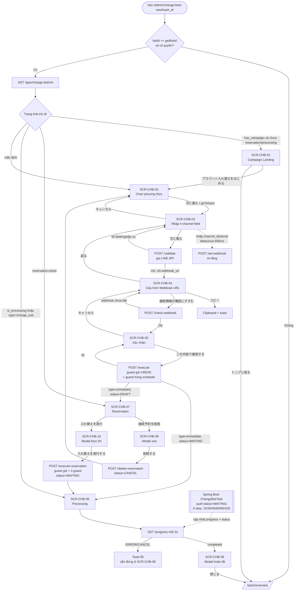

## State machine của tiến trình đổi LOA

Bảng `schedule_change_bots`, cột `status` (`app/ScheduleChangeBot.php:16-23`).

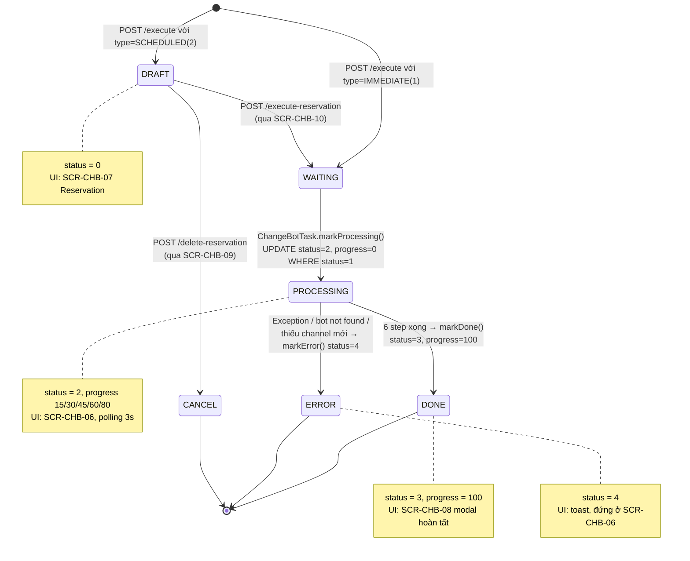

Ánh xạ UI ↔ status khi tải lại trang (`/init` + `change_new.js:130-148`):

| Status | Giá trị | `is_processing` | `reservation.exists` | Màn hình hiển thị |
|--------|--------|----------------|---------------------|------------------|
| DRAFT | 0 | false | true | SCR-CHB-07 |
| WAITING | 1 | false | true | Vào SCR-CHB-07 rồi **bị ép về SCR-CHB-02** bởi `change_new.js:144-147` (⚠ dù job sắp nhận việc) |
| PROCESSING | 2 | **true** | true | SCR-CHB-06 |
| DONE | 3 | false | true | Vào SCR-CHB-07 rồi bị ép về SCR-CHB-02 |
| ERROR | 4 | false | true | Toast `'ERROR'` + ép về SCR-CHB-02 |
| CANCEL | 5 | false | true | Ép về SCR-CHB-02 |

> **Lỗ hổng trạng thái (vẫn còn)**: `init()` **không lọc theo status** (dòng `whereIn` bị comment, `:54`), chỉ lấy bản ghi mới nhất theo `id DESC`. Do đó `reservation.exists = true` cả khi schedule đã DONE/ERROR/CANCEL — mâu thuẫn được "chữa cháy" bằng đoạn ép step ở `change_new.js:140-148`. Riêng `WAITING(1)` bị ép về `select` **dù job đang chờ nhận việc** → người dùng có thể bấm đổi lần nữa và bị chặn bởi E9 (nay E9 đã có toast). **Tin cậy: Cao**.

## Shared components

Đối chiếu `features/shared/registry.md` (SC-001..SC-007):
- **Không sử dụng** SC-001 (Template Message), SC-002 (Tag Selector), SC-003 (Friend Filter/Segment), SC-004 (Action Settings), SC-005 (Rich Text/Message Editor), SC-006 (Delivery Target Selector), SC-007 (Schedule/Timer Settings).
- SC-007 **không áp dụng** dù tính năng có khái niệm 「予約」: không có bất kỳ input ngày/giờ nào — 「予約」 nghĩa là "đăng ký sẵn thông tin, chờ bấm thực thi thủ công", không phải hẹn giờ.

Pattern dùng chung phát hiện tại FA-044 (đã cập nhật vào `features/shared/pending-refs.md`):

| Pattern | Vị trí trong FA-044 | Ghi chú |
|--------|--------------------|--------|
| Account Card 「アカウントカード」 | SCR-CHB-05, 07, 08, 09, 10 (**5 lần**, class `.cb-account-card`, cùng SVG avatar fallback 48px + `altImageAvatar`) | Ứng viên SC mới — nhiều khả năng trùng với thẻ hiển thị LOA ở luồng `bot_add_v3` |
| Risk Confirm Modal | SCR-CHB-09 (`lme-button-risk`) / SCR-CHB-10 (`lme-button-default`) | Pattern header tuỳ biến `.cb-modal-header-custom` + hộp cảnh báo + footer 2 nút |
| Step Indicator biến thể "numbered section" | SCR-CHB-03 (số 1, 2) + SCR-CHB-04 (số 3) — `.cb-input__section-number` **trải qua 2 màn hình liên tiếp** | **Không** khớp pattern đang chờ (FA-039 horizontal, FA-042 vertical sidebar) — biến thể thứ 3 |
| Copy-to-clipboard Field | SCR-CHB-04 (`.cb-webhook__url-row` + nút 「コピー」 + toast xác nhận + fallback `execCommand`) | **Mới ở bản v2** — ứng viên SC, cần đối chiếu với các màn hình hiển thị URL/token khác (LIFF, webhook, short URL) |

**Bổ sung từ quét live 2026-09-12:**

| Pattern | Bằng chứng runtime mới | Ghi chú cho việc tách SC |
|--------|----------------------|------------------------|
| **Account Card** | Xác nhận **3 biến thể hiển thị khác nhau trong cùng FA-044**: (a) **đầy đủ** — SCR-CHB-05: avatar + tên + badge 「有効」 + 「LINE ID：」 + chip gói + chip 「友だち数：1,234」; (b) **có chip gói, không có 友だち数** — SCR-CHB-09/10: avatar + tên + 「LINE ID：」 + chip gói; (c) **rút gọn nhất** — SCR-CHB-07: chỉ avatar + tên + 「LINE ID：」. Nguồn: `scr-chb-05-confirm.txt`, `modal-showDeleteModal.txt`, `modal-showExecuteModal.txt`, `scr-chb-07-reservation.txt` | Khi tách SC phải hỗ trợ **bật/tắt từng chip** (badge trạng thái, chip gói, chip số bạn bè) chứ không phải 1 layout cố định |
| **Risk Confirm Modal** | **Thứ tự khối KHÁC nhau giữa 2 biến thể**: SCR-CHB-09 đặt hộp cảnh báo **trước** thẻ tài khoản; SCR-CHB-10 đặt hộp lưu ý **sau** thẻ tài khoản | Khi tách SC cần slot linh hoạt, không cố định thứ tự |
| **Copy-to-clipboard Field** | Xác nhận live nhãn + nút 「コピー」 ở SCR-CHB-04 (`scr-chb-04-webhook.txt`). **Phát hiện thêm 1 instance ngoài FA-044**: modal layout chung `#modalWebhookONCallbackFail` cũng có `textbox [disabled]` + nút copy (`free-plan.txt`, `blocker-modal-webhook-off.png`) → tăng thêm cơ sở để tách SC | Instance ở modal chung dùng `<input disabled>` thay vì `<div>` hiển thị → thêm 1 biến thể markup |
| **Banner thông báo theo gói/campaign** (ứng viên MỚI) | SCR-CHB-02F: dải banner gradient xanh lá full-width, icon `info-circle-filled` + tiêu đề trắng + nhãn nhấn màu vàng + dòng phụ đếm ngược (`free-select.txt`, `scr-chb-02-select-free-plan.png`) | Cần đối chiếu với các tính năng khác có banner nâng gói / banner campaign trước khi tạo SC |
| **Lock Overlay theo gói** (ứng viên MỚI) | SCR-CHB-02F: overlay xám bán trong suốt trùm phần tử + icon ổ khoá + text 「スタンダードプラン以上のご契約でご利用できます」, đồng thời **gỡ `cursor:pointer`** khỏi phần tử bị khoá (`free-select.txt`) | Pattern "khoá tính năng theo gói" nhiều khả năng lặp ở các tính năng 有料プラン限定 → cần theo dõi |

## Phát hiện mới từ quét live (2026-09-12)

> Toàn bộ các mục dưới đây **KHÔNG có trong bản v2 code-first**, hoặc có nhưng nay được **xác nhận/đính chính bằng bằng chứng runtime**. Nguồn dẫn kèm `file:line` (source) hoặc tên file snapshot/screenshot (runtime).

| # | Phát hiện | Bằng chứng | Ảnh hưởng | Tin cậy |
|---|----------|-----------|----------|--------|
| L1 | **Đường vào tính năng**: sidebar 「エルメシステム設定」 → 「LINE公式アカウント入れ替え」, URL `/admin/change-bots-new/{hash_bot_id}`. Trên tài khoản quét, mục này đã được ghim vào 「お気に入り」 | `main.txt` (link + `/url`) | Bổ sung mục 「Đường vào tính năng」 vào spec | **Cao** cho URL/link; **Trung bình** cho vị trí trong cây menu gốc |
| L2 | **`hash_bot_id` = Hashids của `bots.id`**, chuỗi ~12 ký tự (`1QxJWzneWNne` ↔ `bot_id = 541`). **KHÔNG phải** mã LOA 6 ký tự ở cột danh sách bot (`WqxDdq`) — nhập mã đó bị **redirect `/basic/overview`**. Cũng redirect nếu bot trong URL khác bot trong session | Thử live; `BotController.php:7262`; `network/main.txt` | Tránh hiểu nhầm khi viết hướng dẫn/test case | **Cao** |
| L3 | **API khi load trang**: `GET /admin/ajax/change-bot/init?bot_id={id}&type=` → **HTTP 200 OK** | `raw/features/change-bot/network/main.txt` dòng 60: `.../init?bot_id=541&type= => [200] OK` | Xác nhận EP init hoạt động thật (không còn nghi vấn "dummy") | **Cao** |
| L4 | **Biến thể SCR-CHB-02F (gói フリー + campaign)**: banner gradient xanh lá 「LINE公式アカウント入れ替え機能」 + 「無料開放キャンペーン」 (chữ vàng) + 「キャンペーン終了まであと：28日07時間40分」; thẻ 「…予約をする」 **bị khoá** — **mất `[cursor=pointer]`**, phủ overlay xám, có icon ổ khoá + 「スタンダードプラン以上のご契約で」/「ご利用できます」; nút 「次に進む」 vẫn `disabled` | `free-select.txt`; `scr-chb-02-select-free-plan.png`; `index.blade.php:113-122, 186-189` | Thêm màn hình SCR-CHB-02F | **Cao** |
| L5 | **Nhánh `immediate` và `scheduled` render SCR-CHB-03 GIỐNG HỆT NHAU** — `diff scr-03-input.txt scheduled-next.txt` chỉ khác số `ref=eNNN` của playwright-cli; md5 ảnh trùng khớp. Không có dấu hiệu thị giác nào phân biệt | `scr-03-input.txt` vs `scheduled-next.txt` | Vấn đề UX: user mất dấu phương thức đã chọn từ SCR-CHB-03 tới SCR-CHB-05 | **Cao** |
| L6 | **Lựa chọn phương thức được giữ lại khi bấm 「キャンセル」 ở SCR-CHB-03**: `cancelInput()` chỉ đặt `currentStep = 'select'`, **không** reset `selectedMethod` → về SCR-CHB-02 thì nút 「次に進む」 **vẫn enabled** | `change_new.js:231-233` (`cancelInput`) đối chiếu `change_new.js:157-161` (`goToInput`) và `:370-373` (reset trong `confirmDeleteReservation`) | Hành vi đúng hay sai cần chốt với nghiệp vụ; hiện là "ghi nhớ lựa chọn" | **Cao** |
| L7 | **SCR-CHB-12 xác nhận live**: `/admin/change-bot-sub/{hash}?type_change=scheduled` với bot フリー → **`alert()` gốc trình duyệt**, nội dung chính xác 「スタンダードプラン以上のご契約でご利用できます」; sau OK → **redirect `/admin/bot-add`** (title 「LOA選択（プラン選択）」); **trang không có DOM nào khác** | `scr-12-plan-blocked.txt` (playwright-cli báo `Modal state: ["alert" dialog…]` và từ chối snapshot) | Xác nhận mô tả code-first đúng 100% | **Cao** |
| L8 | **SCR-CHB-11 vẫn là code chết** trên nhánh `release_step_20260827`: `showModalCampaignChangebot()` vẫn mở đầu bằng `return;`. Trong phiên quét (kể cả trên bot フリー đúng đối tượng) modal **không xuất hiện lần nào** | `resources/views/basic/modal-campaign-changebot.blade.php:104-105`; toàn bộ snapshots | Giữ nguyên kết luận v2 | **Cao** |
| L9 | **LỖI CHÍNH TẢ (xác nhận hiển thị thật trên UI)**: SCR-CHB-04 có link 「**LL**INE Developersコンソールを開く ↗」 — thừa 1 chữ `L` | Source: `resources/views/admin/bots/change_bot_new/index.blade.php:381`; Runtime: `scr-chb-04-webhook.txt` (`generic [ref=e422]: LLINE Developersコンソールを開く ↗`) | **Lỗi hiển thị thật với người dùng cuối** — cần sửa | **Cao** |
| L10 | **KHÔNG NHẤT QUÁN THUẬT NGỮ**: SCR-CHB-05 dùng 「LINEログイン**チャンネル**」 trong khi mọi nơi khác trong cùng tính năng dùng 「チャネ**ル**」 (「メッセージングAPIチャネル」,「チャネルID」,「チャネルシークレット」,「LINEログインチャネル」 ở SCR-CHB-03) | Source: `index.blade.php:451` (`<div class="cb-confirm__section-title">LINEログインチャンネル</div>`) — **là dòng duy nhất** dùng 「チャンネル」 trong file (grep `チャンネル` = 1 hit); Runtime: `scr-chb-05-confirm.txt` (`generic [ref=e433]: LINEログインチャンネル`) | Lỗi thuật ngữ hiển thị thật; LINE chuẩn hoá là 「チャネル」 | **Cao** |
| L11 | **Channel secret được che ở SCR-CHB-05**: hiển thị qua `confirmData.messaging_api.channel_secret_masked` / `confirmData.line_login.channel_secret_masked` (`index.blade.php:445, 457`). Giá trị quan sát được dạng `abcd****wxyz` / `efgh****stuv` | Source mask: `ChangeBotController.php:143, 149` = `substr(secret,0,3) . '••••••••••••' . substr(secret,-3)`; Runtime: `scr-chb-05-confirm.txt` | ⚠ Đây là **mask ở TẦNG HIỂN THỊ**. Giá trị `abcd****wxyz` quan sát được là **dữ liệu giả bơm client**, KHÔNG phải output thật của server (định dạng server là 3 ký tự + 12 dấu `•` + 3 ký tự). **ĐỪNG kết luận API không còn trả secret thô** — response `/validate` vẫn trả `channel_access_token` + `channel_access_token_line_login` (`ChangeBotController.php:136-137`). → **`web-analyzer` phải kiểm chứng chính xác payload `/validate` trả về gì** | **Cao** (mask tồn tại) / **Thấp** (định dạng thật khi chạy) |
| L12 | **Modal chặn ngoài tính năng `#modalWebhookONCallbackFail`**: với bot có webhook LINE ngắt kết nối, layout chung bắn modal 「エルメとLINE公式アカウントの接続が切断されています」 **phủ kín trang change-bot và chặn mọi thao tác**, kể cả nút 「アカウント入れ替えをはじめる」 của SCR-CHB-01 | `free-plan.txt` (`dialog [active]` đứng trước nội dung trang); `blocker-modal-webhook-off.png`; `scr-chb-01-campaign.png` (ảnh SCR-CHB-01 bị chính modal này che) | Thuộc layout chung, **không thuộc FA-044**, nhưng là rào chắn thực tế → đã thêm §BLK-WEBHOOK + Flow 0 | **Cao** |
| L13 | **Trường dữ liệu modal 完了 (SCR-CHB-08) bind vào `confirmData`** (không phải biến riêng): `avatar_url`, `bot_name`, `bot_id_line`, `plan_name`, `friend_count`. Khi `confirmData` rỗng, modal vẫn render với tên rỗng / 「ID：」 rỗng / 「友だち数：0」 / không chip gói, badge 「接続済み」 vẫn hiện (hardcode) | `index.blade.php:555-571`; `modal-showSuccessModal.txt` + `modal-showSuccessModal.png` | Xác nhận trực quan rủi ro #21 | **Cao** |
| L14 | **SCR-CHB-07 hiển thị đúng 4 khối**: tiêu đề 「入れ替え予約が設定されています」, dòng 「予約操作日時: {date}」, thẻ LOA (avatar + `bot_name` + 「LINE ID：{bot_id_line}」 — **không có** `plan_name` / 「友だち数」), 2 nút 「接続予約を削除」 + 「LINE公式アカウント 入れ替えを実行」 | `scr-chb-07-reservation.txt`; `index.blade.php:534-535` (2 dòng bị comment) | Xác nhận mô tả v2 đúng | **Cao** |
| L15 | **Webhook URL trong modal chặn có hậu tố `/{bot_id}`** (`https://cb-dev.lmes.jp/line/callback/add/47014`) trong khi URL dựng cho SCR-CHB-04 có hậu tố cứng **`/0`** (`app/Http/Controllers/Ajax/ChangeBotController.php:127`) | `free-plan.txt` (ô `textbox [disabled]`); `blocker-modal-webhook-off.png` | **ĐÃ CHỐT — có chủ ý, không phải bug**: `/0` là **placeholder tiền-swap**. Chính helper ghi endpoint lên LINE cũng hardcode cùng chuỗi `/0` (`app/Helpers/functions.php:5824`), nên URL **hiển thị** và URL **được ghi tự động** là một; nó chỉ cần thoả điều kiện "Webhook đang bật" cho `checkWebhook()` (EP-11). URL thật `/{bot_id}` được worker Java ghi đè ngay ở step 1 (progress 15): `ChangeBotJob.java:163-165, 206`. Xem thêm `db/db-mapping.md` §9.1 (`:783`). ⇒ `47014` trong modal chặn cũng chỉ là một `bots.id`, **không phải cột khác** | **Cao** (khác biệt) / **Cao** (lý do) |
| L16 | **Nhãn field ở SCR-CHB-03 có dấu bắt buộc `*`** (「チャネルID *」,「チャネルシークレット *」) — do `lme-input` render từ prop `required`; bản v2 không ghi nhận | `scr-03-input.txt` | Bổ sung mô tả form | **Cao** |
| L17 | **Cả 4 ô ở SCR-CHB-03 đều là `textbox` thường** trong cây a11y, **không ô nào là password field** → xác nhận 2 field channel secret **thật sự không còn được che** | `scr-03-input.txt` | Nâng mức tin cậy của rủi ro bảo mật #10 từ Trung bình lên **Cao** | **Cao** |
| L18 | **Thứ tự khối trong 2 modal risk KHÁC nhau**: SCR-CHB-09 = header → mô tả → **hộp cảnh báo** → thẻ tài khoản → footer; SCR-CHB-10 = header → mô tả → thẻ tài khoản → **hộp lưu ý** → footer. Ngoài ra 2 modal này **CÓ hiển thị chip gói** trên thẻ tài khoản, khác SCR-CHB-07 (ẩn) | `modal-showDeleteModal.txt`, `modal-showExecuteModal.txt` | Quan trọng khi tách shared component "Risk Confirm Modal" | **Cao** |

## Điểm chưa rõ / cần điều tra

> **Bối cảnh bắt buộc đọc trước bảng này**: tính năng **đã hoàn thiện và đang chạy production** (job Spring Boot `ChangeBotTask`/`ChangeBotJob` tồn tại và xử lý thật). Các marker `dummy` / `TODO` / chuỗi hardcode liệt kê dưới đây là **comment và fallback sót lại từ giai đoạn phát triển**, KHÔNG phải bằng chứng tính năng chưa xong.

| # | Vấn đề | Bằng chứng | Đánh giá | Mức độ tin cậy |
|---|-------|-----------|---------|---------------|
| 1 | Comment `// Change Bot AJAX APIs (dummy)` vẫn còn | `routes/web.php:211` | **Comment lỗi thời** — 8 endpoint AJAX bên dưới đều là code thật đang chạy. Nên xoá comment | Cao |
| 2 | `campaign_countdown` hardcode `'06 日 15 時間 39 分'` | `ChangeBotController.php:89` | **Fallback sót lại**. JS ưu tiên `campaign_change_bot` (giá trị tính thật) nên chuỗi này chỉ lộ ra nếu parse ngày lỗi | Cao |
| 3 | Nhánh `SCHEDULED` của `execute()` trả dữ liệu demo | `ChangeBotController.php:268-276`: `bot_name = 'エルメ公式アカウント名'`, `bot_id_line = '@lme_official'`, `plan_name = 'コミュニケーションプラン'`, `friend_count = 1240` | **Response giả sót lại** — client **không dùng** (dựng `reservation` từ `confirmData`, `change_new.js:308-316`) nên không lộ ra UI. Cần dọn | Cao |
| 4 | `deleteReservation` mang comment `TODO: replace with real DB deletion` | `ChangeBotController.php:293` | Hành vi thật là **soft-cancel** (`status = CANCEL(5)`) — hợp lý về nghiệp vụ (giữ audit trail). Cần chốt: giữ soft-cancel hay hard-delete, rồi xoá TODO | Cao |
| 5 | `executeReservation` mang comment `TODO: replace with real execution logic` | `ChangeBotController.php:305` | Hành vi thật là **đẩy sang `status = WAITING(1)`**, đúng thiết kế — job Spring Boot quét WAITING. TODO lỗi thời | Cao |
| 6 | `/init` không lọc theo status | `ChangeBotController.php:54` `whereIn` bị comment | **Bug thật, vẫn còn** — reservation "sống" cả khi đã DONE/ERROR/CANCEL, phải chữa cháy ở JS | Cao |
| 7 | `bots.campaign_change_bot` không được code đọc | `init()` tính lại từ `bots.created_at + 1 tháng` rồi trả dưới cùng tên key (`:96`); grep toàn `app/` + `resources/` chỉ ra 1 hit duy nhất này | Cột DB có thể là di sản; cần xác nhận có dữ liệu và ai ghi vào | Cao |
| 8 | `showGuide` luôn `false` → nút 「使い方を見る」 và 2 sidebar 動画マニュアル **luôn ẩn** | `change_new.js:76`; 7 chỗ `v-if="showGuide"` trong Blade | Feature flag chưa bật (video manual chưa có nội dung). `redirectManualChangeBot()` thành code không chạy | Cao |
| 9 | Modal campaign toàn hệ thống bị tắt cứng | `modal-campaign-changebot.blade.php:105` `return;` | Vẫn còn | Cao |
| 10 | **2 field channel secret không còn được che** | `index.blade.php:234, 236, 260, 262` — `:type`/`:suffix`/`:show-password` đều bị comment. **Xác nhận live 2026-09-12**: cả 4 ô ở SCR-CHB-03 đều là `textbox` thường trong cây a11y, không ô nào là password field (`scr-03-input.txt`) | Nguy cơ shoulder-surfing — **đã xác nhận biểu hiện thật** | **Cao** (code **và** biểu hiện) |
| 11 | `channel_access_token` + `channel_access_token_line_login` trả về browser | `ChangeBotController.php:136-137` | Cảnh báo bảo mật, vẫn còn | Cao |
| 12 | Secret lưu plaintext + mass assignment mở | `schedule_change_bots.channel_secret*` `varchar(500)` không mã hoá; `ScheduleChangeBot` khai báo `$guarded = []` | Cảnh báo bảo mật | Cao |
| 13 | Lỗi bị nuốt im lặng còn sót | `confirmDeleteReservation` `if (!r.success) return;` (`change_new.js:369`); `set-webhook` `.fail()` không toast | `executeConnect` đã sửa, 2 chỗ này chưa | Cao |
| 14 | Không có CSRF token trong AJAX | `change_new.js` không set header `X-CSRF-TOKEN` | Giả định layout có `$.ajaxSetup` global — **cần xác minh trong `layout.v2.basic.main`** | Trung bình |
| 15 | Không có timeout cho polling | `pollProgress` chạy vô hạn nếu status kẹt ở PROCESSING | Job có thể chạy tới 1 giờ nên hợp lý phần nào, nhưng thiếu chặn trên | Cao |
| 16 | `init()` gọi 4 LINE API mỗi lần load trang | `ChangeBotController.php:66-69` (`lineChanelAccessToken`, `getLineInfoBot`, `lineFollowers`, `getLimitMessageLine`) mỗi lần có schedule | Chậm + tốn quota LINE; không cache | Cao |
| 17 | Lỗi chính tả 「LLINE Developersコンソールを開く」 | `index.blade.php:381`; **xác nhận hiển thị thật** trên runtime (`scr-chb-04-webhook.txt`, `scr-chb-04-webhook.png`) | Hiển thị sai trên UI — người dùng cuối nhìn thấy | Cao |
| **17b** | **Không nhất quán thuật ngữ 「チャンネル」 vs 「チャネル」** | `index.blade.php:451` 「LINEログイン**チャンネル**」 — hit duy nhất của `チャンネル` trong file; mọi nơi khác dùng 「チャネル」. Xác nhận hiển thị thật (`scr-chb-05-confirm.txt`) | Sai thuật ngữ chuẩn của LINE; nên thống nhất về 「チャネル」 | Cao |
| 18 | CSS chết | `.cb-campaign-page__phone*` `:1367+`, `__account*` `:1410-1462`; `.cb-select__card.locked` khai báo 2 lần (`:96`, `:100`) | Dọn dẹp | Cao |
| 19 | `bot_slot_id` / `typeChange` / `hash_id` / `username` truyền vào view nhưng không consumer | `index.blade.php:17-18`, `change_new.js:86-87` | Dọn dẹp | Cao |
| 20 | Trùng lặp cơ chế webhook | `set-webhook` (auto, SCR-CHB-03) + hướng dẫn dán tay (SCR-CHB-04) + `check-webhook` (xác minh) | Cần xác nhận có chủ ý hay không; nếu auto-set thành công thì bước dán tay là thừa với đa số user | Trung bình |
| 21 | `progress()` trả `confirm_data => null` | `ChangeBotController.php:290` | Chưa bao giờ trả dữ liệu thật; UI dựa hoàn toàn vào `confirmData` cũ. Nếu user F5 giữa chừng rồi job xong, modal sẽ hiển thị dữ liệu rỗng | Cao |
| 22 | `message_error` không thấy job ghi | `ScheduleChangeBotRepository.markError` chỉ set `status = 4` | Toast E13 sẽ luôn rơi về fallback `'Error'` → user không biết lỗi gì. Cần rà kỹ ở `/spec-job` | Trung bình |
| 23 | Bảng `schedule_change_bots` **chưa có trong dump DB** | `db/schema/tables/` và `db/data/tables/` không có file | Cần export lại DB để xác nhận index/kiểu cột thực tế | Cao |
| 24 | Hình dạng thực tế của các component `lme-*` | **ĐÃ QUAN SÁT LIVE 2026-09-12** cho `lme-input` (SCR-CHB-03), `lme-breadcrumb` (SCR-CHB-03/04/05), `lme-button-default` / `lme-button-flat` / `lme-button-risk`, `lme-modal` (SCR-CHB-08/09/10) — xem ảnh trong `ui/screenshots/` | Không còn là điểm mở với các màn hình đã chụp | **Cao** cho các màn hình đã chụp; vẫn **Trung bình** cho state chưa chụp (loading overlay, toast, error-message dưới field) |
| 25 | `PlanLimitGuard::FEATURE_CHANGE_BOT` | `ChangeBotController.php:248-264` | Chưa đọc chi tiết service `App\Services\PlanLimitGuard` — cần `web-analyzer` xác nhận cơ chế đếm/rollback | Trung bình |
| **26** | **Toàn bộ SCR-CHB-04/05/06/07/08/09/10 chưa quan sát được bằng thao tác người dùng thật** — được render bằng cách gán `currentStep` / `confirmData` / `reservation` / `progress` trực tiếp vào Vue instance | Cần credential LINE Developers thật của LOA đích + phải submit `/validate`, `/check-webhook`, `/execute` (vi phạm nguyên tắc không thay đổi dữ liệu); không có bản ghi `schedule_change_bots` sẵn có trên 2 bot đã quét | **Nhãn/nút/văn bản tĩnh/bố cục đã xác nhận Cao**. **Chưa xác nhận**: giá trị dữ liệu động thật, định dạng số/ngày thật, hành vi chuyển bước thật, thông báo lỗi thật, `$.LoadingOverlay`, toast | Trung bình |
| **27** | **Chưa quan sát được**: `webhook_url` thật ở SCR-CHB-04 (ô hiển thị rỗng vì `confirmData` không được bơm trường này) | `scr-chb-04-webhook.txt` — nhãn 「発行されたWebhook URL」 có, giá trị không có | Cần quét lại khi có LOA test thật, hoặc `web-analyzer` đọc response `/validate` | Trung bình |
| **28** | **Chưa quan sát được**: biến thể `isFreePlan && !has_campaign` (lớp phủ `.lock-free-plan` trùm cả 2 thẻ) | Cả 2 bot đã quét đều không ở trạng thái này (bot フリー còn 28 ngày campaign) | Chỉ có mô tả code (`index.blade.php:138-143`) | Cao (code) / Thấp (biểu hiện) |
| **29** | **Chưa quan sát được**: polling `/progress` thật, chu kỳ 3s, cập nhật thanh tiến độ theo thời gian thực, và chuyển sang modal 完了 | Không có bản ghi `schedule_change_bots` để poll | `progress = 45` ở ảnh là giá trị bơm tay | Trung bình |
| **30** | **Chưa quan sát được**: mọi thông điệp lỗi E1–E18 trên runtime (toast đỏ, `error-message` dưới field) | Không submit form nên không kích hoạt được nhánh lỗi nào | Nội dung thông điệp vẫn là **Cao** (đọc từ source), nhưng **cách hiển thị** chưa xác nhận | Trung bình |
| **31** | **Định dạng ngày 「予約操作日時」** — quan sát 「2026年9月12日 16:00」, tháng/ngày **không pad 0** | `scr-chb-07-reservation.txt` — nhưng chạy trên giá trị **giả** bơm client | Cần xác nhận với `schedule_change_bots.created_at` thật | Trung bình |
| **32** | **Webhook URL 2 dạng hậu tố**: `/line/callback/add/{bot_id}` (modal chặn layout chung) vs `/line/callback/add/0` (SCR-CHB-04, `app/Http/Controllers/Ajax/ChangeBotController.php:127`) | `free-plan.txt`, `blocker-modal-webhook-off.png` | **ĐÃ CHỐT — có chủ ý** (xem §BLK-WEBHOOK): `/0` là placeholder tiền-swap, cùng chuỗi mà `setWebhookUrl()` ghi lên LINE (`app/Helpers/functions.php:5824`); worker Java ghi đè `/{bot_id}` thật ở step 1 (`ChangeBotJob.java:163-165, 206`; `db/db-mapping.md` §9.1 (`:783`)). **Không cần `web-analyzer` điều tra lại** | Cao (khác biệt) / Cao (lý do) |
| **33** | **Cửa sổ mất sự kiện webhook giữa SCR-CHB-03 và step 1 của worker** — hệ quả vận hành của #32, **chưa tài liệu nào khác nêu** | EP-05 ghi `.../line/callback/add/0` lên LOA mới (`app/Helpers/functions.php:5824`); route `POST /line/callback/add/{bot_id}` (`routes/web.php:2508`) → `callbackWebHook()` nhận `bot_id = "0"`, `empty("0") === true` ⇒ trả `{"status":"Ok"}` và **bỏ qua `events`** (`Admin\BotController.php:2005-2011`) | **Mọi sự kiện LINE (tin nhắn đến, follow/unfollow…) phát sinh trên LOA mới trong cửa sổ này bị mất vĩnh viễn.** Độ dài cửa sổ = thời gian người dùng ở SCR-CHB-03→04→05 + độ trễ hàng đợi worker (quét 30s/lần) + thời gian step 1. Không có cảnh báo nào trên UI | **Cao** (đọc trực tiếp source) |

## Đính chính so với bản v1 — các kết luận đã bị BÁC BỎ

| # | Kết luận SAI của bản v1 | Sự thật trên `release_step_20260805` | Bằng chứng |
|---|------------------------|--------------------------------------|-----------|
| 1 | `goToInput()` điều hướng `window.location.href = '/admin/change-bot-sub/{hash}?type_change=...'`, rời trang | `goToInput()` đặt `this.currentStep = 'input'` + `resetFormErrors()` — **ở lại SPA** | `change_new.js:157-161` |
| 2 | "SCR-CHB-03 (input) và SCR-CHB-04 (confirm) **không tới được**, chỉ là mô tả mã nguồn chứ không phải luồng chạy" | Cả 2 step đều nằm trên **luồng chạy chính**, có thêm step `webhook` chen giữa | `change_new.js:159, 224, 255` |
| 3 | "`/validate`, `/execute`, `/progress` là **code chết trên UI**" (bản v1 đánh số EP-04/EP-05/EP-06; bộ mã hiện hành trong `web/api-spec.md` là **EP-04 `/validate`, EP-06 `/execute`, EP-07 `/progress`**) | Cả 3 endpoint đều được gọi trong luồng thật | `change_new.js:202, 286, 332` |
| 4 | "Luồng thật nằm ở view `bot_add_v3`, bản ghi `schedule_change_bots` được tạo bởi `BotController@step2CheckFriend` (EP-10)" | Bản ghi được tạo bởi `Ajax\ChangeBotController@execute`; `bot_add_v3` **không còn nằm trên luồng FA-044** | `ChangeBotController.php:232-244` |
| 5 | "SCR-CHB-12 (wizard `bot_add_v3`) mới là nơi người dùng thực sự nhập 4 field channel" | 4 field được nhập tại SCR-CHB-03 ngay trong `change_bot_new` | `index.blade.php:229, 233, 254, 258` |
| 6 | "**Backend còn ở trạng thái tạm (dummy)** — tính năng chưa hoàn thiện" | Tính năng **đang chạy production**. Comment `(dummy)` ở routes là comment lỗi thời | `routes/web.php:211` + tồn tại job Spring Boot |
| 7 | "Không tìm thấy Job/Command/Queue nào tiêu thụ `schedule_change_bots`; `progress` mãi = 0, `status` không bao giờ rời WAITING" | Job **tồn tại và hoạt động**: `ChangeBotTask` quét WAITING, `ChangeBotJob` chạy 6 step, cập nhật progress 15→100 rồi `markDone` | `src/job/linect-service/src/main/java/sns/line/task/ChangeBotTask.java`, `.../threads/changebot/ChangeBotJob.java:88-133` |
| 8 | "Modal thành công luồng `immediate` hiển thị **rỗng** vì bind `reservation.*`" | **Đã sửa** — modal bind `confirmData.*` | `index.blade.php:555-571` |
| 9 | "`executeConnect()` nuốt lỗi im lặng (`if (!r.success) return;`)" | **Đã sửa** — `showToast(r.msg \|\| 'Error', 'error')` | `change_new.js:298-301` |
| 10 | "Kiểm tra webhook nằm trong `validateChannel`; lỗi E7 xuất hiện ở bước validate" | **Đã tách** sang endpoint riêng `POST /admin/ajax/change-bot/check-webhook` → `checkWebhookEnabled`, xảy ra ở SCR-CHB-04 | `routes/web.php:214`, `ChangeBotController.php:156-174` |
| 11 | "SCR-CHB-03 có section 3 hướng dẫn bật Webhook + link 「LINE公式アカウント管理画面を開く」" | Section 3 **đã tách thành màn hình riêng SCR-CHB-04** với nội dung mới (Webhook URL + nút copy). `openLineAdmin()` **không còn được Blade nào gọi** | `index.blade.php:288-400`; grep `openLineAdmin` = 0 hit trong Blade |
| 12 | "Ký tự `>` thừa render ra UI tại `index.blade.php:258`" | Không còn — Blade nay đóng tag `lme-input` đúng | `index.blade.php:237-238, 263-264` |
| 13 | "Toggle hiện/ẩn secret hoạt động qua `@suffix-click`" | **Đã bị comment** → 2 field secret không còn che, `toggleSecretVisibility()` thành code không dùng | `index.blade.php:234, 236, 260, 262` |
| 14 | "`cancelConfirm()` → `currentStep = 'input'`" | Nay → `'webhook'` (quay lại SCR-CHB-04) | `change_new.js:323-325` |
| 15 | "Nút 「使い方を見る」 hiển thị ở header các màn hình; sidebar 動画マニュアル hiển thị" | Bị bọc `v-if="showGuide"`, `showGuide` luôn `false` → **luôn ẩn** | `change_new.js:76`; `index.blade.php:97, 214, 277, 294, 391, 408, 509` |
| 16 | "Không có guard gói cước ở backend — POST thẳng endpoint là tạo được bản ghi" | **Đã thêm guard #39230** ở cả `execute()` và `executeReservation()` | `ChangeBotController.php:26-37, 208-218, 311-317` |
| 17 | "Không có bảo vệ race condition khi mở nhiều tab" | **Đã thêm** `PlanLimitGuard::rollbackIfOverLimit` — đếm lại sau INSERT và xoá bản dư | `ChangeBotController.php:245-264` |
| 18 | "SCR-CHB-11 (plan blocked) nằm trên luồng chính; gói free bị chặn bằng `alert()` + redirect" | Trang đó chỉ còn phục vụ route `/change-bot-sub` (ngoài luồng FA-044). Trong FA-044, chặn gói được báo bằng **toast trong SPA** | `change_new.js` không còn tham chiếu `/admin/change-bot-sub` |
| 19 | Bảng mã màn hình cũ (`input`=03, `confirm`=04, `processing`=05, `reservation`=06, modal=07/08/09, campaign modal=10, plan blocked=11, `bot_add_v3`=12) | **Đánh số lại**: chèn `webhook` thành SCR-CHB-04, các màn sau dịch +1; bỏ hẳn màn "wizard `bot_add_v3`" khỏi danh sách | Xem "Bảng tổng hợp màn hình" |
| 20 | "Số section ở màn nhập là 1/2/3 trong cùng 1 màn hình" | Section 1/2 ở SCR-CHB-03, section 3 ở SCR-CHB-04 — numbering **trải qua 2 màn hình** | `index.blade.php:222, 247, 311` |
