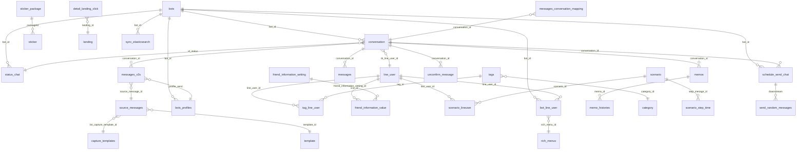

# [FA-001] Chat 1:1 — DB Mapping

## Tong quan
- **Ma tinh nang**: FA-001
- **Ten**: Chat 1:1
- **Phan tich boi**: db-mapper agent
- **Nguon**: logic-spec.md, api-spec.md, job-spec.md, db-hint.md, DB schema

---

## 1. Primary Tables

Cac bang chinh ma tinh nang Chat 1:1 doc/ghi truc tiep.

| # | Bang | Connection | Vai tro trong Chat 1:1 | Doc/Ghi | Confidence |
|---|------|------------|----------------------|---------|------------|
| 1 | `conversation` | mysql | Bang trung tam — luu trang thai hoi thoai, lien ket friend-bot, bookmark, hide, status | Doc + Ghi | **Cao** |
| 2 | `messages_v2s` | mysql_message | Tin nhan moi (tu 2023+) — luu noi dung, loai, nguoi gui, profile gui | Doc + Ghi | **Cao** |
| 3 | `messages` | mysql_message | Tin nhan cu (truoc migrate) — fallback khi `messages_v2s` khong du | Doc | **Cao** |
| 4 | `line_user` | mysql | Thong tin nguoi dung LINE — ten, avatar, email, SDT, ngay sinh | Doc + Ghi | **Cao** |
| 5 | `bot_line_user` | mysql | Lien ket bot-user — rich_menu, is_blocked, followed_at | Doc + Ghi | **Cao** |
| 6 | `bots` | mysql | Thong tin bot — chua cai dat chat (confirm, shortcut, shorten_url, preview) | Doc + Ghi | **Cao** |
| 7 | `status_chat` | mysql | Trang thai doi ung tuy chinh — ten, mau, vi tri | Doc + Ghi | **Cao** |
| 8 | `memos` | mysql | Ghi chu cho conversation — tieu de, noi dung, vi tri | Doc + Ghi | **Cao** |
| 9 | `memo_histories` | mysql | Lich su chinh sua memo — staff_id, action_type | Doc + Ghi | **Cao** |
| 10 | `schedule_send_chat` | mysql | Lich gui tin nhan hen — template_ids, thoi gian gui, trang thai | Doc + Ghi | **Cao** |
| 11 | `unconfirm_message` | mysql | Tin nhan chua xac nhan — lien ket message-conversation | Doc + Ghi | **Cao** |
| 12 | `tag_line_user` | mysql | Lien ket tag-user — gan/go tag trong chat | Doc + Ghi | **Cao** |
| 13 | `tags` | mysql | Thong tin tag — ten, category, count_user_tag | Doc + Ghi | **Cao** |
| 14 | `bots_profiles` | mysql | Profile gui tin (ten + avatar) — Admin/Staff chon khi gui | Doc + Ghi | **Cao** |
| 15 | `sync_elasticsearch` | mysql | Queue dong bo Elasticsearch — tao khi thay doi status/hide/tag | Ghi | **Cao** |

---

## 2. Secondary Tables

Cac bang lien quan gian tiep — FK, config, log, fallback.

| # | Bang | Connection | Vai tro | Doc/Ghi | Confidence |
|---|------|------------|--------|---------|------------|
| 1 | `messages_2020`...`messages_2025` | mysql_message | Tin nhan sharded theo nam — fallback tu `messages` | Doc | **Cao** |
| 2 | `messages_conversation_mapping` | mysql_message | Mapping conversation → nam co du lieu tin nhan | Doc | **Cao** |
| 3 | `source_messages` | mysql_message | Thong tin nguon gui tin (broadcast, action, step, schedule) | Doc + Ghi | **Cao** |
| 4 | `capture_templates` | mysql | Template da capture — luu tru noi dung gui thuc te | Doc + Ghi | **Cao** |
| 5 | `template` | mysql | Mau tin nhan — dung khi gui template, lich gui | Doc | **Cao** |
| 6 | `category` | mysql | Nhom tags/templates — hien thi trong tag selector | Doc | **Cao** |
| 7 | `friend_information_setting` | mysql | Cau hinh custom fields cho friend info — kieu du lieu, tieu de | Doc | **Cao** |
| 8 | `friend_information_value` | mysql | Gia tri custom fields cua tung friend — hien thi Tab 2 | Doc | **Cao** |
| 9 | `setting_display_info_friend_chat11` | mysql | Cai dat hien thi thong tin friend trong chat 1:1 | Doc | **Cao** |
| 10 | `detail_landing_click` | mysql | Luu nhap (流入経路) — nguon ban be den tu dau | Doc | **Cao** |
| 11 | `landing` | mysql | Thong tin landing page — ten, URL | Doc | **Cao** |
| 12 | `scenario` | mysql | Step delivery — ten, trang thai | Doc | **Cao** |
| 13 | `scenario_lineuser` | mysql | Lien ket scenario-user — dang follow step nao | Doc | **Cao** |
| 14 | `scenario_step_time` | mysql | Thoi gian step tiep theo — hien thi trong basic info | Doc | **Cao** |
| 15 | `rich_menus` | mysql | Rich menu — ten, trang thai | Doc | **Cao** |
| 16 | `sticker` | mysql | Sticker LINE — stickerId, packageId | Doc | **Cao** |
| 17 | `sticker_package` | mysql | Nhom sticker — ten, avatar | Doc | **Cao** |
| 18 | `group_members` | mysql | Thanh vien nhom — dung cho conversation_kind = 1 | Doc | **Cao** |
| 19 | `form_answer_result` | mysql | Ket qua tra loi form — hien thi Tab 4 | Doc | **Cao** |
| 20 | `send_random_messages` | mysql | Downstream tu schedule_send_chat khi is_delay_message=1 | Ghi (boi Spring Boot) | **Cao** |
| 21 | `summary_message_send` | mysql | Thong ke so tin gui theo ngay — cap nhat khi gui tin | Ghi | **Cao** |
| 22 | `request_sent_template_errors` | mysql | Log loi gui template — luu khi build message that bai | Ghi (boi Spring Boot) | **Cao** |
| 23 | `tmp_button` | mysql | Nut bam cua template — load khi hien thi template detail | Doc | **Trung binh** |

---

## 3. Entity Details

### 3.1 `conversation`
**Connection**: mysql | **Data size**: 68.8MB

| Cot | Kieu | Nullable | Default | Key | Mo ta |
|-----|------|----------|---------|-----|-------|
| `id` | int(11) | NOT NULL | — | PK | ID hoi thoai |
| `conversation_name` | varchar(255) | NOT NULL | — | — | Ten hoi thoai |
| `bot_id` | int(11) | NOT NULL | — | FK→bots | ID bot (LINE OA) |
| `line_id` | varchar(255) | NOT NULL | — | — | LINE user ID (string) |
| `tb_line_user_id` | int(11) | NULL | NULL | FK→line_user | ID trong bang line_user |
| `conversation_kind` | int(11) | NULL | 0 | — | Loai: 0=1:1, 1=group |
| `last_message` | text | NULL | — | — | Noi dung tin nhan cuoi |
| `last_time_message` | timestamp | NULL | NULL | — | Thoi gian tin nhan cuoi |
| `confirm_count` | int(11) | NULL | 0 | — | So tin chua xac nhan (0=da xac nhan) |
| `status_last_message` | int(11) | NULL | 1 | — | Trang thai tin nhan cuoi |
| `has_status_0`...`has_status_9` | int(11) | NULL | 0 | — | Co tin loai status X |
| `is_blocked` | int(11) | NOT NULL | — | — | Da bi block (0/1) |
| `blocked_by` | tinyint(4) | NOT NULL | 0 | — | Ai block: 0=user, 1=admin |
| `is_bookmark` | int(11) | NOT NULL | 0 | — | Da ghim (0/1) |
| `id_status` | int(11) | NULL | NULL | FK→status_chat | ID trang thai doi ung |
| `is_old_friend` | tinyint(4) | NOT NULL | 0 | — | Ban be cu (0/1) |
| `is_hide` | tinyint(4) | NOT NULL | 0 | — | Da an (0/1) |
| `datetime_hide` | datetime | NULL | NULL | — | Thoi diem an |
| `memo` | varchar(256) | NULL | NULL | — | Ghi chu ngan (legacy) |
| `blocked_at` | datetime | NULL | NULL | — | Thoi diem bi block |
| `created_at` | timestamp | NOT NULL | CURRENT_TIMESTAMP | — | Ngay tao |
| `updated_at` | timestamp | NULL | NULL | — | Ngay cap nhat |

---

### 3.2 `messages_v2s`
**Connection**: mysql_message | **Data size**: 56.2MB

| Cot | Kieu | Nullable | Default | Key | Mo ta |
|-----|------|----------|---------|-----|-------|
| `id` | bigint(20) UNSIGNED | NOT NULL | — | PK | ID tin nhan |
| `bot_id` | int(11) | NOT NULL | — | FK→bots | ID bot |
| `user_id` | int(11) | NULL | NULL | FK→users | ID Admin/Staff gui |
| `message_from` | int(11) | NULL | NULL | — | Nguon gui (0=friend, 1=admin...) |
| `conversation_id` | int(11) | NOT NULL | — | FK→conversation | ID hoi thoai |
| `profile_send` | int(11) | NULL | NULL | FK→bots_profiles | ID profile gui |
| `msg_kind` | int(11) | NULL | NULL | — | Loai tin nhan (0=thuong, xem enum) |
| `type` | int(11) | NULL | NULL | — | Kieu noi dung (text/image/video...) |
| `content` | mediumtext | NULL | — | — | Noi dung tin nhan (JSON hoac text) |
| `qrcode_add_friend` | varchar(255) | NULL | NULL | — | QR code add friend |
| `source_message_id` | bigint(20) | NULL | NULL | FK→source_messages | ID thong tin nguon |
| `cancel_send` | tinyint(4) | NULL | NULL | — | Huy gui |
| `replace_content` | text | NULL | — | — | Noi dung thay the |
| `status` | int(11) | NULL | NULL | — | Trang thai gui |
| `line_message_id` | varchar(255) | NULL | NULL | — | ID tin nhan tren LINE |
| `quote_token` | text | NULL | — | — | Token trich dan |
| `quote_message_id` | bigint(11) | NULL | NULL | — | ID tin nhan trich dan |
| `quote_message_content` | text | NULL | — | — | Noi dung trich dan |
| `created_at` | timestamp | NOT NULL | CURRENT_TIMESTAMP | — | Thoi diem tao |
| `updated_at` | timestamp | NOT NULL | CURRENT_TIMESTAMP ON UPDATE | — | Thoi diem cap nhat |

---

### 3.3 `line_user`
**Connection**: mysql | **Data size**: 139.1MB

| Cot | Kieu | Nullable | Default | Key | Mo ta |
|-----|------|----------|---------|-----|-------|
| `id` | int(12) | NOT NULL | — | PK | ID noi bo |
| `line_id` | varchar(128) | NOT NULL | — | UQ | LINE user ID (system) |
| `name` | varchar(128) | NULL | NULL | — | Ten LINE goc |
| `real_name` | varchar(128) | NULL | NULL | — | Ten that |
| `status_message` | text | NULL | — | — | Status message LINE |
| `avatar_url` | varchar(256) | NULL | NULL | — | URL anh dai dien |
| `view_name` | varchar(128) | NULL | NULL | — | Ten hien thi he thong |
| `add_friend_url` | varchar(250) | NULL | NULL | — | URL them ban |
| `phone_number` | varchar(15) | NULL | NULL | — | So dien thoai |
| `email` | varchar(100) | NULL | NULL | — | Dia chi email |
| `birthday` | date | NULL | NULL | — | Ngay sinh |
| `age` | int(11) | NULL | NULL | — | Tuoi |
| `province` | varchar(255) | NULL | NULL | — | Tinh/thanh |
| `action_count` | int(11) | NULL | 0 | — | So lan action |
| `type` | tinyint(4) | NOT NULL | 0 | — | Loai: 0=user, 1=group, 2=member |
| `created_at` | datetime | NOT NULL | CURRENT_TIMESTAMP | — | Ngay tao |
| `updated_at` | datetime | NULL | CURRENT_TIMESTAMP ON UPDATE | — | Ngay cap nhat |
| `action` | int(11) | NULL | NULL | — | Ma action |

---

### 3.4 `bot_line_user`
**Connection**: mysql | **Data size**: 137.2MB

| Cot | Kieu | Nullable | Default | Key | Mo ta |
|-----|------|----------|---------|-----|-------|
| `id` | int(11) | NOT NULL | — | PK | ID lien ket |
| `line_user_id` | int(11) | NOT NULL | — | FK→line_user | ID line_user |
| `bot_id` | int(11) | NOT NULL | — | FK→bots | ID bot |
| `affiliater_id` | int(11) | NULL | NULL | FK→affiliaters | ID affiliate |
| `rich_menu_id` | int(11) | NULL | NULL | FK→rich_menus | ID rich menu dang gan |
| `followed_at` | timestamp | NULL | NULL | — | Thoi diem follow |
| `is_blocked` | int(11) | NULL | 0 | — | Da bi block (0/1) |
| `status` | int(11) | NULL | 0 | — | Trang thai |
| `memo` | text | NULL | — | — | Ghi chu |
| `phone_number` | varchar(25) | NULL | NULL | — | SDT |
| `is_tester` | tinyint(1) | NOT NULL | 0 | — | La tester |
| `is_friend` | int(11) | NOT NULL | 0 | — | Da la ban be |
| `u_code` | varchar(50) | NULL | NULL | — | Ma nguoi dung |
| `contact_status` | int(11) | NOT NULL | 0 | — | Trang thai lien he (0-3) |
| `time_unlink_rich_menu` | bigint(20) | NULL | 0 | — | Thoi diem go rich menu |
| `action_count` | int(11) | NOT NULL | 0 | — | So action |
| `is_quick_reply` | tinyint(4) | NULL | NULL | — | Quick reply |
| `created_at` | timestamp | NOT NULL | CURRENT_TIMESTAMP | — | Ngay tao |
| `updated_at` | timestamp | NULL | NULL ON UPDATE | — | Ngay cap nhat |

---

### 3.5 `bots` (cac cot lien quan Chat 1:1)
**Connection**: mysql | **Data size**: 440KB | **Tong cot**: 113

Chi liet ke cac cot ma Chat 1:1 doc/ghi truc tiep:

| Cot | Kieu | Nullable | Default | Mo ta |
|-----|------|----------|---------|-------|
| `id` | int(12) | NOT NULL | — | PK |
| `admin_id` | int(12) | NOT NULL | — | FK→users (admin) |
| `bot_name` | varchar(128) | NULL | NULL | Ten bot |
| `view_name` | varchar(128) | NULL | NULL | Ten hien thi |
| `bot_image` | varchar(500) | NULL | NULL | Anh dai dien bot |
| `channel_access_token` | varchar(500) | NULL | NULL | Token LINE API |
| `channel_id` | varchar(128) | NULL | NULL | LINE Channel ID |
| `channel_secret` | varchar(500) | NULL | NULL | LINE Channel Secret |
| `plan_type` | int(11) | NOT NULL | 1 | Goi cuoc: 1=standard, 2=free |
| `free_send_count` | int(11) | NOT NULL | 0 | So tin da gui (free plan) |
| `count_user_unconfirm` | int(11) | NOT NULL | 0 | So user chua xac nhan |
| `confirm_message_button` | tinyint(4) | NOT NULL | 0 | Tu dong xac nhan tin text (0/1) |
| `confirm_message_autoreply` | tinyint(4) | NOT NULL | 0 | Tu dong xac nhan auto-reply (0/1) |
| `confirm_message_stamp` | tinyint(4) | NOT NULL | 0 | Tu dong xac nhan sticker (0/1) |
| `confirm_message_user_send` | tinyint(4) | NULL | 0 | Tu dong xac nhan khi tra loi (0/1) |
| `confirm_message_user_block_bot` | tinyint(4) | NULL | 0 | Tu dong xac nhan khi bi block (0/1) |
| `setting_shortcut` | tinyint(4) | NOT NULL | 0 | Phim tat: 0=Shift+Enter, 1=Enter |
| `is_shorten_url` | tinyint(4) | NOT NULL | 0 | Bat URL rut gon (0/1) |
| `preview_after_send` | tinyint(4) | NULL | 1 | Xem truoc khi gui (0/1) |

---

### 3.6 `status_chat`
**Connection**: mysql | **Data size**: 801KB

| Cot | Kieu | Nullable | Default | Key | Mo ta |
|-----|------|----------|---------|-----|-------|
| `id` | int(10) UNSIGNED | NOT NULL | — | PK | ID trang thai |
| `bot_id` | int(11) | NOT NULL | — | FK→bots | ID bot |
| `position` | int(11) | NOT NULL | 0 | — | Vi tri sap xep |
| `name_status` | varchar(255) | NOT NULL | — | — | Ten trang thai (toi da 10 ky tu) |
| `color` | varchar(255) | NOT NULL | — | — | Ma mau text |
| `bg_status` | varchar(255) | NULL | NULL | — | Ma mau nen |
| `bg_choose` | varchar(255) | NULL | NULL | — | Ma mau khi chon |
| `is_save` | tinyint(4) | NOT NULL | 1 | — | Da luu chua |
| `count` | int(11) | NOT NULL | 0 | — | So conversation dung status nay |
| `created_at` | timestamp | NOT NULL | CURRENT_TIMESTAMP | — | Ngay tao |
| `updated_at` | timestamp | NOT NULL | CURRENT_TIMESTAMP ON UPDATE | — | Ngay cap nhat |

---

### 3.7 `memos`
**Connection**: mysql | **Data size**: 19KB

| Cot | Kieu | Nullable | Default | Key | Mo ta |
|-----|------|----------|---------|-----|-------|
| `id` | int(10) UNSIGNED | NOT NULL | — | PK | ID memo |
| `bot_id` | int(11) | NOT NULL | — | FK→bots | ID bot |
| `conversation_id` | int(11) | NOT NULL | — | FK→conversation | ID hoi thoai |
| `type` | tinyint(4) | NOT NULL | 1 | — | Loai: 0=group, 1=user |
| `title` | varchar(255) | NULL | NULL | — | Tieu de memo |
| `content` | text | NULL | — | — | Noi dung memo |
| `position` | int(11) | NOT NULL | 1 | — | Vi tri sap xep |
| `created_at` | timestamp | NOT NULL | CURRENT_TIMESTAMP | — | Ngay tao |
| `updated_at` | timestamp | NOT NULL | CURRENT_TIMESTAMP ON UPDATE | — | Ngay cap nhat |

---

### 3.8 `memo_histories`
**Connection**: mysql | **Data size**: 14KB

| Cot | Kieu | Nullable | Default | Key | Mo ta |
|-----|------|----------|---------|-----|-------|
| `id` | int(10) UNSIGNED | NOT NULL | — | PK | ID history |
| `bot_id` | int(11) | NOT NULL | — | FK→bots | ID bot |
| `memo_id` | int(11) | NOT NULL | — | FK→memos | ID memo |
| `staff_id` | int(11) | NOT NULL | — | FK→users | ID staff thao tac |
| `action_type` | tinyint(4) | NOT NULL | 1 | — | Loai: 1=new, 2=edit |
| `created_at` | timestamp | NOT NULL | CURRENT_TIMESTAMP | — | Ngay tao |
| `updated_at` | timestamp | NOT NULL | CURRENT_TIMESTAMP ON UPDATE | — | Ngay cap nhat |

---

### 3.9 `schedule_send_chat`
**Connection**: mysql | **Data size**: 57KB

| Cot | Kieu | Nullable | Default | Key | Mo ta |
|-----|------|----------|---------|-----|-------|
| `id` | int(10) UNSIGNED | NOT NULL | — | PK | ID lich gui |
| `bot_id` | int(11) | NULL | NULL | FK→bots | ID bot |
| `user_id` | int(11) | NULL | NULL | FK→users | ID Admin/Staff tao |
| `conversation_id` | int(11) | NOT NULL | — | FK→conversation | ID hoi thoai |
| `line_user_id` | int(11) | NULL | NULL | FK→line_user | ID friend |
| `date_send` | date | NULL | NULL | — | Ngay gui |
| `time_send` | time | NULL | NULL | — | Gio gui |
| `date_time_send` | bigint(20) | NULL | NULL | — | Timestamp gui (milliseconds) |
| `template_ids` | varchar(255) | NULL | NULL | — | Danh sach template IDs (CSV) |
| `status` | tinyint(4) | NOT NULL | 0 | — | Trang thai (xem enum) |
| `is_delay_message` | tinyint(4) | NULL | NULL | — | Bat delay message (0/1) |
| `created_at` | timestamp | NOT NULL | CURRENT_TIMESTAMP | — | Ngay tao |
| `updated_at` | timestamp | NOT NULL | CURRENT_TIMESTAMP ON UPDATE | — | Ngay cap nhat |

---

### 3.10 `unconfirm_message`
**Connection**: mysql | **Data size**: 335KB

| Cot | Kieu | Nullable | Default | Key | Mo ta |
|-----|------|----------|---------|-----|-------|
| `id` | int(10) UNSIGNED | NOT NULL | — | PK | ID |
| `message_id` | int(11) | NOT NULL | — | FK→messages | ID tin nhan |
| `conversation_id` | int(11) | NOT NULL | — | FK→conversation | ID hoi thoai |
| `bot_id` | int(11) | NOT NULL | — | FK→bots | ID bot |
| `created_at` | timestamp | NOT NULL | CURRENT_TIMESTAMP | — | Ngay tao |
| `updated_at` | timestamp | NOT NULL | CURRENT_TIMESTAMP ON UPDATE | — | Ngay cap nhat |

---

### 3.11 `tag_line_user`
**Connection**: mysql | **Data size**: 134KB

| Cot | Kieu | Nullable | Default | Key | Mo ta |
|-----|------|----------|---------|-----|-------|
| `id` | int(12) | NOT NULL | — | PK | ID lien ket |
| `line_user_id` | int(12) | NULL | NULL | FK→line_user | ID friend |
| `tag_id` | int(12) | NULL | NULL | FK→tags | ID tag |
| `is_deleted` | tinyint(1) | NULL | NULL | — | Da xoa (soft delete) |
| `created_at` | datetime | NOT NULL | — | — | Ngay tao |
| `updated_at` | datetime | NULL | NULL | — | Ngay cap nhat |

---

### 3.12 `tags`
**Connection**: mysql | **Data size**: 245KB

| Cot | Kieu | Nullable | Default | Key | Mo ta |
|-----|------|----------|---------|-----|-------|
| `id` | int(12) | NOT NULL | — | PK | ID tag |
| `bot_id` | int(12) | NULL | NULL | FK→bots | ID bot |
| `name` | varchar(255) | NOT NULL | — | — | Ten tag |
| `category_id` | int(12) | NOT NULL | — | FK→category | ID nhom |
| `position` | int(12) | NOT NULL | — | — | Vi tri sap xep |
| `count_user_tag` | int(11) | NULL | 0 | — | So user co tag nay |
| `deleted_at` | timestamp | NULL | NULL | — | Thoi diem xoa (soft delete) |
| `created_at` | datetime | NOT NULL | — | — | Ngay tao |
| `updated_at` | datetime | NULL | CURRENT_TIMESTAMP ON UPDATE | — | Ngay cap nhat |

*(Chi liet ke cac cot lien quan Chat 1:1, bang tags co 29 cot tong cong)*

---

### 3.13 `bots_profiles`
**Connection**: mysql | **Data size**: 133KB

| Cot | Kieu | Nullable | Default | Key | Mo ta |
|-----|------|----------|---------|-----|-------|
| `id` | int(10) UNSIGNED | NOT NULL | — | PK | ID profile |
| `bot_id` | int(11) | NOT NULL | — | FK→bots | ID bot |
| `user_id` | int(11) | NOT NULL | — | FK→users | ID Admin/Staff |
| `avt_path` | varchar(255) | NULL | NULL | — | Duong dan avatar |
| `nick_name` | varchar(255) | NOT NULL | — | — | Ten hien thi khi gui |
| `is_default` | tinyint(4) | NOT NULL | 0 | — | La profile mac dinh (0/1) |
| `position` | int(11) | NOT NULL | 1 | — | Vi tri sap xep |
| `created_at` | timestamp | NULL | NULL | — | Ngay tao |
| `updated_at` | timestamp | NULL | NULL | — | Ngay cap nhat |

---

### 3.14 `sync_elasticsearch`
**Connection**: mysql | **Data size**: 174KB

| Cot | Kieu | Nullable | Default | Key | Mo ta |
|-----|------|----------|---------|-----|-------|
| `id` | int(10) UNSIGNED | NOT NULL | — | PK | ID |
| `type` | int(11) | NULL | NULL | — | Loai dong bo (xem enum) |
| `line_user_id` | int(11) | NULL | NULL | FK→line_user | ID friend |
| `bot_id` | int(11) | NULL | NULL | FK→bots | ID bot |
| `status` | int(11) | NULL | 0 | — | Trang thai (xem enum) |
| `data_sync` | text | NULL | — | — | Du lieu JSON dong bo |
| `time_sync_success` | varchar(255) | NULL | NULL | — | Thoi diem thanh cong |
| `message_error` | varchar(255) | NULL | NULL | — | Loi (neu co) |
| `created_at` | timestamp | NOT NULL | CURRENT_TIMESTAMP | — | Ngay tao |
| `updated_at` | timestamp | NOT NULL | CURRENT_TIMESTAMP ON UPDATE | — | Ngay cap nhat |

---

### 3.15 `source_messages`
**Connection**: mysql_message | **Data size**: 2.5MB

| Cot | Kieu | Nullable | Default | Key | Mo ta |
|-----|------|----------|---------|-----|-------|
| `id` | bigint(20) UNSIGNED | NOT NULL | — | PK | ID |
| `bot_id` | int(11) | NOT NULL | — | FK→bots | ID bot |
| `broadcast_id` | int(11) | NULL | NULL | FK→broadcast | ID phat song |
| `scenario_id` | int(11) | NULL | NULL | FK→scenario | ID step delivery |
| `step_message_id` | int(11) | NULL | NULL | FK→step_message | ID step message |
| `step_number` | int(11) | NULL | NULL | — | So thu tu step |
| `template_id` | int(11) | NULL | NULL | FK→template | ID template |
| `action_id` | int(11) | NULL | NULL | — | ID action |
| `list_capture_template_id` | varchar(255) | NULL | NULL | — | Danh sach capture template IDs |
| `name` | varchar(255) | NULL | NULL | — | Ten tin nhan |
| `content` | mediumtext | NULL | — | — | Noi dung |
| `action_from` | varchar(255) | NULL | NULL | — | Nguon action |
| `management_name` | varchar(255) | NULL | NULL | — | Ten quan ly |
| `created_at` | timestamp | NOT NULL | CURRENT_TIMESTAMP | — | Ngay tao |
| `updated_at` | timestamp | NOT NULL | CURRENT_TIMESTAMP ON UPDATE | — | Ngay cap nhat |

*(Chi liet ke cac cot chinh, bang co 27 cot tong cong)*

---

### 3.16 `send_random_messages`
**Connection**: mysql | **Data size**: 471KB

| Cot | Kieu | Nullable | Default | Key | Mo ta |
|-----|------|----------|---------|-----|-------|
| `id` | int(10) UNSIGNED | NOT NULL | — | PK | ID |
| `bot_id` | int(10) UNSIGNED | NOT NULL | — | FK→bots | ID bot |
| `user_id` | int(11) | NULL | NULL | FK→users | ID Admin/Staff |
| `line_user_id` | int(10) UNSIGNED | NOT NULL | — | FK→line_user | ID friend |
| `bot_profile_id` | int(11) | NULL | NULL | FK→bots_profiles | ID profile gui |
| `sender_id` | int(11) | NULL | NULL | — | ID nguon gui |
| `msg_kind` | tinyint(4) | NULL | NULL | — | Loai tin nhan |
| `template_id` | int(10) UNSIGNED | NOT NULL | — | FK→template | ID template (1 record = 1 template) |
| `time_send` | datetime | NOT NULL | — | — | Thoi gian gui (gian cach 2-4s) |
| `status` | tinyint(4) | NULL | NULL | — | Trang thai (0=new, 1=in queue, 2=done, 3=fail) |
| `created_at` | timestamp | NULL | CURRENT_TIMESTAMP | — | Ngay tao |
| `updated_at` | timestamp | NULL | CURRENT_TIMESTAMP ON UPDATE | — | Ngay cap nhat |

---

### 3.17 `setting_display_info_friend_chat11`
**Connection**: mysql | **Data size**: 394KB

| Cot | Kieu | Nullable | Default | Key | Mo ta |
|-----|------|----------|---------|-----|-------|
| `id` | int(10) UNSIGNED | NOT NULL | — | PK | ID |
| `bot_id` | int(11) | NOT NULL | — | FK→bots | ID bot |
| `type` | int(11) | NOT NULL | 0 | — | Loai: 0=default, 1=custom |
| `id_setting` | int(11) | NOT NULL | — | — | ID cua field (FK tuong ung type) |
| `line_id` | int(11) | NULL | NULL | — | ID line user (NULL = cau hinh chung) |
| `order` | int(11) | NOT NULL | 0 | — | Thu tu hien thi |
| `title` | varchar(255) | NULL | NULL | — | Tieu de hien thi |
| `value` | varchar(500) | NULL | NULL | — | Gia tri |
| `created_at` | timestamp | NOT NULL | CURRENT_TIMESTAMP | — | Ngay tao |
| `updated_at` | timestamp | NOT NULL | CURRENT_TIMESTAMP ON UPDATE | — | Ngay cap nhat |

---

### 3.18 `friend_information_setting`
**Connection**: mysql | **Data size**: 627KB

| Cot | Kieu | Nullable | Default | Key | Mo ta |
|-----|------|----------|---------|-----|-------|
| `id` | int(10) UNSIGNED | NOT NULL | — | PK | ID |
| `bot_id` | int(11) | NOT NULL | — | FK→bots | ID bot |
| `order` | int(11) | NOT NULL | 0 | — | Thu tu hien thi |
| `title` | varchar(255) | NOT NULL | — | — | Tieu de field |
| `group_id` | int(11) | NOT NULL | 0 | — | ID nhom (0=未分類) |
| `type_data` | int(11) | NOT NULL | — | — | Kieu du lieu (1=select, 2=input, 3=calendar, 4=image, 5=file, 6=point) |
| `default_value` | varchar(500) | NULL | NULL | — | Gia tri mac dinh |
| `setting_value` | text | NULL | — | — | Cau hinh gia tri (options cho select) |
| `total_user_has_value` | int(11) | NOT NULL | 0 | — | So user co gia tri |
| `created_at` | timestamp | NOT NULL | CURRENT_TIMESTAMP | — | Ngay tao |
| `updated_at` | timestamp | NOT NULL | CURRENT_TIMESTAMP ON UPDATE | — | Ngay cap nhat |

---

### 3.19 `friend_information_value`
**Connection**: mysql | **Data size**: 134KB

| Cot | Kieu | Nullable | Default | Key | Mo ta |
|-----|------|----------|---------|-----|-------|
| `id` | int(10) UNSIGNED | NOT NULL | — | PK | ID |
| `bot_id` | int(11) | NOT NULL | — | FK→bots | ID bot |
| `friend_information_setting_id` | int(11) | NOT NULL | — | FK→friend_information_setting | ID cau hinh field |
| `line_id` | int(11) | NOT NULL | — | FK→line_user.id | ID friend |
| `value` | varchar(500) | NULL | NULL | — | Gia tri cua field |
| `action` | int(4) | NULL | NULL | — | Ma action |
| `friend_info_option_id` | int(11) | NULL | NULL | — | ID option (cho kieu select) |
| `created_at` | timestamp | NOT NULL | CURRENT_TIMESTAMP | — | Ngay tao |
| `updated_at` | timestamp | NOT NULL | CURRENT_TIMESTAMP ON UPDATE | — | Ngay cap nhat |

---

## 4. UI ↔ DB Field Mapping

### 4.1 SCR-CHT-01: Man hinh Chat 1:1 chinh

#### Cot trai — Danh sach ban be

| UI Element | Label JP | DB Table | Column | Mapping Type | Confidence | Ghi chu |
|-----------|---------|----------|--------|-------------|------------|---------|
| Avatar | (hinh tron) | `line_user` | `avatar_url` | Direct | **Cao** | URL anh dai dien tu LINE API |
| Display name | (ten hien thi) | `line_user` | `view_name` COALESCE `name` | Computed | **Cao** | Uu tien view_name, fallback name |
| Status badge | (ten trang thai + mau) | `status_chat` | `name_status`, `color`, `bg_status` | FK | **Cao** | JOIN qua `conversation.id_status` |
| Last message | (tin nhan cuoi) | `conversation` | `last_message` | Direct | **Cao** | Text noi dung tin cuoi |
| Last message date | (ngay) | `conversation` | `last_time_message` | Direct | **Cao** | Timestamp tin cuoi |
| Unread badge | (so tin chua doc) | `conversation` | `confirm_count` | Direct | **Cao** | 0 = da xac nhan, >0 = chua xac nhan |
| Bookmark icon | (ghim) | `conversation` | `is_bookmark` | Direct | **Cao** | 0/1 |
| Blocked status | 「ブロックされました」 | `conversation` | `is_blocked` | Direct | **Cao** | 0/1 |
| Friend type | 「新規/既存/ブロック解除」 | `conversation` | `is_old_friend` + `is_blocked` logic | Computed | **Trung binh** | Suy luan tu code logic |
| Schedule indicator | 「送信予約中」 | `schedule_send_chat` | `status = 0` | FK | **Cao** | JOIN qua conversation_id |

#### Filter dropdown

| Filter Value JP | DB Table | Dieu kien | Confidence |
|----------------|----------|-----------|------------|
| 「全ての友だち（非表示除く）」 | `conversation` | `is_hide = 0` | **Cao** |
| 「未確認」 | `conversation` | `confirm_count = 1` (co tin moi) | **Cao** |
| 「確認済み」 | `conversation` | `confirm_count = 0` | **Cao** |
| 「非表示中」 | `conversation` | `is_hide = 1` | **Cao** |
| 「送信予約中の友だち」 | `conversation` JOIN `schedule_send_chat` | `schedule_send_chat.status = 0` | **Cao** |
| 「グループ」 | `conversation` | `conversation_kind = 1` | **Cao** |

#### Search

| UI Element | DB Table | Column | Logic | Confidence |
|-----------|----------|--------|-------|------------|
| Search box | `line_user` | `name`, `view_name` | LIKE '%keyword%' | **Cao** |
| Tag filter (OR) | `tag_line_user` | `tag_id` | whereIn tag_id, havingRaw COUNT > 0 | **Cao** |
| Tag filter (AND) | `tag_line_user` | `tag_id` | havingRaw COUNT = len_arr | **Cao** |
| Status filter (OR) | `conversation` | `id_status` | whereIn id_status | **Cao** |

#### Cot giua — Lich su tin nhan

| UI Element | Label JP | DB Table | Column | Mapping Type | Confidence | Ghi chu |
|-----------|---------|----------|--------|-------------|------------|---------|
| Ngay phan nhom | (2026年03月24日) | `messages_v2s` | `created_at` | Computed | **Cao** | GROUP BY date |
| Ten nguoi gui (friend) | (ten LINE) | `line_user` | `name` | FK | **Cao** | message_from = 0 |
| Ten nguoi gui (admin) | 「送信ユーザー名」 | `bots_profiles` | `nick_name` | FK | **Cao** | JOIN qua messages_v2s.profile_send |
| Noi dung tin nhan | (text/image/...) | `messages_v2s` | `content`, `type` | Direct | **Cao** | JSON decode content |
| Timestamp | (03/24 13:30) | `messages_v2s` | `created_at` | Direct | **Cao** | |
| Loai tin nhan | 「予約送信」「アクション送信」 | `source_messages` | `action_from`, `template_id` | FK | **Cao** | JOIN qua source_message_id |
| Nhan loai tin | (msg_kind) | `messages_v2s` | `msg_kind` | Enum | **Cao** | Xem enum msg_kind |
| Link chi tiet | 「詳細情報」 | `source_messages` | `list_capture_template_id` | FK | **Cao** | Load capture_templates |

#### Cot phai — Tab 1: 基本情報

| UI Element | Label JP | DB Table | Column | Mapping Type | Confidence | Ghi chu |
|-----------|---------|----------|--------|-------------|------------|---------|
| LINE name | 「LINE名」 | `line_user` | `name` | Direct | **Cao** | Ten LINE goc |
| Ngay dang ky | (2026.03.24) | `bot_line_user` | `followed_at` | Direct | **Cao** | Thoi diem follow |
| Loai dang ky | 「新規/既存友だち」 | `conversation` | `is_old_friend` | Enum | **Cao** | 0=新規, 1=既存 |
| System display name | 「システム表示名」 | `line_user` | `view_name` | Direct | **Cao** | Ten he thong dat |
| Kinh luu nhap | 「流入経路」 | `landing` | `name` | FK | **Cao** | JOIN qua detail_landing_click WHERE action=2 |
| Step delivery | 「ステップ配信」 | `scenario` | `name` | FK | **Cao** | JOIN qua scenario_lineuser WHERE is_following=1 |
| Rich menu | 「リッチメニュー」 | `rich_menus` | `name` | FK | **Cao** | JOIN qua bot_line_user.rich_menu_id |

#### Cot phai — Tab 2: 友だち情報

| UI Element | Label JP | DB Table | Column | Mapping Type | Confidence | Ghi chu |
|-----------|---------|----------|--------|-------------|------------|---------|
| Email | 「メールアドレス」 | `line_user` | `email` | Direct | **Cao** | Default field |
| Ngay sinh | 「生年月日」 | `line_user` | `birthday` | Direct | **Cao** | Default field |
| SDT | (neu co) | `line_user` | `phone_number` | Direct | **Cao** | Default field |
| Custom field (date) | (tuy chinh) | `friend_information_value` | `value` | FK | **Cao** | JOIN qua friend_information_setting WHERE type_data=3 |
| Custom field (text) | (tuy chinh) | `friend_information_value` | `value` | FK | **Cao** | JOIN qua friend_information_setting WHERE type_data=2 |
| Custom field (image) | (tuy chinh) | `friend_information_value` | `value` | FK | **Cao** | JOIN qua friend_information_setting WHERE type_data=4 |
| Custom field (PDF) | (tuy chinh) | `friend_information_value` | `value` | FK | **Cao** | JOIN qua friend_information_setting WHERE type_data=5 |
| Custom field (point) | (tuy chinh) | `friend_information_value` | `value` | FK | **Cao** | JOIN qua friend_information_setting WHERE type_data=6 |

#### Cot phai — Tab 3: Tag

| UI Element | Label JP | DB Table | Column | Mapping Type | Confidence | Ghi chu |
|-----------|---------|----------|--------|-------------|------------|---------|
| Danh sach tag | (tag names) | `tags` | `name` | FK | **Cao** | JOIN qua tag_line_user |
| Category tag | (nhom) | `category` | `name` | FK | **Cao** | JOIN qua tags.category_id |
| Is selected | (da gan) | `tag_line_user` | — (EXISTS) | Computed | **Cao** | Check co record hay khong |

#### Cot phai — Tab 4: フォーム回答

| UI Element | Label JP | DB Table | Column | Mapping Type | Confidence | Ghi chu |
|-----------|---------|----------|--------|-------------|------------|---------|
| Cau tra loi form | (ket qua) | `form_answer_result` | `data` | Direct | **Cao** | JSON data, nhom theo thang |
| Ten form | (ten) | `form_answer` | `name` | FK | **Trung binh** | JOIN qua form_answer_result.form_id |

#### Cot phai — Tab 5: メモ

| UI Element | Label JP | DB Table | Column | Mapping Type | Confidence | Ghi chu |
|-----------|---------|----------|--------|-------------|------------|---------|
| Tieu de memo | (title) | `memos` | `title` | Direct | **Cao** | |
| Noi dung memo | (content) | `memos` | `content` | Direct | **Cao** | |
| Vi tri | (thu tu) | `memos` | `position` | Direct | **Cao** | |
| Staff tao/sua | (ten staff) | `memo_histories` | `staff_id` | FK | **Cao** | JOIN users |
| Loai thao tac | (new/edit) | `memo_histories` | `action_type` | Enum | **Cao** | 1=new, 2=edit |

---

### 4.2 SCR-CHT-02: Man hinh Cai dat Chat

#### Tab 1: 対応ステータス編集

| UI Element | Label JP | DB Table | Column | Mapping Type | Confidence | Ghi chu |
|-----------|---------|----------|--------|-------------|------------|---------|
| Ten trang thai | (name) | `status_chat` | `name_status` | Direct | **Cao** | Toi da 10 ky tu (mb_strlen) |
| Mau sac | (color) | `status_chat` | `color` | Direct | **Cao** | Ma mau hex |
| Mau nen | (bg) | `status_chat` | `bg_status` | Direct | **Cao** | Ma mau nen |
| Mau khi chon | (bg_choose) | `status_chat` | `bg_choose` | Direct | **Cao** | Ma mau khi duoc chon |
| Thu tu | (position) | `status_chat` | `position` | Direct | **Cao** | Sap xep ASC |

#### Tab 2: メッセージの自動確認済み変更

| UI Element | Label JP | DB Table | Column | Mapping Type | Confidence | Ghi chu |
|-----------|---------|----------|--------|-------------|------------|---------|
| Tu dong xac nhan tin text | 「【〇〇】メッセージ」 | `bots` | `confirm_message_button` | Direct | **Cao** | 0=tat, 1=bat |
| Tu dong xac nhan sticker | 「スタンプ」 | `bots` | `confirm_message_stamp` | Direct | **Cao** | 0=tat, 1=bat |
| Tu dong xac nhan keyword | 「自動応答で設定しているキーワード」 | `bots` | `confirm_message_autoreply` | Direct | **Cao** | 0=tat, 1=bat |
| Tu dong xac nhan khi tra loi | 「返信時の自動確認済み変更」 | `bots` | `confirm_message_user_send` | Direct | **Cao** | 0=tat, 1=bat |
| Tu dong xac nhan khi bi block | 「ブロックされた友だちの自動確認済み変更」 | `bots` | `confirm_message_user_block_bot` | Direct | **Cao** | 0=tat, 1=bat |

#### Tab 3: 送信ショートカット

| UI Element | Label JP | DB Table | Column | Mapping Type | Confidence | Ghi chu |
|-----------|---------|----------|--------|-------------|------------|---------|
| Phim tat gui | 「送信：Enter / 改行：Shift+Enter」 | `bots` | `setting_shortcut` | Direct | **Cao** | 0=Shift+Enter gui, 1=Enter gui |

#### Tab 4: 短縮URLの利用

| UI Element | Label JP | DB Table | Column | Mapping Type | Confidence | Ghi chu |
|-----------|---------|----------|--------|-------------|------------|---------|
| Su dung URL rut gon | 「利用する」 | `bots` | `is_shorten_url` | Direct | **Cao** | 0=tat, 1=bat |

#### Tab 5: 送信プレビュー

| UI Element | Label JP | DB Table | Column | Mapping Type | Confidence | Ghi chu |
|-----------|---------|----------|--------|-------------|------------|---------|
| Xem truoc gui | 「利用する」 | `bots` | `preview_after_send` | Direct | **Cao** | 0=tat, 1=bat |

---

## 5. Enum / Status Values

### 5.1 `conversation.conversation_kind`
| Gia tri | Y nghia | Hien thi UI |
|---------|---------|-------------|
| `0` | Chat 1:1 | (mac dinh) |
| `1` | Group chat | 「グループ」 |

### 5.2 `conversation.is_blocked`
| Gia tri | Y nghia | Hien thi UI |
|---------|---------|-------------|
| `0` | Khong bi block | (binh thuong) |
| `1` | Da bi block | 「ブロックされました」 |

### 5.3 `conversation.blocked_by`
| Gia tri | Y nghia |
|---------|---------|
| `0` | Block boi user (friend) |
| `1` | Block boi admin |

### 5.4 `conversation.is_old_friend`
| Gia tri | Y nghia | Hien thi UI |
|---------|---------|-------------|
| `0` | Ban be moi | 「新規」 |
| `1` | Ban be cu | 「既存友だち」 |

### 5.5 `conversation.is_hide`
| Gia tri | Y nghia | Hien thi UI |
|---------|---------|-------------|
| `0` | Hien thi | (binh thuong) |
| `1` | Da an | 「非表示中」 |

### 5.6 `conversation.confirm_count`
| Gia tri | Y nghia | Hien thi UI |
|---------|---------|-------------|
| `0` | Da xac nhan (khong tin moi) | 「確認済み」 |
| `>0` (1) | Chua xac nhan (co tin moi) | 「未確認」 + unread badge |

### 5.7 `schedule_send_chat.status`
| Gia tri | Y nghia | Ai set | Hien thi UI |
|---------|---------|--------|-------------|
| `-1` | Draft — chua set thoi gian | Laravel | — |
| `0` | Cho gui — Spring Boot se poll | Laravel | 「送信予約中」 |
| `1` | Da gui thanh cong | Spring Boot | 「予約送信」(trong lich su) |
| `2` | Da huy | Laravel | — |

### 5.8 `sync_elasticsearch.type`
| Gia tri | Hang so | Y nghia | Trigger tu Chat 1:1 |
|---------|---------|---------|---------------------|
| `0` | TYPE_BOT_LINE_USER | Dong bo bot-line-user | Khong truc tiep |
| `1` | TYPE_LINE_USER | Dong bo line user (name, view_name) | Sync info tu LINE |
| `2` | TYPE_CONVERSATION | Dong bo conversation (status, hide) | Xoa status, an friend, doi trang thai |
| `3` | TYPE_TAG | Dong bo tag | Gan/go tag |
| `11` | TYPE_DELETE_LINE_USER | Xoa line user khoi ES | Khong truc tiep |
| `12` | TYPE_DELETE_BOT | Xoa bot khoi ES | Khong truc tiep |

### 5.9 `sync_elasticsearch.status`
| Gia tri | Hang so | Y nghia |
|---------|---------|---------|
| `0` | STATUS_WAIT_SYNC | Cho dong bo |
| `1` | STATUS_SYNCHRONIZING | Dang dong bo |
| `2` | STATUS_SYNC_SUCCESS | Thanh cong |
| `3` | STATUS_SYNC_ERROR | That bai |

### 5.10 `messages_v2s.msg_kind` (cac gia tri lien quan Chat 1:1)
| Gia tri | Hang so | Y nghia | Hien thi UI |
|---------|---------|---------|-------------|
| `0` | (thuong) | Tin nhan thuong tu friend | (khong co nhan) |
| (tuong ung) | KIND_MESSAGE_HIDE_FRIEND | An friend | 「非表示しました」 |
| (tuong ung) | KIND_MESSAGE_TEMPLATE | Tin tu template | (noi dung template) |
| `11` | TYPE_MESSAGE_SENDING_SCHEDULE | Gui theo lich hen | 「予約送信」 |

**Confidence**: **Trung binh** — gia tri cu the cua cac hang so can xac nhan tu source code, ten hang so doc tu logic-spec

### 5.11 `messages_v2s.message_from`
| Gia tri | Y nghia |
|---------|---------|
| `0` | Tu friend (nguoi dung LINE) |
| `1` | Tu Admin/Staff |

**Confidence**: **Trung binh** — suy luan tu logic hien thi tin nhan trai/phai

### 5.12 `memos.type`
| Gia tri | Y nghia |
|---------|---------|
| `0` | Memo cho group |
| `1` | Memo cho user (1:1) |

### 5.13 `memo_histories.action_type`
| Gia tri | Y nghia |
|---------|---------|
| `1` | Tao moi (new) |
| `2` | Chinh sua (edit) |

### 5.14 `bots.plan_type`
| Gia tri | Y nghia | Anh huong Chat 1:1 |
|---------|---------|---------------------|
| `1` | Standard (tra phi) | Khong gioi han gui |
| `2` | Free | Gioi han 1000 tin/thang (free_send_count) |

### 5.15 `bots.setting_shortcut`
| Gia tri | Y nghia | Hien thi UI |
|---------|---------|-------------|
| `0` | Shift+Enter gui, Enter xuong dong | 「送信：Shift+Enter 改行：Enter」 |
| `1` | Enter gui, Shift+Enter xuong dong | 「送信：Enter 改行：Shift+Enter」 |

### 5.16 `friend_information_setting.type_data`
| Gia tri | Y nghia | Hien thi UI |
|---------|---------|-------------|
| `1` | Select (lua chon) | Dropdown |
| `2` | Input (van ban) | Text field |
| `3` | Calendar (ngay) | Date picker |
| `4` | Image (hinh anh) | Image upload |
| `5` | File (PDF) | File upload |
| `6` | Point (diem so) | Number field |

### 5.17 `setting_display_info_friend_chat11.type`
| Gia tri | Y nghia |
|---------|---------|
| `0` | Default fields (ten, email, SDT, ngay sinh...) |
| `1` | Custom fields (tu friend_information_setting) |

### 5.18 `send_random_messages.status`
| Gia tri | Hang so | Y nghia |
|---------|---------|---------|
| `0` | STATUS_NEW | Moi tao, cho gui |
| `1` | STATUS_IN_QUEUE | Da dua vao memory queue |
| `2` | STATUS_DONE | Da gui xong |
| `3` | STATUS_FAILURE | Gui that bai |

### 5.19 `line_user.type`
| Gia tri | Y nghia |
|---------|---------|
| `0` | LINE user (nguoi dung) |
| `1` | Group chat |
| `2` | Thanh vien trong group |

---

## 6. Unmapped Items

### 6.1 UI Fields khong tim thay DB match truc tiep

| UI Element | Mo ta | Ly do | Confidence |
|-----------|-------|-------|------------|
| Emoji picker | Danh sach emoji khi soan tin | Load tu file tinh `/full-emoji-list.json`, khong luu DB | **Cao** |
| Profile gui (session) | Profile duoc chon hien tai | Luu trong session PHP (`profiles_selected_{botId}_{userId}`), khong co bang rieng | **Cao** |
| Thoi gian step tiep theo | Hien thi ben canh step delivery | Computed: query `scenario_step_time` WHERE status=0 ORDER BY send_time ASC LIMIT 1 | **Cao** |

### 6.2 DB Columns khong xuat hien tren UI Chat 1:1

| DB Table | Column | Mo ta | Ly do |
|----------|--------|-------|-------|
| `conversation` | `has_status_0`...`has_status_9` | Flags cho cac loai tin | Su dung noi bo, khong hien thi |
| `conversation` | `status_last_message` | Trang thai tin cuoi | Su dung noi bo |
| `conversation` | `memo` | Memo legacy (varchar 256) | Thay the boi bang `memos` rieng |
| `messages_v2s` | `qrcode_add_friend` | QR code add friend | Khong lien quan chat 1:1 |
| `messages_v2s` | `cancel_send` | Huy gui | Khong hien thi tren UI |
| `messages_v2s` | `replace_content` | Noi dung thay the | Su dung noi bo |
| `messages_v2s` | `status` | Trang thai gui | Khong hien thi tren UI |
| `bot_line_user` | `affiliater_id` | ID affiliate | Thuoc tinh nang Affiliate |
| `bot_line_user` | `contact_status` | Trang thai lien he (0-3) | Thuoc tinh nang Store |
| `bot_line_user` | `paypal_*` | Cac truong PayPal | Thuoc tinh nang Payment |
| `bot_line_user` | `u_code` | Ma nguoi dung | Khong hien thi trong chat |
| `status_chat` | `is_save` | Trang thai luu | Flag noi bo |
| `status_chat` | `count` | So conversation dung status | Khong hien thi |
| `tags` | `rich_menu_id`, `scenario_id`... | Cac truong action tu dong | Thuoc tinh nang Tag Management |
| `tags` | `count_user_tag` | So user co tag | Giam khi xoa tag, khong hien thi truc tiep |
| `bots` | 90+ cot khac | Cau hinh bot khong lien quan chat | Thuoc cac tinh nang khac |
| `line_user` | `action_count`, `action` | Dem action | Khong hien thi trong chat |
| `line_user` | `add_friend_url` | URL add friend | Khong hien thi trong chat |

---

## 7. Entity Relationships (ER Diagram)



---

## 8. Query Patterns (tham khao)

### 8.1 Lay danh sach ban be (EP-03)
```sql
SELECT c.*, lu.name, lu.avatar_url, lu.view_name, sc.name_status, sc.color, sc.bg_status
FROM conversation c
JOIN line_user lu ON c.tb_line_user_id = lu.id
LEFT JOIN status_chat sc ON c.id_status = sc.id
WHERE c.bot_id = ?
  AND c.is_hide = 0          -- filter: all
  -- AND c.confirm_count = 1  -- filter: unconfirm
ORDER BY c.is_bookmark DESC, c.last_time_message DESC
LIMIT 20 OFFSET ?
```

### 8.2 Lay lich su tin nhan (EP-05)
```sql
-- Bang moi nhat
SELECT m.*, sm.*, bp.nick_name
FROM messages_v2s m
LEFT JOIN source_messages sm ON m.source_message_id = sm.id
LEFT JOIN bots_profiles bp ON m.profile_send = bp.id
WHERE m.conversation_id = ? AND m.bot_id = ?
ORDER BY m.id DESC
LIMIT ? OFFSET ?

-- Fallback: messages (cu) → messages_2025 → messages_2024 → ...
-- Dung messages_conversation_mapping de biet nam nao co du lieu
```

### 8.3 Gui tin nhan (EP-08)
```sql
-- 1. Kiem tra block
SELECT is_blocked FROM conversation WHERE id = ?

-- 2. Kiem tra free plan
SELECT plan_type, free_send_count FROM bots WHERE id = ?

-- 3. Tao tin nhan
INSERT INTO messages_v2s (bot_id, user_id, conversation_id, profile_send, msg_kind, type, content, ...)
VALUES (?, ?, ?, ?, ?, ?, ?, ...)

-- 4. Cap nhat conversation
UPDATE conversation SET last_message = ?, last_time_message = NOW() WHERE id = ?

-- 5. Tang free_send_count
UPDATE bots SET free_send_count = free_send_count + 1 WHERE id = ?
```

### 8.4 An friend (EP-14)
```sql
-- 1. An
UPDATE conversation SET is_hide = 1, datetime_hide = NOW() WHERE id = ?

-- 2. Tu dong xac nhan
DELETE FROM unconfirm_message WHERE conversation_id = ?
UPDATE conversation SET confirm_count = 0 WHERE id = ?

-- 3. Tao system message
INSERT INTO messages_v2s (bot_id, conversation_id, msg_kind, content, ...)
VALUES (?, ?, KIND_MESSAGE_HIDE_FRIEND, '非表示しました', ...)

-- 4. Sync ES
INSERT INTO sync_elasticsearch (type, line_user_id, bot_id, status, data_sync)
VALUES (2, ?, ?, 0, '...')
```

---

## 9. Database Connections

| Connection | Mo ta | Su dung boi |
|-----------|-------|-------------|
| `mysql` | Database chinh — conversation, bots, line_user, tags, memos, status_chat, settings | Hau het cac bang |
| `mysql_message` | Database tin nhan — messages_v2s, messages, messages_{year}, source_messages | Cac bang tin nhan |
| `mysql_db_replicate` | Read replica — dung khi tim kiem co keyword | `ConversationReplicate` model |

**Confidence**: **Cao** — doc tu Eloquent model declarations trong logic-spec

---

## 10. Ghi chu bo sung

### Multiple message tables (sharding)
Tin nhan duoc luu vao nhieu bang theo thoi gian:
1. `messages_v2s` — tin nhan moi nhat (tu 2023+)
2. `messages` — tin nhan cu (truoc migrate)
3. `messages_2020`...`messages_2025` — tin nhan sharded theo nam
4. `messages_conversation_mapping` — mapping cho biet conversation co data o nam nao

Khi lay lich su: query `messages_v2s` truoc → fallback `messages` → fallback `messages_{year}` tu moi den cu.

### 2 database connections cho messages
Cac bang messages nam tren connection `mysql_message`, tach biet voi database chinh `mysql`. Dieu nay cho phep scale database tin nhan doc lap.

### Luu y ve `conversation.line_id` vs `line_user.line_id`
- `conversation.line_id` la LINE user ID dang **string** (vd: "Uxxxx")
- `conversation.tb_line_user_id` la FK tro den `line_user.id` (int)
- Khi JOIN, nen dung `tb_line_user_id` thay vi `line_id` de tranh so sanh string

### Luu y ve `friend_information_value.line_id`
- Ten cot la `line_id` nhung thuc te luu `line_user.id` (int), khong phai LINE user ID string
- Day la naming inconsistency trong database

### Schedule send → Spring Boot
- Laravel chi luu record vao `schedule_send_chat` (status=0)
- Spring Boot poll bang nay va thuc hien gui tin khi den thoi diem
- Neu `is_delay_message=1`: tach thanh nhieu record `send_random_messages` voi thoi gian gian cach 2-4 giay
