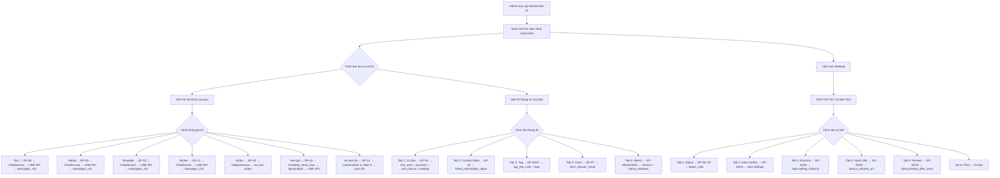
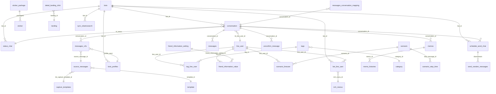
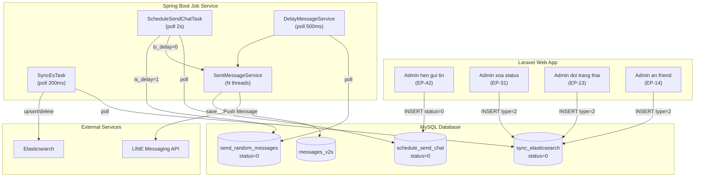

# [FA-001] Chat 1:1 — Feature Spec (Tong hop)

## 1. Tong quan

| Thuoc tinh | Gia tri |
|-----------|---------|
| **Ma** | FA-001 |
| **Ten** | Chat 1:1 |
| **Ten JP** | 「1:1チャット」 |
| **Portal** | Admin |
| **URL chinh** | `/basic/chat-v3` (chat chinh), `/basic/chat-setting` (cai dat) |
| **So man hinh** | 2 (SCR-CHT-01, SCR-CHT-02) |
| **So endpoints** | 49 (EP-01 den EP-49) |
| **So business rules** | 17 (BR-01 den BR-17) |
| **So DB tables** | 38 (15 primary + 23 secondary) |
| **Background jobs** | 2 (ScheduleSendChatTask, SyncEsTask) |
| **Validation result** | **DAT** — khong co van de nghiem trong |

### Muc dich
Tinh nang chat truc tiep 1:1 giua Admin/Staff voi tung nguoi ban (LINE friend). Giao dien chia 3 cot: danh sach ban be, khung hoi thoai, va thong tin chi tiet ban be. Ho tro gui tin nhan text, hinh anh, PDF, sticker, template, dat lich gui, thuc hien action tu dong, quan ly trang thai doi ung, va cai dat ca nhan hoa.

### Actors

| Actor | Vai tro | Quyen truy cap |
|-------|---------|----------------|
| Admin | Quan ly LINE Official Account, chat truc tiep voi ban be LINE | Toan quyen — gui/nhan tin nhan, xem thong tin ban be, cai dat chat |
| Staff | Nhan vien do Admin tao, chat thay mat Admin | Tuy role — co the bi gioi han truy cap chat hoac chi xem. Ten hien thi khi gui la ten Staff (「送信ユーザー名」). **Luu y**: khong phat hien kiem tra quyen Staff trong code Chat 1:1 — co the Staff co toan quyen chat neu duoc gan menu (Confidence: **Trung binh**) |

### Pham vi
- **SCR-CHT-01**: Man hinh Chat 1:1 chinh — giao dien 3 cot (friend list, conversation, friend info panel 5 tabs)
- **SCR-CHT-02**: Man hinh Cai dat Chat — 6 tabs cau hinh (status, auto-confirm, shortcut, shorten URL, preview, FAQ)

---

## 2. Cac man hinh va Luong xu ly end-to-end

### 2.1 SCR-CHT-01: Man hinh Chat 1:1 chinh

**URL**: `/basic/chat-v3`
**Layout**: 3 cot — Cot trai (~25%): danh sach ban be | Cot giua (~45%): khung hoi thoai | Cot phai (~30%): panel thong tin 5 tabs

#### Luong 1: Gui tin nhan text

```
Admin go tin nhan → click gui (hoac Enter/Shift+Enter tuy cai dat)
  → POST /basic/send-message-v2 (EP-08)
  → Basic\ChatController@sendMessage
  → ChatService@chatMessage:
      1. Kiem tra block (conversation.is_blocked) → BR-09
      2. Kiem tra tin nhan khong rong
      3. Kiem tra free plan limit (bots.free_send_count < 1000) → BR-07
      4. Lay profile gui tu session
      5. Neu is_shorten_url=1: chuyen URL thanh short URL → BR-15
  → MessageService@createMessageV2:
      1. INSERT messages_v2s (bot_id, conversation_id, content, type=text, profile_send)
      2. Goi LINE Push API gui tin den friend
      3. UPDATE conversation (last_message, last_time_message)
      4. Tang bots.free_send_count += 1
      5. Neu confirm_message_user_send=1: tu dong cap nhat unconfirm count → BR-08
  → Broadcast ChatEvent (WebSocket) → UI hien thi tin nhan moi
  → Response {success: true, message: {...}}
```

#### Luong 2: Gui media (hinh anh/video/audio/PDF)

```
Admin click「メディア送信」→ chon file → xac nhan
  → POST /basic/send-media-v2 (EP-09)
  → Basic\ChatController@sendMedia
  → ChatService@sendMedia:
      1. Kiem tra block → BR-09
      2. Xu ly file: Image resize 1040px, Video tao thumbnail, Audio convert M4A
      3. Chunk thanh nhom 5 (gioi han LINE API)
  → MessageService@createMultipleMessageV2:
      1. INSERT messages_v2s cho moi media
      2. Goi LINE Push API (max 5 tin/lan)
  → Response → UI hien thi media trong hoi thoai
```

#### Luong 3: Gui template

```
Admin click「テンプレート送信」→ chon template tu SC-001 → xac nhan
  → POST /basic/send-template-v2 (EP-10)
  → Basic\ChatController@sendTemplate
  → ChatService@sendTemplate:
      1. Kiem tra block
      2. Parse template_ids (CSV)
      3. Chunk thanh nhom 5
  → MessageService@createMultipleMessageV2
  → Response → UI hien thi tin nhan template
```

#### Luong 4: Hen gui tin nhan

```
Admin click「送信予約」→ chon ngay gio → xac nhan
  → POST /basic/save-schedule-send (EP-42)
  → ScheduleSendChatController@saveScheduleSendChat:
      1. INSERT/UPDATE schedule_send_chat (status=0, date_time_send = timestamp * 1000ms)
  → [Cho den thoi diem gui]
  → Spring Boot ScheduleSendChatTask poll schedule_send_chat WHERE status=0 AND date_time_send <= now
  → Neu is_delay_message=0: sendNow() → RequestSentQueue → SentMessageService → LINE API
  → Neu is_delay_message=1: scheduleSendDelay() → INSERT send_random_messages (gian cach 2-4s)
     → DelayMessageService poll → RequestSentQueue → SentMessageService → LINE API
  → UPDATE schedule_send_chat.status = 1
  → INSERT messages_v2s (msg_kind = TYPE_MESSAGE_SENDING_SCHEDULE = 11)
  → Tin nhan hien thi voi nhan「予約送信」trong lich su chat
```

#### Luong 5: Loc va tim kiem ban be

```
Admin chon filter dropdown / nhap searchbox / chon tag filter
  → GET /basic/chat/get-friends (EP-03)
  → ConversationService@getFriend:
      1. Query conversation JOIN line_user JOIN status_chat
      2. Filter theo filterTypeFriend:
         - all: is_hide=0 | unconfirm: confirm_count=1 | confirm: confirm_count=0
         - hide: is_hide=1 | schedule: JOIN schedule_send_chat status=0 | groupChat: conversation_kind=1
      3. Tim kiem LIKE tren line_user.name, line_user.view_name → BR-03 (dung read replica khi co keyword)
      4. Filter tag: AND logic (havingRaw COUNT = len_arr) hoac OR logic (havingRaw COUNT > 0) → BR-04
      5. Sap xep: is_bookmark DESC, last_time_message DESC → BR-02
      6. Pagination: 20 items/page, offset-based
  → Response {friendList: [...], hasMorePage: true}
```

#### Luong 6: Thay doi trang thai doi ung (status)

```
Admin click status badge tren header → chon status moi
  → POST /basic/update-status-confirm (EP-13)
  → ChatController@updateStatusConfirm:
      1. Voi status=1 (xac nhan): xoa unconfirm_message, set confirm_count=0
      2. Voi custom status: cap nhat conversation.id_status
      3. INSERT sync_elasticsearch (type=2) → BR-06
      4. Broadcast InfoEvent → cap nhat badge real-time
  → Response {detail: {name_status, color, id_status}, countUserUnConfirm}
```

#### Luong 7: An ban be

```
Admin click「非表示」tren toolbar
  → POST /ajax/save-hide-friend (EP-14)
  → ChatController@ajaxSaveHideFriend:
      1. SET conversation.is_hide=1, datetime_hide=now() → BR-05
      2. Tu dong xac nhan tat ca tin chua doc: DELETE unconfirm_message, SET confirm_count=0
      3. INSERT messages_v2s (msg_kind=KIND_MESSAGE_HIDE_FRIEND, content=「非表示しました」)
      4. Cap nhat badge, broadcast InfoEvent
      5. INSERT sync_elasticsearch (type=2)
```

#### Luong 8: Quan ly memo (Tab 5)

```
Admin chuyen sang tab「メモ」→ tao/sua/xoa memo
  - Tao/sua: POST /basic/chat/save-memo (EP-23)
    → Basic\ChatController@saveMemo:
      1. INSERT/UPDATE memos (title, content, position)
      2. INSERT memo_histories (staff_id, action_type) → BR-13 (max 10 histories/memo)
  - Xoa: DELETE /basic/chat/delete-memo (EP-24)
    → Xoa memos + toan bo memo_histories
  - Sap xep: POST /basic/chat/save-sort-memo (EP-25)
    → UPDATE memos.position
```

#### Luong 9: Quan ly tag (Tab 3)

```
Admin chuyen sang tab「タグ管理クイック操作」
  - Xem tags: POST /basic/chat/get-categories-tags (EP-20) → lay categories + tags voi is_selected
  - Go tag: POST /basic/chat/remove-tag-line-user (EP-21) → DELETE tag_line_user, giam tags.count_user_tag
  - Gan tag: dung SC-002 Tag Selector
```

---

### 2.2 SCR-CHT-02: Man hinh Cai dat Chat

**URL**: `/basic/chat-setting`
**Layout**: 6 tabs doc (vertical tabs) ben trai, noi dung ben phai

#### Tab 1:「対応ステータス編集」— Quan ly trang thai doi ung

```
Admin xem danh sach status → them/sua/xoa/sap xep
  - Load: POST /ajax/init-status-chat (EP-26) hoac GET /ajax/init-status-chat-v2 (EP-27, co pagination)
  - Them/sua: POST /ajax/save-item-status (EP-28)
    → Validation: name_status bat buoc, <= 10 ky tu (mb_strlen), color bat buoc → BR-12
    → Khi tao moi: position=1, day status cu xuong (position + 1)
  - Xoa: POST /ajax/delete-item-status (EP-31)
    → Reset conversation.id_status=null cho tat ca conversation dang dung status nay → BR-06
    → INSERT sync_elasticsearch cho moi conversation bi anh huong
  - Sap xep: POST /ajax/sort-status-chat (EP-32) → UPDATE status_chat.position
```

#### Tab 2:「メッセージの自動確認済み変更」— Tu dong xac nhan

```
Cau hinh auto-confirm → Load: GET /ajax/initial/get-data-setting (EP-33) → Luu: POST /ajax/save-data-setting (EP-34)
  - confirm_message_button: tu dong xac nhan tin text (0/1)
  - confirm_message_stamp: tu dong xac nhan sticker (0/1)
  - confirm_message_autoreply: tu dong xac nhan keyword auto-reply (0/1)
  - confirm_message_user_send: tu dong xac nhan khi Admin tra loi (0/1) → BR-08
  - confirm_message_user_block_bot: tu dong xac nhan khi friend block (0/1)
```

#### Tab 3:「送信ショートカット」— Phim tat gui

```
bots.setting_shortcut: 0 = Shift+Enter gui / 1 = Enter gui
```

#### Tab 4:「短縮URLの利用」— URL rut gon

```
bots.is_shorten_url: 0 = tat / 1 = bat → BR-15
Khi bat, URL trong tin nhan text duoc tu dong chuyen thanh short URL (FA-023 URL Analysis)
```

#### Tab 5:「送信プレビュー」— Xem truoc gui

```
bots.preview_after_send: 0 = tat / 1 = bat
```

#### Tab 6:「既読情報の表示」— FAQ (chi doc, khong co cai dat)

---

### Flow Diagram tong the



---

## 3. Data Model

### 3.1 Database Connections

| Connection | Mo ta | Su dung boi |
|-----------|-------|-------------|
| `mysql` | Database chinh — conversation, bots, line_user, tags, memos, status_chat, settings | Hau het cac bang |
| `mysql_message` | Database tin nhan — messages_v2s, messages, messages_{year}, source_messages | Cac bang tin nhan (scale doc lap) |
| `mysql_db_replicate` | Read replica — dung khi tim kiem co keyword (BR-03) | `ConversationReplicate` model |

### 3.2 Primary Tables (15 bang)

| # | Bang | Connection | Vai tro | Doc/Ghi |
|---|------|------------|--------|---------|
| 1 | `conversation` | mysql | Bang trung tam — trang thai hoi thoai, bookmark, hide, status | Doc + Ghi |
| 2 | `messages_v2s` | mysql_message | Tin nhan moi (tu 2023+) | Doc + Ghi |
| 3 | `messages` | mysql_message | Tin nhan cu (fallback) | Doc |
| 4 | `line_user` | mysql | Thong tin nguoi dung LINE | Doc + Ghi |
| 5 | `bot_line_user` | mysql | Lien ket bot-user, rich_menu, is_blocked | Doc + Ghi |
| 6 | `bots` | mysql | Thong tin bot, cai dat chat | Doc + Ghi |
| 7 | `status_chat` | mysql | Trang thai doi ung tuy chinh | Doc + Ghi |
| 8 | `memos` | mysql | Ghi chu cho conversation | Doc + Ghi |
| 9 | `memo_histories` | mysql | Lich su chinh sua memo | Doc + Ghi |
| 10 | `schedule_send_chat` | mysql | Lich gui tin nhan hen | Doc + Ghi |
| 11 | `unconfirm_message` | mysql | Tin nhan chua xac nhan | Doc + Ghi |
| 12 | `tag_line_user` | mysql | Lien ket tag-user | Doc + Ghi |
| 13 | `tags` | mysql | Thong tin tag | Doc + Ghi |
| 14 | `bots_profiles` | mysql | Profile gui tin (ten + avatar) | Doc + Ghi |
| 15 | `sync_elasticsearch` | mysql | Queue dong bo Elasticsearch | Ghi |

### 3.3 Secondary Tables (23 bang)

| # | Bang | Vai tro |
|---|------|--------|
| 1 | `messages_2020`...`messages_2025` | Tin nhan sharded theo nam (fallback) |
| 2 | `messages_conversation_mapping` | Mapping conversation → nam co du lieu |
| 3 | `source_messages` | Thong tin nguon gui tin (broadcast, action, step, schedule) |
| 4 | `capture_templates` | Template da capture — luu noi dung gui thuc te |
| 5 | `template` | Mau tin nhan |
| 6 | `category` | Nhom tags/templates |
| 7 | `friend_information_setting` | Cau hinh custom fields |
| 8 | `friend_information_value` | Gia tri custom fields |
| 9 | `setting_display_info_friend_chat11` | Cai dat hien thi friend info |
| 10 | `detail_landing_click` | Luu nhap (流入経路) |
| 11 | `landing` | Thong tin landing page |
| 12 | `scenario` | Step delivery |
| 13 | `scenario_lineuser` | Lien ket scenario-user |
| 14 | `scenario_step_time` | Thoi gian step tiep theo |
| 15 | `rich_menus` | Rich menu |
| 16 | `sticker` | Sticker LINE |
| 17 | `sticker_package` | Nhom sticker |
| 18 | `group_members` | Thanh vien nhom (conversation_kind=1) |
| 19 | `form_answer_result` | Ket qua form (Tab 4) |
| 20 | `send_random_messages` | Downstream tu schedule khi is_delay_message=1 |
| 21 | `summary_message_send` | Thong ke gui tin theo ngay |
| 22 | `request_sent_template_errors` | Log loi gui template (Spring Boot) |
| 23 | `tmp_button` | Nut bam cua template |

### 3.4 ER Diagram



---

## 4. Field Traceability Matrix

### 4.1 SCR-CHT-01: Cot trai — Danh sach ban be

| # | UI Element | Label JP | DB Table.Column | Huong | Validation | Business Rule |
|---|-----------|---------|-----------------|-------|-----------|---------------|
| 1 | Avatar | — | `line_user.avatar_url` | Doc | — | — |
| 2 | Display name | — | `line_user.view_name` COALESCE `name` | Doc | — | — |
| 3 | Status badge | (ten + mau) | `status_chat.name_status`, `.color`, `.bg_status` | Doc | — | FK qua conversation.id_status |
| 4 | Last message | — | `conversation.last_message` | Doc | — | — |
| 5 | Last message date | — | `conversation.last_time_message` | Doc | — | — |
| 6 | Unread badge | — | `conversation.confirm_count` | Doc | — | 0=da xac nhan, >0=chua |
| 7 | Bookmark icon | — | `conversation.is_bookmark` | Doc | — | BR-02: bookmark luon o dau |
| 8 | Block indicator | 「ブロックされました」 | `conversation.is_blocked` | Doc | — | BR-09 |
| 9 | Schedule indicator | 「送信予約中」 | `schedule_send_chat.status=0` | Doc | — | BR-11 |

### 4.2 SCR-CHT-01: Cot giua — Lich su tin nhan

| # | UI Element | Label JP | DB Table.Column | Huong | Validation | Business Rule |
|---|-----------|---------|-----------------|-------|-----------|---------------|
| 1 | Ngay phan nhom | (2026年03月24日) | `messages_v2s.created_at` | Doc | — | GROUP BY date |
| 2 | Ten nguoi gui (friend) | — | `line_user.name` | Doc | — | message_from=0 |
| 3 | Ten nguoi gui (admin) | 「送信ユーザー名」 | `bots_profiles.nick_name` | Doc | — | BR-14: FK qua messages_v2s.profile_send |
| 4 | Noi dung tin nhan | — | `messages_v2s.content`, `.type` | Doc + Ghi | message khong rong (EP-08) | BR-09: check block truoc gui |
| 5 | Timestamp | (03/24 13:30) | `messages_v2s.created_at` | Doc | — | — |
| 6 | Loai tin nhan | 「予約送信」「アクション送信」 | `source_messages.action_from` | Doc | — | — |
| 7 | Nhan msg_kind | — | `messages_v2s.msg_kind` | Doc | — | BR-10: sharding theo nam |

### 4.3 SCR-CHT-01: Cot phai — Tab 1 (基本情報)

| # | UI Element | Label JP | DB Table.Column | Huong | Validation | Business Rule |
|---|-----------|---------|-----------------|-------|-----------|---------------|
| 1 | LINE name | 「LINE名」 | `line_user.name` | Doc | — | BR-16: sync tu LINE |
| 2 | Ngay dang ky | — | `bot_line_user.followed_at` | Doc | — | — |
| 3 | Loai dang ky | 「新規/既存友だち」 | `conversation.is_old_friend` | Doc | — | 0=新規, 1=既存 |
| 4 | System name | 「システム表示名」 | `line_user.view_name` | Doc + Ghi | — | — |
| 5 | Luu nhap | 「流入経路」 | `landing.name` | Doc | — | BR-01: detail_landing_click WHERE action=2 |
| 6 | Step delivery | 「ステップ配信」 | `scenario.name` | Doc | — | scenario_lineuser WHERE is_following=1 |
| 7 | Rich menu | 「リッチメニュー」 | `rich_menus.name` | Doc + Ghi | — | bot_line_user.rich_menu_id |

### 4.4 SCR-CHT-01: Cot phai — Tab 2 (友だち情報)

| # | UI Element | Label JP | DB Table.Column | Huong | Validation | Business Rule |
|---|-----------|---------|-----------------|-------|-----------|---------------|
| 1 | Email | 「メールアドレス」 | `line_user.email` | Doc + Ghi | — | Default field |
| 2 | Ngay sinh | 「生年月日」 | `line_user.birthday` | Doc + Ghi | — | Default field |
| 3 | Custom fields | (tuy chinh) | `friend_information_value.value` | Doc + Ghi | — | BR-17: FK qua friend_information_setting |

### 4.5 SCR-CHT-01: Cot phai — Tab 3, 4, 5

| # | UI Element | DB Table.Column | Huong | Business Rule |
|---|-----------|-----------------|-------|---------------|
| 1 | Tags da gan | `tags.name` (FK qua tag_line_user) | Doc + Ghi | — |
| 2 | Form answers | `form_answer_result.data` | Doc | — |
| 3 | Memo title | `memos.title` | Doc + Ghi | BR-13: max 10 histories |
| 4 | Memo content | `memos.content` | Doc + Ghi | — |
| 5 | Memo history | `memo_histories.staff_id`, `.action_type` | Doc | 1=new, 2=edit |

### 4.6 SCR-CHT-02: Cai dat Chat

| # | UI Element | Label JP | DB Table.Column | Huong | Validation | Business Rule |
|---|-----------|---------|-----------------|-------|-----------|---------------|
| 1 | Ten status | — | `status_chat.name_status` | Doc + Ghi | Bat buoc, <= 10 ky tu | BR-12 |
| 2 | Mau status | — | `status_chat.color` | Doc + Ghi | Bat buoc | BR-12 |
| 3 | Auto-confirm text | 「【〇〇】メッセージ」 | `bots.confirm_message_button` | Doc + Ghi | — | 0/1 |
| 4 | Auto-confirm sticker | 「スタンプ」 | `bots.confirm_message_stamp` | Doc + Ghi | — | 0/1 |
| 5 | Auto-confirm keyword | 「自動応答」 | `bots.confirm_message_autoreply` | Doc + Ghi | — | 0/1 |
| 6 | Auto-confirm reply | 「返信時」 | `bots.confirm_message_user_send` | Doc + Ghi | — | BR-08 |
| 7 | Auto-confirm block | 「ブロック」 | `bots.confirm_message_user_block_bot` | Doc + Ghi | — | 0/1 |
| 8 | Phim tat gui | 「送信ショートカット」 | `bots.setting_shortcut` | Doc + Ghi | — | 0=Shift+Enter, 1=Enter |
| 9 | URL rut gon | 「短縮URL」 | `bots.is_shorten_url` | Doc + Ghi | — | BR-15 |
| 10 | Xem truoc gui | 「送信プレビュー」 | `bots.preview_after_send` | Doc + Ghi | — | 0/1 |

---

## 5. Business Rules

### Tong hop 17 rules (tat ca Confidence **Cao** — co file reference va line numbers)

| BR | Ten | Mo ta | File tham chieu |
|----|-----|-------|----------------|
| BR-01 | Luu nhap (流入経路) | Tra cuu `detail_landing_click` voi `action=2` (friend add), lay `landing.name` | `Basic\ChatController@getBasicInfo:256` |
| BR-02 | Sap xep friend list | Mac dinh: `is_bookmark DESC`, `last_time_message DESC`. Bookmark luon o dau | `ConversationService@getFriend:185` |
| BR-03 | Read replica khi tim kiem | Khi co keyword searchKey: dung `ConversationReplicate` (read replica) thay vi `Conversation` chinh → giam tai master DB | `ConversationService@getFriend:96-100` |
| BR-04 | Tag filter AND/OR | OR: friend co IT NHAT 1 tag (`havingRaw COUNT > 0`). AND: friend co TAT CA tags (`havingRaw COUNT = len_arr`) | `ConversationService@getFriend:162-170` |
| BR-05 | An friend — tu dong xac nhan | Khi an friend, tu dong xac nhan tat ca tin chua doc. Tao tin he thong「非表示しました」 | `ChatController@ajaxSaveHideFriend:876-897` |
| BR-06 | Xoa status — cascade | Khi xoa status, tat ca conversation dang dung → reset `id_status=null`. Sync ES cho tung conversation | `ChatController@ajaxDeleteItemStatus:799-810` |
| BR-07 | Gioi han gui mien phi | Free plan (`plan_type=2`): gioi han 1000 tin/thang. Khi `free_send_count >= 1000` → loi「配信数上限に達しています」. Moi tin gui: `free_send_count += 1` | `ChatService@chatMessage:95-103` |
| BR-08 | Tu dong xac nhan khi tra loi | Neu `bots.confirm_message_user_send=1`: Admin gui tin → tu dong cap nhat unconfirm count qua `totalUserConfirmMessage()` | `ChatService@chatMessage:104-110` |
| BR-09 | Block check truoc khi gui | Truoc moi loai gui tin: check `conversation.is_blocked=1` → loi「ブロックしていますので、メッセージが送信できません。」 | `ChatService@chatMessage:76-79`, `sendMedia:139-142` |
| BR-10 | Message sharding theo nam | Lay lich su: `messages_v2s` → `messages` → `messages_{year}` (moi den cu). `messages_conversation_mapping` cho biet nam nao co data | `ChatController@refreshMessage:2075-2210` |
| BR-11 | Lich gui tin nhan | 3 trang thai: -1 (draft), 0 (cho gui), 2 (da huy). `date_time_send` = timestamp * 1000 (ms). Spring Boot thuc su gui | `ScheduleSendChatController@saveScheduleSendChat:30-56` |
| BR-12 | Validation ten trang thai | `name_status` bat buoc, toi da 10 ky tu (mb_strlen). `color` bat buoc. Loi tieng Nhat:「ステータス必ず指定してください。」 | `ChatController@ajaxSaveAllStatus:734-741` |
| BR-13 | Memo history — gioi han 10 | Moi memo chi luu toi da 10 history. Khi vuot → xoa cu nhat (`orderBy id ASC, limit 1, delete`). Ghi lai `staff_id` va `action_type` | `Basic\ChatController@saveMemo:785-793` |
| BR-14 | Profile gui tin | Admin/Staff chon profile (ten + avatar). Mac dinh tu bots info. Chua co → tu tao. Luu session, dinh kem vao `messages_v2s.profile_send` | `ChatController@ajaxGetProfileOfBots:1070-1132` |
| BR-15 | URL rut gon tu dong | Khi `bots.is_shorten_url=1`: URL trong tin text → short URL qua `ChatHelper@sendShortUrl`. Phuc vu FA-023 URL Analysis | `ChatController@sendMessage:1951-1964` |
| BR-16 | Sync thong tin tu LINE | Goi LINE API `getInfoFromLine`. Cap nhat `line_user.name`, `.avatar_url`, `.status_message` | `Basic\ChatController@syncInfoFromLine:846-884` |
| BR-17 | Custom friend info display | Admin tuy chinh fields hien thi. Luu trong `setting_display_info_friend_chat11`. 2 loai: type=0 (default), type=1 (custom). Sap xep `order ASC` | `ChatController@getInfoDisplayChat:3961-4028` |

---

## 6. API Endpoints

### Tong: 49 endpoints — phan nhom theo chuc nang

#### Nhom 1: Trang chinh va du lieu ban dau (5 EPs)

| EP | Method | URL | Mo ta | Man hinh |
|----|--------|-----|-------|----------|
| EP-01 | GET | `/basic/chat-v3` | Render trang chat chinh | SCR-CHT-01 |
| EP-02 | GET | `/basic/chat-setting` | Render trang cai dat | SCR-CHT-02 |
| EP-35 | GET | `/ajax/info_friend_display_chat11` | Lay cai dat hien thi friend info | SCR-CHT-01 |
| EP-37 | POST | `/ajax/init-list-bots-profiles` | Lay danh sach profiles gui | SCR-CHT-01 |
| EP-38 | POST | `/ajax/get-bot-data` | Lay thong tin bot hien tai | SCR-CHT-01 |

#### Nhom 2: Danh sach ban be va loc (3 EPs)

| EP | Method | URL | Mo ta | Man hinh |
|----|--------|-----|-------|----------|
| EP-03 | GET | `/basic/chat/get-friends` | Danh sach ban be (filter, search, pagination) | SCR-CHT-01 |
| EP-04 | GET | `/basic/chat/get-basic-info` | Thong tin co ban friend (step, rich menu, landing) | SCR-CHT-01 |
| EP-22 | POST | `/basic/chat/sync-info-from-line` | Dong bo thong tin friend tu LINE API | SCR-CHT-01 |

#### Nhom 3: Tin nhan — doc lich su (2 EPs)

| EP | Method | URL | Mo ta | Man hinh |
|----|--------|-----|-------|----------|
| EP-05 | GET | `/basic/refresh_message` | Lay lich su tin nhan (sharded, pagination) | SCR-CHT-01 |
| EP-39 | POST | `/ajax/download-file-chat11` | Download file (image/audio/pdf) dang base64 | SCR-CHT-01 |

#### Nhom 4: Tin nhan — gui (5 EPs)

| EP | Method | URL | Mo ta | Man hinh |
|----|--------|-----|-------|----------|
| EP-08 | POST | `/basic/send-message-v2` | Gui text | SCR-CHT-01 |
| EP-09 | POST | `/basic/send-media-v2` | Gui media (image/video/audio/pdf) | SCR-CHT-01 |
| EP-10 | POST | `/basic/send-template-v2` | Gui template | SCR-CHT-01 |
| EP-11 | POST | `/basic/send-sticker-v2` | Gui sticker | SCR-CHT-01 |
| EP-36 | POST | `/ajax/init-sticker-chat` | Lay danh sach sticker packages | SCR-CHT-01 |

#### Nhom 5: Trang thai va xac nhan (5 EPs)

| EP | Method | URL | Mo ta | Man hinh |
|----|--------|-----|-------|----------|
| EP-12 | POST | `/basic/chat/confirm-message` | Danh dau tin nhan da doc | SCR-CHT-01 |
| EP-13 | POST | `/basic/update-status-confirm` | Thay doi trang thai doi ung | SCR-CHT-01 |
| EP-14 | POST | `/ajax/save-hide-friend` | An 1 friend | SCR-CHT-01 |
| EP-15 | POST | `/ajax/save-hide-friends` | An nhieu friends | SCR-CHT-01 |
| EP-16 | POST | `/ajax/remove-hide-friend` | Hien lai friend da an | SCR-CHT-01 |

#### Nhom 6: Action va thong tin chi tiet (4 EPs)

| EP | Method | URL | Mo ta | Man hinh |
|----|--------|-----|-------|----------|
| EP-17 | POST | `/basic/chat/quick-action` | Quick action cho friend | SCR-CHT-01 |
| EP-18 | POST | `/basic/chat/send_action` | Gui action tu dong | SCR-CHT-01 |
| EP-40 | POST | `/ajax/get-detail-action-message-chat11` | Chi tiet template cua action message | SCR-CHT-01 |
| EP-41 | POST | `/ajax/get-detail-action-trigger` | Chi tiet nguon trigger cua action | SCR-CHT-01 |

#### Nhom 7: Friend info panel (5 EPs)

| EP | Method | URL | Mo ta | Man hinh |
|----|--------|-----|-------|----------|
| EP-19 | POST | `/basic/chat/setting-friend-display-modal-v3` | Lay custom fields + default info cua friend | SCR-CHT-01 |
| EP-20 | POST | `/basic/chat/get-categories-tags` | Lay categories + tags (Tab 3) | SCR-CHT-01 |
| EP-21 | POST | `/basic/chat/remove-tag-line-user` | Xoa tag khoi friend | SCR-CHT-01 |
| EP-07 | GET | `/basic/chat/get-formanswer-info` | Cau tra loi form (Tab 4) | SCR-CHT-01 |
| EP-49 | POST | `/basic/chat-edit-rich-menu` | Thay doi rich menu cho friend | SCR-CHT-01 |

#### Nhom 8: Memo (4 EPs)

| EP | Method | URL | Mo ta | Man hinh |
|----|--------|-----|-------|----------|
| EP-06 | GET | `/basic/chat/get-memos-info` | Lay danh sach memo | SCR-CHT-01 |
| EP-23 | POST | `/basic/chat/save-memo` | Tao/cap nhat memo | SCR-CHT-01 |
| EP-24 | DELETE | `/basic/chat/delete-memo` | Xoa memo | SCR-CHT-01 |
| EP-25 | POST | `/basic/chat/save-sort-memo` | Sap xep memo | SCR-CHT-01 |

#### Nhom 9: Hen gui tin nhan (7 EPs)

| EP | Method | URL | Mo ta | Man hinh |
|----|--------|-----|-------|----------|
| EP-42 | POST | `/basic/save-schedule-send` | Tao/cap nhat lich gui | SCR-CHT-01 |
| EP-43 | POST | `/ajax/initDataScheduleSendChat` | Lay du lieu lich gui hien tai | SCR-CHT-01 |
| EP-44 | POST | `/ajax/remove-item-message-schedule-send-chat` | Xoa template khoi lich gui | SCR-CHT-01 |
| EP-45 | POST | `/ajax/sort-template-schedule-send-chat` | Sap xep template trong lich gui | SCR-CHT-01 |
| EP-46 | POST | `/ajax/update-delay-message-scheduled-send` | Cap nhat delay message | SCR-CHT-01 |
| EP-47 | POST | `/basic/cancel-schedule-send-chat` | Huy lich gui | SCR-CHT-01 |
| EP-48 | POST | `/ajax/get-schedule-send-chat` | Kiem tra co lich gui dang cho | SCR-CHT-01 |

#### Nhom 10: Cai dat chat (9 EPs)

| EP | Method | URL | Mo ta | Man hinh |
|----|--------|-----|-------|----------|
| EP-26 | POST | `/ajax/init-status-chat` | Lay tat ca status (Tab 1) | SCR-CHT-01, SCR-CHT-02 |
| EP-27 | GET | `/ajax/init-status-chat-v2` | Lay status co pagination | SCR-CHT-02 |
| EP-28 | POST | `/ajax/save-item-status` | Them/sua 1 status | SCR-CHT-02 |
| EP-29 | POST | `/ajax/save-item-status-v2` | Them/sua nhieu status | SCR-CHT-02 |
| EP-30 | POST | `/ajax/save-all-status` | Bulk save status | SCR-CHT-02 |
| EP-31 | POST | `/ajax/delete-item-status` | Xoa status | SCR-CHT-02 |
| EP-32 | POST | `/ajax/sort-status-chat` | Sap xep status | SCR-CHT-02 |
| EP-33 | GET | `/ajax/initial/get-data-setting` | Lay cai dat chat (Tab 2-5) | SCR-CHT-02 |
| EP-34 | POST | `/ajax/save-data-setting` | Luu cai dat chat | SCR-CHT-02 |

### Middleware chung
Tat ca endpoints: `web` (session auth), `NotifyChatworkRequestTimeSlow`, `LogRequestMultipart`

### Xac thuc
- Session-based (Laravel web middleware). Bot ID tu `getBotId()`. User ID tu `Auth::id()`.
- Khong dung Policies/Gates. Moi query filter theo `bot_id` tu session (bot scoping).

### Real-time (WebSocket)
- `ChatEvent`: tin nhan moi → client
- `InfoEvent`: cap nhat badge so tin chua doc
- `CommontEvent`: event chung
- `LeaveRoom`: roi group chat

---

## 7. Background Jobs

### 7.1 ScheduleSendChatTask — Gui tin hen gio

| Thuoc tinh | Gia tri |
|-----------|---------|
| **File** | `src/job/.../task/ScheduleSendChatTask.java` |
| **Feature flag** | `ENABLE_SCHEDULE_SENDCHAT_TASK` (mac dinh: `false`) |
| **Queue table** | `schedule_send_chat` |
| **Poll condition** | `status=0 AND date_time_send <= System.currentTimeMillis()` |
| **Batch size** | Top 100 records |
| **Tan suat poll** | Lien tuc (sleep 2s khi rong) |
| **Thread** | 1 thread rieng |

**Luong xu ly:**

```
schedule_send_chat (status=0, date_time_send <= now)
  → Parse template_ids (CSV → List<Long>)
  → Kiem tra free plan quota (BotModel.availableSend)
  → Neu is_delay_message=0:
      → sendNow() → Build messages → RequestSentQueue
      → SentMessageService → LINE Push API (chunk max 5/lan)
      → Luu messages_v2s + source_messages
  → Neu is_delay_message=1:
      → scheduleSendDelay() → INSERT send_random_messages (gian cach 2-4s)
      → DelayMessageService poll → RequestSentQueue → LINE Push API
  → UPDATE schedule_send_chat.status = 1
```

**State Machine `schedule_send_chat.status`:**

| Gia tri | Y nghia | Ai set |
|---------|---------|--------|
| `-1` | Draft (chua set gio) | Laravel |
| `0` | Cho gui | Laravel |
| `1` | Da gui thanh cong | Spring Boot |
| `2` | Da huy | Laravel |

### 7.2 SyncEsTask — Dong bo Elasticsearch

| Thuoc tinh | Gia tri |
|-----------|---------|
| **File** | `src/job/.../task/SyncEsTask.java` |
| **Feature flag** | `ENABLE_SYNC_ES_TASK` (mac dinh: `true`) |
| **Queue table** | `sync_elasticsearch` |
| **Poll condition** | `status=0 ORDER BY id ASC` |
| **Batch size** | Top 200 records |
| **Tan suat poll** | Lien tuc (sleep 200ms khi rong, back-pressure 1s khi queue day) |
| **Thread pool** | 1 poll + 5 workers = 6 threads |
| **Memory queue** | Max 10,000 records |
| **Lock** | Theo kind `{botId}@{lineUserId}`, timeout 5 phut |

**Luong xu ly:**

```
sync_elasticsearch (status=0)
  → Chuyen status=1 (synchronizing), dua vao memory queue
  → 5 worker threads xu ly:
      - type=2 (CONVERSATION): upsert ES document (status, hide...)
      - type=1 (LINE_USER): cap nhat name/view_name cho tat ca documents cung lineUserId
      - type=3 (TAG): upsert tag field trong ES document
      - type=11 (DELETE_LINE_USER): xoa document ES
      - type=12 (DELETE_BOT): xoa toan bo documents cua bot
  → Thanh cong: status=2, ghi timeSyncSuccess
  → That bai: status=3, ghi messageError, thong bao Chatwork
```

### 7.3 Data Flow (Web → Queue → Spring Boot → External)



### 7.4 Error Handling (Spring Boot)

| Loai loi | Xu ly |
|---------|-------|
| Gui tin that bai (Schedule) | Log + thong bao Chatwork. Status van = 1. **Khong retry tu dong** |
| LINE API rate limit | Retry max 10 lan, delay 3s/lan (retryRequestQueue) |
| LINE token het han | Tu dong refresh tu channel_id + channel_secret, retry 1 lan |
| Build message that bai | Log, luu `request_sent_template_errors`, bo qua template loi |
| Sync ES that bai | Status=3, ghi messageError, thong bao Chatwork. **Khong retry** |
| Free plan vuot 1000 tin | `availableSend()` tra false → khong goi LINE API |

---

## 8. Phu thuoc cheo (Cross-references)

### 8.1 Shared Components su dung

| SC | Ten | Su dung tai | Chuc nang |
|----|-----|-----------|----------|
| SC-001 | Template Message | Toolbar「テンプレート送信」(EP-10) | Chon template gui tin |
| SC-002 | Tag Selector | Tab 3「タグ管理クイック操作」(EP-20/21) | Gan/go tag cho ban be |
| SC-004 | Action Settings | Toolbar「アクション」(EP-18) | Chon action tu dong tu chat |
| SC-005 | Rich Text / Message Editor | Toolbar「メディア送信」+ khung nhap tin | Soan va gui noi dung media |
| SC-007 | Schedule/Timer Settings | Toolbar「送信予約」(EP-42~48) | Hen gio gui tin nhan |

### 8.2 Tinh nang lien quan

| FA | Ten | Lien ket voi Chat 1:1 |
|----|-----|----------------------|
| FA-010 | Mau tin nhan「テンプレート」 | Template dung khi gui tin (EP-10), lich gui (EP-42) |
| FA-011 | Tao bieu mau「フォーム作成」 | Hien thi ket qua form trong Tab 4 |
| FA-012 | Quan ly the「タグ管理」 | Tags gan/go trong Tab 3 |
| FA-013 | Danh sach ban be「友だちリスト」 | Link ten ban be tren header chuyen den my_page |
| FA-015 | Quan ly thong tin ban be「友だち情報管理」 | Custom fields hien thi Tab 2 |
| FA-023 | Phan tich URL「URL分析」 | Short URL khi bat is_shorten_url (BR-15) |

---

## 9. Gaps va Unknowns

### 9.1 Van de tu Validation Report

#### Muc do Trung binh (5 van de)

| ID | Mo ta | De xuat |
|----|-------|---------|
| VD-01 | Ten bang `capture_template` vs `capture_templates` — Logic spec ghi so it, DB mapping ghi so nhieu | Kiem tra DB schema de xac nhan. Anh huong thap — chi loi chinh ta |
| VD-02 | Ma EP khong nhat quan giua UI spec (EP-01~08 tu network) va API spec (EP-01~49 tu code) | Giu EP chinh thuc tu API spec. UI spec EP la tam thoi |
| VD-03 | Thieu mo ta UI cho nut unhide friend (EP-16 co nhung UI chua mo ta) | Bo sung UI element unhide trong filter「非表示中」 |
| VD-04 | HelperService chi muc tin cay Trung binh — method sendAction chua doc chi tiet | Doc truc tiep `HelperService.php` de nang confidence |
| VD-05 | msg_kind enum chua co gia tri so cu the (chi co ten hang so) | Tim file constants trong source de xac dinh gia tri |

#### Muc do Nhe (4 van de)

| ID | Mo ta | Trang thai |
|----|-------|-----------|
| VD-06 | DB mapping thieu tables tu job-spec | **Da kiem tra** — day du, khong co van de |
| VD-07 | Tab 6 (既読情報) khong co endpoint | **Binh thuong** — Tab 6 la FAQ tinh |
| VD-08 | ~27 endpoints chi liet ke, chua co chi tiet request/response | De xuat bo sung 10 EP quan trong nhat |
| VD-09 | DB hint suy luan ten bang khac thuc te | **Binh thuong** — db-hint la file noi bo, da giai quyet |

### 9.2 Diem chua ro tu UI Spec

| # | Noi dung | Muc do |
|---|---------|--------|
| 1 | Dialog「メディア送信」ho tro nhung loai file nao? | Trung binh |
| 2 | Tab 1 — icon edit ben canh「LINE名」co cho phep sua LINE name? (LINE name thuong chi doc) | Trung binh |
| 3 | Tab 4「フォーム回答」hien thi dang list hay table khi co du lieu? | Thap |
| 4 | Tab 5「メモ」co gioi han so luong memo? Rich text hay text thuan? | Thap |
| 5 | Gioi han kich thuoc file PDF khi gui? | Thap |
| 6 | Chat setting Tab 1 — form them/sua status co nhung truong nao? | Trung binh |
| 7 | Staff quyen gi duoc truy cap Chat 1:1? | Trung binh |
| 8 | 「送信ユーザー名」luu ten nguoi gui vao DB khong hay chi hien thi? | Trung binh — Da xac nhan: luu qua `messages_v2s.profile_send` FK → `bots_profiles.nick_name` |

### 9.3 Canh bao bao mat (tu code)

| Van de | Chi tiet | Muc do |
|--------|---------|--------|
| EP-34 `saveSettingChat` dung `$request->all()` | Controller dung `$request->all()` de update truc tiep bang `bots` → co the nhan bat ky field nao | **Trung binh** — mass assignment risk |

---

## 10. Chat luong Spec

### Metrics

| Chi so | Gia tri |
|--------|---------|
| Tong fields mapped (UI ↔ DB) | ~55 fields (cac bang 4.1 den 4.6) |
| % fields co DB mapping | ~95% (chi 3 UI fields khong map truc tiep — emoji, session profile, computed step time) |
| % fields Confidence Cao | ~92% |
| % fields Confidence Trung binh | ~6% |
| % fields Confidence Thap | ~2% |
| Business rules co file reference | 17/17 = 100% |
| Endpoints co chi tiet (request/response) | 22/49 = 45% |
| Endpoints chi liet ke | 27/49 = 55% |
| Enum values documented | 19 enums, 16 Cao + 3 Trung binh |
| Open questions | 8 (3 Trung binh, 5 Thap) |

### Validation Result: **DAT**

- **0** van de Nghiem trong
- **5** van de Trung binh (khong anh huong logic chinh)
- **4** van de Nhe (chi tiet nho)
- Tat ca UI actions deu co endpoint tuong ung (22/22 kiem tra → KHOP)
- Tat ca endpoints deu co controller tuong ung (15/15 kiem tra → KHOP)
- 28/29 models khop voi DB tables (1 canh bao nhe ten bang)
- Tat ca enum values nhat quan giua UI, Code, DB (15/15 → KHOP)
- Tat ca queue tables nhat quan giua Logic, Job, DB specs

### Diem manh
- Logic spec va Job spec rat chi tiet — co file paths, line numbers, pseudo-code
- DB mapping co ER diagram, query patterns, va 19 enum values day du
- Cross-references giua cac specs nhat quan — UI → API → Logic → DB → Job
- Confidence levels duoc ghi ro rang cho moi thong tin
- 5 shared components duoc liet ke va tham chieu dung

### De xuat cai thien (uu tien)
1. **[Trung binh]** Thong nhat ma EP giua UI spec va API spec
2. **[Trung binh]** Xac nhan gia tri cu the cua msg_kind enum constants
3. **[Trung binh]** Xac nhan ten bang `capture_template(s)`
4. **[Nhe]** Bo sung chi tiet cho ~10 endpoints phu quan trong nhat
5. **[Nhe]** Doc HelperService.php de nang confidence cua BR lien quan action

---

## Appendix: Danh sach files spec

| File | Noi dung | Agent tao |
|------|---------|-----------|
| `ui/ui-spec.md` | Spec giao dien 2 man hinh, 11 user flows, 5 shared components | ui-parser |
| `web/api-spec.md` | 49 endpoints, request/response cho 22 EP chinh | web-analyzer |
| `web/logic-spec.md` | 4 controllers, 29 models, 4 services, 17 business rules | web-analyzer |
| `job/job-spec.md` | 2 tasks, 3 queue tables, processing chains, error handling | job-analyzer |
| `db/db-mapping.md` | 38 tables, 19 entities, 19 enums, ER diagram, query patterns | db-mapper |
| `_internal/validation-report.md` | Cross-check tat ca specs, 0 nghiem trong, 5 trung binh, 4 nhe | spec-validator |
| `feature-spec.md` | **File nay** — tong hop tat ca specs | spec-compiler |
