# [FA-001] Chat 1:1 — Job Spec (Background Jobs)

## Tổng quan

### Tại sao cần background job
Tính năng Chat 1:1 có 2 luồng xử lý cần background job trong Spring Boot:

1. **Gửi tin nhắn theo lịch hẹn (Scheduled Send Chat)** — Admin/Staff hẹn giờ gửi tin nhắn trong chat 1:1. Laravel chỉ lưu record vào bảng `schedule_send_chat` với `status = 0`. Spring Boot poll bảng này và thực hiện gửi tin qua LINE API khi đến thời điểm.

2. **Đồng bộ Elasticsearch (Sync ES)** — Khi có thay đổi dữ liệu friend (xóa status chat, thay đổi trạng thái hội thoại...), Laravel insert record vào bảng `sync_elasticsearch`. Spring Boot poll bảng này và đồng bộ dữ liệu sang Elasticsearch để hỗ trợ tìm kiếm/filter friend list nhanh.

### Kiểu giao tiếp
**Database Polling Model** — Laravel (web) INSERT records vào queue tables trong MySQL. Spring Boot chạy `while(true)` loops, poll các queue tables, xử lý khi tìm thấy record phù hợp, cập nhật status.

**Mức độ tin cậy**: **Cao** — xác nhận trực tiếp từ source code Spring Boot

---

## 1. Queue Tables

### 1.1 Bảng `schedule_send_chat`
**File schema**: `db/schema/tables/schedule_send_chat.sql`
**JPA Entity**: `sns.line.models.linedb.entities.ScheduleSendChat`
**File**: `src/job/linect-service/src/main/java/sns/line/models/linedb/entities/ScheduleSendChat.java`

| Cột | Kiểu | Mô tả |
|-----|------|-------|
| `id` | int(10) UNSIGNED | Primary key |
| `bot_id` | int(11) | ID bot (LINE OA) |
| `user_id` | int(11) | ID Admin/Staff tạo lịch |
| `conversation_id` | int(11) | ID hội thoại |
| `line_user_id` | int(11) | ID LINE user nhận tin |
| `date_send` | date | Ngày gửi |
| `time_send` | time | Giờ gửi |
| `date_time_send` | bigint(20) | Timestamp gửi tính bằng **milliseconds** (= timestamp * 1000) |
| `template_ids` | varchar(255) | Danh sách template IDs, phân tách bằng dấu phẩy (CSV) |
| `status` | tinyint(4) | Trạng thái (xem State Machine bên dưới) |
| `is_delay_message` | tinyint(4) | Bật/tắt chế độ delay message (gửi giãn cách) |
| `created_at` | timestamp | Thời điểm tạo |
| `updated_at` | timestamp | Thời điểm cập nhật |

**State Machine:**

```
     Laravel tạo mới         Laravel hủy
          │                      │
          ▼                      ▼
  ┌─── -1 (draft) ──→ 0 (chờ gửi) ──→ 2 (đã hủy)
  │    chưa set giờ        │
  │                        │ Spring Boot poll
  │                        ▼
  │                   1 (đã gửi thành công)
  └─────────────────────────────────────────────
```

| Giá trị status | Hằng số | Ý nghĩa | Ai set |
|----------------|---------|---------|--------|
| `-1` | — | Mới tạo, chưa thiết lập thời gian gửi | Laravel (web) |
| `0` | `IS_WAIT_SEND` | Đang chờ gửi — Spring Boot sẽ poll | Laravel (web) |
| `1` | `IS_SENT_SUCCESS` | Đã gửi thành công | Spring Boot (job) |
| `2` | — | Đã hủy bởi Admin/Staff | Laravel (web) |

**Điều kiện poll**: `status = 0 AND date_time_send <= System.currentTimeMillis()`
**Batch size**: Top 100 records mỗi lần query
**Tần suất poll**: Liên tục (while-true loop, sleep 2 giây khi không có dữ liệu)

**Mức độ tin cậy**: **Cao** — đọc trực tiếp từ entity, repository, và task source code

---

### 1.2 Bảng `sync_elasticsearch`
**File schema**: `db/schema/tables/sync_elasticsearch.sql`
**JPA Entity**: `sns.line.models.historydb.entities.SyncElasticsearch`
**File**: `src/job/linect-service/src/main/java/sns/line/models/historydb/entities/SyncElasticsearch.java`

| Cột | Kiểu | Mô tả |
|-----|------|-------|
| `id` | int(10) UNSIGNED | Primary key |
| `type` | int(11) | Loại đồng bộ (xem bảng type bên dưới) |
| `line_user_id` | int(11) | ID LINE user |
| `bot_id` | int(11) | ID bot |
| `status` | int(11) | Trạng thái (xem State Machine) |
| `data_sync` | text | Dữ liệu JSON cần đồng bộ sang ES |
| `time_sync_success` | varchar(255) | Thời điểm đồng bộ thành công |
| `message_error` | varchar(255) | Thông báo lỗi (nếu có) |
| `created_at` | timestamp | Thời điểm tạo |
| `updated_at` | timestamp | Thời điểm cập nhật |

**Type values (liên quan Chat 1:1):**

| Giá trị | Hằng số | Ý nghĩa | Trigger từ Chat 1:1 |
|---------|---------|---------|---------------------|
| `0` | `TYPE_BOT_LINE_USER` | Đồng bộ thông tin bot-line-user | Không trực tiếp |
| `1` | `TYPE_LINE_USER` | Đồng bộ thông tin LINE user (name, view_name...) | Sync info từ LINE |
| `2` | `TYPE_CONVERSATION` | Đồng bộ conversation (status, hide...) | Xóa status chat, ẩn friend, thay đổi trạng thái |
| `3` | `TYPE_TAG` | Đồng bộ tag | Gán/xóa tag |
| `11` | `TYPE_DELETE_LINE_USER` | Xóa LINE user khỏi ES | Không trực tiếp |
| `12` | `TYPE_DELETE_BOT` | Xóa toàn bộ bot khỏi ES | Không trực tiếp |

**State Machine:**

```
  Laravel/Spring Boot tạo
          │
          ▼
  0 (chờ đồng bộ) ──→ 1 (đang đồng bộ) ──→ 2 (thành công)
                            │
                            └──→ 3 (lỗi)
```

| Giá trị | Hằng số | Ý nghĩa |
|---------|---------|---------|
| `0` | `STATUS_WAIT_SYNC` | Chờ đồng bộ |
| `1` | `STATUS_SYNCHRONIZING` | Đang đồng bộ (đã được pick lên) |
| `2` | `STATUS_SYNC_SUCCESS` | Đồng bộ thành công |
| `3` | `STATUS_SYNC_ERROR` | Đồng bộ thất bại |

**Điều kiện poll**: `status = 0 ORDER BY id ASC`
**Batch size**: Top 200 records mỗi lần query
**Tần suất poll**: Liên tục (sleep 200ms khi không có dữ liệu, throttle khi queue đầy)
**Queue capacity**: Tối đa 10,000 records trong memory queue (`RequestSyncElasticsearchQueue.MAX_QUEUE`)

**Mức độ tin cậy**: **Cao** — đọc trực tiếp từ entity, repository, và task source code

---

### 1.3 Bảng `send_random_messages` (bảng phụ — downstream)
**File schema**: `db/schema/tables/send_random_messages.sql`
**JPA Entity**: `sns.line.models.linedb.entities.SendRandomMessage`
**File**: `src/job/linect-service/src/main/java/sns/line/models/linedb/entities/SendRandomMessage.java`

Bảng này **không do Laravel tạo trực tiếp** cho Chat 1:1, mà do `ScheduleSendChatTask` tạo khi xử lý scheduled message có `is_delay_message = 1`. Mỗi template trong danh sách sẽ được tách thành từng record `SendRandomMessage` với thời gian gửi giãn cách ngẫu nhiên 2-4 giây.

| Cột | Kiểu | Mô tả |
|-----|------|-------|
| `id` | int(10) UNSIGNED | Primary key |
| `bot_id` | int(10) UNSIGNED | ID bot |
| `user_id` | int(11) | ID Admin/Staff |
| `line_user_id` | int(10) UNSIGNED | ID LINE user |
| `bot_profile_id` | int(11) | ID profile gửi |
| `sender_id` | int(11) | ID nguồn gửi |
| `msg_kind` | tinyint(4) | Loại tin nhắn |
| `template_id` | int(10) UNSIGNED | ID template (mỗi record 1 template) |
| `time_send` | datetime | Thời gian gửi (LocalDateTime) |
| `status` | tinyint(4) | Trạng thái |

**Status values:**

| Giá trị | Hằng số | Ý nghĩa |
|---------|---------|---------|
| `0` | `STATUS_NEW` | Mới tạo, chờ gửi |
| `1` | `STATUS_IN_QUEUE` | Đã đưa vào memory queue |
| `2` | `STATUS_DONE` | Đã gửi xong |
| `3` | `STATUS_FAILURE` | Gửi thất bại |

**Mức độ tin cậy**: **Cao**

---

## 2. Task Managers

### 2.1 `ScheduleSendChatTask`
**File**: `src/job/linect-service/src/main/java/sns/line/task/ScheduleSendChatTask.java`
**Feature flag**: `ConfigFile.ENABLE_SCHEDULE_SENDCHAT_TASK` (mặc định: `false`, đọc từ `application.properties`)
**Khởi tạo tại**: `AppMain.java:265-267`
**Thread pool**: Sử dụng `ExecutorService` từ `AppMain` (cached thread pool) — chạy 1 thread riêng
**Extends**: `StoppableTask` (hỗ trợ graceful shutdown)

**Polling logic:**
```java
// Vòng lặp chính
while (true) {
    // Kiểm tra shutdown
    if (AppMain.getInstance().isPrepareStop() || isNeedStop()) break;

    // Poll: lấy tối đa 100 record có status=0 và dateTimeSend <= now (ms)
    List<ScheduleSendChat> list = repository
        .findTop100ByStatusAndDateTimeSendLessThanEqual(0, System.currentTimeMillis());

    if (!list.isEmpty()) {
        for (ScheduleSendChat item : list) {
            // Parse template_ids (CSV → List<Long>)
            // Xử lý theo mode: delay hoặc gửi ngay
            if (item.getIsDelayMessage() == 1) {
                scheduleSendDelay(item, templateList);  // → send_random_messages
            } else {
                sendNow(item, templateList);            // → RequestSentQueue
            }
            // Cập nhật status = 1 (đã gửi)
            repository.updateStatusById(1, item.getId());
        }
    } else {
        Thread.sleep(2000);  // Nghỉ 2 giây khi không có dữ liệu
    }
}
```

**Mức độ tin cậy**: **Cao** — đọc trực tiếp từ source code

---

### 2.2 `SyncEsTask`
**File**: `src/job/linect-service/src/main/java/sns/line/task/SyncEsTask.java`
**Feature flag**: `ConfigFile.ENABLE_SYNC_ES_TASK` (mặc định: `true`)
**Khởi tạo tại**: `AppMain.java:255-258`
**Thread pool**: `FixedThreadPool(6)` — 1 thread poll DB + 5 thread xử lý đồng bộ (`MAX_THREAD = 5`)
**Extends**: `StoppableTask`

**Polling logic:**
- **Thread poll** (`startJobGetEvent`): Poll bảng `sync_elasticsearch` lấy top 200 record có `status = 0`, chuyển thành `status = 1` (synchronizing), đẩy vào `RequestSyncElasticsearchQueue` (in-memory queue, max 10,000). Sleep 200ms khi không có dữ liệu. Back-pressure: nếu memory queue đầy (>= 10,000) → sleep 1 giây.
- **5 Thread xử lý** (`startJobSyncEs`): Mỗi thread poll memory queue, lấy 1 record, xử lý đồng bộ ES, cập nhật `status = 2` (thành công) hoặc `status = 3` (lỗi).

**Cơ chế lock theo kind:**
- Mỗi record sync được nhóm theo `kind = "{botId}@{lineUserId}"`
- Sử dụng `lockedKindMap` để đảm bảo chỉ 1 thread xử lý 1 kind tại 1 thời điểm
- Record cùng kind đến khi đang xử lý → đưa vào `lockedQueueMap` → xử lý tuần tự sau khi kind được release
- Lock timeout: 5 phút (`LOCK_TIME_OUT = 300000ms`)

**Mức độ tin cậy**: **Cao**

---

### 2.3 `DelayMessageService` (xử lý downstream)
**File**: `src/job/linect-service/src/main/java/sns/line/helper/DelayMessageService.java`
**Feature flag**: `ConfigFile.ENABLE_DELAY_MESSAGE_TASK`
**Thread pool**: `FixedThreadPool(MAX_ACTION_LINE_USER_THREAD + 1)`

Xử lý bảng `send_random_messages` — downstream từ `ScheduleSendChatTask` khi `is_delay_message = 1`.

**Polling logic:**
- **1 Thread poll DB**: Lấy top 100 record có `status = 0 AND time_send <= NOW()`, chuyển thành `status = 1`, đẩy vào memory queue. Sleep 500ms khi không có dữ liệu.
- **N Thread xử lý**: Mỗi thread poll memory queue, build message từ template, đẩy vào `RequestSentQueue` → `SentMessageService` gửi qua LINE API. Cập nhật `status = 2`.

**Mức độ tin cậy**: **Cao**

---

## 3. Processing Chain

### 3.1 Luồng gửi tin nhắn theo lịch (không delay)

```
ScheduleSendChatTask.sendNow()
    │
    ├── 1. Parse template_ids (CSV → List<Long>)
    │
    ├── 2. Với mỗi templateId:
    │       MessageModel.buildSourceMessageForTemplate(templateId, botId, true)
    │       → TemplateSourceMessageCache.getItem()
    │       → Trả về List<SourceMessages>
    │
    ├── 3. Tạo List<MessagesV2s> (chưa lưu DB — sẽ lưu khi gửi thành công)
    │       - botId, conversationId, userId từ ScheduleSendChat
    │       - msgKind = KIND_MESSAGE_TEMPLATE
    │       - type = TYPE_MESSAGE_TEMPLATE
    │       - needQuoteToken = true
    │
    ├── 4. Tạo RequestSentTemplateToUser
    │       - msgKind = TYPE_MESSAGE_SENDING_SCHEDULE (= 11)
    │       - availableToSent = BotModel.availableSend(botId)
    │           → Kiểm tra free plan (plan_type=2): free_send_count < 1000
    │
    ├── 5. RequestSentQueue.pushRequestToQueue(request)
    │       → Đẩy vào in-memory LinkedList queue
    │
    └── 6. Cập nhật schedule_send_chat.status = 1
```

### 3.2 Luồng gửi tin nhắn theo lịch (có delay)

```
ScheduleSendChatTask.scheduleSendDelay()
    │
    ├── 1. Với mỗi templateId trong danh sách:
    │       delayTimeSent = MessageBuilder.getRandomTimeSent(delayTimeSent)
    │       → Random delay 2-4 giây so với tin trước
    │
    ├── 2. Tạo SendRandomMessage và lưu vào DB
    │       - status = STATUS_NEW (0)
    │       - timeSend = delayTimeSent (LocalDateTime)
    │
    └── 3. Cập nhật schedule_send_chat.status = 1

    ... Sau đó DelayMessageService xử lý:

    DelayMessageService
        │
        ├── Poll send_random_messages (status=0, time_send <= NOW)
        ├── Chuyển status = 1 (in queue)
        ├── Build SourceMessages từ template
        ├── Tạo RequestSentTemplateToUser
        ├── RequestSentQueue.pushRequestToQueue()
        └── Cập nhật status = 2 (done)
```

### 3.3 Luồng gửi thực tế (SentMessageService — chung cho cả 2 luồng trên)

```
SentMessageService (thread pool, ConfigFile.MAX_SENT_MESSAGE_THREAD threads)
    │
    ├── Poll RequestSentQueue (sleep 200ms khi rỗng)
    │
    ├── SentMessageHelper.sentMessage(request)
    │   │
    │   ├── 1. Lấy Bot và LineUser từ cache/DB
    │   ├── 2. Validate: bot != null, lineUser != null
    │   ├── 3. Với mỗi templateId:
    │   │       - Lấy MessageBuilder từ cache hoặc tạo mới
    │   │       - Build LINE messages (List<MessageSentLine>)
    │   │
    │   ├── 4. callSentPushMessage() — chia thành nhóm tối đa 5 tin/lần
    │   │       - Gọi LINE Push Message API (hoặc Reply nếu có replyToken)
    │   │       - Xử lý retry nếu rate limit (tối đa 10 lần, delay 3 giây)
    │   │       - Refresh token nếu token hết hạn
    │   │
    │   ├── 5. Lưu messages vào DB (messages_v2s, source_messages)
    │   ├── 6. Cập nhật send count: BotModel.addSendCount()
    │   └── 7. Xử lý action liên quan (nếu có actionId)
    │
    └── Retry logic:
        - Status 1000 → đẩy lại vào retryRequestQueue
        - RetryService: poll retryRequestQueue mỗi 1 giây
        - Kiểm tra nextTimeRetry, đẩy lại requestQueue khi đến giờ
```

### 3.4 Luồng đồng bộ Elasticsearch

```
SyncEsTask
    │
    ├── startJobGetEvent() — 1 thread poll DB
    │   ├── Query: findTop200ByStatusOrderByIdAsc(STATUS_WAIT_SYNC=0)
    │   ├── Chuyển tất cả status = STATUS_SYNCHRONIZING (1)
    │   ├── saveAll() → DB
    │   └── Đẩy vào RequestSyncElasticsearchQueue (max 10,000)
    │
    └── 5 worker threads — xử lý đồng bộ
        │
        ├── tryLockKind() — lấy record từ queue + lock theo kind
        │
        ├── doSyncEs(id, esSyncs)
        │   │
        │   ├── Parse dataSync JSON → Map<String, Object>
        │   │
        │   ├── Nếu type = TYPE_DELETE_LINE_USER (11):
        │   │   └── EsService.deleteDocuments(DOCUMENT_NAME, id)
        │   │
        │   ├── Nếu type khác (upsert):
        │   │   └── EsService.upsertDocument(DOCUMENT_NAME, id, data)
        │   │
        │   ├── Nếu type = TYPE_LINE_USER (1) — case đặc biệt:
        │   │   ├── Tìm tất cả documents ES có cùng lineUserId
        │   │   └── Cập nhật name/view_name cho tất cả
        │   │
        │   ├── Nếu type = TYPE_DELETE_BOT (12):
        │   │   ├── Tìm tất cả LineUser của bot
        │   │   └── Xóa từng document ES
        │   │
        │   ├── Thành công: status = 2, ghi timeSyncSuccess
        │   └── Thất bại: status = 3, ghi messageError, notify Chatwork
        │
        └── releaseLockedData(kind) → xử lý records đang chờ cùng kind
```

---

## 4. Data Flow (Mermaid)

```mermaid
flowchart TB
    subgraph Laravel ["Laravel Web App"]
        A1["Admin/Staff hẹn giờ gửi tin<br/>(ScheduleSendChatController)"]
        A2["Admin/Staff xóa status chat<br/>(ChatController@ajaxDeleteItemStatus)"]
        A3["Admin/Staff thay đổi trạng thái<br/>(ChatController@updateStatusConfirm)"]
        A4["Admin/Staff ẩn friend<br/>(ChatController@ajaxSaveHideFriend)"]
    end

    subgraph MySQL ["MySQL Database"]
        Q1[("schedule_send_chat<br/>status=0, date_time_send")]
        Q2[("sync_elasticsearch<br/>status=0, type, data_sync")]
        Q3[("send_random_messages<br/>status=0, time_send")]
        Q4[("messages_v2s<br/>source_messages")]
    end

    subgraph SpringBoot ["Spring Boot Job Service"]
        T1["ScheduleSendChatTask<br/>(poll mỗi 2s)"]
        T2["SyncEsTask<br/>(poll mỗi 200ms)"]
        T3["DelayMessageService<br/>(poll mỗi 500ms)"]
        T4["SentMessageService<br/>(N threads)"]
        RQ["RequestSentQueue<br/>(in-memory)"]
    end

    subgraph External ["External Services"]
        LINE["LINE Messaging API<br/>(Push Message)"]
        ES["Elasticsearch"]
        CW["Chatwork<br/>(Error Notification)"]
    end

    A1 -->|INSERT status=0| Q1
    A2 -->|INSERT type=2| Q2
    A3 -->|INSERT type=2| Q2
    A4 -->|INSERT type=2| Q2

    T1 -->|poll| Q1
    T1 -->|"is_delay=0"| RQ
    T1 -->|"is_delay=1"| Q3

    T3 -->|poll| Q3
    T3 --> RQ

    T4 -->|poll| RQ
    T4 -->|Push Message| LINE
    T4 -->|save| Q4
    T4 -->|error notify| CW

    T2 -->|poll| Q2
    T2 -->|upsert/delete| ES
    T2 -->|error notify| CW

    T1 -->|"update status=1"| Q1
    T3 -->|"update status=2"| Q3
    T2 -->|"update status=2/3"| Q2
```



---

## 5. Services & Helpers

### 5.1 `MessageModel.buildSourceMessageForTemplate()`
**File**: `src/job/linect-service/src/main/java/sns/line/models/MessageModel.java:84`
- **Input**: `templateId` (long), `botId` (long), `isSupportDelay` (boolean)
- **Output**: `List<SourceMessages>` — danh sách source messages đã build
- **Logic**: Sử dụng `TemplateSourceMessageCache` để lấy/cache kết quả. Hỗ trợ group template (template chứa nhiều template con). Tạo `CaptureTemplate` để lưu trữ nội dung gửi.
- **Tables đọc**: `template`, `tmp_button`, `capture_template`
- **Tables ghi**: `source_messages`, `capture_template`
- **Mức độ tin cậy**: **Cao**

### 5.2 `BotModel.availableSend()`
**File**: `src/job/linect-service/src/main/java/sns/line/models/BotModel.java:40`
- **Input**: `botId` (long)
- **Output**: `boolean` — có được phép gửi không
- **Logic**: Kiểm tra plan type. Nếu `plan_type = PLAN_FREE` và `free_send_count >= 1000` → `false` (hết quota)
- **Tables đọc**: `bots`
- **Mức độ tin cậy**: **Cao**

### 5.3 `MessageBuilder.getRandomTimeSent()`
**File**: `src/job/linect-service/src/main/java/sns/line/models/line/MessageBuilder.java:298`
- **Input**: `startTime` (LocalDateTime, nullable)
- **Output**: `LocalDateTime` — thời gian gửi tiếp theo
- **Logic**: Random delay 2-4 giây (`new Random().nextInt(3) + 2`). Nếu `startTime = null` → lấy `LocalDateTime.now() + delay`. Nếu có → `startTime + delay`.
- **Mục đích**: Giãn cách gửi tin nhắn để tránh rate limit LINE API và tạo cảm giác tự nhiên
- **Mức độ tin cậy**: **Cao**

### 5.4 `SentMessageHelper.sentMessage()`
**File**: `src/job/linect-service/src/main/java/sns/line/helper/SentMessageHelper.java:54`
- **Input**: `RequestSentTemplateToUser` request
- **Output**: `int` status (1=thành công, 2=thất bại, 1000=cần retry)
- **Logic**:
  1. Lấy `Bot` từ `BotManager` cache, `LineUser` từ DB
  2. Validate tính hợp lệ (`isValidReqSent`)
  3. Build LINE messages từ templates (sử dụng `MessageBuilder` hoặc `MessageBuilderCacheManager`)
  4. Gọi `callSentPushMessage()` — chia nhóm max 5 tin/lần gọi API
  5. Lưu kết quả vào DB, cập nhật send count
- **Tables đọc**: `bots` (cache), `line_user`, `template` (cache), `conversation`
- **Tables ghi**: `messages_v2s`, `source_messages`, `summary_message_send`, `request_sent_template_error` (khi lỗi)
- **Mức độ tin cậy**: **Cao**

### 5.5 `EsService`
**File**: `src/job/linect-service/src/main/java/sns/line/helper/EsService.java`
- **Input**: Document name, ID, data (Map)
- **Methods**:
  - `upsertDocument(document, id, data)` — Thêm hoặc cập nhật document ES
  - `deleteDocuments(document, id)` — Xóa document ES
  - `searchDocuments(document, query)` — Tìm kiếm documents
- **Kết nối**: `RestHighLevelClient` (Elasticsearch), config từ `ConfigFile.ES_HOST/PORT/USERNAME/PASSWORD`
- **Mức độ tin cậy**: **Cao**

### 5.6 `RequestSentQueue`
**File**: `src/job/linect-service/src/main/java/sns/line/helper/RequestSentQueue.java`
- **Cấu trúc**: `LinkedList<RequestSentTemplateToUser>` — in-memory queue, synchronized
- **2 queue**:
  - `requestQueue` — queue chính
  - `retryRequestQueue` — queue retry cho rate limit
- **Methods**: `pushRequestToQueue()`, `getRequestFromQueue()`, `retryPushRequestToQueue()`, `checkInTimeRetryRequest()`
- **Mức độ tin cậy**: **Cao**

### 5.7 `RequestSyncElasticsearchQueue`
**File**: `src/job/linect-service/src/main/java/sns/line/helper/RequestSyncElasticsearchQueue.java`
- **Cấu trúc**: `LinkedList<SyncElasticsearch>` — in-memory queue, synchronized
- **Max capacity**: 10,000 (`MAX_QUEUE`)
- **Methods**: `pushRequestToQueue(List)`, `getRequestFromQueue()`, `size()`
- **Mức độ tin cậy**: **Cao**

---

## 6. External API Calls

### 6.1 LINE Messaging API — Push Message
- **Gọi bởi**: `SentMessageHelper.callSent()` → `LineModel.sendPushMessagesV2()` hoặc `LineModel.sendReplyMessagesV2()`
- **Endpoint**: LINE Push Message API / Reply Message API
- **Auth**: Channel Access Token từ `bots.channel_access_token`
- **Giới hạn**: Tối đa 5 messages/lần gọi API (chia chunk)
- **Rate limit handling**: Nếu nhận lỗi "The API rate limit has been exceeded" → retry tối đa 10 lần, delay 3 giây mỗi lần
- **Token refresh**: Nếu nhận lỗi "Confirm that the access token... is valid" → tự động refresh token từ `channel_id` + `channel_secret`
- **Mức độ tin cậy**: **Cao**

### 6.2 Elasticsearch API
- **Gọi bởi**: `EsService` (RestHighLevelClient)
- **Operations**: Insert, Upsert, Delete, Search
- **Auth**: API Key (`ConfigFile.ES_TOKEN`) + Basic Auth (`ES_USERNAME/ES_PASSWORD`)
- **Document index**: `ConfigFile.ES_DOCUMENT_NAME`
- **Mức độ tin cậy**: **Cao**

---

## 7. Error Handling

| Loại lỗi | Xử lý | File tham chiếu |
|-----------|--------|-----------------|
| **Gửi tin thất bại** (ScheduleSendChat) | Log lỗi + gửi thông báo Chatwork (tới user IDs cụ thể). Record vẫn được set status=1 (ghi đè tại line 66 sau catch), **không retry tự động** | `ScheduleSendChatTask.java:68-71` |
| **LINE API rate limit** | Đẩy request vào `retryRequestQueue`, retry sau 3 giây, tối đa 10 lần | `SentMessageHelper.java:342-347` |
| **LINE token hết hạn** | Tự động refresh token từ channel_id + channel_secret, retry lần 1 | `SentMessageHelper.java:333-339` |
| **Build message thất bại** | Log lỗi, lưu vào `request_sent_template_error`, bỏ qua template lỗi | `SentMessageHelper.java:107-112` |
| **Sync ES thất bại** | Set `status = 3`, ghi `message_error`, gửi thông báo Chatwork. **Không retry tự động** | `SyncEsTask.java:121-128` |
| **Exception toàn bộ polling loop** (critical) | Log critical error, gửi thông báo Chatwork. Task dừng → cần restart | `ScheduleSendChatTask.java:77-79` |
| **Free plan vượt 1000 tin** | `BotModel.availableSend()` trả `false` → `isAvailableToSent = false` → tin nhắn không gọi LINE API nhưng vẫn có thể lưu record | `BotModel.java:40-54` |

**Cơ chế thông báo lỗi**: Gửi đến Chatwork room ID `316148419`, mention user IDs `6395420` và `7907973`.

**Mức độ tin cậy**: **Cao** — đọc trực tiếp từ source code

---

## 8. Liên kết với Web App

### Actions trên Web → Queue Table → Task Manager → Kết quả

| Action trên Web (Laravel) | Queue Table | Task Manager | Kết quả |
|--------------------------|-------------|-------------|---------|
| Admin hẹn giờ gửi tin trong Chat 1:1 (`ScheduleSendChatController@saveScheduleSendChat`) | `schedule_send_chat` (status=0) | `ScheduleSendChatTask` | Tin nhắn được gửi qua LINE API tại thời điểm hẹn. Record `messages_v2s` được tạo. |
| Admin hẹn giờ gửi tin có bật delay (`is_delay_message=1`) | `schedule_send_chat` → `send_random_messages` | `ScheduleSendChatTask` → `DelayMessageService` | Mỗi template được gửi giãn cách 2-4 giây |
| Admin hủy lịch gửi (`ScheduleSendChatController@cancelScheduleSendChat`) | `schedule_send_chat` (status=2) | — (không xử lý) | Task bỏ qua record có status=2 |
| Admin xóa status chat (`ChatController@ajaxDeleteItemStatus`) | `sync_elasticsearch` (type=2) | `SyncEsTask` | Cập nhật conversation status trong ES |
| Admin thay đổi trạng thái hội thoại (`ChatController@updateStatusConfirm`) | `sync_elasticsearch` (type=2) | `SyncEsTask` | Cập nhật conversation data trong ES |
| Admin ẩn friend (`ChatController@ajaxSaveHideFriend`) | `sync_elasticsearch` (type=2) | `SyncEsTask` | Cập nhật is_hide trong ES |

### Sơ đồ liên kết

```
[Chat 1:1 UI]
    → Admin bấm「送信予約」(hẹn giờ gửi)
    → Laravel lưu schedule_send_chat (status=0, date_time_send=timestamp_ms)
    → Spring Boot ScheduleSendChatTask poll
    → Đến giờ → gửi LINE API → lưu messages_v2s
    → Tin nhắn xuất hiện trong chat history

[Chat 1:1 UI]
    → Admin thay đổi trạng thái / xóa status / ẩn friend
    → Laravel lưu sync_elasticsearch (status=0, type=2/3, data_sync=JSON)
    → Spring Boot SyncEsTask poll
    → Đồng bộ sang Elasticsearch
    → Friend list search/filter hoạt động với dữ liệu mới nhất
```

---

## 9. Elasticsearch Document Structure (tham khảo)

Dữ liệu đồng bộ sang ES phục vụ filter/search friend list trong Chat 1:1. Cấu trúc document:

**Document ID format**: `{botId}@{lineUserId}`
**Index name**: Cấu hình trong `ConfigFile.ES_DOCUMENT_NAME`

| Field | Nguồn | Mô tả |
|-------|-------|-------|
| `id` | computed | `{botId}@{lineUserId}` |
| `bot_line_user_id` | `bot_line_user.id` | ID liên kết bot-user |
| `bot_id` | `bot_line_user.bot_id` | ID bot |
| `id_line_user` | `line_user.id` | ID trong bảng line_user |
| `line_id` | `line_user.line_id` | LINE system ID |
| `name` | `line_user.name` | Tên LINE |
| `view_name` | `line_user.view_name` | Tên hiển thị |
| `real_name` | `line_user.real_name` | Tên thật |
| `is_blocked` | `bot_line_user.is_blocked` | Trạng thái block |
| `tag_{id}` | `tag_line_user` | Mỗi tag 1 field, value=1 |
| `conversation_id` | `conversation.id` | ID hội thoại |
| `status_id` | `conversation.id_status` | ID trạng thái đối ứng |
| `is_hide` | `conversation.is_hide` | Đã ẩn |
| `is_bookmark` | `conversation.is_bookmark` | Đã ghim |
| `friend_info_{id}` | `friend_information_value` | Custom field values |
| `landing_{id}` | `detail_landing_click` | Landing pages đã truy cập |
| `SCENARIO_STATUS_{id}` | `scenario_line_user` | Trạng thái scenario |
| `conversion_{id}` | `conversion_result` | Conversion đã access |

**Mức độ tin cậy**: **Cao** — đọc từ `EsLineUserObjectKey.java` và `SyncEsModel.java`

---

## 10. Cấu hình (Feature Flags & Config)

| Flag | Mặc định | File | Ảnh hưởng |
|------|----------|------|-----------|
| `ENABLE_SCHEDULE_SENDCHAT_TASK` | `false` (=0) | `ConfigFile.java:97` | Bật/tắt job gửi tin hẹn giờ Chat 1:1 |
| `ENABLE_SYNC_ES_TASK` | `true` (=1) | `ConfigFile.java:108` | Bật/tắt job đồng bộ Elasticsearch |
| `ENABLE_DELAY_MESSAGE_TASK` | — | `ConfigFile.java` | Bật/tắt xử lý delay messages |
| `MAX_SENT_MESSAGE_THREAD` | — | `ConfigFile.java` | Số thread gửi tin nhắn (SentMessageService) |
| `MAX_ACTION_LINE_USER_THREAD` | — | `ConfigFile.java` | Số thread xử lý delay message |
| `ES_HOST`, `ES_PORT`, `ES_USERNAME`, `ES_PASSWORD`, `ES_TOKEN` | — | `ConfigFile.java` | Kết nối Elasticsearch |

Tất cả đọc từ file `application.properties` bên ngoài.

**Mức độ tin cậy**: **Cao** — đọc từ `ConfigFile.java`

---

## 11. Tổng hợp files đã phân tích

| File | Vai trò |
|------|---------|
| `src/job/.../AppMain.java` | Entry point, khởi tạo tasks theo feature flags |
| `src/job/.../task/ScheduleSendChatTask.java` | Task Manager — poll `schedule_send_chat` |
| `src/job/.../task/SyncEsTask.java` | Task Manager — poll `sync_elasticsearch` |
| `src/job/.../task/StoppableTask.java` | Base class — graceful shutdown, locking |
| `src/job/.../helper/DelayMessageService.java` | Service — xử lý `send_random_messages` |
| `src/job/.../helper/SentMessageService.java` | Service — thread pool gửi tin qua LINE API |
| `src/job/.../helper/SentMessageHelper.java` | Helper — build message + gọi LINE API |
| `src/job/.../helper/RequestSentQueue.java` | Queue — in-memory queue gửi tin |
| `src/job/.../helper/RequestSentTemplateToUser.java` | DTO — request object cho queue gửi tin |
| `src/job/.../helper/RequestSyncElasticsearchQueue.java` | Queue — in-memory queue sync ES |
| `src/job/.../helper/EsService.java` | Service — Elasticsearch client operations |
| `src/job/.../models/MessageModel.java` | Model — build source messages từ template |
| `src/job/.../models/BotModel.java` | Model — kiểm tra quota gửi tin |
| `src/job/.../models/SyncEsModel.java` | Model — tạo sync_elasticsearch records |
| `src/job/.../models/linedb/entities/ScheduleSendChat.java` | Entity — JPA mapping bảng schedule_send_chat |
| `src/job/.../models/historydb/entities/SyncElasticsearch.java` | Entity — JPA mapping bảng sync_elasticsearch |
| `src/job/.../models/linedb/entities/SendRandomMessage.java` | Entity — JPA mapping bảng send_random_messages |
| `src/job/.../models/linedb/repository/ScheduleSendChatRepository.java` | Repository — query schedule_send_chat |
| `src/job/.../models/historydb/repository/SyncElasticsearchRepository.java` | Repository — query sync_elasticsearch |
| `src/job/.../models/objects/EsLineUserObjectKey.java` | Constants — ES document field names |
| `src/job/.../models/line/MessageBuilder.java` | Builder — build LINE messages + delay logic |
