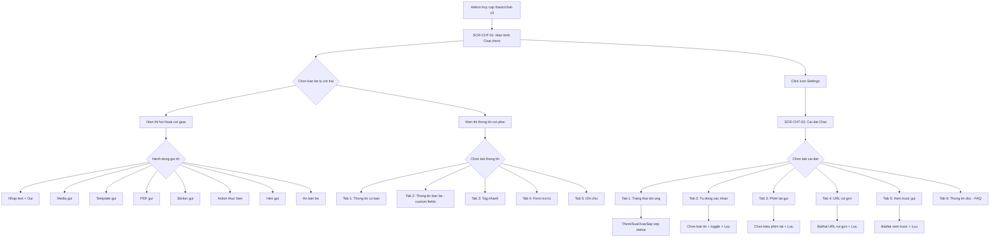

# [FA-001] Chat 1:1 — UI Spec

## Tong quan
- **Ma tinh nang**: FA-001
- **Ten**: Chat 1:1
- **Ten JP**: 「1:1チャット」
- **Mo ta**: Tinh nang chat truc tiep 1:1 giua Admin/Staff voi tung nguoi ban (LINE friend). Giao dien chia 3 cot: danh sach ban be, khung hoi thoai, va thong tin chi tiet ban be. Cho phep gui tin nhan text, hinh anh, PDF, sticker, template, dat lich gui, thuc hien action. Kem theo man hinh cai dat chat voi 6 tab tuy chinh.
- **Portal**: Admin
- **URL pattern**: `/basic/chat-v3` (man hinh chat chinh), `/basic/chat-setting` (cai dat chat)

## Doi tuong su dung (Actors)
| Actor | Vai tro | Quyen truy cap |
|-------|---------|----------------|
| Admin | Quan ly LINE Official Account, chat truc tiep voi ban be LINE | Toan quyen — gui/nhan tin nhan, xem thong tin ban be, cai dat chat |
| Staff | Nhan vien do Admin tao, chat thay mat Admin | Tuy role — co the bi gioi han truy cap chat hoac chi xem, ten hien thi khi gui la ten Staff (hien thi trong「送信ユーザー名」) |

## Cac man hinh

### SCR-CHT-01: Man hinh Chat 1:1 chinh
- **URL**: `/basic/chat-v3`
- **Tieu de trang**: 「1:1チャット」
- **Screenshot**: `screenshots/SCR-CHT-01-main.png`

#### Layout tong the
Giao dien chia thanh **3 cot** chinh:
- **Cot trai (~25%)**: Danh sach ban be (friend list) voi bo loc va tim kiem
- **Cot giua (~45%)**: Khung hoi thoai (conversation view) voi header thong tin ban be, lich su tin nhan, va toolbar gui tin
- **Cot phai (~30%)**: Panel thong tin chi tiet ban be voi 5 tab

Tren cung (ngoai 3 cot) la sidebar menu cua Admin portal ben trai. Badge so "7" tren menu item「1:1チャット」cho thay so tin nhan chua doc.

---

#### Cot trai — Danh sach ban be

##### Bo loc (Filter dropdown)
| # | Gia tri JP | Y nghia | Ghi chu |
|---|-----------|---------|---------|
| 1 | 「全ての友だち（非表示除く）」 | Tat ca ban be (tru bi an) | Mac dinh |
| 2 | 「未確認」 | Chua xac nhan (tin nhan moi) | |
| 3 | 「確認済み」 | Da xac nhan | |
| 4 | 「非表示中」 | Dang bi an | |
| 5 | 「送信予約中の友だち」 | Ban be co tin nhan hen gui | |
| 6 | 「グループ」 | Nhom | |

##### Thanh tim kiem
| Element | Text JP | Loai | Hanh vi |
|---------|---------|------|---------|
| Search box | 「LINE名 / システム表示名」 (placeholder) | searchbox | Tim kiem theo ten LINE hoac ten hien thi he thong |
| Sort icon | (icon) | Button | Sap xep danh sach ban be |

##### Moi item trong danh sach ban be
| Thanh phan | Mo ta | Ghi chu |
|-----------|-------|---------|
| Avatar | Anh dai dien LINE cua ban be | Hinh tron ben trai |
| Status badge (mau) | Hien thi trang thai doi ung (対応ステータス) voi mau sac tuong ung | Hien thi phia tren ten — vd: "対応ステータスのテキストとカラーが変更で", "重要度低", "こえんEDIT" |
| Display name | Ten hien thi cua ban be | Tu LINE name hoac system display name — vd: "Phuong Thanh", "サポート WSS's" |
| Last message preview | Xem truoc tin nhan cuoi cung | Text cat gon, hoac chi dang nhu「【画像】」「【PDF】」「【button 1】」「ブロックされました」 |
| Date | Ngay tin nhan cuoi | Format: M/DD (vd: 3/24, 2/27) |
| Unread badge | Badge so tin chua doc | Hien thi neu co tin chua doc |

---

#### Cot giua — Khung hoi thoai

##### Header hoi thoai
| Element | Mo ta | Hanh vi |
|---------|-------|---------|
| Avatar ban be | Anh dai dien phia trai | Link den profile anh |
| Ten ban be (link) | Ten ban be, la link | Click chuyen den trang「友だちリスト」→ my_page: `/basic/friendlist/my_page/{line_user_id}` |
| Status badge | Hien thi trang thai doi ung hien tai | Mau sac + text cua status |
| Icon settings (link) | Icon cai dat | Click chuyen den `/basic/chat-setting` |
| So icon (collapse panels) | Icon hien/an cac panel | Dieu khien hien thi cot phai |

##### Thong tin gui (tren moi tin nhan gui di)
| Element | Text JP | Mo ta |
|---------|---------|------|
| Label | 「送信ユーザー名」 | Hien thi ben tren moi tin nhan gui tu Admin/Staff |
| Gia tri | Ten nguoi gui (vd: "Xoai", "Thanh test") | Phan biet Admin gui hay Staff nao gui |

##### Cac loai tin nhan quan sat duoc
| Loai | Mo ta | Ky hieu / Nhan dang | Ghi chu |
|------|-------|---------------------|---------|
| Text (gui di) | Tin nhan text tu Admin/Staff | Bong bong mau xanh la (phai) | Co ten nguoi gui phia tren |
| Text (nhan) | Tin nhan text tu ban be LINE | Bong bong mau trang (trai) | Co ten ban be phia tren |
| Image (nhan) | Hinh anh tu ban be | Hien thi thumbnail anh | Xem truoc trong danh sach la「【画像】」 |
| Link | Tin nhan chua URL | URL hien thi dang clickable | VD: LIFF URLs cho dat lich |
| System message — Block | Thong bao bi block | Text:「ブロックされました」voi icon | Hien thi ngay gio ben tren |
| System message — Unblock | Thong bao bo block | Text:「ブロックを解除しました」+ thong tin「流入経路」 | Kem ten kinh luu nhap |
| Auto-sent — 「予約送信」 | Tin nhan hen gui (reservation) | Nhan「予約送信」+ ten nguoi gui | Co link「詳細情報」de xem chi tiet |
| Auto-sent — 「アクション送信」 | Tin nhan gui tu action tu dong | Nhan「アクション送信」+ ten nguoi gui | Co link「詳細情報」— vd: "Auto reply loai all keyword 111" |
| PDF | Tin nhan chua file PDF | Xem truoc trong danh sach la「【PDF】」 | **Trung binh** — can xac nhan format hien thi |
| Sticker | Sticker LINE | Xem truoc trong danh sach la (icon sticker) | **Thap** — chua quan sat truc tiep |

##### Moc ngay trong hoi thoai
- Ngay duoc hien thi dang: "2026年03月10日(火)", "2026年03月24日(火)"
- Phan cach giua cac nhom tin nhan theo ngay

##### Timestamp tren moi tin nhan
- Format: "MM/DD HH:mm" (vd: "03/10 12:46", "03/24 13:30")
- Hien thi phia duoi moi tin nhan

##### Toolbar gui tin nhan (thanh cong cu phia duoi)
| # | Icon/Text JP | Mo ta | Hanh vi |
|---|-------------|-------|---------|
| 1 | 「メディア送信」 | Gui media (hinh anh, video) | Mo dialog chon file media → [SC-005] |
| 2 | 「テンプレート送信」 | Gui tu mau tin nhan | Mo dialog chon template → [SC-001] |
| 3 | 「PDF送信」 | Gui file PDF | Mo dialog chon/upload file PDF |
| 4 | 「スタンプ送信」 | Gui sticker LINE | Mo danh sach sticker de chon |
| 5 | 「アクション」 | Thuc hien action tu dong | Mo dialog chon action → [SC-004] |
| 6 | 「送信予約」 | Hen gio gui tin nhan | Mo dialog dat lich gui → [SC-007] |
| 7 | 「非表示」 | An ban be nay khoi danh sach | An friend khoi danh sach hien thi |
| 8 | Emoji button | Chon emoji | Mo bang emoji (load tu `/full-emoji-list.json`) |

##### Khung nhap tin nhan
| Element | Text JP | Loai | Ghi chu |
|---------|---------|------|---------|
| Textbox | 「メッセージを入力してください」 (placeholder) | textbox | Nhap tin nhan text |
| Nut gui | (icon gui) | Button | Gui tin nhan — phim tat tuy cai dat (Enter hoac Shift+Enter) |

---

#### Cot phai — Panel thong tin ban be (5 tabs)

##### Tab 1:「基本情報」(Thong tin co ban)
| # | Label JP | Loai | Gia tri mau | Hanh vi |
|---|---------|------|------------|---------|
| 1 | 「LINE名」 | Text (chi doc) | テスト'T | Hien thi ten LINE goc cua ban be. Co icon edit (pencil) ben phai |
| 2 | (Ngay dang ky + loai) | Text (chi doc) | 2026.03.24 13:49 既存友だち | Ngay ban be duoc them + phan loai (moi/cu/unblock) |
| 3 | 「システム表示名」 | Text (co the sua) | Phuong Thanh | Ten hien thi do he thong dat. Co icon edit (pencil) ben phai |
| 4 | 「流入経路」 | Text (chi doc) | xoai | Ten kinh luu nhap (tuyen dang ky) |
| 5 | 「ステップ配信」 | Text + link | 配信中のステップなし | Hien thi step delivery dang chay. Co icon link de chuyen den cai dat step |
| 6 | 「リッチメニュー」 | Text + link | 表示なし | Hien thi rich menu dang gan. Co icon link de chuyen den cai dat rich menu |

##### Tab 2:「友だち情報」(Thong tin ban be — custom fields)
| # | Label JP | Loai | Gia tri mau | Hanh vi |
|---|---------|------|------------|---------|
| 1 | 「メールアドレス」 | Text (co the sua) | test@gmail.com | Dia chi email. Co nut「編集」/「削除」 |
| 2 | 「生年月日」 | Date (co the sua) | 2026.03.19 | Ngay sinh. Co nut「編集」/「削除」 |
| 3 | Custom fields (dong) | Nhieu loai | Tuy loai field | Cac truong tuy chinh do Admin tao tai「友だち情報管理」(FA-015) |

**Cac loai custom field quan sat duoc:**
| Kieu | Gia tri mau | Ghi chu |
|------|------------|---------|
| date | (gia tri ngay) | Truong "date_1" |
| text | (gia tri text) | Truong "kieu text_2" |
| image | (gia tri image) | Truong "Thanh_image_1" |
| PDF | (gia tri pdf) | Truong "Thanh_PDF_1" |
| point | (gia tri so diem) | Truong "Thanh_point_1" |

Moi truong co nut「編集」(sua) va「削除」(xoa).

##### Tab 3:「タグ管理クイック操作」(Quan ly tag nhanh)
- Hien thi danh sach tag da gan cho ban be nay
- Co nut「追加」(them) de gan tag moi → [SC-002]
- Cho phep xoa tag da gan
- **Shared component**: Su dung Tag Selector (SC-002)

##### Tab 4:「フォーム回答」(Cau tra loi bieu mau)
- Hien thi danh sach cau tra loi form cua ban be nay
- Dieu huong theo nam:「2026年」voi nut trai/phai de chuyen nam
- Lien ket den tinh nang「フォーム作成」(FA-011)

##### Tab 5:「メモ」(Ghi chu)
- Khu vuc ghi chu tu do ve ban be nay
- Co nut them/sua ghi chu
- Nhieu ghi chu co the duoc tao cho 1 ban be

---

### SCR-CHT-02: Man hinh Cai dat Chat
- **URL**: `/basic/chat-setting`
- **Tieu de trang**: 「1:1チャット設定」
- **Screenshot**: `screenshots/SCR-CHT-02-main.png`

#### Layout tong the
- Tieu de「1:1チャット設定」phia tren
- **6 tabs** ben trai (vertical tab list), noi dung chi tiet ben phai
- Tabs hoat dong dang: click tab → hien thi noi dung tuong ung

#### Danh sach 6 tabs
| Tab | Text JP | Mo ta |
|-----|---------|------|
| 1 | 「対応ステータス編集」 | Quan ly cac trang thai doi ung (status) |
| 2 | 「メッセージの自動確認済み変更」 | Cau hinh tu dong chuyen trang thai tin nhan thanh "da xac nhan" |
| 3 | 「送信ショートカット」 | Cai dat phim tat gui tin |
| 4 | 「短縮URLの利用」 | Bat/tat su dung URL rut gon |
| 5 | 「送信プレビュー」 | Bat/tat xem truoc truoc khi gui |
| 6 | 「既読情報の表示」 | Thong tin ve tinh nang doc tin nhan (chi doc, FAQ) |

---

#### Tab 1:「対応ステータス編集」(Quan ly trang thai doi ung)

##### Mo ta
「対応ステータスのテキストとカラーが変更できます」— Cho phep Admin tao va quan ly cac trang thai (status) de phan loai hoi thoai voi ban be. Moi status co text va mau sac.

##### Thanh cong cu
| Element | Text JP | Loai | Hanh vi |
|---------|---------|------|---------|
| Nut them | 「追加」 | Button | Them trang thai moi |
| Nut sap xep | 「並べ替え」 | Button | Sap xep lai thu tu cac trang thai |

##### Danh sach trang thai (list)
Moi item gom:
| Thanh phan | Mo ta |
|-----------|-------|
| Mau sac (color indicator) | O mau ben trai the hien mau cua trang thai |
| Text trang thai | Ten trang thai — vd: "対応ステータスのテキストとカラーが変更で", "重要度低", "こえんEDIT", "対応ステータスなし", "マガジ_EDIT", "タス新規追加" |
| Nut sua (pencil icon) | Sua text va mau sac cua trang thai |
| Nut xoa (trash icon) | Xoa trang thai |

##### Phan trang (Pagination)
| Element | Mo ta |
|---------|-------|
| Pagination | Hien thi so trang (trang 1, trang 2) voi nut Previous/Next |
| Items per page | Dropdown「10/page」— chon so item moi trang |

**Ghi chu**: Hien tai co 2 trang, nghia la co it nhat 11 trang thai (>10 items). Cho thay Admin co the tao nhieu trang thai tuy y.

---

#### Tab 2:「メッセージの自動確認済み変更」(Tu dong chuyen xac nhan)

##### Mo ta
「設定した受信メッセージを自動的に確認済みに変更します。確認済みに変更されたメッセージは通知されません。」

Cho phep cau hinh de tu dong danh dau tin nhan la "da xac nhan" (khong can xem thu cong). Tin nhan da xac nhan se khong thong bao nua.

##### Phan 1 — Loai tin nhan tu dong xac nhan
| # | Label JP | Loai input | Gia tri hien tai | Ghi chu |
|---|---------|-----------|-----------------|---------|
| 1 | 「【〇〇】メッセージ」 | Checkbox | Chua check | Tin nhan dang text thong thuong |
| 2 | 「スタンプ」 | Checkbox | Chua check | Sticker tu ban be |
| 3 | 「自動応答で設定しているキーワード」 | Checkbox | Chua check | Tin nhan khop keyword tu dong tra loi. Luu y:「Ｌ「全てのメッセージに反応」を設定している場合、全てのメッセージが対象になる場合があります。」 |

##### Phan 2 — Tu dong xac nhan khi tra loi
| # | Label JP | Loai input | Cac option | Gia tri hien tai | Ghi chu |
|---|---------|-----------|-----------|-----------------|---------|
| 1 | 「返信時の自動確認済み変更」 | Toggle (radio-style) | 「利用しない」/「利用する」 | 「利用する」(checked) | Tu dong chuyen xac nhan khi Admin/Staff tra loi tin nhan chua xac nhan |
| 2 | 「ブロックされた友だちの自動確認済み変更」 | Toggle (radio-style) | 「利用しない」/「利用する」 | 「利用しない」(unchecked) | Tu dong xac nhan khi ban be block tai khoan |

##### Mo ta chi tiet tung field:
- 「返信時の自動確認済み変更」:「未確認のメッセージがある場合に、メッセージの返信と同時に自動で確認済みに変更します。」
- 「ブロックされた友だちの自動確認済み変更」:「未確認のメッセージがある状態で、友だちからブロックされた際に自動で確認済みに変更します。」

##### Nut luu
| Element | Text JP | Hanh vi |
|---------|---------|---------|
| Button | 「保存」 | Luu cai dat tab nay |

---

#### Tab 3:「送信ショートカット」(Phim tat gui tin)

##### Mo ta
「送信時のショートカットを変更します。」

##### Form fields
| # | Label JP | Loai input | Gia tri hien tai | Ghi chu |
|---|---------|-----------|-----------------|---------|
| 1 | 「送信：Shift +Enter 改行：Enter」 | Radio | Chua chon | Gui bang Shift+Enter, xuong dong bang Enter |
| 2 | 「送信：Enter 改行：Shift +Enter」 | Radio | Da chon (checked) | Gui bang Enter, xuong dong bang Shift+Enter |

##### Nut luu
| Element | Text JP | Hanh vi |
|---------|---------|---------|
| Button | 「保存」 | Luu cai dat phim tat |

---

#### Tab 4:「短縮URLの利用」(Su dung URL rut gon)

##### Mo ta
「1:1チャットでURLを送信する際に短縮リンクを利用します。(URL分析が利用できます)」

Khi bat, URL gui trong chat se tu dong chuyen thanh URL rut gon, dong thoi cho phep theo doi thong ke truy cap qua tinh nang「URL分析」(FA-023).

##### Form fields
| # | Label JP | Loai input | Cac option | Gia tri hien tai | Ghi chu |
|---|---------|-----------|-----------|-----------------|---------|
| 1 | (toggle) | Toggle (checkbox-style) | 「利用しない」/「利用する」 | 「利用する」(checked) | Bat/tat URL rut gon |

##### Nut luu
| Element | Text JP | Hanh vi |
|---------|---------|---------|
| Button | 「保存」 | Luu cai dat URL rut gon |

---

#### Tab 5:「送信プレビュー」(Xem truoc gui)

##### Mo ta
「1:1チャットでの送信時にプレビューを表示します。」

Khi bat, truoc khi gui tin nhan se hien thi preview de Admin xac nhan truoc.

##### Canh bao
「ご注意: LINE公式アカウントの仕様上、エルメからの送信取り消しはできません。送信から24時間以内のメッセージのみ、LINE公式アカウント管理画面のチャットから送信取り消しが可能です。」
- Link「こちら」tro den FAQ: `https://tayori.com/faq/...`

##### Form fields
| # | Label JP | Loai input | Cac option | Gia tri hien tai | Ghi chu |
|---|---------|-----------|-----------|-----------------|---------|
| 1 | (toggle) | Toggle (checkbox-style) | 「利用しない」/「利用する」 | 「利用しない」(unchecked) | Bat/tat xem truoc |

##### Nut luu
| Element | Text JP | Hanh vi |
|---------|---------|---------|
| Button | 「保存」 | Luu cai dat xem truoc |

---

#### Tab 6:「既読情報の表示」(Thong tin doc tin nhan)

##### Mo ta
Tab nay chi chua **thong tin FAQ** ve tinh nang doc tin nhan, **KHONG co cai dat** nao de thay doi.

##### Noi dung FAQ
| # | Cau hoi JP | Tra loi tom tat |
|---|-----------|----------------|
| 1 | 「Q.エルメから友だちがメッセージを開いたか（既読か）はわかりますか？」 | Khong — do gioi han cua LINE Official Account. Elme khong the hien thi thong tin da doc. |
| 2 | 「Q.友だちがメッセージを送信してすぐに既読マークをつけないようにできますか？」 | Co — thay doi cai dat「応答設定」tren LINE Official Account Manager. |
| 3 | 「Q.友だちからのメッセージを確認しても、相手のライン上で「既読」がつかないのですがエラーですか？」 | Khong loi — neu chat ON tren LINE OA Manager, can doc tin tren LINE OA Manager de hien "da doc". Neu chat OFF, tu dong "da doc" khi ban be gui. |

Moi cau tra loi co link「こちら」tro den FAQ Tayori.

---

## Luong nguoi dung (User Flows)

### Luong 1: Gui tin nhan text cho ban be
1. Admin truy cap `/basic/chat-v3` → SCR-CHT-01
2. Chon ban be tu danh sach cot trai (click vao item)
3. Khung hoi thoai cot giua hien thi lich su tin nhan voi ban be do
4. Nhap tin nhan vao textbox「メッセージを入力してください」
5. Nhan nut gui hoac phim tat (Enter hoac Shift+Enter tuy cai dat)
6. Tin nhan hien thi trong khung hoi thoai voi nhan「送信ユーザー名: {ten Admin/Staff}」
7. Tin nhan duoc gui den ban be qua LINE

### Luong 2: Gui media (hinh anh/video)
1. Tu SCR-CHT-01, click icon「メディア送信」tren toolbar
2. Mo dialog chon file media
3. Chon file → xac nhan gui
4. Media hien thi trong khung hoi thoai

### Luong 3: Gui tin nhan tu template
1. Tu SCR-CHT-01, click icon「テンプレート送信」tren toolbar
2. Mo dialog chon template (tu danh sach mau tin nhan — FA-010, SC-001)
3. Chon template → xac nhan gui
4. Tin nhan tu template hien thi trong khung hoi thoai

### Luong 4: Hen gui tin nhan
1. Tu SCR-CHT-01, click icon「送信予約」tren toolbar
2. Mo dialog chon thoi gian gui
3. Dat ngay gio → xac nhan
4. Tin nhan duoc len lich gui — ban be xuat hien trong filter「送信予約中の友だち」

### Luong 5: Loc ban be theo trang thai
1. Tu SCR-CHT-01, click dropdown bo loc cot trai (mac dinh:「全ての友だち（非表示除く）」)
2. Chon loai loc: 「未確認」/「確認済み」/「非表示中」/「送信予約中の友だち」/「グループ」
3. Danh sach ban be cap nhat theo bo loc

### Luong 6: Tim kiem ban be
1. Tu SCR-CHT-01, nhap ten vao searchbox「LINE名 / システム表示名」
2. Danh sach ban be duoc loc theo tu khoa

### Luong 7: Thay doi trang thai doi ung (status) cho ban be
1. Tu SCR-CHT-01, click vao status badge tren header hoi thoai
2. Chon trang thai moi tu danh sach (cac status da tao tai SCR-CHT-02 Tab 1)
3. Status duoc cap nhat, hien thi trong danh sach ban be va header hoi thoai

### Luong 8: Xem va sua thong tin ban be
1. Tu SCR-CHT-01, cot phai hien tab「基本情報」mac dinh
2. Click icon edit (pencil) ben canh「システム表示名」de sua ten hien thi
3. Chuyen sang tab「友だち情報」de xem/sua email, ngay sinh, custom fields
4. Click「編集」tren field de sua, click「削除」de xoa

### Luong 9: Gan tag nhanh cho ban be
1. Tu SCR-CHT-01, chuyen sang tab「タグ管理クイック操作」(tab 3) o cot phai
2. Click nut「追加」de them tag
3. Chon tag tu danh sach (SC-002) hoac tao tag moi
4. Tag duoc gan cho ban be

### Luong 10: Cai dat trang thai doi ung
1. Tu SCR-CHT-01, click icon settings tren header hoi thoai → chuyen den SCR-CHT-02
2. Tab 1「対応ステータス編集」hien thi mac dinh
3. Click「追加」de them trang thai moi (nhap text, chon mau)
4. Click icon pencil de sua trang thai da co
5. Click icon trash de xoa trang thai
6. Click「並べ替え」de sap xep lai thu tu

### Luong 11: An ban be
1. Tu SCR-CHT-01, click icon「非表示」tren toolbar
2. Ban be bi an khoi danh sach (chuyen sang filter「非表示中」)
3. De hien lai, chon filter「非表示中」→ thao tac hien lai

---

## Flow Diagram

---

## API Endpoints phat hien (tu network)

| # | Method | URL | Tham so chinh | Mo ta | Muc do tin cay |
|---|--------|-----|-------------|-------|---------------|
| EP-01 | GET | `/basic/chat/get-friends` | searchKey, searchTag, page, searchStatusOr, searchStatusAnd, botIdCurrent, lineId, filterTypeFriend, filterFriendOrAnd, lastTimeUpdateFriend | Lay danh sach ban be voi bo loc va phan trang | **Cao** |
| EP-02 | GET | `/basic/chat/get-basic-info` | line_user_id | Lay thong tin co ban cua ban be | **Cao** |
| EP-03 | GET | `/basic/refresh_message` | page, conversation, line_user_id, botIdCurrent, currentYear, offset | Lay lich su tin nhan hoi thoai (phan trang) | **Cao** |
| EP-04 | GET | `/basic/chat/get-memos-info` | conversation_id, type | Lay danh sach ghi chu (memo) cua hoi thoai | **Cao** |
| EP-05 | POST | `/ajax/get-bot-data` | (body) | Lay thong tin bot (LINE OA) hien tai | **Cao** |
| EP-06 | GET | `/ajax/initial/get-data-setting` | (none) | Lay cai dat ban dau (setting) | **Cao** |
| EP-07 | POST | `/ajax/init-list-bots-profiles` | (body) | Lay danh sach profiles cac bot | **Cao** |
| EP-08 | GET | `/full-emoji-list.json` | (none) | Lay danh sach emoji day du (static JSON) | **Cao** |

### Tham so dang chu y cua EP-01 (get-friends)
| Tham so | Kieu | Mo ta |
|---------|------|-------|
| searchKey | String | Tu khoa tim kiem (LINE name / system display name) |
| searchTag | String | Loc theo tag |
| page | Integer | So trang (bat dau tu 1) |
| searchStatusOr | String | Loc theo status (OR logic) |
| searchStatusAnd | String | Loc theo status (AND logic) |
| botIdCurrent | Integer | ID cua bot (LINE OA) hien tai — vd: 542 |
| lineId | String | Loc theo LINE user ID cu the |
| filterTypeFriend | String | Loai bo loc — vd: "all" |
| filterFriendOrAnd | String | Logic ket hop bo loc — "or" / "and" |
| lastTimeUpdateFriend | Integer | Timestamp cap nhat cuoi (dung cho polling/incremental load) — 0 = load tu dau |

### Tham so dang chu y cua EP-03 (refresh_message)
| Tham so | Kieu | Mo ta |
|---------|------|-------|
| page | Integer | So trang tin nhan (bat dau tu 0) |
| conversation | Integer | ID hoi thoai — vd: 27939880 |
| line_user_id | Integer | ID ban be LINE — vd: 26271166 |
| botIdCurrent | Integer | ID bot hien tai — vd: 542 |
| currentYear | Integer | Nam hien thi (0 = nam hien tai) |
| offset | Integer | Vi tri bat dau lay tin nhan |

---

## Shared Components su dung

| SC | Ten | Su dung tai | Ghi chu |
|----|-----|-----------|---------|
| SC-001 | Template Message | Toolbar「テンプレート送信」 | Gui tin tu mau template |
| SC-002 | Tag Selector | Tab 3「タグ管理クイック操作」 | Gan/go tag cho ban be |
| SC-004 | Action Settings | Toolbar「アクション」 | Thuc hien action tu dong tu chat |
| SC-005 | Rich Text / Message Editor | Toolbar「メディア送信」+ khung nhap tin nhan | Soan va gui noi dung tin nhan |
| SC-007 | Schedule/Timer Settings | Toolbar「送信予約」 | Hen gio gui tin nhan |

---

## Diem chua ro / Can xac minh

| # | Noi dung | Muc do | Ghi chu |
|---|---------|--------|---------|
| 1 | Khi click nut「メディア送信」— dialog chon file co nhung loai file nao (chi image, hay ca video, audio)? | Trung binh | Chua quan sat truc tiep dialog |
| 2 | Toolbar「アクション」— mo dialog nao? Co phai la SC-004 Action Settings khong? | Trung binh | Suy luan tu ten, can xac nhan voi code |
| 3 | Tab 1 (基本情報) — icon edit ben canh「LINE名」co cho phep sua LINE name khong? (LINE name thuong la chi doc tu LINE) | Trung binh | Co the chi la copy hoac link, khong phai edit |
| 4 | Tab 4「フォーム回答」— khi co du lieu se hien thi nhu the nao? Dang list hay table? | Thap | Khung hien tai rong (chua co data form) |
| 5 | Tab 5「メモ」— gioi han so luong memo? Format ho tro (text thuan hay rich text)? | Thap | Can xem chi tiet hon |
| 6 | Khi gui PDF — co gioi han kich thuoc file khong? | Thap | Chua thay thong tin gioi han |
| 7 | Chat setting Tab 1 — khi them/sua trang thai, form nhap co nhung truong nao (text, mau sac, icon)? | Trung binh | Chi quan sat duoc list hien tai, chua mo form them/sua |
| 8 | Bo loc ban be — co the ket hop nhieu dieu kien (AND/OR) nhu the nao? API co tham so searchStatusOr va searchStatusAnd | Trung binh | Can xac minh qua code logic |
| 9 | Tinh nang「非表示」(an ban be) — co the hien lai (unhide) bang cach nao? | Trung binh | Loc「非表示中」se hien thi nhung chua thay nut unhide |
| 10 | Staff quyen gi duoc truy cap Chat 1:1? Co bi gioi han gui tin hoac xem thong tin khong? | Trung binh | Can kiem tra quyen Staff trong code |
| 11 | Dau hieu「送信ユーザー名」— luu ten nguoi gui cu the vao DB khong hay chi hien thi? | Trung binh | Quan sat thay nhieu ten khac nhau (Xoai, Thanh test) |
