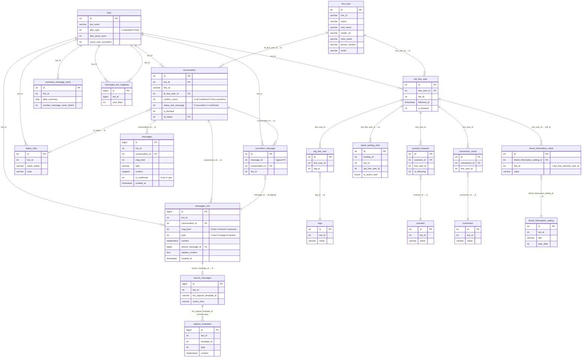

# [FA-002] Quản lý chat — DB Mapping

> Mapping giữa UI fields và database columns cho tính năng Quản lý chat (「チャット管理」).
> Confidence tổng thể: **Cao** — xác nhận từ source code + database schema + data mẫu.

---

## 1. Phân loại bảng

### Primary Tables (trực tiếp liên quan)

| # | Bảng | Connection | Mô tả | Data size |
|---|------|-----------|-------|-----------|
| 1 | `messages_v2s` | `mysql_message` | Bảng tin nhắn chính (mới nhất), ưu tiên truy vấn đầu tiên | 56.2MB |
| 2 | `messages` | `mysql_message` | Bảng tin nhắn legacy (currentYear=0), cấu trúc cũ có `is_confirmed` trực tiếp | 25.2MB |
| 3 | `unconfirm_message` | `mysql` | Tracking tin nhắn chưa xác nhận — tạo record = 未確認, xoá record = 確認済 | 335KB |
| 4 | `conversation` | `mysql` | Cuộc trò chuyện giữa bot và LINE user, chứa metadata confirm/block | 68.8MB |
| 5 | `line_user` | `mysql` | Thông tin LINE user — tên, avatar, LINE ID | 139.1MB |
| 6 | `bot_line_user` | `mysql` | Bảng nối bot ↔ LINE user, dùng trong advance filter | 137.2MB |
| 7 | `bots` | `mysql` | Thông tin bot — đếm unconfirm, free_send_count, plan_type | 440KB |

### Secondary Tables (liên quan gián tiếp — sharding, filter, side effects)

| # | Bảng | Connection | Mô tả | Data size |
|---|------|-----------|-------|-----------|
| 8 | `messages_2024` | `mysql_message` | Sharded messages năm 2024 | 13.1MB |
| 9 | `messages_page_2` | `mysql_message` | Tin nhắn cũ (page 2) | 105KB |
| 10 | `messages_old` | `mysql_message` | Tin nhắn cổ nhất | 261KB |
| 11 | `messages_bot_mapping` | `mysql_message` | Mapping bot ↔ năm có dữ liệu (sharding metadata) | 2KB |
| 12 | `messages_conversation_mapping` | `mysql_message` | Mapping conversation ↔ năm có dữ liệu | 7KB |
| 13 | `source_messages` | `mysql_message` | Nguồn gốc tin nhắn (template, action, broadcast, scenario) | 2.5MB |
| 14 | `capture_templates` | `mysql_message` | Template tin nhắn đã capture — dùng khi xem chi tiết | 2.1MB |
| 15 | `status_chat` | `mysql` | Trạng thái chat tuỳ chỉnh do Admin tạo — dùng trong bộ lọc nâng cao | 801KB |
| 16 | `tags` | `mysql` | Danh sách tags — dùng trong bộ lọc nâng cao | 245KB |
| 17 | `tag_line_user` | `mysql` | Gán tag cho LINE user — bảng nối N-N | 134KB |
| 18 | `scenario` | `mysql` | Danh sách scenario/step — dùng trong bộ lọc nâng cao | 300KB |
| 19 | `scenario_lineuser` | `mysql` | Trạng thái subscribe scenario của LINE user | 218KB |
| 20 | `conversion` | `mysql` | Danh sách conversion — dùng trong bộ lọc nâng cao | 187KB |
| 21 | `conversion_result` | `mysql` | Kết quả conversion của LINE user | 3KB |
| 22 | `detail_landing_click` | `mysql` | Lịch sử quét QR code / landing click — dùng trong bộ lọc nâng cao | 253KB |
| 23 | `friend_information_setting` | `mysql` | Định nghĩa trường thông tin bạn bè tuỳ chỉnh | 627KB |
| 24 | `friend_information_value` | `mysql` | Giá trị thông tin bạn bè tuỳ chỉnh — dùng trong bộ lọc nâng cao | 134KB |
| 25 | `summary_message_send` | `mysql` | Thống kê số tin nhắn gửi theo ngày — cập nhật khi gửi tin | 493KB |
| 26 | `sync_elasticsearch` | `mysql` | Đồng bộ Elasticsearch — ghi khi thay đổi trạng thái xác nhận | 174KB |
| 27 | `sticker` | `mysql` | Danh sách sticker LINE — dùng khi hiển thị tin nhắn sticker | 28KB |

---

## 2. Entity Details

### 2.1. messages_v2s (Bảng tin nhắn chính — mới nhất)

**Connection**: `mysql_message` | **Model**: `MessagesV2` | **Timestamps**: Có

| Column | Kiểu | Nullable | Default | Key | Mô tả |
|--------|------|----------|---------|-----|-------|
| `id` | bigint(20) UNSIGNED | NOT NULL | — | PK | ID tin nhắn |
| `bot_id` | int(11) | NOT NULL | — | — | ID bot sở hữu |
| `user_id` | int(11) | YES | NULL | — | ID user (staff/admin) gửi tin (nếu outgoing) |
| `message_from` | int(11) | YES | NULL | — | ID nguồn gửi |
| `conversation_id` | int(11) | NOT NULL | — | — | FK → `conversation.id` |
| `profile_send` | int(11) | YES | NULL | — | Profile gửi tin |
| `msg_kind` | int(11) | YES | NULL | — | Loại gửi: 0=bot/admin, 1=friend, 2=scenario, 3=broadcast, 6=test, 7=template, 10=event, 12=add_new_friend, 13=add_old_friend, 14=friend_block, 18=delete |
| `type` | int(11) | YES | NULL | — | Loại tin nhắn: 1=text, 2=image, 3=video, 4=audio, 5=sticker, 6=setting_scenario, 7=stop_scenario, 9=start_remind, 10=stop_remind, 11=PDF, 12=file, 13=location, 14=broadcast, 15=scenario, 16=template, 19-22=booking/form actions |
| `content` | mediumtext | YES | — | — | Nội dung tin nhắn (text, JSON cho media) |
| `qrcode_add_friend` | varchar(255) | YES | NULL | — | QR code thêm bạn liên quan |
| `source_message_id` | bigint(20) | YES | NULL | FK | FK → `source_messages.id` |
| `cancel_send` | tinyint(4) | YES | NULL | — | Đánh dấu huỷ gửi |
| `replace_content` | text | YES | — | — | JSON array cặp `rp_key`/`rp_value` — thay thế biến trong nội dung |
| `status` | int(11) | YES | NULL | — | Trạng thái tin nhắn |
| `line_message_id` | varchar(255) | YES | NULL | — | LINE Message ID từ LINE API |
| `quote_token` | text | YES | — | — | Token quote tin nhắn |
| `quote_message_id` | bigint(11) | YES | NULL | — | ID tin nhắn được quote |
| `quote_message_content` | text | YES | — | — | Nội dung tin nhắn được quote |
| `created_at` | timestamp | NOT NULL | CURRENT_TIMESTAMP | — | Thời gian tạo |
| `updated_at` | timestamp | NOT NULL | CURRENT_TIMESTAMP ON UPDATE | — | Thời gian cập nhật |

> **Ghi chú kiến trúc**: Bảng `messages_v2s` nằm trên connection `mysql_message` (có thể database riêng). Đây là bảng tin nhắn mới nhất, được ưu tiên truy vấn trước các bảng legacy. Không có cột `is_confirmed` — trạng thái xác nhận quản lý qua bảng `unconfirm_message`. [Confidence: **Cao**]

---

### 2.2. messages (Bảng tin nhắn legacy)

**Connection**: `mysql_message` | **Model**: `Messages` | **Timestamps**: Có

| Column | Kiểu | Nullable | Default | Key | Mô tả |
|--------|------|----------|---------|-----|-------|
| `id` | bigint(20) | NOT NULL | — | PK | ID tin nhắn |
| `bot_id` | int(11) | YES | NULL | — | ID bot |
| `conversation_id` | int(11) | NOT NULL | — | — | FK → `conversation.id` |
| `message_from` | varchar(255) | YES | NULL | — | Nguồn gửi (string, khác V2 là int) |
| `msg_kind` | int(11) | YES | 0 | — | Loại gửi (giống V2) |
| `sender_id` | int(11) | YES | 0 | — | ID người gửi |
| `scenario_id` | int(11) | YES | 0 | — | ID scenario liên quan |
| `type` | varchar(30) | YES | NULL | — | Loại tin nhắn (string, khác V2 là int) |
| `content` | longtext | NOT NULL | — | — | Nội dung tin nhắn |
| `is_opened` | int(11) | YES | NULL | — | Đã mở chưa |
| `opened_at` | timestamp | YES | NULL | — | Thời gian mở |
| `has_error` | tinyint(1) | NOT NULL | 0 | — | Có lỗi không |
| `error_message` | mediumtext | YES | — | — | Nội dung lỗi |
| `is_confirmed` | int(11) | YES | 0 | — | Trạng thái xác nhận: 0=chưa, 1=đã xác nhận |
| `confirmed_at` | timestamp | YES | NULL | — | Thời gian xác nhận |
| `is_clicked` | varchar(50) | YES | '0' | — | Đã click chưa |
| `created_at` | timestamp | YES | CURRENT_TIMESTAMP | — | Thời gian tạo |
| `updated_at` | timestamp | YES | CURRENT_TIMESTAMP | — | Thời gian cập nhật |
| `user_id` | int(11) | YES | NULL | — | ID user liên quan |

> **Ghi chú khác biệt với messages_v2s**: Bảng legacy có `is_confirmed` trực tiếp (bị cập nhật khi đổi trạng thái), `type` là varchar thay vì int, `message_from` là varchar thay vì int. Không có `source_message_id`, `replace_content`, `quote_*`. [Confidence: **Cao**]

---

### 2.3. Bảng messages sharded theo năm

Các bảng có **cùng cấu trúc** với bảng `messages` (legacy):

| Bảng | Model | Mô tả | Data size |
|------|-------|-------|-----------|
| `messages_2024` | `Messages2024` | Tin nhắn năm 2024 | 13.1MB |
| `messages_page_2` | `MessagesPage2` | Tin nhắn cũ (page 2) | 105KB |
| `messages_old` | `MessagesOld` | Tin nhắn cổ nhất | 261KB |

> **Ghi chú sharding**: Theo logic-spec, code references đến `messages2020`, `messages2021`, `messages2022`, `messages2023`, `messages2024`, `messages2025` nhưng trong DB dump hiện tại chỉ có `messages_2024`. Các bảng năm khác có thể đã bị drop hoặc nằm ở database khác. `messages_bot_mapping` được dùng để xác định năm nào có dữ liệu cho từng bot. [Confidence: **Cao**]

#### Thứ tự truy vấn (Sharding Query Order)
```
1. messages_v2s          ← Mới nhất, ưu tiên
2. messages              ← currentYear=0 (default)
3. messages2025          ← Năm 2025
4. messages2024          ← Năm 2024
5. messages2023          ← Năm 2023
6. ... (giảm dần)
7. messages2020          ← Năm 2020
8. messages_page_2       ← Cũ hơn
9. messages_old          ← Cổ nhất
```

---

### 2.4. unconfirm_message

**Connection**: `mysql` | **Model**: `UnconfirmMessage` | **Timestamps**: Có

| Column | Kiểu | Nullable | Default | Key | Mô tả |
|--------|------|----------|---------|-----|-------|
| `id` | int(10) UNSIGNED | NOT NULL | — | PK | ID record |
| `message_id` | int(11) | NOT NULL | — | — | ID tin nhắn (logic FK → `messages_v2s.id` hoặc `messages.id`) |
| `conversation_id` | int(11) | NOT NULL | — | FK | FK → `conversation.id` |
| `bot_id` | int(11) | NOT NULL | — | — | ID bot |
| `created_at` | timestamp | NOT NULL | CURRENT_TIMESTAMP | — | Thời gian tạo (= thời gian đánh dấu chưa xác nhận) |
| `updated_at` | timestamp | NOT NULL | CURRENT_TIMESTAMP ON UPDATE | — | Thời gian cập nhật |

**Sample Data**:
```sql
-- (id, message_id, conversation_id, bot_id, created_at, updated_at)
(521, 58035, 3701, 387, '2021-07-19 02:59:16', '2021-07-19 02:59:16')
(591, 61374, 3751, 425, '2021-09-08 10:08:02', '2021-09-08 10:08:02')
```

> **Cơ chế hoạt động**: Record tồn tại = tin nhắn chưa xác nhận (未確認). Khi Admin đánh dấu 確認済 → record bị **xoá** (DELETE). Khi đánh dấu 未確認 → record được **tạo mới** (INSERT). Đây là pattern "existence-based flag" thay vì boolean flag. [Confidence: **Cao**]

---

### 2.5. conversation

**Connection**: `mysql` | **Model**: `Conversation` | **Timestamps**: Có

| Column | Kiểu | Nullable | Default | Key | Mô tả |
|--------|------|----------|---------|-----|-------|
| `id` | int(11) | NOT NULL | — | PK | ID conversation |
| `conversation_name` | varchar(255) | NOT NULL | — | — | Tên cuộc trò chuyện |
| `bot_id` | int(11) | NOT NULL | — | — | ID bot sở hữu |
| `line_id` | varchar(255) | NOT NULL | — | — | LINE user ID (string) |
| `tb_line_user_id` | int(11) | YES | NULL | FK | FK → `line_user.id` |
| `conversation_kind` | int(11) | YES | 0 | — | Loại: 0=1-1 chat |
| `last_message` | text | YES | — | — | Nội dung tin nhắn cuối |
| `last_time_message` | timestamp | YES | NULL | — | Thời gian tin nhắn cuối |
| `confirm_count` | int(11) | YES | 0 | — | Cờ tin chưa xác nhận: 0=tất cả đã xác nhận, 1=có tin chưa xác nhận |
| `status_last_message` | int(11) | YES | 1 | — | Trạng thái tin cuối: 0=chưa xác nhận, 1=đã xác nhận |
| `has_status_0` .. `has_status_9` | int(11) | YES | 0 | — | Flags trạng thái (dùng cho filter nâng cao) |
| `is_blocked` | int(11) | NOT NULL | — | — | Bị chặn: 0=không, 1=có |
| `created_at` | timestamp | NOT NULL | CURRENT_TIMESTAMP | — | Thời gian tạo |
| `updated_at` | timestamp | YES | NULL | — | Thời gian cập nhật |
| `blocked_by` | tinyint(4) | NOT NULL | 0 | — | Ai chặn: 0=user, 1=admin |
| `is_bookmark` | int(11) | NOT NULL | 0 | — | Đánh dấu bookmark |
| `id_status` | int(11) | YES | NULL | FK | FK → `status_chat.id` — trạng thái chat tuỳ chỉnh |
| `is_old_friend` | tinyint(4) | NOT NULL | 0 | — | Bạn cũ: 0=no, 1=yes |
| `is_hide` | tinyint(4) | NOT NULL | 0 | — | Ẩn conversation: 0=no, 1=yes |
| `datetime_hide` | datetime | YES | NULL | — | Thời gian ẩn |
| `memo` | varchar(256) | YES | NULL | — | Ghi chú |
| `blocked_at` | datetime | YES | NULL | — | Thời gian bị chặn |

**Sample Data**:
```sql
-- (id, conversation_name, bot_id, line_id, tb_line_user_id, conversation_kind, last_message, last_time_message, confirm_count, status_last_message, ...)
(130, '', 35, '31', 31, 0, NULL, '2018-10-10 04:59:23', 0, 1, ...)
(134, '', 64, '24', 24, 0, 'Chào Clover', '2018-11-15 10:14:03', 0, 0, ...)
```

---

### 2.6. line_user

**Connection**: `mysql` | **Model**: `LineUser` | **Timestamps**: Có

| Column | Kiểu | Nullable | Default | Key | Mô tả |
|--------|------|----------|---------|-----|-------|
| `id` | int(12) | NOT NULL | — | PK | ID nội bộ |
| `line_id` | varchar(128) | NOT NULL | — | UNIQUE | LINE user ID (vd: "U1234567890") |
| `name` | varchar(128) | YES | NULL | — | Tên hiển thị LINE |
| `real_name` | varchar(128) | YES | NULL | — | Tên thật |
| `status_message` | text | YES | — | — | Status message LINE |
| `avatar_url` | varchar(256) | YES | NULL | — | URL avatar LINE |
| `view_name` | varchar(128) | YES | NULL | — | Tên hệ thống (system name) |
| `add_friend_url` | varchar(250) | YES | NULL | — | URL thêm bạn |
| `phone_number` | varchar(15) | YES | NULL | — | Số điện thoại |
| `email` | varchar(100) | YES | NULL | — | Email |
| `birthday` | date | YES | NULL | — | Ngày sinh |
| `age` | int(11) | YES | NULL | — | Tuổi |
| `province` | varchar(255) | YES | NULL | — | Tỉnh/thành |
| `action_count` | int(11) | YES | 0 | — | Đếm hành động |
| `created_at` | datetime | NOT NULL | CURRENT_TIMESTAMP | — | Thời gian tạo |
| `updated_at` | datetime | YES | CURRENT_TIMESTAMP ON UPDATE | — | Thời gian cập nhật |
| `action` | int(11) | YES | NULL | — | Action flag |
| `type` | tinyint(4) | NOT NULL | 0 | — | Loại: 0=line user, 1=group chat, 2=member in group |

---

### 2.7. bot_line_user

**Connection**: `mysql` | **Model**: `BotLineUser` | **Timestamps**: Có (custom)

| Column | Kiểu | Nullable | Default | Key | Mô tả |
|--------|------|----------|---------|-----|-------|
| `id` | int(11) | NOT NULL | — | PK | ID record |
| `line_user_id` | int(11) | NOT NULL | — | FK | FK → `line_user.id` |
| `bot_id` | int(11) | NOT NULL | — | — | ID bot |
| `affiliater_id` | int(11) | YES | NULL | — | ID affiliater |
| `rich_menu_id` | int(11) | YES | NULL | — | ID rich menu đang áp dụng |
| `followed_at` | timestamp | YES | NULL | — | Thời gian follow (thêm bạn) — dùng trong filter「友だち追加日」 |
| `is_blocked` | int(11) | YES | 0 | — | Bị chặn |
| `status` | int(11) | YES | 0 | — | Trạng thái |
| `memo` | text | YES | — | — | Ghi chú |
| `phone_number` | varchar(25) | YES | NULL | — | Số điện thoại |
| `is_tester` | tinyint(1) | NOT NULL | 0 | — | Là tester |
| `is_friend` | int(11) | NOT NULL | 0 | — | Là bạn bè |
| `u_code` | varchar(50) | YES | NULL | — | Mã user |
| `contact_status` | int(11) | NOT NULL | 0 | — | Trạng thái liên hệ: 0=chưa, 1=đăng ký, 2=hợp đồng, 3=huỷ |
| `action_count` | int(11) | NOT NULL | 0 | — | Đếm hành động |
| `updated_at` | timestamp | YES | NULL ON UPDATE | — | Thời gian cập nhật |
| `created_at` | timestamp | NOT NULL | CURRENT_TIMESTAMP | — | Thời gian tạo |

> **Vai trò trong Talk List**: Bảng `bot_line_user` là bảng trung tâm cho `advanceFilterPost()` — tất cả bộ lọc nâng cao đều JOIN qua bảng này để lấy danh sách `line_user_id` phù hợp, từ đó tìm `conversation_id` để lọc tin nhắn. [Confidence: **Cao**]

---

### 2.8. bots (các cột liên quan)

**Connection**: `mysql` | **Model**: `Bots`

| Column | Kiểu | Nullable | Default | Mô tả |
|--------|------|----------|---------|-------|
| `id` | int(12) | NOT NULL | — | PK |
| `bot_name` | varchar(128) | YES | NULL | Tên bot — hiển thị trong response EP-02 |
| `plan_type` | int(11) | NOT NULL | 1 | Loại plan: 1=standard, 2=free |
| `free_send_count` | int(11) | NOT NULL | 0 | Đếm số tin nhắn đã gửi (free plan, tối đa 1000) |
| `count_user_unconfirm` | int(11) | NOT NULL | 0 | Số conversation chưa xác nhận — cập nhật khi đổi trạng thái |
| `last_time_count_user_confirm` | datetime | YES | NULL | Thời gian đếm lại unconfirm lần cuối |

---

### 2.9. messages_bot_mapping (Sharding metadata)

**Connection**: `mysql_message` | **Model**: `MessagesBotMapping`

| Column | Kiểu | Nullable | Default | Key | Mô tả |
|--------|------|----------|---------|-----|-------|
| `id` | bigint(20) | NOT NULL | — | PK | ID record |
| `bot_id` | bigint(20) | YES | NULL | — | ID bot |
| `year_data` | int(11) | YES | NULL | — | Năm có dữ liệu tin nhắn |
| `created` | datetime | YES | NULL | — | Thời gian tạo |

**Sample Data**:
```sql
(1, 541, 2025, '2025-04-14 18:00:44')
(2, 46254, 2025, '2025-04-14 18:00:44')
```

> **Vai trò**: Khi truy vấn phân trang qua nhiều bảng, hệ thống tra `messages_bot_mapping` để biết bot có dữ liệu ở năm nào, từ đó quyết định bảng tiếp theo cần query. [Confidence: **Cao**]

---

### 2.10. source_messages

**Connection**: `mysql_message` | **Model**: `SourceMessage`

| Column | Kiểu | Nullable | Default | Key | Mô tả |
|--------|------|----------|---------|-----|-------|
| `id` | bigint(20) UNSIGNED | NOT NULL | — | PK | ID record |
| `bot_id` | int(11) | NOT NULL | — | — | ID bot |
| `broadcast_id` | int(11) | YES | NULL | — | ID broadcast gốc |
| `scenario_id` | int(11) | YES | NULL | — | ID scenario gốc |
| `step_message_id` | int(11) | YES | NULL | — | ID step message |
| `step_number` | int(11) | YES | NULL | — | Số bước trong scenario |
| `template_id` | int(11) | YES | NULL | — | ID template gốc |
| `action_id` | int(11) | YES | NULL | — | ID action |
| `list_capture_template_id` | varchar(255) | YES | NULL | — | Danh sách capture template IDs (comma-separated) |
| `action_from` | varchar(255) | YES | NULL | — | Nguồn gốc action |
| `detail_action` | varchar(255) | YES | NULL | — | Chi tiết action |
| `created_at` | timestamp | NOT NULL | CURRENT_TIMESTAMP | — | Thời gian tạo |
| `updated_at` | timestamp | NOT NULL | CURRENT_TIMESTAMP ON UPDATE | — | Thời gian cập nhật |

---

### 2.11. capture_templates

**Connection**: `mysql_message` | **Model**: `CaptureTemplate`

| Column | Kiểu | Nullable | Default | Key | Mô tả |
|--------|------|----------|---------|-----|-------|
| `id` | bigint(20) UNSIGNED | NOT NULL | — | PK | ID record |
| `bot_id` | int(11) | NOT NULL | — | — | ID bot |
| `template_id` | int(11) | YES | NULL | — | ID template gốc |
| `version_id` | bigint(20) | YES | NULL | — | ID phiên bản |
| `type` | int(11) | YES | NULL | — | Loại: 1=text, 2=buttons, 3=image, 4=video, 5=audio, 6=sticker, 7=image_map, 8=location, 9=introduction |
| `content` | mediumtext | YES | — | — | Nội dung template (JSON hoặc text) |
| `created_at` | timestamp | NOT NULL | CURRENT_TIMESTAMP | — | Thời gian tạo |
| `updated_at` | timestamp | NOT NULL | CURRENT_TIMESTAMP ON UPDATE | — | Thời gian cập nhật |

---

### 2.12. status_chat

**Connection**: `mysql` | **Model**: `StatusChat`

| Column | Kiểu | Nullable | Default | Key | Mô tả |
|--------|------|----------|---------|-----|-------|
| `id` | int(10) UNSIGNED | NOT NULL | — | PK | ID record |
| `bot_id` | int(11) | NOT NULL | — | — | ID bot |
| `position` | int(11) | NOT NULL | 0 | — | Vị trí sắp xếp |
| `name_status` | varchar(255) | NOT NULL | — | — | Tên trạng thái (JP) |
| `color` | varchar(255) | NOT NULL | — | — | Màu chữ |
| `bg_status` | varchar(255) | YES | NULL | — | Màu nền trạng thái |
| `bg_choose` | varchar(255) | YES | NULL | — | Màu nền khi chọn |
| `is_save` | tinyint(4) | NOT NULL | 1 | — | Đã lưu |
| `count` | int(11) | NOT NULL | 0 | — | Đếm sử dụng |
| `created_at` | timestamp | NOT NULL | CURRENT_TIMESTAMP | — | Thời gian tạo |
| `updated_at` | timestamp | NOT NULL | CURRENT_TIMESTAMP ON UPDATE | — | Thời gian cập nhật |

**Sample Data**:
```sql
(8, 300, 10, 'マガジンコメント', '1', '#FFCDCB', '1', 1, 0, ...)
(9, 300, 9, '重要度低', '#1BBADE', '#C3F3FF', '#6CDEF8', 1, 0, ...)
(10, 300, 8, '質問', '2', '#FFDCA2', '#FF9D00', 1, 0, ...)
```

---

### 2.13. summary_message_send

**Connection**: `mysql` | **Model**: (không rõ — cập nhật trực tiếp qua helper)

| Column | Kiểu | Nullable | Default | Key | Mô tả |
|--------|------|----------|---------|-----|-------|
| `id` | int(10) UNSIGNED | NOT NULL | — | PK | ID record |
| `bot_id` | int(11) | NOT NULL | — | — | ID bot |
| `date_summary` | date | NOT NULL | — | — | Ngày thống kê |
| `number_message_send_chat11` | int(11) | NOT NULL | 0 | — | Số tin nhắn gửi qua Chat 1:1 |
| `number_message_send_broadcast` | int(11) | NOT NULL | 0 | — | Số tin nhắn gửi qua Broadcast |
| `number_message_send_other` | int(11) | NOT NULL | 0 | — | Số tin nhắn gửi qua kênh khác |
| `last_message_id_yesterday` | int(11) | YES | NULL | — | ID tin nhắn cuối ngày hôm trước |
| `created_at` | timestamp | NOT NULL | CURRENT_TIMESTAMP | — | Thời gian tạo |
| `updated_at` | timestamp | NOT NULL | CURRENT_TIMESTAMP ON UPDATE | — | Thời gian cập nhật |

---

## 3. UI ↔ DB Field Mapping

### 3.1. SCR-TLK-01: Màn hình danh sách tin nhắn

#### Bảng dữ liệu (Table Columns)

| UI Element | Label JP | DB Table | Column | Mapping Type | Confidence | Ghi chú |
|-----------|---------|----------|--------|-------------|-----------|---------|
| Checkbox chọn dòng | 「ページ内選択」 | — | — | — | **Cao** | Chỉ UI state, không lưu DB |
| Trạng thái xác nhận | 「ステータス」 | `unconfirm_message` | (existence check) | Computed | **Cao** | Có record = 未確認 (0), không có record = 確認済 (1). Trả về `is_confirmed` trong response |
| Ngày giờ nhận | 「受信日時」 | `messages_v2s` / `messages` | `created_at` | Direct | **Cao** | Format hiển thị: YYYY/MM/DD HH:mm. Cột `created_at` trên cả 2 bảng |
| Tên LINE | 「LINE名」 | `line_user` | `name` | FK | **Cao** | Lấy qua: `messages_v2s.conversation_id` → `conversation.tb_line_user_id` → `line_user.id` → `line_user.name`. Ưu tiên `real_name` > `name` khi gửi tin |
| Avatar | (hình ảnh) | `line_user` | `avatar_url` | FK | **Cao** | Cùng lookup chain như tên LINE |
| Friend ID (URL param) | — | `line_user` | `id` | FK | **Cao** | Dùng trong link `/basic/chat-v3?friend_id={id}`. Giá trị mẫu: 26271166, 5709, 5902 |
| Nội dung tin nhắn | 「メッセージ内容」 | `messages_v2s` / `messages` | `content` | Direct | **Cao** | Text thuần hoặc JSON (cho media). Hiển thị placeholder cho media: 【音声】, 【ファイル】, v.v. |
| Loại tin nhắn (ẩn) | — | `messages_v2s` | `type` | Direct | **Cao** | Xác định cách hiển thị content: 1=text, 4=audio, 5=sticker, 12=file, 13=location |
| Loại gửi (ẩn) | — | `messages_v2s` / `messages` | `msg_kind` | Direct | **Cao** | 0=bot/admin gửi, 1=friend gửi. Dùng cho filter reception/send |
| ID tin nhắn (ẩn) | — | `messages_v2s` / `messages` | `id` | Direct | **Cao** | Dùng cho EP-03 (chi tiết), EP-05 (đổi trạng thái) |
| Conversation ID (ẩn) | — | `messages_v2s` / `messages` | `conversation_id` | Direct | **Cao** | FK → `conversation.id` |
| LINE ID (ẩn) | — | `line_user` | `line_id` | FK | **Cao** | Dùng trong EP-04 (gửi tin). Lấy qua conversation → line_user |
| Conversation blocked (ẩn) | — | `conversation` | `is_blocked` | FK | **Cao** | Gán vào `is_blocked_conversation` trong response |
| Is message new (ẩn) | — | — | — | Computed | **Cao** | `is_message_new`: 1 nếu từ bảng `messages_v2s`, 0 nếu từ bảng legacy |

#### Form Fields (bộ lọc cơ bản)

| UI Element | Label JP | DB Table | Column | Mapping Type | Confidence | Ghi chú |
|-----------|---------|----------|--------|-------------|-----------|---------|
| Tìm kiếm nội dung | 「メッセージ検索」 | `messages_v2s` / `messages` | `content` | Direct (LIKE) | **Cao** | `WHERE content LIKE '%keyword%'` |
| Bao gồm phản hồi | 「返信を含める」 | `messages_v2s` / `messages` | `msg_kind` | Computed | **Cao** | Không check: `msg_kind=1` (chỉ friend). Check: `msg_kind != 2` (bao gồm bot, loại trừ scenario) |
| Ngày bắt đầu | 「表示期間」 from | `messages_v2s` / `messages` | `created_at` | Direct (>=) | **Cao** | `WHERE created_at >= start_date` |
| Ngày kết thúc | 「表示期間」 to | `messages_v2s` / `messages` | `created_at` | Direct (<=) | **Cao** | `WHERE created_at <= end_date` |
| Tab「一覧」 | — | `messages_v2s` | `msg_kind` | Computed | **Cao** | `status=[0]` → `msg_kind=1` (chỉ tin nhận) |
| Tab「未確認のみ」 | — | `unconfirm_message` | `id` (IN list) | Computed | **Cao** | `status=[0,4]` → filter thêm `WHERE id IN (unconfirm message IDs)` |

#### Action Buttons

| UI Element | Label JP | DB Table(s) bị ảnh hưởng | Column(s) | Mapping Type | Confidence | Ghi chú |
|-----------|---------|--------------------------|-----------|-------------|-----------|---------|
| Đổi sang 確認済 | 「確認済」+ 「変更」 | `unconfirm_message`, `conversation`, `bots`, `sync_elasticsearch` | (xoá record), `confirm_count`, `status_last_message`, `count_user_unconfirm` | Computed | **Cao** | Xoá record `unconfirm_message`, cập nhật conversation và bots counters |
| Đổi sang 未確認 | 「未確認」+ 「変更」 | `unconfirm_message`, `messages` (legacy), `conversation`, `bots`, `sync_elasticsearch` | (tạo record), `is_confirmed`, `confirm_count`, `status_last_message`, `count_user_unconfirm` | Computed | **Cao** | Tạo record `unconfirm_message`, cập nhật `messages.is_confirmed=0` (chỉ legacy) |

---

### 3.2. SCR-TLK-02: Modal xem chi tiết tin nhắn

| UI Element | Label JP | DB Table | Column | Mapping Type | Confidence | Ghi chú |
|-----------|---------|----------|--------|-------------|-----------|---------|
| Tên bạn bè (link) | — | `line_user` | `name` | FK | **Cao** | Link đến `/basic/friendlist/my_page/{friend_id}` |
| Thời gian | — | `messages_v2s` | `created_at` | Direct | **Cao** | Format: YYYY/MM/DD HH:mm |
| Nội dung tin nhắn | — | `messages_v2s` | `content` | Direct / Computed | **Cao** | Nếu có `source_message` → lấy từ `capture_templates.content` và thay thế biến bằng `replace_content`. Nếu không → lấy trực tiếp từ `content` |
| Loại dữ liệu (ẩn) | — | — | — | Computed | **Cao** | `type_data`: "msg" (tin nhắn thường) hoặc "template" (tin nhắn từ template) |
| O nhập trả lời | 「メッセージ返信」 | — | — | — | **Cao** | Input UI, không đọc từ DB |

#### Action: Gửi tin nhắn trả lời (「送信」)

| Dữ liệu | DB Table(s) bị ảnh hưởng | Column(s) | Mapping Type | Confidence | Ghi chú |
|---------|--------------------------|-----------|-------------|-----------|---------|
| Tin nhắn mới | `messages_v2s` | `bot_id`, `conversation_id`, `msg_kind=0`, `type=1`, `content`, `created_at` | Direct (INSERT) | **Cao** | Tạo record mới qua `MessageService::createMessageV2()` |
| Đếm gửi | `bots` | `free_send_count` | Aggregated (+1) | **Cao** | Tăng 1 mỗi lần gửi thành công |
| Thống kê | `summary_message_send` | `number_message_send_chat11` | Aggregated (+1) | **Cao** | type_chat=1 (Chat 1:1) |

---

### 3.3. SCR-TLK-03: Modal filter nâng cao

| UI Element | Label JP | DB Table | Column | Mapping Type | Confidence | Ghi chú |
|-----------|---------|----------|--------|-------------|-----------|---------|
| Tin nhắn media | 「【〇〇】メッセージ」 | `messages_v2s` / `messages` | `content` | Computed | **Cao** | Mặc định ẩn `WHERE content NOT LIKE '【%】'`. Bật checkbox → bỏ điều kiện này |
| Sticker | 「スタンプ」 | `messages_v2s` / `messages` | `type` | Direct | **Cao** | Mặc định ẩn `WHERE type != 5`. Bật checkbox → bỏ điều kiện này |
| Tag | 「タグ」 | `tag_line_user` | `tag_id`, `line_user_id` | FK (N-N) | **Cao** | JOIN `tag_line_user` ON `line_user_id` = `bot_line_user.line_user_id`. 4 modes: ít nhất 1 (0), tất cả (1), không có (2), không đủ hết (3) |
| Tên bạn bè | 「友だち名」 | `line_user` | `name`, `view_name` | FK | **Cao** | LIKE search trên `line_user.name` và/hoặc `line_user.view_name` |
| Ngày thêm bạn | 「友だち追加日」 | `bot_line_user` | `followed_at` | Direct | **Cao** | 2 kiểu: chọn khoảng ngày (type=0) hoặc N ngày trước (type=1) |
| Step/Scenario | 「ステップ購読状況」 | `scenario_lineuser` | `is_following`, `start_day`, `stop_datetime` | FK | **Cao** | 7 điều kiện lọc: đang follow, không follow, ở ngày N, hoàn thành, chưa hoàn thành, dừng/hoàn thành, dừng |
| QR Code Action | 「QRコードアクション」 | `detail_landing_click` | `landing_id`, `is_action_web` | FK | **Cao** | Lọc theo QR code đã quét, `is_action_web=1` hoặc `2` |
| Conversion | 「コンバージョン」 | `conversion_result` | `conversion_id`, `line_user_id` | FK | **Cao** | 2 modes: đã convert tất cả (0), chưa convert hết (1) |
| Trạng thái xác nhận | 「メッセージ確認状況」 | `conversation` | `status_last_message` | Direct | **Trung bình** | Có thể dùng `status_last_message` hoặc `id_status` tuỳ theo cài đặt filter `status_search` |
| Thông tin bạn bè | 「友だち情報」 | `friend_information_value` | `value`, `friend_information_setting_id` | FK | **Cao** | Dynamic fields do Admin định nghĩa. Default: system_name (`line_user.view_name`), phone (`line_user.phone_number`), email (`line_user.email`). Custom: `friend_information_value.value` |

#### Dữ liệu dropdown/options (EP-06)

| UI Element | Label JP | DB Table | Column | Mapping Type | Confidence | Ghi chú |
|-----------|---------|----------|--------|-------------|-----------|---------|
| Danh sách scenario | 「ステップ購読状況」 options | `scenario` | `id`, `name`, `bot_id` | Direct | **Cao** | WHERE `bot_id` = current bot |
| Danh sách conversion | 「コンバージョン」 options | `conversion` | `id`, `name` | Direct | **Cao** | WHERE `bot_id` = current bot |
| Danh sách status chat | 「メッセージ確認状況」 options | `status_chat` | `id`, `name_status`, `bot_id` | Direct | **Cao** | WHERE `bot_id` = current bot |

---

## 4. Enum / Status Values

### 4.1. msg_kind — Loại gửi tin nhắn (messages_v2s.msg_kind)

| DB Value | Hằng số code | Ý nghĩa | Hiển thị UI |
|----------|-------------|---------|-------------|
| 0 | `KIND_MESSAGE_BOT_SEND` | Bot/Admin gửi (chat 1:1) | Hiển thị khi「返信を含める」được check |
| 1 | `KIND_MESSAGE_FRIEND_SEND` | Bạn bè LINE gửi (tin nhận) | Mặc định hiển thị ở tab「一覧」 |
| 2 | `KIND_MESSAGE_SCENARIO` | Scenario tự động gửi | Luôn bị loại trừ khi lọc "send" |
| 3 | `KIND_MESSAGE_BROADCAST` | Broadcast gửi | Hiển thị khi「返信を含める」 |
| 6 | `KIND_MESSAGE_SEND_TEST` | Gửi test | Hiển thị khi「返信を含める」 |
| 7 | `KIND_MESSAGE_TEMPLATE` | Template gửi | Hiển thị khi「返信を含める」 |
| 10 | `KIND_MESSAGE_EVENT` | Event gửi | Hiển thị khi「返信を含める」 |
| 12 | `KIND_MESSAGE_ADD_NEW_FRIEND` | Thêm bạn mới | Hiển thị khi「返信を含める」 |
| 13 | `KIND_MESSAGE_ADD_OLD_FRIEND` | Thêm bạn cũ (quay lại) | Hiển thị khi「返信を含める」 |
| 14 | `KIND_MESSAGE_FRIEND_BLOCK` | Bạn bè chặn | Hiển thị khi「返信を含める」 |
| 18 | `KIND_MESSAGE_DELETE_MESSAGE` | Xoá tin nhắn | Hiển thị khi「返信を含める」 |

[Confidence: **Cao** — từ constants trong `MessagesV2.php`]

### 4.2. type — Loại tin nhắn (messages_v2s.type)

| DB Value | Hằng số code | Ý nghĩa | Hiển thị UI | Ghi chú |
|----------|-------------|---------|-------------|---------|
| 1 | `TYPE_MESSAGE_TEXT` | Văn bản | Nội dung text trực tiếp | — |
| 2 | `TYPE_MESSAGE_IMAGE` | Hình ảnh | — | — |
| 3 | `TYPE_MESSAGE_VIDEO` | Video | — | — |
| 4 | `TYPE_MESSAGE_AUDIO` | Âm thanh | 「【音声】」 | — |
| 5 | `TYPE_MESSAGE_STICKER` | Sticker | 「【スタンプ】」 | Mặc định ẩn, bật qua filter |
| 6 | `TYPE_MESSAGE_SETTING_SCENARIO` | Cài đặt scenario | — | Loại trừ khỏi danh sách |
| 7 | `TYPE_MESSAGE_STOP_SCENARIO` | Dừng scenario | — | Loại trừ khỏi danh sách |
| 9 | `TYPE_MESSAGE_START_REMIND` | Bắt đầu nhắc nhở | — | Loại trừ khỏi danh sách |
| 10 | `TYPE_MESSAGE_STOP_REMIND` | Dừng nhắc nhở | — | Loại trừ khỏi danh sách |
| 11 | `TYPE_MESSAGE_PDF` | File PDF | 「【ファイル】」 (chung) | — |
| 12 | `TYPE_MESSAGE_FILE` | File | 「【ファイル】」 | — |
| 13 | `TYPE_MESSAGE_LOCATION` | Vị trí | 「【位置情報】」 | — |
| 14 | `TYPE_MESSAGE_BROADCAST` | Broadcast | — | — |
| 15 | `TYPE_MESSAGE_SCENARIO` | Scenario message | — | — |
| 16 | `TYPE_MESSAGE_TEMPLATE` | Template | — | — |
| 19-22 | Booking/Form actions | Action từ booking/form | — | — |

[Confidence: **Cao** — từ constants trong `MessagesV2.php`]

### 4.3. is_confirmed — Trạng thái xác nhận

| Giá trị response | UI Display | Logic DB |
|------------------|-----------|----------|
| `0` | 「未確認」 (badge xanh lá) | Có record trong `unconfirm_message` với `message_id` tương ứng |
| `1` | 「確認済」 | Không có record trong `unconfirm_message` |

[Confidence: **Cao** — xác nhận từ code `TalkListController@ajaxGetTalkListData`]

### 4.4. status (EP-02 request) — Bộ lọc trạng thái

| DB Config Value | Key | Ý nghĩa | Query condition |
|----------------|-----|---------|-----------------|
| 0 | `reception` | Chỉ tin nhận (bạn bè gửi) | `msg_kind = 1` |
| 1 | `send` | Bao gồm tin gửi | `msg_kind != 2` (loại trừ scenario) |
| 2 | `follow` | Follow events | — |
| 3 | `notification` | Notifications | — |
| 4 | `not_confirmed` | Chỉ chưa xác nhận | `id IN (unconfirm message IDs)` AND `msg_kind = 1` |

[Confidence: **Cao** — từ config `status_talk_list` trong `sns-line.php`]

### 4.5. status (EP-05 request) — Trạng thái đích khi đổi

| DB Value | Ý nghĩa | Action |
|----------|---------|--------|
| 1 | 確認済 (đã xác nhận) | DELETE from `unconfirm_message` |
| 2 | 未確認 (chưa xác nhận) | INSERT into `unconfirm_message`, UPDATE `messages.is_confirmed=0` (legacy) |

[Confidence: **Cao**]

### 4.6. condition_message — Bộ lọc loại tin nhắn

| DB Config Value | Key | Ý nghĩa | Query effect |
|----------------|-----|---------|-------------|
| 1 | `button` | Hiển thị tin nhắn dạng【〇〇】 | Bỏ điều kiện `content NOT LIKE '【%】'` |
| 2 | `sticker` | Hiển thị sticker | Bỏ điều kiện `type != 5` |

[Confidence: **Cao** — từ config `status_filter_message`]

### 4.7. conversation.confirm_count

| Giá trị | Ý nghĩa |
|---------|---------|
| 0 | Tất cả tin nhắn trong conversation đã xác nhận |
| 1 | Có ít nhất 1 tin nhắn chưa xác nhận |

[Confidence: **Cao** — boolean flag, không phải actual count]

### 4.8. conversation.status_last_message

| Giá trị | Ý nghĩa |
|---------|---------|
| 0 | Tin nhắn cuối chưa xác nhận |
| 1 | Tin nhắn cuối đã xác nhận (hoặc hết unconfirm) |

[Confidence: **Cao**]

### 4.9. bots.plan_type

| Giá trị | Ý nghĩa | Ảnh hưởng Talk List |
|---------|---------|---------------------|
| 1 | Standard plan | Không giới hạn gửi tin |
| 2 | Free plan | Giới hạn 1000 tin (`free_send_count >= 1000` → lỗi `limit_max`) |

[Confidence: **Cao**]

### 4.10. capture_templates.type

| DB Value | Ý nghĩa |
|----------|---------|
| 1 | Văn bản (text) |
| 2 | Buttons/Menu |
| 3 | Hình ảnh |
| 4 | Video |
| 5 | Âm thanh |
| 6 | Sticker |
| 7 | Image map |
| 8 | Vị trí |
| 9 | Giới thiệu (introduction) |

[Confidence: **Cao** — từ constants trong `CaptureTemplate.php`]

---

## 5. Unmapped Items

### 5.1. UI Elements không trực tiếp map DB

| UI Element | Label JP | Lý do | Ghi chú |
|-----------|---------|-------|---------|
| Checkbox chọn dòng | 「ページ内選択」 | Chỉ UI state | Dùng cho chọn tin nhắn trước khi đổi trạng thái, không lưu DB |
| Nút「詳細」 | 「詳細」 | Action trigger | Mở modal, không thay đổi DB |
| Nút「戻る」 | 「戻る」 | Navigation | Đóng modal |
| Nút「全期間」 | 「全期間」 | Reset filter | Reset `start_date`, `end_date` về null |
| Nút「保存」(filter) | 「保存」 | Apply filter | Đóng modal filter, re-query EP-02 |
| Textarea trả lời | 「メッセージ返信」 | Input only | Giá trị nhập, chỉ gửi đi khi click「送信」 |

### 5.2. Bộ lọc nâng cao chưa xác nhận chi tiết

| Filter | Label JP | Bảng DB xác nhận | Trạng thái | Ghi chú |
|--------|---------|-----------------|-----------|---------|
| Tag | 「タグ」 | `tag_line_user`, `tags` | Xác nhận | 4 modes lọc — shared component SC-003 |
| Tên bạn bè | 「友だち名」 | `line_user` | Xác nhận | LIKE trên `name` và/hoặc `view_name` |
| Ngày thêm bạn | 「友だち追加日」 | `bot_line_user.followed_at` | Xác nhận | — |
| Step/Scenario | 「ステップ購読状況」 | `scenario_lineuser` | Xác nhận | 7 điều kiện lọc |
| QR Code Action | 「QRコードアクション」 | `detail_landing_click` | Xác nhận | `is_action_web=1` hoặc `2` |
| Conversion | 「コンバージョン」 | `conversion_result` | Xác nhận | 2 modes |
| Trạng thái | 「メッセージ確認状況」 | `conversation` | Xác nhận | `status_last_message` hoặc `id_status` |
| Thông tin bạn bè | 「友だち情報」 | `friend_information_value`, `line_user` | Xác nhận | Dynamic fields, 6 kiểu so sánh |

> **Ghi chú**: Tất cả bộ lọc nâng cao đã được xác nhận qua phân tích `Conversation::advanceFilterPost()`. Đây là shared component dùng chung với Friend List, Broadcast, v.v. [Confidence: **Cao**]

---

## 6. Entity Relationships (ER Diagram)



---

## 7. Kiến trúc Message Sharding

### Tổng quan

Hệ thống lme.jp sử dụng kiến trúc **sharding theo thời gian** cho bảng tin nhắn, chia thành nhiều bảng vật lý:

```
┌─────────────────────────────────────────────────┐
│              messages_v2s (mysql_message)         │ ← Bảng MỚI NHẤT
│  - Cấu trúc mới: type=int, source_message_id    │    Ưu tiên query đầu tiên
│  - Không có is_confirmed (dùng unconfirm_message)│    Limit 100 records/lần
│  - Connection: mysql_message                     │
└───────────────────────┬─────────────────────────┘
                        │ (nếu < 100 records)
                        ▼
┌─────────────────────────────────────────────────┐
│         messages (currentYear=0, default)         │ ← Bảng LEGACY
│  - Cấu trúc cũ: type=varchar, is_confirmed      │    Fallback khi V2 không đủ
│  - messages2025, messages2024, ... messages2020  │    Truy vấn theo năm giảm dần
│  - messages_page_2, messages_old                 │    messages_bot_mapping tra năm
└─────────────────────────────────────────────────┘
```

### Cơ chế phân trang qua nhiều bảng

1. Client gửi: `offset`, `currentYear`, `isLoadMsgNew`, `lastMessageId`, `msg_table`
2. Server ưu tiên `messages_v2s` (khi `isLoadMsgNew=1`)
3. Nếu không đủ 100 records → chuyển sang bảng `messages` theo `currentYear`
4. Tra `messages_bot_mapping` → giảm `currentYear` → query bảng tiếp theo
5. `flagEnd=0` báo hiệu còn bảng cũ hơn, `flagEnd=1` báo hiệu đã hết hoặc còn trong cùng bảng

### Khác biệt giữa messages_v2s và messages (legacy)

| Đặc điểm | messages_v2s | messages (legacy) |
|-----------|-------------|-------------------|
| Column `type` | int(11) | varchar(30) |
| Column `message_from` | int(11) | varchar(255) |
| Column `is_confirmed` | **Không có** | int(11) — 0/1 |
| Column `source_message_id` | bigint(20) FK | **Không có** |
| Column `replace_content` | text (JSON) | **Không có** |
| Column `quote_*` | Có 3 cột quote | **Không có** |
| Column `sender_id` | **Không có** | int(11) |
| Column `scenario_id` | **Không có** | int(11) |
| Xác nhận qua | `unconfirm_message` (bảng riêng) | `is_confirmed` cột trực tiếp + `unconfirm_message` |
| Detail view (EP-03) | Hỗ trợ | **Không hỗ trợ** (chỉ query V2) |

---

## 8. Data Flow theo Endpoint

### EP-02: Lấy danh sách tin nhắn
```
Request → BotLineUser::makeDataTalkList()
    ├── [nếu condition_filter] → Conversation::advanceFilterPost()
    │       └── JOIN bot_line_user, tag_line_user, scenario_lineuser,
    │           conversion_result, detail_landing_click, friend_information_value
    │       └── → danh sách conversation_id
    ├── [nếu not_confirmed] → UnconfirmMessage → message IDs
    ├── messages_v2s (query chính, limit 100)
    │   [nếu < 100] → messages/messages20XX (sharded, limit phần còn thiếu)
    └── Với mỗi item:
            ├── Conversation (conversation_id → is_blocked, line_id)
            ├── UnconfirmMessage (message_id → is_confirmed: 0 hoặc 1)
            └── LineUser (line_user_id → name, avatar_url, line_id)
```

### EP-05: Đổi trạng thái xác nhận
```
Request → [simple: message IDs từ request] / [all: query tất cả bảng messages]
    └── Với mỗi message_id:
            ├── [status=1 確認済] → DELETE unconfirm_message
            ├── [status=2 未確認] → INSERT unconfirm_message
            │                      + UPDATE messages.is_confirmed=0 (chỉ legacy)
            ├── Đếm UnconfirmMessage theo conversation_id
            ├── UPDATE conversation (confirm_count, status_last_message)
            └── [nếu confirm_count thay đổi] → INSERT sync_elasticsearch
    └── Sau vòng lặp:
            ├── UPDATE bots.count_user_unconfirm (đếm lại)
            ├── updateBadge() → FCM push notification
            └── InfoEvent broadcast → WebSocket
```

### EP-04: Gửi tin nhắn trả lời
```
Request (line_id, msg) → LineUser → Conversation
    └── MessageService::createMessageV2()
            ├── LINE Push Message API
            ├── INSERT messages_v2s (msg_kind=0, type=1)
            ├── UPDATE conversation (last_message, last_time_message)
            └── WebSocket broadcast
    └── UPDATE bots.free_send_count += 1
    └── UPDATE summary_message_send.number_message_send_chat11 += 1
```
