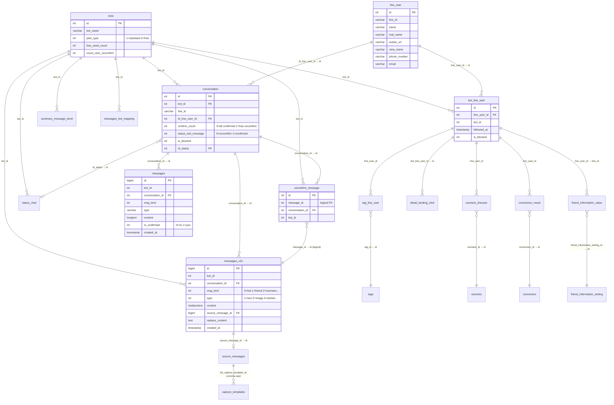
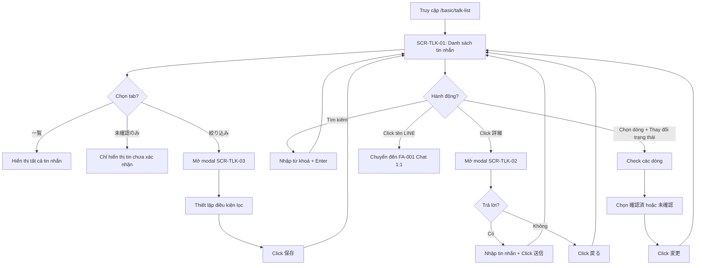

# [FA-002] Quản lý chat (「チャット管理」) — Feature Spec

> **Mã tính năng**: FA-002
> **Portal**: Admin
> **Ngày tổng hợp**: 2026-03-25
> **Nguồn**: ui-spec.md, api-spec.md, logic-spec.md, db-mapping.md, validation-report.md

---

## 1. Tổng quan

### Mục đích
Tính năng **Quản lý chat** (「チャット管理」) cho phép Admin/Staff xem, tìm kiếm, lọc và quản lý toàn bộ tin nhắn nhận được từ bạn bè LINE. Đây là giao diện tổng hợp dạng bảng (list view) — khác với FA-001 (Chat 1:1) là giao diện chat theo từng cuộc trò chuyện.

### Chức năng chính
- Hiển thị danh sách tin nhắn nhận được, sắp xếp theo thời gian mới nhất
- Tìm kiếm tin nhắn theo nội dung (keyword search)
- Lọc theo trạng thái (tất cả / chỉ chưa xác nhận), khoảng thời gian, và bộ lọc nâng cao (tag, tên bạn bè, ngày thêm bạn, step, QR code, conversion, thông tin bạn bè)
- Xem chi tiết tin nhắn và trả lời trực tiếp từ modal
- Thay đổi trạng thái xác nhận hàng loạt (「確認済」/「未確認」)

### Đối tượng sử dụng (Actors)

| Actor | Vai trò | Quyền truy cập |
|-------|---------|----------------|
| Admin | Quản lý LINE Official Account | Toàn quyền — xem, tìm kiếm, lọc, thay đổi trạng thái, trả lời tin nhắn |
| Staff | Nhân viên do Admin tạo | Tuỳ role — phụ thuộc middleware `basic_access` và cấu hình role Staff. Không có kiểm tra permission riêng trong controller [Confidence: **Trung bình**] |

### Phạm vi
- **URL chính**: `/basic/talk-list`
- **Controller**: `App\Http\Controllers\Basic\TalkListController`
- **Số màn hình**: 3 (1 trang chính + 2 modal)
- **Số endpoints**: 6
- **Background jobs**: Không có

---

## 2. Các màn hình và Luồng xử lý end-to-end

### SCR-TLK-01: Màn hình danh sách tin nhắn (Trang chính)

**URL**: `/basic/talk-list`
**Tiêu đề trang**: 「チャット管理」

#### Layout
Gồm sidebar menu Admin portal bên trái và vùng nội dung chính bên phải, chia thành:
1. Header: Tiêu đề「チャット管理」
2. Thanh tìm kiếm:「メッセージ検索」
3. Thanh công cụ: Tabs filter + checkbox「返信を含める」+ bộ lọc khoảng thời gian
4. Bảng dữ liệu: Danh sách tin nhắn nhận được
5. Khu vực thay đổi trạng thái hàng loạt:「ステータス 一括変更」

#### Luồng end-to-end: Load trang

| Bước | Actor/Component | Hành động | Chi tiết |
|------|----------------|-----------|----------|
| 1 | User | Truy cập `/basic/talk-list` | — |
| 2 | Browser → Server | GET `/basic/talk-list` | **EP-01** |
| 3 | `TalkListController@index` | Render view `basic.talk_list.index` | Truyền `startDate=null`, `endDate=null` |
| 4 | Browser (JS) | Auto-call AJAX sau khi render | POST `/ajax/get-talk-list-v2` |
| 5 | `TalkListController@ajaxGetTalkListData` | Lấy `bot_id` từ session, gọi `BotLineUser::makeDataTalkList()` | **EP-02** với `status=[0]`, `offset=0`, `isLoadMsgNew=1` |
| 6 | `BotLineUser::makeDataTalkList()` | Truy vấn `messages_v2s` (ưu tiên) → fallback `messages` → sharded tables | Limit 100 records, ORDER BY id DESC |
| 7 | Controller | Với mỗi tin nhắn: lookup `Conversation` → `UnconfirmMessage` → `LineUser` | Gán `is_confirmed`, `name`, `avatar_user`, `line_id` |
| 8 | Server → Browser | JSON response chứa `talk_list.items[]` | Mỗi item gồm: id, content, msg_kind, msg_type, msg_created_at, is_confirmed, name, avatar_user, line_id |
| 9 | Browser | Render bảng dữ liệu | Hiển thị: trạng thái badge, ngày giờ, tên LINE (link), nội dung, nút「詳細」 |

#### Luồng end-to-end: Tìm kiếm tin nhắn (「メッセージ検索」)

| Bước | Actor/Component | Hành động | Chi tiết |
|------|----------------|-----------|----------|
| 1 | User | Nhập từ khoá vào ô「メッセージ検索」, click icon hoặc nhấn Enter | — |
| 2 | Browser → Server | POST `/ajax/get-talk-list-v2` | **EP-02** với `keyword_search="{từ khoá}"` |
| 3 | `BotLineUser::getListMessagesV2()` | Thêm `WHERE content LIKE '%keyword%'` vào query | — |
| 4 | Server → Browser | JSON response | Chỉ tin nhắn có nội dung khớp từ khoá |

#### Luồng end-to-end: Chuyển tab「未確認のみ」

| Bước | Actor/Component | Hành động | Chi tiết |
|------|----------------|-----------|----------|
| 1 | User | Click tab「未確認のみ」 | — |
| 2 | Browser → Server | POST `/ajax/get-talk-list-v2` | **EP-02** với `status=[0, 4]` |
| 3 | `BotLineUser::makeDataTalkList()` | Lấy danh sách `UnconfirmMessage` IDs (limit 1000), thêm `WHERE id IN (messageUnConfirm) AND msg_kind=1` | — |
| 4 | Server → Browser | JSON response | Chỉ tin nhắn chưa xác nhận |

#### Luồng end-to-end: Check「返信を含める」

| Bước | Actor/Component | Hành động | Chi tiết |
|------|----------------|-----------|----------|
| 1 | User | Check checkbox「返信を含める」 | — |
| 2 | Browser → Server | POST `/ajax/get-talk-list-v2` | **EP-02** với `status=[0, 1]` |
| 3 | `BotLineUser::getListMessagesV2()` | Thay `WHERE msg_kind=1` bằng `WHERE msg_kind != 2` (bao gồm tin bot/admin gửi, loại trừ scenario) | — |
| 4 | Server → Browser | JSON response | Bao gồm cả tin nhắn gửi đi (trừ scenario) |

#### Luồng end-to-end: Lọc khoảng thời gian

| Bước | Actor/Component | Hành động | Chi tiết |
|------|----------------|-----------|----------|
| 1 | User | Chọn ngày bắt đầu / kết thúc (hoặc click「全期間」để xoá) | — |
| 2 | Browser → Server | POST `/ajax/get-talk-list-v2` | **EP-02** với `start_date`, `end_date` (hoặc `null` khi「全期間」) |
| 3 | Query | Thêm `WHERE created_at >= start_date AND created_at <= end_date` | — |

#### Luồng end-to-end: Thay đổi trạng thái hàng loạt

| Bước | Actor/Component | Hành động | Chi tiết |
|------|----------------|-----------|----------|
| 1 | User | Check checkbox các dòng cần thay đổi (hoặc「ページ内選択」chọn tất cả) | — |
| 2 | User | Chọn radio「確認済」hoặc「未確認」, click「変更」 | — |
| 3 | Browser → Server | POST `/ajax/change-status-message` | **EP-05** với `type_action="simple"`, `messages=[id1, id2, ...]`, `status=1` (確認済) hoặc `status=2` (未確認) |
| 4 | `TalkListController@changeStatusMessage()` | Xử lý từng message ID | — |
| 5a | Nếu `status=1` (確認済) | Batch DELETE từ `unconfirm_message` | Xoá record = đánh dấu đã xác nhận |
| 5b | Nếu `status=2` (未確認) | INSERT vào `unconfirm_message` (nếu chưa có), UPDATE `messages.is_confirmed=0` (chỉ bảng legacy) | — |
| 6 | Controller | Cập nhật `conversation.confirm_count`, `conversation.status_last_message` | Nếu `confirm_count` thay đổi → ghi `SyncElasticsearch` |
| 7 | Controller | Đếm lại `bots.count_user_unconfirm` | — |
| 8 | Controller | Gọi `updateBadge()` → FCM push notification | Cập nhật badge count trên mobile app |
| 9 | Controller | Broadcast `InfoEvent` qua WebSocket | Cập nhật realtime: `totalUserConfirmMessage`, `totalErrorMessage`, `totalGroupConfirmMessage` |
| 10 | Server → Browser | `{"success": true}` | UI reload danh sách |

#### Luồng end-to-end: Click tên LINE → Chat 1:1

| Bước | Actor/Component | Hành động | Chi tiết |
|------|----------------|-----------|----------|
| 1 | User | Click tên LINE (link) trong cột「LINE名」 | — |
| 2 | Browser | Navigate đến `/basic/chat-v3?friend_id={friend_id}` | Chuyển sang tính năng FA-001 (Chat 1:1) |

---

### SCR-TLK-02: Modal xem chi tiết tin nhắn

**URL**: Vẫn là `/basic/talk-list` (dialog overlay)
**Tiêu đề modal**: 「{LINE名} さんからのメッセージ」

#### Layout
Dialog modal overlay gồm: Avatar + link tên bạn bè + thời gian + nội dung tin nhắn đầy đủ + form trả lời + nút「戻る」/「送信」.

> **Lưu ý**: Link tên bạn bè trong modal trỏ đến `/basic/friendlist/my_page/{friend_id}` (trang cá nhân bạn bè — FA-013), khác với link trong bảng chính trỏ đến `/basic/chat-v3?friend_id={friend_id}` (Chat 1:1 — FA-001).

#### Luồng end-to-end: Xem chi tiết tin nhắn

| Bước | Actor/Component | Hành động | Chi tiết |
|------|----------------|-----------|----------|
| 1 | User | Click nút「詳細」trên một dòng trong bảng | — |
| 2 | Browser → Server | POST `/ajax/get-detail-message-talk-list` | **EP-03** với `id_message={message_id}` |
| 3 | `TalkListController@getDetailMessageTalkList()` | Truy vấn `MessagesV2` WHERE `id=id_message AND bot_id=botId` | **Chỉ truy vấn bảng `messages_v2s`** — không fallback sang bảng legacy |
| 4a | Nếu có `source_message` | Parse `list_capture_template_id` → truy vấn từng `CaptureTemplate` → áp dụng `replace_content` → decode media | Trả `type_data="template"` |
| 4b | Nếu không có `source_message` | Áp dụng `replace_content` lên nội dung → decode media (audio, sticker, file, PDF, location) | Trả `type_data="msg"` |
| 5 | Server → Browser | JSON response chứa mảng `message[]` | — |
| 6 | Browser | Hiển thị modal SCR-TLK-02 | Avatar, tên, thời gian, nội dung đầy đủ, form trả lời |

#### Luồng end-to-end: Trả lời tin nhắn (「送信」)

| Bước | Actor/Component | Hành động | Chi tiết |
|------|----------------|-----------|----------|
| 1 | User | Nhập nội dung vào ô「メッセージ返信」 | — |
| 2 | User | Click「送信」 | — |
| 3 | Browser → Server | POST `/ajax/talk-list-send-message` | **EP-04** với `line_id="{LINE user ID}"`, `msg="{nội dung}"` |
| 4 | `TalkListController@ajaxTalkSendMessage()` | Tìm `LineUser` → `Conversation` | — |
| 5 | `MessageService::createMessageV2()` | Tạo message (`msg_kind=0`, `type=1`), gọi LINE Push Message API | — |
| 6a | Nếu thành công | Tạo record `messages_v2s`, tăng `bots.free_send_count += 1`, cập nhật `summary_message_send` | `{"success": true}` |
| 6b | Nếu free plan và đạt giới hạn 1000 tin | Trả lỗi | `{"result": "error", "error_code": "limit_max", "error_message": "配信数上限に達しています..."}` |
| 6c | Nếu LINE API thất bại | Trả lỗi | `{"success": false, "msg": "{LINE API error}"}` |

---

### SCR-TLK-03: Modal filter nâng cao (「絞り込み設定」)

**URL**: Vẫn là `/basic/talk-list` (dialog overlay)
**Tiêu đề modal**: 「絞り込み設定」

#### Layout
Dialog modal gồm:
1. Phần hiển thị (「表示設定」): Checkbox bao gồm tin nhắn media (「【〇〇】メッセージ」) và sticker (「スタンプ」)
2. Phần điều kiện lọc (「and条件」): 8 bộ lọc accordion — tất cả điều kiện phải thoả mãn đồng thời (AND logic)
3. Nút「保存」: Áp dụng điều kiện

> **Cross-reference**: Modal filter này là **biến thể** của SC-003 (Friend Filter/Segment). Các bộ lọc accordion trùng với tiêu chí lọc bạn bè dùng trong broadcast (FA-008), step delivery (FA-009), friend list (FA-013). Điểm khác biệt: có thêm phần「表示設定」và bộ lọc「メッセージ確認状況」— đặc thù cho chat management.

#### Luồng end-to-end: Lọc nâng cao

| Bước | Actor/Component | Hành động | Chi tiết |
|------|----------------|-----------|----------|
| 1 | User | Click tab「絞り込み」trên SCR-TLK-01 | — |
| 2 | Browser → Server | GET `/ajax/talk-list/get-data-common-filter` | **EP-06** — lấy danh sách scenario, conversion, status chat |
| 3 | Browser | Hiển thị modal SCR-TLK-03 với dữ liệu dropdown | — |
| 4 | User | Thiết lập điều kiện: check/uncheck display settings, mở accordion bộ lọc và cấu hình | — |
| 5 | User | Click「保存」 | — |
| 6 | Browser → Server | POST `/ajax/get-talk-list-v2` | **EP-02** với `condition_filter="{JSON string}"`, `condition_message=[...]` |
| 7 | `BotLineUser::makeDataTalkList()` | Gọi `Conversation::advanceFilterPost()` → lấy danh sách `conversation_id` phù hợp → lọc messages | — |
| 8 | Server → Browser | JSON response | Danh sách tin nhắn đã lọc |

#### Danh sách 8 bộ lọc nâng cao

| # | Tên bộ lọc | Label JP | Bảng DB | Logic | Confidence |
|---|-----------|---------|--------|-------|-----------|
| 1 | Tag | 「タグ」 | `tag_line_user`, `tags` | 4 modes: ít nhất 1 tag (0), tất cả tags (1), không có tag nào (2), không đủ hết (3) | **Cao** |
| 2 | Tên bạn bè | 「友だち名」 | `line_user` | LIKE trên `name` và/hoặc `view_name` | **Cao** |
| 3 | Ngày thêm bạn | 「友だち追加日」 | `bot_line_user` | 2 kiểu: khoảng ngày (type=0) hoặc N ngày trước (type=1). Cột: `followed_at` | **Cao** |
| 4 | Step/Scenario | 「ステップ購読状況」 | `scenario_lineuser` | 7 điều kiện: đang follow (0), không follow (1), ở ngày N (2), hoàn thành (3), chưa hoàn thành (4), dừng/hoàn thành (5), dừng (6) | **Cao** |
| 5 | QR Code Action | 「QRコードアクション」 | `detail_landing_click` | Lọc theo QR code đã quét, `is_action_web=1` hoặc `2` | **Cao** |
| 6 | Conversion | 「コンバージョン」 | `conversion_result` | 2 modes: đã convert tất cả (0), chưa convert hết (1) | **Cao** |
| 7 | Trạng thái xác nhận | 「メッセージ確認状況」 | `conversation` | `status_last_message` hoặc `id_status` | **Trung bình** |
| 8 | Thông tin bạn bè | 「友だち情報」 | `friend_information_value`, `line_user` | Dynamic fields, 6 kiểu so sánh: 完全一致 (1), 部分一致 (2), 完全一致を含まない (3), 部分一致を含まない (4), 情報登録あり (5), 情報登録なし (6) | **Cao** |

---

## 3. Data Model

### Entities chính

| # | Bảng | Connection | Vai trò | Data size |
|---|------|-----------|---------|-----------|
| 1 | `messages_v2s` | `mysql_message` | Bảng tin nhắn chính (mới nhất), ưu tiên truy vấn đầu tiên | 56.2MB |
| 2 | `messages` | `mysql_message` | Bảng tin nhắn legacy (currentYear=0) | 25.2MB |
| 3 | `unconfirm_message` | `mysql` | Tracking tin nhắn chưa xác nhận (existence-based flag) | 335KB |
| 4 | `conversation` | `mysql` | Cuộc trò chuyện giữa bot và LINE user | 68.8MB |
| 5 | `line_user` | `mysql` | Thông tin LINE user — tên, avatar | 139.1MB |
| 6 | `bot_line_user` | `mysql` | Bảng nối bot ↔ LINE user, trung tâm cho advance filter | 137.2MB |
| 7 | `bots` | `mysql` | Thông tin bot — đếm unconfirm, giới hạn gửi tin | 440KB |

### Bảng phụ (sharding, filter, side effects)

| # | Bảng | Vai trò |
|---|------|---------|
| 8-10 | `messages_2024`, `messages_page_2`, `messages_old` | Bảng tin nhắn sharded theo năm / legacy |
| 11-12 | `messages_bot_mapping`, `messages_conversation_mapping` | Metadata sharding — xác định năm có dữ liệu |
| 13-14 | `source_messages`, `capture_templates` | Nguồn gốc và template tin nhắn — dùng trong xem chi tiết |
| 15 | `status_chat` | Trạng thái chat tuỳ chỉnh — dùng trong bộ lọc nâng cao |
| 16-17 | `tags`, `tag_line_user` | Tags — dùng trong bộ lọc nâng cao |
| 18-19 | `scenario`, `scenario_lineuser` | Scenario/step — dùng trong bộ lọc nâng cao |
| 20-21 | `conversion`, `conversion_result` | Conversion — dùng trong bộ lọc nâng cao |
| 22 | `detail_landing_click` | QR code / landing click — dùng trong bộ lọc nâng cao |
| 23-24 | `friend_information_setting`, `friend_information_value` | Thông tin bạn bè tuỳ chỉnh — dùng trong bộ lọc nâng cao |
| 25 | `summary_message_send` | Thống kê gửi tin — cập nhật khi trả lời |
| 26 | `sync_elasticsearch` | Đồng bộ Elasticsearch — ghi khi thay đổi trạng thái |
| 27 | `sticker` | Danh sách sticker LINE — hiển thị tin nhắn sticker |

### ER Diagram



### Kiến trúc Message Sharding

Tin nhắn được lưu trong nhiều bảng, truy vấn theo thứ tự ưu tiên:

```
1. messages_v2s          ← Mới nhất, ưu tiên
2. messages              ← currentYear=0 (default legacy)
3. messages2025          ← Năm 2025
4. messages2024          ← Năm 2024
5. ...giảm dần...
6. messages2020          ← Năm 2020
7. messages_page_2       ← Cũ hơn
8. messages_old          ← Cổ nhất
```

Hệ thống dùng `messages_bot_mapping` để xác định bot có dữ liệu ở năm nào. Mỗi lần lazy load lấy 100 records, có thể span qua nhiều bảng. [Confidence: **Cao**]

### Kiến trúc Confirm/Unconfirm

```
unconfirm_message ←→ conversation ←→ bots
       │                    │              │
       │ message_id         │ confirm_count│ count_user_unconfirm
       │ conversation_id    │ status_last_ │
       │ bot_id             │   message    │
       │                    │              │
    Tạo = 未確認         0 = all confirmed  Đếm conversations
    Xoá = 確認済         1 = has unconfirm  có confirm_count=1
```

Sử dụng pattern **existence-based flag**: record tồn tại trong `unconfirm_message` = tin nhắn chưa xác nhận. Xoá record = đã xác nhận. Không dùng boolean flag trực tiếp trên `messages_v2s` (bảng legacy `messages` có `is_confirmed` nhưng chỉ là backup). [Confidence: **Cao**]

---

## 4. Field Traceability Matrix

### 4.1. Bảng dữ liệu chính (SCR-TLK-01)

| # | UI Element | Label JP | Màn hình | DB Table.Column | Hướng | Validation | Business Rule |
|---|-----------|---------|---------|----------------|-------|-----------|--------------|
| 1 | Trạng thái xác nhận | 「ステータス」 | SCR-TLK-01 | `unconfirm_message` (existence) → response `is_confirmed` | Read | — | Có record = 未確認 (0), không có = 確認済 (1) |
| 2 | Ngày giờ nhận | 「受信日時」 | SCR-TLK-01 | `messages_v2s.created_at` / `messages.created_at` | Read | — | Format: YYYY/MM/DD HH:mm |
| 3 | Tên LINE | 「LINE名」 | SCR-TLK-01 | `line_user.name` (FK chain: messages → conversation → line_user) | Read | — | Là link đến `/basic/chat-v3?friend_id={id}` |
| 4 | Avatar | (hình ảnh) | SCR-TLK-01 | `line_user.avatar_url` (cùng FK chain) | Read | — | — |
| 5 | Nội dung tin nhắn | 「メッセージ内容」 | SCR-TLK-01 | `messages_v2s.content` / `messages.content` | Read | — | Text thuần hoặc placeholder media: 【音声】, 【ファイル】, 【位置情報】 |
| 6 | Loại tin nhắn (ẩn) | — | SCR-TLK-01 | `messages_v2s.type` | Read | — | Xác định cách hiển thị: 1=text, 4=audio, 5=sticker, 12=file, 13=location |
| 7 | Loại gửi (ẩn) | — | SCR-TLK-01 | `messages_v2s.msg_kind` / `messages.msg_kind` | Read | — | 0=bot/admin, 1=friend. Dùng cho filter reception/send |
| 8 | ID tin nhắn (ẩn) | — | SCR-TLK-01 | `messages_v2s.id` / `messages.id` | Read | — | Dùng cho EP-03, EP-05 |
| 9 | Conversation ID (ẩn) | — | SCR-TLK-01 | `messages_v2s.conversation_id` | Read | — | FK → `conversation.id` |
| 10 | LINE ID (ẩn) | — | SCR-TLK-01 | `line_user.line_id` (FK chain) | Read | — | Dùng cho EP-04 gửi tin |
| 11 | Blocked (ẩn) | — | SCR-TLK-01 | `conversation.is_blocked` | Read | — | — |

### 4.2. Bộ lọc cơ bản (SCR-TLK-01)

| # | UI Element | Label JP | Màn hình | DB Table.Column | Hướng | Validation | Business Rule |
|---|-----------|---------|---------|----------------|-------|-----------|--------------|
| 12 | Tìm kiếm nội dung | 「メッセージ検索」 | SCR-TLK-01 | `messages_v2s.content` / `messages.content` (LIKE) | Filter | — | `WHERE content LIKE '%keyword%'` |
| 13 | Bao gồm phản hồi | 「返信を含める」 | SCR-TLK-01 | `messages_v2s.msg_kind` / `messages.msg_kind` | Filter | — | Không check: `msg_kind=1`. Check: `msg_kind != 2` |
| 14 | Ngày bắt đầu | 「表示期間」from | SCR-TLK-01 | `messages_v2s.created_at` / `messages.created_at` | Filter | Format YYYY-MM-DD | `WHERE created_at >= start_date` |
| 15 | Ngày kết thúc | 「表示期間」to | SCR-TLK-01 | `messages_v2s.created_at` / `messages.created_at` | Filter | Format YYYY-MM-DD | `WHERE created_at <= end_date` |
| 16 | Tab「一覧」 | — | SCR-TLK-01 | `messages_v2s.msg_kind` | Filter | — | `status=[0]` → `msg_kind=1` (chỉ tin nhận) |
| 17 | Tab「未確認のみ」 | — | SCR-TLK-01 | `unconfirm_message.id` (IN list) | Filter | — | `status=[0,4]` → `WHERE id IN (unconfirm IDs)` |

### 4.3. Actions (SCR-TLK-01)

| # | UI Element | Label JP | Màn hình | DB Table.Column bị ảnh hưởng | Hướng | Validation | Business Rule |
|---|-----------|---------|---------|------------------------------|-------|-----------|--------------|
| 18 | Đổi sang 確認済 | 「確認済」+「変更」 | SCR-TLK-01 | `unconfirm_message` (DELETE), `conversation.confirm_count`, `conversation.status_last_message`, `bots.count_user_unconfirm`, `sync_elasticsearch` | Write | — | Xoá record `unconfirm_message`, cập nhật counters, FCM + WebSocket |
| 19 | Đổi sang 未確認 | 「未確認」+「変更」 | SCR-TLK-01 | `unconfirm_message` (INSERT), `messages.is_confirmed` (legacy), `conversation.confirm_count`, `conversation.status_last_message`, `bots.count_user_unconfirm`, `sync_elasticsearch` | Write | — | Tạo record `unconfirm_message`, cập nhật `is_confirmed=0` (legacy), counters, FCM + WebSocket |

### 4.4. Modal chi tiết (SCR-TLK-02)

| # | UI Element | Label JP | Màn hình | DB Table.Column | Hướng | Validation | Business Rule |
|---|-----------|---------|---------|----------------|-------|-----------|--------------|
| 20 | Tên bạn bè (link) | — | SCR-TLK-02 | `line_user.name` | Read | — | Link đến `/basic/friendlist/my_page/{friend_id}` |
| 21 | Thời gian | — | SCR-TLK-02 | `messages_v2s.created_at` | Read | — | Format YYYY/MM/DD HH:mm |
| 22 | Nội dung tin nhắn | — | SCR-TLK-02 | `messages_v2s.content` / `capture_templates.content` + `messages_v2s.replace_content` | Read | — | Nếu có `source_message` → lấy từ capture templates và thay biến |
| 23 | Ô nhập trả lời | 「メッセージ返信」 | SCR-TLK-02 | — (input chỉ UI) | — | — | Chỉ gửi khi click「送信」 |
| 24 | Gửi trả lời | 「送信」 | SCR-TLK-02 | `messages_v2s` (INSERT), `bots.free_send_count` (+1), `summary_message_send` (+1) | Write | `line_id` + `msg` bắt buộc (không có FormRequest) | msg_kind=0, type=1. Gọi LINE Push API |

### 4.5. Bộ lọc nâng cao (SCR-TLK-03)

| # | UI Element | Label JP | Màn hình | DB Table.Column | Hướng | Validation | Business Rule |
|---|-----------|---------|---------|----------------|-------|-----------|--------------|
| 25 | Tin nhắn media | 「【〇〇】メッセージ」 | SCR-TLK-03 | `messages_v2s.content` / `messages.content` | Filter | — | Mặc định ẩn `WHERE content NOT LIKE '【%】'`. Bật → bỏ điều kiện |
| 26 | Sticker | 「スタンプ」 | SCR-TLK-03 | `messages_v2s.type` / `messages.type` | Filter | — | Mặc định ẩn `WHERE type != 5`. Bật → bỏ điều kiện |
| 27 | Tag | 「タグ」 | SCR-TLK-03 | `tag_line_user.tag_id`, `tag_line_user.line_user_id` | Filter | — | JOIN qua `bot_line_user`. 4 modes lọc |
| 28 | Tên bạn bè | 「友だち名」 | SCR-TLK-03 | `line_user.name`, `line_user.view_name` | Filter | — | LIKE search |
| 29 | Ngày thêm bạn | 「友だち追加日」 | SCR-TLK-03 | `bot_line_user.followed_at` | Filter | — | 2 kiểu: khoảng ngày hoặc N ngày trước |
| 30 | Step/Scenario | 「ステップ購読状況」 | SCR-TLK-03 | `scenario_lineuser.is_following`, `.start_day`, `.stop_datetime` | Filter | — | 7 điều kiện lọc |
| 31 | QR Code Action | 「QRコードアクション」 | SCR-TLK-03 | `detail_landing_click.landing_id`, `.is_action_web` | Filter | — | `is_action_web=1` hoặc `2` |
| 32 | Conversion | 「コンバージョン」 | SCR-TLK-03 | `conversion_result.conversion_id`, `.line_user_id` | Filter | — | 2 modes: đã convert tất cả / chưa convert hết |
| 33 | Trạng thái xác nhận | 「メッセージ確認状況」 | SCR-TLK-03 | `conversation.status_last_message` / `conversation.id_status` | Filter | — | [Confidence: **Trung bình**] |
| 34 | Thông tin bạn bè | 「友だち情報」 | SCR-TLK-03 | `friend_information_value.value`, `line_user.view_name/phone_number/email` | Filter | — | Dynamic fields, 6 kiểu so sánh |

---

## 5. Business Rules

| # | Rule | Mô tả chi tiết | Nơi implement | Confidence |
|---|------|----------------|--------------|-----------|
| BR-01 | **Trạng thái xác nhận dựa trên unconfirm_message** | Tin nhắn「未確認」khi có record trong `unconfirm_message`. Đánh dấu「確認済」→ xoá record (DELETE). Đánh dấu「未確認」→ tạo record mới (INSERT). Pattern "existence-based flag" | `TalkListController@changeStatusMessage` | **Cao** |
| BR-02 | **Messages sharding theo năm** | Tin nhắn lưu trong nhiều bảng: `messages_v2s` → `messages` → `messages2025`..`messages2020` → `messages_page_2` → `messages_old`. Truy vấn ưu tiên mới nhất → cũ nhất | `BotLineUser::makeDataTalkList()` | **Cao** |
| BR-03 | **Phân trang lazy load, mỗi lần 100 records** | Không dùng pagination truyền thống. Client gửi `offset` + `currentYear` + `isLoadMsgNew` → server trả 100 records tiếp theo, có thể span qua nhiều bảng. `flagEnd` báo hiệu còn dữ liệu cũ hơn hay không | `BotLineUser::makeDataTalkList()` | **Cao** |
| BR-04 | **Mặc định ẩn tin nhắn media và sticker** | Nếu `condition_message` không chứa flag tương ứng, query tự động thêm `WHERE content NOT LIKE '【%】' AND type != 5`. Phải bật checkbox trong modal filter để xem | `BotLineUser::getListMessagesV2()` | **Cao** |
| BR-05 | **Giới hạn gửi tin miễn phí: 1000 tin** | Bot free plan (`plan_type=2`) bị giới hạn 1000 tin nhắn gửi. Khi `free_send_count >= 1000` → lỗi `limit_max` với thông báo「配信数上限に達しています。こちらから契約内容を確認してください。」 | `TalkListController@ajaxTalkSendMessage` | **Cao** |
| BR-06 | **Sync Elasticsearch khi thay đổi trạng thái** | Khi `confirm_count` của conversation thay đổi → ghi record vào `sync_elasticsearch` để đồng bộ dữ liệu tìm kiếm | `TalkListController@changeStatusMessage` | **Cao** |
| BR-07 | **Badge update qua FCM + WebSocket** | Sau khi thay đổi trạng thái: cập nhật `bots.count_user_unconfirm`, gửi FCM push notification cập nhật badge mobile, broadcast `InfoEvent` qua WebSocket cập nhật realtime web (totalUserConfirmMessage, totalErrorMessage, totalGroupConfirmMessage) | `TalkListController@changeStatusMessage` | **Cao** |
| BR-08 | **Filter nâng cao dùng chung Conversation::advanceFilterPost()** | Bộ lọc nâng cao (tag, friend_name, day_add_friend, scenario, conversion, qr_code, friend_info) sử dụng cùng method `advanceFilterPost()` — shared logic với broadcast (FA-008), friend list (FA-013), step delivery (FA-009). Tương ứng SC-003 (Friend Filter/Segment) | `Conversation::advanceFilterPost()` | **Cao** |
| BR-09 | **Chỉ tin nhắn từ bạn bè khi lọc "reception"** | Tab mặc định「一覧」gửi `status=[0]`. Query thêm `WHERE msg_kind = 1` — chỉ hiển thị tin nhắn bạn bè gửi, không hiển thị tin bot/admin/scenario | `BotLineUser::getListMessagesV2()` | **Cao** |
| BR-10 | **「返信を含める」bao gồm tin gửi** | Khi check, `status=[0,1]`. Khi `send` có mặt, query dùng `WHERE msg_kind != 2` thay vì `msg_kind=1` — bao gồm tin bot gửi nhưng luôn loại trừ scenario (msg_kind=2) | `BotLineUser::getListMessagesV2()` | **Cao** |
| BR-11 | **Detail message chỉ từ MessagesV2** | `getDetailMessageTalkList()` chỉ truy vấn bảng `messages_v2s`. Tin nhắn cũ từ bảng legacy không hiển thị được chi tiết qua modal. Đây là hạn chế kiến trúc | `TalkListController@getDetailMessageTalkList()` | **Cao** |

---

## 6. API Endpoints

### Tổng quan

| EP | Method | URI | Mô tả | Side effects |
|----|--------|-----|-------|-------------|
| EP-01 | GET | `/basic/talk-list` | Render trang HTML | Không |
| EP-02 | POST | `/ajax/get-talk-list-v2` | Lấy danh sách tin nhắn (lazy load) | Không |
| EP-03 | POST | `/ajax/get-detail-message-talk-list` | Lấy chi tiết 1 tin nhắn | Không |
| EP-04 | POST | `/ajax/talk-list-send-message` | Gửi tin nhắn trả lời | LINE Push API, messages_v2s INSERT, bots UPDATE, summary_message_send UPDATE |
| EP-05 | POST | `/ajax/change-status-message` | Thay đổi trạng thái xác nhận | unconfirm_message INSERT/DELETE, conversation UPDATE, bots UPDATE, sync_elasticsearch INSERT, FCM, WebSocket |
| EP-06 | GET | `/ajax/talk-list/get-data-common-filter` | Lấy dữ liệu bộ lọc nâng cao | Không |

### Chi tiết Endpoints

#### EP-01: GET `/basic/talk-list`
- **Controller**: `TalkListController@index`
- **Middleware**: `web`, `basic_access`, `https_protocol`, `is_expire`, `check_remember_token`
- **Mô tả**: Render view Blade `basic.talk_list.index` với `startDate=null`, `endDate=null`. Dữ liệu được load AJAX sau render.
- **Response**: HTML

#### EP-02: POST `/ajax/get-talk-list-v2`
- **Controller**: `TalkListController@ajaxGetTalkListData`
- **Middleware**: `web`, `check_login`, `check_remember_token`
- **Mô tả**: Lấy danh sách tin nhắn với bộ lọc, phân trang lazy load (offset-based, 100 records/lần)
- **Request chính**: `status` (Array[Int]), `start_date`, `end_date`, `condition_filter` (JSON string), `condition_message` (Array[Int]), `offset` (Int), `keyword_search` (String), `lastMessageId` (Int), `currentYear` (Int), `isLoadMsgNew` (Int)
- **Response**: `{"status": true, "talk_list": {"items": [...], "offset": N, "flagEnd": 0|1, ...}, "bot_name": "..."}`
- **Lỗi**: `{"status": false, "msg": "{error}"}`

#### EP-03: POST `/ajax/get-detail-message-talk-list`
- **Controller**: `TalkListController@getDetailMessageTalkList`
- **Middleware**: `web`, `check_login`, `check_remember_token`
- **Mô tả**: Lấy chi tiết 1 tin nhắn. Chỉ truy vấn `messages_v2s` — không fallback sang bảng legacy.
- **Request**: `id_message` (Int, bắt buộc)
- **Response**: `{"message": [{"id": N, "content": "...", "type_data": "msg"|"template", ...}]}`
- **Lỗi**: `{"status": false, "msg": "{error}"}`

#### EP-04: POST `/ajax/talk-list-send-message`
- **Controller**: `TalkListController@ajaxTalkSendMessage`
- **Middleware**: `web`, `check_login`, `check_remember_token`
- **Mô tả**: Gửi tin nhắn text trả lời cho bạn bè LINE. Gọi LINE Push Message API qua `MessageService::createMessageV2()`.
- **Request**: `line_id` (String, bắt buộc), `msg` (String, bắt buộc)
- **Response thành công**: `{"success": true}`
- **Response lỗi**: `{"success": false, "msg": "{LINE API error}"}` hoặc `{"result": "error", "error_code": "limit_max", "error_message": "配信数上限に達しています..."}`
- **Side effects**: INSERT `messages_v2s`, UPDATE `bots.free_send_count` +1, UPDATE `summary_message_send`, WebSocket broadcast

#### EP-05: POST `/ajax/change-status-message`
- **Controller**: `TalkListController@changeStatusMessage`
- **Middleware**: `web`, `check_login`, `check_remember_token`
- **Mô tả**: Thay đổi trạng thái xác nhận. 2 modes: `simple` (chọn từng tin) và `all` (tất cả theo bộ lọc).
- **Request (simple)**: `status` (Int: 1=確認済, 2=未確認), `type_action="simple"`, `messages` (Array[Int])
- **Request (all)**: `status`, `type_action="all"`, `filter_status`, `start_date`, `end_date`, `condition_filter`, `condition_message`, `keyword_search`
- **Response**: `{"success": true}`
- **Side effects**: INSERT/DELETE `unconfirm_message`, UPDATE `conversation.confirm_count/status_last_message`, UPDATE `bots.count_user_unconfirm`, INSERT `sync_elasticsearch`, FCM push notification, WebSocket broadcast `InfoEvent`

#### EP-06: GET `/ajax/talk-list/get-data-common-filter`
- **Controller**: `TalkListController@ajaxGetDataCommonFilter`
- **Middleware**: `web`, `check_login`, `check_remember_token`
- **Mô tả**: Lấy dữ liệu cho bộ lọc nâng cao (danh sách scenario, conversion, status chat)
- **Request**: Không có tham số (Bot ID từ session)
- **Response**: `{"status": true, "scenario": [...], "conversion": [...], "statusObject": [...]}`

### Middleware phân tích

| Middleware | Mô tả | Áp dụng |
|-----------|-------|---------|
| `web` | Session-based authentication | Tất cả |
| `basic_access` | Kiểm tra quyền truy cập Basic portal (Admin/Staff) | EP-01 |
| `check_login` | Kiểm tra user đã đăng nhập | EP-02~06 |
| `check_remember_token` | Kiểm tra remember token hợp lệ | Tất cả |
| `https_protocol` | Chuyển hướng sang HTTPS | EP-01 |
| `is_expire` | Kiểm tra tài khoản/bot chưa hết hạn | EP-01 |

> **Ghi chú**: Bot ID lấy từ session qua `getBotId()`. Tất cả endpoint đều filter theo `bot_id` — chỉ xem được tin nhắn của bot đang chọn. [Confidence: **Cao**]

---

## 7. Background Jobs

**Không có.** Tính năng Quản lý chat không sử dụng background jobs (Spring Boot). Tất cả xử lý đều đồng bộ trong HTTP request, bao gồm:
- Gọi LINE Push Message API (EP-04) — đồng bộ trong request
- FCM push notification (EP-05) — đồng bộ trong request
- WebSocket broadcast (EP-05) — đồng bộ trong request

---

## 8. Phụ thuộc chéo (Cross-references)

### Tính năng liên quan

| Thành phần | Mã | Mô tả liên quan |
|-----------|-----|----------------|
| Chat 1:1 | FA-001 | Link tên LINE trong bảng chuyển đến `/basic/chat-v3?friend_id={id}` (Chat 1:1). Gửi tin nhắn trả lời (EP-04) dùng chung `MessageService::createMessageV2()` |
| Quản lý thẻ | FA-012 | Tags được quản lý tại FA-012, sử dụng để lọc trong modal filter |
| Danh sách bạn bè | FA-013 | Link trong modal chi tiết trỏ đến `/basic/friendlist/my_page/{friend_id}` (trang cá nhân bạn bè) |
| Quản lý thông tin bạn bè | FA-015 | Bộ lọc「友だち情報」dùng trường thông tin tuỳ chỉnh được định nghĩa tại FA-015 |
| Phát hành theo bước | FA-009 | Bộ lọc「ステップ購読状況」dùng dữ liệu scenario/step từ FA-009 |
| QR Code Action | FA-017 | Bộ lọc「QRコードアクション」dùng dữ liệu landing click từ FA-017 |
| Chuyển đổi | FA-025 | Bộ lọc「コンバージョン」dùng dữ liệu conversion từ FA-025 |

### Shared components

| Component | Mã | Mô tả liên quan |
|----------|-----|----------------|
| Tag Selector | SC-002 | Bộ lọc「タグ」trong modal filter liên quan đến Tag Selector |
| Friend Filter/Segment | SC-003 | **Modal filter nâng cao (SCR-TLK-03) là biến thể của SC-003.** Các bộ lọc accordion trùng với tiêu chí lọc bạn bè trong broadcast (FA-008), step delivery (FA-009), friend list (FA-013). Điểm khác biệt: có thêm phần「表示設定」(cấu hình loại tin nhắn hiển thị) và bộ lọc「メッセージ確認状況」— đặc thù cho chat management. Logic backend: `Conversation::advanceFilterPost()` là shared method. |

---

## 9. Gaps và Unknowns

### Từ Validation Report

| # | Vấn đề | Mức độ | Chi tiết | Hành động đề xuất |
|---|--------|--------|----------|-------------------|
| 1 | EP-03 chỉ query `messages_v2s`, không fallback bảng legacy | Trung bình | `getDetailMessageTalkList()` chỉ truy vấn `messages_v2s`. Tin nhắn cũ từ bảng legacy sẽ không hiển thị được chi tiết qua modal | Ghi nhận là **hạn chế kiến trúc** hệ thống hiện tại, không phải lỗi spec |
| 2 | UI spec viết tiếng Việt không có dấu | Trung bình | Quy tắc dự án yêu cầu tiếng Việt có dấu xuyên suốt. UI spec hiện tại viết không dấu | Cần viết lại UI spec với tiếng Việt có dấu trong lần cập nhật tiếp theo |
| 3 | Screenshot `unconfirmed-only.png` không được reference | Trung bình | File tồn tại nhưng không được reference trong UI spec | Thêm reference trong mô tả tab「未確認のみ」 |

### Từ UI Spec (Điểm chưa rõ)

| # | Nội dung | Mức độ | Ghi chú |
|---|---------|--------|---------|
| 4 | Nội dung chi tiết bên trong các bộ lọc accordion (SCR-TLK-03) | Cao | Các bộ lọc đều ở trạng thái đóng trong snapshot. Tuy nhiên, API spec (EP-06) và Logic spec (`advanceFilterPost`) đã bổ sung đầy đủ chi tiết |
| 5 | Có pagination/phân trang không? | Trung bình | Không thấy trong snapshot — đã xác nhận qua code: dùng **lazy load** (infinite scroll, 100 records/lần) |
| 6 | Tin nhắn media hiển thị thế nào trong modal chi tiết? | Trung bình | Chỉ thấy text trong bảng. Logic spec ghi nhận EP-03 decode media (audio, sticker, file, PDF, location) |
| 7 | Nút「送信」có bị disable khi ô nhập trống không? | Thấp | Quan sát không có cursor=pointer — có thể là CSS hoặc disable logic |
| 8 | Badge màu gì cho「確認済」? | Thấp | Tất cả dữ liệu mẫu đều「未確認」(badge xanh lá). Chưa quan sát được dạng hiển thị của「確認済」 |
| 9 | Bộ lọc nâng cao có được lưu giữa các phiên không? | Thấp | Cần kiểm tra bằng cách áp dụng filter rồi reload trang |

### Cảnh báo hiệu năng

| # | Vấn đề | Chi tiết |
|---|--------|----------|
| 1 | `getMsgTalkList()` không có limit | Khi `type_action="all"` trong EP-05, method `getMsgTalkList()` truy vấn song song 4 bảng messages **không có limit** — có thể trả về rất nhiều IDs. Risk khi reimlement [Confidence: **Cao**] |
| 2 | `makeDataTalkList()` set max_execution_time = 180s | Truy vấn danh sách tin nhắn có thể tốn thời gian khi span qua nhiều bảng sharded |
| 3 | `advanceFilterPost()` set max_execution_time = 180s | Bộ lọc nâng cao JOIN nhiều bảng có thể tốn thời gian |

### Validation / FormRequest

Không có FormRequest classes cho các endpoint của TalkListController. Tất cả validation inline trong controller (kiểm tra null/empty). Đây là đặc điểm code thực tế, không phải thiếu sót spec. [Confidence: **Cao**]

---

## 10. Chất lượng Spec

### Metrics

| Chỉ số | Giá trị |
|--------|---------|
| Tổng số bảng DB mapped | 27 (7 primary + 20 secondary) |
| Tổng số endpoints | 6 |
| Tổng số màn hình | 3 |
| Tổng số business rules | 11 |
| DB coverage | >= 95% — tất cả bảng chính và liên quan đều được map |
| UI ↔ API coverage | 100% — tất cả form fields và actions đều có endpoint tương ứng |
| API ↔ Logic coverage | 100% — mỗi endpoint khớp 1-1 với controller action |
| Logic ↔ DB coverage | 100% — mỗi model đều có bảng tương ứng |
| UI ↔ DB traceability | 100% — tất cả UI fields trace được từ UI → API → Logic → DB |

### Phân bố Confidence

| Mức độ | Số lượng | Ghi chú |
|--------|---------|---------|
| **Cao** | ~95% fields/rules | Đọc trực tiếp từ source code, database schema |
| **Trung bình** | ~4% | Staff permission (phụ thuộc middleware), trạng thái xác nhận filter (`status_last_message` hoặc `id_status`) |
| **Thấp** | ~1% | CSS behavior nút「送信」, badge màu「確認済」 |

### Open Questions

1. Bộ lọc nâng cao có lưu state giữa sessions không? (cần kiểm tra frontend JS)
2. Staff cụ thể cần permission gì để truy cập Talk List? (phụ thuộc cấu hình role)
3. Khi tin nhắn cũ (từ bảng legacy) hiển thị trong danh sách, click「詳細」có báo lỗi không hay chỉ không tìm thấy? (EP-03 chỉ query `messages_v2s`)

### Đánh giá từ Validation Report

- **Đánh giá tổng thể**: **ĐẠT**
- **Vấn đề Cao**: 0
- **Vấn đề Trung bình**: 4 (chủ yếu format tiếng Việt + hạn chế kiến trúc)
- **Vấn đề Thấp**: 5 (ghi nhận, không cần hành động ngay)
- **Điểm mạnh**: Tính nhất quán cao giữa 4 specs, DB coverage tốt (27 bảng), business rules đầy đủ (11 rules), kiến trúc sharding và confirm/unconfirm được mô tả rõ ràng

---

## Flow Diagram tổng hợp


