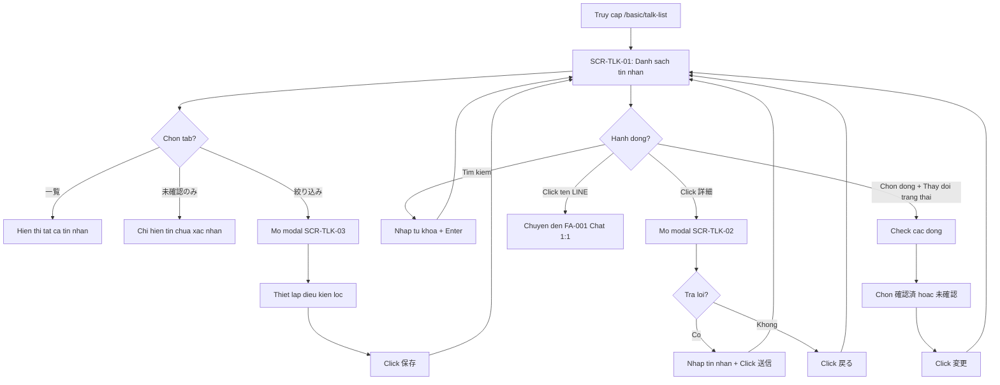

# [FA-002] Quan ly chat — UI Spec

## Tong quan
- **Ma tinh nang**: FA-002
- **Ten**: Quan ly chat
- **Ten JP**: 「チャット管理」
- **Mo ta**: Tinh nang cho phep Admin/Staff xem, tim kiem, loc va quan ly toan bo tin nhan nhan duoc tu ban be LINE. Hien thi danh sach tin nhan dang bang voi thong tin trang thai (da xac nhan / chua xac nhan), ho tro tim kiem theo noi dung, loc theo khoang thoi gian, loc nang cao theo nhieu dieu kien (tag, ten ban be, ngay them ban, step, QR code action, conversion, thong tin ban be). Cho phep xem chi tiet tung tin nhan, tra loi truc tiep, va thay doi trang thai hang loat.
- **Portal**: Admin
- **URL pattern**: `/basic/talk-list`
- **API chinh**: `POST /ajax/get-talk-list-v2`

## Doi tuong su dung (Actors)
| Actor | Vai tro | Quyen truy cap |
|-------|---------|----------------|
| Admin | Quan ly LINE Official Account, xem va quan ly toan bo tin nhan nhan duoc | Toan quyen — xem, tim kiem, loc, thay doi trang thai, tra loi tin nhan |
| Staff | Nhan vien do Admin tao | Tuy role — co the bi gioi han truy cap tinh nang quan ly chat |

## Cac man hinh

### SCR-TLK-01: Man hinh danh sach tin nhan (Trang chinh)
- **URL**: `/basic/talk-list`
- **Tieu de trang**: 「チャット管理」
- **Screenshot**: `screenshots/main.png`

#### Layout tong the
Giao dien gom sidebar menu Admin portal ben trai va vung noi dung chinh ben phai. Vung noi dung chinh chia thanh cac phan tu tren xuong duoi:
1. **Header**: Tieu de「チャット管理」(heading h2)
2. **Thanh tim kiem**: O tim kiem tin nhan
3. **Thanh cong cu**: Tabs filter + checkbox bao gom tra loi + bo loc khoang thoi gian
4. **Bang du lieu**: Danh sach tin nhan nhan duoc
5. **Khu vuc thay doi trang thai hang loat**: Radio buttons + nut thay doi

---

#### Thanh tim kiem
| Vi tri | Element | Text JP | Loai | Hanh vi |
|--------|---------|---------|------|---------|
| Tren cung | Label | 「メッセージ検索」 | Text label | Nhan cho o tim kiem |
| Tren cung | Search box | (khong co placeholder hien thi) | Textbox | Nhap tu khoa de tim kiem trong noi dung tin nhan |
| Tren cung | Search icon | (icon kinh lup) | Button (cursor=pointer) | Click de thuc hien tim kiem |

---

#### Tabs / Sub-navigation
| Tab | Text JP | Noi dung | Mac dinh? | Ghi chu |
|-----|---------|---------|----------|---------|
| Tab 1 | 「一覧」 | Hien thi tat ca tin nhan (da xac nhan + chua xac nhan) | Co | Tab mac dinh khi mo trang |
| Tab 2 | 「未確認のみ」 | Chi hien thi tin nhan chua xac nhan | Khong | Loc chi trang thai「未確認」 |
| Tab 3 | 「絞り込み」 | Mo modal filter nang cao (SCR-TLK-03) | Khong | Click mo dialog overlay |

Ngoai ra co checkbox ben canh tabs:
| Element | Text JP | Loai | Mac dinh | Ghi chu |
|---------|---------|------|---------|---------|
| Checkbox | 「返信を含める」 | Checkbox | Khong check | Khi check, bao gom ca tin nhan tra loi (tu Admin/Staff) trong danh sach. Mac dinh chi hien tin nhan tu ban be |

---

#### Bo loc khoang thoi gian
| Vi tri | Element | Text JP | Loai | Hanh vi |
|--------|---------|---------|------|---------|
| Trai | Button | 「全期間」 | Button | Click de hien thi tat ca, khong gioi han thoi gian |
| Giua | Label | 「表示期間」 | Text | Nhan cho khoang thoi gian |
| Giua | Date from | (textbox, co icon lich) | Textbox (date picker) | Chon ngay bat dau |
| Giua | Label | 「から」 | Text | "Tu" — noi 2 truong ngay |
| Phai | Date to | (textbox, co icon lich) | Textbox (date picker) | Chon ngay ket thuc |

---

#### Bang du lieu
| # | Cot | Text JP | Kieu du lieu | Sortable? | Ghi chu |
|---|-----|---------|-------------|----------|---------|
| 1 | Chon trong trang | 「ページ内選択」 | Checkbox | Khong | Checkbox header de chon/bo chon tat ca dung trong trang. Moi dong cung co checkbox rieng |
| 2 | Trang thai | 「ステータス」 | Badge | Khong | 2 gia tri: 「未確認」(chua xac nhan — badge mau xanh la) va「確認済」(da xac nhan). Quan sat: tat ca deu「未確認」trong du lieu mau |
| 3 | Ngay gio nhan | 「受信日時」 | DateTime | Khong | Format: YYYY/MM/DD HH:mm. Vi du: "2026/03/24 13:30" |
| 4 | Ten LINE | 「LINE名」 | Text + Avatar + Link | Khong | Gom: avatar hinh tron (img), ten LINE la link (cursor=pointer) den `/basic/chat-v3?friend_id={friend_id}`. Vi du: "テスト'T" voi friend_id=26271166 |
| 5 | Noi dung tin nhan | 「メッセージ内容」 | Text | Khong | Hien thi noi dung text, hoac ky hieu dac biet cho cac loai media: 「【音声】」(am thanh), 「【ファイル】」(file), 「【位置情報】」(vi tri). Noi dung text dai se bi cat |
| 6 | (Cot hanh dong) | (khong co header) | Button | Khong | Nut「詳細」(chi tiet) — click mo modal SCR-TLK-02 |

##### Actions tren moi dong
| Action | Text/Icon JP | Hanh vi | Xac nhan? |
|--------|-------------|---------|----------|
| Xem chi tiet | 「詳細」 | Mo modal dialog SCR-TLK-02 hien thi chi tiet tin nhan + form tra loi | Khong |
| Chon dong | Checkbox | Chon dong de thay doi trang thai hang loat | Khong |
| Xem chat 1:1 | Link ten LINE | Chuyen huong den `/basic/chat-v3?friend_id={friend_id}` — mo man hinh Chat 1:1 (FA-001) | Khong |

##### Du lieu mau quan sat
| Trang thai | Ngay gio | Ten LINE | Noi dung | Friend ID |
|-----------|---------|---------|---------|-----------|
| 未確認 | 2026/03/24 13:30 | テスト'T | Hh | 26271166 |
| 未確認 | 2026/03/24 13:30 | テスト'T | Test | 26271166 |
| 未確認 | 2026/03/21 10:44 | [WSS] サポート/... | test2 | 5709 |
| 未確認 | 2025/11/04 19:01 | Thanh /_€£567(...)aayy | Test | 5902 |
| 未確認 | 2025/10/31 17:12 | テスト | https://liff.line.me/... | 5723 |
| 未確認 | 2024/11/08 16:39 | Duy | 【音声】 | 5768 |
| 未確認 | 2024/11/04 11:00 | テスト | 【ファイル】 | 5723 |
| 未確認 | 2024/11/01 17:38 | Duy | 【位置情報】 | 5768 |
| 未確認 | 2024/10/25 13:33 | テスト | 【位置情報】 | 5723 |

> **Quan sat**: Tat ca 20 dong hien thi deu co trang thai「未確認」. Khong thay dong nao trang thai「確認済」trong du lieu mau. Cung khong thay phan trang (pagination) — co the la do so luong du lieu nho hoac pagination o phia duoi bi an.

---

#### Khu vuc thay doi trang thai hang loat
| Vi tri | Element | Text JP | Loai | Hanh vi |
|--------|---------|---------|------|---------|
| Duoi bang | Label | 「ステータス 一括変更」 | Text | Nhan cho khu vuc thay doi trang thai hang loat |
| Duoi bang | Radio 1 | 「確認済」 | Radio button | Chon de chuyen sang da xac nhan. **Mac dinh duoc chon** |
| Duoi bang | Radio 2 | 「未確認」 | Radio button | Chon de chuyen sang chua xac nhan |
| Duoi bang | Button | 「変更」 | Button | Thuc hien thay doi trang thai cho cac dong da chon bang checkbox |

---

### SCR-TLK-02: Modal xem chi tiet tin nhan
- **URL**: Van la `/basic/talk-list` (dialog overlay)
- **Tieu de modal**: 「{LINE名} さんからのメッセージ」
- **Screenshot**: `screenshots/detail-modal.png`

#### Layout tong the
Dialog modal overlay tren man hinh danh sach. Gom:
1. **Nut dong** (X) — goc tren phai
2. **Header**: Avatar + Link ten ban be + text「さんからのメッセージ」
3. **Thoi gian**: Ngay gio nhan tin nhan
4. **Noi dung tin nhan**: Hien thi noi dung day du trong khung co nen xam
5. **Form tra loi**: O nhap tin nhan tra loi
6. **Cac nut hanh dong**: 「戻る」va「送信」

#### Chi tiet cac thanh phan

##### Header modal
| Element | Mo ta | Ghi chu |
|---------|-------|---------|
| Avatar | Anh dai dien ban be LINE | Hinh tron ben trai |
| Link ten ban be | Link den trang profile ban be | URL: `/basic/friendlist/my_page/{friend_id}`. Vi du: `/basic/friendlist/my_page/26271166` cho「テスト'T」 |
| Text | 「さんからのメッセージ」 | Tiep noi sau ten ban be |

##### Noi dung tin nhan
| Element | Mo ta | Ghi chu |
|---------|-------|---------|
| Thoi gian | Ngay gio nhan | Format: YYYY/MM/DD HH:mm. Vi du: "2026/03/24 13:30" |
| Noi dung | Noi dung tin nhan day du | Hien thi trong khung, nen xam nhat. Vi du: "Hh" |

##### Form tra loi
| # | Label JP | Loai input | Bat buoc? | Gia tri mac dinh | Ghi chu |
|---|---------|-----------|----------|-----------------|---------|
| 1 | 「メッセージ返信」 | Textarea | Khong (co the dong modal ma khong gui) | (trong) | O nhap noi dung tra loi |

##### Action Buttons
| Action | Text JP | Loai | Vi tri | Hanh vi |
|--------|---------|------|--------|---------|
| Quay lai | 「戻る」 | Button (cursor=pointer) | Trai | Dong modal, quay ve danh sach |
| Gui | 「送信」 | Button | Phai | Gui tin nhan tra loi cho ban be. **Quan sat**: nut「送信」khong co cursor=pointer — co the bi disable khi o nhap trong |

> **Quan sat**: Link ten ban be trong modal tro den `/basic/friendlist/my_page/{friend_id}` (trang ca nhan ban be) — khac voi link trong bang chinh tro den `/basic/chat-v3?friend_id={friend_id}` (man hinh chat 1:1). Hai dich den khac nhau.

---

### SCR-TLK-03: Modal filter nang cao (絞り込み設定)
- **URL**: Van la `/basic/talk-list` (dialog overlay)
- **Tieu de modal**: 「絞り込み設定」
- **Screenshot**: `screenshots/filter-tab.png`

#### Layout tong the
Dialog modal overlay. Gom 3 phan chinh:
1. **Header**: Tieu de + nut dong (X)
2. **Phan hien thi (表示設定)**: Cau hinh loai tin nhan hien thi
3. **Phan dieu kien loc (and条件)**: Cac bo loc nang cao (expandable)
4. **Nut luu**: Ap dung cac dieu kien loc

---

#### Phan hien thi (表示設定)
| Element | Text JP | Loai | Ghi chu |
|---------|---------|------|---------|
| Label | 「表示設定」 | Text (heading) | Tieu de phan |
| Mo ta | 「下記メッセージを含めて表示」 | Text | Giai thich: bao gom cac loai tin nhan duoi day khi hien thi |
| Checkbox 1 | 「【〇〇】メッセージ」 | Checkbox | Bao gom tin nhan dang【loai】— am thanh, file, vi tri, v.v. |
| Checkbox 2 | 「スタンプ」 | Checkbox | Bao gom tin nhan sticker/stamp |

---

#### Phan dieu kien loc (and条件)
| Element | Text JP | Loai | Ghi chu |
|---------|---------|------|---------|
| Mo ta | 「and条件「すべて満たす」必要がある絞込み」 | Text | Giai thich: tat ca dieu kien phai thoa man dong thoi (AND logic) |

##### Danh sach bo loc (expandable accordion)
| # | Ten bo loc | Text JP | Mo ta | Lien ket shared component |
|---|----------|---------|-------|--------------------------|
| 1 | Tag | 「タグ」 | Loc theo tag da gan cho ban be | Lien quan SC-002 (Tag Selector) |
| 2 | Ten ban be | 「友だち名」 | Loc theo ten ban be LINE | — |
| 3 | Ngay them ban | 「友だち追加日」 | Loc theo ngay ban be duoc them | — |
| 4 | Trang thai subscribe step | 「ステップ購読状況」 | Loc theo trang thai subscribe step delivery | Lien quan FA-009 |
| 5 | QR Code Action | 「QRコードアクション」 | Loc theo QR code action da quet | Lien quan FA-017 |
| 6 | Conversion | 「コンバージョン」 | Loc theo conversion da thuc hien | Lien quan FA-025 |
| 7 | Trang thai xac nhan tin nhan | 「メッセージ確認状況」 | Loc theo trang thai xac nhan tin nhan (da xac nhan / chua xac nhan) | — |
| 8 | Thong tin ban be | 「友だち情報」 | Loc theo thong tin tuy chinh cua ban be (friend information fields) | Lien quan FA-015 |

Moi bo loc la button expandable (co icon mui ten). Khi click se mo rong hien thi cac tuy chon chi tiet ben trong. **Snapshot chi ghi nhan trang thai dong** — khong co du lieu ve noi dung ben trong moi bo loc.

##### Nut luu
| Action | Text JP | Loai | Vi tri | Hanh vi |
|--------|---------|------|--------|---------|
| Luu | 「保存」 | Button | Duoi cung modal | Ap dung cac dieu kien loc va dong modal. Danh sach tin nhan se duoc cap nhat theo dieu kien |

---

#### Cross-reference voi SC-003 (Friend Filter/Segment)
Modal filter nay **rat giong** shared component SC-003 (Friend Filter/Segment) da duoc ghi nhan trong registry. Cac bo loc accordion (tag, ten ban be, ngay them ban, step, QR code, conversion, thong tin ban be) trung voi cac tieu chi loc ban be dung trong broadcast (FA-008), step delivery (FA-009), va friend list (FA-013). Diem khac biet:
- Co them phan「表示設定」(cau hinh loai tin nhan hien thi) — dac thu cho chat management
- Co them bo loc「メッセージ確認状況」— dac thu cho tinh nang nay
- Logic ket qua loc ap dung cho **tin nhan** thay vi **ban be** — nhung dieu kien loc van la thuoc tinh cua ban be

> **Ket luan**: Modal filter cua FA-002 la mot **bien the** cua SC-003, bo sung them phan「表示設定」va bo loc「メッセージ確認状況」.

---

## Luong nguoi dung (User Flows)

### Luong 1: Xem danh sach tin nhan va loc theo tab
1. Admin truy cap `/basic/talk-list` — hien thi SCR-TLK-01 voi tab「一覧」duoc chon mac dinh
2. Danh sach tin nhan nhan duoc hien thi trong bang, sap xep theo ngay gio moi nhat
3. Click tab「未確認のみ」— bang chi hien tin nhan co trang thai「未確認」
4. Click tab「一覧」— quay ve hien thi tat ca

### Luong 2: Tim kiem tin nhan theo noi dung
1. Admin nhap tu khoa vao o「メッセージ検索」
2. Click icon tim kiem hoac nhan Enter
3. Bang du lieu cap nhat chi hien tin nhan co noi dung khop tu khoa

### Luong 3: Loc theo khoang thoi gian
1. Admin nhap ngay bat dau vao truong date from
2. Admin nhap ngay ket thuc vao truong date to
3. Bang du lieu chi hien tin nhan trong khoang thoi gian da chon
4. Click nut「全期間」de xoa bo loc thoi gian, hien thi tat ca

### Luong 4: Loc nang cao (絞り込み)
1. Admin click tab「絞り込み」— mo modal SCR-TLK-03
2. Tuy chon phan hien thi: check/uncheck「【〇〇】メッセージ」va「スタンプ」
3. Mo cac bo loc accordion (tag, ten ban be, v.v.) va thiet lap dieu kien
4. Click「保存」— modal dong, bang du lieu cap nhat theo dieu kien loc

### Luong 5: Xem chi tiet va tra loi tin nhan
1. Admin click nut「詳細」tren mot dong trong bang
2. Modal SCR-TLK-02 mo — hien thi chi tiet tin nhan va form tra loi
3. Admin nhap noi dung tra loi vao o「メッセージ返信」
4. Click「送信」— tin nhan tra loi duoc gui cho ban be
5. Click「戻る」— dong modal quay ve danh sach

### Luong 6: Thay doi trang thai hang loat
1. Admin check checkbox cua cac dong can thay doi (hoac check「ページ内選択」de chon tat ca)
2. O khu vuc「ステータス 一括変更」, chon radio button:「確認済」hoac「未確認」
3. Click nut「変更」
4. Trang thai cua cac dong da chon duoc cap nhat

### Luong 7: Chuyen sang chat 1:1
1. Admin click vao ten LINE (link) trong cot「LINE名」cua mot dong
2. Chuyen huong den `/basic/chat-v3?friend_id={friend_id}` — man hinh Chat 1:1 (FA-001)

## Flow Diagram

## Diem chua ro / Can xac minh

| # | Noi dung | Muc do | Ghi chu |
|---|---------|--------|---------|
| 1 | Co pagination/phan trang khong? Khong thay trong snapshot — co the la lazy load hoac so du lieu qua it | Trung binh | Can xac nhan khi co nhieu du lieu hon. API `get-talk-list-v2` co the tra ve phan trang |
| 2 | Checkbox「返信を含める」anh huong the nao? Mac dinh khong check — chi hien tin nhan tu ban be. Khi check co bao gom ca tin nhan tu Admin/Staff gui? | Trung binh | Can kiem tra API request de xac nhan tham so |
| 3 | Noi dung chi tiet ben trong moi bo loc accordion trong modal SCR-TLK-03 | Cao | Cac bo loc deu o trang thai dong — khong biet cac options cu the (dropdown, radio, v.v.) |
| 4 | Nut「送信」trong modal SCR-TLK-02 co bi disable khi o nhap trong khong? Quan sat khong co cursor=pointer | Thap | Co the la CSS khong co pointer mac dinh, hoac disable khi chua nhap |
| 5 | Co ho tro「確認済」status khong? Tat ca du lieu mau deu la「未確認」— chua quan sat duoc dang hien thi cua「確認済」(badge mau gi, text gi) | Thap | Can tim du lieu co trang thai「確認済」de xac nhan |
| 6 | Nut「全期間」va cac truong ngay hoat dong the nao khi ket hop voi nhau? | Thap | Can kiem tra: click「全期間」co xoa truong ngay khong, nhap ngay co tu dong tat「全期間」khong |
| 7 | Loc nang cao co duoc luu lai giua cac phien khong? Hay reset khi reload trang? | Thap | Can kiem tra bang cach ap dung filter roi reload |
| 8 | Noi dung tin nhan dang media (am thanh, file, vi tri) hien thi nhu the nao trong modal chi tiet? Chi thay text trong bang | Trung binh | Can mo「詳細」cho tin nhan media de xac nhan |

## Phu thuoc cheo (Cross-references)

| Thanh phan | Ma | Mo ta lien quan |
|-----------|-----|----------------|
| Chat 1:1 | FA-001 | Link ten LINE trong bang chuyen den man hinh Chat 1:1. Modal chi tiet co link den friend profile |
| Friend Filter/Segment | SC-003 | Modal filter nang cao (SCR-TLK-03) la bien the cua SC-003 voi bo sung「表示設定」va「メッセージ確認状況」 |
| Tag Selector | SC-002 | Bo loc「タグ」trong modal filter lien quan den Tag Selector |
| Tag Management | FA-012 | Tags duoc quan ly tai FA-012, su dung de loc trong modal filter |
| Step Delivery | FA-009 | Bo loc「ステップ購読状況」lien quan den trang thai subscribe step |
| QR Code Action | FA-017 | Bo loc「QRコードアクション」lien quan den QR Code Action |
| Conversion | FA-025 | Bo loc「コンバージョン」lien quan den du lieu conversion |
| Friend Information | FA-015 | Bo loc「友だち情報」lien quan den truong thong tin tuy chinh ban be |
| Friend List | FA-013 | Link trong modal chi tiet tro den `/basic/friendlist/my_page/{friend_id}` |
