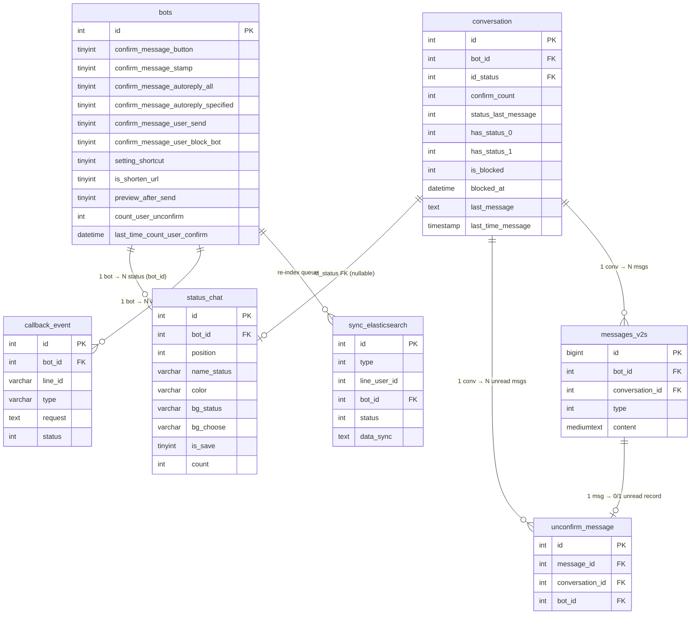

# DB Mapping — FA-041 Cài đặt chat 「チャット設定」

> Mapping UI ↔ DB cho toàn bộ 6 tab + 1 modal của chức năng. Dựa trên: `_internal/db-hint.md`, `web/api-spec.md`, `web/logic-spec.md`, `job/job-spec.md`, `db/schema/tables/*.sql`, `db/data/*.sql` và `db/index.md`.
>
> Ghi chú: toàn bộ file schema đã được làm sạch (không có COLLATE/ENGINE). Sample data đọc trực tiếp từ `db/data/{table}.sql` (cấu trúc phẳng — không có thư mục `tables/` con).

---

## 1. Tổng quan DB

| Chỉ số | Giá trị |
|--------|---------|
| Số bảng Primary (bảng lưu cấu hình trực tiếp) | 2 — `status_chat`, `bots` |
| Số bảng Secondary (bảng chịu ảnh hưởng / phục vụ background job) | 5 — `unconfirm_message`, `conversation`, `messages_v2s`, `callback_event`, `sync_elasticsearch` |
| Tổng số bảng cần đọc | 7 |
| Confidence distribution | Cao: 24 mapping; Trung bình: 0 mapping; Thấp: 0 mapping |
| UI fields có DB mapping | 11 / 11 (100%) — không tính tab 6 FAQ |
| DB columns không xuất hiện trên UI | 6 cột (thống kê ở mục 6) |

Coverage UI↔DB: **100%** cho các trường có form (SCR-CST-01 → SCR-CST-06). SCR-CST-07 (FAQ) không có DB — đúng như dự kiến.

---

## 2. Primary Tables

### 2.1. `status_chat` — Bảng danh sách trạng thái hội thoại (Tab 1)

**Mô tả**: Lưu danh sách status chip hiển thị trong chat 1:1 của một bot. Người dùng CRUD qua Tab 1 「対応ステータス」.

**File schema**: `c:/xampp/htdocs/lme-reveser-spec/db/schema/tables/status_chat.sql`
**File data**: `c:/xampp/htdocs/lme-reveser-spec/db/data/status_chat.sql`

| Column | Kiểu | Null | Default | Key | Mô tả |
|--------|------|------|---------|-----|-------|
| `id` | `int(10) UNSIGNED` | NOT NULL | AUTO | PK | ID status |
| `bot_id` | `int(11)` | NOT NULL | — | Index (FK ngầm → `bots.id`) | Bot sở hữu status |
| `position` | `int(11)` | NOT NULL | `0` | — | Thứ tự hiển thị (EP-06 index 0-based; EP-07/08/09 1-based — xem BR-08 logic-spec) |
| `name_status` | `varchar(255)` | NOT NULL | — | — | Tên status (UI counter 20, EP-08 cũ validate 10) |
| `color` | `varchar(255)` | NOT NULL | — | — | Hex color chính (vd `#F44336`) — có row cũ lưu giá trị `'1'`, `'2'` (enum palette v1, đã lỗi thời) |
| `bg_status` | `varchar(255)` | NULL | NULL | — | Màu nền chip khi không chọn |
| `bg_choose` | `varchar(255)` | NULL | NULL | — | Màu nền chip khi được chọn |
| `is_save` | `tinyint(4)` | NOT NULL | `1` | — | Cờ legacy — luôn `1` trong code hiện tại |
| `count` | `int(11)` | NOT NULL | `0` | — | Legacy — không có code Laravel/Spring Boot cập nhật (xem §11.5 job-spec) |
| `created_at` | `timestamp` | NOT NULL | `CURRENT_TIMESTAMP` | — | Thời điểm tạo |
| `updated_at` | `timestamp` | NOT NULL | `CURRENT_TIMESTAMP ON UPDATE CURRENT_TIMESTAMP` | — | Thời điểm cập nhật |

**Indexes / FK**: Schema không khai báo INDEX/FK chính thức. FK `bot_id → bots.id` và `id_status` từ `conversation` là các ràng buộc ngầm xử lý bằng code.

**Sample data** (`db/data/status_chat.sql` dòng 2-7):
| id | bot_id | position | name_status | color | bg_status | bg_choose | count |
|----|--------|----------|-------------|-------|-----------|-----------|-------|
| 1 | 1 | 0 | `test` | (empty) | NULL | NULL | 0 |
| 8 | 300 | 10 | `マガジンコメント` | `1` | `#FFCDCB` | `1` | 0 |
| 9 | 300 | 9 | `重要度低` | `#1BBADE` | `#C3F3FF` | `#6CDEF8` | 0 |
| 10 | 300 | 8 | `質問` | `2` | `#FFDCA2` | `#FF9D00` | 0 |
| 11 | 300 | 7 | `トラブル` | `#FF9D00` | `#FFDCA2` | `#FF9D00` | 0 |
| 12 | 300 | 6 | `クロージング` | `#F44336` | `#FFCDCB` | `#F44336` | 0 |
| 13 | 300 | 5 | `クレーム` | `#08BF5A` | `#DFFDD6` | `#08BF5A` | 8 |

**Ghi chú**: `color` có hai định dạng lịch sử — giá trị số (`1`, `2`) cho palette v1 (legacy) và hex `#RRGGBB` cho v2 (hiện hành). UI v2 (EP-06) chỉ ghi giá trị hex.

---

### 2.2. `bots` — Bảng cấu hình bot (Tab 2-5)

**Mô tả**: Bảng trung tâm của hệ thống LME. FA-041 chỉ đụng 11 cột trong tổng số 113 cột. Các cột khác thuộc tính năng khác (FA-001, FA-003, FA-024, ...) — không liệt kê ở đây.

**File schema**: `c:/xampp/htdocs/lme-reveser-spec/db/schema/tables/bots.sql` (toàn bảng); các dòng liên quan FA-041: 69-114.
**File data**: `c:/xampp/htdocs/lme-reveser-spec/db/data/bots.sql`

Các cột **liên quan trực tiếp** FA-041 (tất cả đều có COMMENT `0: no, 1: yes` trừ khi ghi khác):

| # | Column | Kiểu | Null | Default | COMMENT trong DB | Tab | Nguồn migration |
|---|--------|------|------|---------|------------------|-----|-----------------|
| 1 | `confirm_message_button` | `tinyint(4)` | NOT NULL | `0` | `0: no, 1: yes` | Tab 2 | `2021_12_31_165649_add_bots_to_users_table` |
| 2 | `confirm_message_autoreply` | `tinyint(4)` | NOT NULL | `0` | `0: no, 1: yes` | **Deprecated** — code Laravel+Spring Boot đã comment | `2021_12_31_165649` |
| 3 | `confirm_message_stamp` | `tinyint(4)` | NOT NULL | `0` | `0: no, 1: yes` | Tab 2 | `2022_11_22_181942_add_col_setting_chat_bot_table` |
| 4 | `confirm_message_autoreply_all` | `tinyint(4)` | NULL | `0` | `0: no, 1: yes` | Tab 2 | `2026_03_19_190550_add_col_confrim_autoreply_to_bots_table` |
| 5 | `confirm_message_autoreply_specified` | `tinyint(4)` | NULL | `0` | `0: no, 1: yes` | Tab 2 | `2026_03_19_190550` |
| 6 | `confirm_message_user_send` | `tinyint(4)` | NULL | `0` | `0: no, 1: yes` | Tab 2 (toggle 1 「返信時の...」) | `2024_09_19_153216_add_column_chat_setting_to_bots` |
| 7 | `confirm_message_user_block_bot` | `tinyint(4)` | NULL | `0` | `0: no, 1: yes` | Tab 2 (toggle 2 「ブロックされた...」) | `2024_09_19_153216` |
| 8 | `setting_shortcut` | `tinyint(4)` | NOT NULL | `0` | `0: shift enter send, 1: enter send` | Tab 3 | `2022_11_22_181942` |
| 9 | `is_shorten_url` | `tinyint(4)` | NOT NULL | `0` | `0: no, 1: yes` | Tab 4 | (migration trước — có sẵn) |
| 10 | `preview_after_send` | `tinyint(4)` | NULL | `1` | `0: no, 1: yes` | Tab 5 | `2024_09_19_153216` |

Các cột **liên quan gián tiếp** (side-effect của Tab 2):

| # | Column | Kiểu | Null | Default | Mô tả |
|----|--------|------|------|---------|-------|
| 11 | `count_user_unconfirm` | `int(11)` | NOT NULL | `0` | Đếm số conversation có `confirm_count = 1` & chưa bị block. Cập nhật bởi: (a) Laravel `ChatService` khi admin gửi tin và `confirm_message_user_send = 1`; (b) Spring Boot async `BotRepository.updateCountUserUnconfirm()`. |
| 12 | `last_time_count_user_confirm` | `datetime` | NULL | NULL | Thời điểm cập nhật cuối của `count_user_unconfirm` (chỉ Laravel set) |

**Indexes / FK**: PK `id`. Schema không khai báo FK chính thức.

**Sample value hình dung** (suy luận từ EP-02 response):
```
{
  "confirm_message_button": 0,
  "confirm_message_stamp": 0,
  "confirm_message_autoreply_all": 0,
  "confirm_message_autoreply_specified": 0,
  "confirm_message_user_send": 1,
  "confirm_message_user_block_bot": 0,
  "confirm_message_autoreply": 0,   // deprecated
  "setting_shortcut": 0,
  "is_shorten_url": 1,
  "preview_after_send": 1
}
```

---

## 3. Secondary Tables

### 3.1. `unconfirm_message` — Queue "tin chưa confirm"

**Mô tả**: Mỗi bản ghi = 1 tin nhắn từ LINE user chưa được đánh dấu đã-đọc. Spring Boot INSERT khi `needConfirm = false`; DELETE khi user block bot (và flag `confirm_message_user_block_bot = 1`) hoặc khi admin reply.

**File schema**: `c:/xampp/htdocs/lme-reveser-spec/db/schema/tables/unconfirm_message.sql`

| Column | Kiểu | Null | Default | Mô tả |
|--------|------|------|---------|-------|
| `id` | `int(10) UNSIGNED` | NOT NULL | AUTO | PK |
| `message_id` | `int(11)` | NOT NULL | — | FK ngầm → `messages_v2s.id` |
| `conversation_id` | `int(11)` | NOT NULL | — | FK ngầm → `conversation.id` |
| `bot_id` | `int(11)` | NOT NULL | — | FK ngầm → `bots.id` |
| `created_at`, `updated_at` | `timestamp` | NOT NULL | `CURRENT_TIMESTAMP` | |

**Sample** (`db/data/unconfirm_message.sql`):
```
(521, 58035, 3701, 387, '2021-07-19 02:59:16', '2021-07-19 02:59:16')
(591, 61374, 3751, 425, '2021-09-08 10:08:02', '2021-09-08 10:08:02')
```

### 3.2. `conversation` — Hội thoại 1:1 (cột liên quan FA-041)

**Mô tả**: Bảng hội thoại với LINE user. FA-041 ảnh hưởng 5 cột.

**File schema**: `c:/xampp/htdocs/lme-reveser-spec/db/schema/tables/conversation.sql`

Cột liên quan FA-041:

| Column | Kiểu | Default | Vai trò trong FA-041 |
|--------|------|---------|---------------------|
| `confirm_count` | `int(11)` | `0` | +=1 khi `needConfirm=false`; = 0 khi user block bot (flag bật) |
| `status_last_message` | `int(11)` | `1` | Spring Boot set khi update conversation |
| `has_status_0` / `has_status_1` | `int(11)` | `0` | Cờ để filter tab 未読/既読 |
| `id_status` | `int(11)` | NULL | FK ngầm → `status_chat.id` — BỊ SET NULL khi xoá `status_chat` (EP-10) |
| `last_message` | `text` | NULL | Nội dung tin cuối |
| `last_time_message` | `timestamp` | NULL | Thời điểm tin cuối |
| `is_blocked` | `int(11)` | — | = 1 khi user block bot (doHandleUnFollowEvent) |
| `blocked_at` | `datetime` | NULL | Thời điểm block |

**Các cột còn lại của bảng (29 cột tổng)**: `conversation_name`, `line_id`, `tb_line_user_id`, `conversation_kind`, `has_status_2/3/5/7/8/9`, `blocked_by`, `is_bookmark`, `is_old_friend`, `is_hide`, `datetime_hide`, `memo` — không thuộc scope FA-041.

### 3.3. `messages_v2s` — Tin nhắn chat (bảng unified)

**Mô tả**: Bảng tin nhắn chính của LINE chat. Spring Boot INSERT khi nhận webhook message. **Chú ý**: logic-spec ban đầu đoán `messages_{year}` sharded nhưng job-spec §11.1-11.2 đã xác nhận Spring Boot chỉ dùng `messages_v2s` — KHÔNG có sharding ở job layer.

**File schema**: `c:/xampp/htdocs/lme-reveser-spec/db/schema/tables/messages_v2s.sql`

Cột chính: `id (bigint)`, `bot_id`, `user_id`, `message_from`, `conversation_id`, `profile_send`, `msg_kind`, `type`, `content (mediumtext)`, `line_message_id`, `status`, `created_at`.

**Ghi chú quan trọng**: Bảng KHÔNG có cột `is_confirmed` hay `confirmed_at`. Trạng thái "confirmed" được biểu diễn bằng sự VẮNG MẶT của record tương ứng trong `unconfirm_message`.

### 3.4. `callback_event` — Queue LINE webhook events

**Mô tả**: Laravel endpoint webhook `INSERT` với `status = 0`; Spring Boot `HandlePostbackTask` polling mỗi 500ms.

**File schema**: `c:/xampp/htdocs/lme-reveser-spec/db/schema/tables/callback_event.sql`

| Column | Kiểu | Null | Default | Mô tả |
|--------|------|------|---------|-------|
| `id` | `int(10) UNSIGNED` | NOT NULL | AUTO | PK |
| `user_id` | `int(11)` | NOT NULL | — | Admin ID (context) |
| `bot_id` | `int(11)` | NOT NULL | — | Bot nhận event |
| `line_id` | `varchar(255)` | NULL | NULL | LINE user ID (`U...`) |
| `type` | `varchar(255)` | NULL | `'follow'` | `message` / `unfollow` / `follow` / `leave` / `postback` / ... |
| `request` | `text` | NULL | — | JSON payload từ LINE webhook |
| `status` | `int(11)` | NULL | `0` | COMMENT: `0: chua xu li; 1: dang xu li; 2: da xu li; 3: xu li loi` (mở rộng: 6=not found bot, 7=blocked, 8=expired, 30=media) |
| `error_message` | `text` | NULL | — | |
| `created_at`, `updated_at` | `timestamp` | NULL | `CURRENT_TIMESTAMP ON UPDATE` | |

**Sample**: `status=3` (xử lý lỗi) cho message `{"type":"message","message":{"type":"text","text":"【123】"}}` → match pattern 【...】 → nếu bot bật `confirm_message_button` sẽ skip INSERT unconfirm_message.

### 3.5. `sync_elasticsearch` — Queue đồng bộ Elasticsearch

**Mô tả**: Laravel `ChatController@ajaxDeleteItemStatus` INSERT khi xoá status. Spring Boot worker đọc và re-index ES.

**File schema**: `c:/xampp/htdocs/lme-reveser-spec/db/schema/tables/sync_elasticsearch.sql`

| Column | Kiểu | Null | Default | COMMENT trong DB |
|--------|------|------|---------|------------------|
| `id` | `int(10) UNSIGNED` | NOT NULL | AUTO | PK |
| `type` | `int(11)` | NULL | NULL | `TYPE_BOT_LINE_USER=0, TYPE_LINE_USER=1, TYPE_CONVERSATION=2, TYPE_TAG=3, TYPE_FRIEND_INFO=4, TYPE_LANDING=5, TYPE_SCENARIO=6, TYPE_CONVERSION=7` |
| `line_user_id` | `int(11)` | NULL | NULL | |
| `bot_id` | `int(11)` | NULL | NULL | |
| `status` | `int(11)` | NULL | `0` | `STATUS_WAIT_SYNC=0, STATUS_SYNCHRONIZING=1, STATUS_SYNC_SUCCESS=2, STATUS_SYNC_ERROR=3` |
| `data_sync` | `text` | NULL | — | JSON, ví dụ `{"status_id": null}` hoặc `{"tag_20445":1}` |
| `time_sync_success` | `varchar(255)` | NULL | NULL | |
| `message_error` | `varchar(255)` | NULL | NULL | |
| `created_at`, `updated_at` | `timestamp` | NOT NULL | `CURRENT_TIMESTAMP` | |

**Ghi chú**: Khi `ChatController@ajaxDeleteItemStatus` xoá status, Laravel INSERT `type = config('sns-line.type_sync.update')` (cần xác nhận const này map vào số nào; thường bằng `TYPE_CONVERSATION = 2` để trigger re-index conversation).

---

## 4. UI ↔ DB Field Mapping theo màn hình

### 4.1. SCR-CST-01 — Danh sách status 「対応ステータス」

| UI Element | Label JP | DB Table | Column | Mapping Type | Confidence | Ghi chú |
|------------|----------|----------|--------|--------------|-----------|---------|
| Bảng status — cột Tên | ステータス名 | `status_chat` | `name_status` | Direct (read via EP-04) | **Cao** | |
| Bảng status — cột Màu (chip) | カラー | `status_chat` | `color`, `bg_status`, `bg_choose` | Direct | **Cao** | Hiển thị bằng `bg_status` (nền) + `color` (viền/text) |
| Bảng status — thứ tự | (implicit) | `status_chat` | `position` | Direct (ORDER BY position ASC, id DESC) | **Cao** | |
| Nút 並べ替え (drag-drop) | — | `status_chat` | `position` | UPDATE — EP-06 gửi lại full list, position = index mảng | **Cao** | |
| Nút 削除 | — | `status_chat` | (hard DELETE row) + `conversation.id_status = NULL` + `sync_elasticsearch` INSERT | Delete + cascade | **Cao** | Xem EP-10 |
| Scope filter | — | `status_chat` | `bot_id` (từ session `getBotId()`) | Implicit | **Cao** | |

### 4.2. SCR-CST-02 — Modal thêm/sửa status

| UI Element | Label JP | DB Table | Column | Mapping Type | Confidence | Ghi chú |
|------------|----------|----------|--------|--------------|-----------|---------|
| Input text (counter 0/20) | ステータス名 | `status_chat` | `name_status` | Direct | **Cao** | EP-06 không validate server; EP-08 legacy giới hạn 10 — 3 nguồn không nhất quán (BR-07) |
| Palette chọn màu | カラー | `status_chat` | `color`, `bg_status`, `bg_choose` | Direct (3 cột gửi cùng lúc) | **Cao** | Format hex `#RRGGBB` |
| (Ẩn) Thứ tự tự động | — | `status_chat` | `position` | Assigned by server = index mảng | **Cao** | |
| (Ẩn) Owner | — | `status_chat` | `bot_id` | Assigned by server từ session | **Cao** | |
| (Ẩn) is_save | — | `status_chat` | `is_save` | Luôn set `= 1` | **Cao** | Cờ legacy |
| Nút 保存 (modal) | — | `status_chat` | (INSERT mới nếu `id` null, UPDATE nếu có `id`) | Upsert | **Cao** | EP-06 |

### 4.3. SCR-CST-03 — Tab 2 メッセージの自動確認済み変更

| UI Element | Label JP | DB Table | Column | Mapping Type | Confidence | Ghi chú |
|------------|----------|----------|--------|--------------|-----------|---------|
| Checkbox 1 | 【〇〇】メッセージ | `bots` | `confirm_message_button` | Direct 0/1 | **Cao** | Spring Boot đọc; match pattern `^【.*】$` trên message text |
| Checkbox 2 | スタンプ | `bots` | `confirm_message_stamp` | Direct 0/1 | **Cao** | Spring Boot đọc khi webhook type=`sticker` |
| Checkbox 3 | [すべてのメッセージに反応] のメッセージ | `bots` | `confirm_message_autoreply_all` | Direct 0/1 | **Cao** | Spring Boot đọc khi auto-reply khớp KEYWORD_ANY |
| Checkbox 4 | [設定したキーワードに反応] のメッセージ | `bots` | `confirm_message_autoreply_specified` | Direct 0/1 | **Cao** | Spring Boot đọc khi auto-reply khớp keyword cụ thể |
| Toggle 1 | 返信時の自動確認済み変更 | `bots` | `confirm_message_user_send` | Direct 0/1 | **Cao** | Laravel `ChatService` đọc — trigger recompute `count_user_unconfirm` |
| Toggle 2 | ブロックされた友だちの自動確認済み変更 | `bots` | `confirm_message_user_block_bot` | Direct 0/1 | **Cao** | Spring Boot đọc khi webhook `unfollow` hoặc `leave` |
| (ẩn, comment view) | — | `bots` | `confirm_message_autoreply` | Deprecated | **Cao** | Code Laravel+Spring Boot đã comment (xem job-spec §4.6) |

### 4.4. SCR-CST-04 — Tab 3 送信ショートカット

| UI Element | Label JP | DB Table | Column | Mapping Type | Confidence | Ghi chú |
|------------|----------|----------|--------|--------------|-----------|---------|
| Radio group (2 options) | Shift+Enter で送信 / Enter で送信 | `bots` | `setting_shortcut` | Direct | **Cao** | COMMENT DB: `0: shift enter send, 1: enter send` — khớp logic-spec §3.7 |

**Scope**: per-bot (lưu ở `bots`), KHÔNG per-user — xác nhận từ logic-spec (`ChatController@saveSettingChat` update trực tiếp `bots`).

### 4.5. SCR-CST-05 — Tab 4 短縮URLの利用

| UI Element | Label JP | DB Table | Column | Mapping Type | Confidence | Ghi chú |
|------------|----------|----------|--------|--------------|-----------|---------|
| Toggle | 利用する / 利用しない | `bots` | `is_shorten_url` | Direct 0/1 | **Cao** | Laravel `ChatMessages.php` và `functions.php:7944` đọc khi gửi tin trong 1:1 chat — nếu 1 → rút gọn URL qua FA-024 |

### 4.6. SCR-CST-06 — Tab 5 送信プレビュー

| UI Element | Label JP | DB Table | Column | Mapping Type | Confidence | Ghi chú |
|------------|----------|----------|--------|--------------|-----------|---------|
| Toggle (default ON) | 表示する / 表示しない | `bots` | `preview_after_send` | Direct 0/1 | **Cao** | Frontend `chat-v2.js:3237,3244,3250,3584-3589` kiểm tra — mở modal preview trước khi gửi. Scope: per-bot. |

### 4.7. SCR-CST-07 — Tab 6 既読情報の表示 (FAQ)

**Không có UI field nào cần map**. Tab chỉ hiển thị text tĩnh + link đến bài viết hỗ trợ. **KHÔNG ghi vào DB**.

---

## 5. Enum / Status Values

### 5.1. `status_chat.color` — Palette màu
Sample data cho thấy **2 định dạng lịch sử cùng tồn tại**:

**V2 (hiện hành — UI v2 dùng)** — hex `#RRGGBB`:
| Hex | Tên gợi ý | Xuất hiện trong sample |
|-----|-----------|----------------------|
| `#F44336` | Đỏ | クロージング |
| `#FF9D00` | Cam | トラブル |
| `#08BF5A` | Xanh lá | クレーム |
| `#1BBADE` | Xanh dương | 重要度低 |
| (palette chuẩn đầy đủ cần verify qua screenshot UI — xem `raw/features/chat-setting/screenshots/`) | | |

**V1 (legacy)** — giá trị số `1`, `2`, ...: không còn dùng để tạo mới. UI hiện tại đọc cũng hiển thị kiểu dạng `bg_status` thôi.

### 5.2. Các flag boolean của `bots` (liên quan FA-041)
Tất cả có COMMENT trong DB `0: no, 1: yes` — trừ `setting_shortcut`:

| Column | 0 | 1 |
|--------|---|---|
| `confirm_message_button` | Không tự động confirm | Tự động confirm tin 【...】 |
| `confirm_message_stamp` | Không | Tự động confirm sticker |
| `confirm_message_autoreply_all` | Không | Tự động confirm tin match auto-reply (KEYWORD_ANY) |
| `confirm_message_autoreply_specified` | Không | Tự động confirm tin match auto-reply (keyword cụ thể) |
| `confirm_message_user_send` | Không | Trigger recompute `count_user_unconfirm` sau khi admin reply |
| `confirm_message_user_block_bot` | Không | Dọn unconfirm_message + reset `confirm_count` khi user block bot |
| `setting_shortcut` | **Shift+Enter gửi** (default) | **Enter gửi** |
| `is_shorten_url` | Không rút gọn URL | Rút gọn URL (gọi FA-024) |
| `preview_after_send` | Gửi thẳng không preview | **Default** — mở modal preview trước khi gửi |

### 5.3. `callback_event.type` — Các type relevant FA-041
| Value | Ý nghĩa | Flag của FA-041 chi phối |
|-------|---------|-------------------------|
| `message` | LINE user gửi tin | `confirm_message_button`, `_stamp`, `_autoreply_all`, `_autoreply_specified` |
| `unfollow` | LINE user block bot | `confirm_message_user_block_bot` |
| `leave` | Bot bị kick khỏi group | `confirm_message_user_block_bot` |
| `follow`, `postback`, `video_play_complete`, `unsend`, `join_group` | Không liên quan | — |

### 5.4. `callback_event.status`
Theo COMMENT DB + `CallbackEvent.java:9-23`:
```
0  STATUS_NEW             Laravel vừa insert, chờ Spring Boot
1  STATUS_PROCESSING      Worker đang xử lý
2  STATUS_DONE            Xử lý xong
3  STATUS_ERROR           Exception
6  STATUS_NOT_FOUND_BOT   Bot bị xoá
7  STATUS_BLOCKED_BY_BOT  User đã block từ trước
8  STATUS_EXPIRED_BOT     Plan hết hạn > 7 ngày
30 STATUS_MEDIA_NEW       Media download queue
```

### 5.5. `sync_elasticsearch.type` & `.status`
Từ COMMENT DB:
```
type: 0=BOT_LINE_USER, 1=LINE_USER, 2=CONVERSATION, 3=TAG, 4=FRIEND_INFO, 5=LANDING, 6=SCENARIO, 7=CONVERSION
status: 0=WAIT_SYNC, 1=SYNCHRONIZING, 2=SYNC_SUCCESS, 3=SYNC_ERROR
```

---

## 6. Unmapped Items

### 6.1. UI fields không có DB match
Không có — **100% UI field đều map được** (tab FAQ không tính vì không có form).

### 6.2. DB columns của `bots` không xuất hiện trực tiếp trên UI
Các cột liên quan chain nhưng **không phải toggle UI**:

| Column | Vai trò | Tại sao không trên UI |
|--------|---------|----------------------|
| `bots.confirm_message_autoreply` | Deprecated | Đã comment trong view và code — thay bởi 2 flag `_all` / `_specified` |
| `bots.count_user_unconfirm` | Counter cache | Hệ thống tự compute (Laravel `ChatService` + Spring Boot async) — admin không chỉnh tay |
| `bots.last_time_count_user_confirm` | Timestamp cache | Cùng lý do trên |

### 6.3. DB columns của `status_chat` không xuất hiện trên UI
| Column | Vai trò | Ghi chú |
|--------|---------|--------|
| `status_chat.is_save` | Cờ legacy — code luôn set `= 1` | Có thể xoá backlog |
| `status_chat.count` | Đếm số conversation đang dùng status | Không có code cập nhật (job-spec §11.5 xác nhận); có thể do DB trigger hoặc cleanup legacy. **Gap cần verify.** |

### 6.4. Bảng `conversation` cột không thuộc FA-041
`has_status_2/3/5/7/8/9`, `blocked_by`, `is_bookmark`, `is_old_friend`, `is_hide`, `datetime_hide`, `memo`, `conversation_kind`, v.v. — thuộc FA-001/FA-002.

---

## 7. Entity Relationships



**Các ràng buộc KHÔNG được khai báo FK chính thức trong schema** — toàn bộ do code enforce:
- `status_chat.bot_id → bots.id`
- `conversation.id_status → status_chat.id` (nullable, SET NULL khi delete)
- `unconfirm_message.conversation_id → conversation.id`
- `unconfirm_message.message_id → messages_v2s.id`
- `callback_event.bot_id → bots.id`
- `sync_elasticsearch.bot_id → bots.id`

---

## 8. Queue Tables & Background Job Integration

### 8.1. `callback_event` — Spring Boot consume (polling)

**Producer**: Laravel webhook endpoint (nhận HTTP từ LINE Platform) → `INSERT callback_event (type, request, status=0)`.

**Consumer**: Spring Boot `HandlePostbackTask` — `startJobGetEvent()` poll `SELECT * FROM callback_event WHERE status = 0` mỗi 500ms, claim bằng `UPDATE status = 1`, đẩy vào in-memory queue 30 worker threads.

**Liên quan FA-041**: Worker đọc flags từ `bots` (entity `updatable = false`) và áp logic auto-confirm trong `doHandleMessage`, `doHandleUnFollowEvent`, `doHandleLeaveGroup`.

| Event type | Flag kiểm tra | Kết quả khi flag = 1 |
|-----------|---------------|---------------------|
| `message` (text 【...】) | `confirm_message_button` | skip INSERT `unconfirm_message` |
| `message` (sticker) | `confirm_message_stamp` | skip INSERT `unconfirm_message` |
| `message` (match auto-reply KEYWORD_ANY) | `confirm_message_autoreply_all` | skip INSERT `unconfirm_message` |
| `message` (match auto-reply keyword) | `confirm_message_autoreply_specified` | skip INSERT `unconfirm_message` |
| `unfollow` / `leave` | `confirm_message_user_block_bot` | DELETE tất cả `unconfirm_message WHERE conversation_id = ?`, UPDATE `conversation.confirm_count = 0, has_status_0=0, has_status_1=1` |

### 8.2. `unconfirm_message` — Bảng trạng thái unread

| Tác vụ | Điều kiện | SQL đại ý |
|--------|-----------|----------|
| INSERT | Spring Boot worker xử lý `type=message` và `needConfirm=false` | `INSERT INTO unconfirm_message (message_id, conversation_id, bot_id, ...)` |
| DELETE (per-conversation) | User block/unfollow với `confirm_message_user_block_bot = 1` | `DELETE FROM unconfirm_message WHERE conversation_id = ?` |
| DELETE (per-message) | Admin mở conversation hoặc reply (cross-feature FA-001, không thuộc FA-041) | — |

### 8.3. `conversation.confirm_count` — Counter

| Tác vụ | Điều kiện | Update |
|--------|-----------|--------|
| +=1 | Spring Boot khi `needConfirm=false` | `ConversationReadRepository.updateConversationNewMessageIncreaseConfirmCount` |
| = 0 | Spring Boot khi user block bot (flag bật) | `ConversationRepository.updateClearConfirmCount` |
| Giảm (cross-feature FA-001 khi admin đọc) | — | Không thuộc scope FA-041 |

### 8.4. `bots.count_user_unconfirm` — Counter toàn bot

| Tác vụ | Producer | Thời điểm |
|--------|----------|----------|
| Recompute đồng bộ | Laravel `ChatService` | Mỗi lần admin gửi tin và `confirm_message_user_send = 1` — gọi `totalUserConfirmMessage($bot->id)` rồi UPDATE kèm `last_time_count_user_confirm = NOW()` |
| Recompute async | Spring Boot `ActionLaterService.addLowPriorityTask(PriorityTask.updateConfirmCount)` | Khi `conversation.confirm_count` chuyển từ 0 → 1 (tin unread đầu của 1 conversation) |
| Query rebuild | `BotRepository.java:26-31` | `UPDATE bots SET count_user_unconfirm = (SELECT COUNT(DISTINCT conversation.id) FROM conversation WHERE bot_id = ? AND is_blocked = 0 AND confirm_count = 1)` |

### 8.5. `sync_elasticsearch` — Queue re-index ES

| Producer | Khi nào | Payload |
|----------|---------|---------|
| Laravel `ChatController@ajaxDeleteItemStatus` (EP-10) | Xoá 1 status và có conversation đang dùng | `type = config('sns-line.type_sync.update')`, `line_user_id = conversation.line_id`, `bot_id`, `data_sync = '{"status_id": null}'`, `status = 0` |

**Consumer**: Spring Boot worker ES (ngoài scope FA-041 — không phải `HandlePostbackTask`, có task riêng chưa analyze trong phạm vi này).

---

## 9. Tham chiếu file:line quan trọng

### Schema
- `c:/xampp/htdocs/lme-reveser-spec/db/schema/tables/status_chat.sql:1-13` — toàn bộ bảng
- `c:/xampp/htdocs/lme-reveser-spec/db/schema/tables/bots.sql:69-114` — 11 cột FA-041
- `c:/xampp/htdocs/lme-reveser-spec/db/schema/tables/unconfirm_message.sql:1-8`
- `c:/xampp/htdocs/lme-reveser-spec/db/schema/tables/conversation.sql:1-31`
- `c:/xampp/htdocs/lme-reveser-spec/db/schema/tables/messages_v2s.sql:1-22`
- `c:/xampp/htdocs/lme-reveser-spec/db/schema/tables/callback_event.sql:1-12`
- `c:/xampp/htdocs/lme-reveser-spec/db/schema/tables/sync_elasticsearch.sql:1-12`

### Sample data
- `c:/xampp/htdocs/lme-reveser-spec/db/data/status_chat.sql:1-10`
- `c:/xampp/htdocs/lme-reveser-spec/db/data/unconfirm_message.sql:1-3`
- `c:/xampp/htdocs/lme-reveser-spec/db/data/callback_event.sql:1-2`
- `c:/xampp/htdocs/lme-reveser-spec/db/data/sync_elasticsearch.sql:1-3`

### Cross-ref code (từ logic-spec & job-spec)
- `src/web/sns-line/app/Http/Controllers/ChatController.php:3950-3961` — `saveSettingChat` mass-assign vào `bots`
- `src/web/sns-line/app/Http/Controllers/ChatController.php:789-826` — `ajaxDeleteItemStatus` → `status_chat DELETE` + `conversation.id_status SET NULL` + `sync_elasticsearch INSERT`
- `src/web/sns-line/app/Services/ChatService.php:104,170,342` — consumer `confirm_message_user_send`
- `src/job/.../task/HandlePostbackTask.java:1317-1329` — block check 4 flag `confirm_message_*` cho message
- `src/job/.../task/HandlePostbackTask.java:1945-1966` — block check `confirm_message_user_block_bot` khi unfollow
- `src/job/.../models/linedb/entities/Bot.java:64-77, 198-219` — reader methods + `updatable=false`

---

## 10. Checklist kết thúc db-mapper

- [x] Xác nhận tên bảng chính cho response status → `status_chat` (không phải `chat_status` hay `response_status`)
- [x] Xác nhận `color` là VARCHAR(255) — cho phép cả hex và enum số legacy
- [x] Xác định có `position` column — đúng, mặc định 0
- [x] Xác nhận 5 flag auto-confirm nằm TRỰC TIẾP trong `bots` (không bảng phụ, không JSON column)
- [x] Xác định scope `setting_shortcut` và `preview_after_send` → **per-bot** (không phải per-user)
- [x] Xác định cột "đã đọc" → **không có cột** trên bảng message; dùng presence/absence trong `unconfirm_message`
- [x] Kiểm tra cascade khi xoá status → **SET NULL** thủ công (không FK cascade), **không có cảnh báo UI/BE**
- [x] Tên cột migration 2024 nằm cả trong schema — confirm
- [x] `confirm_message_autoreply` legacy — confirmed đã bị comment ở cả Laravel + Spring Boot
