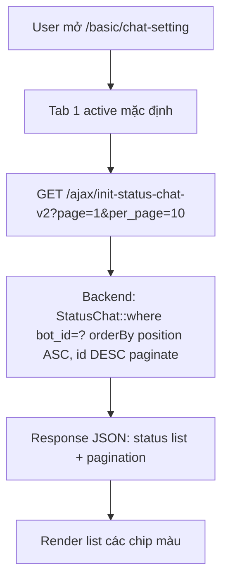
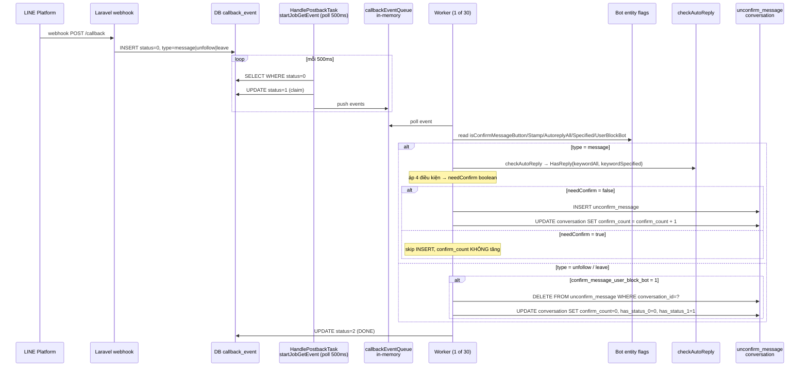
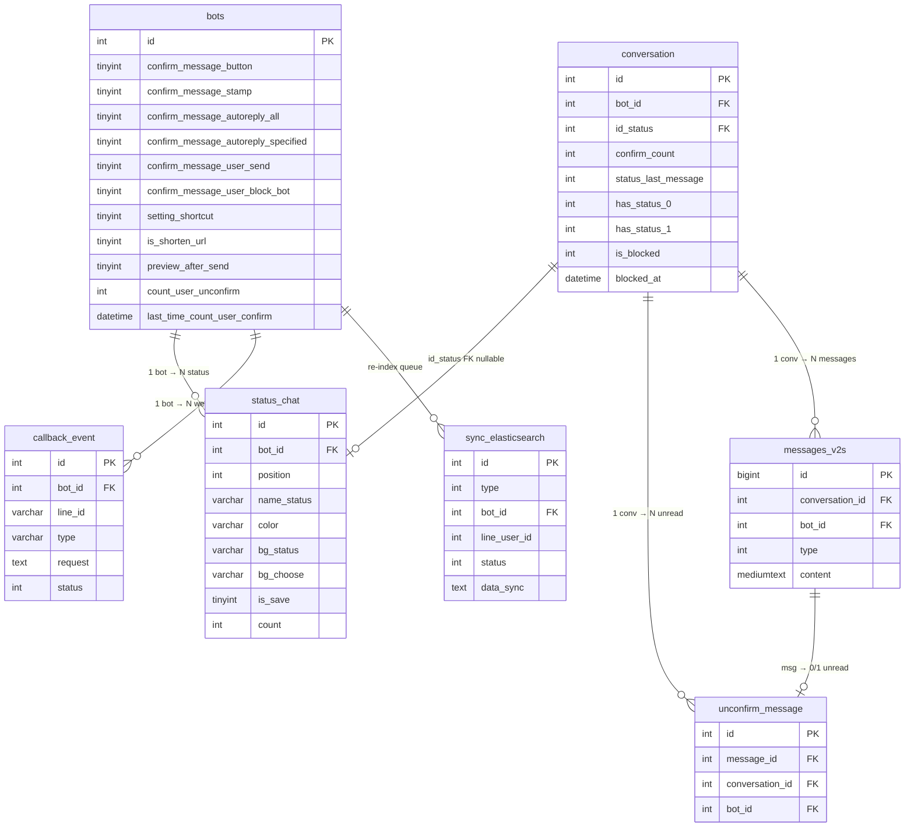

# FA-041 — Cài đặt chat 「チャット設定」

> Spec tổng hợp (feature-spec) — tài liệu chính mà PM, tester, dev đọc để hiểu tính năng. Các tài liệu chi tiết được link ở cuối mỗi mục.
>
> Các specs thành phần:
> - [UI spec](ui/ui-spec.md)
> - [API spec](web/api-spec.md)
> - [Logic spec](web/logic-spec.md)
> - [Job spec](job/job-spec.md)
> - [DB mapping](db/db-mapping.md)
> - [Validation report](_internal/validation-report.md)

---

## 1. Thông tin tổng quan

| Thuộc tính | Giá trị |
|-----------|---------|
| Mã tính năng | **FA-041** |
| Tên (VN) | Cài đặt chat |
| Tên (JP) | 「チャット設定」 / trang「1:1チャット設定」 |
| Phân loại | Chat — thuộc nhóm「1:1チャット」 |
| Mục đích | Trang cài đặt tuỳ chọn cho tính năng 1:1 Chat — quản lý danh sách response status, cấu hình tự động đánh dấu đã đọc (có background job), phím tắt gửi, rút gọn URL, xem trước khi gửi, và FAQ về read receipt |
| Actors | Admin LINE OA (toàn quyền); Staff (tuỳ custom role FA-036 — xem BR-06) |
| URL chính | `/basic/chat-setting` |
| Nhóm menu | メインサービス → 1:1チャット → チャット設定 |
| Phạm vi | 6 tab + 1 modal add/edit status |
| Background job | **Có** — Spring Boot `HandlePostbackTask` (tab 2 auto-confirm) |

---

## 2. Các màn hình (bảng tóm tắt)

| Mã | Màn hình | Tab/Trigger | Mô tả ngắn |
|----|----------|-------------|-----------|
| SCR-CST-01 | 対応ステータス編集 — Chỉnh sửa status phản hồi | Tab 1 | Danh sách status, CRUD + sắp xếp, phân trang |
| SCR-CST-02 | 対応ステータス新規追加/編集 — Modal thêm/sửa status | Modal (từ SCR-CST-01) | Form name (max 20 ký tự) + color picker |
| SCR-CST-03 | メッセージの自動確認済み変更 — Tự động đánh dấu đã đọc | Tab 2 | 4 checkbox loại tin + 2 toggle — **có background job** |
| SCR-CST-04 | 送信ショートカット — Phím tắt gửi | Tab 3 | Radio Shift+Enter vs Enter |
| SCR-CST-05 | 短縮URLの利用 — Dùng URL rút gọn | Tab 4 | Toggle |
| SCR-CST-06 | 送信プレビュー — Xem trước khi gửi | Tab 5 | Toggle (default bật) |
| SCR-CST-07 | 既読情報の表示 — FAQ thông tin đã đọc | Tab 6 | Read-only FAQ, không có form |

Chi tiết layout, form fields, action buttons: xem [UI spec](ui/ui-spec.md).

---

## 3. Luồng xử lý end-to-end

### 3.1. Xem danh sách status (SCR-CST-01)



- Middleware: `check_login`, `check_remember_token`.
- Scope: filter theo `bot_id` lấy từ session `getBotId()`.
- Endpoint: **EP-04** `GET /ajax/init-status-chat-v2`.

### 3.2. Thêm status mới (SCR-CST-02 — chế độ create)

1. User click「追加」trên SCR-CST-01 → mở modal SCR-CST-02 rỗng.
2. User nhập `name_status` (UI counter 0/20) và chọn màu từ palette.
3. Click「保存」→ FE gọi **EP-06** `POST /ajax/save-item-status-v2` với **toàn bộ list status** (bao gồm item mới `id=null`).
4. Backend duyệt mảng:
   - Item có `id` → `UPDATE status_chat WHERE id=? AND bot_id=?`.
   - Item `id=null` → `INSERT INTO status_chat (bot_id, name_status, color, bg_status, bg_choose, position=<index>, is_save=1)`.
5. Response `{success: true}` → FE reload list bằng EP-04.

### 3.3. Sửa status (SCR-CST-02 — chế độ edit)

Giống flow 3.2 nhưng item có `id != null` → backend `UPDATE`. Modal được pre-fill data hiện tại.

### 3.4. Xoá status

1. User click icon trash trên row → **không có confirm dialog BE**; FE có modal xác nhận (cần verify).
2. FE gọi **EP-10** `POST /ajax/delete-item-status` với `{id: X}`.
3. Backend:
   - `SELECT Conversation WHERE id_status=? AND bot_id=?` → list hội thoại đang gán status.
   - Với mỗi conversation → `INSERT INTO sync_elasticsearch (type=update, line_user_id, bot_id, data_sync='{"status_id":null}', status=0)` để trigger re-index ES.
   - `DELETE FROM status_chat WHERE id=? AND bot_id=?` (hard delete).
   - `UPDATE conversation SET id_status=NULL WHERE bot_id=? AND id_status=?`.
4. Response `{success: true}`. Không cảnh báo nếu status đang được dùng.

### 3.5. Sắp xếp status (並べ替え)

1. User click nút「並べ替え」→ bật chế độ drag-drop (cơ chế chính xác chưa snapshot — xem Gaps).
2. User kéo-thả → FE gọi **EP-06** gửi toàn bộ list theo thứ tự mới.
3. Backend UPDATE mỗi item với `position = <index mảng>` (0-based).

> Ghi chú: endpoint legacy **EP-09** `/ajax/sort-status-chat` dùng position 1-based và **thiếu filter `bot_id`** (xem BR-04 / vấn đề IDOR).

### 3.6. Lưu cài đặt tab 2 (auto-confirm) — SCR-CST-03

**Phần web (save flags):**

1. User tick/bỏ tick 4 checkbox và 2 toggle.
2. Click「保存」→ FE gọi **EP-03** `POST /ajax/save-data-setting` với `type=1` + các flag.
3. Backend **mass assign**: `Bots::where('id', $botId)->update($request->all())` (⚠ xem BR-03).

**Phần background job (flow auto-confirm):**



**Ý nghĩa semantic từng flag**:

| Flag (checkbox/toggle) | Trigger | Hành vi khi flag = 1 |
|------------------------|---------|---------------------|
| `confirm_message_button` (CB1) | LINE message text match regex `^【.*】$` | Skip INSERT unconfirm_message |
| `confirm_message_stamp` (CB2) | LINE message type = `sticker` | Skip INSERT unconfirm_message |
| `confirm_message_autoreply_all` (CB3) | Match auto-reply `keyword_reaction_type = KEYWORD_ANY` | Skip INSERT unconfirm_message |
| `confirm_message_autoreply_specified` (CB4) | Match auto-reply keyword cụ thể | Skip INSERT unconfirm_message |
| `confirm_message_user_send` (Toggle 1) | Admin gửi tin nhắn thành công | **Laravel `ChatService` đọc**: recompute `count_user_unconfirm` và cập nhật `last_time_count_user_confirm = NOW()` |
| `confirm_message_user_block_bot` (Toggle 2) | Event `unfollow` hoặc `leave` | DELETE toàn bộ `unconfirm_message` của conversation + reset `conversation.confirm_count = 0` + set `has_status_1 = 1` |

### 3.7. Lưu phím tắt gửi (Tab 3) — SCR-CST-04

1. User chọn 1 trong 2 radio (default: Shift+Enter gửi).
2. Click「保存」→ FE gọi **EP-03** với `type=2` + `{setting_shortcut: 0|1}`.
3. Backend mass-assign UPDATE `bots.setting_shortcut`.
4. Áp dụng: client-side — `public/js/chats/chat.js:4237`, `chat-v2.js:5689` đọc `setting_shortcut` để gắn keybinding. Không ảnh hưởng server.

### 3.8. Lưu shortcut URL (Tab 4) — SCR-CST-05

1. User bật/tắt toggle.
2. Click「保存」→ **EP-03** với `type=3` + `{is_shorten_url: 0|1}`.
3. Áp dụng: khi admin gửi tin 1:1 chứa URL → Laravel `ChatMessages.php` và `functions.php:7944` kiểm tra `$bot->is_shorten_url == 1` → rút gọn URL qua hệ thống shorten của LME (FA-024 URL Analysis).

### 3.9. Lưu preview (Tab 5) — SCR-CST-06

1. User bật/tắt toggle (default: bật).
2. Click「保存」→ **EP-03** với `type=4` + `{preview_after_send: 0|1}`.
3. Áp dụng: client-side — `public/js/chats/chat-v2.js:3237, 3244, 3250, 3584-3589` đọc flag → mở modal preview trước khi gọi API gửi.

---

## 4. Data Model

### 4.1. Entities chính

| Entity | Bảng | Vai trò |
|--------|------|---------|
| `StatusChat` | `status_chat` | Danh sách response status (CRUD ở tab 1) |
| `Bots` | `bots` | Cấu hình bot — lưu 11 flag của FA-041 (tab 2-5) |
| `Conversation` | `conversation` | Hội thoại 1:1 — cột `id_status` (FK ngầm → status_chat) và `confirm_count` chịu ảnh hưởng |
| `MessagesV2s` | `messages_v2s` | Tin nhắn chat — không có cột `is_confirmed`, trạng thái "đã đọc" biểu diễn qua `unconfirm_message` |
| `UnconfirmMessage` | `unconfirm_message` | Queue tin chưa confirm — INSERT/DELETE bởi Spring Boot |
| `CallbackEvent` | `callback_event` | Queue LINE webhook events — producer Laravel, consumer Spring Boot |
| `SyncElasticsearch` | `sync_elasticsearch` | Queue re-index ES khi xoá status |

### 4.2. ER Diagram



> Chi tiết đầy đủ cột + sample data: [DB mapping](db/db-mapping.md).

---

## 5. Field Traceability Matrix

Bảng đầy đủ các UI field có form (5 tabs — SCR-CST-01..06) map tới DB column.

| # | UI Element | Màn hình | DB Table.Column | Hướng | Validation | Business Rule |
|---|-----------|----------|-----------------|-------|-----------|---------------|
| 1 | Textbox ステータス名 | SCR-CST-02 | `status_chat.name_status` | UI→DB (EP-06 INSERT/UPDATE) | UI counter max 20 ký tự. EP-06 không validate. EP-08 legacy validate max 10. | BR-07 |
| 2 | Color picker カラー (màu chính) | SCR-CST-02 | `status_chat.color` | UI→DB | Hex `#RRGGBB` (UI v2); giá trị legacy `'1'`/`'2'` vẫn tồn tại trong data | — |
| 3 | Color picker (ẩn — bg nền) | SCR-CST-02 | `status_chat.bg_status` | UI→DB | Hex | — |
| 4 | Color picker (ẩn — bg chọn) | SCR-CST-02 | `status_chat.bg_choose` | UI→DB | Hex | — |
| 5 | (Ẩn) Thứ tự drag-drop | SCR-CST-01 | `status_chat.position` | UI→DB (EP-06 index 0-based) | INT, default 0 | BR-08 |
| 6 | Checkbox「【〇〇】メッセージ」 | SCR-CST-03 | `bots.confirm_message_button` | UI↔DB | TINYINT 0/1 | Background job consume |
| 7 | Checkbox「スタンプ」 | SCR-CST-03 | `bots.confirm_message_stamp` | UI↔DB | TINYINT 0/1 | Background job consume |
| 8 | Checkbox「[すべてのメッセージに反応]」 | SCR-CST-03 | `bots.confirm_message_autoreply_all` | UI↔DB | TINYINT 0/1 | Background job consume (priority hơn keyword) |
| 9 | Checkbox「[設定したキーワードに反応]」 | SCR-CST-03 | `bots.confirm_message_autoreply_specified` | UI↔DB | TINYINT 0/1 | Background job consume |
| 10 | Toggle 1「返信時の自動確認済み変更」 | SCR-CST-03 | `bots.confirm_message_user_send` | UI↔DB | TINYINT 0/1 | Laravel `ChatService` consume — recompute `count_user_unconfirm` |
| 11 | Toggle 2「ブロックされた友だちの自動確認済み変更」 | SCR-CST-03 | `bots.confirm_message_user_block_bot` | UI↔DB | TINYINT 0/1 | Background job consume (unfollow + leave) |
| 12 | Radio 送信ショートカット | SCR-CST-04 | `bots.setting_shortcut` | UI↔DB | TINYINT; `0`: Shift+Enter gửi (default), `1`: Enter gửi | Client-side keybinding |
| 13 | Toggle 短縮URL利用 | SCR-CST-05 | `bots.is_shorten_url` | UI↔DB | TINYINT 0/1 | Laravel consume khi gửi tin — liên kết FA-024 |
| 14 | Toggle 送信プレビュー | SCR-CST-06 | `bots.preview_after_send` | UI↔DB | TINYINT 0/1 (default 1) | Client-side modal preview |

**Tab 6 (SCR-CST-07)**: không có field, không ghi DB — chỉ hiển thị FAQ tĩnh.

**Cột side-effect không trên UI**:
- `bots.count_user_unconfirm` — cache counter (Laravel + Spring Boot async recompute).
- `bots.last_time_count_user_confirm` — timestamp cache.
- `bots.confirm_message_autoreply` — **deprecated** (đã comment ở cả Laravel và Spring Boot).
- `status_chat.is_save` — legacy, luôn `1`.
- `status_chat.count` — legacy, không code nào cập nhật (xem Gaps).

---

## 6. Business Rules

| # | Tên | Mô tả | Mức nghiêm trọng | Nguồn |
|---|-----|-------|-----------------|-------|
| BR-01 | Status thuộc về bot | Mọi query CRUD `status_chat` đều filter `bot_id` từ session (trừ EP-09) | — | `ChatController.php:627, 668, 710, 755, 795, 813` |
| BR-02 | Xoá status → SET NULL conversations | Xoá hard, các conversation đang gán được SET NULL `id_status`; không cascade DB, cascade thủ công bằng code; không có cảnh báo UI | Thông tin | `ChatController.php:814-816` |
| BR-03 | **Mass assignment trên `bots`** | `saveSettingChat` dùng `Bots::where('id', $botId)->update($request->all())` + `$guarded = []` → client có thể ghi đè bất kỳ cột nào của `bots` (vd `admin_id`, `plan_type`, `line_channel_secret`, `free_send_count`, `is_active`...) | 🔴 **Nghiêm trọng** | `ChatController.php:3950-3961`, `Bots.php:15` |
| BR-04 | **IDOR trên EP-09 sort-status-chat** | `ajaxSortStatusChat` không filter `bot_id` → attacker biết `id` status của bot khác có thể đổi `position` | 🟠 Cao | `ChatController.php:771-787` |
| BR-05 | Semantic flag `confirm_message_user_send` | Tên gợi "auto mark as read when reply" nhưng thực chất Laravel dùng làm trigger recompute counter `count_user_unconfirm`. Semantic có thể khác kỳ vọng UI | Trung bình | `ChatService.php:104, 170, 342` |
| BR-06 | **Không có Staff authorization check** | BE chỉ check login + bot ownership, không check custom role permission. Mọi user truy cập được đều có thể CRUD full settings. UI ẩn menu phụ thuộc FE only | 🟡 Trung bình | §6.2 logic-spec |
| BR-07 | **Validation không nhất quán 3 nguồn** | UI counter max 20. EP-06 không validate. EP-08 legacy validate max 10. → Nếu admin nhập 15 ký tự qua UI, save qua EP-06 OK; nhưng qua EP-08 sẽ reject | 🟠 Trung bình | api-spec EP-06/EP-08 |
| BR-08 | Position 0-based vs 1-based | EP-06 (hiện dùng): position = index mảng bắt đầu 0. EP-07/08/09 (legacy): position = index + 1. → Inconsistent giữa các endpoint | Thấp | `ChatController.php:707, 670, 748, 783` |
| BR-09 | Không transaction khi bulk save status | `DB::beginTransaction()` bị comment ở EP-06 → fail giữa chừng → inconsistent state | Thấp | `ChatController.php:691-723` |
| BR-10 | Hard delete, không soft delete | `StatusChat::delete()` là DELETE thật, không dùng `SoftDeletes` trait | Thông tin | `ChatController.php:813` |
| BR-11 | Color palette format dual | `status_chat.color` VARCHAR(255) chứa cả hex `#F44336` (UI v2) và số `'1'`, `'2'` (palette v1 legacy) | Thấp | Sample `db/data/status_chat.sql` |
| BR-12 | Auto-confirm ưu tiên `autoreply_all` trước `_specified` | Nếu 1 tin match cả KEYWORD_ANY lẫn keyword cụ thể, block `if/else if` chỉ áp `_all` | Thông tin | `HandlePostbackTask.java:1317-1321` |
| BR-13 | `confirm_message_user_block_bot` áp cả unfollow lẫn leave group | 1 flag → 2 event type (semantic mở rộng ngoài tên) | Thông tin | `HandlePostbackTask.java:1945-1966, 414-428` |
| BR-14 | Event kẹt status=1 không có recovery | Nếu Spring Boot crash giữa xử lý → event `callback_event` kẹt `PROCESSING` mãi mãi (không retry) | Trung bình | Job-spec §8.4 |

---

## 7. API Endpoints

Tổng 10 endpoint. Chi tiết request/response/validation: [API spec](web/api-spec.md).

| Mã | Method | URL | Mục đích | Dùng ở UI |
|----|--------|-----|---------|-----------|
| EP-01 | GET | `/basic/chat-setting` | Render view Blade | Trang chính (tất cả tab) |
| EP-02 | GET | `/ajax/initial/get-data-setting` | Load 10 flag của tab 2-5 | Tab 2, 3, 4, 5 |
| EP-03 | POST | `/ajax/save-data-setting` | Save flag tab 2-5 (mass assign) ⚠ | Tab 2, 3, 4, 5 |
| EP-04 | GET | `/ajax/init-status-chat-v2` | Load list status có phân trang | SCR-CST-01 |
| EP-05 | POST | `/ajax/init-status-chat` | (Legacy) Load full list | Dùng ở view cũ FA-001 |
| EP-06 | POST | `/ajax/save-item-status-v2` | Save full list status (add/edit/sort) | SCR-CST-02, SCR-CST-01 drag-drop |
| EP-07 | POST | `/ajax/save-item-status` | (Legacy) Save 1 item | — |
| EP-08 | POST | `/ajax/save-all-status` | (Legacy) Save all với validate max 10 | — |
| EP-09 | POST | `/ajax/sort-status-chat` | (Legacy) Sort, thiếu filter `bot_id` ⚠ | — |
| EP-10 | POST | `/ajax/delete-item-status` | Xoá status + cascade | SCR-CST-01 icon trash |

---

## 8. Background Jobs

**CÓ** — Spring Boot `HandlePostbackTask` (không phải Laravel queue).

| Thuộc tính | Giá trị |
|-----------|---------|
| Class chính | `HandlePostbackTask extends StoppableTask` |
| File | `src/job/linect-service/src/main/java/sns/line/task/HandlePostbackTask.java` |
| Bootstrap | `AppMain.java:274-278` |
| Feature flag | `ConfigFile.ENABLE_POSTBACK` |
| Polling loop | `startJobGetEvent()` — poll `callback_event WHERE status=0` mỗi **500ms** |
| Worker pool | 30 threads |
| Queue table | `callback_event` (producer: Laravel webhook endpoint) |

### 8.1. Flags Spring Boot consume

5 flag từ `bots` được `HandlePostbackTask` đọc (entity `Bot` có `updatable = false` → chỉ read):

| Flag | File:Line check | Event trigger | Hành vi khi = 1 |
|------|----------------|---------------|----------------|
| `confirm_message_button` | `HandlePostbackTask.java:1323-1325, 1167-1169, 1505-1507` | `TYPE_MESSAGE` text match `^【.*】$` | skip INSERT unconfirm_message |
| `confirm_message_stamp` | `HandlePostbackTask.java:1327-1329, 1171-1173, 1509-1511` | `TYPE_MESSAGE` type = `sticker` | skip INSERT unconfirm_message |
| `confirm_message_autoreply_all` | `HandlePostbackTask.java:1317-1318, 1499-1500` | `TYPE_MESSAGE` match AutoReply có `KEYWORD_ANY` | skip INSERT unconfirm_message |
| `confirm_message_autoreply_specified` | `HandlePostbackTask.java:1319-1321, 1501-1503` | `TYPE_MESSAGE` match AutoReply có keyword cụ thể | skip INSERT unconfirm_message |
| `confirm_message_user_block_bot` | `HandlePostbackTask.java:1945-1966, 414-428` | `TYPE_UNFOLLOW` hoặc `TYPE_LEAVE_GROUP` | DELETE toàn bộ `unconfirm_message WHERE conversation_id=?` + reset `conversation.confirm_count=0` |

### 8.2. Correction quan trọng

**Không** UPDATE `messages_v2s.is_confirmed` như logic-spec §5.2.1 cũ dự đoán — bảng `messages_v2s` không có cột này, và các dòng `message.setIsConfirmed(1)` trong Spring Boot đã bị comment out (`HandlePostbackTask.java:1181-1183, 1337-1339, 1518-1520`).

Trạng thái "confirmed" được biểu diễn qua **sự vắng mặt** của record trong `unconfirm_message` + `conversation.confirm_count` không tăng.

### 8.3. Async side-effect

Khi `conversation.confirm_count` chuyển từ 0 → 1 → Spring Boot đẩy `ActionLaterService.addLowPriorityTask(PriorityTask.updateConfirmCount(bot))` → async rebuild `bots.count_user_unconfirm` qua `BotRepository.java:26-31`:

```sql
UPDATE bots SET count_user_unconfirm =
  (SELECT COUNT(DISTINCT conversation.id) FROM conversation
   WHERE bot_id = ? AND is_blocked = 0 AND confirm_count = 1)
```

### 8.4. Flag KHÔNG thuộc Spring Boot

- `confirm_message_user_send` — **Laravel `ChatService`** consume (không phải Spring Boot).
- `setting_shortcut`, `preview_after_send` — thuần client-side JS.
- `is_shorten_url` — Laravel `ChatMessages.php`, `functions.php:7944`.
- `confirm_message_autoreply` (cũ) — đã comment ở cả Laravel và Spring Boot (deprecated).

Chi tiết: [Job spec](job/job-spec.md).

---

## 9. Phụ thuộc chéo (Cross-references)

### 9.1. Tính năng liên quan

| Tính năng | Quan hệ |
|-----------|---------|
| **FA-001** Chat 1:1 | Consumer của `status_chat` (hiển thị status chip trên conversation); consumer của `setting_shortcut` và `preview_after_send` (keybinding + preview modal khi gửi) |
| **FA-002** Quản lý chat | Filter conversation theo `status_chat` — cột「対応ステータス」 |
| **FA-003** Tự động trả lời | Các checkbox `autoreply_all` và `autoreply_specified` tham chiếu trigger「すべてのメッセージに反応」/「キーワードに反応」của FA-003. Spring Boot `checkAutoReply` set `HasReply.hasReplyKeywordAll/Specified` khi match |
| **FA-024** URL Analysis | Khi `is_shorten_url = 1` → URL gửi trong 1:1 chat được rút gọn qua hệ thống shorten của FA-024 để tracking |
| **FA-036** Staff Management | Quy định Staff có access FA-041 hay không thông qua custom role (hiện BE không enforce — xem BR-06) |

### 9.2. Shared Components pending

Đã ghi vào `features/shared/pending-refs.md`:
- **Color Picker Palette** — dùng ở SCR-CST-02, có thể trùng với các tính năng khác (tag, richmenu, ...).
- **Drag-drop Sortable List** — dùng ở SCR-CST-01, có thể trùng với các tính năng list có sort.

Chưa đủ 2+ tính năng xác nhận → chưa tạo `SC-XXX`.

---

## 10. Gaps và Unknowns

### 10.1. Từ validation report (1 Trung bình + 3 Nhẹ)

| Mức | Vấn đề | Đề xuất |
|-----|--------|---------|
| Trung bình | Logic-spec §5.2.1 cũ mô tả sai cơ chế auto-confirm (`UPDATE messages.is_confirmed = 1`). Job-spec §11.1 đã corrected: thực tế là INSERT/DELETE `unconfirm_message` | Cập nhật logic-spec để đồng bộ với job-spec |
| Nhẹ | UI spec không có tham chiếu filename screenshot cụ thể cho từng SCR | Thêm dòng `**Screenshot**: raw/.../scr-cst-0X.png` |
| Nhẹ | DB-mapping §5.1 thiếu palette màu chuẩn đầy đủ (chỉ có 4 hex sample) | Snapshot color picker modal để lấy full 15-20 màu |
| Nhẹ | Java Bot entity có field rút ngắn (`confirmStamp`, `confirmAutoReply`) — khó đọc | Note trong logic-spec §2.2 cross-ref tới job-spec §5.1 |

### 10.2. UI observations chưa xác nhận

| # | Vấn đề | Hành động |
|---|--------|-----------|
| 1 | Cơ chế 並べ替え — drag-drop inline hay mở modal riêng | Click thử trên UI |
| 2 | Số màu preset trong color picker, có custom hex input không | Snapshot palette |
| 3 | Giới hạn pagination tab 1 (chỉ 10/page hay đổi được?) | Click dropdown page size |
| 4 | Có confirm dialog khi xoá status không | Observe UI |
| 5 | Cảnh báo khi xoá status đang được gán | Observe UI |
| 6 | Quyền Staff truy cập FA-041 | Cross-check FA-036 |
| 7 | `status_chat.count` — ai cập nhật | Cần DB trigger check hoặc SQL log |
| 8 | Color palette v1 vs v2 — vẫn có admin dùng v1? | Observe data cũ |
| 9 | EP-05/07/08/09 — còn controller gọi không | Grep FE blade cũ |
| 10 | Recovery cho `callback_event.status = 1` bị kẹt | Hỏi DevOps |

### 10.3. Cảnh báo bảo mật (từ web-analyzer)

| Mức | Vấn đề | Vị trí |
|-----|--------|--------|
| 🔴 **Nghiêm trọng** | **Mass assignment trên `bots`**: `Bots::where('id',$botId)->update($request->all())` với `$guarded=[]`. Client có thể ghi đè bất kỳ cột nào: `plan_type`, `admin_id`, `line_channel_secret`, `free_send_count`, `is_active`... | `ChatController.php:3959`, `Bots.php:15` |
| 🟠 Cao | **IDOR trên EP-09 sort-status-chat**: thiếu filter `bot_id` — attacker biết `id` status của bot khác có thể đổi `position` | `ChatController.php:771-787` |
| 🟠 Trung bình | **Validation không nhất quán**: UI max 20, EP-06 không validate, EP-08 validate max 10 | EP-06/EP-08 |
| 🟠 Trung bình | **KHÔNG có FormRequest validation** — toàn bộ dựa vào client JS | `app/Http/Requests/` không có class nào cho chat-setting |
| 🟡 Trung bình | **KHÔNG có Staff authorization check** — mọi user có access đều có thể chỉnh sửa | Logic-spec §6.2 |

---

## 11. Chất lượng Spec

| Chỉ số | Giá trị |
|--------|---------|
| Số màn hình | 7 (6 tab + 1 modal) |
| Số endpoints | 10 |
| Số background job | 1 (HandlePostbackTask) |
| DB coverage | 11/11 form fields = **100%** |
| Confidence | 24/24 mapping ở **Cao** |
| Cross-check passes | 8/8 |
| Validation kết quả | **ĐẠT** (1 Trung bình + 3 Nhẹ) |
| Issues Nghiêm trọng | 0 (spec) / 1 (code — BR-03 mass assignment) |
| Open questions | ~10 |
| Security findings | 5 (1 Nghiêm trọng + 2 Cao + 2 Trung bình) |

---

## 12. Tham chiếu nhanh

### 12.1. Files specs
- [UI spec](ui/ui-spec.md) — 352 dòng, 7 màn hình, 8 user flows
- [API spec](web/api-spec.md) — 419 dòng, 10 endpoints
- [Logic spec](web/logic-spec.md) — 345 dòng, 10 controller methods + 14 BR
- [Job spec](job/job-spec.md) — 579 dòng, HandlePostbackTask chi tiết
- [DB mapping](db/db-mapping.md) — 537 dòng, 7 bảng, ER diagram
- [Validation report](_internal/validation-report.md) — 233 dòng

### 12.2. Files source chính
- `src/web/sns-line/app/Http/Controllers/ChatController.php:612-826, 3930-3961` — toàn bộ logic controller
- `src/web/sns-line/app/Http/Controllers/Basic/BasicController.php:2710-2713` — render view
- `src/web/sns-line/app/StatusChat.php` — Model
- `src/web/sns-line/app/Bots.php:15` — Model (`$guarded=[]`)
- `src/web/sns-line/app/Services/ChatService.php:104, 170, 342` — consumer `confirm_message_user_send`
- `src/web/sns-line/resources/views/basic/chat_setting.blade.php` — Blade view
- `src/web/sns-line/public/js/chat_setting/index.js` — FE tab 2-5
- `src/web/sns-line/public/js/chat_setting/setting_color.js` — FE tab 1
- `src/job/linect-service/src/main/java/sns/line/task/HandlePostbackTask.java` — Spring Boot task
- `src/job/linect-service/src/main/java/sns/line/models/linedb/entities/Bot.java:64-77, 169-171, 198-219` — flag readers

### 12.3. Files DB
- `db/schema/tables/status_chat.sql`
- `db/schema/tables/bots.sql:69-114`
- `db/schema/tables/unconfirm_message.sql`
- `db/schema/tables/conversation.sql`
- `db/schema/tables/messages_v2s.sql`
- `db/schema/tables/callback_event.sql`
- `db/schema/tables/sync_elasticsearch.sql`
