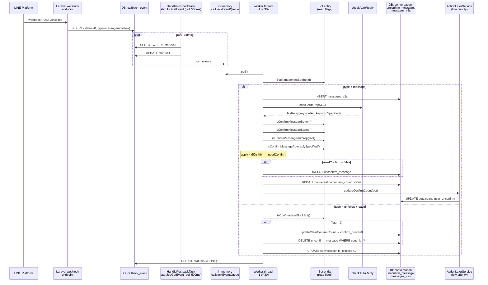

# Job Spec — FA-041 Cài đặt chat 「チャット設定」

> Source: `src/job/linect-service/src/main/java/sns/line/`. Mọi tham chiếu ghi dưới dạng `file:line` (tuyệt đối).
>
> Spring Boot service **không** dùng Kafka, không dùng `@Scheduled`. Toàn bộ LINE webhook events được Laravel ghi vào bảng `callback_event`, sau đó Spring Boot polling mỗi ~500ms để xử lý.

---

## 1. Tổng quan

### 1.1. Tại sao cần background job cho FA-041
- Tab 2 「自動確認設定」 của FA-041 lưu 5 flag điều khiển việc tự động đánh dấu tin nhắn người dùng LINE là "đã xác nhận". Các flag này được **Spring Boot job tiêu thụ**, không phải Laravel.
- Khi người dùng LINE gửi tin nhắn (hoặc block bot), LINE Platform gọi webhook → Laravel endpoint tiếp nhận và ghi vào bảng queue `callback_event` với `status = 0 (STATUS_NEW)`. Spring Boot polling, đọc bot's flags, áp logic điều kiện, quyết định `needConfirm = true/false`.
- Nếu `needConfirm = true` → **không** lưu record vào bảng `unconfirm_message` → về mặt nghiệp vụ, tin nhắn được coi là "confirmed ngay từ đầu" và không làm tăng `conversation.confirm_count`, không bump `bots.count_user_unconfirm`.
- Nếu `needConfirm = false` → lưu `unconfirm_message` + `conversation.confirm_count` += 1 + notify socket.

### 1.2. Giao tiếp
```
LINE Server
   │ webhook HTTP
   ▼
Laravel callback endpoint (src/web/...)
   │ INSERT callback_event (status=0)
   ▼
Spring Boot HandlePostbackTask (polling loop, Thread.sleep 500ms)
   │ UPDATE callback_event.status = 1 (PROCESSING)
   │ dispatch theo CallbackEvent.type
   ▼
doHandleMessage / doHandleUnFollowEvent / doHandleLeaveGroup
   │ Đọc Bot flags (isConfirmMessageButton/Stamp/AutoreplyAll/Specified/UserBlockBot)
   │ Apply điều kiện → needConfirm boolean
   ▼
IF needConfirm → skip INSERT unconfirm_message
ELSE → INSERT unconfirm_message
   │
   ▼ updateLastMessage(confirmed=needConfirm)
   UPDATE conversation SET confirm_count, status_last_message, has_status_0, has_status_1
```

### 1.3. Feature flag
- **`ConfigFile.ENABLE_POSTBACK`** — bật/tắt toàn bộ flow xử lý callback events.
  - File: `c:/xampp/htdocs/lme-reveser-spec/src/job/linect-service/src/main/java/sns/line/AppMain.java:274-278`
  - Khi `true`: gọi `handlePostbackTask.startHandleCallbackEvent()` (spawn polling + 30 worker threads) và `startJobGetMediaEvent()` (media poll loop riêng).
- Không có flag riêng cho auto-confirm — cơ chế confirm luôn chạy cùng flow xử lý message/unfollow.

---

## 2. Queue Tables & State Machine

### 2.1. Bảng queue: `callback_event`
- **Entity**: `c:/xampp/htdocs/lme-reveser-spec/src/job/linect-service/src/main/java/sns/line/models/backenddb/entities/CallbackEvent.java`
- **Cột chính**: `id`, `user_id`, `bot_id`, `line_id`, `type`, `request` (JSON payload LINE webhook), `status`, `error_message`, `created_at`.
- **Trạng thái** (`CallbackEvent.java:9-23`):

| Const | Giá trị | Ý nghĩa |
|-------|---------|---------|
| `STATUS_NEW` | 0 | Laravel vừa insert, chờ Spring Boot nhặt |
| `STATUS_PROCESSING` | 1 | Worker đang xử lý |
| `STATUS_DONE` | 2 | Xử lý xong |
| `STATUS_ERROR` | 3 | Exception trong quá trình xử lý |
| `STATUS_NOT_FOUND_BOT` | 6 | Bot bị xoá trước khi xử lý |
| `STATUS_BLOCKED_BY_BOT` | 7 | User đã bị admin block từ trước |
| `STATUS_EXPIRED_BOT` | 8 | Plan bot hết hạn > 7 ngày |
| `STATUS_MEDIA_NEW` | 30 | Phân luồng riêng cho media download |

- **Type relevant cho FA-041** (`CallbackEvent.java:25-35`):
  - `TYPE_MESSAGE` ("message") — LINE user gửi tin (chi phối `confirm_message_button`, `confirm_message_stamp`, `confirm_message_autoreply_all`, `confirm_message_autoreply_specified`)
  - `TYPE_UNFOLLOW` ("unfollow") — LINE user block bot (chi phối `confirm_message_user_block_bot`)
  - `TYPE_LEAVE_GROUP` ("leave") — Bot bị kick khỏi group (chi phối `confirm_message_user_block_bot`)

### 2.2. Bảng phụ cập nhật bởi job
- **`unconfirm_message`** (bảng chính đánh dấu tin chưa confirm)
  - Entity: `c:/xampp/htdocs/lme-reveser-spec/src/job/linect-service/src/main/java/sns/line/models/linedb/entities/UnconfirmMessage.java:10-12`
  - Cột: `id`, `bot_id`, `message_id`, `conversation_id`, `created_at`, `updated_at`
  - INSERT khi `needConfirm = false` → tin chưa đọc
  - DELETE `deleteAllByConversationId()` khi user block bot (nếu bot bật flag `confirm_message_user_block_bot`)

- **`conversation`**
  - Cột bị cập nhật: `confirm_count`, `status_last_message`, `has_status_0`, `has_status_1`, `last_message`, `last_time_message`
  - Repository: `sns.line.models.linedb.repository.ConversationRepository`
  - Key methods:
    - `updateConversationNewMessage(...)` — `ConversationRepository.java:44` — gọi khi `confirmed = true`
    - `updateConversationNewMessageIncreaseConfirmCount(...)` — `ConversationReadRepository.java:43` — gọi khi `confirmed = false`
    - `updateClearConfirmCount(...)` — `ConversationRepository.java:49` / `:111` — gọi khi user block bot + flag bật

- **`messages_v2s`** (bảng tin nhắn chính — **không** phải `messages_{year}` sharded)
  - Entity: `c:/xampp/htdocs/lme-reveser-spec/src/job/linect-service/src/main/java/sns/line/models/historydb/entities/MessagesV2s.java:11`
  - Cột `is_confirmed`, `confirmed_at` **KHÔNG** được Spring Boot set trực tiếp trên bảng này. Các block code `message.setIsConfirmed(1); message.setConfirmedAt(LocalDateTime.now());` đều **đã bị comment out** (xem `HandlePostbackTask.java:1181-1183, 1337-1339, 1518-1520`).
  - → Cờ "confirmed" thực tế được biểu diễn bằng **sự vắng mặt của record trong `unconfirm_message`** cộng với `conversation.confirm_count` không tăng.

- **`bots.count_user_unconfirm`**
  - Recompute async qua `ActionLaterService.addLowPriorityTask(PriorityTask.updateConfirmCount(bot))` (`HandlePostbackTask.java:1760`, `:1988`).
  - Query rebuild: `BotRepository.java:26-31` — `UPDATE bots SET count_user_unconfirm = (SELECT COUNT(DISTINCT conversation.id) FROM conversation WHERE bot_id = ? AND is_blocked = 0 AND confirm_count = 1)`.

---

## 3. Task Managers / Handlers liên quan

### 3.1. `HandlePostbackTask` — class chính
- **File**: `c:/xampp/htdocs/lme-reveser-spec/src/job/linect-service/src/main/java/sns/line/task/HandlePostbackTask.java`
- **Extends**: `StoppableTask`
- **Bootstrap**: `AppMain.java:274-278` — bên trong `if (ConfigFile.ENABLE_POSTBACK)`:
  ```
  handlePostbackTask.startHandleCallbackEvent();
  handlePostbackTask.startJobGetMediaEvent();
  ```

### 3.2. Polling loop
- **Method**: `startJobGetEvent()` — `HandlePostbackTask.java:136-181`
- Chạy 1 thread riêng, vòng `while(true)`:
  1. `callbackEventRepository.findAllByStatus(CallbackEvent.STATUS_NEW)` — lấy batch events mới (`HandlePostbackTask.java:152`).
  2. Đánh `status = 1 (PROCESSING)` và `saveAll()` — mark claimed.
  3. Đẩy vào queue in-memory `callbackEventQueue` (LinkedList, synchronized).
  4. Nếu empty → `Thread.sleep(500)`.
  5. Nếu exception → `Thread.sleep(1000)` rồi thử lại.

### 3.3. Worker pool (MAX_THREAD = 30)
- **Method**: `startHandleCallbackEvent()` — `HandlePostbackTask.java:280-366`
- 30 worker threads, mỗi thread:
  1. Poll 1 event từ `callbackEventQueue` (`getCallbackEvent()` — `:272-278`).
  2. Verify bot tồn tại + không hết hạn plan.
  3. Dispatch theo `callbackEvent.getType()` (`:313-342`):
     | type | Method xử lý | Liên quan flag |
     |------|-------------|---------------|
     | `TYPE_MESSAGE` | `doHandleMessage()` | button, stamp, autoreply_all, autoreply_specified |
     | `TYPE_UNFOLLOW` | `doHandleUnFollowEvent()` | user_block_bot |
     | `TYPE_LEAVE_GROUP` | `doHandleLeaveGroup()` | user_block_bot |
     | TYPE_FOLLOW, TYPE_POSTBACK, TYPE_VIDEO_PLAY_COMPLETE, TYPE_UNSEND, TYPE_JOIN_GROUP | không đụng các flag FA-041 | — |

---

## 4. Processing Chain theo từng flag

### 4.1. `confirm_message_button` — tin nhắn dạng 「...」
**Trigger**: LINE user gửi tin dạng `text` với nội dung bắt đầu bằng `【` và kết thúc bằng `】` (ví dụ 「【予約】」).

**Flow code**:
1. `doHandleMessage()` → `handleMessage()` → `checkAutoReply(..., hasReply -> { ... })` callback.
2. Trong callback:
   ```java
   // HandlePostbackTask.java:1323-1325 (normal flow)
   if (bot.isConfirmMessageButton() && "text".equals(callbackMessage.getType()) && !needConfirm) {
       needConfirm = message.getContent().startsWith("【") && message.getContent().endsWith("】");
   }
   ```
3. Bot flag reader: `Bot.isConfirmMessageButton()` (`Bot.java:198-200`) — return `confirmMessageButton == 1`.

**Vị trí check**:
- Normal user: `HandlePostbackTask.java:1167-1169` (nhánh `handleMessage` cũ, còn dùng) và `:1323-1325` (nhánh qua `checkAutoReply` callback, path chính).
- Inactive user (đang block): `HandlePostbackTask.java:1505-1507` (trong `handleMessageInactiveUser`).

**Độ tin cậy**: **Cao** — đọc trực tiếp từ source.

**Lưu ý**: Pattern match dùng ký tự 【】 (括弧) — admin muốn tin template gửi bằng button action có confirm tự động (match với tên view FE 「メッセージ内容が「〇〇」の場合」).

---

### 4.2. `confirm_message_stamp` — sticker
**Trigger**: LINE user gửi sticker (message type = `sticker`).

**Flow code**:
```java
// HandlePostbackTask.java:1327-1329
if (bot.isConfirmMessageStamp() && TYPE_STICKER.equals(callbackMessage.getType())) {
    needConfirm = true;
}
```
- `TYPE_STICKER` const: `LineCallbackMessage.TYPE_STICKER` = `"sticker"` (import line 54).
- Bot flag reader: `Bot.isConfirmMessageStamp()` (`Bot.java:214-216`) — đọc column `confirm_message_stamp`, field Java `confirmStamp`.

**Vị trí check**:
- `HandlePostbackTask.java:1171-1173` (nhánh handleMessage cũ).
- `HandlePostbackTask.java:1327-1329` (nhánh checkAutoReply callback).
- `HandlePostbackTask.java:1509-1511` (nhánh inactive user).

**Độ tin cậy**: **Cao**.

---

### 4.3. `confirm_message_autoreply_all` — tin trigger 「すべてのメッセージに反応」
**Trigger**: Tin của user match 1 auto-reply có `keyword_reaction_type = KEYWORD_ANY` (FA-003).

**Flow code**:
1. `checkAutoReply(bot, conversation, lineUser, callbackMessage, replyToken, hasReply -> {...})` duyệt toàn bộ `AutoReply` khớp.
2. Nếu match và `autoReply.getKeywordReactionType() == AutoReply.KEYWORD_ANY`:
   ```java
   // HandlePostbackTask.java:1602-1603
   if(autoReply.getKeywordReactionType() == AutoReply.KEYWORD_ANY){
       hasReply.setHasReplyKeywordAll(true);
   }
   ```
3. Trong callback sau đó:
   ```java
   // HandlePostbackTask.java:1317-1318
   if (bot.isConfirmMessageAutoreplyAll() && hasReply.isHasReplyKeywordAll()) {
       needConfirm = true;
   }
   ```
- Flag reader: `Bot.isConfirmMessageAutoreplyAll()` (`Bot.java:206-208`).
- Helper object: `HasReply` (`c:/xampp/htdocs/lme-reveser-spec/src/job/linect-service/src/main/java/sns/line/models/objects/HasReply.java:1-33`).

**Vị trí check**:
- `HandlePostbackTask.java:1317-1318` (normal flow).
- `HandlePostbackTask.java:1499-1500` (inactive user flow).

**Độ tin cậy**: **Cao**.

---

### 4.4. `confirm_message_autoreply_specified` — tin trigger theo keyword
**Trigger**: Tin của user match 1 auto-reply có `keyword_reaction_type != KEYWORD_ANY` (tức đặt keyword cụ thể).

**Flow code**:
1. Khi match trong `checkAutoReply`:
   ```java
   // HandlePostbackTask.java:1604-1606
   }else {
       hasReply.setHasReplyKeywordSpecified(true);
   }
   ```
2. Trong callback:
   ```java
   // HandlePostbackTask.java:1319-1321
   } else if (bot.isConfirmMessageAutoreplySpecified() && hasReply.isHasReplyKeywordSpecified()) {
       needConfirm = true;
   }
   ```
- Flag reader: `Bot.isConfirmMessageAutoreplySpecified()` (`Bot.java:210-212`).

**Vị trí check**:
- `HandlePostbackTask.java:1319-1321` (normal flow).
- `HandlePostbackTask.java:1501-1503` (inactive user flow).

**Lưu ý thứ tự ưu tiên**: Block `if (autoreplyAll) ... else if (autoreplySpecified)` → nếu cùng 1 tin match cả KEYWORD_ANY lẫn keyword cụ thể thì `autoreply_all` ưu tiên.

**Độ tin cậy**: **Cao**.

---

### 4.5. `confirm_message_user_block_bot` — user block / kick bot khỏi group
**Trigger**: LINE user gửi event `unfollow` (block bot) hoặc bot bị `leave` group.

**Flow code (unfollow)**: `doHandleUnFollowEvent()` — `HandlePostbackTask.java:1945-1966`:
```java
Conversation conversation = ...;
if (conversation != null) {
    MessagesV2s messagesV2s = addMessageUnFollow(bot, conversation.getId());
    if (bot.isConfirmUserBlockBot()) {
        try {
            boolean needUpdateConfirmCount = conversation.getConfirmCount() > 0;
            conversation.setConfirmCount(0);
            conversation.setStatusLastMessage(1);
            conversation.setHasStatus0(0);
            conversation.setHasStatus1(1);
            AppMain.getShareRepository().getConversationRepository().updateClearConfirmCount(...);
            AppMain.getShareRepository().getUnconfirmMessageRepository().deleteAllByConversationId(conversation.getId());
            if (needUpdateConfirmCount) {
                ActionLaterService.addLowPriorityTask(PriorityTask.notifySocketTask(bot.getId(), conversation.getId(), messagesV2s));
            }
        } catch (Exception exDeteleConfirm) {
            LOGGER.error("#doHandleUnFollowEvent-> deleteAllByConversationId Exception " + conversation.getId());
        }
    }
    // ... sau đó set isBlocked=1, blockedAt=now, update conversation
}
```

**Flow code (leave group)**: `doHandleLeaveGroup()` — `HandlePostbackTask.java:414-428`:
```java
if (bot.isConfirmUserBlockBot()) {
    conversation.setConfirmCount(0);
    conversation.setStatusLastMessage(1);
    conversation.setHasStatus0(0);
    conversation.setHasStatus1(1);
    AppMain.getShareRepository().getConversationRepository().updateClearConfirmCount(...);
    AppMain.getShareRepository().getUnconfirmMessageRepository().deleteAllByConversationId(conversation.getId());
}
```

- Flag reader: `Bot.isConfirmUserBlockBot()` (`Bot.java:217-219`) — đọc column `confirm_message_user_block_bot`.

**Hành vi**: Khác với 4 flag trên (áp lên 1 tin mới), flag này **dọn sạch toàn bộ unconfirm_message của conversation** + reset `conversation.confirm_count = 0` + set status `has_status_1 = 1` (status "đã block"). Kết quả: tab 「未読」 không còn hiển thị user này.

**Độ tin cậy**: **Cao**.

**Lưu ý**: Flag `confirm_message_user_block_bot` được share dùng cho CẢ event unfollow (user 1:1 block) và event leave group — semantic mở rộng ngoài tên flag.

---

### 4.6. Flag `confirm_message_autoreply` (cũ) — DEPRECATED
- Bot entity vẫn giữ column cũ: `@Column(name = "confirm_message_autoreply")` — `Bot.java:66-67`, Java field `confirmAutoReply`.
- Reader `Bot.isConfirmMessageAutoreply()` — `Bot.java:202-204`.
- **Trong HandlePostbackTask đã bị comment out** (`HandlePostbackTask.java:1314-1316, 1495-1497`):
  ```java
  // if (bot.isConfirmMessageAutoreply()) {
  //     needConfirm = hasReply.isHasReply();
  // }
  ```
- Thay bằng 2 flag mới `autoreply_all` và `autoreply_specified`.
- **Suy ra**: Laravel view cũng đang comment flag này (xem logic-spec mục 2.2). Confirmed — đây là migration cũ chưa xoá.

**Độ tin cậy**: **Cao** (đọc trực tiếp).

---

### 4.7. Flag `confirm_message_user_send` — KHÔNG có ở Spring Boot
- Được Laravel consume trong `ChatService` (xem logic-spec 3.4).
- Grep `src/job/linect-service/src/main/java/` → chỉ có getter `getConfirmMessageUserSend()` ở `Bot.java:169-171` và field declaration ở `Bot.java:76-77`, không có vị trí nào đọc giá trị để áp logic.
- **Kết luận**: Flag này thuần do Laravel xử lý, Spring Boot không đụng tới.

**Độ tin cậy**: **Cao**.

---

## 5. Services & Helpers

### 5.1. `Bot` entity (reader methods)
- **File**: `c:/xampp/htdocs/lme-reveser-spec/src/job/linect-service/src/main/java/sns/line/models/linedb/entities/Bot.java`
- **Đặc điểm `updatable = false`**: tất cả 7 cột confirm_* đều có `updatable = false` (ví dụ line 64, 72, 74) → Spring Boot **chỉ đọc**, không ghi đè. Flag save hoàn toàn do Laravel `ChatController@saveSettingChat`.
- **Tóm tắt method → field → DB column**:

| Method | Java field | DB column | Line |
|--------|-----------|-----------|------|
| `isConfirmMessageButton()` | `confirmMessageButton` | `confirm_message_button` | 198-200 |
| `isConfirmMessageAutoreply()` (deprecated) | `confirmAutoReply` | `confirm_message_autoreply` | 202-204 |
| `isConfirmMessageAutoreplyAll()` | `confirmMessageAutoreplyAll` | `confirm_message_autoreply_all` | 206-208 |
| `isConfirmMessageAutoreplySpecified()` | `confirmMessageAutoreplySpecified` | `confirm_message_autoreply_specified` | 210-212 |
| `isConfirmMessageStamp()` | `confirmStamp` | `confirm_message_stamp` | 214-216 |
| `isConfirmUserBlockBot()` | `confirmMessageUserBlockBot` | `confirm_message_user_block_bot` | 217-219 |
| `getConfirmMessageUserSend()` (chỉ getter, unused) | `confirmMessageUserSend` | `confirm_message_user_send` | 169-171 |

### 5.2. `HasReply` — struct truyền trạng thái match auto-reply
- **File**: `c:/xampp/htdocs/lme-reveser-spec/src/job/linect-service/src/main/java/sns/line/models/objects/HasReply.java`
- **Fields**: `hasReplyKeywordAll`, `hasReplyKeywordSpecified` (cả hai `boolean`).
- **Method quan trọng**:
  - `isHasReply()` (line 14-16): return `hasReplyKeywordAll || hasReplyKeywordSpecified`
  - `isHasReplyKeywordAll()`, `isHasReplyKeywordSpecified()`: getters
  - `setHasReplyKeywordAll/Specified()`: setters gọi từ `checkAutoReply()`

### 5.3. `checkAutoReply()`
- **File**: `HandlePostbackTask.java:1534-1655`
- **Input**: `Bot bot, Conversation conversation, LineUser lineUser, LineCallbackMessage callbackMessage, String replyToken, Consumer<HasReply> replyCallback`
- **Output**: Gọi `replyCallback.accept(hasReply)` với `HasReply` đã điền `hasReplyKeywordAll/Specified`.
- **Logic**: Duyệt `AutoReply` list, kiểm tra keyword match + time trigger + filter_v2, nếu pass thì set flag tương ứng vào `hasReply` và dispatch `ActionAutoReply` (nếu có action cần chạy).

### 5.4. `updateLastMessage()`
- **File**: `HandlePostbackTask.java:1674-1900+`
- **Input**: `Bot bot, LineUser/LineGroup, Conversation conversation, MessagesV2s message, boolean confirmed, boolean hide, HasReply hasReply`
- **Logic quan trọng** cho flag FA-041:
  ```
  IF confirmed == true:
      ConversationRepository.updateConversationNewMessage(content, time, statusLast, hasStatus0, hasStatus1, id)
      // confirm_count KHÔNG tăng
  ELSE:
      ConversationReadRepository.updateConversationNewMessageIncreaseConfirmCount(...)
      // confirm_count = CASE WHEN NULL THEN 1 ELSE confirm_count + 1 END
      IF conversation.getConfirmCount() <= 0:
          ActionLaterService.addLowPriorityTask(PriorityTask.updateConfirmCount(bot))
          // async: UPDATE bots.count_user_unconfirm = recompute
  ```
- Sau đó xử lý notify (mobile + PC) dựa trên `notifySetting`, phân biệt theo `hasReply.isHasReplyKeywordAll/Specified()`.

### 5.5. `handleMessage()` — entry point xử lý tin nhắn LINE
- **File**: `HandlePostbackTask.java:1195-1370`
- **Mô tả**: Nhận `CallbackEvent.TYPE_MESSAGE`, parse payload, tạo `MessagesV2s`, download media (nếu có), SAVE `messages_v2s`, gọi `checkAutoReply`, trong callback áp 4 điều kiện confirm, INSERT `unconfirm_message` (nếu `!needConfirm`), gọi `updateLastMessage`, dispatch socket notify.

### 5.6. `handleMessageInactiveUser()` — xử lý tin từ user đã block
- **File**: `HandlePostbackTask.java:1372-1532`
- **Mô tả**: Trường hợp user đã block bot từ trước mà vẫn gửi được tin (LINE cho phép qua inactive auto-reply). Flow tương tự `handleMessage` nhưng đặt `FILTER_TARGET_USER = INACTIVE`. Cùng 4 điều kiện confirm được áp dụng (`:1499-1511`).

### 5.7. `doHandleUnFollowEvent()` — xử lý user block bot 1:1
- **File**: `HandlePostbackTask.java:1912-2030+`
- Set `bot_line_user.is_blocked = 1`, tăng `bot_friend_statistic` unfollow, set `conversation.is_blocked = 1, blocked_at = now`, áp flag `confirm_message_user_block_bot` để dọn `unconfirm_message` + reset `confirm_count`, delete `message_error`, stop scenario, notify mobile.

### 5.8. `doHandleLeaveGroup()` — bot bị kick khỏi group
- **File**: `HandlePostbackTask.java:398-456`
- Cùng logic áp flag `confirm_message_user_block_bot` (chỉ khác phần notify/statistic).

---

## 6. External API Calls

### 6.1. LINE Messaging API — Download Media (chỉ khi tin message type không phải text/sticker/location)
- Gọi tại `HandlePostbackTask.java:1269` qua `downloadMedia(bot, event.getId(), body, 1)`:
  ```
  POST {API_SERVER_CERT}/download-media
  body: { _token, message_id, channel_access_token, message_type }
  ```
- Nếu fail → `event.setStatus(STATUS_MEDIA_ERROR)`, không chặn flow auto-confirm.

### 6.2. Socket/Notify service
- `ActionLaterService.addNormalPriorityTask(PriorityTask.notifySocketTask(...))` — không phải LINE API mà là internal HTTP callback sang Laravel để push WebSocket cho admin đang mở UI chat.
- File: `HandlePostbackTask.java:1190, 1346`.

### 6.3. KHÔNG gọi LINE API khi áp flag auto-confirm
- Các flag FA-041 chỉ ảnh hưởng **trạng thái nội bộ** (`unconfirm_message`, `conversation.confirm_count`). Không gửi reply về LINE, không gọi Messaging API.
- Auto-reply action (nếu có trigger) được xử lý riêng qua `doActionAutoReplyAccept()` → LINE reply API. Độc lập với cơ chế confirm.

---

## 7. Data Flow Diagram



---

## 8. Error Handling

### 8.1. Polling loop
- Exception khi query `callback_event` → log + `Thread.sleep(1000)` rồi retry (`HandlePostbackTask.java:166-173`).
- Event không match type → `STATUS_UNKNOWN_TYPE` (`:338-341`), save và tiếp tục.

### 8.2. Xử lý từng event
- Mỗi handler (`doHandleMessage`, `doHandleUnFollowEvent`, ...) có try/catch **ngoài cùng**:
  ```
  try {
      // logic
      event.setStatus(STATUS_DONE);
  } catch (Exception ex) {
      event.setStatus(STATUS_ERROR);
      event.setErrorMessage(ex.toString());
      LOGGER.error(...);
  } finally {
      callbackEventRepository.save(event);
  }
  ```
- Try/catch **nội bộ** riêng cho phần dọn unconfirm khi block bot (`HandlePostbackTask.java:1951-1965`, `:417-427`) — chỉ log lỗi, không fail toàn bộ handler. Điều này có nghĩa nếu DELETE unconfirm fail thì user vẫn bị mark blocked, chỉ đếm bị sai.

### 8.3. Chatwork notification
- Một số lỗi nghiêm trọng gọi `NotifyUtils.sendMessageChatwork(...)` / `sendReportChatwork(...)` để report lên Chatwork (ví dụ `:1479`, `:1650`). Không dùng cho các lỗi confirm thông thường.

### 8.4. Graceful shutdown
- Worker thread check `checkStopBeforeReboot() || isNeedStop()` mỗi vòng (`:147-149`, `:192-194`, `:292-294`) → cho phép reboot service không mất event (event đã claim nhưng xử lý dở sẽ ở status = 1 PROCESSING → cần job recovery; hiện không thấy recovery tự động cho type=message).

---

## 9. Liên kết với Web App

### 9.1. Hướng ghi (Web → Job consume)
| Tác nhân | Hành động | Bảng | Job consume |
|----------|-----------|------|-------------|
| Admin UI tab 2 | Toggle 5 flag + submit | `bots.confirm_message_*` (UPDATE) | `HandlePostbackTask` đọc qua `Bot` entity mỗi lần `BotManager.getNewBot()` |
| LINE Platform | Webhook event | `callback_event` (INSERT, status=0) | `HandlePostbackTask.startJobGetEvent()` poll |

### 9.2. Hướng đọc (Job ghi → Web hiển thị)
| Bảng | Cột bị ghi | Web consume ở đâu |
|------|-----------|-------------------|
| `unconfirm_message` | INSERT/DELETE | UI 1:1 Chat hiển thị số tin chưa đọc theo conversation |
| `conversation` | `confirm_count, status_last_message, has_status_0/1, last_message, last_time_message` | Sidebar chat list (badge đỏ, status chip) |
| `messages_v2s` | INSERT (content tin nhắn mới) | Chat window hiển thị tin |
| `bots` | `count_user_unconfirm` (recompute) | Header menu hiển thị tổng số user chưa đọc |

### 9.3. Tab 1 「ステータス管理」 — KHÔNG có tương tác với Spring Boot job
- Bảng `status_chat` (tab 1) chỉ được Laravel CRUD qua `ChatController` (xem logic-spec §1.4-1.10).
- Grep `src/job/linect-service/` cho `status_chat`, `StatusChat` → **không có match**.
- Cột `status_chat.count` (logic-spec nghi ngờ Spring Boot cập nhật) → thực tế **không** được Spring Boot cập nhật. Có thể là cột không dùng/legacy; cần verify với FE hoặc DB-mapper.

**Độ tin cậy**: **Cao** (đã grep toàn bộ).

### 9.4. Tab 3/4/5 (shortcut, shorten URL, preview) — KHÔNG có job
- `setting_shortcut`, `is_shorten_url`, `preview_after_send`:
  - `setting_shortcut`, `preview_after_send`: thuần client-side.
  - `is_shorten_url`: Laravel-side khi gửi tin 1:1.
- Không có handler nào ở Spring Boot đọc 3 cột này (confirmed bằng grep).

---

## 10. Tóm tắt Business Rules (Cross-check với logic-spec)

| Flag | Nguồn consume | Trigger | Kết quả | Mức độ tin cậy |
|------|--------------|---------|---------|---------------|
| `confirm_message_button` | Spring Boot `HandlePostbackTask` | LINE message text match `/^【.*】$/` | skip INSERT unconfirm_message | Cao |
| `confirm_message_stamp` | Spring Boot `HandlePostbackTask` | LINE message type = sticker | skip INSERT unconfirm_message | Cao |
| `confirm_message_autoreply_all` | Spring Boot `HandlePostbackTask` | Tin match auto-reply có KEYWORD_ANY | skip INSERT unconfirm_message | Cao |
| `confirm_message_autoreply_specified` | Spring Boot `HandlePostbackTask` | Tin match auto-reply có keyword cụ thể | skip INSERT unconfirm_message | Cao |
| `confirm_message_user_block_bot` | Spring Boot `HandlePostbackTask` | LINE unfollow OR bot leave group | DELETE toàn bộ unconfirm_message + reset conversation.confirm_count | Cao |
| `confirm_message_user_send` | Laravel `ChatService` | Admin gửi tin nhắn thành công | Update `bots.count_user_unconfirm` + `last_time_count_user_confirm` | Cao |
| `confirm_message_autoreply` (cũ) | KHÔNG dùng | — (code đã comment) | — | Cao (deprecated) |

---

## 11. Gaps & Anomalies

### 11.1. `messages_v2s.is_confirmed` không được set
- Logic-spec nghi ngờ Spring Boot `UPDATE messages_{year}.is_confirmed = 1`. Thực tế:
  1. Bảng là `messages_v2s` (unified, không sharded theo năm ở Spring Boot).
  2. Các dòng `message.setIsConfirmed(1); message.setConfirmedAt(LocalDateTime.now())` đều **đã comment** (4 chỗ: `:1181-1183`, `:1337-1339`, `:1518-1520`, và comment tại 5.5 của ứng dụng này).
  3. Repository `MessageRepository.java:19` chỉ query `SELECT COUNT(*) FROM messages WHERE is_confirmed = 0` — nhưng không có query UPDATE.
- **Kết luận**: State "confirmed" được biểu diễn qua **`unconfirm_message`** (presence/absence), **không phải** cột `is_confirmed` trên bảng message.
- Mâu thuẫn với logic-spec 5.2.1 ghi "Spring Boot job đọc ... áp dụng logic đánh dấu `is_confirmed = 1` / `confirmed_at = NOW()` trên bảng messages" → **cần correct lại**: logic đúng là INSERT/DELETE `unconfirm_message`.

### 11.2. Bảng `messages_{year}` sharded
- Logic-spec ghi "messages có thể sharded theo năm". Grep `src/job/linect-service/` cho `messages_2024`, `messages_2025`, `MessagesYear`, `ShardedMessages` → **không có match**.
- Spring Boot chỉ dùng `messages_v2s` (1 bảng tổng) và `messages` (bảng legacy, xuất hiện ở `MessageRepository.java:19` và `LineUserModel.java:2257`).
- **Khả năng**: Sharding theo năm (nếu có) là ở layer DB/MySQL partition hoặc logic Laravel, không phải Spring Boot.

### 11.3. Worker thread crash → event kẹt `status=1`
- Không thấy job recovery cho `callback_event` kẹt ở status = 1 (PROCESSING).
- So sánh: `RichmenuUpdateHistory` có recovery `findAllByStatusOrderByIdAsc(STATUS_PROCESS)` ở `UpdateRichMenuTask.java:27`. `callback_event` thì không.
- **Rủi ro**: Nếu Spring Boot crash giữa xử lý `handleMessage` → event sẽ mất vĩnh viễn (không được retry). Có thể cần flag BR-11 cho FE/DevOps.

### 11.4. Flag `confirm_message_autoreply` (cũ) chưa xoá schema
- Cột vẫn tồn tại trong bảng `bots`, entity Bot vẫn map, Laravel migration `2021_12_31` tạo ra. Nhưng cả Laravel lẫn Spring Boot đều comment phần logic. UI (tab 2) cũng không render toggle.
- Đề xuất: ghi nhận vào cleanup backlog, không ảnh hưởng chức năng hiện tại.

### 11.5. Bảng `status_chat` (tab 1) — Spring Boot không đọc/ghi
- Confirmed bằng grep. Cột `status_chat.count` (đếm số conversation có status đó) — không thấy job nào cập nhật. Có thể:
  1. Cột legacy chưa xoá.
  2. Laravel cập nhật thời điểm đọc (lazy compute từ conversation), nhưng logic-spec §1.10 cho thấy controller delete chỉ SET NULL conversation.id_status, không đụng `status_chat.count`.
  3. Hoặc DB trigger — cần DB-mapper xác nhận.

---

## 12. Files Spring Boot tham khảo chính (absolute)

| File | Dòng liên quan | Vai trò |
|------|---------------|---------|
| `c:/xampp/htdocs/lme-reveser-spec/src/job/linect-service/src/main/java/sns/line/AppMain.java` | 175, 219, 263, 274-278, 391, 638 | Bootstrap `HandlePostbackTask` dưới flag `ENABLE_POSTBACK` |
| `c:/xampp/htdocs/lme-reveser-spec/src/job/linect-service/src/main/java/sns/line/task/HandlePostbackTask.java` | 136-181 (poll loop), 280-366 (worker dispatch), 398-456 (leave group), 1195-1370 (handleMessage), 1372-1532 (handleMessageInactiveUser), 1534-1655 (checkAutoReply), 1674-1900+ (updateLastMessage), 1912-2030+ (unfollow) | Toàn bộ logic auto-confirm |
| `c:/xampp/htdocs/lme-reveser-spec/src/job/linect-service/src/main/java/sns/line/models/backenddb/entities/CallbackEvent.java` | 1-116 | Entity + status/type constants |
| `c:/xampp/htdocs/lme-reveser-spec/src/job/linect-service/src/main/java/sns/line/models/backenddb/repository/CallbackEventRepository.java` | 11-20 | JpaRepository + native query update |
| `c:/xampp/htdocs/lme-reveser-spec/src/job/linect-service/src/main/java/sns/line/models/linedb/entities/Bot.java` | 64-77, 169-171, 198-219 | Mapping flag columns + helper methods |
| `c:/xampp/htdocs/lme-reveser-spec/src/job/linect-service/src/main/java/sns/line/models/linedb/entities/UnconfirmMessage.java` | 1-43 | Entity bảng mark unread |
| `c:/xampp/htdocs/lme-reveser-spec/src/job/linect-service/src/main/java/sns/line/models/linedb/repository/ConversationRepository.java` | 44, 49, 111 | Update confirm_count/status |
| `c:/xampp/htdocs/lme-reveser-spec/src/job/linect-service/src/main/java/sns/line/models/linedb/readrepository/ConversationReadRepository.java` | 33, 43, 48 | Read-DB variants cho increase/clear confirm_count |
| `c:/xampp/htdocs/lme-reveser-spec/src/job/linect-service/src/main/java/sns/line/models/linedb/repository/BotRepository.java` | 26, 31 | Rebuild `bots.count_user_unconfirm` |
| `c:/xampp/htdocs/lme-reveser-spec/src/job/linect-service/src/main/java/sns/line/models/historydb/entities/MessagesV2s.java` | 11 (table `messages_v2s`) | Entity tin nhắn chính |
| `c:/xampp/htdocs/lme-reveser-spec/src/job/linect-service/src/main/java/sns/line/models/objects/HasReply.java` | 1-33 | Struct truyền trạng thái keyword match |
