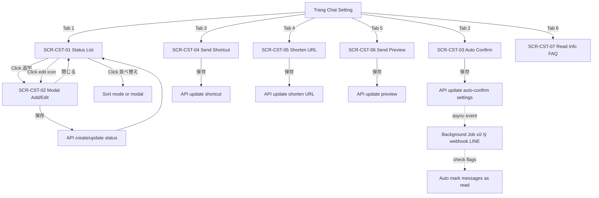

# FA-041: Cài đặt chat 「チャット設定」

## Tổng quan
Trang cài đặt tuỳ chọn cho tính năng 1:1 Chat 「1:1チャット」của Admin LINE OA. Trang này tập hợp 6 tab cấu hình liên quan đến trải nghiệm chat:

1. Quản lý trạng thái phản hồi (response status) dùng để phân loại tiến độ xử lý từng cuộc hội thoại.
2. Cấu hình tự động đánh dấu "đã đọc" (đã xác nhận) cho tin nhắn nhận được — **liên quan background job**.
3. Cấu hình phím tắt gửi (Enter/Shift+Enter).
4. Bật/tắt dùng URL rút gọn khi gửi link trong chat.
5. Bật/tắt hiển thị khung xem trước trước khi gửi.
6. Hiển thị FAQ về thông tin đã đọc (既読情報) — không có form.

- **URL chính**: `/basic/chat-setting`
- **Page title**: 「1:1チャット設定」
- **Nhóm menu**: メインサービス → 1:1チャット → チャット設定
- **AJAX init**:
  - `GET /ajax/initial/get-data-setting` — load các cấu hình chung (auto-confirm, shortcut, shorten URL, preview)
  - `GET /ajax/init-status-chat-v2?page=1&per_page=10` — load danh sách response status có phân trang
  - `GET /ajax/init-status-chat-v2` — load toàn bộ status (có thể cho dropdown ở các trang chat khác)

## Đối tượng sử dụng (Actors)
| Đối tượng | Mô tả | Ghi chú |
|-----------|-------|---------|
| Admin LINE OA | Chủ tài khoản — cấu hình toàn bộ 6 tab | Toàn quyền |
| Staff | Nhân viên được Admin tạo | Có quyền truy cập nếu custom role cho phép tính năng「チャット設定」 — cần xác nhận qua FA-036 Staff Management |

## Danh sách màn hình

| Mã màn hình | Tên màn hình (JP) | Tên màn hình (VN) | URL / Trigger | Ghi chú |
|-------------|------------------|-------------------|---------------|---------|
| SCR-CST-01 | 対応ステータス編集 | Tab 1 — Quản lý trạng thái phản hồi | `/basic/chat-setting` (tab 1) | Danh sách status, phân trang, có nút 追加 + 並べ替え |
| SCR-CST-02 | 対応ステータス新規追加 | Modal thêm/sửa trạng thái | Click「追加」hoặc icon edit trên row | Sub-screen của SCR-CST-01 |
| SCR-CST-03 | メッセージの自動確認済み変更 | Tab 2 — Tự động đánh dấu đã đọc | Tab 2 | 4 checkbox + 2 toggle, **có background job** |
| SCR-CST-04 | 送信ショートカット | Tab 3 — Phím tắt gửi | Tab 3 | 2 radio |
| SCR-CST-05 | 短縮URLの利用 | Tab 4 — Dùng URL rút gọn | Tab 4 | 1 toggle |
| SCR-CST-06 | 送信プレビュー | Tab 5 — Xem trước khi gửi | Tab 5 | 1 toggle + warning |
| SCR-CST-07 | 既読情報の表示 | Tab 6 — FAQ về thông tin đã đọc | Tab 6 | Chỉ hiển thị FAQ, không có form/save |

---

## SCR-CST-01 — Tab 1「対応ステータス編集」(Quản lý trạng thái phản hồi)

### Layout
- Layout 3 cột chung của trang chat-setting:
  - Cột trái: sidebar menu toàn hệ thống (navigation chính)
  - Cột giữa: menu phụ 1:1チャット (link 1:1チャット, チャット設定)
  - Cột phải (nội dung chính): thanh tab ngang 6 tab ở đầu, dưới là nội dung tab đang active.
- Tab bar: 6 tab ngang `対応ステータス編集 | メッセージの自動確認済み変更 | 送信ショートカット | 短縮URLの利用 | 送信プレビュー | 既読情報の表示` — tab 1 active mặc định khi mở trang.
- Khu vực nội dung:
  - Tiêu đề: 「対応ステータス編集」
  - Mô tả: 「対応ステータスのテキストとカラーが変更できます」
  - 2 nút hành động: 「追加」(primary, icon +) và 「並べ替え」(secondary, icon sort)
  - Danh sách status (`<ul>`): mỗi item có
    - Tên status (chip màu) — vd: 「見込みあり」,「対応中」,「フォロー」,「トラブル」,「対応完了」
    - 2 nút icon: Edit (pencil) + Delete (thùng rác)
  - Pagination: button「10/page」(dropdown page size)

### Form Fields
Không có form inline — chỉnh sửa qua modal SCR-CST-02.

### Action Buttons
| Nút | Label JP | Hành động | Màn hình đích |
|-----|---------|-----------|---------------|
| Thêm status | 追加 | Mở modal thêm mới | SCR-CST-02 (chế độ create) |
| Sắp xếp | 並べ替え | Bật chế độ kéo-thả / mở dialog sắp xếp | Chưa xác nhận — cần click thử |
| Edit row | (icon pencil) | Mở modal với data pre-filled | SCR-CST-02 (chế độ edit) |
| Delete row | (icon trash) | Xoá status — có thể hỏi confirm | Chưa xác nhận |
| Dropdown page size | 10/page | Đổi số item mỗi trang | Reload list |

### Observations
- Số lượng status mẫu: **5 items** đã seed sẵn. Có thể là default khi tạo bot mới.
- Mỗi status hiển thị dưới dạng chip có nền màu — màu này chính là `color` được lưu trong DB.
- Pagination có sẵn → cho phép tạo nhiều status (>10). Chưa rõ giới hạn tối đa.
- Không có search/filter cho danh sách.
- API `GET /ajax/init-status-chat-v2?page=1&per_page=10` load phân trang, còn `GET /ajax/init-status-chat-v2` (không query) có thể dùng để load full list cho dropdown ở màn hình FA-001 (1:1 Chat) và FA-002 (Quản lý chat).

---

## SCR-CST-02 — Modal「対応ステータス新規追加」(Thêm/sửa trạng thái)

### Layout
- Modal overlay xuất hiện phía trên danh sách.
- Header: Title「対応ステータス新規追加」(create) hoặc「対応ステータス編集」(edit — suy luận) + nút đóng (X).
- Body: 2 field
  - Field 1: `ステータス名` (Status name)
  - Field 2: `カラー` (Color picker)
- Footer: 2 nút「閉じる」(Close) + 「保存」(Save).

### Form Fields
| Label JP | Label VN | Input type | Validation | Bắt buộc | Ghi chú |
|----------|---------|-----------|------------|---------|---------|
| ステータス名 | Tên trạng thái | textbox | max 20 ký tự (counter 0/20 hiển thị ở góc) | Có (suy luận) | Placeholder「ステータス名を入力」 |
| カラー | Màu | color picker (palette preset) | Phải chọn 1 màu | Có | Cần snapshot khi click để lấy danh sách màu preset |

### Action Buttons
| Nút | Label JP | Hành động | Màn hình đích |
|-----|---------|-----------|---------------|
| Đóng | 閉じる | Đóng modal, bỏ qua thay đổi | Quay lại SCR-CST-01 |
| Lưu | 保存 | Submit form → POST/PUT endpoint | Đóng modal + refresh list |

### Observations
- Counter ký tự hiển thị `0/20` bên cạnh textbox → max length = 20.
- Color picker trong snapshot chỉ thấy 1 generic element `[ref=e344] [cursor=pointer]` — cần click để xem palette (số màu preset? Có cho nhập hex custom?).
- Modal có kết cấu chuẩn Element UI (có thể là `el-dialog`).

---

## SCR-CST-03 — Tab 2「メッセージの自動確認済み変更」(Tự động đánh dấu đã đọc) ⚙ có Background Job

### Layout
- Tiêu đề tab: 「メッセージの自動確認済み変更」
- 2 dòng mô tả:
  - 「設定した受信メッセージを自動的に確認済みに変更します。」
  - 「確認済みに変更されたメッセージは通知されません。」
- Section 1: 4 checkbox chọn loại tin nhắn được auto-confirm
- Section 2: Toggle「返信時の自動確認済み変更」(Auto confirm khi reply)
- Section 3: Toggle「ブロックされた友だちの自動確認済み変更」(Auto confirm khi bị block)
- Nút 「保存」 ở cuối.

### Form Fields
| Label JP | Label VN | Input type | Bắt buộc | Ghi chú |
|----------|---------|-----------|----------|---------|
| 【〇〇】メッセージ | Tin nhắn dạng marker (vd sticker emoji) | checkbox | Không | |
| スタンプ | Stamp | checkbox | Không | |
| [すべてのメッセージに反応] のメッセージ | Tin nhắn matched trigger「all messages」 | checkbox | Không | Liên quan FA-003 Auto Reply |
| [設定したキーワードに反応] のメッセージ | Tin nhắn matched keyword trigger | checkbox | Không | Liên quan FA-003 Auto Reply |
| 返信時の自動確認済み変更 | Auto confirm khi admin reply | toggle (利用しない/利用する) | Không | 「未確認のメッセージがある場合に、メッセージの返信と同時に自動で確認済みに変更します。」 |
| ブロックされた友だちの自動確認済み変更 | Auto confirm khi bạn bè block bot | toggle (利用しない/利用する) | Không | 「未確認のメッセージがある状態で、友だちからブロックされた際に自動で確認済みに変更します。」 |

### Action Buttons
| Nút | Label JP | Hành động |
|-----|---------|-----------|
| Lưu | 保存 | Submit tất cả setting trên tab → POST update bot_settings |

### Observations
- **Có background job (Spring Boot)**: việc auto-confirm tin nhắn khi bot nhận message (case 4 checkbox) và khi user bị block (case toggle 2) có khả năng được xử lý async trong job — vì sự kiện xảy ra ngoài flow user nhập liệu.
- Case toggle 1 「返信時の自動確認済み変更」 có thể được xử lý inline trong backend Laravel khi admin gửi reply.
- Cần `job-analyzer` kiểm tra: job listener nào xử lý event LINE webhook message → auto-confirm flag.

---

## SCR-CST-04 — Tab 3「送信ショートカット」(Phím tắt gửi)

### Layout
- Tiêu đề: 「送信ショートカット」
- Mô tả: 「送信時のショートカットを変更します。」
- 2 radio button (exclusive):
  - 「送信：Shift +Enter 改行：Enter」 — default checked
  - 「送信：Enter 改行：Shift +Enter」
- Nút 「保存」

### Form Fields
| Label JP | Label VN | Input type | Giá trị | Ghi chú |
|----------|---------|-----------|---------|---------|
| 送信ショートカット | Phím tắt gửi | radio group | 0: Shift+Enter gửi / 1: Enter gửi (suy luận) | Default: option 1 (Shift+Enter gửi) |

### Action Buttons
| Nút | Label JP | Hành động |
|-----|---------|-----------|
| Lưu | 保存 | Update shortcut setting |

### Observations
- Tuỳ chọn này có thể là cài đặt cấp **bot** (tất cả user cùng 1 setting) hoặc cấp **user/staff** (preference cá nhân) — cần xác nhận qua API.
- Default là Shift+Enter → Gửi, giống các app chat chuyên nghiệp (Slack).

---

## SCR-CST-05 — Tab 4「短縮URLの利用」(Dùng URL rút gọn)

### Layout
- Tiêu đề: 「短縮URLの利用」
- Mô tả 2 dòng:
  - 「1:1チャットでURLを送信する際に短縮リンクを利用します。」
  - 「(URL分析が利用できます)」
- 1 toggle 利用しない / 利用する (checkbox switch)
- Nút 「保存」

### Form Fields
| Label JP | Label VN | Input type | Ghi chú |
|----------|---------|-----------|---------|
| 短縮URL利用 | Dùng URL rút gọn | toggle | Ảnh hưởng khi gửi URL trong 1:1 chat — liên kết FA-024 (URL分析) |

### Action Buttons
| Nút | Label JP | Hành động |
|-----|---------|-----------|
| Lưu | 保存 | Update setting |

### Observations
- Khi bật: URL gửi ra sẽ được rút gọn qua hệ thống URL của LME → cho phép đo tracking trong「URL分析」(FA-024).
- Liên quan chặt với FA-024 URL Analysis.

---

## SCR-CST-06 — Tab 5「送信プレビュー」(Xem trước khi gửi)

### Layout
- Tiêu đề: 「送信プレビュー」
- Mô tả: 「1:1チャットでの送信時にプレビューを表示します。」
- 1 toggle 利用しない / 利用する — **default: checked (利用する)**
- Box cảnh báo「ご注意」: 「LINE公式アカウントの仕様上、エルメからの送信取り消しはできません。送信から24時間以内のメッセージのみ、LINE公式アカウント管理画面のチャットから送信取り消しが可能です。詳細は こちら」(link FAQ tayori.com)
- Nút 「保存」

### Form Fields
| Label JP | Label VN | Input type | Mặc định | Ghi chú |
|----------|---------|-----------|----------|---------|
| 送信プレビュー利用 | Dùng preview trước khi gửi | toggle | Bật | |

### Action Buttons
| Nút | Label JP | Hành động |
|-----|---------|-----------|
| Lưu | 保存 | Update setting |

### Observations
- Khi bật: trước khi gửi tin nhắn trong 1:1 chat, hiển thị popup/modal confirm preview → tránh gửi nhầm (vì không thể recall).
- Cảnh báo nhấn mạnh đặc thù LINE OA: recall message chỉ trong 24h và chỉ qua native LINE OA console (không phải qua LME).

---

## SCR-CST-07 — Tab 6「既読情報の表示」(FAQ thông tin đã đọc)

### Layout
- Tiêu đề: 「既読情報の表示」
- 3 block Q&A:
  - **Q1**: 「エルメから友だちがメッセージを開いたか（既読か）はわかりますか？」
    - A: Không thể — do LINE OA API không cung cấp. Link FAQ tayori.
  - **Q2**: 「友だちがメッセージを送信してすぐに既読マークをつけないようにできますか？」
    - A: Cấu hình ở 「応答設定」của LINE OA (chat on/off). Link FAQ tayori.
  - **Q3**: 「友だちからのメッセージを確認しても、相手のライン上で「既読」がつかないのですがエラーですか？」
    - A: Phụ thuộc 「応答設定」chat on/off. Link FAQ tayori.

### Form Fields
**Không có** — chỉ hiển thị text + link.

### Action Buttons
**Không có** — tab thuần đọc (read-only).

### Observations
- Tab này không thực sự là "setting" — chỉ là FAQ giải thích giới hạn của LINE OA platform.
- Các link đều dẫn ra `tayori.com/faq/d4e42fc0c7a75019a78315d4cf48cfe2404b4727/...` (knowledge base của LME).

---

## Luồng người dùng (User Flows)

### Flow 1 — Thêm status mới
1. User vào `/basic/chat-setting` (mặc định tab 1).
2. User click nút 「追加」.
3. Hệ thống mở modal SCR-CST-02.
4. User nhập tên status (max 20 ký tự) và chọn màu từ palette.
5. User click 「保存」.
6. Hệ thống gọi API create → reload danh sách → modal đóng.

### Flow 2 — Sửa status
1. User click icon edit (pencil) trên một row status.
2. Modal SCR-CST-02 mở với data pre-filled (tên + màu hiện tại).
3. User chỉnh sửa → click 「保存」.
4. Reload list.

### Flow 3 — Xoá status
1. User click icon delete (trash) trên row.
2. Hệ thống hiển thị confirm dialog (suy luận — cần xác nhận).
3. Nếu OK → gọi API delete → reload list.
4. Lưu ý: xoá status đang được gán cho conversation có cảnh báo hay không? — cần điều tra.

### Flow 4 — Sắp xếp status
1. User click nút 「並べ替え」.
2. Kịch bản 1: Bật chế độ drag-drop trên list hiện tại + nút「保存」thứ tự.
3. Kịch bản 2: Mở modal riêng với list cho phép kéo thả.
4. Kịch bản chưa xác định — chưa snapshot được.

### Flow 5 — Cài đặt auto-confirm (Tab 2)
1. User chuyển tab 2.
2. Tick/bỏ tick 4 checkbox loại tin nhắn muốn auto-confirm.
3. Bật/tắt 2 toggle (返信時 + ブロック時).
4. Click 「保存」 → POST /ajax/... (endpoint cần web-analyzer xác nhận).
5. Backend lưu vào bot_settings → từ giờ background job (Spring Boot) áp dụng rule khi xử lý webhook LINE.

### Flow 6 — Cài đặt phím tắt gửi (Tab 3)
1. User chuyển tab 3.
2. Chọn 1 trong 2 radio option.
3. Click 「保存」.

### Flow 7 — Bật/tắt URL rút gọn (Tab 4)
1. User chuyển tab 4.
2. Click toggle.
3. Click 「保存」.

### Flow 8 — Bật/tắt preview (Tab 5)
1. User chuyển tab 5.
2. Click toggle.
3. Click 「保存」.

### Flow Diagram

---

## Điểm chưa rõ / cần điều tra

| # | Vấn đề | Hành động đề xuất |
|---|--------|-------------------|
| 1 | Cơ chế 並べ替え — drag-drop inline hay mở modal riêng? | Click nút và snapshot lại |
| 2 | Color picker: bao nhiêu màu preset? Có custom hex input không? | Click nút color trong modal và snapshot |
| 3 | Auto-confirm: chạy trong Spring Boot job hay Laravel queue? | Chờ `web-analyzer` + `job-analyzer` xác nhận nguồn xử lý LINE webhook |
| 4 | Phím tắt gửi: setting cấp bot hay cấp user? | Kiểm tra endpoint save — xem scope của record (bot_id hay user_id) |
| 5 | Pagination tab 1: chỉ có 10/page hay đổi được? | Click dropdown `10/page` để xem options |
| 6 | Có confirm dialog khi xoá status không? | Click icon delete (test — nhưng KHÔNG confirm) |
| 7 | Xoá status đang được dùng — cảnh báo/chặn không? | Kiểm tra logic trong web-analyzer |
| 8 | Liên hệ với FA-001 (1:1 Chat) và FA-002 (Quản lý chat) — status list hiển thị ở đâu? | Cross-check khi spec FA-001, FA-002 |
| 9 | Endpoint save cho từng tab — tên rõ ràng không? | `web-analyzer` tìm trong routes.md theo prefix `/ajax/` của chat-setting |
| 10 | Các preset colors có phải enum cố định hay free hex? | Click color picker và so sánh với bảng `chat_status`/tương đương trong DB |

---

## Liên quan đến các tính năng khác

| Feature | Quan hệ |
|---------|---------|
| FA-001 (1:1 Chat) | Consumer của danh sách status — hiển thị dropdown status trên từng conversation |
| FA-002 (Quản lý chat) | Filter theo status khi list conversation; column「対応ステータス」 |
| FA-003 (Auto Reply) | Các checkbox tab 2 tham chiếu trigger「すべてのメッセージに反応」và「キーワードに反応」của FA-003 |
| FA-024 (URL Analysis) | Tab 4 shorten URL — khi bật thì URL gửi ra được tracking bởi FA-024 |
| Background Job | Tab 2 auto-confirm — logic áp dụng khi LINE webhook đến |

## Shared components đã phát hiện
- Không phát hiện shared component (SC-001..SC-007) nào trong tính năng này.
- **Ứng viên shared mới nghi ngờ**: Color Picker Palette, Drag-drop sortable list — ghi vào `features/shared/pending-refs.md` để chờ xác nhận khi gặp ở tính năng khác.
