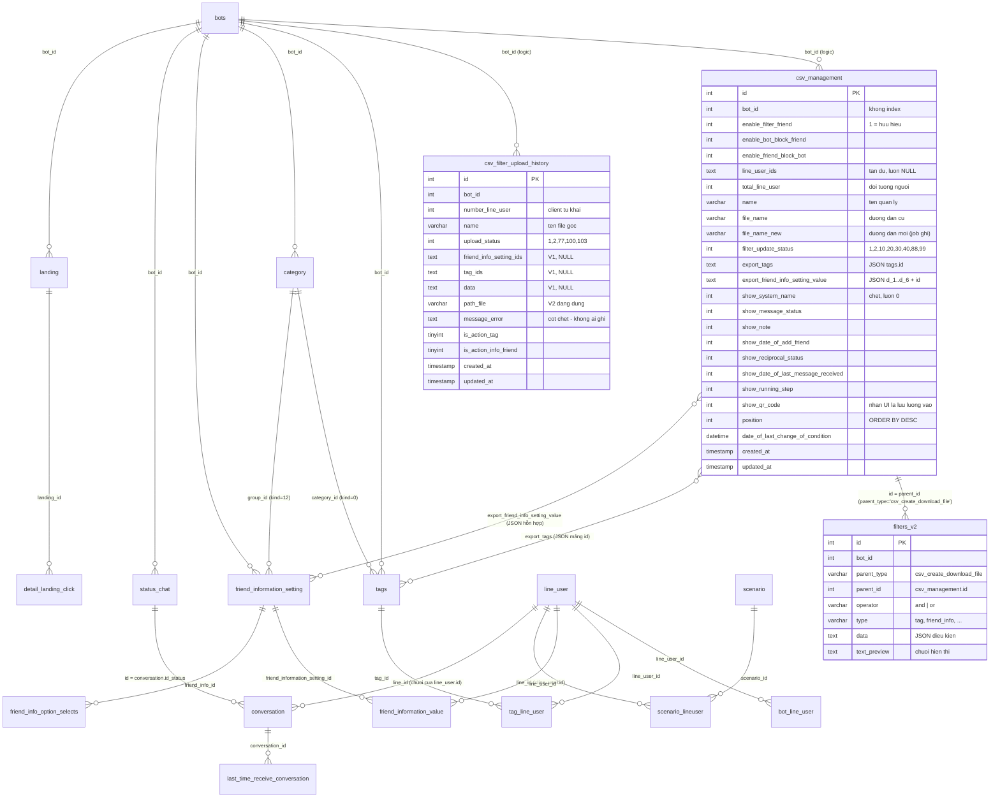

# DB Mapping — FA-014 「CSV管理」 (Quản lý CSV)

> **Portal**: Admin (LINE OA) — `features/admin/csv-management/`
> **Nguồn**: `db/schema/tables/*.sql` (CREATE TABLE), `db/data/*.sql` (dữ liệu mẫu), đối chiếu source Laravel `src/web/sns-line` và job Spring Boot `src/job/linect-service`.
> **Đầu vào**: `_internal/db-hint.md`, `ui/ui-spec.md`, `web/api-spec.md`, `web/logic-spec.md`.
> **Ngày lập**: 2026-09-08
> **Ghi chú**: **đã hợp nhất với `job/job-spec.md` ngày 2026-09-08** — 3 điểm mâu thuẫn giữa hai tài liệu (`upload_status = 103`, cột `message_error`, `filter_update_status = 99`) đã được phân xử và cập nhật vào bản này (bằng chứng: `_internal/validation-report.md` §4). Phần bàn giao job lấy từ `logic-spec.md` mục 8 + `job/job-spec.md` + đọc trực tiếp source Java/PHP.

---

## 1. Primary Tables

Hai bảng hàng đợi độc lập, tương ứng 2 luồng nghiệp vụ của tính năng.

| # | Bảng | Vai trò | Model Laravel | Entity Java | Số bản ghi trong dump | Độ tin cậy |
|---|------|---------|---------------|-------------|----------------------|-----------|
| 1 | `csv_management` | Định nghĩa **EXPORT** + hàng đợi sinh file CSV | `App\CsvManagement` (`app/CsvManagement.php`) | `sns.line.models.linedb.entities.CsvManagement` | **208** | **Cao** |
| 2 | `csv_filter_upload_history` | Lịch sử **IMPORT** + hàng đợi xử lý file upload | `App\CsvFilterUploadHistory` (`app/CsvFilterUploadHistory.php`) | `sns.line.models.linedb.entities.CsvFilterUploadHistory` | **302** | **Cao** |
| 3 | `filters_v2` | Điều kiện lọc bạn bè của định nghĩa export (`parent_type = 'csv_create_download_file'`) | `App\FilterV2` | — | 202 bản ghi thuộc `csv_create_download_file` | **Cao** |

> `filters_v2` được xếp vào Primary vì nó là **phần không thể tách rời** của một định nghĩa export (xoá export ⇒ xoá kèm filter — BR-07), nhưng bản chất là **shared component SC-003 「絞り込みフィルター」** — chi tiết cấu trúc xem `features/shared/friend-filter/shared-spec.md`.

---

## 2. Secondary Tables

Các bảng **chỉ đọc** trong phạm vi tính năng (job export đọc để dựng cột CSV; job import ghi vào một số bảng dưới đây).

| Bảng | Vai trò trong FA-014 | Chiều truy cập | Độ tin cậy |
|------|---------------------|---------------|-----------|
| `line_user` | Nguồn dữ liệu chính của mỗi dòng CSV: `line_id`, `name`, `view_name`, `phone_number`, `email`, `birthday`, `age`, `province` | Export: đọc. Import: **ghi** (UPDATE) | **Cao** |
| `bot_line_user` | 「個別メモ」 (`memo`), 「友だち追加日」 (`followed_at`), `phone_number` theo bot | Export: đọc. Import: **ghi** (UPDATE) | **Cao** |
| `conversation` | 「ステータスメッセージ」 (`status_last_message`), 「対応マーク」 (`id_status`), 「最終メッセージ受信日時」 (`last_time_message`); còn dùng để lấy tập bạn bè bị block | Export: đọc. Import: **ghi** (UPDATE có điều kiện) | **Cao** |
| `last_time_receive_conversation` | Ghi đè giá trị 「最終メッセージ受信日時」 (`last_time_reveice`) — được ưu tiên hơn `conversation.last_time_message` | Export: đọc | **Cao** |
| `status_chat` | Tên hiển thị của 「対応マーク」 (`name_status`) — job đổi `conversation.id_status` → tên | Export: đọc | **Cao** |
| `scenario_lineuser` | 「配信中ステップ」 — bản ghi `is_following = 1` mới nhất | Export: đọc | **Cao** |
| `scenario` | Tên kịch bản (`scenario.name`) ghi vào cột 「配信中ステップ」 | Export: đọc | **Cao** |
| `detail_landing_click` | 「流入経路」 — bản ghi `action = 2` (đã kết bạn) của LINE user | Export: đọc | **Cao** |
| `landing` | Tên QR/流入経路 (`landing.name`) | Export: đọc | **Cao** |
| `tags` | Danh sách tag khả chọn + tên tag ghi vào header CSV | Export: đọc | **Cao** |
| `tag_line_user` | Giá trị 0/1 của từng cột tag trong CSV | Export: đọc. Import: **ghi** (create/update/delete) | **Cao** |
| `category` | Thư mục nhóm tag (`kind = 0`) và nhóm 友だち情報 (`kind = 12`) hiển thị ở cột trái của 2 khối 「複数選択項目」 | Đọc | **Cao** |
| `friend_information_setting` | Định nghĩa trường 「友だち情報」 (title, type_data, group_id) | Đọc | **Cao** |
| `friend_information_value` | Giá trị 「友だち情報」 của từng bạn bè | Export: đọc. Import: **ghi** | **Cao** |
| `friend_info_option_selects` | Tuỳ chọn của trường 友だち情報 kiểu `select` (`type_data = 1`) | Đọc (gián tiếp, qua job import khi khớp giá trị) | **Trung bình** |
| `bots` | Kiểm tra hạn mức gói (`flag_contract_new`, `plan_type`); job import cập nhật `count_user_unconfirm`, `last_time_count_user_confirm` | Đọc + ghi (job import) | **Cao** |
| `bot_contracts` (join `bot_slots`) | `contract_type` — xác định gói free để chặn tạo >1 định nghĩa export (BR-05) | Đọc | **Cao** |
| `conversion`, `rich_menus` | Chỉ nạp dữ liệu cho **modal 絞り込み** (SC-003), không liên quan cột CSV | Đọc | **Cao** |
| `users`, `user_access_bot` | Phân quyền Staff qua middleware `basic_access`; đường dẫn upload dùng `getCurrentUser()` (user id) | Đọc + ghi log truy cập | **Trung bình** |

---

## 3. Entity Details

### 3.1 `csv_management` — định nghĩa export (Primary)

**Columns**

| Cột | Kiểu | Nullable | Default | Key | Mô tả |
|-----|------|----------|---------|-----|-------|
| `id` | `int(10) unsigned` | Không | AUTO_INCREMENT | **PK** | Khoá chính; xuất hiện trong URL `/edit-download-file/{id}` |
| `bot_id` | `int(11)` | Không | — | FK logic → `bots.id` | Bot (LINE OA) sở hữu định nghĩa. **Không có index, không có FK constraint** |
| `enable_filter_friend` | `int(11)` | Không | `0` | — | `1` = đối tượng 「有効友だち」 (có điều kiện lọc chi tiết) |
| `enable_bot_block_friend` | `int(11)` | Không | `0` | — | `1` = 「ブロックした友だち」 (OA chặn user) |
| `enable_friend_block_bot` | `int(11)` | Không | `0` | — | `1` = 「ブロックされた友だち」 (user chặn OA) |
| `line_user_ids` | `text` | Có | `NULL` | — | JSON mảng `line_user.id`. **Tàn dư** — phiên bản hiện tại Laravel luôn ghi `NULL` (`CsvManagementController.php:507`, `:548`); job Java **không** ghi cột này |
| `total_line_user` | `int(11)` | Không | `0` | — | 「対象人数」 — số bạn bè của lần build file gần nhất. Laravel ghi `count($arrLineUserId)` (client gửi), job **ghi đè** bằng số dòng thực tế |
| `name` | `varchar(255)` | Có | `NULL` | — | 「書き出し名（管理用）」. **Không unique** (dump có nhiều cặp trùng tên cùng bot) |
| `file_name` | `varchar(255)` | Có | `NULL` | — | Đường dẫn file **cũ** (dưới `public/storage/`). Chỉ có ở bản ghi cũ; bản ghi mới luôn `NULL` |
| `filter_update_status` | `int(11)` | Không | `1` | — | Trạng thái hàng đợi export. ⚠ **COMMENT TRONG SCHEMA SAI** (xem mục 5.1) |
| `export_tags` | `text` | Có | `NULL` | — | JSON mảng `tags.id` cần xuất thành cột. `'[]'` = không chọn tag nào |
| `export_friend_info_setting_value` | `text` | Có | `NULL` | — | JSON mảng **hỗn hợp**: chuỗi `"d_1"`…`"d_6"` (trường hệ thống, hằng số cấu hình) **và** số nguyên = `friend_information_setting.id`. Xem mục 3.1.1 |
| `show_system_name` | `int(11)` | Có | `0` | — | 「システム表示名」 — **đã vô hiệu hoá**, mọi tham chiếu bị comment. 208/208 bản ghi = `0` |
| `show_message_status` | `int(11)` | Có | `0` | — | 「ステータスメッセージ」 → cột CSV lấy từ `conversation.status_last_message` |
| `show_note` | `int(11)` | Có | `0` | — | 「個別メモ」 → `bot_line_user.memo` |
| `show_date_of_add_friend` | `int(11)` | Có | `0` | — | 「友だち追加日」 → `bot_line_user.followed_at` |
| `show_reciprocal_status` | `int(11)` | Có | `0` | — | 「対応マーク」 → `conversation.id_status` → `status_chat.name_status` |
| `show_date_of_last_message_received` | `int(11)` | Có | `0` | — | 「最終メッセージ受信日時」 → `conversation.last_time_message`, bị ghi đè bởi `last_time_receive_conversation.last_time_reveice` |
| `show_running_step` | `int(11)` | Có | `0` | — | 「配信中ステップ」 → `scenario_lineuser.is_following` + `scenario.name` |
| `show_qr_code` | `int(11)` | Có | `0` | — | 「流入経路」 → `detail_landing_click` (action=2) → `landing.name`. **Tên cột lệch nghĩa nhãn UI** |
| `position` | `int(11)` | Không | — | — | Thứ tự hiển thị. Danh sách `ORDER BY position DESC`; bản ghi mới = `max(position) + 1` |
| `date_of_last_change_of_condition` | `datetime` | Có | `NULL` | — | 「最終条件設定」 — thời điểm sửa điều kiện / bấm 「最新情報に更新」 lần cuối |
| `created_at` | `timestamp` | Không | `CURRENT_TIMESTAMP` | — | 「作成日」 |
| `updated_at` | `timestamp` | Không | `CURRENT_TIMESTAMP ON UPDATE` | — | Không hiển thị trên UI |
| `file_name_new` | `varchar(255)` | Có | `NULL` | — | Đường dẫn file **mới** do job ghi: `{FOLDER_MEDIA}csv/{bot_id}/{tên}_{id}_{Ymd[His]}.csv`, hoặc `.zip` khi dữ liệu bị chia nhiều file |

**Indexes**

| Tên | Cột | Loại | Ghi chú |
|-----|-----|------|---------|
| `PRIMARY` | `id` | PRIMARY KEY | Duy nhất trong dump (`db/schema/all-tables.sql:8727-8728`) |

> ⚠ **Không có index nào trên `bot_id` và `filter_update_status`.** Truy vấn danh sách (`WHERE bot_id = ?`) và vòng poll của job (`WHERE filter_update_status IN (1, 20)`, chạy mỗi 2 giây) đều **full table scan**. Độ tin cậy: **Cao** (đọc trực tiếp dump).

**Foreign Keys**: **không có ràng buộc FK vật lý nào**. Mọi liên kết (`bot_id`, `export_tags`, `export_friend_info_setting_value`, `filters_v2.parent_id`) đều là quan hệ **logic ở tầng ứng dụng**.

**Sample Data** (`db/data/csv_management.sql`)

```sql
-- Bản ghi CŨ: đối tượng 有効友だち, file lưu ở cột file_name, line_user_ids còn dữ liệu
(53, 300, 1, 0, 0, '["1616","1614","1639","5659","5669","5675","5693","5694","5695","5698"]', 10,
 'test 1 タ作成', 'test1_1657700268.csv', 30, '[]', '["d_1","d_2","d_3","d_4","d_6"]',
 0,1,1,1,1,1,1,1, 1, '2024-02-27 18:54:25', '2022-07-13 07:07:55', '2024-02-27 09:57:29', NULL)

-- Đối tượng ブロックされた友だち (enable_friend_block_bot = 1); export_tags là mảng SỐ NGUYÊN
(54, 300, 0, 0, 1, '[5659]', 1, 'block bot', 'blockbot_1657706284.csv', 30,
 '[845,611,846,610]', '["d_1","d_2","d_3","d_4","d_6"]', 0,1,1,1,1,1,1,1, 2, ...)

-- export_friend_info_setting_value HỖN HỢP: 212 (friend_information_setting.id) + d_1..d_6
(57, 300, 1, 0, 0, '["5669","5698"]', 2, 'rrr', 'rrr_1657704354.csv', 30,
 '[]', '[212,"d_1","d_2","d_3","d_4","d_6"]', 0,0,0,0,0,0,0,0, 5, ...)

-- Bản ghi MỚI (2026): file_name = NULL, file_name_new có giá trị, line_user_ids = NULL
(327, 46644, 1, 0, 0, NULL, 5, 'Tag', NULL, 30, '[]', '["d_4",4430]',
 0,0,0,0,1,0,0,0, 8, '2026-04-18 13:39:15', '2026-04-15 07:21:17', '2026-04-18 04:39:15',
 '/msg_template/csv/46644/Tag_327_20260418133915.csv')
```

**Thống kê phân bố trên 208 bản ghi**

| Cột | Phân bố |
|-----|---------|
| `filter_update_status` | `30` (DONE): 186 · `40` (FAILURE): 18 · `10`: 4 — **không có** bản ghi ở `1`/`2`/`20`/`88` (dump chụp lúc hàng đợi rỗng) |
| `enable_filter_friend` | `1`: 180 · `0`: 28 |
| `enable_bot_block_friend` | `1`: 13 |
| `enable_friend_block_bot` | `1`: 15 |
| `show_system_name` | `0`: **208/208** — xác nhận cột đã chết |
| `show_note` | `1`: 90 · `0`: 118 |
| `show_message_status` | `1`: 86 |
| `show_date_of_add_friend` | `1`: 71 |
| `show_qr_code` | `1`: 52 |
| `show_date_of_last_message_received` | `1`: 48 |
| `show_reciprocal_status` | `1`: 47 |
| `show_running_step` | `1`: 39 |
| `total_line_user` | `0`: 33 bản ghi (→ hiển thị 「作成中」 dù đã DONE — xem BR-09) |

**Suy ra giá trị `FOLDER_MEDIA`**: từ `file_name_new` của bản ghi mới → `env('FOLDER_MEDIA') = '/msg_template/'`. Đường dẫn đầy đủ: `/msg_template/csv/{bot_id}/{file}`. Độ tin cậy: **Cao** (khớp trên toàn bộ bản ghi mới).

#### 3.1.1 Giải mã `export_friend_info_setting_value`

Cột lưu JSON mảng **hỗn hợp kiểu** (chuỗi + số). Nguồn giải mã: `config/sns-line.php:753-914` + `app/Console/Commands/HandleExportCsv.php:236-256, 517-546`.

| Giá trị | Nhóm UI | Nhãn cột CSV | Trường dữ liệu thực tế | Được job xử lý? |
|---------|---------|-------------|------------------------|-----------------|
| `"d_1"` | 「基本情報」 (group_id = −1) | 「システム表示名」 | `line_user.view_name` | ✅ Có |
| `"d_2"` | 「基本情報」 | 「携帯電話」 | `line_user.phone_number` (thay `+81` → `0` khi xuất) | ✅ Có |
| `"d_3"` | 「基本情報」 | 「メールアドレス」 | `line_user.email` | ✅ Có |
| `"d_4"` | 「基本情報」 | 「生年月日」 | `line_user.birthday` | ✅ Có |
| `"d_5"` | — | 「年齢」 | `line_user.age` | ⚠ Job xử lý nhưng **UI không hiển thị** — mục này bị comment trong config (`config/sns-line.php:793-801`) |
| `"d_6"` | 「国内住所」 (group_id = −2) | 「都道府県(名)」 | `line_user.province` | ✅ Có |
| `-7` | 「国内住所」 | 「郵便番号」 | (chưa có cột lưu — xem Unmapped U-06) | ❌ Không |
| `-8` | 「国内住所」 | 「市区町村名」 | (chưa có cột lưu) | ❌ Không |
| `-9` | 「国内住所」 | 「町名/番地」 | (chưa có cột lưu) | ❌ Không |
| `-10` | 「国内住所」 | 「建物名・部屋番号」 | (chưa có cột lưu) | ❌ Không |
| Số nguyên ≥ 1 | Nhóm do Admin tạo (`category.kind = 12`) hoặc 「未分類」 (`group_id = 0`) | `友だち情報_{title}` | `friend_information_value.value` với `friend_information_setting_id = {giá trị}` | ✅ Có |

**Xác nhận số đếm trên UI** (checklist db-hint):
- 「基本情報 (4)」 — số `4` **hard-code trong blade** (`resources/views/csv_management/create_download_file.blade.php:321`), tương ứng 4 mục còn hoạt động của `config('sns-line.info_default_info')` = `d_1`, `d_2`, `d_3`, `d_4`. **Không phải truy vấn DB.**
- 「国内住所 (5)」 — số `5` cũng hard-code (`:327`), tương ứng 5 mục của `config('sns-line.info_default_info_address')` = `-7`, `d_6`, `-8`, `-9`, `-10`. **Không phải truy vấn DB.**
- 「未分類 (N)」 — **là** truy vấn DB: `FriendInformationSetting::where(['group_id' => 0, 'bot_id' => $bot_id])->count()` (`CsvManagementController.php:299`).

> ⚠ Kết luận quan trọng: hai folder 「基本情報」/「国内住所」 **không tương ứng bản ghi nào trong `category`** — chúng là hằng số cấu hình PHP với `group_id` giả `-1` / `-2`. Độ tin cậy: **Cao**.

---

### 3.2 `csv_filter_upload_history` — lịch sử import (Primary)

**Columns**

| Cột | Kiểu | Nullable | Default | Key | Mô tả |
|-----|------|----------|---------|-----|-------|
| `id` | `int(10) unsigned` | Không | AUTO_INCREMENT | **PK** | |
| `bot_id` | `int(11)` | Không | — | FK logic → `bots.id` | Bot sở hữu |
| `number_line_user` | `int(11)` | Có | `NULL` | — | 「対象人数」 trên bảng 「インポート履歴」. Giá trị do **client tự khai** (`totalUser`), server không đối chiếu |
| `name` | `varchar(255)` | Có | `NULL` | — | 「管理名」 trên bảng lịch sử — thực chất là **tên file gốc** người dùng upload |
| `upload_status` | `int(11)` | Không | `1` | — | Trạng thái hàng đợi import. ⚠ **COMMENT TRONG SCHEMA SAI** (xem mục 5.2) |
| `friend_info_setting_ids` | `text` | Có | `NULL` | — | JSON mảng `friend_information_setting.id` phát hiện từ header CSV. **Luồng V1** — hiện Laravel để `NULL` |
| `tag_ids` | `text` | Có | `NULL` | — | JSON mảng `tags.id` phát hiện từ header CSV. **Luồng V1** — hiện `NULL` |
| `data` | `text` | Có | `NULL` | — | Toàn bộ dữ liệu CSV đã parse dưới dạng JSON array-of-object. **Luồng V1** — hiện `NULL` |
| `created_at` | `timestamp` | Không | `CURRENT_TIMESTAMP` | — | 「作成日」 (cột 1) + giờ (cột 2) trên bảng lịch sử |
| `updated_at` | `timestamp` | Không | `CURRENT_TIMESTAMP ON UPDATE` | — | Thời điểm job hoàn tất |
| `path_file` | `varchar(255)` | Có | `NULL` | — | **Luồng V2 (hiện hành)**: `{FOLDER_MEDIA}media/csv/{user_id}/{bot_id}/{tên ngẫu nhiên}.csv` |
| `message_error` | `text` | Có | `NULL` | — | ⚠ **Cột chết — KHÔNG thành phần nào ghi**: grep Laravel = **0 writer**, grep Java = **0 writer** (`setMessageError` không tồn tại), dump **0/302 bản ghi** có giá trị. Cũng **không UI nào đọc**. Xem **D-08** |
| `is_action_tag` | `tinyint(4)` | Có | `0` | — | `1` = áp dụng tag từ file (người dùng xác nhận ở modal `#modalConfirmAction`). Comment schema `0:no action/1:action` — **đúng** |
| `is_action_info_friend` | `tinyint(4)` | Có | `0` | — | `1` = áp dụng 友だち情報 từ file. Comment schema **đúng** |

**Indexes**

| Tên | Cột | Loại |
|-----|-----|------|
| `PRIMARY` | `id` | PRIMARY KEY |

> ⚠ Không có index trên `bot_id` lẫn `upload_status`. Truy vấn EP-06 (`WHERE bot_id = ? ORDER BY id DESC`, **không phân trang** — BR-17) và vòng poll job (`WHERE upload_status = 1`) đều full scan.

**Foreign Keys**: không có ràng buộc vật lý.

**Sample Data** (`db/data/csv_filter_upload_history.sql`)

```sql
-- LUỒNG V1 (2022): data/tag_ids/friend_info_setting_ids có giá trị, path_file = NULL
(8, 300, 1, 'blockbot', 2, '[]', '["611","845"]',
 '[{"line_id":"U14a53f...","name":"テスト😶","status_message":null,"memo":null,
    "followed_at":"2018-10-10 13:59:23","id_status":null,"last_time_message":null,
    "is_following":"停止中","landing_name":null,"tag_611":"0","tag_845":"1",
    "view_name":null,"phone_number":null,"email":null,"birthday":null,"province":null}]',
 '2022-07-13 10:04:00', '2022-07-13 10:04:09', NULL, NULL, 0, 0)

-- LUỒNG V2 (2026): 3 cột V1 = NULL, path_file có giá trị, cờ action = 1
(339, 46644, 5, 'Tag_327_20260418133915 - Tag_327_20260418133915.csv', 2, NULL, NULL, NULL,
 '2026-04-18 04:43:16', '2026-04-18 04:43:19',
 '/msg_template/media/csv/656/46644/1776487396KqNz96.csv', NULL, 1, 1)
```

**Thống kê phân bố trên 302 bản ghi**

| Cột | Phân bố |
|-----|---------|
| `upload_status` | `2` (DONE): 300 · `103` (ERROR): 2 — **không có** `1`/`77`/`100` |
| `is_action_tag` | `1`: 44 · `0`: 258 |
| `is_action_info_friend` | `1`: 65 · `0`: 237 |
| `number_line_user` | Dải 1–19, phổ biến nhất là `2` (64 bản ghi) |
| `message_error` | `NULL` ở toàn bộ bản ghi trong dump (kể cả 2 bản `upload_status = 103`) |

> **Quan sát**: `name` của bản ghi mới có dạng `{tên định nghĩa export}_{csv_management.id}_{Ymd His}.csv` (đôi khi lặp 2 lần do Google Sheets đặt tên khi tải về) → xác nhận quy trình 「エクスポート → sửa → インポート」 mà UI hướng dẫn (「※CSVデータは必ずエクスポートページからダウンロードしたものをご利用ください。」). Độ tin cậy: **Cao**.

---

### 3.3 `filters_v2` — điều kiện lọc (Primary, shared SC-003)

**Columns** (chỉ mô tả các cột dùng trong FA-014)

| Cột | Kiểu | Nullable | Default | Mô tả trong ngữ cảnh FA-014 |
|-----|------|----------|---------|------------------------------|
| `id` | `int(10) unsigned` | Không | AUTO_INCREMENT | PK |
| `bot_id` | `int(11)` | Có | `NULL` | Bot sở hữu — `FilterV2::saveFilter()` tự lấy từ `getBotId()` |
| `parent_type` | `varchar(255)` | Có | `NULL` | **Luôn** `'csv_create_download_file'` cho tính năng này |
| `parent_id` | `int(11)` | Có | `NULL` | = `csv_management.id` |
| `operator` | `varchar(100)` | Có | `NULL` | `'and'` (「全て満たす」) hoặc `'or'` (「どれか1つ以上満たす」) |
| `type` | `varchar(255)` | Có | `NULL` | Loại điều kiện: `tag`, `friend_name`, `date_add_friend`, `scenario`, `qr_code`, `conversion`, `confirm_status`, `friend_info`, `status_chat`, `affiliater`, `new_old_friend` (11 loại trên modal) |
| `data` | `text` | Có | `NULL` | JSON tham số điều kiện |
| `text_preview` | `text` | Có | `NULL` | Chuỗi hiển thị 「絞り込み条件」 trên form SCR-CSV-03/04 |
| `rich_menu_item_id`, `rich_menu_redirect_id` | `int(11)` | Có | `NULL` | **Không dùng** trong FA-014 (chỉ dùng cho rich menu) |
| `created_at` / `updated_at` | `timestamp` | Không | `CURRENT_TIMESTAMP` | |

**Indexes**: chỉ `PRIMARY (id)`. Không có index trên `(parent_type, parent_id, bot_id)` — bộ điều kiện lọc thường xuyên nhất.

**Sample Data** (`db/data/filters_v2.sql` — 202 dòng có `parent_type = 'csv_create_download_file'`)

```sql
(..., 'csv_create_download_file', 16, 'and', 'tag',
 '{"active":true,"tags_search":[794,634],"tag_condition":"2"}',
 'test gủi template, huy hop dong選択したタグを1つ以上含む人を除外', ...)

(..., 'csv_create_download_file', 18, 'and', 'tag',
 '{"active":true,"tags_search":[794,634],"tag_condition":"0"}',
 'test gủi template, huy hop dong選択したタグのいずれか1つ以上を含む人', ...)
```

> `tag_condition`: `0` = chứa ít nhất 1 tag, `2` = loại trừ nếu chứa ≥1, `3` = loại trừ nếu chứa tất cả. Chi tiết đầy đủ thuộc SC-003.

---

### 3.4 Bảng nguồn dữ liệu cột CSV (Secondary — cột được job đọc)

| Bảng | Cột | Kiểu | Vai trò |
|------|-----|------|---------|
| `line_user` | `id` | `int(12)` PK | Khoá nội bộ; ghi vào **cột 1 của CSV** (`ID`) — chính là cột 「左1列目」 mà UI cấm sửa |
| | `line_id` | `varchar(128)` | LINE user ID (`U…`) — ghi vào cột 「ユーザーID」, là **khoá đối chiếu khi import** |
| | `name` | `varchar(128)` | 「LINE表示名」 |
| | `view_name` | `varchar(128)` | 「システム表示名」 (`d_1`) |
| | `phone_number` | `varchar(15)` | 「携帯電話」 (`d_2`) — lưu dạng `+81…`, xuất CSV đổi thành `0…` |
| | `email` | `varchar(100)` | 「メールアドレス」 (`d_3`) |
| | `birthday` | `date` | 「生年月日」 (`d_4`) — import yêu cầu format `YYYY/MM/DD` |
| | `age` | `int(11)` | 「年齢」 (`d_5`, đã ẩn khỏi UI) |
| | `province` | `varchar(255)` | 「都道府県」 (`d_6`) |
| | `status_message` | `text` | ⚠ **Không** dùng cho 「ステータスメッセージ」 của CSV (xem Unmapped U-04) |
| `bot_line_user` | `line_user_id` / `bot_id` | `int(11)` | Cặp khoá logic |
| | `memo` | `text` | 「個別メモ」 (`show_note`) |
| | `followed_at` | `timestamp` | 「友だち追加日」 (`show_date_of_add_friend`) |
| | `phone_number` | `varchar(25)` | Bản sao số điện thoại theo bot — job import ghi song song với `line_user.phone_number` |
| | `is_blocked` | `int(11)` | Dùng gián tiếp qua `Conversation::getConversationBlocked()` |
| `conversation` | `line_id` | `varchar(255)` | ⚠ Chứa **`line_user.id` dạng chuỗi**, KHÔNG phải LINE ID `U…` |
| | `status_last_message` | `int(11)` def `1` | 「ステータスメッセージ」 (`show_message_status`) — thực chất là cờ đã đọc/chưa đọc |
| | `id_status` | `int(11)` | 「対応マーク」 (`show_reciprocal_status`) → `status_chat.id` |
| | `last_time_message` | `timestamp` | 「最終メッセージ受信日時」 (nguồn cấp 2) |
| | `is_blocked` / `blocked_by` | `int` / `tinyint` | Phân biệt 「ブロックした」 vs 「ブロックされた」 (`blocked_by`: `0` = user, `1` = admin) |
| `last_time_receive_conversation` | `conversation_id`, `last_time_reveice` | `int` / `datetime` | **Nguồn cấp 1** cho 「最終メッセージ受信日時」 — ghi đè giá trị lấy từ `conversation` (⚠ tên cột sai chính tả trong schema gốc: `reveice`) |
| `status_chat` | `id`, `name_status` | `int` / `varchar(255)` | Tên hiển thị của 「対応マーク」 |
| `scenario_lineuser` | `line_user_id`, `is_following`, `updated_at` | | 「配信中ステップ」 — lấy bản ghi `is_following = 1` mới nhất |
| `scenario` | `id`, `name` | | Tên kịch bản ghi vào ô CSV |
| `detail_landing_click` | `bot_id`, `line_id`, `action`, `landing_id` | | 「流入経路」 — lọc `action = 2` (đã kết bạn). ⚠ `line_id` ở bảng này là **LINE ID `U…`** (khác `conversation.line_id`) |
| `landing` | `id`, `name` | | Tên QR/流入経路 |
| `tags` | `id`, `name`, `bot_id`, `category_id`, `position` | | Cột tag trong CSV: header row0 = `タグ_{tags.id}`, header row1 = `タグ_{tags.name}` |
| `tag_line_user` | `line_user_id`, `tag_id`, `is_deleted` | | Giá trị ô: `1` nếu tồn tại bản ghi với `is_deleted = 0`, ngược lại `0` |
| `category` | `id`, `bot_id`, `kind`, `name`, `is_deleted` | | `kind = 0` → folder tag; `kind = 12` → folder 友だち情報 |
| `friend_information_setting` | `id`, `bot_id`, `title`, `group_id`, `type_data` | | Định nghĩa trường. `type_data`: `1`=select, `2`=input, `3`=calendar, `4`=image, `5`=file, `6`=point |
| `friend_information_value` | `bot_id`, `friend_information_setting_id`, `line_id`, `value` | | ⚠ `line_id` ở bảng này là **`line_user.id`** (số), không phải LINE ID |
| `bots` | `id`, `plan_type`, `flag_contract_new`, `count_user_unconfirm`, `last_time_count_user_confirm` | | Hạn mức gói (BR-05) + cập nhật sau import |

**Sample data ngắn**

```sql
-- tag_line_user: is_deleted = 0 nghĩa là tag đang gắn
(205, 54, 216, 0, '2020-03-12 17:58:56', '2020-03-12 18:11:57')

-- category: kind = 0 (folder tag), kind = 12 (folder 友だち情報)
(4, 6, 2, 'category 1', 2, 0, '2018-07-03 02:58:45', ...)

-- friend_information_setting: type_data = 1 (select) kèm setting_value JSON các option
(50, 451, 11, 'select', 511, 1, NULL, '{"action_mode":"1","setting_actions":[…]}', 2, …)
```

> Các bảng `bot_contracts`, `bot_slots`, `user_access_bot`, `friend_info_option_selects` **không có file dữ liệu riêng được kiểm tra trong phạm vi này** — chỉ dùng schema và source code làm căn cứ.

---

## 4. UI ↔ DB Field Mapping

### 4.1 SCR-CSV-01 — Danh sách export (tab 「エクスポート」)

Nguồn render: `resources/views/csv_management/csv_management.blade.php:282-330` (Vue), dữ liệu từ EP-05.

| UI Element | Label JP | DB Table | Column | Mapping Type | Confidence | Ghi chú |
|-----------|----------|----------|--------|--------------|-----------|---------|
| Checkbox chọn dòng | — | — | — | — | **Cao** | UI-only; giá trị = `csv_management.id`, gửi lên qua `csv_ids` khi 「一括削除」 |
| Cột 1 | 「作成日」 | `csv_management` | `created_at` | Computed (format `YYYY.MM.DD` bởi `formatDate()`) | **Cao** | |
| Cột 2 (link) | 「管理名」 | `csv_management` | `name` | Direct | **Cao** | `href` = `/basic/csv-management/edit-download-file/{id}` → dùng cả `id` |
| Cột 3 (link) | 「対象人数」 | `csv_management` | `total_line_user` | Direct (hậu tố 「人」) | **Cao** | **Snapshot**, không phải COUNT real-time |
| Cột 3 — đích của link | — | `csv_management` | `enable_filter_friend` / `enable_bot_block_friend` / `enable_friend_block_bot` | Enum (điều kiện rẽ nhánh) | **Cao** | `enable_filter_friend=1` → `showNumberFilter(id)` ghi `localStorage.csv_management_filter_id` rồi mở `/basic/friendlist`; `enable_bot_block_friend=1` → `/basic/friendlist/block`; `enable_friend_block_bot=1` → `/basic/friendlist/user-block`. Giải thích vì sao UI-spec quan sát 「click không có tác dụng」: bản ghi mẫu dùng nhánh `showNumberFilter` mở tab mới |
| Cột 4 | 「最終条件設定」 | `csv_management` | `date_of_last_change_of_condition` | Computed (format `YYYY.MM.DD`) | **Cao** | **Không phải** `updated_at` như db-hint dự đoán |
| Nút 「最新情報に更新」 (bật) | — | `csv_management` | `filter_update_status = 30` | Enum | **Cao** | |
| Nút 「CSVダウンロード」 | — | `csv_management` | `filter_update_status = 30` **AND** `total_line_user > 0` | Enum + điều kiện | **Cao** | Bấm → EP-12 đọc `file_name_new` / `file_name` |
| Nút 「作成中」 (disabled) | — | `csv_management` | `filter_update_status != 30`, hoặc `= 30` nhưng `total_line_user = 0` | Enum | **Cao** | Trạng thái `40` (FAILURE) cũng hiển thị 「作成中」 → người dùng không biết job lỗi |
| Menu ⋮ → 「コピー」 | — | `csv_management` | `id` | FK | **Cao** | `/basic/csv-management/copy-download-file/{id}` |
| Menu ⋮ → 「削除」 | — | `csv_management` + `filters_v2` | DELETE theo `id` / (`parent_type`,`parent_id`,`bot_id`) | — | **Cao** | Hard delete, **không có** `deleted_at` (bác bỏ giả thiết soft-delete trong db-hint) |
| Nút 「一括削除」 | — | `csv_management` | `whereIn('id', $csvIds)->delete()` | — | **Cao** | |
| Nút 「新規作成」 (bật/tắt) | — | `bots` + `bot_contracts` | `bots.flag_contract_new`, `bots.plan_type`, `bot_contracts.contract_type` | Computed (`isAdd`) | **Cao** | BR-05 |
| Thứ tự dòng | — | `csv_management` | `position` | Direct (`ORDER BY position DESC`) | **Cao** | |

### 4.2 SCR-CSV-02 — Tab 「インポート」

| UI Element | Label JP | DB Table | Column | Mapping Type | Confidence | Ghi chú |
|-----------|----------|----------|--------|--------------|-----------|---------|
| File picker | 「ファイル選択」 | `csv_filter_upload_history` | `path_file` (sau khi upload) + `name` (tên gốc) | Direct | **Cao** | Bước preview EP-14 **không ghi DB** |
| Nút 「アップロード」 | — | `csv_filter_upload_history` | INSERT với `upload_status` = DEFAULT `1` | — | **Cao** | Chính là hành động enqueue job |
| Modal xác nhận (ẩn) | 「タグ」 áp dụng? | `csv_filter_upload_history` | `is_action_tag` | Enum 0/1 | **Cao** | Param `actionTag` |
| Modal xác nhận (ẩn) | 「友だち情報」 áp dụng? | `csv_filter_upload_history` | `is_action_info_friend` | Enum 0/1 | **Cao** | Param `actionInForFriend` |
| Bảng 「インポート履歴」 cột 1 | 「作成日」 | `csv_filter_upload_history` | `created_at` (phần ngày) | Computed | **Cao** | |
| Bảng cột 2 | (không nhãn) | `csv_filter_upload_history` | `created_at` (phần giờ, `formatTime()`) | Computed | **Cao** | **Giải đáp nghi vấn cột trống của UI-spec mục 8.4** |
| Bảng cột 3 | 「管理名」 | `csv_filter_upload_history` | `name` | Direct | **Cao** | Nội dung thực = **tên file** — nhãn header bị tái dụng từ bảng export |
| Bảng cột 4 | 「対象人数」 | `csv_filter_upload_history` | `number_line_user` (hậu tố 「人」) | Direct | **Cao** | Giá trị do client khai |
| Bảng cột 5 | 「最終条件設定」 | `csv_filter_upload_history` | `upload_status` | Enum | **Cao** | `2` → 「完了済」; mọi giá trị khác → 「作業中」. **Không phải cột datetime** — nhãn header sai hoàn toàn so với nội dung |
| Dòng tạm (client) | — | — | — | — | **Cao** | `uploadingFilterItems` — dòng chờ hiển thị ngay sau upload, luôn 「作業中」, không đọc DB |
| Ghi chú 「個人メモ・タグ・友だち情報 ghi đè được」 | — | `bot_line_user.memo`, `tag_line_user`, `friend_information_value` | — | — | **Cao** | Xác nhận qua `HandleImportCsv.php:203-205, 282-305, 333-383` |
| Ghi chú 「対応マーク・最終メッセージ受信日時・配信中ステップ・QRコードアクション không ghi đè」 | — | `conversation.id_status`, `last_time_receive_conversation`, `scenario_lineuser`, `detail_landing_click` | — | — | **Cao** | Job import không đụng đến các bảng này |
| Ghi chú 「左1列目 không được sửa」 | — | `line_user` | `id` (cột `ID` của CSV) | — | **Trung bình** | Cột 1 là `line_user.id`, cột 2 là `line_user.line_id` — job import đối chiếu bằng **`line_id`** (`HandleImportCsv.php:212`), nên thực tế cột quan trọng là cột 2 |
| Ghi chú 「友だち情報タイプ 画像/PDF không import được」 | — | `friend_information_setting` | `type_data` ∈ {`4` = image, `5` = file} | Enum | **Cao** | |
| Ghi chú 「年月日 phải đúng YYYY/MM/DD」 | — | `friend_information_setting` | `type_data = 3` (calendar) | Enum | **Cao** | |

### 4.3 SCR-CSV-03 / SCR-CSV-04 — Form 「エクスポートデータ作成」 (tạo mới / chỉnh sửa)

| UI Element | Label JP | DB Table | Column | Mapping Type | Confidence | Ghi chú |
|-----------|----------|----------|--------|--------------|-----------|---------|
| Textbox (đếm `0/50文字`) | 「書き出し名（管理用）」 | `csv_management` | `name` | Direct | **Cao** | Cột là `varchar(255)`; giới hạn 50 **chỉ ở client** (BR-02) |
| Radio 1 (mặc định) | 「有効友だち」 | `csv_management` | `enable_filter_friend = 1` | Enum (3 cột boolean loại trừ nhau) | **Cao** | `type_filter_condition = 1` |
| Radio 2 | 「ブロックした友だち」 | `csv_management` | `enable_bot_block_friend = 1` | Enum | **Cao** | `type_filter_condition = 2`; server truy vấn `conversation` với `blocked_by = 1` |
| Radio 3 | 「ブロックされた友だち」 | `csv_management` | `enable_friend_block_bot = 1` | Enum | **Cao** | `type_filter_condition = 3`; `blocked_by = 0` |
| Khối read-only | 「対象人数（有効友だちのみ）」 | — (real-time) → `csv_management.total_line_user` khi lưu | Aggregated | **Cao** | Trên form là **kết quả đếm real-time** từ modal lọc (client gửi `arr_line_user_id`, server `count()`); sau khi job chạy, `total_line_user` **bị ghi đè** bằng số dòng thực xuất. Giải thích chênh lệch 「3人」 (form) vs 「1人/0人」 (danh sách) mà UI-spec ghi nhận |
| Khối read-only | 「絞り込み条件」 | `filters_v2` | `text_preview` (nối các bản ghi `and`/`or`) | Aggregated | **Cao** | Nạp qua EP-10 |
| Checkbox 1 | 「ステータスメッセージ」 | `csv_management` | `show_message_status` | Enum 0/1 → cột CSV từ `conversation.status_last_message` | **Cao** | |
| Checkbox 2 | 「最終メッセージ受信日時」 | `csv_management` | `show_date_of_last_message_received` | Enum 0/1 → `last_time_receive_conversation.last_time_reveice` (ưu tiên) / `conversation.last_time_message` | **Cao** | |
| Checkbox 3 | 「個別メモ」 | `csv_management` | `show_note` | Enum 0/1 → `bot_line_user.memo` | **Cao** | |
| Checkbox 4 | 「配信中ステップ」 | `csv_management` | `show_running_step` | Enum 0/1 → `scenario_lineuser.is_following = 1` + `scenario.name` | **Cao** | |
| Checkbox 5 | 「友だち追加日」 | `csv_management` | `show_date_of_add_friend` | Enum 0/1 → `bot_line_user.followed_at` | **Cao** | |
| Checkbox 6 | 「流入経路」 | `csv_management` | `show_qr_code` | Enum 0/1 → `detail_landing_click.landing_id` → `landing.name` | **Cao** | **Tên cột `show_qr_code` lệch nghĩa nhãn 「流入経路」** |
| Checkbox 7 | 「対応マーク」 | `csv_management` | `show_reciprocal_status` | Enum 0/1 → `conversation.id_status` → `status_chat.name_status` | **Cao** | |
| Folder tag cột trái | 「未分類 (N)」 | `tags` | `COUNT(*) WHERE category_id = 0 AND bot_id = ?` | Aggregated | **Cao** | `Tags::countTags(['category_id' => 0, 'bot_id' => $bot_id])` |
| Folder tag khác | (tên nhóm) | `category` | `name` với `kind = 0`, `is_deleted = 0`, `bot_id` | FK | **Cao** | |
| Danh sách tag | 「フォーム未回答」/「和食」/「洋食」/「中華」 | `tags` | `id`, `name` | FK | **Cao** | |
| Tag đã chọn / 「選択した項目」 | — | `csv_management` | `export_tags` (JSON mảng `tags.id`) | Direct (JSON, **không có bảng nối**) | **Cao** | Bác bỏ giả thiết bảng nối `{csv}_tag` trong db-hint |
| Folder 友だち情報 「未分類 (N)」 | — | `friend_information_setting` | `COUNT(*) WHERE group_id = 0 AND bot_id = ?` | Aggregated | **Cao** | |
| Folder 「基本情報 (4)」 | — | **KHÔNG có bảng DB** | `config('sns-line.info_default_info')` (`d_1`…`d_4`) | — | **Cao** | Hằng số PHP, số `(4)` hard-code trong blade |
| Folder 「国内住所 (5)」 | — | **KHÔNG có bảng DB** | `config('sns-line.info_default_info_address')` (`-7`, `d_6`, `-8`, `-9`, `-10`) | — | **Cao** | Hằng số PHP, số `(5)` hard-code |
| Folder 友だち情報 do Admin tạo | — | `category` | `name` với `kind = 12`, `is_deleted = 0` | FK | **Cao** | |
| Danh sách trường 友だち情報 | — | `friend_information_setting` | `id`, `title`, `type_data`, `order` | FK | **Cao** | Sắp `ORDER BY order DESC` |
| Trường đã chọn | — | `csv_management` | `export_friend_info_setting_value` (JSON hỗn hợp) | Direct (JSON) | **Cao** | Xem giải mã mục 3.1.1 |
| Nút 「絞込み」 → modal | — | `filters_v2` | `parent_type='csv_create_download_file'`, `parent_id = csv_management.id` | FK | **Cao** | |
| Nút 「この条件でCSVを作成・更新」 (create) | — | `csv_management` | INSERT, `filter_update_status = 1`, `position = max+1`, `date_of_last_change_of_condition = now()` | — | **Cao** | |
| Nút 「この条件でCSVを作成・更新」 (edit) | — | `csv_management` | UPDATE, `filter_update_status = 20`, `line_user_ids = NULL`, `date_of_last_change_of_condition = now()` | — | **Cao** | |

### 4.4 SCR-CSV-05 — Modal 「絞り込み」 (SC-003 Friend Filter V2)

| UI Element | Label JP | DB Table | Column | Mapping Type | Confidence | Ghi chú |
|-----------|----------|----------|--------|--------------|-----------|---------|
| Nhóm điều kiện AND | 「「全て満たす」必要がある条件 (and条件)」 | `filters_v2` | `operator = 'and'` | Enum | **Cao** | |
| Nhóm điều kiện OR | 「「どれか1つ以上満たす」必要がある条件 (or条件)」 | `filters_v2` | `operator = 'or'` | Enum | **Cao** | |
| Mỗi thẻ điều kiện | (11 loại) | `filters_v2` | 1 bản ghi/điều kiện: `type` + `data` (JSON) + `text_preview` | Direct | **Cao** | |
| 「タグ」 | — | `filters_v2.data` → `tags` / `tag_line_user` | `{"tags_search":[id…],"tag_condition":"0\|2\|3"}` | FK trong JSON | **Cao** | |
| 「友だち名」 | — | `line_user` | `name` | FK trong JSON | **Trung bình** | Chi tiết ở SC-003 |
| 「友だち追加日」 | — | `bot_line_user` | `followed_at` | FK trong JSON | **Trung bình** | |
| 「ステップ購読状況」 | — | `scenario_lineuser` | `scenario_id`, `is_following` | FK trong JSON | **Trung bình** | |
| 「QRコードアクション」 | — | `landing` / `detail_landing_click` | `landing_id`, `action` | FK trong JSON | **Trung bình** | |
| 「コンバージョン」 | — | `conversion` | — | FK trong JSON | **Trung bình** | |
| 「確認状況」 | — | `conversation` | `status_last_message`, `confirm_count` | FK trong JSON | **Trung bình** | |
| 「友だち情報」 | — | `friend_information_setting` / `friend_information_value` | `friend_information_setting_id`, `value` | FK trong JSON | **Trung bình** | |
| 「対応ステータス」 | — | `status_chat` / `conversation.id_status` | — | FK trong JSON | **Cao** | Danh sách nạp từ `StatusChat::where(bot_id)` (`CsvManagementController.php:75`) |
| 「アフィリエイター」 | — | `bot_line_user` | `affiliater_id` | FK trong JSON | **Trung bình** | |
| 「新規・既存 友だち」 | — | `conversation` | `is_old_friend` | FK trong JSON | **Trung bình** | |
| Nút 「保存」 | — | `filters_v2` | INSERT/UPDATE/DELETE theo `$arrIdFilter` | — | **Cao** | Chỉ được gọi khi `enable_filter_friend = 1` (BR-08) |

> Chi tiết đầy đủ của 11 loại điều kiện thuộc **SC-003** — xem `features/shared/friend-filter/shared-spec.md`. Bảng trên chỉ ghi biểu hiện tại FA-014.

### 4.5 SCR-CSV-06 — Modal 「【 並べ替え 】」

| UI Element | Label JP | DB Table | Column | Mapping Type | Confidence | Ghi chú |
|-----------|----------|----------|--------|--------------|-----------|---------|
| Mỗi dòng trong danh sách | (tên bản ghi) | `csv_management` | `name` | Direct | **Cao** | `arrItemsSort` = bản sao của `items`, giữ nguyên thứ tự `position DESC` |
| `data-id` của dòng | — | `csv_management` | `id` | Direct | **Cao** | |
| Nút ↑ / ↓ | — | — | — | — | **Cao** | Chỉ đổi vị trí trong mảng phía client (`onUpdate(index, 'up'\|'down')`) |
| Nút 「保存」 | — | `csv_management` | UPDATE hàng loạt `position` | — | **Cao** | EP-05 `action=sortItem`: tách `sort_ids` + `sort_position` bằng `,`, `array_sort($sort_position)` rồi gán cặp theo index |
| Chiều sắp xếp | — | `csv_management` | `ORDER BY position DESC` | — | **Cao** | Danh sách hiển thị DESC, còn `sort_position` được **sắp tăng dần** trước khi gán → client phải **đảo mảng** trước khi gửi. **Xác nhận cảnh báo trong db-hint là đúng** |

---

## 5. Enum / Status Values

### 5.1 `csv_management.filter_update_status`

> ⚠ **Comment trong schema (`'processing' => 1, 'done' => 1`) là SAI** — copy-paste lỗi, hai nhãn cùng trỏ giá trị `1`. **Không dùng comment này.** Bảng dưới lấy từ hằng số Java `CsvManagement.java:13-18` + code PHP, độ tin cậy **Cao**.

| Giá trị | Hằng số | Ý nghĩa | Ai ghi | Hiển thị trên UI (SCR-CSV-01) |
|---------|---------|---------|--------|-------------------------------|
| `1` | `STATUS_NEW` | Mới tạo — chờ job nhận | Laravel `saveFilter()` (nhánh create) | 「作成中」 (cả 2 nút disabled) |
| `2` | `STATUS_IN_QUEUE` | Đã nạp vào queue trong bộ nhớ của job | Job Spring Boot | 「作成中」 |
| `10` | — | Chờ tính lại `total_line_user` (nhánh cũ `HandleUpdateLatestInformationCsv`). ⚠ **4/208 bản ghi thật đang kẹt vĩnh viễn** ở giá trị này | **KHÔNG ai** — writer đã bị gỡ khỏi codebase hiện hành; chỉ còn **reader** `HandleUpdateLatestInformationCsv.php:48`, mà command `handle:update_latest_information_csv` **không được `schedule()`** (`app/Console/Kernel.php:98` chỉ đăng ký) → chỉ chạy nếu supervisor gọi trực tiếp | 「作成中」 **vĩnh viễn**; nút 「最新情報に更新」 **cũng disabled** → không có đường thoát từ UI |
| `20` | `STATUS_RELOAD` | Cần build lại — chờ job | Laravel `saveFilter()` (nhánh edit) + `updateLatestInformation()` | 「作成中」 |
| `30` | `STATUS_DONE` | Hoàn tất | Job (`HandleExportCsvTask:270`) | 「最新情報に更新」 bật; 「CSVダウンロード」 bật **nếu** `total_line_user > 0`, ngược lại 「作成中」 |
| `40` | `STATUS_FAILURE` | Thất bại. Dump: **18/208 bản ghi** đang ở giá trị này | Job Spring Boot (`HandleExportCsvTask.java:56`) — Laravel command **không bao giờ** ghi `40` | 「作成中」 — ⚠ **không phân biệt được lỗi** (T-9); nút 「最新情報に更新」 **cũng bị disabled** (`csv_management.blade.php:314-317`) → không có đường retry |
| `88` | `STATUS_RUNNING` | Đang xử lý | Job (`HandleExportCsvTask:70`) | 「作成中」 |
| `99` | — | **Marker khoá: đã nhận / đang xử lý** bởi `handle:update_latest_information_csv` — đặt **TRƯỚC** khối `try` (`HandleUpdateLatestInformationCsv.php:56-59`), **KHÔNG phải trạng thái lỗi**. Xong việc → chuyển về `20` (`:130, :146, :162`); chỉ kẹt lại nếu command ném exception (`:157` dùng `continue`, không reset). Dump: **0 bản ghi** | Command Laravel `handle:update_latest_information_csv` | 「作成中」 |

Job poll `filter_update_status IN (1, 20)`; khi khởi động lại thì nạp lại `IN (2, 88)`.

> ⚠ **Định lượng tác động thật (đếm từ `db/data/csv_management.sql`, 208 bản ghi)** — độ tin cậy **Cao**:
> `30` = 186 · `40` = **18** · `10` = **4** · `1` / `2` / `20` / `88` / `99` = 0.
> → **22/208 bản ghi (10,6%)** đang hiển thị 「作成中」 **sai sự thật** (18 bản ghi lỗi thật + 4 bản ghi mồ côi).
> Ở nhánh `v-else` của blade (`csv_management.blade.php:314-317`), **cả hai** nút đều disabled — kể cả 「最新情報に更新」 — nên người dùng **không có bất kỳ cách nào từ UI** để build lại. Đây là **bế tắc chức năng**, không chỉ là hiển thị mập mờ.
> Đề xuất cho team vận hành: `UPDATE csv_management SET filter_update_status = 20 WHERE filter_update_status = 10` để 4 bản ghi mồ côi được Spring Boot nhặt lại.

### 5.2 `csv_filter_upload_history.upload_status`

> ⚠ Comment schema cũng **SAI** giống trên. Nguồn đúng: `app/Console/Commands/HandleImportCsv.php` + `CsvFilterUploadHistory.java:11-14`.

| Giá trị | Hằng số Java | Ý nghĩa | Ai ghi | Hiển thị (cột 「最終条件設定」) |
|---------|-------------|---------|--------|-------------------------------|
| `1` | `STATUS_WAIT` | Mới upload, chờ job (**DEFAULT của cột**) | Laravel `saveFileCsv()` — không truyền giá trị | 「作業中」 |
| `2` | `STATUS_DONE` | Hoàn tất | Job (`HandleImportCsv.php:101, 108, 118`) | 「完了済」 |
| `77` | `STATUS_RUNNING` | Đang xử lý | Job (`:79`) | 「作業中」 |
| `100` | `STATUS_IN_QUEUE` | Đã nạp vào queue (chỉ bản Spring Boot) | Job Java | 「作業中」 |
| `103` | — (chỉ PHP) | Lỗi | Command Laravel (`:130`, khối `catch`) | 「作業中」 — ⚠ **lỗi không hiển thị**, `message_error` không được render ở bất kỳ đâu |

### 5.3 Nhóm cột `show_*` (7 cột đang dùng + 1 cột chết)

| Cột | Giá trị | Ý nghĩa | Nhãn cột trong file CSV (`config/sns-line.php:979-988`) |
|-----|---------|---------|-------------------------------------------------------|
| `show_message_status` | `0` / `1` | Không xuất / Xuất | 「ステータスメッセージ」 |
| `show_note` | `0` / `1` | | 「個別メモ」 |
| `show_date_of_add_friend` | `0` / `1` | | 「友だち追加日」 |
| `show_reciprocal_status` | `0` / `1` | | 「対応マーク」 |
| `show_date_of_last_message_received` | `0` / `1` | | 「最終メッセージ受信日時」 |
| `show_running_step` | `0` / `1` | | 「配信中ステップ」 |
| `show_qr_code` | `0` / `1` | | 「流入経路」 |
| `show_system_name` | luôn `0` | **Chết** — nhãn 「システム表示名」 bị comment trong config lẫn code | (không xuất hiện) |

### 5.4 Cờ đối tượng export (3 cột loại trừ nhau)

| `type_filter_condition` (request) | `enable_filter_friend` | `enable_bot_block_friend` | `enable_friend_block_bot` | Label JP | Nguồn tập bạn bè |
|---|---|---|---|---|---|
| `1` | `1` | `0` | `0` | 「有効友だち」 | `Conversation::advanceFilterPost()` + `filters_v2` |
| `2` | `0` | `1` | `0` | 「ブロックした友だち」 | `Conversation::getConversationBlocked($botId, …, 1)` (`blocked_by = 1`) |
| `3` | `0` | `0` | `1` | 「ブロックされた友だち」 | `Conversation::getConversationBlocked($botId, …, 0)` (`blocked_by = 0`) |
| Khác | `0` | `0` | `0` | (không hợp lệ) | Job không lấy được bản ghi nào → CSV rỗng |

### 5.5 Cờ hành động import

| Cột | Giá trị | Ý nghĩa (comment schema **đúng**) |
|-----|---------|-----------------------------------|
| `is_action_tag` | `0` | Không áp dụng cột tag trong file → job bỏ qua `tag_line_user` |
| | `1` | Áp dụng: ô `1` → tạo/khôi phục `tag_line_user`; ô `0` → xoá bản ghi tương ứng |
| `is_action_info_friend` | `0` | Không áp dụng cột 友だち情報 → job bỏ qua `friend_information_value` |
| | `1` | Áp dụng: ghi/cập nhật `friend_information_value.value` |

### 5.6 Enum tham chiếu liên quan

| Bảng.cột | Giá trị | Ý nghĩa |
|----------|---------|---------|
| `friend_information_setting.type_data` | `1` select · `2` input · `3` calendar · `4` image · `5` file · `6` point | `4` và `5` **không import được** (cảnh báo trên UI); `3` yêu cầu format `YYYY/MM/DD` |
| `category.kind` | `0` = tag · `12` = information_friend | Hai `kind` duy nhất liên quan FA-014 |
| `conversation.blocked_by` | `0` = user chặn OA · `1` = OA chặn user | Quyết định radio 2 vs radio 3 |
| `tag_line_user.is_deleted` | `0` = đang gắn · `1` = đã gỡ | Chỉ `0` mới xuất giá trị `1` ra CSV |
| `detail_landing_click.action` | `1` = click · `2` = added | Job export chỉ lấy `2` |
| `bots.plan_type` | `1` = standard · `2` = free | BR-05 |

---

## 6. Unmapped Items

### 6.1 UI fields không tìm thấy DB match

| # | UI Element | Màn hình | Lý do không map được |
|---|-----------|----------|---------------------|
| U-01 | Folder 「基本情報 (4)」 và 「国内住所 (5)」 | SCR-CSV-03/04 | **Không tồn tại bản ghi `category` tương ứng** — là hằng số trong `config/sns-line.php` với `group_id` giả `-1` / `-2`; số đếm `(4)` / `(5)` hard-code trong blade. Độ tin cậy: **Cao** |
| U-02 | 「対象人数（有効友だちのみ）」 trên form | SCR-CSV-03/04 | Giá trị **real-time** do client tính từ kết quả modal lọc, **không đọc từ cột nào**. Chỉ được vật chất hoá thành `total_line_user` khi bấm lưu, rồi bị job ghi đè |
| U-03 | Checkbox chọn dòng, nút ↑/↓ trong modal sắp xếp, nút 「選択クリア」, tab 「エクスポート」/「インポート」 | SCR-CSV-01/03/06 | Thuần UI-only |
| U-04 | Bảng 「インポート履歴」 — nhãn header 「管理名」/「対象人数」/「最終条件設定」 | SCR-CSV-02 | Nhãn **tái dụng từ bảng export**, nội dung thực tế lại là `name` (tên file) / `number_line_user` / `upload_status`. Không có cột 「最終条件設定」 nào trong bảng import. **Đây là lỗi nhãn, không phải thiếu mapping** |
| U-05 | Link 「N人」 ở SCR-CSV-01 (quan sát: "click không có tác dụng") | SCR-CSV-01 | Có mapping (mục 4.1) nhưng hành vi phụ thuộc `enable_*`; nhánh `showNumberFilter()` mở tab mới nên snapshot không ghi nhận |

### 6.2 DB columns không xuất hiện trên UI

| # | Bảng.cột | Giải thích |
|---|----------|-----------|
| D-01 | `csv_management.file_name` **vs** `file_name_new` | **Hai thế hệ lưu file khác nhau.** `file_name` (thế hệ cũ): chỉ tên file, đọc từ `public_path() . '/storage/' . {file_name}`, sinh bởi Laravel command `handle:export_csv` phiên bản đầu. `file_name_new` (thế hệ hiện hành): **đường dẫn tương đối đầy đủ** `{FOLDER_MEDIA}csv/{bot_id}/{tên}_{id}_{dấu thời gian}.csv`. ⚠ **`{dấu thời gian}` KHÔNG phải một quy ước có phần tuỳ chọn, mà là 2 quy ước của 2 tác nhân khác nhau**: **Java `yyyyMMddHHmmss` — 14 chữ số** (`HandleExportCsvTask.java:74`, SHIFT-JIS tại `:165`) → **94 bản ghi**, mới nhất **2026-04-15** = **thế hệ HIỆN HÀNH**; **Laravel command `Ymd` — 8 chữ số** (`HandleExportCsv.php:89`, `HandleExportCsv2.php:89`) → **65 bản ghi**, dừng ở **2024-07-29**. Đuôi `.zip` chỉ có **2/208 bản ghi**, cả hai `created_at = 2023-04-28`, do Laravel command nén khi `count($files) > 1` (`HandleExportCsv.php:352-380`) — **job Java không có nhánh ZIP** và **không có nén lúc download**. Cột `file_name` (thế hệ cũ nhất) còn **2 quy ước cổ** mà không tác nhân nào hiện sinh ra: `{tên}_{unix_ts}.csv` (**6 bản ghi**, 13/07/2022) và `{tên}_{id}_{YmdH}.csv` (**3 bản ghi**, 14/07/2022) — tổng **4 thế hệ đặt tên**, đọc từ `public_path() . {file_name_new}`, do job Spring Boot ghi qua `updateStatusExportData()`. Cờ `path_new` trong EP-13 phân biệt hai nhánh tải; nếu file không có trên node hiện tại thì redirect sang `env('URL_SERVER_MEDIA')`. Trong dump: bản ghi cũ có `file_name`, `file_name_new = NULL`; bản ghi mới ngược lại. **Chưa từng thấy bản ghi có cả hai.** Cả 2 cột đều **không hiển thị trực tiếp trên UI** — chỉ dùng nội bộ khi bấm 「CSVダウンロード」. Độ tin cậy: **Cao** |
| D-02 | `csv_management.show_system_name` | Cột chết. Nhãn 「システム表示名」 bị comment ở controller (`:511`, `:557`), ở JS (`create_download_file.js:466`), ở job (`HandleExportCsv.php:103`) và ở config `export-columns-title` (`:980`). **Không có checkbox nào trên UI.** 208/208 bản ghi = `0`. Lưu ý: trường 「システム表示名」 vẫn xuất được — nhưng qua đường khác, là `d_1` trong 「友だち情報」 (`line_user.view_name`) |
| D-03 | `csv_management.line_user_ids` | Tàn dư. Laravel hiện luôn ghi `NULL`; job Java **không có** câu UPDATE nào chạm cột này. Dữ liệu cũ chứa JSON mảng `line_user.id` — **kiểu không nhất quán**: có bản ghi lưu số nguyên `[5659]`, có bản ghi lưu chuỗi `["5669","5698"]` (do `json_encode` mảng nhận từ client vs mảng do PHP dựng). Blade từng render `JSON.parse(item.line_user_ids).length人` — **đã bị comment** (`csv_management.blade.php:302`) và thay bằng `total_line_user` |
| D-04 | `csv_management.updated_at` | Không hiển thị. UI dùng `created_at` cho 「作成日」 và `date_of_last_change_of_condition` cho 「最終条件設定」 |
| D-05 | `csv_filter_upload_history.data` | **Luồng V1 đã ngừng.** Trước đây Laravel gửi kèm toàn bộ dữ liệu đã parse (JSON array-of-object, mỗi phần tử có `line_id`, `name`, `memo`, `tag_{id}`, `friend_info_setting_{id}`…) để job đọc thẳng từ DB. Hiện `saveFileCsv()` **không truyền** cột này → `NULL`, job đi nhánh V2 đọc lại file từ `path_file`. Dump có ~cả hai loại bản ghi. Không hiển thị trên UI |
| D-06 | `csv_filter_upload_history.number_line_user` | **Có** hiển thị (cột 「対象人数」) nhưng đáng ngờ: giá trị do **client tự khai** qua param `totalUser`, server không đối chiếu với số dòng thực trong file, và job **không cập nhật lại** sau khi xử lý. Nghĩa là con số trên UI có thể sai hoàn toàn |
| D-07 | `csv_filter_upload_history.tag_ids`, `friend_info_setting_ids` | Cùng luồng V1 như D-05 → hiện `NULL`. Thông tin này giờ được job tự suy ra từ header dòng 0 của file |
| D-08 | `csv_filter_upload_history.message_error` | ⚠ **ĐÍNH CHÍNH (V-02) — cột chết hoàn toàn: KHÔNG thành phần nào ghi cột này.** Grep Laravel (`app/`, `resources/`, `public/`) = **0 writer** liên quan bảng này (khối `catch` của `HandleImportCsv.php:126-133` chỉ ghi `['upload_status' => 103]`); grep Java = **0 writer** (`setMessageError` không tồn tại — entity có getter/setter tại `CsvFilterUploadHistory.java:47-48` nhưng **không nơi nào gọi**); dump: **0/302 bản ghi** có giá trị khác `NULL`. Vế **không có UI nào đọc** vẫn **đúng**. Cột này thuộc **cùng nhóm di sản luồng V1** với `data` (D-05), `tag_ids` / `friend_info_setting_ids` (D-07). Hệ quả: khi import lỗi, người dùng **không nhận được thông điệp lỗi nào** — luồng Java hiện hành còn hiển thị 「完了済」 (báo sai thành công), luồng PHP di sản hiển thị 「作業中」 vĩnh viễn. Độ tin cậy: **Cao** |
| D-09 | `csv_filter_upload_history.path_file` | Không hiển thị. Là input duy nhất của job ở luồng V2 |
| D-10 | `filters_v2.rich_menu_item_id`, `rich_menu_redirect_id` | Chỉ dùng cho tính năng rich menu; luôn `NULL` với `parent_type = 'csv_create_download_file'` |
| D-11 | `csv_management.position` | Không hiển thị dưới dạng số; chỉ thể hiện gián tiếp qua thứ tự dòng và modal 「並べ替え」 |

### 6.3 Giá trị dữ liệu được lưu nhưng job bỏ qua

| # | Nội dung | Ghi chú |
|---|----------|---------|
| U-06 | `export_friend_info_setting_value` chứa `-7` / `-8` / `-9` / `-10` (郵便番号 / 市区町村名 / 町名・番地 / 建物名・部屋番号) | Người dùng **chọn được** trên UI (folder 「国内住所 (5)」) và giá trị **được lưu** vào DB, nhưng job export chỉ nhận diện `d_1`…`d_6` (`HandleExportCsv.php:236-256, 517-537`). Bốn giá trị âm này rơi vào nhánh `f_info_setting_{-7}` — key không tồn tại → xuất **ô trống**, đồng thời header dòng 0 vẫn thêm `友だち情報_-7` còn header dòng 1 không có nhãn tương ứng → **lệch số cột giữa 2 hàng header**. Ngoài ra không tìm thấy cột DB nào lưu 4 trường địa chỉ này. Độ tin cậy: **Cao** (đọc trực tiếp code), mức độ: **lỗi tiềm ẩn chưa xác nhận trên hệ thống chạy thật** |
| U-07 | `d_5` (「年齢」, `line_user.age`) | Job **có** xử lý nhưng UI **không hiển thị** mục chọn (bị comment trong `config/sns-line.php:793-801`). Bản ghi cũ có thể còn chứa `"d_5"` |

### 6.4 Thiếu index / ràng buộc (rủi ro vận hành)

| # | Vấn đề | Ảnh hưởng |
|---|--------|-----------|
| I-01 | `csv_management` chỉ có `PRIMARY(id)` | Vòng poll job chạy mỗi 2 giây với `WHERE filter_update_status IN (1,20)` → **full scan liên tục**; truy vấn danh sách `WHERE bot_id = ?` cũng full scan |
| I-02 | `csv_filter_upload_history` chỉ có `PRIMARY(id)` | Poll `WHERE upload_status = 1` mỗi 10 giây → full scan; EP-06 lấy toàn bộ lịch sử của bot không phân trang (BR-17) |
| I-03 | `filters_v2` chỉ có `PRIMARY(id)` | Mọi truy vấn `(parent_type, parent_id, bot_id, operator)` đều full scan trên bảng dùng chung cho **nhiều tính năng** (bảng data dump ~16.9 MB) |
| I-04 | Không có FK constraint nào | Xoá `csv_management` không tự động xoá `filters_v2` (phải xử lý ở tầng app, và **không** trong transaction — T-4) → dễ để lại filter mồ côi |

---

## 7. Entity Relationships



### 7.1 Luồng dữ liệu tóm tắt

```
EXPORT:
  Laravel saveFilter()  → INSERT/UPDATE csv_management (status 1 | 20)
                        → INSERT/UPDATE/DELETE filters_v2 (parent_type='csv_create_download_file')
  Job poll status IN (1,20) → status 88 → đọc:
        csv_management.{enable_*, export_tags, export_friend_info_setting_value, show_*}
      + filters_v2 (and/or)
      → truy vấn conversation ⋈ line_user ⋈ bot_line_user
        (+ tag_line_user, friend_information_value, scenario_lineuser, status_chat,
           last_time_receive_conversation, detail_landing_click → landing)
      → ghi file {FOLDER_MEDIA}csv/{bot_id}/… (>1 file thì nén .zip)
      → UPDATE csv_management SET file_name_new, filter_update_status = 30, total_line_user
        (lỗi → 40)

IMPORT:
  Laravel readFileCsv()  → chỉ parse & preview, KHÔNG ghi DB
  Laravel saveFileCsv()  → upload file + INSERT csv_filter_upload_history (upload_status DEFAULT 1)
  Job poll upload_status = 1 → 77 → đọc file từ path_file
      → UPDATE line_user (name, view_name, email, birthday, age, province, phone_number)
      → UPDATE bot_line_user (memo, phone_number)
      → UPDATE conversation (status_last_message, confirm_count, has_status_*) — có điều kiện
      → tag_line_user: create/update/delete   [chỉ khi is_action_tag = 1]
      → friend_information_value: create/update [chỉ khi is_action_info_friend = 1]
      → UPDATE bots (count_user_unconfirm, last_time_count_user_confirm)
      → UPDATE csv_filter_upload_history SET upload_status = 2
         ⚠ Spring Boot đặt 2 ở MỌI nhánh kết thúc, kể cả khi exception (HandleImportCsvTask.java:79-80, :99-100)
         ⚠ 103 chỉ do Laravel command cũ ghi (HandleImportCsv.php:130) — 2 bản ghi, 2023-02-01
         ⚠ message_error KHÔNG bao giờ được ghi (xem D-08)
```

---

## 8. Tổng kết độ tin cậy

| Mức | Số mục mapping | Ghi chú |
|-----|---------------|---------|
| **Cao** | 56 / 63 (≈ 89 %) | Xác nhận bằng schema + source code (controller / blade / job) + dữ liệu mẫu khớp |
| **Trung bình** | 7 / 63 (≈ 11 %) | Chủ yếu là 8 loại điều kiện lọc thuộc SC-003 (chi tiết nằm ở spec shared component) + suy luận cột `ID` của CSV |
| **Thấp** | 0 | Không còn mục nào chỉ dựa trên phỏng đoán UI |

**Các giả thiết trong `db-hint.md` bị bác bỏ** (ghi lại để tránh lặp sai ở tính năng khác):
1. ❌ Không có bảng nối `{csv}_tag` — tag và 友だち情報 lưu **JSON trên cột text** của bảng chính.
2. ❌ Không có cột `filter_id` trên bảng chính — liên kết ngược qua `filters_v2.parent_id`.
3. ❌ Không có soft delete (`deleted_at` / `del_flg`) — 「一括削除」 là hard delete.
4. ❌ 「最終条件設定」 **không phải** `updated_at` mà là `date_of_last_change_of_condition`.
5. ❌ Trạng thái không phải 2 giá trị mà là **8 giá trị** cho export và **5** cho import.
6. ❌ Mô hình lưu 7 checkbox là **Mô hình A** (7 cột boolean riêng), không phải JSON.
