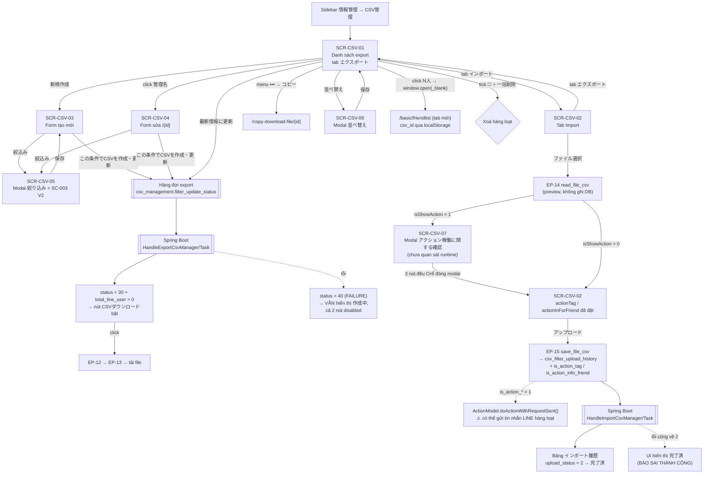
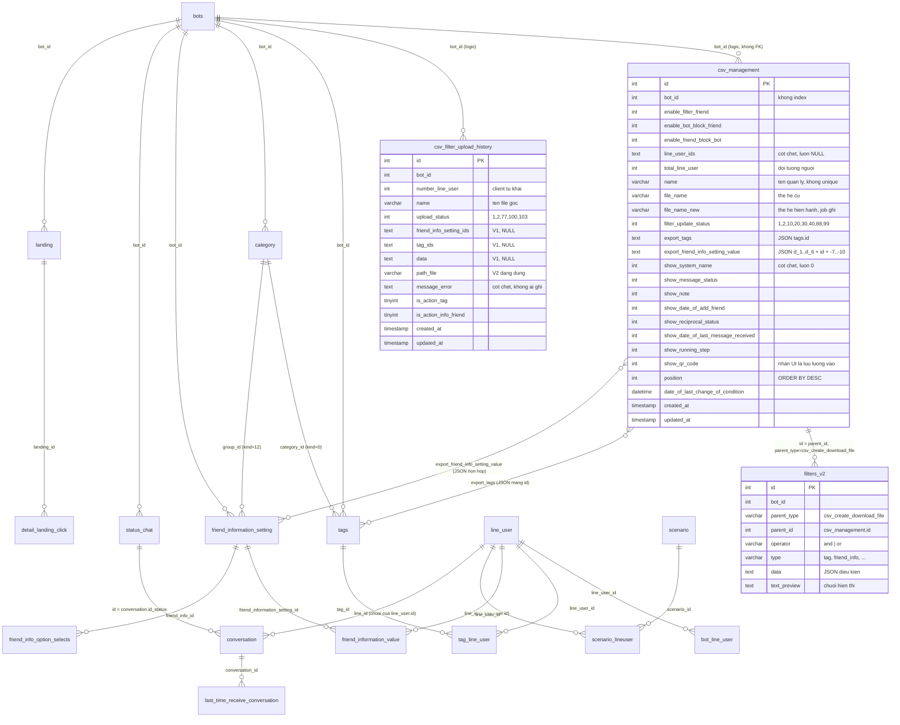

# FA-014 — 「CSV管理」 (Quản lý CSV)

> **Portal**: Admin (LINE OA) — cũng dùng được bởi Staff nếu được cấp quyền custom role
> **URL gốc**: `/basic/csv-management`
> **Vị trí menu**: sidebar → nhóm 「情報管理」 (Quản lý thông tin) → 「CSV管理」; đồng thời xuất hiện ở nhóm 「お気に入り」 khi được ghim
> **Trạng thái spec**: HOÀN THÀNH — biên soạn 2026-09-08 bởi `spec-compiler`
> **Nguồn dữ liệu**: UI live (playwright-cli, 6/7 màn hình có snapshot + screenshot — `SCR-CSV-07` dựng từ source code vì chỉ mở được sau khi upload file thật) · source code Laravel 5 `src/web/sns-line` · source code Spring Boot `src/job/linect-service` · dump DB thật (`csv_management` 208 bản ghi, `csv_filter_upload_history` 302 bản ghi, `filters_v2` 202 bản ghi thuộc tính năng)
> **Đã qua kiểm tra chéo**: `_internal/validation-report.md` — 7 mâu thuẫn đã phân xử, 56 sửa chữa (V-01…V-15) đã áp dụng vào các spec nguồn

**Tài liệu chi tiết theo lớp** (file này đã tổng hợp đủ để đọc độc lập):
`ui/ui-spec.md` · `web/api-spec.md` · `web/logic-spec.md` · `job/job-spec.md` · `db/db-mapping.md` · `_internal/validation-report.md`

---

## 1. Tổng quan

### 1.1 Mục đích

「CSV管理」 cho phép doanh nghiệp (Admin của một LINE Official Account) **trao đổi dữ liệu bạn bè LINE với bên ngoài qua file CSV**, gồm hai chiều độc lập:

| Luồng | Tên JP | Mục đích |
|---|---|---|
| **EXPORT** | 「エクスポート」 | Tạo và lưu các **"định nghĩa file export"** — mỗi định nghĩa là một cấu hình có tên riêng, gồm: đối tượng bạn bè (kèm bộ lọc chi tiết) + danh sách cột dữ liệu muốn xuất. Hệ thống sinh file CSV **bất đồng bộ** theo định nghĩa đó; người dùng tải về khi file sẵn sàng |
| **IMPORT** | 「インポート」 | Tải lên file CSV (bắt buộc là file đã export từ hệ thống rồi chỉnh sửa) để **ghi đè hàng loạt** 個別メモ / タグ / 友だち情報 của các bạn bè trong file |

Điểm đặc trưng quan trọng nhất: **Laravel không sinh file CSV và không nhập dữ liệu**. Web chỉ ghi "định nghĩa công việc" vào bảng MySQL và đặt cột trạng thái; **Spring Boot job poll bảng đó** rồi thực thi. Ghi chú trên UI xác nhận điều này: 「※データ量によっては、CSVの作成に数時間かかる場合があります。」 (tuỳ lượng dữ liệu, việc tạo CSV có thể mất vài giờ).

### 1.2 Actors

| Actor | Quyền | Cơ chế kiểm soát | Độ tin cậy |
|---|---|---|---|
| **Admin (LINE OA)** | Toàn quyền: tạo / sửa / nhân bản / xoá / sắp xếp định nghĩa export, tải CSV, upload CSV import | Middleware `basic_access` — yêu cầu `Auth::check()`, `role ∈ {−1, 0, 1, 2}`, có `bot_id` trong session (`app/Http/Middleware/BasicAccess.php:27`) | **Cao** |
| **Staff** | Cùng giao diện Admin, bị giới hạn bởi custom role | Menu 「CSV管理」 chỉ hiện khi route name `csvManagement` nằm trong `getRouterBotInvite()` (`resources/views/layout/basic/sidebar.blade.php:400-401`). 4 route được kiểm soát: `csvManagement`, `createDownloadFile`, `editDownloadFile`, `copyDownloadFile` | **Cao** cho cơ chế; **Thấp** cho hành vi thực tế (chưa đăng nhập Staff kiểm chứng) |
| **LINE User** | Không liên quan | Tính năng thuần nội bộ, không có trang public | **Cao** |

> ⚠ **Lỗ hổng phân quyền Staff (BR-21)**: các route AJAX (`ajaxInitCsvManagement`, `cMExportCSV`, `basic.csv_management.download_csv`, `ajax.cMSaveFilter`…) **không** nằm trong danh sách route-name của custom role. Staff bị ẩn menu vẫn có thể gọi thẳng API để đọc, sửa, xoá và tải file CSV. Xem §9 bug B-06.

### 1.3 Phạm vi

**Trong phạm vi**
- **7 màn hình** `SCR-CSV-01`…`SCR-CSV-07` (2 tab trên 1 trang + 2 form + **3 modal**)
- 15 endpoint `EP-01`…`EP-15`
- 2 task manager Spring Boot (`HandleExportCsvManager`/`Task`, `HandleImportCsvManager`/`Task`) + 4 Artisan command Laravel di sản
- 3 bảng chính (`csv_management`, `csv_filter_upload_history`, `filters_v2`) + 20 bảng phụ

**Ngoài phạm vi**
- Chi tiết logic của modal 「絞り込み」 → thuộc **SC-003 Friend Filter/Segment** (`features/shared/friend-filter/shared-spec.md`)
- 「CSVエクスポート（チャット）」 (export lịch sử chat 1:1) → thuộc **FA-041**, dùng bảng `history_export_csv_chat11`
- Export lịch salon → thuộc **FA-020**, dùng bảng `calendar_salon_download_csv_sync`

### 1.4 Phạm vi dữ liệu

**Export** — chọn **1 trong 3** nhóm đối tượng (radio loại trừ nhau):
- 「有効友だち」 (bạn bè đang hoạt động) — **duy nhất nhóm này** có nút 「絞込み」 để lọc chi tiết
- 「ブロックした友だち」 (OA đã chặn bạn bè) — server tự truy vấn `conversation.blocked_by = 1`
- 「ブロックされた友だち」 (bạn bè đã chặn OA) — `conversation.blocked_by = 0`

Cột dữ liệu xuất chọn qua 2 nhóm: 「単一選択項目」 (7 checkbox cố định) và 「複数選択項目」 (「タグ」 + 「友だち情報」 chọn theo thư mục).

**Import** — ghi chú nguyên văn trên UI (độ tin cậy **Cao**, đọc trực tiếp DOM):
- 「CSVデータのインポートにより個人メモ・タグ・友だち情報の情報を書き換えることができます。」 → chỉ ghi đè được **個別メモ / タグ / 友だち情報**
- 「対応マーク・最終メッセージ受信日時・配信中ステップ・QRコードアクションの情報は書き換えできません。」 → **không** ghi đè được 4 nhóm này

---

## 2. Các màn hình và luồng xử lý end-to-end

### 2.1 Bản đồ màn hình

| Mã | Tên màn hình | Loại | URL / cách mở |
|---|---|---|---|
| `SCR-CSV-01` | Danh sách export 「CSV管理」 — tab 「エクスポート」 | Trang | `GET /basic/csv-management` (tab mặc định, anchor `#tab-export`) |
| `SCR-CSV-02` | Tab 「インポート」 | Tab client-side | Click tab 「インポート」, anchor `#tab-import` — **không đổi URL** |
| `SCR-CSV-03` | Form tạo mới 「エクスポートデータ作成」 | Trang | `GET /basic/csv-management/create-download-file` |
| `SCR-CSV-04` | Form chỉnh sửa 「エクスポートデータ作成」 | Trang | `GET /basic/csv-management/edit-download-file/{id}` |
| `SCR-CSV-05` | Modal 「絞り込み」 (lọc đối tượng export) = **SC-003 V2** | Modal | Nút 「絞込み」 trong SCR-CSV-03/04 |
| `SCR-CSV-06` | Modal 「【 並べ替え 】」 (sắp xếp danh sách) | Modal | Nút 「並べ替え」 trong SCR-CSV-01 |
| `SCR-CSV-07` | Modal 「アクション稼働に関する確認」 (`#modalConfirmAction`) | Modal | **Tự động** mở sau khi chọn file ở SCR-CSV-02 khi `read_file_csv` trả `isShowAction = 1`. ⚠ **Dựng từ source code** (`csv_management.blade.php:434-485`), chưa quan sát runtime |
| — | Trang nhân bản 「コピー」 | Trang | `GET /basic/csv-management/copy-download-file/{id}` — dùng lại view của SCR-CSV-03 với biến `copy_id` |

> **Không tồn tại modal 「対象人数」.** Link 「N人」 ở cột 「対象人数」 **hoạt động bình thường**: nó **mở tab mới** sang 「友だちリスト」 chứ không mở modal (đính chính V-05, xem §2.2 bước D).



---

### 2.2 LUỒNG EXPORT — end-to-end

#### Bước A — `SCR-CSV-01` Danh sách export

**User action**: mở sidebar → 「CSV管理」

| Giai đoạn | Chi tiết |
|---|---|
| **UI** | Trang có 2 tab (「エクスポート」 active mặc định, 「インポート」). Toolbar: 「新規作成」 (xanh dương, trái) · 「並べ替え」 (xám đậm, phải) · 「一括削除」 (xám nhạt, **disabled** khi chưa tick dòng nào). Bảng 7 cột: checkbox / 「作成日」 / 「管理名」 (link) / 「対象人数」 (link) / 「最終条件設定」 / cụm nút thao tác / icon menu `•••` |
| **API** | `EP-01 GET /basic/csv-management` render view rỗng (không truyền biến); Vue nạp dữ liệu qua **`EP-05 POST /ajax/init-csv-management`** với `action=initData` |
| **Business logic** | `CsvManagementController@ajaxInitCsvManagement` (`:311-378`) → `CsvManagement::where(['bot_id' => $bot_id])->orderBy('position','DESC')->get()`. Tính thêm cờ `isAdd` để bật/tắt nút 「新規作成」 theo hạn mức gói (BR-05) |
| **DB** | Đọc `csv_management` (lọc `bot_id`), `bots`, `bot_contracts` ⋈ `bot_slots` |
| **Job** | Không |
| **Response** | `{ status: true, items: [...], isAdd: true|false }` |
| **UI update** | Vue render từng dòng. Cụm nút cuối dòng phụ thuộc trạng thái (xem bảng dưới) |

**Quy tắc render cụm nút thao tác** (`resources/views/csv_management/csv_management.blade.php:309-317` — BR-09):

| Điều kiện | 「最新情報に更新」 | Nút thứ hai |
|---|---|---|
| `filter_update_status == 30` **VÀ** `total_line_user > 0` | **bật** | 「CSVダウンロード」 **bật** (xanh dương, icon tải xuống) |
| `filter_update_status == 30` **VÀ** `total_line_user == 0` | **bật** | 「作成中」 **disabled** (xám nhạt) |
| Mọi giá trị khác `30` (1, 2, 10, 20, 40, 88, 99) | **disabled** | 「作成中」 **disabled** |

> ⚠ Hàng cuối bảng là nguồn gốc của **bug B-01** (§9): trạng thái lỗi `40` và trạng thái mồ côi `10` rơi vào đây, và **cả hai nút đều disabled** → không có đường retry từ UI.

#### Bước B — `SCR-CSV-03` / `SCR-CSV-04` Form tạo / sửa định nghĩa export

**User action**: click 「新規作成」 (→ create) hoặc click tên trong cột 「管理名」 (→ edit `/{id}`)

| Giai đoạn | Chi tiết |
|---|---|
| **UI** | Cùng một blade `csv_management.create_download_file` cho cả create, edit và copy. Heading `<h2>` luôn là 「エクスポートデータ作成」; chỉ **title trình duyệt** khác (edit = 「CSV管理（エクスポート編集）」). 4 khối: ① 「書き出し名（管理用）」 (textbox, bộ đếm 「0/50文字」) ② 「エクスポート対象絞込み」 (3 radio + nút 「絞込み」 + khối tóm tắt 「対象人数（有効友だちのみ）」/「絞り込み条件」) ③ 「単一選択項目」 (7 checkbox) ④ 「複数選択項目」 (「タグ」 + 「友だち情報」, mỗi khối có folder bên trái, item bên phải, nút 「選択クリア」, vùng 「選択した項目」). Nút submit duy nhất: 「この条件でCSVを作成・更新」 |
| **API** | Render: `EP-02` (create) / `EP-03` (edit) / `EP-04` (copy). Nạp cây tag: **`EP-08 POST /ajax/get-list-group-tag-for-csv`**. Nạp cây 友だち情報: **`EP-07 POST /ajax/init-friend-information-for-csv`**. Dựng lại điều kiện lọc đã lưu: **`EP-10 GET /ajax/initDataFilterCsvManagement`** |
| **Business logic** | Controller nạp `scenario`, `conversion`, `richMenus (status_rich=1)`, `statusObject (StatusChat)` — tất cả lọc theo `getBotId()` — để cấp dữ liệu cho **modal 絞り込み**. Với edit/copy thêm `item = CsvManagement::where(['id' => $csvId])->first()` ⚠ **không lọc `bot_id`** (IDOR) |
| **DB** | Đọc `csv_management`, `category` (`kind=0` tag / `kind=12` friend info), `tags`, `friend_information_setting`, `scenario`, `conversion`, `rich_menus`, `status_chat` |
| **Job** | Không |
| **UI update** | Form prefill (edit/copy). Folder 「基本情報 (4)」 và 「国内住所 (5)」 **không đến từ DB** — là hằng số `config/sns-line.php`, số đếm hard-code trong blade (`create_download_file.blade.php:321, 327`) |

#### Bước C — `SCR-CSV-05` Modal 「絞り込み」 (chỉ khi chọn 「有効友だち」)

Đây **chính là** shared component **SC-003 Friend Filter/Segment, biến thể V2** (11 loại điều kiện, hỗ trợ AND + OR). Modal có 2 nút chế độ thêm điều kiện (AND / OR), cột trái 11 nút loại điều kiện có icon ⊕, 2 vùng chứa điều kiện, nút 「保存」 (không có 「キャンセル」 — đóng bằng icon ×).

11 loại điều kiện: 「タグ」·「友だち名」·「友だち追加日」·「ステップ購読状況」·「QRコードアクション」·「コンバージョン」·「確認状況」·「友だち情報」·「対応ステータス」·「アフィリエイター」·「新規・既存 友だち」.

Điều kiện được lưu thành **nhiều bản ghi** trong bảng `filters_v2` với `parent_type = 'csv_create_download_file'`, `parent_id = csv_management.id`, `operator ∈ {'and','or'}`. Chi tiết đầy đủ: `features/shared/friend-filter/shared-spec.md`.

#### Bước D — Link 「N人」 ở cột 「対象人数」

**Đã đính chính (V-05): link hoạt động bình thường, KHÔNG phải dead link.**

Blade render **3 nhánh** trong `<td class="line_user_link">` (`csv_management.blade.php:301-305`):

| Điều kiện | Hành vi |
|---|---|
| `enable_filter_friend == 1` | `<a href="#" v-on:click="showNumberFilter(item.id)">` → JS ghi `localStorage.setItem("csv_management_filter_id", csvId)` rồi `window.open("/basic/friendlist", "_blank")` — **mở tab mới** (`public/js/csv_management/csv_management.js:803-811`). Trang 「友だちリスト」 đọc khoá này rồi gọi **EP-10** để dựng lại bộ lọc |
| `enable_bot_block_friend == 1` | Điều hướng thẳng `/basic/friendlist/block` |
| `enable_friend_block_bot == 1` | Điều hướng thẳng `/basic/friendlist/user-block` |

> Lý do lần quét UI đầu kết luận nhầm "dead link": (a) handler là **Vue directive `v-on:click`** nên kiểm tra attribute DOM không thấy; (b) `window.open(..., "_blank")` mở **tab khác** trong khi playwright-cli chụp snapshot của tab hiện tại.

#### Bước E — Lưu định nghĩa 「この条件でCSVを作成・更新」

**User action**: click nút submit (cùng một nút cho create và update)

| Giai đoạn | Chi tiết |
|---|---|
| **API** | **`EP-09 POST /ajax/csv-management/save-filter`** — gửi bằng `FormData` (multipart) từ `public/js/csv_management/create_download_file.js:456-486` |
| **Business logic** | `CsvManagementController@saveFilter` (`:428-604`): ① validate thủ công `csv_name` không rỗng (BR-01) và ít nhất 1 cột được chọn (BR-03) → ② xác định tập LINE user theo `type_filter_condition` (BR-04) → ③ nhánh **EDIT** `update()` với `filter_update_status = 20`, `line_user_ids = null`, `date_of_last_change_of_condition = now()`; nhánh **CREATE** kiểm tra hạn mức gói (BR-05), tính `position = max+1` (BR-06), `create()` với `filter_update_status = 1`, rồi kiểm tra hạn mức **lần hai** bằng `PlanLimitGuard::rollbackIfOverLimit()` (fix race-condition ticket #39230) → ④ lưu điều kiện lọc vào `filters_v2` **chỉ khi** `enable_filter_friend == 1` (BR-08) |
| **DB** | INSERT/UPDATE `csv_management`; INSERT/UPDATE/DELETE `filters_v2`; đọc `bots`, `bot_contracts`, `conversation` (2 nhóm block) |
| **Job** | **Đây chính là hành động enqueue** — đặt cột trạng thái để Spring Boot nhặt |
| **Response** | `{ success: true, msg: "" }` → client `window.location.href = '/basic/csv-management'` |
| **UI update** | Quay về `SCR-CSV-01`, dòng mới/đã sửa hiển thị badge 「作成中」 |

> ⚠ `DB::beginTransaction()/commit()/rollback()` **đều bị comment** (`:434`, `:592`, `:598`) → nếu `FilterV2::saveFilter()` ném exception, bản ghi `csv_management` đã tồn tại nhưng **không có điều kiện lọc** → job sẽ export sai tập bạn bè.

#### Bước F — Job Spring Boot sinh file CSV

```
[Laravel] filter_update_status = 1 (create) hoặc 20 (edit / 最新情報に更新)
      ▼
[Job] HandleExportCsvManager.startThreadQueueCsv()          ← findAllByFilterUpdateStatusIn([1, 20]); sleep 2000ms khi rỗng
      │  addToQueue(): UPDATE filter_update_status = 2 (IN_QUEUE) + push LinkedList
      ▼
[Job] HandleExportCsvTask ×5 worker — queueCsv.poll() (sleep 3000ms khi rỗng)
      ├─ (1) UPDATE filter_update_status = 88 (RUNNING)            HandleExportCsvTask.java:70-71
      ├─ (2) Sinh tên file + xoá file cũ (Utils.deleteFile)        :73-80
      ├─ (3) Nạp tag cần xuất (TagRepository)                      :86
      ├─ (4) Chọn tập LINE user theo cờ đối tượng                  :89-95
      │        enable_filter_friend=1 → LineUserModel.getListLineUserFromFilterV2("csv_create_download_file", csvId, botId)
      │        enable_bot_block_friend=1 → getConversationBlocked(botId, 1)
      │        enable_friend_block_bot=1 → getConversationBlocked(botId, 0)
      ├─ (5) Dựng 2 dòng header (row0 mã kỹ thuật + row1 nhãn 日本語)  :166 → headings() :371-420
      ├─ (6) openWrite(path, "SHIFT-JIS") + ghi header             :165-167
      ├─ (7) Lặp từng LineUser → ~8 truy vấn phụ → 1 dòng CSV      :169-267
      └─ (8) UPDATE file_name_new, filter_update_status = 30, total_line_user   :269-272
             (exception bất kỳ → filter_update_status = 40)        :56-57
```

Tên file (luồng hiện hành, Java): `cleanString({name})_{csv_management.id}_{yyyyMMddHHmmss}.csv` — **14 chữ số**, mã hoá **SHIFT-JIS**, **luôn đúng 1 file, không nén ZIP**.
Đường dẫn ghi vào `file_name_new`: `{FOLDER_MEDIA}csv/{bot_id}/{file}` — suy từ dump: `FOLDER_MEDIA = '/msg_template/'`.

Với **mỗi** LINE user, job chạy ~8 truy vấn phụ: `conversation` (null → **bỏ qua dòng**), `bot_line_user` (null → **bỏ qua dòng**), `memo`, `last_time_receive_conversation`, `status_chat`, `detail_landing_click` → `landing`, `tag_line_user`, `scenario_lineuser` → `scenario`, `friend_info_value`. Với 50.000 bạn bè ≈ **400.000 truy vấn** cho một lần export.

#### Bước G — Tải file 「CSVダウンロード」

**User action**: click 「CSVダウンロード」 (chỉ hiện khi `status == 30 && total_line_user > 0`)

| Bước | Endpoint | Hành vi |
|---|---|---|
| 1 | **`EP-12 POST /basic/csv-management/export`** | Đọc `CsvManagement` theo `id`; ưu tiên `file_name_new` → tách path theo `/`, `urlencode` phần tử index 4 rồi ghép lại; nếu không có → dùng `file_name`, `urlencode` phần tử cuối. Trả `{ success, file_name, path_new }` |
| 2a | `path_new = 1` | Client mở thẳng `domainMediaCSV + file_name` (media server / CDN) |
| 2b | `path_new = 0` | Client gọi **`EP-13 GET /basic/csv-management/download-csv?fileName=…&path_new=…`** → `response()->download(public_path() . '/storage/' . $fileCsv)`; nếu `path_new=1` mà file không có trên node → redirect `env('URL_SERVER_MEDIA') . $fileCsv . '?v=' . time()` |

> ⚠ EP-13 là **lỗ hổng path traversal Nghiêm trọng** — xem §9 bug B-05.

#### Bước H — 「最新情報に更新」 (build lại file)

`EP-11 POST /basic/csv-management/update-latest-information`, gọi từ **Web Worker** (`public/js/csv_management/worker.js:32`, XHR thuần có header `X-CSRF-TOKEN`) để không chặn UI.
Hành vi: `CsvManagement::where('id', $csvId)->update(['filter_update_status' => 20, 'date_of_last_change_of_condition' => now()])` (`:946-951`) — chỉ đặt trạng thái, việc build do job (BR-10).

> ⚠ Không kiểm tra bản ghi có đang ở `88` (RUNNING) hay không → bấm liên tục có thể re-enqueue một định nghĩa đang chạy → **hai worker cùng export một định nghĩa**, mỗi worker ghi một `file_name_new` khác nhau.

#### Bước I — `SCR-CSV-06` Sắp xếp và xoá

| Thao tác | Endpoint | Hành vi |
|---|---|---|
| 「並べ替え」 | `EP-05` `action=sortItem` | Modal hiển thị các dòng trong **ô viền dạng textbox**, mỗi dòng có **cặp chevron ˄/˅** (không phải drag-and-drop). Client tách `sort_ids` + `sort_position` bằng `,`; server `array_sort($sort_position)` rồi gán từng cặp theo index. Vì danh sách hiển thị `ORDER BY position DESC`, client phải **đảo mảng** trước khi gửi |
| 「一括削除」 | `EP-05` `action=deleteItems` | `CsvManagement::whereIn('id', $csvIds)->delete()` + xoá `FilterV2` tương ứng (BR-07) — **hard delete**, không có `deleted_at` |
| Menu `•••` → 「削除」 | `EP-05` `action=deleteItem` | Tương tự cho 1 bản ghi |
| Menu `•••` → 「コピー」 | `EP-04` (chỉ `window.location.href`) | Mở form với `copy_id` → JS đặt `save_action` = tạo mới |

> ⚠ Xoá định nghĩa **không xoá file CSV trên đĩa** → rác storage tăng dần. Transaction cũng bị comment (`:312`, `:366`, `:374`) → có thể xoá `csv_management` xong mà `filters_v2` còn sót.

---

### 2.3 LUỒNG IMPORT — end-to-end

#### Bước A — `SCR-CSV-02` Tab 「インポート」

**UI**: 2 dòng mô tả + khu vực `[ファイル選択]` (element clickable tuỳ biến, không phải `<input type=file>` lộ ra a11y tree) + `<paragraph>` rỗng hiển thị tên file + nút 「アップロード」 (**disabled** khi chưa chọn file) + 4 dòng lưu ý + bảng 「インポート履歴」.

4 dòng lưu ý (nguyên văn):
1. 「※CSVデータは必ずエクスポートページからダウンロードしたものをご利用ください。」
2. 「※CSVデータの上1・2行目と左1列目は、絶対に編集しないでください。」
3. 「※友だち情報タイプ「画像」「PDF」はインポートできません」
4. 「※友だち情報タイプ「年月日」は指定フォーマット( YYYY/MM/DD )以外は正常にインポートされません」

**API bảng lịch sử**: `EP-06 POST /ajax/init-import-csv-management` → `CsvFilterUploadHistory::where(['bot_id' => $bot_id])->orderBy('id','desc')` — **không phân trang** (BR-17).

> ⚠ Header bảng 「インポート履歴」 dùng **đúng bộ nhãn của bảng export** (作成日 / 管理名 / 対象人数 / 最終条件設定) trong khi nội dung thực là ngày / **giờ** / **tên file** / số dòng client khai / **trạng thái**. Đây là **lỗi nhãn của sản phẩm** (blade tái dụng), không phải thiếu mapping — xem §9 bug B-07.

#### Bước B — Chọn file (preview)

**API**: `EP-14 POST /basic/csv-management/read_file_csv` (gọi với `async: false`)

| Giai đoạn | Chi tiết |
|---|---|
| **Validation file** | Whitelist 10 MIME dựa trên `$_FILES['csv_file']['type']` (`:621-635`) — **chỉ dựa vào Content-Type do client khai**, không kiểm tra đuôi file, không giới hạn kích thước |
| **Xử lý** | `file_get_contents` (rỗng → lỗi 「エラー」) → nếu `mb_detect_encoding($csv, "sjis-win")` thành công thì chuyển Shift-JIS → UTF-8 (BR-15) → đọc bằng `fgetcsv` từ `php://temp`: **dòng 0** = mã kỹ thuật (`タグ_{id}`, `友だち情報_{id}`), **dòng 1** = nhãn tiếng Nhật, **từ dòng 2** = dữ liệu (BR-12) |
| **Validate từng dòng** | `csvValidate()` (`:857-892`) — thực chất **chỉ 1 rule hiệu lực**: `line_id => required` (BR-13). `phone_number` / `status_message` là `nullable` (không kiểm gì) |
| **DB** | **Không ghi gì** |
| **Response** | `{ success, data: { csv_file_name, tag_ids, friend_info_setting_ids, items }, totalUser, isShowAction }` |
| **UI update** | Tên file hiển thị ở `<p id="preview_file_name">` (`csv_management.js:44`), nút 「アップロード」 bật (`:disabled="csv_file.length==0"`, `csv_management.blade.php:353`). Nếu **thất bại** → `alert(a.message)` (thường 「エラー」) + xoá sạch input và tên file (`csv_management.js:53-55`) |
| **UI update (tiếp)** | Nếu `isShowAction = 1` → **tự động mở `SCR-CSV-07`** (`$('#modalConfirmAction').modal('show')`, `csv_management.js:49-51`) — xem Bước B2 |

#### Bước B2 — `SCR-CSV-07` Modal 「アクション稼働に関する確認」

> ⚠ **Dựng từ source code, chưa quan sát runtime** (không thể mở nếu không upload file thật). Chi tiết đầy đủ: `ui/ui-spec.md` mục **SCR-CSV-07**.

| Hạng mục | Chi tiết |
|---|---|
| **Điều kiện mở** | `isShowAction = 1` — đặt khi header CSV chứa cột 「タグ」 (`CsvManagementController.php:731-732`), 「友だち情報」 (`:781-782`), hoặc 1 trong 6 trường 基本情報 mặc định: 「システム表示名」`:743`, 「携帯電話」`:749`, 「メールアドレス」`:755`, 「生年月日」`:761`, 「年齢」`:767`, 「都道府県」`:773`. Cờ **gộp chung**, không tách theo nhóm |
| **Nội dung** | Cảnh báo 「インポートする情報にタグ・友だち情報が含まれています。…アクション稼働について選択してください。」 + **2 nhóm radio** (`csv_management.blade.php:445-471`) |
| **Nhóm 1** | 「タグ追加時アクション」 → 「稼働させない」(`0`) / 「稼働させる」(`1`) → Vue model `actionTag`, mặc định `0` (reset mỗi lần chọn file, `csv_management.js:47`) |
| **Nhóm 2** | 「友だち情報 登録時アクション」 → 「稼働させない」(`0`) / 「稼働させる」(`1`) → `actionInForFriend`, mặc định `0` (`csv_management.js:48`) |
| **Nút** | `×`, 「閉じる」, 「インポートする」 — ⚠ **cả 3 đều CHỈ có `data-dismiss="modal"`**, không nút nào có handler, **không nút nào import** (`csv_management.blade.php:438, 481, 482`). Modal thuần tuý là **bộ thu 2 giá trị**; import vẫn phải bấm 「アップロード」 ở Bước C |
| **DB** | **Không ghi gì ở bước này** — 2 giá trị chỉ nằm trong bộ nhớ Vue cho tới khi `csvSave()` gửi kèm |
| **Hệ quả xuống job** | `is_action_tag = 1` → `HandleImportCsvTask.java:298, 309` gọi `ActionModel.doActionWithRequestSent()` (`:302`) cho từng bạn bè được gán tag mới. `is_action_info_friend = 1` → `:148, 361, 377, 388, 400, 446` → `:424`. Hằng số `CsvFilterUploadHistory.ACTION_YES = 1` / `ACTION_NO = 0`, getter trả `ACTION_NO` khi cột `NULL` (`CsvFilterUploadHistory.java:16-17, 136-141`) |

> 🔴 **Mức ảnh hưởng**: `doActionWithRequestSent()` có thể **gửi tin nhắn LINE hàng loạt** cho từng dòng trong file CSV. Chọn 「稼働させる」 trên file hàng nghìn dòng = phát tán hàng nghìn tin.
> ⚠ **Bug UX (B-10)**: nhãn 「インポートする」 hứa hẹn thực hiện import nhưng **không làm gì ngoài đóng modal** → người dùng có thể tưởng đã import xong và rời trang, **import không bao giờ chạy**. 「閉じる」 cũng **không huỷ** lựa chọn. Không có nút nào bắt buộc trả lời — đóng bằng `×` vẫn cho phép upload với mặc định `0/0` (an toàn theo mặc định).

> ⚠ Toàn bộ file nạp vào RAM (`file_get_contents` + `php://temp`) → file lớn có nguy cơ vượt `memory_limit`.
> ⚠ `count($header) > count($row)` → **dừng cả file**, trả 「エラー」 (BR-14). Lưu ý job Java xử lý khác: chỉ `continue` bỏ qua dòng đó.

#### Bước C — 「アップロード」 (lưu + enqueue)

**API**: `EP-15 POST /basic/csv-management/save_file_csv` (`csvSave()` — `csv_management.js:64-100`)

| Giai đoạn | Chi tiết |
|---|---|
| **Business logic** | `$path = env('FOLDER_MEDIA') . 'media/csv/' . getCurrentUser() . '/' . getBotId() . '/'` → `uploadFile($file, '', $path)` → `CsvFilterUploadHistory::create([bot_id, number_line_user, name, path_file, is_action_tag, is_action_info_friend])` |
| **DB** | INSERT `csv_filter_upload_history`; `upload_status` **không được truyền** → lấy DEFAULT `1` (WAIT) → **đây chính là hành động enqueue** |
| **Response** | `{ success: true, message: "インポートされました。" }` |
| **UI update** | Gọi lại `initDataImportCsvManagement()` → nạp lại bảng 「インポート履歴」 qua **EP-06**; bản ghi mới có `upload_status` = DEFAULT `1` nên hiện ở đầu bảng với cột cuối 「**作業中**」. Sau đó reset form: `countUser = 0`, `csv_file = []`, xoá `#fileUpload` + `#preview_file_name` → nút 「アップロード」 trở lại disabled (`csv_management.js:86-90`) |

> ⚠ **Không kiểm tra MIME lại** ở bước lưu (whitelist chỉ chạy ở EP-14) → có thể đổi file giữa 2 bước mà server không phát hiện (BR-11).
> ⚠ `totalUser` do **client tự khai**, ghi thẳng vào `number_line_user`, server không đối chiếu, job **không cập nhật lại** → con số 「対象人数」 trên bảng lịch sử có thể sai hoàn toàn.
> ⚠ **Code chết (B-11)**: blade còn một khối `<tr v-for="… in uploadingFilterItems">` render cột cuối cứng là 「作業中」 (`csv_management.blade.php:387-393`), nhưng biến `uploadingFilterItems` **chỉ được khai báo** (`csv_management.js:109`) và **không nơi nào gán giá trị** trong toàn bộ JS/blade → mảng **luôn rỗng, khối không bao giờ render**. Dòng 「作業中」 người dùng thấy đến từ `historyUploadFilterItems` nạp lại từ server, **không phải** dòng tạm client-side.
> ⚠ **Không auto-refresh**: sau lần nạp lại này, bảng lịch sử **không tự cập nhật**. Muốn biết job xong chưa, người dùng phải chuyển tab (`loadInitImportCsv`, blade `:265` → `csv_management.js:247-250`) hoặc F5.

#### Bước D — Job Spring Boot nhập dữ liệu

```
[Job] HandleImportCsvManager.startJobGetCsvFilter()      ← findTop100ByUploadStatusOrderByIdAsc(1); sleep 2000ms khi rỗng
      │  Back-pressure: queue > 100 phần tử → sleep(1000) bỏ qua vòng này
      │  addToQueue(): saveAll() với upload_status = 100 (IN_QUEUE) — ghi cả lô một lần
      ▼
[Job] HandleImportCsvTask ×5 worker — poll(); sleep 2000ms khi rỗng
      ├─ (1) save() upload_status = 77 (RUNNING)                    HandleImportCsvTask.java:67-68
      ├─ (2) path_file rỗng? → nhánh V1 đã bỏ ("no support version 1") → DONE   :73-80
      ├─ (3) Mở file tại ConfigFile.PHP_PUBLIC_FOLDER + path_file    :82-83
      │        không tồn tại → sleep(10s) → tải lại từ URL_MEDIA_BACKUP        :84-92
      ├─ (4) readFileCSVV2()                                         :94 → :507-672
      │        UniversalDetector.detectCharset(); null → "SHIFT-JIS"
      │        CSVReader.readAll() — nạp TOÀN BỘ file vào RAM
      │        row0 = mã kỹ thuật, row1 = nhãn 日本語 → dựng header
      ├─ (5) readDataCSVV1() ghi DB + (tuỳ cờ) chạy action           :104-458
      └─ (6) save() upload_status = 2 (DONE) — KỂ CẢ KHI CÓ LỖI      :99-100
```

**Job ghi vào những bảng nào** (`readDataCSVV1()`):

| Nhóm dữ liệu | Bảng ghi | Điều kiện |
|---|---|---|
| システム表示名 / メール / 生年月日 / 年齢 / 都道府県 / 携帯電話 | `line_user` (+ `bot_line_user.phone_number`) | Luôn |
| 郵便番号 / 市区町村名 / 町名番地 / 建物名 | `friend_info_value` với `friend_info_setting_id` = **−7 / −8 / −9 / −10** | Luôn (⚠ chỉ **import** hỗ trợ 4 trường này; **export không** — xem §9 bug B-04) |
| Lịch sử thay đổi thông tin mặc định (−1…−6) | `friend_info_history` | Khi giá trị đổi |
| ステータスメッセージ | `conversation` (`confirm_count`, `status_last_message`, `has_status_0/1`) + `unconfirm_message` + `bots.count_user_unconfirm` | Có `conversation` |
| 個別メモ (các cột dư cuối dòng) | `memo` (title `CSV追加 (…)`, `type=1`) + `memo_histories` | Có cột dư |
| `タグ_{id}` = `1` / `0` | `tag_line_user` (khôi phục / tạo / xoá) + `tags.user_tag_count` + `tag_history` | Chỉ khi `is_action_tag` được xử lý |
| `友だち情報_{id}` | `friend_info_value` (INSERT/UPDATE/DELETE) + `friend_info_setting.total_user_has_value` + `friend_info_history` | `type_data ∈ {4,5}` → **bỏ qua hoàn toàn** |

**Hai cờ hành động** (giá trị `1` = `ACTION_YES`):

| Cờ | Khi `= 1` |
|---|---|
| `is_action_tag` | Sau khi gắn tag mới → `ActionModel.doActionWithRequestSent(...)` với `StartActionInfo(TYPE_ADD_TAG, tagId)` → **chạy action gắn với tag** (thường là **gửi tin nhắn LINE**, chuyển scenario…) |
| `is_action_info_friend` | 3 trường hợp: `TYPE_DATA_SELECT` → chạy `actionId` của option khớp; `TYPE_DATA_POINT` → duyệt `settingValue.settingActions`; `TYPE_DATA_CALENDAR` → `EventModel.csvSettingActionFriendInfoDate()` đặt/huỷ lịch nhắc |

Ràng buộc chống spam: `ACTION_MODE_ONE_TIMES` + `friend_info_value.action > 0` → bỏ qua; chỉ chạy khi `BotModel.getAvailableSendCount(botId)` còn quota (`-1` = không giới hạn); giá trị không đổi → không action.

Mọi bản ghi lịch sử mang `StartActionInfo(TYPE_IMPORT_CSV = 19001, csv.getId())` → **truy vết được thay đổi nào đến từ lần import nào**.

---

## 3. Data Model

### 3.1 Entities chính

| # | Bảng | Vai trò | Model Laravel | Entity Java | Bản ghi trong dump |
|---|---|---|---|---|---|
| 1 | `csv_management` | Định nghĩa EXPORT + **hàng đợi** sinh file | `App\CsvManagement` | `sns.line.models.linedb.entities.CsvManagement` | **208** |
| 2 | `csv_filter_upload_history` | Lịch sử IMPORT + **hàng đợi** xử lý file | `App\CsvFilterUploadHistory` | `...entities.CsvFilterUploadHistory` | **302** |
| 3 | `filters_v2` | Điều kiện lọc bạn bè (`parent_type = 'csv_create_download_file'`) — thuộc **SC-003** | `App\FilterV2` | — | **202** dòng thuộc tính năng |

> Tên bảng đúng là **`filters_v2`** (số nhiều) — `app/FilterV2.php:13`. Giá trị `parent_type` là `'csv_create_download_file'`.

**20 bảng phụ**: `line_user`, `bot_line_user`, `conversation`, `last_time_receive_conversation`, `status_chat`, `scenario_lineuser`, `scenario`, `detail_landing_click`, `landing`, `tags`, `tag_line_user`, `category`, `friend_information_setting`, `friend_information_value`, `friend_info_option_selects`, `bots`, `bot_contracts` (⋈ `bot_slots`), `conversion`, `rich_menus`, `users`/`user_access_bot`.

### 3.2 Cấu trúc `csv_management`

| Cột | Kiểu | Default | Ý nghĩa |
|---|---|---|---|
| `id` | int(10) unsigned | AUTO_INC | **PK** — xuất hiện trong URL `/edit-download-file/{id}` |
| `bot_id` | int(11) | — | Bot sở hữu (FK **logic**, không index, không constraint) |
| `enable_filter_friend` | int(11) | 0 | `1` = 「有効友だち」 (có lọc chi tiết) |
| `enable_bot_block_friend` | int(11) | 0 | `1` = 「ブロックした友だち」 |
| `enable_friend_block_bot` | int(11) | 0 | `1` = 「ブロックされた友だち」 |
| `line_user_ids` | text | NULL | **Cột chết** — Laravel luôn ghi `NULL`, job Java không đụng tới |
| `total_line_user` | int(11) | 0 | 「対象人数」 — số của lần build file gần nhất |
| `name` | varchar(255) | NULL | 「書き出し名（管理用）」 — **không unique** |
| `file_name` | varchar(255) | NULL | Đường dẫn file **thế hệ cũ** (dưới `public/storage/`) |
| `file_name_new` | varchar(255) | NULL | Đường dẫn file **hiện hành** — job ghi |
| `filter_update_status` | int(11) | 1 | Trạng thái hàng đợi export — 8 giá trị (§7.3) |
| `export_tags` | text | NULL | JSON mảng `tags.id` |
| `export_friend_info_setting_value` | text | NULL | JSON **hỗn hợp**: chuỗi `"d_1"`…`"d_6"` (trường hệ thống) + số nguyên (`friend_information_setting.id`) + số âm `-7`…`-10` |
| `show_system_name` | int(11) | 0 | **Cột chết** — mọi tham chiếu bị comment; 208/208 bản ghi = `0` |
| `show_message_status` | int(11) | 0 | 「ステータスメッセージ」 |
| `show_note` | int(11) | 0 | 「個別メモ」 |
| `show_date_of_add_friend` | int(11) | 0 | 「友だち追加日」 |
| `show_reciprocal_status` | int(11) | 0 | 「対応マーク」 |
| `show_date_of_last_message_received` | int(11) | 0 | 「最終メッセージ受信日時」 |
| `show_running_step` | int(11) | 0 | 「配信中ステップ」 |
| `show_qr_code` | int(11) | 0 | 「流入経路」 — **tên cột lệch nghĩa nhãn UI** |
| `position` | int(11) | — | Thứ tự hiển thị (`ORDER BY position DESC`) |
| `date_of_last_change_of_condition` | datetime | NULL | 「最終条件設定」 |
| `created_at` / `updated_at` | timestamp | CURRENT_TIMESTAMP | 「作成日」 / không hiển thị |

**Giải mã `export_friend_info_setting_value`**

| Giá trị | Nhóm UI | Nhãn CSV | Trường thực tế | Export xử lý? | Import xử lý? |
|---|---|---|---|---|---|
| `"d_1"` | 基本情報 | 「システム表示名」 | `line_user.view_name` | ✅ | ✅ |
| `"d_2"` | 基本情報 | 「携帯電話」 | `line_user.phone_number` (`+81` → `0`) | ✅ | ✅ |
| `"d_3"` | 基本情報 | 「メールアドレス」 | `line_user.email` | ✅ | ✅ |
| `"d_4"` | 基本情報 | 「生年月日」 | `line_user.birthday` | ✅ | ✅ |
| `"d_5"` | (ẩn khỏi UI) | 「年齢」 | `line_user.age` | ✅ | ✅ |
| `"d_6"` | 国内住所 | 「都道府県(名)」 | `line_user.province` | ✅ | ✅ |
| `-7` | 国内住所 | 「郵便番号」 | `friend_info_value(-7)` | ❌ **KHÔNG** | ✅ |
| `-8` | 国内住所 | 「市区町村名」 | `friend_info_value(-8)` | ❌ **KHÔNG** | ✅ |
| `-9` | 国内住所 | 「町名/番地」 | `friend_info_value(-9)` | ❌ **KHÔNG** | ✅ |
| `-10` | 国内住所 | 「建物名・部屋番号」 | `friend_info_value(-10)` | ❌ **KHÔNG** | ✅ |
| Số ≥ 1 | Nhóm do Admin tạo / 未分類 | `友だち情報_{title}` | `friend_information_value.value` | ✅ | ✅ |

> Hai folder 「基本情報 (4)」 và 「国内住所 (5)」 **không tương ứng bản ghi `category` nào** — chúng là hằng số PHP (`config/sns-line.php`) với `group_id` giả `-1` / `-2`, số đếm hard-code trong blade. Chỉ 「未分類 (N)」 là truy vấn DB thật.

### 3.3 Cấu trúc `csv_filter_upload_history`

| Cột | Kiểu | Default | Ý nghĩa |
|---|---|---|---|
| `id` | int(10) unsigned | AUTO_INC | **PK** |
| `bot_id` | int(11) | — | Bot sở hữu |
| `number_line_user` | int(11) | NULL | 「対象人数」 — **client tự khai**, server không đối chiếu |
| `name` | varchar(255) | NULL | Hiển thị dưới nhãn 「管理名」 nhưng thực chất là **tên file gốc** |
| `upload_status` | int(11) | **1** | Trạng thái hàng đợi import — 5 giá trị (§7.3) |
| `friend_info_setting_ids` | text | NULL | Di sản **luồng V1** — hiện `NULL` |
| `tag_ids` | text | NULL | Di sản V1 — hiện `NULL` |
| `data` | text | NULL | Di sản V1 (toàn bộ CSV đã parse dạng JSON) — hiện `NULL` |
| `path_file` | varchar(255) | NULL | **Luồng V2 hiện hành** — input duy nhất của job |
| `message_error` | text | NULL | ⚠ **Cột chết hoàn toàn** — 0 writer Laravel, 0 writer Java, 0 reader UI, 0/302 bản ghi có giá trị (bug B-03) |
| `is_action_tag` | tinyint(4) | 0 | `1` = áp dụng cột tag từ file |
| `is_action_info_friend` | tinyint(4) | 0 | `1` = áp dụng cột 友だち情報 từ file |
| `created_at` / `updated_at` | timestamp | CURRENT_TIMESTAMP | 「作成日」 (ngày + giờ) / thời điểm job hoàn tất |

### 3.4 ER Diagram



### 3.5 Index & Foreign Key

| Bảng | Index | FK |
|---|---|---|
| `csv_management` | **Chỉ `PRIMARY(id)`** | **Không có** |
| `csv_filter_upload_history` | **Chỉ `PRIMARY(id)`** | **Không có** |
| `filters_v2` | **Chỉ `PRIMARY(id)`** | **Không có** |

> ⚠ Thiếu index nghiêm trọng — xem §9 bug B-08.

---

## 4. Field Traceability Matrix

Hướng: **R** = chỉ đọc/hiển thị · **W** = ghi khi lưu · **RW** = cả hai · **J** = job ghi ngược lại.

| # | UI Element | Màn hình | DB Table.Column | Hướng | Validation | Business Rule |
|---|---|---|---|---|---|---|
| 1 | Cột 「作成日」 | SCR-CSV-01 | `csv_management.created_at` | R | — | Format `YYYY.MM.DD` bởi `formatDate()` |
| 2 | Cột 「管理名」 (link) | SCR-CSV-01 | `csv_management.name` + `.id` | R | — | `href` = `/basic/csv-management/edit-download-file/{id}` |
| 3 | Cột 「対象人数」 (link) | SCR-CSV-01 | `csv_management.total_line_user` | R | — | Snapshot lần build file cuối, **không** COUNT real-time |
| 4 | Đích của link 「N人」 | SCR-CSV-01 | `csv_management.enable_filter_friend` / `enable_bot_block_friend` / `enable_friend_block_bot` | R | — | 3 nhánh; nhánh `enable_filter_friend=1` mở tab mới `/basic/friendlist` |
| 5 | Cột 「最終条件設定」 | SCR-CSV-01 | `csv_management.date_of_last_change_of_condition` | R | — | **Không phải** `updated_at` |
| 6 | Nút 「CSVダウンロード」 | SCR-CSV-01 | `csv_management.filter_update_status` + `.total_line_user` | R | — | **BR-09**: bật khi `== 30` **VÀ** `> 0` |
| 7 | Badge 「作成中」 (disabled) | SCR-CSV-01 | `csv_management.filter_update_status` | R | — | BR-09 nhánh `v-else` |
| 8 | Nút 「最新情報に更新」 | SCR-CSV-01 | `csv_management.filter_update_status` ← `20` | RW | — | **BR-10**; chỉ bật khi `status == 30` |
| 9 | Thứ tự dòng | SCR-CSV-01 | `csv_management.position` | R | — | **BR-06**: `ORDER BY position DESC` |
| 10 | Checkbox dòng + 「一括削除」 | SCR-CSV-01 | `csv_management.id` (DELETE) + `filters_v2` (DELETE) | W | — | **BR-07**: hard delete, không transaction, không xoá file |
| 11 | Nút 「新規作成」 (bật/tắt) | SCR-CSV-01 | `bots.flag_contract_new`, `bots.plan_type`, `bot_contracts.contract_type` | R | — | **BR-05** (cờ `isAdd`) |
| 12 | Menu `•••` → 「コピー」 | SCR-CSV-01 | `csv_management.id` | R | — | `/basic/csv-management/copy-download-file/{id}` |
| 13 | 「書き出し名（管理用）」 | SCR-CSV-03/04 | `csv_management.name` | RW | **Bắt buộc** (server); ≤ 50 ký tự (**chỉ client**) | **BR-01**, **BR-02** — cột là `varchar(255)` |
| 14 | Radio 「有効友だち」 | SCR-CSV-03/04 | `csv_management.enable_filter_friend = 1` | W | 3 radio loại trừ | **BR-04** — `type_filter_condition = 1` |
| 15 | Radio 「ブロックした友だち」 | SCR-CSV-03/04 | `csv_management.enable_bot_block_friend = 1` | W | — | BR-04 — server truy vấn `conversation.blocked_by = 1` |
| 16 | Radio 「ブロックされた友だち」 | SCR-CSV-03/04 | `csv_management.enable_friend_block_bot = 1` | W | — | BR-04 — `conversation.blocked_by = 0` |
| 17 | 「対象人数（有効友だちのみ）」 | SCR-CSV-03/04 | (real-time) → `csv_management.total_line_user` | W, J | — | Client gửi `arr_line_user_id`, server `count()`; **job ghi đè** bằng số thực |
| 18 | 「絞り込み条件」 | SCR-CSV-03/04 | `filters_v2.text_preview` (nối các bản ghi and/or) | R | — | Nạp qua EP-10 |
| 19 | Checkbox 「ステータスメッセージ」 | SCR-CSV-03/04 | `csv_management.show_message_status` → CSV từ `conversation.status_last_message` | W | — | BR-03 |
| 20 | Checkbox 「個別メモ」 | SCR-CSV-03/04 | `csv_management.show_note` → `bot_line_user.memo` | W | — | BR-03 |
| 21 | Checkbox 「友だち追加日」 | SCR-CSV-03/04 | `csv_management.show_date_of_add_friend` → `bot_line_user.followed_at` | W | — | BR-03 |
| 22 | Checkbox 「対応マーク」 | SCR-CSV-03/04 | `csv_management.show_reciprocal_status` → `conversation.id_status` → `status_chat.name_status` | W | — | BR-03 |
| 23 | Checkbox 「最終メッセージ受信日時」 | SCR-CSV-03/04 | `csv_management.show_date_of_last_message_received` → `last_time_receive_conversation.last_time_reveice` (ưu tiên) / `conversation.last_time_message` | W | — | BR-03 |
| 24 | Checkbox 「配信中ステップ」 | SCR-CSV-03/04 | `csv_management.show_running_step` → `scenario_lineuser.is_following` + `scenario.name` | W | — | BR-03; không following → ô ghi `停止中` |
| 25 | Checkbox 「流入経路」 | SCR-CSV-03/04 | `csv_management.show_qr_code` → `detail_landing_click(action=2).landing_id` → `landing.name` | W | — | BR-03; **tên cột lệch nghĩa nhãn** |
| 26 | (không có checkbox) | — | `csv_management.show_system_name` | — | — | **BR-20** — cột chết, mọi tham chiếu bị comment |
| 27 | Folder tag 「未分類 (N)」 | SCR-CSV-03/04 | `COUNT(tags) WHERE category_id=0 AND bot_id` | R | — | `Tags::countTags()` |
| 28 | Folder tag khác | SCR-CSV-03/04 | `category.name` (`kind=0`, `is_deleted=0`) | R | `group_id` sai → ép `0` | Validate ở `CsvManagementController:153-159` |
| 29 | Checkbox tag | SCR-CSV-03/04 | `tags.id`, `tags.name` | R | — | Header CSV: row0 = `タグ_{id}`, row1 = `タグ_{name}` |
| 30 | 「タグ」 → 「選択した項目」 | SCR-CSV-03/04 | `csv_management.export_tags` (JSON mảng id) | W | — | **Không có bảng nối** |
| 31 | Folder 「基本情報 (4)」 | SCR-CSV-03/04 | **Không có bảng DB** — `config('sns-line.info_default_info')` | R | — | Số `(4)` hard-code blade `:321` |
| 32 | Folder 「国内住所 (5)」 | SCR-CSV-03/04 | **Không có bảng DB** — `config('sns-line.info_default_info_address')` | R | — | Số `(5)` hard-code blade `:327` |
| 33 | Folder 友だち情報 「未分類 (N)」 | SCR-CSV-03/04 | `COUNT(friend_information_setting) WHERE group_id=0 AND bot_id` | R | — | `CsvManagementController:299` |
| 34 | Danh sách trường 友だち情報 | SCR-CSV-03/04 | `friend_information_setting.id/.title/.type_data/.order` | R | `group_id` phải thuộc `category.kind=12` | `ORDER BY order DESC` |
| 35 | 「友だち情報」 → 「選択した項目」 | SCR-CSV-03/04 | `csv_management.export_friend_info_setting_value` (JSON hỗn hợp) | W | — | §3.2 — `-7`…`-10` lưu được nhưng export bỏ qua (bug B-04) |
| 36 | Nút 「絞込み」 → modal | SCR-CSV-03/04/05 | `filters_v2.parent_type='csv_create_download_file'`, `.parent_id` | RW | — | **BR-08**: chỉ lưu khi `enable_filter_friend = 1` |
| 37 | Nhóm điều kiện AND / OR | SCR-CSV-05 | `filters_v2.operator = 'and' \| 'or'` | RW | — | SC-003 |
| 38 | Mỗi thẻ điều kiện | SCR-CSV-05 | `filters_v2.type` + `.data` (JSON) + `.text_preview` | RW | — | 11 loại; 1 bản ghi / điều kiện |
| 39 | Nút 「この条件でCSVを作成・更新」 (create) | SCR-CSV-03 | `csv_management` INSERT — `filter_update_status=1`, `position=max+1` | W | BR-01 + BR-03 + BR-05 | Enqueue job |
| 40 | Nút 「この条件でCSVを作成・更新」 (edit) | SCR-CSV-04 | `csv_management` UPDATE — `filter_update_status=20`, `line_user_ids=NULL` | W | BR-01 + BR-03 | Enqueue job |
| 41 | Dòng trong modal sắp xếp | SCR-CSV-06 | `csv_management.name` + `data-id` = `.id` | R | — | Chỉ hiển thị 管理名 |
| 42 | Nút ↑ / ↓ (chevron) | SCR-CSV-06 | — | — | — | Chỉ đổi vị trí mảng phía client |
| 43 | Nút 「保存」 modal sắp xếp | SCR-CSV-06 | `csv_management.position` UPDATE hàng loạt | W | — | EP-05 `sortItem`; client **đảo mảng** vì hiển thị DESC |
| 44 | 「ファイル選択」 | SCR-CSV-02 | `csv_filter_upload_history.path_file` + `.name` | W | Whitelist 10 MIME (client khai), **chỉ ở bước preview** | **BR-11**, **BR-15** |
| 45 | Nút 「アップロード」 | SCR-CSV-02 | `csv_filter_upload_history` INSERT, `upload_status` = DEFAULT `1` | W | Chỉ `empty($file)` | Enqueue job import |
| 46 | Modal xác nhận 「タグ」 | SCR-CSV-02 | `csv_filter_upload_history.is_action_tag` | W | — | **BR-16** — param `actionTag` |
| 47 | Modal xác nhận 「友だち情報」 | SCR-CSV-02 | `csv_filter_upload_history.is_action_info_friend` | W | — | BR-16 — param `actionInForFriend` |
| 48 | Lịch sử cột 1 「作成日」 | SCR-CSV-02 | `csv_filter_upload_history.created_at` (phần ngày) | R | — | BR-17 |
| 49 | Lịch sử cột 2 (không nhãn) | SCR-CSV-02 | `csv_filter_upload_history.created_at` (phần giờ) | R | — | `formatTime()` |
| 50 | Lịch sử cột 3 「管理名」 | SCR-CSV-02 | `csv_filter_upload_history.name` | R | — | Nội dung thực = **tên file** (nhãn sai, bug B-07) |
| 51 | Lịch sử cột 4 「対象人数」 | SCR-CSV-02 | `csv_filter_upload_history.number_line_user` | R | — | Client tự khai, không đối chiếu |
| 52 | Lịch sử cột 5 「最終条件設定」 | SCR-CSV-02 | `csv_filter_upload_history.upload_status` | R | — | `2` → 「完了済」; khác → 「作業中」. **Không phải cột datetime** (bug B-07) |
| 53 | Cột 1 của file CSV (`ID`) | (file) | `line_user.id` | R | 「左1列目は絶対に編集しないでください」 | Job import thực tế đối chiếu bằng **`line_id`** (cột 2) |
| 54 | Cột 「ユーザーID」 của file CSV | (file) | `line_user.line_id` | R (export) / khoá đối chiếu (import) | **required** | **BR-13** — thiếu → dòng bị bỏ (Java) / dừng cả file (Laravel preview) |
| 55 | 2 dòng header của file CSV | (file) | row0 = mã kỹ thuật, row1 = nhãn 日本語 | — | 「上1・2行目は絶対に編集しないでください」 | **BR-12** |
| 56 | Cột `タグ_{id}` trong CSV | (file) | `tag_line_user` (`is_deleted=0` → `1`, ngược lại `0`) | RW (import) | — | Chỉ ghi khi `is_action_tag = 1` |
| 57 | Cột `友だち情報_{id}` trong CSV | (file) | `friend_information_value.value` | RW (import) | `type_data ∈ {4,5}` bị bỏ qua | Ghi chú UI 「画像」「PDF」 không import được |
| 58 | Cột 「生年月日」 trong CSV | (file) | `line_user.birthday` | RW (import) | Format `YYYY/MM/DD` | Ghi chú UI lưu ý 4 |
| 59 | 「個別メモ」 (các cột dư cuối dòng) | (file) | `memo` (title `CSV追加 (…)`) + `memo_histories` | W (import) | — | Gom hết cột sau `header.size()` |
| 60 | Ghi chú 「対応マーク…書き換えできません」 | SCR-CSV-02 | `conversation.id_status`, `last_time_receive_conversation`, `scenario_lineuser`, `detail_landing_click` | — | — | Job import **không đụng** các bảng này |

---

## 5. Business Rules

| ID | Quy tắc | Nguồn |
|---|---|---|
| **BR-01** | 「書き出し名（管理用）」 bắt buộc nhập; rỗng → chặn lưu với thông báo 「書き出し名（管理用）を入力してください。」 | `app/Http/Controllers/CsvManagementController.php:445-447` |
| **BR-02** | Giới hạn 50 ký tự cho 「書き出し名」 **chỉ áp dụng phía client**; server chấp nhận tới 255 ký tự | `public/js/csv_management/create_download_file.js:524-532`; `db/schema/tables/csv_management.sql` (`name varchar(255)`) |
| **BR-03** | Phải chọn ít nhất một cột xuất (tag, 友だち情報, hoặc 1 trong 7 cờ `show_*`); không có → 「選択項目を選択してください」 | `CsvManagementController.php:449-461` |
| **BR-04** | Ba đối tượng loại trừ nhau: `type_filter_condition` 1/2/3 → đúng một trong `enable_filter_friend` / `enable_bot_block_friend` / `enable_friend_block_bot` = 1. Giá trị lạ → cả 3 = 0 (job không lấy được bản ghi nào → CSV rỗng) | `CsvManagementController.php:462-497` |
| **BR-05** | Gói **free** (`bots.flag_contract_new = 1` **và** (`bot_contracts.contract_type = 'free'` hoặc `bots.plan_type = 2`)) chỉ được tạo **1** định nghĩa export; vượt → 「現在のプランは利用できない機能です。アップグレードが必要になります。」 Kiểm tra 2 lần: trước insert và sau insert (rollback race-condition, ticket #39230) | `CsvManagementController.php:357-365` (cờ `isAdd`), `:531-539`, `:568-582`; `app/Services/PlanLimitGuard.php:71, 208` |
| **BR-06** | Danh sách export sắp xếp `position DESC`; bản ghi mới nhận `position = max(position của bot) + 1`, mặc định `1` | `CsvManagementController.php:355`, `:541-542` |
| **BR-07** | Xoá định nghĩa export → xoá kèm mọi bản ghi `filters_v2` (`parent_type='csv_create_download_file'`, `parent_id` tương ứng). **Không** xoá file CSV trên đĩa, **không** trong transaction. Hard delete (không có `deleted_at`) | `CsvManagementController.php:336-354` |
| **BR-08** | Điều kiện lọc chi tiết **chỉ** được lưu khi `enable_filter_friend = 1`; hai nhóm block tự truy vấn `conversation` tại thời điểm lưu | `CsvManagementController.php:585-590`, `:471-497` |
| **BR-09** | Nút 「CSVダウンロード」 chỉ bật khi `filter_update_status == 30` **VÀ** `total_line_user > 0`. `== 30` nhưng `total_line_user == 0` → 「最新情報に更新」 bật, badge 「作成中」 disabled. Mọi giá trị khác `30` → **cả hai** nút disabled | `resources/views/csv_management/csv_management.blade.php:309-317` |
| **BR-10** | Bấm 「最新情報に更新」 chỉ đặt `filter_update_status = 20` + `date_of_last_change_of_condition = now()`; việc build file do job đảm nhiệm. Gọi qua Web Worker để không chặn UI | `CsvManagementController.php:946-951`; `public/js/csv_management/worker.js:32` |
| **BR-11** | Upload CSV gồm 2 bước tách rời: preview (`read_file_csv`, không ghi DB) → lưu (`save_file_csv`, ghi file + enqueue). Người dùng có thể **đổi file giữa 2 bước** mà server không phát hiện | `CsvManagementController.php:619`, `:894` |
| **BR-12** | File CSV import phải có **2 dòng tiêu đề**: dòng 0 = mã kỹ thuật (`タグ_{id}`, `友だち情報_{id}`), dòng 1 = nhãn tiếng Nhật. Cột đầu tiên là khoá định danh, không được sửa | `CsvManagementController.php:668-790`; `HandleImportCsvTask.java:523-638` |
| **BR-13** | Mỗi dòng dữ liệu bắt buộc có `line_id` (cột 「ユーザーID」). Laravel preview: thiếu → dừng toàn bộ file, trả 「有効なユーザーIDではありません。」 Job Java: thiếu → **chỉ bỏ qua dòng đó**, ghi log | `CsvManagementController.php:864, 887`; `HandleImportCsvTask.java:682-688` |
| **BR-14** | Nếu số cột của một dòng ít hơn header: Laravel preview **dừng parse** trả 「エラー」; job Java **`continue`** bỏ qua dòng đó rồi chạy tiếp | `CsvManagementController.php:794-800`; `HandleImportCsvTask.java:641-642` |
| **BR-15** | Encoding: Laravel preview tự nhận `sjis-win` → chuyển UTF-8. Job Java dùng `UniversalDetector`, không nhận được → fallback **SHIFT-JIS**. File export do job Java ghi luôn là **SHIFT-JIS** | `CsvManagementController.php:653-657`; `HandleImportCsvTask.java:516-520`; `HandleExportCsvTask.java:165` |
| **BR-16** | Khi file có cột tag / 友だち情報 / thông tin cá nhân (`isShowAction = 1`), client hiển thị modal xác nhận; kết quả gửi lên thành `is_action_tag` / `is_action_info_friend`. `= 1` khiến job **chạy action** gắn với tag / option (có thể **gửi tin nhắn LINE hàng loạt**) | `CsvManagementController.php:732, 744-777`; `public/js/csv_management/csv_management.js:49-52, :70-71`; `HandleImportCsvTask.java:298-311, :359-447` |
| **BR-17** | 「インポート履歴」 hiển thị **toàn bộ** lịch sử của bot, **không phân trang**, sắp `id DESC` | `CsvManagementController.php:606` |
| **BR-18** | Định nghĩa cũ dùng `file_name` (dưới `public/storage/`), định nghĩa mới dùng `file_name_new` (dưới `public` + `FOLDER_MEDIA`); cờ `path_new` phân biệt hai đường dẫn tải | `CsvManagementController.php:388-399`, `:407-425` |
| **BR-19** | Nếu file không tồn tại trên node hiện tại: Laravel redirect trình duyệt sang `env('URL_SERVER_MEDIA')`; job Java `sleep(10s)` rồi tải HTTP từ `ConfigFile.URL_MEDIA_BACKUP` | `CsvManagementController.php:419-422`; `HandleImportCsvTask.java:84-92` |
| **BR-20** | Cột 「システム表示名」 (`show_system_name`) đã bị vô hiệu hoá — mọi tham chiếu bị comment, nhưng cột vẫn tồn tại trong DB (208/208 bản ghi = `0`). Trường này vẫn xuất được qua đường khác: `d_1` trong 「友だち情報」 | `CsvManagementController.php:511, 557`; `public/js/csv_management/create_download_file.js:466`; `config/sns-line.php:980` |
| **BR-21** | Menu 「CSV管理」 chỉ hiện với Staff có route name `csvManagement` trong danh sách quyền custom role; các route AJAX **không** được bảo vệ bởi cơ chế này | `resources/views/layout/basic/sidebar.blade.php:400-401`; `app/Http/Middleware/BasicAccess.php:36-51` |
| **BR-22** | Job export **bỏ qua** bạn bè không có `conversation` hoặc `bot_line_user`, nhưng `total_line_user` được ghi bằng `list.size()` **trước khi lọc** → số hiển thị có thể **lớn hơn** số dòng thực trong file | `HandleExportCsvTask.java:177-185` vs `:271` |
| **BR-23** | Job import bỏ qua hoàn toàn 友だち情報 có `type_data ∈ {4 = image, 5 = file}` (cả ghi lẫn xoá) — khớp cảnh báo trên UI 「画像」「PDF」はインポートできません | `HandleImportCsvTask.java:342, :431` |
| **BR-24** | Action khi import bị chặn spam: `ACTION_MODE_ONE_TIMES` + `friend_info_value.action > 0` → bỏ qua; chỉ chạy khi `BotModel.getAvailableSendCount(botId)` khác `0`; giá trị không đổi → không update, không action | `HandleImportCsvTask.java:299-300, :352, :390-391, :403-404, :421-422` |
| **BR-25** | Mọi bản ghi lịch sử do import sinh ra (`tag_history`, `friend_info_history`) mang `StartActionInfo(TYPE_IMPORT_CSV = 19001, csv.getId())` → truy vết được thay đổi đến từ lần import nào | `values/TriggerStartActionConstants.java:78` |

---

## 6. API Endpoints

### 6.1 Bảng tổng hợp 15 endpoint

| ID | Method | URL | Mô tả | Controller@Method | Middleware | Xác thực |
|---|---|---|---|---|---|---|
| EP-01 | `GET` | `/basic/csv-management` | Render trang chính (2 tab) | `CsvManagementController@index` (`:57`) | `basic_access, https_protocol, is_expire, check_remember_token` | ✅ |
| EP-02 | `GET` | `/basic/csv-management/create-download-file` | Render form tạo mới | `@createDownloadFile` (`:67`) | như trên | ✅ |
| EP-03 | `GET` | `/basic/csv-management/edit-download-file/{id}` | Render form sửa | `@editDownloadFile` (`:89`) | như trên | ✅ (⚠ IDOR) |
| EP-04 | `GET` | `/basic/csv-management/copy-download-file/{id}` | Render form nhân bản | `@copyDownloadFile` (`:116`) | như trên | ✅ (⚠ IDOR) |
| EP-05 | `POST` | `/ajax/init-csv-management` | Multiplex: `initData` / `sortItem` / `deleteItem` / `deleteItems` | `@ajaxInitCsvManagement` (`:311`) | `check_login, check_remember_token` | ✅ (CSRF miễn) |
| EP-06 | `POST` | `/ajax/init-import-csv-management` | Nạp bảng 「インポート履歴」 | `@ajaxInitImportCsvManagement` (`:602`) | `check_login, check_remember_token` | ✅ (CSRF miễn) |
| EP-07 | `POST` | `/ajax/init-friend-information-for-csv` | Nạp cây 「友だち情報」 | `@ajaxInitFriendInformationForCsv` (`:216`) | `check_login, check_remember_token` | ✅ (CSRF miễn) |
| EP-08 | `POST` | `/ajax/get-list-group-tag-for-csv` | Nạp cây 「タグ」 | `@ajaxGetListCategoryTag` (`:143`) | `check_login, check_remember_token` | ✅ (CSRF miễn) |
| **EP-09** | `POST` | `/ajax/csv-management/save-filter` | Lưu định nghĩa export (nút submit) | `@saveFilter` (`:428`) | ⚠ **KHÔNG có middleware xác thực** (`routes/web.php:4015`) | ❌ **KHÔNG** |
| **EP-10** | `GET` | `/ajax/initDataFilterCsvManagement` | Nạp lại điều kiện lọc đã lưu | `Basic\FriendlistController@initDataFilterCsvManagement` (`:4536`) | ⚠ **KHÔNG có middleware xác thực** (`routes/web.php:3980`) | ❌ **KHÔNG** |
| EP-11 | `POST` | `/basic/csv-management/update-latest-information` | Nút 「最新情報に更新」 | `@updateLatestInformation` (`:941`) | `basic_access, …` | ✅ (⚠ IDOR) |
| EP-12 | `POST` | `/basic/csv-management/export` | Lấy tên file CSV (bước 1 của download) | `@csvExport` (`:386`) | `basic_access, …` | ✅ (⚠ IDOR) |
| **EP-13** | `GET` | `/basic/csv-management/download-csv` | Tải file (bước 2) | `@downloadCsv` (`:405`) | `check_login, check_remember_token` | ✅ (⚠ **path traversal**) |
| EP-14 | `POST` | `/basic/csv-management/read_file_csv` | Đọc + validate file CSV (preview) | `@readFileCsv` (`:619`) | `basic_access, …` | ✅ |
| EP-15 | `POST` | `/basic/csv-management/save_file_csv` | Nút 「アップロード」 | `@saveFileCsv` (`:894`) | `basic_access, …` | ✅ |

**Khai báo route**: `routes/web.php:947, 949, 951, 953, 955, 957, 959, 961, 1934, 2910, 3018, 3020, 3022, 3980, 4015`.

> **Endpoint thiếu middleware xác thực**: **EP-09** và **EP-10** — chỉ nằm trong group `Route::middleware(['NotifyChatworkRequestTimeSlow'])` (`routes/web.php:81`), và vì URL bắt đầu bằng `/ajax/` nên **cũng được miễn CSRF** (`app/Http/Middleware/VerifyCsrfToken.php:16`). Xem §9 bug B-05.
>
> Không có endpoint riêng cho 「並べ替え」 hay 「一括削除」 — đi qua EP-05. Nút 「新規作成」 và 「コピー」 chỉ là `window.location.href` phía client.

### 6.2 Chi tiết các endpoint quan trọng

#### EP-05 — `POST /ajax/init-csv-management`

| Param | Kiểu | Bắt buộc | Ghi chú |
|---|---|---|---|
| `action` | string | Không | `initData` \| `sortItem` \| `deleteItem` \| `deleteItems`; giá trị lạ → chỉ trả danh sách |
| `sort_ids` | string CSV | Khi `sortItem` | Danh sách id nối bằng `,` (JS **đảo ngược** trước khi gửi) |
| `sort_position` | string CSV | Khi `sortItem` | Danh sách position, được `array_sort()` trước khi gán |
| `csv_id` | int | Khi `deleteItem` | |
| `csv_ids` | int[] | Khi `deleteItems` | |

**Không có FormRequest, không có rule Validator nào.** Response: `{ status: true, items: [...], isAdd: bool }`. Lỗi: HTTP **200** + `{ status: false, msg: "<exception message>" }` (rò rỉ thông báo nội bộ).

#### EP-09 — `POST /ajax/csv-management/save-filter` (quan trọng nhất)

Gửi bằng `FormData` (multipart).

| Param | Kiểu | Bắt buộc | Validation trong code |
|---|---|---|---|
| `save_action` | string | Có | `'edit'` → update; khác → create (`:499`) |
| `csv_id` | int | Khi edit | **Không** kiểm tra tồn tại / `bot_id` |
| `csv_name` | string | **Có** | Rỗng → lỗi (BR-01). Giới hạn 50 ký tự chỉ ở client |
| `type_filter_condition` | int | Có | `1`/`2`/`3` (BR-04) |
| `filter_data` | JSON string | Khi `=1` | `{item_search, item_search_or, keyword}`; chỉ 2 mục đầu được dùng |
| `arr_tag_id` | JSON string | — | Lưu nguyên chuỗi vào `export_tags` |
| `arr_id_friend_info_setting_value` | JSON string | — | Lưu nguyên chuỗi vào `export_friend_info_setting_value` |
| `arr_line_user_id` | JSON string | — | Chỉ dùng để `count()` → `total_line_user`; **không** lưu |
| `show_message_status` … `show_qr_code` | 0/1 | — | 7 cờ cột xuất |

Response thành công: `{ success: true, msg: "" }`. Mọi lỗi trả HTTP **200** với `msg` khác nhau.

#### EP-14 — `POST /basic/csv-management/read_file_csv`

Whitelist 10 MIME (`:622-634`): `text/csv`, `text/plain`, `application/csv`, `text/comma-separated-values`, `application/excel`, `application/vnd.ms-excel`, `application/vnd.msexcel`, `text/anytext`, `application/octet-stream`, `application/txt` — **dựa hoàn toàn vào Content-Type do client khai**.

**Bảng ánh xạ nhãn CSV → cột nội bộ** (`config/sns-line.php:978-989` + hard-code `:740-778`):

| Nhãn CSV | Cột nội bộ | | Nhãn CSV | Cột nội bộ |
|---|---|---|---|---|
| `ステータスメッセージ` | `status_message` | | `システム表示名` | `view_name` |
| `個別メモ` | `memo` | | `携帯電話` | `phone_number` |
| `友だち追加日` | `followed_at` | | `メールアドレス` | `email` |
| `対応マーク` | `id_status` | | `生年月日` | `birthday` |
| `最終メッセージ受信日時` | `last_time_message` | | `年齢` | `age` |
| `配信中ステップ` | `is_following` | | `都道府県` | `province` |
| `流入経路` | `landing_name` | | `タグ_{id}` (row0) | `tag_{id}` |
| | | | `友だち情報_{id}` (row0) | `friend_info_setting_{id}` |

> Job Java bổ sung thêm 4 nhãn địa chỉ mà Laravel preview không map: 「郵便番号」→`zip_code`, 「市区町村名」→`district`, 「町名/番地」→`township`, 「建物名・部屋番号」→`building` (`HandleImportCsvTask.java:567-619`).
> ⚠ `landing_name`, `followed_at`, `id_status`, `last_time_message`, `is_following` được đưa vào header nhưng **không bao giờ ghi ngược vào DB** — chỉ giữ chỗ để căn đúng chỉ số cột (khớp ghi chú UI 「書き換えできません」).

### 6.3 Middleware theo nhóm route

| Nhóm | Khai báo | Middleware |
|---|---|---|
| `prefix: basic` (EP-01…04, 11, 12, 14, 15) | `routes/web.php:882` | `basic_access`, `https_protocol`, `is_expire`, `check_remember_token` |
| Group `check_login` (EP-13) | `routes/web.php:1877` | `check_login`, `check_remember_token` |
| `prefix: ajax` (EP-05…08) | `routes/web.php:2485` | `check_login`, `check_remember_token` |
| Top-level (**EP-09, EP-10**) | `routes/web.php:81` | **chỉ** `NotifyChatworkRequestTimeSlow` |

---

## 7. Background Jobs

### 7.1 Tổng quan

Hệ thống **không dùng message broker**, **không dùng Laravel Queue**, **không dùng `@Scheduled`**. Cơ chế duy nhất là **hàng đợi trên bảng MySQL + polling**, theo mô hình producer/consumer nội bộ tiến trình: một *Manager* (poll DB → đẩy vào `LinkedList` trong bộ nhớ) + **5 worker thread** *Task* (`poll()` queue → xử lý).

| Task manager | File | Bảng hàng đợi | Feature flag | Số worker |
|---|---|---|---|---|
| **`HandleExportCsvManager` / `HandleExportCsvTask`** | `threads/csv/HandleExportCsvManager.java` (73 dòng) / `HandleExportCsvTask.java` (548 dòng) | `csv_management` | **`ENABLE_HANDLE_EXPORT_CSV`** (`ConfigFile.java:109, 269`; bật tại `AppMain.java:237`) | **5** |
| **`HandleImportCsvManager` / `HandleImportCsvTask`** | `HandleImportCsvManager.java` (78 dòng) / `HandleImportCsvTask.java` (709 dòng) | `csv_filter_upload_history` | **`ENABLE_HANDLE_IMPORT_CSV`** (`ConfigFile.java:110, 270`; bật tại `AppMain.java:240`) | **5** |

Cả hai flag đọc bằng `Integer.parseInt(...) > 0`. File `config.properties` trong repo là bản **dev** (cả hai = `0`); giá trị production không có trong repo — nhưng dữ liệu dump chứng minh job Java **đang chạy trên production** (18 bản ghi ở `filter_update_status = 40`, giá trị mà **chỉ Java mới ghi**; 94 file tên `_{14 số}.csv`, mới nhất 2026-04-15).

> **Laravel Artisan command là DI SẢN**: `handle:export_csv`, `handle:export_csv2`, `handle:import_csv`, `handle:update_latest_information_csv` được **đăng ký** ở `app/Console/Kernel.php:96-98` nhưng **không có `schedule()`** → chỉ chạy nếu supervisor gọi trực tiếp. Bằng chứng dữ liệu: file kiểu Laravel (`_{8 số}.csv`) dừng ở **2024-07-29**; bản ghi `upload_status = 103` (chỉ Laravel ghi) dừng ở **2023-02-01**.

### 7.2 Tần suất poll

| Luồng | Thời điểm | Truy vấn | Tần suất |
|---|---|---|---|
| **EXPORT** | Khởi động (1 lần) | `findAllByFilterUpdateStatusIn([2, 88])` — khôi phục việc dở dang | 1 lần (`HandleExportCsvManager.java:34`) |
| | Vòng lặp producer | `findAllByFilterUpdateStatusIn([1, 20])` | Liên tục; **`sleep(2000ms)` chỉ khi kết quả rỗng** (`:45-50`) |
| | Worker lấy việc | `queueCsv.poll()` | `sleep(3000ms)` khi rỗng (`HandleExportCsvTask.java:52`) |
| | Sau exception | — | `sleep(60000ms)` (producer `:55`, worker `:61`) |
| **IMPORT** | Khởi động (1 lần) | `findAllByUploadStatusInOrderByIdAsc([100, 77])` | 1 lần (`HandleImportCsvManager.java:30`) |
| | Vòng lặp producer | `findTop100ByUploadStatusOrderByIdAsc(1)` — tối đa 100 bản ghi, FIFO theo `id` | `sleep(2000ms)` khi rỗng (`:47-52`) |
| | Back-pressure | Queue bộ nhớ > **100** phần tử → bỏ qua vòng này | `sleep(1000ms)` (`:43-46`) |
| | Worker lấy việc | `queueCsv.poll()` | `sleep(2000ms)` khi rỗng (`HandleImportCsvTask.java:55`) |
| | Sau exception | — | `sleep(1000ms)` producer / `sleep(60000ms)` worker |

> ⚠ Cả hai truy vấn poll **không lọc `bot_id`** và **không có `ORDER BY`** (export) → job xử lý toàn cục mọi bot theo thứ tự MySQL trả về. Vì khi query không rỗng thì **không sleep**, producer quay vòng liên tục không nghỉ khi hàng đợi có việc.

### 7.3 State machine đầy đủ

#### `csv_management.filter_update_status` — luồng EXPORT

```
Laravel: create ─────────────────▶ 1 (NEW)  ─┐
Laravel: edit / 最新情報に更新 ───▶ 20 (RELOAD) ┤
                                              ├─▶ 2 (IN_QUEUE) ─▶ 88 (RUNNING) ─┬─▶ 30 (DONE)
Job restart: nạp lại [2, 88] ─────────────────┘                                  └─▶ 40 (FAILURE)

Nhánh mồ côi:  10 ──▶ (không ai nhặt)          Marker Laravel command:  99 ──▶ 20
```

| Giá trị | Hằng số | Ý nghĩa | **Ai ghi** | Vị trí | Dump (208) | UI hiển thị |
|---|---|---|---|---|---|---|
| `1` | `STATUS_NEW` | Mới tạo, chờ job | **Laravel** `saveFilter()` create | `CsvManagementController.php:565` | **0** | 「作成中」 (cả 2 nút disabled) |
| `2` | `STATUS_IN_QUEUE` | Đã nạp vào queue bộ nhớ job | **Job** (chỉ Spring Boot) | `HandleExportCsvManager.java:66-67` | **0** | 「作成中」 |
| `10` | *(không có hằng)* | ⚠ **Trạng thái MỒ CÔI** — chờ tính lại `total_line_user` (nhánh cũ) | **KHÔNG AI** — writer đã bị gỡ; chỉ còn **reader** `HandleUpdateLatestInformationCsv.php:48`, mà command không được `schedule()` | — | **4** ← kẹt vĩnh viễn | 「作成中」 **vĩnh viễn**, cả 2 nút disabled |
| `20` | `STATUS_RELOAD` | Cần build lại, chờ job | **Laravel** `saveFilter()` edit + `updateLatestInformation()` | `:522`, `:949` | **0** | 「作成中」 |
| `30` | `STATUS_DONE` | Hoàn tất — `file_name_new` + `total_line_user` đã ghi | **Job** | `HandleExportCsvTask.java:270-272` | **186** | 「CSVダウンロード」 bật **nếu** `total_line_user > 0`; ngược lại 「作成中」 |
| `40` | `STATUS_FAILURE` | Exception khi xử lý | **Job** (chỉ Spring Boot) | `HandleExportCsvTask.java:56-57` | **18** | 「作成中」 ⚠ **không phân biệt được với đang chờ** |
| `88` | `STATUS_RUNNING` | Worker đang sinh file | **Job** | `HandleExportCsvTask.java:70-71` | **0** | 「作成中」 |
| `99` | *(không có hằng)* | **Marker khoá "đã nhận / đang xử lý"** — **KHÔNG phải lỗi**; đặt **TRƯỚC** khối `try`, xong → về `20` | Command Laravel `handle:update_latest_information_csv` | `HandleUpdateLatestInformationCsv.php:56-59`; reset `:130, :146, :162` | **0** | 「作成中」 |

> Java **không đọc, không ghi, không poll** giá trị `10` và `99` — bản ghi rơi vào đó bị bỏ quên vĩnh viễn.

#### `csv_filter_upload_history.upload_status` — luồng IMPORT

```
LUỒNG HIỆN HÀNH (Spring Boot):
Laravel: saveFileCsv ──▶ 1 (WAIT) ──▶ 100 (IN_QUEUE) ──▶ 77 (RUNNING) ──▶ 2 (DONE, KỂ CẢ KHI LỖI)
Job restart: nạp lại [100, 77] ────────────────────────┘

LUỒNG PHP DI SẢN (handle:import_csv, ngừng từ ~2023-02):
1 (WAIT) ──▶ 77 (RUNNING) ──▶ 2 (DONE) hoặc 103 (ERROR)
```

| Giá trị | Hằng số Java | Ý nghĩa | **Ai ghi** | Vị trí | Dump (302) | Blade render |
|---|---|---|---|---|---|---|
| `1` | `STATUS_WAIT` | Mới upload, chờ job (**DEFAULT của cột**) | **Laravel** `saveFileCsv()` — không truyền giá trị | `CsvManagementController.php:911-918` | **0** | 「作業中」 |
| `100` | `STATUS_IN_QUEUE` | Đã nạp vào queue bộ nhớ | ⚠ **CHỈ Spring Boot** (ghi cả lô bằng `saveAll()`). Laravel không ghi, không poll | `HandleImportCsvManager.java:63-65`; hằng `CsvFilterUploadHistory.java:13` | **0** | 「作業中」 |
| `77` | `STATUS_RUNNING` | Worker đang đọc file & ghi dữ liệu | Cả Laravel command (`HandleImportCsv.php:79`) và Spring Boot | `HandleImportCsvTask.java:67-68` | **0** | 「作業中」 |
| `2` | `STATUS_DONE` | Kết thúc xử lý | Laravel command; ⚠ **Spring Boot đặt `2` ở MỌI nhánh kết thúc, KỂ CẢ khi ném exception** | `HandleImportCsvTask.java:79-80, :99-100` | **300** | 「完了済」 |
| `103` | *(không có ở Java)* | Lỗi | ⚠ **CHỈ Laravel command** `handle:import_csv` (khối `catch`) — luồng di sản | `HandleImportCsv.php:130` | **2** (cả hai từ **2023-02-01**) | 「作業中」 **vĩnh viễn** |

Blade chỉ có **2 nhánh** (`csv_management.blade.php:383-384`): `upload_status == 2` → 「完了済」; `v-else` → 「作業中」.

Hai hằng cờ hành động (`CsvFilterUploadHistory.java:16-17`): `ACTION_NO = 0` (chỉ ghi dữ liệu) / `ACTION_YES = 1` (chạy action gắn với tag / 友だち情報).

### 7.4 Xử lý lỗi trong job

| Vị trí | Bắt gì | Hành động | Trạng thái DB sau lỗi |
|---|---|---|---|
| `HandleExportCsvManager.java:51-59` (producer) | `Exception` | Chatwork room `316148419` + log + `sleep(60s)` | Không đổi |
| `HandleExportCsvTask.java:54-64` (worker) | `Exception` | `filter_update_status = 40` + Chatwork + `sleep(60s)`; `finally` → `closeWrite()` | **`40`** |
| `HandleExportCsvTask.openWrite()` `:331-333` | `Exception` → `return false` | **Nuốt lỗi hoàn toàn, không log**; `bw` vẫn `null` → `writeToFile()` ném NPE → nổi lên `run()` | `40` (gián tiếp) |
| `HandleExportCsvTask.writeToFile()` `:353-357` | `IOException` | `printStackTrace()` + `return false` — **giá trị trả về bị bỏ qua** ở nơi gọi | `30` (**sai** — dòng mất im lặng, file vẫn DONE) |
| `HandleImportCsvManager.java:53-56` (producer) | `Exception` | Log + `sleep(1s)`; **không** gửi Chatwork | Không đổi |
| `HandleImportCsvTask.java:57-61` (worker) | `Exception` | Chatwork + `sleep(60s)`; **không đổi trạng thái** | **`77`** (kẹt tới lần restart job → chạy **lần hai** → nguy cơ memo trùng, action lặp) |
| `HandleImportCsvTask.readFileCSVV2()` `:666-671` | `Exception` | Chatwork room `291087346` + log; **rồi vẫn** đặt `upload_status = 2` | **`2`** (báo sai thành công) |
| `HandleImportCsvTask.readDataCSVV1()` `:454-457` | `Exception` | Chỉ log (comment code ghi rõ "sợ nhiều log"); dòng bị bỏ, các dòng sau vẫn chạy | Không đổi |

**Không có thông điệp lỗi nào đến được người dùng** — lỗi chỉ tồn tại trong log4j và Chatwork room `316148419` / `291087346`.

### 7.5 Gọi API bên ngoài

| API | Gọi từ | Khi nào |
|---|---|---|
| **LINE Messaging API** (gián tiếp) | `ActionModel.doActionWithRequestSent()` → `doAction()` | Chỉ luồng **IMPORT**, khi `is_action_tag = 1` hoặc `is_action_info_friend = 1` và action có bước gửi tin. Có kiểm tra quota `getAvailableSendCount()` |
| **Chatwork** (qua backend nội bộ) | `NotifyUtils.sendReportChatwork()` | Mọi exception ở 4 class CSV |
| **HTTP tải file media backup** | `Utils.downloadFileHttps(URL_MEDIA_BACKUP + path_file, …)` | Luồng IMPORT, khi file không có trên node hiện tại |

**Không dùng** S3, Firebase, hay dịch vụ lưu trữ đám mây nào — file đọc/ghi trực tiếp trên đĩa local của node, chia sẻ qua media server.

---

## 8. Phụ thuộc chéo (Cross-references)

### 8.1 Shared components sử dụng

| Mã | Tên | Tên JP | Biểu hiện tại FA-014 | Trạng thái |
|---|---|---|---|---|
| **SC-003** | **Friend Filter/Segment** | 「絞り込み」 | **`SCR-CSV-05`** — modal mở từ nút 「絞込み」 trong SCR-CSV-03/04. Dùng **biến thể V2**: 11 loại điều kiện, hỗ trợ AND + OR. Dữ liệu lưu vào `filters_v2` với `parent_type = 'csv_create_download_file'`, `parent_id = csv_management.id`. Endpoint dựng lại: **EP-10** `/ajax/initDataFilterCsvManagement`. Job export tiêu thụ qua `LineUserModel.getListLineUserFromFilterV2()` | **ĐÃ SCAN** — `features/shared/friend-filter/shared-spec.md`. FA-014 đã có trong cột "Được dùng bởi" của registry |
| **SC-002** | **Tag Selector** | 「タグ」 | **`SCR-CSV-03/04`** — khối 「複数選択項目」 → 「タグ」: cột trái folder (「未分類 (4)」…), cột phải checkbox tag, nút 「選択クリア」, vùng 「選択した項目」. Endpoint: **EP-08** `/ajax/get-list-group-tag-for-csv`. ⚠ Đây là **biến thể "chọn tag làm cột xuất CSV"**, không phải gán tag cho bạn bè như ở FA-012/FA-013 | **CHƯA SCAN** — đã ghi nhận tại `features/shared/pending-refs.md` |

> Registry đã cập nhật: SC-002 (`FA-001, FA-008, FA-009, FA-012, FA-013, FA-019, FA-014`) và SC-003 (`… FA-041, FA-014`).

### 8.2 Ứng viên shared component (chưa có mã SC)

| Ứng viên | Biểu hiện tại FA-014 | Đã thấy ở đâu khác |
|---|---|---|
| **Sortable List — biến thể "arrow-based"** | `SCR-CSV-06` modal 「【 並べ替え 】」: item trong **ô viền dạng textbox**, đổi thứ tự bằng **cặp chevron ˄/˅**, nút 「保存」 xanh lá bo tròn | FA-017, FA-035, FA-041 dùng cùng họ nhưng cơ chế **drag handle `fa-bars`** + nút 「変更を保存」 → cùng họ, **khác cơ chế tương tác** |
| **Friend Info Field Selector** 「友だち情報」 | `SCR-CSV-03/04` khối 「複数選択項目」 → 「友だち情報」, cùng khuôn 2 cột folder/item với Tag Selector. Endpoint EP-07 | FA-015, FA-013 |
| **Folder Management Panel** (biến thể **chỉ-đọc**) | `SCR-CSV-03/04` — tab folder chỉ chuyển folder, **không** thêm/sửa/xoá | Đã xác nhận là shared từ FA-004, FA-011, FA-026 |

### 8.3 Phụ thuộc tính năng khác

| Tính năng | Quan hệ |
|---|---|
| **FA-013 「友だちリスト」** | Đích của link 「N人」 — mở tab mới `/basic/friendlist` và dựng lại bộ lọc từ `localStorage.csv_management_filter_id` qua EP-10 (controller `Basic\FriendlistController@initDataFilterCsvManagement`) |
| **FA-012 「タグ管理」** | Nguồn dữ liệu `tags` / `category(kind=0)` cho khối chọn cột tag; job import ghi `tag_line_user`, `tags.user_tag_count`, `tag_history` |
| **FA-015 「友だち情報管理」** | Nguồn `friend_information_setting` / `category(kind=12)`; job import ghi `friend_information_value`, `friend_info_history` |
| **FA-024 「クロス分析」** | Dùng chung **EP-08** `/ajax/get-list-group-tag-for-csv` (`public/js/cross_analysis/create.js:241`) |
| **FA-009 「ステップ配信」** | Cột 「配信中ステップ」 đọc `scenario_lineuser` + `scenario` |
| **FA-017 「QRコードアクション」** | Cột 「流入経路」 đọc `detail_landing_click(action=2)` + `landing` |
| **FA-041 「チャット設定」** | Cùng thư mục job `threads/csv/` nhưng là luồng riêng (`HandleExportCsvChat11Manager`, bảng `history_export_csv_chat11`) — **không** thuộc FA-014 |
| **FA-020 「サロン・面談予約」** | Tương tự — `HandleExportSalonCalendarManager`, bảng `calendar_salon_download_csv_sync` |

---

## 9. Bug sản phẩm đã xác nhận

> **Mục này chỉ chứa LỖI THẬT của hệ thống**, đã xác minh bằng source code + dữ liệu dump thật. Đây **không phải** thiếu sót của tài liệu (xem §10 Gaps) và **không phải** nợ kỹ thuật thuần tuý (code smell, hiệu năng — liệt kê riêng ở §9.9).

### B-01 — 22/208 bản ghi (10,6%) hiển thị 「作成中」 sai sự thật, không có đường retry 🔴 Nghiêm trọng

**Mô tả**: UI chỉ phân biệt **2 nhánh** trạng thái export (`== 30` và `v-else`), trong khi cột `filter_update_status` có **8 giá trị**. Hệ quả: bản ghi **lỗi thật** (`40` FAILURE) và bản ghi **mồ côi** (`10`) hiển thị hệt như bản ghi đang chờ xử lý — badge 「作成中」 (đang tạo). Tệ hơn, ở nhánh `v-else` nút 「最新情報に更新」 **cũng bị disabled** → người dùng **không có bất kỳ cách nào từ UI** để yêu cầu build lại.

**Bằng chứng**

| Nguồn | Vị trí | Nội dung |
|---|---|---|
| Blade | `resources/views/csv_management/csv_management.blade.php:309-317` | `v-if="filter_update_status == 30"` → 2 nút; `v-else` → **cả hai** nút disabled + badge 「作成中」 |
| Job ghi `40` | `HandleExportCsvTask.java:56-57` | `catch (Exception)` → `STATUS_FAILURE (40)` |
| `10` không có writer | grep toàn Laravel + Java | Chỉ có **reader** `HandleUpdateLatestInformationCsv.php:48`; command **không được `schedule()`** (`app/Console/Kernel.php:98`) |
| Java không poll `10` | `HandleExportCsvManager.java:34, 45` | Chỉ poll `IN(1,20)` và `IN(2,88)` |
| **Dump thật** | `db/data/csv_management.sql` (208 bản ghi) | `30` = 186 · **`40` = 18** · **`10` = 4** · các giá trị khác = 0 |

**Tác động**: **22/208 = 10,6%** định nghĩa export đang ở trạng thái bế tắc. Người dùng chờ vô hạn một file sẽ không bao giờ có, không được thông báo lỗi, không thể tự thử lại. Đây là **bế tắc chức năng**, không chỉ là hiển thị gây nhầm lẫn.

**Mức độ**: **Nghiêm trọng** — độ tin cậy **Cao**.

**Đề xuất khắc phục**
1. *(Vận hành, làm ngay)* Giải phóng 4 bản ghi mồ côi: `UPDATE csv_management SET filter_update_status = 20 WHERE filter_update_status = 10;` → Spring Boot sẽ nhặt lại.
2. *(FE)* Thêm nhánh render cho `filter_update_status == 40` → badge 「失敗」 (đỏ) kèm nút 「再実行」.
3. *(FE)* Ở nhánh `v-else`, **bật** nút 「最新情報に更新」 cho các trạng thái cuối (`40`, `10`) — chỉ disable với trạng thái đang chạy (`2`, `88`).
4. *(BE)* Thêm cột `error_message` cho `csv_management` và ghi lý do lỗi từ `catch` của `HandleExportCsvTask`.

---

### B-02 — Import lỗi báo 「完了済」 (sai thành công) 🔴 Nghiêm trọng

**Mô tả**: luồng import hiện hành (Spring Boot) đặt `upload_status = 2` (`STATUS_DONE`) ở **MỌI nhánh kết thúc, kể cả khi `readFileCSVV2()` ném exception**. Blade chỉ có 2 nhánh: `== 2` → 「完了済」, `v-else` → 「作業中」. Kết quả: một lần import **thất bại hoàn toàn** vẫn hiển thị 「**完了済**」 — người dùng **tin rằng dữ liệu đã được ghi** trong khi không.

**Bằng chứng**

| Nguồn | Vị trí | Nội dung |
|---|---|---|
| Java đặt DONE ở mọi nhánh | `HandleImportCsvTask.java:79-80` và `:99-100` | `setUploadStatus(STATUS_DONE)` ở cả 3 nhánh kết thúc |
| Exception bị nuốt | `HandleImportCsvTask.java:666-671` | `catch (Exception)` → Chatwork + log, **rồi vẫn** rơi xuống `:99-100` |
| Java không có trạng thái lỗi | `CsvFilterUploadHistory.java:11-14` | Chỉ `STATUS_WAIT=1`, `STATUS_DONE=2`, `STATUS_IN_QUEUE=100`, `STATUS_RUNNING=77` — **không có giá trị lỗi** |
| Blade 2 nhánh | `csv_management.blade.php:383-384` | `v-if="upload_status == 2"` → 「完了済」; `v-else` → 「作業中」 |
| **Dump thật** | `db/data/csv_filter_upload_history.sql` (302) | `2` = **300** · `103` = 2 (cả hai từ 2023-02-01, luồng PHP di sản) |

**Tình huống liên quan**: nếu worker ném exception ở `run()` (`:57-61`), bản ghi kẹt ở `77` cho tới lần restart job — lúc đó được nạp lại và chạy **lần hai** → memo bị tạo trùng, action có thể chạy lặp (trừ các action `ONE_TIMES`).

**Tác động**: nghiêm trọng hơn B-01 vì đây là **báo sai thành công**, không chỉ mập mờ. Người dùng có thể dựa vào đó ra quyết định nghiệp vụ (ví dụ gửi chiến dịch cho tập bạn bè mà tag thực ra chưa được gắn).

**Mức độ**: **Nghiêm trọng** — độ tin cậy **Cao**.

**Đề xuất khắc phục**
1. Thêm hằng số `STATUS_ERROR` vào `CsvFilterUploadHistory.java` (dùng lại `103` cho tương thích với dữ liệu cũ) và ghi giá trị đó trong khối `catch` của `readFileCSVV2()`.
2. Thêm nhánh render 「失敗」 trong blade cho giá trị lỗi; hiện thông điệp lỗi (xem B-03).
3. Ở worker `run()`, khối `catch` phải đặt trạng thái cuối cho bản ghi đang giữ, không để kẹt ở `77`.
4. Cân nhắc idempotency cho `readDataCSVV1()` (kiểm tra memo trùng title `CSV追加 (…)`) để lần chạy lại sau restart không nhân bản dữ liệu.

---

### B-03 — `message_error` là cột chết hoàn toàn 🔴 Nghiêm trọng

**Mô tả**: cột `csv_filter_upload_history.message_error` (kiểu `text`) được thiết kế để chứa lý do lỗi import, nhưng **không thành phần nào trong hệ thống ghi vào nó, và không giao diện nào đọc nó**.

**Bằng chứng**

| Kiểm tra | Kết quả |
|---|---|
| Grep `message_error` trong `src/web/sns-line/app`, `resources`, `public` | **0 writer** liên quan bảng này (các hit khác thuộc `AutoPaymentJobUnivapay`, `HandleBillStripe`, `FlowDeleteBot` — bảng khác) |
| Laravel command khi lỗi | `HandleImportCsv.php:126-133`: khối `catch` chỉ ghi `['upload_status' => 103]`, **không** ghi `message_error` |
| Grep `setMessageError` / `messageError` trong `src/job/.../sns/line/` | **0 kết quả** — entity **có** getter/setter (`CsvFilterUploadHistory.java:47-48`) nhưng **không nơi nào gọi** |
| Reader UI | `csv_management.blade.php` không render cột này ở bất kỳ đâu |
| **Dump thật** | **0/302 bản ghi** có `message_error` khác `NULL` — kể cả 2 bản ghi `upload_status = 103` |

**Tác động**: kết hợp với B-02, **không có bất kỳ kênh nào đưa thông điệp lỗi import đến người dùng**. Lỗi chỉ tồn tại trong log4j và Chatwork room nội bộ — người dùng cuối và cả bộ phận hỗ trợ đều mù thông tin.

**Mức độ**: **Nghiêm trọng** (hồi quy chức năng) — độ tin cậy **Cao**.

**Đề xuất khắc phục**: ghi `setMessageError(...)` trong `catch` của `readFileCSVV2()` và `readDataCSVV1()` (gộp N lỗi đầu tiên), rồi render cột lỗi trong bảng 「インポート履歴」. Cột đã có sẵn trong schema, không cần migration.

---

### B-04 — 4 trường địa chỉ (`-7`…`-10`) chọn được trên UI nhưng job export không xử lý 🟠 Cao

**Mô tả**: folder 「国内住所 (5)」 trong khối 「友だち情報」 cho phép chọn 5 mục, trong đó **4 mục** (`-7` 郵便番号, `-8` 市区町村名, `-9` 町名/番地, `-10` 建物名・部屋番号) được **lưu bình thường** vào `export_friend_info_setting_value`, nhưng **job export chỉ nhận diện `d_1`…`d_6`**. Bốn giá trị âm rơi vào nhánh `f_info_setting_{-7}` — key không tồn tại.

**Bằng chứng**

| Nguồn | Vị trí | Nội dung |
|---|---|---|
| UI cho chọn | `resources/views/csv_management/create_download_file.blade.php:327` | Folder 「国内住所 (5)」 = `config('sns-line.info_default_info_address')` = `[-7, d_6, -8, -9, -10]` |
| Server lưu nguyên | `CsvManagementController.php` (nhánh `arr_id_friend_info_setting_value`) | Lưu **nguyên chuỗi JSON** vào `export_friend_info_setting_value`, không lọc |
| Job export chỉ map `d_*` | `HandleExportCsv.php:236-256, 517-546`; đối chiếu `HandleExportCsvTask.headings()` `:371-420` | Không có nhánh cho giá trị âm |
| Job **import** thì lại có | `HandleImportCsvTask.java:158-169, :475-501` (`updateFriendInfoDefaultNew`) | Import ghi được `friend_info_value` với `friend_info_setting_id ∈ {-7, -8, -9, -10}` → **bất đối xứng export/import** |

**Tác động**: hai hệ quả — (a) cột xuất ra **trống hoàn toàn**; (b) header **dòng 0** vẫn thêm `友だち情報_-7` trong khi header **dòng 1** không có nhãn tương ứng → **lệch số cột giữa 2 hàng header**. Vì import dựa vào chỉ số cột để map, một file có lỗi lệch này khi import lại có nguy cơ **ghi sai cột**.

**Mức độ**: **Cao** — độ tin cậy **Cao** (đọc trực tiếp code); ⚠ chưa xác nhận trực tiếp trên hệ thống chạy thật (chưa export thử file có chọn 4 trường này).

**Đề xuất khắc phục**
1. *(Ngắn hạn)* Ẩn 4 mục `-7`…`-10` khỏi folder 「国内住所」 trên UI cho tới khi export hỗ trợ.
2. *(Đúng)* Bổ sung nhánh xử lý `-7`…`-10` trong `HandleExportCsvTask.headings()` và `convertDataItem()`, đọc từ `friend_info_value` giống như job import ghi.
3. Kiểm tra dữ liệu hiện có: `SELECT id, export_friend_info_setting_value FROM csv_management WHERE export_friend_info_setting_value REGEXP '-(7|8|9|10)'` để biết bao nhiêu định nghĩa đang bị ảnh hưởng.

---

### B-05 — 2 lỗ hổng bảo mật Nghiêm trọng + IDOR hàng loạt 🔴 Nghiêm trọng

#### B-05a — `POST /ajax/csv-management/save-filter` (EP-09) nằm ngoài mọi middleware xác thực

| Bằng chứng | Vị trí |
|---|---|
| Route chỉ nằm trong group `Route::middleware(['NotifyChatworkRequestTimeSlow'])` | `routes/web.php:4015`, group khai báo tại `routes/web.php:81` |
| **Không có** `check_login` / `basic_access` / `check_remember_token` | như trên |
| `/ajax/*` đã nằm trong `$except` của CSRF | `app/Http/Middleware/VerifyCsrfToken.php:16` |
| `csv_id` truyền tay đi thẳng vào update không lọc `bot_id` | `CsvManagementController.php:500` |

**Tác động**: kẻ tấn công **chưa đăng nhập** gọi được trực tiếp endpoint này; `csv_id` bất kỳ → `CsvManagement::where('id', $csvId)->update([...])` **ghi đè cấu hình export của bot bất kỳ**, kể cả **set lại `bot_id`** (chiếm quyền bản ghi). Không cần CSRF token.

**Đề xuất**: chuyển route vào group `prefix: ajax` (`routes/web.php:2485`) để hưởng `check_login` + `check_remember_token`; bổ sung `->where('bot_id', getBotId())` vào cả `update()` lẫn truy vấn đọc; cân nhắc gỡ `/ajax/*` khỏi CSRF `$except` hoặc thêm kiểm tra token thủ công.

#### B-05b — `GET /basic/csv-management/download-csv` (EP-13) path traversal

| Bằng chứng | Vị trí |
|---|---|
| `fileName` lấy nguyên si từ query rồi nối vào `public_path()` | `CsvManagementController.php:405-426` |
| **Không** sanitize (`realpath`, `basename`, chặn `..`) | như trên |
| **Không** đối chiếu với `csv_management.file_name` / `file_name_new` | như trên |
| **Không** kiểm tra `bot_id` | như trên |

**Tác động**: chuỗi kiểu `?fileName=../../.env&path_new=0` cho phép **tải file bất kỳ trên server** — bao gồm `.env` (chứa credentials DB, `LINE_CHANNEL_SECRET`, khoá thanh toán). Endpoint có `check_login` nên cần một tài khoản hợp lệ bất kỳ (kể cả Staff bị ẩn menu — xem B-06).

**Đề xuất**: thay vì nhận `fileName`, nhận `csv_id` rồi tra `file_name_new` từ DB **có lọc `bot_id`**; nếu buộc phải giữ tham số đường dẫn thì `basename()` + `realpath()` và kiểm tra prefix nằm trong thư mục media cho phép.

#### B-05c — IDOR hàng loạt

**Mọi truy vấn `CsvManagement::where('id', ...)` đều thiếu `bot_id`**:

| Endpoint | Vị trí | Hệ quả |
|---|---|---|
| EP-03 `editDownloadFile` | `:99` | Xem cấu hình export của bot khác |
| EP-04 `copyDownloadFile` | `:128` | Nhân bản cấu hình của bot khác |
| EP-05 `sortItem` | `:328` | Đổi thứ tự bản ghi của bot khác |
| EP-05 `deleteItem` / `deleteItems` | `:341`, `:351` | **Xoá** bản ghi của bot khác |
| EP-12 `csvExport` | `:387` | **Lộ đường dẫn file CSV chứa dữ liệu bạn bè của bot khác** |
| EP-11 `updateLatestInformation` | `:946` | Kích hoạt build lại file của bot khác |

> Lưu ý: truy vấn `filters_v2` **có** lọc `bot_id`, chỉ `csv_management` là thiếu.

**Mức độ tổng**: **Nghiêm trọng** — độ tin cậy **Cao** cho cả 3 nhóm.

---

### B-06 — Staff bị ẩn menu vẫn gọi được toàn bộ API CSV 🟠 Cao

**Mô tả**: cơ chế phân quyền Staff duy nhất là kiểm tra **route name** trong `basic_access` (`BasicAccess.php:36-51`) đối chiếu `getRouterBotInvite()`. Danh sách route được kiểm soát chỉ có 4 route render view: `csvManagement`, `createDownloadFile`, `editDownloadFile`, `copyDownloadFile`. Các route AJAX (`ajaxInitCsvManagement`, `cMExportCSV`, `basic.csv_management.download_csv`, `ajax.cMSaveFilter`…) **không nằm trong danh sách** và nhóm `/ajax/*` chỉ có `check_login`.

**Tác động**: Staff bị ẩn menu 「CSV管理」 vẫn có thể gọi thẳng API để **đọc, sửa, xoá định nghĩa export và tải file CSV chứa toàn bộ dữ liệu bạn bè** (email, số điện thoại, sinh nhật, địa chỉ).

**Mức độ**: **Cao** — độ tin cậy **Cao**.

**Đề xuất**: bổ sung một middleware kiểm tra quyền theo *feature* (không theo route name) áp cho toàn bộ nhóm route CSV, hoặc mở rộng `getRouterBotInvite()` để bao gồm các route AJAX tương ứng.

---

### B-07 — Nhãn cột bảng 「インポート履歴」 sai hoàn toàn 🟡 Trung bình

**Mô tả**: blade tái dụng header của bảng export cho bảng lịch sử import.

| Nhãn hiển thị | Nội dung thực tế | Cột DB |
|---|---|---|
| 「作成日」 | Ngày upload | `created_at` (phần ngày) |
| (cột trống) | **Giờ** upload | `created_at` (phần giờ) |
| 「管理名」 | **Tên file** người dùng upload | `name` |
| 「対象人数」 | Số dòng **do client tự khai**, server không đối chiếu | `number_line_user` |
| 「最終条件設定」 | **Trạng thái xử lý** (「完了済」/「作業中」) — **không phải cột datetime** | `upload_status` |

**Tác động**: người dùng đọc sai ý nghĩa dữ liệu; đặc biệt cột cuối mang nhãn "thiết lập điều kiện lần cuối" nhưng hiển thị trạng thái xử lý.

**Mức độ**: **Trung bình** (UX/nhãn, không mất dữ liệu) — độ tin cậy **Cao**.

**Đề xuất**: đổi nhãn thành 「アップロード日」/「時刻」/「ファイル名」/「件数」/「ステータス」.

---

### B-08 — Thiếu index trên cả 3 bảng chính 🟠 Cao (vận hành)

**Mô tả**: `csv_management`, `csv_filter_upload_history` và `filters_v2` **chỉ có `PRIMARY(id)`**, **không có FK constraint nào**.

| Truy vấn | Tần suất | Hệ quả |
|---|---|---|
| `WHERE filter_update_status IN (1, 20)` (poll export) | **Mỗi ≥ 2 giây, không nghỉ khi có việc** | Full table scan liên tục trên 208+ bản ghi (production lớn hơn nhiều) |
| `WHERE upload_status = 1` (poll import) | Mỗi ≥ 2 giây | Full table scan |
| `WHERE bot_id = ?` (danh sách export, lịch sử import) | Mỗi lần mở trang | Full table scan |
| `WHERE (parent_type, parent_id, bot_id, operator)` trên `filters_v2` | Mỗi lần mở form + mỗi lần job export chạy | Full scan trên bảng **dùng chung nhiều tính năng** (~16,9 MB dump) |

**Tác động**: tải DB tăng tuyến tính theo số bản ghi; với vòng poll không nghỉ, đây là nguồn tải nền thường trực.

**Mức độ**: **Cao** (vận hành) — độ tin cậy **Cao**.

**Đề xuất**
```sql
ALTER TABLE csv_management            ADD INDEX idx_status (filter_update_status),
                                      ADD INDEX idx_bot (bot_id, position);
ALTER TABLE csv_filter_upload_history ADD INDEX idx_status (upload_status),
                                      ADD INDEX idx_bot (bot_id, id);
ALTER TABLE filters_v2                ADD INDEX idx_parent (parent_type, parent_id, bot_id, operator);
```

---

### B-09 — Các bug nhỏ đã xác nhận 🟢 Thấp

| # | Bug | Bằng chứng | Tác động |
|---|---|---|---|
| B-09a | **Bộ đếm ký tự không khởi tạo ở form edit**: ô 「書き出し名」 prefill 17 ký tự nhưng hiển thị 「0/50文字」; chỉ cập nhật khi gõ phím | Xác nhận trên **cả snapshot lẫn screenshot** của bản ghi `id=890` | Cosmetic, không ảnh hưởng dữ liệu |
| B-09b | **`saveFileCsv()` trả `success=false` kèm thông điệp thành công** 「インポートされました。」 khi thiếu file | `CsvManagementController.php:903` | Thông điệp gây nhầm lẫn |
| B-09c | **`total_line_user` lớn hơn số dòng thực trong file**: job ghi `list.size()` **trước khi** lọc bỏ bạn bè thiếu `conversation`/`bot_line_user` | `HandleExportCsvTask.java:271` vs `:177-185` (BR-22) | Số 「対象人数」 không khớp file tải về |
| B-09d | **`.replaceAll("null", "")` áp lên toàn dòng CSV** → mọi chuỗi con `null` trong dữ liệu thật (ví dụ tên bạn bè chứa "null") cũng bị xoá | `HandleExportCsvTask.convertToStringLine()` `:368` | Sai dữ liệu ở trường hợp hiếm |
| B-09e | **Không xoá file CSV khi xoá định nghĩa** → rác storage tăng dần vĩnh viễn | `CsvManagementController.php:336-354` | Tốn dung lượng; file cũ vẫn tải được qua EP-13 |
| B-09f | **`writeToFile()` trả `false` khi `IOException` nhưng giá trị bị bỏ qua** ở nơi gọi → dòng CSV mất im lặng, file vẫn được đánh dấu `DONE (30)` | `HandleExportCsvTask.java:353-357` | File export thiếu dòng mà không ai biết |
| B-09g | **Re-enqueue khi job đang chạy**: `updateLatestInformation()` đặt `20` không kiểm tra `88` → hai worker cùng export một định nghĩa, mỗi worker ghi một `file_name_new` khác nhau | `CsvManagementController.php:946-951` vs `HandleExportCsvManager.java:45` | Kết quả cuối phụ thuộc thread kết thúc sau |
| B-10 | **3 nút của `SCR-CSV-07` có hành vi giống hệt nhau**: `×`, 「閉じる」, 「インポートする」 đều chỉ mang `data-dismiss="modal"`, **không nút nào có handler, không nút nào import**. Nhãn 「インポートする」 (= "thực hiện import") **hứa hẹn sai** → người dùng có thể tưởng đã import và rời trang, import **không bao giờ chạy**. 「閉じる」 cũng **không huỷ** lựa chọn đã chọn | `csv_management.blade.php:438, 481, 482` (grep toàn file: không có `v-on:click` / `onclick` trên 3 nút này) | UX nghiêm trọng — người dùng tin đã import trong khi chưa; kết hợp với việc modal điều khiển việc **gửi tin nhắn LINE hàng loạt** |
| B-11 | **Khối `uploadingFilterItems` là code chết**: blade render `<tr v-for="… in uploadingFilterItems">` với cột cuối cứng 「作業中」 nhưng biến **chỉ được khai báo**, không nơi nào gán giá trị → mảng luôn rỗng, khối **không bao giờ render** | `csv_management.blade.php:387-393` vs `csv_management.js:109` (grep toàn `public/js/` + `resources/views/` chỉ ra 2 vị trí duy nhất) | Không ảnh hưởng người dùng (dòng 「作業中」 vẫn hiện qua `historyUploadFilterItems`), nhưng là **spec giả** nếu tài liệu mô tả "dòng tạm client-side" |
| B-12 | **Kiểm tra đuôi `.csv` phía client đã bị comment**: biến `regex` vẫn khai báo nhưng khối kiểm tra bị vô hiệu hoá → client **không chặn** file sai định dạng; `accept=".csv"` trên input chỉ là gợi ý hộp thoại | `csv_management.js:2` (khai báo `regex`) và `:9-13` (khối đã comment) | Dựa hoàn toàn vào whitelist MIME phía server ở `read_file_csv`, mà whitelist đó lại **chỉ đọc Content-Type do client khai** (BR-11) |

### 9.9 Nợ kỹ thuật (không phải bug chức năng)

Liệt kê để phân biệt rõ với các bug trên: transaction bị comment ở cả `ajaxInitCsvManagement` và `saveFilter` (`:312, :366, :374, :434, :592, :598`) · `$guarded = []` trên cả 2 model · N+1 query khi dựng `default_tags_for_edit_copy` / `default_friend_info_for_edit_copy` · toàn bộ file CSV nạp vào RAM cả ở Laravel lẫn Java · trả `$exception->getMessage()` ra client ở mọi AJAX · `Log::debug(json_encode($dataCsv))` ghi dữ liệu nghiệp vụ vào log trước khi xoá · `date_of_last_change_of_condition` gán trùng trong cùng mảng `update()` · `csvExport()` giả định cứng path có ≥ 5 phần tử · nhiều `use` không dùng (`Excel`, `CsvManagementExport`, `UserExport`, `LINEBot`, `Hashids`…) · `csvValidate()` chỉ còn 1 rule hiệu lực, phần còn lại là tàn dư · comment trong migration `filter_update_status` **sai** (`'processing' => 1, 'done' => 1` — hai nhãn cùng trỏ giá trị `1`).

---

## 10. Gaps và Unknowns

> Đây là những điểm **tài liệu chưa biết**, cần điều tra thêm — **không phải** lỗi sản phẩm (xem §9).

### 10.1 Cần thao tác trên hệ thống chạy thật (bị chặn bởi nguyên tắc KHÔNG thay đổi dữ liệu)

| # | Điểm chưa rõ | Ưu tiên | Cách xác minh |
|---|---|---|---|
| G-01 | **Menu `•••` chưa mở** — chưa biết danh sách mục trong dropdown (suy luận: 「コピー」/「削除」, khớp với route đã tồn tại) | Trung bình | Click icon 3 chấm trên môi trường staging |
| G-02 | **Trang copy chưa thao tác** — chưa biết điểm vào trên UI và hành vi sau khi copy (copy ngay rồi redirect? hay mở form đã điền sẵn?) | Trung bình | Mở `/basic/csv-management/copy-download-file/{id}` trên staging |
| G-03 | **Chưa có bản ghi CÓ điều kiện lọc để đối chứng** — cả 2 bản ghi mẫu (890, 928) đều không có filter → khối 「絞り込み条件」 luôn rỗng, chưa biết UI hiển thị tóm tắt như thế nào (text? chip? danh sách?) | Trung bình | Tạo 1 định nghĩa có filter trên staging |
| G-04 | **Chưa xác nhận hành vi 「一括削除」** — có dialog xác nhận không? Có xoá file đã tạo không? (code cho thấy **không** xoá file) | Trung bình | Thao tác trên staging |
| G-05 | **Chưa tải file CSV thật** — chưa biết header CSV thực tế, thứ tự cột, cách escape, hành vi với 4 trường địa chỉ (B-04) | **Cao** — cần để xác nhận B-04 | Export 1 file có chọn 「国内住所」 rồi mở bằng editor |
| G-06 | **Chưa upload file import** — gap đã **thu hẹp**: modal `#modalConfirmAction` nay đã được đặc tả đầy đủ thành **`SCR-CSV-07`** từ source code (blade + JS + controller + job Java), gồm điều kiện mở, 2 nhóm radio, 3 nút, và hệ quả xuống DB + job. **Còn lại**: (a) **chưa quan sát runtime** — chưa xác nhận render thật (radio nào được tô sáng lúc mở, hành vi trên màn hình nhỏ, có mở lại đúng khi chọn file lần 2 không); (b) chưa quan sát UI phản hồi **kết quả** import (dòng lịch sử chuyển 作業中 → 完了済) | Thấp | Upload file test trên staging |
| G-07 | **Danh sách export có phân trang không?** Tài khoản test chỉ có 2 dòng nên không xác định được | Thấp | Tài khoản có > 20 định nghĩa |
| G-08 | **Chiều sắp xếp gửi lên server (ASC/DESC)** ở modal 並べ替え — FA-017 có tiền lệ client đảo mảng vì query `ORDER BY position DESC`; code cho thấy FA-014 cũng vậy nhưng chưa xác nhận runtime | Thấp | Bắt network khi bấm 「保存」 |
| G-09 | **Staff có truy cập được không, và bị giới hạn ra sao** — chưa đăng nhập Staff để kiểm chứng | Trung bình | `/setup-staff-auth` rồi quét lại |

### 10.2 Cần truy cập cấu hình production

| # | Điểm chưa rõ | Ảnh hưởng | Cách xác minh |
|---|---|---|---|
| G-10 | **Production có bật `ENABLE_HANDLE_EXPORT_CSV` / `ENABLE_HANDLE_IMPORT_CSV` không** — `config.properties` trong repo là bản dev (cả hai = `0`) | Dữ liệu dump **gián tiếp chứng minh là CÓ** (18 bản ghi `40`, file `_{14 số}.csv` tới 2026-04-15) nhưng chưa xác nhận trực tiếp | Xem `config.properties` production hoặc log khởi động (`Config enable: ENABLE_HANDLE_EXPORT_CSV`) |
| G-11 | **Laravel command còn chạy song song với Spring Boot không** — nếu có, hai tiến trình cùng poll một bảng **không có lock** → nguy cơ xử lý trùng | Dữ liệu cho thấy đã ngừng từ ~2024-07 (export) và ~2023-02 (import), nhưng chưa xác nhận cấu hình supervisor | Đối chiếu supervisor / systemd của cả hai service |
| G-12 | **Có bao nhiêu instance Spring Boot đang chạy** — không có **cơ chế khoá phân tán**; 2 instance có thể cùng `findAllByFilterUpdateStatusIn([1,20])` và cùng đẩy một bản ghi vào queue trước khi `UPDATE status = 2` kịp có hiệu lực | Trung bình | Kiểm tra deployment production |
| G-13 | **Giá trị thực tế của `env('FOLDER_MEDIA')` và `env('URL_SERVER_MEDIA')`** — suy được `FOLDER_MEDIA = '/msg_template/'` từ dump (độ tin cậy Cao) nhưng `URL_SERVER_MEDIA` hoàn toàn chưa biết | Thấp | Xem `.env` production |

### 10.3 Cần đọc thêm source

| # | Điểm chưa rõ | Độ tin cậy hiện tại | Cách xác minh |
|---|---|---|---|
| G-14 | **Chuỗi `ActionModel.doAction()` → HTTP client LINE** chưa trace hết (file rất lớn) — chưa xác định endpoint LINE nào được gọi và cơ chế retry | **Trung bình** | Trace `ActionModel.doAction` → `SentMessageHelper` |
| G-15 | **`friend_information_setting.type_data ∈ {4, 5}` là gì** — nghi ngờ image / file, khớp cảnh báo UI 「画像」「PDF」 nhưng chưa đối chiếu định nghĩa chính thức | **Trung bình** | Đọc `models/linedb/entities/FriendInfoSetting.java` + FA-015 spec |
| G-16 | **Còn bản ghi import nào ở nhánh V1 đang chờ không** (`path_file IS NULL AND data IS NOT NULL`) — Java đã bỏ nhánh này ("no support version 1") | **Trung bình** — dump cho thấy 46 bản ghi có `data`, **tất cả đã ở `upload_status = 2`** | `SELECT COUNT(*) FROM csv_filter_upload_history WHERE path_file IS NULL AND data IS NOT NULL AND upload_status != 2` |
| G-17 | **`message_error` chết là hồi quy hay chủ đích** — sự kiện đã xác nhận (B-03) nhưng nguyên nhân chưa rõ | **Cao** về sự kiện / **Thấp** về nguyên nhân | Hỏi team phát triển; đối chiếu lịch sử git của `HandleImportCsv.php` |
| G-18 | **`csv_management.name` có validate trùng tên không** — 2 bản ghi mẫu trùng tên hoàn toàn → gần như chắc chắn **không**, nhưng chưa grep hết | **Cao** (suy từ dữ liệu) | Grep `unique` trong migration + FormRequest |

---

## 11. Chất lượng Spec

### 11.1 Độ phủ

| Chỉ số | Giá trị | Cách tính |
|---|---|---|
| **Coverage UI ↔ DB** | **~95 %** | 7/7 màn hình có mục ánh xạ trong `db-mapping.md` §4.1–4.5 (SCR-CSV-07 ↔ hàng #46, #47: `is_action_tag` / `is_action_info_friend`). Trong 5 nhóm UI element không map: 3 nhóm UI-only/dẫn xuất hợp lệ, 1 nhóm hằng số config, 1 nhóm là lỗi nhãn của sản phẩm → **không có UI element nào thiếu mapping do lỗi spec** |
| Coverage UI field → API | **100 %** (17/17) | Mọi field của form đều ánh xạ được sang param endpoint |
| Coverage endpoint → controller | **100 %** (15/15) | EP-10 đã được bổ sung ở `logic-spec.md` §2.17 (V-11 đã sửa) |
| Coverage model → table | **100 %** (12/12) | 2 model chính + 10 model phụ |
| Coverage db-hint → db-mapping | **100 %** (18/18 checklist) | db-mapping còn bác bỏ tường minh 6 giả thiết sai của db-hint |
| Độ phủ UI (quét live) | **~92 %** | Chưa thao tác: menu `•••`, trang copy, tóm tắt 「絞り込み条件」 khi có điều kiện, và **SCR-CSV-07** (không thể mở nếu không upload file) |
| Độ phủ UI (mô tả — live + source) | **~96 %** | SCR-CSV-07 được mô tả đầy đủ từ blade/JS/controller/job dù không quét được |
| Màn hình có snapshot + screenshot | **6/7** | `main.png` (SCR-CSV-01), **`import-tab.png` (SCR-CSV-02 — chụp riêng lần quét 3, 2026-09-09)**, `create-form.png` (03), `edit-form.png` (04), `filter-modal.png` (05), `sort-modal.png` (06).<br>✅ Đính chính: khẳng định cũ *"`main.png` chứa cả SCR-CSV-02"* là **sai** — `main.png` chỉ chụp tab 「エクスポート」.<br>⚠ **SCR-CSV-07: không có snapshot/screenshot** — dựng từ source code (`csv_management.blade.php:434-485`), chưa quan sát runtime |
| Bảng DB đã lập tài liệu | **23** | 3 primary + 20 secondary |
| Endpoint đã lập tài liệu | **15** | 4 endpoint chỉ tìm được qua source (network capture không bắt được) |
| Business rules | **25** (BR-01…BR-25) | Tất cả có `file:line` |
| Job / task manager | **2** Spring Boot (10 worker thread) + **4** Artisan command di sản | |

### 11.2 Phân bố độ tin cậy

| Spec nguồn | Cao | Trung bình | Thấp |
|---|---|---|---|
| `ui-spec.md` | ~60 % | ~30 % | ~10 % |
| `api-spec.md` | ~95 % | ~5 % | 0 % |
| `logic-spec.md` | ~90 % | ~10 % | ~1 mục |
| `job-spec.md` | ~90 % | ~8 % | ~2 % |
| `db-mapping.md` | 89 % (56/63) | 11 % (7/63) | **0** |
| **Toàn bộ FA-014** | **~87 %** | **~11 %** | **~2 %** |

Các mục còn ở mức **Trung bình / Thấp** tập trung ở: 8 loại điều kiện lọc thuộc SC-003 (chi tiết nằm ở spec shared component), hành vi runtime của các nút chưa click (đúng nguyên tắc không thay đổi dữ liệu), và cấu hình production không có trong repo.

### 11.3 Câu hỏi mở

| Nhóm | Số lượng | Ghi chú |
|---|---|---|
| Câu hỏi mở ban đầu (4 spec nguồn) | **29** | |
| Đã giải đáp trong bước validate | **9** | Gồm: dead link 「N人」, ý nghĩa `10`/`99`, `line_user_ids` chết, job nào đang chạy, bản ghi V1 |
| **Còn lại** | **20** → tổng hợp thành **18 gap** ở §10 | Không câu hỏi nào chặn việc sử dụng spec này |
| Trong đó: cần thao tác hệ thống thật | 9 (G-01…G-09) | Bị chặn bởi nguyên tắc không thay đổi dữ liệu |
| Cần truy cập production | 4 (G-10…G-13) | |
| Cần đọc thêm source | 5 (G-14…G-18) | |

### 11.4 Nguồn dữ liệu

| Nguồn | Đóng góp | Độ tin cậy |
|---|---|---|
| **UI live** (playwright-cli, 3 lượt quét: 2026-09-08 x2, 2026-09-09 x1) | **6/7 màn hình** (SCR-CSV-01…06), layout, nhãn tiếng Nhật, trạng thái nút, 4 endpoint AJAX bắt được. Lượt 3 bổ sung screenshot + snapshot riêng cho tab 「インポート」 | **Cao** cho những gì quan sát trực tiếp |
| **Source code (blade + JS)** cho màn hình không quét được | **`SCR-CSV-07`** 「アクション稼働に関する確認」 — toàn bộ layout, nhãn, radio, nút, điều kiện mở, hệ quả DB + job | **Cao** cho nội dung; **chưa xác nhận runtime** |
| **Source code Laravel** (`src/web/sns-line`) | 15 endpoint, 25 business rule, toàn bộ validation, blade render logic, middleware, 4 Artisan command | **Cao** — gần như mọi khẳng định có `file:line` |
| **Source code Spring Boot** (`src/job/linect-service`) | 2 task manager, state machine đầy đủ, tần suất poll, feature flag, xử lý lỗi, side effect | **Cao** |
| **DB dump thật** | Schema 3 bảng chính, 208 + 302 + 202 bản ghi thật → **định lượng được tác động của bug** (22/208, 0/302 `message_error`, 4 thế hệ tên file) | **Cao** — bằng chứng mạnh nhất, cho biết code nào **thực sự đã chạy** trên production |

### 11.5 Kết quả kiểm tra chéo

| Hạng mục | Kết quả |
|---|---|
| Kết luận validate | ⚠ CẦN SỬA → **đã sửa xong** (56 sửa chữa V-01…V-15 đã áp dụng) |
| Mâu thuẫn giữa các agent | **7** — đã phân xử 7/7 kèm bằng chứng `file:line` + đối chứng dump |
| Vấn đề Nghiêm trọng | 4 (V-01…V-04) — đều là **bug sản phẩm thật**, đã ghi vào §9 |
| Nguyên nhân gốc của mâu thuẫn | Lệch phạm vi **Laravel command (di sản) ↔ Spring Boot job (hiện hành)** — đã tách bạch trong bản này |
| File chính xác nhất trong bộ | `job-spec.md` — cả 5 điểm phản biện của job-analyzer đều được xác minh là **đúng** |

---

> **Ghi chú cho người đọc**: mọi trạng thái, endpoint, business rule và số liệu trong tài liệu này đã được đối chiếu chéo giữa 4 nguồn độc lập (UI live, Laravel, Spring Boot, DB dump). Khi triển khai sửa chữa, ưu tiên theo thứ tự: **B-05 (bảo mật) → B-02/B-03 (báo sai thành công) → B-01 (bế tắc chức năng) → B-08 (index) → B-04 → còn lại**.
