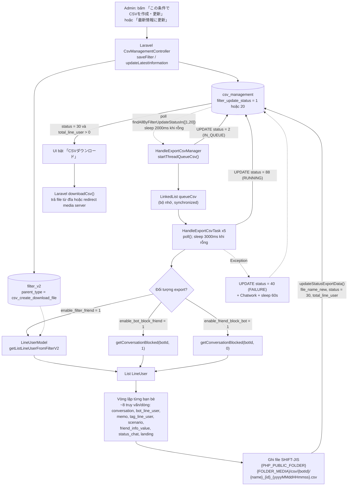
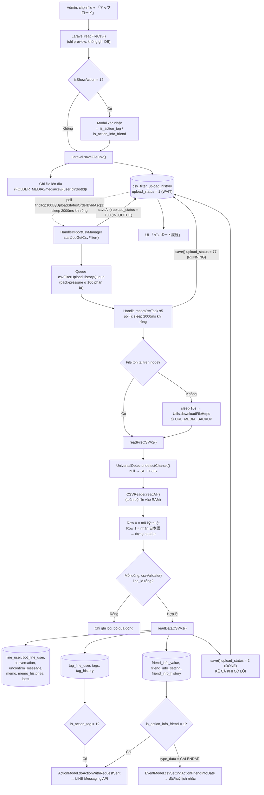

# Job Spec — FA-014 「CSV管理」 (Quản lý CSV)

> Portal: **Admin (LINE OA)** — feature folder `features/admin/csv-management/`
> Nguồn: `src/job/linect-service/src/main/java/sns/line/` (Spring Boot + Java 1.8). Mọi đường dẫn dưới đây tương đối với thư mục đó, trừ khi ghi rõ khác.
> Input: `features/admin/csv-management/ui/ui-spec.md`, `features/admin/csv-management/web/logic-spec.md`, `features/admin/csv-management/web/api-spec.md`.

---

## 1. Tổng quan

### 1.1 Vì sao cần background job

Tính năng 「CSV管理」 có hai thao tác nặng, không thể chạy trong vòng đời một HTTP request của Laravel:

| Luồng | Khối lượng | Lý do phải chạy nền |
|---|---|---|
| **EXPORT** 「エクスポート」 | Duyệt toàn bộ danh sách bạn bè khớp bộ lọc; mỗi bạn bè phát sinh **8–10 truy vấn phụ** (conversation, bot_line_user, memo, tag, scenario, friend_info_value, status_chat, landing…) | Bot có hàng chục nghìn bạn bè → thời gian chạy hàng phút tới hàng chục phút; ghi file ra đĩa |
| **IMPORT** 「インポート」 | Mỗi dòng CSV ghi/cập nhật `line_user`, `conversation`, `memo`, `tag_line_user`, `friend_info_value`… và có thể **kích hoạt action gửi tin nhắn LINE** | Vừa nặng I/O DB, vừa gọi API LINE bên ngoài |

Laravel do đó chỉ ghi **định nghĩa công việc** vào bảng và đặt cột trạng thái; Spring Boot poll bảng đó và thực thi.

### 1.2 Kiểu giao tiếp — Database Polling

Hệ thống **không dùng message broker**. Cơ chế duy nhất là **hàng đợi trên bảng MySQL**:

1. Laravel `INSERT` / `UPDATE` bản ghi vào bảng hàng đợi, đặt cột trạng thái = giá trị "chờ xử lý".
2. Spring Boot chạy `while(true)` trong `ExecutorService` (`Executors.newCachedThreadPool()` — `AppMain.java:197`), truy vấn bảng theo cột trạng thái.
3. Tìm thấy bản ghi → chuyển trạng thái sang "đã vào queue" → đẩy vào `LinkedList`/`Queue` trong bộ nhớ.
4. Nhóm worker thread `poll()` queue, xử lý, cập nhật trạng thái cuối cùng.

Mỗi luồng gồm **2 lớp**: một *Manager* (producer — poll DB) và một *Task* (consumer — xử lý), theo mô hình producer/consumer nội bộ tiến trình.

Tin cậy: **Cao** (đọc trực tiếp source).

### 1.3 Feature flags liên quan

| Flag | Khai báo | Đọc từ | Bật task manager | Mặc định trong repo |
|---|---|---|---|---|
| `ENABLE_HANDLE_EXPORT_CSV` | `ConfigFile.java:109` | `ConfigFile.java:269` (`config.properties`) | `AppMain.java:237-239` → `startHandleExportCsvManager()` (`AppMain.java:827-829`) | `config.properties:35` = `0` |
| `ENABLE_HANDLE_IMPORT_CSV` | `ConfigFile.java:110` | `ConfigFile.java:270` | `AppMain.java:240-242` → `startHandleImportCsvManager()` (`AppMain.java:835-837`) | `config.properties:36` = `0` |

Cả hai đọc bằng `Integer.parseInt(prop.getProperty(..., "0")) > 0` — bật khi giá trị `> 0`. Khi bật, `ConfigFile.java:349-354` ghi log `Config enable: ENABLE_HANDLE_EXPORT_CSV` / `..._IMPORT_CSV` lúc khởi động.

> ⚠ File `config.properties` nằm trong repo là bản **môi trường dev** (cả hai flag = `0`). Giá trị trên production không có trong repo. Tin cậy về flag: **Cao**; về việc production có bật hay không: **Thấp**.

### 1.4 Các manager CSV khác — KHÔNG thuộc FA-014

Thư mục `threads/csv/` còn chứa 2 luồng của tính năng khác, liệt kê để tránh nhầm:

| Class | Flag | Thuộc tính năng |
|---|---|---|
| `HandleExportCsvChat11Manager` / `...Task` | `ENABLE_EXPORT_CSV_CHAT11` (`AppMain.java:246-248`) | Export CSV lịch sử chat 1:1 (bảng `history_export_csv_chat11`) |
| `HandleExportSalonCalendarManager` / `...Task` | `ENABLE_HANDLE_EXPORT_SALON_CALENDAR` (`AppMain.java:243-245`) | Export CSV lịch salon (bảng `calendar_salon_download_csv_sync`) |

---

## 2. Queue Tables

### 2.1 `csv_management` — hàng đợi EXPORT

**Entity JPA:** `models/linedb/entities/CsvManagement.java` — `@Table(name = "csv_management")` (`:10-11`).
**Repository:** `models/linedb/repository/CsvManagementRepository.java`.

#### State machine — cột `filter_update_status`

Hằng số: `CsvManagement.java:13-18`.

| Giá trị | Hằng Java | Ý nghĩa | Ai ghi | Vị trí ghi |
|---|---|---|---|---|
| `1` | `STATUS_NEW` | Định nghĩa export mới, chờ job | **Laravel** `saveFilter()` (nhánh create) | `CsvManagementController.php:565` |
| `20` | `STATUS_RELOAD` | Cần build lại (sửa định nghĩa hoặc bấm 「最新情報に更新」) | **Laravel** `saveFilter()` (edit) / `updateLatestInformation()` | `CsvManagementController.php:522`, `:949` |
| `2` | `STATUS_IN_QUEUE` | Đã nạp vào queue trong bộ nhớ của job | **Job** — `HandleExportCsvManager.addToQueue()` | `threads/csv/HandleExportCsvManager.java:66-67` |
| `88` | `STATUS_RUNNING` | Worker đang sinh file | **Job** — `HandleExportCsvTask.startExport()` | `threads/csv/HandleExportCsvTask.java:70-71` |
| `30` | `STATUS_DONE` | Hoàn tất, `file_name_new` + `total_line_user` đã ghi | **Job** — cuối `startExport()` | `HandleExportCsvTask.java:270-272` |
| `40` | `STATUS_FAILURE` | Exception khi xử lý | **Job** — `catch` trong `run()` | `HandleExportCsvTask.java:56-57` |
| `10` | *(không có hằng Java)* | Nhánh cũ 「最新情報」 của Laravel command | Laravel `HandleUpdateLatestInformationCsv` | — |
| `99` | *(không có hằng Java)* | Lỗi ở nhánh Laravel command | Laravel `HandleUpdateLatestInformationCsv` | — |

> Giá trị `10` và `99` **không tồn tại** trong code Java — Spring Boot không đọc, không ghi, và cũng **không poll** chúng. Bản ghi rơi vào `10`/`99` sẽ bị job bỏ quên vĩnh viễn. Tin cậy: **Cao**.

Sơ đồ chuyển trạng thái:

```
Laravel: create ──▶ 1 ─┐
Laravel: edit / 最新情報に更新 ──▶ 20 ─┤
                                       ├──▶ 2 (IN_QUEUE) ──▶ 88 (RUNNING) ──┬──▶ 30 (DONE)
Job restart: nạp lại 2, 88 ────────────┘                                     └──▶ 40 (FAILURE)
```

#### Điều kiện & tần suất poll

| Thời điểm | Truy vấn | Tần suất |
|---|---|---|
| Khởi động (1 lần) | `findAllByFilterUpdateStatusIn([STATUS_IN_QUEUE(2), STATUS_RUNNING(88)])` — khôi phục việc dở dang sau restart | 1 lần, `HandleExportCsvManager.java:34` |
| Vòng lặp chính | `findAllByFilterUpdateStatusIn([STATUS_NEW(1), STATUS_RELOAD(20)])` | Liên tục; **`Thread.sleep(2000)`** chỉ khi kết quả rỗng (`HandleExportCsvManager.java:45-50`) |
| Worker lấy việc | `queueCsv.poll()` (bộ nhớ) | **`sleep(3000)`** khi queue rỗng (`HandleExportCsvTask.java:52`) |
| Sau exception (producer) | — | **`sleep(60000)`** (`HandleExportCsvManager.java:55`) |
| Sau exception (worker) | — | **`sleep(60000)`** (`HandleExportCsvTask.java:61`) |

> ⚠ Truy vấn **không lọc `bot_id`** và **không có `ORDER BY`** — job xử lý toàn cục mọi bot theo thứ tự MySQL trả về. Tin cậy: **Cao**.
> ⚠ Vì query không rỗng thì **không sleep**, khi có nhiều bản ghi chờ, producer quay vòng liên tục không nghỉ.

### 2.2 `csv_filter_upload_history` — hàng đợi IMPORT

**Entity JPA:** `models/linedb/entities/CsvFilterUploadHistory.java` — `@Table(name = "csv_filter_upload_history")` (`:8-9`).
**Repository:** `models/linedb/repository/CsvFilterUploadHistoryRepository.java`.

#### State machine — cột `upload_status`

Hằng số: `CsvFilterUploadHistory.java:11-14`.

| Giá trị | Hằng Java | Ý nghĩa | Ai ghi | Vị trí ghi |
|---|---|---|---|---|
| `1` | `STATUS_WAIT` | Mới upload, chờ job (DEFAULT của cột — Laravel không truyền) | **Laravel** `saveFileCsv()` | `CsvManagementController.php:911-918` |
| `100` | `STATUS_IN_QUEUE` | Đã nạp vào queue bộ nhớ | **Job** — `HandleImportCsvManager.addToQueue()` | `threads/csv/HandleImportCsvManager.java:63-65` |
| `77` | `STATUS_RUNNING` | Worker đang đọc file & ghi dữ liệu | **Job** — `HandleImportCsvTask.startImport()` | `threads/csv/HandleImportCsvTask.java:67-68` |
| `2` | `STATUS_DONE` | Kết thúc xử lý | **Job** — 3 nhánh kết thúc | `HandleImportCsvTask.java:79-80`, `:99-100` |

⚠ **Hai điểm khác biệt quan trọng so với giả định trong `logic-spec.md` mục 8.2:**

1. **Không có trạng thái lỗi.** Trong code Java **không tồn tại giá trị `103`** (grep toàn bộ `threads/csv/` không có kết quả). Mọi kết thúc — kể cả khi file không tồn tại, hoặc `readFileCSVV2()` ném exception và bị nuốt ở `catch` (`HandleImportCsvTask.java:666-668`) — đều đặt `upload_status = 2 (DONE)`. Giá trị `103` chỉ tồn tại ở Laravel command `HandleImportCsv.php:130`.
2. **Job không ghi `message_error`.** Grep toàn bộ `src/job/.../sns/line/` không tìm thấy bất kỳ `setMessageError(...)` nào. Cột `csv_filter_upload_history.message_error` **không được Spring Boot đụng tới**; mọi lỗi chỉ đi vào log4j và Chatwork. Trên UI, cột lỗi của 「インポート履歴」 vì thế luôn rỗng khi chạy bằng job Java.

Tin cậy cho cả hai điểm: **Cao** (xác nhận bằng grep phủ toàn bộ cây source Java).

Sơ đồ chuyển trạng thái:

```
Laravel: saveFileCsv ──▶ 1 (WAIT) ──▶ 100 (IN_QUEUE) ──▶ 77 (RUNNING) ──▶ 2 (DONE, kể cả khi lỗi)
Job restart: nạp lại 100, 77 ──────────────────────────┘
```

Ngoài ra entity còn 2 hằng cờ hành động (`CsvFilterUploadHistory.java:16-17`):

| Hằng | Giá trị | Dùng cho |
|---|---|---|
| `ACTION_NO` | `0` | `is_action_tag` / `is_action_info_friend` = 0 → chỉ ghi dữ liệu |
| `ACTION_YES` | `1` | → **chạy action** gắn với tag / 友だち情報 sau khi ghi |

#### Điều kiện & tần suất poll

| Thời điểm | Truy vấn | Tần suất |
|---|---|---|
| Khởi động (1 lần) | `findAllByUploadStatusInOrderByIdAsc([STATUS_IN_QUEUE(100), STATUS_RUNNING(77)])` | 1 lần, `HandleImportCsvManager.java:30` |
| Vòng lặp chính | `findTop100ByUploadStatusOrderByIdAsc(STATUS_WAIT(1))` — tối đa 100 bản ghi, sắp theo `id ASC` | **`sleep(2000)`** khi không có bản ghi mới (`HandleImportCsvManager.java:47-52`) |
| Back-pressure | Nếu queue bộ nhớ `> 100` phần tử → **`sleep(1000)`** và bỏ qua vòng này | `HandleImportCsvManager.java:43-46` |
| Worker lấy việc | `queueCsv.poll()` | **`sleep(2000)`** khi rỗng (`HandleImportCsvTask.java:55`) |
| Sau exception | — | **`sleep(1000)`** (producer, `:55`) / **`sleep(60000)`** (worker, `:60`) |

> ⚠ Cũng **không lọc `bot_id`** — xử lý toàn cục, FIFO theo `id`. Tin cậy: **Cao**.

---

## 3. Task Managers

### 3.1 `HandleExportCsvManager` — `threads/csv/HandleExportCsvManager.java` (73 dòng)

| Thuộc tính | Giá trị | Vị trí |
|---|---|---|
| Kiểu | `implements Runnable` | `:13` |
| Khởi tạo bởi | `AppMain.startHandleExportCsvManager()` → `getExecutorService().submit(new HandleExportCsvManager())` | `AppMain.java:827-829` |
| Feature flag | `ConfigFile.ENABLE_HANDLE_EXPORT_CSV` | `AppMain.java:237` |
| Queue bộ nhớ | `LinkedList<CsvManagement> queueCsv` — chia sẻ giữa producer và worker, đồng bộ bằng `synchronized (queueCsv)` | `:15`, `:68`, `HandleExportCsvTask.java:45` |
| Số worker thread | **`numberThread = 5`** → 5 instance `HandleExportCsvTask` | `:16`, `:26-28` |
| Thread pool | `AppMain.getInstance().getExecutorService()` = `Executors.newCachedThreadPool()` | `AppMain.java:197` |
| Producer thread | 1 lambda riêng chạy trong cùng pool (`startThreadQueueCsv()`) | `:31-62` |
| Dừng êm | Kiểm tra `AppMain.getInstance().isPrepareStop()` mỗi vòng → `break` | `:41-44` |

Luồng `run()`:
```
run()  ─▶ startThreadQueueCsv()           // 1 thread producer
       └─▶ for i = 1..5: execute(new HandleExportCsvTask(i, queueCsv))   // 5 worker
```

`addToQueue()` (`:64-72`): với mỗi bản ghi lấy được → set `STATUS_IN_QUEUE (2)` → `updateFilterUpdateStatus(2, id)` (UPDATE 1 dòng) → `synchronized` add vào `queueCsv`.

### 3.2 `HandleExportCsvTask` — `threads/csv/HandleExportCsvTask.java` (548 dòng)

| Thuộc tính | Giá trị | Vị trí |
|---|---|---|
| Kiểu | `implements Runnable` | `:24` |
| Logger riêng theo thread | `LogManager.getLogger("HandleExportCsvTask-" + threadId)` | `:32` |
| Vòng lặp | `while(true)` → `queueCsv.poll()` → `startExport(csv)`; rỗng → `sleep(3000)` | `:38-53` |
| Bắt lỗi | `catch (Exception)` → set `STATUS_FAILURE (40)` cho bản ghi đang xử lý + Chatwork + `sleep(60000)` | `:54-61` |
| `finally` | `closeWrite()` — đóng `BufferedWriter`/`OutputStreamWriter` | `:62-64` |
| ⚠ Trạng thái | `bw` / `fw` là **field của instance** (`:27-28`), không phải biến cục bộ | `:27-28` |

### 3.3 `HandleImportCsvManager` — `threads/csv/HandleImportCsvManager.java` (78 dòng)

| Thuộc tính | Giá trị | Vị trí |
|---|---|---|
| Kiểu | `implements Runnable` | `:13` |
| Khởi tạo bởi | `AppMain.startHandleImportCsvManager()` | `AppMain.java:835-837` |
| Feature flag | `ConfigFile.ENABLE_HANDLE_IMPORT_CSV` | `AppMain.java:240` |
| Queue bộ nhớ | `Queue<CsvFilterUploadHistory> csvFilterUploadHistoryQueue = new LinkedList<>()` | `:16` |
| Số worker thread | **`numberThread = 5`** | `:17`, `:23-25` |
| Back-pressure | Ngưỡng **100** phần tử trong queue | `:43-46` |
| Dừng êm | `isPrepareStop()` → `return` | `:35-38` |

`addToQueue()` (`:61-69`): set `STATUS_IN_QUEUE (100)` cho **cả lô**, rồi `saveAll(listCsv)` (một lần) → add cả lô vào queue.

> ⚠ `saveAll()` là `save()` toàn entity (không phải native UPDATE 1 cột như luồng export) → ghi đè **mọi** cột của bản ghi bằng giá trị đang giữ trong bộ nhớ, kể cả `message_error`, `data`, `path_file`. Nếu Laravel sửa bản ghi giữa lúc job đang giữ nó, thay đổi đó bị mất. Tin cậy: **Cao**.

### 3.4 `HandleImportCsvTask` — `threads/csv/HandleImportCsvTask.java` (709 dòng)

| Thuộc tính | Giá trị | Vị trí |
|---|---|---|
| Vòng lặp | `while(true)` → `getCsvFilterUploadHistory()` (poll queue) → `startImport(csv)`; rỗng → `sleep(2000)` | `:43-62` |
| Bắt lỗi | `catch (Exception)` → log + Chatwork + `sleep(60000)`; **không đổi trạng thái bản ghi** | `:57-61` |
| ⚠ Trạng thái | `private CsvFilterUploadHistory csv` là **field của instance** (`:30`) và được dùng trong `updateFriendInfoDefaultNew()` (`:477`) | `:30`, `:477` |
| Thư viện | `com.opencsv.CSVReader` (đọc CSV), `org.mozilla.universalchardet.UniversalDetector` (đoán encoding) | `:3`, `:6` |

---

## 4. Processing Chain

### 4.1 EXPORT

```
[Laravel] saveFilter() / updateLatestInformation()
      │  UPDATE csv_management SET filter_update_status = 1|20, date_of_last_change_of_condition = now()
      ▼
[Job] HandleExportCsvManager.startThreadQueueCsv()            ← poll mỗi ≥2000ms
      │  findAllByFilterUpdateStatusIn([1, 20])
      │  addToQueue(): UPDATE filter_update_status = 2 (IN_QUEUE) + push LinkedList
      ▼
[Job] HandleExportCsvTask #1..#5 — queueCsv.poll()
      │
      ├─ (1) UPDATE filter_update_status = 88 (RUNNING)                    HandleExportCsvTask.java:70-71
      ├─ (2) Sinh tên file + xoá file cũ (Utils.deleteFile)                :73-80
      ├─ (3) Lấy danh sách tag cần xuất: TagRepository
      │      .findAllByIdInAndDeletedAtIsNull(csv.getExportTagList())      :86
      ├─ (4) Chọn tập LINE user theo cờ đối tượng                          :89-95
      │        enable_filter_friend = 1 → LineUserModel.getListLineUserFromFilterV2(
      │                                      FILTER_TYPE_CSV_CREATE_DOWNLOAD_FILE, csvId, botId)
      │        enable_bot_block_friend = 1 → getConversationBlocked(botId, 1)
      │        enable_friend_block_bot = 1 → getConversationBlocked(botId, 0)
      ├─ (5) Dựng 2 dòng header (mã kỹ thuật + nhãn 日本語)                 :166 → headings() :371-420
      ├─ (6) openWrite(path, "SHIFT-JIS") + ghi header                     :165-167
      ├─ (7) Lặp từng LineUser → 8~10 truy vấn phụ → 1 dòng CSV            :169-267
      └─ (8) UPDATE csv_management SET file_name_new, filter_update_status = 30, total_line_user   :269-272
      ▼
[Laravel] downloadCsv() đọc file_name_new và trả file cho người dùng
```

Chi tiết bước (7) — với **mỗi** LINE user (`HandleExportCsvTask.java:169-267`):

| Truy vấn | Service / Repository | Dùng cho cột |
|---|---|---|
| `conversationFindFirstByBotIdAndTbLineUserId` | `CrossModelService` — `:176` | `message_status`, `reciprocal_status`; **null → bỏ qua dòng** (`:177-180`) |
| `botLineUserFindFirstByLineUserIdAndBotId` | `:181` | 「友だち追加日」; **null → bỏ qua dòng** (`:182-185`) |
| `memoFindAllByConversationId` | `:188` | 「個別メモ」 (nhiều memo → nhiều cột cuối dòng) |
| `lastTimeReceiveConversationFindFirstByConversationId` | `:199-201` | 「最終メッセージ受信日時」 (ghi đè giá trị lấy từ `conversation`) |
| `statusChatFindById` | `:207` (chỉ khi `show_reciprocal_status = 1`) | 「対応マーク」 |
| `detailLandingClickFindFirstByBotIdAndLineIdAndAction(..., 2)` + `findLandingQRById` | `:216-219` (chỉ khi `show_qr_code = 1`) | 「流入経路」 |
| `findAllByLineUserId` (tag_line_user) | `:223` | Các cột `タグ_{id}` (1/0) |
| `findFirstByBotIdAndLineUserIdAndIsFollowingOrderByUpdatedAtDesc` + `findScenarioById` | `:228-235` | 「配信中ステップ」 (`停止中` nếu không following — `:441`) |
| `findListFriendInfo(botId, lineUserId)` | `:238` | Các cột `友だち情報_{id}` |

> ⚠ **Hiệu năng**: ~8 truy vấn/bạn bè, không batch (trừ `findListFriendInfo` đã gom sẵn thành `HashMap` — `:239-242`). Với 50.000 bạn bè ≈ 400.000 truy vấn cho **một** lần export.
> ⚠ Toàn bộ danh sách `List<LineUser>` được nạp vào RAM một lần (`:88-95`).

### 4.2 IMPORT

```
[Laravel] saveFileCsv() → upload file + INSERT csv_filter_upload_history (upload_status DEFAULT 1)
      ▼
[Job] HandleImportCsvManager.startJobGetCsvFilter()            ← poll mỗi ≥2000ms
      │  findTop100ByUploadStatusOrderByIdAsc(1)
      │  addToQueue(): saveAll() với upload_status = 100 (IN_QUEUE)
      ▼
[Job] HandleImportCsvTask #1..#5 — queueCsv.poll()
      │
      ├─ (1) save() upload_status = 77 (RUNNING)                          HandleImportCsvTask.java:67-68
      ├─ (2) path_file rỗng?                                              :70
      │        CÓ  → nhánh V1 đã bỏ ("no support version 1") → DONE       :73-80
      │        KHÔNG → nhánh V2 (đang dùng)                               :81
      ├─ (3) Mở file tại ConfigFile.PHP_PUBLIC_FOLDER + path_file          :82-83
      │        file không tồn tại → sleep(10s) → tải lại từ
      │        ConfigFile.URL_MEDIA_BACKUP + path_file (Utils.downloadFileHttps)   :84-92
      ├─ (4) readFileCSVV2()                                               :94 → :507-672
      │        ├─ UniversalDetector.detectCharset(); null → "SHIFT-JIS"   :516-520
      │        ├─ CSVReader.readAll() — nạp TOÀN BỘ file vào RAM          :521-522
      │        ├─ row 0 = mã kỹ thuật, row 1 = nhãn 日本語 → dựng header   :524-638
      │        └─ mỗi dòng dữ liệu: csvValidate() → readDataCSVV1()       :639-663
      ├─ (5) readDataCSVV1() ghi DB + (tuỳ cờ) chạy action                :104-458
      └─ (6) save() upload_status = 2 (DONE) — kể cả khi có lỗi           :99-100
```

#### Dựng header ở bước (4) — `readFileCSVV2()` (`:523-638`)

Thứ tự ghép cột **cố định**, khớp đúng thứ tự mà `HandleExportCsvTask.headings()` sinh ra:

| Nhóm | Nguồn nhận diện | Khoá nội bộ |
|---|---|---|
| 2 cột đầu (luôn có) | vị trí 0, 1 | `line_id`, `name` |
| Cột cờ `show_*` | nhãn 日本語 ở row 1 | 「ステータスメッセージ」→`status_message`, 「友だち追加日」→`followed_at`, 「対応マーク」→`id_status`, 「最終メッセージ受信日時」→`last_time_message`, 「配信中ステップ」→`is_following`, 「流入経路」→`landing_name` (`:530-555`) |
| Cột tag | row 0 bắt đầu bằng `タグ` → tách id sau `_` | `tag_{id}` (`:557-565`) |
| Thông tin cá nhân mặc định | nhãn 日本語 ở row 1 | 「システム表示名」→`view_name`, 「携帯電話」→`phone_number`, 「メールアドレス」→`email`, 「生年月日」→`birthday`, 「年齢」→`age`, 「都道府県」→`province`, 「郵便番号」→`zip_code`, 「市区町村名」→`district`, 「町名/番地」→`township`, 「建物名・部屋番号」→`building` (`:567-619`) |
| Cột 友だち情報 | row 0 bắt đầu bằng `友だち情報` → tách id sau `_` | `friend_info_setting_{id}` (`:621-629`) |
| Cột dư còn lại | mọi cột sau `header.size()` | gom hết vào `listMemo` → 「個別メモ」 (`:651-654`) |

> ⚠ Cột `landing_name` (「流入経路」) và `followed_at`, `id_status`, `last_time_message`, `is_following` được **đưa vào header nhưng không bao giờ được ghi ngược vào DB** — `readDataCSVV1()` không đọc các khoá này. Chúng chỉ đóng vai trò "giữ chỗ" để căn đúng chỉ số cột. Tin cậy: **Cao**.

#### Ghi dữ liệu ở bước (5) — `readDataCSVV1()` (`:104-458`)

Tìm `line_user` theo `line_id` (`:107`); **không tìm thấy → bỏ qua dòng** (`:108-111`). Tìm `conversation` theo `(bot_id, line_user_id)` (`:113`) — chỉ khi có `conversation` mới ghi khối thông tin cá nhân/memo/trạng thái.

| Nhóm dữ liệu | Bảng ghi | Vị trí |
|---|---|---|
| 「システム表示名」/メール/生年月日/年齢/都道府県/携帯電話 | `line_user` (`save()`) | `:125-189` |
| 携帯電話 (bản sao) | `bot_line_user.phone_number` (`updatePhoneNumberById`) | `:172-176` |
| 郵便番号 / 市区町村名 / 町名番地 / 建物名 | `friend_info_value` với `friend_info_setting_id` = **−7 / −8 / −9 / −10** (`updateFriendInfoDefaultNew`) | `:158-169`, `:475-501` |
| Lịch sử thay đổi thông tin mặc định (id −1..−6) | `friend_info_history` qua `HistoryHelper.recordFriendInfo` | `:192-210`, `:464-473` |
| 「ステータスメッセージ」 | `conversation` (`updateConversationSetting`: `confirm_count`, `status_last_message`, `has_status_0`, `has_status_1`) | `:212-232` |
| Tin chưa đọc | `unconfirm_message` (xoá hết khi `=1`; tạo mới từ tin cuối của bạn bè khi `=0`) | `:234-251` |
| Bộ đếm chưa đọc của bot | `bots.count_user_unconfirm`, `bots.last_time_count_user_confirm` | `:252-253` |
| 「個別メモ」 (các cột dư) | `memo` (title `CSV追加 (…)`, `type = 1`, `position = 1`) + `memo_histories` (`staff_id` = `bot.admin_id`) | `:255-275` |
| Cột `タグ_{id}` = `1` | `tag_line_user` (khôi phục `is_deleted = 0` hoặc tạo mới) + `tag_history` | `:283-313` |
| Cột `タグ_{id}` = `0` | xoá `tag_line_user`, `tags.user_tag_count` giảm 1, ghi `tag_history` | `:314-323` |
| Cột `友だち情報_{id}` có giá trị | `friend_info_value` (INSERT/UPDATE), `friend_info_setting.total_user_has_value`, `friend_info_history` | `:341-428` |
| Cột `友だち情報_{id}` rỗng | XOÁ `friend_info_value`, giảm `total_user_has_value`, ghi `friend_info_history` (`ACTION_CLEAR`) | `:429-450` |

**Ý nghĩa hai cờ `is_action_tag` / `is_action_info_friend`** (đã xác minh trong code — đây là câu hỏi mở của web-analyzer):

| Cờ | `= 1` (`ACTION_YES`) làm gì | Vị trí |
|---|---|---|
| `is_action_tag` | Sau khi gắn tag mới thành công → gọi `ActionModel.doActionWithRequestSent(botId, lineUser, null, tags.getActionId(), …)` với `StartActionInfo(TYPE_ADD_TAG, tagId)` → **chạy action gắn với tag** (thường là gửi tin nhắn LINE, chuyển scenario…). Sau đó `HistoryHelper.updateTagActionCapture()` ghi capture id vào `tag_history`. Nếu tag đã đạt giới hạn → `LineUserModel.checkLimitActionModeAddTag()` | `:298-304`, `:309-311` |
| `is_action_info_friend` | 3 trường hợp: **(a)** 友だち情報 kiểu `TYPE_DATA_SELECT` → tra `friend_info_option_selects` theo giá trị, chạy `actionId` của option (`:382-398`); **(b)** kiểu `TYPE_DATA_POINT` → duyệt `settingValue.settingActions`, khớp giá trị → chạy `actionId` (`:400-419`); **(c)** kiểu `TYPE_DATA_CALENDAR` → `EventModel.csvSettingActionFriendInfoDate(...)` để đặt/huỷ lịch nhắc (`:359-362`, `:375-378`, `:443-447`) | `:359-447` |
| Cả hai `= 0` (`ACTION_NO`) | Chỉ ghi dữ liệu; **không** kích hoạt action, **không** gửi tin nhắn | — |

Ràng buộc chống spam khi chạy action:
- `ACTION_MODE_ONE_TIMES` + `friend_info_value.action > 0` → bỏ qua action (`:390-391`, `:403-404`).
- Chỉ chạy khi bot còn quota gửi: `BotModel.getAvailableSendCount(botId)` — `-1` = không giới hạn, `> 0` = còn quota (`:299-300`, `:421-422`).
- Giá trị `友だち情報` **không đổi** → không update, không action (`:352`).
- `friend_info_setting.type_data` ∈ {4, 5} → **bỏ qua hoàn toàn** cả ghi lẫn xoá (`:342`, `:431`).

Mọi bản ghi lịch sử (`tag_history`, `friend_info_history`) đều mang `StartActionInfo(TriggerStartActionConstants.TYPE_IMPORT_CSV = 19001, csv.getId())` (`values/TriggerStartActionConstants.java:78`) → truy vết được thay đổi nào đến từ lần import nào.

Tin cậy toàn mục 4: **Cao**.

---

## 5. Services & Helpers

| Service / Method | Input | Output | Logic | Bảng đọc / ghi |
|---|---|---|---|---|
| `LineUserModel.getListLineUserFromFilterV2(new Filter(), "csv_create_download_file", csvId, botId, true, true)` — `models/LineUserModel.java:344-348` | `parentFilterId = csv_management.id`, `botId` | `List<LineUser>` | Nạp điều kiện AND/OR từ `filter_v2` theo `(parent_id, parent_type, bot_id, operator)` rồi dựng SQL động JOIN `bot_line_user`. Không có filter nào → fallback `getListLineUserFromFilter()` (lấy toàn bộ bạn bè của bot) | Đọc: `filter_v2`, `line_user`, `bot_line_user` (+ bảng phụ theo loại điều kiện) |
| `HandleExportCsvTask.getConversationBlocked(botId, blockBy)` — `:276-300` | `blockBy = 1` (bot chặn bạn) / `0` (bạn chặn bot) | `List<LineUser>` | `findAllByBotIdAndConversationKindAndIsBlockedAndBlockedByOrderByIdAsc(botId, 0, 1, blockBy)` → gom `tb_line_user_id` theo **lô 10.000** rồi `lineUserFindAllByIdIn()` | Đọc: `conversation`, `line_user` |
| `HandleExportCsvTask.headings(...)` — `:371-420` | Danh sách tag, 友だち情報, cờ `show_*` | 2 dòng header | Dòng 0 = mã kỹ thuật (`タグ_{id}`, `友だち情報_{id}`); dòng 1 = nhãn 日本語 | — |
| `HandleExportCsvTask.convertDataItem(...)` — `:430-512` | `LineUserExport`, cấu hình cột | `List<String>` 1 dòng | Ánh xạ giá trị; 「配信中ステップ」 không following → `停止中`; `message_status` null → `"0"`; 友だち情報 giá trị `"0"` hoặc rỗng → `""` | — |
| `HandleExportCsvTask.convertToStringLine(...)` — `:360-369` | `List<String>` | 1 dòng CSV | Escape `"` → `""`, bọc mọi ô trong `"`, nối bằng `","` | — |
| `HandleExportCsvTask.cleanString(...)` — `:514-518` | Tên export | Tên file an toàn | Space → `_`; xoá `! / @ # $ % ^ & * ( ) , . ? " : { } \| < >` | — |
| `HandleExportCsvTask.getHeaderByKey(...)` — `:520-539` | Khoá cột | Nhãn 日本語 | `message_status`→「ステータスメッセージ」, `note`→「個別メモ」, `date_of_add_friend`→「友だち追加日」, `reciprocal_status`→「対応マーク」, `date_of_last_message_received`→「最終メッセージ受信日時」, `running_step`→「配信中ステップ」, `ar_code_name`→「流入経路」 | — |
| `HandleImportCsvTask.csvValidate(mapItem)` — `:682-688` | 1 dòng đã map | Chuỗi lỗi hoặc rỗng | **Chỉ 1 rule**: `line_id` không rỗng | — |
| `HandleImportCsvTask.updateFriendInfoDefaultNew(...)` — `:475-501` | `lineUser`, `friendInfoSettingId` (−7..−10), `value` | void | Value rỗng → xoá `friend_info_value` + ghi `ACTION_CLEAR`; có value → INSERT/UPDATE + ghi history khi đổi | `friend_info_value`, `friend_info_history` |
| `HandleImportCsvTask.recordDefaultFriendInfoHistoryIfChanged(...)` — `:464-473` | old/new value, `friendInfoId` −1..−6 | void | `HistoryHelper.isValueChanged()` coi `null` ≡ `""`; chọn `ACTION_CLEAR` / `ACTION_CREATE` / `ACTION_UPDATE` | `friend_info_history` |
| `HistoryHelper.recordTagAdd / recordTagRemove / recordFriendInfo / updateTagActionCapture / updateFriendInfoActionCapture` | — | — | Ghi lịch sử thay đổi kèm nguồn kích hoạt | `tag_history`, `friend_info_history` |
| `ActionModel.doActionWithRequestSent(...)` — `models/ActionModel.java:71-84` | `botId`, `lineUser`, `actionId`, `isAvailableToSent`, `StartActionInfo` | `Long` capture id | Uỷ quyền cho `doAction(...)` (`:87`) — thực thi action đã cấu hình (gửi tin nhắn, gắn/gỡ tag, đổi scenario, chuyển rich menu…) | Nhiều bảng; có thể gọi **LINE Messaging API** |
| `BotModel.getAvailableSendCount(botId)` | `botId` | `int` | `-1` = không giới hạn; `> 0` = còn quota gửi | `bots`, bảng đếm tin nhắn |
| `EventModel.csvSettingActionFriendInfoDate(...)` | `botId`, `friendInfoId`, `lineUserId`, giá trị ngày, cờ action, `caseAction` | void | Tạo / cập nhật / xoá lịch nhắc theo 友だち情報 kiểu ngày | Bảng event/step nhắc lịch |
| `Utils.downloadFileHttps(url, path, "csv")` | URL media backup | `boolean` | Tải file import về node hiện tại khi thiếu | Ghi file local |
| `NotifyUtils.sendReportChatwork(clazz, message, throwable, roomId)` — `utils/NotifyUtils.java:77` | — | void | Gửi báo lỗi Chatwork; **no-op** khi `ENABLE_NOTIFY_CHATWORK = false` (`:78`) hoặc `HOST_SNSLINE == https://lme.watermeru.com` (`:80`) | Gọi backend service |

---

## 6. External API Calls

| API | Gọi từ đâu | Khi nào | Ghi chú |
|---|---|---|---|
| **LINE Messaging API** (gián tiếp) | `ActionModel.doActionWithRequestSent()` → `ActionModel.doAction()` → chuỗi gửi tin nhắn | Chỉ trong luồng **IMPORT**, khi `is_action_tag = 1` hoặc `is_action_info_friend = 1` và action cấu hình có bước gửi tin | Có kiểm tra quota `BotModel.getAvailableSendCount()` trước khi chạy. Tin cậy: **Trung bình** (đã xác nhận điểm gọi `doAction`, chưa trace hết chuỗi tới HTTP client LINE) |
| **Chatwork** (qua backend service nội bộ) | `NotifyUtils.sendReportChatwork()` | Mọi exception ở 4 class CSV | Room `316148419` cho export manager/task và import task; room mặc định `291087346` cho `readFileCSVV2()`. Tin cậy: **Cao** |
| **HTTP tải file media backup** | `Utils.downloadFileHttps(ConfigFile.URL_MEDIA_BACKUP + path_file, ...)` | Luồng IMPORT, khi file không có trên node hiện tại | Xác nhận hạ tầng nhiều node dùng chung thư mục media (khớp fallback `URL_SERVER_MEDIA` phía Laravel). Tin cậy: **Cao** |

**Không có** gọi Firebase, S3, hay dịch vụ lưu trữ đám mây nào trong hai luồng CSV — file đọc/ghi trực tiếp trên đĩa local của node.

---

## 7. Data Flow

### 7.1 Luồng EXPORT



### 7.2 Luồng IMPORT



---

## 8. Error Handling

### 8.1 Bảng xử lý lỗi

| Vị trí | Kiểu bắt | Hành động | Trạng thái DB sau lỗi |
|---|---|---|---|
| `HandleExportCsvManager.java:51-59` (producer) | `catch (Exception)` | `NotifyUtils.sendReportChatwork(..., "316148419")` + `LOGGER.error` + `sleep(60000)` | Không đổi |
| `HandleExportCsvTask.java:54-64` (worker) | `catch (Exception)` | Đặt `filter_update_status = 40 (FAILURE)` cho bản ghi đang xử lý + Chatwork room `316148419` + `sleep(60000)`; `finally` → `closeWrite()` | **`40`** |
| `HandleExportCsvTask.openWrite()` `:331-333` | `catch (Exception)` → `return false` | **Nuốt lỗi hoàn toàn**, không log. `bw` vẫn `null` → `writeToFile()` ném `NullPointerException` → nổi lên `run()` → `FAILURE` | `40` (gián tiếp) |
| `HandleExportCsvTask.writeToFile()` `:353-357` | `catch (IOException)` | `System.out.println` + `printStackTrace()` + `return false` — **giá trị trả về bị bỏ qua** ở nơi gọi → dòng mất im lặng, file vẫn được đánh dấu `DONE` | `30` (sai) |
| `HandleImportCsvManager.java:53-56` (producer) | `catch (Exception)` | `LOGGER.error` + `sleep(1000)`; **không** gửi Chatwork | Không đổi |
| `HandleImportCsvTask.java:57-61` (worker) | `catch (Exception)` | Chatwork room `316148419` + `sleep(60000)`; **không** đổi trạng thái bản ghi → bản ghi kẹt ở `77 (RUNNING)` tới lần restart job | **`77`** (kẹt) |
| `HandleImportCsvTask.readFileCSVV2()` `:666-671` | `catch (Exception)` | Chatwork room mặc định `291087346` + log; **rồi vẫn** đặt `upload_status = 2 (DONE)` ở `:99-100` | **`2`** (báo thành công dù lỗi) |
| `HandleImportCsvTask.readDataCSVV1()` `:454-457` | `catch (Exception)` | Chỉ `LOGGER.error` (comment trong code ghi rõ "sợ nhiều log"); dòng lỗi bị bỏ qua, các dòng sau vẫn chạy | Không đổi |

### 8.2 Cách ghi `message_error` — **KHÔNG có**

Trái với giả định trong `logic-spec.md` mục 8.2:

- Grep `setMessageError` / `messageError` trên toàn bộ `src/job/linect-service/src/main/java/sns/line/` → **không có** kết quả nào liên quan `CsvFilterUploadHistory`.
- Entity có getter/setter cho `messageError` (`CsvFilterUploadHistory.java:47-48`) nhưng **không nơi nào gọi setter**.

Các thông báo lỗi **chỉ tồn tại trong log**, không đến được người dùng:

| Thông điệp | Nơi sinh | Điều kiện |
|---|---|---|
| `有効な: ユーザーID ではありません。` | `HandleImportCsvTask.java:685` → log ở `:659-660` với tiền tố `Row: {index} - ` | Cột 「ユーザーID」 rỗng |
| `Row: {index} error count($header) != count($row) {csv}` | `:641-642` | Dòng có **ít cột hơn** header → `continue`, **bỏ qua dòng đó** (khác Laravel preview: Laravel dừng cả file) |
| `#readDataCSVV1 => empty LineUser: {line_id}` | `:109` | `line_id` không tồn tại trong bảng `line_user` |
| `#readDataCSVV1 item Exception: Id {csvId} - {line_id} - {msg}` | `:456` | Exception khi ghi 1 dòng |
| `#readFileCSVV2 Exception: {msg}` | `:667` | Lỗi đọc/parse toàn file |
| `#startImport copy 1 download false: {path} - url {url}` | `:90` | Tải file backup thất bại |
| `Not found conversation: csv {info} - lineId {id}` / `Not found botLineUser: ...` | `HandleExportCsvTask.java:178`, `:183` | Bạn bè không có conversation/bot_line_user → **bỏ khỏi file export** nhưng vẫn tính vào `total_line_user` (`:271` dùng `list.size()`) |

### 8.3 Hệ quả người dùng nhìn thấy

| Tình huống lỗi | Người dùng thấy trên UI | Nguyên nhân |
|---|---|---|
| Export lỗi (status `40`) | Badge 「作成中」 **vĩnh viễn**, không có thông báo lỗi, **và nút 「最新情報に更新」 cũng bị disabled** → **không có đường retry từ UI** | Blade chỉ phân biệt `30` và "khác `30`"; ở nhánh `v-else` **cả hai** nút đều disabled (`csv_management.blade.php:314-317`) |
| Import lỗi (file hỏng, encoding sai, header sai) | Bản ghi lịch sử hiển thị như **đã xong** | `upload_status` luôn về `2` |
| Import kẹt (exception ở `run()`) | Bản ghi ở `77` mãi tới khi job restart (lúc đó được nạp lại và chạy **lần hai** → nguy cơ ghi trùng memo/action) | `HandleImportCsvTask.java:57-61` không set trạng thái |

> ⚠ **Định lượng tác động thật (bổ sung V-04)** — đếm từ `db/data/csv_management.sql` (208 bản ghi):
> **18 bản ghi ở `40`** (lỗi thật do job Java ghi — `HandleExportCsvTask.java:56`) + **4 bản ghi ở `10`** (mồ côi, không tác nhân nào ghi nữa — xem §10 mục 6) = **22/208 = 10,6%** định nghĩa export đang hiển thị 「作成中」 **sai sự thật**.
> Vì nhánh `v-else` của blade disabled **cả nút 「最新情報に更新」**, người dùng **không có bất kỳ cách nào từ UI** để yêu cầu job chạy lại → **bế tắc chức năng**, không chỉ là hiển thị mập mờ. Tin cậy: **Cao**.
> Đề xuất vận hành: 4 bản ghi `10` có thể giải phóng bằng `UPDATE csv_management SET filter_update_status = 20 WHERE filter_update_status = 10` để Spring Boot nhặt lại.

Tin cậy toàn mục 8: **Cao**.

---

## 9. Liên kết với Web App

| # | Hành động trên web (Admin) | Laravel ghi gì | Task manager xử lý | Job ghi ngược lại gì | Người dùng thấy gì |
|---|---|---|---|---|---|
| 1 | SCR-CSV-03 「この条件でCSVを作成・更新」 (tạo mới) | `INSERT csv_management` với `filter_update_status = 1`, `date_of_last_change_of_condition = now()`, `total_line_user` = số client khai; `INSERT filter_v2` (`parent_type = csv_create_download_file`) | `HandleExportCsvManager` → `HandleExportCsvTask` | `filter_update_status`: `1` → `2` → `88` → `30`/`40`; `file_name_new`; `total_line_user` (**tính lại, ghi đè số của client**) | Dòng mới trong SCR-CSV-01 với badge 「作成中」; sau khi job xong → nút 「CSVダウンロード」 bật |
| 2 | SCR-CSV-04 sửa định nghĩa rồi lưu | `UPDATE csv_management SET filter_update_status = 20, date_of_last_change_of_condition = now(), line_user_ids = NULL`; ghi lại `filter_v2` | Cùng trên | Cùng trên; **xoá file cũ** theo `file_name_new` trước khi sinh file mới (`HandleExportCsvTask.java:77-80`) | Badge 「作成中」 trở lại, sau đó cập nhật 対象人数 mới |
| 3 | SCR-CSV-01 nút 「最新情報に更新」 | `UPDATE csv_management SET filter_update_status = 20, date_of_last_change_of_condition = now()` (gọi từ Web Worker) | Cùng trên | Cùng trên | 対象人数 và file được làm mới |
| 4 | SCR-CSV-01 nút 「CSVダウンロード」 | Chỉ **đọc** `file_name_new` / `file_name` | *(không có job)* | — | Tải file `.csv` mã hoá SHIFT-JIS |
| 5 | SCR-CSV-01 xoá định nghĩa | `DELETE csv_management` + `DELETE filter_v2` | *(không có job)* | — | ⚠ File `.csv` trên đĩa **không bị xoá** — job chỉ xoá file cũ khi build lại (mục 2 ở trên) |
| 6 | SCR-CSV-02 chọn file → 「アップロード」 (không có cột tag/友だち情報) | Upload file + `INSERT csv_filter_upload_history` với `upload_status` DEFAULT `1`, `is_action_tag = 0`, `is_action_info_friend = 0` | `HandleImportCsvManager` → `HandleImportCsvTask` | `upload_status`: `1` → `100` → `77` → `2`; ghi dữ liệu bạn bè | Dòng mới trong 「インポート履歴」; dữ liệu bạn bè cập nhật ở màn 友だちリスト |
| 7 | SCR-CSV-02 upload + modal xác nhận **chọn chạy action** | Như trên nhưng `is_action_tag = 1` và/hoặc `is_action_info_friend = 1` | Cùng trên | Cùng trên **+ chạy action** của tag / option 友だち情報 → có thể **gửi tin nhắn LINE hàng loạt** cho bạn bè trong file | Bạn bè nhận tin nhắn; `tag_history` / `friend_info_history` ghi nhận `TYPE_IMPORT_CSV (19001)` |
| 8 | SCR-CSV-02 upload file Shift-JIS hoặc UTF-8 | Không quan tâm encoding khi lưu | `HandleImportCsvTask` | `UniversalDetector` tự nhận encoding, fallback `SHIFT-JIS` | Import chạy đúng với cả hai encoding |
| 9 | Cột `line_user_ids` | Laravel luôn ghi `NULL` | — | **Job cũng không ghi** — `updateStatusExportData()` chỉ đụng `file_name_new`, `filter_update_status`, `total_line_user` (`CsvManagementRepository.java:26`) | Cột chết hoàn toàn → **giải đáp câu hỏi mở trong `logic-spec.md` mục 11**. Tin cậy: **Cao** |

### 9.1 Đường dẫn file — đối chiếu Java ↔ PHP

| | Java (Spring Boot) | PHP (Laravel) |
|---|---|---|
| Gốc | `ConfigFile.PHP_PUBLIC_FOLDER` (`config.properties:15` = `/var/www/html/lme_line/sns-line/public`; mặc định `ConfigFile.java:65` = `/var/www/html/snsline/public`) | `public_path()` |
| Thư mục media | `ConfigFile.FOLDER_MEDIA` (`config.properties:19` = `/msg_template`; mặc định `ConfigFile.java:67` = `/msg_template`) | `env('FOLDER_MEDIA')` |
| Đường dẫn export | `{FOLDER_MEDIA}/csv/{botId}/{cleanName}_{id}_{yyyyMMddHHmmss}.csv` — `HandleExportCsvTask.java:74-76` | `env('FOLDER_MEDIA') . 'csv/' . {bot_id} . '/' . {fileName}` |
| Ghi vào cột | `file_name_new` | `file_name_new` |
| Đường dẫn import | Đọc `PHP_PUBLIC_FOLDER + path_file` — `HandleImportCsvTask.java:82` | Ghi `env('FOLDER_MEDIA') . 'media/csv/{userId}/{botId}/'` |
| Fallback khi thiếu file | `ConfigFile.URL_MEDIA_BACKUP + path_file` (tải HTTP về) | `env('URL_SERVER_MEDIA')` (redirect trình duyệt) |

> ⚠ **Khác biệt với `logic-spec.md`**: định dạng timestamp trong tên file là **`yyyyMMddHHmmss`** (14 chữ số) chứ không phải `Ymd` (8 chữ số) như bản Laravel command. Java dùng `DateTimeUtils.getCurrentDate("yyyyMMddHHmmss")` (`HandleExportCsvTask.java:74`). Tin cậy: **Cao**.
> ⚠ **Bản Java KHÔNG có logic chia file / nén ZIP**. Grep `zip` trong `HandleExportCsvTask.java` → 0 kết quả. Dù dữ liệu lớn tới đâu, job Java luôn tạo **đúng 1 file `.csv`**. Cơ chế ZIP chỉ có ở Laravel command `HandleExportCsv.php:360-380`. Tin cậy: **Cao**.
> ⚠ Chuỗi `.replaceAll("null", "")` ở `convertToStringLine()` (`:368`) áp dụng lên **toàn dòng** → mọi chuỗi con `null` trong dữ liệu thật (vd tên bạn bè chứa "null") cũng bị xoá.

---

## 10. Điểm chưa rõ / cần điều tra

| # | Vấn đề | Mức tin cậy hiện tại | Cách xác minh |
|---|---|---|---|
| 1 | Production có bật `ENABLE_HANDLE_EXPORT_CSV` / `ENABLE_HANDLE_IMPORT_CSV` không, hay vẫn chạy Laravel command `handle:export_csv` / `handle:import_csv`? File `config.properties` trong repo là bản dev (cả hai = `0`) | **Thấp** | Xem `config.properties` trên server production; hoặc log khởi động (`Config enable: ENABLE_HANDLE_EXPORT_CSV`) |
| 2 | Nếu **cả hai** (Laravel command + Spring Boot) cùng chạy → cùng poll một bảng, không có lock → nguy cơ 2 tiến trình xử lý cùng bản ghi | **Trung bình** (suy luận: cả hai đều poll `status IN (1,20)` mà không có khoá) | Đối chiếu cấu hình supervisor / systemd của cả hai service |
| 3 | Không có **cơ chế khoá phân tán**: nếu chạy nhiều instance Spring Boot, hai instance có thể cùng `findAllByFilterUpdateStatusIn([1,20])` và cùng đẩy một bản ghi vào queue trước khi `UPDATE status = 2` kịp có hiệu lực | **Trung bình** | Kiểm tra số instance job đang chạy trên production |
| 4 | **Re-enqueue khi đang chạy**: Laravel `updateLatestInformation()` đặt `20` mà không kiểm tra bản ghi có đang ở `88 (RUNNING)`; producer sẽ nhặt lại ngay → hai worker cùng export một định nghĩa, mỗi worker ghi một `file_name_new` khác nhau, kết quả cuối phụ thuộc thread nào kết thúc sau | **Cao** (đọc code hai phía) | — (đã xác nhận là lỗ hổng thiết kế) |
| 5 | `HandleExportCsvTask` dùng field instance `bw`/`fw` (`:27-28`) — an toàn vì mỗi worker là 1 instance riêng, nhưng `finally { closeWrite(); }` chạy **mỗi vòng lặp** kể cả khi không xử lý gì (đóng writer đã đóng) — vô hại nhưng là code smell | **Cao** | — |
| 6 | Trường hợp `filter_update_status = 10` hoặc `99` (do Laravel command cũ đặt): Spring Boot **không poll** → bản ghi kẹt vĩnh viễn, UI hiện 「作成中」 mãi | **Cao** | Truy vấn production: `SELECT COUNT(*) FROM csv_management WHERE filter_update_status IN (10, 99)` |
| 7 | Chuỗi `ActionModel.doAction()` → HTTP client LINE chưa được trace hết (file rất lớn); chưa xác định chính xác endpoint LINE nào được gọi và cơ chế retry | **Trung bình** | Trace `ActionModel.doAction` → `SentMessageHelper` |
| 8 | `friend_info_setting.type_data` ∈ {4, 5} bị bỏ qua khi import (`HandleImportCsvTask.java:342`, `:431`) — chưa xác định hai kiểu này là gì (nghi ngờ: file / ảnh, không import được qua CSV) | **Thấp** | Đọc `models/linedb/entities/FriendInfoSetting.java` và bảng `friend_information_setting` |
| 9 | `total_line_user` được ghi bằng `list.size()` **trước khi** lọc bỏ các bạn bè thiếu `conversation`/`bot_line_user` (`:271` vs `:177-185`) → số hiển thị trên UI có thể **lớn hơn** số dòng thực trong file | **Cao** (đọc code) | Đối chiếu thực tế 1 file export với cột 対象人数 |
| 10 | Khi worker import ném exception ở `run()`, bản ghi kẹt ở `77`; lúc job restart nó được nạp lại và chạy **lại từ đầu** → memo bị tạo trùng, action có thể chạy lần hai (trừ các action `ONE_TIMES`) | **Cao** (đọc code) | Kiểm tra bảng `memo` có bản ghi trùng title `CSV追加 (...)` không |
| 11 | Cột `csv_filter_upload_history.message_error` không bao giờ được job Java ghi → UI 「インポート履歴」 không thể báo lỗi cho người dùng. Chưa rõ đây là hồi quy khi chuyển từ Laravel command sang Spring Boot hay là chủ đích | **Cao** (về sự kiện) / **Thấp** (về nguyên nhân) | Hỏi team phát triển; đối chiếu `HandleImportCsv.php:130` |
| 12 | Nhánh V1 (`data` / `tag_ids` / `friend_info_setting_ids` trong bảng) đã bị vô hiệu (`"no support version 1"` — `:75`) nhưng cột vẫn còn trong schema; chưa rõ còn bản ghi cũ nào ở trạng thái chờ theo nhánh này không | **Trung bình** | `SELECT COUNT(*) FROM csv_filter_upload_history WHERE path_file IS NULL AND data IS NOT NULL` |
