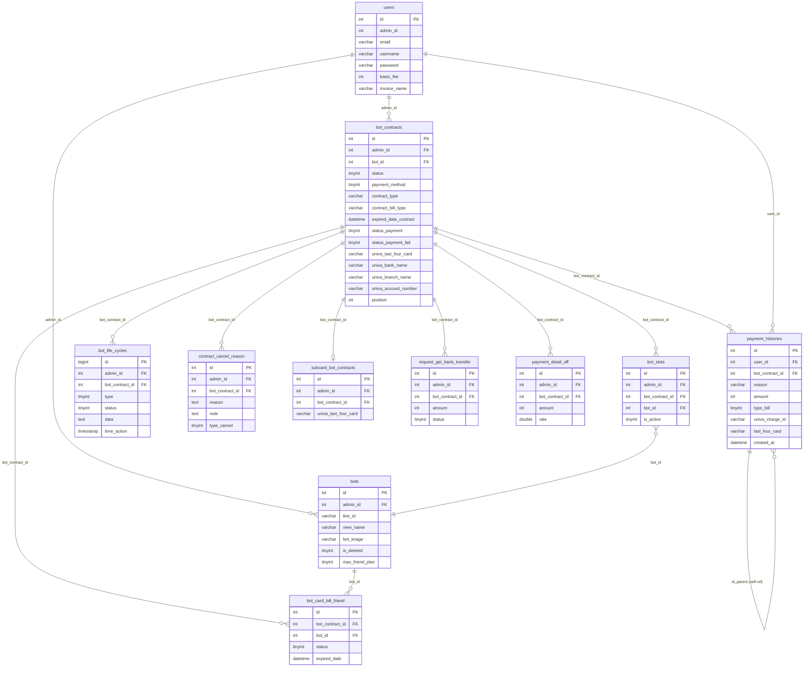

# DB Mapping — 契約詳細 (Chi tiết hợp đồng) — FA-031

**Feature**: detail-contract
**Portal**: Admin
**Ngày tạo**: 2026-03-30
**Confidence tổng thể**: Cao (từ code Laravel + DB schema)

---

## 1. Primary Tables

Bảng trực tiếp liên quan — được sử dụng bởi Controllers và Models trong logic-spec.

| Bảng | Số cột | Model Eloquent | Vai trò |
|------|--------|---------------|---------|
| `bot_contracts` | 52 | `BotContracts` | Bảng hợp đồng chính — trạng thái, thanh toán, PSP tokens, expired dates |
| `payment_histories` | 41 | `PaymentHistories` | Lịch sử thanh toán — mỗi lần charge (thành công/thất bại) |
| `bot_slots` | 7 | `BotSlot` | Liên kết contract ↔ bot (1 contract → N slots cho enterprise) |
| `bots` | 113 | `Bots` | Thông tin LINE OA — tên, LINE ID, avatar, expired_date, trạng thái |
| `users` | 73 | `User` | Thông tin người dùng/admin — tên, email, mật khẩu, basic_fee |
| `subcard_bot_contracts` | 10 | `SubcardBotContract` | Thẻ phụ (sub card) — 1 contract → tối đa 1 sub card |
| `bot_life_cycles` | 9 | `BotLifeCycle` | Nhật ký vòng đời hợp đồng — log mọi thay đổi |
| `contract_cancel_reason` | 11 | `ContractCancelReason` | Lý do huỷ hợp đồng (multiple choice JSON + note) |
| `request_get_bank_transfer` | 8 | `RequestGetBankTransfer` | Yêu cầu lấy thông tin chuyển khoản ngân hàng |

## 2. Secondary Tables

Bảng liên quan gián tiếp — bị ảnh hưởng bởi side effects hoặc tham chiếu bởi jobs.

| Bảng | Số cột | Vai trò | Liên quan bởi |
|------|--------|---------|--------------|
| `bot_card_bill_friend` | 27 | Thanh toán phí bạn LINE vượt mức (従量課金) | changeCard, changePaymentMethod, HandleBillMaxFriend job |
| `payment_detail_aff` | 30 | Hoa hồng affiliate — INSERT khi charge thành công + có user giới thiệu | changePaymentMethod, changeCard, reContractChangeCard |
| `rich_menus` | 37 | Rich menu — bị ẩn khi cancel/force cancel | saveCancelReason, AutoPaymentJobUnivapay |
| `richmenu_update_history` | 12 | Lịch sử cập nhật rich menu — INSERT khi ẩn do cancel | saveCancelReason |
| `sync_elasticsearch` | 10 | Queue xoá ES documents — INSERT khi clearDataCancelContract | FlowDeleteBot, clearDataCancelContract |
| `backup_history` | 7 | Lịch sử backup bot — liên quan FlowDeleteBot | FlowDeleteBot |
| `campaign_status` | 8 | Trạng thái campaign — liên quan nâng cấp plan | saveCampaign |
| `user_staff_bots` | 14 | Quyền staff — dùng kiểm tra quyền truy cập contract | authenticationBotContract |

---

## 3. Entity Details

### 3.1 bot_contracts

| Column | Type | Nullable | Default | Key | Mô tả |
|--------|------|----------|---------|-----|-------|
| `id` | int(10) UNSIGNED | NO | — | PK | ID hợp đồng |
| `admin_id` | int(11) | YES | NULL | FK→users.id | ID admin sở hữu |
| `bot_id` | int(11) | YES | NULL | FK→bots.id | ID bot (deprecated — dùng bot_slots thay thế) |
| `number_slot` | int(11) | NO | 0 | — | Số slot enterprise |
| `amount_payment` | varchar(500) | YES | NULL | — | Số tiền thanh toán |
| `stripe_customer_id` | varchar(255) | YES | NULL | — | Stripe customer ID (legacy) |
| `stripe_card_id` | varchar(255) | YES | NULL | — | Stripe card ID (legacy) |
| `univa_transaction_token` | varchar(500) | YES | NULL | — | Univapay transaction token (thẻ chính) |
| `univa_customer_code` | varchar(100) | YES | NULL | — | Univapay customer code |
| `univa_customer_id` | varchar(100) | YES | NULL | — | Univapay customer ID |
| `univa_email` | varchar(255) | YES | NULL | — | Email đăng ký Univapay |
| `payment_method` | tinyint(4) | YES | NULL | — | 1: card, 2: transfer |
| `univa_last_four_card` | varchar(50) | YES | NULL | — | 4 số cuối thẻ tín dụng |
| `univa_branch_card` | varchar(100) | YES | NULL | — | Thương hiệu thẻ (Visa, Master...) |
| `univa_bank_branch_code` | varchar(255) | YES | NULL | — | Mã chi nhánh ngân hàng |
| `univa_bank_account_holder_name` | varchar(255) | YES | NULL | — | Tên chủ tài khoản ngân hàng |
| `expired_date_bank_transfer` | datetime | YES | NULL | — | Hạn chuyển khoản |
| `univa_bank_name` | varchar(500) | YES | NULL | — | Tên ngân hàng |
| `univa_branch_name` | varchar(500) | YES | NULL | — | Tên chi nhánh |
| `univa_account_number` | varchar(255) | YES | NULL | — | Số tài khoản ngân hàng |
| `univa_charge_id` | varchar(255) | YES | NULL | — | Univapay charge ID (transaction) |
| `payout_amount_add_slot` | int(11) | YES | NULL | — | Số tiền thêm slot |
| `number_slot_plus` | int(11) | YES | NULL | — | Số slot thêm |
| `status` | tinyint(4) | NO | 0 | — | 0: chưa HĐ, 1: đang HĐ, 2: chờ huỷ, 3: đã huỷ |
| `expired_date_contract` | datetime | YES | NULL | — | Ngày hết hạn hợp đồng |
| `status_payment` | tinyint(4) | YES | NULL | — | 0: chưa bill, 1: đã bill, 2: bill lỗi, 5: chờ chuyển khoản, 6: chờ upgrade |
| `error_message` | varchar(255) | YES | NULL | — | Thông báo lỗi thanh toán |
| `contract_type` | varchar(100) | YES | NULL | — | free / standard / pro / enterprise / enterprise_pro |
| `contract_bill_type` | varchar(100) | YES | NULL | — | month / year |
| `is_active` | tinyint(4) | NO | 0 | — | 0: inactive, 1: active |
| `date_add_contract` | datetime | YES | NULL | — | Ngày tạo hợp đồng |
| `date_cancel_contract` | datetime | YES | NULL | — | Ngày huỷ hợp đồng |
| `status_payment_fail` | tinyint(4) | NO | 0 | — | 0-5: số lần thanh toán thất bại |
| `first_error_payment` | datetime | YES | NULL | — | Thời điểm lỗi thanh toán đầu tiên |
| `expired_retry_payment` | datetime | YES | NULL | — | Thời điểm retry tiếp theo |
| `created_at` | timestamp | NO | CURRENT_TIMESTAMP | — | Ngày tạo |
| `updated_at` | timestamp | NO | CURRENT_TIMESTAMP ON UPDATE | — | Ngày cập nhật |
| `flag_contract_new` | tinyint(4) | NO | 0 | — | 0: cũ (trước 1.5.2023), 1: mới |
| `datetime_first_payment` | datetime | YES | NULL | — | Thời điểm thanh toán đầu tiên |
| `process_status` | tinyint(4) | NO | 1 | — | Trạng thái xử lý (0: đang xử lý, 1: hoàn tất) |
| `error_code` | varchar(255) | YES | NULL | — | Mã lỗi từ PSP |
| `date_execute_rate` | timestamp | YES | NULL | — | Ngày áp dụng tỉ lệ hoa hồng |
| `cancel_by` | tinyint(4) | YES | NULL | — | 0: job, 1: user |
| `user_id_cancel` | bigint(20) | YES | NULL | — | ID user thực hiện huỷ |
| `user_date_cancel` | timestamp | YES | NULL | — | Thời điểm user huỷ |
| `bill_type_old` | varchar(10) | YES | NULL | — | Kỳ thanh toán cũ (trước khi đổi) |
| `release_date_transfer` | timestamp | YES | NULL | — | Ngày giải phóng chuyển khoản |
| `payment_method_old` | tinyint(4) | YES | NULL | — | Phương thức thanh toán cũ |
| `position` | int(11) | YES | NULL | — | Thứ tự hiển thị (drag & drop) |
| `date_add_loa` | timestamp | YES | NULL | — | Ngày thêm LOA |
| `univa_last_four_card_old` | varchar(255) | YES | NULL | — | 4 số cuối thẻ cũ |
| `status_payment_max_friend` | tinyint(4) | YES | 1 | — | 0: chưa bill max friend, 1: đã bill |

**Indexes**: PK on `id`
**Foreign Keys** (logic, không có constraint vật lý):
- `admin_id` → `users.id`
- `bot_id` → `bots.id`

**Sample Data** (trích từ data dump):
- `contract_type` values thực tế: `'free'`, `'standard'`, `'pro'`, `'enterprise'`, `'enterprise_pro'`
- `contract_bill_type` values: `'month'`, `'year'`
- `status` values: 0 (UNREGISTER), 1 (REGISTERED), 2 (WAITING_CANCEL), 3 (CANCEL)
- `payment_method` values: 1 (card), 2 (transfer)

---

### 3.2 payment_histories

| Column | Type | Nullable | Default | Key | Mô tả |
|--------|------|----------|---------|-----|-------|
| `id` | int(11) | NO | — | PK | ID payment history |
| `user_id` | int(11) | YES | NULL | FK→users.id | ID user |
| `bot_id` | bigint(20) UNSIGNED | YES | NULL | FK→bots.id | ID bot |
| `bot_contract_id` | int(11) | YES | NULL | FK→bot_contracts.id | ID hợp đồng |
| `reason` | char(162) | YES | NULL | — | Lý do thanh toán (key string) |
| `amount` | int(11) | YES | NULL | — | Số tiền (JPY) |
| `rate` | double(8,2) | NO | — | — | Tỉ lệ hoa hồng |
| `remain_day` | int(11) | YES | NULL | — | Số ngày còn lại (pro-rata) |
| `reason_detail` | text | YES | NULL | — | Chi tiết lý do |
| `bot_name` | varchar(255) | YES | NULL | — | Tên bot (snapshot) |
| `type` | tinyint(2) | YES | 0 | — | Loại: 0 = bill thường, 1 = thành công |
| `type_bill` | tinyint(4) | NO | 1 | — | 1: stripe_card, 2: univapay_card, 3: univapay_transfer |
| `stripe_card_id` | varchar(255) | YES | NULL | — | Stripe card ID |
| `stripe_customer_id` | varchar(255) | YES | NULL | — | Stripe customer ID |
| `stripe_charge_id` | varchar(255) | YES | NULL | — | Stripe charge ID |
| `created_at` | datetime | YES | NULL | — | Ngày tạo |
| `updated_at` | timestamp | NO | CURRENT_TIMESTAMP ON UPDATE | — | Ngày cập nhật |
| `server_id` | int(11) | YES | NULL | — | Server ID |
| `univapay_transaction_token` | varchar(255) | YES | NULL | — | Univapay token |
| `univapay_customer_id` | varchar(255) | YES | NULL | — | Univapay customer ID |
| `number_slot_bill` | int(11) | NO | 1 | — | Số slot được bill |
| `status_transfer` | int(11) | NO | 0 | — | 0: chưa chuyển, 1: đã chuyển |
| `univa_charge_id` | varchar(255) | YES | NULL | — | Univapay charge ID (transaction UUID) |
| `amount_refund` | double | YES | NULL | — | Số tiền hoàn |
| `reason_refund` | varchar(255) | YES | NULL | — | Lý do hoàn |
| `refund_date` | datetime | YES | NULL | — | Ngày hoàn |
| `contract_type_before_refund` | int(11) | YES | NULL | — | Loại HĐ trước hoàn |
| `contract_type_after_refund` | int(11) | YES | NULL | — | Loại HĐ sau hoàn |
| `next_bill_date_after_refund` | datetime | YES | NULL | — | Ngày bill tiếp sau hoàn |
| `refund_method` | int(11) | YES | NULL | — | Phương thức hoàn |
| `refund_reason` | int(11) | YES | NULL | — | Mã lý do hoàn |
| `refund_description` | text | YES | NULL | — | Mô tả hoàn tiền |
| `admin_action_refund` | int(11) | YES | NULL | — | Admin thực hiện hoàn |
| `status_refund` | tinyint(4) | NO | 0 | — | 0: bill, 1: refund |
| `payment_date` | datetime | YES | NULL | — | Ngày thanh toán thực tế |
| `id_parent` | int(11) | YES | NULL | FK→payment_histories.id | ID record cha (năm → chia 12 con) |
| `parent_month` | tinyint(4) | NO | 1 | — | 1: parent record, 0: chia monthly (child) |
| `number_bill` | int(11) | YES | NULL | — | Số kỳ bill |
| `flag_display` | tinyint(4) | NO | 1 | — | 1: hiển thị, 0: ẩn |
| `remain_day_upgrade` | int(11) | YES | 0 | — | Số ngày còn lại khi upgrade |
| `last_four_card` | varchar(16) | YES | NULL | — | 4 số cuối thẻ (snapshot tại thời điểm thanh toán) |

**Indexes**: PK on `id`
**Foreign Keys** (logic):
- `user_id` → `users.id`
- `bot_id` → `bots.id`
- `bot_contract_id` → `bot_contracts.id`
- `id_parent` → `payment_histories.id` (self-referencing)

**reason values** (thực tế từ data):
- `pay_monthly_fee` — Thanh toán phí hàng tháng
- `add_bot` — Thêm bot
- `standard_month`, `standard_year` — Đăng ký Standard
- `pro_month`, `pro_year` — Đăng ký Pro
- `standard_year_transfer`, `pro_year_transfer` — Chuyển khoản
- `enterprise_month`, `enterprise_year` — Enterprise
- `card_mapping`, `card_mapping_year` — Mapping thẻ
- `pay_year_fee`, `pay_pro_year_fee` — Phí năm
- `pay_year_fee_extend_standard`, `pay_year_fee_extend_pro` — Gia hạn thêm 1 năm
- `*_upgrade_*` — Nâng cấp plan

---

### 3.3 bot_slots

| Column | Type | Nullable | Default | Key | Mô tả |
|--------|------|----------|---------|-----|-------|
| `id` | int(10) UNSIGNED | NO | — | PK | ID slot |
| `admin_id` | int(11) | YES | NULL | FK→users.id | ID admin |
| `bot_contract_id` | int(11) | YES | NULL | FK→bot_contracts.id | ID hợp đồng |
| `bot_id` | int(11) | YES | NULL | FK→bots.id | ID bot được gắn vào slot |
| `is_active` | tinyint(4) | NO | 1 | — | 1: active, 0: inactive |
| `created_at` | timestamp | NO | CURRENT_TIMESTAMP | — | Ngày tạo |
| `updated_at` | timestamp | NO | CURRENT_TIMESTAMP ON UPDATE | — | Ngày cập nhật |

**Indexes**: PK on `id`
**Foreign Keys** (logic):
- `admin_id` → `users.id`
- `bot_contract_id` → `bot_contracts.id`
- `bot_id` → `bots.id`

---

### 3.4 bots (cột liên quan đến tính năng)

| Column | Type | Nullable | Default | Key | Mô tả |
|--------|------|----------|---------|-----|-------|
| `id` | int(12) | NO | — | PK | ID bot |
| `admin_id` | int(12) | NO | — | FK→users.id | ID admin sở hữu |
| `line_id` | varchar(50) | YES | NULL | — | LINE ID (vd: @szl8582o) |
| `bot_name` | varchar(128) | YES | NULL | — | Tên bot (hệ thống) |
| `view_name` | varchar(128) | YES | NULL | — | Tên hiển thị |
| `expired_date` | datetime | YES | NULL | — | Ngày hết hạn (legacy Stripe) |
| `expired_date_free_plan` | datetime | YES | NULL | — | Ngày hết hạn free plan |
| `bot_image` | varchar(500) | YES | NULL | — | URL avatar bot |
| `is_deleted` | tinyint(1) | NO | 0 | — | 0: hoạt động, 1: đã đánh dấu xoá |
| `plan_type` | int(11) | NO | 1 | — | 1: standard/paid, 2: free |
| `status_bill_fail` | tinyint(4) | NO | 0 | — | Số lần thanh toán thất bại (legacy) |
| `first_bill_fail_date` | datetime | YES | NULL | — | Ngày lỗi thanh toán đầu tiên (legacy) |
| `bill_bot_type` | varchar(255) | NO | 'month' | — | Loại thanh toán: month/year |
| `flag_contract_new` | tinyint(4) | NO | 0 | — | 0: cũ, 1: mới (sau 1.5.2023) |
| `max_friend_plan` | tinyint(4) | NO | 0 | — | 0: không max, 1: max, 2: đã charge, 3: lỗi charge |
| `expired_date_max_friend` | datetime | YES | NULL | — | Ngày hết hạn max friend billing |
| `datetime_first_payment` | datetime | YES | NULL | — | Thời điểm thanh toán đầu tiên |
| `subscription_id` | varchar(255) | YES | NULL | — | Subscription ID (legacy) |
| `has_campaign` | tinyint(4) | YES | 0 | — | 0: không, 1: có campaign |
| `created_at` | datetime | YES | NULL | — | Ngày tạo bot |
| `updated_at` | datetime | YES | NULL | — | Ngày cập nhật |

---

### 3.5 users (cột liên quan đến tính năng)

| Column | Type | Nullable | Default | Key | Mô tả |
|--------|------|----------|---------|-----|-------|
| `id` | int(11) | NO | — | PK | ID user |
| `admin_id` | int(12) | NO | — | — | ID admin (self-ref hoặc parent) |
| `email` | varchar(255) | NO | — | — | Email |
| `last_name` | varchar(255) | YES | NULL | — | Họ |
| `username` | varchar(255) | NO | — | — | Tên đăng nhập / hiển thị |
| `password` | varchar(255) | NO | — | — | Mật khẩu (bcrypt) |
| `role` | tinyint(1) | NO | 1 | — | -1: admin, 0: user, 2: staff |
| `basic_fee` | int(11) | NO | 0 | — | Phí cơ bản (dùng tính giá plan) |
| `invoice_name` | varchar(255) | YES | NULL | — | Tên hoá đơn tuỳ chỉnh |
| `use_setting_invoice_name` | tinyint(4) | YES | 0 | — | 0: tắt, 1: bật tên hoá đơn tuỳ chỉnh |
| `is_deleted` | tinyint(1) | NO | 0 | — | 0: hoạt động, 1: đã xoá |

---

### 3.6 subcard_bot_contracts

| Column | Type | Nullable | Default | Key | Mô tả |
|--------|------|----------|---------|-----|-------|
| `id` | int(10) UNSIGNED | NO | — | PK | ID sub card |
| `admin_id` | int(11) | NO | — | FK→users.id | ID admin |
| `bot_contract_id` | int(11) | NO | — | FK→bot_contracts.id | ID hợp đồng |
| `univa_transaction_token` | varchar(255) | NO | — | — | Univapay token thẻ phụ |
| `univa_customer_code` | varchar(255) | NO | — | — | Univapay customer code |
| `univa_customer_id` | varchar(255) | NO | — | — | Univapay customer ID |
| `univa_email` | varchar(255) | NO | — | — | Email đăng ký |
| `univa_last_four_card` | varchar(10) | NO | — | — | 4 số cuối thẻ phụ |
| `created_at` | timestamp | YES | NULL | — | Ngày tạo |
| `updated_at` | timestamp | YES | NULL | — | Ngày cập nhật |

**Sample Data**: `univa_last_four_card` values: `'4242'`, `'4444'`, `'5454'`, `'0069'`, `'1111'`, `'8431'`

---

### 3.7 bot_life_cycles

| Column | Type | Nullable | Default | Key | Mô tả |
|--------|------|----------|---------|-----|-------|
| `id` | bigint(20) UNSIGNED | NO | — | PK | ID lifecycle |
| `admin_id` | int(10) | NO | — | FK→users.id | ID admin |
| `bot_contract_id` | int(11) | NO | — | FK→bot_contracts.id | ID hợp đồng |
| `type` | tinyint(4) | NO | — | — | Loại hành động (1-28, xem bảng Type Constants) |
| `status` | tinyint(4) | NO | — | — | 1: start, 2: payment, 3: changed, 4: canceled |
| `data` | text | YES | NULL | — | JSON chi tiết (bot_name, plan, operator, amount, card info...) |
| `created_at` | timestamp | YES | NULL | — | Ngày tạo |
| `updated_at` | timestamp | YES | NULL | — | Ngày cập nhật |
| `time_action` | timestamp | YES | NULL | — | Thời điểm hành động |

**Type Constants** (từ Model BotLifeCycle):

| Type | Giá trị | Status | Mô tả (JP) |
|------|---------|--------|-------------|
| CONNECT_BOT_FREE | 1 | 1 (START) | LINE公式アカウント接続（フリープラン） |
| CONNECT_WITH_PLAN | 2 | 1 (START) | LINE公式アカウント接続（有料プラン） |
| PLAN_MONTHLY | 3 | 2 (PAYMENT) | 月払い開始 |
| PLAN_YEARLY | 4 | 2 (PAYMENT) | 年間一括払い開始 |
| UPGRADE_PLAN_PRO | 5 | 2 (PAYMENT) | プロプラン アップグレード（日割り） |
| BILL_FRIEND_USE | 6 | 2 (PAYMENT) | 友だち数別の従量課金 |
| UPDATE_PLAN_MONTH | 7 | 2 (PAYMENT) | 更新（毎月） |
| UPDATE_PLAN_YEAR | 8 | 2 (PAYMENT) | 更新（年間一括） |
| RECONTRACT | 9 | 2 (PAYMENT) | 再契約 |
| EXTEND_MORE_1_YEAR | 10 | 2 (PAYMENT) | 1年間の契約延長 |
| CHANGE_MAIN_CARD | 11 | 3 (CHANGED) | メインクレジットカード変更 |
| REGISTER_SUB_CARD | 12 | 3 (CHANGED) | サブクレジットカード登録 |
| CHANGE_SUB_CARD | 13 | 3 (CHANGED) | サブクレジットカード変更 |
| REGISTER_CHANGE_PAYMENT_METHOD_CARD | 14 | 3 (CHANGED) | 支払い方法変更 (振込→カード) |
| REGISTER_CHANGE_PAYMENT_TIMES_YEAR | 15 | 3 (CHANGED) | 支払い期間変更 (毎月→年間) |
| REPLACE_ACCOUNT_LINE | 16 | 3 (CHANGED) | LINE公式アカウント入れ替え |
| CANCEL_TRANSFER | 17 | 4 (CANCELED) | 銀行振込キャンセル |
| WAITING_CANCEL | 18 | 4 (CANCELED) | 解約申し込み |
| CANCELED | 19 | 4 (CANCELED) | 解約完了 |
| BILL_ERROR | 20 | 4 (CANCELED) | 決済エラー |
| FORCE_CANCEL | 21 | 4 (CANCELED) | 強制解約 |
| REGISTER_CHANGE_PAYMENT_METHOD_TRANSFER | 22 | 3 (CHANGED) | 支払い方法変更 (カード→振込) |
| REGISTER_CHANGE_PAYMENT_TIMES_MONTH | 23 | 3 (CHANGED) | 支払い期間変更 (年間→毎月) |
| ADD_STAFF | 24 | 3 (CHANGED) | スタッフ追加 |
| DELETE_STAFF | 25 | 3 (CHANGED) | スタッフ削除 |
| REMOVE_SUB_CARD | 26 | 3 (CHANGED) | サブクレジットカード削除 |
| REMOVE_CANCEL | 27 | 4 (CANCELED) | 解約の取り消し |
| DELETE_ACCOUNT | 28 | 4 (CANCELED) | LINE公式アカウント接続解除 |

**data JSON structure** (từ sample data):
```json
{
  "bot_id": 46259,
  "bot_name": "test 2024",
  "bot_image": null,
  "bot_line_id": "@bichhanh",
  "bot_name_new": null,
  "bot_image_new": null,
  "plan": "standard",
  "operator_id": 115,
  "operator_name": "Thanhntp142...",
  "operator_email": "thanhntp142@gmail.com",
  "amount": null,
  "type_bill": "year",
  "payment_method": null,
  "payment_id": null,
  "friend_number": null,
  "last4_card_main": null,
  "last4_card_sub": "5454",
  "next_date_payment": null
}
```

---

### 3.8 contract_cancel_reason

| Column | Type | Nullable | Default | Key | Mô tả |
|--------|------|----------|---------|-----|-------|
| `id` | int(10) UNSIGNED | NO | — | PK | ID lý do huỷ |
| `admin_id` | int(11) | YES | NULL | FK→users.id | ID admin |
| `bot_contract_id` | int(11) | YES | NULL | FK→bot_contracts.id | ID hợp đồng |
| `reason` | text | YES | NULL | — | JSON array lý do (multiple choice) |
| `note` | text | YES | NULL | — | Ghi chú tự do (「その他」) |
| `type_cancel` | tinyint(4) | YES | NULL | — | 1: delete bot free, 2: cancel contract |
| `created_at` | timestamp | NO | CURRENT_TIMESTAMP | — | Ngày tạo |
| `updated_at` | timestamp | NO | CURRENT_TIMESTAMP ON UPDATE | — | Ngày cập nhật |
| `bot_name` | varchar(255) | YES | NULL | — | Tên bot (snapshot) |
| `user_id` | int(11) | YES | NULL | — | ID user thực hiện (thêm sau) |
| `bot_id` | int(11) | YES | NULL | — | ID bot (thêm sau) |

**reason JSON format** (từ sample data):
```json
[
  {"index": "1", "value": "LINE公式アカウントだけで運用ができる"},
  {"index": "3", "value": "料金が高い"},
  {"index": "4", "value": "利用したい機能がない"}
]
```

**index values**:
| Index | Giá trị (JP) | Dịch (VN) |
|-------|-------------|-----------|
| 1 | LINE公式アカウントだけで運用ができる | Chỉ dùng LINE OA là đủ |
| 2 | 売上拡大など想定していた効果が得られなかった | Không đạt hiệu quả mong đợi |
| 3 | 料金が高い | Phí cao |
| 4 | 利用したい機能がない | Thiếu tính năng cần dùng |
| 5 | システムが使いにくい / 使い方がわからない | Khó sử dụng |
| 6 | LINE公式アカウント自体が利用停止になった | LINE OA bị ngừng |
| 7 | 他社のサービスに乗り換える | Chuyển sang đối thủ |
| 8 | LINE公式アカウント自体を利用しなくなった | Không dùng LINE OA nữa |
| 9 | サービス・サポートが悪い | Dịch vụ/hỗ trợ kém |
| 10 | 間違えて契約した | Đăng ký nhầm |
| 11 | その他（入力欄にご記入ください） | Khác (nhập tự do) |

---

### 3.9 request_get_bank_transfer

| Column | Type | Nullable | Default | Key | Mô tả |
|--------|------|----------|---------|-----|-------|
| `id` | int(10) UNSIGNED | NO | — | PK | ID yêu cầu |
| `admin_id` | int(11) | YES | NULL | FK→users.id | ID admin |
| `bot_contract_id` | int(11) | YES | NULL | FK→bot_contracts.id | ID hợp đồng |
| `expired_date_bank_transfer` | datetime | YES | NULL | — | Hạn chuyển khoản |
| `amount` | int(11) | YES | 0 | — | Số tiền cần chuyển |
| `status` | tinyint(4) | YES | 0 | — | 0: đợi get, 1: đã done, 2: đã close |
| `created_at` | timestamp | NO | CURRENT_TIMESTAMP | — | Ngày tạo |
| `updated_at` | timestamp | NO | CURRENT_TIMESTAMP ON UPDATE | — | Ngày cập nhật |

**Sample Data**: amount values: 48600 (standard year), 356400 (pro year)

---

### 3.10 bot_card_bill_friend

| Column | Type | Nullable | Default | Key | Mô tả |
|--------|------|----------|---------|-----|-------|
| `id` | int(10) UNSIGNED | NO | — | PK | ID |
| `bot_contract_id` | int(11) | NO | — | FK→bot_contracts.id | ID hợp đồng |
| `bot_id` | int(11) | NO | — | FK→bots.id | ID bot |
| `univa_transaction_token` | varchar(512) | YES | NULL | — | Univapay token |
| `univa_customer_code` | varchar(128) | YES | NULL | — | Customer code |
| `univa_customer_id` | varchar(128) | YES | NULL | — | Customer ID |
| `univa_last_four_card` | varchar(128) | YES | NULL | — | 4 số cuối thẻ |
| `univa_branch_card` | varchar(128) | YES | NULL | — | Thương hiệu thẻ |
| `univa_charge_id` | varchar(128) | YES | NULL | — | Charge ID |
| `expired_date` | datetime | YES | NULL | — | Ngày hết hạn billing |
| `status` | tinyint(4) | NO | 0 | — | 0: thành công, 1: lỗi, 2: chưa charge, 4: transfer |
| `created_at` | timestamp | NO | CURRENT_TIMESTAMP | — | Ngày tạo |
| `updated_at` | timestamp | NO | CURRENT_TIMESTAMP ON UPDATE | — | Ngày cập nhật |
| `amount_payment` | varchar(256) | YES | NULL | — | Số tiền |
| `expired_date_bank_transfer` | datetime | YES | NULL | — | Hạn chuyển khoản |
| `error_code` | varchar(64) | YES | NULL | — | Mã lỗi |
| `error_message` | varchar(500) | YES | NULL | — | Thông báo lỗi |
| `payment_method` | tinyint(4) | YES | 1 | — | 1: card, 2: transfer |
| `process_status` | tinyint(4) | YES | 0 | — | Trạng thái xử lý |
| `univa_email` | varchar(256) | YES | NULL | — | Email |
| `univa_bank_branch_code` | varchar(64) | YES | NULL | — | Mã chi nhánh NH |
| `univa_bank_account_holder_name` | varchar(256) | YES | NULL | — | Tên chủ TK |
| `univa_bank_name` | varchar(256) | YES | NULL | — | Tên ngân hàng |
| `univa_branch_name` | varchar(256) | YES | NULL | — | Tên chi nhánh |
| `univa_account_number` | varchar(256) | YES | NULL | — | Số tài khoản |
| `is_old_bill_max_friend` | tinyint(4) | YES | 0 | — | 0: mới (dùng token contract), 1: cũ (dùng token riêng) |
| `count_bill_friend_success` | tinyint(4) | YES | 0 | — | Số lần bill friend thành công |

---

## 4. UI ↔ DB Field Mapping

### 4.1 SCR-DC-01: 「契約情報・領収書」 — Danh sách hợp đồng

| UI Element | Label (JP) | DB Table | Column | Mapping Type | Confidence | Ghi chú |
|-----------|-----------|----------|--------|-------------|------------|---------|
| Tên LOA | 「LINE公式アカウント名」 | `bots` | `view_name` | Direct | Cao | JOIN bot_slots → bots |
| Avatar LOA | (image) | `bots` | `bot_image` | Direct | Cao | URL ảnh avatar |
| LINE ID | (dưới tên) | `bots` | `line_id` | Direct | Cao | VD: @szl8582o |
| Plan | 「ご利用プラン」 | `bot_contracts` | `contract_type` | Enum | Cao | free/standard/pro/enterprise/enterprise_pro |
| Kỳ thanh toán | (月払い/年間一括払い) | `bot_contracts` | `contract_bill_type` | Enum | Cao | month/year |
| Trạng thái | 「ステータス」 | `bot_contracts` | `status` + `status_payment` + `status_payment_fail` | Computed | Cao | Tính từ nhiều trường (xem logic phân loại) |
| Phí sử dụng | 「ご利用料金」 | `users` (admin_id=1) | `basic_fee` + config `planProFee` | Computed | Cao | Tính theo plan + kỳ. basic_fee cho standard, planProFee cho pro |
| Phương thức thanh toán | 「決済方法」 | `bot_contracts` | `payment_method` + `univa_last_four_card` | Computed | Cao | 1→カード (4 số cuối), 2→銀行振込 |
| Ngày thanh toán tiếp | 「次回決済(更新)日」 | `bot_contracts` | `expired_date_contract` | Direct | Cao | Ngày hết hạn = ngày thanh toán tiếp |
| Ngày kết nối LOA | 「LOA接続日」 | `bot_contracts` | `date_add_loa` | Direct | Cao | Hoặc `date_add_contract` |
| Nút huỷ chuyển khoản | 「振込キャンセル」 | — | — | Action | — | Gọi EP-28 cancelTransfer |
| Thứ tự hiển thị | (drag & drop) | `bot_contracts` | `position` | Direct | Cao | Lưu qua EP-03 saveContractPosition |
| Tìm kiếm | (search box) | `bots` | `line_id`, `view_name` | Query | Cao | LIKE search |
| Filter checkbox | (active/cancel) | `bot_contracts` | `status` | Query | Cao | Lọc theo status |

---

### 4.2 SCR-DC-02: 「契約詳細」 — Chi tiết hợp đồng

| UI Element | Label (JP) | DB Table | Column | Mapping Type | Confidence | Ghi chú |
|-----------|-----------|----------|--------|-------------|------------|---------|
| Tên LOA | (header) | `bots` | `view_name` | Direct | Cao | JOIN qua bot_slots |
| LINE ID | LINE ID: @xxx | `bots` | `line_id` | Direct | Cao | — |
| Trạng thái | 「ステータス」 | `bot_contracts` | `status` + `status_payment` | Computed | Cao | Hiển thị + message cảnh báo |
| Ngày kết nối LOA | 「LINE公式アカウント接続日」 | `bot_contracts` | `date_add_loa` | Direct | Cao | — |
| Plan hiện tại | 「ご契約プラン」 | `bot_contracts` | `contract_type` | Enum | Cao | free/standard/pro |
| Ngày bắt đầu thanh toán | 「お支払い開始日」 | `bot_contracts` | `datetime_first_payment` | Direct | Cao | — |
| Phí sử dụng | 「ご利用料金」 | `users` (admin) | `basic_fee` + config | Computed | Cao | Giá có thuế |
| Kỳ thanh toán | 「お支払い期間」 | `bot_contracts` | `contract_bill_type` | Enum | Cao | month→毎月払い, year→年間一括払い |
| Ngày thanh toán tiếp | 「次回決済日」 | `bot_contracts` | `expired_date_contract` | Direct | Cao | — |
| Phương thức thanh toán | 「決済方法」 | `bot_contracts` | `payment_method` | Enum | Cao | 1→クレジットカード, 2→銀行振込 |
| Chủ quản lý | 「主管理者」 | `users` | `username` | FK | Cao | JOIN bot_contracts.admin_id → users.id |
| Thẻ phụ | (sub card section) | `subcard_bot_contracts` | `univa_last_four_card` | FK | Cao | JOIN bot_contract_id |
| Người huỷ | (nếu đã huỷ) | `users` | `username` | FK | Cao | JOIN bot_contracts.user_id_cancel → users.id |
| Operation history | 「操作履歴」 | `bot_life_cycles` | `type`, `status`, `data`, `time_action` | FK | Cao | WHERE bot_contract_id = X |

---

### 4.3 SCR-DC-03: 「銀行振込口座のご案内」 — Thông tin chuyển khoản

| UI Element | Label (JP) | DB Table | Column | Mapping Type | Confidence | Ghi chú |
|-----------|-----------|----------|--------|-------------|------------|---------|
| Tên ngân hàng | 「銀行名」 | `bot_contracts` | `univa_bank_name` | Direct | Cao | Từ Univapay API, lưu vào contract |
| Tên chi nhánh | 「支店名」 | `bot_contracts` | `univa_branch_name` | Direct | Cao | — |
| Loại tài khoản | 「口座種別」 | — | — | Computed | Trung bình | Có thể hardcode 「普通」 hoặc từ Univapay API |
| Số tài khoản | 「口座番号」 | `bot_contracts` | `univa_account_number` | Direct | Cao | — |
| Tên chủ TK | 「口座名義」 | `bot_contracts` | `univa_bank_account_holder_name` | Direct | Cao | Luôn là「ｶ)ﾕﾆｳﾞｧﾍﾟｲｷﾔｽﾄ」(UnivaPay) |
| Mã chi nhánh | (ẩn) | `bot_contracts` | `univa_bank_branch_code` | Direct | Cao | — |
| Hạn chuyển khoản | 「振込期日」 | `bot_contracts` | `expired_date_bank_transfer` | Direct | Cao | — |
| Tổng thanh toán | 「お支払い総額」 | `request_get_bank_transfer` | `amount` | FK | Cao | Hoặc tính từ contract |

---

### 4.4 SCR-DC-04: 「お支払い期間の変更」 — Đổi kỳ thanh toán

| UI Element | Label (JP) | DB Table | Column | Mapping Type | Confidence | Ghi chú |
|-----------|-----------|----------|--------|-------------|------------|---------|
| Tên LOA | 「対象アカウント」 | `bots` | `view_name` | Direct | Cao | — |
| Plan hiện tại | 「ご契約プラン」 | `bot_contracts` | `contract_type` | Enum | Cao | — |
| Phí hiện tại | 「ご利用料金」 | `users` | `basic_fee` + config | Computed | Cao | — |
| Kỳ from→to | 「お支払い期間」 | `bot_contracts` | `contract_bill_type` | Enum | Cao | Hiện tại → sau đổi |
| Phương thức | 「決済方法」 | `bot_contracts` | `payment_method` | Enum | Cao | — |
| Ngày áp dụng | (note) | `bot_contracts` | `expired_date_contract` | Direct | Cao | Áp dụng từ kỳ tiếp theo |

**Action**: Hoàn tất wizard → EP-19 `changeTypePayment` → UPDATE `bot_contracts.contract_bill_type`

---

### 4.5 SCR-DC-06: 「解約の申し込み」 — Huỷ plan

| UI Element | Label (JP) | DB Table | Column | Mapping Type | Confidence | Ghi chú |
|-----------|-----------|----------|--------|-------------|------------|---------|
| Checkbox lý do (11 options) | (form) | `contract_cancel_reason` | `reason` | Direct | Cao | JSON array [{index, value}] |
| Free text | 「その他」input | `contract_cancel_reason` | `note` | Direct | Cao | Ghi chú bổ sung |
| Mật khẩu xác nhận | (password input) | `users` | `password` | Validate | Cao | Hash::check so sánh |

**Action**: Hoàn tất → EP-20 `saveCancelReason` → UPDATE `bot_contracts.status`, INSERT `contract_cancel_reason`

---

### 4.6 SCR-DC-07: 「接続解除確認」 — Ngắt kết nối LOA

| UI Element | Label (JP) | DB Table | Column | Mapping Type | Confidence | Ghi chú |
|-----------|-----------|----------|--------|-------------|------------|---------|
| Mã xác thực | (verification code input) | `bots` | `bot_deletion_auth_code` | Direct | Cao | Mã 6 ký tự, hết hạn theo time_generate_bot_deletion_auth_code |
| Email nhận mã | (email) | `users` | `email` | FK | Cao | Email admin |

**Action**: Xác nhận → `clearDataCancelContract()` → SET `bots.is_deleted=1` → Job FlowDeleteBot xoá vĩnh viễn

---

### 4.7 SCR-DC-08: 「接続解除履歴」 — Lịch sử ngắt kết nối

| UI Element | Label (JP) | DB Table | Column | Mapping Type | Confidence | Ghi chú |
|-----------|-----------|----------|--------|-------------|------------|---------|
| Ngày ngắt kết nối | 「接続解除日時」 | `bot_life_cycles` | `time_action` | FK | Cao | WHERE type=28 (DELETE_ACCOUNT), status=4 (CANCELED) |
| Tên LOA | 「LINE公式アカウント名」 | `bot_life_cycles` | `data` →`bot_name` | Computed | Cao | Parse JSON data field |
| Người thao tác | 「操作したユーザー」 | `bot_life_cycles` | `data` →`operator_name` | Computed | Cao | Parse JSON data field |

**Ghi chú**: KHÔNG có bảng `disconnect_history` riêng. Lịch sử ngắt kết nối lưu trong `bot_life_cycles` (type=28, status=4). Dữ liệu LOA + user là **snapshot** trong JSON `data` field vì bản gốc đã bị xoá.

---

### 4.8 SCR-DC-09: 「決済履歴・領収書」 — Lịch sử thanh toán

| UI Element | Label (JP) | DB Table | Column | Mapping Type | Confidence | Ghi chú |
|-----------|-----------|----------|--------|-------------|------------|---------|
| Năm-tháng | 「年月」 | `payment_histories` | `created_at` (GROUP BY) | Aggregated | Cao | GROUP BY year-month, SUM amount |
| Tổng tiền tháng | 「ご請求額」 | `payment_histories` | `amount` (SUM) | Aggregated | Cao | Tổng hợp theo tháng |
| Ngày thanh toán | 「契約(更新)日」 | `payment_histories` | `created_at` | Direct | Cao | — |
| Tên LOA | 「LINE公式アカウント名」 | `payment_histories` | `bot_name` | Direct | Cao | Snapshot tên bot tại thời điểm thanh toán |
| Số tiền | 「利用料 (税込)」 | `payment_histories` | `amount` | Direct | Cao | Đã bao gồm thuế |
| Plan | 「契約プラン」 | `payment_histories` | `reason` | Computed | Cao | Parse reason string → standard/pro/enterprise |
| Kỳ thanh toán | 「支払い」 | `payment_histories` | `reason` | Computed | Cao | Parse reason: *_month / *_year |
| Phương thức | 「決済方法」 | `payment_histories` | `type_bill` + `last_four_card` | Computed | Cao | 1→Stripe, 2→Univapay card (+4 số cuối), 3→銀行振込 |
| Ghi chú | 「備考」 | `payment_histories` | `reason_detail` | Direct | Trung bình | Có thể null |
| Charge ID | 「課金ID」 | `payment_histories` | `univa_charge_id` HOẶC `stripe_charge_id` | Direct | Cao | UUID từ PSP |
| Tên hoá đơn | (invoice) | `users` | `invoice_name` + `use_setting_invoice_name` | FK | Cao | Tuỳ chỉnh bởi user |
| Lọc theo bot | (filter) | `bot_slots` | `bot_id` → `bot_contract_id` | Query | Cao | EP-16 listBots |
| Lọc theo plan | (filter) | `payment_histories` | `reason` | Query | Cao | Lọc theo nhóm reason strings |

---

## 5. Enum/Status Values

### 5.1 bot_contracts.status — Trạng thái hợp đồng

| DB Value | Constant | Hiển thị (JP) | Hiển thị (VN) | Màu UI |
|----------|----------|--------------|--------------|--------|
| 0 | UNREGISTER | — | Chưa đăng ký | — |
| 1 | REGISTERED | 「正常」 | Bình thường | Xanh lá |
| 2 | WAITING_CANCEL | 「正常」(chờ huỷ cuối kỳ) | Chờ huỷ | Xanh lá (hiển thị như bình thường cho đến hết hạn) |
| 3 | CANCEL | 「解約済み」/「強制解約」 | Đã huỷ / Cưỡng chế | Xám / Đỏ |

### 5.2 bot_contracts.status — Trạng thái hiển thị (Computed từ nhiều trường)

| Trạng thái UI (JP) | Điều kiện DB | Ghi chú |
|-------------------|-------------|---------|
| 「正常」 | status=1, payment bình thường | Active, không lỗi |
| 「延滞中」 | status=1, (card: status_payment=2) HOẶC (transfer: status_payment=5/2), expired < now | Quá hạn thanh toán |
| 「入金待ち」 | status=1, payment_method=2, status_payment NOT IN [1,2], univa_account_number!=null | Chờ chuyển khoản ngân hàng |
| 「解約済み」 | status=3, cancel_by=1 (USER) | User tự huỷ |
| 「強制解約」 | status=3, cancel_by=0 (JOBS) | Job tự động huỷ (fail >= 5) |

### 5.3 bot_contracts.contract_type — Loại hợp đồng

| DB Value | Hiển thị (JP) | Hiển thị (VN) | Ghi chú |
|----------|--------------|--------------|---------|
| `'free'` | 「フリー」 | Miễn phí | ¥0 |
| `'standard'` | 「スタンダード」 | Tiêu chuẩn | basic_fee / tháng |
| `'pro'` | 「プロ」 | Pro | planProFee / tháng |
| `'enterprise'` | 「おまとめ（スタンダード）」 | Gói gộp Standard | Enterprise = nhiều slots, giá standard |
| `'enterprise_pro'` | 「おまとめ（プロ）」 | Gói gộp Pro | Enterprise = nhiều slots, giá pro |

### 5.4 bot_contracts.contract_bill_type — Kỳ thanh toán

| DB Value | Hiển thị (JP) | Hiển thị (VN) |
|----------|--------------|--------------|
| `'month'` | 「月払い」/「毎月払い」 | Thanh toán hàng tháng |
| `'year'` | 「年間一括払い」 | Thanh toán một lần/năm |

### 5.5 bot_contracts.payment_method — Phương thức thanh toán

| DB Value | Hiển thị (JP) | Hiển thị (VN) | Ghi chú |
|----------|--------------|--------------|---------|
| 1 | 「クレジットカード」(+下4桁 XXXX) | Thẻ tín dụng | univa_last_four_card = 4 số cuối |
| 2 | 「銀行振込」 | Chuyển khoản ngân hàng | Qua UnivaPay |

### 5.6 bot_contracts.status_payment — Trạng thái thanh toán

| DB Value | Mô tả | Ghi chú |
|----------|-------|---------|
| 0 | Chưa bill (no_bill) | Mới tạo, chưa charge lần nào |
| 1 | Đã bill thành công | Bình thường |
| 2 | Bill lỗi | Charge thất bại |
| 5 | Chờ chuyển khoản (no_bill / waiting transfer) | Đã tạo charge transfer, chờ user chuyển |
| 6 | Chờ upgrade | Đang chờ xử lý nâng cấp |

### 5.7 bot_contracts.cancel_by — Người huỷ

| DB Value | Constant | Mô tả |
|----------|----------|-------|
| 0 | CANCEL_BY_JOBS | Job tự động huỷ (quá hạn, fail >= 5) |
| 1 | CANCEL_BY_USER | User tự huỷ |

### 5.8 bot_contracts.status_payment_fail — Đếm lỗi thanh toán

| DB Value | Mô tả | Hành động |
|----------|-------|----------|
| 0 | Không lỗi | — |
| 1 | Lỗi lần 1 | Gửi email thông báo |
| 2 | Lỗi lần 2 | Retry sau 2 ngày |
| 3 | Lỗi lần 3 | Retry sau 5 ngày |
| 4 | Lỗi lần 4 | Gửi email cảnh báo dừng ngày mai |
| 5 | Lỗi lần 5 | FORCE CANCEL + gửi email dừng |

### 5.9 payment_histories.type_bill — Loại bill

| DB Value | Constant | Mô tả |
|----------|----------|-------|
| 1 | stripe_card | Thanh toán Stripe card (legacy) |
| 2 | univapay_card | Thanh toán Univapay card |
| 3 | univapay_transfer | Chuyển khoản Univapay |

### 5.10 contract_cancel_reason.type_cancel — Loại huỷ

| DB Value | Mô tả |
|----------|-------|
| 1 | Xoá bot free (delete bot) |
| 2 | Huỷ hợp đồng trả phí (cancel contract) |

### 5.11 bot_life_cycles.status — Phân loại lifecycle

| DB Value | Mô tả (JP) | Mô tả (VN) |
|----------|------------|------------|
| 1 | 開始 | Bắt đầu |
| 2 | 決済 | Thanh toán |
| 3 | 変更 | Thay đổi |
| 4 | 解約・エラー | Huỷ / Lỗi |

### 5.12 bots.max_friend_plan — Trạng thái max friend

| DB Value | Mô tả |
|----------|-------|
| 0 | Không vượt mức |
| 1 | Đã vượt 100,000 bạn (cần charge) |
| 2 | Đã charge thành công |
| 3 | Charge lỗi |

---

## 6. Unmapped Items

### 6.1 UI fields không tìm thấy DB match trực tiếp

| UI Element | Màn hình | Ghi chú |
|-----------|---------|---------|
| 「口座種別」(loại tài khoản: 普通) | SCR-DC-03 | Có thể hardcode hoặc từ Univapay API response (không lưu DB) |
| Giá plan có thuế (税込) | SCR-DC-01, 02, 04 | **Computed**: basic_fee × modifier. Config `planProFee` lấy từ config file, không phải DB. Thuế tính runtime |
| Receipt/領収書 (nội dung PDF) | SCR-DC-09 | PDF generate từ data `payment_histories`, không lưu sẵn |
| Nội dung cảnh báo trạng thái | SCR-DC-02 | Render từ template Blade, không lưu DB |
| Nội dung tĩnh chú ý hợp đồng | SCR-DC-10 | Static content trong view template |
| Hướng dẫn đổi chủ quản lý | SCR-DC-05 | Chỉ hiển thị text hướng dẫn, không thao tác DB |

### 6.2 DB columns không xuất hiện trên UI

| Table | Column | Mô tả |
|-------|--------|-------|
| `bot_contracts` | `stripe_customer_id`, `stripe_card_id` | Legacy Stripe — không hiển thị, chỉ dùng cho job billing |
| `bot_contracts` | `univa_transaction_token`, `univa_customer_code`, `univa_customer_id` | PSP tokens — backend only |
| `bot_contracts` | `process_status` | Trạng thái xử lý thanh toán — transient, không hiển thị |
| `bot_contracts` | `error_code`, `error_message` | Mã/thông báo lỗi PSP — chỉ log, không hiển thị trên contract detail |
| `bot_contracts` | `date_execute_rate` | Ngày áp dụng tỉ lệ hoa hồng — liên quan affiliate, không hiển thị |
| `bot_contracts` | `payout_amount_add_slot`, `number_slot_plus` | Thêm slot enterprise — quản lý nội bộ |
| `bot_contracts` | `release_date_transfer` | Ngày giải phóng transfer — backend only |
| `bot_contracts` | `bill_type_old`, `payment_method_old`, `univa_last_four_card_old` | Backup trước khi đổi — rollback only |
| `payment_histories` | `server_id` | Server xử lý — infrastructure |
| `payment_histories` | `remain_day`, `remain_day_upgrade` | Ngày còn lại tính pro-rata — chỉ dùng cho tính toán |
| `payment_histories` | `rate` | Tỉ lệ hoa hồng — liên quan affiliate |
| `payment_histories` | `type` | Loại record (0/1) — logic nội bộ |
| `payment_histories` | `flag_display` | 1: hiển thị, 0: ẩn — ẩn khỏi UI nhưng vẫn trong DB |
| `payment_histories` | `id_parent`, `parent_month` | Liên kết parent-child (năm → 12 con) — logic phân trang |
| `payment_histories` | Các cột refund (`amount_refund`, `reason_refund`, ...) | Chức năng hoàn tiền — riêng, không thuộc tính năng này |
| `bots` | Phần lớn 113 cột | Chỉ ~15 cột liên quan đến contract/billing |
| `users` | Phần lớn 73 cột | Chỉ ~10 cột liên quan đến contract |

---

## 7. Entity Relationships



---

## 8. Ghi chú quan trọng

### 8.1 Kiến trúc quan hệ Contract ↔ Bot

- 1 `bot_contracts` → N `bot_slots` → N `bots` (enterprise có nhiều slots)
- 1 `bot_contracts` → 1 `bot_slots` → 1 `bots` (standard/pro chỉ 1 slot)
- Truy vấn bot từ contract: `bot_contracts` JOIN `bot_slots` ON `bot_contract_id` JOIN `bots` ON `bot_id`
- Cột `bot_contracts.bot_id` là **deprecated** — chỉ dùng cho compatibility, thực tế dùng `bot_slots`

### 8.2 Giá plan — Không lưu trong DB

- `basic_fee` lấy từ `users` WHERE `id = 1` (admin gốc) — giá Standard
- `planProFee` lấy từ config file Laravel — giá Pro
- Enterprise: `calculateSaleEnterprise(basic_fee, contract_type, bill_type, number_slot)`
- Thuế (税込): tính runtime, không lưu riêng

### 8.3 PSP Integration — 2 provider

| PSP | Dùng cho | DB Columns |
|-----|---------|-----------|
| **Stripe** (legacy) | Card payment cũ | `stripe_customer_id`, `stripe_card_id`, `stripe_charge_id` |
| **UnivaPay** (hiện tại) | Card + Bank transfer | `univa_*` columns (~15 cột trong bot_contracts) |

### 8.4 Bảng disconnect_history — KHÔNG tồn tại

DB hint dự đoán bảng `disconnect_history` nhưng thực tế **không có**. Lịch sử ngắt kết nối lưu trong `bot_life_cycles` (type=28 DELETE_ACCOUNT, status=4 CANCELED) với snapshot data trong JSON `data` field.

### 8.5 Bảng verification_codes — KHÔNG tồn tại riêng

Mã xác thực ngắt kết nối lưu trực tiếp trong `bots.bot_deletion_auth_code` + `bots.time_generate_bot_deletion_auth_code`, không có bảng riêng.

### 8.6 Payment History parent-child

Thanh toán năm (year) tạo 1 parent record + 12 child records:
- Parent: `parent_month = 1`, `amount` = tổng năm
- Child: `parent_month = 0`, `id_parent` = parent ID, `amount` = tổng / 12
- UI hiển thị chỉ parent (`parent_month = 1`) hoặc cả hai tuỳ mode
