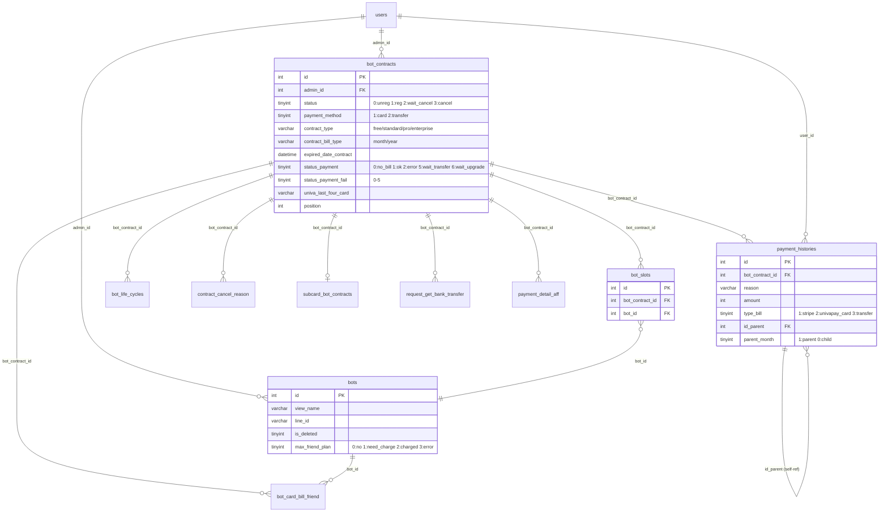

# Feature Spec — 契約詳細 (Chi tiết hợp đồng) — FA-031

**Feature ID**: FA-031
**Tên JP**: 「契約プラン・決済情報」
**Tên VN**: Hợp đồng và thanh toán
**Portal**: Admin
**URL chính**: `/basic/point-settings` (danh sách), `/basic/detail-contract/{id}` (chi tiết)
**Ngày tổng hợp**: 2026-03-30
**Trạng thái Validation**: **ĐẠT** (xem [validation-report](_internal/validation-report.md))

**Source specs**:
- [UI Spec](ui/ui-spec.md) — 10 màn hình, 7 user flows
- [API Spec](web/api-spec.md) — 38 endpoints
- [Logic Spec](web/logic-spec.md) — 4 controllers, 8 models, business rules
- [Job Spec](job/job-spec.md) — 7 Laravel Artisan commands
- [DB Mapping](db/db-mapping.md) — 9 primary tables, 8 secondary tables

---

## 1. Tổng quan

### 1.1 Mục đích

Tính năng quản lý hợp đồng và thanh toán cho phép Admin (chủ quản lý tài khoản) xem và quản lý tất cả LINE Official Account (LOA) đã đăng ký dưới tài khoản của mình. Đây là tính năng quan trọng nhất về mặt tài chính, bao gồm quản lý vòng đời hợp đồng từ đăng ký đến huỷ, thanh toán tự động và thủ công, và tích hợp với 2 Payment Service Providers (Stripe legacy + UnivaPay hiện tại).

### 1.2 Actors

| Actor | Vai trò |
|-------|---------|
| **Admin (Bot Admin)** | Xem/quản lý hợp đồng, thay đổi plan, huỷ, ngắt kết nối LOA, xem lịch sử thanh toán |
| **Staff** | Truy cập theo quyền `pointSettings` được Admin cấp (cùng giao diện, giới hạn scope) |
| **System (Background Jobs)** | Thanh toán tự động hàng ngày, retry khi lỗi, cưỡng chế huỷ khi quá hạn, dọn dẹp dữ liệu |

### 1.3 Phạm vi

| Chức năng | Mô tả |
|-----------|-------|
| Xem danh sách hợp đồng | Tất cả LOA: plan, trạng thái, giá, phương thức thanh toán, drag & drop sắp xếp |
| Xem chi tiết hợp đồng | Thông tin plan, lịch sử thao tác (operation history), chủ quản lý |
| Đổi kỳ thanh toán | Tháng -> năm (wizard 3 bước, bắt buộc đăng ký thẻ tín dụng) |
| Huỷ plan | Thu thập lý do (11 options), wizard 3 bước, xác thực mật khẩu |
| Ngắt kết nối LOA | Xoá vĩnh viễn dữ liệu trên Elme, xác thực email 2 bước |
| Xem lịch sử ngắt kết nối | Danh sách LOA đã ngắt kết nối (không thể phục hồi) |
| Xem lịch sử thanh toán | Theo năm/tháng/ngày, tải receipt/lĩnh thu thư |
| Đổi chủ quản lý | Hướng dẫn qua My Page hoặc form bên ngoài (Tayori, 11,000 JPY/lần) |
| Thông tin chuyển khoản | Modal hiển thị tài khoản ngân hàng UnivaPay |
| Thanh toán tự động | Jobs chạy hàng ngày: charge Stripe/Univapay card/transfer, auto-cancel, dọn dẹp |
| Đổi thẻ tín dụng | Đổi card chính, hỗ trợ fallback sub card |
| Tái ký hợp đồng | Chọn card chính/phụ/nhập mới |
| Gia hạn hợp đồng | Thêm 1 năm (card hoặc transfer) |
| Huỷ chuyển khoản | Rollback trạng thái hợp đồng về trước khi đăng ký transfer |

---

## 2. Các màn hình và Luồng xử lý end-to-end

### 2.1 SCR-DC-01:「契約情報・領収書」— Danh sách hợp đồng

**URL**: `/basic/point-settings`

**User Action -> End-to-end Flow**:

| # | User Action | UI | API Endpoint | Business Logic | DB Tables | Response -> UI Update |
|---|-------------|-----|-------------|----------------|-----------|----------------------|
| 1 | Mở trang | Render danh sách | EP-01 `indexView` (Blade) + EP-02 `getDataContract` (AJAX) | Kiểm tra quyền staff (`getListBotIdStaffManagement`), query JOIN bot_contracts -> bot_slots -> bots -> payment_histories, phân loại theo trạng thái | `bot_contracts`, `bot_slots`, `bots`, `payment_histories`, `users` | Hiển thị bảng với 8 cột: tên LOA, plan, trạng thái, giá, phương thức TT, ngày TT tiếp, ngày kết nối, action buttons |
| 2 | Filter checkbox (「契約中」/「解約済み」) | Check/uncheck | EP-02 (contract_active, contract_cancel params) | Lọc theo bot_contracts.status | `bot_contracts` | Cập nhật bảng danh sách |
| 3 | Tìm kiếm LOA | Nhập text | EP-02 (input_search param) | LIKE search trên bots.line_id hoặc bots.view_name | `bots` | Lọc danh sách |
| 4 | Drag & drop sắp xếp | Kéo thả dòng | EP-03 `saveContractPosition` | Validation: required array. UPDATE bot_contracts.position cho từng item | `bot_contracts` | Lưu thứ tự mới |
| 5 | Huỷ chuyển khoản | Bấm「振込キャンセル」 | EP-28 `cancelTransfer` | Gọi univapayPayment->cancelChargeWeb, rollback contract (nhiều nhánh logic phức tạp — xem Section 2.1.1) | `bot_contracts`, `bot_card_bill_friend`, `bots`, `bot_life_cycles` | Cập nhật trạng thái contract |

**Phân loại dữ liệu (logic EP-02)**:
- `overdueDataContract`: Quá hạn — card (method=1, status_payment=2, fail<5) hoặc transfer (method=2, status_payment=5|2, fail<5) VÀ expired < now
- `transferDataContract`: Chờ chuyển khoản — method=2 VÀ status_payment NOT IN [1,2]
- `cancelDataContract`: status=3 (CANCEL)
- `maxFriendDataContract`: max_friend_plan=1 (cần charge)
- `data`: Còn lại (bao gồm WAITING_CANCEL)

#### 2.1.1 Luồng huỷ chuyển khoản chi tiết (EP-28 cancelTransfer)

```
Nhánh MAX-FRIEND (type=='max-friend'):
  UPDATE bot_card_bill_friend SET process_status=2, status=1
  UPDATE bot_contracts SET status_payment_max_friend=1
  UPDATE bots SET max_friend_plan=3

Nhánh BÌNH THƯỜNG:
  Kiểm tra pending + chưa gắn bot -> forceDelete contract
  Gọi Univapay cancelChargeWeb(chargeId)
  Xác định loại (reason từ payment_histories):
    Lần đầu (status_payment=0): Xoá hoặc CANCEL
    Chờ thanh toán (status_payment=5): SET status_payment=1
    Quá hạn 7 ngày: SET CANCEL
    Upgrade từ Free: Rollback về free plan
    Upgrade từ Standard: Rollback về standard
    Extend contract: Rollback expired_date
    Mặc định: SET CANCEL
  UPDATE bots SET max_friend_plan=0
  INSERT bot_life_cycles (CANCEL_TRANSFER)
```

---

### 2.2 SCR-DC-02:「契約詳細」— Chi tiết hợp đồng

**URL**: `/basic/detail-contract/{id}`

| # | User Action | UI | API Endpoint | Business Logic | DB Tables | Response -> UI Update |
|---|-------------|-----|-------------|----------------|-----------|----------------------|
| 1 | Mở trang | Render chi tiết | EP-04 `detailContract` (Blade) | `authenticationBotContract()` — kiểm tra quyền Staff + Bot. Lấy SubcardBotContract, user cancel, basic_fee, planProFee | `bot_contracts`, `bot_slots`, `bots`, `users`, `subcard_bot_contracts` | Hiển thị thông tin hợp đồng: trạng thái, plan, giá, kỳ TT, ngày TT tiếp, phương thức, chủ quản lý |
| 2 | Xem operation history | Scroll xuống | EP-33 `botLifeCycles` (AJAX) | Query bot_life_cycles WHERE bot_contract_id, filter theo type/status/date range | `bot_life_cycles` | Hiển thị bảng log: ngày, loại sự kiện, chi tiết |
| 3 | Bấm「次回決済から年払いに変更する」 | Button text green | -> Navigate SCR-DC-04 | Chỉ hiện khi contract_bill_type='month' | — | Chuyển trang |
| 4 | Bấm「主管理者を変更する」 | Button text green | -> Modal SCR-DC-05 | Không thao tác DB | — | Mở modal hướng dẫn |
| 5 | Bấm「有料プラン解約へ進む」 | Button text green | -> Navigate SCR-DC-06 | Chỉ hiện khi plan trả phí | — | Chuyển trang |
| 6 | Bấm「接続解除へ進む」 | Button text green | -> Navigate SCR-DC-07 | Luôn hiển thị | — | Chuyển trang |

---

### 2.3 SCR-DC-03:「銀行振込口座のご案内」— Modal chuyển khoản

**URL**: Modal trên SCR-DC-02

| # | User Action | UI | API Endpoint | Business Logic | DB Tables | Response -> UI Update |
|---|-------------|-----|-------------|----------------|-----------|----------------------|
| 1 | Mở modal | Hiển thị thông tin bank | Dữ liệu từ EP-04 (server-side render) | Lấy từ bot_contracts.univa_bank_* và request_get_bank_transfer | `bot_contracts`, `request_get_bank_transfer` | Hiển thị: tên ngân hàng, chi nhánh, số tài khoản, tên chủ TK, hạn chuyển khoản, tổng tiền |

**Lưu ý**: Tài khoản nhận luôn là UnivaPay (「ｶ)ﾕﾆｳﾞｧﾍﾟｲｷﾔｽﾄ」). Hệ thống thanh toán tự động xác nhận — kiểm tra thường trong vài phút đến vài giờ.

---

### 2.4 SCR-DC-04:「お支払い期間の変更」— Đổi kỳ thanh toán (Wizard 3 bước)

**URL**: Trang con từ SCR-DC-02

| # | User Action | UI | API Endpoint | Business Logic | DB Tables | Response -> UI Update |
|---|-------------|-----|-------------|----------------|-----------|----------------------|
| 1 | Mở trang (Step 1) | Xác nhận thay đổi | EP-06 `changeBillType` (Blade) | Kiểm tra quyền. Redirect nếu is_wait_transfer=true VÀ is_overdue=false | `bot_contracts`, `users` | Hiển thị: LOA, plan, giá, kỳ từ->đến, phương thức, ngày áp dụng |
| 2 | Bấm「クレジットカードの登録に進む」(Step 2) | Form nhập thẻ | (iframe PSP — chưa capture) | Nhập thông tin thẻ tín dụng qua iframe UnivaPay/Stripe | — | Hiển thị form nhập thẻ |
| 3 | Xác nhận (Step 3) | Hoàn tất | EP-19 `changeTypePayment` | UPDATE bot_contracts.contract_bill_type, payment_method, bill_type_old. Tạo BotLifeCycle (REGISTER_CHANGE_PAYMENT_TIMES_YEAR) | `bot_contracts`, `bot_life_cycles` | Hiển thị màn hình hoàn tất |

**Ràng buộc**: Chuyển tháng -> năm BẮT BUỘC phải đăng ký thẻ tín dụng (「※月払いはクレジットカード決済のみとなります。」). Thay đổi áp dụng từ kỳ thanh toán tiếp theo.

---

### 2.5 SCR-DC-05:「主管理者を変更する」— Modal đổi chủ quản lý

**URL**: Modal trên SCR-DC-02

Không thao tác DB trực tiếp — chỉ hướng dẫn:
- **Trường hợp 1** (email chưa tồn tại): Tự đổi qua「マイページ」(`/admin/setting`)
- **Trường hợp 2** (email đã tồn tại): Gửi form bên ngoài Tayori — phí 11,000 JPY/lần

---

### 2.6 SCR-DC-06:「解約の申し込み」— Huỷ plan (Wizard 3 bước)

**URL**: Trang con từ SCR-DC-02

| # | User Action | UI | API Endpoint | Business Logic | DB Tables | Side Effects |
|---|-------------|-----|-------------|----------------|-----------|-------------|
| 1 | Mở trang (Step 1) | Form chọn lý do huỷ | EP-05/EP-10 (Blade) | Kiểm tra quyền Staff + status. Redirect nếu đã CANCEL/WAITING_CANCEL | `bot_contracts` | — |
| 2 | Chọn lý do (11 checkbox) + ghi chú | Tick checkbox, nhập text | — | Bắt buộc chọn ít nhất 1 lý do. Có thể chọn nhiều | — | — |
| 3 | Xác nhận (Step 2+3) | Nhập mật khẩu + xác nhận | EP-20 `saveCancelReason` | Xác thực password (Hash::check HOẶC env('PASS_LOGIN')). Logic phân nhánh phức tạp — xem bên dưới | `bot_contracts`, `bot_slots`, `bots`, `rich_menus`, `richmenu_update_history`, `contract_cancel_reason`, `bot_life_cycles` | clearDataCancelContract() nếu quá hạn |

**Logic huỷ chi tiết (EP-20)**:

```
1. Xác thực mật khẩu -> SAI: return {"status": false, "msg": "パスワードが間違っています。"}

2. Nếu type == 'free':
   SET bots.is_deleted=1
   DELETE bot_slots, bot_contracts
   clearDataCancelContract(bot_id) -> FlowDeleteBot sẽ dọn dẹp

3. Nếu type == 'paid':
   a. Quá hạn hoặc status_payment=2 -> CANCEL ngay (status=3):
      UPDATE rich_menus (ẩn), INSERT richmenu_update_history
      clearDataCancelContract() cho tất cả botSlots
   b. Chưa quá hạn -> WAITING_CANCEL (status=2):
      Giữ data, huỷ cuối kỳ
   c. Enterprise/enterprise_pro:
      Tách từng botSlot thành BotContracts đơn lẻ (standard/pro)
      Xoá BotSlots + BotContracts gốc

4. INSERT contract_cancel_reason (JSON reason + note)
5. INSERT bot_life_cycles (CANCELED hoặc WAITING_CANCEL)
```

**11 lý do huỷ**:

| Index | Lý do (JP) | Dịch (VN) |
|-------|-----------|-----------|
| 1 | 「LINE公式アカウントだけで運用ができる」 | Chỉ dùng LINE OA là đủ |
| 2 | 「売上拡大など想定していた効果が得られなかった」 | Không đạt hiệu quả mong đợi |
| 3 | 「料金が高い」 | Phí cao |
| 4 | 「利用したい機能がない」 | Thiếu tính năng cần dùng |
| 5 | 「システムが使いにくい / 使い方がわからない」 | Khó sử dụng |
| 6 | 「LINE公式アカウント自体が利用停止になった」 | LINE OA bị ngừng |
| 7 | 「他社のサービスに乗り換える」 | Chuyển sang đối thủ |
| 8 | 「LINE公式アカウント自体を利用しなくなった」 | Không dùng LINE OA nữa |
| 9 | 「サービス・サポートが悪い」 | Dịch vụ/hỗ trợ kém |
| 10 | 「間違えて契約した」 | Đăng ký nhầm |
| 11 | 「その他（入力欄にご記入ください）」 | Khác (nhập tự do) |

---

### 2.7 SCR-DC-07:「LINE公式アカウント 接続解除確認」— Ngắt kết nối LOA

**URL**: Trang con từ SCR-DC-02

| # | User Action | UI | API Endpoint | Business Logic | DB Tables | Side Effects |
|---|-------------|-----|-------------|----------------|-----------|-------------|
| 1 | Đọc cảnh báo | 3 điều khoản cảnh báo | — | — | — | — |
| 2 | Bấm「認証コードをメールで受け取る」 | Gửi mã 6 ký tự qua email | EP-36 `checkAuthDeleteAccount` | Kiểm tra user có bot đang hoạt động. Sinh mã xác thực lưu vào bots.bot_deletion_auth_code | `bots`, `users` | Gửi email chứa mã xác thực |
| 3 | Nhập mã xác thực (Step 2 — chưa capture) | Form nhập mã | `clearDataCancelContract()` | Xác minh mã -> SET bots.is_deleted=1 -> FlowDeleteBot (02:00 hàng ngày) xoá vĩnh viễn toàn bộ dữ liệu | `bots`, `bot_contracts`, `bot_slots`, `sync_elasticsearch` | XOÁ VĨNH VIỄN toàn bộ dữ liệu LOA trên Elme |

**Cảnh báo quan trọng**:
1. Ngắt kết nối -> ngay lập tức không thể thao tác, xem dữ liệu, sao chép
2. Rich Menu có thể tồn tại tối đa 24 giờ
3. Nếu còn thời hạn trả phí -> coi như huỷ hợp đồng, không hoàn tiền

**Khác biệt với「解約」(huỷ plan)**: Huỷ plan giữ dữ liệu (chỉ mất quyền thao tác), ngắt kết nối XOÁ dữ liệu vĩnh viễn.

---

### 2.8 SCR-DC-08:「接続解除履歴」— Lịch sử ngắt kết nối

**URL**: Trang con từ SCR-DC-01

| # | User Action | UI | API Endpoint | Business Logic | DB Tables |
|---|-------------|-----|-------------|----------------|-----------|
| 1 | Mở trang | Bảng lịch sử | EP-13 `disconnectHistoryView` (Blade) + EP-33 `botLifeCycles` (filter: type=28, status=4) | Query bot_life_cycles WHERE type=DELETE_ACCOUNT. Dữ liệu LOA là snapshot trong JSON data field (vì bản gốc đã bị xoá) | `bot_life_cycles` |

**3 cột**: Ngày giờ ngắt kết nối (`time_action`), Tên LOA (`data->bot_name`), Người thao tác (`data->operator_name`)

---

### 2.9 SCR-DC-09:「決済履歴・領収書のダウンロード」— Lịch sử thanh toán

**URL**: `/basic/payment-history`

| # | User Action | UI | API Endpoint | Business Logic | DB Tables | Response -> UI Update |
|---|-------------|-----|-------------|----------------|-----------|----------------------|
| 1 | Mở trang | Tổng hợp theo năm | EP-14 `paymentHistories` (Blade) + EP-15 `ajaxPaymentHistories` (type=1 YEAR) | GROUP BY month, SUM(amount) cho 12 tháng | `payment_histories`, `bot_contracts`, `bot_slots` | Bảng 12 dòng (1 tháng/dòng), tổng tiền mỗi tháng |
| 2 | Bấm「詳細を確認 >」 | Chi tiết tháng | EP-15 (type=2 MONTH) | Lọc theo year-month, paginate. Scope: typeBill, filterDate, filterContractIds | `payment_histories` | Bảng chi tiết: ngày, tên LOA, số tiền, plan, kỳ TT, phương thức, ghi chú, charge ID |
| 3 | Lọc theo date range | Date picker | EP-15 (type=3 DAY) | Lọc BETWEEN start_date và end_date | `payment_histories` | Cập nhật bảng |
| 4 | Lọc theo bot | Dropdown | EP-16 `listBots` + EP-15 (selected_bots) | Lấy bot_contract_id từ BotSlots -> lọc | `bot_slots`, `bots`, `payment_histories` | Lọc chi tiết |
| 5 | Lưu tên hoá đơn | Input | EP-17 `saveSettingInvoiceName` | UPDATE users.invoice_name, users.use_setting_invoice_name | `users` | Lưu thành công |
| 6 | Tải receipt | Bấm「一括ダウンロード」hoặc「個別発行」 | EP-15 (download_invoice=1) | Lấy tất cả records (không paginate) -> generate PDF | `payment_histories` | Download file PDF |

**Logic lọc plan theo reason string**:
- Standard: `standard_year`, `standard_month`, `card_mapping`, `pay_monthly_fee`, ...
- Pro: `pro_year`, `pro_month`, `pro_year_transfer`, ...
- Enterprise: `enterprise_year`, `enterprise_month`, `slot_plus_enterprise_*`, ...

---

### 2.10 SCR-DC-10:「ご契約に関する注意事項」— Modal chú ý

**URL**: Modal trên SCR-DC-01

Nội dung tĩnh (static content), không thao tác DB. 8 điều khoản chú ý:
1. Sao kê thẻ tín dụng ghi「L Message」「エルメッセージ」
2. Huỷ hợp đồng bất kỳ lúc nào (không hoàn tiền theo ngày)
3. Huỷ hợp đồng năm cũng không hoàn tiền phần còn lại
4. Không thể downgrade từ plan trả phí sang plan khác
5. Sau khi huỷ, dữ liệu vẫn còn nhưng không thể thao tác/xem
6. Đăng ký lại plan trả phí sẽ khôi phục quyền
7. Hợp đồng năm tự động gia hạn
8. Phí sử dụng thanh toán qua UnivaPay

---

### 2.11 Các luồng chưa có màn hình (API-only)

| Flow | API Endpoints | Logic chính | DB Tables |
|------|--------------|-------------|-----------|
| Đổi thẻ tín dụng | EP-08 `changeCard` (view) + EP-22 `changeCard` (action) | Lấy info card từ Univapay. Nếu quá hạn -> charge luôn. Nếu OK -> chỉ đổi card info. Fallback sub card | `bot_contracts`, `bots`, `bot_card_bill_friend`, `payment_histories`, `payment_detail_aff`, `bot_life_cycles` |
| Đổi phương thức TT | EP-07 `changePaymentMethod` (view) + EP-18 (action) | Card->Transfer: tạo Univapay customer + token. Nếu quá hạn -> charge luôn. Tạo RequestGetBankTransfer | `bot_contracts`, `request_get_bank_transfer`, `payment_histories`, `payment_detail_aff`, `bot_card_bill_friend`, `bot_life_cycles` |
| Tái ký hợp đồng | EP-11 `reContract` (view) + EP-23 `reContractChangeCard` (action) | Chọn card chính/phụ/mới. Tính amount theo type_slot, bill_type, number_slot. Charge qua Univapay | `bot_contracts`, `bots`, `bot_card_bill_friend`, `payment_histories`, `payment_detail_aff`, `bot_life_cycles` |
| Gia hạn hợp đồng | EP-12 `extendContractDetail` (view) + EP-26 `extendContract` (action) | expired_date + 1 năm. Card hoặc transfer. Chọn card chính/phụ/mới | `bot_contracts`, `payment_histories`, `bot_life_cycles`, `request_get_bank_transfer` |
| Tái kích hoạt / TT lại | EP-21 `changeStatusContract` | contract_revert (nếu expired > now) -> status=1. Không -> charge lại (Stripe/Univapay) | `bot_contracts`, `bot_life_cycles` |
| Thanh toán lại lỗi | EP-25 `billAgainContract` | Kiểm tra chưa có pending transfer. Charge theo payment_method | `bot_contracts`, `payment_histories` |
| Save campaign | EP-24 `saveCampaign` | Nâng cấp từ free lên paid. Kiểm tra has_campaign=1. Card hoặc transfer | `bot_contracts`, `bots`, `bot_life_cycles` |
| Sub card CRUD | EP-29/30/31/32 | Đăng ký/cập nhật/xoá thẻ phụ. Nếu quá hạn -> charge luôn khi đăng ký | `subcard_bot_contracts`, `bot_contracts`, `bot_life_cycles` |

---

## 3. Data Model

### 3.1 Primary Entities

| Bảng | Số cột | Model Eloquent | Vai trò |
|------|--------|---------------|---------|
| `bot_contracts` | 52 | `BotContracts` | Bảng chính — trạng thái, thanh toán, PSP tokens, expired dates |
| `payment_histories` | 41 | `PaymentHistories` | Lịch sử thanh toán — mỗi lần charge (thành công/thất bại) |
| `bot_slots` | 7 | `BotSlot` | Liên kết contract <-> bot (1 contract -> N slots cho enterprise) |
| `bots` | 113 | `Bots` | Thông tin LINE OA — tên, LINE ID, avatar, expired_date, trạng thái |
| `users` | 73 | `User` | Thông tin người dùng/admin — tên, email, basic_fee |
| `subcard_bot_contracts` | 10 | `SubcardBotContract` | Thẻ phụ — 1 contract -> tối đa 1 sub card |
| `bot_life_cycles` | 9 | `BotLifeCycle` | Nhật ký vòng đời hợp đồng — log mọi thay đổi (28 loại) |
| `contract_cancel_reason` | 11 | `ContractCancelReason` | Lý do huỷ (multiple choice JSON + note) |
| `request_get_bank_transfer` | 8 | `RequestGetBankTransfer` | Yêu cầu lấy thông tin chuyển khoản ngân hàng |

### 3.2 Secondary Entities

| Bảng | Vai trò | Liên quan bởi |
|------|---------|--------------|
| `bot_card_bill_friend` (27 cột) | Thanh toán phí bạn LINE vượt mức (従量課金) | changeCard, changePaymentMethod, HandleBillMaxFriend job |
| `payment_detail_aff` (30 cột) | Hoa hồng affiliate | changePaymentMethod, changeCard, reContractChangeCard |
| `rich_menus` (37 cột) | Rich menu — bị ẩn khi cancel/force cancel | saveCancelReason, AutoPaymentJobUnivapay |
| `richmenu_update_history` (12 cột) | Lịch sử cập nhật rich menu | saveCancelReason |
| `sync_elasticsearch` (10 cột) | Queue xoá ES documents | FlowDeleteBot, clearDataCancelContract |
| `backup_history` (7 cột) | Lịch sử backup bot | FlowDeleteBot |
| `campaign_status` (8 cột) | Trạng thái campaign | saveCampaign |
| `user_staff_bots` (14 cột) | Quyền staff — kiểm tra quyền truy cập contract | authenticationBotContract |

### 3.3 ER Diagram



---

## 4. Field Traceability Matrix

| # | UI Element | Màn hình | DB Table.Column | Hướng | Validation | Business Rule |
|---|-----------|---------|----------------|-------|------------|---------------|
| 1 | Tên LOA | SCR-DC-01, 02 | bots.view_name | Read | — | JOIN qua bot_slots |
| 2 | Avatar LOA | SCR-DC-01, 02 | bots.bot_image | Read | — | URL ảnh |
| 3 | LINE ID | SCR-DC-01, 02 | bots.line_id | Read | — | VD: @szl8582o |
| 4 | Plan | SCR-DC-01, 02, 04 | bot_contracts.contract_type | Read | — | Enum: free/standard/pro/enterprise/enterprise_pro |
| 5 | Kỳ thanh toán | SCR-DC-01, 02, 04 | bot_contracts.contract_bill_type | Read/Write | — | Enum: month/year |
| 6 | Trạng thái | SCR-DC-01, 02 | bot_contracts.status + status_payment + status_payment_fail | Computed Read | — | 5 trạng thái UI tính từ nhiều trường (xem Section 5) |
| 7 | Phí sử dụng | SCR-DC-01, 02, 04 | users(admin_id=1).basic_fee + config.planProFee | Computed Read | — | Tính theo plan + kỳ. Thuế tính runtime |
| 8 | Phương thức TT | SCR-DC-01, 02 | bot_contracts.payment_method + univa_last_four_card | Computed Read | — | 1->カード(+4 số cuối), 2->銀行振込 |
| 9 | Ngày TT tiếp | SCR-DC-01, 02 | bot_contracts.expired_date_contract | Read | — | Ngày hết hạn = ngày TT tiếp |
| 10 | Ngày kết nối LOA | SCR-DC-01, 02 | bot_contracts.date_add_loa | Read | — | — |
| 11 | Thứ tự hiển thị | SCR-DC-01 | bot_contracts.position | Read/Write | required array | Drag & drop (EP-03) |
| 12 | Tìm kiếm | SCR-DC-01 | bots.line_id, bots.view_name | Query | — | LIKE search |
| 13 | Chủ quản lý | SCR-DC-02 | users.username (FK admin_id) | Read | — | — |
| 14 | Operation history | SCR-DC-02 | bot_life_cycles.type, status, data, time_action | Read | — | 28 loại sự kiện |
| 15 | Tên ngân hàng | SCR-DC-03 | bot_contracts.univa_bank_name | Read | — | Từ Univapay API |
| 16 | Tên chi nhánh | SCR-DC-03 | bot_contracts.univa_branch_name | Read | — | — |
| 17 | Số tài khoản | SCR-DC-03 | bot_contracts.univa_account_number | Read | — | — |
| 18 | Chủ tài khoản | SCR-DC-03 | bot_contracts.univa_bank_account_holder_name | Read | — | Luôn「ｶ)ﾕﾆｳﾞｧﾍﾟｲｷﾔｽﾄ」 |
| 19 | Hạn chuyển khoản | SCR-DC-03 | bot_contracts.expired_date_bank_transfer | Read | — | — |
| 20 | Tổng tiền chuyển khoản | SCR-DC-03 | request_get_bank_transfer.amount | Read | — | — |
| 21 | Checkbox lý do huỷ | SCR-DC-06 | contract_cancel_reason.reason | Write | Bắt buộc >= 1 | JSON [{index, value}] |
| 22 | Ghi chú huỷ | SCR-DC-06 | contract_cancel_reason.note | Write | Không bắt buộc | Free text |
| 23 | Mật khẩu xác nhận | SCR-DC-06 | users.password | Validate | Hash::check HOẶC env('PASS_LOGIN') | Xác thực trước khi huỷ |
| 24 | Mã xác thực disconnect | SCR-DC-07 | bots.bot_deletion_auth_code | Validate | 6 ký tự, có thời hạn | Gửi qua email |
| 25 | Ngày disconnect | SCR-DC-08 | bot_life_cycles.time_action (type=28) | Read | — | Snapshot trong JSON data |
| 26 | Tên LOA disconnect | SCR-DC-08 | bot_life_cycles.data->bot_name | Read | — | Snapshot vì bản gốc đã bị xoá |
| 27 | Người thao tác disconnect | SCR-DC-08 | bot_life_cycles.data->operator_name | Read | — | Snapshot |
| 28 | Tổng tiền tháng | SCR-DC-09 | payment_histories.amount (SUM, GROUP BY month) | Aggregated | — | Chỉ parent records (parent_month=1) |
| 29 | Chi tiết thanh toán | SCR-DC-09 | payment_histories.* | Read | — | Paginate theo tháng/ngày |
| 30 | Charge ID | SCR-DC-09 | payment_histories.univa_charge_id / stripe_charge_id | Read | — | UUID từ PSP |
| 31 | Tên hoá đơn | SCR-DC-09 | users.invoice_name + use_setting_invoice_name | Read/Write | — | Tuỳ chỉnh bởi user (EP-17) |
| 32 | Sub card 4 số cuối | SCR-DC-02 | subcard_bot_contracts.univa_last_four_card | Read | required, max:4 | — |

---

## 5. Business Rules

### 5.1 Contract Status Flow (State Machine)

```
UNREGISTER (0) --> REGISTERED (1) --> WAITING_CANCEL (2) --> CANCEL (3)
                       |                      |                  |
                       |   User huỷ           |   Job auto-cancel|
                       |   (chưa hết hạn)     |   (đã hết hạn)  |
                       |                      |                  |
                       +-- Overdue 7 ngày ----+- getBotNeedCancel+
                       |                      |                  |
                       +-- Fail >= 5 ---------+- FORCE CANCEL --+
                                                                 |
                                                        getListContractCanceled()
                                                                 |
                                                             DELETE record
                                                        (nếu không còn bot gắn)
```

**Revert cancel**: Chỉ khi status=2 VÀ expired_date > now -> có thể chuyển về status=1 (EP-21 changeStatusContract)

### 5.2 Trạng thái hiển thị UI (Computed)

| Trạng thái UI (JP) | Điều kiện DB | Màu |
|-------------------|-------------|-----|
| 「正常」 | status=1, payment bình thường | Xanh lá |
| 「延滞中」 | status=1, (card: status_payment=2) HOẶC (transfer: status_payment=5/2), expired < now | Đỏ/cam |
| 「入金待ち」 | status=1, payment_method=2, status_payment NOT IN [1,2], univa_account_number!=null | Vàng |
| 「解約済み」 | status=3, cancel_by=1 (USER) | Xám |
| 「強制解約」 | status=3, cancel_by=0 (JOBS) | Đỏ + tooltip |

### 5.3 Payment Status

| Giá trị | Mô tả | Ghi chú |
|---------|-------|---------|
| 0 | Chưa bill (no_bill) | Mới tạo, chưa charge lần nào |
| 1 | Đã bill thành công | Bình thường |
| 2 | Bill lỗi | Charge thất bại |
| 5 | Chờ chuyển khoản | Đã tạo charge transfer, chờ user chuyển |
| 6 | Chờ upgrade | Đang chờ xử lý nâng cấp |

### 5.4 Tính giá

- **Standard**: `users(admin_id=1).basic_fee` / tháng
- **Pro**: Config `planProFee` / tháng
- **Enterprise**: `calculateSaleEnterprise(basic_fee, contract_type, bill_type, number_slot)`
- **Yearly**: Giá tháng x 0.9 x 12 (giảm 10%)
- **Thuế (税込)**: Tính runtime, không lưu riêng trong DB
- **Max friend (従量課金)**: `calculateBillMaxFriend(totalFriend)` khi vượt 100,000 bạn

### 5.5 Thanh toán năm — Chia 12 tháng

Khi thanh toán năm, hệ thống tạo 1 parent record + 12 child records trong `payment_histories`:
- Parent: `parent_month=1`, `amount` = tổng năm
- Child: `parent_month=0`, `id_parent` = parent ID, `amount` = tổng / 12
- UI hiển thị parent records cho tổng hợp, cả hai cho chi tiết

### 5.6 Quyền truy cập (Authorization)

- `getListBotIdStaffManagement($userId, 'pointSettings')` — lấy danh sách bot IDs mà user có quyền
- `authenticationBotContract()` — kiểm tra user có quyền truy cập contract cụ thể
- Query: `WHERE bots.id IN (listBot) OR bot_contracts.admin_id = currentUser`

### 5.7 PSP Integration — 2 provider

| PSP | Dùng cho | Trạng thái |
|-----|---------|-----------|
| **Stripe** (legacy) | Card payment cũ | Các contract có stripe_customer_id && stripe_card_id && !univa_customer_id |
| **UnivaPay** (hiện tại) | Card + Bank transfer | Tất cả contract mới |

### 5.8 Affiliate Commission

Khi thanh toán thành công + user có `user_introduce` (người giới thiệu):
- Tạo `payment_detail_aff` với rate, sub_amount
- Nếu năm -> chia 12 child records tương tự payment_histories

---

## 6. API Endpoints

### 6.1 Tổng hợp

| EP | Method | URL | Mô tả | Loại |
|----|--------|-----|-------|------|
| EP-01 | GET | `/basic/point-settings` | Trang danh sách hợp đồng | Blade |
| EP-02 | POST | `/ajax/point-settings/get-data-contract` | Lấy danh sách hợp đồng (AJAX) | JSON |
| EP-03 | POST | `/ajax/point-settings/save-contract-position` | Lưu thứ tự sắp xếp | JSON |
| EP-04 | GET | `/basic/detail-contract/{id}` | Trang chi tiết hợp đồng | Blade |
| EP-05 | GET | `/basic/detail-contract/{id}/cancel` | Trang xác nhận huỷ | Blade |
| EP-06 | GET | `/basic/change-bill-type/{id}` | Trang đổi kỳ thanh toán | Blade |
| EP-07 | GET | `/basic/change-payment-method/{id}` | Trang đổi phương thức TT | Blade |
| EP-08 | GET | `/basic/change-card/{id}/{type?}` | Trang đổi thẻ tín dụng | Blade |
| EP-09 | GET | `/basic/sub-card-setting/{id}/{type?}` | Trang cài đặt thẻ phụ | Blade |
| EP-10 | GET | `/basic/point-settings/cancel/{id}` | Trang huỷ hợp đồng | Blade |
| EP-11 | GET | `/basic/re-contract/{id}` | Trang tái ký hợp đồng | Blade |
| EP-12 | GET | `/basic/detail/extend-contract/{id}` | Trang gia hạn hợp đồng | Blade |
| EP-13 | GET | `/basic/disconnect-history` | Trang lịch sử ngắt kết nối | Blade |
| EP-14 | GET | `/basic/payment-history` | Trang lịch sử thanh toán | Blade |
| EP-15 | GET | `/ajax/payment-history` | Lấy lịch sử thanh toán (AJAX, 3 mode) | JSON |
| EP-16 | GET | `/ajax/payment-history/filter-bots` | Lấy danh sách bot cho filter | JSON |
| EP-17 | POST | `/ajax/payment-history/setting-invoice-name` | Lưu tên hoá đơn | JSON |
| EP-18 | POST | `/ajax/point-settings/change-payment-method` | Đổi phương thức TT | JSON |
| EP-19 | POST | `/ajax/point-settings/change-type-payment` | Đổi kỳ thanh toán | JSON |
| EP-20 | POST | `/ajax/point-settings/save-cancel-reason` | Huỷ hợp đồng | JSON |
| EP-21 | POST | `/ajax/point-settings/change-status-contract` | Tái kích hoạt / TT lại | JSON |
| EP-22 | POST | `/ajax/point-settings/change-card` | Đổi thẻ tín dụng | JSON |
| EP-23 | POST | `/ajax/point-settings/recontract-change-card` | Tái ký hợp đồng | JSON |
| EP-24 | POST | `/ajax/point-settings/save-campaign` | Lưu campaign | JSON |
| EP-25 | POST | `/ajax/point-settings/bill-again-contract` | Thanh toán lại lỗi | JSON |
| EP-26 | POST | `/ajax/point-settings/extent-contract` | Gia hạn hợp đồng | JSON |
| EP-27 | POST | `/ajax/point-settings/payment-history` | Lịch sử TT (phiên bản cũ) | JSON |
| EP-28 | POST | `/ajax/point-settings/cancel-univa-charge/{id}/{type?}` | Huỷ chuyển khoản | JSON |
| EP-29 | GET | `/ajax/sub-card/{subCard}` | Lấy thông tin thẻ phụ | JSON |
| EP-30 | POST | `/ajax/sub-card/{contract}` | Đăng ký thẻ phụ | JSON |
| EP-31 | PUT | `/ajax/sub-card/{subCard}` | Cập nhật thẻ phụ | JSON |
| EP-32 | DELETE | `/ajax/sub-card/{subCard}` | Xoá thẻ phụ | JSON |
| EP-33 | GET | `/ajax/bot-life-cycle` | Lấy lịch sử lifecycle | JSON |
| EP-34 | POST | `/basic/point-settings-update-type-Plan` | Cập nhật loại plan | JSON |
| EP-35 | GET | `/basic/detail-contract-bill-max-fail/{id}` | Chi tiết lỗi max friend | Blade |
| EP-36 | POST | `/admin/check-auth-delete-account/{id}` | Kiểm tra quyền xoá tài khoản | JSON |
| EP-37 | GET | `/admin/auth-delete-account` | Trang xác nhận xoá tài khoản | Blade |
| EP-38 | POST | `/ajax/point-settings/get-overdue-data` | Lấy hợp đồng quá hạn (**deprecated** từ 14/01/2026) | JSON |

### 6.2 Controllers

| Controller | File | Số dòng | Số endpoints |
|-----------|------|---------|-------------|
| `V2\Bill\ListPageController` | `app/Http/Controllers/V2/Bill/ListPageController.php` | 734 | 11 (EP-01, 02, 03, 05, 10, 11, 12, 13, 28, 38) |
| `Basic\UserController` | `app/Http/Controllers/Basic/UserController.php` | 4906 | 16 (EP-04, 06-09, 14-17, 29-35) |
| `PointSettingController` | `app/Http/Controllers/PointSettingController.php` | 3529 | 10 (EP-18-27) |
| `Admin\UserController` | `app/Http/Controllers/Admin/UserController.php` | 9503 | 2 (EP-36, 37) |

### 6.3 Middleware

Tất cả endpoints dùng: `web` (Laravel session + CSRF), `NotifyChatworkRequestTimeSlow`, `LogRequestMultipart`.
EP-36/37 không có `LogRequestMultipart`. Admin portal routes (payment-history) thêm `supper_admin`.

---

## 7. Background Jobs

### 7.1 Phát hiện quan trọng

Toàn bộ background jobs liên quan đến thanh toán/hợp đồng được xử lý bởi **Laravel Artisan Commands** (cron scheduler), KHÔNG phải Spring Boot. Spring Boot chỉ liên quan gián tiếp qua SyncEsTask (xoá Elasticsearch documents).

### 7.2 Thứ tự chạy trong ngày

```
02:00  FlowDeleteBot          — Dọn dẹp bot đã xoá (is_deleted=1)
03:00  HandleMaxFriendBot     — Kiểm tra max friend > 100,000
06:00  HandleBillMaxFriend    — Charge phí max friend (trước AutoPayment 30 phút)
06:30  AutoPaymentJobUnivapay — Job CHÍNH: 5 phases thanh toán tự động
07:00  HandleBillStripe       — Charge Stripe bổ sung (legacy)
```

### 7.3 AutoPaymentJobUnivapay — Job chính (5 phases)

| Phase | Mô tả | Điều kiện poll | External API | Side Effects |
|-------|-------|---------------|-------------|-------------|
| 1. Charge Stripe card | Thanh toán thẻ Stripe (legacy) | stripe_customer_id IS NOT NULL, expired <= now, method=1, status=1, active | Stripe PaymentIntents | UPDATE contract + bot, INSERT payment_histories + payment_detail_aff |
| 2. Charge Univapay card | Thanh toán thẻ Univapay | univa_customer_id IS NOT NULL, expired <= now, method=1, status=1, active | Univapay chargeMoneyUnivapayJob | INSERT payment_histories. **BUG: continue sau charge thành công** -> contract KHÔNG được update |
| 3. Charge Univapay transfer | Tạo charge chuyển khoản (trước 30 ngày) | univa_customer_id IS NOT NULL, expired <= now+30d, method=2, status_payment=1, active | Univapay createTokenTransfer + charge | UPDATE contract (status_payment=5, bank info), INSERT RequestGetBankTransfer + payment_histories |
| 4. Auto-cancel | Huỷ tự động contracts quá hạn | fail=5 HOẶC (WAITING_CANCEL + expired) HOẶC (REGISTERED + expired-7d) | — | SET status=3, ẩn rich menus, clearDataCancelContract, INSERT bot_life_cycles |
| 5. Dọn dẹp | Xoá contracts đã huỷ không còn bot | status=3, expired < now, không còn bot_slots có bot_id | — | DELETE bot_slots + bot_contracts |

### 7.4 Retry Logic — Exponential Backoff

| Lần fail | Retry sau | Hành động bổ sung |
|----------|-----------|------------------|
| 1 | Ngay trong ngày | Gửi email「L Messageの決済失敗のお知らせ」 |
| 2 | +2 ngày | Không gửi email |
| 3 | +5 ngày | Không gửi email |
| 4 | +6 ngày | Gửi email「エルメ機能停止前日のご連絡」 |
| 5 | **FORCE CANCEL** | Gửi email「エルメ機能停止のご連絡」+ status=3 + ẩn rich menus + clearDataCancelContract |

### 7.5 Bug Phase 2 — Univapay Card

Trong Phase 2, khi charge thành công có lệnh `continue` (line 723) khiến toàn bộ logic cập nhật contract, bot, payment_histories sau charge thành công bị BỎ QUA. Chỉ có payment_histories INSERT ở cuối vòng lặp vẫn chạy.

**Hệ quả**: Contract KHÔNG được cập nhật expired_date_contract, status_payment. Lần chạy job tiếp theo sẽ lại charge lần nữa. Có thể là **intentional** nếu hệ thống dựa vào Univapay callback để cập nhật.

**Mức độ tin cậy**: Cao (đọc trực tiếp từ code, line 723)

### 7.6 Fallback Sub Card

Khi charge card chính thất bại, hệ thống thử charge bằng sub card (SubcardBotContract) trước khi tăng fail count.

### 7.7 Card Deduplication (Sleep)

Khi phát hiện cùng last4 digits card đã được charge trong batch:
- Stripe: `sleep(180)` (3 phút) — tránh rate limit
- Univapay Card: `sleep(330)` (5.5 phút)

---

## 8. Phụ thuộc chéo (Cross-references)

### 8.1 Web Actions -> Ảnh hưởng đến Jobs

| Web Action | Ảnh hưởng | Bảng |
|-----------|-----------|------|
| User đăng ký plan | INSERT bot_contracts (status=1) -> job charge khi expired | `bot_contracts` |
| User huỷ plan (chưa hết hạn) | SET status=2 -> job cancel khi expired | `bot_contracts` |
| User huỷ plan (đã hết hạn) | SET status=3 trực tiếp -> job dọn dẹp | `bot_contracts` |
| User đổi card | UPDATE univa_transaction_token -> job dùng card mới | `bot_contracts` |
| User đổi payment method | UPDATE payment_method -> job chọn flow charge phù hợp | `bot_contracts` |
| User ngắt kết nối LOA | clearDataCancelContract -> SET is_deleted=1 -> FlowDeleteBot xoá | `bots` |
| User đăng ký sub card | INSERT subcard_bot_contract -> job fallback charge sub card | `subcard_bot_contracts` |

### 8.2 Jobs -> Ảnh hưởng đến Web Display

| Job Action | Ảnh hưởng UI | Màn hình |
|-----------|-------------|---------|
| Charge thành công | Contract hiển thị「正常」, expired_date mới | SCR-DC-01, SCR-DC-02 |
| Charge thất bại | Contract hiển thị「延滞中」, alert banner đỏ | SCR-DC-01 |
| Force cancel (fail=5) | Contract hiển thị「強制解約」 | SCR-DC-01 |
| Auto-cancel (WAITING_CANCEL + expired) | Contract hiển thị「解約済み」 | SCR-DC-01 |
| Tạo charge transfer | Contract hiển thị「入金待ち」+ thông tin bank | SCR-DC-01, SCR-DC-03 |
| FlowDeleteBot | Bot bị xoá hoàn toàn khỏi danh sách | SCR-DC-01 |

### 8.3 Univapay Callback

Univapay xử lý thanh toán async. Sau khi charge:
- Cập nhật `bot_contracts.process_status`
- Cập nhật `bot_contracts.error_code`, `bot_contracts.error_message`
- Web app có `isProcessedStatusCallbackUnivapay()` để chờ callback (user-initiated charge)
- Job charge Univapay card dùng `capture=true` (charge ngay)

### 8.4 Shared Components

| Component | Sử dụng | Ghi chú |
|-----------|---------|---------|
| `clearDataCancelContract()` | saveCancelReason, disconnect LOA, AutoPaymentJobUnivapay Phase 4 | Helper global, SET is_deleted=1, trigger FlowDeleteBot |
| `calculateSaleEnterprise()` | changeCard, reContractChangeCard, extendContract, AutoPaymentJobUnivapay | Tính giá enterprise/pro theo slots |
| `calculateBillMaxFriend()` | HandleBillMaxFriend, getDataContract | Tính phí max friend theo số lượng bạn |
| `BotLifeCycle::addState()` | Mọi thao tác quan trọng | INSERT trực tiếp vào DB (không phải Laravel Event) |
| `authenticationBotContract()` | Tất cả endpoint xem/cập nhật contract | Kiểm tra quyền Staff + Bot |

### 8.5 Liên kết với tính năng khác

- **Rich Menu**: Ẩn khi cancel/force cancel (rich_menus.status_line=0, status_link=2)
- **Elasticsearch**: Xoá documents khi bot bị xoá (sync_elasticsearch type=12 -> Spring Boot SyncEsTask)
- **Staff Management**: Quyền truy cập module `pointSettings`
- **Affiliate**: Hoa hồng khi thanh toán thành công (payment_detail_aff)

---

## 9. Gaps và Unknowns

### 9.1 Vấn đề trung bình (từ Validation Report)

| ID | Vấn đề | Mức độ | Ảnh hưởng | Đề xuất |
|----|--------|--------|-----------|---------|
| UI-01 | SCR-DC-04 Step 2/3 và SCR-DC-06 Step 2/3 chưa capture | Trung bình | Thiếu thông tin form nhập thẻ tín dụng và màn hình xác nhận/hoàn tất | Bổ sung khi có thể truy cập. Có thể là iframe PSP (Univapay) nên không capture được |
| UI-02 | SCR-DC-07 bước 2 (nhập mã xác thực) chưa capture | Trung bình | Thiếu thông tin giao diện nhập mã xác thực | Bổ sung khi có thể trigger flow trên test server |
| LOGIC-01 | `clearDataCancelContract()` chưa document chi tiết | Trung bình | Function quan trọng (xoá dữ liệu bot) nhưng chỉ biết input/output | Đọc file `app/Helpers/functions.php` để bổ sung. Hiện tại biết: set is_deleted=1, trigger FlowDeleteBot |

### 9.2 Câu hỏi từ UI Spec chưa được trả lời

| # | Câu hỏi | Mức độ |
|---|---------|--------|
| 1 | Step 2+3 wizard đổi kỳ TT (SCR-DC-04): form nhập thẻ dùng iframe PSP nào? | Trung bình |
| 2 | Step 2+3 wizard huỷ plan (SCR-DC-06): nội dung xác nhận hiển thị gì? | Trung bình |
| 3 | Nút「決済に進む」trên SCR-DC-06 — tại sao ghi "tiếp tục thanh toán" cho flow huỷ? | Cao |
| 4 | Form nhập mã xác thực SCR-DC-07: UI thế nào? Có timeout không? | Trung bình |
| 5 | Alert banner SCR-DC-01: hiển thị bao nhiêu LOA lỗi? Chỉ 1 hay tất cả? | Thấp |
| 6 | LOA type「おまとめ」(bundled) — hiển thị「1枠」: loại contract đặc biệt gì? | Trung bình |
| 7 | Nút「アカウントの操作」cho LOA đã huỷ — dẫn đến trang nào? | Trung bình |
| 8 | Kỳ thanh toán: có flow năm -> tháng không? | Trung bình |

### 9.3 Vấn đề nhẹ (từ Validation Report)

| ID | Vấn đề | Đề xuất |
|----|--------|---------|
| API-01 | Blade view endpoints không có response format chi tiết | Chấp nhận — server-side rendered |
| API-02 | EP-36/37 (xoá tài khoản) kém liên quan | Giữ lại để coverage |
| JOB-01 | HandleBillStripe thiếu chi tiết | Legacy code, bổ sung sau |
| JOB-02 | HandleMaxFriendBot thiếu chi tiết | Bổ sung sau nếu cần |
| JOB-03 | RecoverPaymentUnivapayTimeout không trực tiếp liên quan | Giữ lại để context |
| DB-01 | payment_detail_aff thiếu chi tiết cột | Bổ sung sau nếu cần phân tích affiliate |
| DB-02 | Secondary tables thiếu chi tiết cột | Chấp nhận — chỉ ảnh hưởng gián tiếp |

---

## 10. Chất lượng Spec

### 10.1 Kết quả Validation

| Tiêu chí | Kết quả |
|----------|---------|
| Tất cả 5 kiểm tra đơn lẻ | **ĐẠT** |
| Tất cả 6 kiểm tra chéo | **ĐẠT** |
| Vấn đề nghiêm trọng | **0** |
| Vấn đề trung bình | **3** (UI-01, UI-02, LOGIC-01) |
| Vấn đề nhẹ | **7** |

### 10.2 Coverage Metrics

| Metric | Giá trị | Ghi chú |
|--------|---------|---------|
| Màn hình coverage | 10/10 (100%) | Tất cả màn hình đã screenshot |
| UI -> API mapping | 21/21 (100%) | Tất cả UI actions có endpoint tương ứng |
| API -> Logic mapping | 12/12 (100%) | Tất cả endpoints có controller chi tiết |
| Model -> DB mapping | 9/9 (100%) | Tất cả models có table tương ứng |
| DB hint -> DB actual | 11/11 (100%) | Tất cả dự đoán được giải quyết |
| Enum values UI vs DB | 7/7 (100%) | Tất cả enum sets khớp |
| Job tables -> DB mapping | 12/12 (100%) | Tất cả bảng liên quan có trong DB mapping |
| DB coverage tổng thể | ~90% | 9 Primary + 8 Secondary tables |

### 10.3 Phân bố Confidence Level

| Mức | Phần | Mô tả |
|-----|------|-------|
| **Cao** | UI Spec, API Spec, Logic Spec, DB Mapping, AutoPaymentJobUnivapay, HandleBillMaxFriend, FlowDeleteBot, SyncEsTask | Đọc trực tiếp từ code/schema |
| **Trung bình** | HandleBillStripe, HandleMaxFriendBot, clearDataCancelContract | Chỉ đọc header hoặc suy luận |
| **Thấp** | Không có | — |

### 10.4 Điểm mạnh

1. **UI Spec**: 10 màn hình với layout, fields, action buttons, observations, 7 user flows, Mermaid diagram
2. **API Spec**: 38 endpoints với request/response format, validation, error handling
3. **Logic Spec**: 4 controllers, 8 models, pseudocode chi tiết cho các flows phức tạp
4. **Job Spec**: Phát hiện quan trọng (Laravel không phải Spring Boot). Processing chain 5 phases, state machine, bug documentation
5. **DB Mapping**: 9+8 tables, 12 enum definitions, ER diagram, ghi chú về bảng không tồn tại
6. **Cross-reference**: 100% khớp giữa tất cả các layers
