# Job Spec — 契約詳細 (Chi tiết hợp đồng) — FA-031

**Feature**: detail-contract
**Portal**: Admin
**Ngày tạo**: 2026-03-30
**Confidence**: Cao (từ code Laravel + Spring Boot)

---

## 1. Tổng quan

### 1.1 Phát hiện quan trọng: Jobs nằm ở Laravel, KHÔNG phải Spring Boot

Khác với nhiều tính năng khác trong hệ thống LME, **toàn bộ background jobs liên quan đến thanh toán/hợp đồng được xử lý bởi Laravel Artisan Commands** (cron scheduler), KHÔNG phải Spring Boot job service.

**Lý do**: Spring Boot job service (`linect-service`) tập trung vào xử lý tin nhắn LINE (broadcast, scenario, postback, sync Elasticsearch). Trong `ConfigFile.java`, KHÔNG có feature flag nào liên quan đến billing/payment/contract. Toàn bộ logic thanh toán tự động được xây dựng trong Laravel `app/Console/Commands/`.

**Kiến trúc**: Laravel Cron Scheduler (`php artisan schedule:run`)
- **Kernel.php** định nghĩa lịch chạy cho từng command
- Mỗi command là một class extends `Illuminate\Console\Command`
- Chạy theo lịch cron (thường `dailyAt()` hoặc `everyFiveMinutes()`)

**Mức độ tin cậy**: **Cao** — đọc trực tiếp từ `app/Console/Kernel.php`, `app/Console/Commands/AutoPaymentJobUnivapay.php`, `app/BotContracts.php`

### 1.2 Danh sách Jobs liên quan đến tính năng 契約詳細

| # | Job Command | Artisan Signature | Lịch chạy | Mục đích |
|---|------------|-------------------|-----------|---------|
| 1 | `AutoPaymentJobUnivapay` | `job:check_auto_payment_univapay` | Hàng ngày 06:30 | Thanh toán tự động (Stripe card + Univapay card + Univapay transfer + Auto-cancel + Dọn dẹp) |
| 2 | `HandleBillStripe` | `handle:bill_stripe` | Hàng ngày 07:00 | Xử lý thanh toán Stripe bổ sung (legacy, chạy song song) |
| 3 | `HandleBillMaxFriend` | `handle:bill_max_friend` | Hàng ngày 06:00 | Thanh toán phí bạn LINE vượt mức (従量課金) |
| 4 | `HandleMaxFriendBot` | `handle:check_max_friend` | Hàng ngày 03:00 | Kiểm tra và cập nhật trạng thái max friend cho bot |
| 5 | `FlowDeleteBot` | `job:FlowDeleteBot` | Hàng ngày 02:00 | Xoá vĩnh viễn dữ liệu bot đã đánh dấu `is_deleted=1` |
| 6 | `AutoPaymentJob` | `job:check_auto_payment` | **Disabled** (commented) | Thanh toán tự động cũ (chỉ Stripe, không dùng nữa) |
| 7 | `changeStatusBillFail` | `change:status_bill_fail` | **Không scheduled** | Cập nhật status_bill_fail cho bot quá hạn 7 ngày (chạy thủ công) |

### 1.3 Spring Boot Job liên quan (gián tiếp)

| # | Task Manager | Feature Flag | Quan hệ |
|---|-------------|-------------|---------|
| 1 | `SyncEsTask` | `ENABLE_SYNC_ES_TASK` | Khi bot bị xoá (`is_deleted=1`) → `clearDataCancelContract()` INSERT vào `sync_elasticsearch` → Spring Boot poll và xoá documents Elasticsearch |
| 2 | `BackupBotTask` | `ENABLE_BACKUP_BOT` | Backup dữ liệu bot (chuyển data giữa các bot) — không trực tiếp liên quan billing nhưng liên quan lifecycle bot |

---

## 2. Queue Tables (Bảng trung gian)

### 2.1 Mô hình: KHÔNG có queue table trung gian riêng

Khác với kiến trúc Spring Boot (poll queue tables), Laravel billing jobs **query trực tiếp bảng `bot_contracts`** với điều kiện lọc. Bảng `bot_contracts` đóng vai trò vừa là bảng dữ liệu chính vừa là "queue" cho các jobs.

### 2.2 Điều kiện poll (Static Methods trong `BotContracts.php`)

**File**: `app/BotContracts.php`

| Method | Điều kiện WHERE | Mục đích |
|--------|----------------|---------|
| `getBotNeedChargeByStripe()` | `stripe_customer_id IS NOT NULL` AND `stripe_card_id IS NOT NULL` AND `univa_customer_id IS NULL` AND `expired_date_contract <= NOW()` AND `payment_method = 1` AND `status = 1` AND `contract_type != 'free'` AND `is_active = 1` | Lấy contracts Stripe cần charge |
| `getBotNeedChargeByUnivapayCard()` | `univa_customer_id IS NOT NULL` AND `univa_transaction_token IS NOT NULL` AND `expired_date_contract <= NOW()` AND `payment_method = 1` AND `status = 1` AND `contract_type != 'free'` AND `is_active = 1` | Lấy contracts Univapay card cần charge |
| `getBotNeedChargeByUnivapayTransfer()` | `univa_customer_id IS NOT NULL` AND `univa_transaction_token IS NOT NULL` AND `expired_date_contract <= NOW() + 30 ngày` AND `payment_method = 2` AND `status_payment = 1` AND `status = 1` AND `contract_type != 'free'` AND `is_active = 1` | Lấy contracts chuyển khoản cần tạo charge (trước 30 ngày) |
| `getBotNeedCancel()` | `expired_date_contract <= NOW()` AND (`status_payment_fail = 5` OR (`status = 2` AND `expired <= NOW()`) OR (`status = 1` AND `expired <= NOW() - 7 ngày`)) AND `status != 3` AND `contract_type != 'free'` AND `is_active = 1` | Lấy contracts cần tự động huỷ |
| `getListContractCanceled()` | `status = 3` AND `expired_date_contract < NOW()` AND `contract_type != 'free'` AND không có `bot_slots` nào có `bot_id` | Lấy contracts đã huỷ, không còn bot gắn → xoá |

### 2.3 Bảng phụ liên quan

| Bảng | Vai trò trong billing jobs |
|------|--------------------------|
| `bot_contracts` | Bảng chính — lưu trạng thái hợp đồng, thông tin thanh toán, expired date |
| `bot_slots` | Liên kết contract ↔ bot (1 contract → nhiều slots → nhiều bots cho enterprise) |
| `bots` | Thông tin bot — `expired_date`, `status_bill_fail`, `max_friend_plan`, `is_deleted` |
| `payment_histories` | Lịch sử thanh toán — INSERT mỗi lần charge (thành công hoặc thất bại) |
| `payment_detail_aff` | Hoa hồng affiliate — INSERT khi charge thành công + có user giới thiệu |
| `bot_card_bill_friend` | Thanh toán phí max friend — poll bởi `HandleBillMaxFriend` |
| `rich_menus` | Cập nhật khi force cancel (ẩn rich menu) |
| `richmenu_update_history` | INSERT khi ẩn rich menu do cancel |
| `bot_life_cycle` | INSERT log lifecycle (BILL_ERROR, FORCE_CANCEL, PAYMENT, CANCELED) |
| `request_get_bank_transfer` | Yêu cầu lấy thông tin chuyển khoản — tạo khi charge transfer |
| `sync_elasticsearch` | INSERT khi `clearDataCancelContract()` → Spring Boot poll xoá ES documents |
| `contract_cancel_reason` | Lưu lý do huỷ hợp đồng (khi user chủ động huỷ) |

---

## 3. Chi tiết từng Job

### 3.1 AutoPaymentJobUnivapay — Job chính thanh toán tự động

**File**: `app/Console/Commands/AutoPaymentJobUnivapay.php` (~1300 dòng)
**Signature**: `job:check_auto_payment_univapay`
**Lịch chạy**: `dailyAt('06:30')` — mỗi ngày lúc 06:30 sáng (JST)
**Dependencies**: `BotRepositoryInterface`, `UserRepository`, `StripePayment`, `UnivapayPayment`, `MobileNotifyService`, `CancelContractService`, `BillingService`

**Mức độ tin cậy**: **Cao** (đọc toàn bộ file)

#### Processing Chain (thứ tự thực hiện)

```
handle()
├── Phase 1: Charge Stripe card contracts
│   ├── getBotNeedChargeByStripe() → forEach contract
│   │   ├── Skip nếu expired_date > now (chưa hết hạn)
│   │   ├── Skip nếu chưa đến lượt retry (status_payment_fail > 0 && now < expired_retry_payment)
│   │   ├── Tính amount = basic_fee × modifier (year: ×0.9×12)
│   │   ├── Tính nextExpireDate (billingService)
│   │   ├── stripePayment.autoPaymentIntents() → charge
│   │   ├── THÀNH CÔNG → update contract + bot + INSERT payment_histories + PaymentDetailAff
│   │   └── THẤT BẠI → increment fail count → sendMail → nếu fail >= 5: FORCE CANCEL
│   └── getBotExpiredFreePlan() → renew free plan (update expired_date_free_plan)
│
├── Phase 2: Charge Univapay card contracts
│   ├── getBotNeedChargeByUnivapayCard() → forEach contract
│   │   ├── Logic tương tự Phase 1 nhưng dùng univapayPayment
│   │   ├── Tính amount = calculateSaleEnterprise() (hỗ trợ enterprise/pro)
│   │   ├── Charge bằng card chính → nếu THẤT BẠI → thử sub card
│   │   ├── THÀNH CÔNG → unreachable code sau `continue` (xem ghi chú bên dưới)
│   │   └── THẤT BẠI → increment fail → nếu fail >= 5: FORCE CANCEL (cho TẤT CẢ botSlots)
│   └── INSERT payment_histories (luôn luôn, kể cả fail)
│
├── Phase 3: Charge Univapay transfer contracts (chuyển khoản)
│   ├── getBotNeedChargeByUnivapayTransfer() → forEach contract
│   │   ├── Skip nếu expired_date > now + 30 ngày
│   │   ├── Tạo token transfer: univapayPayment.createTokenTransferJob()
│   │   ├── Charge: univapayPayment.chargeMoneyUnivapayJobBankTransfer()
│   │   ├── THÀNH CÔNG → lấy bank info → UPDATE contract + INSERT RequestGetBankTransfer
│   │   │   └── SET status_payment = 5 (chờ chuyển khoản)
│   │   └── THẤT BẠI → increment fail → sendMail
│   └── INSERT payment_histories (type_bill=3)
│
├── Phase 4: Auto-cancel contracts
│   ├── getBotNeedCancel() → forEach contract
│   │   ├── SET status = 3 (CANCEL), date_cancel_contract = now
│   │   ├── cancel_by = CANCEL_BY_USER (nếu WAITING_CANCEL) hoặc CANCEL_BY_JOBS (nếu overdue/fail)
│   │   ├── forEach botSlot → ẩn rich menus + clearDataCancelContract(bot_id)
│   │   └── INSERT BotLifeCycle (FORCE_CANCEL hoặc CANCELED)
│   └── Ghi log
│
└── Phase 5: Dọn dẹp contracts đã huỷ
    ├── getListContractCanceled() → forEach contract
    │   ├── Kiểm tra: không còn bot_slot nào có bot_id
    │   └── DELETE bot_slots + DELETE bot_contracts (record)
    └── Ghi log
```

#### Ghi chú quan trọng — Bug trong Phase 2 Univapay Card

Trong Phase 2, khi charge Univapay card thành công (line ~717-723):
```php
if (!empty($last4)) { ... }
continue; // <-- BUG: code sau continue KHÔNG BAO GIỜ chạy
customeCreateFileLog('INFO', '', 'success create charge', 'job_crontab');
$chargeStatus = $this->univapayPayment->getChargesJob($charge);
```
Lệnh `continue` ở line 723 khiến toàn bộ logic cập nhật contract, bot, payment_histories sau charge thành công bị bỏ qua. Chỉ có payment_histories INSERT ở cuối vòng lặp (line 835) vẫn chạy.

**Hệ quả**: Khi Univapay card charge thành công, contract KHÔNG được cập nhật `expired_date_contract`, `status_payment`. Lần chạy job tiếp theo sẽ lại charge lần nữa (vì expired vẫn <= now). **Đây có thể là intentional** nếu hệ thống dựa vào Univapay callback để cập nhật.

**Mức độ tin cậy**: **Cao** (đọc trực tiếp từ code, line 723)

#### Retry Logic — Exponential Backoff

| Lần fail | Retry sau | Hành động bổ sung |
|----------|-----------|------------------|
| 1 | Ngay trong ngày (`firstDate`) | Gửi email thông báo lỗi |
| 2 | +2 ngày từ lần fail đầu | Không gửi email |
| 3 | +5 ngày từ lần fail đầu | Không gửi email |
| 4 | +6 ngày từ lần fail đầu | Gửi email "ngày mai dừng tính năng" |
| 5 | **FORCE CANCEL** | Gửi email "dừng tính năng" + SET status=3 + ẩn rich menus + clearDataCancelContract |

**File**: `calculateNextExpiredDateRetry()` trong cùng class

#### Email Notifications

| Lần fail | Subject (JP) | Nội dung |
|----------|-------------|---------|
| 1 | 「L Messageの決済失敗のお知らせ」 | Thông báo lỗi thanh toán |
| 4 | 「エルメ機能停止前日のご連絡」 | Cảnh báo sẽ dừng tính năng ngày mai |
| 5 | 「エルメ機能停止のご連絡」 | Thông báo đã dừng tính năng |

#### Mobile Push Notification (khi fail)

```php
$insertData = [
    'notify_title' => 'アカウント通知',
    'notify_content' => 'スタンダードプランの決済にエラーが発生しました。',
    'notify_content_main' => 'スタンダードプランの決済にエラーが発生しました。クレジットカードの利用状況をご確認ください。',
    'type' => 'system_notification',
    'notify_badge' => -1,
];
```

#### User bị xoá → Auto-cancel

Khi phát hiện user (admin) đã bị xoá (`User::where('id', admin_id)->first()` trả về null):
- SET contract `status = 3`, `cancel_by = CANCEL_BY_JOBS`
- `continue` (bỏ qua charge)
- Áp dụng cho cả Stripe card, Univapay card, và Univapay transfer

---

### 3.2 HandleBillStripe — Thanh toán Stripe bổ sung

**File**: `app/Console/Commands/HandleBillStripe.php`
**Signature**: `handle:bill_stripe`
**Lịch chạy**: `dailyAt('07:00')`

**Mức độ tin cậy**: **Trung bình** (chỉ đọc header, file lớn — nhưng biết nó handle Stripe-specific billing cho `bots` table cũ, có thể là legacy code chạy song song)

Xử lý thanh toán qua Stripe cho các bots có `bots.strip_customer_id` — hệ thống cũ trước khi migrate sang `bot_contracts`. Vẫn chạy hàng ngày để xử lý các bot legacy.

---

### 3.3 HandleBillMaxFriend — Thanh toán phí bạn LINE vượt mức

**File**: `app/Console/Commands/HandleBillMaxFriend.php`
**Signature**: `handle:bill_max_friend`
**Lịch chạy**: `dailyAt('06:00')` (trước AutoPaymentJobUnivapay 30 phút)
**Dependencies**: `UnivapayPayment`, `BillingService`

**Mức độ tin cậy**: **Cao** (đọc từ code)

#### Điều kiện poll

```sql
SELECT bot_card_bill_friend.*, bot_contracts.payment_method
FROM bot_card_bill_friend
JOIN bot_contracts ON bot_contracts.id = bot_card_bill_friend.bot_contract_id
WHERE bot_card_bill_friend.status IN (0, 2)      -- pending hoặc failed
  AND bot_card_bill_friend.expired_date <= NOW()
  AND (
    (bot_card_bill_friend.is_old_bill_max_friend = 1 AND bot_card_bill_friend.payment_method = 1)
    OR
    (bot_card_bill_friend.is_old_bill_max_friend = 0 AND bot_contracts.payment_method = 1)
  )
```

#### Logic xử lý

```
forEach botCardBillFriend:
├── Đếm totalFriend = count(bot_line_user WHERE bot_id)
├── Kiểm tra điều kiện: plan standard/enterprise (flag_contract_new=0) hoặc pro/enterprise_pro (flag_contract_new=1)
├── Kiểm tra: totalFriend > 100,000 AND (max_friend_plan == 2 hoặc 3)
├── Tính amountBill = calculateBillMaxFriend(totalFriend) × modifier
│   ├── is_old_bill_max_friend=1 → dùng token/customer từ bot_card_bill_friend
│   └── is_old_bill_max_friend=0 → dùng token/customer từ bot_contracts
│       ├── year → amountBill × 12 (hoặc pro-rata nếu lần đầu)
│       └── month → amountBill (hoặc pro-rata nếu lần đầu)
├── Charge qua Univapay card
├── THÀNH CÔNG → update expired_date, max_friend_plan=2, status_payment_max_friend=1
└── THẤT BẠI → set max_friend_plan=3 (error)
```

---

### 3.4 HandleMaxFriendBot — Kiểm tra trạng thái max friend

**File**: `app/Console/Commands/HandleMaxFriendBot.php`
**Signature**: `handle:check_max_friend`
**Lịch chạy**: `dailyAt('03:00')`

**Mức độ tin cậy**: **Trung bình** (suy luận từ signature và lịch chạy, chưa đọc file chi tiết)

Kiểm tra số lượng bạn LINE cho mỗi bot → cập nhật trạng thái `max_friend_plan` nếu vượt ngưỡng 100,000. Chạy trước `HandleBillMaxFriend` (03:00 vs 06:00) để chuẩn bị dữ liệu.

---

### 3.5 FlowDeleteBot — Xoá vĩnh viễn dữ liệu bot

**File**: `app/Console/Commands/FlowDeleteBot.php` (file rất lớn, ~500+ dòng)
**Signature**: `job:FlowDeleteBot`
**Lịch chạy**: `dailyAt('02:00')`

**Mức độ tin cậy**: **Cao** (đọc từ code)

#### Trigger

Bot bị đánh dấu `is_deleted = 1` (config: `sns-line.is_deleted.true`) bởi:
- User ngắt kết nối LOA (`clearDataCancelContract()` → `bots.is_deleted = 1`)
- Admin xoá tài khoản (`deleteAccount()`)

#### Logic xử lý

```
forEach bot WHERE is_deleted = 1:
├── DELETE bots_profiles
├── DELETE auto_reply + keyword + auto_reply_history
├── UPDATE bot_slots SET bot_id = null (ngắt liên kết)
├── DELETE bot_line_user + bot_line_user_item
├── DELETE s_items, cycle_order_history, order_history, strip_bot
├── DELETE broadcast
├── DELETE booking (slots, plan_slots, b_bookings, actions)
├── DELETE calendar (courses, google_calendar, staff, salon)
├── DELETE bot_line_user (friend info values)
├── DELETE conversations + messages (all year tables 2020-2025)
├── DELETE events, event_steps, event_times
├── DELETE scenarios, scenario_line_users, step_messages
├── DELETE rich_menus, rich_menu_items, image_rich_menu
├── DELETE filters, cross_analysis
├── DELETE forms, form_answers, form_answer_details
├── DELETE landings, landing_pages
├── DELETE tags, tag_line_users
├── DELETE urls, url_shortens
├── DELETE actions, action_details, action_schedules
├── DELETE templates, popup, mobile_notify
├── Xoá file Dropbox (images)
├── INSERT sync_elasticsearch (TYPE_DELETE_BOT) → Spring Boot poll xoá ES
└── DELETE bots (record cuối cùng)
```

**Quan hệ với contract**: Khi `clearDataCancelContract()` được gọi (từ cancel hoặc disconnect), bot bị SET `is_deleted=1`. Job `FlowDeleteBot` sẽ dọn dẹp toàn bộ dữ liệu vào ngày hôm sau lúc 02:00.

---

### 3.6 RecoverPaymentUnivapayTimeout — Khôi phục thanh toán timeout

**File**: `app/Console/Commands/RecoverPaymentUnivapayTimeout.php`
**Signature**: `recover:payment_univapay_timeout`
**Lịch chạy**: `everyFiveMinutes()`

**Mức độ tin cậy**: **Cao** (đọc từ code)

KHÔNG liên quan trực tiếp đến contract billing. Xử lý timeout cho thanh toán booking (Calendar, Salon, Event, Sales) — khi Univapay callback không đến trong thời gian cho phép.

---

### 3.7 SyncEsTask (Spring Boot) — Đồng bộ Elasticsearch

**File**: `linect-service/src/main/java/sns/line/task/SyncEsTask.java`
**Feature Flag**: `ENABLE_SYNC_ES_TASK = true`
**Polling**: while(true) loop, poll `sync_elasticsearch` table

**Mức độ tin cậy**: **Cao** (đọc từ code Java)

#### Queue Table: `sync_elasticsearch`

| Column | Type | Mô tả |
|--------|------|-------|
| `id` | BIGINT PK | Auto-increment |
| `type` | INT | 0=BOT_LINE_USER, 1=LINE_USER, ..., 11=DELETE_LINE_USER, **12=DELETE_BOT** |
| `line_user_id` | BIGINT | ID LINE user (null cho DELETE_BOT) |
| `bot_id` | BIGINT | ID bot |
| `status` | INT | 0=WAIT_SYNC, 1=SYNCHRONIZING, 2=SUCCESS, 3=ERROR |
| `data_sync` | TEXT | JSON data cần sync |
| `time_sync_success` | VARCHAR | Thời gian sync thành công |
| `message_error` | VARCHAR | Lỗi nếu có |
| `created_at` | TIMESTAMP | Thời gian tạo |

#### Processing Logic

```
SyncEsTask.startJobSyncEs()
├── Thread 1: startJobGetEvent() — poll
│   ├── findTop200ByStatusOrderByIdAsc(STATUS_WAIT_SYNC)
│   ├── SET status = STATUS_SYNCHRONIZING
│   └── Push vào RequestSyncElasticsearchQueue (LinkedList, max 10000)
│
└── Thread 2-6: Worker threads (MAX_THREAD = 5)
    ├── getRequestFromQueue() → SyncElasticsearch record
    ├── Nếu type == TYPE_DELETE_BOT (12):
    │   ├── Lấy tất cả LineUser của bot
    │   ├── forEach lineUser → EsService.deleteDocuments(DOCUMENT_NAME, id)
    │   └── SET status = STATUS_SYNC_SUCCESS
    ├── Nếu type khác + có lineUserId:
    │   └── doSyncEs() — sync/update/delete document
    └── Error → SET status = STATUS_SYNC_ERROR + notify Chatwork
```

**Quan hệ với contract**: Khi `FlowDeleteBot` xoá bot → INSERT `sync_elasticsearch` type=12 → SyncEsTask xoá tất cả ES documents liên quan bot đó.

---

## 4. State Machine — Contract Lifecycle

### 4.1 Contract Status

```
UNREGISTER (0) ──────→ REGISTERED (1) ──────→ WAITING_CANCEL (2) ──────→ CANCEL (3)
                           │                        │                        │
                           │   User huỷ             │   Job auto-cancel      │
                           │   (chưa hết hạn)       │   (đã hết hạn)        │
                           │                        │                        │
                           ├── Overdue 7 ngày ──────┼── getBotNeedCancel() ──┤
                           │                        │                        │
                           └── Fail >= 5 ───────────┘── FORCE CANCEL ───────→│
                                                                             │
                                                                    getListContractCanceled()
                                                                             │
                                                                         DELETE record
                                                                    (nếu không còn bot gắn)
```

### 4.2 Payment Status Transitions (bởi Jobs)

| Trạng thái trước | Trạng thái sau | Trigger | Job |
|------------------|----------------|---------|-----|
| 1 (đã thanh toán) | 1 | Charge thành công | AutoPaymentJobUnivapay |
| 1 | 2 (lỗi) | Charge thất bại | AutoPaymentJobUnivapay |
| 2 (lỗi) | 1 | Retry charge thành công | AutoPaymentJobUnivapay |
| 2 | 2 | Retry charge thất bại (< 5 lần) | AutoPaymentJobUnivapay |
| 1 | 5 (chờ transfer) | Tạo charge chuyển khoản thành công | AutoPaymentJobUnivapay (Phase 3) |
| * | * (status=3) | Fail >= 5 hoặc overdue 7 ngày | AutoPaymentJobUnivapay (Phase 4) |

### 4.3 Bot Lifecycle Events (ghi bởi Jobs)

| Event | Type | Status | Trigger |
|-------|------|--------|---------|
| BILL_ERROR | `TYPE.CANCELED.BILL_ERROR` | CANCELED | Charge thất bại |
| FORCE_CANCEL | `TYPE.CANCELED.FORCE_CANCEL` | CANCELED | Fail >= 5 → cưỡng chế huỷ |
| CANCELED | `TYPE.CANCELED.CANCELED` | CANCELED | WAITING_CANCEL + expired → huỷ |
| UPDATE_PLAN_MONTH | `TYPE.PAYMENT.UPDATE_PLAN_MONTH` | PAYMENT | Charge Stripe thành công |

---

## 5. Data Flow Diagram

```mermaid
flowchart TD
    subgraph CRON["Laravel Cron Scheduler (php artisan schedule:run)"]
        MAX_CHECK["HandleMaxFriendBot<br>03:00 hàng ngày"]
        MAX_BILL["HandleBillMaxFriend<br>06:00 hàng ngày"]
        AUTO_PAY["AutoPaymentJobUnivapay<br>06:30 hàng ngày"]
        STRIPE["HandleBillStripe<br>07:00 hàng ngày"]
        DELETE_BOT["FlowDeleteBot<br>02:00 hàng ngày"]
    end

    subgraph DB["MySQL Database"]
        BC["bot_contracts<br>(bảng chính)"]
        BOTS["bots"]
        BS["bot_slots"]
        PH["payment_histories"]
        PDA["payment_detail_aff"]
        BLC["bot_life_cycle"]
        BCBF["bot_card_bill_friend"]
        RM["rich_menus"]
        SE["sync_elasticsearch"]
        RQBT["request_get_bank_transfer"]
    end

    subgraph EXT["External APIs"]
        STRIPE_API["Stripe API"]
        UNIVAPAY_API["Univapay API"]
    end

    subgraph SPRING["Spring Boot Job Service"]
        SYNC_ES["SyncEsTask"]
        ES["Elasticsearch"]
    end

    AUTO_PAY -->|getBotNeedChargeByStripe| BC
    AUTO_PAY -->|getBotNeedChargeByUnivapayCard| BC
    AUTO_PAY -->|getBotNeedChargeByUnivapayTransfer| BC
    AUTO_PAY -->|getBotNeedCancel| BC
    AUTO_PAY -->|getListContractCanceled| BC

    AUTO_PAY -->|charge| STRIPE_API
    AUTO_PAY -->|charge / createToken| UNIVAPAY_API

    AUTO_PAY -->|UPDATE status, expired_date| BC
    AUTO_PAY -->|UPDATE expired_date, status_bill_fail| BOTS
    AUTO_PAY -->|INSERT| PH
    AUTO_PAY -->|INSERT| PDA
    AUTO_PAY -->|INSERT| BLC
    AUTO_PAY -->|UPDATE status_line=0| RM
    AUTO_PAY -->|INSERT / UPDATE| RQBT
    AUTO_PAY -->|clearDataCancelContract| BOTS

    MAX_CHECK -->|check totalFriend| BOTS
    MAX_BILL -->|query| BCBF
    MAX_BILL -->|charge| UNIVAPAY_API
    MAX_BILL -->|UPDATE| BCBF
    MAX_BILL -->|UPDATE max_friend_plan| BOTS

    STRIPE -->|charge| STRIPE_API
    STRIPE -->|UPDATE| BOTS

    DELETE_BOT -->|WHERE is_deleted=1| BOTS
    DELETE_BOT -->|DELETE all data| DB
    DELETE_BOT -->|INSERT type=12| SE

    SE -->|poll WAIT_SYNC| SYNC_ES
    SYNC_ES -->|deleteDocuments| ES
```



---

## 6. External API Calls

### 6.1 Stripe API

**File**: `app/Helpers/StripePayment.php`

| Method | Mục đích | Khi nào |
|--------|---------|--------|
| `getCardInfo($customerId, $cardId)` | Lấy thông tin card (last4) | Trước khi charge |
| `autoPaymentIntents($apiKey, $amount, $description, $customerId, $cardId)` | Tạo payment intent | Charge tự động (AutoPaymentJobUnivapay Phase 1) |
| `chargeMoneyCustom($customerId, $amount, $description)` | Charge trực tiếp | Legacy (AutoPaymentJob) |

### 6.2 Univapay API

**File**: `app/Helpers/UnivapayPayment.php`

| Method | Mục đích | Khi nào |
|--------|---------|--------|
| `chargeMoneyUnivapayJob($method, $token, $amount, $customerId, $metadata, $capture)` | Charge card | AutoPaymentJobUnivapay Phase 2 |
| `chargeMoneyUnivapayJobBankTransfer($method, $token, $amount, $customerId, $metadata)` | Tạo charge chuyển khoản | AutoPaymentJobUnivapay Phase 3 |
| `createTokenTransferJob($customerId, $email)` | Tạo token cho bank transfer | Trước charge transfer |
| `getInfoTokenJob($method, $token)` | Lấy thông tin bank transfer | Sau charge transfer thành công |
| `getChargesJob($chargeId)` | Kiểm tra trạng thái charge | Sau charge card (unreachable code) |

### 6.3 Metadata gửi kèm charge

```json
{
    "botContractId": 12345,
    "univa_customer_code": "abc123",
    "actionBill": "bill_job" | "bill_job_transfer",
    "operator_id": 1
}
```

---

## 7. Error Handling

### 7.1 Charge thất bại — Retry Pattern

- Mỗi contract có `status_payment_fail` (0-5) và `expired_retry_payment`
- Khi fail: increment `status_payment_fail`, tính `expired_retry_payment` theo exponential backoff
- Job kiểm tra: `status_payment_fail > 0 && now > expired_retry_payment` → mới retry
- Sau 5 lần fail → **FORCE CANCEL**: status=3, cancel_by=CANCEL_BY_JOBS

### 7.2 Univapay Card — Fallback to Sub Card

Khi charge card chính thất bại, hệ thống thử charge bằng sub card:
```php
$charge = $this->univapayPayment->chargeMoneyUnivapayJob(...); // card chính
if (!$charge) {
    $subcard = SubcardBotContract::where('bot_contract_id', ...)->first();
    if ($subcard) {
        $charge = $this->univapayPayment->chargeMoneyUnivapayJob($subcard->univa_transaction_token, ...);
    }
}
```

### 7.3 Exception Handling

- Mỗi contract được xử lý trong try-catch riêng
- Exception → log + `notifyChatwork()` + `continue` (xử lý contract tiếp theo)
- Không retry ngay — chờ job chạy lại ngày hôm sau

### 7.4 Card Deduplication (Sleep 180s / 330s)

Khi phát hiện cùng last4 digits card đã được charge trong batch hiện tại:
- Stripe: `sleep(180)` (3 phút) — tránh rate limit
- Univapay Card: `sleep(330)` (5.5 phút)

---

## 8. Liên kết với Web App

### 8.1 Web Actions → Ảnh hưởng đến Jobs

| Web Action | Ảnh hưởng | Bảng |
|-----------|-----------|------|
| User đăng ký plan | INSERT bot_contracts (status=1) → job sẽ charge khi expired | `bot_contracts` |
| User huỷ plan (chưa hết hạn) | SET status=2 (WAITING_CANCEL) → job cancel khi expired | `bot_contracts` |
| User huỷ plan (đã hết hạn) | SET status=3 trực tiếp → job dọn dẹp | `bot_contracts` |
| User đổi card | UPDATE univa_transaction_token, univa_customer_id → job dùng card mới | `bot_contracts` |
| User đổi payment method | UPDATE payment_method → job chọn flow charge phù hợp | `bot_contracts` |
| User ngắt kết nối LOA | `clearDataCancelContract()` → SET is_deleted=1 → FlowDeleteBot xoá | `bots` |
| User huỷ chuyển khoản | cancelTransfer → rollback contract → có thể ảnh hưởng job charge | `bot_contracts` |
| User đăng ký sub card | INSERT subcard_bot_contract → job có thể fallback charge sub card | `subcard_bot_contract` |

### 8.2 Jobs → Ảnh hưởng đến Web Display

| Job Action | Ảnh hưởng UI | Màn hình |
|-----------|-------------|---------|
| Charge thành công | Contract hiển thị「正常」, expired_date mới | SCR-DC-01, SCR-DC-02 |
| Charge thất bại | Contract hiển thị「延滞中」, alert banner đỏ | SCR-DC-01 |
| Force cancel (fail=5) | Contract hiển thị「強制解約」 | SCR-DC-01 |
| Auto-cancel (WAITING_CANCEL + expired) | Contract hiển thị「解約済み」 | SCR-DC-01 |
| Tạo charge transfer | Contract hiển thị「入金待ち」+ thông tin bank | SCR-DC-01, SCR-DC-03 |
| Max friend billing fail | Bot hiển thị max_friend_plan=3 (lỗi) | SCR-DC-02 |
| FlowDeleteBot | Bot bị xoá hoàn toàn khỏi danh sách | SCR-DC-01 |

### 8.3 Univapay Callback → Web App

Univapay xử lý thanh toán async. Sau khi charge, Univapay gửi callback (webhook) đến web app:
- Cập nhật `bot_contracts.process_status`
- Cập nhật `bot_contracts.error_code`, `bot_contracts.error_message`
- Web app có `isProcessedStatusCallbackUnivapay()` để chờ callback (cho user-initiated charge)
- Job charge Univapay card dùng `chargeMoneyUnivapayJob()` với `capture=true` (charge ngay, không chờ callback — xem ghi chú bug Phase 2)

---

## 9. Cấu hình & Môi trường

### 9.1 Environment Variables liên quan

| Variable | Mô tả | Dùng bởi |
|----------|-------|---------|
| `STRIP_SECRET_KEY` | Stripe API secret key | AutoPaymentJobUnivapay, HandleBillStripe |
| `PAYMENT_TYPE` | `'stripe'` hoặc `'univapay'` | AutoPaymentJob (legacy) |
| `UNIVAPAY_EXPIRED_TRANSFER` | Số ngày hạn chuyển khoản (default 30) | AutoPaymentJobUnivapay (Phase 3) |
| `PASS_LOGIN` | Master password cho cancel xác thực | PointSettingController |

### 9.2 Thứ tự chạy Jobs trong ngày

```
02:00  FlowDeleteBot          — Dọn dẹp bot đã xoá
03:00  HandleMaxFriendBot     — Kiểm tra max friend
06:00  HandleBillMaxFriend    — Charge phí max friend
06:30  AutoPaymentJobUnivapay — Charge tự động + auto-cancel + dọn dẹp contracts
07:00  HandleBillStripe       — Charge Stripe bổ sung
```

---

## 10. Tóm tắt

| Khía cạnh | Chi tiết |
|-----------|---------|
| **Kiến trúc** | Laravel Cron Scheduler — KHÔNG phải Spring Boot |
| **Job chính** | `AutoPaymentJobUnivapay` — 5 phases: Stripe card, Univapay card, Univapay transfer, Auto-cancel, Dọn dẹp |
| **Tần suất** | Hàng ngày (06:30 JST cho job chính) |
| **Retry** | Exponential backoff: ngay / +2d / +5d / +6d / cancel |
| **External APIs** | Stripe (PaymentIntents), Univapay (chargeMoneyUnivapay, createTokenTransfer) |
| **Side effects** | Email notification, Mobile push, BotLifeCycle log, RichMenu ẩn, ES sync |
| **Spring Boot** | Chỉ SyncEsTask gián tiếp (xoá ES documents khi bot bị xoá) |
| **Bug tiềm ẩn** | Phase 2 Univapay Card: `continue` sau charge thành công → contract không được update |
