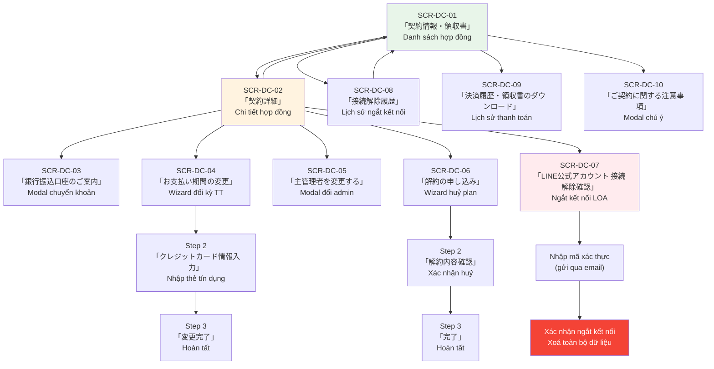

# UI Spec — 契約詳細 (Chi tiết hợp đồng) — FA-031

**Feature ID**: FA-031
**Tên JP**: 「契約プラン・決済情報」
**Tên VN**: Hợp đồng và thanh toán
**Portal**: Admin
**URL chính**: `/basic/point-settings` (danh sách), `/basic/detail-contract/{id}` (chi tiết)
**Ngày phân tích**: 2026-03-30
**Tổng số màn hình**: 10

---

## 1. Tổng quan

Tính năng quản lý hợp đồng và thanh toán cho phép Admin (chủ quản lý tài khoản) xem và quản lý tất cả LINE Official Account (LOA) đã đăng ký dưới tài khoản của mình. Bao gồm:

- Xem danh sách hợp đồng tất cả LOA (plan, trạng thái, giá, phương thức thanh toán)
- Xem chi tiết hợp đồng từng LOA (thông tin plan, lịch sử thanh toán, chủ quản lý)
- Đổi kỳ thanh toán (từ tháng sang năm, yêu cầu đăng ký thẻ tín dụng)
- Huỷ plan (có thu thập lý do, wizard 3 bước)
- Ngắt kết nối LOA (xoá vĩnh viễn dữ liệu trên Elme, yêu cầu xác thực email)
- Xem lịch sử ngắt kết nối
- Xem lịch sử thanh toán và tải receipt/lĩnh thu thư
- Đổi chủ quản lý (hướng dẫn qua My Page hoặc form bên ngoài)
- Xem thông tin chuyển khoản ngân hàng (cho thanh toán bank transfer)

## 2. Actors

| Actor | Vai trò trong tính năng |
|-------|------------------------|
| **Admin (Bot Admin)** | Xem/quản lý hợp đồng, thay đổi plan, huỷ, ngắt kết nối LOA |
| **System** | Xử lý thanh toán tự động, cưỡng chế giải ước khi quá hạn |

## 3. Danh sách màn hình

| Screen ID | Tên JP | Tên VN | URL | Loại |
|-----------|--------|--------|-----|------|
| SCR-DC-01 | 「契約情報・領収書」 | Danh sách hợp đồng & lĩnh thu thư | `/basic/point-settings` | Trang chính |
| SCR-DC-02 | 「契約詳細」 | Chi tiết hợp đồng | `/basic/detail-contract/{id}` | Trang chi tiết |
| SCR-DC-03 | 「銀行振込口座のご案内」 | Thông tin chuyển khoản ngân hàng | Modal trên SCR-DC-02 | Modal |
| SCR-DC-04 | 「お支払い期間の変更」 | Đổi kỳ thanh toán | Trang con từ SCR-DC-02 | Wizard 3 bước |
| SCR-DC-05 | 「主管理者を変更する」 | Đổi chủ quản lý | Modal trên SCR-DC-02 | Modal |
| SCR-DC-06 | 「解約の申し込み」 | Huỷ plan | Trang con từ SCR-DC-02 | Wizard 3 bước |
| SCR-DC-07 | 「LINE公式アカウント 接続解除確認」 | Xác nhận ngắt kết nối LOA | Trang con từ SCR-DC-02 | Trang xác nhận |
| SCR-DC-08 | 「接続解除履歴」 | Lịch sử ngắt kết nối | Trang con từ SCR-DC-01 | Trang danh sách |
| SCR-DC-09 | 「決済履歴・領収書のダウンロード」 | Lịch sử thanh toán & tải lĩnh thu thư | `/basic/payment-history` | Trang danh sách |
| SCR-DC-10 | 「ご契約に関する注意事項」 | Chú ý về hợp đồng | Modal trên SCR-DC-01 | Modal |

---

## 4. Chi tiết từng màn hình

### SCR-DC-01: 「契約情報・領収書」 — Danh sách hợp đồng & lĩnh thu thư

**URL**: `/basic/point-settings`
**Screenshot**: [SCR-DC-01](screenshots/SCR-DC-01-contract-list.png)

#### Layout
- **Header**: Logo「L Message」+ thanh top bar (tên LOA đang chọn, thống kê tin nhắn)
- **Sidebar trái**: Menu chính Admin portal (categories)
- **Main content**:
  - **Title bar**: Tiêu đề「契約情報・領収書」+ nút「ご契約に関する注意事項」
  - **Action bar**: Nút「接続解除履歴」(trái) + nút「領収書の発行」(phải, có icon)
  - **Alert banner**: Hiển thị khi có LOA đang bị lỗi thanh toán (nền đỏ nhạt, icon cảnh báo, tên LOA, mô tả lỗi, nút「詳細を確認」)
  - **Filter bar**: Checkbox trạng thái + ô tìm kiếm
  - **Bảng danh sách hợp đồng**: Bảng chính hiển thị tất cả LOA
  - **Pagination**: Dropdown chọn số dòng/trang (mặc định「100件 / ページ」)

#### Action Buttons

| Label (JP) | Loại | Vị trí | Hành vi |
|-----------|------|--------|---------|
| 「ご契約に関する注意事項」 | Text button (green) | Title bar, bên phải tiêu đề | Mở modal SCR-DC-10 |
| 「接続解除履歴」 | Button | Action bar, trái | Chuyển đến SCR-DC-08 |
| 「領収書の発行」 | Button (có icon) | Action bar, phải | Chuyển đến SCR-DC-09 |
| 「詳細を確認」 | Button (trong alert) | Alert banner | Chuyển đến SCR-DC-02 của LOA bị lỗi |
| 「詳細を確認」 | Button (trong bảng) | Cột cuối, cho LOA trạng thái「契約中」 | Chuyển đến SCR-DC-02 |
| 「契約詳細」 | Button (trong bảng) | Cột cuối, cho LOA trạng thái「正常」 | Chuyển đến SCR-DC-02 |
| 「アカウントの操作」 | Button (trong bảng) | Cột cuối, cho LOA trạng thái「解約済み」/「強制解約」 | Chuyển đến trang thao tác tài khoản |
| 「振込情報」 | Button (có icon) | Cột「ご利用料金」cho LOA「入金待ち」 | Mở modal thông tin chuyển khoản |
| 「請求書」 | Button (có icon) | Cột「ご利用料金」cho LOA「入金待ち」 | Tải hoặc xem hoá đơn |
| 「振込キャンセル」 | Button | Cột cuối, cho LOA「入金待ち」 | Huỷ đăng ký chuyển khoản |

#### Filter / Search

| Element | Label (JP) | Loại | Mặc định | Mô tả |
|---------|-----------|------|----------|-------|
| Checkbox 1 | 「契約中」 | Checkbox | Checked | Lọc LOA đang hợp đồng |
| Checkbox 2 | 「解約済み」 | Checkbox | Checked | Lọc LOA đã huỷ |
| Search box | 「LINE公式アカウント名・LINE IDで検索」 | Textbox + icon search | Trống | Tìm theo tên LOA hoặc LINE ID |

#### Data Table — Bảng hợp đồng

| # | Column Header (JP) | Dịch (VN) | Kiểu dữ liệu | Ghi chú |
|---|-------------------|-----------|--------------|---------|
| 1 | 「LINE公式アカウント名」 | Tên LINE OA | Text + avatar + LINE ID | Avatar LOA + tên + @ID. LOA chưa kết nối hiển thị「LINE公式アカウント未接続」. LOA bị lỗi có thêm cảnh báo. |
| 2 | 「ご利用プラン」 | Plan sử dụng | Badge + text | Tên plan (「フリー」/「スタンダード」/「プロ」/「おまとめ（スタンダード）」) + kỳ thanh toán (「月払い」/「年間一括払い」). Cho status「入金待ち」: hiển thị振込期限 + nút「振込情報」+「請求書」 |
| 3 | 「ステータス」 | Trạng thái | Badge | 「正常」(xanh),「延滞中」(đỏ/cam),「入金待ち」(vàng),「解約済み」(xám),「強制解約」(đỏ + tooltip icon) |
| 4 | 「ご利用料金」 | Phí sử dụng | Currency | Format: 「¥ {amount} / 月」hoặc「¥ {amount} / 年」. Cho「入金待ち」: hiển thị deadline + nút「振込情報」+「請求書」 |
| 5 | 「決済方法」 | Phương thức thanh toán | Text | 「カード決済（下4桁 XXXX）」hoặc「銀行振込」. LOA đã huỷ/giải ước: hiển thị「-」 |
| 6 | 「次回決済(更新)日」 | Ngày thanh toán tiếp theo | Date | Format: YYYY/MM/DD. LOA đã huỷ/giải ước: hiển thị ngày giải ước |
| 7 | 「LOA接続日」 | Ngày kết nối LOA | Date | Format: YYYY/MM/DD |
| 8 | 「契約の変更・解約」 | Thay đổi/huỷ hợp đồng | Button | Nút action thay đổi theo trạng thái (xem Action Buttons) |

#### Observations
- Alert banner chỉ xuất hiện khi có LOA đang gặp lỗi thanh toán (「決済エラー」/「延滞中」)
- Cột「ご利用料金」của LOA trạng thái「入金待ち」hiển thị khác biệt: không phải giá mà là deadline chuyển khoản + nút thao tác
- LOA trạng thái「強制解約」có icon tooltip bên cạnh badge (có thể hiển thị thông tin bổ sung khi hover)
- LOA「フリー」(miễn phí): giá hiển thị「¥ 0」, không có cột thanh toán/ngày gia hạn (hiển thị「-」)
- LOA chưa kết nối (「LINE公式アカウント未接続」): hiển thị icon mặc định thay cho avatar
- LOA có type「おまとめ」(bundled) hiển thị label「1枠」thay vì tên LOA
- Pagination mặc định 100 dòng/trang

---

### SCR-DC-02: 「契約詳細」 — Chi tiết hợp đồng

**URL**: `/basic/detail-contract/{id}`
**Screenshot**: [SCR-DC-02](screenshots/SCR-DC-02-contract-detail.png)

#### Layout
- **Breadcrumb**: 「契約情報・領収書」>「契約詳細」
- **Title**: 「契約詳細」
- **Alert section** (hiển thị có điều kiện):
  - Banner đỏ「決済エラー」: thông báo deadline cưỡng chế giải ước + nút「振込口座を確認する」
  - Banner vàng: nhắc nhở thanh toán trước deadline + link「指定口座」
- **LOA Info header**: Tên LOA + LINE ID (có avatar)
- **Contract Info section**: Các cặp label-value hiển thị thông tin hợp đồng
- **Operation History section**: Bảng lịch sử thao tác với filter
- **Footer**: Nút「戻る」(quay lại SCR-DC-01)

#### Contract Info Fields (hiển thị, không phải form)

| Label (JP) | Dịch (VN) | Giá trị mẫu | Ghi chú |
|-----------|-----------|-------------|---------|
| 「ステータス」 | Trạng thái | 「延滞中」 | Badge + mô tả cảnh báo nếu có lỗi |
| 「LINE公式アカウント接続日」 | Ngày kết nối LOA | 2023年04月17日 | Format: YYYY年MM月DD日 |
| --- | --- | (separator) | --- |
| 「ご契約プラン」 | Plan hợp đồng | 「プロ」 | Có icon plan bên trái |
| 「お支払い開始日」 | Ngày bắt đầu thanh toán | 2026年03月10日 | Format: YYYY年MM月DD日 |
| 「ご利用料金」 | Phí sử dụng | 33,000円 (税込) | Giá bao gồm thuế |
| 「お支払い期間」 | Kỳ thanh toán | 「毎月払い」 | + nút「次回決済から年払いに変更する」(xem Action Buttons) |
| 「次回決済日」 | Ngày thanh toán tiếp | 2026年03月24日 | Format: YYYY年MM月DD日 |
| 「決済方法」 | Phương thức thanh toán | 「銀行振込」 | Hoặc「クレジットカード」+ thông tin thẻ |
| --- | --- | (separator) | --- |
| 「主管理者」 | Chủ quản lý | Tên người dùng | + nút「主管理者を変更する」 |
| --- | --- | (separator) | --- |
| 「解約する」 | Huỷ hợp đồng | Mô tả + nút | Section riêng biệt |
| 「接続解除」 | Ngắt kết nối LOA | Mô tả + nút + link FAQ | Section riêng biệt |

#### Action Buttons

| Label (JP) | Loại | Vị trí | Hành vi |
|-----------|------|--------|---------|
| 「振込口座を確認する」 | Button (trong alert đỏ) | Alert section | Mở modal SCR-DC-03 |
| 「指定口座」 | Link (trong alert vàng) | Alert section | Mở modal SCR-DC-03 |
| 「次回決済から年払いに変更する」 | Button (text, green) | Dòng「お支払い期間」 | Chuyển đến SCR-DC-04 |
| 「主管理者を変更する」 | Button (text, green) | Dòng「主管理者」 | Mở modal SCR-DC-05 |
| 「有料プラン解約へ進む」 | Button (text, green) | Section「解約する」 | Chuyển đến SCR-DC-06 |
| 「接続解除へ進む」 | Button (text, green) | Section「接続解除」 | Chuyển đến SCR-DC-07 |
| 「よくある質問を見る」 | Link (có icon) | Section「接続解除」, bên cạnh tiêu đề | Mở trang FAQ (bên ngoài) |
| 「戻る」 | Button | Footer | Quay lại SCR-DC-01 |

#### Operation History Section (「操作履歴」)

| Element | Label (JP) | Loại | Mô tả |
|---------|-----------|------|-------|
| Tab/Filter 1 | 「全件表示」 | Clickable text | Hiển thị tất cả log |
| Date range | 「開始日 → 終了日」 | Date range picker | Lọc theo khoảng thời gian |
| Category filter | 「…開始」「…決済」「…変更」「…解約・エラー」 | Clickable tags/pills | Lọc theo loại sự kiện |
| Log area | 「アクティビティログ」 | Text area | Hiển thị log thao tác |
| Pagination | 「100件 / ページ」 | Dropdown | Chọn số dòng/trang |

#### Observations
- Alert section chỉ hiển thị khi LOA có lỗi thanh toán (「延滞中」hoặc「決済エラー」)
- Nút「次回決済から年払いに変更する」chỉ hiển thị khi kỳ thanh toán là「毎月払い」(tháng)
- Section「解約する」ghi chú:「有料プランを解約できます。ダウングレードはできません」(Có thể huỷ plan trả phí. Không thể downgrade.)
- Section「接続解除」ghi chú:「接続を解除すると、エルメ上のデータが全て消去されます」(Ngắt kết nối sẽ xoá toàn bộ dữ liệu trên Elme)
- Operation History có 4 loại filter: bắt đầu, thanh toán, thay đổi, huỷ/lỗi

---

### SCR-DC-03: 「銀行振込口座のご案内」 — Thông tin chuyển khoản ngân hàng

**URL**: Modal trên SCR-DC-02
**Screenshot**: [SCR-DC-03](screenshots/SCR-DC-03-transfer-info-modal.png)

#### Layout
- **Modal dialog** overlay trên SCR-DC-02
- **Header**: Nút đóng (X) + tiêu đề heading「銀行振込口座のご案内」
- **Mô tả**: Giải thích quy trình xác nhận thanh toán tự động
- **Transfer Info section**: Bảng thông tin tài khoản ngân hàng
- **Notes section**: Danh sách chú ý quan trọng
- **Footer**: Nút「閉じる」

#### Transfer Info Fields (hiển thị)

| Label (JP) | Dịch (VN) | Giá trị mẫu | Ghi chú |
|-----------|-----------|-------------|---------|
| 「銀行名」 | Tên ngân hàng | (bị ẩn trong data) | — |
| 「支店名」 | Tên chi nhánh | (bị ẩn trong data) | — |
| 「口座種別」 | Loại tài khoản | 「普通」 | Tài khoản thường |
| 「口座番号」 | Số tài khoản | (bị ẩn trong data) | — |
| 「口座名義」 | Tên chủ tài khoản | (bị ẩn trong data) | Dự kiến:「ｶ)ﾕﾆｳﾞｱﾍﾟｲｷﾔｽﾄ」 |
| 「振込期日」 | Hạn chuyển khoản | (bị ẩn trong data) | — |
| 「お支払い総額」 | Tổng số tiền thanh toán | ￥0（税込） | Giá trị sample = 0 (LOA test) |

#### Notes (「注意事項」)
1. Phí chuyển khoản do người dùng chịu
2. Thông tin tài khoản cũng được gửi qua email đăng ký
3. Nếu không nhận được thanh toán trước deadline, đăng ký sẽ bị vô hiệu. Lưu ý thời gian xác nhận qua cuối tuần
4. Nếu bị vô hiệu, cần thao tác đăng ký lại
5. Xác nhận thanh toán tự động bởi hệ thống thanh toán; nếu số tiền chuyển không đúng sẽ không được xác nhận
6. Phí sử dụng được thanh toán qua hệ thống thanh toán của UnivaPay (ｶ)ﾕﾆｳﾞｧﾍﾟｲｷﾔｽﾄ)

#### Action Buttons

| Label (JP) | Loại | Hành vi |
|-----------|------|---------|
| (X icon) | Close button | Đóng modal |
| 「閉じる」 | Button | Đóng modal |

#### Observations
- Dữ liệu ngân hàng thực tế bị ẩn trong snapshot (privacy) nhưng cấu trúc fields rõ ràng
- Giải thích mô tả: hệ thống thanh toán tự động kiểm tra, thường xác nhận trong vài phút - vài giờ. Cuối tuần có thể chậm hơn
- Đề cập rõ ràng đến UnivaPay (株式会社ユニヴァ・ペイキャスト) là PSP (Payment Service Provider)

---

### SCR-DC-04: 「お支払い期間の変更」 — Đổi kỳ thanh toán

**URL**: Trang con từ SCR-DC-02
**Screenshot**: [SCR-DC-04](screenshots/SCR-DC-04-change-bill-type.png)

#### Layout
- **Breadcrumb**: 「契約情報・領収書」>「契約詳細」>「お支払い期間の変更」
- **Title**: 「お支払い期間の変更」
- **Wizard steps** (3 bước):
  1. 「お支払い期間の変更」(Xác nhận thay đổi) — hiện tại
  2. 「クレジットカード情報入力」(Nhập thẻ tín dụng)
  3. 「変更完了」(Hoàn tất)
- **Confirmation section**: Bảng xác nhận thông tin thay đổi
- **Footer**: Nút「戻る」+「クレジットカードの登録に進む」

#### Confirmation Fields (hiển thị, Step 1)

| Label (JP) | Dịch (VN) | Giá trị mẫu | Ghi chú |
|-----------|-----------|-------------|---------|
| 「対象アカウント」 | Tài khoản đối tượng | Dưa hấu | Tên LOA |
| 「ご契約プラン」 | Plan hợp đồng | 「プロ」 | — |
| 「ご利用料金」 | Phí sử dụng | 33,000円 | Giá tháng hiện tại |
| 「お支払い期間」 | Kỳ thanh toán | 「月払い → 年間一括払い」 | Hiển thị thay đổi from → to |
| 「決済方法」 | Phương thức thanh toán | 「銀行振込」 | Phương thức hiện tại |
| 「決済カード情報」 | Thông tin thẻ thanh toán | 「クレジットカード」 | + ghi chú:「※月払いはクレジットカード決済のみとなります。」|
| (footer note) | Ghi chú | 「次回決済日：2026年03月24日から年払いに変更されます」 | Thời điểm áp dụng thay đổi |

#### Action Buttons

| Label (JP) | Loại | Vị trí | Hành vi |
|-----------|------|--------|---------|
| 「戻る」 | Button (outline) | Footer trái | Quay lại SCR-DC-02 |
| 「クレジットカードの登録に進む」 | Button (primary) | Footer phải | Chuyển sang Step 2 (nhập thẻ) |

#### Observations
- Chuyển từ tháng sang năm BẮT BUỘC phải đăng ký thẻ tín dụng (「※月払いはクレジットカード決済のみとなります。」)
- Ghi chú quan trọng: thay đổi sẽ áp dụng từ ngày thanh toán tiếp theo
- Step 2 và Step 3 không được capture (cần điều tra thêm về form nhập thẻ tín dụng — có thể là iframe UnivaPay/Stripe)
- Wizard chỉ hỗ trợ chiều: tháng -> năm. KHÔNG hỗ trợ năm -> tháng (suy luận từ nút trên SCR-DC-02 chỉ hiển thị「次回決済から年払いに変更する」)

---

### SCR-DC-05: 「主管理者を変更する」 — Đổi chủ quản lý

**URL**: Modal trên SCR-DC-02
**Screenshot**: [SCR-DC-05](screenshots/SCR-DC-05-change-admin-modal.png)

#### Layout
- **Modal dialog** overlay trên SCR-DC-02
- **Header**: Nút đóng (X) + tiêu đề heading「主管理者を変更する」
- **Content**: 2 trường hợp hướng dẫn
- **Footer**: Nút「閉じる」

#### Content — 2 trường hợp

**Trường hợp 1**: Người dùng chưa đăng ký trên Elme (email chưa tồn tại)
- Tiêu đề:「エルメに未登録のユーザー（メールアドレス）を主管理者にする」
- Hướng dẫn: Vào「マイページ」(My Page) → đổi tên người dùng, email, mật khẩu
- Link đến: `/admin/setting` (My Page)

**Trường hợp 2**: Người dùng đã đăng ký trên Elme (email đã tồn tại)
- Tiêu đề:「エルメに登録済みのユーザー（メールアドレス）を主管理者に変更する」
- Hướng dẫn: Gửi form「主管理者変更申請フォーム」(form bên ngoài Tayori)
- Link đến: `https://tayori.com/form/161edb9a4342dcd97474c0da90dba8bddcf5c11b`
- Phí: 有料（11,000円/1件）— Mất phí 11,000 JPY/lần

#### Action Buttons

| Label (JP) | Loại | Hành vi |
|-----------|------|---------|
| (X icon) | Close button | Đóng modal |
| 「閉じる」 | Button | Đóng modal |

#### Observations
- Đổi chủ quản lý KHÔNG thực hiện trực tiếp trong hệ thống — chỉ hướng dẫn
- Trường hợp 1 (chưa đăng ký): tự làm qua My Page (miễn phí)
- Trường hợp 2 (đã đăng ký): phải gửi form bên ngoài + mất phí 11,000 JPY

---

### SCR-DC-06: 「解約の申し込み」 — Huỷ plan

**URL**: Trang con từ SCR-DC-02
**Screenshot**: [SCR-DC-06](screenshots/SCR-DC-06-cancel-plan.png)

#### Layout
- **Breadcrumb**: 「契約情報・領収書」>「契約詳細」>「解約の申し込み」
- **Title**: 「解約の申し込み」
- **Wizard steps** (3 bước):
  1. 「解約理由の選択」(Chọn lý do huỷ) — hiện tại
  2. 「解約内容確認」(Xác nhận nội dung huỷ)
  3. 「完了」(Hoàn tất)
- **Form**: Tiêu đề + danh sách checkbox lý do + textbox bổ sung
- **Footer**: Nút「キャンセル」+「決済に進む」

#### Form Fields (Step 1)

| Field | Label (JP) | Type | Required | Ghi chú |
|-------|-----------|------|----------|---------|
| Heading | 「解約理由をご選択ください」 | — | — | Tiêu đề form |
| Sub-heading | 「回答必須 / 複数選択可能」 | — | — | Bắt buộc trả lời / có thể chọn nhiều |
| Checkbox 1 | 「LINE公式アカウントだけで運用ができる」 | Checkbox | Ít nhất 1 | Chỉ dùng LINE OA là đủ |
| Checkbox 2 | 「売上拡大など想定していた効果が得られなかった」 | Checkbox | — | Không đạt hiệu quả mong đợi |
| Checkbox 3 | 「料金が高い」 | Checkbox | — | Phí cao |
| Checkbox 4 | 「利用したい機能がない」 | Checkbox | — | Không có tính năng muốn dùng |
| Checkbox 5 | 「システムが使いにくい / 使い方がわからない」 | Checkbox | — | Hệ thống khó dùng |
| Checkbox 6 | 「LINE公式アカウント自体が利用停止になった」 | Checkbox | — | LOA bị ngừng sử dụng |
| Checkbox 7 | 「他社のサービスに乗り換える」 | Checkbox | — | Chuyển sang dịch vụ khác |
| Checkbox 8 | 「LINE公式アカウント自体を利用しなくなった」 | Checkbox | — | Không dùng LOA nữa |
| Checkbox 9 | 「サービス・サポートが悪い」 | Checkbox | — | Dịch vụ/hỗ trợ kém |
| Checkbox 10 | 「間違えて契約した」 | Checkbox | — | Đăng ký nhầm |
| Checkbox 11 | 「その他（入力欄にご記入ください）」 | Checkbox | — | Khác (ghi rõ) |
| Free text | (không label) | Textbox (multiline) | Không | Nhập lý do bổ sung (hiển thị kèm option「その他」) |

#### Action Buttons

| Label (JP) | Loại | Vị trí | Hành vi |
|-----------|------|--------|---------|
| 「キャンセル」 | Button (outline) | Footer trái | Quay lại SCR-DC-02 |
| 「決済に進む」 | Button (primary) | Footer phải | Chuyển sang Step 2 (xác nhận) |

#### Observations
- Bắt buộc chọn ít nhất 1 lý do (「回答必須」)
- Có thể chọn nhiều lý do (「複数選択可能」)
- 11 options lý do huỷ — dữ liệu survey quan trọng cho business
- Step 2 (xác nhận) và Step 3 (hoàn tất) chưa được capture
- Nút ghi「決済に進む」(Tiếp tục thanh toán) — lạ cho flow huỷ, có thể label sai hoặc có bước thanh toán liên quan

---

### SCR-DC-07: 「LINE公式アカウント 接続解除確認」 — Xác nhận ngắt kết nối LOA

**URL**: Trang con từ SCR-DC-02
**Screenshot**: [SCR-DC-07](screenshots/SCR-DC-07-disconnect-loa.png)

#### Layout
- **Main content** (article):
  - Heading:「LINE公式アカウント 接続解除確認」(có icon cảnh báo)
  - Section「ご確認事項」(Xác nhận): 3 điểm cảnh báo quan trọng
  - Cảnh báo bổ sung về dữ liệu không thể phục hồi
  - Nút gửi mã xác thực qua email
- **Footer**: Link「戻る」(quay lại)

#### Confirmation Warnings (「ご確認事項」)

1. Sau khi ngắt kết nối, ngay lập tức không thể thao tác, xem dữ liệu đã đăng ký, sao chép, hoặc kiểm tra thông tin bạn bè
2. Nếu Rich Menu đang được hiển thị trên Elme mà ngắt kết nối, thiết lập hiển thị có thể tồn tại tối đa 24 giờ. Khuyến nghị xoá Rich Menu trên Elme trước khi ngắt
3. Nếu còn thời hạn hợp đồng trả phí, sẽ bị coi là huỷ hợp đồng từ hôm nay, mất quyền sử dụng đến ngày thanh toán tiếp theo. Không hoàn tiền theo ngày

**Cảnh báo cuối**: Sau khi ngắt kết nối, toàn bộ dữ liệu liên quan đến LOA trên Elme sẽ không thể phục hồi. Hãy xác nhận kỹ trước khi tiếp tục.

#### Action Buttons

| Label (JP) | Loại | Vị trí | Hành vi |
|-----------|------|--------|---------|
| 「認証コードをメールで受け取る」 | Button (primary) | Sau cảnh báo | Gửi mã xác thực qua email đăng ký → hiển thị form nhập mã |
| 「戻る」 | Link/Button | Footer | Quay lại SCR-DC-02 |

#### Observations
- Flow ngắt kết nối YÊU CẦU xác thực email (2-step verification)
- Bước 1: Đọc cảnh báo → bấm gửi mã
- Bước 2 (chưa capture): Nhập mã xác thực → xác nhận ngắt kết nối
- Đây là thao tác NGUY HIỂM NHẤT — xoá vĩnh viễn toàn bộ dữ liệu LOA trên Elme
- Khác với「解約」(huỷ plan): huỷ plan giữ dữ liệu, ngắt kết nối xoá dữ liệu

---

### SCR-DC-08: 「接続解除履歴」 — Lịch sử ngắt kết nối

**URL**: Trang con từ SCR-DC-01
**Screenshot**: [SCR-DC-08](screenshots/SCR-DC-08-disconnect-history.png)

#### Layout
- **Breadcrumb**: 「TOP」>「接続解除履歴」
- **Title bar**: 「接続解除履歴」+ mô tả:「接続解除したLINE公式アカウントの復元はできません。」
- **Data Table**: Bảng lịch sử
- **Footer**: Nút「戻る」+ pagination「100件 / ページ」

#### Data Table

| # | Column Header (JP) | Dịch (VN) | Kiểu dữ liệu |
|---|-------------------|-----------|--------------|
| 1 | 「接続解除日時」 | Ngày giờ ngắt kết nối | Datetime |
| 2 | 「LINE公式アカウント名」 | Tên LINE OA | Text |
| 3 | 「操作したユーザー」 | Người thao tác | Text (user name) |

#### Action Buttons

| Label (JP) | Loại | Hành vi |
|-----------|------|---------|
| 「戻る」 | Button | Quay lại SCR-DC-01 |

#### Observations
- Bảng trống trong screenshot (「まだデータがありません」— Chưa có dữ liệu)
- Dữ liệu chỉ hiển thị, không có thao tác phục hồi (ghi rõ: không thể phục hồi)
- Pagination mặc định 100 dòng/trang

---

### SCR-DC-09: 「決済履歴・領収書のダウンロード」 — Lịch sử thanh toán & tải lĩnh thu thư

**URL**: `/basic/payment-history`
**Screenshot**: [SCR-DC-09](screenshots/SCR-DC-09-receipt-history.png)

#### Layout
- **Title**: 「決済履歴・領収書のダウンロード」
- **Year summary section**:
  - Year navigation (mũi tên trái/phải + hiển thị năm, VD:「2026年」)
  - Nút「年間決済一覧」(xem tổng hợp theo năm)
  - Bảng tổng hợp theo tháng (12 dòng cho 12 tháng)
- **Month detail section** (hiển thị khi bấm「詳細を確認 >」):
  - Header: tên tháng + nút「一括発行」/「個別発行」+ nút「一括ダウンロード」
  - Bảng chi tiết thanh toán trong tháng
- **Pagination**: 「100/page」

#### Year Summary Table

| # | Column Header (JP) | Dịch (VN) | Kiểu dữ liệu |
|---|-------------------|-----------|--------------|
| 1 | 「年月」 | Năm tháng | Text (YYYY年MM月分) |
| 2 | 「ご請求額」 | Số tiền thanh toán | Currency (XX,XXX 円) hoặc「- 円」nếu chưa có |
| 3 | (action) | — | Link「詳細を確認 >」 |

#### Month Detail Table

| # | Column Header (JP) | Dịch (VN) | Kiểu dữ liệu | Ghi chú |
|---|-------------------|-----------|--------------|---------|
| 1 | 「契約(更新)日」 | Ngày hợp đồng/gia hạn | Date (YYYY/MM/DD) | Có nút sort (mũi tên lên/xuống) |
| 2 | 「LINE公式アカウント名」 | Tên LINE OA | Text | Tên LOA |
| 3 | 「利用料 (税込)」 | Phí sử dụng (gồm thuế) | Currency (XXX,XXX 円) | — |
| 4 | 「契約プラン」 | Plan hợp đồng | Text | 「プロ」/「スタンダード」/... |
| 5 | 「支払い」 | Kỳ thanh toán | Text | 「年間一括払い」/「月払い」 |
| 6 | 「決済方法」 | Phương thức thanh toán | Text | 「クレジットカード (下4桁 XXXX)」/「銀行振込」 |
| 7 | 「備考」 | Ghi chú | Text | Thường「-」 |
| 8 | 「課金ID」 | ID thanh toán | UUID | ID từ hệ thống thanh toán (PSP) |

#### Action Buttons

| Label (JP) | Loại | Vị trí | Hành vi |
|-----------|------|--------|---------|
| (mũi tên trái) | Navigation | Year nav | Chuyển năm trước |
| (mũi tên phải) | Navigation | Year nav | Chuyển năm sau |
| 「年間決済一覧」 | Button (có icon) | Year nav | Xem/tải tổng hợp năm |
| 「詳細を確認 >」 | Link | Cột cuối bảng tổng hợp | Mở chi tiết tháng đó |
| 「一括発行」 | Tab/dropdown option | Month detail header | Phát hành lĩnh thu thư hàng loạt |
| 「個別発行」 | Tab/dropdown option | Month detail header | Phát hành lĩnh thu thư từng dòng |
| 「一括ダウンロード」 | Button (có icon download) | Month detail header | Tải toàn bộ lĩnh thu thư tháng |

#### Observations
- Dữ liệu hiển thị theo năm → mở chi tiết theo tháng
- Mỗi dòng chi tiết là 1 lần thanh toán cho 1 LOA
- Có thể có nhiều dòng cùng LOA cùng ngày (ví dụ: retry thanh toán)
- UUID「課金ID」là ID từ hệ thống PSP (UnivaPay/Stripe)
- Hỗ trợ tải lĩnh thu thư:「一括発行」(hàng loạt) hoặc「個別発行」(từng dòng)
- Year navigation cho phép xem lịch sử nhiều năm
- Cột「契約(更新)日」có thể sort (ascending/descending)

---

### SCR-DC-10: 「ご契約に関する注意事項」 — Chú ý về hợp đồng

**URL**: Modal trên SCR-DC-01
**Screenshot**: [SCR-DC-10](screenshots/SCR-DC-10-contract-notes-modal.png)

#### Layout
- **Modal dialog** overlay trên SCR-DC-01
- **Header**: Nút đóng (X) + tiêu đề heading「ご契約に関する注意事項」
- **Content**: Danh sách các điều khoản chú ý
- **Footer**: Nút「閉じる」

#### Nội dung chú ý (8 điều)

1. Sao kê thẻ tín dụng sẽ ghi「L Message」「エルメッセージ」
2. Huỷ hợp đồng có thể thực hiện bất kỳ lúc nào (không hoàn tiền theo ngày)
3. Huỷ hợp đồng năm cũng không hoàn tiền phần thời gian còn lại
4. Không thể downgrade từ plan trả phí sang plan khác
5. Sau khi huỷ plan trả phí, dữ liệu đăng ký vẫn còn nhưng không thể thao tác/xem
6. Sau khi huỷ, đăng ký lại plan trả phí sẽ khôi phục quyền thao tác/xem dữ liệu
7. Hợp đồng năm cũng tự động gia hạn (auto-renewal)
8. Phí sử dụng L Message được thanh toán qua hệ thống thanh toán của UnivaPay. Nếu chuyển khoản ngân hàng, tên chủ tài khoản nhận là「ｶ)ﾕﾆｳﾞｱﾍﾟｲｷﾔｽﾄ」

#### Action Buttons

| Label (JP) | Loại | Hành vi |
|-----------|------|---------|
| (X icon) | Close button | Đóng modal |
| 「閉じる」 | Button | Đóng modal |

---

## 5. User Flows

### Flow 1: Xem chi tiết hợp đồng LOA
1. Admin vào「契約プラン・決済情報」từ sidebar menu
2. Trang SCR-DC-01 hiển thị danh sách LOA
3. Admin bấm「詳細を確認」hoặc「契約詳細」trên dòng LOA
4. Chuyển sang SCR-DC-02 — xem thông tin chi tiết

### Flow 2: Đổi kỳ thanh toán (tháng -> năm)
1. Từ SCR-DC-02, Admin bấm「次回決済から年払いに変更する」
2. Chuyển sang SCR-DC-04 Step 1 — xem xác nhận thay đổi
3. Bấm「クレジットカードの登録に進む」→ Step 2 (nhập thẻ)
4. Nhập thẻ → Step 3 (hoàn tất)

### Flow 3: Huỷ plan
1. Từ SCR-DC-02, Admin bấm「有料プラン解約へ進む」
2. Chuyển sang SCR-DC-06 Step 1 — chọn lý do huỷ (bắt buộc)
3. Bấm「決済に進む」→ Step 2 (xác nhận nội dung huỷ)
4. Xác nhận → Step 3 (hoàn tất)

### Flow 4: Ngắt kết nối LOA (xoá dữ liệu)
1. Từ SCR-DC-02, Admin bấm「接続解除へ進む」
2. Chuyển sang SCR-DC-07 — đọc cảnh báo
3. Bấm「認証コードをメールで受け取る」→ nhận mã qua email
4. Nhập mã xác thực → xác nhận ngắt kết nối

### Flow 5: Xem thông tin chuyển khoản
1. Từ SCR-DC-02 (LOA thanh toán ngân hàng), bấm「振込口座を確認する」hoặc link「指定口座」
2. Modal SCR-DC-03 hiển thị thông tin tài khoản ngân hàng
3. Bấm「閉じる」để đóng

### Flow 6: Xem lịch sử thanh toán & tải receipt
1. Từ SCR-DC-01, bấm「領収書の発行」
2. Chuyển sang SCR-DC-09 — hiển thị bảng tổng hợp theo năm
3. Bấm「詳細を確認 >」trên tháng cần xem → mở chi tiết
4. Bấm「一括ダウンロード」hoặc「個別発行」để tải receipt

### Flow 7: Đổi chủ quản lý
1. Từ SCR-DC-02, bấm「主管理者を変更する」
2. Modal SCR-DC-05 hiển thị hướng dẫn 2 trường hợp
3. Admin tự thực hiện theo hướng dẫn (qua My Page hoặc form bên ngoài)

---

## 6. Flow Diagram

---

## 7. Điểm chưa rõ / Cần điều tra

| # | Câu hỏi | Nguồn | Mức độ |
|---|---------|-------|--------|
| 1 | Step 2 + Step 3 của wizard đổi kỳ thanh toán (SCR-DC-04): form nhập thẻ tín dụng sử dụng iframe PSP nào? UnivaPay hay Stripe? | Cần capture thêm | Trung bình |
| 2 | Step 2 + Step 3 của wizard huỷ plan (SCR-DC-06): nội dung xác nhận hiển thị gì? Có summary lý do đã chọn không? | Cần capture thêm | Trung bình |
| 3 | Nút「決済に進む」trên SCR-DC-06 — tại sao ghi "tiếp tục thanh toán" cho flow huỷ? Có bước thanh toán phí huỷ không? | Cần xác nhận | Cao |
| 4 | Form nhập mã xác thực trên SCR-DC-07 (sau khi bấm gửi mã): UI hiển thị thế nào? Có timeout không? | Cần capture thêm | Trung bình |
| 5 | Alert banner trên SCR-DC-01: cụ thể hiển thị bao nhiêu LOA lỗi? Chỉ 1 hay tất cả? | Cần kiểm tra | Thấp |
| 6 | LOA trạng thái「入金待ち」: nút「振込情報」mở modal giống SCR-DC-03 hay khác? | Cần kiểm tra | Thấp |
| 7 | Các giá trị status khác ngoài「正常」「延滞中」「入金待ち」「解約済み」「強制解約」— có status nào khác không? (VD:「解約予定」,「一時停止」) | Cần source code | Trung bình |
| 8 | Operation History (SCR-DC-02): format log chi tiết? Có pagination không? Dữ liệu mẫu? | Cần capture có data | Thấp |
| 9 | LOA type「おまとめ」(bundled) — hiển thị「1枠」thay vì tên LOA: đây là loại contract đặc biệt gì? | Cần business context | Trung bình |
| 10 | Receipt download (SCR-DC-09):「一括発行」vs「個別発行」— sự khác biệt chính xác? Format file output (PDF?)? | Cần test thực tế | Thấp |
| 11 | Nút「アカウントの操作」cho LOA đã huỷ/giải ước — dẫn đến trang nào? Có thể tái đăng ký plan không? | Cần capture thêm | Trung bình |
| 12 | Kỳ thanh toán: chỉ hỗ trợ tháng -> năm? Có flow năm -> tháng không? | Cần source code | Trung bình |
