# FA-038 「友だち情報詳細」 (Friend Detail / My Page) — Database Mapping

> Mapping UI fields ↔ DB columns. Schema source: `db/schema/tables/{table}.sql`. Sample data không có (`db/data/tables/` chưa export).
> Mức độ tin cậy mặc định **Cao** (xác nhận từ logic-spec models + schema). Mức **Trung bình/Thấp** ghi rõ.

## 1. Tổng quan

| Nhóm | Số bảng | Liệt kê |
|------|---------|---------|
| Primary (lưu data hiển thị trực tiếp) | **15** | `line_user`, `bot_line_user`, `bots`, `conversation`, `friend_information_setting`, `friend_information_value`, `scenario_lineuser`, `scenario`, `step_message`, `step_message_history`, `tags`, `tag_line_user`, `category`, `user_event`, `events` |
| Secondary (join phụ trợ + nguồn của tab phụ) | **23** | `affiliaters`, `rich_menus`, `landing`, `detail_landing_click`, `template`, `tmp_button`, `buttons`, `tmp_introduction`, `tmp_location`, `messages`, `event_step`, `event_times`, `form_answer`, `form_answer_result`, `form_answer_user_accept`, `b_user_booking`, `b_event_detail`, `b_slot`, `b_plan_slot`, `s_order_history`, `s_cycle_order_history`, `s_items`, `strip_bot` |
| Queue (cho Spring Boot) | **5** | `sync_elasticsearch`, `scenario_step_time`, `event_step_time`, `action_schedules`, `user_event` |
| Cleanup cascade (chỉ ảnh hưởng khi Delete) | **15+** | `bot_line_user_item`, `auto_reply_history`, `user_button`, `mobile_notify`, `bot_friend_statistic`, `status_chat`, `calendar_salon_line_booking`, `b_c_user_booking`, `calendar_course_bookings`, `user_open_formanswer`, `conversion_result`, `url_shorten`, `url_shorten_detail`, `detail_url_click`, `time_action_landing`, `collect_open_landings`, `landing_histories`, `activity_logs` |

**Tổng cộng**: ~58 bảng liên quan trực tiếp đến trang FA-038 (load + actions + cascade delete).

**Coverage tổng quan UI fields**:
- SCR-FMP-01 (基本情報): 15/15 fields = 100% (6 basic + 9 custom)
- SCR-FMP-02 (ステップ配信): 6/6 fields = 100%
- SCR-FMP-03 (リマインド配信): 4/4 fields = 100%
- SCR-FMP-04 (タグ): 2/2 fields = 100%
- SCR-FMP-05 (イベント予約): 3/3 fields = 100%
- SCR-FMP-06 (購入履歴): 5/5 fields = 100%
- SCR-FMP-07 (フォーム回答): 2/2 fields = 100%
- **Tổng**: 37/37 = **100%** mapped (mức tin cậy phần lớn Cao, một số Trung bình)

---

## 2. Primary Tables

### 2.1 `line_user` — Profile gốc người dùng LINE

Lưu thông tin profile từ LINE platform + thông tin profile do Admin chỉnh sửa.

| Tên cột | Kiểu | Null | Default | Key | Mô tả |
|---------|------|------|---------|-----|-------|
| `id` | int(12) | No | — | PK | Khóa chính, tham chiếu từ URL `/basic/friendlist/my_page/{id}` (SCR-FMP-01) |
| `line_id` | varchar(128) | No | — | | LINE User ID gốc từ LINE platform (Uxxxx...) |
| `name` | varchar(128) | Yes | NULL | | Tên hiển thị mới nhất do LINE API trả về (sync mỗi lần load page) |
| `real_name` | varchar(128) | Yes | NULL | | Tên thật (legacy) |
| `status_message` | text | Yes | NULL | | Status message từ LINE |
| `avatar_url` | varchar(256) | Yes | NULL | | URL ảnh đại diện LINE |
| `view_name` | varchar(128) | Yes | NULL | | Tên hệ thống do Admin nhập (「システム表示名」) |
| `add_friend_url` | varchar(250) | Yes | NULL | | URL kết bạn |
| `phone_number` | varchar(15) | Yes | NULL | | Số điện thoại (form 「携帯電話」) |
| `email` | varchar(100) | Yes | NULL | | Email (「メールアドレス」) |
| `birthday` | date | Yes | NULL | | Sinh nhật (system field id=-4) |
| `age` | int(11) | Yes | NULL | | Tuổi |
| `province` | varchar(255) | Yes | NULL | | Tỉnh/thành (system field id=-6) |
| `action_count` | int(11) | Yes | 0 | | Đếm action |
| `created_at` | datetime | No | CURRENT_TIMESTAMP | | Thời gian tạo |
| `updated_at` | datetime | Yes | CURRENT_TIMESTAMP | | Thời gian cập nhật |
| `action` | int(11) | Yes | NULL | | Action gần nhất |
| `type` | tinyint(4) | No | 0 | | 0: line user, 1: group chat, 2: member in group |

- Source: `db/schema/tables/line_user.sql`
- Dùng tại: SCR-FMP-01 (LINE名, システム表示名, メールアドレス, 携帯電話, birthday, province)
- Mối quan hệ: 1↔N với `bot_line_user` (1 LINE user có thể follow nhiều bot)
- Update từ EP-01 (sync name từ LINE), EP-11 (saveCustomInfo: view_name, phone_number, email, birthday, province), EP-12 (legacy updateLineInfo)

### 2.2 `bot_line_user` — Liên kết bot ↔ user (state per-bot)

Lưu state người bạn trong context 1 bot — quan trọng nhất cho FA-038.

| Tên cột | Kiểu | Null | Default | Key | Mô tả |
|---------|------|------|---------|-----|-------|
| `id` | int(11) | No | — | PK | Khóa chính |
| `line_user_id` | int(11) | No | — | FK → `line_user.id` | Tham chiếu user gốc |
| `bot_id` | int(11) | No | — | FK → `bots.id` | Bot context |
| `affiliater_id` | int(11) | Yes | NULL | FK → `affiliaters.id` | 「紹介アフィリエイター」 SCR-FMP-01 |
| `rich_menu_id` | int(11) | Yes | NULL | FK → `rich_menus.id` | 「表示中リッチメニュー」 SCR-FMP-01 |
| `followed_at` | timestamp | Yes | NULL | | 「友だち追加日時」 SCR-FMP-01 |
| `is_blocked` | int(11) | Yes | 0 | | Trạng thái block (0/1) — Header「ブロック」 |
| `status` | int(11) | Yes | 0 | | Trạng thái chung (legacy) |
| `memo` | text | Yes | NULL | | 「メモ」 SCR-FMP-01 (option 1 — ưu tiên) |
| `phone_number` | varchar(25) | Yes | NULL | | Số điện thoại snapshot per-bot |
| `is_tester` | tinyint(1) | No | 0 | | Đánh dấu là tester (EP-13) |
| `is_friend` | int(11) | No | 0 | | 0/1 friend status |
| `u_code` | varchar(50) | Yes | NULL | | Unique code |
| `contact_status` | int(11) | No | 0 | | 0=chưa đk; 1=đk; 2=hợp đồng; 3=hủy hợp đồng |
| `register_service_date` | datetime | Yes | NULL | | |
| `register_contact_date` | datetime | Yes | NULL | | |
| `cancel_contact_date` | datetime | Yes | NULL | | |
| `paypal_product_id` | varchar(255) | Yes | NULL | | |
| `paypal_plan_id` | varchar(255) | Yes | NULL | | |
| `paypal_subcription_id` | varchar(255) | Yes | NULL | | |
| `paypal_error_message` | varchar(255) | Yes | NULL | | |
| `time_unlink_rich_menu` | bigint(20) | Yes | 0 | | |
| `action_count` | int(11) | No | 0 | | |
| `updated_at` | timestamp | Yes | NULL | | |
| `created_at` | timestamp | No | CURRENT_TIMESTAMP | | |
| `is_quick_reply` | tinyint(4) | Yes | NULL | | |

- Source: `db/schema/tables/bot_line_user.sql`
- Dùng tại: SCR-FMP-01 (followed_at, affiliater_id, rich_menu_id, memo, is_tester), Header (is_blocked)
- Update từ EP-07 (block: is_blocked=1), EP-10 (memo), EP-11 (gián tiếp qua line_user), EP-13 (is_tester), EP-34 (rich_menu_id)
- **Lưu ý**: Không có cột `landing_id` trực tiếp — 「QRコードアクション」 trong UI lấy từ `detail_landing_click` JOIN `landing` (xem mục 5).

### 2.3 `bots` — Cấu hình bot

| Tên cột (chỉ liệt kê cột liên quan FA-038) | Kiểu | Null | Default | Mô tả |
|---------|------|------|---------|-------|
| `id` | int(12) | No | — | PK |
| `bot_name` | varchar(128) | Yes | NULL | Tên bot |
| `view_name` | varchar(128) | Yes | NULL | Tên hiển thị bot |
| `channel_access_token` | varchar(500) | Yes | NULL | Token gọi LINE Messaging API (EP-01 sync name, EP-34 rich menu) |
| `setting_info_my_page` | text | Yes | NULL | JSON config 「表示設定」 cho 2 bảng 基本情報/友だち情報 (EP-14) |
| `count_user_unconfirm` | int(11) | No | 0 | Recompute sau block/delete |
| `last_time_count_user_confirm` | datetime | Yes | NULL | Timestamp recompute lần cuối |
| `count_app_notify` | int(11) | Yes | 0 | Đếm notify (recompute khi delete) |
| `domain_url_shorten` | varchar(255) | Yes | NULL | Dùng cho URL shortener (sub-page EP-29) |

- Source: `db/schema/tables/bots.sql` (117 cột — chỉ liệt kê liên quan)
- Dùng tại: Header (channel_access_token cho LINE API call), 「表示設定」 modal SCR-FMP-01 (`setting_info_my_page`)

### 2.4 `conversation` — Hội thoại bot ↔ user

| Tên cột | Kiểu | Null | Default | Key | Mô tả |
|---------|------|------|---------|-----|-------|
| `id` | int(11) | No | — | PK | Khóa chính |
| `conversation_name` | varchar(255) | No | — | | Tên hội thoại |
| `bot_id` | int(11) | No | — | FK | Bot context |
| `line_id` | varchar(255) | No | — | | LINE user id (chuỗi) |
| `tb_line_user_id` | int(11) | Yes | NULL | FK → `line_user.id` | Liên kết tới user trong DB |
| `conversation_kind` | int(11) | Yes | 0 | | Loại |
| `last_message` | text | Yes | NULL | | Nội dung tin gần nhất |
| `last_time_message` | timestamp | Yes | NULL | | 「最終メッセージ受信」 SCR-FMP-01 |
| `confirm_count` | int(11) | Yes | 0 | | Số tin chưa đọc |
| `status_last_message` | int(11) | Yes | 1 | | |
| `has_status_0..9` | int(11) | Yes | 0 | | Bitfield trạng thái có trong cuộc hội thoại |
| `is_blocked` | int(11) | No | — | | 0/1 — bị block |
| `blocked_by` | tinyint(4) | No | 0 | | 0=user, 1=admin (EP-07 set =1) |
| `blocked_at` | datetime | Yes | NULL | | Thời điểm block (EP-07) |
| `is_old_friend` | tinyint(4) | No | 0 | | Để hiển thị badge「既存友だち」/「新規友だち」 SCR-FMP-01 |
| `is_hide` | tinyint(4) | No | 0 | | 0/1 — hide friend |
| `datetime_hide` | datetime | Yes | NULL | | Thời điểm hide |
| `memo` | varchar(256) | Yes | NULL | | 「メモ」 SCR-FMP-01 (option 2 — fallback khi không có bot_line_user.id) |
| `id_status` | int(11) | Yes | NULL | FK → `status_chat.id` | Status chat đang gắn |
| `is_bookmark` | int(11) | No | 0 | | |
| `created_at` | timestamp | No | CURRENT_TIMESTAMP | | |
| `updated_at` | timestamp | Yes | NULL | | |

- Source: `db/schema/tables/conversation.sql`
- Dùng tại: Header (is_blocked, blocked_at), SCR-FMP-01 (last_time_message, is_old_friend, memo)
- Update từ EP-07 (block), EP-10 (memo), EP-08 (cascade delete)
- **Quan trọng**: Memo có thể lưu ở **một trong hai chỗ** — `bot_line_user.memo` (nếu request gửi `id`) hoặc `conversation.memo` (nếu chỉ có `conversation_id`). Hai cột không sync — xem BR-17 trong logic-spec. **Mức độ tin cậy: Trung bình** (cần kiểm tra runtime).

### 2.5 `friend_information_setting` — Định nghĩa custom field

Bảng meta — định nghĩa các trường thông tin tùy chỉnh cho bạn.

| Tên cột | Kiểu | Null | Default | Mô tả |
|---------|------|------|---------|-------|
| `id` | int(10) UNSIGNED | No | — | PK (id âm = system fields) |
| `bot_id` | int(11) | No | — | Bot owner |
| `order` | int(11) | No | 0 | Thứ tự hiển thị trong UI 「友だち情報」 |
| `title` | varchar(255) | No | — | Tên field hiển thị (vd: 「date 1」, 「ảnh」, 「kieu point 1」) |
| `group_id` | int(11) | No | 0 | Folder ID (category cho field) |
| `type_data` | int(11) | No | — | **Loại data** (xem mapping mục 8): 1=select, 2=input, 3=calendar, 4=image, 5=file, 6=point |
| `default_value` | varchar(500) | Yes | NULL | Giá trị mặc định |
| `setting_value` | text | Yes | NULL | JSON: với select → list option; với image → ràng buộc |
| `total_user_has_value` | int(11) | No | 0 | Counter — số user đã có value |
| `calendar_id` | bigint(20) | Yes | NULL | Liên kết calendar (nếu calendar field) |
| `calendar_salon_id` | bigint(20) | Yes | NULL | Liên kết calendar salon |
| `form_answer_detail_id` | bigint(20) | Yes | NULL | Liên kết form answer detail |
| `created_at` | timestamp | No | CURRENT_TIMESTAMP | |
| `updated_at` | timestamp | No | CURRENT_TIMESTAMP | |

- Source: `db/schema/tables/friend_information_setting.sql`
- Dùng tại: SCR-FMP-01 「友だち情報」 (render danh sách field)
- **System fields (id âm hardcoded)**: `-1` name, `-2` system_display_name, `-4` birthday, `-6` province, `-7` zip_code, `-8` district, `-9` township, `-10` building (xem BR-05 logic-spec)
- **Mức độ tin cậy: Cao** cho schema; **Trung bình** cho mapping `type_data` 1-6 (suy luận từ comment SQL — xem mục 8 để bàn).

### 2.6 `friend_information_value` — Giá trị custom field per-user (EAV)

| Tên cột | Kiểu | Null | Default | Key | Mô tả |
|---------|------|------|---------|-----|-------|
| `id` | int(10) UNSIGNED | No | — | PK | Khóa chính |
| `bot_id` | int(11) | No | — | FK | Bot context |
| `friend_information_setting_id` | int(11) | No | — | FK → `friend_information_setting.id` | Field id (có thể âm cho system field) |
| `line_id` | int(11) | No | — | FK → `line_user.id` | User |
| `value` | varchar(500) | Yes | NULL | | Giá trị (EAV) — chứa text/date/image path/option_id |
| `action` | int(4) | Yes | NULL | | Action liên quan |
| `friend_info_option_id` | int(11) | Yes | NULL | FK | ID option khi `type_data=1` (select) |
| `created_at` | timestamp | No | CURRENT_TIMESTAMP | | |
| `updated_at` | timestamp | No | CURRENT_TIMESTAMP | | |

- Source: `db/schema/tables/friend_information_value.sql`
- Dùng tại: SCR-FMP-01 「友だち情報」 (giá trị từng field)
- 1 record per (line_id × friend_information_setting_id)
- Update từ EP-11: upsert, increment `friend_information_setting.total_user_has_value` nếu user lần đầu có value
- **Pattern EAV thuần**: cột `value` lưu mọi loại data dưới dạng string (date format YYYY-MM-DD, image lưu path S3). Riêng `select` dùng `friend_info_option_id` (FK) thay vì lưu trong `value`. **Mức độ tin cậy: Trung bình** (cần verify runtime cho image vs text).

### 2.7 `scenario_lineuser` — Subscription user × scenario

| Tên cột | Kiểu | Null | Default | Mô tả |
|---------|------|------|---------|-------|
| `id` | int(12) | No | — | PK |
| `bot_id` | int(12) | No | — | Bot |
| `scenario_id` | int(12) | No | — | FK → `scenario.id` |
| `line_user_id` | int(12) | No | — | FK → `line_user.id` |
| `is_following` | int(12) | Yes | NULL | **State**: 1=running (配信中), 0=stopped (停止中), 2=finished |
| `start_day` | int(12) | Yes | NULL | Offset ngày bắt đầu |
| `start_time` | time | Yes | NULL | Giờ bắt đầu |
| `sent_start_day` | int(11) | No | -1 | Ngày bắt đầu thực gửi |
| `sent_start_time` | time | No | — | Giờ bắt đầu thực gửi |
| `delay_time` | bigint(20) | No | 0 | Delay tích lũy |
| `last_time_send_delay_2` | bigint(20) | No | 0 | |
| `start_datetime` | datetime | Yes | NULL | Thời điểm chính thức bắt đầu |
| `stop_datetime` | datetime | Yes | NULL | Thời điểm dừng |
| `is_deleted` | tinyint(1) | Yes | 0 | Soft delete |
| `created_at` | timestamp | No | CURRENT_TIMESTAMP | |
| `updated_at` | timestamp | Yes | NULL | |

- Source: `db/schema/tables/scenario_lineuser.sql`
- Dùng tại: SCR-FMP-02 (「配信中のステップ」 + 「次回配信予定」)
- Update từ EP-07/EP-08 (set is_following=0), EP-16/EP-17/EP-19 (changeScenario insert/update)

### 2.8 `scenario` — Định nghĩa scenario

| Tên cột (chỉ liên quan FA-038) | Kiểu | Mô tả |
|---------|------|-------|
| `id` | int(11) | PK |
| `bot_id` | int(11) | Bot |
| `name` | varchar(200) | Tên scenario (hiển thị 「配信中のステップ」) |
| `status` | int(11) | Trạng thái scenario |
| `count_follow` | int(11) | Đếm user đang follow (decrement khi block) |
| `count_stop` | int(11) | Đếm user đã stop |
| `count_unfinish` | int(11) | Đếm user chưa hoàn thành (increment khi block) |
| `is_deleted` | int(11) | Soft delete |

- Source: `db/schema/tables/scenario.sql`
- Dùng tại: SCR-FMP-02 (JOIN lấy `name`)

### 2.9 `step_message` — Định nghĩa step trong scenario

| Tên cột (chỉ liên quan) | Kiểu | Mô tả |
|---------|------|-------|
| `id` | int(10) UNSIGNED | PK |
| `scenario_id` | int(11) | FK → `scenario.id` |
| `template_id`, `template_id_2`, `template_id_3` | int(11) | Template messages |
| `template_ids` | varchar(500) | Comma-separated template IDs (mới) |
| `start_day` | int(11) | Offset ngày |
| `start_time` | time | Giờ |
| `order_number` | int(11) | Thứ tự (dùng tính 「N通目」) |
| `name` | varchar(255) | Tên step (hiển thị 「ステップ名」) |
| `is_deleted` | int(11) | Soft delete |

- Source: `db/schema/tables/step_message.sql`
- Dùng tại: SCR-FMP-02 (JOIN cột 「ステップ名」, tính 「通数」)

### 2.10 `step_message_history` — Log lịch sử gửi step

| Tên cột | Kiểu | Mô tả |
|---------|------|-------|
| `id` | int(10) UNSIGNED | PK |
| `bot_id` | int(11) | Bot |
| `line_user_id` | int(11) | User |
| `scenario_id` | int(11) | Scenario |
| `step_mesage_id` | int(11) | (typo: thiếu chữ s) FK → `step_message.id` |
| `send_time` | datetime | 「配信日時」 |
| `status` | tinyint(4) | **Enum**: 2=配信済み (sent), 3=配信エラー (error), 4=絞り込み配信対象外 (filtered out) |
| `is_last_step` | tinyint(4) | Có phải step cuối |
| `created_at` | timestamp | |
| `updated_at` | timestamp | |

- Source: `db/schema/tables/step_message_history.sql`
- Dùng tại: SCR-FMP-02 「配信履歴」 table (paginate 20/page hoặc 5/page tùy view)
- **Mức độ tin cậy enum status: Trung bình** (suy luận từ logic-spec — query `WHERE status IN [2,3,4]`)

### 2.11 `tags` — Định nghĩa tag

| Tên cột (chỉ liên quan) | Kiểu | Mô tả |
|---------|------|-------|
| `id` | int(12) | PK |
| `bot_id` | int(12) | Bot |
| `name` | varchar(255) | 「タグ」 hiển thị |
| `category_id` | int(12) | FK → `category.id` (folder) |
| `count_user_tag` | int(11) | Đếm user gắn tag |
| `is_limit` | tinyint(4) | 0/1 — tag có giới hạn user |
| `limit` | int(11) | Số user tối đa |
| `action_id` | int(11) | Action chạy khi gắn (BR-06) |
| `limit_action_id` | int(11) | Action thay thế khi đạt limit (BR-07) |
| `scenario_id` | int(12) | Auto-trigger scenario (BR-06) |
| `deleted_at` | timestamp | Soft delete |

- Source: `db/schema/tables/tags.sql`
- Dùng tại: SCR-FMP-04 (cột 「タグ」)

### 2.12 `tag_line_user` — M-to-M user × tag

| Tên cột | Kiểu | Null | Default | Mô tả |
|---------|------|------|---------|-------|
| `id` | int(12) | No | — | PK |
| `line_user_id` | int(12) | Yes | NULL | FK |
| `tag_id` | int(12) | Yes | NULL | FK |
| `is_deleted` | tinyint(1) | Yes | NULL | Soft delete (1=deleted) |
| `created_at` | datetime | No | — | |
| `updated_at` | datetime | Yes | NULL | |

- Source: `db/schema/tables/tag_line_user.sql`
- Dùng tại: SCR-FMP-04 (toàn bộ tab タグ)
- Update từ EP-21 (saveTagLine — diff add/remove), EP-23 (removeTagLineUserMyPage — chip click)

### 2.13 `category` — Folder/category dùng chung

| Tên cột | Kiểu | Mô tả |
|---------|------|-------|
| `id` | int(11) | PK (`0` = 未分類 / Uncategorized) |
| `bot_id` | int(11) | Bot |
| `kind` | int(11) | Loại category — `tags` dùng kind tag, `friend_information` dùng kind=`information_friend` |
| `name` | varchar(100) | 「フォルダ」 hiển thị |
| `position` | int(11) | Thứ tự |
| `is_deleted` | int(11) | Soft delete |

- Source: `db/schema/tables/category.sql`
- Dùng tại: SCR-FMP-04 (cột 「フォルダ」), 「友だち情報」 cũng dùng category cho field grouping
- **Lưu ý**: `cat_id=0` trong query EP-06 → tag thuộc folder 「未分類」 — không có row category id=0 mà là quy ước "không có category".

### 2.14 `user_event` — Subscription reminder per user × event

| Tên cột | Kiểu | Mô tả |
|---------|------|-------|
| `id` | int(10) UNSIGNED | PK |
| `event_id` | int(11) | FK → `events.id` |
| `user_id` | varchar(256) | line_user_id (lưu dạng string) |
| `bot_id` | int(11) | Bot |
| `event_time_id` | int(11) | FK → `event_times.id` |
| `register_date_time` | datetime | Thời điểm user đăng ký event |
| `created_at` | timestamp | |
| `updated_at` | timestamp | |

- Source: `db/schema/tables/user_event.sql`
- Dùng tại: SCR-FMP-03 「配信中のリマインド」
- Update: EP-20 (stopRemind: DELETE), EP-08 (cascade delete)
- **Lưu ý**: `user_id` lưu dạng `varchar(256)` (legacy, có thể chứa LINE user id chuỗi).

### 2.15 `events` — Định nghĩa event/reminder

| Tên cột | Kiểu | Mô tả |
|---------|------|-------|
| `id` | int(10) UNSIGNED | PK |
| `form_answer_id` | int(11) | Liên kết form (nếu reminder từ form) |
| `booking_calendar_id` | int(11) | Liên kết booking calendar (nếu reminder từ booking) |
| `bot_id` | int(11) | Bot |
| `category_id` | int(11) | Folder |
| `position` | int(11) | Thứ tự |
| `type` | int(11) | Loại event |
| `event_name` | varchar(256) | 「リマインド名」 SCR-FMP-03 |

- Source: `db/schema/tables/events.sql`
- Dùng tại: SCR-FMP-03 (cột 「リマインド名」)

---

## 3. Secondary Tables (tóm tắt cột chính)

### 3.1 Tab 基本情報 phụ trợ

| Bảng | Cột chính dùng | Mục đích |
|------|----------------|---------|
| `affiliaters` | `id`, `username`, `email`, `aff_code` | 「紹介アフィリエイター」 (JOIN bot_line_user.affiliater_id) |
| `rich_menus` | `id`, `name`, `chat_bar_name`, `status_rich`, `status_line`, `default_menu` | 「表示中リッチメニュー」 (JOIN bot_line_user.rich_menu_id); EP-34 gán LINE rich_menu_id |
| `landing` | `id`, `name`, `code`, `total_user_click`, `total_user_friend`, `count_action_web`, `count_action` | 「QRコードアクション」 (JOIN qua `detail_landing_click`) |
| `detail_landing_click` | `id`, `landing_id`, `bot_line_user_id`, `bot_id`, `time_click`, `action`, `is_old_friend` | Bridge giữa user ↔ landing để xác định QR đã click |

### 3.2 Tab ステップ配信 phụ trợ

| Bảng | Cột chính | Mục đích |
|------|-----------|---------|
| `template` | `id`, `name`, `type`, `content`, `category_id`, `bot_id` | 「メッセージ」 preview |
| `tmp_button`, `buttons` | (tương tự) | Render button trong template |
| `tmp_introduction`, `tmp_location` | | Render carousel introduction/location |
| `category` (kind=template) | | Folder template |

### 3.3 Tab リマインド配信 phụ trợ

| Bảng | Cột chính | Mục đích |
|------|-----------|---------|
| `event_step` | `id`, `event_id`, `templates_id`, `time_send`, `before_day`, `time_send_type` | Step config |
| `event_times` | `id`, `event_id`, `bot_id`, `event_date`, `event_start_time`, `count_user_registed` | Time slot — lấy `time_finish` |

### 3.4 Tab フォーム回答 phụ trợ

| Bảng | Cột chính | Mục đích |
|------|-----------|---------|
| `form_answer` | `id`, `bot_id`, `name`, `title`, `count_user_reply` | Form definition |
| `form_answer_result` | `id`, `form_id`, `line_id`, `data` (JSON), `created_at`, `duration_time_reply`, `aff_result_id`, `deleted_at`, `status_sync_deleted` | Câu trả lời (paginate 5/trang); `data` = JSON các answer; `duration_time_reply` = 「推定ページ表示時間」 |
| `form_answer_user_accept` | `id`, `form_id`, `line_user_id`, `deadline` | User chấp nhận form |
| `form_answer_details` | (tham chiếu) | Chi tiết câu hỏi |

### 3.5 Tab イベント予約 phụ trợ

| Bảng | Cột chính | Mục đích |
|------|-----------|---------|
| `b_user_booking` | `id`, `bot_id`, `event_detail_id`, `slot_id`, `event_time_id`, `line_user_id`, `plan_slot_id`, `quantity`, `status` (enum), `amount`, `created_at`, `aff_result_id` | Booking record (「参加（予定）日時」 lấy từ `b_slot.date_start_from + time_start`) |
| `b_event_detail` | `id`, `bot_id`, `title`, `title_event` | 「イベント名」 SCR-FMP-05 |
| `b_slot` | `id`, `bot_id`, `event_detail_id`, `date_start_from`, `time_start`, `time_end`, `use_people` | Slot/timeslot — xác định ngày giờ |
| `b_plan_slot` | `id`, `slot_id`, `name`, `limit`, `remain_limit`, `price` | Plan ticket — decrement `remain_limit` khi delete user |
| `calendar_salon_line_booking` | `id`, `line_user_id`, `date_booking`, `start_time`, `end_time`, `status`, `payment_status` | Booking calendar salon (delete cascade khi remove user) |
| `b_c_user_booking` | `id`, `line_user_id`, `date`, `time_start`, `status`, `event_id_google_calendar` | Booking calendar lesson (delete cascade + Google Calendar API delete) |

### 3.6 Tab 購入履歴 phụ trợ

| Bảng | Cột chính | Mục đích |
|------|-----------|---------|
| `s_order_history` | `id`, `bot_id`, `line_user_id`, `item_id`, `name_item`, `amount_order`, `status_order` (1=success/2=cancelled/3=bill error), `payment_date`, `register_date`, `o_strip_charge_id` (注文番号), `error_message` | Đơn hàng đơn lẻ 単品商品 |
| `s_cycle_order_history` | `id`, `bot_id`, `line_user_id`, `item_id`, `name_item`, `amount_item`, `cycle_payment`, `c_register_date`, `c_cancel_date`, `last_bill_id`, `c_strip_charge_id` | Đơn hàng định kỳ 継続商品 |
| `s_items` | `id`, `bot_id`, `name`, `amount`, `is_product_new` | Sản phẩm — JOIN lấy 「商品名」 |
| `strip_bot` | `id`, `bot_id`, `account_live_id` | Stripe account ID per bot — kiểm tra đã connect chưa |

### 3.7 Bảng phụ trợ chung

| Bảng | Cột chính | Mục đích |
|------|-----------|---------|
| `messages` | `id`, `bot_id`, `conversation_id`, `msg_kind`, `content`, `type`, `created_at` | Insert msg kind BLOCK_FRIEND khi block (EP-07); table sharded theo năm `messages2025`, `messages2024` |
| `bot_friend_statistic` | `bot_id`, `count_user_followed`, `count_user_unfollowed`, `statistic_date` | Daily stat — decrement khi delete user |
| `mobile_notify` | `id`, `line_user_id`, `bot_id`, `type`, `notify_time` | App notify — delete cascade |
| `status_chat` | `id`, `bot_id`, `name_status`, `count` | Status chat — decrement count khi block/delete |
| `bot_line_user_item` | `id`, `bot_id`, `bot_line_user_id`, `item_id` | Item của user — delete cascade |
| `activity_logs` | `id`, `user_id`, `action_type`, `action_name`, `target_id`, `description`, `old_value`, `new_value` | Audit trail (`addLogUserAction`) |

---

## 4. Queue Tables (cho Spring Boot consumer)

> **Lưu ý**: FA-038 không có job-spec riêng. Producer (controllers) ghi vào các bảng queue dưới đây; Spring Boot consumer (ngoài scope FA-038) đọc và xử lý.

### 4.1 `sync_elasticsearch`

| Cột | Kiểu | Mô tả |
|-----|------|-------|
| `id` | int(10) UNSIGNED | PK |
| `type` | int(11) | **Enum**: TYPE_BOT_LINE_USER=0, TYPE_LINE_USER=1, TYPE_CONVERSATION=2, TYPE_TAG=3, TYPE_FRIEND_INFO=4, TYPE_LANDING=5, TYPE_SCENARIO=6, TYPE_CONVERSION=7 |
| `line_user_id` | int(11) | User |
| `bot_id` | int(11) | Bot |
| `status` | int(11) | **State machine**: 0=WAIT_SYNC, 1=SYNCHRONIZING, 2=SYNC_SUCCESS, 3=SYNC_ERROR |
| `data_sync` | text | JSON delta |
| `time_sync_success` | varchar(255) | Thời điểm sync thành công |
| `message_error` | varchar(255) | Lỗi nếu fail |
| `created_at` | timestamp | |
| `updated_at` | timestamp | |

- Producer FA-038: EP-01 (sync name), EP-08 (delete_line_user), EP-11 (update view_name), EP-23 (user_tag)
- Index polling cần: `(status, created_at)` để consumer fetch batch

### 4.2 `scenario_step_time`

| Cột | Kiểu | Mô tả |
|-----|------|-------|
| `id` | int(10) UNSIGNED | PK |
| `user_id` | int(11) | line_user_id |
| `step_mesage_id` | int(11) | FK → `step_message.id` (typo) |
| `send_time` | datetime | Thời điểm gửi |
| `bot_id` | int(11) | Bot |
| `status` | tinyint(4) | **State**: 0=pending, 1=processed (Spring Boot mark) |
| `is_last_step` | tinyint(4) | |
| `is_same` | tinyint(4) | |
| `created_at` | timestamp | |
| `updated_at` | timestamp | |

- Producer FA-038: EP-16/EP-17/EP-19 (INSERT status=0 khi changeScenario), EP-21 (gián tiếp qua sendAction)
- Consumer DELETE FA-038: EP-07 (block), EP-08 (delete cascade)
- Index polling cần: `(status, send_time)`

### 4.3 `event_step_time`

| Cột | Kiểu | Mô tả |
|-----|------|-------|
| `id` | int(10) UNSIGNED | PK |
| `event_id` | int(11) | FK → `events.id` |
| `event_time_id` | int(11) | FK → `event_times.id` |
| `event_step_id` | int(11) | FK → `event_step.id` |
| `bot_id` | int(11) | |
| `user_id` | int(11) | line_user_id |
| `user_booking_id` | int(11) | Booking nếu reminder từ booking |
| `sent_date_time` | datetime | Thời điểm gửi |
| `status` | tinyint(4) | **State**: 0=pending, 1=processed |
| `total_send` | int(11) | Số lần gửi tích lũy |
| `form_result_id` | int(11) | Nếu reminder từ form_answer_result |
| `form_item_id` | bigint(20) | |
| `datetime_end` | datetime | |
| `created_at` | timestamp | |
| `updated_at` | timestamp | |

- Producer FA-038: EP-11 (settingEventTimeFriendInfo cho birthday d_4)
- Consumer DELETE FA-038: EP-08 (cascade)
- Index polling cần: `(status, sent_date_time)`

### 4.4 `action_schedules`

| Cột | Kiểu | Mô tả |
|-----|------|-------|
| `id` | int(10) UNSIGNED | PK |
| `name` | varchar(255) | |
| `action_id` | int UNSIGNED | FK → action |
| `category_id` | int UNSIGNED | |
| `from_id` | int(11) | Sender (Auth::id()) |
| `profile_send` | int(11) | Profile gửi |
| `next_running_day` | datetime | Lần chạy kế |
| `start_date`, `start_time` | date, time | |
| `end_date_type` | varchar(255) | unlimited / day_limit / times |
| `repeat_type` | varchar(255) | monthly / weeks / months |
| `end_date`, `number_of_repetitions` | | |
| `bot_id` | int UNSIGNED | |
| `status` | tinyint(4) | State |
| `action_count`, `number_user_filter`, `filter_ids` | | |
| `first_day_of_running`, `created_at`, `updated_at` | | |

- Producer FA-038: EP-21 (sendAction qua tag), EP-37 (sendActionFriend với allUser ≥ 200)
- Index polling: `(status, next_running_day)`

### 4.5 `user_event` (vừa là primary table SCR-FMP-03 vừa là queue trigger)

Đã mô tả mục 2.14. Spring Boot reminder scheduler xem `user_event` để biết user nào còn subscribe → enqueue `event_step_time`.

---

## 5. UI ↔ DB Field Mapping (per tab)

### 5.1 SCR-FMP-01 — Tab 「基本情報」

#### 5.1.1 Bảng 「基本情報」 (6 hàng cố định)

| UI Element | Label JP | DB Table | Column | Mapping Type | Confidence | Ghi chú |
|------------|----------|----------|--------|--------------|------------|---------|
| Tên LINE | 「LINE名」 | `line_user` | `name` (sync từ LINE API) hoặc `view_name` (fallback) | Direct | Cao | EP-01 sync name từ LINE Messaging API; nếu khác → UPDATE + insert sync_es |
| Ngày kết bạn + badge | 「友だち追加日時」 | `bot_line_user` + `conversation` | `bot_line_user.followed_at` (datetime) + `conversation.is_old_friend` (badge 既存/新規) | Direct + JOIN | Cao | Format `2025.08.26 12:32`; badge: 0=新規友だち, 1=既存友だち |
| Affiliater | 「紹介アフィリエイター」 | `bot_line_user` + `affiliaters` | `bot_line_user.affiliater_id` JOIN `affiliaters.username` | FK JOIN | Cao | Hiển thị `-` nếu NULL |
| Rich Menu hiện tại | 「表示中リッチメニュー」 | `bot_line_user` + `rich_menus` | `bot_line_user.rich_menu_id` JOIN `rich_menus.name`/`chat_bar_name` | FK JOIN | Cao | Hiển thị `-` nếu NULL; EP-34 update |
| QR Code Action | 「QRコードアクション」 | `landing` + `detail_landing_click` | `detail_landing_click.bot_line_user_id` → `landing_id` JOIN `landing.name` | Bridge JOIN | Trung bình | Lấy landing user đã click; có thể null (`-`) |
| Tin nhắn cuối nhận | 「最終メッセージ受信」 | `conversation` | `conversation.last_time_message` | Direct | Cao | Format `YYYY.MM.DD HH:mm` |

#### 5.1.2 Bảng 「友だち情報」 (Custom Fields)

| UI Element | Label JP | DB Table | Column | Mapping Type | Confidence | Ghi chú |
|------------|----------|----------|--------|--------------|------------|---------|
| Date 1 | 「date 1」 | `friend_information_value` | `value` (date format) where `friend_information_setting_id` JOIN `friend_information_setting.title='date 1'`, `type_data=3` | EAV | Cao | Trống = chưa có row trong `friend_information_value` |
| Date 2 | 「date 2」 | (như trên) | (như trên, `title='date 2'`) | EAV | Cao | |
| Tên hệ thống | 「システム表示名」 | `line_user` | `view_name` | Direct | Cao | System field id `-2`; lưu trực tiếp ở `line_user.view_name` (không qua EAV) |
| Ảnh | 「ảnh」 | `friend_information_value` + `friend_information_setting` (`type_data=4`) | `value` = path file (S3/Backblaze); EP-28 trả signed URL | EAV | Cao | Render thumbnail + nút 編集 |
| Select | 「select」 | `friend_information_value` + `friend_information_setting` (`type_data=1`) | `friend_info_option_id` (FK option) | EAV + FK | Cao | Option list từ `friend_information_setting.setting_value` (JSON) |
| Email | 「メールアドレス」 | `line_user` | `email` | Direct | Cao | EP-11 update |
| Phone | 「携帯電話」 | `line_user` | `phone_number` | Direct | Cao | EP-11 update; phone format `0...` được convert `+81...` ở EP-12 |
| Custom text | 「test act EDIT 16.10」 | `friend_information_value` | `value` (text), `type_data=2` | EAV | Cao | Field do Admin tạo |
| Number/Point | 「kieu point 1」 | `friend_information_value` | `value` (số dưới dạng string), `type_data=6` | EAV | Cao | Type point — số nguyên |

#### 5.1.3 Vùng Memo

| UI Element | Label JP | DB Table | Column | Mapping Type | Confidence | Ghi chú |
|------------|----------|----------|--------|--------------|------------|---------|
| Textarea memo | 「メモ」 | `bot_line_user` (option 1) hoặc `conversation` (option 2) | `bot_line_user.memo` (text) hoặc `conversation.memo` (varchar 256) | Direct (2 path) | Trung bình | EP-10 — tùy request gửi `id` (bot_line_user.id) hay `conversation_id` |

#### 5.1.4 System Address Fields (id âm)

| UI (vùng địa chỉ) | DB Table | Column | Mapping Type | Confidence |
|---------|----------|--------|--------------|------------|
| Zip code | `friend_information_value` (id=-7) | `value` | EAV system field | Cao |
| District | `friend_information_value` (id=-8) | `value` | EAV system field | Cao |
| Township | `friend_information_value` (id=-9) | `value` | EAV system field | Cao |
| Building | `friend_information_value` (id=-10) | `value` | EAV system field | Cao |

### 5.2 SCR-FMP-02 — Tab 「ステップ配信」

#### 5.2.1 Bảng 「ステップ配信情報」 (state hiện tại)

| UI Element | Label JP | DB Table | Column | Mapping Type | Confidence | Ghi chú |
|------------|----------|----------|--------|--------------|------------|---------|
| Scenario đang chạy | 「配信中のステップ」 | `scenario_lineuser` + `scenario` | `scenario_lineuser` (is_following=1) JOIN `scenario.name` | FK JOIN | Cao | EP-03 trả `scenarioRunning.name_scenario` |
| Lần gửi kế | 「次回配信予定」 | `scenario_step_time` | `send_time` WHERE status=0 ORDER BY send_time ASC LIMIT 1 | Computed | Cao | Hiển thị `停止中` khi không có scenario running hoặc không có row pending |

#### 5.2.2 Data Table 「配信履歴」

| UI Element | Label JP | DB Table | Column | Mapping Type | Confidence | Ghi chú |
|------------|----------|----------|--------|--------------|------------|---------|
| Ngày gửi | 「配信日時」 | `step_message_history` | `send_time` | Direct | Cao | |
| Tên step | 「ステップ名」 | `step_message_history` + `scenario` | `scenario_id` JOIN `scenario.name` | FK JOIN | Cao | |
| Số tin (N通目) | 「通数」 | Computed | Tính bằng index của `step_mesage_id` trong list step của scenario | Computed | Trung bình | Logic O(n²) trong `getDataMyPage` (xem logic-spec BR-13) |
| Trạng thái | 「配信ステータス」 | `step_message_history` | `status` (enum 2/3/4) | Direct enum | Trung bình | 2=配信済み, 3=配信エラー, 4=絞り込み配信対象外 |
| Message | 「メッセージ」 | `step_message` + `template` | `step_message.template_ids` → JOIN `template` (preview) | Computed | Cao | Hiển thị tag list type message; hover preview |
| Action | 「プレビュー」 | — (read-only) | — | — | Cao | Modal load template content |

### 5.3 SCR-FMP-03 — Tab 「リマインド配信」

#### Data Table 「配信中のリマインド」

| UI Element | Label JP | DB Table | Column | Mapping Type | Confidence | Ghi chú |
|------------|----------|----------|--------|--------------|------------|---------|
| Tên reminder | 「リマインド名」 | `events` | `event_name` | FK JOIN qua `user_event.event_id` | Cao | |
| Thời điểm kết thúc | 「リマインド終了日時」 | `event_times` | `event_date + event_start_time` (compose) | Computed | Cao | Lấy từ `event_times` của `user_event.event_time_id` |
| Lần gửi kế | 「次回配信予定日時」 | `event_step_time` | `sent_date_time` WHERE status=0 ORDER BY ASC LIMIT 1 | Computed | Cao | |
| Action | 停止 button | `user_event` | DELETE WHERE id | Action | Cao | EP-20 |

### 5.4 SCR-FMP-04 — Tab 「タグ」

#### 5.4.1 Bảng 「現在ついているタグ」

| UI Element | Label JP | DB Table | Column | Mapping Type | Confidence | Ghi chú |
|------------|----------|----------|--------|--------------|------------|---------|
| Folder | 「フォルダ」 | `category` | `name` (kind=tag) | FK JOIN qua `tags.category_id` → `category.id` | Cao | `0` hoặc null = 「未分類」 |
| Tag chip | 「タグ」 | `tags` | `name` | M-to-M qua `tag_line_user` | Cao | EP-06 trả `is_selected` flag |

#### 5.4.2 Folder list (cột trái) + Tag list (cột phải)

| UI | DB | Mapping | Confidence |
|----|------|---------|------------|
| Folder list | SELECT * FROM `category` WHERE `bot_id=current` AND `kind=`information_friend` (hoặc kind=tag) | Direct query | Cao |
| Tag list theo folder | EP-06: `tags` LEFT JOIN `tag_line_user` ON tag_id (filter category_id, is_selected) | Computed | Cao |

### 5.5 SCR-FMP-05 — Tab 「イベント予約」

#### Data Table 「イベント参加履歴」

| UI Element | Label JP | DB Table | Column | Mapping Type | Confidence | Ghi chú |
|------------|----------|----------|--------|--------------|------------|---------|
| Ngày tham gia | 「参加（予定）日時」 | `b_slot` | `date_start_from + time_start` (compose); JOIN từ `b_user_booking.slot_id` | Computed | Cao | Hoặc `calendar_salon_line_booking.date_booking + start_time` cho salon booking |
| Tên event | 「イベント名」 | `b_event_detail` | `title` hoặc `title_event` | FK JOIN qua `b_user_booking.event_detail_id` | Cao | |
| Trạng thái | 「ステータス」 | `b_user_booking` | `status` (enum 1-7) | Direct enum | Cao | 1=approve, 2=deny, 3=pending, 4=cancel, 5=booking, 6=request change, 7=request cancel (xem comment SQL) |

### 5.6 SCR-FMP-06 — Tab 「購入履歴」

#### 5.6.1 Toggle 単品商品 (single product)

| UI Element | Label JP | DB Table | Column | Mapping Type | Confidence |
|------------|----------|----------|--------|--------------|------------|
| Ngày mua | 「購入日時」 | `s_order_history` | `payment_date` (hoặc `register_date`) | Direct | Cao |
| Mã đơn | 「注文番号」 | `s_order_history` | `o_strip_charge_id` (hoặc Hashids encode `id`) | Direct/Computed | Trung bình |
| Tên SP | 「商品名」 | `s_order_history` + `s_items` | `name_item` (snapshot) hoặc JOIN `s_items.name` | Direct/JOIN | Cao |
| Giá mua | 「購入価格」 | `s_order_history` | `amount_order` | Direct | Cao |
| Kết quả thanh toán | 「決済結果」 | `s_order_history` | `status_order` (1=thành công, 2=hủy, 3=bill lỗi) | Direct enum | Cao |

#### 5.6.2 Toggle 継続商品 (subscription)

| UI Element | Label JP | DB Table | Column | Mapping Type | Confidence |
|------------|----------|----------|--------|--------------|------------|
| Ngày đăng ký | 「購入日時」 | `s_cycle_order_history` | `c_register_date` | Direct | Cao |
| Mã đơn | 「注文番号」 | `s_cycle_order_history` | `c_strip_charge_id` (hoặc id) | Direct | Trung bình |
| Tên SP | 「商品名」 | `s_cycle_order_history` | `name_item` | Direct | Cao |
| Giá | 「購入価格」 | `s_cycle_order_history` | `amount_item` | Direct | Cao |
| Trạng thái | 「決済結果」 | `s_cycle_order_history` | `status_bill` | Direct enum | Trung bình |

### 5.7 SCR-FMP-07 — Tab 「フォーム回答」

| UI Element | Label JP | DB Table | Column | Mapping Type | Confidence | Ghi chú |
|------------|----------|----------|--------|--------------|------------|---------|
| Ngày trả lời | 「回答日時」 | `form_answer_result` | `created_at` | Direct | Cao | EP-05 paginate 5/trang |
| Thời gian xem trang | 「推定ページ表示時間」 | `form_answer_result` | `duration_time_reply` | Direct | Cao | Format giây |
| Nội dung trả lời (modal detail) | — | `form_answer_result` | `data` (JSON parse) | Direct (JSON) | Cao | Click row mở modal; JSON chứa array các answer per question |

---

## 6. Action ↔ DB Mapping

| Action | Endpoint | DB tables ảnh hưởng | Operation |
|--------|----------|---------------------|-----------|
| Block friend | EP-07 `/basic/line_user/update` (type=block) | `bot_line_user` (is_blocked=1), `conversation` (is_blocked=1, blocked_by=1, blocked_at=NOW()), `scenario_lineuser` (is_following=0), `scenario` (count_follow--, count_unfinish++), `scenario_step_time` (DELETE WHERE status=0), `messages` (INSERT msg_kind=BLOCK_FRIEND), `bots` (recompute count_user_unconfirm), `status_chat` (count--) | UPDATE + DELETE + INSERT |
| Unblock friend | EP-09 `/basic/friendlist/unblock-friend` | `bot_line_user` (is_blocked=0), `conversation` (is_blocked=0, clear blocked_by/at) | UPDATE |
| Delete friend | EP-08 `/basic/line_user/update` (type=deleteLineUser) | ~30 bảng cleanup (xem chi tiết EP-08): `mobile_notify`, `bot_friend_statistic`, `rich_menus` (LINE API), `status_chat`, `bot_line_user_item`, `auto_reply_history`, `user_button`, `bot_line_user`, `conversation`, `scenario_lineuser`, `scenario_step_time`, `tag_line_user`, `tags` (count--), `form_answer` (count_user_reply--), `event_step_time`, `form_answer_result`, `user_open_formanswer`, `form_answer_user_accept`, `b_user_booking`, `b_plan_slot` (remain_limit++), `b_slot` (use_people--), `calendar_salon_line_booking`, `calendar_course_bookings`, `b_c_user_booking` (+ Google Calendar API), `s_order_history`, `s_cycle_order_history`, `user_event`, `friend_information_value`, `friend_information_setting` (total_user_has_value--), `landing` (recompute), `landing_histories`, `collect_open_landings`, `detail_landing_click`, `time_action_landing`, `bots` (recompute) + INSERT `sync_elasticsearch` (type=delete_line_user) | DELETE cascade + INSERT sync_es |
| Save memo | EP-10 `/admin/save_memo` | `bot_line_user.memo` (nếu có id) HOẶC `conversation.memo` | UPDATE |
| Save custom info | EP-11 `/admin/save_custom_info` | `line_user` (view_name, phone_number, email, birthday, province), `friend_information_value` (upsert per field, kể cả system fields id=-7,-8,-9,-10), `friend_information_setting` (total_user_has_value++ nếu user lần đầu có value), `sync_elasticsearch` (INSERT type=update khi đổi view_name), `event_step_time` (INSERT cho birthday d_4 reminder qua `settingEventTimeFriendInfo`) | UPDATE + INSERT/UPDATE EAV + INSERT queue |
| Save 表示設定 | EP-14 `/ajax/save_setting_info_my_page` | `bots.setting_info_my_page` (JSON) | UPDATE |
| Update tester | EP-13 `/basic/update_is_tester` | `bot_line_user.is_tester` | UPDATE |
| Update line info (legacy) | EP-12 `/basic/update_line_info` | `line_user`, `bot_line_user.phone_number` | UPDATE |
| Manual change scenario | EP-16 `/ajax/action_scenario_my_page` (action=change) | `scenario_lineuser` (UPDATE old is_following=0 + INSERT new), `scenario_step_time` (INSERT status=0 cho step đầu) | UPDATE + INSERT queue |
| Force stop scenario | EP-17 `/ajax/action_scenario_my_page` (action=cancel) | `scenario_lineuser` (UPDATE is_following=0) | UPDATE |
| Save scenarios bulk | EP-19 `/basic/friendlist/my_page/save-scenario` | Loop EP-16 cho mỗi scenario | UPDATE + INSERT queue |
| Stop reminder | EP-20 `/ajax/stopRemind` | `user_event` (DELETE WHERE id) | DELETE |
| Save tags (diff) | EP-21 `/basic/save_tag_line_user` (save_tag_my_page=1) | `tag_line_user` (DELETE removed + INSERT added), `tags` (count_user_tag +/-), nếu tag có action_id → `action_schedules`/`scenario_step_time` (INSERT) qua sendAction | DELETE + INSERT + có thể queue insert |
| Add new tag quick | EP-22 `/basic/add_tag` | `tags` (INSERT) | INSERT |
| Remove single tag (chip) | EP-23 `/ajax/remove-tag-line-user-my-page` | `tag_line_user` (DELETE), `tags` (count_user_tag--), `sync_elasticsearch` (INSERT type=user_tag) | DELETE + UPDATE + INSERT queue |
| Save rich menu | EP-34 `/basic/friendlist/save-rich-menu` | `bot_line_user.rich_menu_id`, LINE API call | UPDATE + External |
| Save tag (quick from list view, dùng chung) | EP-35 `/basic/friendlist/save-tag` | `tag_line_user` (UPDATE OR CREATE), `tags`, có thể trigger scenario | INSERT/UPDATE + có thể trigger |
| Remove tag bulk | EP-36 `/basic/friendlist/remove-tag` | `tag_line_user` (DELETE), `tags.count_user_tag--` | DELETE |
| Setting scenario (gán scenario) | EP-33 `/basic/friendlist/setting-scenario` | `scenario_lineuser`, `scenario_step_time` | UPDATE + INSERT queue |
| Send action | EP-37 `/basic/friendlist/send-action` | Tùy action; allUser ≥ 200 → `action_schedules` (INSERT) | INSERT queue |
| Send message inline (template) | EP-27 `/basic/friendlist/my_page/send-message` | LINE API call (gửi trực tiếp); có thể INSERT `messages` | External + INSERT |
| Init custom field config | EP-15 `/ajax/initDataFriendInfo` | Read `friend_information_setting` | SELECT |
| Get tag in folder | EP-06 `/basic/get_tag_in_category` | Read `tags`, `tag_line_user`, `category` | SELECT |
| Get user booking list | EP-24 `/get_user_booking_calendar_list` | Read `b_user_booking`, `b_event_detail`, `b_slot` | SELECT |

**Audit log**: Mọi POST endpoint thường gọi `addLogUserAction("...")` → INSERT vào `activity_logs` (xem mục 3.7).

---

## 7. Enum / Status Values

| Hiển thị JP | DB Column | Giá trị | Mô tả |
|-------------|-----------|---------|-------|
| 「停止中」 (scenario state) | Computed | — | Hiển thị khi không có row `scenario_lineuser` với `is_following=1` HOẶC không có `scenario_step_time` pending |
| 「配信中」 (scenario state) | `scenario_lineuser.is_following` | 1 | Đang chạy |
| 「停止」 (scenario state) | `scenario_lineuser.is_following` | 0 | Đã dừng |
| 「完了」 (scenario state) | `scenario_lineuser.is_following` | 2 | Đã hoàn thành (suy luận) |
| 「既存友だち」 | `conversation.is_old_friend` | 1 | Bạn cũ (đã thêm trước khi bot cài) |
| 「新規友だち」 | `conversation.is_old_friend` | 0 | Bạn mới |
| Block | `bot_line_user.is_blocked` | 1 | Bị block |
| Unblock | `bot_line_user.is_blocked` | 0 | Bình thường |
| Block bởi user | `conversation.blocked_by` | 0 | LINE user block bot |
| Block bởi admin | `conversation.blocked_by` | 1 | Admin block (EP-07) |
| Hidden | `conversation.is_hide` | 1 | Bị ẩn |
| 「配信済み」 | `step_message_history.status` | 2 | Gửi thành công |
| 「配信エラー」 | `step_message_history.status` | 3 | Gửi lỗi |
| 「絞り込み配信対象外」 | `step_message_history.status` | 4 | Bị filter loại trừ |
| Booking approved | `b_user_booking.status` | 1 | |
| Booking denied | `b_user_booking.status` | 2 | |
| Booking pending | `b_user_booking.status` | 3 | |
| Booking cancelled | `b_user_booking.status` | 4 | |
| Booking confirmed | `b_user_booking.status` | 5 | |
| Booking req change | `b_user_booking.status` | 6 | |
| Booking req cancel | `b_user_booking.status` | 7 | |
| Đơn thành công | `s_order_history.status_order` | 1 | |
| Đơn đã hủy | `s_order_history.status_order` | 2 | |
| Bill lỗi | `s_order_history.status_order` | 3 | |
| sync_elasticsearch type | `sync_elasticsearch.type` | 0-7 | TYPE_BOT_LINE_USER=0, TYPE_LINE_USER=1, TYPE_CONVERSATION=2, TYPE_TAG=3, TYPE_FRIEND_INFO=4, TYPE_LANDING=5, TYPE_SCENARIO=6, TYPE_CONVERSION=7 |
| sync_elasticsearch status | `sync_elasticsearch.status` | 0-3 | 0=WAIT_SYNC, 1=SYNCHRONIZING, 2=SUCCESS, 3=ERROR |
| Conversation kind | `conversation.conversation_kind` | 0... | Loại hội thoại (chi tiết chưa rõ) |
| Tag soft delete | `tag_line_user.is_deleted` | 0/1 | 1 = đã gỡ (soft) — nhưng pattern hay là DELETE thẳng |

---

## 8. Custom Field Type Mapping

Theo schema `friend_information_setting.type_data` (comment SQL: `'select' => 1, 'input' => 2, 'calendar' => 3, 'image' => 4, 'file' => 5, 'point' => 6`):

| Display UI | type_data | Storage | Ghi chú |
|------------|-----------|---------|---------|
| Select dropdown | 1 | `friend_information_value.friend_info_option_id` (FK option) | Option list từ `friend_information_setting.setting_value` (JSON array of {id, label}) |
| Text input | 2 | `friend_information_value.value` (varchar 500) | Lưu chuỗi trực tiếp |
| Calendar/Date | 3 | `friend_information_value.value` (date string `YYYY-MM-DD`) | UI render date picker |
| Image | 4 | `friend_information_value.value` (path file S3/Backblaze) | EP-28 trả signed URL khi cần render |
| File | 5 | `friend_information_value.value` (path file) | Tương tự image |
| Point/Number | 6 | `friend_information_value.value` (số dạng string) | Có thể là decimal/int — UI render number input |

**Lưu ý quan trọng — mâu thuẫn giữa db-hint và schema**:
- db-hint dự đoán mapping `1=text, 2=textarea, 3=date, 4=select, 5=image, 6=number`
- Schema thực tế: `1=select, 2=input, 3=calendar, 4=image, 5=file, 6=point`
- → Sử dụng theo **schema thực tế** (Cao).
- EP-15 `initDataFriendInfo` filter `type_data IN (1,2,3,6)` (logic-spec) — tức chỉ lấy 4 type cho UI editor (select, input, calendar, point); type 4 (image) và 5 (file) xử lý separate.

**System fields id âm** (không qua type_data, hardcoded ở config):
- `-1` name → `line_user.name`
- `-2` system_display_name → `line_user.view_name`
- `-4` birthday → `line_user.birthday`
- `-6` province → `line_user.province`
- `-7` zip_code → `friend_information_value` (id=-7) hoặc cột riêng (chưa rõ)
- `-8` district → tương tự
- `-9` township → tương tự
- `-10` building → tương tự

---

## 9. Unmapped Items

### 9.1 UI fields chưa tìm thấy DB chính xác

| UI Field | Tab | Lý do | Hướng giải quyết |
|----------|-----|-------|------------------|
| 「QRコードアクション」 hiển thị giá trị cụ thể | SCR-FMP-01 | UI mẫu hiển thị `-`; logic resolve: query `detail_landing_click` JOIN `landing` lấy `landing.name` mới nhất | Verify runtime với user có click landing |
| 「メッセージ」 column metadata trong 配信履歴 (vd `【メッセージパック】 【紹介】`) | SCR-FMP-02 | Schema không thấy cột tag/label cho message | Có thể do `template.type` enum hoặc derive từ `category` của template — Trung bình |
| Memo: 2 cột tách rời | SCR-FMP-01 | `bot_line_user.memo` (text) vs `conversation.memo` (varchar 256) — không sync | Bug tiềm năng (xem BR-17 logic-spec) |
| 推定ページ表示時間 — đơn vị | SCR-FMP-07 | `form_answer_result.duration_time_reply` (varchar 16) — chưa rõ format (giây/phút) | Verify runtime — Trung bình |

### 9.2 DB columns chính không hiển thị trên UI

| Bảng | Cột | Ghi chú |
|------|-----|---------|
| `line_user` | `status_message`, `avatar_url`, `add_friend_url`, `action_count`, `action`, `type` | Không hiển thị trong tabs FA-038 (avatar_url dùng cho header avatar tròn) |
| `bot_line_user` | `u_code`, `contact_status`, `register_service_date`, `cancel_contact_date`, `paypal_*`, `time_unlink_rich_menu` | Internal state, không expose UI |
| `conversation` | `confirm_count`, `has_status_0..9`, `is_bookmark`, `is_hide`, `datetime_hide`, `id_status` | Status chat hiển thị trong chat view (FA khác), không trong FA-038 detail |
| `scenario_lineuser` | `start_day`, `start_time`, `sent_start_day`, `sent_start_time`, `delay_time`, `last_time_send_delay_2`, `start_datetime`, `stop_datetime` | Internal scheduler state |
| `step_message_history` | `is_last_step` | Internal flag |
| `tag_line_user` | `is_deleted` | Soft delete flag (thường DELETE thẳng) |
| `friend_information_value` | `action`, `friend_info_option_id` (chỉ dùng khi type select) | Không expose trực tiếp |
| `bots` | Hơn 90 cột khác (Stripe/UnivaPay/google_sheet/...) | Không liên quan FA-038 |
| `s_order_history` | Nhiều cột Stripe/UnivaPay (univapay_*, strip_*, status_webhook, error_*) | Internal payment state |

### 9.3 Tham chiếu/Logic chưa xác minh được

- `event_step_time.user_id` (int) vs `user_event.user_id` (varchar 256) — kiểu khác nhau, có thể do legacy. Mức độ tin cậy: **Trung bình**.
- `step_message.template_ids` (varchar 500 comma-separated) — anti-pattern, không normalize. Confirm Cao từ logic-spec.
- `scenario_step_time.step_mesage_id` (typo: thiếu chữ s) — confirm Cao từ schema; tương tự `step_message_history.step_mesage_id`.
- Memo storage location runtime — **cần verify thực tế** UI dùng path nào.

---

## 10. Entity Relationships (ER Diagram)

```mermaid
erDiagram
    BOTS ||--o{ BOT_LINE_USER : "contains"
    LINE_USER ||--o{ BOT_LINE_USER : "has bot link"
    BOT_LINE_USER }o--|| AFFILIATERS : "introduced by"
    BOT_LINE_USER }o--|| RICH_MENUS : "displays"

    LINE_USER ||--o{ CONVERSATION : "talks via"
    BOTS ||--o{ CONVERSATION : "owns"

    LINE_USER ||--o{ FRIEND_INFORMATION_VALUE : "has values"
    FRIEND_INFORMATION_SETTING ||--o{ FRIEND_INFORMATION_VALUE : "defines"
    BOTS ||--o{ FRIEND_INFORMATION_SETTING : "owns fields"

    LINE_USER ||--o{ SCENARIO_LINEUSER : "subscribes"
    SCENARIO ||--o{ SCENARIO_LINEUSER : "has subscribers"
    SCENARIO ||--o{ STEP_MESSAGE : "has steps"
    SCENARIO_LINEUSER ||--o{ SCENARIO_STEP_TIME : "schedules (queue)"
    STEP_MESSAGE ||--o{ SCENARIO_STEP_TIME : "queued for"
    SCENARIO_LINEUSER ||--o{ STEP_MESSAGE_HISTORY : "history"

    LINE_USER ||--o{ TAG_LINE_USER : "tagged with"
    TAGS ||--o{ TAG_LINE_USER : "applied to"
    CATEGORY ||--o{ TAGS : "groups"

    LINE_USER ||--o{ USER_EVENT : "subscribes reminder"
    EVENTS ||--o{ USER_EVENT : "has subscribers"
    EVENTS ||--o{ EVENT_STEP : "has steps"
    EVENTS ||--o{ EVENT_TIMES : "has timeslots"
    EVENT_STEP ||--o{ EVENT_STEP_TIME : "queue for sending"
    USER_EVENT ||--o{ EVENT_STEP_TIME : "triggers"

    LINE_USER ||--o{ FORM_ANSWER_RESULT : "answers"
    FORM_ANSWER ||--o{ FORM_ANSWER_RESULT : "receives"
    LINE_USER ||--o{ FORM_ANSWER_USER_ACCEPT : "accepts"

    LINE_USER ||--o{ B_USER_BOOKING : "books"
    B_EVENT_DETAIL ||--o{ B_SLOT : "has slots"
    B_SLOT ||--o{ B_PLAN_SLOT : "has plans"
    B_USER_BOOKING }o--|| B_EVENT_DETAIL : "for event"
    B_USER_BOOKING }o--|| B_SLOT : "in slot"
    B_USER_BOOKING }o--o| B_PLAN_SLOT : "with plan"

    LINE_USER ||--o{ S_ORDER_HISTORY : "purchases"
    LINE_USER ||--o{ S_CYCLE_ORDER_HISTORY : "subscribes"
    S_ITEMS ||--o{ S_ORDER_HISTORY : "of item"
    S_ITEMS ||--o{ S_CYCLE_ORDER_HISTORY : "of item"

    LINE_USER ||--o{ DETAIL_LANDING_CLICK : "clicks QR"
    LANDING ||--o{ DETAIL_LANDING_CLICK : "tracks clicks"

    BOT_LINE_USER ||--o{ MESSAGES : "exchanges"
    CONVERSATION ||--o{ MESSAGES : "contains"

    BOTS ||--o{ SYNC_ELASTICSEARCH : "produces queue"
    BOTS ||--o{ ACTION_SCHEDULES : "produces queue"
```

---

## 11. Nguồn tham khảo

- Schema: `db/schema/tables/*.sql` (310 files; trong đó 38 bảng được map cho FA-038)
- UI hint: `features/admin/friend-mypage/_internal/db-hint.md`
- API: `features/admin/friend-mypage/web/api-spec.md`
- Logic: `features/admin/friend-mypage/web/logic-spec.md`
- DB Index: `db/index.md`
- **Sample data**: Không có (`db/data/tables/` chưa export) — không thể verify runtime values.

## 12. Khuyến nghị bước tiếp theo

1. **Export sample data** (`mysqldump --no-create-info`) cho 5 bảng critical: `friend_information_setting`, `friend_information_value`, `scenario_lineuser`, `tag_line_user`, `conversation` để verify EAV pattern + memo storage runtime.
2. **Verify enum values** `step_message_history.status` (Trung bình) và `b_user_booking.status` (cần data thực).
3. **Chạy `/spec-job`** cho 5 queue tables (`sync_elasticsearch`, `scenario_step_time`, `event_step_time`, `action_schedules`, `user_event`) để biết Spring Boot consumer xử lý ra sao.
4. **Verify mapping memo** (BR-17): kiểm tra path `bot_line_user.memo` vs `conversation.memo` trong runtime test.
