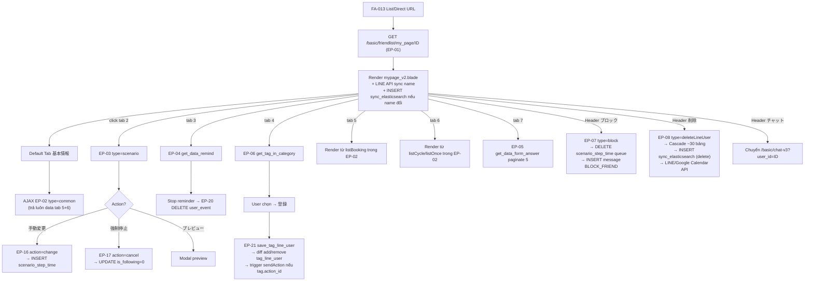

# FA-038 「友だち情報詳細」 (Friend Detail / My Page) — Feature Spec

> Tài liệu tổng hợp cho PM / Tester / Developer. Tổng hợp từ 4 spec con: [ui-spec.md](ui/ui-spec.md), [api-spec.md](web/api-spec.md), [logic-spec.md](web/logic-spec.md), [db-mapping.md](db/db-mapping.md). Validation: [validation-report.md](_internal/validation-report.md). Mức tin cậy mặc định **Cao** trừ khi ghi rõ.

---

## 1. Tổng quan

| Thuộc tính | Giá trị |
|------------|---------|
| Mã tính năng | **FA-038** |
| Tên JP | 「友だち情報詳細」 |
| Tên VI | Chi tiết bạn bè / Trang cá nhân (My Page) |
| URL chính | `https://form.watermeru.com/basic/friendlist/my_page/{id}` (mẫu: `.../my_page/5709`) |
| Portal | Admin LINE OA (`form.watermeru.com`) |
| Actors | Admin LINE OA, Staff (cùng portal — phân quyền theo custom role) |
| Phạm vi | 1 trang HTML (`mypage_v2.blade.php`) + 7 tabs SPA + 4 sub-pages riêng + 37 endpoints |
| Tách từ | **FA-013 「友だちリスト」** — chuyên về detail screen của 1 bạn |
| Background job | **Không có job riêng** (xác nhận Pre-flight) — nhưng producer ghi vào **5 queue tables** cho job chung (xem mục 7) |

### Mục đích nghiệp vụ
- Xem và quản lý chi tiết 1 bạn LINE (line_user × bot context):
  - **Basic info**: tên LINE, ngày kết bạn, affiliater, rich menu, QR action, tin nhắn cuối
  - **Custom fields (EAV)**: 9+ fields tùy biến (date, text, image, select, point, ...)
  - **Trạng thái scenario** (đang chạy + lịch sử gửi step)
  - **Trạng thái reminder** (đang chạy + ngày kết thúc)
  - **Tags** (folder + tag list, gắn/gỡ)
  - **Event bookings** (lịch sử event)
  - **Purchase history** (single + subscription)
  - **Form answers** (lịch sử trả lời form)
- Thực hiện actions trên bạn:
  - Block / Unblock / Delete (cascade ~30 bảng)
  - Save memo, edit custom field, save 表示設定
  - Add/remove tag, save scenario manually, force stop scenario
  - Save rich menu, send message inline (template), send action

### Mối liên hệ
- **Vào từ**: FA-013 click row bạn → điều hướng `/basic/friendlist/my_page/{id}`. Cũng có thể đến từ chat 1-1, friend information module, URL analytics.
- **Cùng 1 view Blade** (`mypage_v2.blade.php`) cho cả 7 tabs, switch bằng JS/AJAX (SPA, không reload).

---

## 2. Các màn hình & Luồng xử lý end-to-end

### 2.1 Sơ đồ trang
```
/basic/friendlist/my_page/{id}
  ├── Header (LINE名 + System name + チャット / ブロック / 削除)
  ├── Tabs nav (7 tabs SPA)
  │
  ├── SCR-FMP-01 — 「基本情報」 (default)
  ├── SCR-FMP-02 — 「ステップ配信」
  ├── SCR-FMP-03 — 「リマインド配信」
  ├── SCR-FMP-04 — 「タグ」
  ├── SCR-FMP-05 — 「イベント予約」
  ├── SCR-FMP-06 — 「購入履歴」
  └── SCR-FMP-07 — 「フォーム回答」
```

### 2.2 Luồng tổng quát (mermaid)



### 2.3 Chi tiết từng tab (User action → UI → API → Logic → DB → Response → UI update)

#### SCR-FMP-01 — Tab 「基本情報」
**Page load**:
1. User truy cập URL → `EP-01 GET /basic/friendlist/my_page/{id}` (`FriendlistController@mypage:1615`).
2. Controller query `Conversation::getConversation(bot_id, line_id)` → 404 nếu không có; query `BotLineUser::getBotLineUserWithCondition` → redirect `/basic/chat-v3` nếu user không thuộc bot.
3. Call **LINE Messaging API** `BotController::getInfoFromLine($bot, $line)` → đồng bộ display name + avatar.
4. Nếu name đổi → UPDATE `line_user.name` + INSERT `sync_elasticsearch` (type=update). [Spring Boot ES sync sẽ consume]
5. Render view `mypage_v2.blade.php` với bindings: `line_info`, `conver_id`, `categorytags`, `special_status`, `conversation`.
6. **Browser load tab default 基本情報** → `EP-02 GET /ajax/get_data_my_page?type=common&user_id={id}` (`ChatController@getDataMyPage:4845`).
7. Response trả JSON: `infoBasic`, `listCycle`, `listOnce`, `listBooking`, `infoCustom`, `dataSettingInfo`. Chỉ render bảng 基本情報 + 友だち情報 + memo. Data tab 5+6 đã được load sẵn cho lần switch sau.

**Action: Save memo**:
- User gõ vào textarea「メモ」 → click 「保存」.
- AJAX `EP-10 POST /admin/save_memo` body `{id, memo}` (hoặc `{conversation_id, memo}`).
- `Admin\BotController@saveLineUser:3473`: nếu có `id` → UPDATE `bot_line_user.memo`; ngược lại UPDATE `conversation.memo` — **2 cột không sync (BR-17, POTENTIAL BUG)**.
- Response `{success: true, memo: ...}` → toast success.

**Action: Edit custom field**:
- User click「編集」 trên row custom field → inline editor mở (chưa snapshot modal).
- AJAX `EP-15 GET /ajax/initDataFriendInfo` load config field.
- User chỉnh → save → `EP-11 POST /admin/save_custom_info` body `{user_id, customInfo, custom_show_id, type_action: 'my_page', data_user}`.
- `Admin\BotController@saveCustomInfo:3497`:
  - Validate `birthday` regex.
  - UPDATE `line_user` (view_name, phone_number, email, birthday, province).
  - Trigger `settingEventTimeFriendInfo` cho birthday → INSERT `event_step_time` (queue).
  - Upsert `friend_information_value` cho từng custom field (kể cả system fields id=-7,-8,-9,-10).
  - Increment `friend_information_setting.total_user_has_value` nếu user chưa có value.
  - Nếu view_name đổi → INSERT `sync_elasticsearch` (type=update).
- Response `{success: true}` → UI refresh các cell.

**Action: Save 表示設定**:
- User click「表示設定」 (×2 nút trên 2 bảng) → modal mở (chưa snapshot).
- Save → `EP-14 POST /ajax/save_setting_info_my_page` body `{dataInfo: JSON}`.
- UPDATE `bots.setting_info_my_page` = JSON config (per-bot, không per-user).

#### SCR-FMP-02 — Tab 「ステップ配信」
**Tab switch**: AJAX `EP-03 GET /ajax/get_data_my_page?type=scenario&user_id={id}&page={n}`.
- Logic (`ChatController@getDataMyPage:5006`):
  - Query `scenario_lineuser` JOIN `scenario` → scenarioRunning.
  - Query `scenario_step_time` (status=0, sort send_time ASC) → nextStepMessage.
  - Tính `通数` (N通目) bằng index `step_mesage_id` trong list step (O(n²) — BR-13).
  - Query `step_message_history` (status IN [2,3,4]) → paginate 20.
  - List `Scenario::getScenarioNotDeleteByBot` → render dropdown modal change.
- UI render: bảng 「ステップ配信情報」 (2 cột: 配信中のステップ + 次回配信予定 hoặc `停止中`) + bảng 「配信履歴」 (5 cột × N rows + paginate).

**Action: 手動変更 (manual scenario change)**:
- Click「手動変更」 → modal chọn scenario + step (chưa snapshot).
- AJAX `EP-18 POST /get_list_step_my_page` load list step của scenario được chọn.
- User save → `EP-16 POST /ajax/action_scenario_my_page` body `{action: 'change', line_user_id, scenario_id, start_day, start_time, type}`.
- `ChatController@actionScenarioMyPage:5327` → `ChatHelper::changeScenario(source: {trigger_type: 15001})`:
  - UPDATE old `scenario_lineuser.is_following=0`.
  - INSERT new `scenario_lineuser`.
  - INSERT `scenario_step_time` status=0 cho step đầu (queue cho Spring Boot scenario sender).

**Action: 強制停止 (force stop)**:
- Click「強制停止」 → confirm.
- AJAX `EP-17 POST /ajax/action_scenario_my_page` body `{action: 'cancel', line_user_id, scenario_id: 0}`.
- → UPDATE `scenario_lineuser.is_following=0` cho scenario hiện tại; không INSERT scenario_step_time mới.

**Action: プレビュー** (read-only): Modal load template.

#### SCR-FMP-03 — Tab 「リマインド配信」
- Tab switch → `EP-04 GET /ajax/get_data_remind_my_page?user_id={id}` (`ChatController@getDataRemindMyPage:5120`).
- Logic: query `user_event` JOIN `events` → mỗi event lấy `event_times.time_finish` + `event_step_time` (next_time_send) + enrich messages từ `event_step.templates_id`.
- UI render bảng 4 cột: リマインド名 / 終了日時 / 次回配信予定日時 / Action.
- **Action Stop reminder**: Click 停止 → `EP-20 POST /ajax/stopRemind` body `{id: user_event.id}` → DELETE `user_event` WHERE id (Spring Boot reminder scheduler skip).

#### SCR-FMP-04 — Tab 「タグ」
- Tab switch → `EP-06 GET /basic/get_tag_in_category?type=tags&cat_id=0&line_user_id={id}` (`ChatController@getTagInCat:3357`).
- Logic: query `tags` LEFT JOIN `tag_line_user`, thêm cột `is_selected`. Trả `data` (tag list) + `listTagDefault` (uncategorized) + `listTagUser` (categorized).
- UI: bảng「現在ついているタグ」 + folder list (cột trái) + tag list (cột phải) + button「登録」.
- **Action Register tags** (登録):
  - User chọn folder (cột trái) → reload tag list (cột phải) qua EP-06.
  - Tick chọn tags → click 「登録」.
  - AJAX `EP-21 POST /basic/save_tag_line_user` body `{line_user_id, tags_id[], save_tag_my_page: 1, listCategoryCheck[]}`.
  - `ChatController@saveTagLine:3491`:
    - Diff với `allTagUser` hiện tại trong category đang hiển thị.
    - DELETE tags removed + INSERT tags added trong `tag_line_user`.
    - Update `tags.count_user_tag +/-`.
    - Nếu tag có `action_id` → `HelperService::sendAction` (có thể INSERT `action_schedules` / `scenario_step_time`).
    - Nếu tag có `is_limit` đạt giới hạn → chạy `ActionLimitTag::handleLimitActionTag` thay thế.
- **Action Remove single tag** (chip click):
  - `EP-23 POST /ajax/remove-tag-line-user-my-page` body `{line_user_id, tag_id}`.
  - DELETE `tag_line_user` + UPDATE `tags.count_user_tag--` + INSERT `sync_elasticsearch` (type=user_tag).
- **Action Add new tag quick**:
  - `EP-22 POST /basic/add_tag` body `{name, category_id}` → INSERT `tags`.

#### SCR-FMP-05 — Tab 「イベント予約」
- **Không có endpoint riêng** — render từ `listBooking` đã trả trong EP-02 (BR-12).
- UI: bảng「イベント参加履歴」 3 cột (参加（予定）日時 / イベント名 / ステータス).
- Data source: `b_user_booking` JOIN `b_event_detail.title` + `b_slot.date_start_from + time_start`.
- **Tab purchase + event KHÔNG AJAX khi switch** — chỉ JS show/hide.

#### SCR-FMP-06 — Tab 「購入履歴」
- Render từ `listOnce` (単品商品) + `listCycle` (継続商品) + `accountPayment` đã trả trong EP-02.
- Toggle 単品/継続 → JS switch giữa 2 dataset.
- UI: bảng 5 cột: 購入日時 / 注文番号 / 商品名 / 購入価格 / 決済結果.
- Data source 単品商品: `s_order_history` (payment_date, o_strip_charge_id, name_item, amount_order, status_order).
- Data source 継続商品: `s_cycle_order_history` (c_register_date, c_strip_charge_id, name_item, amount_item, status_bill).

#### SCR-FMP-07 — Tab 「フォーム回答」
- Tab switch → `EP-05 GET /ajax/get_data_form_answer_my_page?page={n}&user_id={id}`.
- `ChatController@getDataFormAnswerMyPage:5222`: query `form_answer_result` RIGHT JOIN `form_answer` → paginate 5; subquery `previous` (data câu trả lời trước cùng form).
- Enrich: `event_1` → event_name, format `date_time`, phân loại file/image, convert address.
- UI: bảng 「回答日時」 + 「推定ページ表示時間」 + click row mở modal detail (chưa snapshot).

### 2.4 Header actions (toàn trang)

**Block (ブロック)**:
1. Click link → JS `block(5709)` → confirm dialog.
2. AJAX `EP-07 POST /basic/line_user/update` body `{type: 'block', line_id}`.
3. `FriendlistController@updateLineUser:2018` (case 'block'):
   - UPDATE `bot_line_user.is_blocked=1`.
   - UPDATE `conversation` (is_blocked=1, blocked_by=1, blocked_at=NOW(), id_status=null).
   - Decrement `scenario.count_follow`, increment `count_unfinish`.
   - UPDATE `scenario_lineuser.is_following=0`.
   - **DELETE `scenario_step_time` WHERE status=0** (clear queue).
   - Recompute `bots.count_user_unconfirm`, decrement `status_chat.count`.
   - INSERT message kind `KIND_MESSAGE_BLOCK_FRIEND` content「ブロックしました」.
4. Response `{success: true, line_user_id}` → UI badge/reload.

**Delete (削除)**:
1. Click link → JS `deleteLineUser(5709)` → confirm dialog.
2. AJAX `EP-08 POST /basic/line_user/update` body `{type: 'deleteLineUser', line_id}`.
3. `FriendlistController@updateLineUser:2064`-2466 (case 'deleteLineUser') — **cascade ~30 bảng**:
   - DELETE `mobile_notify`, decrement `bots.count_app_notify`.
   - Decrement `bot_friend_statistic.count_user_followed/unfollowed`.
   - **External LINE API**: DELETE richmenu của user, clear `bot_line_user.rich_menu_id`.
   - DELETE `bot_line_user_item`, `auto_reply_history`, `user_button`.
   - **INSERT `sync_elasticsearch` type=delete_line_user** (queue ES delete).
   - DELETE `bot_line_user`, `conversation`.
   - Decrement `scenario.count_*` + DELETE `scenario_lineuser`, `scenario_step_time`.
   - DELETE `tag_line_user` + decrement `tags.count_user_tag`.
   - Decrement `form_answer.count_user_reply`, DELETE `event_step_time`, `form_answer_result`, `user_open_formanswer`, `form_answer_user_accept`.
   - DELETE bookings: `b_user_booking` (+ decrement `b_plan_slot.remain_limit`, `b_slot.use_people`), `calendar_salon_line_booking`, `calendar_course_booking`, `bc_user_booking` (**External Google Calendar API** delete events).
   - DELETE `s_order_history`, `s_cycle_order_history`, `user_event`.
   - DELETE tracking: `step_message_history`, `url_shorten*`, `detail_url_click`, `conversion_result`.
   - Decrement `friend_information_setting.total_user_has_value`, DELETE `friend_information_value`.
   - Recompute `landing.total_user_*`, DELETE `detail_landing_click`, `time_action_landing`, `collect_open_landing`.
   - Update `bots.count_user_unconfirm`, `updateBadge`.
4. Response `{success: true}` → redirect `/basic/friendlist`.
5. **Không có DB transaction** — lỗi giữa chừng → DB inconsistent (BR-02 cảnh báo).

**Chat (チャット)**: Header button → redirect `/basic/chat-v3?user_id={id}` (không đổi DB).

### 2.5 Sub-pages (truy cập độc lập)
4 sub-pages riêng (lưu ý route typo `frienslist`):
- EP-29: `/basic/frienslist/mypage/analyst_history/{line_user_id}` — Lịch sử click URL
- EP-30: `/basic/frienslist/mypage/site_access_history/{line_user_id}` — Lịch sử truy cập site
- EP-31: `/basic/frienslist/mypage/conversion/{line_user_id}` — Lịch sử conversion
- EP-32: `/basic/frienslist/mypage/answer_form/{line_user_id}` — Chi tiết form answer

---

## 3. Data Model

### 3.1 Primary tables (15) — lưu data hiển thị trực tiếp

| Bảng | Mô tả 1 dòng |
|------|-------------|
| `line_user` | Profile gốc người dùng LINE (line_id, name, view_name, email, phone_number, birthday, province) |
| `bot_line_user` | Liên kết bot ↔ line_user (memo, is_blocked, is_tester, rich_menu_id, affiliater_id, followed_at) |
| `bots` | Cấu hình bot (channel_access_token, setting_info_my_page, count_user_unconfirm) |
| `conversation` | Hội thoại bot ↔ user (last_time_message, is_old_friend, is_blocked, blocked_by, memo) |
| `friend_information_setting` | Định nghĩa custom field (title, type_data 1-6, order, setting_value JSON) |
| `friend_information_value` | EAV value per user × field (line_id, friend_information_setting_id, value, friend_info_option_id) |
| `scenario_lineuser` | Subscription user × scenario (is_following 1/0/2, start_day, start_time) |
| `scenario` | Định nghĩa scenario (name, count_follow, count_stop, count_unfinish) |
| `step_message` | Định nghĩa step trong scenario (template_ids comma-sep, start_day, start_time, order_number) |
| `step_message_history` | Log lịch sử gửi step (status enum 2/3/4, send_time) |
| `tags` | Định nghĩa tag (name, category_id, is_limit, action_id, scenario_id) |
| `tag_line_user` | M-to-M user × tag (is_deleted soft) |
| `category` | Folder/category dùng chung (kind=tag/information_friend) |
| `user_event` | Subscription reminder per user × event (event_id, event_time_id) |
| `events` | Định nghĩa event/reminder (event_name, type) |

### 3.2 Secondary tables (23) — join phụ trợ

**Tab 基本情報 phụ trợ**: `affiliaters`, `rich_menus`, `landing`, `detail_landing_click`

**Messaging/Templates**: `template`, `tmp_button`, `buttons`, `tmp_introduction`, `tmp_location`, `messages` (sharded `messages2025`/2024)

**Reminder**: `event_step`, `event_times`

**Form**: `form_answer`, `form_answer_result`, `form_answer_user_accept`

**Booking**: `b_user_booking`, `b_event_detail`, `b_slot`, `b_plan_slot`

**Order**: `s_order_history`, `s_cycle_order_history`, `s_items`, `strip_bot`

### 3.3 Queue tables (5) — cho Spring Boot consumer

> **Lưu ý**: FA-038 không có job-spec riêng (Pre-flight đã xác nhận). Producer ghi vào các bảng dưới; consumer (Spring Boot) ngoài scope.

| Bảng | Producer FA-038 | Consumer |
|------|-----------------|----------|
| `sync_elasticsearch` | EP-01, EP-08, EP-11, EP-23 | Spring Boot ES sync (`SyncEsTask`) |
| `scenario_step_time` | EP-16/17/19 (INSERT), EP-07/08 (DELETE) | Spring Boot scenario sender (`NewScenarioTaskV3`) |
| `event_step_time` | EP-11 birthday (INSERT), EP-08 (DELETE) | Spring Boot reminder sender (`BotTaskManager → EventBotTask`) |
| `action_schedules` | EP-21 (qua sendAction), EP-37 (allUser ≥ 200) | Spring Boot action executor (`BotTaskManager → ActionScheduleBotTask`) |
| `user_event` | EP-20 (DELETE), EP-08 (DELETE cascade) | Spring Boot reminder scheduler đọc để biết user còn subscribe |

### 3.4 Cleanup cascade (15+) — chỉ ảnh hưởng khi Delete (EP-08)
`bot_line_user_item`, `auto_reply_history`, `user_button`, `mobile_notify`, `bot_friend_statistic`, `status_chat`, `calendar_salon_line_booking`, `b_c_user_booking`, `calendar_course_bookings`, `user_open_formanswer`, `conversion_result`, `url_shorten`, `url_shorten_detail`, `detail_url_click`, `time_action_landing`, `collect_open_landings`, `landing_histories`, `activity_logs`.

**Tổng**: ~58 bảng liên quan trực tiếp đến FA-038.

### 3.5 ER Diagram

```mermaid
erDiagram
    BOTS ||--o{ BOT_LINE_USER : "contains"
    LINE_USER ||--o{ BOT_LINE_USER : "has bot link"
    BOT_LINE_USER }o--|| AFFILIATERS : "introduced by"
    BOT_LINE_USER }o--|| RICH_MENUS : "displays"

    LINE_USER ||--o{ CONVERSATION : "talks via"
    BOTS ||--o{ CONVERSATION : "owns"

    LINE_USER ||--o{ FRIEND_INFORMATION_VALUE : "has values"
    FRIEND_INFORMATION_SETTING ||--o{ FRIEND_INFORMATION_VALUE : "defines"
    BOTS ||--o{ FRIEND_INFORMATION_SETTING : "owns fields"

    LINE_USER ||--o{ SCENARIO_LINEUSER : "subscribes"
    SCENARIO ||--o{ SCENARIO_LINEUSER : "has subscribers"
    SCENARIO ||--o{ STEP_MESSAGE : "has steps"
    SCENARIO_LINEUSER ||--o{ SCENARIO_STEP_TIME : "schedules (queue)"
    STEP_MESSAGE ||--o{ SCENARIO_STEP_TIME : "queued for"
    SCENARIO_LINEUSER ||--o{ STEP_MESSAGE_HISTORY : "history"

    LINE_USER ||--o{ TAG_LINE_USER : "tagged with"
    TAGS ||--o{ TAG_LINE_USER : "applied to"
    CATEGORY ||--o{ TAGS : "groups"

    LINE_USER ||--o{ USER_EVENT : "subscribes reminder"
    EVENTS ||--o{ USER_EVENT : "has subscribers"
    EVENTS ||--o{ EVENT_TIMES : "has timeslots"
    USER_EVENT ||--o{ EVENT_STEP_TIME : "triggers (queue)"

    LINE_USER ||--o{ FORM_ANSWER_RESULT : "answers"
    FORM_ANSWER ||--o{ FORM_ANSWER_RESULT : "receives"

    LINE_USER ||--o{ B_USER_BOOKING : "books"
    B_EVENT_DETAIL ||--o{ B_SLOT : "has slots"
    B_USER_BOOKING }o--|| B_EVENT_DETAIL : "for event"
    B_USER_BOOKING }o--|| B_SLOT : "in slot"

    LINE_USER ||--o{ S_ORDER_HISTORY : "purchases"
    LINE_USER ||--o{ S_CYCLE_ORDER_HISTORY : "subscribes"

    LINE_USER ||--o{ DETAIL_LANDING_CLICK : "clicks QR"
    LANDING ||--o{ DETAIL_LANDING_CLICK : "tracks"

    BOTS ||--o{ SYNC_ELASTICSEARCH : "produces queue"
    BOTS ||--o{ ACTION_SCHEDULES : "produces queue"
```



---

## 4. Field Traceability Matrix

| # | UI Element | Tab | DB Table.Column | Hướng | Validation | Business Rule |
|---|-----------|-----|------------------|-------|------------|---------------|
| 1 | 「LINE名」 | SCR-FMP-01 | `line_user.name` (sync từ LINE API) | Read | — | BR-16: refresh mỗi load |
| 2 | 「友だち追加日時」 | SCR-FMP-01 | `bot_line_user.followed_at` + `conversation.is_old_friend` (badge) | Read | — | Badge: 0=新規, 1=既存 |
| 3 | 「紹介アフィリエイター」 | SCR-FMP-01 | `bot_line_user.affiliater_id` JOIN `affiliaters.username` | Read | — | `-` nếu NULL |
| 4 | 「表示中リッチメニュー」 | SCR-FMP-01 | `bot_line_user.rich_menu_id` JOIN `rich_menus.name` | Read/Write | — | EP-34 update qua LINE API |
| 5 | 「QRコードアクション」 | SCR-FMP-01 | `detail_landing_click` JOIN `landing.name` | Read | — | Trung bình — chưa verify runtime |
| 6 | 「最終メッセージ受信」 | SCR-FMP-01 | `conversation.last_time_message` | Read | — | Format `YYYY.MM.DD HH:mm` |
| 7 | 「date 1」 / 「date 2」 (custom field) | SCR-FMP-01 | `friend_information_value.value` (date YYYY-MM-DD), `type_data=3` | Read/Write | — | EAV pattern (BR-04) |
| 8 | 「システム表示名」 | SCR-FMP-01 | `line_user.view_name` | Read/Write | max:20 | System field id=-2; lưu trực tiếp ở line_user (không EAV) |
| 9 | 「ảnh」 (image custom) | SCR-FMP-01 | `friend_information_value.value` = path file, `type_data=4` | Read/Write | — | EP-28 trả signed URL |
| 10 | 「select」 (custom) | SCR-FMP-01 | `friend_information_value.friend_info_option_id` FK, `type_data=1` | Read/Write | — | Option list từ `setting_value` JSON |
| 11 | 「メールアドレス」 | SCR-FMP-01 | `line_user.email` | Read/Write | email format | EP-11 update |
| 12 | 「携帯電話」 | SCR-FMP-01 | `line_user.phone_number` | Read/Write | regex `^\+?[0-9]{9,15}$` | EP-12 convert `0...` → `+81...` |
| 13 | 「test act EDIT 16.10」 (custom text) | SCR-FMP-01 | `friend_information_value.value` (text), `type_data=2` | Read/Write | — | EAV |
| 14 | 「kieu point 1」 (custom number) | SCR-FMP-01 | `friend_information_value.value` (số string), `type_data=6` | Read/Write | — | EAV |
| 15 | 「メモ」 | SCR-FMP-01 | `bot_line_user.memo` (option 1) hoặc `conversation.memo` (option 2) | Read/Write | — | **BR-17 — POTENTIAL BUG: 2 cột không sync** (Trung bình) |
| 16 | 「配信中のステップ」 | SCR-FMP-02 | `scenario_lineuser` (is_following=1) JOIN `scenario.name` | Read | — | — |
| 17 | 「次回配信予定」 | SCR-FMP-02 | `scenario_step_time.send_time` (status=0) hoặc `停止中` | Read | — | Computed |
| 18 | 「配信日時」 (history) | SCR-FMP-02 | `step_message_history.send_time` | Read | — | — |
| 19 | 「ステップ名」 | SCR-FMP-02 | `step_message_history.scenario_id` JOIN `scenario.name` | Read | — | — |
| 20 | 「通数」 (N通目) | SCR-FMP-02 | Computed: index của `step_mesage_id` trong list step | Read | — | BR-13: O(n²) |
| 21 | 「配信ステータス」 | SCR-FMP-02 | `step_message_history.status` (2=配信済み, 3=配信エラー, 4=絞り込み配信対象外) | Read | — | Trung bình — suy luận |
| 22 | 「メッセージ」 (tag list) | SCR-FMP-02 | `step_message.template_ids` JOIN `template` | Read | — | Anti-pattern: comma-sep IDs |
| 23 | 「リマインド名」 | SCR-FMP-03 | `events.event_name` JOIN qua `user_event.event_id` | Read | — | — |
| 24 | 「リマインド終了日時」 | SCR-FMP-03 | `event_times.event_date + event_start_time` | Read | — | Computed |
| 25 | 「次回配信予定日時」 | SCR-FMP-03 | `event_step_time.sent_date_time` (status=0) | Read | — | Computed |
| 26 | 「フォルダ」 (tag) | SCR-FMP-04 | `category.name` JOIN qua `tags.category_id` | Read | — | `0`/null = 「未分類」 |
| 27 | 「タグ」 (chip) | SCR-FMP-04 | `tags.name` JOIN qua `tag_line_user` | Read/Write | — | M-to-M; EP-21 diff add/remove |
| 28 | 「参加（予定）日時」 | SCR-FMP-05 | `b_slot.date_start_from + time_start` JOIN `b_user_booking.slot_id` | Read | — | Structure inferred (bạn 5709 không có data) |
| 29 | 「イベント名」 | SCR-FMP-05 | `b_event_detail.title` | Read | — | Structure inferred |
| 30 | 「ステータス」 (booking) | SCR-FMP-05 | `b_user_booking.status` (1-7 enum) | Read | — | Structure inferred |
| 31 | 「購入日時」 単品 | SCR-FMP-06 | `s_order_history.payment_date` | Read | — | Structure inferred |
| 32 | 「注文番号」 単品 | SCR-FMP-06 | `s_order_history.o_strip_charge_id` | Read | — | Structure inferred |
| 33 | 「商品名」 単品 | SCR-FMP-06 | `s_order_history.name_item` hoặc JOIN `s_items.name` | Read | — | Structure inferred |
| 34 | 「購入価格」 単品 | SCR-FMP-06 | `s_order_history.amount_order` | Read | — | Structure inferred |
| 35 | 「決済結果」 単品 | SCR-FMP-06 | `s_order_history.status_order` (1-3) | Read | — | Structure inferred |
| 36 | 「回答日時」 form | SCR-FMP-07 | `form_answer_result.created_at` | Read | — | Paginate 5 |
| 37 | 「推定ページ表示時間」 | SCR-FMP-07 | `form_answer_result.duration_time_reply` (varchar 16) | Read | — | Đơn vị chưa rõ — Trung bình |

**Coverage**: 37/37 = 100%.

---

## 5. Business Rules

### BR-01: Block side effects
- **Mô tả**: Block 1 user → set is_blocked=1 và side effects.
- **Trigger**: EP-07 (header「ブロック」)
- **Tables ảnh hưởng**: `bot_line_user`, `conversation`, `scenario_lineuser`, `scenario` (count_*), `scenario_step_time` (DELETE), `messages`, `bots`, `status_chat`
- **Side effects**: Clear `scenario_step_time` queue; INSERT message kind BLOCK_FRIEND
- **Confidence**: Cao
- **Source**: `FriendlistController.php:2018`

### BR-02: Delete user cascade ~30 bảng
- **Mô tả**: Delete user → cascade cleanup ~30 bảng + queue insert + external API
- **Trigger**: EP-08 (header「削除」)
- **Tables**: ~30 bảng (xem mục 2.4 hoặc EP-08 chi tiết)
- **Side effects**: INSERT `sync_elasticsearch` type=delete_line_user; LINE API DELETE richmenu; Google Calendar API DELETE events
- **Cảnh báo**: **Không có DB transaction** — lỗi giữa chừng = DB inconsistent
- **Confidence**: Cao
- **Source**: `FriendlistController.php:2064-2466`

### BR-03: deleteLineUser dùng chung route với block
- **Mô tả**: EP-07 và EP-08 cùng route `/basic/line_user/update` — phân biệt qua body field `type` (`block` vs `deleteLineUser`)
- **Confidence**: Cao
- **Source**: `routes/web.php:1932`

### BR-04: Custom field EAV pattern
- **Mô tả**: Định nghĩa field tại `friend_information_setting`; value tại `friend_information_value` (1 record per user × field)
- **type_data**: 1=select, 2=input, 3=calendar, 4=image, 5=file, 6=point
- **Trigger**: EP-11, EP-15
- **Tables**: `friend_information_setting`, `friend_information_value`
- **Confidence**: Cao (schema), Trung bình (mapping image/file runtime path)
- **Source**: schema `friend_information_setting.sql`; logic-spec mục 3.8

### BR-05: System fields hardcoded id âm
- **Mô tả**: System fields lưu cùng EAV nhưng `friend_information_setting_id` âm
- **Mapping**: -1 name, -2 system_display_name, -4 birthday, -6 province, -7 zip_code, -8 district, -9 township, -10 building
- **Trigger**: EP-11 (upsert), EP-15 (load config)
- **Confidence**: Cao
- **Source**: `BotController.php:3497`; `config('sns-line.info_default_info_address')`

### BR-06: Tag với scenario_id auto-trigger
- **Mô tả**: Khi gán tag có `tag.scenario_id != null` → auto chuyển user sang scenario tương ứng. Khi có `tag.action_id` → run action.
- **Trigger**: EP-21 (saveTagLine), EP-35 (saveTag)
- **Tables**: `tag_line_user`, `tags`, `scenario_lineuser`, `scenario_step_time` (queue)
- **Confidence**: Cao
- **Source**: `ChatController.php:3491`

### BR-07: Tag limit
- **Mô tả**: Tag với `is_limit=1` + `limit` → max user được gán. Đạt limit → không gán, chạy `limit_action_id` thay thế.
- **Trigger**: EP-21
- **Confidence**: Cao
- **Source**: `ChatController.php:3491` (ActionLimitTag)

### BR-08: Manual scenario change creates scenario_step_time queue
- **Mô tả**: EP-16 action=change → `ChatHelper::changeScenario` → INSERT `scenario_step_time` status=0 cho step đầu (queue cho Spring Boot)
- **Source identifier**: `{trigger_type: 15001, from_id: Auth::id()}` = manual từ my_page
- **Trigger**: EP-16, EP-19
- **Confidence**: Cao
- **Source**: `ChatController.php:5327`

### BR-09: Force stop scenario
- **Mô tả**: EP-17 action=cancel → UPDATE `scenario_lineuser.is_following=0`, không INSERT scenario_step_time
- **Trigger**: EP-17
- **Confidence**: Cao
- **Source**: `ChatController.php:5327`

### BR-10: Save rich menu calls LINE API + INSERT queue
- **Mô tả**: 2 nhánh:
  - `rich_menu_id != 0`: POST LINE API `/v2/bot/user/{lineId}/richmenu/{richIdForLine}` → check 200 → UPDATE `bot_line_user.rich_menu_id`
  - `rich_menu_id == 0`: tìm default richmenu (`status_rich=1, status_line=1`); không có → DELETE LINE API unlink; có → POST link default
- **Trigger**: EP-34
- **Tables**: `bot_line_user`, `rich_menus`
- **Side effects**: External LINE Messaging API
- **Confidence**: Cao
- **Source**: `FriendlistController.php:1359`

### BR-11: sync_elasticsearch INSERT 4+ endpoints
- **Mô tả**: Khi update profile/delete user/hide user/gán tag → INSERT `sync_elasticsearch` queue với type tương ứng. Spring Boot consumer đọc, sync ES index.
- **type enum**: 0=BOT_LINE_USER, 1=LINE_USER, 2=CONVERSATION, 3=TAG, 4=FRIEND_INFO, 5=LANDING, 6=SCENARIO, 7=CONVERSION
- **status enum**: 0=WAIT_SYNC, 1=SYNCHRONIZING, 2=SUCCESS, 3=ERROR
- **Trigger**: EP-01 (update name), EP-08 (delete_line_user), EP-11 (update view_name), EP-23 (user_tag)
- **Điều kiện**: Chỉ INSERT khi `env('API_KEY_ES')` được set
- **Confidence**: Cao
- **Source**: `ChatController.php:5372`; `FriendlistController.php:1615,2064`; `BotController.php:3497`

### BR-12: Tab data overlap (event/purchase không có endpoint riêng)
- **Mô tả**: EP-02 (`type=common`) trả đồng thời:
  - `infoBasic` (SCR-FMP-01)
  - `listCycle`, `listOnce`, `accountPayment` (SCR-FMP-06)
  - `listBooking` (SCR-FMP-05)
- → Tab 5 + 6 **không AJAX** khi switch — chỉ JS show/hide
- **Confidence**: Cao
- **Source**: `ChatController.php:4845`

### BR-13: Scenario history pagination + N通目 computation
- **Mô tả**: EP-03 paginate `step_message_history` 20/trang. Status filter IN [2,3,4]. Tính 「N通目」 bằng index `step_mesage_id` trong list step (sort by start_day, start_time) — O(n²) khi nhiều history.
- **Trigger**: EP-03
- **Confidence**: Cao (pagination); Trung bình (status enum)
- **Source**: `ChatController.php:5006`

### BR-14: Form answer pagination + special render
- **Mô tả**: EP-05 paginate 5/trang. Subquery `previous` lấy data câu trả lời trước cùng form. Render đặc biệt: `event_1` → event_name; `date_time` format object {date, time} hoặc {year, month, day}; `friend_info_file` phân loại image vs file qua `is_image()`; `address` convert object → array.
- **Confidence**: Cao
- **Source**: `ChatController.php:5222`

### BR-15: Display name LINE refresh mỗi page load
- **Mô tả**: EP-01 call LINE API mỗi load → đồng bộ display name + avatar mới nhất (không cache phía Laravel). Tốn 1 round-trip LINE API mỗi lần mở detail.
- **Trigger**: EP-01
- **Tables**: `line_user`, `sync_elasticsearch` (nếu name đổi)
- **Confidence**: Cao
- **Source**: `FriendlistController.php:1615`

### BR-16: Memo storage 2 nơi (POTENTIAL BUG)
- **Mô tả**: Memo có thể lưu ở `bot_line_user.memo` (text, khi có `id`) HOẶC `conversation.memo` (varchar 256, khi chỉ có `conversation_id`). **2 cột không tự sync**.
- **Risk**: User gõ memo ở mypage có thể không sync với chat view, gây nhầm lẫn.
- **Trigger**: EP-10
- **Confidence**: Trung bình — cần verify runtime path nào được dùng cho UI v2
- **Source**: `BotController.php:3473`

### BR-17: EP-26 send_message disabled
- **Mô tả**: `/basic/send_message` (`ChatController@sendMessage:1918`) trả response error ngay đầu method (`return response()->json(['success' => false, 'msg' => ...])` dòng 1927) — endpoint dead-code.
- **Hệ quả**: UI v2 dùng EP-27 (`/basic/friendlist/my_page/send-message`) thay thế.
- **Confidence**: Cao
- **Source**: `ChatController.php:1918`

### BR-18: Validation inline (Validator::make) — không có FormRequest
- **Mô tả**: Không có FormRequest riêng cho FA-038. Validation rải rác inline trong controller:
  - EP-12: `view_name max:20`, `email`, `phone_number regex /^\+?[0-9]{9,15}$/u`
  - EP-22: `name required|tags_exist|min:1|max:50|string`
  - EP-11: `birthday` regex `Y-m-d` hoặc `Y/m/d`
- **Risk**: EP-08 cascade ~30 bảng không có pre-validate, không có DB transaction
- **Confidence**: Cao
- **Source**: logic-spec mục 5

### BR-19: Audit log mọi POST endpoint
- **Mô tả**: Hầu hết POST endpoint gọi `addLogUserAction("...")` → INSERT `activity_logs` (audit trail). Pattern message phải mô tả chính xác (vd `"updateLineUser friendlist"`).
- **Confidence**: Cao
- **Source**: helpers (autoloaded)

### BR-20: Sub-pages độc lập (route typo `frienslist`)
- **Mô tả**: 4 sub-pages có route riêng `/basic/frienslist/mypage/...` (typo: `frienslist` thay vì `friendlist`) — accept cả GET (render view) và POST (return AJAX). Không thuộc 7 tabs chính.
- **Endpoints**: EP-29 (analyst_history), EP-30 (site_access), EP-31 (conversion), EP-32 (answer_form)
- **Confidence**: Cao
- **Source**: `routes/web.php:1965-1971`

### BR-21: Permission Staff (chưa rõ)
- **Mô tả**: Code controller không kiểm tra explicit role Staff vs Admin. Mọi user có session hợp lệ + bot_id phù hợp đều xem được mypage. Permission Staff được kiểm tra ở:
  - **Frontend**: Blade ẩn nút theo permission
  - **Bảng `user_permission_basic`**: lưu role custom
- **Confidence**: Thấp — cần kiểm tra runtime
- **Source**: logic-spec mục 7

---

## 6. API Endpoints

37 endpoints (1 HTML + 36 AJAX/POST). Chi tiết tham chiếu [api-spec.md](web/api-spec.md).

### 6.1 Page Load (1)
| EP | Method | URL | Mô tả |
|----|--------|-----|-------|
| EP-01 | GET | `/basic/friendlist/my_page/{line_id}` | Render trang HTML tổng |

### 6.2 Tab Data Load (5)
| EP | Method | URL | Tab |
|----|--------|-----|-----|
| EP-02 | GET | `/ajax/get_data_my_page?type=common&user_id={id}` | SCR-FMP-01 (+5+6 data) |
| EP-03 | GET | `/ajax/get_data_my_page?type=scenario&user_id={id}` | SCR-FMP-02 |
| EP-04 | GET | `/ajax/get_data_remind_my_page?user_id={id}` | SCR-FMP-03 |
| EP-05 | GET | `/ajax/get_data_form_answer_my_page?page={n}&user_id={id}` | SCR-FMP-07 |
| EP-06 | GET | `/basic/get_tag_in_category` | SCR-FMP-04 |

### 6.3 Tab 基本情報 Actions (6)
| EP | Method | URL | Purpose |
|----|--------|-----|---------|
| EP-10 | POST | `/admin/save_memo` | Lưu memo |
| EP-11 | POST | `/admin/save_custom_info` | Lưu friend_info + custom fields + system fields |
| EP-12 | POST | `/basic/update_line_info` | Update profile (legacy) |
| EP-13 | POST | `/basic/update_is_tester` | Toggle tester |
| EP-14 | POST | `/ajax/save_setting_info_my_page` | Lưu「表示設定」 |
| EP-15 | GET | `/ajax/initDataFriendInfo` | Load config custom field |

### 6.4 Header & Block/Delete (3)
| EP | Method | URL | Purpose |
|----|--------|-----|---------|
| EP-07 | POST | `/basic/line_user/update` (type=block) | Block user |
| EP-08 | POST | `/basic/line_user/update` (type=deleteLineUser) | Delete cascade |
| EP-09 | POST | `/basic/friendlist/unblock-friend` | Unblock |

### 6.5 Scenario Actions (4)
| EP | Method | URL | Purpose |
|----|--------|-----|---------|
| EP-16 | POST | `/ajax/action_scenario_my_page` (action=change) | Manual scenario change |
| EP-17 | POST | `/ajax/action_scenario_my_page` (action=cancel) | Force stop |
| EP-18 | POST | `/get_list_step_my_page` | Load step list |
| EP-19 | POST | `/basic/friendlist/my_page/save-scenario` | Save bulk scenarios |

### 6.6 Reminder Action (1)
| EP | Method | URL | Purpose |
|----|--------|-----|---------|
| EP-20 | POST | `/ajax/stopRemind` | Stop reminder (DELETE user_event) |

### 6.7 Tag Actions (3)
| EP | Method | URL | Purpose |
|----|--------|-----|---------|
| EP-21 | POST | `/basic/save_tag_line_user` | Save tags diff (登録) |
| EP-22 | POST | `/basic/add_tag` | Add new tag |
| EP-23 | POST | `/ajax/remove-tag-line-user-my-page` | Remove single tag |

### 6.8 Booking helpers (2)
| EP | Method | URL | Purpose |
|----|--------|-----|---------|
| EP-24 | POST | `/get_user_booking_calendar_list` | List booking calendar |
| EP-25 | POST | `/get_booking_event_detail_by_id/{id}` | Detail 1 booking |

### 6.9 Send Message + File (3)
| EP | Method | URL | Purpose |
|----|--------|-----|---------|
| EP-26 | POST | `/basic/send_message` | **[DEPRECATED]** disabled (BR-17) |
| EP-27 | POST | `/basic/friendlist/my_page/send-message` | Send template message |
| EP-28 | POST | `/ajax/get-file-url` | Signed URL cho image |

### 6.10 Sub-pages (4)
| EP | Method | URL | Purpose |
|----|--------|-----|---------|
| EP-29 | GET/POST | `/basic/frienslist/mypage/analyst_history/{id}` | URL click history |
| EP-30 | GET | `/basic/frienslist/mypage/site_access_history/{id}` | Site access |
| EP-31 | GET | `/basic/frienslist/mypage/conversion/{id}` | Conversion history |
| EP-32 | GET/POST | `/basic/frienslist/mypage/answer_form/{id}` | Form answer detail |

### 6.11 Cross-page Actions (5) — dùng chung với FA-013
| EP | Method | URL | Purpose |
|----|--------|-----|---------|
| EP-33 | POST | `/basic/friendlist/setting-scenario` | Gán scenario |
| EP-34 | POST | `/basic/friendlist/save-rich-menu` | Gán rich menu (LINE API) |
| EP-35 | POST | `/basic/friendlist/save-tag` | Quick add tag |
| EP-36 | POST | `/basic/friendlist/remove-tag` | Bulk remove tag |
| EP-37 | POST | `/basic/friendlist/send-action` | Send action (≥200 → action_schedules queue) |

---

## 7. Background Jobs

> **Lưu ý quan trọng**: User xác nhận FA-038 **KHÔNG có background job riêng** ở Pre-flight, nên Bước 4 pipeline (job-analyzer) đã bỏ qua. Tuy nhiên, **web-analyzer phát hiện 5 queue tables được sử dụng** với vai trò **producer** — Spring Boot consumer (job chung) sẽ xử lý.

### 7.1 Queue tables sử dụng (producer FA-038 → consumer Spring Boot)

| # | Bảng queue | INSERT/DELETE từ FA-038 | Spring Boot job dự kiến (consumer) |
|---|------------|--------------------------|-------------------------------------|
| 1 | `sync_elasticsearch` | EP-01, EP-08, EP-11, EP-23 (INSERT type=update/delete_line_user/user_tag) | `SyncEsTask` — sync ES index |
| 2 | `scenario_step_time` | EP-16/17/19 (INSERT status=0); EP-07/08 (DELETE) | `NewScenarioTaskV3` — gửi step scenario |
| 3 | `event_step_time` | EP-11 birthday (INSERT qua `settingEventTimeFriendInfo`); EP-08 (DELETE cleanup) | `BotTaskManager` → `EventBotTask` — gửi step reminder |
| 4 | `action_schedules` | EP-21 (qua sendAction nếu tag.action_id); EP-37 (allUser ≥ 200) | `BotTaskManager` → `ActionScheduleBotTask` — execute action |
| 5 | `user_event` | EP-20 (DELETE), EP-08 (DELETE cascade) | Spring Boot reminder scheduler đọc để biết user còn subscribe |

### 7.2 Khuyến nghị
Để có chi tiết về cơ chế xử lý của các Spring Boot jobs trên, chạy `/spec-job friend-mypage` riêng để phân tích Spring Boot consumer cho 5 bảng queue trên.

---

## 8. Phụ thuộc chéo (Cross-references)

### 8.1 Shared components đã xác nhận
| Mã SC | Component | Dùng tại | Ghi chú |
|-------|-----------|----------|---------|
| **SC-002** | Tag Selector | SCR-FMP-04 | Folder list (cột trái) + tag list (cột phải) + button「登録」 |

### 8.2 Shared components nghi ngờ (pending — chờ backfill)
| Component dự kiến | Mô tả | Dùng tại | Trạng thái |
|-------------------|-------|----------|------------|
| **NEW** Column Visibility Settings | Modal「表示設定」 cấu hình ẩn/hiện cột bảng | SCR-FMP-01 (×2 nút), có thể FA-013 | Pending — chưa snapshot modal |
| **NEW** Memo Save Block | Textarea + button 保存 | SCR-FMP-01, có thể detail page khác (product, form) | Pending |
| **NEW** Inline Custom Field Editor | Nút「編集」 inline custom field | SCR-FMP-01, có thể module 友だち情報管理 | Pending |

### 8.3 Liên kết với features khác
| Feature | Mối liên hệ |
|---------|------------|
| **FA-013** 「友だちリスト」 | Cha của FA-038 — danh sách bạn, click row → vào FA-038. Dùng chung 5 endpoints (EP-33/34/35/36/37) |
| **FA-001** Chat 1-1 | Header button「チャット」 → `/basic/chat-v3?user_id={id}` |
| **FA-003** Auto-reply | Chia sẻ logic `saveTag/removeTag/saveScenario/saveRichMenu` (gọi cùng helper) |
| **FA-009** Step Distribution (Scenario) | Tab 2 hiển thị state scenario từ module này |
| **FA-022** Reminder | Tab 3 hiển thị state event_step từ module này |
| **FA-011** Form Answer | Tab 7 hiển thị form answers từ module này |
| **FA-019/020/021** Booking (event/salon/lesson) | Tab 5 hiển thị bookings từ các module này |
| **FA-026** Sales (Single + Subscription) | Tab 6 hiển thị purchase history |
| **FA-012** Tag Management | Tab 4 dùng chung `tags`, `category` (kind=tag) |
| **「友だち情報管理」** | Custom field config được định nghĩa tại module này, dùng tại tab 1 |

---

## 9. Gaps & Unknowns

| # | Vấn đề | Tác động | Đề xuất |
|---|--------|----------|---------|
| 1 | Confirm dialog của 「ブロック」 và 「削除」 chưa snapshot | Chưa rõ nội dung dialog text | Snapshot khi mở dialog |
| 2 | Modal「表示設定」 (×2 bảng) chưa snapshot | Không rõ options config (ẩn cột? per-bot vs per-user?) | Click nút, snapshot. Có thể là shared component mới |
| 3 | Modal「手動変更」 (manual scenario change) chưa snapshot | Không rõ flow chọn scenario + step position | Click button + snapshot |
| 4 | Inline editor 「編集」 custom field chưa snapshot | Không rõ input render theo type, có validation client không | Click 編集 ở nhiều type (date/select/image) |
| 5 | Tab 5/6/7 rỗng với bạn 5709 | Structure column chỉ verify từ header — chưa có data row | Chọn bạn khác có data và snapshot lại |
| 6 | ID range bạn (5xxx vs 26xxx) | Có thể legacy mapping 2 dải ID | Verify với DB sample data |
| 7 | Permissions Staff chưa kiểm tra | Không rõ Staff có quyền block/delete không | Test với user Staff role |
| 8 | **Memo storage 2 nơi (BR-17)** | **POTENTIAL BUG** — `bot_line_user.memo` vs `conversation.memo` không sync | Verify runtime: UI v2 dùng `id` hay `conversation_id`. Đề xuất unify |
| 9 | Custom field type_data sample data thiếu | Không verify được EAV value format runtime (date string, image path, point format) | Export sample data `friend_information_value` |
| 10 | Schema typo `step_mesage_id` (thiếu chữ s) | 2 bảng `scenario_step_time` và `step_message_history` đều có | Confirm Cao là typo có chủ đích — KHÔNG sửa schema |
| 11 | EP-26 `/basic/send_message` disabled | Method trả error ngay đầu — dead code | Điều tra lý do disable; xóa nếu không dùng |
| 12 | `db/data/tables/` không tồn tại | Không verify được runtime values | Export `mysqldump --no-create-info lme_db > db/data/all-data.sql` rồi tách |

---

## 10. Chất lượng Spec

### 10.1 Metrics

| Metric | Giá trị |
|--------|---------|
| Coverage UI fields → DB | **37/37 = 100%** |
| Confidence distribution | **Cao ~70% / Trung bình ~25% / Thấp ~5%** |
| Endpoints documented | **37/37 = 100%** |
| Business rules | **21 rules** (BR-01 → BR-21) |
| Tables identified | **15 primary + 23 secondary + 5 queue + ~15 cleanup cascade ≈ 58 bảng** |
| Open questions | **12 gaps** |
| Validation result | **CẦN SỬA** — 0 nghiêm trọng, 5 trung bình, 5 nhẹ (không cản trở compile) |

### 10.2 Validation summary
Chi tiết xem [validation-report.md](_internal/validation-report.md). Tổng:
- **Nghiêm trọng**: 0
- **Trung bình**: 5
  - TB-01: Memo storage 2 nơi (đã flag tại BR-17)
  - TB-02: Confidence Trung bình ở nhiều mapping vì thiếu sample data
  - TB-03: Validation inline + EP-08 không transaction
  - TB-04: 3 tabs rỗng chưa snapshot data thật
  - TB-05: Mâu thuẫn số liệu API spec (đã sửa: 25 → 37)
- **Nhẹ**: 5 (typo `step_mesage_id`, EP-26 disabled, route typo `frienslist`, layout không nhất quán, EP-09 đặt sai nhóm)

### 10.3 Khuyến nghị bước tiếp theo
1. **Export sample data** cho 5 bảng critical: `friend_information_setting`, `friend_information_value`, `scenario_lineuser`, `tag_line_user`, `conversation`
2. **Snapshot 3 tab event/purchase/form** với user có data thật
3. **Verify memo storage path** runtime (BR-17)
4. **Chạy `/spec-job friend-mypage`** cho 5 queue tables để hiểu Spring Boot consumer
5. **Snapshot các modal** chưa có: 表示設定, 手動変更, 編集 inline, confirm block/delete
6. **Test permission Staff** runtime để xác nhận quyền block/delete

---

## Tài liệu liên quan

- [ui-spec.md](ui/ui-spec.md) — UI Specification chi tiết
- [api-spec.md](web/api-spec.md) — API Specification (37 endpoints)
- [logic-spec.md](web/logic-spec.md) — Business Logic & Controllers/Models
- [db-mapping.md](db/db-mapping.md) — Database Mapping & ER Diagram
- [validation-report.md](_internal/validation-report.md) — Cross-validation Report
- [db-hint.md](_internal/db-hint.md) — DB Hint (internal)

