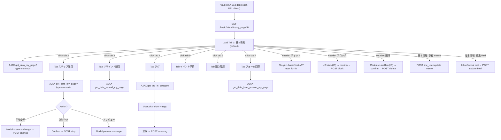

# FA-038 「友だち情報詳細」 (Friend Detail / My Page) — UI Spec

> Mức độ tin cậy mặc định: **Trung bình** (nguồn: Playwright snapshot + screenshot). Các mục ghi rõ khi khác.

## 1. Tổng quan tính năng

| Thuộc tính | Giá trị |
|-----------|---------|
| Mã tính năng | **FA-038** |
| Tên JP | 「友だち情報詳細」 |
| Tên VI | Chi tiết bạn bè / Trang cá nhân (My Page) |
| URL | `https://form.watermeru.com/basic/friendlist/my_page/{id}` (mẫu: `.../my_page/5709`) |
| Portal | Admin LINE OA (form.watermeru.com) |
| Actors | Admin LINE OA, Staff (cùng portal — quyền theo custom role) |
| Mục đích | Xem và quản lý chi tiết một bạn LINE: thông tin cơ bản, custom fields, trạng thái scenario (step), reminder, tag, lịch sử event booking, lịch sử mua hàng, câu trả lời form. Hỗ trợ thao tác nhanh: mở chat 1-1, block, xóa, sửa memo, sửa custom field, gán/gỡ tag. |

### Mối liên hệ
- Vào từ **FA-013 「友だちリスト」** (danh sách bạn) khi click icon/link chi tiết trên 1 row — nhưng FA-038 spec **độc lập**, không reference sang FA-013.
- Cũng có thể đến từ tab 「タグ管理クイック操作」 của chat 1-1 hoặc từ các module khác (friend information, URL analytics...).

---

## 2. Sơ đồ trang

```
URL: /basic/friendlist/my_page/{id}
  │
  ├── Header (LINE名 + tên hệ thống + 3 nút: チャット / ブロック / 削除)
  ├── Tabs navigation (7 tabs — SPA: cùng URL, switch bằng JS/AJAX)
  │
  ├── SCR-FMP-01 — Tab 「基本情報」 (mặc định)
  ├── SCR-FMP-02 — Tab 「ステップ配信」
  ├── SCR-FMP-03 — Tab 「リマインド配信」
  ├── SCR-FMP-04 — Tab 「タグ」
  ├── SCR-FMP-05 — Tab 「イベント予約」
  ├── SCR-FMP-06 — Tab 「購入履歴」
  └── SCR-FMP-07 — Tab 「フォーム回答」
```

Tất cả tabs **dùng chung URL**, chỉ khác nội dung body — chuyển tab không reload trang, nạp dữ liệu qua AJAX.

---

## 3. Layout chung (áp dụng mọi tab)

### 3.1 Header (block cố định trên cùng vùng article)

| Thành phần | Giá trị mẫu | Ghi chú |
|-----------|-------------|---------|
| Heading | 「友だち情報詳細」 (H2) | Tiêu đề trang |
| LINE display name | `[W] サポート/🌸❤️❤️` | Tên hiển thị LINE của bạn |
| Dấu cách | `/` | |
| System display name | `Gamanda 😈😈😈` | Tên Admin đặt cho bạn (xem ở custom field「システム表示名」) |
| Button 「チャット」 | Link (không rõ URL — có thể mở /basic/chat-v3?user_id=5709) | Mở hội thoại 1-1 với bạn |
| Link 「ブロック」 | `href="javascript:block(5709)"` | Gọi JS function block(ID) → confirm → AJAX block |
| Link 「削除」 | `href="javascript:deleteLineUser(5709)"` | Gọi JS function deleteLineUser(ID) → confirm → AJAX xóa |

### 3.2 Tabs navigation (list 7 listitem, cursor pointer)

Thứ tự từ trái sang phải:
1. 「基本情報」 (default, active)
2. 「ステップ配信」
3. 「リマインド配信」
4. 「タグ」
5. 「イベント予約」
6. 「購入履歴」
7. 「フォーム回答」

Không có URL riêng cho từng tab (trong snapshot, các listitem không có `/url:` thuộc tính). Khi click sẽ trigger AJAX endpoint tương ứng (xem mục 7 — Endpoints quan sát).

---

## 4. Chi tiết từng màn hình

---

### SCR-FMP-01 — Tab 「基本情報」 (Basic Info, default)

**Screenshot**: `screenshots/02-detail-mypage.png`

#### Layout
Vùng content hiển thị 2 bảng chồng dọc + 1 vùng memo:
1. Bảng 「基本情報」 (Basic Info) — 6 dòng, 2 cột (label/value)
2. Bảng 「友だち情報」 (Friend Info — Custom Fields) — 9 dòng, 2 cột
3. Khối 「メモ」 — textarea + nút 保存

#### Action Buttons

| Label (JP) | Loại | Vị trí | Hành vi | Mức độ tin cậy |
|-----------|------|--------|---------|---------------|
| 「表示設定」 | button (×2) | Góc phải mỗi bảng (「基本情報」、「友だち情報」) | Mở modal cấu hình cột/hàng hiển thị cho bảng tương ứng | Trung bình (chưa snapshot modal) |
| 「編集」 | text button (inline) | Mỗi row「友だち情報」có nút edit | Mở inline editor / modal để sửa giá trị custom field. Snapshot chỉ thấy nút「編集」ở row 「ảnh」 (có img + 「編集」) — các row khác hiển thị giá trị nhưng có thể ẩn nút edit khi hover | Thấp (chỉ xác nhận 1 row có 編集 hiển thị) |
| 「保存」 | button | Dưới memo textarea | POST nội dung memo lên server | Cao (snapshot rõ) |

#### Bảng 「基本情報」

| Hàng (JP label) | Dữ liệu mẫu | Kiểu dữ liệu | Ghi chú |
|----------------|-------------|-------------|---------|
| 「LINE名」 | `[W] サポート/🌸❤️❤️` | text (LINE display name) | Tên từ LINE profile |
| 「友だち追加日時」 | `2025.08.26 12:32 既存友だち` | datetime + badge | Badge `既存友だち` = existing friend (so với `新規` = new) |
| 「紹介アフィリエイター」 | `-` | FK → affiliator | Dấu `-` = không có |
| 「表示中リッチメニュー」 | `-` | FK → rich_menus | Rich menu đang bật cho bạn này |
| 「QRコードアクション」 | `-` | FK → landing/qr actions | Hành động QR đã trigger |
| 「最終メッセージ受信」 | `2026.03.21 10:44` | datetime | Tin nhắn mới nhất nhận từ bạn |

#### Bảng 「友だち情報」 (Custom Fields)

> Đây là các field do Admin tự định nghĩa trong module 「友だち情報管理」. Số lượng và kiểu field tùy cấu hình.

| Label (JP/VI) | Dữ liệu mẫu | Type dự đoán | Ghi chú |
|--------------|-------------|-------------|---------|
| 「date 1」 | (trống) | date | Custom field kiểu ngày |
| 「date 2」 | (trống) | date | |
| 「システム表示名」 | `Gamanda 😈😈😈` | text (system name) | Tên Admin đặt — hiển thị song song LINE name |
| 「ảnh」 | (có img icon + 編集) | image (upload) | Field ảnh — value là URL ảnh, render là thumbnail |
| 「select」 | (trống) | select/dropdown | Chọn 1 option từ list |
| 「メールアドレス」 | `ngan123@gmail.com` | email | |
| 「携帯電話」 | `0333222111` | phone (text) | Format số di động |
| 「test act EDIT 16.10」 | (trống) | text (chưa rõ) | Field test |
| 「kieu point 1」 | (trống) | number (point) — dự đoán từ tên | Field điểm |

#### Form Fields (vùng memo)

| Field (JP) | Input Type | Required | Giá trị mẫu | Validation |
|-----------|-----------|----------|-------------|-----------|
| 「メモ」 | textarea | No | `Ngan check memo` | Không rõ max length |

#### Observations
- 2 bảng đều có nút「表示設定」 riêng → dự đoán mỗi bảng lưu config hiển thị riêng (có thể bằng localStorage hoặc table config trong DB).
- Custom fields render đa dạng theo type (text/email/phone/date/image/select) — render logic do field type quyết định.
- Row 「ảnh」 là ví dụ rõ nhất về inline edit (img + text 編集) — các row khác có thể có cùng pattern nhưng không hiển thị nút khi trống hoặc khi không hover.
- Button 保存 memo dự kiến POST endpoint `/basic/line_user/update` hoặc tương tự (có trong FA-013).

---

### SCR-FMP-02 — Tab 「ステップ配信」 (Step Distribution)

**Screenshot**: `screenshots/03-detail-step.png`

#### Layout
Hai khối dọc:
1. Khối 「ステップ配信情報」 — bảng 2 cột (label/value) + 2 nút action
2. Khối 「配信履歴」 — bảng lịch sử phát step + pagination

#### Action Buttons

| Label (JP) | Loại | Vị trí | Hành vi | Mức độ tin cậy |
|-----------|------|--------|---------|---------------|
| 「手動変更」 | button | Góc phải khối「ステップ配信情報」 | Mở modal chuyển scenario thủ công (chọn scenario khác + vị trí step) | Trung bình (chưa snapshot modal) |
| 「強制停止」 | button | Cạnh「手動変更」 | Dừng scenario đang chạy cho bạn này (confirm trước) | Trung bình |
| 「プレビュー」 | button | Cột cuối mỗi row 「配信履歴」 | Xem trước nội dung tin step đã gửi | Trung bình |

#### Bảng 「ステップ配信情報」

| Hàng | Dữ liệu mẫu | Kiểu dữ liệu |
|------|-------------|-------------|
| 「配信中のステップ」 | `test bug job update` | text (tên scenario đang active) |
| 「次回配信予定」 | `停止中` | datetime hoặc text trạng thái (`停止中` = stopping/paused) |
| (row trống thứ 3) | — | (có thể là row cho reserved/future field) |

#### Data Table 「配信履歴」

| Column (JP) | Kiểu dữ liệu | Sortable | Dữ liệu mẫu |
|-------------|-------------|----------|-------------|
| 「配信日時」 | datetime | Không rõ | `2026.03.04 18:18` |
| 「ステップ名」 | text (FK → scenario) | Không | `test bug job update` |
| 「通数」 | text (thứ tự message) | Không | `4通目` (message thứ 4), `1通目`, `2通目`, `5通目`... |
| 「配信ステータス」 | enum | Không | `配信済み` (đã gửi), `配信エラー` (lỗi), `絞り込み配信対象外` (không match filter) |
| 「メッセージ」 | tag list | Không | `-` hoặc `【メッセージパック】 【紹介】` |
| (cột cuối — action) | button | — | 「プレビュー」 |

Pagination: `全86件中 1~5件を表示中`, các nút `1`, `2`, `3`, `→` (next).

#### Observations
- Tên cột 「通数」 hiển thị dạng `N通目` → thứ tự message trong scenario.
- Tag 「メッセージパック」、「紹介」 trong cột「メッセージ」 có thể là metadata gắn vào từng message (loại template).
- Paging 5 item/page → endpoint có query `page=N`.

---

### SCR-FMP-03 — Tab 「リマインド配信」 (Reminder Delivery)

**Screenshot**: `screenshots/04-detail-remind.png`

#### Layout
Một khối「配信中のリマインド」 — bảng 4 cột + empty tbody.

#### Data Table 「配信中のリマインド」

| Column (JP) | Kiểu dữ liệu | Dữ liệu mẫu |
|-------------|-------------|-------------|
| 「リマインド名」 | text (FK → event/reminder) | (rỗng — friend không có) |
| 「リマインド終了日時」 | datetime | — |
| 「次回配信予定日時」 | datetime | — |
| (cột cuối — action) | button | — (có thể 「停止」 hoặc 「プレビュー」) |

#### Observations
- Friend 5709 không có reminder đang chạy → tbody rỗng.
- Không có pagination → có thể dùng khi số lượng nhỏ. Nếu lớn sẽ thêm giống tab step.
- Không thấy nút bulk action trong tab này (cho mẫu hiện tại).

---

### SCR-FMP-04 — Tab 「タグ」 (Tag Management)

**Screenshot**: `screenshots/05-detail-tag.png`

Dùng **shared component SC-002 「Tag Selector」** (xem `features/shared/registry.md`).

#### Layout
1. Bảng 「現在ついているタグ」 — 2 cột (フォルダ / タグ), list các tag hiện gắn.
2. Khối「タグ編集」 — 2 cột grid tags:
   - Cột trái: danh sách folder (clickable)
   - Cột phải: danh sách tag trong folder đang chọn (clickable để tick)
3. Button 「登録」 — lưu các tag đã chọn.

#### Action Buttons

| Label (JP) | Loại | Hành vi |
|-----------|------|---------|
| Chip tag trong bảng「現在ついているタグ」 | clickable chip | Click để gỡ tag khỏi bạn |
| Folder items | clickable text | Filter danh sách tag theo folder |
| Tag items | clickable chip | Toggle chọn/bỏ chọn tag |
| 「登録」 | button | POST tag list → endpoint `/basic/friendlist/save-tag` (hoặc tương tự) |

#### Data Table 「現在ついているタグ」

| Column (JP) | Kiểu dữ liệu | Dữ liệu mẫu |
|-------------|-------------|-------------|
| 「フォルダ」 | text (FK → tag_folder) | `未分類` |
| 「タグ」 | chip (FK → tag) | `test scen 2` |

#### Folder List (mẫu từ snapshot)
`未分類`, `nga test`, `ntest`, `タグ 管理`, `最終編集`, `絞り込み条件`

#### Tag List trong folder đang chọn (mẫu)
`nga test sv mơi`, `test scen 2`, `abc`, `filter 2`

#### Observations
- Flow: chọn folder (cột trái) → chọn tag (cột phải) → 登録 → server lưu → UI cập nhật bảng 「現在ついているタグ」.
- Endpoint đã quan sát: `GET /basic/get_tag_in_category?type=tags&cat_id=0&line_user_id=5709` — lấy tag list theo folder.
- **Shared reference**: `SC-002 Tag Selector` đã có pending-ref (xem cập nhật).

---

### SCR-FMP-05 — Tab 「イベント予約」 (Event Booking)

**Screenshot**: `screenshots/06-detail-event.png`

#### Layout
Một khối「イベント参加履歴」 — bảng 3 cột + empty tbody.

#### Data Table 「イベント参加履歴」

| Column (JP) | Kiểu dữ liệu | Dữ liệu mẫu |
|-------------|-------------|-------------|
| 「参加（予定）日時」 | datetime | — |
| 「イベント名」 | text (FK → event) | — |
| 「ステータス」 | enum (予約済/キャンセル/参加済...) | — |

#### Observations
- Bạn 5709 không có booking nào → tbody rỗng → **structure chưa xác nhận với data thật**.
- Không thấy nút action/pagination trong snapshot — có thể hiện ra khi có data.

---

### SCR-FMP-06 — Tab 「購入履歴」 (Purchase History)

**Screenshot**: `screenshots/07-detail-purchase.png`

#### Layout
1. Toggle buttons đầu khối: 「単品商品」 / 「継続商品」 (single product / subscription)
2. Bảng 5 cột + action column, empty tbody.

#### Action Buttons

| Label (JP) | Loại | Hành vi |
|-----------|------|---------|
| 「単品商品」 | tab button | Filter bảng theo loại sản phẩm đơn |
| 「継続商品」 | tab button | Filter bảng theo loại sản phẩm định kỳ |

#### Data Table

| Column (JP) | Kiểu dữ liệu | Dữ liệu mẫu |
|-------------|-------------|-------------|
| 「購入日時」 | datetime | — |
| 「注文番号」 | text (order code) | — |
| 「商品名」 | text (FK → product) | — |
| 「購入価格」 | number (currency JPY) | — |
| 「決済結果」 | enum (成功/失敗/保留...) | — |
| (cột cuối) | action button | — |

#### Observations
- 2 tab con 「単品商品」 / 「継続商品」 chia source: mỗi tab có thể query table khác (orders / subscriptions).
- Tbody rỗng → structure chưa confirm với data thật.

---

### SCR-FMP-07 — Tab 「フォーム回答」 (Form Answers)

**Screenshot**: `screenshots/08-detail-form.png`

#### Layout
Snapshot chỉ thấy 2 header labels của bảng, chưa có table header đầy đủ hiển thị (có thể do CSS đang render dạng list):
- 「回答日時」 (Response datetime) — có icon (sort toggle?)
- 「推定ページ表示時間」 (Estimated page view time)

#### Observations
- Endpoint đã quan sát: `GET /ajax/get_data_form_answer_my_page?page=1&user_id=5709` → JSON list form answers.
- Bạn 5709 không có answer → list rỗng.
- Thiếu các column tiêu chuẩn khác như 「フォーム名」、「ステータス」 — có thể chỉ hiện khi có data. **Cần snapshot lại với user có data**.
- Click 1 row có thể mở modal/page chi tiết xem câu trả lời — chưa snapshot.

---

## 5. User Flows

### 5.1 Happy path — xem chi tiết bạn
1. Từ FA-013 click row bạn → browser điều hướng `/basic/friendlist/my_page/{id}`.
2. Mặc định load tab 「基本情報」 → GET `/ajax/get_data_my_page?type=common&user_id={id}`.
3. User click lần lượt các tab khác → AJAX call endpoint tương ứng, cập nhật content block.

### 5.2 Block friend
1. Click link 「ブロック」 → JS `block(5709)` chạy.
2. Xuất hiện confirm dialog (chưa snapshot) → user xác nhận.
3. Browser gọi POST (dự đoán) `/basic/line_users/block` với `user_id=5709`.
4. Server update trạng thái → UI reload hoặc update badge.

### 5.3 Delete friend
1. Click link 「削除」 → JS `deleteLineUser(5709)` chạy.
2. Confirm dialog (chưa snapshot) → user xác nhận.
3. POST (dự đoán) `/basic/line_users/delete` với `user_id=5709`.
4. Server xóa (hoặc soft-delete) → redirect về `/basic/friendlist`.

### 5.4 Edit memo
1. Tại tab 「基本情報」, user gõ vào textarea 「メモ」.
2. Click 「保存」 → POST (dự đoán) `/basic/line_user/update` với `{user_id, memo}`.
3. UI hiện toast success, memo giữ lại.

### 5.5 Edit custom field
1. User hover/click row custom field → hiện nút 「編集」.
2. Click 「編集」 → inline input hoặc modal xuất hiện (chưa snapshot).
3. Sửa value → Enter / save → POST endpoint update field cho user.
4. UI refresh giá trị.

### 5.6 Add/remove tag
1. Chuyển sang tab「タグ」.
2. GET `/basic/get_tag_in_category?type=tags&cat_id=0&line_user_id=5709` load folder + tag list.
3. User click folder (cột trái) → load lại tag list (cột phải) với folder khác.
4. User click 1 tag trong cột phải để tick chọn.
5. Click 「登録」 → POST (dự đoán) `/basic/friendlist/save-tag` với `{user_id, tag_ids[]}`.
6. Server lưu → cập nhật bảng「現在ついているタグ」.
7. Để gỡ: click trực tiếp chip trong bảng → AJAX gỡ tag.

### 5.7 Manual scenario change / force stop
1. Tại tab「ステップ配信」, click 「手動変更」.
2. Modal chọn scenario + step vị trí (chưa snapshot) → user chọn → save → POST endpoint change scenario.
3. Click 「強制停止」 → confirm → POST endpoint stop scenario.

### 5.8 View form answer detail
1. Tại tab「フォーム回答」, click row.
2. Mở modal/page hiển thị câu trả lời (chưa snapshot).

### 5.9 View step preview
1. Tại tab「ステップ配信」 row history → click 「プレビュー」.
2. Mở modal preview nội dung tin step đã gửi (chưa snapshot).

---

## 6. Flow Diagram



---

## 7. Endpoints quan sát

> Nguồn: `raw/features/friend-mypage/network-endpoints.txt`. Các request xảy ra khi browse qua các tab.

| # | Method | URL | Tab / Trigger | Mức độ tin cậy |
|---|--------|-----|---------------|---------------|
| 1 | GET | `/` | Root (điều hướng) | Cao |
| 2 | GET | `/ajax/get_data_form_answer_my_page?page=1&user_id=5709` | Tab「フォーム回答」 | Cao |
| 3 | GET | `/ajax/get_data_my_page?page=1&type=common&user_id=5709` | Tab「基本情報」 (common data) | Cao |
| 4 | GET | `/ajax/get_data_my_page?page=1&type=scenario&user_id=5709` | Tab「ステップ配信」 (scenario/step history) | Cao |
| 5 | GET | `/ajax/get_data_remind_my_page?user_id=5709` | Tab「リマインド配信」 | Cao |
| 6 | GET | `/basic/get_tag_in_category?type=tags&cat_id=0&line_user_id=5709` | Tab「タグ」 (lấy tag theo folder) | Cao |
| 7 | POST | `/ajax/check-init-tutorial` | Common (tutorial check) | Cao (không thuộc nghiệp vụ chính) |

**Các endpoint dự đoán chưa quan sát (Thấp):**
- Tab「イベント予約」: `/ajax/get_data_event_booking_my_page?user_id=5709` (hoặc tương tự)
- Tab「購入履歴」: `/ajax/get_data_purchase_my_page?user_id=5709&type=single` / `type=subscription`
- Block: `POST /basic/line_users/block` body `{user_id}`
- Delete: `POST /basic/line_users/delete` body `{user_id}`
- Update memo: `POST /basic/line_user/update` body `{user_id, memo}`
- Save tag: `POST /basic/friendlist/save-tag` body `{line_user_id, tag_ids[]}`
- Manual scenario change: `POST` endpoint scenario force-change
- Force stop scenario: `POST` endpoint scenario force-stop

---

## 8. Điểm chưa rõ / cần điều tra

| # | Vấn đề | Tác động | Đề xuất |
|---|--------|----------|---------|
| 1 | Confirm dialog của 「ブロック」 và 「削除」 chưa snapshot | Chưa rõ text nội dung, có input lý do không | Snapshot khi mở dialog |
| 2 | Modal 「表示設定」 (ở cả 2 bảng basic info + friend info) chưa snapshot | Không rõ options cấu hình (ẩn/hiện cột, thứ tự, per-user hay per-bot) | Click nút, snapshot modal. Có thể là shared component mới (column visibility settings) |
| 3 | Modal 「手動変更」 (manual scenario change) chưa snapshot | Không rõ flow chọn scenario + step position | Click và snapshot |
| 4 | Inline editor của custom field 編集 chưa snapshot | Không rõ input type render theo field type, có validation không | Click 編集 ở nhiều type (date, select, image) |
| 5 | Tab 「イベント予約」 (SCR-FMP-05), 「購入履歴」 (SCR-FMP-06), 「フォーム回答」 (SCR-FMP-07) đều rỗng với bạn 5709 | Structure chỉ xác nhận từ header table — chưa có data row | Chọn bạn khác có dữ liệu và snapshot lại |
| 6 | Tab 「フォーム回答」 chỉ hiển thị 2 label, thiếu header đầy đủ của table | Có thể structure khác (list dạng card?) | Snapshot với data |
| 7 | Behavior JS callbacks `block(id)`, `deleteLineUser(id)` | Endpoint thực tế chưa xác nhận | Bắt network khi click thử (trên môi trường test) |
| 8 | Nút「チャット」 header chưa có URL rõ — chỉ là div `cursor=pointer` | URL đích chưa xác nhận | Inspect JS handler |
| 9 | Button「プレビュー」 ở step history chưa snapshot modal preview | Không rõ format | Click, snapshot |
| 10 | Tab purchase có 2 toggle 単品/継続 — behavior khi switch chưa xác nhận (reload ajax vs filter client) | Ảnh hưởng endpoint | Chọn bạn có data, observe network khi click |

---

## 9. Phụ thuộc chéo (Cross-References)

### Shared Components đã xác nhận dùng
| Mã SC | Component | Dùng ở màn hình nào | Ghi chú |
|-------|-----------|---------------------|---------|
| SC-002 | Tag Selector | SCR-FMP-04 「タグ」 | Folder list + tag list + 登録 — biến thể gán tag cho 1 bạn |

### Shared Components nghi ngờ (pending)
| Component (dự kiến) | Mô tả | Dùng ở | Ghi chú |
|--------------------|-------|--------|---------|
| Column Visibility Settings | Modal「表示設定」 cấu hình ẩn/hiện cột/hàng bảng | SCR-FMP-01 (basic info + friend info) | Có thể shared với FA-013 (list friend) và các list khác |
| Memo Save Block | Textarea + 保存 | SCR-FMP-01 | Pattern có thể lặp lại ở các detail page khác (product, form, event) |
| Inline Custom Field Editor | Nút「編集」 inline trong bảng custom fields | SCR-FMP-01 | Có thể shared với module「友だち情報管理」 |

### Tính năng liên quan (thấy URL reference)
- **FA-013 「友だちリスト」** — nguồn điều hướng vào FA-038.
- **FA-001 「1:1チャット」** — nút「チャット」 header có thể mở chat với bạn này.
- **「ステップ配信」 (FA liên quan scenario)** — tab「ステップ配信」 hiển thị lịch sử từ module scenario.
- **「リマインド配信」 (FA-016 hoặc tương đương)** — tab「リマインド配信」 liên quan module events.
- **「イベント予約」 (FA tương đương booking-event-day)** — tab「イベント予約」.
- **「商品販売」 (module sales)** — tab「購入履歴」.
- **「フォーム作成」 (FA form)** — tab「フォーム回答」.
- **「タグ管理」 (FA-012)** — tab「タグ」 dùng chung tag list.
- **「友だち情報管理」 (FA tương đương friend-information)** — các custom field định nghĩa ở đây.
