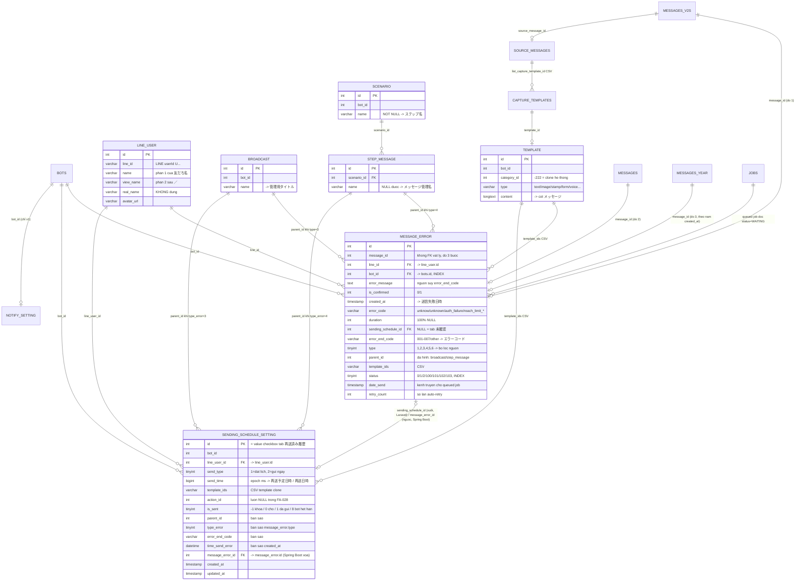
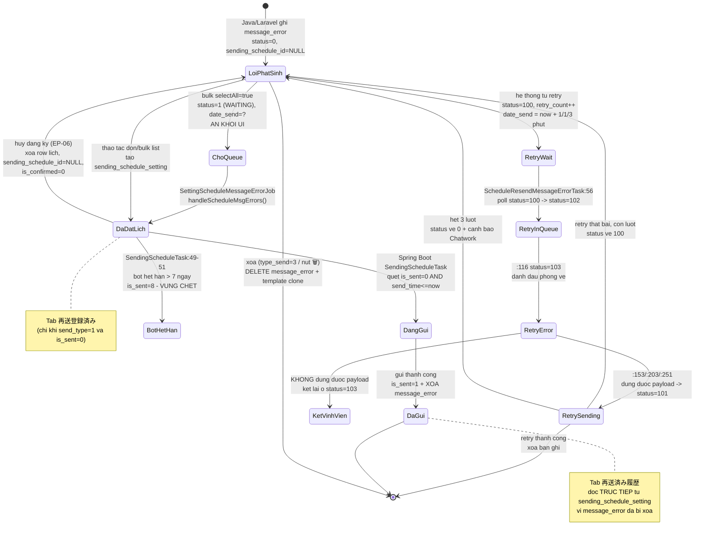

# DB Mapping — FA-028 「配信エラー」 (Lỗi phát hành / Error message)

| Thuộc tính | Giá trị |
|-----------|---------|
| Mã tính năng | **FA-028** |
| Portal | Admin (LINE OA) |
| Màn hình | SCR-ERR-01 … SCR-ERR-06 |
| Đầu vào | `_internal/db-hint.md`, `ui/ui-spec.md`, `web/api-spec.md`, `web/logic-spec.md` |
| Nguồn DB | `db/index.md`, `db/schema/tables/*.sql`, `db/data/*.sql` (dump ~20/04/2026) |
| Nguồn code đối chiếu | `src/web/sns-line/app/Http/Controllers/Basic/MessageErrorController.php`, `resources/views/basic/error_list/v2/*.blade.php`, `public/js/error_list/index_v2.js`, `config/sns-line.php` |
| Mức tin cậy tổng thể | **Cao** — mọi ánh xạ cột đều đối chiếu được với blade template + schema + dữ liệu thật |

> ⚠ **Đính chính quan trọng so với `db-hint.md`**: cột 「エラーコード」 trên UI **KHÔNG** map tới `message_error.error_code` mà map tới **`message_error.error_end_code`**. `error_code` là mã kỹ thuật nội bộ (`unknow`, `unknown`, `auth_failure`, `reach_limit_free`, `reach_limit_line_loaded`), **không bao giờ** mang giá trị `001`–`007`. Xác minh: `table-unconfirm.blade.php` dòng `v-html="getErrorCode(message.error_end_code)"` + thống kê 8.067 bản ghi thật (mục 6.2).

> ⚠ **Đính chính thứ hai**: cột 「ステップ名」 của nguồn 「ステップ配信」 hiển thị **tên kịch bản** (`scenario.name`, biến `scen_name`), còn cột 「メッセージ管理名」 mới hiển thị **tên step** (`step_message.name`, biến `step_name`). Nhãn UI và tên biến bị đảo ngược nhau. Xác minh: `MessageErrorController.php:319-326` + `table-unconfirm.blade.php`.

---

## 1. Primary Tables — bảng liên quan trực tiếp

| # | Bảng | Connection | Model Laravel | Vai trò | Số bản ghi trong dump | Data size |
|---|------|-----------|---------------|---------|----------------------|-----------|
| 1 | **`message_error`** | `mysql` | `App\MessageError` | Bảng lỗi phát hành — nguồn của tab 「未確認エラー」 và 「再送登録済み」 | **8.067** | 3.0 MB |
| 2 | **`sending_schedule_setting`** | `mysql` | `App\SendingScheduleSetting` | Hàng đợi gửi lại — nguồn **duy nhất** của tab 「再送済み履歴」, đồng thời là cầu nối sang Spring Boot `SendingScheduleTask` | **2.431** | 473 KB |

Cả 2 bảng đều được khai báo tường minh trong model (`$table`), mass-assignment mở (`$guarded = []`) — **Cao**.

---

## 2. Secondary Tables — bảng liên quan gián tiếp

### 2.1. Bảng join hiển thị (đọc trong vòng lặp làm giàu dữ liệu)

| Bảng | Connection | Model | Liên kết | Dùng cho UI element | Có trong dump? |
|------|-----------|-------|---------|--------------------|----------------|
| `line_user` | `mysql` | `App\LineUser` | `message_error.line_id` → `line_user.id`; `sending_schedule_setting.line_user_id` → `line_user.id` | 「友だち名」/「ユーザー名」 | ✔ (139.1 MB) |
| `broadcast` | `mysql` | `App\BroadCast` | `message_error.parent_id` → `broadcast.id` (khi `type = 3`) | 「管理用タイトル」 | ✔ (740 KB) |
| `step_message` | `mysql` | `App\StepMessage` | `message_error.parent_id` → `step_message.id` (khi `type = 4`) | 「メッセージ管理名」 | ✔ (620 KB) |
| `scenario` | `mysql` | `App\Scenario` | `step_message.scenario_id` → `scenario.id` | 「ステップ名」 | ✔ (300 KB) |
| `template` | `mysql` | `App\Template` | `message_error.template_ids` / `sending_schedule_setting.template_ids` (CSV) → `template.id` | 「メッセージ」 (khi có template), preview modal | ✔ (1.8 MB) |
| `capture_templates` | `mysql` | `App\CaptureTemplate` | `source_messages.list_capture_template_id` (CSV) → `capture_templates.id`; phần tử `cap_{id}` trong `template_ids` | 「メッセージ」 khi tin nhắn dạng capture | ✔ (2.1 MB) |
| `source_messages` | `mysql` | `App\SourceMessage` | `messages_v2s.source_message_id` → `source_messages.id` | 「メッセージ」 với tin nhiều bong bóng | ✔ (2.5 MB) |

### 2.2. Bảng `messages*` phân mảnh — nguồn nội dung cột 「メッセージ」

`message_error.message_id` là số trần, **không kèm thông tin bảng** → controller phải dò tuần tự (`MessageErrorController.php:236-283`).

| Thứ tự dò | Bảng | Connection | Model | Có trong dump? | Ghi chú |
|-----------|------|-----------|-------|----------------|---------|
| 1 | `messages_v2s` | `mysql_message` | `App\MessagesV2` | ✔ 56.2 MB | Bảng nóng hiện tại; `type_message` lấy từ accessor `convert_type_message` |
| 2 | `messages` | `mysql_message` | `App\Messages` | ✔ 25.2 MB | Bảng cũ |
| 3a | `messages_2020` | `mysql_db_ovh` | `App\Messages2020` | ✘ **THIẾU** | |
| 3b | `messages_2021` | `mysql_db_ovh` | `App\Messages2021` | ✘ **THIẾU** | |
| 3c | `messages_2022` | `mysql_db_ovh` | `App\Messages2022` | ✘ **THIẾU** | |
| 3d | `messages_2023` | `mysql_db_ovh` | `App\Messages2023` | ✘ **THIẾU** | |
| 3e | `messages_2024` | `mysql_db_ovh` | `App\Messages2024` | ✔ 13.1 MB | Bảng theo năm duy nhất có trong dump |
| 3f | `messages_2025` | `mysql_db_ovh` | `App\Messages2025` | ✘ **THIẾU** | |
| — | `messages_page_2` | `mysql_message` | `App\MessagesPage2` | ✔ 105 KB | **Chỉ luồng v1** dùng; v2 không đụng tới |
| — | `messages_old` | `mysql_message` | `App\MessagesOld` | ✔ 261 KB | **Chỉ luồng v1** |

> **Nhận xét (Cao)**: dump chỉ chứa **1/6 bảng theo năm** (`messages_2024`). Vì `db/index.md` không liệt kê `messages_2020`…`messages_2023` và `messages_2025`, không thể xác minh cấu trúc các bảng đó từ dump — coi như cùng schema với `messages_2024` (**Trung bình**, suy luận từ việc các model đều kế thừa cùng khuôn).
>
> **Hệ quả nghiệp vụ (Cao)**: `switch` chỉ hard-code 2020–2025 (`MessageErrorController.php:245-270`). Lỗi có `created_at` từ **2026 trở đi** rơi vào `default` → `$modelMessage = null` → `content` rỗng → cột 「メッセージ」 trên UI trống. Trong dump có **1.125 bản ghi `created_at` năm 2026** (13,9 %) đã rơi vào tình huống này.

### 2.3. Bảng phụ trợ khác

| Bảng | Vai trò | Cột liên quan | Ai ghi? |
|------|---------|--------------|---------|
| `bots` | Phạm vi dữ liệu theo LINE OA; mốc badge thông báo lỗi mới | `bots.id`, `bots.last_time_show_message_error` (`datetime`, dòng 80), `bots.free_send_count` (55), `bots.plan_type` (54) | EP-07 (v2), EP-12 (v1) |
| `notify_setting` | Số lỗi cho push app + Chatwork | `app_total_msg_error` (33), `chat_work_total_msg_error` (34) | **Chỉ luồng v1** — v2 không đồng bộ (BR-23) |
| `jobs` | Queue Laravel driver `database` cho `SettingScheduleMessageErrorJob` | `queue`, `payload`, `attempts`, `available_at` | EP-05 khi `selectAll = true` |

### 2.4. "Bảng" không tồn tại trong DB

| Nguồn dữ liệu | Thực chất là gì | Vị trí |
|--------------|-----------------|--------|
| Bảng tra cứu 「エラー原因一覧」 (SCR-ERR-04) — 8 dòng `001`–`007` + `other` | **Mảng config PHP**, không có bảng DB | `config/sns-line.php:1099-1132`, key `sns-line.table_error_code` |

---

## 3. Entity Details

### 3.1. `message_error` — bảng lỗi phát hành

#### Columns

| Cột | Kiểu | Nullable | Default | Key | Mô tả (tiếng Việt) |
|-----|------|---------|---------|-----|--------------------|
| `id` | `int(10) unsigned` | Không | `AUTO_INCREMENT` | **PK** | Khoá chính; chính là `value` của checkbox mỗi dòng trên UI (mẫu quan sát `48233647`) |
| `message_id` | `int(11)` | Có | `NULL` | — | ID tin nhắn gốc ở một trong các bảng `messages*`; **không có FK, không ghi bảng nào**. Trong dump: 142 bản ghi `NULL`, 59 bản ghi `= 0` (nguồn broadcast/step không đi qua bảng messages) |
| `line_id` | `int(11)` | Có | `NULL` | — | FK logic → `line_user.id`. **Tên gây nhầm lẫn**: không phải LINE userId (chuỗi `U…`) mà là PK nội bộ. Trong dump: 0 bản ghi `NULL` |
| `bot_id` | `int(11)` | Có | `NULL` | KEY `message_error_bot_id_index` | FK logic → `bots.id`; nền tảng phân tách dữ liệu theo LINE OA |
| `error_message` | `text` | Có | `NULL` | — | Nội dung lỗi, thường là **HTML tiếng Nhật có thẻ `<a>`**; là nguồn duy nhất để suy `error_end_code` |
| `is_confirmed` | `int(11)` | Không | `0` | — | `1` = đã liên kết lịch gửi lại (đặt bởi `pushSchedule()`); reset về `0` khi huỷ đăng ký. Trong dump: 140 bản ghi `= 1` |
| `created_at` | `timestamp` | Có | `CURRENT_TIMESTAMP` | — | **Thời điểm gửi lỗi** → cột 「送信失敗日時」; đồng thời là tiêu chí chọn bảng `messages_{năm}` |
| `updated_at` | `timestamp` | Có | `NULL` ON UPDATE | — | Không hiển thị trên UI |
| `error_code` | `varchar(32)` | Có | `'unknow'` | — | **Mã lỗi kỹ thuật nội bộ** — KHÔNG hiển thị trên UI. Tập giá trị thật: `reach_limit_line_loaded`, `reach_limit_free`, `unknow`, `auth_failure`, `unknown`, `NULL`. Dùng duy nhất ở BR-04 (`== '006'` chặn gửi lại) |
| `duration` | `int(11)` | Có | `NULL` | — | Độ dài audio/video. **100 % `NULL`** trong dump (8.067/8.067) |
| `sending_schedule_id` | `int(10) unsigned` | Có | `NULL` | — | FK logic → `sending_schedule_setting.id`. **`NULL` = tab 「未確認エラー」**. Trong dump: 174 bản ghi có giá trị |
| `error_end_code` | `varchar(50)` | Có | `NULL` | — | **Mã hiển thị trên UI** (`001`…`007`, `other`); nếu rỗng thì controller tính lại runtime bằng `getEndCode(error_message)` |
| `type` | `tinyint(4)` | Không | `1` | — | Nguồn phát sinh lỗi. Comment DB: `1: other, 2: chat11, 3: send all, 4: scenario` — thực tế còn `5` (template), `6` (remind) chỉ khai báo trong code |
| `parent_id` | `int(11)` | Có | `NULL` | — | Đa hình: `type=3` → `broadcast.id`; `type=4` → `step_message.id`; các type khác → ý nghĩa không xác định |
| `template_ids` | `varchar(256)` | Có | `NULL` | — | CSV id template dùng để gửi lại; phần tử `cap_{id}` trỏ `capture_templates`. Trong dump: 412 bản ghi có giá trị, **0 bản ghi chứa tiền tố `cap`** |
| `status` | `tinyint(4)` | Có | `0` | KEY `status` | **7 giá trị**: `0` = bình thường; `1` = WAITING (chờ queued job, **bị ẩn khỏi UI**); `2` = DONE; `100` = RETRY_WAIT; `101` = RETRY_SENDING; `102` = RETRY_INQUEUE; `103` = RETRY_ERROR (**kẹt vĩnh viễn**). Giá trị `102`/`103` **chỉ do Spring Boot ghi**, không có trong hằng số PHP — xem §5.2 |
| `date_send` | `timestamp` | Có | `NULL` | — | Thời điểm gửi lại mong muốn, **chỉ dùng cho đường queued job** (`selectAll = true`); job đọc lại giá trị này. Trong dump: 187 bản ghi có giá trị |
| `retry_count` | `int(11)` | Có | `NULL` | — | Số lần hệ thống **tự động** thử lại; giãn cách **+1 / +1 / +3 phút** (`SentMessageHelper.setupDateSendMessageError():691-703`), tối đa 3 lần. Trong dump: 48 bản ghi `= 3`, 2 bản ghi `= 1` |

#### Indexes

| Tên | Cột | Kiểu |
|-----|-----|------|
| `PRIMARY` | `id` | PRIMARY KEY, AUTO_INCREMENT |
| `message_error_bot_id_index` | `bot_id` | INDEX |
| `status` | `status` | INDEX |

#### Foreign Keys
**Không có ràng buộc FK vật lý nào** — toàn bộ database (308 bảng) có `0` câu lệnh `FOREIGN KEY` (kiểm chứng bằng `grep -c "FOREIGN KEY" db/schema/all-tables.sql` → `0`). Mọi quan hệ chỉ là **FK logic** ở tầng ứng dụng. Mức tin cậy: **Cao**.

> **Rủi ro hiệu năng (Trung bình)**: query chính lọc theo `bot_id + status + type + sending_schedule_id IS NULL` nhưng chỉ có index đơn trên `bot_id` và `status`. Với bot lớn nhất trong dump (`bot_id = 46283`, **3.472** bản ghi) query vẫn phải quét lọc `type` thủ công; thêm nữa mỗi lần mở tab 「未確認エラー」 chạy **4 query COUNT riêng biệt** không cache (BR-18).

#### Sample Data (trích thật từ `db/data/message_error.sql`)

**Bản ghi nguồn 「1:1チャット」 (`type = 2`) — rơi vào fallback 「上記以外の場合」:**
```
id=18987, message_id=173038, line_id=5824, bot_id=844,
error_message='messages[0].text May not be empty',
is_confirmed=0, created_at='2024-05-13 06:40:11',
error_code='unknow', error_end_code='other', type=2,
parent_id=NULL, template_ids=NULL, status=0, retry_count=NULL
```

**Bản ghi nguồn 「メッセージ配信」 (`type = 3`) — mã `005`:**
```
id=22411, message_id=0, line_id=5802, bot_id=705,
error_message='<a href="/admin/bot_add?id=L1M6q8B4WzRD">LINE公式アカウント凍結、もしくは誤操作により現在設定されているchannel secretが利用できなくなりました。誤操作の場合は、サポートまでご連絡ください。</a>',
error_code='auth_failure', error_end_code='005', type=3,
parent_id=4418, template_ids='56281', status=0
```

**Bản ghi nguồn 「ステップ配信」 (`type = 4`):**
```
id=19991, message_id=0, line_id=5821, bot_id=844,
error_message='channelToken is marked non-null but is null',
error_code='unknown', error_end_code=NULL, type=4,
parent_id=32926, template_ids='53356', status=0
```
→ `error_end_code = NULL` ⇒ controller tính lại runtime → chuỗi không khớp mẫu nào → `'other'` → UI hiển thị 「エルメサポートまで」.

**Bản ghi đang retry tự động (`status = 100`):**
```
id=48210263, bot_id=542, error_code='auth_failure', error_end_code='005',
type=3, parent_id=740208, status=100, retry_count=1,
created_at='2025-12-29 09:48:43', updated_at='2026-01-20 08:22:34'
```
→ UI hiển thị nhãn 「リトライ中」 + tooltip 「送信失敗から1,2,5分後にリトライ配信を行います。リトライ中はこのメッセージの削除はできません。」, ẩn checkbox và disable nút 🗑.
> ⚠ Số phút trong tooltip (**1,2,5**) **không khớp code** (**1,1,3**) — xem §5.2 và mục 9 (#13).

**Bản ghi đã liên kết lịch (`status = 2 / DONE`):**
```
id=24830, sending_schedule_id=3087, is_confirmed=1, status=2, type=2
```

---

### 3.2. `sending_schedule_setting` — hàng đợi gửi lại

#### Columns

| Cột | Kiểu | Nullable | Default | Key | Mô tả (tiếng Việt) |
|-----|------|---------|---------|-----|--------------------|
| `id` | `int(10) unsigned` | Không | `AUTO_INCREMENT` | **PK** | Khoá chính; **cũng là `value` checkbox / tham số `message_error_id`** khi ở tab 「再送済み履歴」 (ngữ nghĩa đổi theo tab — `MessageErrorController.php:393-395`) |
| `bot_id` | `int(10) unsigned` | Không | — | — | FK logic → `bots.id` |
| `line_user_id` | `int(10) unsigned` | Không | — | — | FK logic → `line_user.id`; sao chép từ `message_error.line_id` |
| `send_type` | `tinyint(4)` | Không | — | — | `1` = 「再送するタイミングを登録」 (đặt lịch), `2` = 「すぐに再送する」 (gửi ngay). Dump: `2` → 1.279, `1` → 1.152 |
| `send_time` | `bigint(20)` | Không | — | — | **Epoch millisecond** = `strtotime(...) * 1000`. Nguồn của cả 「再送予定日時」 và 「再送日時」 trên UI. Dump: min `1712910480000` (12/04/2024), max `1775028966000` (01/04/2026), **0 bản ghi `= 0`** |
| `template_ids` | `varchar(255)` | Không | — | — | CSV id template **đã clone** (`category_id = -222`); nội dung gửi lại độc lập với bảng `messages*` |
| `action_id` | `int(11)` | Có | `NULL` | — | Luôn `null` trong luồng FA-028. Dump: 2.427/2.431 `NULL`, chỉ 4 bản ghi có giá trị (`45965`, `45967`) → đến từ luồng khác |
| `is_sent` | `tinyint(4)` | Không | — | — | **4 giá trị**: `0` = chờ gửi (Spring Boot quét), `1` = đã gửi, `-1` = **khoá tạm** chống race condition (chỉ Laravel ghi), `8` = **bot hết hạn hợp đồng > 7 ngày** (chỉ Spring Boot ghi). Dump: **100 % `= 1`** |
| `parent_id` | `int(11)` | Có | `NULL` | — | Sao chép từ `message_error.parent_id`. Dump: 428 bản ghi `NULL` |
| `type_error` | `tinyint(4)` | Có | `NULL` | — | Sao chép từ `message_error.type`; được `SELECT ... 'type_error as type'` để tái dùng cùng bộ lọc nguồn. Dump: `3`→751, `5`→656, `1`→503, `2`→192, `6`→187, `4`→92, `NULL`→50 |
| `error_end_code` | `varchar(50)` | Có | `NULL` | — | Sao chép từ `message_error.error_end_code`. **UI tab 「再送済み履歴」 không render cột này ở bảng danh sách**, chỉ modal chi tiết dùng |
| `time_send_error` | `datetime` | Có | `NULL` | — | Sao chép từ `message_error.created_at` — thời điểm lỗi ban đầu. **Không hiển thị ở bảng danh sách**; modal chi tiết dùng cho 「送信失敗日時」 |
| `message_error_id` | `int(11)` | Có | `NULL` | — | FK **ngược** → `message_error.id`; là cột Spring Boot dùng để `removeById()` sau khi gửi thành công. Dump: 70 bản ghi `NULL` (bản ghi cũ từ luồng v1) |
| `created_at` | `timestamp` | Có | `NULL` | — | Thời điểm Admin đăng ký gửi lại |
| `updated_at` | `timestamp` | Có | `CURRENT_TIMESTAMP` ON UPDATE | — | Thời điểm job cập nhật trạng thái gửi |

#### Indexes

| Tên | Cột | Kiểu |
|-----|-----|------|
| `PRIMARY` | `id` | PRIMARY KEY, AUTO_INCREMENT |

> **Rủi ro hiệu năng nghiêm trọng (Cao — phát hiện; Trung bình — mức tác động)**: bảng **chỉ có PK**, không có index nào trên `is_sent`, `send_time`, `bot_id`, `message_error_id`. Trong khi đó:
> - Spring Boot `SendingScheduleTask` poll liên tục `findTop100ByIsSentAndSendTimeLessThanEqual(0, now)` → **full table scan mỗi chu kỳ**.
> - Laravel `ajaxGetMessageError` tab `registered_send` LEFT JOIN bảng này rồi `WHERE is_sent = 0 AND send_type = 1`.
> - `getListHistorySend()` lọc `bot_id + type_error + is_sent = 1` → full scan.

#### Foreign Keys
Không có (toàn DB không có FK vật lý).

#### Sample Data (trích thật từ `db/data/sending_schedule_setting.sql`)

**Bản ghi cũ từ luồng v1 (các cột liên kết lỗi đều `NULL`):**
```
id=2, bot_id=844, line_user_id=5821, send_type=1, send_time=1712912400000,
template_ids='51418', action_id=NULL, is_sent=1, parent_id=NULL,
type_error=NULL, error_end_code=NULL, time_send_error=NULL, message_error_id=NULL,
created_at='2024-04-12 07:02:37'
```

**Bản ghi mới từ luồng v2 — đặt lịch (`send_type = 1`), nguồn 「その他メッセージ」:**
```
id=3085, bot_id=542, line_user_id=5902, send_type=1, send_time=1768899000000,
template_ids='7989552,7989553,7988894', is_sent=1, parent_id=0,
type_error=1, error_end_code='005', time_send_error='2026-01-19 13:40:28',
message_error_id=48210716, created_at='2026-01-20 08:47:31', updated_at='2026-01-20 08:50:06'
```

**Bản ghi nguồn 「1:1チャット」 (`type_error = 2`) rơi vào fallback:**
```
id=3087, bot_id=1282, line_user_id=5828, send_type=1, send_time=1771051620000,
template_ids='7989709', is_sent=1, parent_id=NULL,
type_error=2, error_end_code='other', time_send_error='2024-12-02 17:01:27',
message_error_id=24830
```

**Bản ghi gửi ngay (`send_type = 2`) với `template_ids` rỗng:**
```
id=3088, bot_id=541, line_user_id=5709, send_type=2, send_time=1775028966000,
template_ids='', is_sent=1, parent_id=NULL,
type_error=2, error_end_code='002', time_send_error='2026-03-11 19:53:15',
message_error_id=48212723
```
→ `template_ids = ''` là **dữ liệu bất thường** (clone template thất bại nhưng vẫn tạo lịch — hệ quả trực tiếp của BR-24 "không có transaction"). Mức tin cậy: **Trung bình** (quan sát 1 bản ghi).

---

### 3.3. `line_user` (secondary) — nguồn 「友だち名」/「ユーザー名」

| Cột | Kiểu | Vai trò trong FA-028 |
|-----|------|---------------------|
| `id` | `int(12)` PK | Đích của `message_error.line_id` và `sending_schedule_setting.line_user_id` |
| `line_id` | `varchar(128)` | LINE userId thật (`U…`) — **không dùng** trong tính năng này |
| `name` | `varchar(128)` NULL | **Phần 1** của chuỗi hiển thị |
| `view_name` | `varchar(128)` NULL | **Phần 2** — nối bằng ký tự `／` (fullwidth solidus) khi khác rỗng |
| `real_name` | `varchar(128)` NULL | **Không dùng** cho cột hiển thị này |
| `avatar_url` | `varchar(256)` NULL | Có trong response API, không render ở bảng danh sách |

**Sample data thật:**
```
id=10, line_id='Uf80fae4739e53054f74cae7fb7a349ee', name='t', real_name='神崎',
       avatar_url='http://dl.profile.line-cdn.net/…', view_name='テスト'
```
→ hiển thị `t／テスト`, đúng khuôn mẫu `Bích Hảo／haodtb` quan sát trên UI. Mức tin cậy: **Cao**.

### 3.4. `broadcast` / `step_message` / `scenario` (secondary)

| Bảng | Cột dùng | Vai trò |
|------|---------|---------|
| `broadcast` | `id`, `name` (`varchar(255)` NULL) | `name` → cột 「管理用タイトル」 (mẫu UI: `bdcast1`, `bdc1`) |
| `step_message` | `id`, `name` (`varchar(255)` NULL), `scenario_id` | `name` → cột 「メッセージ管理名」; `scenario_id` để join tiếp |
| `scenario` | `id`, `name` (`varchar(200)` NOT NULL) | `name` → cột 「ステップ名」 (mẫu UI: `scenario1`, `scenario05`) |

> **Giải thích cột 「メッセージ管理名」 rỗng ở cả 3 mẫu UI (điểm chưa rõ #4 của ui-spec)**: `step_message.name` là `varchar(255) DEFAULT NULL` — cột **tuỳ chọn**, Admin không bắt buộc đặt tên quản lý cho từng step. Ngược lại `scenario.name` là `NOT NULL` nên cột 「ステップ名」 luôn có giá trị. Mức tin cậy: **Cao** (schema) / **Trung bình** (kết luận nghiệp vụ).

### 3.5. `template` (secondary) — nội dung gửi lại

| Cột | Kiểu | Vai trò |
|-----|------|---------|
| `id` | `int(11)` PK | Đích của CSV `template_ids` |
| `bot_id` | `int(11)` | Phân tách theo LINE OA |
| `name` | `varchar(255)` NULL | Không hiển thị trong FA-028 |
| **`category_id`** | `int(11)` NULL | **Sentinel `-222`** = template hệ thống clone để gửi lại; bị ẩn khỏi danh mục template của Admin và bị xoá cùng bản ghi lỗi |
| `type` | `varchar(30)` NOT NULL | Ánh xạ sang `type_message` cho UI: `stamp`→`sticker`, `form`→`buttons`, `voice`→`audio` |
| `content` | `longtext` NULL | Nội dung thô → cột 「メッセージ」 khi `type_message = 'text'` |
| `image_server`, `thumbnail_path`, `duration` | | Dùng cho preview modal |

**Xác minh sentinel**: dump `db/data/template.sql` chứa **230** bản ghi có giá trị `-222` ở vị trí `category_id`. Mức tin cậy: **Trung bình** (đếm bằng khớp chuỗi `, -222, `, chưa parse từng cột).

---

## 4. UI ↔ DB Field Mapping theo từng màn hình

### 4.1. SCR-ERR-01 — Tab 「未確認エラー」

Điều kiện lọc chung (mọi nguồn): `message_error.bot_id = <session bot>` **AND** `message_error.status != 1` **AND** `message_error.error_message NOT IN (' Failed to send messages', 'Failed to send messages')` **AND** `message_error.sending_schedule_id IS NULL`. Sắp xếp: `ORDER BY message_error.id DESC`.

#### (a) Nguồn 「1:1チャット」 (`type = 2`) và 「その他メッセージ」 (`type NOT IN (2,3,4)`)

| UI Element | Label JP | DB Table | Column | Mapping Type | Confidence | Ghi chú |
|-----------|---------|---------|--------|--------------|-----------|---------|
| Checkbox mỗi dòng (`value`) | — | `message_error` | `id` | Direct | **Cao** | Chỉ render khi `status NOT IN (100, 101)` |
| Cột 1 | 「送信失敗日時」 | `message_error` | `created_at` | Direct | **Cao** | Client format `moment(...).format('YYYY/MM/DD HH:mm')` |
| Nhãn 「リトライ中」 + tooltip | — | `message_error` | `status` | Enum | **Cao** | Hiện khi `status ∈ {100, 101}` |
| Cột 2 | 「友だち名」 | `line_user` | `name` + `'／'` + `view_name` | FK + Computed | **Cao** | Join `message_error.line_id → line_user.id`; bỏ phần `／…` khi `view_name` rỗng |
| Cột 3 (text) | 「メッセージ」 | `messages_v2s` / `messages` / `messages_{năm}` | `content` | FK + Computed | **Cao** | Dò 3 bước theo `message_id`; chỉ render khi `type_message = 'text'` |
| Cột 3 (text, có template) | 「メッセージ」 | `template` | `content` | FK + Computed | **Cao** | Khi `message_error.template_ids` khác rỗng thì lấy `Template::whereIn(id, CSV)->first()->content` |
| Cột 3 (text, capture) | 「メッセージ」 | `capture_templates` → `template` | `content` | FK + Computed | **Trung bình** | Qua `messages_v2s.source_message_id → source_messages.list_capture_template_id` |
| Cột 3 (media) | 「メッセージ」 | `messages_v2s` / `template` | `type` (qua `convert_type_message`) | Enum | **Cao** | Render nhãn cố định: 画像 / スタンプ / パネル・ボタン / 位置情報 / 紹介 / 動画 / 音声 |
| Cột 3 (URL file) | 「メッセージ」 | — | `content` (JSON) → khoá `filePath` | Computed | **Cao** | Khi `content` là JSON hợp lệ, UI hiển thị `filePath` (mẫu: URL `.pdf`) |
| Cột 4 | 「エラーコード」 | `message_error` | **`error_end_code`** | Enum | **Cao** | `001`–`007` hiển thị nguyên mã; mọi giá trị khác (gồm `other`, `NULL`, `''`) → link 「エルメサポート」+「まで」 |
| Nút 「詳細」 | — | `message_error` | `id` | Direct | **Cao** | Tham số `message_error_id` của EP-03 |
| Nút 🗑 | — | `message_error` | `id`, `status` | Direct + Enum | **Cao** | `disabled` khi `status ∈ {100, 101}` |
| Badge 「1:1チャット」 | — | `message_error` | `COUNT(*) WHERE type = 2 AND sending_schedule_id IS NULL AND status != 1` | Aggregated | **Cao** | Trường `totalChat11UnConfirm` |
| Badge 「メッセージ配信」 | — | `message_error` | `COUNT(*) WHERE type = 3 …` | Aggregated | **Cao** | `totalSendAllUnConfirm` |
| Badge 「ステップ配信」 | — | `message_error` | `COUNT(*) WHERE type = 4 …` | Aggregated | **Cao** | `totalScenarioUnConfirm` |
| Badge 「その他メッセージ」 | — | `message_error` | `COUNT(*) WHERE type NOT IN (2,3,4) …` | Aggregated | **Cao** | `totalOtherUnConfirm`; gồm `type` 1, 5, 6 |
| Dòng 「…全 N 件を合わせて選択」 | — | `message_error` | `COUNT(*) WHERE status NOT IN (100,101)` trên cùng bộ lọc | Aggregated | **Cao** | Trường `totalNotRetry` |
| Chỉ báo 「1 〜 N / M」 | — | `message_error` | `COUNT(*)` của paginator | Aggregated | **Cao** | Từ `PaginationResource` |
| Select 「表示件数：」 | — | — | — | *(không lưu DB)* | **Cao** | Tham số `per_page` (100/200/500) |
| Nhãn 「一括操作 N 件 選択中」 | — | — | — | *(không lưu DB)* | **Cao** | Đếm phía client |

#### (b) Nguồn 「メッセージ配信」 (`type = 3`) — chỉ liệt kê cột khác biệt

| UI Element | Label JP | DB Table | Column | Mapping Type | Confidence | Ghi chú |
|-----------|---------|---------|--------|--------------|-----------|---------|
| Cột 3 | **「管理用タイトル」** | `broadcast` | `name` | FK | **Cao** | Join `message_error.parent_id → broadcast.id`, chỉ khi `type = 3` **và** `parent_id` khác `NULL`; biến response `broadcast_name` |
| *(cột 「メッセージ」)* | — | — | — | — | **Cao** | **Không render** với nguồn này |

Trong dump: 389 bản ghi `type = 3`, trong đó **381** có `parent_id` khác `NULL` (97,9 %) → 8 bản ghi sẽ hiển thị 「管理用タイトル」 rỗng.

#### (c) Nguồn 「ステップ配信」 (`type = 4`) — 7 cột

| UI Element | Label JP | DB Table | Column | Mapping Type | Confidence | Ghi chú |
|-----------|---------|---------|--------|--------------|-----------|---------|
| Cột 3 | **「ステップ名」** | `scenario` | `name` | FK (2 chặng) | **Cao** | `message_error.parent_id → step_message.id → step_message.scenario_id → scenario.id`; biến response **`scen_name`** — nhãn UI và tên biến **bị đảo** |
| Cột 4 | **「メッセージ管理名」** | `step_message` | `name` | FK | **Cao** | `message_error.parent_id → step_message.id`; biến response **`step_name`**; `NULL` được → cột rỗng |

Trong dump: **3.656/3.656** bản ghi `type = 4` đều có `parent_id` (100 %).

---

### 4.2. SCR-ERR-02 — Tab 「再送登録済み」

Điều kiện lọc: cùng bộ lọc cơ bản **+** `LEFT JOIN sending_schedule_setting ON message_error.sending_schedule_id = sending_schedule_setting.id` **+** `sending_schedule_setting.is_sent = 0` **+** `sending_schedule_setting.send_type = 1`. `SELECT` bổ sung 2 cột `send_time`, `is_sent`.

| UI Element | Label JP | DB Table | Column | Mapping Type | Confidence | Ghi chú |
|-----------|---------|---------|--------|--------------|-----------|---------|
| Checkbox mỗi dòng | — | `message_error` | `id` | Direct | **Cao** | Ở tab này **không** kiểm tra `status` retry — checkbox luôn hiện |
| Cột 1 | **「再送予定日時」** | `sending_schedule_setting` | `send_time` (epoch ms) | Computed | **Cao** | `moment(send_time).format('YYYY/MM/DD HH:mm')`; **không phải** `message_error.created_at` |
| Cột 2 | 「友だち名」 | `line_user` | `name` + `'／'` + `view_name` | FK + Computed | **Cao** | Join qua `message_error.line_id` (không phải `sending_schedule_setting.line_user_id`) |
| Cột 3 (chat11/other) | 「メッセージ」 | `template` / `messages*` | `content`, `type` | FK + Computed | **Cao** | Cùng cơ chế SCR-ERR-01 |
| Cột 3 (send_all) | 「管理用タイトル」 | `broadcast` | `name` | FK | **Cao** | Vẫn qua `message_error.parent_id` |
| Cột 3 (step) | 「ステップ名」 | `scenario` | `name` | FK (2 chặng) | **Cao** | |
| Cột 4 (step) | 「メッセージ管理名」 | `step_message` | `name` | FK | **Cao** | |
| Cột 5 | 「エラーコード」 | `message_error` | `error_end_code` | Enum | **Cao** | |
| Nút 🗑 | — | `message_error` | `id` | Direct | **Cao** | Ở tab này = **huỷ đăng ký gửi lại** (xoá row `sending_schedule_setting`, reset `sending_schedule_id = NULL`, `is_confirmed = 0`) — không xoá bản ghi lỗi |
| Dòng 「…全 N 件を合わせて選択」 | — | — | `COUNT(*)` toàn bộ (`total_record_all`) | Aggregated | **Cao** | Khác SCR-ERR-01: tab này dùng `total_record_all`, không phải `total_record_all_not_retry` |
| Empty state | 「再送登録済みのメッセージはありません」 | — | `COUNT(*) = 0` | Aggregated | **Cao** | |

> **Giải thích tab rỗng khi quét live (điểm chưa rõ #1 của ui-spec)**: trong dump, **2.431/2.431 bản ghi `sending_schedule_setting` đều có `is_sent = 1`** — không tồn tại bản ghi `is_sent = 0` nào. Điều kiện `is_sent = 0 AND send_type = 1` không khớp bản ghi nào ⇒ tab luôn rỗng. Đây là trạng thái tự nhiên: lịch gửi lại được Spring Boot xử lý trong vòng vài phút nên trạng thái `is_sent = 0` chỉ tồn tại thoáng qua. Mức tin cậy: **Cao**.

---

### 4.3. SCR-ERR-03 — Tab 「再送済み履歴」 (đảo nguồn dữ liệu)

**Nguồn dữ liệu đổi hẳn**: `SELECT *, type_error AS type FROM sending_schedule_setting WHERE bot_id = ? AND is_sent = 1 AND <lọc type_error>` `ORDER BY id DESC`. **Không đụng tới `message_error`.**

| UI Element | Label JP | DB Table | Column | Mapping Type | Confidence | Ghi chú |
|-----------|---------|---------|--------|--------------|-----------|---------|
| Cột 1 | **「再送日時」** | `sending_schedule_setting` | `send_time` (epoch ms) | Computed | **Cao** | **Cùng cột** với 「再送予定日時」 của SCR-ERR-02, chỉ khác ngữ cảnh `is_sent` |
| Cột 2 | **「ユーザー名」** | `line_user` | `name` + `'／'` + `view_name` | FK + Computed | **Cao** | Join qua **`sending_schedule_setting.line_user_id`** (khác tab trên) — đây chính là lý do nhãn đổi từ 「友だち名」 thành 「ユーザー名」 |
| Cột 3 (chat11/other) | 「メッセージ」 | `template` | `content`, `type` | FK + Computed | **Cao** | **Chỉ** lấy từ `Template::whereIn(id, explode(',', template_ids))->first()`; không dò bảng `messages*` |
| Cột 3 (send_all) | 「管理用タイトル」 | `broadcast` | `name` | FK | **Cao** | Qua `sending_schedule_setting.parent_id` |
| Cột 3 (step) | 「ステップ名」 | `scenario` | `name` | FK (2 chặng) | **Cao** | Qua `sending_schedule_setting.parent_id → step_message` |
| Cột 4 (step) | 「メッセージ管理名」 | `step_message` | `name` | FK | **Cao** | |
| Nút 「詳細」 | — | `sending_schedule_setting` | `id` | Direct | **Cao** | ⚠ Tham số `message_error_id` của EP-03 mang **`sending_schedule_setting.id`**, không phải `message_error.id` |
| *(cột 「エラーコード」)* | — | — | — | — | **Cao** | **Không render** ở bảng danh sách, dù `sending_schedule_setting.error_end_code` có dữ liệu |
| Bộ lọc nguồn | 4 nút | `sending_schedule_setting` | `type_error` | Enum | **Cao** | 「その他メッセージ」 = `type_error NOT IN (2,3,4)`; **50 bản ghi `type_error = NULL`** trong dump cũng rơi vào nhóm này |
| Badge số lượng | — | — | Hard-code `0` | *(không lưu DB)* | **Cao** | 4 `totalXxxUnConfirm` đều trả `0` ở tab này |
| Empty state | 「再送済み履歴のメッセージはありません」 | — | `COUNT(*) = 0` | Aggregated | **Cao** | |

> **Giải thích thứ tự không theo thời gian (điểm chưa rõ #8 của ui-spec)**: query có `orderBy('send_time','asc')` nhưng bị `orderByDesc('id')` ghi đè ⇒ thực tế sắp xếp theo `id DESC` (thứ tự **đăng ký gửi lại**), không theo `send_time`. Ví dụ mẫu UI `26/08 17:32` đứng trước `28/08 19:22` khớp với việc bản ghi 26/08 được đăng ký sau. Mức tin cậy: **Cao**.

> **Bổ sung so với ui-spec**: tab này **có** cột 「管理用タイトル」/「ステップ名」/「メッセージ管理名」 khi chọn nguồn `send_all`/`step` (xác minh `table-sent.blade.php`). Phiên quét live chỉ quan sát nguồn chat11/other nên ui-spec ghi thiếu.

---

### 4.4. SCR-ERR-04 — Tab 「エラー原因一覧」

| UI Element | Label JP | DB Table | Column | Mapping Type | Confidence | Ghi chú |
|-----------|---------|---------|--------|--------------|-----------|---------|
| Cột 1, 8 dòng | 「エラーコード」 | **KHÔNG CÓ** | — | *(config)* | **Cao** | `config('sns-line.table_error_code')[*]['code']` — `config/sns-line.php:1099-1132`; khoá `other` hiển thị 「上記以外の場合」 |
| Cột 2, 8 dòng | 「エラー原因」 | **KHÔNG CÓ** | — | *(config)* | **Cao** | `config('sns-line.table_error_code')[*]['error_message']` — chuỗi HTML có thẻ `<a class="link">` |
| Ghi chú đỏ 「(※)…」 | — | **KHÔNG CÓ** | — | *(hard-code blade)* | **Cao** | Chỉ hiện với `001`/`002`/`003` — `v-show="['001','002','003'].includes(...)"` |
| Select 「表示件数：」 | — | — | — | *(không lưu DB)* | **Cao** | Tồn tại trong DOM nhưng không tác động |

**Toàn bộ màn hình này 0 % ánh xạ DB** — hoàn toàn từ config file. Đây là hạng mục quan trọng nhất của phần "UI fields không tìm thấy DB match" (mục 6.1).

---

### 4.5. SCR-ERR-05 — Modal 「エラーメッセージ詳細」

#### (a) Bảng thông tin — khi mở từ tab 「未確認エラー」/「再送登録済み」

| UI Element | Label JP | DB Table | Column | Mapping Type | Confidence | Ghi chú |
|-----------|---------|---------|--------|--------------|-----------|---------|
| Tiêu đề cột trái | 「メッセージ」 (chat11/other) | — | — | *(text tĩnh)* | **Cao** | |
| Tiêu đề cột trái | *(tên broadcast)* | `broadcast` | `name` | FK | **Cao** | `messageError.name` khi `type = 3` |
| Tiêu đề cột trái | *(tên scenario + step)* | `scenario`, `step_message` | `name` | FK | **Cao** | `messageError.name` + `messageError.step_name` khi `type = 4` |
| Preview bong bóng | — | `template` / `messages_v2s` / `messages` | `content`, `type`, `image_server`, `thumbnail_path`, `duration` | FK + Computed | **Trung bình** | Dựng qua `TemplateV2Service`; nhiều nhánh theo loại nội dung |
| Dòng 1 | 「送信失敗日時」 | `message_error` | `created_at` | Direct | **Cao** | |
| Dòng 2 | 「友だち名」 | `line_user` | `name` + `'／'` + `view_name` | FK + Computed | **Cao** | |
| Dòng 3 (mã) | 「エラーコード」 | `message_error` | `error_end_code` | Enum | **Cao** | |
| Dòng 3 (mô tả) | *(hướng dẫn khắc phục)* | **KHÔNG CÓ** | — | *(config)* | **Cao** | `tableErrorCode[getErrorCode(error_end_code)].error_message` |
| Dòng 3 (ghi chú ※) | 「(※) エルメの契約を…」 | **KHÔNG CÓ** | — | *(hard-code blade)* | **Cao** | Chỉ với `001`/`002`/`003` |

#### (b) Bảng thông tin — khi mở từ tab 「再送済み履歴」

| UI Element | Label JP | DB Table | Column | Mapping Type | Confidence | Ghi chú |
|-----------|---------|---------|--------|--------------|-----------|---------|
| Dòng 1 | 「送信失敗日時」 | `sending_schedule_setting` | `time_send_error` | Direct | **Trung bình** | Trả về qua khoá `created_at` của object `messageError` (chuẩn hoá ở controller) |
| Dòng 1 (bên phải) | 「エラーコード」 | `sending_schedule_setting` | `error_end_code` | Enum | **Cao** | Vị trí layout khác hẳn — nằm cùng hàng với 「送信失敗日時」 |
| Dòng 2 | **「再送日時」** | `sending_schedule_setting` | `send_time` | Computed | **Cao** | **Chỉ hiện ở tab này** (`v-show="tab_parent_active == 'history_send'"`) — trả lời điểm chưa rõ #5 của ui-spec |
| Dòng 3 | 「友だち名」 | `line_user` | `name` + `'／'` + `view_name` | FK + Computed | **Cao** | Nhãn vẫn là 「友だち名」 dù bảng danh sách dùng 「ユーザー名」 |
| Khối chọn hành động | — | — | — | — | **Cao** | **Ẩn hoàn toàn** ở tab này (`v-show="tab_parent_active != 'history_send'"`) |

#### (c) Form chọn hành động → cột DB bị ghi

| UI Element | Label JP | name | value | DB Table | Column ghi vào | Mapping Type | Confidence |
|-----------|---------|------|-------|---------|----------------|--------------|-----------|
| Radio 1 | 「再送するタイミングを登録」 | `type_send` | `1` | `sending_schedule_setting` | `send_type = 1` | Enum | **Cao** |
| Radio 2 | 「すぐに再送する」 | `type_send` | `2` | `sending_schedule_setting` | `send_type = 2`, `send_time = time() * 1000` | Enum | **Cao** |
| Radio 3 | 「このエラーメッセージを削除する」 | `type_send` | `3` | `message_error`, `sending_schedule_setting`, `template` | `DELETE` cả 3 | *(không map cột)* | **Cao** |
| Input ngày | *(không nhãn)* | `date_start_apply` | `YYYY-MM-DD` | `sending_schedule_setting` | `send_time` (nửa ngày) | Computed | **Cao** |
| Input giờ | *(không nhãn)* | `time_start_apply` | `HH:mm` | `sending_schedule_setting` | `send_time` (nửa giờ) | Computed | **Cao** |

**Công thức ghép**: `send_time = strtotime("{date_start_apply} {time_start_apply}:00") * 1000` (epoch ms). Client đổi tên tham số thành `date_send` / `time_send` khi gọi EP-04.

**Các cột phát sinh cùng lúc** (`type_send = 1` hoặc `2`):

| Bảng | Cột | Giá trị |
|------|-----|--------|
| `sending_schedule_setting` | `bot_id` | ← `message_error.bot_id` |
| `sending_schedule_setting` | `line_user_id` | ← `message_error.line_id` |
| `sending_schedule_setting` | `template_ids` | ← template clone mới (hoặc `message_error.template_ids` cũ) |
| `sending_schedule_setting` | `parent_id` | ← `message_error.parent_id` |
| `sending_schedule_setting` | `type_error` | ← `message_error.type` |
| `sending_schedule_setting` | `error_end_code` | ← `getEndCode(message_error.error_message)` (tính lại) |
| `sending_schedule_setting` | `time_send_error` | ← `message_error.created_at` |
| `sending_schedule_setting` | `message_error_id` | ← `message_error.id` |
| `sending_schedule_setting` | `is_sent` | `0` (đường trực tiếp) hoặc `-1` → `0` (đường `handleScheduleMsgErrors`) |
| `message_error` | `sending_schedule_id` | ← `sending_schedule_setting.id` mới tạo |
| `message_error` | `is_confirmed` | `1` |
| `message_error` | `template_ids` | ← CSV template clone |
| `message_error` | `status` | `2` (DONE) — chỉ ở đường `pushSchedule()` |
| `template` | `category_id` | `-222` (bản clone mới) |

---

### 4.6. SCR-ERR-06 — Modal 「再送タイミング変更」 (hàng loạt)

| UI Element | Label JP | DB Table | Column | Mapping Type | Confidence | Ghi chú |
|-----------|---------|---------|--------|--------------|-----------|---------|
| 「選択中の件数 N 件」 | — | — | — | *(không lưu DB)* | **Cao** | Đếm mảng `selected` phía client |
| Radio 1 | 「再送するタイミングを**変更**」 | `sending_schedule_setting` | `send_type = 1` | Enum | **Cao** | Ở tab 「再送登録済み」 **chỉ** `UPDATE send_time`, không tạo row mới (BR-13) |
| Radio 2 | 「すぐに再送する」 | `sending_schedule_setting` | `send_type = 2` | Enum | **Cao** | |
| Input ngày / giờ | — | `sending_schedule_setting` | `send_time` | Computed | **Cao** | Cùng công thức SCR-ERR-05 |
| Danh sách PK gửi lên | — | `message_error` | `id` (mảng `message_error_ids[]`) | Direct | **Cao** | |
| Cờ `selectAll = true` | 「…全 N 件を合わせて選択」 | `message_error` | `status = 1` (WAITING) + `date_send = '{date} {time}:00'` cho toàn bộ bản ghi khớp lọc | Direct | **Cao** | Sau đó dispatch queued job đọc lại `date_send` |
| Nút 「エラーメッセージ削除」 | — | `message_error` / `sending_schedule_setting` | `DELETE` theo tab | *(không map cột)* | **Cao** | Tab `unconfirm` → xoá `message_error`; 2 tab còn lại → xoá row lịch + reset `sending_schedule_id = NULL`, `is_confirmed = 0` |

---

## 5. Enum / Status Values

### 5.1. `message_error.type` (nguồn phát sinh lỗi)

| Giá trị DB | Hằng số PHP | Nhãn UI (bộ lọc nguồn) | Tham số API `error_type` | Phân bố trong dump | Ghi chú |
|-----------|-------------|----------------------|-------------------------|--------------------|---------|
| `1` | `TYPE_OTHER` | 「その他メッセージ」 | `other` | 3.563 (44,2 %) | Nhóm gộp |
| `2` | `TYPE_CHAT11` | 「1:1チャット」 | `chat11` | 194 (2,4 %) | |
| `3` | `TYPE_SEND_ALL` | 「メッセージ配信」 | `send_all` | 389 (4,8 %) | |
| `4` | `TYPE_STEP` | 「ステップ配信」 | `step` | 3.656 (45,3 %) | **Loại lỗi phổ biến nhất** |
| `5` | `TYPE_TEMPLATE` | 「その他メッセージ」 | `other` | 185 (2,3 %) | Gộp vào nhóm `other` |
| `6` | `TYPE_REMIND` | 「その他メッセージ」 | `other` | 80 (1,0 %) | Gộp vào nhóm `other` |

→ Nhóm 「その他メッセージ」 thực tế gồm `1 + 5 + 6` = **3.828 bản ghi (47,5 %)** — trả lời điểm chưa rõ #7 của ui-spec. Mức tin cậy: **Cao**.

### 5.2. `message_error.status` (trạng thái xử lý)

Cột này có **7 giá trị**, định nghĩa ở **hai phía độc lập**: `0`/`1`/`2`/`100`/`101` khai báo trong PHP (`app/MessageError.php:14-28`), còn `102`/`103` **chỉ** khai báo trong Java (`sns/line/values/MessageErrorConstants.java:4-7`) — Laravel không hề biết tới 2 giá trị này.

| Giá trị DB | Hằng số | Khai báo tại | Ý nghĩa | Hiển thị UI | Phân bố trong dump |
|-----------|---------|-------------|---------|-------------|--------------------|
| `0` | *(default)* | schema | Bình thường | Hiện trong danh sách | 8.039 (99,7 %) |
| `1` | `STATUS_HANDLED['WAITING']` | PHP | Đang chờ queued job xử lý | **Bị ẩn khỏi mọi tab** (`status != 1`) | 0 (thoáng qua) |
| `2` | `STATUS_HANDLED['DONE']` | PHP | Job đã tạo lịch xong | Hiện ở tab 「再送登録済み」 (nếu lịch chưa gửi) | 25 (0,3 %) |
| `100` | `STATUS_RETRY_WAIT` | PHP + Java | Đang chờ hệ thống tự retry (tới mốc `date_send`) | Nhãn 「リトライ中」, ẩn checkbox, disable 🗑 | 3 |
| `101` | `STATUS_RETRY_SENDING` | PHP + Java | Đang gửi lại tự động | Như trên | 0 |
| **`102`** | `STATUS_RETRY_INQUEUE` | **Chỉ Java** | Đã được `ScheduleResendMessageErrorTask` gắp vào hàng đợi xử lý | ⚠ **Hiện bình thường, CÓ checkbox, KHÔNG có nhãn 「リトライ中」** | 0 (thoáng qua) |
| **`103`** | `STATUS_RETRY_ERROR` | **Chỉ Java** | Đánh dấu phòng vệ trước khi thử gửi — nếu không chuyển được sang `101` thì **kẹt lại vĩnh viễn** | ⚠ Như trên | 0 |

**Vòng đời retry tự động** (xác minh trực tiếp `ScheduleResendMessageErrorTask.java`):
```
100 (RETRY_WAIT, date_send = now + 1/1/3 phút)
 └─> :56  findTop200ByStatusAndDateSendLessThanEqual(100, now)   ← CHỈ poll status = 100
      └─> :58  status = 102 (INQUEUE)
           └─> :116 status = 103 (RETRY_ERROR)  ← gắn TRƯỚC khi thử gửi
                └─> :153/:203/:251 status = 101 (SENDING) nếu dựng được payload
                     └─> gửi xong: status = 0 (thành công/hết lượt) hoặc quay lại 100
```

> ⚠ **Rủi ro kẹt vĩnh viễn (Cao — phát hiện; Trung bình — mức tác động)**: bản ghi dừng ở `status = 103` **không bao giờ được poll lại**, vì task chỉ tìm `status = 100` (`ScheduleResendMessageErrorTask.java:56`). Comment ngay tại `:116` (「Tránh rơi vào case ko được set status SENDING」) cho thấy đây là **đánh dấu phòng vệ có chủ đích**, nhưng không có cơ chế dọn dẹp. Khớp với rủi ro **R-05** trong `job-spec.md`.
>
> ⚠ **Hệ quả trên UI (Cao)**: query Laravel chỉ loại `status = 1`, nên bản ghi `102`/`103` **vẫn hiện trong danh sách**. Nhưng client `isStatusRetry()` chỉ kiểm tra `100` và `101` (`index_v2.js:1-2, :100-102`) ⇒ bản ghi `102`/`103` hiển thị **có checkbox, nút 🗑 bật, không có nhãn 「リトライ中」** — Admin có thể thao tác lên bản ghi mà Spring Boot đang xử lý dở. `totalNotRetry` cũng chỉ trừ `100`/`101` (`MessageErrorController.php:220`), nên đếm sai.

> **Xác minh giá trị 100/101 (câu hỏi trong đề bài)**: **Có**, cả trong code lẫn dữ liệu. Dữ liệu: **3 bản ghi `status = 100`** (id `48210263`, `48210264`, `48210715`), tất cả đều có `retry_count` khác `NULL`. Mức tin cậy: **Cao**.

> ⚠ **Tooltip UI nói sai số phút (Cao)**: `table-unconfirm.blade.php:73` ghi 「送信失敗から**1,2,5**分後にリトライ配信を行います」, nhưng code thực tế giãn cách **+1 / +1 / +3 phút** (`SentMessageHelper.setupDateSendMessageError():691-703`, `switch (tryTime) { case 1 → plusMinutes(1); case 2 → plusMinutes(1); case 3 → plusMinutes(3); }`). Tổng thời gian retry thực tế là **5 phút** chứ không phải 8 phút như tooltip ngụ ý. Xem bảng rủi ro mục 9 (#13).

### 5.3. `message_error.is_confirmed`

| Giá trị DB | Ý nghĩa | Hiển thị UI | Phân bố trong dump |
|-----------|---------|-------------|--------------------|
| `0` | Chưa liên kết lịch gửi lại | Không hiển thị trực tiếp; dùng cho helper `lastErrorMessage()` (badge sidebar) và `notify_setting` (v1) | 7.927 (98,3 %) |
| `1` | Đã liên kết lịch gửi lại | Không hiển thị trực tiếp | 140 (1,7 %) |

Kiểm tra chéo: `is_confirmed = 1` nhưng `sending_schedule_id IS NULL` → **13 bản ghi** (lịch đã bị huỷ nhưng cờ không reset hoàn toàn, hoặc dấu vết luồng v1 `renderViewSetting()`); `is_confirmed = 0` nhưng có `sending_schedule_id` → **0 bản ghi**. Mức tin cậy: **Cao**.

### 5.4. `sending_schedule_setting.send_type`

| Giá trị DB | Nhãn UI (SCR-ERR-05) | Nhãn UI (SCR-ERR-06) | Tham số API `type` | Phân bố trong dump |
|-----------|---------------------|---------------------|-------------------|--------------------|
| `1` | 「再送するタイミングを登録」 | 「再送するタイミングを変更」 | `1` | 1.152 (47,4 %) |
| `2` | 「すぐに再送する」 | 「すぐに再送する」 | `2` | 1.279 (52,6 %) |

**Lưu ý**: tab 「再送登録済み」 lọc thêm `send_type = 1` ⇒ bản ghi đăng ký kiểu 「すぐに再送する」 (`send_type = 2`) **không bao giờ xuất hiện** ở tab đó, kể cả khi chưa gửi xong. Mức tin cậy: **Cao**.

### 5.5. `sending_schedule_setting.is_sent`

| Giá trị DB | Hằng số | Khai báo tại | Ý nghĩa | Tab UI tương ứng | Phân bố trong dump |
|-----------|---------|-------------|---------|------------------|--------------------|
| `-1` | *(literal)* | **Chỉ PHP** — `SendingScheduleSetting.php:76, :99` | **Khoá tạm** chống race condition — Spring Boot bỏ qua vì chỉ quét `is_sent = 0` | Không tab nào | 0 (thoáng qua) |
| `0` | `IS_WAIT_SEND` | PHP + Java (`entities/SendingScheduleSetting.java:8`) | Chờ gửi | 「再送登録済み」 (khi kèm `send_type = 1`) | 0 |
| `1` | `IS_SENT_SUCCESS` | PHP + Java (`:9`) | Đã gửi | 「再送済み履歴」 | **2.431 (100 %)** |
| **`8`** | `STATUS_EXPIRED_BOT` | **Chỉ Java** (`:10`) | **Bot hết hạn hợp đồng > 7 ngày** — job bỏ qua vĩnh viễn, không gửi | ⚠ **Không tab nào — bản ghi vô hình trên UI** | 0 |

> **Comment DB chỉ ghi `0: chưa send, 1: đã send`** — cả `-1` lẫn `8` đều không được tài liệu hoá ở tầng schema.
>
> ⚠ **Bản ghi `is_sent = 8` biến mất khỏi UI hoàn toàn (Cao)**: cả 3 tab đều lọc theo `is_sent` = `0` hoặc `1`, không tab nào bắt giá trị `8`. Khi bot hết hạn hợp đồng quá 7 ngày, `SendingScheduleTask.java:49-51` ghi `is_sent = 8` rồi `continue` — lịch gửi lại **im lặng bị huỷ**, `message_error` gốc vẫn còn `sending_schedule_id` khác `NULL` nên cũng không quay về tab 「未確認エラー」. Kết quả: bản ghi lỗi **rơi vào vùng chết**, Admin không thấy ở bất kỳ đâu và không được thông báo. Khớp với rủi ro **R-08** trong `job-spec.md`.
>
> Mức tin cậy: **Cao** (đọc trực tiếp `entities/SendingScheduleSetting.java:8-10` và `SendingScheduleTask.java:42, :49-51`); dữ liệu dump không xác nhận được vì `-1`, `0`, `8` đều là trạng thái hiếm/thoáng qua.

### 5.6. `message_error.error_end_code` ↔ bảng 「エラー原因一覧」

| Giá trị DB | Hiển thị cột 「エラーコード」 | Nhóm ngữ nghĩa | Phân bố trong dump | Tỉ lệ |
|-----------|---------------------------|---------------|--------------------|-------|
| `'001'` | `001` | Vượt trần 200 tin — gói Communication (LINE OA) | 692 | 8,6 % |
| `'002'` | `002` | Vượt trần 5.000 tin — gói Light (LINE OA) | 1.376 | 17,1 % |
| `'003'` | `003` | Vượt trần 30.000 tin — gói Standard (LINE OA) | **0** | 0 % |
| `'004'` | `004` | Vượt trần 1.000 tin — gói Free của L Message | 2.239 | 27,8 % |
| `'005'` | `005` | LINE OA đóng băng / channel secret không dùng được | 436 | 5,4 % |
| `'006'` | `006` | Template không có tin nhắn — **chặn gửi lại** (BR-04) | **0** | 0 % |
| `'007'` | `007` | Lỗi tạm thời phía LINE | **0** | 0 % |
| `'other'` | link 「エルメサポート」+「まで」 | Fallback 「上記以外の場合」 | 372 | 4,6 % |
| `NULL` | link 「エルメサポート」+「まで」 | Tính lại runtime bằng `getEndCode()` | 2.951 | 36,6 % |
| `''` (chuỗi rỗng) | link 「エルメサポート」+「まで」 | Tính lại runtime | 1 | 0,01 % |

> **Điểm quan trọng**: `NULL` chiếm **36,6 %** — với các bản ghi này controller tính lại `error_end_code` tại runtime từ `error_message` (`MessageErrorController.php:306-308`) nên UI **vẫn hiển thị đúng mã**. Giá trị lưu trong DB và giá trị hiển thị **không trùng nhau** ở nhóm này. Mức tin cậy: **Cao**.
>
> Mã `003`, `006`, `007` **chưa từng xuất hiện** trong 8.067 bản ghi — trả lời điểm chưa rõ #13 của ui-spec: không có mẫu thực tế để quan sát, cả hai mã đều chỉ tồn tại như nhánh code.

### 5.7. `message_error.error_code` — mã kỹ thuật nội bộ (KHÔNG hiển thị UI)

| Giá trị DB | Ý nghĩa suy ra | Ai ghi | Phân bố trong dump | Tỉ lệ | `error_end_code` tương ứng phổ biến |
|-----------|---------------|--------|--------------------|-------|-------------------------------------|
| `'reach_limit_line_loaded'` | Chạm trần gói của LINE OA — **đã đối chiếu xong hạn mức thật** | Java `HandleGetMessageError.java:47` | 3.782 | 46,9 % | `001` / `002` / `003` |
| `'reach_limit_free'` | Chạm trần gói Free của L Message | PHP `functions.php:3160`; Java `SentMessageHelper.java:427` | 2.369 | 29,4 % | `004` |
| `'unknow'` | **Giá trị mặc định của schema** (viết thiếu chữ `n`) | schema default | 1.224 | 15,2 % | `other` / `NULL` |
| `'auth_failure'` | Lỗi xác thực / channel secret | PHP + Java | 467 | 5,8 % | `005` |
| `'unknown'` | Biến thể viết đúng chính tả — nguồn ghi khác | Java | 221 | 2,7 % | `NULL` / `other` |
| **`'reach_limit_line'`** | **Trạng thái TRUNG GIAN** — vừa nhận lỗi 「You have reached your monthly limit.」 từ LINE, **chưa biết** chạm trần gói nào | PHP `functions.php:3153, :3157`; Java `SentMessageHelper.java:468, :518` | **0** | 0 % | *(chưa gán)* |
| `NULL` | Không ghi | — | 4 | 0,05 % | — |

> ⭐ **`'reach_limit_line'` là giá trị trung gian, không phải giá trị không tồn tại (Cao)**: dump có **0 bản ghi** mang giá trị này **không phải** vì nó vô nghĩa, mà vì nó **chính là điều kiện poll** của task `HandleGetMessageError` — `findFirstByErrorCode(MessageError.REACH_LIMIT_LINE)` (`HandleGetMessageError.java:34`). Task chạy vòng lặp liên tục (`sleep(30000)` khi không tìm thấy bản ghi nào), gọi LINE API lấy hạn mức thật (`getLimitMessageLine(bot)`) và số tin đã gửi trong tháng (`numberMessageSentInMonth(bot)`), rồi **ghi đè** `error_code = 'reach_limit_line_loaded'` kèm `error_end_code` chính xác (`001` nếu `limit <= 210`, `002`/`003` tuỳ hạn mức). ⇒ Bản ghi chỉ mang `'reach_limit_line'` trong khoảng **vài giây tới 30 giây**; snapshot dump bắt trúng là gần như không thể.
>
> Đây cũng là lý do 3.782 bản ghi `'reach_limit_line_loaded'` (46,9 %) chiếm đa số: **tất cả** đều từng đi qua trạng thái `'reach_limit_line'`.

> **Không có giá trị `'006'` nào trong dump** ⇒ nhánh chặn gửi lại của BR-04 (`error_code == '006'`) chưa từng kích hoạt trên dữ liệu này. Mức tin cậy: **Cao**.
>
> Tồn tại **cả `'unknow'` lẫn `'unknown'`** là dấu hiệu 2 nguồn ghi khác nhau (default schema vs. code Java) — **Trung bình** (suy luận).

### 5.8. ⭐ Trả lời câu hỏi mở #14 — giá trị thô mã lỗi của nhóm 「1:1チャット」

**Câu hỏi**: 38 bản ghi nguồn 「1:1チャット」 đều hiển thị 「エルメサポートまで」 — giá trị thô lưu trong DB là gì?

**Trả lời (mức tin cậy: Cao)** — gồm 2 phần:

**(1) Nhầm cột.** UI đọc `error_end_code`, không phải `error_code`. `error_code` là mã kỹ thuật dạng chuỗi tiếng Anh, **không bao giờ** mang giá trị `001`–`007`.

**(2) Phân bố thật của 194 bản ghi `type = 2` (chat11) trong dump:**

| `error_code` (mã kỹ thuật) | Số bản ghi | | `error_end_code` (mã hiển thị) | Số bản ghi | Hiển thị UI |
|---------------------------|-----------|---|-------------------------------|-----------|-------------|
| `'unknow'` | **94 (48,5 %)** | | `'other'` | **124 (63,9 %)** | 「エルメサポートまで」 |
| `'reach_limit_line_loaded'` | 51 (26,3 %) | | `'002'` | 43 (22,2 %) | `002` |
| `'auth_failure'` | 30 (15,5 %) | | `'004'` | 19 (9,8 %) | `004` |
| `'reach_limit_free'` | 19 (9,8 %) | | `'001'` | 7 (3,6 %) | `001` |
| — | — | | `NULL` | 1 (0,5 %) | 「エルメサポートまで」 |

⇒ **125/194 = 64,4 %** bản ghi chat11 rơi vào fallback 「エルメサポートまで」 (`'other'` + `NULL`), tỉ lệ **cao hơn hẳn** mọi nguồn khác:

| Nguồn | Tỉ lệ rơi vào fallback (`other` + `NULL` + `''`) |
|-------|--------------------------------------------------|
| `type = 2` (1:1チャット) | **64,4 %** (125/194) |
| `type = 1` (その他) | 85,2 % (3.035/3.563) — nhưng phần lớn là `NULL` được tính lại runtime |
| `type = 3` (メッセージ配信) | 15,2 % (59/389) |
| `type = 4` (ステップ配信) | 0,7 % (25/3.656) |

**Nguyên nhân gốc (Cao)**: `getEndCode()` chỉ so khớp **7 chuỗi tiếng Nhật cố định** liên quan tới hạn mức gói cước và channel secret. Lỗi chat 1:1 lại chủ yếu là **lỗi validate payload của LINE Messaging API**, ví dụ (trích thật từ dump):

| `error_message` thật | Số bản ghi (toàn bảng) | `error_code` | `error_end_code` |
|---------------------|------------------------|--------------|------------------|
| `messages[0].text May not be empty` / `messages[0].text -> May not be empty` | 25+ | `unknow` | `other` |
| `messages[4].duration -> Must be a positive value` | nhiều | `unknow` | `NULL` |
| `messages[0].originalContentUrl -> Must be a valid HTTPS URL; …previewImageUrl -> …` | 21 | `unknow` | `other` |
| `template/columns/6/actions/1/uri invalid uri` | 20 | `unknow` | `other` |
| `template/actions/0/uri invalid uri` | 19 | `unknow` | `other` |
| ` supported chat type: USER` | 39 | `unknow` | `other` |
| `channelToken is marked non-null but is null` | 42 | `unknown` | `NULL` |
| `Authentication failed. Confirm that the access token in the authorization header is valid.` | — | `unknow` | `other` |

Không chuỗi nào trong số này khớp 7 mẫu tiếng Nhật ⇒ `getEndCode()` trả `'other'` ⇒ UI render dòng fallback 「上記以外の場合」.

> **Kết luận cho `db-hint.md` mục 1.3 và ui-spec điểm chưa rõ #14**: giá trị thô **không phải** `NULL` hay chuỗi rỗng (dù cả hai đều xuất hiện). Giá trị phổ biến nhất là **`error_end_code = 'other'`** — một giá trị **được ghi tường minh** vào DB, sinh ra bởi `getEndCode()` khi `error_message` không khớp mẫu tiếng Nhật nào. `error_code` tương ứng phổ biến nhất là **`'unknow'`** (giá trị default của schema).

⚠ **Cảnh báo về phạm vi dữ liệu**: dump database kết thúc ở `created_at = 2026-04-01`, trong khi phiên quét UI diễn ra ngày **08/09/2026**. **38 bản ghi cụ thể quan sát trên UI không có trong dump.** Kết luận trên là suy rộng thống kê từ 194 bản ghi `type = 2` cùng loại, cộng với việc đọc trực tiếp logic `getEndCode()`. Mức tin cậy của kết luận: **Cao** (cơ chế) / **Trung bình** (con số chính xác cho đúng 38 bản ghi đó).

---

## 6. Unmapped Items

### 6.1. UI fields KHÔNG tìm thấy DB match

| # | UI Element | Màn hình | Nguồn thật | Mức tin cậy |
|---|-----------|---------|-----------|-------------|
| U-01 | Toàn bộ cột 「エラーコード」 của bảng tra cứu — 8 khoá `001`…`007` + `other` | SCR-ERR-04 | `config('sns-line.table_error_code')[*]['code']` — `config/sns-line.php:1099-1132` | **Cao** |
| U-02 | Toàn bộ cột 「エラー原因」 — 8 chuỗi HTML mô tả nguyên nhân + hướng dẫn | SCR-ERR-04 | `config('sns-line.table_error_code')[*]['error_message']` | **Cao** |
| U-03 | Nhãn 「上記以外の場合」 của dòng cuối | SCR-ERR-04 | Giá trị `code` của khoá `other` trong config | **Cao** |
| U-04 | Ghi chú đỏ 「(※) エルメの契約を有料プランにアップグレードしても、配信エラーは解消しません。」 | SCR-ERR-04, SCR-ERR-05 | Hard-code trong `outline.blade.php`, điều kiện `['001','002','003'].includes(...)` | **Cao** |
| U-05 | Link 「エルメサポート」 → `https://tayori.com/form/dac81e909fb6b1d0dd7e53928c18b7fc5a2f8fc0` | SCR-ERR-01/02/05 | **Hard-code trong `index_v2.js:205` và `outline.blade.php`** — không nằm trong config lẫn DB | **Cao** |
| U-06 | Link 「こちら」 → `https://line.me/R/ti/p/%40770yphxr` (LINE OA hỗ trợ) | SCR-ERR-04 | Config khoá `other` | **Cao** |
| U-07 | Link 「アップグレード方法はこちら」 → `https://www.lycbiz.com/jp/manual/OfficialAccountManager/account-settings_plan` | SCR-ERR-04 | Config khoá `001`/`002`/`003` | **Cao** |
| U-08 | Link 「アップグレードはこちら」 → `/admin/bot-add` | SCR-ERR-04 | Config khoá `004` | **Cao** |
| U-09 | 4 nhãn tab 「未確認エラー」/「再送登録済み」/「再送済み履歴」/「エラー原因一覧」 | Toàn trang | Hard-code `index.blade.php:21-42` | **Cao** |
| U-10 | 4 nhãn nguồn 「1:1チャット」/「メッセージ配信」/「ステップ配信」/「その他メッセージ」 | Toàn trang | Hard-code `index.blade.php:77-113` | **Cao** |
| U-11 | Select 「表示件数：」 — 3 lựa chọn `100件`/`200件`/`500件` | Toàn trang | Hard-code `index_v2.js:7-9`; là tham số `per_page`, không lưu DB | **Cao** |
| U-12 | Ngưỡng badge 「99+」 | SCR-ERR-01 | Hard-code trong blade/CSS — hiện `99+` khi `COUNT ≥ 100` (điểm chưa rõ #9 của ui-spec) | **Trung bình** |
| U-13 | Nhãn 「一括操作 N 件 選択中」 + trạng thái `disabled` 2 nút | SCR-ERR-01/02 | Client-side, đếm mảng `selected` | **Cao** |
| U-14 | Checkbox 「このページに表示されていない全 N 件を合わせて選択」 | SCR-ERR-01/02 | Cờ `selectAll` gửi lên API — **không lưu DB**, chỉ đổi cách server build `WHERE` | **Cao** |
| U-15 | Checkbox 「chọn tất cả trong trang」 (`thead`) | SCR-ERR-01/02 | Computed `select_all` phía client | **Cao** |
| U-16 | Tooltip 「リトライ配信中 — 送信失敗から1,2,5分後にリトライ配信を行います。…」 | SCR-ERR-01 | Hard-code `table-unconfirm.blade.php:73`; điều kiện dựa trên `status ∈ {100,101}`. ⚠ **Nội dung tooltip sai so với code** (1,2,5 vs thực tế 1,1,3) — mục 9 (#13) | **Cao** |
| U-17 | 3 empty state 「未確認の配信エラーはありません」/「再送登録済みのメッセージはありません」/「再送済み履歴のメッセージはありません」 | SCR-ERR-01/02/03 | Hard-code blade | **Cao** |
| U-18 | Nhãn loại nội dung 「画像」「スタンプ」「パネル・ボタン」「位置情報」「紹介」「動画」「音声」 | SCR-ERR-01/02/03 | Hard-code blade; ánh xạ từ `type_message` (giá trị từ `template.type` / `messages_v2s.convert_type_message`) | **Cao** |
| U-19 | Cảnh báo 「※ 配信エラーの原因が解消されていない場合、再送しても配信エラーとなります。」 | SCR-ERR-05 | Hard-code `modal-detail-message.blade.php` | **Cao** |
| U-20 | Confirm 「再送日時に現在時刻より前の時間が設定されています。…」 | SCR-ERR-05/06 | Hard-code `modal-detail-message.js:92-97`, `index_v2.js:354-360` | **Cao** |
| U-21 | Confirm 「N件の再送登録済みメッセージを削除しますがよろしいですか？」 | SCR-ERR-01/02 | Hard-code `index_v2.js:276-284` | **Cao** |
| U-22 | Input ẩn `#modal-preview-broadcast-action` | SCR-ERR-05 | Biến trạng thái Vue — không map cột DB | **Trung bình** |
| U-23 | Badge sidebar 「送信エラー 99+」 | Ngoài phạm vi màn hình | `COUNT(*)` bản ghi lỗi chưa xác nhận, so mốc `bots.last_time_show_message_error` + cache `lastErrorMessage{botId}` (TTL 5 phút) | **Trung bình** |
| U-24 | Nhãn 「選択中の件数 N 件」 | SCR-ERR-06 | Client-side | **Cao** |

**Tổng: 24 UI element không có DB match** — trong đó **8 mục (U-01…U-08) đến từ config Laravel**, phần còn lại là text/logic hard-code hoặc trạng thái client.

### 6.2. DB columns KHÔNG xuất hiện trên UI

#### `message_error`

| # | Cột | Kiểu | Phỏng đoán mục đích | Mức tin cậy | Bằng chứng dump |
|---|-----|------|--------------------|-------------|-----------------|
| D-01 | `error_code` | `varchar(32)` | Mã lỗi kỹ thuật nội bộ do tầng gửi tin (Java) ghi, dùng để **phân loại nguyên nhân ở tầng backend** và làm điều kiện chặn gửi lại (BR-04 `== '006'`). UI hoàn toàn không render | **Cao** | 5 giá trị + `NULL`, không giá trị nào là `006` |
| D-02 | `duration` | `int(11)` | Lưu độ dài (giây) của tin nhắn audio/video để dựng lại payload LINE khi gửi lại — **di sản luồng v1**, v2 không đọc | **Trung bình** | **100 % `NULL`** (8.067/8.067) → thực tế đã chết |
| D-03 | `retry_count` | `int(11)` | Số lần hệ thống **tự động** retry, tối đa **3 lần**, giãn cách **+1 / +1 / +3 phút** theo code (`SentMessageHelper.setupDateSendMessageError():691-703`); hết lượt → `setStatus(0)` + cảnh báo Chatwork 「#Retry message_error MAX TIME」 (`:679-682`). Điều khiển vòng đời `status 100 → 102 → 103 → 101 → 0` | **Cao** | 48 bản ghi `= 3`, 2 bản ghi `= 1`; tất cả bản ghi `status = 100` đều có `retry_count` khác `NULL` |
| D-04 | `error_end_code` (giá trị thô) | `varchar(50)` | Bản thân cột **có** hiển thị, nhưng **giá trị `NULL` không được hiển thị nguyên trạng** — controller tính lại runtime. 36,6 % bản ghi rơi vào ca này ⇒ giá trị DB ≠ giá trị UI | **Cao** | 2.951 bản ghi `NULL` |
| D-05 | `parent_id` | `int(11)` | Khoá đa hình tới nguồn phát sinh: `type=3` → `broadcast.id`, `type=4` → `step_message.id`. **Chỉ dùng gián tiếp** để lấy `name`, bản thân số ID không hiển thị. Với `type` 1/5/6 ý nghĩa **không xác định** | **Cao** (type 3/4) / **Thấp** (type 1/5/6) | 762 bản ghi `type=1` có `parent_id`, 116 `type=5`, 67 `type=6`, 60 `type=2` — nhưng code **không đọc** `parent_id` cho các type này |
| D-06 | `message_id` | `int(11)` | ID tin nhắn gốc — dùng để dò nội dung, không hiển thị. Giá trị `0` (59 bản ghi) và `NULL` (142 bản ghi) nghĩa là **không có tin nhắn gốc** (nguồn broadcast/step gửi thẳng từ template) | **Cao** | |
| D-07 | `template_ids` | `varchar(256)` | CSV id template clone; quyết định nội dung gửi lại. Không hiển thị | **Cao** | 412 bản ghi có giá trị; **0 bản ghi** chứa tiền tố `cap_` ⇒ nhánh capture template (BR-11) chưa từng kích hoạt trong dump |
| D-08 | `date_send` | `timestamp` | Thời điểm gửi lại mong muốn, **chỉ là kênh truyền dữ liệu** giữa controller và `SettingScheduleMessageErrorJob` (job đọc lại khi không nhận tham số). Không hiển thị | **Cao** | 187 bản ghi có giá trị |
| D-09 | `is_confirmed` | `int(11)` | Cờ "đã liên kết lịch"; nguồn cho badge thông báo và `notify_setting` (v1). Không hiển thị trực tiếp | **Cao** | 140 bản ghi `= 1` |
| D-10 | `updated_at` | `timestamp` | Dấu vết thay đổi; không hiển thị | **Cao** | |
| D-11 | `status` (giá trị `1`, `2`, `102`, `103`) | `tinyint(4)` | `1` khiến bản ghi **biến mất khỏi UI**; `2` không có biểu hiện trực quan nào. Chỉ `100`/`101` có biểu hiện UI (nhãn 「リトライ中」). **`102`/`103` là "điểm mù" của UI**: bản ghi vẫn hiện như bình thường (có checkbox, nút 🗑 bật) vì `isStatusRetry()` không nhận diện 2 giá trị này | **Cao** | |
| D-12 | `bot_id` | `int(11)` | Phân tách dữ liệu; không hiển thị | **Cao** | |
| D-13 | `error_message` (nội dung thô) | `text` | Chuỗi HTML lỗi gốc — **không bao giờ render nguyên văn** trên UI; chỉ dùng làm đầu vào cho `getEndCode()` rồi hiển thị bản dịch từ config | **Cao** | Chứa cả link `/admin/bot_add?id=…` lộ hash bot — **rủi ro rò rỉ thông tin mức Thấp** nếu có endpoint nào trả nguyên văn (EP-02 **có** trả trường `error_message` trong JSON) |
| D-14 | `line_id` (giá trị số) | `int(11)` | Chỉ dùng để join, giá trị không hiển thị | **Cao** | |

#### `sending_schedule_setting`

| # | Cột | Kiểu | Phỏng đoán mục đích | Mức tin cậy | Bằng chứng dump |
|---|-----|------|--------------------|-------------|-----------------|
| D-15 | `action_id` | `int(11)` | Liên kết tới bảng `actions` — dành cho luồng gửi lịch **khác** (không phải FA-028). Trong FA-028 code luôn gán `null` | **Cao** | 2.427/2.431 `NULL`; 4 bản ghi có giá trị `45965`/`45967` đến từ luồng khác |
| D-16 | `time_send_error` | `datetime` | Bản sao `message_error.created_at` — **denormalize có chủ đích**, để tab 「再送済み履歴」 vẫn biết thời điểm lỗi ban đầu **sau khi Spring Boot đã xoá bản ghi `message_error`**. Không hiển thị ở bảng danh sách, chỉ modal | **Cao** | 50/2.431 `NULL` (bản ghi cũ luồng v1) |
| D-17 | `error_end_code` | `varchar(50)` | Bản sao — cùng lý do denormalize. **Không hiển thị ở bảng danh sách** tab 「再送済み履歴」 (ui-spec ghi nhận đúng: tab này mất cột 「エラーコード」), chỉ modal chi tiết đọc | **Cao** | 94/2.431 `NULL` |
| D-18 | `type_error` | `tinyint(4)` | Bản sao `message_error.type` — cho phép bộ lọc nguồn hoạt động ở tab 「再送済み履歴」 mà không cần join. Alias thành `type` khi trả về | **Cao** | 50/2.431 `NULL` → những bản ghi này rơi vào nhóm 「その他メッセージ」 |
| D-19 | `parent_id` | `int(11)` | Bản sao `message_error.parent_id` — cho phép lấy `broadcast.name` / `step_message.name` sau khi bản ghi lỗi bị xoá | **Cao** | 428/2.431 `NULL` |
| D-20 | `message_error_id` | `int(11)` | FK ngược — **cột mà Spring Boot dùng để `removeById()`** sau khi gửi lại thành công. Không hiển thị | **Cao** | 70/2.431 `NULL` (bản ghi luồng v1) |
| D-21 | `bot_id` | `int(10) unsigned` | Phân tách dữ liệu | **Cao** | |
| D-22 | `template_ids` | `varchar(255)` | CSV template clone — quyết định nội dung, nhưng bản thân chuỗi id không hiển thị | **Cao** | Có bản ghi giá trị `''` (rỗng) → dữ liệu bất thường |
| D-23 | `is_sent = -1` | `tinyint(4)` | Trạng thái khoá tạm, **không tương ứng tab nào** — bản ghi ở trạng thái này "tàng hình" với cả UI lẫn Spring Boot. Thoáng qua (ms) nên vô hại | **Cao** | 0 bản ghi (thoáng qua) |
| D-23b | `is_sent = 8` | `tinyint(4)` | `STATUS_EXPIRED_BOT` — bot hết hạn hợp đồng > 7 ngày, job từ chối gửi vĩnh viễn. **Không tab nào lọc giá trị này** ⇒ bản ghi rơi vào vùng chết: không ở 「再送登録済み」 (`is_sent != 0`), không ở 「再送済み履歴」 (`is_sent != 1`), cũng không quay về 「未確認エラー」 (vì `message_error.sending_schedule_id` vẫn khác `NULL`). Admin **không được thông báo** | **Cao** | 0 bản ghi |
| D-24 | `created_at` / `updated_at` | `timestamp` | `created_at` = lúc Admin đăng ký, `updated_at` = lúc job cập nhật sau khi gửi. Không hiển thị (UI chỉ dùng `send_time`) | **Cao** | |

#### Chiều FK nào thực sự được dùng? (câu hỏi trong đề bài)

| Chiều | Cột | Được dùng ở đâu | Kết luận |
|-------|-----|-----------------|----------|
| **Xuôi** `message_error.sending_schedule_id` → `sending_schedule_setting.id` | `sending_schedule_id` | **Laravel**: phân biệt tab (`IS NULL` = 未確認), LEFT JOIN tab 「再送登録済み」, khoá chống double-booking trong `pushSchedule()` | ✔ **Dùng chính** ở tầng web |
| **Ngược** `sending_schedule_setting.message_error_id` → `message_error.id` | `message_error_id` | **Spring Boot**: `messageErrorRepository.removeById(item.getMessageErrorId())` sau khi gửi thành công (`SendingScheduleTask.java:98`) | ✔ **Dùng chính** ở tầng job |

⇒ **Cả hai chiều đều được dùng**, nhưng ở hai tầng khác nhau và cho hai mục đích khác nhau. Đây là **quan hệ 1–1 hai chiều dư thừa có chủ đích**: chiều xuôi phục vụ đọc/lọc phía web, chiều ngược phục vụ dọn dẹp phía job. Hệ quả: khi job xoá `message_error`, chiều xuôi bị đứt (con trỏ trỏ vào bản ghi không còn) nhưng không gây lỗi vì tab 「再送済み履歴」 không dùng chiều đó. Mức tin cậy: **Cao**.

### 6.3. Bảng/schema thiếu trong dump

| Đối tượng | Trạng thái | Tác động lên spec |
|-----------|-----------|------------------|
| `messages_2020`, `messages_2021`, `messages_2022`, `messages_2023`, `messages_2025` | **Không có trong `db/index.md`** | Không xác minh được schema; giả định cùng khuôn với `messages_2024` — **Trung bình** |
| Dữ liệu sau `2026-04-01` | Dump kết thúc tại đây | 38 bản ghi UI quan sát ngày 08/09/2026 không có trong dump — kết luận về chúng là suy rộng thống kê |
| Bản ghi `message_error.status ∈ {1, 102, 103}` | 0 bản ghi | Không quan sát được bằng dữ liệu, chỉ qua code (`1` thay đổi nhanh; `102`/`103` do Spring Boot ghi trong luồng retry ngắn) |
| Bản ghi `sending_schedule_setting.is_sent ∈ {0, -1, 8}` | 0 bản ghi | Tab 「再送登録済み」 không có dữ liệu mẫu; riêng `8` (bot hết hạn > 7 ngày) không thể xác minh bằng dump |
| `error_end_code ∈ {'003','006','007'}` | 0 bản ghi | 3/8 dòng bảng tra cứu chưa có ca thực tế |
| `template_ids` chứa `cap_{id}` | 0 bản ghi | Nhánh capture template (BR-11) chưa xác minh được bằng dữ liệu |

---

## 7. Entity Relationships



### 7.1. Vòng đời một bản ghi lỗi (state machine)



---

## 8. Thống kê coverage

### 8.1. Coverage theo màn hình

| Màn hình | UI element có nghĩa | Map được sang DB | Không map (config/client) | % coverage |
|----------|--------------------|--------------------|---------------------------|-----------|
| SCR-ERR-01 未確認エラー | 25 | 19 | 6 | **76,0 %** |
| SCR-ERR-02 再送登録済み | 15 | 11 | 4 | **73,3 %** |
| SCR-ERR-03 再送済み履歴 | 12 | 9 | 3 | **75,0 %** |
| SCR-ERR-04 エラー原因一覧 | 4 | 0 | 4 | **0 %** |
| SCR-ERR-05 Modal chi tiết | 17 | 12 | 5 | **70,6 %** |
| SCR-ERR-06 Modal hàng loạt | 7 | 5 | 2 | **71,4 %** |
| **Tổng** | **80** | **56** | **24** | **70,0 %** |

> Loại trừ SCR-ERR-04 (màn hình thuần config), coverage của 5 màn hình còn lại là **56/76 = 73,7 %**.

### 8.2. Phân bố Confidence trên 56 ánh xạ DB

| Mức | Số lượng | Tỉ lệ | Đặc điểm |
|-----|---------|-------|---------|
| **Cao** | 52 | **92,9 %** | Xác nhận đồng thời bằng: blade template (`v-html`/`@{{ }}`), controller PHP, schema DB, và dữ liệu thật trong dump |
| **Trung bình** | 4 | 7,1 % | `time_send_error` → 「送信失敗日時」 ở tab history (chuẩn hoá tên trường ở controller); preview bong bóng modal (nhiều nhánh `TemplateV2Service`); nhánh capture template (0 mẫu dữ liệu); `sending_schedule_setting.error_end_code` denormalize |
| **Thấp** | 0 | 0 % | — |

> **Coverage KHÔNG đổi sau khi bổ sung 4 giá trị enum** (`status` `102`/`103`, `is_sent` `8`, `error_code` `'reach_limit_line'`): các giá trị này làm **giàu ngữ nghĩa** cho 3 ánh xạ đã có (`message_error.status`, `sending_schedule_setting.is_sent`, `message_error.error_code`) chứ không tạo UI element mới — thực tế cả 4 đều **không có biểu hiện riêng trên UI**, đó chính là điểm rủi ro được ghi nhận ở mục 9 (#14, #16). Riêng **D-03 `retry_count` nâng từ Trung bình lên Cao** (đã xác minh trực tiếp `SentMessageHelper.java:691-703`); D-03 thuộc nhóm "cột DB không lên UI" nên không nằm trong 56 ánh xạ trên.

### 8.3. Phân bố Mapping Type

| Kiểu | Số lượng | Ví dụ |
|------|---------|-------|
| Direct | 14 | `message_error.id`, `message_error.created_at`, `message_error.date_send` |
| FK | 13 | `broadcast.name`, `step_message.name`, `scenario.name`, `line_user.*` |
| Computed | 12 | 「友だち名」 (ghép 2 cột), `send_time` (epoch ms → chuỗi), 「メッセージ」 (dò 3 bảng) |
| Enum | 11 | `type`, `status`, `error_end_code`, `send_type`, `is_sent` |
| Aggregated | 6 | 4 badge đếm, `totalNotRetry`, phân trang |

### 8.4. Chất lượng ánh xạ theo bảng

| Bảng | Số cột | Cột có mặt trên UI | Cột không có mặt | % cột hiển thị |
|------|-------|--------------------|------------------|----------------|
| `message_error` | 18 | 5 (`id`, `created_at`, `error_end_code`, `type`, `status`) | 13 | **27,8 %** |
| `sending_schedule_setting` | 15 | 3 (`id`, `send_time`, `send_type`*) | 12 | **20,0 %** |

*`send_type` chỉ hiển thị gián tiếp qua radio ở modal, không hiển thị trong bảng danh sách.

> **Nhận xét (Cao)**: cả 2 bảng có tỉ lệ cột "ẩn" rất cao (72–80 %) vì phần lớn cột là **hạ tầng phối hợp giữa Laravel và Spring Boot** (`status`, `date_send`, `retry_count`, `is_sent`, `message_error_id`, các cột denormalize `time_send_error`/`type_error`/`parent_id`/`error_end_code`), không phải dữ liệu nghiệp vụ để trình bày.

---

## 9. Tổng kết & khuyến nghị cho spec-validator

| # | Phát hiện | Ảnh hưởng | Mức tin cậy |
|---|-----------|----------|-------------|
| 1 | Cột UI 「エラーコード」 map `error_end_code`, **không phải** `error_code` | Cần đính chính `db-hint.md` mục 1.2/1.3 và mục 7 | **Cao** |
| 2 | Nhãn 「ステップ名」 hiển thị `scenario.name`; 「メッセージ管理名」 hiển thị `step_message.name` — biến response bị đảo tên | Cần ghi rõ trong feature-spec để tránh nhầm khi tái hiện | **Cao** |
| 3 | 「メッセージ管理名」 rỗng vì `step_message.name` là `NULL`-able và Admin không bắt buộc đặt | Đóng điểm chưa rõ #4 của ui-spec | **Cao** |
| 4 | Tab 「再送登録済み」 rỗng vì 100 % bản ghi lịch trong dump đã `is_sent = 1` | Đóng điểm chưa rõ #1 của ui-spec | **Cao** |
| 5 | Tab 「再送済み履歴」 sắp xếp theo `id DESC` do `orderByDesc('id')` ghi đè `orderBy('send_time','asc')` | Đóng điểm chưa rõ #8 của ui-spec | **Cao** |
| 6 | 「その他メッセージ」 = `type ∈ {1, 5, 6}` = 47,5 % tổng bản ghi | Đóng điểm chưa rõ #7 của ui-spec | **Cao** |
| 7 | 「再送日時」 trong modal chỉ hiện khi mở từ tab 「再送済み履歴」 | Đóng điểm chưa rõ #5 của ui-spec | **Cao** |
| 8 | Mã `003`, `006`, `007` không có bản ghi thực nào trong 8.067 mẫu | Bổ sung điểm chưa rõ #13 của ui-spec | **Cao** |
| 9 | Tab 「再送済み履歴」 **có** cột 「管理用タイトル」/「ステップ名」/「メッセージ管理名」 với nguồn send_all/step | Bổ sung ma trận cột mục 4 của ui-spec (đang ghi thiếu) | **Cao** |
| 10 | `sending_schedule_setting` chỉ có PK, không index trên `is_sent`/`send_time`/`bot_id` — Spring Boot poll full-scan | Ghi nhận rủi ro hiệu năng | **Cao** |
| 11 | Toàn DB (308 bảng) **không có ràng buộc FK vật lý nào** | Mọi quan hệ chỉ ở tầng ứng dụng; rủi ro dữ liệu mồ côi (đã thấy: 13 bản ghi `is_confirmed=1` mà `sending_schedule_id IS NULL`, 1 bản ghi `template_ids = ''`) | **Cao** |
| 12 | Lỗi từ năm 2026 trở đi không dò được nội dung do `switch` hard-code 2020–2025 | 1.125 bản ghi (13,9 %) trong dump đã ảnh hưởng | **Cao** |
| **13** | **Tooltip UI hiển thị SAI số phút retry** — `table-unconfirm.blade.php:73` ghi 「送信失敗から**1,2,5**分後にリトライ配信を行います」, code thực tế là **+1 / +1 / +3 phút** (`SentMessageHelper.setupDateSendMessageError():691-703`) | Admin nhận thông tin sai về thời điểm hệ thống tự gửi lại: tưởng chờ tới 8 phút, thực tế chỉ 5 phút. Ảnh hưởng quyết định "có nên bấm gửi lại thủ công hay không". Đề nghị sửa tooltip theo code | **Cao** |
| **14** | **`message_error.status` có 7 giá trị, không phải 5** — `102` (RETRY_INQUEUE), `103` (RETRY_ERROR) chỉ khai báo phía Java (`MessageErrorConstants.java:4-7`) | Laravel không biết 2 giá trị này: query chỉ loại `status = 1`, `isStatusRetry()` chỉ nhận `100`/`101` ⇒ bản ghi `102`/`103` **hiện với checkbox và nút 🗑 bật** trong khi Spring Boot đang xử lý; `totalNotRetry` đếm sai | **Cao** |
| **15** | **`status = 103` kẹt vĩnh viễn** — `ScheduleResendMessageErrorTask:116` gắn `103` trước khi thử gửi, nhưng `:56` chỉ poll `status = 100` | Bản ghi không dựng được payload sẽ ở `103` mãi mãi, không có cơ chế dọn dẹp. Khớp rủi ro **R-05** của `job-spec.md` | **Cao** |
| **16** | **`sending_schedule_setting.is_sent = 8` tạo bản ghi vô hình** — `STATUS_EXPIRED_BOT` (`entities/SendingScheduleSetting.java:10`, ghi tại `SendingScheduleTask.java:49-51` khi bot hết hạn > 7 ngày) | Không tab nào lọc giá trị `8` ⇒ lịch gửi lại bị huỷ im lặng, bản ghi lỗi biến mất khỏi mọi màn hình, Admin không được thông báo. Khớp rủi ro **R-08** của `job-spec.md` | **Cao** |
| **17** | **`error_code = 'reach_limit_line'` là trạng thái trung gian**, không phải giá trị không tồn tại — chính là điều kiện poll của `HandleGetMessageError.java:34` (`findFirstByErrorCode`) | Dump có 0 bản ghi vì task ghi đè sang `reach_limit_line_loaded` trong vòng ≤ 30 giây. Không được kết luận "giá trị không dùng" từ dump | **Cao** |
