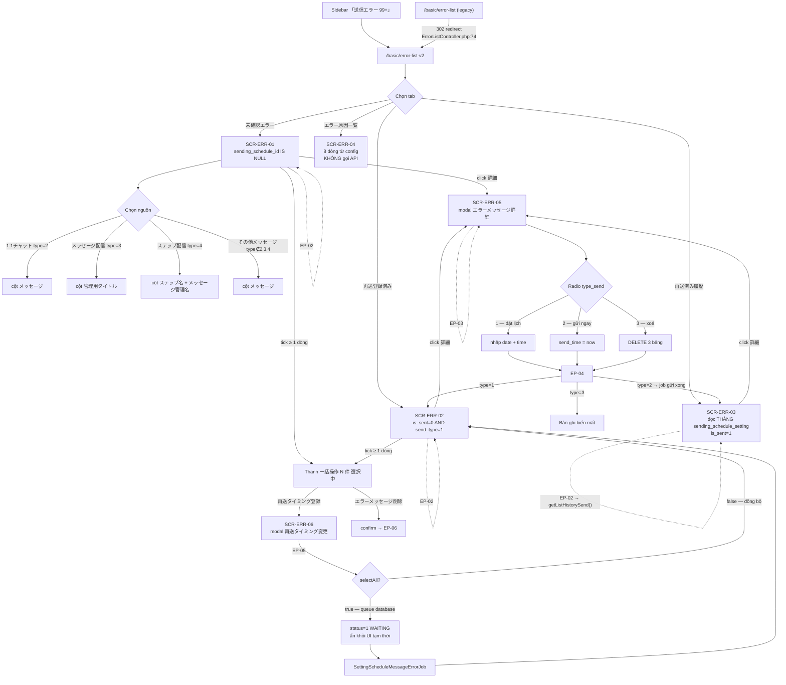
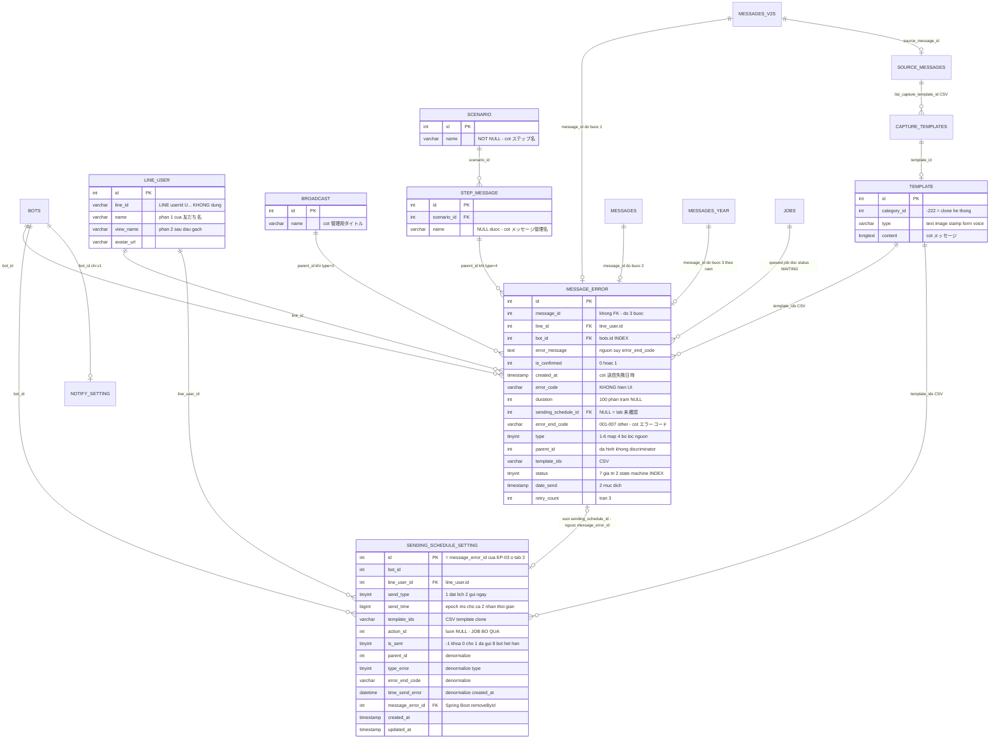
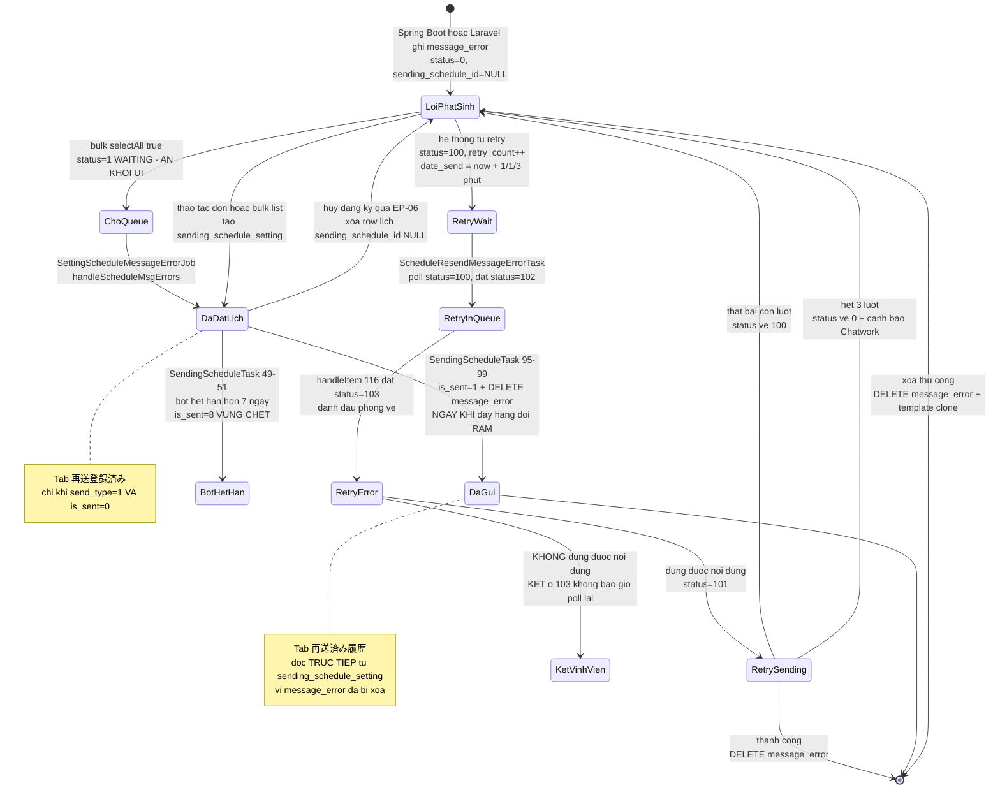
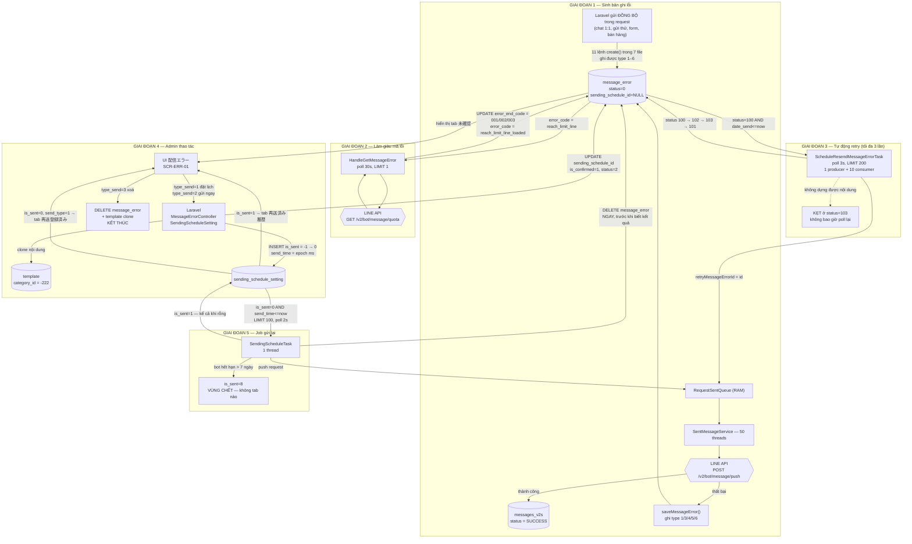

# FA-028 — Lỗi phát hành 「配信エラー」

| Thuộc tính | Giá trị |
|-----------|---------|
| Mã tính năng | **FA-028** |
| Tên tiếng Nhật | 「配信エラー」 |
| Tên tiếng Việt | Lỗi phát hành / Quản lý tin nhắn gửi lỗi |
| Portal | Admin (LINE OA) — dùng chung với Staff |
| Nhóm menu | 「システム管理関連」 (Quản lý hệ thống) — khối sidebar hiển thị nhãn 「システム関連」, mục con 「送信エラー」 |
| URL chính | `/basic/error-list-v2` |
| URL legacy | `/basic/error-list` → redirect ngay sang `/basic/error-list-v2` |
| Màn hình | 6 (`SCR-ERR-01` … `SCR-ERR-06`) |
| Endpoint | 14 (7 v2 đang dùng + 7 legacy) |
| Bảng DB | 2 primary + 13 secondary (chi tiết §3.1) |
| Background job | **Có** — 3 task manager Spring Boot + 1 queued job Laravel + 1 service nền |
| Coverage UI↔DB | **70,0 %** (56/80 UI element) |
| Ngày quét live | 08/09/2026 — `https://form.watermeru.com` |
| Nguồn tổng hợp | `ui/ui-spec.md`, `web/api-spec.md`, `web/logic-spec.md`, `job/job-spec.md`, `db/db-mapping.md`, `_internal/validation-report.md` |

---

## 1. Tổng quan

### 1.1. Tính năng này giải quyết vấn đề gì

Khi hệ thống L Message gửi tin nhắn qua **LINE Messaging API** mà thất bại — vì chạm trần hạn mức gói cước, vì token/channel secret hỏng, vì nội dung không hợp lệ, hay vì sự cố nhất thời phía LINE — bản ghi lỗi được ghi vào bảng `message_error`. Màn hình 「配信エラー」 là **nơi duy nhất** Admin nhìn thấy và xử lý các tin nhắn thất bại đó.

Năm nhóm việc Admin làm được trên màn hình này (độ tin cậy **Cao** cho cả 5):

| # | Việc | Cơ chế |
|---|------|--------|
| 1 | **Theo dõi** danh sách tin gửi lỗi, chia theo 4 trạng thái xử lý (tab) × 4 nguồn phát sinh (bộ lọc dọc) | `MessageErrorController@ajaxGetMessageError` (`MessageErrorController.php:157-343`) |
| 2 | **Đăng ký gửi lại theo lịch** — chọn ngày + giờ cụ thể, cho 1 bản ghi hoặc hàng loạt | Ghi hàng đợi `sending_schedule_setting`, job Spring Boot gửi thật |
| 3 | **Gửi lại ngay lập tức** — 1 bản ghi hoặc hàng loạt | Cùng hàng đợi, `send_time = time() * 1000` nên job nhặt trong ≤ 2 giây |
| 4 | **Xoá bản ghi lỗi** — từng dòng (icon 🗑), qua modal chi tiết, hoặc hàng loạt | `MessageErrorController@ajaxDeleteErrorMessage` (`:713-805`) |
| 5 | **Tra cứu nguyên nhân lỗi** — bảng tra cứu tĩnh 8 dòng (7 mã `001`–`007` + 1 dòng fallback 「上記以外の場合」) kèm hướng dẫn khắc phục | Render từ config `config/sns-line.php:1099-1132`, **không có bảng DB** |

Điểm nhận diện tính năng trên portal: badge 「送信エラー 99+」 ở sidebar trỏ thẳng tới `/basic/error-list-v2` — **Cao** (`raw/features/error-message/main-snapshot.yml:193-199`).

### 1.2. Điều quan trọng nhất cần hiểu trước khi đọc tiếp

> **Laravel không gửi lại tin nhắn.** Khi Admin bấm 「すぐに再送する」, Laravel **chỉ ghi một dòng vào bảng hàng đợi** `sending_schedule_setting`; việc gọi LINE API do tiến trình Spring Boot riêng biệt (`SendingScheduleTask`) thực hiện, muộn nhất 2 giây sau. Đây là khác biệt cốt lõi so với màn hình v1 cũ (`ErrorListController`) vốn gọi LINE API đồng bộ ngay trong HTTP request — **Cao** (`web/logic-spec.md` §1.2; `job/job-spec.md` §1.1).

> **`message_error` có HAI nguồn ghi, không phải một.** (a) Spring Boot `SentMessageHelper.saveMessageError()` (`helper/SentMessageHelper.java:639-689`) cho luồng gửi bất đồng bộ; (b) Laravel — **11 lệnh `MessageError::create()` nằm trong 7 file** cho luồng gửi đồng bộ. **Cả hai phía đều ghi được đủ 6 giá trị `type` (1–6)** — **Cao** (census `grep -rn "MessageError::query()->create(\|MessageError::create(" app/`: `functions.php` ×4, `MessageService.php` ×2, `SalesService.php`, `SalesManagementV2Controller.php`, `HandleBillStripe.php`, `HandleSendActionTrialV2.php`, `Recover.php` ×1 mỗi file). Xem BR-25, BR-26 và rủi ro RR-08.

> **Cột `status` của `message_error` mang HAI state machine chồng lên nhau** trên cùng một cột: Laravel dùng `0/1/2`, Spring Boot dùng `0/100/101/102/103`. Không đè giá trị nhau, nhưng cũng **không dùng chung hằng số** — mỗi phía chỉ biết tập giá trị của mình. Đây là gốc của 2 rủi ro RR-03 và RR-04 — **Cao** (`app/MessageError.php:14-28` vs `sns/line/values/MessageErrorConstants.java:4-7`).

### 1.3. Actors

| Actor | Vai trò | Mức tin cậy |
|-------|---------|-------------|
| **Admin (LINE OA)** | Xem danh sách lỗi, đăng ký gửi lại, gửi lại ngay, xoá bản ghi, tra cứu nguyên nhân | **Cao** — toàn bộ thao tác được quét bằng tài khoản Admin |
| **Staff** | Truy cập cùng giao diện, cùng URL. **Không có Policy/Gate ở tầng action** — nếu có giới hạn thì nằm ở tầng menu/middleware `basic_access` | **Thấp** — chưa quét bằng tài khoản Staff (điểm mở duy nhất, §10) |
| **LINE User (bạn bè)** | Đối tượng nhận tin; xuất hiện gián tiếp qua cột 「友だち名」/「ユーザー名」. **Không có màn hình public nào** thuộc tính năng này | **Cao** |
| **Hệ thống nền** | 3 task manager Spring Boot + 1 queued job Laravel + `SentMessageService`: sinh bản ghi lỗi, tự động retry, gửi lại theo lịch, dò hạn mức LINE để gán mã `001`/`002`/`003` | **Cao** — `job/job-spec.md` §1.3 |

### 1.4. Phạm vi

**Trong phạm vi**: 6 màn hình `SCR-ERR-01`…`SCR-ERR-06`, 14 endpoint, 2 bảng chính, 3 task manager Spring Boot, 1 queued job Laravel, bảng tra cứu mã lỗi trong config.

**Ngoài phạm vi** (chạy nền trên mọi trang Admin, không thuộc FA-028): `GET /ajax/admin/notify-header`, `GET /ajax/admin/favorite-menu`, `POST /ajax/check-init-tutorial`; modal cảnh báo toàn portal 「エルメとLINE公式アカウントの接続が切断されています」; badge sidebar tuy trỏ tới tính năng nhưng do layout chung dựng.

### 1.5. Nghiệp vụ mã lỗi — 4 nhóm ngữ nghĩa

Bảng tra cứu 8 dòng chia nguyên nhân thành 4 nhóm. Phân nhóm này quyết định **gửi lại có ích hay không** — đây là câu hỏi nghiệp vụ quan trọng nhất khi Admin đứng trước danh sách lỗi — **Cao**:

| Nhóm | Mã | Bản chất | Gửi lại có ích? |
|------|-----|---------|-----------------|
| **Vượt hạn mức gói cước** | `001` `002` `003` (gói LINE OA) · `004` (gói L Message) | Chạm trần số tin của tháng | ❌ Chỉ sau khi nâng gói / sang chu kỳ mới |
| **Kết nối / tài khoản** | `005` | LINE OA bị đóng băng, hoặc channel secret không còn dùng được | ❌ Chỉ sau khi khôi phục kết nối |
| **Nội dung không hợp lệ** | `006` | Template không có tin nhắn nào được đăng ký | ❌ Chỉ sau khi bổ sung nội dung — và hệ thống **chặn cứng** không cho gửi lại (BR-04) |
| **Lỗi tạm thời phía LINE** | `007` | Sự cố nhất thời | ✅ **Ca duy nhất** gửi lại có khả năng thành công cao mà không cần can thiệp gì khác — hướng dẫn chờ ~5 phút |
| **Ngoài tập trên** | 「上記以外の場合」 | Mã không thuộc `001`–`007` (gồm `NULL`, `''`, `'other'`) | ❓ Không xác định — hướng dẫn liên hệ hỗ trợ |

Điều này giải thích trực tiếp dòng cảnh báo trong modal chi tiết: 「※ 配信エラーの原因が解消されていない場合、再送しても配信エラーとなります。」 (Nếu nguyên nhân chưa được khắc phục, gửi lại vẫn sẽ lỗi.)

**Nội dung nguyên văn 8 dòng** (nguồn `config/sns-line.php:1099-1132`; 3 mã `001`/`002`/`003` được Blade ghép thêm ghi chú đỏ (※) — **Cao**, `outline.blade.php:50`):

| コード | エラー原因 (nguyên văn) |
|-------|----------------------|
| **001** | LINE公式アカウントのコミュニケーションプラン配信上限200通に達しています。 LINE公式アカウントをライトプラン以上にアップグレードしてください。アップグレード方法はこちら (※) エルメの契約を有料プランにアップグレードしても、配信エラーは解消しません。 |
| **002** | LINE公式アカウントのライトプラン配信上限5,000通に達しています。 LINE公式アカウントをスタンダードプランにアップグレードしてください。アップグレード方法はこちら (※) …解消しません。 |
| **003** | LINE公式アカウントのスタンダードプラン配信上限30,000通に達しています。 30,001通以上の配信は、追加メッセージ数の上限目安設定が必要になります。詳細はこちら (※) …解消しません。 |
| **004** | エルメのフリープラン配信上限1,000通に達しています。 エルメをスタンダードプラン以上にアップグレードしてください。アップグレードはこちら |
| **005** | LINE公式アカウント凍結、もしくは誤操作により現在設定されているchannel secretが利用できなくなりました。 誤操作の場合は、サポートまでご連絡ください。 |
| **006** | テンプレート内にメッセージが登録されていないため送信ができませんでした |
| **007** | LINE公式アカウント側の一時的な不具合で配信に失敗しました。5分程度時間をおいて再度配信操作を行なって下さい。 |
| **「上記以外の場合」** | サポート専用LINE公式アカウントまでお問い合わせください。 お問い合わせ窓口はこちら |

⚠ `004` **không** có ghi chú (※) vì đây là hạn mức của chính L Message — nâng gói L Message *có* tác dụng. `005`/`006`/`007` cũng không có — **Cao**.

---

## 2. Các màn hình + Luồng xử lý end-to-end

### 2.0. Cấu trúc chung

Toàn bộ tính năng nằm trên **một URL duy nhất** `/basic/error-list-v2`. Chuyển tab và đổi nguồn được xử lý bằng JavaScript + AJAX, **không đổi URL** — **Cao** (cả 7 file DOM snapshot đều ghi cùng một `url`).


```
┌──────────────────────────────────────────────────────────────────────────┐
│ 配信エラー                                                                │
├──────────────────────────────────────────────────────────────────────────┤
│ [未確認エラー][再送登録済み][再送済み履歴][エラー原因一覧]  ← div.tab>div.item-tab │
│                              表示件数：[100件▼]  1 〜 38 / 38  [◀][▶]     │
├──────────────┬───────────────────────────────────────────────────────────┤
│ 1:1チャット ㊳ │ [☐] 送信失敗日時 | 友だち名 | メッセージ | エラーコード | 詳細・削除│
│ メッセージ配信⑦│ [☐] このページに表示されていない全 38 件を合わせて選択        │
│ ステップ配信 ③ │ [☐] 2026/08/28 19:34 | Bích Hảo／haodtb | abc | … | [詳細][🗑]│
│ その他メッセージ│                                                            │
│         99+  │                     1 〜 38件 表示中   [◀][1][▶]           │
│  ↑ div.item-menu — cột dọc BÊN TRÁI bảng, không phải thanh ngang           │
├──────────────┴───────────────────────────────────────────────────────────┤
│ 一括操作 0 件 選択中   [再送タイミング登録]  [エラーメッセージ削除]           │
└──────────────────────────────────────────────────────────────────────────┘
```

**Selector quan sát được** — **Cao**:

| Thành phần | Selector |
|-----------|----------|
| Tab chính / tab đang chọn | `div.tab > div.item-tab` / thêm class `active-tab` |
| Bộ lọc nguồn / nguồn đang chọn | `div.item-menu` / thêm class `active-menu` |
| Checkbox dòng | `tbody label.c-checkbox > input[type=checkbox]`, `value` = PK bản ghi |
| Nút chi tiết / xoá dòng | `button.btn-detail` 「詳細」 / `button.btn-trash` (chỉ icon) |
| Nút hàng loạt | `button.btn-change-time-send` 「再送タイミング登録」 / `button.btn-delete-time-send` 「エラーメッセージ削除」 |
| Modal chi tiết / modal hàng loạt | `#modalPreviewBroadcast` / `#modalSettingScheduleAll` |

**4 bộ lọc nguồn** (chỉ hiện ở 3 tab đầu; tab 「エラー原因一覧」 không có) — **Cao**:

| Nguồn | Tham số `error_type` | `message_error.type` | Badge quan sát |
|-------|---------------------|---------------------|----------------|
| 「1:1チャット」 | `chat11` | `2` | 38 |
| 「メッセージ配信」 | `send_all` | `3` | 7 |
| 「ステップ配信」 | `step` | `4` | 3 |
| 「その他メッセージ」 | `other` | `NOT IN (2,3,4)` → `{1, 5, 6}` | `99+` (thực 149) |

Badge hiện `99+` khi số lượng **≥ 100** (`index.blade.php:84, :93, :103, :113` → `total < 100 ? total : '99+'`); số thực nằm ở dòng 「このページに表示されていない全 N 件を合わせて選択」 — **Cao**.

**Phân trang**: select 「表示件数：」 3 mức `100件`/`200件`/`500件` (mặc định `100`), chỉ báo 2 tầng 「1 〜 N / M」 (trên) và 「1 〜 N件 表示中」 (dưới) — **Cao**.

**Thanh thao tác hàng loạt**: nhãn 「一括操作 N 件 選択中」 + 2 nút, cả 2 `disabled` khi `N = 0`. Thanh này **vắng mặt hoàn toàn** ở tab 「再送済み履歴」 và 「エラー原因一覧」 — **Cao**.

---

### 2.1. ⭐ Ma trận 13 tổ hợp (tab × nguồn) — đặc điểm nổi bật nhất của tính năng

Đây là điều khác biệt nhất của FA-028 so với mọi màn hình danh sách khác trong hệ thống: **tập cột của bảng thay đổi theo cả tab lẫn nguồn**, không chỉ theo tab. Quy tắc áp dụng cho **cả 3 tab dữ liệu** — **Cao** (xác minh trên source Blade: `table-unconfirm.blade.php:23, :27, :31`; `table-registered.blade.php:23, :27, :31` + body `:105, :111`; `table-sent.blade.php:14, :18, :22` + body `:72, :78`).

| # | Tab | Nguồn | Cột 1 | Cột 2 | Cột 3 | Cột 4 | Cột 5 | Cột 6 | Cột 7 |
|---|-----|-------|-------|-------|-------|-------|-------|-------|-------|
| 1 | 未確認エラー | 1:1チャット | ☐ | 送信失敗日時 | 友だち名 | メッセージ | エラーコード | 詳細・削除 | — |
| 2 | 未確認エラー | メッセージ配信 | ☐ | 送信失敗日時 | 友だち名 | **管理用タイトル** | エラーコード | 詳細・削除 | — |
| 3 | 未確認エラー | ステップ配信 | ☐ | 送信失敗日時 | 友だち名 | **ステップ名** | **メッセージ管理名** | エラーコード | 詳細・削除 |
| 4 | 未確認エラー | その他メッセージ | ☐ | 送信失敗日時 | 友だち名 | メッセージ | エラーコード | 詳細・削除 | — |
| 5 | 再送登録済み | 1:1チャット | ☐ | **再送予定日時** | 友だち名 | メッセージ | エラーコード | 詳細・削除 | — |
| 6 | 再送登録済み | メッセージ配信 | ☐ | **再送予定日時** | 友だち名 | **管理用タイトル** | エラーコード | 詳細・削除 | — |
| 7 | 再送登録済み | ステップ配信 | ☐ | **再送予定日時** | 友だち名 | **ステップ名** | **メッセージ管理名** | エラーコード | 詳細・削除 |
| 8 | 再送登録済み | その他メッセージ | ☐ | **再送予定日時** | 友だち名 | メッセージ | エラーコード | 詳細・削除 | — |
| 9 | 再送済み履歴 | 1:1チャット | **再送日時** | **ユーザー名** | メッセージ | 詳細 | — | — | — |
| 10 | 再送済み履歴 | メッセージ配信 | **再送日時** | **ユーザー名** | **管理用タイトル** | 詳細 | — | — | — |
| 11 | 再送済み履歴 | ステップ配信 | **再送日時** | **ユーザー名** | **ステップ名** | **メッセージ管理名** | 詳細 | — | — |
| 12 | 再送済み履歴 | その他メッセージ | **再送日時** | **ユーザー名** | メッセージ | 詳細 | — | — | — |
| 13 | エラー原因一覧 | *(không có bộ lọc nguồn)* | エラーコード | エラー原因 | — | — | — | — | — |

**Bốn quy luật rút ra từ ma trận** — **Cao**:

1. **Cột nội dung đổi tên theo nguồn**: 「メッセージ」 (chat11/other) → 「管理用タイトル」 (broadcast) → cặp 「ステップ名」+「メッセージ管理名」 (step). Nguồn step delivery **luôn có thêm 1 cột** so với 3 nguồn còn lại của cùng tab.
2. **Cột thời gian đổi ngữ nghĩa theo tab**: 「送信失敗日時」 = `message_error.created_at` (lúc gửi lỗi) → 「再送予定日時」 và 「再送日時」 **dùng chung một cột** `sending_schedule_setting.send_time`, chỉ khác ngữ cảnh `is_sent` (`0` = dự kiến, `1` = đã gửi).
3. **Tên cột người nhận đổi** 「友だち名」 → 「ユーザー名」 ở tab 3. Lý do không phải thẩm mỹ: 2 tab đầu join `line_user` qua `message_error.line_id`, tab 3 join qua `sending_schedule_setting.line_user_id`.
4. **Tab 3 là read-only**: mất checkbox, mất cột 「エラーコード」, mất nút 🗑 — chỉ còn 「詳細」 (`table-sent.blade.php:24, :87`). Cột 「エラーコード」 không render **dù** `sending_schedule_setting.error_end_code` có dữ liệu.

> **Phạm vi quan sát live**: phiên quét 08/09/2026 chỉ trực tiếp thấy dòng **1–4** và dòng **9**. Dòng 5–8 không quan sát được vì tab 「再送登録済み」 rỗng (100 % bản ghi lịch trong dump đã `is_sent = 1`); dòng 10–12 vì tab 3 chỉ có 2 bản ghi. Các dòng này được xác minh bằng **đọc source Blade** — tin cậy vẫn **Cao**.

⚠ **Nhãn UI và tên biến bị ĐẢO ở cặp cột step delivery** — **Cao** (`MessageErrorController.php:320-326` đối chiếu `table-unconfirm.blade.php:27/:31` header và `:119/:124` body):

| Nhãn UI | Biến trong response | Cột DB thật | Đường join |
|---------|--------------------|-------------|-----------|
| 「ステップ名」 | **`scen_name`** | `scenario.name` (`varchar(200) NOT NULL`) | 2 chặng: `parent_id → step_message.id → step_message.scenario_id → scenario.id` |
| 「メッセージ管理名」 | **`step_name`** | `step_message.name` (`varchar(255) NULL`) | 1 chặng qua cùng cột `parent_id` |

Đây là bẫy thực tế cho dev khi tái hiện: đọc tên biến `step_name` sẽ tưởng là tên step, nhưng UI lại dán nó dưới nhãn 「メッセージ管理名」.

---

### 2.2. SCR-ERR-01 — Tab 「未確認エラー」 (Lỗi chưa xác nhận)


Tab mặc định khi mở trang. Liệt kê các bản ghi lỗi **chưa được xử lý** — chưa đăng ký gửi lại, chưa bị xoá.

**Điều kiện lọc phía server** (`MessageErrorController.php:168-217`) — **Cao**:

```sql
WHERE bot_id = <session bot>
  AND status != 1                                     -- ẩn bản ghi đang chờ queued job
  AND error_message NOT IN (' Failed to send messages',
                            'Failed to send messages')  -- lọc lỗi rác
  AND sending_schedule_id IS NULL                     -- ← điều kiện định nghĩa tab
  AND <lọc type theo nguồn>
ORDER BY id DESC
```

**Ba nguồn còn lại**:


**Dữ liệu mẫu quan sát được** (nguồn 「メッセージ配信」, 7 bản ghi):

| 送信失敗日時 | 友だち名 | 管理用タイトル | エラーコード | 詳細・削除 |
|-------------|---------|---------------|-------------|-----------|
| 2026/08/28 19:41 | Hảo1 test／h | bdcast1 | 005 | 詳細 / 🗑 |
| 2026/08/26 17:05 | Bích Hảo／haodtb | bdc1 | 005 | 詳細 / 🗑 |

Nguồn 「ステップ配信」 (3 bản ghi) có cột 「メッセージ管理名」 **rỗng ở cả 3 dòng** — nguyên nhân đã xác định: `step_message.name` là `varchar(255) DEFAULT NULL`, Admin không bắt buộc đặt tên quản lý cho từng step; ngược lại `scenario.name` là `NOT NULL` nên 「ステップ名」 luôn có giá trị — **Cao** (`db/db-mapping.md` §3.4).

Nguồn 「1:1チャット」 (38 bản ghi) hiển thị 「エルメサポートまで」 ở toàn bộ cột 「エラーコード」 — vì mã lỗi của chúng nằm **ngoài** tập `001`–`007`. Trong dump, **125/194 = 64,4 %** bản ghi `type = 2` rơi vào fallback này, cao hơn hẳn mọi nguồn khác (`type = 3`: 15,2 %; `type = 4`: 0,7 %) — lý do gốc: lỗi chat 1:1 chủ yếu là **lỗi validate payload LINE API** (`messages[0].text May not be empty`, `template/actions/0/uri invalid uri`, ` supported chat type: USER`), không khớp bất kỳ mẫu tiếng Nhật nào trong 7 mẫu của `getEndCode()` — **Cao** (`db/db-mapping.md` §5.8).

#### Luồng end-to-end — nạp danh sách

| Bước | Chi tiết |
|------|---------|
| **User action** | Mở `/basic/error-list-v2`, hoặc click tab / click nguồn / đổi 「表示件数：」 / chuyển trang |
| **UI** | `div.item-tab` nhận `active-tab`, `div.item-menu` nhận `active-menu`; bảng chuyển sang trạng thái đang tải |
| **API** | **EP-01** `GET /basic/error-list-v2` (render khung, 1 lần) → **EP-02** `POST /ajax/get-message-error` (nạp dữ liệu, mọi lần) |
| **Business logic** | `MessageErrorController@index` (`:52-60`) → `@ajaxGetMessageError` (`:157-343`). Query gốc → lọc nguồn (`:172-179`) → lọc tab (`:181-217`) → đếm `totalNotRetry` (`:219-220`) → `paginate` + `orderByDesc('id')` (`:221`) → **4 query COUNT riêng** cho badge (`:223-234`) → vòng lặp làm giàu từng bản ghi (`:238-338`) |
| **DB tables** | Đọc: `message_error` (chính), `line_user` (eager load `lineUser`), `messages_v2s` → `messages` → `messages_{năm}` **hoặc** `template` (nội dung), `broadcast` (type 3), `step_message` + `scenario` (type 4) |
| **Job** | Không — thuần đọc |
| **Response** | `{ success, messages[], totalChat11UnConfirm, totalSendAllUnConfirm, totalScenarioUnConfirm, totalOtherUnConfirm, totalNotRetry, pagination{} }` |
| **UI update** | Bảng render lại theo ma trận cột §2.1; 4 badge cập nhật (`99+` khi ≥ 100); chỉ báo phân trang 2 tầng cập nhật |

⚠ **Hiệu năng**: mỗi lần mở tab 1 chạy **4 query COUNT riêng biệt không cache** (BR-18), cộng với vòng lặp `foreach` dò nội dung **không eager load** — mỗi bản ghi có thể phát sinh tới 3 query **trên 2 database connection khác nhau** (`mysql_message` và `mysql_db_ovh`) — **Cao** (`web/logic-spec.md` §3.3).

#### Action buttons

| Nhãn JP | Vị trí | Hành vi | Điều kiện disabled |
|---------|--------|---------|-------------------|
| 「詳細」 | Cột cuối mỗi dòng | Mở `#modalPreviewBroadcast` (SCR-ERR-05) qua **EP-03** | Không bao giờ |
| 🗑 *(icon)* | Cột cuối mỗi dòng | Xoá bản ghi lỗi của dòng đó qua **EP-06** | Client `isStatusRetry()` disable khi `status ∈ {100, 101}` — ⚠ **không** bắt `102`/`103` (RR-04) |
| 「再送タイミング登録」 | Thanh hàng loạt | Mở `#modalSettingScheduleAll` (SCR-ERR-06) | `disabled` khi chưa chọn dòng nào |
| 「エラーメッセージ削除」 | Thanh hàng loạt | `confirm('N件の再送登録済みメッセージを削除しますがよろしいですか？')` (`index_v2.js:276-284`) → **EP-06** | `disabled` khi chưa chọn dòng nào |

**Nhãn 「リトライ中」**: bản ghi có `status ∈ {100, 101}` hiển thị nhãn này + tooltip 「送信失敗から1,2,5分後にリトライ配信を行います。リトライ中はこのメッセージの削除はできません。」, ẩn checkbox, disable 🗑 — **Cao** (`table-unconfirm.blade.php:73`). ⚠ Số phút trong tooltip **sai so với code** (thực tế +1/+1/+3) — xem RR-11.

**Empty state**: 「未確認の配信エラーはありません」 — **Cao**.

---

### 2.3. SCR-ERR-02 — Tab 「再送登録済み」 (Đã đăng ký gửi lại)


Cấu trúc giống SCR-ERR-01, khác ở cột thời gian. Bộ cột **cũng đổi theo nguồn** (dòng 5–8 của ma trận §2.1).

**Điều kiện lọc**: bộ lọc cơ bản **+** `LEFT JOIN sending_schedule_setting ON message_error.sending_schedule_id = sending_schedule_setting.id` **+** `is_sent = 0` **+** `send_type = 1`. `SELECT` bổ sung 2 cột `send_time`, `is_sent` — **Cao** (`MessageErrorController.php:181-217`).

**Trạng thái quan sát live: rỗng.** Nguyên nhân đã xác định — **Cao** (`db/db-mapping.md` §4.2): trong dump **2.431/2.431** bản ghi `sending_schedule_setting` đều có `is_sent = 1`; trạng thái `is_sent = 0` chỉ tồn tại **vài giây tới vài phút** trước khi `SendingScheduleTask` (poll 2 giây/lần) nhặt và xử lý. Đây là trạng thái tự nhiên của hệ thống, không phải lỗi.

⚠ Thêm một lý do khiến tab này luôn thưa: điều kiện `send_type = 1` khiến bản ghi đăng ký kiểu 「すぐに再送する」 (`send_type = 2`, chiếm **52,6 %** dump) **không bao giờ xuất hiện** ở tab này, kể cả khi chưa gửi xong — **Cao**.

#### Ba điểm khác biệt so với SCR-ERR-01

| Điểm | SCR-ERR-01 | SCR-ERR-02 |
|------|-----------|-----------|
| Ngữ nghĩa nút 🗑 | **Xoá hẳn** bản ghi lỗi | **Huỷ đăng ký gửi lại**: xoá row `sending_schedule_setting`, reset `message_error.sending_schedule_id = NULL` + `is_confirmed = 0`, **giữ nguyên** bản ghi lỗi → bản ghi quay về tab 1 |
| Checkbox | Ẩn khi `status ∈ {100, 101}` | **Luôn hiện** — tab này không kiểm tra `status` retry |
| Dòng 「…全 N 件を合わせて選択」 | Dùng `total_record_all_not_retry` | Dùng `total_record_all` |

Nút 🗑 **có tồn tại** trên tab này — `table-registered.blade.php:125` — **Cao**.

**Modal 「再送タイミング変更」 ở tab này chỉ dời giờ**: khác với tab 1 (tạo lịch mới), thao tác hàng loạt ở tab 2 chỉ `UPDATE sending_schedule_setting SET send_time = ...` qua `updateTimeSend()` (`:1053-1066`) — BR-13, **Cao**.

**Empty state**: 「再送登録済みのメッセージはありません」 — **Cao**.

---

### 2.4. SCR-ERR-03 — Tab 「再送済み履歴」 (Lịch sử đã gửi lại)


Bảng **chỉ đọc**: không checkbox, không thanh thao tác hàng loạt, không nút xoá. Bộ cột **vẫn đổi theo nguồn** (dòng 9–12 ma trận §2.1).

#### ⭐ Tab này đảo hẳn nguồn dữ liệu

`ajaxGetMessageError()` uỷ quyền ngay sang `getListHistorySend()` (`:167`), và hàm này **không đụng tới `message_error`** — **Cao** (`MessageErrorController.php:61-155`):

```sql
SELECT *, type_error AS type
FROM sending_schedule_setting
WHERE bot_id = ? AND is_sent = 1 AND <lọc type_error>
ORDER BY id DESC
```

**Vì sao phải đảo nguồn?** Vì `SendingScheduleTask.java:97-99` **XOÁ VĨNH VIỄN** bản ghi `message_error` ngay sau khi đẩy tin vào hàng đợi gửi. Nếu tab lịch sử đọc từ `message_error` thì sẽ luôn rỗng. Đây là lý do bảng `sending_schedule_setting` phải **denormalize** 4 cột (`type_error`, `error_end_code`, `time_send_error`, `parent_id`) — sao chép từ `message_error` để giữ được thông tin sau khi bản gốc bị xoá — **Cao** (BR-06, `db/db-mapping.md` D-16…D-19).

**Dữ liệu mẫu quan sát được**:

| 再送日時 | ユーザー名 | メッセージ | 詳細 |
|---------|-----------|-----------|------|
| 2026/08/26 17:32 | Bích Hảo／haodtb | `https://…/1787728525oE7otl.pdf` | 詳細 |
| 2026/08/28 19:22 | Bích Hảo／haodtb | abc | 詳細 |

**Thứ tự không theo thời gian** (26/08 đứng trước 28/08) — nguyên nhân đã xác định: query có `orderBy('send_time','asc')` tại `:84` nhưng **bị `orderByDesc('id')` tại `:87` ghi đè** ⇒ thực tế sắp theo **thứ tự đăng ký gửi lại** (`id DESC`) — **Cao**.

#### Ba đặc thù cần lưu ý cho tester

1. **Nội dung tin chỉ lấy từ `template`** qua `template_ids` (`:108-110`) — **không** dò các bảng `messages*`. Vì nội dung đã được clone sang `template` (`category_id = -222`) lúc đăng ký gửi lại nên bản gửi lại độc lập hoàn toàn với bảng `messages*`.
2. **Badge 4 nguồn hard-code `0`** (`:149-152`) → badge không hiển thị ở tab này — **Cao**.
3. ⚠ **Tham số `message_error_id` của EP-03 ở tab này mang `sending_schedule_setting.id`**, không phải `message_error.id` (`MessageErrorController.php:393-395`). Cùng một tên tham số, hai ngữ nghĩa khác nhau tuỳ `tab_active` — bẫy dễ nhầm khi viết test API — **Cao**.

**Empty state**: 「再送済み履歴のメッセージはありません」 — **Cao**.

---

### 2.5. SCR-ERR-04 — Tab 「エラー原因一覧」 (Danh sách nguyên nhân lỗi)


Bảng tra cứu **tĩnh**, chỉ đọc, **8 dòng dữ liệu** (khớp `rowCount = 8` trong `tab4-error-causes.json`). Không bộ lọc nguồn, không checkbox, không nút thao tác, không phân trang thực.

| Bước | Chi tiết |
|------|---------|
| **User action** | Click tab 「エラー原因一覧」 |
| **API** | **Không gọi API nào** (`index_v2.js:91-93`) — dữ liệu đã nhúng sẵn từ EP-01 |
| **Business logic** | `MessageErrorController@index` (`:52-60`) đẩy `config('sns-line.table_error_code')` sang view thành object JS `tableErrorCode` |
| **DB tables** | **Không có** — nguồn là `config/sns-line.php:1099-1132` |
| **UI update** | Bảng 2 cột 「エラーコード」/「エラー原因」 render tĩnh; bộ lọc nguồn biến mất |

**Hai nguồn nội dung khác nhau — đừng gộp** — **Cao**:

| Phần | Nguồn | Điều kiện hiện |
|------|-------|----------------|
| Nội dung 「エラー原因」 (mô tả + hướng dẫn + link 「こちら」) | Config `config/sns-line.php:1099-1132` — mảng `table_error_code`, đúng 8 phần tử | Luôn hiển thị |
| Ghi chú đỏ 「(※) エルメの契約を有料プランにアップグレードしても、配信エラーは解消しません。」 | **Hard-code trong Blade**, KHÔNG nằm trong config | `v-show="['001','002','003'].includes(...)"` — chỉ 3 mã (`outline.blade.php:50`) |

**Coverage DB của màn hình này = 0 %** — hoàn toàn từ config. Đây là điều bình thường và có chủ đích, không phải thiếu sót của spec.

---

### 2.6. SCR-ERR-05 — Modal 「エラーメッセージ詳細」


| Thuộc tính | Giá trị |
|-----------|--------|
| ID modal | `#modalPreviewBroadcast` |
| Mở từ | Nút 「詳細」 trên **bất kỳ** dòng nào của SCR-ERR-01 / 02 / 03 |
| API nạp / API ghi | **EP-03** `GET /ajax/get-detail-error-message` / **EP-04** `POST /ajax/save-setting-message-error` |

**Layout 2 cột**: trái = nội dung tin nhắn thô (preview bong bóng); phải = bảng thông tin + khối chọn hành động + nút thực thi.

**Bảng thông tin đổi theo tab mở modal** — **Cao**:

| Nhãn | Nguồn khi mở từ tab 1/2 | Nguồn khi mở từ tab 3 |
|------|------------------------|----------------------|
| 「送信失敗日時」 | `message_error.created_at` | `sending_schedule_setting.time_send_error` |
| 「友だち名」 | `line_user` qua `message_error.line_id` | `line_user` qua `sending_schedule_setting.line_user_id` |
| 「エラーコード」 + hướng dẫn khắc phục | `message_error.error_end_code` + `tableErrorCode[…]` từ config | `sending_schedule_setting.error_end_code` + config |
| **「再送日時」** | *(ẩn)* | `sending_schedule_setting.send_time` — `v-show="tab_parent_active == 'history_send'"` |
| Khối chọn hành động | Hiện | **Ẩn hoàn toàn** (`v-show="tab_parent_active != 'history_send'"`) |

**Form chọn hành động** — **Cao**:

| Nhãn JP | Type | `name` | `value` | Mặc định |
|---------|------|--------|---------|---------|
| 「再送するタイミングを登録」 | radio | `type_send` | `1` | ✔ checked |
| 「すぐに再送する」 | radio | `type_send` | `2` | — |
| 「このエラーメッセージを削除する」 | radio | `type_send` | `3` | — |
| *(ngày gửi lại)* | date | `date_start_apply` | — | **Ngày hiện tại** |
| *(giờ gửi lại)* | text | `time_start_apply` | — | **Giờ hiện tại**, `HH:mm` |

Cặp ô ngày + giờ **chỉ hiện khi radio `value=1`**; chọn `2` hoặc `3` → ẩn — **Cao**.

⚠ **Đổi tên tham số khi gửi lên server**: client hiển thị `MM/DD/YYYY` nhưng gửi `date_send` dạng `YYYY-MM-DD` và `time_send` dạng `HH:mm` (`modal-detail-message.js:19-20`) — **Cao**.

#### Luồng end-to-end — 3 nhánh theo radio

| Bước | `type_send = 1` (đặt lịch) | `type_send = 2` (gửi ngay) | `type_send = 3` (xoá) |
|------|--------------------------|---------------------------|----------------------|
| **User action** | Chọn radio 1, nhập ngày + giờ, bấm 「選択したアクションを実行する」 | Chọn radio 2, bấm nút | Chọn radio 3, bấm nút |
| **Kiểm tra client** | Nếu thời điểm ở **quá khứ** → `confirm('再送日時に現在時刻より前の時間が設定されています。 登録を押すと即時配信となりますがよろしいですか？')`; đồng ý → **client tự đổi `type` thành `2`** (`modal-detail-message.js:92-97`) | — | — |
| **API** | **EP-04** `POST /ajax/save-setting-message-error` | Cùng EP-04 | Cùng EP-04 |
| **Business logic** | `saveSettingErrorMessage()` `:833-981`. Chặn nếu `error_code == '006'` (`:849-854`) → clone template nếu chưa có (`:864-873`) → tính lại `error_end_code` (`:875-877`) → `updateOrCreate` lịch (`:880-910`) | Cùng đường, nhánh `:911-941`, `send_type = 2`, `send_time = time() * 1000` | Nhánh `:942-960` |
| **DB ghi** | `sending_schedule_setting` (INSERT: `send_type=1`, `is_sent=0`, `send_time = strtotime("$date $time:00")*1000`, + 7 cột sao chép) · `message_error` (UPDATE `sending_schedule_id`, `is_confirmed=1`, `template_ids`) · `template` (INSERT clone `category_id = -222`) | Như trên, `send_type=2` | **DELETE** `template` clone → **DELETE** row lịch → **DELETE** `message_error` (nhánh này **CÓ** lọc `bot_id`) |
| **Job** | `SendingScheduleTask` nhặt khi `send_time <= now` | `SendingScheduleTask` nhặt trong **≤ 2 giây** | Không có job nào tham gia |
| **Response** | `{ "status": true }` (HTTP 200 kể cả khi thất bại) | Như trên | Như trên |
| **UI update** | Bản ghi chuyển sang tab 「再送登録済み」 với 「再送予定日時」 = giá trị vừa nhập | Gửi xong → xuất hiện ở tab 「再送済み履歴」 | Bản ghi biến mất khỏi mọi tab |

**Lỗi có thể xảy ra** (đều trả HTTP **200**, trạng thái nằm trong body) — **Cao**:

| Body | Nguyên nhân |
|------|-------------|
| `{"status": false, "error_message": "テンプレート内にメッセージが登録されていないため送信ができませんでした"}` | `error_code == '006'` — BR-04 chặn gửi lại (`:849-854`) |
| `{"status": false, "error_message": "<exception>"}` | Exception bất kỳ (`:973-979`) |

⚠ **Không có `DB::beginTransaction()`** — cả 3 lệnh transaction đều bị comment (`:879`, `:962`, `:975`). Hệ quả thực tế đã quan sát được trong dump: 1 bản ghi `sending_schedule_setting` có `template_ids = ''` (clone template thất bại nhưng lịch vẫn được tạo) — **Cao** / **Trung bình** (quan sát 1 mẫu).

---

### 2.7. SCR-ERR-06 — Modal 「再送タイミング変更」 (hàng loạt)


| Thuộc tính | Giá trị |
|-----------|--------|
| ID modal | `#modalSettingScheduleAll` (`modal-setting-schedule-all.blade.php:36`) |
| Mở từ | Nút 「再送タイミング登録」 ở thanh thao tác hàng loạt (SCR-ERR-01, SCR-ERR-02) |
| API | **EP-05** `POST /ajax/save-setting-message-error-all` |

**Ba khác biệt so với SCR-ERR-05** — **Cao**: chỉ **2** radio (không có 「削除する」 — xoá hàng loạt đi qua nút riêng 「エラーメッセージ削除」 → EP-06); nhãn radio đầu là 「…を**変更**」 thay vì 「…を**登録**」; không có cột trái preview nội dung. Hiển thị 「選択中の件数 N 件」 ở đầu modal, nút thực thi 「変更する」.

#### ⭐ Cơ chế "2 tốc độ" — điểm kiến trúc đáng chú ý nhất của luồng hàng loạt

`saveSettingErrorMessageAll()` (`:983-1051`) rẽ **3 nhánh** hoàn toàn khác nhau — **Cao**:

| Điều kiện | Hành vi | Đồng bộ? |
|-----------|---------|---------|
| `selectAll='true'` **và** `errorTab='registered_send'` | Lấy toàn bộ id khớp lọc → `updateTimeSend()` — **chỉ đổi giờ gửi**, không tạo lịch mới (`:1013-1017`) | Đồng bộ |
| `selectAll='true'` (các tab còn lại) | `UPDATE message_error SET status = 1 (WAITING), date_send = "$date $time:00"` cho **toàn bộ** bản ghi khớp lọc → `dispatch(new SettingScheduleMessageErrorJob(...))->onConnection('database')` (`:1026-1030`) | **Bất đồng bộ — queue `database`** |
| `selectAll != 'true'` | `SendingScheduleSetting::handleScheduleMsgErrors()` chạy thẳng trên danh sách id; riêng tab `registered_send` gọi `updateTimeSend()` (`:1031-1035`) | Đồng bộ |

**Vì sao Admin thấy bản ghi "biến mất" sau khi chọn tất cả**: nhánh 2 đặt `status = 1` (WAITING), mà `ajaxGetMessageError()` lại **loại bỏ** `status = 1` khỏi danh sách (`:169`). Bản ghi tạm ẩn khỏi UI cho tới khi queued job xử lý xong và `pushSchedule()` đổi `status` sang `2` (DONE). Đây là hành vi **có chủ đích**, không phải bug — nhưng cần giải thích cho người dùng nếu họ hoảng — **Cao** (BR-02, BR-14).

#### Luồng end-to-end — thao tác hàng loạt

| Bước | Chi tiết |
|------|---------|
| **User action** | Tick checkbox từng dòng / tick checkbox `thead` (chọn cả trang) / tick 「このページに表示されていない全 N 件を合わせて選択」 (chọn vượt trang → `selectAll = true`) |
| **UI** | Thanh dưới cập nhật 「一括操作 N 件 選択中」; 2 nút chuyển từ `disabled` → enabled |
| **User action** | Bấm 「再送タイミング登録」 → modal mở, hiển thị 「選択中の件数 N 件」 → chọn radio → (nếu radio 1) nhập ngày + giờ → bấm 「変更する」 |
| **Kiểm tra client** | Cùng confirm "thời điểm quá khứ" như SCR-ERR-05 (`index_v2.js:354-360`) |
| **API** | **EP-05**, body: `message_error_ids[]`, `type`, `date_send`, `time_send`, `selectAll`, `errorTab`, `errorType` |
| **Business logic** | `saveSettingErrorMessageAll()` `:983-1051` — 3 nhánh ở bảng trên |
| **DB ghi** | Nhánh đồng bộ: `sending_schedule_setting` (`is_sent = -1` → `0`), `message_error`, `template` · Nhánh queue: `message_error.status/date_send` + bảng `jobs` |
| **Job** | Nhánh queue: **Laravel queue worker** → `SettingScheduleMessageErrorJob` → sau đó `SendingScheduleTask` |
| **Response** | `{ "status": true }`; lỗi → `{ "status": false }` **không kèm chi tiết** (`:1043-1048`) |
| **UI update** | Bảng nạp lại; cache `lastErrorMessage{botId}` được ghi lại TTL 5 phút (`:1038-1040`) để badge sidebar cập nhật |

**Xoá hàng loạt** đi đường riêng: nút 「エラーメッセージ削除」 → confirm client (`index_v2.js:276-284`) → **EP-06** `POST /ajax/delete-message-error` với body `selected[]`, `errorTab`, `errorType`, `selectAll`. Ngữ nghĩa xoá **đổi theo tab** — xem BR-12.

---

### 2.8. Sơ đồ luồng tổng thể



---

## 3. Data Model

### 3.1. Danh sách bảng

**2 primary tables** — **Cao**:

| # | Bảng | Connection | Model | Vai trò | Bản ghi trong dump | Data size |
|---|------|-----------|-------|---------|-------------------|-----------|
| 1 | **`message_error`** | `mysql` | `App\MessageError` | Bảng lỗi phát hành — nguồn của tab 1 và tab 2 | **8.067** | 3,0 MB |
| 2 | **`sending_schedule_setting`** | `mysql` | `App\SendingScheduleSetting` | Hàng đợi gửi lại — nguồn **duy nhất** của tab 3, đồng thời là **cầu nối Laravel ↔ Spring Boot** | **2.431** | 473 KB |

**13 secondary tables** được luồng v2 truy cập trực tiếp:

| Nhóm | Bảng | Dùng cho |
|------|------|---------|
| Join hiển thị (7) | `line_user` | 「友だち名」/「ユーザー名」 |
| | `broadcast` | 「管理用タイトル」 (khi `type = 3`) |
| | `step_message` | 「メッセージ管理名」 (khi `type = 4`) |
| | `scenario` | 「ステップ名」 (join 2 chặng qua `step_message`) |
| | `template` | Nội dung tin nhắn + bản clone `category_id = -222` |
| | `capture_templates` | Tin nhắn dạng capture (phần tử `cap_{id}`) |
| | `source_messages` | Tin nhắn nhiều bong bóng |
| Nội dung tin (3) | `messages_v2s` (bước 1) · `messages` (bước 2) · nhóm `messages_{năm}` (bước 3, 6 bảng) | Dò nội dung theo `message_id` |
| Phụ trợ (3) | `bots` | `last_time_show_message_error`, `free_send_count`, `plan_type` |
| | `notify_setting` | `app_total_msg_error`, `chat_work_total_msg_error` — **chỉ luồng v1** |
| | `jobs` | Queue Laravel driver `database` cho `SettingScheduleMessageErrorJob` |

> Nếu đếm từng bảng `messages_{năm}` riêng thì tổng là **22 bảng**; con số **13 secondary** ở trên gộp nhóm `messages_{năm}` thành 1 mục.

**"Bảng" không tồn tại**: bảng tra cứu 「エラー原因一覧」 (8 dòng) **không phải bảng DB** mà là mảng config `config/sns-line.php:1099-1132` — **Cao**.

### 3.2. Entity chính — `message_error`

| Cột | Kiểu | Ý nghĩa nghiệp vụ | Ghi chú từ dump |
|-----|------|------------------|-----------------|
| `id` | `int unsigned` PK | Cũng là `value` của checkbox mỗi dòng | |
| `message_id` | `int` NULL | ID tin nhắn gốc ở một trong các bảng `messages*` — **số trần, không kèm tên bảng** | 142 `NULL`, 59 `= 0` |
| `line_id` | `int` NULL | FK logic → `line_user.id`. ⚠ **Tên gây nhầm**: không phải LINE userId (`U…`) mà là PK nội bộ | 0 `NULL` |
| `bot_id` | `int` NULL, **INDEX** | FK logic → `bots.id` — nền tảng phân tách dữ liệu theo LINE OA | |
| `error_message` | `text` NULL | Nội dung lỗi, thường là **HTML tiếng Nhật có thẻ `<a>`**; là nguồn duy nhất để suy `error_end_code` | Chứa cả link `/admin/bot_add?id=…` lộ hash bot |
| `is_confirmed` | `int` = `0` | `1` = đã liên kết lịch gửi lại; reset `0` khi huỷ đăng ký | 140 `= 1` (1,7 %) |
| `created_at` | `timestamp` | **Thời điểm gửi lỗi** → cột 「送信失敗日時」; đồng thời là tiêu chí chọn bảng `messages_{năm}` | |
| `error_code` | `varchar(32)` = `'unknow'` | **Mã kỹ thuật nội bộ — KHÔNG hiển thị UI**. Dùng duy nhất ở BR-04 (`== '006'` chặn gửi lại) | 5 giá trị, xem §3.5 |
| `duration` | `int` NULL | Độ dài audio/video — **di sản v1** | **100 % `NULL`** (8.067/8.067) — cột đã chết |
| `sending_schedule_id` | `int unsigned` NULL | FK logic → `sending_schedule_setting.id`. **`NULL` = thuộc tab 「未確認エラー」** | 174 có giá trị |
| `error_end_code` | `varchar(50)` NULL | **Mã HIỂN THỊ trên UI** (`001`…`007`, `other`); rỗng → controller tính lại runtime | 2.951 `NULL` (36,6 %) |
| `type` | `tinyint` = `1` | Nguồn phát sinh → 4 bộ lọc nguồn | Xem §3.4 |
| `parent_id` | `int` NULL | **Đa hình, không có discriminator**: `type=3` → `broadcast.id`; `type=4` → `step_message.id`; type khác → không xác định | 762 bản ghi `type=1` vẫn có `parent_id` nhưng code không đọc |
| `template_ids` | `varchar(256)` NULL | CSV id template; phần tử `cap_{id}` trỏ `capture_templates` | 412 có giá trị; **0 bản ghi** chứa `cap_` ⇒ nhánh BR-11 chưa từng kích hoạt |
| `status` | `tinyint` = `0`, **INDEX** | **7 giá trị, 2 state machine** — xem §3.4 | 8.039 `= 0` (99,7 %) |
| `date_send` | `timestamp` NULL | Thời điểm gửi lại mong muốn — **kênh truyền** giữa controller và queued job; Spring Boot dùng cùng cột cho mốc auto-retry | 187 có giá trị |
| `retry_count` | `int` NULL | Số lần **tự động** retry, trần 3, giãn cách **+1/+1/+3 phút** | 48 `= 3`, 2 `= 1` |

**Indexes**: `PRIMARY(id)`, `message_error_bot_id_index(bot_id)`, `status(status)`.
**Foreign keys**: **không có** — toàn bộ 308 bảng của DB có `0` câu lệnh `FOREIGN KEY`. Mọi quan hệ chỉ là FK logic ở tầng ứng dụng — **Cao**.

### 3.3. Entity chính — `sending_schedule_setting`

| Cột | Kiểu | Ý nghĩa | Dump |
|-----|------|---------|------|
| `id` | `int unsigned` PK | ⚠ Cũng là tham số `message_error_id` của EP-03 **khi ở tab 3** | |
| `bot_id` / `line_user_id` | `int unsigned` | FK logic → `bots.id` / `line_user.id` (sao từ `message_error.line_id`) | |
| `send_type` | `tinyint` | `1` = đặt lịch, `2` = gửi ngay | `2`→1.279 (52,6 %), `1`→1.152 |
| `send_time` | `bigint` | **Epoch millisecond** = `strtotime(...) * 1000`. Nguồn của **cả** 「再送予定日時」 **và** 「再送日時」 | min 12/04/2024, max 01/04/2026, 0 bản ghi `= 0` |
| `template_ids` | `varchar(255)` | CSV template **đã clone** — nội dung gửi lại độc lập với bảng `messages*` | 1 bản ghi `''` (bất thường) |
| `action_id` | `int` NULL | Luôn `NULL` trong FA-028 | 2.427/2.431 `NULL` |
| `is_sent` | `tinyint` | **4 giá trị** — xem §3.4 | **100 % `= 1`** |
| `parent_id`, `type_error`, `error_end_code`, `time_send_error` | | **4 cột denormalize** sao từ `message_error` — để tab 3 vẫn dùng được sau khi job xoá bản gốc | |
| `message_error_id` | `int` NULL | FK **ngược** → `message_error.id` — cột Spring Boot dùng `removeById()` | 70 `NULL` (bản ghi cũ v1) |
| `created_at` / `updated_at` | `timestamp` | Lúc Admin đăng ký / lúc job cập nhật | |

**Indexes**: **chỉ có `PRIMARY(id)`** — không index nào trên `is_sent`, `send_time`, `bot_id`, `message_error_id`. Đây là nguồn của rủi ro hiệu năng RR-13.

#### Quan hệ 1–1 hai chiều dư thừa có chủ đích

| Chiều | Cột | Ai dùng | Mục đích |
|-------|-----|---------|---------|
| **Xuôi** `message_error` → `sending_schedule_setting` | `sending_schedule_id` | **Laravel** | Phân biệt tab (`IS NULL` = tab 1), LEFT JOIN tab 2, khoá chống double-booking trong `pushSchedule()` |
| **Ngược** `sending_schedule_setting` → `message_error` | `message_error_id` | **Spring Boot** | `removeById()` sau khi gửi (`SendingScheduleTask.java:98`) |

Cả hai chiều đều được dùng, ở hai tầng khác nhau. Khi job xoá `message_error`, chiều xuôi bị đứt (con trỏ trỏ vào bản ghi không còn) — không gây lỗi vì tab 3 không dùng chiều đó — **Cao**.

### 3.4. Enum quan trọng

**`message_error.type`** — 6 giá trị, ánh xạ 4 bộ lọc nguồn — **Cao**:

| Giá trị | Hằng số | Nhãn UI | Dump | Ai gán được |
|---------|---------|---------|------|-------------|
| `1` | `TYPE_OTHER` | 「その他メッセージ」 | 3.563 (44,2 %) | Laravel + Spring Boot |
| `2` | `TYPE_CHAT11` | 「1:1チャット」 | 194 (2,4 %) | **Chỉ Laravel** — luồng chat 1:1 gửi đồng bộ, không qua job |
| `3` | `TYPE_SEND_ALL` | 「メッセージ配信」 | 389 (4,8 %) | Cả hai |
| `4` | `TYPE_STEP` | 「ステップ配信」 | **3.656 (45,3 %)** — phổ biến nhất | Cả hai |
| `5` | `TYPE_TEMPLATE` | 「その他メッセージ」 | 185 (2,3 %) | Cả hai |
| `6` | `TYPE_REMIND` | 「その他メッセージ」 | 80 (1,0 %) | Cả hai |

→ Nhóm 「その他メッセージ」 = `1 + 5 + 6` = **3.828 bản ghi (47,5 %)**.

**`message_error.status`** — 7 giá trị, **2 state machine trên cùng một cột** — **Cao**:

| Giá trị | Hằng số | Khai báo | Ý nghĩa | Biểu hiện UI | Dump |
|---------|---------|----------|---------|--------------|------|
| `0` | *(default)* | schema | Bình thường | Hiện trong danh sách | 8.039 (99,7 %) |
| `1` | `STATUS_HANDLED['WAITING']` | **PHP** | Chờ queued job Laravel | **BỊ ẨN khỏi mọi tab** | 0 (thoáng qua) |
| `2` | `STATUS_HANDLED['DONE']` | **PHP** | Job đã tạo lịch xong | Không biểu hiện riêng | 25 (0,3 %) |
| `100` | `STATUS_RETRY_WAIT` | PHP + Java | Chờ tự động retry | Nhãn 「リトライ中」, ẩn checkbox, disable 🗑 | 3 |
| `101` | `STATUS_RETRY_SENDING` | PHP + Java | Đang gửi lại tự động | Như trên | 0 |
| **`102`** | `STATUS_RETRY_INQUEUE` | **CHỈ Java** | Đã nạp vào hàng đợi RAM | ⚠ **Hiện bình thường, CÓ checkbox, KHÔNG có nhãn 「リトライ中」** | 0 |
| **`103`** | `STATUS_RETRY_ERROR` | **CHỈ Java** | Không dựng được nội dung để gửi lại | ⚠ Như trên — và **kẹt vĩnh viễn** | 0 |

**`sending_schedule_setting.is_sent`** — 4 giá trị — **Cao**:

| Giá trị | Hằng số | Ai ghi | Tab UI tương ứng | Job có poll? |
|---------|---------|--------|------------------|-------------|
| `-1` | *(literal)* | **Chỉ Laravel** `handleScheduleMsgErrors()` | **Không tab nào** — khoá tạm chống race | Không |
| `0` | `IS_WAIT_SEND` | `pushSchedule()` hoặc `saveSettingErrorMessage()` | 「再送登録済み」 (kèm `send_type = 1`) | **Có** |
| `1` | `IS_SENT_SUCCESS` | `SendingScheduleTask.java:95-96` | 「再送済み履歴」 | Không |
| **`8`** | `STATUS_EXPIRED_BOT` | **Chỉ Java** `SendingScheduleTask.java:49-51` | ⚠ **KHÔNG TAB NÀO — vùng chết** | Không |

> ⚠ Comment DB chỉ ghi `0: chưa send, 1: đã send` — cả `-1` lẫn `8` **không được tài liệu hoá ở tầng schema**. Đây là nguồn của rủi ro RR-03.

### 3.5. `error_code` vs `error_end_code` — hai cột dễ nhầm nhất

Đây là đính chính quan trọng nhất của cả bộ spec — **Cao** (xác minh `table-unconfirm.blade.php` dòng `v-html="getErrorCode(message.error_end_code)"` + thống kê 8.067 bản ghi thật):

| | `error_code` | `error_end_code` |
|---|-------------|------------------|
| Kiểu | `varchar(32)`, default `'unknow'` | `varchar(50)` NULL |
| Nội dung | Chuỗi tiếng Anh: `reach_limit_line_loaded`, `reach_limit_free`, `unknow`, `unknown`, `auth_failure`, `reach_limit_line` | `001`…`007`, `other`, `NULL` |
| **Hiển thị cột 「エラーコード」?** | **KHÔNG BAO GIỜ** | **Đây mới là cột UI đọc** |
| Dùng để làm gì | Điều kiện chặn gửi lại (`== '006'`, BR-04); điều kiện poll của `HandleGetMessageError` (`== 'reach_limit_line'`) | Tra bảng 8 dòng để hiện hướng dẫn khắc phục |

**Phân bố `error_end_code` trong 8.067 bản ghi**:

| Giá trị | Số bản ghi | Tỉ lệ | Hiển thị UI |
|---------|-----------|-------|-------------|
| `'004'` | 2.239 | 27,8 % | `004` |
| `'002'` | 1.376 | 17,1 % | `002` |
| `'001'` | 692 | 8,6 % | `001` |
| `'005'` | 436 | 5,4 % | `005` |
| `'other'` | 372 | 4,6 % | 「エルメサポートまで」 |
| `NULL` | **2.951** | **36,6 %** | 「エルメサポートまで」 — nhưng controller **tính lại runtime**, nên UI vẫn có thể hiện đúng mã |
| `''` | 1 | 0,01 % | Tính lại runtime |
| `'003'` / `'006'` / `'007'` | **0** | 0 % | Chưa từng xuất hiện — 3/8 dòng bảng tra cứu không có ca thực tế |

⚠ **Giá trị lưu trong DB ≠ giá trị hiển thị** ở 36,6 % bản ghi (`NULL` → tính lại bằng `getEndCode()`). Tester **không được** so trực tiếp DB với UI ở nhóm này — **Cao**.

**Về `error_code`**: giá trị `'reach_limit_line'` có **0 bản ghi trong dump nhưng không phải giá trị chết**. Nó là **trạng thái trung gian** và **chính là điều kiện poll** của `HandleGetMessageError.java:34`; task ghi đè sang `'reach_limit_line_loaded'` trong ≤ 30 giây, nên snapshot dump bắt trúng gần như không thể. Đây cũng là lý do `'reach_limit_line_loaded'` chiếm 46,9 % (3.782 bản ghi) — **tất cả** đều từng đi qua `'reach_limit_line'` — **Cao**.

### 3.6. Cơ chế bảng `messages` phân mảnh theo năm trên 3 database connection

Đây là điểm nghiệp vụ trọng yếu và cũng là nguồn của rủi ro RR-06.

**Vấn đề gốc**: `message_error.message_id` chỉ là một con số — **không kèm thông tin bảng**. Hệ thống lưu tin nhắn ở **10 bảng nằm trên 3 database connection khác nhau**, nên code phải **dò tuần tự**:

| Model | Bảng | Connection | Có trong dump? |
|-------|------|-----------|----------------|
| `App\MessagesV2` | `messages_v2s` | `mysql_message` | Có — 56,2 MB |
| `App\Messages` | `messages` | `mysql_message` | Có — 25,2 MB |
| `App\MessagesPage2` | `messages_page_2` | `mysql_message` | Có — 105 KB, **chỉ v1** |
| `App\MessagesOld` | `messages_old` | `mysql_message` | Có — 261 KB, **chỉ v1** |
| `App\Messages2020` … `Messages2025` | `messages_2020` … `messages_2025` | **`mysql_db_ovh`** | Chỉ `messages_2024` (13,1 MB) có trong dump |

→ **3 kho dữ liệu**: DB chính (`mysql`), DB tin nhắn nóng (`mysql_message`), DB lưu trữ theo năm (`mysql_db_ovh`) — **Cao**.

**Thuật toán dò của v2** (`MessageErrorController.php:239-283`):

```text
NẾU message_error.template_ids RỖNG:
   1. MessagesV2::where('id', message_id)->first()            (messages_v2s)   :240
   2. nếu rỗng → Messages::where('id', message_id)->first()   (messages)       :242
   3. nếu VẪN rỗng → CHỌN BẢNG THEO NĂM:                                       :249-274
        yearData = Carbon::parse(message_error.created_at)->format('Y')
        switch (yearData) {
          case 2020 → Messages2020;  case 2021 → Messages2021;
          case 2022 → Messages2022;  case 2023 → Messages2023;
          case 2024 → Messages2024;  case 2025 → Messages2025;
          default   → modelMessage = null;   ← 2026 trở đi rơi vào đây
        }
NGƯỢC LẠI (đã có template_ids):
   Template::whereIn('id', explode(',', template_ids))->first()                :285
```

**Ba điều cần nhớ** — **Cao**:

1. **Tiêu chí chọn bảng là `message_error.created_at`** — tức **năm phát sinh lỗi**, không phải năm tạo tin nhắn.
2. **`switch` hard-code 2020–2025.** Lỗi từ **2026 trở đi** rơi vào nhánh `default` → không tìm được nội dung → cột 「メッセージ」 trên UI **rỗng**. Trong dump đã có **1.125 bản ghi `created_at` năm 2026 (13,9 %)** rơi vào tình huống này. Đây là **quả bom hẹn giờ đã nổ** (RR-06).
3. **Sau khi đăng ký gửi lại, nội dung được clone sang bảng `template`** (`category_id = -222`) — từ đó bản gửi lại **không còn phụ thuộc** bảng `messages*` nữa. Đây là lý do tab 3 chỉ cần đọc `template`.

⚠ v1 (`ErrorListController`) dùng **bộ bảng khác hẳn**: chỉ dò `messages` → `messages_page_2` → `messages_old` (`:120-126`), **không** đụng tới `messages_v2s` lẫn bảng theo năm — **Cao**.

### 3.7. ER Diagram



### 3.8. Vòng đời một bản ghi lỗi (state machine)



---

## 4. Field Traceability Matrix

Bảng truy vết đầy đủ từ phần tử UI → cột DB. **Hướng**: `R` = chỉ đọc (hiển thị), `W` = chỉ ghi, `R/W` = cả hai, `—` = không chạm DB.

### 4.1. Trường hiển thị và trường ghi

| # | UI Element | Màn hình | DB Table.Column | Hướng | Validation | Business Rule |
|---|-----------|----------|-----------------|-------|-----------|---------------|
| 1 | Checkbox mỗi dòng (`value`) | SCR-ERR-01, 02 | `message_error.id` | R | Client: chỉ gom bản ghi `status ∉ {100, 101}` (`index_v2.js:36-52`) | BR-03 |
| 2 | Checkbox `thead` "chọn cả trang" | SCR-ERR-01, 02 | *(client — computed `select_all`)* | — | Không | — |
| 3 | Checkbox 「このページに表示されていない全 N 件を合わせて選択」 | SCR-ERR-01, 02 | *(cờ `selectAll` gửi lên API — không lưu DB)* | — | Không | BR-14 |
| 4 | Cột 「送信失敗日時」 | SCR-ERR-01 | `message_error.created_at` | R | — | BR-19 (cũng là tiêu chí chọn bảng `messages_{năm}`) |
| 5 | Cột 「送信失敗日時」 (modal mở từ tab 3) | SCR-ERR-05 | `sending_schedule_setting.time_send_error` | R | — | BR-06 |
| 6 | Cột 「再送予定日時」 | SCR-ERR-02 | `sending_schedule_setting.send_time` (epoch ms) | R | Client format `moment(send_time).format('YYYY/MM/DD HH:mm')` | BR-08 |
| 7 | Cột 「再送日時」 | SCR-ERR-03, SCR-ERR-05 | `sending_schedule_setting.send_time` — **cùng cột với #6** | R | Chỉ hiện khi `tab_parent_active == 'history_send'` | BR-08 |
| 8 | Cột 「友だち名」 | SCR-ERR-01, 02, 05 | `line_user.name` + `'／'` + `line_user.view_name` | R | Bỏ phần sau `／` khi `view_name` rỗng | Join qua `message_error.line_id` |
| 9 | Cột 「ユーザー名」 | SCR-ERR-03 | `line_user.name` + `'／'` + `line_user.view_name` | R | Như trên | Join qua `sending_schedule_setting.line_user_id` — lý do nhãn đổi |
| 10 | Cột 「メッセージ」 — text | SCR-ERR-01, 02 | `messages_v2s.content` → `messages.content` → `messages_{năm}.content` | R | Chỉ render khi `type_message = 'text'` | BR-19 |
| 11 | Cột 「メッセージ」 — có template | SCR-ERR-01, 02, 03 | `template.content` (qua CSV `template_ids`) | R | — | BR-09, BR-11 |
| 12 | Cột 「メッセージ」 — capture | SCR-ERR-01, 02 | `capture_templates` → `template.content` (qua `source_messages.list_capture_template_id`) | R | — | BR-11 — **0 mẫu trong dump** |
| 13 | Cột 「メッセージ」 — media (nhãn 画像/スタンプ/パネル・ボタン/位置情報/紹介/動画/音声) | SCR-ERR-01, 02, 03 | `messages_v2s.type` (accessor `convert_type_message`) hoặc `template.type` | R | Ánh xạ enum: `stamp`→`sticker`, `form`→`buttons`, `voice`→`audio` | — |
| 14 | Cột 「メッセージ」 — URL file | SCR-ERR-01, 02, 03 | `content` (JSON) → khoá `filePath` | R | `checkIsJson()` (`MessageErrorController.php:378-382`) | — |
| 15 | Cột 「管理用タイトル」 | SCR-ERR-01, 02 (nguồn `send_all`) | `broadcast.name` qua `message_error.parent_id` | R | Chỉ khi `type = 3` **và** `parent_id != NULL` | — · dump: 381/389 có `parent_id` (97,9 %) ⇒ 8 dòng sẽ rỗng |
| 16 | Cột 「管理用タイトル」 | SCR-ERR-03 | `broadcast.name` qua `sending_schedule_setting.parent_id` | R | Chỉ khi `type_error = 3` | BR-06 |
| 17 | Cột 「ステップ名」 ⚠ biến `scen_name` | SCR-ERR-01, 02, 03 (nguồn `step`) | `scenario.name` (`varchar(200) NOT NULL`) — join 2 chặng `parent_id → step_message.id → scenario_id → scenario.id` | R | Luôn có giá trị vì `NOT NULL` | — · dump: 3.656/3.656 `type=4` đều có `parent_id` (100 %) |
| 18 | Cột 「メッセージ管理名」 ⚠ biến `step_name` | SCR-ERR-01, 02, 03 (nguồn `step`) | `step_message.name` (`varchar(255) NULL`) qua `parent_id` | R | **Có thể rỗng** — Admin không bắt buộc đặt tên | — |
| 19 | Cột 「エラーコード」 | SCR-ERR-01, 02, 05 | **`message_error.error_end_code`** (KHÔNG phải `error_code`) | R | `001`–`007` → hiện nguyên mã; giá trị khác (`other`/`NULL`/`''`) → link 「エルメサポート」+「まで」 | BR-16 · 36,6 % bản ghi `NULL` được tính lại runtime |
| 20 | Cột 「エラーコード」 (modal mở từ tab 3) | SCR-ERR-05 | `sending_schedule_setting.error_end_code` | R | — | BR-06 · ⚠ bảng danh sách tab 3 **không** render cột này |
| 21 | Mô tả hướng dẫn khắc phục dưới mã lỗi | SCR-ERR-04, SCR-ERR-05 | **KHÔNG CÓ DB** — `config('sns-line.table_error_code')[*]['error_message']` | — | — | BR-17 |
| 22 | Ghi chú đỏ 「(※) エルメの契約を…解消しません。」 | SCR-ERR-04, SCR-ERR-05 | **KHÔNG CÓ DB** — hard-code `outline.blade.php:50` | — | `v-show="['001','002','003'].includes(...)"` | BR-17 |
| 23 | Nhãn 「リトライ中」 + tooltip | SCR-ERR-01 | `message_error.status` | R | Hiện khi `status ∈ {100, 101}` — ⚠ **không** bắt `102`/`103` | BR-03 · RR-04, RR-11 |
| 24 | Nút 「詳細」 → tham số `message_error_id` | SCR-ERR-01, 02 | `message_error.id` | R | — | — |
| 25 | Nút 「詳細」 → tham số `message_error_id` | SCR-ERR-03 | ⚠ **`sending_schedule_setting.id`** — cùng tên tham số, khác ngữ nghĩa | R | Server phân biệt bằng `tab_active` (`:393-395`) | BR-06 |
| 26 | Nút 🗑 (tab 1) | SCR-ERR-01 | `message_error` — **DELETE** | W | Client disable khi `status ∈ {100, 101}` | BR-03, BR-12 |
| 27 | Nút 🗑 (tab 2) | SCR-ERR-02 | `sending_schedule_setting` **DELETE** + `message_error.sending_schedule_id = NULL`, `is_confirmed = 0` | W | Không disable | BR-12 |
| 28 | Badge 「1:1チャット」 | SCR-ERR-01 | `COUNT(message_error) WHERE type = 2 AND sending_schedule_id IS NULL AND status != 1` | R | Hiện `99+` khi ≥ 100 | BR-18 |
| 29 | Badge 「メッセージ配信」 | SCR-ERR-01 | `COUNT(...) WHERE type = 3 …` | R | Như trên | BR-18 |
| 30 | Badge 「ステップ配信」 | SCR-ERR-01 | `COUNT(...) WHERE type = 4 …` | R | Như trên | BR-18 |
| 31 | Badge 「その他メッセージ」 | SCR-ERR-01 | `COUNT(...) WHERE type NOT IN (2,3,4) …` | R | Như trên | BR-07, BR-18 |
| 32 | Badge 4 nguồn ở tab 2 / tab 3 | SCR-ERR-02, 03 | **Hard-code `0`** (`:149-152`) → badge ẩn | — | — | BR-18 |
| 33 | Dòng 「…全 N 件を合わせて選択」 (tab 1) | SCR-ERR-01 | `COUNT(...) WHERE status NOT IN (100,101)` (`totalNotRetry`) | R | ⚠ Đếm **sai** vì không trừ `102`/`103` | BR-03 · RR-04 |
| 34 | Dòng 「…全 N 件を合わせて選択」 (tab 2) | SCR-ERR-02 | `COUNT(*)` toàn bộ (`total_record_all`) | R | — | — |
| 35 | Chỉ báo 「1 〜 N / M」 và 「1 〜 N件 表示中」 | Toàn trang | `COUNT(*)` của paginator (`PaginationResource`) | R | — | — |
| 36 | Select 「表示件数：」 | Toàn trang | *(tham số `per_page` — không lưu DB)* | — | Client chỉ 3 lựa chọn `100/200/500`; **server KHÔNG giới hạn** | RR-14 |
| 37 | Nhãn 「一括操作 N 件 選択中」 / 「選択中の件数 N 件」 | SCR-ERR-01, 02, 06 | *(client đếm mảng `selected`)* | — | 2 nút `disabled` khi `N = 0` | — |
| 38 | Radio 「再送するタイミングを登録」/「…を変更」 | SCR-ERR-05, 06 | `sending_schedule_setting.send_type = 1` | W | Bắt buộc chọn 1 trong 3 (SCR-ERR-05) / 1 trong 2 (SCR-ERR-06) | BR-13 |
| 39 | Radio 「すぐに再送する」 | SCR-ERR-05, 06 | `sending_schedule_setting.send_type = 2`, `send_time = time() * 1000` | W | — | BR-08 |
| 40 | Radio 「このエラーメッセージを削除する」 | SCR-ERR-05 | **DELETE** `template` clone + `sending_schedule_setting` + `message_error` | W | Nhánh này **có** lọc `bot_id` (`:942`, `:958`) | BR-10, BR-12 |
| 41 | Input ngày `date_start_apply` | SCR-ERR-05, 06 | `sending_schedule_setting.send_time` (nửa ngày) | W | **Không validate server.** Client: nếu quá khứ → confirm, đồng ý thì **tự đổi `type` thành `2`**. Gửi lên dạng `YYYY-MM-DD` (`modal-detail-message.js:19`) | BR-08 · RR-14 |
| 42 | Input giờ `time_start_apply` | SCR-ERR-05, 06 | `sending_schedule_setting.send_time` (nửa giờ) | W | Như trên; gửi lên dạng `HH:mm` (`:20`) | BR-08 |
| 43 | Preview bong bóng tin nhắn (cột trái modal) | SCR-ERR-05 | `template` / `messages_v2s` / `messages` — `content`, `type`, `image_server`, `thumbnail_path`, `duration` | R | Dựng qua `TemplateV2Service` — **Trung bình** (nhiều nhánh theo loại nội dung) | BR-19 |
| 44 | Tiêu đề cột trái = tên broadcast / scenario + step | SCR-ERR-05 | `broadcast.name` (type 3) hoặc `scenario.name` + `step_message.name` (type 4) | R | — | — |
| 45 | Cảnh báo 「※ 配信エラーの原因が解消されていない場合…」 | SCR-ERR-05 | **KHÔNG CÓ DB** — hard-code `modal-detail-message.blade.php` | — | — | — |
| 46 | Confirm 「N件の再送登録済みメッセージを削除しますが…」 | SCR-ERR-01, 02 | **KHÔNG CÓ DB** — `index_v2.js:276-284` | — | Chặn client trước khi gọi EP-06 | BR-12 |
| 47 | Empty state (3 chuỗi khác nhau theo tab) | SCR-ERR-01, 02, 03 | `COUNT(*) = 0` | R | — | — |
| 48 | Bảng tra cứu 8 dòng 「エラーコード」/「エラー原因」 | SCR-ERR-04 | **KHÔNG CÓ DB** — `config/sns-line.php:1099-1132` | — | Render tĩnh, **không gọi API** | BR-17 |
| 49 | Badge sidebar 「送信エラー 99+」 | *(ngoài màn hình)* | `COUNT` lỗi chưa xác nhận so mốc `bots.last_time_show_message_error` + cache `lastErrorMessage{botId}` TTL 5 phút | R/W | — | BR-20 · EP-07 ghi mốc |

### 4.2. Cột phát sinh khi ghi lịch gửi lại (không có UI element tương ứng)

Khi Admin bấm 「再送するタイミングを登録」 hoặc 「すぐに再送する」, ngoài `send_type` + `send_time` còn **9 cột được ghi tự động** — **Cao** (`MessageErrorController.php:880-941`; `SendingScheduleSetting.php:60-124`):

| Bảng | Cột | Giá trị nguồn |
|------|-----|--------------|
| `sending_schedule_setting` | `bot_id` | ← `message_error.bot_id` |
| | `line_user_id` | ← `message_error.line_id` |
| | `template_ids` | ← CSV template vừa clone (hoặc `message_error.template_ids` cũ nếu đã có) |
| | `parent_id` | ← `message_error.parent_id` (denormalize) |
| | `type_error` | ← `message_error.type` (denormalize) |
| | `error_end_code` | ← `getEndCode(message_error.error_message)` — **tính lại**, không copy trực tiếp |
| | `time_send_error` | ← `message_error.created_at` (denormalize) |
| | `message_error_id` | ← `message_error.id` (FK ngược cho Spring Boot) |
| | `is_sent` | `0` (đường trực tiếp) **hoặc** `-1` → `0` (đường `handleScheduleMsgErrors` — có khoá tạm) |
| `message_error` | `sending_schedule_id` | ← `sending_schedule_setting.id` vừa tạo |
| | `is_confirmed` | `1` |
| | `template_ids` | ← CSV template clone |
| | `status` | `2` (DONE) — **chỉ** ở đường `pushSchedule()` |
| `template` | `category_id` | `-222` (sentinel bản clone hệ thống) |

**Công thức `send_time`**: `strtotime("{date_start_apply} {time_start_apply}:00") * 1000` — epoch **millisecond**, khớp `System.currentTimeMillis()` phía Java — **Cao**.

⚠ **Ý nghĩa `category_id = -222`**: giá trị sentinel đánh dấu "template do hệ thống sinh để phục vụ gửi lại". Template này **không hiển thị trong danh mục template của Admin** và bị xoá cùng khi Admin xoá bản ghi lỗi (`:948-952`; `SendingScheduleSetting.php:113-117`). Dump có **230** bản ghi `template` mang giá trị này — **Trung bình** (đếm bằng khớp chuỗi).

### 4.3. Cột DB không bao giờ lên UI (14 cột đáng lưu ý)

| Cột | Vì sao tồn tại | Ghi chú |
|-----|---------------|---------|
| `message_error.error_code` | Mã kỹ thuật cho tầng backend + điều kiện poll của job | Xem §3.5 |
| `message_error.duration` | Di sản v1 (độ dài audio/video) | **100 % `NULL`** — cột đã chết |
| `message_error.retry_count` | Điều khiển vòng đời auto-retry, trần 3 | Chỉ Spring Boot đọc/ghi |
| `message_error.date_send` | **Kênh truyền** giữa controller và queued job; đồng thời là mốc auto-retry của Spring Boot | ⚠ **1 cột, 2 mục đích** — RR-09 |
| `message_error.is_confirmed` | Nguồn cho badge sidebar + `notify_setting` (v1) | 13 bản ghi `= 1` nhưng `sending_schedule_id IS NULL` (dữ liệu mồ côi) |
| `message_error.error_message` | Đầu vào cho `getEndCode()` | ⚠ EP-02 **có** trả nguyên văn trong JSON, chứa link `/admin/bot_add?id=…` lộ hash bot — RR-16 |
| `message_error.status` (`1`, `2`, `102`, `103`) | Điều phối 2 state machine | `1` khiến bản ghi **biến mất khỏi UI**; `102`/`103` là **điểm mù** — RR-04 |
| `sending_schedule_setting.action_id` | Dành cho luồng lịch khác | ⚠ Entity JPA **không map** → job bỏ qua hoàn toàn — RR-10 |
| `sending_schedule_setting.time_send_error` | Denormalize `message_error.created_at` | Để tab 3 vẫn biết thời điểm lỗi ban đầu sau khi job xoá bản gốc |
| `sending_schedule_setting.error_end_code` | Denormalize | **Có dữ liệu nhưng bảng danh sách tab 3 không render** |
| `sending_schedule_setting.type_error` | Denormalize `message_error.type` | Cho bộ lọc nguồn hoạt động ở tab 3 mà không cần join · 50/2.431 `NULL` → rơi vào nhóm 「その他」 |
| `sending_schedule_setting.parent_id` | Denormalize | Để lấy `broadcast.name`/`step_message.name` sau khi bản ghi lỗi bị xoá |
| `sending_schedule_setting.message_error_id` | FK ngược cho `removeById()` | Cột duy nhất Spring Boot dùng để xoá |
| `sending_schedule_setting.is_sent = -1` / `= 8` | Khoá tạm / bot hết hạn | **Không tab nào lọc** — RR-03 |

---

## 5. Business Rules

### 5.1. Quy tắc từ tầng web (BR-01 … BR-26)

Toàn bộ 26 quy tắc đều có trích dẫn `file:dòng`; mức tin cậy **Cao** trừ khi ghi khác.

| # | Quy tắc | Nguồn |
|---|---------|-------|
| **BR-01** | Bản ghi có `error_message` bằng `'Failed to send messages'` hoặc `' Failed to send messages'` (có khoảng trắng đầu) **bị ẩn khỏi mọi danh sách** — đây là lỗi rác không có nội dung tiếng Nhật, không thể hiển thị hướng dẫn khắc phục | `MessageErrorController.php:169`; `app/Jobs/SettingScheduleMessageErrorJob.php:47`; `app/Helpers/functions.php:4231` |
| **BR-02** | Bản ghi đang chờ queued job (`status = 1` / WAITING) **bị ẩn khỏi danh sách** cho tới khi job xử lý xong. Đây là lý do bản ghi "biến mất tạm thời" sau khi Admin bấm chọn-tất-cả | `MessageErrorController.php:169` |
| **BR-03** | Bản ghi `status ∈ {100 RETRY_WAIT, 101 RETRY_SENDING}` **không được tick chọn, không được xoá, không được thao tác hàng loạt** — hệ thống đang tự động gửi lại. ⚠ Không bao gồm `102`/`103` (RR-04) | Client `index_v2.js:36-52`, hằng số `:1-2`; Server `MessageErrorController.php:220`, `:723`, `:769`, `:773`, `:998` |
| **BR-04** | Bản ghi `error_code = '006'` (「テンプレート内にメッセージが登録されていないため送信ができませんでした」) **không được phép gửi lại**: thao tác đơn trả lỗi kèm nguyên văn thông báo; thao tác hàng loạt `continue` bỏ qua im lặng | `MessageErrorController.php:849-854`; `app/SendingScheduleSetting.php:26-28` |
| **BR-05** | Ba tab phân biệt bằng **trạng thái liên kết lịch**, không bằng một cột trạng thái: `unconfirm` = `sending_schedule_id IS NULL`; `registered_send` = có lịch với `is_sent = 0` **và** `send_type = 1`; `history_send` = có lịch với `is_sent = 1`. ⚠ Bản ghi `is_sent = 8` **không thuộc màn hình nào** | `MessageErrorController.php:181-217`; `entities/SendingScheduleSetting.java:10` |
| **BR-06** | Tab 「再送済み履歴」 đọc **trực tiếp từ `sending_schedule_setting`**, không đi qua `message_error` — vì bản ghi lỗi đã bị Spring Boot job xoá sau khi gửi lại. Kéo theo: 4 cột phải denormalize, nhãn cột đổi 「友だち名」→「ユーザー名」, và tham số `message_error_id` đổi ngữ nghĩa | `MessageErrorController.php:61-155`; `SendingScheduleTask.java:98` |
| **BR-07** | Nhóm 「その他メッセージ」 = mọi `type` **không thuộc** `{2, 3, 4}` — gồm `1` (other), `5` (template), `6` (remind) = 3.828 bản ghi (47,5 % dump) | `MessageErrorController.php:178`; `app/MessageError.php:14-22` |
| **BR-08** | `send_time` lưu bằng **epoch millisecond**: `strtotime("$date_send $time_send:00") * 1000` (đặt lịch) hoặc `time() * 1000` (gửi ngay). Khớp `System.currentTimeMillis()` phía Java | `MessageErrorController.php:884`, `:915`; `app/SendingScheduleSetting.php:65`, `:88` |
| **BR-09** | Khi đăng ký gửi lại **lần đầu** (chưa có `sending_schedule_id` và `template_ids` rỗng), nội dung tin nhắn được **clone sang bảng `template` với `category_id = -222`**; các lần sau tái sử dụng template đã clone. Từ đó bản gửi lại độc lập hoàn toàn với bảng `messages*` | `MessageErrorController.php:864-873`; `app/Template.php:394-…` |
| **BR-10** | Template clone (`category_id = -222`) bị **xoá cùng** khi Admin xoá bản ghi lỗi (`type_send = 3`) — tránh rác tích tụ | `MessageErrorController.php:948-952`; `app/SendingScheduleSetting.php:113-117` |
| **BR-11** | `template_ids` là CSV; phần tử có tiền tố `cap_` trỏ tới `capture_templates`, các phần tử còn lại trỏ tới `template`. ⚠ Dump có **0 bản ghi** chứa `cap_` ⇒ nhánh này chưa từng kích hoạt trên dữ liệu thật | `app/Template.php:382-392` |
| **BR-12** | **Ngữ nghĩa xoá đổi theo tab**: ở 「未確認エラー」 = **xoá hẳn** `message_error`. Ở 2 tab còn lại = **huỷ đăng ký gửi lại** (xoá row `sending_schedule_setting`, reset `sending_schedule_id = NULL` và `is_confirmed = 0`, **giữ nguyên** bản ghi lỗi → bản ghi quay về tab 1) | `MessageErrorController.php:765-790` |
| **BR-13** | Ở tab 「再送登録済み」, thao tác hàng loạt qua modal 「再送タイミング変更」 **chỉ cập nhật `send_time`** (dời giờ gửi), không tạo lịch mới — kể cả khi Admin chọn radio 「すぐに再送する」 | `MessageErrorController.php:1013-1017`, `:1032`, `:1053-1066`; `modal-setting-schedule-all.blade.php:36` |
| **BR-14** | Khi chọn "tất cả" (`selectAll = true`) ở tab khác `registered_send`: hệ thống set `status = 1` (WAITING) + `date_send` cho toàn bộ bản ghi khớp lọc, rồi **đẩy sang queued job** để tránh timeout HTTP. Đây là "cơ chế 2 tốc độ" — chọn thủ công thì xử lý đồng bộ, chọn tất cả thì bất đồng bộ | `MessageErrorController.php:1026-1030` |
| **BR-15** | `pushSchedule()` chỉ liên kết lịch khi `message_error.sending_schedule_id` đang `NULL` — **khoá chống double-booking**. Nếu update thất bại → **xoá row lịch vừa tạo** và `notifyChatwork('Đặt lịch resend msg error bị lỗi, ID: …')` | `app/SendingScheduleSetting.php:129-141` |
| **BR-16** | `error_end_code` được suy ra từ `error_message` bằng **so khớp chuỗi tiếng Nhật** (7 mẫu); tính lại runtime nếu cột DB rỗng; **không khớp mẫu nào → `'other'`**. Tồn tại **2 bản sao y hệt** của logic này — code trùng lặp | `MessageErrorController.php:345-376`; `app/SendingScheduleSetting.php:143-174` |
| **BR-17** | Tab 「エラー原因一覧」 hiển thị bảng mã lỗi gồm **7 mã `001`–`007` + `other`** = 8 dòng, render **tĩnh từ config**, **không gọi API**, không phụ thuộc dữ liệu lỗi thực tế của bot | `config/sns-line.php:1099-1132`; `index_v2.js:91-93` |
| **BR-18** | Badge số lỗi trên 4 nút nguồn **chỉ hiển thị ở tab 「未確認エラー」**; hiện `99+` khi ≥ 100. Ở 2 tab còn lại server trả hard-code `0` nên badge luôn ẩn. ⚠ Mỗi lần mở tab 1 chạy **4 query COUNT riêng biệt, không cache** | `MessageErrorController.php:223-234`, `:149-152`; `index.blade.php:82-113` |
| **BR-19** | Nội dung tin nhắn được dò theo thứ tự `messages_v2s` → `messages` → bảng `messages_{năm}` chọn theo **năm của `message_error.created_at`** (chỉ 2020–2025) | `MessageErrorController.php:240-283` |
| **BR-20** | Sau mỗi thao tác xoá / đặt lịch hàng loạt, cache `lastErrorMessage{botId}` được ghi lại với TTL **5 phút** để badge thông báo sidebar cập nhật | `MessageErrorController.php:793-795`, `:1038-1040`; `ErrorListController.php:1860-1862` |
| **BR-21** | `/basic/error-list` (v1) **luôn redirect** sang `/basic/error-list-v2` ngay dòng đầu — màn hình v1 không còn truy cập được; ~60 dòng phía dưới là **dead code** | `ErrorListController.php:74` |
| **BR-22** | Khi gửi lại thành công ở **luồng v1**: `bots.free_send_count + 1`, gọi `updateMessageSendCount(botId, today, 3)`, tạo bản ghi `messages` sạch (`has_error = 0`), xoá bản gốc và xoá `message_error` | `ErrorListController.php:1787-1820` |
| **BR-23** | Luồng v1 đồng bộ `notify_setting.app_total_msg_error` và `chat_work_total_msg_error` = số `message_error` có `is_confirmed = 0`; **luồng v2 KHÔNG làm việc này** ⇒ push notification app và thông báo Chatwork có thể lệch số so với UI | `ErrorListController.php:224-225`, `:1817-1818`, `:1846-1847` |
| **BR-24** | **Không có transaction ở bất kỳ thao tác ghi nào của v2** — 8 vị trí `DB::beginTransaction()`/`commit()`/`rollback()` đều bị comment | `MessageErrorController.php:722`, `:794`, `:879`, `:962`, `:975`, `:992`, `:1037`, `:1046` |
| **BR-25** | Bản ghi `message_error` có **hai nguồn sinh**: (a) Spring Boot `SentMessageHelper.saveMessageError()` cho luồng gửi qua job; (b) Laravel — **11 lệnh `create()` trong 7 file**, chia 2 nhóm: **nhóm luồng gửi tin chính** (6 lệnh: `functions.php` ×4, `MessageService.php` ×2) trong đó 4 lệnh có **guard loại trừ `type ∈ {3,4,6}`**, còn `createMessageError()` **không guard** và nhánh `else` của `MessageService` **vẫn ghi** type 3/4/6 nhưng **bỏ trống `message_id`**; **nhóm bản sao cục bộ** (5 lệnh ở tầng sales/console) **không truyền `type`** nên luôn rơi về mặc định `1`. ⇒ **Laravel ghi được cả 6 giá trị `type`**. Quy tắc phụ: `type == 5` luôn bị ép `parent_id = null` | Guard: `functions.php:3028-3032`, `:3597-3601`, `:8019-8023`, `MessageService.php:381-385`. **Không** guard: `functions.php:3182`. Nhánh `else`: `MessageService.php:397-407`. Nhóm bản sao: `Services/Sales/SalesService.php:2108`, `Basic/SalesManagementV2Controller.php:4506`, `Console/Commands/HandleBillStripe.php:1259`, `Console/Commands/HandleSendActionTrialV2.php:1262`, `Console/Commands/Recover.php:257`. Ép `parent_id`: `functions.php:3025-3027`, `:3178-3180`, `:3593-3595`, `:8013-8015`, `MessageService.php:375-377` |
| **BR-26** | Bản ghi sinh từ `SalesService.php:2108`, `HandleBillStripe.php:1259`, `HandleSendActionTrialV2.php:1262`, `Recover.php:257` **không ghi `error_code` lẫn `error_end_code`** ⇒ (1) `getEndCode()` chạy runtime không khớp mẫu nào nên luôn trả `'other'` → UI hiện fallback 「上記以外の場合」; (2) task `HandleGetMessageError` poll theo `error_code = 'reach_limit_line'` nên **không bao giờ nhặt được** chúng để nâng thành `001`/`002`/`003`. Dù bản chất là lỗi chạm hạn mức LINE, chúng **kẹt vĩnh viễn** ở mã `other`. **Ngoại lệ**: `SalesManagementV2Controller.php:4506` **có** ghi đủ hai cột nên không dính lỗi này | `SalesService.php:2096-2099` đối chiếu 7 mẫu tại `MessageErrorController.php:349-355`; `HandleGetMessageError.java:33`; `models/linedb/entities/MessageError.java:12`; `SalesManagementV2Controller.php:4493-4512` |

### 5.2. Quy tắc từ tầng background job (BR-J01 … BR-J09)

| # | Quy tắc | Nguồn |
|---|---------|-------|
| **BR-J01** | `SendingScheduleTask` poll `SELECT * FROM sending_schedule_setting WHERE is_sent = 0 AND send_time <= now LIMIT 100`, **2 giây/lần** và **chỉ sleep khi kết quả rỗng** — khi có việc thì vòng lặp quay ngay, throughput tối đa 100 bản ghi/vòng | `SendingScheduleTask.java:41-42`, `:106-108` |
| **BR-J02** | Bot **không tồn tại hoặc hết hạn gói > 7 ngày** → `is_sent = 8` (`STATUS_EXPIRED_BOT`) rồi `continue` — lịch gửi lại bị huỷ **im lặng**, không thông báo Admin | `SendingScheduleTask.java:47-53` |
| **BR-J03** | Sau khi đẩy request vào hàng đợi RAM, job đặt `is_sent = 1` **và xoá vĩnh viễn** `message_error` bằng `DELETE` native. `is_sent = 1` nghĩa là "**đã đẩy vào hàng đợi**", **KHÔNG** nghĩa là "đã gửi thành công" | `SendingScheduleTask.java:95-99` |
| **BR-J04** | Tự động retry (`ScheduleResendMessageErrorTask`): poll `status = 100 AND date_send <= now LIMIT 200`, **3 giây/lần**, 1 thread producer + **10 thread** consumer. Vòng đời `status`: `100 → 102 (nạp hàng đợi) → 103 (đánh dấu phòng vệ) → 101 (dựng được nội dung) → 0` | `ScheduleResendMessageErrorTask.java:32`, `:58-59`, `:66-68`, `:116`, `:250-252` |
| **BR-J05** | Trần retry tự động là **3 lần**, giãn cách **+1 / +1 / +3 phút** (tổng ~5 phút). Hết lượt → `status = 0` + cảnh báo Chatwork 「#Retry message_error MAX TIME」 (throttle 60 giây) | `SentMessageHelper.java:691-704`, `:676-683` |
| **BR-J06** | Khác biệt cốt lõi giữa 2 task retry: `ScheduleResendMessageErrorTask` **giữ** `message_error` và truyền `retryMessageErrorId` → khi thất bại thì **cập nhật lại chính bản ghi cũ** (giữ `retry_count`), chỉ xoá **khi gửi thành công**. `SendingScheduleTask` **xoá ngay** trước khi biết kết quả và **không** truyền `retryMessageErrorId` | `ScheduleResendMessageErrorTask.java:153/:203/:251`; `SentMessageHelper.java:414-417`; `SendingScheduleTask.java:97-99` |
| **BR-J07** | `HandleGetMessageError` poll `error_code = 'reach_limit_line' LIMIT 1`, **30 giây/lần**; gọi LINE API `GET /v2/bot/message/quota` rồi gán `error_end_code` theo hạn mức: `limit <= 210` → `001`, `<= 5000` → `002`, còn lại → `003`; **đồng thời** đổi `error_code` sang `'reach_limit_line_loaded'` để không nhặt lại. Câu UPDATE chạy theo `bot_id` + `error_code` nên xử lý **gộp cả bot** trong một lần | `HandleGetMessageError.java:34`, `:47`, `:50-61` |
| **BR-J08** | Nếu bot không còn tồn tại (`findFirstByIdAndIsDelete(botId, 0)` trả `null`) → `deleteAllByBotId(botId)` **xoá toàn bộ lỗi của bot đó**. Tương tự, khi phát hiện user đã unfollow → `deleteAllByLineIdAndBotId()` xoá mọi lỗi của user. Đều là `DELETE` cứng, không nhật ký | `HandleGetMessageError.java:39-43`; `BotLineUserModel.java:103`; `HandlePostbackTask.java:580`, `:2206` |
| **BR-J09** | Khi retry qua `TYPE_MESSAGE_SENDING_SCHEDULE` thất bại, `saveMessageError()` được gọi với `msgKind = KIND_MESSAGE_TEMPLATE` → `hasTemplateId = true` → **`type = 5`**. Nghĩa là **lỗi phát sinh từ lần gửi lại luôn rơi vào nhóm 「その他メッセージ」**, bất kể lỗi gốc thuộc 「メッセージ配信」 hay 「ステップ配信」 | `SentMessageHelper.java:635`, `:706-727` |

### 5.3. Ràng buộc từ tầng database

| # | Ràng buộc | Hệ quả |
|---|-----------|-------|
| **BR-D01** | **Không có ràng buộc FK vật lý nào** trên toàn bộ 308 bảng (`grep -c "FOREIGN KEY" db/schema/all-tables.sql` → `0`) | Mọi quan hệ chỉ tồn tại ở tầng ứng dụng; dữ liệu mồ côi không bị chặn — đã quan sát được 13 bản ghi `is_confirmed = 1` mà `sending_schedule_id IS NULL`, và 1 bản ghi `template_ids = ''` |
| **BR-D02** | `message_error.type` mặc định `1` (`tinyint NOT NULL DEFAULT '1'`) | 5 lệnh `create()` không truyền `type` đều rơi về `TYPE_OTHER` ⇒ luôn hiện ở nguồn 「その他メッセージ」 |
| **BR-D03** | `message_error.error_code` mặc định `'unknow'` (**viết thiếu chữ `n`**) | Tồn tại **cả** `'unknow'` (1.224 bản ghi — default schema) lẫn `'unknown'` (221 — code Java) trong cùng một cột |
| **BR-D04** | `scenario.name` là `varchar(200) NOT NULL`; `step_message.name` là `varchar(255) DEFAULT NULL` | Cột 「ステップ名」 **luôn có giá trị**; cột 「メッセージ管理名」 **có thể rỗng** — đúng như quan sát trên UI |
| **BR-D05** | `message_error` chỉ có index trên `bot_id` và `status`; `sending_schedule_setting` **chỉ có PK** | Query chính lọc `bot_id + status + type + sending_schedule_id` phải quét lọc `type` thủ công; job Spring Boot poll full-scan mỗi 2 giây — RR-13 |
| **BR-D06** | Comment DB của `status` chỉ ghi `1: waiting, 2: done`; comment của `is_sent` chỉ ghi `0: chưa send, 1: đã send` | 4 giá trị thực tế (`100`,`101`,`102`,`103` và `-1`,`8`) **không được tài liệu hoá ở tầng schema** — chỉ tồn tại trong code, ở hai codebase khác nhau |

---

## 6. Rủi ro và vấn đề phát hiện

> Đây là phần có giá trị thực dụng cao nhất của bộ spec. Tổng hợp **19 rủi ro** phát hiện được khi đọc source, phân thành 7 nhóm và xếp theo mức nghiêm trọng. Mỗi rủi ro nêu **hệ quả nghiệp vụ** (người dùng gặp gì), nguồn `file:dòng`, và mức độ.

### Bảng tóm tắt

| Nhóm | Mã | Mức |
|------|-----|-----|
| A. Mất dữ liệu | RR-01, RR-02 | **Cao** ×2 |
| B. Bản ghi kẹt / vô hình | RR-03, RR-05 | **Cao** ×1, **Trung bình** ×1 |
| C. UI cho phép thao tác sai | RR-04 | **Trung bình** |
| D. Ghi trùng / lệch phân loại | RR-08, RR-09, RR-10 | **Trung bình** ×3 |
| E. Mất khả năng hiển thị | RR-06, RR-07 | **Cao** ×1, **Trung bình** ×1 |
| F. Tài liệu sai lệch với hành vi | RR-11, RR-12 | **Thấp** ×2 |
| G. Hạ tầng: hiệu năng · vận hành · bảo mật | RR-13 … RR-19 | **Cao** ×3, **Trung bình** ×3, **Thấp** ×1 |

---

### Nhóm A — Mất dữ liệu

#### 🔴 RR-01 · Template rỗng vẫn bị đánh dấu "đã gửi" và **xoá bản ghi lỗi im lặng** — mức **Cao**

**Cơ chế**: trong `SendingScheduleTask`, khối `if (!listMessageToSave.isEmpty())` **chỉ bao quanh việc đẩy request vào hàng đợi**. Hai lệnh phía sau — `setIsSent(IS_SENT_SUCCESS)` + `save()` và `removeById(messageErrorId)` — nằm **NGOÀI** khối `if`:

```java
if (!listMessageToSave.isEmpty()) {          // :88
    ...
    RequestSentQueue.pushRequestToQueue(request);
}                                            // :94  ← khối if kết thúc TẠI ĐÂY
item.setIsSent(SendingScheduleSetting.IS_SENT_SUCCESS);   // :95  ← luôn chạy
...save(item);                                            // :96
if (item.getMessageErrorId() != null) {                   // :97
    ...removeById(item.getMessageErrorId());              // :98  ← luôn chạy
}
```

**Hệ quả nghiệp vụ**: Admin đăng ký gửi lại một tin. Trước giờ gửi, template bị xoá (hoặc `template_ids` hỏng, hoặc mọi id đều parse lỗi). Job chạy: **không gửi gì cả**, nhưng vẫn đánh dấu `is_sent = 1` và **xoá bản ghi lỗi**. Kết quả trên UI: bản ghi biến mất khỏi tab 「未確認エラー」 và xuất hiện ở tab 「再送済み履歴」 như thể đã gửi thành công. Người nhận **không bao giờ nhận được tin**, và Admin **không có bất kỳ dấu hiệu nào** để biết. Không log cảnh báo, không Chatwork.

**Nguồn**: `SendingScheduleTask.java:88-99` — **Cao** (đã xác minh trực tiếp trên source).

#### 🔴 RR-02 · Gửi lại thất bại thì bản ghi gốc **đã bị xoá** — mức **Cao**

**Cơ chế**: việc xoá `message_error` xảy ra **ngay sau khi đẩy request vào hàng đợi RAM**, **trước khi** `SentMessageService` thực sự gọi LINE API. Đây là hành vi *fire-and-forget*. Nếu LINE API lại lỗi, `SentMessageHelper` tạo một **bản ghi lỗi HOÀN TOÀN MỚI** (`retryMessageErrorId = 0`).

**Hệ quả nghiệp vụ** — bản ghi mới mất 4 thứ so với bản gốc:

| Mất gì | Hậu quả cho Admin |
|--------|-------------------|
| `retry_count` | Bộ đếm retry reset về `NULL` → hệ thống có thể retry vô hạn theo chu kỳ mới |
| `error_end_code` gốc | Mã lỗi có thể đổi → Admin nhận hướng dẫn khắc phục khác |
| Liên kết `sending_schedule_id` | Không truy được lịch sử đã từng gửi lại lần nào |
| **`type` đúng** | Bị đổi thành `5` (BR-J09) → bản ghi **nhảy sang nhóm 「その他メッセージ」**, Admin lọc theo 「メッセージ配信」 sẽ **không tìm thấy** |

Thêm nữa, `is_sent = 1` là **lời nói dối có hệ thống**: nó chỉ nghĩa "đã đẩy vào `LinkedList` trong RAM". `RequestSentQueue` **không persistent** — nếu tiến trình Spring Boot chết trước khi `SentMessageService` xử lý, tin **không bao giờ được gửi** nhưng UI vẫn hiển thị ở tab 「再送済み履歴」.

**Nguồn**: `SendingScheduleTask.java:95-99`; `SentMessageHelper.java:633-636`; `RequestSentQueue.java:11` — **Cao**.

> **Khuyến nghị**: hai rủi ro A trên đều được khắc phục bằng cùng một thay đổi — đưa `:95-99` vào **trong** khối `if` và chỉ xoá `message_error` sau khi `SentMessageHelper` xác nhận LINE API trả thành công (mô hình mà `ScheduleResendMessageErrorTask` **đã làm đúng** qua `retryMessageErrorId`, BR-J06).

---

### Nhóm B — Bản ghi kẹt / vô hình

#### 🔴 RR-03 · `is_sent = 8` tạo **vùng chết** — bản ghi không thuộc tab nào — mức **Cao**

**Cơ chế**: khi bot hết hạn hợp đồng > 7 ngày, `SendingScheduleTask.java:49-51` ghi `is_sent = 8` rồi `continue`. Nhưng:

| Tab | Điều kiện lọc | Bắt được `is_sent = 8`? |
|-----|--------------|------------------------|
| 「未確認エラー」 | `message_error.sending_schedule_id IS NULL` | ❌ — cột vẫn trỏ tới lịch |
| 「再送登録済み」 | `is_sent = 0 AND send_type = 1` | ❌ |
| 「再送済み履歴」 | `is_sent = 1` | ❌ |

**Hệ quả nghiệp vụ**: lịch gửi lại bị **huỷ im lặng**; bản ghi lỗi **biến mất khỏi cả 3 tab**; Admin **không được thông báo gì**. Nếu bot gia hạn hợp đồng trở lại, những bản ghi này vẫn ở vùng chết vĩnh viễn — không có cơ chế nào đưa chúng về `is_sent = 0`.

**Nguồn**: `SendingScheduleTask.java:49-51`; `entities/SendingScheduleSetting.java:10`; `MessageErrorController.php:181-217` — **Cao** (cơ chế) / **Trung bình** (đánh giá "vô hình" — suy luận từ 3 điều kiện lọc, chưa quan sát runtime vì dump có 0 bản ghi `is_sent = 8`).

#### 🟡 RR-05 · `status = 103` kẹt vĩnh viễn + không có reaper cho `101`/`102` — mức **Trung bình**

**Cơ chế 1 — kẹt ở `103`**: `handleItem()` đặt `status = 103` (`STATUS_RETRY_ERROR`) làm **giá trị mặc định bi quan** ngay đầu method (`:116`), rồi chỉ nâng lên `101` nếu dựng được nội dung. Nhưng thread nạp hàng đợi **chỉ poll `status = 100`** (`:58-59`). ⇒ Bản ghi không dựng được nội dung **không bao giờ được thử lại**, và cũng **không có cảnh báo Chatwork** ở nhánh này (chỉ `LOGGER.error`).

**Cơ chế 2 — không có reaper**: nếu tiến trình chết sau khi đặt `102` (đã nạp vào `LinkedList` RAM) hoặc `101` (đã đẩy request) mà chưa xử lý xong, hàng đợi RAM mất theo tiến trình nhưng cột `status` trong DB vẫn giữ nguyên. **Không có cơ chế quét lại** đưa bản ghi về `100`.

**Hệ quả nghiệp vụ**: bản ghi vẫn hiện trên tab 「未確認エラー」 (query Laravel chỉ loại `status = 1`) nhưng hệ thống đã **âm thầm ngừng tự động retry** cho nó. Admin thấy một dòng lỗi trông bình thường, tưởng hệ thống đang xử lý, thực ra không.

**Nguồn**: `ScheduleResendMessageErrorTask.java:58-59`, `:116`, `:245`, `:248`, `:250-252` — **Cao**.

---

### Nhóm C — UI cho phép thao tác sai

#### 🟡 RR-04 · Bản ghi `status` 102/103 vẫn có checkbox và nút xoá **bật** — mức **Trung bình**

**Cơ chế**: đây là hệ quả trực tiếp của việc **cột `status` mang 2 state machine mà mỗi phía chỉ biết tập giá trị của mình**:

| Tầng | Biết những giá trị nào | Hành vi với `102`/`103` |
|------|----------------------|------------------------|
| Query Laravel | Chỉ loại `status = 1` (`MessageErrorController.php:169`) | ✅ Vẫn trả về danh sách |
| Client `isStatusRetry()` | Chỉ kiểm tra `100` và `101` (`index_v2.js:1-2, :100-102`) | ❌ **Không** nhận diện → hiện checkbox, nút 🗑 bật, **không** có nhãn 「リトライ中」 |
| `totalNotRetry` | `COUNT WHERE status NOT IN (100,101)` (`:220`) | ❌ **Đếm sai** — bao gồm cả bản ghi đang được job xử lý |

**Hệ quả nghiệp vụ**: trong khoảng thời gian `ScheduleResendMessageErrorTask` đang xử lý một bản ghi (đã nạp vào hàng đợi RAM, `status = 102`), Admin thấy bản ghi đó **trông hoàn toàn bình thường** và có thể tick chọn rồi bấm 「エラーメッセージ削除」 hoặc 「再送タイミング登録」. Kết quả: hai bên cùng thao tác trên một bản ghi — Admin xoá bản ghi mà job sắp gửi lại, hoặc đặt lịch cho bản ghi đang được gửi ⇒ **tin nhắn có thể được gửi 2 lần tới cùng một người dùng LINE**.

Cùng lúc, con số ở dòng 「このページに表示されていない全 N 件を合わせて選択」 lớn hơn số bản ghi thực sự thao tác được.

**Nguồn**: `MessageErrorController.php:169`, `:220`; `index_v2.js:1-2`, `:100-102`; `MessageErrorConstants.java:4-7` — **Cao**.

---

### Nhóm D — Ghi trùng / lệch phân loại

#### 🟡 RR-08 · Hai phía cùng ghi được `type` 3/4/6 → **một sự cố có thể sinh 2 bản ghi** — mức **Trung bình**

**Cơ chế**: guard `type ∉ {3, 4, 6}` được thiết kế để Laravel **không ghi trùng** với Spring Boot cho các luồng gửi hàng loạt. Nhưng guard đó **không phủ hết**:

| Vị trí | Có guard? | Ghi type 3/4/6? |
|--------|----------|-----------------|
| `functions.php:3033` `createMessage()` | ✅ | Không |
| `functions.php:3602` `createMultipleMessage()` | ✅ | Không |
| `functions.php:8024` `createMessageSendTest()` | ✅ | Không |
| **`functions.php:3182` `createMessageError()`** | ❌ **KHÔNG CÓ GUARD** | ✅ **Có** — ghi mọi type, và `message_id` bị comment (`:3184`) |
| **`MessageService.php:386`/`:398` `handleErrorMessage()`** | ✅ nhưng **có nhánh `else`** (`:397-407`) | ✅ **Có** — nhánh `else` ghi đúng nhóm 3/4/6, bỏ `message_id`, đính `template_ids` |

**Hệ quả nghiệp vụ**: nếu một lần gửi broadcast / kịch bản / nhắc lịch đi qua `createMessageError()` hoặc nhánh `else` của `MessageService`, rồi **cũng** thất bại ở tầng job, cùng một sự cố sinh **2 bản ghi** trên tab 「未確認エラー」. Admin phải xử lý gửi lại **2 lần** cho cùng một tin, và nếu bấm gửi lại cả hai thì người dùng LINE **nhận tin 2 lần**.

**Nguồn**: `functions.php:3182-3192` (đã xác minh trực tiếp: không có điều kiện bao quanh, dòng `message_id` bị comment); `MessageService.php:398-408`; guard đối chiếu tại `functions.php:3028-3032`, `:3597-3601`, `:8019-8023`, `MessageService.php:381-385` — **Cao** (đọc code) / **Trung bình** (khả năng xảy ra thực tế, chưa đo).

#### 🟡 RR-09 · Cột `date_send` phục vụ **2 mục đích** trên cùng bản ghi — mức **Trung bình**

Laravel dùng `date_send` làm "giờ Admin muốn gửi lại" (nhánh `selectAll`, `:1026-1029`); Spring Boot dùng cùng cột làm "mốc hẹn giờ tự động retry" (`SentMessageHelper.java:677`).

**Hệ quả nghiệp vụ**: nếu Spring Boot vừa đặt `date_send = now + 3 phút` với `status = 100` (chờ retry lần 3), mà Admin cùng lúc bấm chọn-tất-cả + đặt lịch (ghi đè `date_send`, `status = 1`), **lịch retry tự động bị mất** — bản ghi rẽ hẳn sang đường queued job. Không có xung đột dữ liệu, nhưng hành vi hệ thống trở nên khó đoán.

**Nguồn**: `SentMessageHelper.java:677`; `MessageErrorController.php:1026-1029` — **Trung bình**.

#### 🟡 RR-10 · `action_id` bị job bỏ qua hoàn toàn — mức **Trung bình**

Entity JPA `SendingScheduleSetting` **không map** cột `action_id` (chỉ map 9/15 cột), và `SendingScheduleTask` cũng không gọi `setActionId()` khi dựng `RequestSentTemplateToUser`.

**Hệ quả nghiệp vụ**: nếu tin nhắn gốc có gắn action (gắn tag, chuyển step, gọi API…), action đó **sẽ KHÔNG được thực thi** khi Admin gửi lại — trong khi luồng gửi thường **có** xử lý action (`SentMessageHelper.java:437-…`). Tin đến tay người dùng nhưng hệ quả nghiệp vụ đi kèm biến mất.

**Nguồn**: `entities/SendingScheduleSetting.java:14-31`; `SendingScheduleTask.java:88-94` — **Cao** (cấu trúc) / **Trung bình** (hệ quả).

> Cùng nhóm này, `parent_id` là **khoá ngoại đa hình không có discriminator**: cùng một cột trỏ tới `broadcast`, `step_message`, hoặc `sending_schedule_setting` tuỳ nguồn. Bản ghi sinh từ `SendingScheduleTask` có `type = 5` nhưng `parent_id` trỏ `sending_schedule_setting` — **không khớp** quy ước `type=3 → broadcast`, `type=4 → step_message` mà Laravel dùng khi dựng preview (`SentMessageHelper.java:670`; `SendingScheduleTask.java:90`) — **Trung bình**.

---

### Nhóm E — Mất khả năng hiển thị

#### 🔴 RR-06 · `switch` hard-code năm 2020–2025 → lỗi từ **2026 không hiển thị nội dung** — mức **Cao**

**Cơ chế**: thuật toán dò nội dung (§3.6) bước 3 chọn model theo `switch (năm của message_error.created_at)`, chỉ liệt kê `2020`…`2025`. Năm **2026 trở đi** rơi vào nhánh `default` → không có model → không tìm được nội dung.

**Hệ quả nghiệp vụ**: cột 「メッセージ」 trên UI **rỗng**. Admin nhìn dòng lỗi mà **không biết tin nhắn nào bị lỗi** — không thể quyết định có nên gửi lại hay không, cũng không thể giải thích cho khách hàng.

**Đây không phải rủi ro giả định — nó đã xảy ra**: trong dump có **1.125 bản ghi có `created_at` năm 2026 = 13,9 % tổng số** đã rơi vào nhánh `default`. Và dump chỉ kết thúc ở `2026-04-01`; tính tới thời điểm quét (08/09/2026) con số thực tế còn cao hơn nhiều.

**Nguồn**: `MessageErrorController.php:249-274` — **Cao**.

#### 🟡 RR-07 · Bản ghi `message_id = NULL` không dựng được preview — mức **Trung bình**

**Cơ chế**: hai đường ghi bỏ `message_id` — `createMessageError()` (dòng bị comment tại `functions.php:3184`) và nhánh `else` của `MessageService::handleErrorMessage()` (`:398-408`).

**Hệ quả kép**:
1. **Trên UI**: Laravel không chạy được thuật toán dò bảng `messages*` → modal chi tiết `SCR-ERR-05` không dựng được preview bong bóng; cột nội dung phụ thuộc hoàn toàn vào `template_ids`.
2. **Trên job**: `ScheduleResendMessageErrorTask.handleItem()` luôn rơi vào **Case 1** (dựng lại từ `template_ids`) — nếu `template_ids` cũng rỗng thì bản ghi **kẹt ở `status = 103`** (RR-05).

Dump xác nhận: 142 bản ghi `message_id = NULL` + 59 bản ghi `= 0`.

**Nguồn**: `functions.php:3184`; `MessageService.php:398-408`; `ScheduleResendMessageErrorTask.java:127-163` — **Cao**.

---

### Nhóm F — Tài liệu sai lệch với hành vi

#### 🟢 RR-11 · Tooltip 「1,2,5分後」 vs code thực tế **+1/+1/+3 phút** — mức **Thấp**

Tooltip trên UI ghi 「送信失敗から**1,2,5**分後にリトライ配信を行います」 (`table-unconfirm.blade.php:73`), nhưng `setupDateSendMessageError()` thực tế trả `case 1 → plusMinutes(1); case 2 → plusMinutes(1); case 3 → plusMinutes(3)` (`SentMessageHelper.java:691-704`).

**Hệ quả nghiệp vụ**: Admin đọc tooltip ước lượng phải chờ tới **8 phút** trước khi can thiệp thủ công, trong khi hệ thống thực tế hoàn tất 3 lượt retry chỉ trong **5 phút**. Ảnh hưởng trực tiếp tới quyết định "có nên bấm gửi lại thủ công hay không". **Đề nghị**: sửa tooltip theo code.

**Nguồn**: `table-unconfirm.blade.php:73` vs `SentMessageHelper.java:691-704` — **Cao** (phát hiện).

#### 🟢 RR-12 · Nhãn 「ステップ名」/「メッセージ管理名」 **đảo** so với tên biến — mức **Thấp**

| Nhãn UI | Biến response | Cột DB thật |
|---------|--------------|-------------|
| 「ステップ名」 | `scen_name` | `scenario.name` |
| 「メッセージ管理名」 | `step_name` | `step_message.name` |

**Hệ quả nghiệp vụ**: không sai với người dùng cuối (nhãn UI hiển thị đúng nội dung). Nhưng là **bẫy cho dev và tester**: đọc tên biến `step_name` sẽ tưởng là tên step, dẫn tới viết sai test case hoặc sai khi tái hiện tính năng.

**Nguồn**: `MessageErrorController.php:320-326` đối chiếu `table-unconfirm.blade.php:27/:31` (header) và `:119/:124` (body) — **Cao**.

---

### Nhóm G — Hạ tầng: hiệu năng · vận hành · bảo mật

#### 🔴 RR-13 · `sending_schedule_setting` **chỉ có PK** → job poll full-scan mỗi 2 giây — mức **Cao** (phát hiện) / **Trung bình** (tác động hiện tại)

Bảng không có index nào trên `is_sent`, `send_time`, `bot_id`, `message_error_id`. Trong khi đó có **3 truy vấn nóng** chạy trên nó:

| Truy vấn | Tần suất | Hệ quả |
|---------|---------|--------|
| `findTop100ByIsSentAndSendTimeLessThanEqual(0, now)` — Spring Boot | **Mỗi 2 giây** | **Full table scan mỗi chu kỳ** |
| LEFT JOIN từ `ajaxGetMessageError` tab 2 | Mỗi lần Admin mở tab | Join không index |
| `getListHistorySend()` lọc `bot_id + type_error + is_sent` | Mỗi lần Admin mở tab 3 | Full scan |

Hiện dump chỉ có 2.431 bản ghi nên chưa đau. Nhưng bảng này **chỉ tăng, không bao giờ bị dọn** (không có cơ chế archive/purge nào được phát hiện) — vấn đề sẽ lớn dần theo thời gian.

Bổ sung: toàn bộ DB **308 bảng không có FK vật lý nào** (BR-D01) → không có ràng buộc toàn vẹn ở tầng DB.

**Nguồn**: `db/schema/tables/sending_schedule_setting.sql`; `SendingScheduleTask.java:41-42`; `MessageErrorController.php:73-84`, `:181-217` — **Cao**.

#### 🔴 RR-14 · Không có validation phía server + không có transaction ở v2 — mức **Cao**

**Không FormRequest, không `$this->validate()`, không `Validator::make()`** trên toàn bộ 7 endpoint v2. Mọi kiểm tra nằm ở JavaScript.

| Ràng buộc client | Bỏ qua được bằng cách nào | Hệ quả |
|-----------------|--------------------------|--------|
| `per_page ∈ {100, 200, 500}` | Gọi API trực tiếp với `per_page = 999999` | Server **không giới hạn** → paginate toàn bộ bảng, có thể timeout hoặc OOM |
| `date_send` / `time_send` đúng định dạng | Gửi chuỗi rác | `strtotime()` trả `false` → `send_time = 0` → job nhặt **ngay lập tức** ở vòng poll kế tiếp, gửi tức thì thay vì theo lịch |
| Chặn tick bản ghi `status ∈ {100,101}` | Gửi thẳng `message_error_ids[]` | Thao tác lên bản ghi đang được job xử lý |
| Confirm "thời điểm quá khứ" | Bỏ qua confirm | Không có hệ quả xấu (server tự xử lý như gửi ngay) |

**Không transaction**: 8 vị trí `DB::beginTransaction()`/`commit()`/`rollback()` đều bị comment (BR-24). Hệ quả đã quan sát được trong dump: 1 bản ghi `sending_schedule_setting` có `template_ids = ''` (clone template thất bại nhưng lịch vẫn được tạo) và 13 bản ghi `message_error.is_confirmed = 1` mà `sending_schedule_id IS NULL` (lịch đã huỷ nhưng cờ không reset).

**Nguồn**: `MessageErrorController.php:834-838` (không validate), `:722`, `:794`, `:879`, `:962`, `:975`, `:992`, `:1037`, `:1046` (transaction bị comment); `index_v2.js:7-9`, `:36-52` — **Cao**.

#### 🔴 RR-15 · Thông tin nhạy cảm đã commit vào repo — mức **Cao** (bảo mật)

File `src/job/linect-service/config.properties` **đã được commit** và chứa: `DB_PASSWORD`, `DROPBOX_ACCESS_TOKEN`, `REDIS_PASSWORD`, và **VAPID private key**.

**Hệ quả nghiệp vụ**: bất kỳ ai có quyền đọc repo (bao gồm dev cũ đã rời công ty, hoặc nếu repo từng bị lộ) đều có credential truy cập trực tiếp database production, Dropbox và Redis. Nằm ngoài phạm vi FA-028 nhưng được phát hiện khi đọc feature flag của tính năng này — **cần xử lý ưu tiên cao: xoay vòng toàn bộ credential + gỡ khỏi lịch sử git**.

**Nguồn**: `src/job/linect-service/config.properties` — **Cao**.

#### 🟡 RR-16 · IDOR — 3 endpoint không lọc `bot_id` — mức **Trung bình**

Phân tách dữ liệu giữa các LINE OA phụ thuộc **hoàn toàn** vào `getBotId()` đọc từ session + điều kiện `where('bot_id', ...)` trong từng query. Nhưng nhóm route AJAX chỉ dùng middleware `check_login` + `check_remember_token` — **không có `basic_access`, không có `is_expire`**, và 3 đường code thiếu điều kiện `bot_id`:

| Endpoint | Lọc `bot_id`? | Vị trí | Khai thác được gì |
|----------|--------------|--------|-------------------|
| **EP-03** `getDataPreviewMessage` | ❌ **Không** | `MessageErrorController.php:396`, `:405` — `find()` trần | **Đọc chi tiết bản ghi lỗi của bot khác** — bao gồm nội dung tin nhắn, tên người nhận, mã lỗi |
| **EP-04** `saveSettingErrorMessage` nhánh `type=1`/`type=2` | ❌ **Không** | `:843` | **Đặt lịch / gửi lại tin của bot khác** — tin nhắn thật sẽ được gửi tới người dùng LINE của bot đó |
| **EP-05** đường không `selectAll` | ❌ **Không** ở tầng controller | `handleScheduleMsgErrors()` dùng `find($id)` trần (`SendingScheduleSetting.php:22`) | Như trên, hàng loạt |
| EP-04 nhánh `type=3` | ✅ Có | `:942`, `:958` | — |
| EP-02, EP-06, EP-07 | ✅ Có | — | — |

**Hệ quả nghiệp vụ**: một Admin của bot A, chỉ cần đoán được `message_error.id` của bot B (số nguyên tuần tự, dễ đoán), là có thể đọc nội dung tin nhắn riêng tư của bot B và **kích hoạt gửi tin thật** tới khách hàng của bot B. Đây là rủi ro rò rỉ dữ liệu **giữa các khách hàng khác nhau** của cùng nền tảng SaaS.

**Nguồn**: `MessageErrorController.php:396`, `:405`, `:843`, `:1055-1061`; `SendingScheduleSetting.php:22`; `logic-spec.md` §7 — **Cao** (phát hiện) / **Trung bình** (mức khai thác thực tế, chưa kiểm chứng runtime).

Bổ sung nhỏ: EP-02 trả nguyên văn `error_message` trong JSON, mà chuỗi này có thể chứa link `/admin/bot_add?id=<hash>` — **rò rỉ hash định danh bot** ở mức **Thấp**.

#### 🟡 RR-17 · Task chết **không tự phục hồi** — mức **Trung bình**

Khi `catch` ở vòng ngoài `while(true)` bắt exception (`SendingScheduleTask.java:110-115`), vòng lặp **bị thoát và thread chết**. Chỉ gửi Chatwork với nội dung `"Exception => NEED Reset!!!"` — **không có supervisor khởi động lại**.

**Hệ quả nghiệp vụ**: mọi lịch gửi lại đọng ở `is_sent = 0` cho tới khi người vận hành **thủ công** restart tiến trình. Admin thấy bản ghi nằm mãi ở tab 「再送登録済み」 quá giờ hẹn mà không có gì xảy ra, không có thông báo. `ScheduleResendMessageErrorTask.java:69-76` có cùng vấn đề ở thread nạp hàng đợi.

**Nguồn**: `SendingScheduleTask.java:110-115`; `ScheduleResendMessageErrorTask.java:69-76` — **Cao**.

#### 🟡 RR-18 · Xoá hàng loạt không giới hạn phạm vi — mức **Trung bình**

`deleteAllByBotId(botId)` xoá **mọi** bản ghi lỗi của một bot chỉ vì tra bảng `bots` không thấy bản ghi `is_delete = 0`. `deleteAllByLineIdAndBotId()` xoá mọi lỗi của một user khi phát hiện user đã unfollow. Cả hai đều là `DELETE` cứng, **không soft-delete, không nhật ký, không sao lưu**.

**Hệ quả nghiệp vụ**: nếu bot tạm bị đánh dấu xoá do nhầm lẫn vận hành, toàn bộ lịch sử lỗi của bot đó **mất vĩnh viễn** và không thể khôi phục — mất luôn khả năng điều tra sự cố.

**Nguồn**: `HandleGetMessageError.java:39-43`; `BotLineUserModel.java:103`; `HandlePostbackTask.java:580`, `:2206` — **Cao**.

#### 🟢 RR-19 · Ba điểm hiệu năng / chất lượng code mức Thấp

| Vấn đề | Chi tiết | Nguồn |
|--------|---------|-------|
| **N+4 query mỗi lần mở tab 1** | 4 query `COUNT()` riêng biệt cho badge, **không cache**; cộng với vòng lặp làm giàu **không eager load** — mỗi bản ghi có thể phát sinh 3 query trên 2 database connection | `MessageErrorController.php:223-234`, `:238-338` |
| **`SendingScheduleTask` chỉ 1 thread** | Mọi bot dùng chung, `LIMIT 100` mỗi vòng → một bot có hàng nghìn lịch có thể làm chậm các bot khác (head-of-line blocking). So sánh: `ScheduleResendMessageErrorTask` có 10 thread, `SentMessageService` có 50 | `SendingScheduleTask.java:30` |
| **Nuốt lặng `NumberFormatException`** | Parse `template_ids` gặp id hỏng → `catch (NumberFormatException ignored) {}`, không log gì. Có thể dẫn tới `listMessageToSave` rỗng ⇒ kích hoạt RR-01 | `SendingScheduleTask.java:62-63` |

Bổ sung nhóm code smell (không có hệ quả nghiệp vụ trực tiếp): logic `getEndCode()` tồn tại **2 bản sao y hệt** (`MessageErrorController.php:345-376` và `SendingScheduleSetting.php:143-174`); `getActionDetailByActionId()` là `public` nhưng **không có route**; `detailActions` trong response EP-03 **luôn là mảng rỗng** (khai báo tại `:436`, không bao giờ được ghi); `$bot_id = getBotId()` tại `:53` được gán nhưng **không dùng**; `ErrorListController::sendMessageById()` là helper **~1.130 dòng**; 4 bản sao copy-paste của `createMessage()` ở tầng sales/console **không đồng bộ** với bản gốc nên mọi cải tiến sau này (guard type, `template_ids`, `error_end_code`) đều không lan tới chúng — **Cao**.

---

## 7. API Endpoints

**14 endpoint** thuộc phạm vi tính năng: **7 v2 đang hoạt động** (EP-01…EP-07) + **7 legacy** (EP-08…EP-14, phần lớn UI v2 không còn gọi). Toàn bộ được đọc trực tiếp từ `routes/web.php` + controller + JS — **Cao**.

### 7.1. Nhóm v2 — đang được UI 「配信エラー」 sử dụng

| ID | Method | URL | Mô tả | Controller@Method | Route |
|----|--------|-----|-------|-------------------|-------|
| **EP-01** | `GET` | `/basic/error-list-v2` | Render màn hình chính | `Basic\MessageErrorController@index` | `routes/web.php:887` (`errorListV2`) |
| **EP-02** | `POST` | `/ajax/get-message-error` | Nạp danh sách theo tab + nguồn + phân trang | `@ajaxGetMessageError` | `:2520` |
| **EP-03** | `GET` | `/ajax/get-detail-error-message` | Nạp dữ liệu modal chi tiết | `@getDataPreviewMessage` | `:2522` |
| **EP-04** | `POST` | `/ajax/save-setting-message-error` | Đặt lịch / gửi ngay / xoá — **1 bản ghi** | `@saveSettingErrorMessage` | `:2524` |
| **EP-05** | `POST` | `/ajax/save-setting-message-error-all` | Đặt lịch / gửi ngay — **nhiều bản ghi** hoặc toàn bộ theo bộ lọc | `@saveSettingErrorMessageAll` | `:2526` |
| **EP-06** | `POST` | `/ajax/delete-message-error` | Xoá bản ghi lỗi **hoặc** huỷ đăng ký gửi lại (tuỳ tab) | `@ajaxDeleteErrorMessage` | `:2518` |
| **EP-07** | `POST` | `/ajax/update/last-time-message-error` | Đánh dấu đã xem lỗi mới nhất (tắt badge) | `Basic\ErrorListController@updateLastTimeShowError` | `:3509` |

**Middleware**:

| Endpoint | Middleware | Nhóm route |
|----------|-----------|-----------|
| EP-01 | `basic_access`, `https_protocol`, `is_expire`, `check_remember_token` | `routes/web.php:882` |
| EP-02 … EP-07 | `check_login`, `check_remember_token` + CSRF (nhóm `web`) | `routes/web.php:2485` |

> ⚠ **Điểm cần lưu ý (Trung bình)**: nhóm AJAX **không có `basic_access`, không có `is_expire`** — nhẹ hơn hẳn EP-01. Việc giới hạn phạm vi bot phụ thuộc hoàn toàn vào `getBotId()` đọc từ session (`functions.php:386-390`) và điều kiện `where('bot_id', ...)` trong từng query — mà EP-03, EP-04 (`type=1/2`), EP-05 (đường list) lại thiếu điều kiện này (RR-16).

> **Lưu ý**: `MessageErrorController@getListHistorySend()` (`:61-155`) **không có route riêng** — được `ajaxGetMessageError()` gọi nội bộ khi `error_tab == 'history_send'` (`:167`) — **Cao**.

> **Đặc điểm chung của cả 7 endpoint v2**: **không có FormRequest / validation rule nào**; tất cả trả **HTTP 200** kể cả khi thất bại, trạng thái nằm ở trường `success` / `status` trong body — **Cao** (RR-14).

### 7.2. Chi tiết endpoint chính

#### EP-02 — `POST /ajax/get-message-error` (endpoint nóng nhất)

Nguồn: `MessageErrorController.php:157-343` · Client gọi tại `index_v2.js:141-148`.

**Request params** (`application/x-www-form-urlencoded`):

| Tên | Kiểu | Bắt buộc | Giá trị hợp lệ | Ghi chú |
|-----|------|---------|----------------|--------|
| `error_tab` | string | Có (thực tế) | `unconfirm` / `registered_send` / `history_send` | **Không validate server** — giá trị lạ rơi vào nhánh `else` = coi như `unconfirm` |
| `error_type` | string | Có (thực tế) | `chat11` / `send_all` / `step` / `other` | Giá trị lạ → nhóm 「その他メッセージ」 |
| `per_page` | int | Có (thực tế) | `100` / `200` / `500` | **Không giới hạn ở server** — RR-14 |
| `page` | int | Không | ≥ 1 | Laravel `paginate()` đọc qua `$request->page` |

**Response 200 (rút gọn)**:

```json
{
  "success": true,
  "messages": [{
    "id": 123456, "message_id": 98765, "line_id": 4321, "bot_id": 100,
    "error_message": "LINE公式アカウントのライトプランが配信上限（5,000通）に達しました。…",
    "is_confirmed": 0, "created_at": "2025-08-01 10:20:30",
    "error_code": "reach_limit_line_loaded", "sending_schedule_id": null,
    "error_end_code": "002", "type": 2, "parent_id": null,
    "template_ids": null, "status": 0, "date_send": null, "retry_count": null,
    "type_message": "text", "replace_content": null, "msg_kind": "bot_send",
    "content": "こんにちは",
    "broadcast_name": "", "scen_name": "", "step_name": "",
    "line_user": { "id": 4321, "name": "山田太郎", "avatar": "https://…" },
    "send_time": 1754000000000, "is_sent": 0
  }],
  "totalOtherUnConfirm": 3, "totalSendAllUnConfirm": 12,
  "totalScenarioUnConfirm": 0, "totalChat11UnConfirm": 5,
  "totalNotRetry": 20,
  "pagination": { "total_item_page": 20, "currentPage": 1, "perPage": 100, "totalPages": 1, "totalRecord": 20 }
}
```

| Trường | Xuất hiện khi | Nguồn |
|--------|--------------|-------|
| `send_time`, `is_sent` | `error_tab ∈ {registered_send, history_send}` | Join `sending_schedule_setting` (`:288-299`) |
| `broadcast_name` | `type = 3` và có `parent_id` | `broadcast.name` (`:322-327`) |
| `scen_name`, `step_name` | `type = 4` và có `parent_id` | ⚠ Đảo nhãn — xem RR-12 (`:328-336`) |
| `error_end_code` | Luôn có | Nếu cột DB rỗng → tính runtime bằng `getEndCode()` (`:316-318`, `:345-376`) |
| `totalXxxUnConfirm` | Chỉ khi `error_tab = unconfirm`; ngược lại `= 0` | 4 query COUNT riêng (`:302-313`, `:149-152`) |
| `totalNotRetry` | Luôn có (trừ tab 3) | `COUNT WHERE status NOT IN (100,101)` (`:299`) — ⚠ đếm sai, RR-04 |

**Đặc thù `history_send`**: request được chuyển sang `getListHistorySend()` (`:167`) và **nguồn dữ liệu đổi hẳn** sang `sending_schedule_setting` với `is_sent = 1`, alias `type_error as type`. Response **không có** `totalNotRetry`, và 4 `totalXxxUnConfirm` **hard-code `0`** — **Cao**.

**Lỗi**: `419` (CSRF), `302/401` (`check_login`), `500` (method **không có** `try/catch`).

#### EP-03 — `GET /ajax/get-detail-error-message`

Nguồn: `MessageErrorController.php:384-529` · Client gọi tại `modal-detail-message.js:198-205`.

| Param | Kiểu | Bắt buộc | Ghi chú |
|-------|------|---------|--------|
| `message_error_id` | int | Có | ⚠ **Ngữ nghĩa đổi theo tab**: `tab_active != 'history_send'` → `message_error.id`; `history_send` → **`sending_schedule_setting.id`** (`:393-395`) |
| `tab_active` | string | Có | `unconfirm` / `registered_send` / `history_send` |
| `type` | string | Không | Client gửi nhưng **server không đọc** (`:384-390`) — **Cao** |

**Response 200 (rút gọn)**:

```json
{
  "success": true,
  "messages": [{ "type": "text", "content": "こんにちは", "image_server": null }],
  "detailActions": [],
  "messageError": {
    "id": 123456, "error_message": "…", "error_end_code": "002",
    "parent_id": null, "template_ids": "45678", "created_at": "2025-08-01 10:20:30",
    "name": "8月キャンペーン", "step_name": "ステップ1", "send_time": 1754000000000,
    "line_user": { "id": 4321, "name": "山田太郎" },
    "schedule_send": { "id": 777, "send_type": 1, "send_time": 1754000000000, "is_sent": 0 }
  },
  "setting": { "type": 1, "date_send": "2025-08-02", "time_send": "09:00", "is_sent": 0 }
}
```

| Trường | Ghi chú |
|--------|--------|
| `messages[]` | Mảng object `Template` để render preview bong bóng (`:454-508`) |
| `detailActions` | **Luôn là mảng rỗng** — khai báo `:436` và **không bao giờ được ghi** — **Cao** |
| `setting` | `null` nếu chưa đăng ký lịch; ngược lại là cấu hình hiện tại để prefill form |
| `messageError.name` | Tên broadcast (`type=3`) hoặc tên scenario (`type=4`) (`:465-486`) |

**Lỗi** (đều HTTP 200): `{"success": false, "error_message": ""}` khi không tìm thấy message gốc ở cả `messages_v2s` lẫn `messages` (`:447-453`); `{"success": false, "error_message": "<exception>"}` (`:524-528`).

⚠ **IDOR**: `find($errorMessageId)` tại `:396` và `:405` **không lọc `bot_id`** — RR-16.

#### EP-04 — `POST /ajax/save-setting-message-error` (1 bản ghi)

Nguồn: `:833-981` · Client `modal-detail-message.js:85-106`.

| Param | Kiểu | Bắt buộc | Ghi chú |
|-------|------|---------|--------|
| `message_error_id` | int | Có | `message_error.id` |
| `type` | int | Có | `1` đặt lịch · `2` gửi ngay · `3` xoá |
| `date_send` | `YYYY-MM-DD` | Chỉ khi `type=1` | Ánh xạ từ `date_start_apply` trên UI |
| `time_send` | `HH:mm` | Chỉ khi `type=1` | Ánh xạ từ `time_start_apply` |

**Validate**: **không có FormRequest, không `$this->validate()`** — server đọc thẳng `$request->type`, … (`:834-838`). Kiểm tra duy nhất ở client: nếu `type=1` và thời điểm đã ở quá khứ → confirm rồi **tự đổi `type` thành `2`** (`modal-detail-message.js:92-97`).

**Response**: `{ "status": true }`.

**Lỗi** (HTTP 200): `error_code == '006'` → `{"status": false, "error_message": "テンプレート内にメッセージが登録されていないため送信ができませんでした"}` (`:849-854`); exception → `{"status": false, "error_message": "<exception>"}` (`:973-979`).

⚠ **IDOR**: `MessageError::query()->find($id)` tại `:843` **không kiểm tra `bot_id`**; chỉ nhánh `type=3` mới có `->where('bot_id', $botId)` (`:942`) — RR-16.

#### EP-05 — `POST /ajax/save-setting-message-error-all` (hàng loạt)

Nguồn: `:983-1051` · Client `index_v2.js:343-374`.

| Param | Kiểu | Bắt buộc | Ghi chú |
|-------|------|---------|--------|
| `type` | int | Có | `1` / `2` / `3` |
| `date_send`, `time_send` | string | Khi `type=1` | |
| `message_error_ids[]` | array\<int\> | Khi `selectAll != 'true'` | Danh sách id được tick |
| `selectAll` | string | Có | `'true'` = áp dụng cho toàn bộ kết quả lọc |
| `errorTab`, `errorType` | string | Có | Tab + nguồn hiện tại |

**Ba luồng xử lý** — xem BR-13, BR-14 và §2.7.

**Response**: `{ "status": true }` · lỗi → `{ "status": false }` **không kèm chi tiết** (`:1043-1048`).

⚠ Client gửi request này **không kèm header `X-CSRF-TOKEN`** (`index_v2.js:369-372`) — token đi kèm qua form global nếu có; nếu không thì trả `419` — **Cao**.

#### EP-06 — `POST /ajax/delete-message-error`

Nguồn: `:713-805` · Client `index_v2.js:296-302`.

| Param | Kiểu | Ghi chú |
|-------|------|--------|
| `selected[]` | array\<int\> | `message_error.id`, khi `selectAll != 'true'` |
| `errorTab`, `errorType`, `selectAll` | string | |

**Ngữ nghĩa đổi theo tab** (BR-12): tab 1 → **xoá hẳn** `message_error`; tab 2/3 → **huỷ đăng ký gửi lại** (xoá row lịch, reset `sending_schedule_id = NULL` + `is_confirmed = 0`, giữ bản ghi lỗi).

**Xác nhận client trước khi gọi**: `confirm('N件の再送登録済みメッセージを削除しますがよろしいですか？')` (`index_v2.js:276-284`).

**Response**: `{ "success": true }` · lỗi → `{ "success": false }` (`:797-802`). Có lọc `bot_id` (`:766`, `:769`) — **Cao**.

#### EP-07 — `POST /ajax/update/last-time-message-error`

Nguồn: `ErrorListController.php:1855-1866`. Không có param. **Side effects**: `UPDATE bots SET last_time_show_message_error = NOW()` (`:1857-1859`) + ghi cache `lastErrorMessage{botId}` TTL 5 phút (`:1860-1862`). Response `{ "status": true }`.

### 7.3. Nhóm legacy v1 — `ErrorListController`

Toàn bộ 7 endpoint dưới đây vẫn còn route nhưng **UI v2 chỉ gọi EP-07**. Nhóm EP-09…EP-14 nằm trong `Route::middleware(['check_login','check_remember_token'])->group(...)` khai báo tại `routes/web.php:1877` — nhóm này **không có prefix** nên URL giữ nguyên `/basic/...` — **Cao**.

| ID | Method | URL | Mô tả | Route | Ghi chú |
|----|--------|-----|-------|-------|--------|
| EP-08 | `GET` | `/basic/error-list` | Màn hình v1 — **luôn redirect** sang v2 | `:1016` | `ErrorListController.php:74` → mọi code phía dưới là **dead code** (BR-21) |
| EP-09 | `GET` | `/basic/error-list-setting/{id}` | Chi tiết 1 message lỗi (v1) | `:2052` | `:137-186`. Side effect: set `is_confirmed = 1`, dispatch `InfoEvent` |
| EP-10 | `POST` | `/basic/update-error` | Xoá message + bản ghi lỗi (v1) | `:2054` | `:189-231`. Cập nhật `notify_setting` |
| EP-11 | `GET` | `/basic/update-error-checked` | Xoá hàng loạt theo danh sách message id (v1) | `:2056` | `:1830-1853` |
| EP-12 | `POST` | `/basic/send-message` | Gửi lại **ngay, đồng bộ** 1 message qua LINE API | `:2058` | `:1744-1828`. `free_send_count + 1`, `updateMessageSendCount(botId, today, 3)` (BR-22) |
| EP-13 | `POST` | `/basic/resend-all` | Gửi lại đồng bộ nhiều message | `:2060` | `:469-600` |
| EP-14 | `POST` | `/basic/send-message-checked` | Đăng ký gửi lại theo lịch (v1) | `:2062` | `:244-467` |

> **Khác biệt kiến trúc quan trọng**: v1 gọi LINE API **đồng bộ ngay trong HTTP request** (qua `sendMessageById()` — helper ~1.130 dòng). v2 **không gọi LINE API** — chỉ ghi hàng đợi. Nếu cần khôi phục hành vi "gửi ngay và biết kết quả ngay", đường v1 là tham chiếu, nhưng đi kèm rủi ro timeout và rate limit — **Cao**.

### 7.4. Bảng ánh xạ tham số

**`error_tab` / `errorTab` / `tab_active`** → 4 tab (`index.blade.php:21-42`; `MessageErrorController.php:180-217`) — **Cao**:

| Giá trị | Nhãn UI | Điều kiện lọc server | Nguồn dữ liệu |
|---------|---------|---------------------|---------------|
| `unconfirm` | 「未確認エラー」 | `sending_schedule_id IS NULL` | `message_error` |
| `registered_send` | 「再送登録済み」 | LEFT JOIN lịch + `is_sent = 0` + `send_type = 1` | `message_error` ⋈ `sending_schedule_setting` |
| `history_send` | 「再送済み履歴」 | `is_sent = 1` | **`sending_schedule_setting`** (đảo nguồn) |
| `reason_error` | 「エラー原因一覧」 | — | Config, **không gọi API** |

**`error_type` / `errorType`** → 4 nguồn (`index.blade.php:77-113`; `:172-179`; `app/MessageError.php:14-22`) — **Cao**:

| Giá trị | Nhãn UI | Hằng số | `type` / `type_error` |
|---------|---------|---------|---------------------|
| `chat11` | 「1:1チャット」 | `TYPE_CHAT11` | `2` |
| `send_all` | 「メッセージ配信」 | `TYPE_SEND_ALL` | `3` |
| `step` | 「ステップ配信」 | `TYPE_STEP` | `4` |
| `other` | 「その他メッセージ」 | *(nhánh `else`)* | `NOT IN (2,3,4)` → `{1, 5, 6}` |

**`type`** (EP-04 / EP-05) → hành động (`:879-960`; `SendingScheduleSetting.php:60-124`) — **Cao**:

| Giá trị | Hành động | Ghi vào `sending_schedule_setting` |
|---------|-----------|-----------------------------------|
| `1` | Đặt lịch | `send_type = 1`, `send_time = strtotime(...)*1000`, `is_sent = 0` (trực tiếp) hoặc `-1` → `0` (qua `handleScheduleMsgErrors`) |
| `2` | Gửi ngay | `send_type = 2`, `send_time = time()*1000`, `is_sent = 0` |
| `3` | Xoá | Xoá row lịch + `message_error` + `template` clone (`category_id = -222`) |

### 7.5. Liên kết endpoint ↔ màn hình

| Màn hình | Endpoint liên quan | Blade |
|----------|--------------------|-------|
| `SCR-ERR-01` | EP-01 (render), EP-02 (`unconfirm`), EP-05, EP-06, EP-07 | `table-unconfirm.blade.php` |
| `SCR-ERR-02` | EP-02 (`registered_send`), EP-05 (đổi giờ), EP-06 (huỷ đăng ký) | `table-registered.blade.php` |
| `SCR-ERR-03` | EP-02 (`history_send` → `getListHistorySend`), EP-03 | `table-sent.blade.php` |
| `SCR-ERR-04` | EP-01 (dữ liệu `tableErrorCode` nhúng sẵn); **không gọi API** | `outline.blade.php` |
| `SCR-ERR-05` | EP-03 (nạp), EP-04 (lưu) | `modal-detail-message.blade.php` |
| `SCR-ERR-06` | EP-05, EP-06 | `modal-setting-schedule-all.blade.php`, `modal-confirm-delete-all.blade.php` |

---

## 8. Background Jobs

**Tính năng này BẮT BUỘC phải có background job** — không phải tuỳ chọn. Kiểu giao tiếp Web ↔ Job là **Database Polling**, không dùng message broker — **Cao**.

### 8.1. Tại sao cần job

| Chiều | Vai trò | Lý do bắt buộc |
|-------|---------|----------------|
| **Sinh dữ liệu** (job → DB) | Ghi `message_error` cho luồng gửi **bất đồng bộ** (broadcast, kịch bản, nhắc lịch, gửi lại theo lịch) | Việc gửi hàng loạt chạy trong job; Laravel không biết kết quả gửi |
| **Tiêu thụ dữ liệu** (DB → job) | Admin bấm 「再送」 → Laravel **chỉ ghi hàng đợi**, job mới thực sự gọi LINE API | Gửi lại hàng loạt không thể chạy đồng bộ trong HTTP request (timeout, rate limit) |
| **Làm giàu dữ liệu** | Dò hạn mức LINE để gán `error_end_code` `001`/`002`/`003` | Cần gọi LINE API `/v2/bot/message/quota` — chỉ job có vòng lặp thường trực |
| **Tự động retry** | Thử lại tối đa 3 lần với lỗi tạm thời | Không phụ thuộc thao tác người dùng |

### 8.2. Năm thành phần nền

Toàn bộ nằm trong **một tiến trình Spring Boot**. `AppMain` implements `CommandLineRunner`; `run()` khởi tạo từng task theo **feature flag** đọc từ `config.properties`. Mỗi task là `Runnable` chạy `while(true)`, poll MySQL, `Thread.sleep(...)` **chỉ khi hàng đợi rỗng**. Executor chung: `Executors.newCachedThreadPool()` (`AppMain.java:196`).

| # | Thành phần | Loại | Feature flag | File | Poll | Thread |
|---|-----------|------|--------------|------|------|--------|
| 1 | **`SendingScheduleTask`** | Task Spring Boot | `ENABLE_SENDING_SCHEDULE_TASK` | `task/SendingScheduleTask.java` (127 dòng) | `sending_schedule_setting`, **2 giây**, `LIMIT 100` | **1** |
| 2 | **`ScheduleResendMessageErrorTask`** | Task Spring Boot | `ENABLE_SCHEDULE_RESEND_MESSAGE_ERROR_TASK` | `threads/schedule/ScheduleResendMessageErrorTask.java` (~270 dòng) | `message_error`, **3 giây**, `LIMIT 200` | 1 producer + **10** consumer |
| 3 | **`HandleGetMessageError`** | Task Spring Boot | `ENABLE_HANDLE_GET_MESSAGE_ERROR` | `task/HandleGetMessageError.java` | `message_error`, **30 giây**, `LIMIT 1` | 1 |
| 4 | **`SentMessageService`** | Service nền | **Không có flag — luôn bật** (`AppMain.java:209`) | `helper/SentMessageService.java` | `RequestSentQueue` (RAM), sleep 200 ms | **50** (`MAX_SENT_MESSAGE_THREAD`) |
| 5 | **`SettingScheduleMessageErrorJob`** | Queued job Laravel | — | `app/Jobs/SettingScheduleMessageErrorJob.php` (94 dòng) | Queue driver `database` (bảng `jobs`) | Laravel queue worker |

**Cơ chế dừng an toàn**: mọi task kế thừa `StoppableTask`, kiểm tra `AppMain.getInstance().isPrepareStop() || isNeedStop()` ở đầu mỗi vòng lặp — **Cao**.

> ⚠ **Về feature flag trong repo**: `config.properties` hiện có `ENABLE_SENDING_SCHEDULE_TASK = 0` (dòng 39), `ENABLE_HANDLE_GET_MESSAGE_ERROR = 0` (dòng 48), và **không có** khoá `ENABLE_SCHEDULE_RESEND_MESSAGE_ERROR_TASK` (cờ vắng mặt = `false` theo `ConfigFile.java:261, :263, :287`). **Không được kết luận "tính năng bị tắt trên production"** từ file này — đây là cấu hình **một node dev** (`DB_HOST = lme.watermeru.com`); production chạy nhiều node, mỗi node bật một tập cờ khác nhau để phân tải — **Trung bình** (suy luận kiến trúc).

### 8.3. Queue table cầu nối — `sending_schedule_setting`

Đây là **điểm giao duy nhất** giữa Laravel và Spring Boot cho luồng gửi lại.

**Entity JPA** (`models/linedb/entities/SendingScheduleSetting.java`) chỉ map **9/15 cột**: `id`, `bot_id`, `line_user_id`, `send_type`, `send_time`, `template_ids`, `is_sent`, `message_error_id`, `created_at` (`updatable = false`).

**6 cột KHÔNG được map**: `action_id`, `parent_id`, `type_error`, `error_end_code`, `time_send_error`, `updated_at` — **Cao**.

> ✅ **Điều này lại là một điểm an toàn**: khi job gọi `save(item)`, Hibernate chỉ sinh `UPDATE ... SET` trên cột được map → **không ghi đè** 6 cột denormalize mà Laravel cần cho tab 3. Ngoài ý muốn nhưng đúng.
> ⚠ **Nhưng cũng là nguồn của RR-10**: `action_id` không map ⇒ job không bao giờ thực thi action gắn kèm.

**Điều kiện poll** (`SendingScheduleTask.java:41-42`):

```java
findTop100ByIsSentAndSendTimeLessThanEqual(
    SendingScheduleSetting.IS_WAIT_SEND, System.currentTimeMillis());
// ≡ SELECT * FROM sending_schedule_setting
//   WHERE is_sent = 0 AND send_time <= <epoch_ms hiện tại> LIMIT 100
```

`send_time` là **epoch milliseconds** ở cả hai phía (`strtotime(...) * 1000` ↔ `System.currentTimeMillis()`) — khớp hoàn toàn — **Cao**.

**Repository methods**:

| `MessageErrorRepository` | SQL | Dùng ở |
|--------------------------|-----|--------|
| `findFirstByErrorCode(String)` | `WHERE error_code = ? LIMIT 1` | `HandleGetMessageError:34` |
| `findTop200ByStatusAndDateSendLessThanEqual(int, LocalDateTime)` | Poll retry | `ScheduleResendMessageErrorTask:58` |
| `removeById(long)` | `DELETE ... WHERE id = ?` (native) | `SendingScheduleTask:98`, `SentMessageHelper:416` |
| `deleteAllByLineIdAndBotId(long, long)` | `DELETE ... WHERE line_id = ? AND bot_id = ?` | `HandlePostbackTask:580, :2206`; `BotLineUserModel:103` |
| `deleteAllByBotId(long)` | `DELETE ... WHERE bot_id = ?` | `HandleGetMessageError:41` |
| `updateStatus(int, long)` | `UPDATE ... SET status = ?` | `ScheduleResendMessageErrorTask` (5 vị trí) |
| `updateErrorMessageAndErrorCodeAndErrorEndCodeByErrorCode(...)` | JPQL update theo `bot_id` + `error_code` | `HandleGetMessageError:50, :55, :60` |

### 8.4. State machine hoàn chỉnh

**`sending_schedule_setting.is_sent`** — xem bảng §3.4. Điểm cốt lõi: job **chỉ poll `is_sent = 0`**; ba giá trị còn lại (`-1`, `1`, `8`) đều là trạng thái cuối đối với job.

**`message_error.status`** — vòng đời retry tự động (xác minh trực tiếp `ScheduleResendMessageErrorTask.java`):

```
100 (RETRY_WAIT, date_send = now + 1/1/3 phút)
 └─▶ :58  findTop200ByStatusAndDateSendLessThanEqual(100, now)   ← CHỈ poll status = 100
      └─▶ :60  status = 102 (INQUEUE)   ← đặt ngay khi nạp, chống nạp trùng
           └─▶ :116 status = 103 (RETRY_ERROR)   ← đặt TRƯỚC khi thử, mặc định bi quan
                └─▶ :153/:203/:251 status = 101 (SENDING) nếu dựng được payload
                     ├─ gửi thành công  → DELETE message_error        (SentMessageHelper:416)
                     ├─ thất bại, còn lượt → status = 100, retry_count++, date_send = now + delay
                     └─ hết 3 lượt      → status = 0 + cảnh báo Chatwork
                └─▶ KHÔNG dựng được payload → KẸT ở 103 vĩnh viễn (RR-05)
```

### 8.5. Ba chiến lược dựng lại nội dung của `ScheduleResendMessageErrorTask.handleItem()`

Kiến trúc producer/consumer trong RAM: `startThreadAddQueue()` (1 thread) push vào `LinkedList<MessageError> queueMessageError`; `startThreadHandle()` (10 thread) poll ra. **Không phải `BlockingQueue`** — dùng khối `synchronized` (`:62-64`, `:97-99`), consumer `sleep(500)` khi rỗng.

| Case | Điều kiện | Nguồn nội dung | Dòng |
|------|-----------|----------------|------|
| **1** | Không tìm thấy `messages_v2s` **VÀ** `template_ids` không rỗng | `MessageModel.buildSourceMessageForTemplate()` từ `template_ids` | `:127-163` |
| **2** | Có `messages_v2s` **VÀ** `source_message_id > 0` | `source_messages` → `capture_templates` → `template_id`; nếu `template_id == 0` thì `TemplateCacheManager.addTextMessage(content)` | `:166-213` |
| **3** | Có `messages_v2s` **VÀ** `source_message_id == 0` | `messages_v2s.content` trực tiếp, hoặc bóc `RemindBookingContent.content` khi `msgKind = KIND_MESSAGE_ACTION_FROM_BOOKING` | `:215-246` |
| — | Không nhận diện được | `LOGGER.error("Not detect case source_message null…")` → kẹt ở `103` | `:245`, `:248` |

### 8.6. Chiều sinh dữ liệu — ai ghi `message_error`?

**Nguồn (a) — Spring Boot**: `SentMessageHelper.saveMessageError()` (`helper/SentMessageHelper.java:639-689`), gọi từ **5 vị trí** trong cùng file:

| Dòng gọi | Bối cảnh | `errorCode` truyền vào |
|----------|----------|------------------------|
| `:227` | Template rỗng — không có message nào để gửi | `"006"` |
| `:443` | Vượt hạn mức gói **free của LME** — nhánh từng message | `REACH_LIMIT_FREE_PLAN` |
| `:448` | Vượt hạn mức LME — nhánh gộp cho `TYPE_MESSAGE_SENDING_SCHEDULE` | `REACH_LIMIT_FREE_PLAN` |
| `:630` | Sau khi gọi LINE API, message có template lỗi | `messagesToSave.getErrorCode()` |
| `:635` | Sau khi gọi LINE API, gộp cho `TYPE_MESSAGE_SENDING_SCHEDULE` | `lastErrorCode` — ⚠ nhánh này ép `type = 5` (BR-J09) |

**Ánh xạ response LINE API → `error_code` → `error_end_code`** — **Cao**:

| Điều kiện phát hiện | Dòng | `error_code` | `error_end_code` | `error_message` |
|---------------------|------|-------------|------------------|-----------------|
| `listLineMsgToSent` rỗng | `:208-209` | `"006"` | `NULL` | 「テンプレート内にメッセージが登録されていないため送信ができませんでした」 |
| `!req.isAvailableToSent()` — trần gói free LME | `:426-427` | `reach_limit_free` | `"004"` | 「配信数がエルメのフリープラン上限（1,000通）に達しました…」 |
| `bot.isReachLineApiLimit()` (cờ RAM) | `:466-469` | `reach_limit_line` | `NULL` → job gán `001/002/003` | 「LINE公式アカウントの…配信上限に達しました」 |
| Response `null` (timeout / lỗi mạng) | `:474-477` | `unknown` | **`"007"`** | `NULL` |
| Response chứa `"Confirm that the access token…is valid"` | `:507-510` | `auth_failure` | `"005"` | 「LINE公式アカウント凍結、もしくは…」 |
| Response chứa `"monthly limit"` | `:511-518` | `reach_limit_line` + `setReachLineApiLimit(true)` | `NULL` → job gán | Theo gói LINE |
| Mọi lỗi khác | `:520-523` | `unknown` | `"007"` nếu `!ignoreRetry(msg)`, ngược lại `NULL` | Nguyên văn từ LINE |

**Logic gán `error_end_code`** (`:640-650`) và **`LineModel.ignoreRetry()`** (`models/line/LineModel.java:327-342`) — các lỗi "do nội dung/tài khoản" **không đáng retry**, để `error_end_code = NULL`:
`"Confirm that the access token…"`, `"monthly limit"`, `"Access to this API is not available for your account"`, `"Failed to send messages"`, `"sender.name contains NG words"`, và chuỗi bắt đầu bằng `"template"` chứa `"->"` (lỗi validate cấu trúc template).
Ngược lại `needRetry()` (`:317-320`) — lỗi hạ tầng đáng retry: `"Broken pipe"`, `"unexpected"`, `"timeout"`, `"Internal Server Error"`.

**Gán cột `type`** (`getMessageErrorType()` `:706-727`):

```java
if (msgKindReq == TYPE_MESSAGE_SEND_ALL)  return 3;   // broadcast
if (msgKindReq == TYPE_MESSAGE_SCENARIO)  return 4;   // kịch bản
if (msgKindReq == TYPE_MESSAGE_EVENT)     return 6;   // nhắc lịch
if (hasTemplateId)                        return 5;   // template
return 1;                                             // other
```

> ⚠ **Job KHÔNG BAO GIỜ gán `type = 2` (chat11)** — nhưng **không phải** vì Laravel "độc quyền" type 1/2/5. Lý do đúng: **luồng chat 1:1 không đi qua job**, nó gửi đồng bộ ngay trong HTTP request, nên bản ghi lỗi luôn do Laravel tạo, qua `$optionalParams['type_message_error'] = TYPE_CHAT11` từ **9 caller**: `Api/ChatController.php:735, :989, :1130, :4988, :5111, :5313`; `Admin/BotController.php:4771, :5200`; `Basic/FormAnswerController.php:6933` — **Cao**.

**Nguồn (b) — Laravel**: 11 lệnh `create()` trong 7 file — xem BR-25, BR-26, RR-08.

**Gán `parent_id`** (`SentMessageHelper.java:670`): `messageError.setParentId(req.getSenderId())` — nghĩa của giá trị đổi theo nguồn request (broadcast id / step_message id / **`sending_schedule_setting.id`** / `0`), tạo ra khoá đa hình không có discriminator — RR-10.

### 8.7. `SentMessageService` — consumer hàng đợi gửi tin

| Thuộc tính | Giá trị | Dòng |
|-----------|---------|------|
| Thread pool | `Executors.newFixedThreadPool(ConfigFile.MAX_SENT_MESSAGE_THREAD)` | `:24` |
| Số thread | **50** mặc định (`ConfigFile.java:76`) — khoá `MAX_SENT_MESSAGE_THREAD` **không có** trong `config.properties` nên dùng mặc định | |
| Vòng lặp | `while(true)` lấy `RequestSentQueue.getRequestFromQueue()`, rỗng thì `sleep(200)` | `:29-38` |
| Xử lý | `SentMessageHelper.getHelper().sentMessage(req)` | `:41` |
| Bắt lỗi | `NotifyUtils.sendReportChatwork(...)` phòng `291087346` | `:48` |

**Retry rate-limit trong RAM** (`SentMessageHelper.callSent()` `:489-499`): khi LINE trả `"The API rate limit has been exceeded"` và `countRetryTime < 10` → `setNextTimeRetry(now + 3000)`, đẩy sang `RequestSentQueue.retryRequestQueue`, nạp lại sau 3 giây (`RequestSentQueue.java:47-54`). Quá 10 lần → cảnh báo Chatwork phòng `316148419`.

### 8.8. Queued job Laravel — `SettingScheduleMessageErrorJob`

| Hạng mục | Giá trị |
|----------|---------|
| Dispatch tại | `MessageErrorController.php:1030` — `dispatch(new SettingScheduleMessageErrorJob($botId, $type, $errorTab, $errorType))->onConnection('database')` |
| Điều kiện dispatch | **Chỉ khi** `selectAll == 'true'` **và** `errorTab != 'registered_send'` |
| Connection / queue | `database` (bảng `jobs`) / queue mặc định (`default`) |
| Payload | `int $botId`, `int $type` (1/2/3), `string $errorTab`, `string $errorType` — **không** truyền ngày giờ |

**Logic `handle()`** (`:41-92`): query `message_error` với `bot_id` + `status = 1 (WAITING)` + loại lỗi rác (`:42-46`) → lọc `type` theo `errorType` (`:47-55`) và join lịch theo `errorTab` (`:57-67`) → chia lô `limit = 1000`, `maxTurn = ceil(count / 1000)` (`:68-75`) → mỗi lô gọi `SendingScheduleSetting::handleScheduleMsgErrors($botId, $ids, $type)` **không truyền `dateSend`/`timeSend`**, nên hàm tự đọc `message_error.date_send` (`SendingScheduleSetting.php:31-32`).

> Đây chính là lý do controller phải `UPDATE message_error SET date_send = ...` **trước khi** dispatch — `date_send` đóng vai trò kênh truyền tham số.

> ⚠ **Bug tiềm ẩn (Trung bình)**: vòng `while` tại `:76-91` dùng `$lastErrorMessage->id` **cố định** (lấy 1 lần trước vòng lặp tại `:74`) và **không cập nhật con trỏ sau mỗi lô** — mỗi turn lấy lại cùng tập `id <= $lastErrorMessage->id`. Vòng lặp chỉ dừng nhờ `$maxTurn` hoặc nhờ các bản ghi đã đổi `status` sang `DONE` nên rơi khỏi điều kiện `status = WAITING`. Hoạt động được nhưng dựa trên tác dụng phụ, không phải thiết kế rõ ràng.

### 8.9. Vòng đời đầy đủ — từ lúc gửi tin lỗi tới lúc bản ghi biến mất



**Đọc sơ đồ theo lời**:

1. Tin nhắn gửi lỗi → bản ghi `message_error` ra đời, từ **một trong hai codebase**.
2. Nếu là lỗi hạn mức LINE (`error_code = 'reach_limit_line'`), `HandleGetMessageError` gọi LINE API để biết chính xác chạm trần gói nào, rồi **nâng cấp** bản ghi thành mã `001`/`002`/`003`.
3. Nếu lỗi thuộc loại đáng retry (`error_end_code = '007'`), hệ thống **tự động thử lại 3 lần**, giãn cách 1/1/3 phút, mà Admin không phải làm gì. Bản ghi trong lúc này hiện nhãn 「リトライ中」 và không cho thao tác.
4. Nếu vẫn lỗi (hoặc lỗi thuộc loại không retry), bản ghi nằm ở tab 「未確認エラー」 chờ Admin. Admin có 3 lựa chọn: đặt lịch, gửi ngay, hoặc xoá.
5. Với 2 lựa chọn đầu, Laravel ghi hàng đợi + clone nội dung sang `template`. `SendingScheduleTask` nhặt trong ≤ 2 giây (gửi ngay) hoặc đúng giờ hẹn, đẩy vào `RequestSentQueue`, đánh dấu `is_sent = 1` và **xoá bản ghi lỗi**. Từ đó bản ghi chỉ còn tồn tại ở `sending_schedule_setting` → hiện ở tab 「再送済み履歴」.
6. Nếu bot đã hết hạn > 7 ngày, bước 5 dừng lại ở `is_sent = 8` — bản ghi rơi vào **vùng chết**, không hiện ở tab nào (RR-03).

### 8.10. External API — LINE Messaging API

Interface Retrofit: `models/base/apiservice/ILineService.java`. Xác thực: header `Authorization: Bearer <bots.channel_access_token>` — **Cao**.

| Endpoint | Method | Gọi từ | Mục đích |
|----------|--------|--------|---------|
| `POST /v2/bot/message/push` | `pushMessage(auth, PushMessage)` (`:43-44`) | `LineModel.sendPushMessageV2()` ← `SentMessageHelper.callSent():472` | Gửi / gửi lại tin tới 1 người dùng |
| `POST /v2/bot/message/reply` | `replyMessage(auth, ReplyMessage)` (`:40-41`) | `sendReplyMessagesV2()` ← `callSent():459` | Trả lời theo `replyToken` (chỉ tin đầu tiên) |
| `GET /v2/bot/message/quota` | `getLimitMessageLine(auth)` (`:55-56`) | `HandleGetMessageError:88` | Lấy hạn mức tháng → suy `001`/`002`/`003` |
| `GET /v2/bot/message/quota/consumption` | `getMessageQuotaConsumption(auth)` (`:58-59`) | `HandleGetMessageError:108` | Số tin đã gửi trong tháng (**chỉ để log đối chiếu**) |
| `GET /v2/bot/profile/{userId}` | `getProfile(auth, userId)` (`:28-29`) | `callSent():525` | Xác minh user còn tồn tại → nếu không thì `unFollow()` → **xoá toàn bộ lỗi của user đó** |

### 8.11. Error handling và cảnh báo

| Vị trí | Cơ chế | Kênh cảnh báo |
|--------|--------|---------------|
| `SendingScheduleTask.java:101-104` | `try/catch` **từng bản ghi** — 1 lỗi không dừng vòng lặp | Chatwork `316148419`, mention `[To:6395420][To:7907973]` |
| `SendingScheduleTask.java:110-112` | `try/catch` bọc **toàn bộ `while(true)`** — **thoát vòng lặp, thread chết** | Chatwork `316148419`, `"Exception => NEED Reset!!!"` — RR-17 |
| `ScheduleResendMessageErrorTask.java:69-73` | `catch` bọc thread nạp hàng đợi — thread chết | Chatwork `316148419` |
| `ScheduleResendMessageErrorTask.java:104-107` | `catch` **bên trong** vòng lặp consumer — không thoát | Chatwork `316148419` |
| `HandleGetMessageError.java:72-76` | `catch` + `sleep(10000)` trước khi thử lại | `sendReportChatwork(...)` |
| `SentMessageService.java:48` | `catch` mỗi request | Chatwork `291087346` |
| `SentMessageHelper.java:679-683` | Retry vượt 3 lần | Chatwork `316148419`, throttle 60 giây |
| `SentMessageHelper.java:496-498` | Rate-limit vượt 10 lần | Chatwork `316148419`, throttle 60 giây |
| `SendingScheduleTask.java:62-63` | `NumberFormatException` khi parse `template_ids` | ❌ **Nuốt lặng, không cảnh báo** — RR-19 |

⚠ **Không có transaction** ở bất kỳ đoạn nào trong `SendingScheduleTask` và `ScheduleResendMessageErrorTask`; chỉ các `@Modifying` query trong repository có `@Transactional` ở phạm vi từng câu lệnh — **Cao**.

### 8.12. Đối chiếu ngữ nghĩa cột giữa 2 phía

| Cột | Laravel hiểu là | Spring Boot hiểu là | Khớp? |
|-----|-----------------|---------------------|-------|
| `is_sent = 1` | "đã gửi lại" → tab 「再送済み履歴」 | "đã đẩy vào hàng đợi RAM" (chưa biết kết quả) | ⚠ **Lệch** — RR-02 |
| `is_sent = -1` | Khoá tạm chống race | (không biết giá trị này, chỉ lọc `= 0`) | ✅ Tương thích |
| `is_sent = 8` | (không xử lý — không thuộc tab nào) | Bot hết hạn > 7 ngày | ⚠ **Bản ghi vô hình** — RR-03 |
| `send_time` | `strtotime(...) * 1000` | `System.currentTimeMillis()` | ✅ Cùng epoch ms |
| `status` | `0 / 1 / 2` | `0 / 100 / 101 / 102 / 103` | ✅ Không đè giá trị, ⚠ nhưng UI mù `102/103` — RR-04 |
| `date_send` | Giờ Admin muốn gửi lại (nhánh `selectAll`) | Mốc hẹn **tự động retry** | ⚠ **1 cột, 2 mục đích** — RR-09 |
| `error_end_code` | Tính lại từ `error_message` khi cột rỗng | Ghi cứng theo `error_code` | ⚠ **Hai nguồn chân lý** |
| `retry_count` | Không đọc, không ghi | Đếm số lần auto-retry, trần 3 | ✅ Chỉ Spring dùng |
| `duration` | Độ dài audio/video (v1) | Không map trong entity | ✅ Chỉ Laravel dùng |
| `action_id` | Laravel có ghi | **Không map trong entity** | ⚠ **Job bỏ qua hoàn toàn** — RR-10 |
| `type_error`, `error_end_code`, `time_send_error`, `parent_id` | Ghi + đọc cho tab 3 | **Không map** | ✅ Job không ghi đè nhờ `save()` chỉ update cột được map |

---

## 9. Phụ thuộc chéo (Cross-references)

### 9.1. Shared components được sử dụng

| Mã | Component | Trạng thái registry | Vị trí dùng trong FA-028 | Ghi chú |
|----|-----------|--------------------|--------------------------|--------|
| **SC-007** | Schedule/Timer Settings 「配信日時」 | Có trong registry — **CHƯA SCAN** (`features/shared/registry.md:16`) | `SCR-ERR-05`, `SCR-ERR-06`: cặp `input[type=date] name="date_start_apply"` + `input[type=text] name="time_start_apply"`, mặc định = ngày/giờ hiện tại | **Biến thể RÚT GỌN**: chỉ ngày + giờ, **không có** tuỳ chọn lặp / điều kiện / khoảng thời gian như biến thể ở FA-001, FA-008, FA-009. Tên field `date_start_apply` / `time_start_apply` cần đối chiếu với các tính năng khác khi scan SC-007 — **Trung bình** |

**Không sử dụng** (xác minh **Cao** — không có dấu vết trong DOM / network / accessibility tree): SC-001 Template Message, SC-002 Tag Selector, SC-003 Friend Filter/Segment, SC-004 Action Settings, SC-005 Rich Text Editor, SC-006 Delivery Target Selector.

> ⚠ **Điểm đáng chú ý**: FA-028 **thao tác trên** bảng `template` (clone `category_id = -222`) nhưng **không dùng** component SC-001 Template Message — Admin không chọn hay soạn template trên màn hình này, hệ thống tự clone. Đừng nhầm quan hệ dữ liệu với quan hệ UI.

### 9.2. Ứng viên shared component

| Ứng viên | Trạng thái | Vị trí trong FA-028 | Chi tiết cần thống nhất khi tạo SC |
|---------|-----------|--------------------|-----------------------------------|
| **Pagination 「表示件数：N件」** | Ứng viên **đã ghi nhận trước** tại FA-041 (`pending-refs.md:50`) — FA-028 **xác nhận thêm** | Cả 4 tab | ⚠ **Biến thể khác FA-041**: FA-028 dùng **3 mức `100件`/`200件`/`500件`** (mặc định `100`) và **chỉ báo 2 tầng** — trên bảng 「1 〜 38 / 38」 + 2 nút mũi tên; dưới bảng 「1 〜 38件 表示中」 + `ul>li` `[◀][số trang][▶]`. FA-041 dùng nhãn 「100件表示」 thuộc UI kit mới `lme-ui`. **Cần thống nhất 2 biến thể trước khi tạo SC** — **Cao** |
| **Bulk Action Bar 「一括操作 N 件 選択中」** | **Ứng viên MỚI** phát hiện tại FA-028 (`pending-refs.md:135`) | `SCR-ERR-01`, `SCR-ERR-02` | Thanh cố định cuối trang: nhãn đếm + các nút thao tác hàng loạt, tất cả `disabled` khi `N = 0`. Đi kèm **cơ chế chọn vượt trang**: dòng đầu bảng có checkbox + 「このページに表示されていない全 N 件を合わせて選択」 → cờ `selectAll` đổi hẳn cách server build `WHERE`. Checkbox dòng dùng `tbody label.c-checkbox > input[type=checkbox]` với `value` = PK; checkbox `thead` = chọn cả trang. **Nghi ngờ dùng chung với FA-013 (友だち一括アクション) và FA-014 — cần đối chiếu** — **Cao** |
| **Segmented Tab Bar 2 tầng** | **Ứng viên MỚI** phát hiện tại FA-028 (`pending-refs.md:137`) | Toàn trang | Tầng 1 `div.tab > div.item-tab` (`active-tab`) — 4 tab; tầng 2 `div.item-menu` (`active-menu`) — 4 nguồn kèm **badge số lượng có ngưỡng 「99+」**. Tầng 2 **chỉ hiện với 3 tab đầu**. Chuyển tab/nguồn **không đổi URL**, nạp lại bảng qua AJAX. **Cần đối chiếu với các tính năng khác dùng `item-tab`/`item-menu`** — **Cao** |

> **Ghi nhận không phải shared component**: cấu trúc **bảng động theo ngữ cảnh** (§2.1 — đổi cả tập cột theo tổ hợp tab × nguồn) là đặc thù riêng của FA-028, không tái sử dụng ở đâu khác — `pending-refs.md:138`.

### 9.3. Tính năng liên quan

| Tính năng | Quan hệ | Chiều |
|-----------|---------|-------|
| **FA-001 Chat 1:1** | Nguồn sinh lỗi `type = 2` — bộ lọc 「1:1チャット」. 9 caller truyền `TYPE_CHAT11` nằm ở `Api/ChatController.php`, `Admin/BotController.php`, `Basic/FormAnswerController.php` | FA-001 → FA-028 |
| **FA-008 Broadcast 「メッセージ配信」** | Nguồn sinh lỗi `type = 3`; cột 「管理用タイトル」 lấy `broadcast.name` qua `parent_id` | FA-008 → FA-028 |
| **FA-009 Step Delivery 「ステップ配信」** | Nguồn sinh lỗi `type = 4`; cột 「ステップ名」/「メッセージ管理名」 lấy từ `scenario` + `step_message` | FA-009 → FA-028 |
| **Nhắc lịch / đặt chỗ (BookingEvent, RemindApi)** | Nguồn sinh lỗi `type = 6` — gộp vào 「その他メッセージ」 | → FA-028 |
| **Template management** | FA-028 **ghi vào** bảng `template` với sentinel `category_id = -222`; các bản clone này **bị ẩn** khỏi danh mục template của Admin | FA-028 → Template |
| **Sales / thanh toán (`SalesService`, `SalesManagementV2Controller`, `HandleBillStripe`)** | 4 lệnh `create()` sinh `message_error` với `type = 1`; đây **đúng là lỗi gửi tin LINE**, chỉ phát sinh trong ngữ cảnh bán hàng — không phải "lỗi thanh toán lẫn vào bảng lỗi" | → FA-028 |
| **Badge thông báo sidebar** | FA-028 ghi `bots.last_time_show_message_error` (EP-07) và cache `lastErrorMessage{botId}` — badge do layout chung dựng, không thuộc màn hình này | FA-028 → layout |
| **Push notification app + Chatwork** | `notify_setting.app_total_msg_error` / `chat_work_total_msg_error` — ⚠ **chỉ luồng v1 cập nhật**, v2 không (BR-23) ⇒ số trên app có thể lệch số trên UI | v1 → notify |

### 9.4. Cần cập nhật vào registry sau khi hoàn thành FA-028

| Mục | Hành động |
|-----|----------|
| `features/shared/registry.md` dòng SC-007 | Thêm **`FA-028`** vào cột "Được dùng bởi" (hiện là `FA-001, FA-008, FA-009, FA-016, FA-022`), kèm ghi chú "biến thể rút gọn — chỉ ngày + giờ" |
| `features/shared/pending-refs.md` dòng SC-007 | Thêm `FA-028` vào cột "Features chờ cập nhật" |
| `features/shared/pending-refs.md` bảng ứng viên | Đã có 3 mục do FA-028 phát hiện/xác nhận (Pagination, Bulk Action Bar, Segmented Tab Bar 2 tầng) — **giữ nguyên**, chờ đối chiếu với FA-013/FA-014/FA-041 trước khi cấp mã SC |

---

## 10. Gaps và Unknowns

### 10.1. Điểm chưa rõ CÒN MỞ — chỉ còn 1

| # | Vấn đề | Vì sao chưa rõ | Đề xuất điều tra |
|---|--------|---------------|-----------------|
| **1** | **Phân quyền Staff** | Chưa quét bằng tài khoản Staff. Đã xác minh được **không có Policy/Gate ở tầng action** trong cả 2 controller (không có `authorize()`, `Gate::`, `can()`); nếu có giới hạn thì nằm ở tầng menu hoặc middleware `basic_access` | Chạy `/setup-staff-auth` rồi quét lại `/basic/error-list-v2`. Cần quan sát: (a) menu 「送信エラー」 có hiện với Staff không; (b) 3 nút ghi (🗑, 「再送タイミング登録」, 「エラーメッセージ削除」) có bị ẩn/disable không; (c) gọi trực tiếp EP-04/EP-05/EP-06 bằng session Staff có bị chặn không — **Thấp** hiện tại |

> **13/14 điểm chưa rõ ban đầu đã được đóng** trong quá trình phân tích. Các câu trả lời đáng chú ý: tab 2 rỗng vì 100 % bản ghi dump có `is_sent = 1`; cột 「メッセージ管理名」 rỗng vì `step_message.name` nullable; ngưỡng badge chính xác là **100**; thứ tự sắp xếp tab 3 là `id DESC` do `orderByDesc` ghi đè; mã lỗi thô của nhóm 「1:1チャット」 là `error_end_code = 'other'` **ghi tường minh** (124/194), không phải `NULL`.

### 10.2. Dữ liệu chưa quan sát được

| Đối tượng | Trạng thái | Tác động lên spec |
|-----------|-----------|------------------|
| `error_end_code ∈ {'003', '006', '007'}` | **0 bản ghi** trong 8.067 | **3/8 dòng bảng tra cứu** chưa có ca thực tế. Hành vi hiển thị suy từ config + code, chưa thấy render thật. Riêng `006` còn kéo theo: nhánh chặn gửi lại của BR-04 **chưa từng kích hoạt** trên dữ liệu này |
| `message_error.status ∈ {1, 102, 103}` | 0 bản ghi | `1` thay đổi quá nhanh; `102`/`103` chỉ tồn tại trong luồng retry ngắn của Spring Boot. ⇒ RR-04 và RR-05 **chưa kiểm chứng được bằng dữ liệu**, chỉ qua đọc code |
| `sending_schedule_setting.is_sent ∈ {0, -1, 8}` | 0 bản ghi | Tab 「再送登録済み」 không có dữ liệu mẫu (ma trận §2.1 dòng 5–8 phải xác minh bằng Blade). Riêng `8` (RR-03) **không thể xác minh bằng dump** |
| `template_ids` chứa tiền tố `cap_` | 0 bản ghi | Nhánh capture template (BR-11) chưa xác minh được bằng dữ liệu thật |
| `error_code = 'reach_limit_line'` | 0 bản ghi | **KHÔNG phải giá trị chết** — là trạng thái trung gian tồn tại ≤ 30 giây (§3.5). Đừng kết luận "không dùng" từ dump |
| Bảng `messages_2020`, `2021`, `2022`, `2023`, `2025` | **Không có trong `db/index.md`** | Không xác minh được schema; giả định cùng khuôn với `messages_2024` — **Trung bình** |
| Dữ liệu sau `2026-04-01` | Dump kết thúc tại đây | **38 bản ghi cụ thể quan sát trên UI ngày 08/09/2026 KHÔNG có trong dump.** Mọi kết luận về chúng là **suy rộng thống kê** từ 194 bản ghi `type = 2` cùng loại + đọc trực tiếp logic `getEndCode()` |

### 10.3. Hạn chế của phiên quét

| # | Hạn chế | Nguyên nhân | Cách bù |
|---|---------|------------|--------|
| 1 | **Không thực hiện thao tác ghi** — không click nút xoá, không submit modal | Tuân thủ quy tắc dự án: không thay đổi dữ liệu trên hệ thống thật | 3 endpoint ghi (EP-04/05/06) không xuất hiện trong network log; đã bù bằng đọc `routes/web.php` + controller + JS — tin cậy **Cao** |
| 2 | **Ảnh chụp còn 2 khuyết** | (a) widget tutorial 「チュートリアルをはじめる」 góc dưới phải che một phần — rõ nhất ở `tab4-error-causes.png` (che dòng `007` và dòng 「上記以外の場合」); (b) viewport 1280px cắt ngang bảng nên cột 「メッセージ」/「エラーコード」 không lọt hết | Nội dung đầy đủ lấy từ DOM JSON + `error-codes-full.json` + accessibility tree ⇒ **không ảnh hưởng độ chính xác của spec**. Nếu cần ảnh trọn cột: chụp lại ở viewport rộng hơn sau khi đóng widget |
| 3 | Toàn bộ 10 ảnh đã được chụp lại (08/09/2026) sau khi **ẩn modal cảnh báo hệ thống** 「エルメとLINE公式アカウントの接続が切断されています」 bằng CSS phía client | Modal chặn toàn trang che kín bảng dữ liệu | Ẩn bằng CSS — **không gọi API, không đổi dữ liệu** |
| 4 | Tab 「再送登録済み」 rỗng, tab 「再送済み履歴」 chỉ có 2 bản ghi | Trạng thái tự nhiên của hệ thống | Ma trận §2.1 dòng 5–8 và 10–12 xác minh bằng Blade — tin cậy **Cao** |
| 5 | Chưa quét bằng tài khoản Staff | Chưa chạy `/setup-staff-auth` | Điểm mở duy nhất — §10.1 |

### 10.4. Rủi ro chưa kiểm chứng runtime

Các rủi ro sau được phát hiện **bằng đọc source (tin cậy Cao)** nhưng **mức tác động thực tế chưa đo được**, cần kiểm chứng trên môi trường staging nếu muốn ưu tiên xử lý:

| Rủi ro | Cần kiểm chứng gì |
|--------|-------------------|
| RR-01, RR-02 | Dựng ca template rỗng và ca LINE API trả lỗi khi gửi lại; xác nhận bản ghi bị xoá và không có cảnh báo |
| RR-03 | Đặt bot hết hạn > 7 ngày, xác nhận bản ghi `is_sent = 8` không hiện ở tab nào |
| RR-04 | Chặn `SentMessageService` để giữ bản ghi ở `status = 102` đủ lâu, xác nhận UI vẫn cho tick chọn |
| RR-08 | Đo tần suất thực tế bản ghi trùng (2 bản ghi cho cùng sự cố) trên production |
| RR-16 (IDOR) | Thử EP-03/EP-04 với `message_error_id` của bot khác bằng session bot A |
| Bug `SettingScheduleMessageErrorJob` (§8.8) | Chạy với > 1.000 bản ghi, xác nhận vòng `while` không lặp thừa |

---

## 11. Chất lượng Spec

### 11.1. Quy mô

| Hạng mục | Số lượng | Nguồn |
|----------|---------|-------|
| Màn hình | **6** (`SCR-ERR-01` … `SCR-ERR-06`) | §2 |
| Tổ hợp (tab × nguồn) trong ma trận cột | **13** | §2.1 |
| Endpoint | **14** (7 v2 hoạt động + 7 legacy) — **13/14** có số dòng route | §7 |
| Controller | **2** — `MessageErrorController` (15 method, 6 có route) + `ErrorListController` (12 method) | §7 |
| Model Eloquent | **11** (2 chính + 9 phụ) + 10 model `messages*` | §3 |
| Bảng DB | **2 primary + 13 secondary** (22 nếu đếm từng bảng `messages_{năm}`) | §3.1 |
| Business rule | **41** = 26 (BR-01…BR-26, tầng web) + 9 (BR-J01…BR-J09, tầng job) + 6 (BR-D01…BR-D06, tầng DB) — **100 % có trích dẫn `file:dòng`** | §5 |
| Rủi ro | **19** (RR-01…RR-19) — 7 mức **Cao**, 9 **Trung bình**, 3 **Thấp** | §6 |
| Task manager Spring Boot | **3** + 1 queued job Laravel + 1 service nền | §8 |
| LINE API endpoint | **5** | §8.10 |
| Trường trong Traceability Matrix | **49** hàng chính + 14 cột phát sinh + 14 cột DB không lên UI | §4 |
| UI element không map DB | **24** (chủ yếu config Laravel và text hard-code) | §4, §10 |
| Ảnh chụp màn hình | **10** file — **tất cả tồn tại và đều được tham chiếu** trong §2 | `ui/screenshots/` |
| Điểm chưa rõ còn mở | **1** (phân quyền Staff) | §10.1 |

### 11.2. Coverage UI ↔ DB

| Màn hình | UI element có nghĩa | Map được sang DB | Không map (config/client) | % |
|----------|--------------------|--------------------|--------------------------|---|
| `SCR-ERR-01` 未確認エラー | 25 | 19 | 6 | **76,0 %** |
| `SCR-ERR-02` 再送登録済み | 15 | 11 | 4 | **73,3 %** |
| `SCR-ERR-03` 再送済み履歴 | 12 | 9 | 3 | **75,0 %** |
| `SCR-ERR-04` エラー原因一覧 | 4 | 0 | 4 | **0 %** — hợp lý, màn hình thuần config |
| `SCR-ERR-05` Modal chi tiết | 17 | 12 | 5 | **70,6 %** |
| `SCR-ERR-06` Modal hàng loạt | 7 | 5 | 2 | **71,4 %** |
| **Tổng** | **80** | **56** | **24** | **70,0 %** |

> Loại trừ `SCR-ERR-04` (màn hình thuần config), coverage của 5 màn hình còn lại là **56/76 = 73,7 %**.

**Vì sao 24 element không map DB** — không phải thiếu sót mà là bản chất của tính năng:

| Nhóm | Số lượng | Ví dụ |
|------|---------|-------|
| Config Laravel | **8** | Toàn bộ bảng tra cứu 8 dòng + các link 「アップグレード方法はこちら」 |
| Text hard-code trong Blade/JS | **11** | 4 nhãn tab, 4 nhãn nguồn, 3 empty state, ghi chú (※), 3 chuỗi confirm, tooltip 「リトライ中」, 7 nhãn loại nội dung |
| Trạng thái client (Vue) | **5** | Checkbox chọn tất cả, cờ `selectAll`, nhãn đếm 「一括操作 N 件」, select 「表示件数：」, input ẩn `#modal-preview-broadcast-action` |

### 11.3. Phân bố mức độ tin cậy

**Trên 56 ánh xạ UI ↔ DB**:

| Mức | Số lượng | Tỉ lệ | Đặc điểm |
|-----|---------|-------|---------|
| **Cao** | **52** | **92,9 %** | Xác nhận đồng thời bằng 4 nguồn: Blade template (`v-html`/`@{{ }}`), controller PHP, schema DB, và dữ liệu thật trong dump |
| **Trung bình** | 4 | 7,1 % | `time_send_error` → 「送信失敗日時」 ở tab 3 (chuẩn hoá tên trường ở controller); preview bong bóng modal (nhiều nhánh `TemplateV2Service`); nhánh capture template (0 mẫu dữ liệu); `sending_schedule_setting.error_end_code` denormalize |
| **Thấp** | **0** | 0 % | — |

**Trên toàn bộ nội dung spec**:

| Khu vực | Chủ đạo | Ngoại lệ |
|---------|---------|---------|
| API (§7) | **Cao** — toàn bộ đọc từ `routes/web.php` + controller + JS | 2 mục Trung bình (đánh giá mức khai thác IDOR, ghi chú middleware) |
| Business rules (§5) | **Cao** — 41/41 có trích dẫn `file:dòng` | Diễn giải ý đồ thiết kế guard (BR-25) ở mức Trung bình |
| Background jobs (§8) | **Cao** — đọc trực tiếp toàn bộ file Java | ~6 mục Trung bình: hệ quả nghiệp vụ của `action_id`, `parent_id` đa hình, đánh giá feature flag production |
| Data model (§3) | **Cao** — schema + dump + code | Schema 5 bảng `messages_20xx` thiếu trong dump — **Trung bình** |
| UI (§2) | ~70 % **Cao** | ~25 % Trung bình (ma trận dòng 5–8, 10–12 xác minh bằng Blade thay vì quan sát trực tiếp); ~5 % Thấp (phân quyền Staff) |
| Rủi ro (§6) | **Cao** cho phát hiện (đọc source) | **Trung bình** cho mức tác động thực tế của RR-03, RR-08, RR-16 — chưa kiểm chứng runtime |

### 11.4. Phân bố kiểu ánh xạ

| Kiểu | Số lượng | Ví dụ |
|------|---------|-------|
| Direct | 14 | `message_error.id`, `.created_at`, `.date_send` |
| FK | 13 | `broadcast.name`, `step_message.name`, `scenario.name`, `line_user.*` |
| Computed | 12 | 「友だち名」 (ghép 2 cột với `／`), `send_time` (epoch ms → chuỗi), 「メッセージ」 (dò 3 bảng trên 2 connection) |
| Enum | 11 | `type`, `status`, `error_end_code`, `send_type`, `is_sent` |
| Aggregated | 6 | 4 badge đếm, `totalNotRetry`, phân trang |

### 11.5. Tỉ lệ cột DB hiển thị lên UI

| Bảng | Số cột | Cột lên UI | % hiển thị |
|------|-------|-----------|-----------|
| `message_error` | 18 | 5 (`id`, `created_at`, `error_end_code`, `type`, `status`) | **27,8 %** |
| `sending_schedule_setting` | 15 | 3 (`id`, `send_time`, `send_type`*) | **20,0 %** |

<sub>* `send_type` chỉ hiển thị gián tiếp qua radio ở modal, không có trong bảng danh sách.</sub>

> **Nhận xét (Cao)**: tỉ lệ cột "ẩn" rất cao (72–80 %) là **đúng bản chất**, không phải thiếu sót — phần lớn cột của 2 bảng này là **hạ tầng phối hợp giữa Laravel và Spring Boot** (`status`, `date_send`, `retry_count`, `is_sent`, `message_error_id`, và 4 cột denormalize), không phải dữ liệu nghiệp vụ để trình bày cho người dùng.

### 11.6. Nguồn kiểm chứng

| Nguồn | Chi tiết |
|-------|---------|
| Quét live | 08/09/2026, `https://form.watermeru.com`, tài khoản Admin — 10 screenshot + 7 DOM snapshot JSON + accessibility tree + network log |
| Source Laravel | `MessageErrorController.php` (1.067 dòng), `ErrorListController.php` (1.867 dòng), `SendingScheduleSetting.php`, `MessageError.php`, `SettingScheduleMessageErrorJob.php`, `functions.php`, `MessageService.php`, `routes/web.php`, `config/sns-line.php`, 6 file Blade, 2 file JS |
| Source Spring Boot | `SendingScheduleTask.java`, `ScheduleResendMessageErrorTask.java`, `HandleGetMessageError.java`, `SentMessageHelper.java`, `SentMessageService.java`, `LineModel.java`, `AppMain.java`, `ConfigFile.java`, 2 entity + 2 repository |
| Database | `db/index.md`, `db/schema/tables/*.sql`, `db/data/*.sql` — dump ~20/04/2026, 8.067 bản ghi `message_error` + 2.431 bản ghi `sending_schedule_setting` |
| Kiểm chứng độc lập | `_internal/validation-report.md` — 24 vấn đề phát hiện, **24/24 đã khắc phục**; trong đó 4 kết luận ban đầu **bị lật ngược** sau khi đọc lại source (số nguồn ghi `message_error`, phạm vi guard `type`, số tổ hợp ma trận cột 7→13, số mã lỗi 5→8) |

### 11.7. Đánh giá tổng thể

| Tiêu chí | Đánh giá |
|----------|---------|
| Độ phủ màn hình | ✅ **6/6** |
| Độ phủ endpoint | ✅ **14/14**, 13/14 có số dòng route |
| Business rule có nguồn | ✅ **41/41** (100 %) |
| Coverage UI ↔ DB | ✅ **70,0 %** — đạt ngưỡng; 73,7 % nếu loại màn hình thuần config |
| Mức tin cậy Cao | ✅ **92,9 %** trên các ánh xạ DB |
| Điểm chưa rõ còn mở | ✅ **1/14** — chỉ còn phân quyền Staff |
| Rủi ro đã nhận diện | ✅ **19**, có phân nhóm, mức độ, hệ quả nghiệp vụ và nguồn `file:dòng` |

**Kết luận**: bộ spec đủ chi tiết để (a) PM hiểu nghiệp vụ và quyết định ưu tiên xử lý rủi ro; (b) tester dựng bộ test case đầy đủ bao gồm cả ca biên (`status` 102/103, `is_sent` 8, lỗi năm 2026, mã `006`); (c) dev tái hiện tính năng mà không cần đọc source gốc — trừ phần phân quyền Staff cần quét bổ sung.

---

## Phụ lục — Bản đồ tài liệu

| Cần biết gì | Đọc mục nào | File nguồn chi tiết |
|-------------|------------|--------------------|
| Tính năng làm gì, ai dùng | §1 | `ui/ui-spec.md` §1-2 |
| Màn hình trông thế nào, luồng thao tác | §2 | `ui/ui-spec.md` §3-9 |
| Ma trận cột 13 tổ hợp | §2.1 | `ui/ui-spec.md` §4; `db/db-mapping.md` §4.2-4.3 |
| Bảng DB, quan hệ, enum | §3 | `db/db-mapping.md` §1-3, §5, §7 |
| Trường UI ↔ cột DB | §4 | `db/db-mapping.md` §4, §6 |
| Quy tắc nghiệp vụ | §5 | `web/logic-spec.md` §8; `job/job-spec.md` §2-5 |
| Rủi ro, bug, lỗ hổng | §6 | `job/job-spec.md` §12; `web/logic-spec.md` §2.4.5, §7 |
| API: params, response, lỗi | §7 | `web/api-spec.md` toàn bộ |
| Background job, state machine | §8 | `job/job-spec.md` toàn bộ |
| Shared components | §9 | `features/shared/registry.md`, `pending-refs.md` |
| Điểm chưa rõ, hạn chế | §10 | `ui/ui-spec.md` §11-12; `db/db-mapping.md` §6.3 |
| Lịch sử kiểm chứng chéo | §11.6 | `_internal/validation-report.md` |

> ⚠ **Lưu ý khi đọc `_internal/validation-report.md`**: báo cáo này được viết **TRƯỚC** đợt sửa. Toàn bộ 24 vấn đề trong đó đã được khắc phục, và trong quá trình sửa, **một số kết luận của chính báo cáo đã bị lật ngược** sau khi các agent đọc lại source. **5 file spec (ui/api/logic/job/db) và tài liệu này là nguồn chuẩn hiện tại.** Cụ thể, các kết luận sau trong validation-report **KHÔNG còn đúng**: "Laravel ghi `type` 1/2/5, Java ghi 1/3/4/5/6" (thực tế Laravel ghi được cả 6 giá trị); "điểm ghi `message_error` duy nhất là `SentMessageHelper`" (thực tế có 2 nguồn); "cả 4 helper Laravel đều có guard" (thực tế `createMessageError()` **không có** guard); "ma trận 7 tổ hợp" (thực tế **13**); "5 mã lỗi" (thực tế **7 mã + 1 fallback**).

---

*Tài liệu tổng hợp bởi `spec-compiler` — cập nhật 08/09/2026.*
