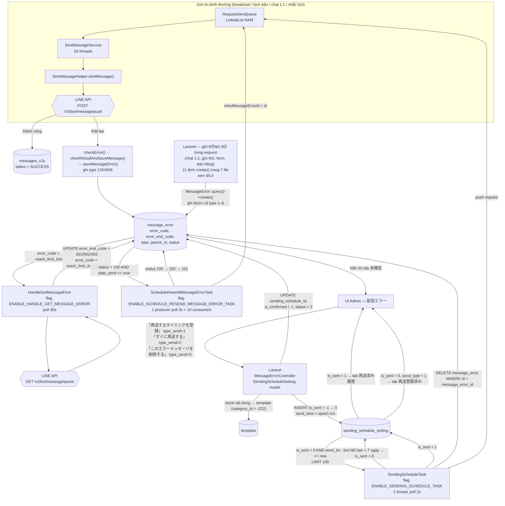

# Job Spec — FA-028 「配信エラー」 (Lỗi phát hành / Error message)

- **Portal**: Admin (LINE OA)
- **Nguồn**: Spring Boot + Java 1.8 — `src/job/linect-service/`
- **Kiểu giao tiếp Web ↔ Job**: **Database Polling** (không dùng message broker)
- **Mức độ tin cậy tổng thể**: **Cao** (đọc trực tiếp toàn bộ file Java liên quan)

---

## 1. Tổng quan

### 1.1. Vì sao tính năng cần background job

Tính năng 「配信エラー」 phụ thuộc vào job Spring Boot ở **cả hai chiều**:

| Chiều | Vai trò của job | Lý do bắt buộc phải có job |
|-------|-----------------|----------------------------|
| **Sinh dữ liệu** (job → DB) | Job ghi `message_error` cho **luồng gửi bất đồng bộ** — broadcast, kịch bản, nhắc lịch, gửi lại theo lịch. Đây **không phải nguồn ghi duy nhất**: Laravel cũng ghi trực tiếp tại 11 vị trí, và **cả hai phía đều ghi được mọi giá trị `type` 1–6** (xem §5.0) | Việc gửi tin hàng loạt chạy trong job; Laravel không biết kết quả gửi của các luồng này |
| **Tiêu thụ dữ liệu** (DB → job) | Admin bấm 「再送するタイミングを登録」/「すぐに再送する」 → Laravel chỉ **ghi hàng đợi**, job mới thực sự gửi lại | Gửi lại hàng loạt tới LINE API không thể chạy đồng bộ trong HTTP request (timeout, rate limit) |
| **Làm giàu dữ liệu** | Job dò hạn mức LINE để gán `error_end_code` 001/002/003 | Cần gọi LINE API `/v2/bot/message/quota` — chỉ job có vòng lặp thường trực để làm việc này |
| **Tự động retry** | Job tự thử lại tối đa 3 lần với lỗi tạm thời | Không phụ thuộc thao tác người dùng |

> **Khác biệt so với luồng v1 (legacy)**: `ErrorListController` (v1) gọi LINE API **đồng bộ** ngay trong request. Luồng v2 hiện hành **không gọi LINE API từ Laravel** — chỉ ghi bản ghi vào `sending_schedule_setting`. Tin cậy **Cao** (đối chiếu `web/logic-spec.md` §1.2).

### 1.2. Kiến trúc thực thi

Toàn bộ job nằm trong một tiến trình Spring Boot duy nhất. `AppMain` implements `CommandLineRunner`; method `run()` khởi tạo từng task manager theo **feature flag** đọc từ `config.properties`.

Mỗi task manager là một (hoặc nhiều) `Runnable` chạy `while(true)`, poll bảng MySQL, `Thread.sleep(...)` khi hàng đợi rỗng.

- File: `src/job/linect-service/src/main/java/sns/line/AppMain.java`
- Executor chung: `executorService = Executors.newCachedThreadPool();` (`AppMain.java:196`)
- Cơ chế dừng an toàn: mọi task kế thừa `StoppableTask`, kiểm tra `AppMain.getInstance().isPrepareStop() || isNeedStop()` ở đầu mỗi vòng lặp

### 1.3. Ba task manager liên quan tính năng FA-028

| # | Task manager | Feature flag | File | Vai trò |
|---|-------------|--------------|------|---------|
| 1 | `SendingScheduleTask` | `ENABLE_SENDING_SCHEDULE_TASK` | `task/SendingScheduleTask.java` | Gửi lại theo lịch Admin đăng ký (đọc `sending_schedule_setting`) |
| 2 | `ScheduleResendMessageErrorTask` | `ENABLE_SCHEDULE_RESEND_MESSAGE_ERROR_TASK` | `threads/schedule/ScheduleResendMessageErrorTask.java` | **Tự động** retry lỗi tạm thời (đọc `message_error.status = 100`) |
| 3 | `HandleGetMessageError` | `ENABLE_HANDLE_GET_MESSAGE_ERROR` | `task/HandleGetMessageError.java` | Dò hạn mức LINE → gán `error_end_code` 001/002/003 |

Ngoài ra, **service nền luôn bật** (không có flag):

| Service | File | Vai trò |
|---------|------|---------|
| `SentMessageService` | `helper/SentMessageService.java` | Consumer hàng đợi gửi tin trong RAM; là nơi **ghi** `message_error` khi LINE API lỗi |

Khởi tạo `SentMessageService` không điều kiện tại `AppMain.java:209` (`sentMessageService.startService();`) — tin cậy **Cao**.

### 1.4. Giá trị feature flag trong `config.properties` hiện có

File: `src/job/linect-service/config.properties`

```
ENABLE_SENDING_SCHEDULE_TASK = 0            (dòng 39)
ENABLE_HANDLE_GET_MESSAGE_ERROR=0           (dòng 48)
# ENABLE_SCHEDULE_RESEND_MESSAGE_ERROR_TASK — KHÔNG tồn tại trong file
```

Parse tại `ConfigFile.java:261, :263, :287` theo mẫu `Integer.parseInt(prop.getProperty("<KEY>","0")) > 0` → **cờ vắng mặt = false**.

> **Kết luận (Cao)**: bản `config.properties` trong repo là cấu hình **một node dev** (`DB_HOST = lme.watermeru.com`, `SUB_NAME=157.7.222.247`) và **tắt cả 3 task** của tính năng này. Hệ thống production chạy nhiều node, mỗi node bật một tập cờ khác nhau — đây là cơ chế phân tải theo node. Không suy ra được "tính năng bị tắt trên production" từ file này (đánh giá: **Trung bình**).

---

## 2. Queue Tables (bảng cầu nối Web ↔ Job)

### 2.1. `sending_schedule_setting` — hàng đợi gửi lại theo lịch

**Entity JPA**: `sns.line.models.linedb.entities.SendingScheduleSetting`
File: `src/job/linect-service/src/main/java/sns/line/models/linedb/entities/SendingScheduleSetting.java`

```java
@Table(name = "sending_schedule_setting")
public class SendingScheduleSetting {
    public static final int IS_WAIT_SEND = 0;        // :8
    public static final int IS_SENT_SUCCESS = 1;     // :9
    public static final int STATUS_EXPIRED_BOT = 8;  // :10
```

**Cột được entity map** (`:14-31`): `id`, `bot_id`, `line_user_id`, `send_type`, `send_time`, `template_ids`, `is_sent`, `message_error_id`, `created_at` (`updatable = false`).

**Cột KHÔNG được map** (tin cậy **Cao**, đối chiếu schema `db/schema/tables/sending_schedule_setting.sql`):
`action_id`, `parent_id`, `type_error`, `error_end_code`, `time_send_error`, `updated_at`.

> ⚠ **Hệ quả quan trọng**: `SendingScheduleTask` **không đọc `action_id`** vì entity không có trường này. Nếu bản ghi lỗi gốc gắn với một action (hành động sau khi gửi), action đó **sẽ không được thực thi** khi gửi lại. Tin cậy: **Cao** cho việc entity thiếu trường; **Trung bình** cho đánh giá hệ quả nghiệp vụ.

**State machine `is_sent`**

| Giá trị | Hằng số | Ai ghi | Ý nghĩa | Job có poll không |
|---------|---------|--------|---------|-------------------|
| `-1` | (chỉ tồn tại phía Laravel) | `SendingScheduleSetting::handleScheduleMsgErrors()` — PHP | **Khoá tạm** — bản ghi vừa tạo, chưa liên kết xong với `message_error` | ❌ Không |
| `0` | `IS_WAIT_SEND` | `pushSchedule()` (PHP, mở khoá) hoặc `saveSettingErrorMessage()` (PHP, ghi thẳng) | Chờ đến `send_time` để gửi | ✅ Có |
| `1` | `IS_SENT_SUCCESS` | `SendingScheduleTask.java:95-96` | **Đã đẩy vào hàng đợi gửi** (KHÔNG đồng nghĩa gửi thành công — xem §12) | ❌ Không |
| `8` | `STATUS_EXPIRED_BOT` | `SendingScheduleTask.java:49-51` | Bot đã hết hạn gói > 7 ngày → bỏ qua vĩnh viễn | ❌ Không |

**Điều kiện poll** (`SendingScheduleTask.java:41-42`):

```java
List<SendingScheduleSetting> scheduleSettingList
    = AppMain.getShareRepository().getSendingScheduleSettingRepository()
        .findTop100ByIsSentAndSendTimeLessThanEqual(
            SendingScheduleSetting.IS_WAIT_SEND, System.currentTimeMillis());
```

→ SQL tương đương: `SELECT * FROM sending_schedule_setting WHERE is_sent = 0 AND send_time <= <epoch_ms hiện tại> LIMIT 100`

`send_time` là **epoch milliseconds** (Laravel ghi `strtotime(...) * 1000`), khớp với `System.currentTimeMillis()`. Tin cậy **Cao**.

**Tần suất poll**: `sleep(2000)` — **2 giây**, và **chỉ sleep khi kết quả rỗng** (`SendingScheduleTask.java:106-108`). Khi có việc, vòng lặp quay ngay lập tức không nghỉ → throughput tối đa 100 bản ghi/vòng.

**Repository**: `models/linedb/repository/SendingScheduleSettingRepository.java`

| Method | Kiểu | Ghi chú |
|--------|------|---------|
| `findTop100ByIsSentAndSendTimeLessThanEqual(int, long)` | Derived query | Poll chính |
| `updateIsSent(Integer isSent, Long id)` | `@Modifying @Query` JPQL | Dùng cho nhánh bot hết hạn |
| `save(entity)` (kế thừa `JpaRepository`) | UPDATE toàn bộ cột được map | Dùng cho nhánh gửi thành công |

---

### 2.2. `message_error` — bảng nguồn dữ liệu lỗi

**Entity JPA**: `sns.line.models.linedb.entities.MessageError`
File: `src/job/linect-service/src/main/java/sns/line/models/linedb/entities/MessageError.java`

```java
@Table(name = "message_error")
public static final String UNKNOWN_ERROR         = "unknown";           // :10
public static final String REACH_LIMIT_FREE_PLAN = "reach_limit_free";  // :11
public static final String REACH_LIMIT_LINE      = "reach_limit_line";  // :12
public static final String AUTH_FAILURE          = "auth_failure";      // :13
```

**Cột được entity map** (`:17-57`): `id`, `message_id`, `line_id`, `bot_id`, `error_message`, `is_confirmed`, `error_code`, `error_end_code`, `type`, `parent_id`, `template_ids`, `status`, `date_send`, `retry_count`.

**Cột KHÔNG được map**: `duration`, `sending_schedule_id`, `created_at`, `updated_at` → job **không đọc/ghi** các cột này (tin cậy **Cao**). Riêng `sending_schedule_id` chỉ do Laravel quản lý.

> ⚠ Vì `sending_schedule_id` không nằm trong entity, khi job gọi `messageErrorRepository.save(messageError)` (`SentMessageHelper.java:687`) Hibernate sinh `UPDATE ... SET` chỉ trên các cột được map → **không ghi đè** `sending_schedule_id`. An toàn. Tin cậy **Cao**.

**State machine `status`** — có **hai không gian giá trị chồng lên nhau trên cùng một cột**:

| Giá trị | Hằng số | Định nghĩa ở đâu | Ai ghi | Ý nghĩa |
|---------|---------|------------------|--------|---------|
| `0` | (mặc định schema) | — | `SentMessageHelper.java:681`, `:685` | Lỗi bình thường, chờ Admin xử lý thủ công |
| `1` | `MessageError::STATUS_HANDLED['WAITING']` | **Laravel** `app/MessageError.php` | `MessageErrorController::saveSettingErrorMessageAll()` | Đang chờ queued job Laravel tạo lịch |
| `2` | `MessageError::STATUS_HANDLED['DONE']` | **Laravel** | `SendingScheduleSetting::pushSchedule()` | Laravel đã tạo xong lịch |
| `100` | `MessageErrorConstants.STATUS_RETRY_WAIT` | **Spring** `values/MessageErrorConstants.java:4` | `SentMessageHelper.java:676` | Chờ **tự động** retry, đến hẹn `date_send` |
| `101` | `MessageErrorConstants.STATUS_RETRY_SENDING` | **Spring** `:5` | `ScheduleResendMessageErrorTask` (3 vị trí) | Đang gửi lại tự động |
| `102` | `MessageErrorConstants.STATUS_RETRY_INQUEUE` | **Spring** `:6` | `ScheduleResendMessageErrorTask` (thread nạp hàng đợi) | Đã nạp vào hàng đợi RAM |
| `103` | `MessageErrorConstants.STATUS_RETRY_ERROR` | **Spring** `:7` | `ScheduleResendMessageErrorTask.handleItem()` | Không dựng được nội dung để gửi lại |

> **Nhận xét (Cao)**: đây là **một cột `status` phục vụ hai state machine độc lập** — Laravel dùng `0/1/2`, Spring dùng `0/100/101/102/103`. Không có xung đột giá trị, nhưng cũng **không có hằng số dùng chung**; một trong hai phía thêm giá trị mới có thể va chạm.

**State machine `type`** (nguồn phát sinh lỗi):

| Giá trị | Hằng số Laravel | Ai gán trong job | Nhãn UI |
|---------|-----------------|------------------|---------|
| `1` | `TYPE_OTHER` | `SentMessageHelper.getMessageErrorType()` — nhánh mặc định | 「その他メッセージ」 |
| `2` | `TYPE_CHAT11` | **KHÔNG bao giờ do job gán** (xem §5.3) | 「1:1チャット」 |
| `3` | `TYPE_SEND_ALL` | `msgKind == TYPE_MESSAGE_SEND_ALL` | 「メッセージ配信」 |
| `4` | `TYPE_STEP` | `msgKind == TYPE_MESSAGE_SCENARIO` | 「ステップ配信」 |
| `5` | `TYPE_TEMPLATE` | `hasTemplateId == true` | Gộp 「その他メッセージ」 |
| `6` | `TYPE_REMIND` | `msgKind == TYPE_MESSAGE_EVENT` | Gộp 「その他メッセージ」 |

**Điều kiện poll của `ScheduleResendMessageErrorTask`** (`ScheduleResendMessageErrorTask.java:58-59`):

```java
List<MessageError> list = AppMain.getShareRepository().getMessageErrorRepository()
        .findTop200ByStatusAndDateSendLessThanEqual(
            MessageErrorConstants.STATUS_RETRY_WAIT, LocalDateTime.now());
```

→ `SELECT * FROM message_error WHERE status = 100 AND date_send <= NOW() LIMIT 200`

**Tần suất poll**: `sleep(3000)` — **3 giây**, chỉ khi rỗng (`:66-68`).

**Điều kiện poll của `HandleGetMessageError`** (`HandleGetMessageError.java:34`):

```java
MessageError messageError = AppMain.getShareRepository().getMessageErrorRepository()
        .findFirstByErrorCode(MessageError.REACH_LIMIT_LINE);
```

→ `SELECT * FROM message_error WHERE error_code = 'reach_limit_line' LIMIT 1`

**Tần suất poll**: `sleep(30000)` — **30 giây**, chỉ khi không tìm thấy bản ghi (`:35-38`).

**Repository**: `models/linedb/repository/MessageErrorRepository.java`

| Method | SQL | Dùng ở đâu |
|--------|-----|-----------|
| `findFirstByErrorCode(String)` | `WHERE error_code = ? LIMIT 1` | `HandleGetMessageError:34` |
| `findTop100ByErrorCode(String)` | `WHERE error_code = ? LIMIT 100` | Không dùng trong luồng FA-028 |
| `countByBotIdAndIsConfirmed(long, Integer)` | `COUNT(*)` | Badge số lỗi chưa xác nhận |
| `findTop200ByStatusAndDateSendLessThanEqual(int, LocalDateTime)` | Poll retry | `ScheduleResendMessageErrorTask:58` |
| `removeById(long)` | `DELETE FROM message_error WHERE id = ?` (native) | `SendingScheduleTask:98`, `SentMessageHelper:416` |
| `deleteAllByLineIdAndBotId(long, long)` | `DELETE ... WHERE line_id = ? AND bot_id = ?` (native) | `HandlePostbackTask:580`, `:2206`; `BotLineUserModel:103` |
| `deleteAllByBotId(long)` | `DELETE ... WHERE bot_id = ?` (native) | `HandleGetMessageError:41` |
| `updateStatus(int, long)` | `UPDATE message_error SET status = ? WHERE id = ?` (native) | `ScheduleResendMessageErrorTask` (5 vị trí) |
| `updateErrorMessageAndErrorCodeAndErrorEndCodeByErrorCode(...)` | JPQL update theo `bot_id` + `error_code` | `HandleGetMessageError:50, :55, :60` |

---

## 3. Task Manager 1 — `SendingScheduleTask` (gửi lại theo lịch)

**File**: `src/job/linect-service/src/main/java/sns/line/task/SendingScheduleTask.java` (127 dòng)
**Feature flag**: `ConfigFile.ENABLE_SENDING_SCHEDULE_TASK` — khởi tạo tại `AppMain.java:268-270`

```java
if (ConfigFile.ENABLE_SENDING_SCHEDULE_TASK) {
    sendingScheduleTask.startJob(executorService);
}
```

**Thread pool**: **1 thread duy nhất** — `executorService.execute(new Runnable(){...})` (`:30`) trên `newCachedThreadPool()` chung. Không có thread pool riêng, không xử lý song song. Tin cậy **Cao**.

### 3.1. Vòng lặp chính (`:35-109`)

| Bước | Dòng | Hành động |
|------|------|-----------|
| 1 | `:37-40` | Kiểm tra cờ dừng → `break` nếu hệ thống chuẩn bị reboot |
| 2 | `:41-42` | Poll tối đa 100 bản ghi `is_sent = 0 AND send_time <= now` |
| 3 | `:47-53` | Lấy `Bot` từ cache `BotManager`; nếu `null` hoặc `bot.isExpiredOver7Day()` → `is_sent = 8`, `continue` |
| 4 | `:55-66` | Tách `template_ids` (chuỗi CSV) thành `List<Long>`; bỏ qua phần tử không parse được (`NumberFormatException ignored`) |
| 5 | `:67` | Tìm `Conversation` của cặp (bot, line_user) |
| 6 | `:70-86` | Với mỗi `templateId` → `MessageModel.buildSourceMessageForTemplate(templateId, botId, true)` → dựng `MessagesV2s` (msgKind = `KIND_MESSAGE_TEMPLATE`, `needQuoteToken = true`, `profileSend = null`) |
| 7 | `:88-94` | Đẩy `RequestSentTemplateToUser` vào hàng đợi RAM `RequestSentQueue` |
| 8 | `:95-96` | `item.setIsSent(IS_SENT_SUCCESS)` → `save(item)` |
| 9 | `:97-99` | **Nếu `message_error_id != null` → `removeById()` — XOÁ VĨNH VIỄN bản ghi lỗi** |
| 10 | `:101-104` | `catch (Exception)` → log + `NotifyUtils.sendReportChatwork(...)` |
| 11 | `:106-108` | Nếu danh sách rỗng → `sleep(2000)` |

### 3.2. Trích dẫn code then chốt

**Bot hết hạn** (`SendingScheduleTask.java:47-53`):
```java
Bot bot = BotManager.getBot(item.getBotId());
if (bot == null || bot.isExpiredOver7Day()) {
    item.setIsSent(SendingScheduleSetting.STATUS_EXPIRED_BOT);
    LOGGER.info("Ignore event " + item.getId() + " -> Because bot expired plan after 7 day " + item.getBotId());
    AppMain.getShareRepository().getSendingScheduleSettingRepository().updateIsSent(item.getIsSent(), item.getId());
    continue;
}
```

**Đẩy hàng đợi + đánh dấu đã gửi + xoá bản ghi lỗi** (`SendingScheduleTask.java:88-99`):
```java
// chat_11 Case resend message error
if (!listMessageToSave.isEmpty()) {
    RequestSentTemplateToUser request = new RequestSentTemplateToUser(
        listMessageToSave, item.getBotId(), templateListSend, item.getLineUserId(),
        RequestSentTemplateToUser.TYPE_MESSAGE_SENDING_SCHEDULE);
    request.setSenderId(item.getId());
    request.setBotProfileId(null);
    request.setAvailableToSent(BotModel.availableSend(item.getBotId()));
    RequestSentQueue.pushRequestToQueue(request);
}
item.setIsSent(SendingScheduleSetting.IS_SENT_SUCCESS);
AppMain.getShareRepository().getSendingScheduleSettingRepository().save(item);
if (item.getMessageErrorId() != null) {
    AppMain.getShareRepository().getMessageErrorRepository().removeById(item.getMessageErrorId());
}
```

### 3.3. Phân tích đoạn xoá `message_error` (dòng 97-99) — điểm nóng

**Sự thật đọc được từ code (tin cậy Cao):**

1. Việc xoá xảy ra **ngay sau khi đẩy request vào hàng đợi RAM**, **trước khi** `SentMessageService` thực sự gọi LINE API. Đây là hành vi *fire-and-forget*.
2. `is_sent = 1` được ghi **vô điều kiện**, kể cả khi `listMessageToSave` **rỗng** (template bị xoá / không dựng được nội dung) — nhánh `if` ở `:88` chỉ bao quanh việc đẩy hàng đợi, không bao quanh `:95-99`.
3. `removeById` là `DELETE` native, **không lọc `bot_id`**, không soft-delete, không lưu bản sao.

**Hệ quả:**

| Kịch bản | Kết quả |
|---------|---------|
| Gửi lại thành công | Bản ghi lỗi biến mất khỏi tab 「未確認」 — đúng ý đồ; lịch sử còn lại ở `sending_schedule_setting` (`is_sent = 1`) → hiển thị tab 「再送済み履歴」 |
| Gửi lại **thất bại tiếp** | Bản ghi lỗi gốc **đã bị xoá**. `SentMessageHelper` tạo **bản ghi lỗi MỚI** (`saveMessageError` với `retryMessageErrorId = 0`) → mất `retry_count`, mất `error_end_code` gốc, mất liên kết `sending_schedule_id`, và `type` bị đổi thành `5` (xem §5.3) |
| Template bị xoá trước giờ gửi | `listMessageToSave` rỗng → **không gửi gì cả**, nhưng vẫn `is_sent = 1` và vẫn **xoá `message_error`** → lỗi biến mất im lặng, người dùng tưởng đã gửi lại |
| Tiến trình chết giữa `:96` và `:98` | `is_sent = 1` đã lưu, `message_error` chưa xoá → bản ghi lỗi tồn tại vĩnh viễn với `sending_schedule_id` trỏ tới lịch `is_sent = 1`; Laravel xếp nó vào tab 「再送済み履歴」 nhưng bản ghi `message_error` mồ côi |

**Không có transaction** bao quanh cụm `:95-99` (tin cậy **Cao** — không có `@Transactional` trên method, ba lệnh DB độc lập).

---

## 4. Task Manager 2 — `ScheduleResendMessageErrorTask` (tự động retry)

**File**: `src/job/linect-service/src/main/java/sns/line/threads/schedule/ScheduleResendMessageErrorTask.java` (~270 dòng)
**Feature flag**: `ConfigFile.ENABLE_SCHEDULE_RESEND_MESSAGE_ERROR_TASK` — `AppMain.java:274-276`

**Kiến trúc producer/consumer trong RAM:**

```
startThreadAddQueue()  — 1 thread   ──push──▶  LinkedList<MessageError> queueMessageError
startThreadHandle()    — 10 threads ──poll──▶  handleItem()
```

- `private final int MAX_THREAD = 10;` (`:32`) — hằng số cứng, **không cấu hình được**
- Hàng đợi là `LinkedList` + khối `synchronized` (`:62-64`, `:97-99`) — **không phải** `BlockingQueue`; consumer `sleep(500)` khi rỗng (`:101-102`)

### 4.1. Thread nạp hàng đợi (`:42-77`)

```java
List<MessageError> list = AppMain.getShareRepository().getMessageErrorRepository()
        .findTop200ByStatusAndDateSendLessThanEqual(MessageErrorConstants.STATUS_RETRY_WAIT, LocalDateTime.now());
for(MessageError messageError : list){
    messageError.setStatus(MessageErrorConstants.STATUS_RETRY_INQUEUE);
    AppMain.getShareRepository().getMessageErrorRepository().updateStatus(messageError.getStatus(), messageError.getId());
    synchronized (queueMessageError){ queueMessageError.add(messageError); }
}
if(list.isEmpty()){ sleep(3000); }
```

Đặt `status = 102` **ngay khi nạp** → chống bản ghi bị nạp trùng ở vòng poll kế tiếp. Tin cậy **Cao**.

### 4.2. `handleItem()` — 3 chiến lược dựng lại nội dung (`:114-249`)

Mở đầu: `messageError.setStatus(STATUS_RETRY_ERROR)` (`:116`) — đặt trước như **giá trị mặc định bi quan**; chỉ nhánh nào dựng được nội dung mới nâng lên `STATUS_RETRY_SENDING` (101).

| Case | Điều kiện | Nguồn nội dung | Dòng |
|------|-----------|----------------|------|
| **Case 1** | không tìm thấy `messages_v2s` **VÀ** `template_ids` không rỗng | `MessageModel.buildSourceMessageForTemplate()` từ danh sách `template_ids` | `:127-163` |
| **Case 2** | có `messages_v2s` **VÀ** `source_message_id > 0` | `source_messages` → `capture_templates` → `template_id` (nếu `template_id == 0` thì `TemplateCacheManager.addTextMessage(content)`) | `:166-213` |
| **Case 3** | có `messages_v2s` **VÀ** `source_message_id == 0` | `messages_v2s.content` trực tiếp (msgKind 0 / type 1) hoặc bóc `RemindBookingContent.content` (msgKind = `KIND_MESSAGE_ACTION_FROM_BOOKING`) | `:215-246` |
| **Không nhận diện được** | còn lại | `LOGGER.error("Not detect case source_message null...")` / `"Not found messageV2s id ..."` | `:245`, `:248` |

Cả 3 case đều kết thúc bằng:
```java
messageError.setStatus(MessageErrorConstants.STATUS_RETRY_SENDING);
AppMain.getShareRepository().getMessageErrorRepository().updateStatus(messageError.getStatus(), messageError.getId());
RequestSentTemplateToUser request = new RequestSentTemplateToUser(..., RequestSentTemplateToUser.TYPE_MESSAGE_SENDING_SCHEDULE);
request.setSenderId(0);
request.setRetryMessageErrorId(messageError.getId());   // ← điểm khác biệt then chốt so với SendingScheduleTask
RequestSentQueue.pushRequestToQueue(request);
```

Kết thúc method (`:250-252`):
```java
if (messageError.getStatus() != MessageErrorConstants.STATUS_RETRY_SENDING) {
    AppMain.getShareRepository().getMessageErrorRepository().updateStatus(messageError.getStatus(), messageError.getId());
}
```
→ Bản ghi không dựng được nội dung bị chốt ở `status = 103` (`STATUS_RETRY_ERROR`).

> **Khác biệt cốt lõi giữa 2 task retry (Cao):**
> - `ScheduleResendMessageErrorTask` **giữ** `message_error`, truyền `retryMessageErrorId` → `SentMessageHelper` sẽ **cập nhật lại chính bản ghi cũ** (giữ `retry_count`) và chỉ xoá **khi gửi thành công** (`SentMessageHelper.java:414-417`).
> - `SendingScheduleTask` **xoá ngay** `message_error` trước khi biết kết quả, và **không** truyền `retryMessageErrorId`.

---

## 5. Chiều sinh dữ liệu lỗi — ai GHI `message_error`?

### 5.0. Hai nguồn ghi `message_error`

Bảng `message_error` được ghi từ **hai codebase độc lập**, tương ứng hai kiểu gửi tin. Tin cậy **Cao** (đọc trực tiếp cả hai codebase; danh sách vị trí Laravel lấy bằng grep toàn bộ `src/web/sns-line/app/` cho `MessageError::query()->create` / `MessageError::create`).

| Nguồn | Số vị trí ghi | Luồng gửi |
|-------|---------------|-----------|
| **(a) Spring Boot** | 1 — `SentMessageHelper.saveMessageError()` (`helper/SentMessageHelper.java:639-689`), gọi từ 5 chỗ trong cùng file | Gửi **bất đồng bộ** qua `RequestSentQueue` → `SentMessageService` (broadcast, kịch bản, nhắc lịch, gửi lại theo lịch) |
| **(b) Laravel** | 11 lệnh `create()` trong 7 file | Gửi **đồng bộ ngay trong HTTP request**, cộng thêm vài lệnh console |

> ⚠ **Cả hai phía đều ghi được mọi giá trị `type` 1–6.** Không tồn tại sự phân chia "Laravel giữ `type` 1/2/5, job giữ 3/4/6" — xem phân tích guard bên dưới. Tin cậy **Cao**.

#### Năm vị trí Laravel thuộc luồng gửi tin chính (6 lệnh `create()`)

| # | Vị trí | Có guard `type ∉ {3,4,6}`? | Ghi `message_id`? | `template_ids` |
|---|--------|----------------------------|-------------------|----------------|
| 1 | `app/Helpers/functions.php:3033` — `createMessage()` (khai báo `:2632`) | ✅ Có — `:3028-3032` | ✅ Có | `$templateIds` |
| 2 | `app/Helpers/functions.php:3182` — `createMessageError()` (khai báo `:3121`) | ❌ **Không** | ❌ **Không** — dòng bị comment tại `:3184` | `$template_ids` |
| 3 | `app/Helpers/functions.php:3602` — `createMultipleMessage()` (khai báo `:3197`) | ✅ Có — `:3597-3601` | ✅ Có | `$template_ids` |
| 4 | `app/Helpers/functions.php:8024` — `createMessageSendTest()` (khai báo `:7663`) | ✅ Có — `:8019-8023` | ✅ Có | `$template_ids` |
| 5 | `app/Services/MessageService.php:386` **và** `:398` — `handleErrorMessage()` (khai báo `:343`) | ✅ Có — `:381-385`, **nhưng có nhánh `else`** | Nhánh `if` `:387` có; nhánh `else` **không** | Nhánh `if`: `null`; nhánh `else`: `implode(',', $optionalParams['templateError'])` |

#### Ý nghĩa thật của guard: định tuyến đường ghi, không phải phân chia `type`

Khối điều kiện xuất hiện ở 4 vị trí (`functions.php:3028-3032`, `:3597-3601`, `:8019-8023`, `MessageService.php:381-385`) đều giống nhau:

```php
$typeMessageError = !empty($optionalParams['type_message_error']) ? $optionalParams['type_message_error'] : 1;

if (
    $typeMessageError != MessageError::TYPE_SEND_ALL &&
    $typeMessageError != MessageError::TYPE_STEP &&
    $typeMessageError != MessageError::TYPE_REMIND
) { ... }
```

`MessageService.php` cho thấy ý đồ gốc rõ nhất vì nó có **cả hai nhánh** (`:386-397` và `:398-408`):

| | Nhánh `if` — `type ∈ {1, 2, 5}` | Nhánh `else` — `type ∈ {3, 4, 6}` |
|---|---|---|
| `message_id` | `$message->id` | **không ghi** → `NULL` |
| `template_ids` | `null` | `implode(',', $optionalParams['templateError'])` |

→ Guard dùng để **chọn hình dạng bản ghi**, không phải để chặn ghi. Với broadcast / kịch bản / nhắc lịch, lỗi gắn với **danh sách template** chứ không gắn với một bản ghi message đơn lẻ, nên `message_id` bị bỏ và `template_ids` được đính vào. Tin cậy **Cao**.

Ba vị trí `functions.php` chỉ có nhánh `if` mà **không có `else`** — tức ở riêng ba helper đó, `type` 3/4/6 thật sự không được ghi. Nhưng điều đó **không** khái quát được cho toàn bộ Laravel, vì vị trí #2 ghi vô điều kiện và nhánh `else` của #5 ghi đúng nhóm 3/4/6.

#### Năm vị trí Laravel còn lại (không truyền `type`)

Năm lệnh `create()` sau **không truyền cột `type`** → rơi về giá trị mặc định schema `type = 1` (`db/schema/tables/message_error.sql`). Đều không có guard:

| Vị trí | Bối cảnh | Cột ghi |
|--------|----------|---------|
| `app/Services/Sales/SalesService.php:2108` | Gửi tin thuộc nghiệp vụ bán hàng | `message_id`, `line_id`, `bot_id`, `error_message` |
| `app/Http/Controllers/Basic/SalesManagementV2Controller.php:4506` | Quản lý bán hàng v2 | thêm `error_code`, `error_end_code` |
| `app/Console/Commands/HandleBillStripe.php:1259` | Console — xử lý hoá đơn Stripe | `message_id`, `line_id`, `bot_id`, `error_message` |
| `app/Console/Commands/HandleSendActionTrialV2.php:1262` | Console — gửi action bản dùng thử | `message_id`, `line_id`, `bot_id`, `error_message` |
| `app/Console/Commands/Recover.php:257` — `addRecoverErrorList()` | Console — **dựng lại** `message_error` từ `messages.has_error = 1` | thêm `is_confirmed`, `created_at`, `updated_at` |

> Các vị trí này thiếu cả `error_code` lẫn `error_end_code` (trừ `SalesManagementV2Controller`) → bản ghi sinh ra luôn hiển thị mã `other` trên `SCR-ERR-04`, vì Laravel phải suy mã từ chuỗi `error_message` (`MessageErrorController::getEndCode()` `:345-376`). Tin cậy **Cao**.

> **Hệ quả cho việc đọc spec**: mọi kết luận trong §5.1–§5.4 dưới đây **chỉ áp dụng cho nguồn (a) — Spring Boot**. Chi tiết nhánh Laravel thuộc phạm vi `web/logic-spec.md`.

### 5.1. Điểm ghi phía Spring Boot: `SentMessageHelper.saveMessageError()`

**File**: `src/job/linect-service/src/main/java/sns/line/helper/SentMessageHelper.java:639-689` (file 754 dòng)

Được gọi từ **5 vị trí**, tất cả nằm trong cùng file:

| Dòng gọi | Bối cảnh | `errorCode` truyền vào |
|----------|----------|------------------------|
| `:227` | Template rỗng — không có message nào để gửi | `"006"` |
| `:443` | Vượt hạn mức gói **free của LME** (1.000 tin) — nhánh từng message | `MessageError.REACH_LIMIT_FREE_PLAN` |
| `:448` | Vượt hạn mức LME — nhánh gộp cho `TYPE_MESSAGE_SENDING_SCHEDULE` | `MessageError.REACH_LIMIT_FREE_PLAN` |
| `:630` | Sau khi gọi LINE API xong, message có template lỗi (msgKind ≠ SENDING_SCHEDULE) | lấy từ `messagesToSave.getErrorCode()` |
| `:635` | Sau khi gọi LINE API xong, gộp cho `TYPE_MESSAGE_SENDING_SCHEDULE` | `lastErrorCode` |

**Chuỗi truyền `error_code` từ response LINE API** — gán tại `SentMessageHelper.callSent()` (`:454-535`), lưu tạm vào `MessagesV2s.errorCode` qua `checkError()` (`:561-585`), rồi `checkResultAndSaveMessage()` (`:587-637`) đọc lại và gọi `saveMessageError()`.

### 5.2. Bảng ánh xạ response LINE API → `error_code` → `error_end_code`

| Điều kiện phát hiện | Dòng | `error_code` ghi vào DB | `error_end_code` | Nội dung `error_message` |
|---------------------|------|------------------------|------------------|--------------------------|
| `listLineMsgToSent` rỗng (template không có message) | `:208-209` | `"006"` | `NULL` (không khớp nhánh nào ở `:641-650`) | 「テンプレート内にメッセージが登録されていないため送信ができませんでした」 |
| `!req.isAvailableToSent()` — vượt hạn mức **gói free của LME** | `:426-427` | `reach_limit_free` | `"004"` | 「配信数がエルメのフリープラン上限（1,000通）に達しました…」 + link `/admin/bot_add?upgrade_bot_id=…` |
| `bot.isReachLineApiLimit()` (cờ RAM, chặn trước khi gọi API) | `:466-469` | `reach_limit_line` | `NULL` → sau đó `HandleGetMessageError` gán `001/002/003` | 「LINE公式アカウントの…配信上限に達しました」 |
| Response `null` (timeout / lỗi mạng) | `:474-477` | `unknown` | `ignoreRetry(null)` trả `false` → **`"007"`** | `NULL` |
| Response chứa `"Confirm that the access token in the authorization header is valid"` (sau khi refresh token vẫn lỗi) | `:507-510` | `auth_failure` | `"005"` | 「LINE公式アカウント凍結、もしくは誤操作により現在設定されているchannel secretが利用できなくなりました…」 + link `/admin/bot_add?id=…` |
| Response chứa `"monthly limit"` | `:511-518` | `reach_limit_line` + `bot.setReachLineApiLimit(true)` | `NULL` → `HandleGetMessageError` gán `001/002/003` | Theo gói: 「コミュニケーションプラン…」 hoặc 「ライトプラン（5,000通）…」 |
| Mọi lỗi khác | `:520-523` | `unknown` | `"007"` nếu `!LineModel.ignoreRetry(msg)`, ngược lại `NULL` | Nguyên văn `response.getMessage()` từ LINE |

**Logic gán `error_end_code`** (`SentMessageHelper.java:640-650`):
```java
String errorEndCode = null;
if (MessageError.REACH_LIMIT_FREE_PLAN.equals(errorCode)) {
    errorEndCode = "004";
} else if (MessageError.AUTH_FAILURE.equals(errorCode)) {
    errorEndCode = "005";
} else if (MessageError.UNKNOWN_ERROR.equals(errorCode)) {
    if(!LineModel.ignoreRetry(errorMessage)){
        // cho case chưa define và case lỗi bên line, ko phải do message or tài khoản có vấn đề
        errorEndCode = "007";
    }
}
```

**`LineModel.ignoreRetry()`** (`models/line/LineModel.java:327-342`) — lỗi "do nội dung/tài khoản", không đáng retry, `error_end_code` để `NULL`:
- `"Confirm that the access token in the authorization header is valid"`
- `"monthly limit"`
- `"Access to this API is not available for your account"`
- `"Failed to send messages"`
- `"sender.name contains NG words"`
- chuỗi bắt đầu bằng `"template"` và chứa `"->"` (lỗi validate cấu trúc template: `template/text -> must not be longer than 60 characters`, `template/actions -> must be non-empty array`, …)

**`LineModel.needRetry()`** (`:317-320`) — lỗi hạ tầng, đáng retry:
`"Broken pipe"`, `"unexpected"`, `"timeout"`, `"Internal Server Error"`

**`LineModel.needRetryLimitExceeded()`** (`:322-325`): `"The API rate limit has been exceeded"`

### 5.3. Gán cột `type` — `getMessageErrorType()` (`SentMessageHelper.java:706-727`)

```java
private int getMessageErrorType(int msgKindReq, boolean hasTemplateId){
    if(msgKindReq == RequestSentTemplateToUser.TYPE_MESSAGE_SEND_ALL)  return 3;  // broadcast
    if(msgKindReq == RequestSentTemplateToUser.TYPE_MESSAGE_SCENARIO)  return 4;  // kịch bản
    if(msgKindReq == RequestSentTemplateToUser.TYPE_MESSAGE_EVENT)     return 6;  // nhắc lịch
    if (hasTemplateId) return 5;                                                   // template
    return 1;                                                                      // other
}
```

`hasTemplateId` = `true` khi `msgKind` của message là `KIND_MESSAGE_TEMPLATE` hoặc `KIND_MESSAGE_DELAY_MESSAGE` (`:664-668`).

Hằng số `msgKind` của request (`helper/RequestSentTemplateToUser.java:14-19`):

| Hằng số | Giá trị |
|---------|---------|
| `TYPE_MESSAGE_CALLBACK` | `0` |
| `TYPE_MESSAGE_SCENARIO` | `2` |
| `TYPE_MESSAGE_SEND_ALL` | `3` |
| `TYPE_MESSAGE_EVENT` | `10` |
| `TYPE_MESSAGE_SENDING_SCHEDULE` | `11` |
| `TYPE_MESSAGE_ACTION` | `19` |

> ⚠ **Phát hiện (Cao)**: job **không bao giờ gán `type = 2` (`TYPE_CHAT11`)**. Nhánh gửi chat 1:1 rơi vào `TYPE_MESSAGE_CALLBACK`/`TYPE_MESSAGE_ACTION` → `hasTemplateId ? 5 : 1`.
>
> **Lý do đúng**: không phải vì Laravel "độc quyền" `type` 1/2/5 (§5.0 đã bác bỏ cách hiểu đó), mà đơn giản vì **luồng chat 1:1 không đi qua job** — nó gửi đồng bộ ngay trong HTTP request, nên bản ghi lỗi luôn do Laravel tạo. Tin cậy **Cao**.
>
> Cột `type = 2` **do phía Laravel ghi** — đã xác minh xong, tin cậy **Cao**. Giá trị đi vào các vị trí ghi ở §5.0 (`functions.php:3040`, `:3189`, `:3609`, `:8031`, `MessageService.php:393`/`:404`) qua tham số `$optionalParams['type_message_error'] = MessageError::TYPE_CHAT11` (hằng số `= 2`, `app/MessageError.php:16`), được truyền từ **9 caller**:
>
> | Controller | Dòng |
> |------------|------|
> | `Http/Controllers/Api/ChatController.php` | `:735`, `:989`, `:1130`, `:4988`, `:5111`, `:5313` |
> | `Http/Controllers/Admin/BotController.php` | `:4771`, `:5200` |
> | `Http/Controllers/Basic/FormAnswerController.php` | `:6933` |
>
> Tất cả 9 caller đều là đường gửi tin **đồng bộ ngay trong HTTP request** — không có đường nào đẩy qua `RequestSentQueue`, nên job không bao giờ nhìn thấy nhóm này.

> ⚠ **Phát hiện (Cao)**: khi retry qua `TYPE_MESSAGE_SENDING_SCHEDULE` thất bại, lời gọi ở `:635` truyền `msgKind = MessageConstants.KIND_MESSAGE_TEMPLATE` → `hasTemplateId = true` → **`type = 5`**. Nghĩa là **lỗi phát sinh từ lần gửi lại luôn rơi vào nhóm 「その他メッセージ」**, bất kể lỗi gốc thuộc 「メッセージ配信」 hay 「ステップ配信」. Bộ lọc `error_type` trên UI vì thế không tìm lại được bản ghi ở đúng nhóm cũ.

### 5.4. Gán `parent_id` (`SentMessageHelper.java:670`)

```java
messageError.setParentId(req.getSenderId());
```

| Nguồn request | `senderId` là gì | `parent_id` mang nghĩa |
|---------------|------------------|------------------------|
| Broadcast (`TYPE_MESSAGE_SEND_ALL`) | id bản ghi `broadcast` | ID chiến dịch |
| Kịch bản (`TYPE_MESSAGE_SCENARIO`) | id `step_message` | ID bước kịch bản |
| `SendingScheduleTask` (`:90`) | **`sending_schedule_setting.id`** | ID bản ghi lịch gửi lại |
| `ScheduleResendMessageErrorTask` | `0` (đặt cứng `request.setSenderId(0)`) | Không có |

> ⚠ **Phát hiện (Trung bình)**: `parent_id` là **khoá ngoại đa hình không có cột phân biệt** — phải suy ra bảng đích từ `type`. Với bản ghi sinh từ `SendingScheduleTask` thì `type = 5` nhưng `parent_id` lại trỏ sang `sending_schedule_setting`, không khớp quy ước `type = 3 → broadcast`, `type = 4 → step_message` mà Laravel dùng khi dựng preview.

### 5.5. Task Manager 3 — `HandleGetMessageError` (làm giàu `error_end_code` 001/002/003)

**File**: `src/job/linect-service/src/main/java/sns/line/task/HandleGetMessageError.java`
**Feature flag**: `ConfigFile.ENABLE_HANDLE_GET_MESSAGE_ERROR` — `AppMain.java:289-291`
**Thread pool**: 1 thread trên executor chung (`:20`)

Vòng lặp (`:25-77`):

1. Tìm 1 bản ghi bất kỳ có `error_code = 'reach_limit_line'` (`:34`); không có → `sleep(30000)`
2. Lấy `Bot` (`findFirstByIdAndIsDelete(botId, 0)`); nếu `null` → **`deleteAllByBotId(botId)`** — xoá toàn bộ lỗi của bot đã bị xoá (`:39-43`)
3. Gọi LINE API `GET /v2/bot/message/quota` → `limit` (`:88-103`)
4. Gọi LINE API `GET /v2/bot/message/quota/consumption` → `current` (`:105-134`); nếu token hết hạn thì `BotManager.refreshToken(bot)` rồi gọi đệ quy 1 lần
5. Phân nhánh theo `limit` và **cập nhật hàng loạt** mọi bản ghi cùng `bot_id` + `error_code = 'reach_limit_line'`:

| `limit` | `error_end_code` | `error_message` mới | Gói LINE |
|---------|------------------|---------------------|----------|
| `<= 210` | `"001"` | 「LINE公式アカウントのコミュニケーションプランが配信上限に達しました。ライトプランへのアップグレードが必要です。」 | Communication (free) |
| `<= 5000` | `"002"` | 「LINE公式アカウントのライトプランが配信上限（5,000通）に達しました。スタンダードプランへのアップグレードが必要です。」 | Light |
| còn lại | `"003"` | 「LINE公式アカウントのスタンダードプランが配信上限（30,000通）に達しました。追加メッセージ数の上限目安の設定が必要です。」 | Standard |

6. **Đồng thời đổi `error_code` từ `reach_limit_line` → `reach_limit_line_loaded`** (`:47`, tham số `errorCode` của `updateErrorMessageAndErrorCodeAndErrorEndCodeByErrorCode`) → bản ghi không bị nhặt lại ở vòng sau. Đây chính là cơ chế "đánh dấu đã xử lý" của task này. Tin cậy **Cao**.
7. Nếu `current != limit` → chỉ log; đoạn `NotifyUtils.sendMessageChatwork` đã bị **comment lại** với ghi chú "Ko notify nữa vì bug ko phải do cái này, bên Line có delay update current" (`:70`)

> **Tổng hợp bảng mã `error_end_code`**

| Mã | Ý nghĩa | Ai gán | Vị trí |
|----|---------|--------|--------|
| `001` | Vượt hạn mức gói Communication của LINE | `HandleGetMessageError` | `:50-51` |
| `002` | Vượt hạn mức gói Light (5.000 tin) | `HandleGetMessageError` | `:55-56` |
| `003` | Vượt hạn mức gói Standard (30.000 tin) | `HandleGetMessageError` | `:60-61` |
| `004` | Vượt hạn mức gói **free của LME** (1.000 tin) | `SentMessageHelper` | `:641-642` |
| `005` | Token / channel secret hỏng, OA bị đóng băng | `SentMessageHelper` | `:643-644` |
| `006` | Template không có message nào | `SentMessageHelper` gán vào **`error_code`**, `error_end_code` để `NULL` | `:209` |
| `007` | Lỗi chưa định danh, phía LINE, **đáng retry** | `SentMessageHelper` | `:645-650` |
| `NULL` → Laravel hiển thị `other` | Lỗi nội dung / tài khoản (`ignoreRetry`) | — | — |

> Laravel có hàm `getEndCode()` (`MessageErrorController.php:345-376`) tính lại mã từ chuỗi `error_message` khi cột DB rỗng — hai nguồn chân lý song song cho cùng một khái niệm (tin cậy **Cao**, xem `web/logic-spec.md` BR-16).

---

## 6. Processing Chain

### 6.1. Luồng gửi lại theo lịch (Admin bấm nút)

```
sending_schedule_setting (is_sent=0, send_time<=now)
  └─▶ SendingScheduleTask (1 thread, poll 2s, LIMIT 100)
        ├─▶ BotManager.getBot(botId)                                    [cache RAM]
        ├─▶ MessageModel.buildSourceMessageForTemplate()                [đọc template, capture_templates, source_messages]
        ├─▶ MessageBuilderModelService.findBotAndLineUserConversation() [đọc conversation]
        ├─▶ RequestSentQueue.pushRequestToQueue(req)                    [LinkedList RAM]
        ├─▶ UPDATE sending_schedule_setting SET is_sent = 1
        └─▶ DELETE FROM message_error WHERE id = message_error_id

RequestSentQueue
  └─▶ SentMessageService (MAX_SENT_MESSAGE_THREAD = 50 threads, fixed pool)
        └─▶ SentMessageHelper.sentMessage(req)
              ├─▶ LineModel.sendReplyMessagesV2()  → POST /v2/bot/message/reply
              ├─▶ LineModel.sendPushMessageV2()    → POST /v2/bot/message/push
              ├─ thành công ─▶ INSERT messages_v2s (status = SUCCESS) + message_line_capture
              └─ thất bại   ─▶ INSERT messages_v2s (status = ERROR)
                              └─▶ saveMessageError() ─▶ INSERT message_error (bản ghi MỚI)
```

### 6.2. Luồng tự động retry

```
message_error (status=100, date_send<=now)
  └─▶ ScheduleResendMessageErrorTask.startThreadAddQueue (1 thread, poll 3s, LIMIT 200)
        ├─▶ UPDATE message_error SET status = 102
        └─▶ queueMessageError.add()
              └─▶ startThreadHandle (10 threads, poll RAM 500ms)
                    └─▶ handleItem()
                          ├─ Case 1 / 2 / 3 dựng nội dung
                          ├─▶ UPDATE message_error SET status = 101
                          └─▶ RequestSentQueue.pushRequestToQueue(req)  [retryMessageErrorId = id]
                                └─▶ SentMessageService → SentMessageHelper
                                      ├─ thành công ─▶ DELETE FROM message_error WHERE id = retryMessageErrorId  (:416)
                                      └─ thất bại   ─▶ saveMessageError() cập nhật CHÍNH bản ghi cũ (:652-658)
                                                       ├─ retry_count < 3  → status=100, retry_count++, date_send = now + delay
                                                       └─ retry_count >= 3 → status=0 + cảnh báo Chatwork
```

### 6.3. `SentMessageService` — consumer hàng đợi gửi tin

**File**: `src/job/linect-service/src/main/java/sns/line/helper/SentMessageService.java`

| Thuộc tính | Giá trị | Dòng |
|-----------|---------|------|
| Thread pool | `Executors.newFixedThreadPool(ConfigFile.MAX_SENT_MESSAGE_THREAD)` | `:24` |
| Số thread mặc định | `50` (`ConfigFile.java:76`), đọc từ khoá `MAX_SENT_MESSAGE_THREAD` (`ConfigFile.java:241`) — **không có trong `config.properties`** → dùng mặc định 50 | |
| Vòng lặp | `while(true)` lấy `RequestSentQueue.getRequestFromQueue()`, rỗng thì `Thread.sleep(200)` | `:29-38` |
| Xử lý | `SentMessageHelper.getHelper().sentMessage(req)` | `:41` |
| Bắt lỗi | `NotifyUtils.sendReportChatwork(SentMessageService.class, "[To:6395420]#Send message error:" + info, ex, "291087346")` | `:48` |

**Cơ chế retry rate-limit trong RAM** (`SentMessageHelper.callSent()` `:489-499`): khi LINE trả `"The API rate limit has been exceeded"` và `countRetryTime < 10` → `setNextTimeRetry(now + 3000)`, đẩy sang `RequestSentQueue.retryRequestQueue`, `checkInTimeRetryRequest()` (`RequestSentQueue.java:47-54`) nạp lại sau 3 giây. Quá 10 lần → cảnh báo Chatwork phòng `316148419`.

---

## 7. Services & Helpers

| Class / method | File : dòng | Input | Output | Bảng đọc | Bảng ghi |
|----------------|-------------|-------|--------|----------|----------|
| `SentMessageHelper.sentMessage(req)` | `helper/SentMessageHelper.java` | `RequestSentTemplateToUser` | `int status` | `bots`, `line_user`, `template`, `source_messages`, `capture_templates`, `conversation` | `messages_v2s`, `message_line_capture`, `message_error`, `conversation` |
| `SentMessageHelper.callSent(...)` | `:454-535` | bot, lineUser, req, ≤5 message | `1` thành công / `2` lỗi / `1000` cần retry rate-limit | — | — (chỉ set field trong RAM qua `checkError`) |
| `SentMessageHelper.checkError(...)` | `:561-585` | req, list message, errorMessage, errorCode | void | — | — (gắn `errorCode`/`errorMessage`/`templateIdsError` vào `MessagesV2s` trong RAM) |
| `SentMessageHelper.checkResultAndSaveMessage(...)` | `:587-637` | req, bot, lineUser | void | — | `messages_v2s`, `message_line_capture`, và gọi `saveMessageError()` |
| `SentMessageHelper.saveMessageError(...)` | `:639-689` | req, lineUser, bot, message, msgKind, errorCode, errorMessage, templateIdsError | void | `message_error` (khi retry) | **`message_error`** (INSERT hoặc UPDATE) |
| `SentMessageHelper.setupDateSendMessageError(int)` | `:691-704` | `retry_count` | `LocalDateTime` hoặc `null` | — | — |
| `SentMessageHelper.getMessageErrorType(int, boolean)` | `:706-727` | msgKind, hasTemplateId | `int type` (1/3/4/5/6) | — | — |
| `MessageModel.buildSourceMessageForTemplate(templateId, botId, true)` | `models/MessageModel.java` | template id | `List<SourceMessages>` | `template`, `capture_templates`, `source_messages` | `source_messages` (nếu chưa có) |
| `BotManager.getBot(botId)` | `helper/BotManager.java` | bot id | `Bot` | cache RAM, fallback `bots` | — |
| `BotManager.refreshToken(bot)` | `helper/BotManager.java` | `Bot` | `Bot` mới | `bots` | `bots` (`channel_access_token`) |
| `TemplateCacheManager.addTextMessage(content)` | `helper/TemplateCacheManager.java` | chuỗi nội dung | `long templateCacheId` (giá trị âm) | — | RAM |
| `LineModel.needRetry / needRetryLimitExceeded / ignoreRetry` | `models/line/LineModel.java:317-342` | `error_message` | `boolean` | — | — |
| `RequestSentQueue.pushRequestToQueue / getRequestFromQueue / retryPushRequestToQueue / checkInTimeRetryRequest` | `helper/RequestSentQueue.java:16-56` | request | — | — | RAM (`LinkedList`) |
| `NotifyUtils.sendReportChatwork / sendMessageChatwork` | `utils/NotifyUtils.java` | class, message, exception, roomId | — | — | Chatwork API |

---

## 8. External API Calls — LINE Messaging API

**Interface Retrofit**: `src/job/linect-service/src/main/java/sns/line/models/base/apiservice/ILineService.java`

| Endpoint | Method | Dùng ở đâu | Mục đích |
|----------|--------|-----------|----------|
| `POST /v2/bot/message/push` | `pushMessage(auth, PushMessage)` (`:43-44`) | `LineModel.sendPushMessageV2()` ← `SentMessageHelper.callSent():472` | Gửi / gửi lại tin tới 1 người dùng |
| `POST /v2/bot/message/reply` | `replyMessage(auth, ReplyMessage)` (`:40-41`) | `LineModel.sendReplyMessagesV2()` ← `SentMessageHelper.callSent():459` | Trả lời theo `replyToken` (chỉ tin đầu tiên) |
| `GET /v2/bot/message/quota` | `getLimitMessageLine(auth)` (`:55-56`) | `HandleGetMessageError.getLimitMessageLine():88` | Lấy hạn mức tháng để suy `error_end_code` 001/002/003 |
| `GET /v2/bot/message/quota/consumption` | `getMessageQuotaConsumption(auth)` (`:58-59`) | `HandleGetMessageError.numberMessageSentInMonth():108` | Lấy số tin đã gửi trong tháng (chỉ để log đối chiếu) |
| `GET /v2/bot/profile/{userId}` | `getProfile(auth, userId)` (`:28-29`) | `LineModel.isNotFoundProfile()` ← `SentMessageHelper.callSent():525` | Xác minh user còn tồn tại → nếu không thì `BotLineUserModel.unFollow()` |

**Xác thực**: header `Authorization: Bearer <bots.channel_access_token>`.

**Xử lý response lỗi** — `LineModel.sendPushMessageV2()` (`models/line/LineModel.java:~190-250`):

| Nhóm | Hành vi trong `LineModel` | Hành vi ở tầng `SentMessageHelper` |
|------|---------------------------|-----------------------------------|
| Token hết hạn | Thử `BotManager.refreshToken()`, gọi lại 1 lần | Nếu vẫn lỗi → `auth_failure` / `005` |
| `"The API rate limit has been exceeded"` | Log + cảnh báo Chatwork `limit_exceeded_{botId}` (throttle 60 giây), **trả response ra ngoài để retry** | Đẩy lại hàng đợi `retryRequestQueue`, tối đa 10 lần, cách nhau 3 giây |
| `ignoreRetry(...)` (lỗi nội dung / tài khoản) | Không retry; nếu có `response.getDetails()` thì gộp thành chuỗi `property -> message` để lưu làm `error_message` | `error_end_code = NULL` → UI hiển thị `other` |
| Còn lại | Retry tối đa `MAX_RETRY_TIMES` (1 lần) | `unknown` / `007` → đủ điều kiện tự động retry |
| `"Failed to send messages"` | — | Gọi `isNotFoundProfile()`; nếu profile không tồn tại → `BotLineUserModel.unFollow(botId, lineUserId)` → **`deleteAllByLineIdAndBotId()` xoá toàn bộ lỗi của user đó** (`BotLineUserModel.java:103`) |

---

## 9. Data Flow diagram



---

## 10. Error Handling

| Vị trí | Cơ chế | Kênh cảnh báo |
|--------|--------|---------------|
| `SendingScheduleTask.java:101-104` | `try/catch` **từng bản ghi** — 1 bản ghi lỗi không làm dừng vòng lặp | Chatwork phòng `316148419`, mention `[To:6395420][To:7907973]`, nội dung `"Send exception ID <id>"` |
| `SendingScheduleTask.java:110-112` | `try/catch` bọc **toàn bộ `while(true)`** — thoát vòng lặp, thread chết | Chatwork `316148419`, `"Exception => NEED Reset!!!"` |
| `ScheduleResendMessageErrorTask.java:69-73` | `catch` bọc thread nạp hàng đợi — thread chết | Chatwork `316148419` |
| `ScheduleResendMessageErrorTask.java:104-107` | `catch` **bên trong** vòng lặp consumer — không thoát vòng lặp | Chatwork `316148419` |
| `HandleGetMessageError.java:72-76` | `catch` trong vòng lặp + `sleep(10000)` trước khi thử lại | `NotifyUtils.sendReportChatwork(HandleGetMessageError.class, "Exception!", ex)` |
| `SentMessageService.java:48` | `catch` mỗi request | Chatwork phòng `291087346` |
| `SentMessageHelper.java:679-683` | Retry vượt 3 lần | Chatwork `316148419`, key throttle `retry_message_error_max_time_<botId>`, 60 giây |
| `SentMessageHelper.java:496-498` | Rate-limit vượt 10 lần | Chatwork `316148419`, key throttle `limit_exceeded_max_time_<botId>`, 60 giây |
| `LineModel.java:130-133`, `:224-227` | Rate-limit ở tầng gọi API | Chatwork `316148419`, key `limit_exceeded_<botId>` |
| `NumberFormatException` khi parse `template_ids` | `SendingScheduleTask.java:62-63` — **nuốt lặng** (`catch (NumberFormatException ignored) {}`) | ❌ Không cảnh báo |

> ⚠ **Không có transaction** ở bất kỳ đoạn nào trong `SendingScheduleTask` và `ScheduleResendMessageErrorTask` (tin cậy **Cao**). Chỉ các `@Modifying` query trong repository có `@Transactional` ở phạm vi từng câu lệnh.

> ⚠ **Không có cơ chế khôi phục cho `SendingScheduleTask`**: khi `catch` ở `:110` bắt exception, vòng `while(true)` bị thoát và **thread không được khởi động lại** — task chết cho tới khi restart tiến trình. Chatwork chỉ là cảnh báo cho người vận hành, không tự phục hồi (chú thích trong code: `"NEED Reset!!!"`). Tin cậy **Cao**.

---

## 11. Liên kết với Web App

| Màn hình | Hành động UI | Endpoint Laravel | Bản ghi ghi vào queue table | Task manager tiêu thụ | Kết quả cuối |
|----------|--------------|------------------|------------------------------|----------------------|--------------|
| `SCR-ERR-05` (modal 「エラーメッセージ詳細」, mở từ `SCR-ERR-01`) | 「再送するタイミングを登録」 (1 bản ghi, `type_send = 1`) | `saveSettingErrorMessage()` — `MessageErrorController.php:833-981` | `sending_schedule_setting`: `send_type=1`, `is_sent=0` (ghi thẳng), `send_time = strtotime("$date_send $time_send:00")*1000`, `message_error_id`; đồng thời `message_error.sending_schedule_id`, `is_confirmed=1` | `SendingScheduleTask` | Đến giờ → đẩy hàng đợi → `is_sent=1`, xoá `message_error` → bản ghi chuyển sang tab `SCR-ERR-03` 「再送済み履歴」 |
| `SCR-ERR-05` | 「すぐに再送する」 (1 bản ghi, `type_send = 2`) | `saveSettingErrorMessage()` | Như trên nhưng `send_type=2`, `send_time = time()*1000` | `SendingScheduleTask` | Bị nhặt trong ≤ 2 giây |
| `SCR-ERR-05`, hoặc icon 🗑 trên `SCR-ERR-01` | 「このエラーメッセージを削除する」 (`type_send = 3`) | `saveSettingErrorMessage()` `:942-960` | Xoá `template` clone (`category_id = -222`), xoá row `sending_schedule_setting`, xoá `message_error` | **Không có** | Không job nào tham gia |
| `SCR-ERR-06` (modal 「再送タイミング変更」, mở từ `SCR-ERR-01`/`SCR-ERR-02`) | Thao tác hàng loạt, chọn thủ công vài bản ghi | `saveSettingErrorMessageAll()` nhánh B → `SendingScheduleSetting::handleScheduleMsgErrors()` | `sending_schedule_setting` với `is_sent = -1` (khoá), rồi `pushSchedule()` chuyển về `0` | `SendingScheduleTask` (chỉ sau khi mở khoá) | Như trên |
| `SCR-ERR-06` | Thao tác hàng loạt, `selectAll = true` | `saveSettingErrorMessageAll()` nhánh A `:1026-1030` | `UPDATE message_error SET status = 1, date_send = ...` rồi `dispatch(SettingScheduleMessageErrorJob)->onConnection('database')` | Queue **Laravel** (`database`) → sau đó `SendingScheduleTask` | Job Laravel gọi `handleScheduleMsgErrors()` theo lô, đọc `date_send` từ DB |
| `SCR-ERR-02` 「再送登録済み」 → `SCR-ERR-06` | Đổi giờ gửi | `updateTimeSend()` `:1053-1066` | `UPDATE sending_schedule_setting SET send_time = ...` | `SendingScheduleTask` | Chỉ dời lịch |
| `SCR-ERR-01` 「未確認エラー」 (chỉ hiển thị) | (Không có thao tác UI) | — | `message_error` được job ghi khi LINE API lỗi | `SentMessageService` / `SentMessageHelper` | Bản ghi xuất hiện ở tab `SCR-ERR-01` 「未確認」 |
| `SCR-ERR-01` (chỉ hiển thị, không cho tick chọn) | (Không có thao tác UI) | — | `message_error.status = 100`, `date_send = now + 1 / 1 / 3 phút` | `ScheduleResendMessageErrorTask` | Tự động gửi lại tối đa 3 lần; bản ghi tạm không cho tick chọn |
| `SCR-ERR-04` 「エラー原因一覧」 (chỉ hiển thị) | (Không có thao tác UI) | — | Bảng tra cứu mã `001`–`007`; giá trị do `HandleGetMessageError` và `SentMessageHelper` gán (§5.5) | `HandleGetMessageError` | Nội dung `error_end_code` hiển thị trên `SCR-ERR-01`/`02`/`03` |

### 11.1. Đối chiếu ngữ nghĩa cột giữa 2 phía

| Cột | Laravel hiểu là | Spring hiểu là | Khớp? |
|-----|-----------------|----------------|-------|
| `sending_schedule_setting.is_sent = 1` | "đã gửi lại" → hiển thị tab 「再送済み履歴」 | "đã đẩy vào hàng đợi RAM" (chưa biết kết quả) | ⚠ **Lệch** |
| `sending_schedule_setting.is_sent = -1` | khoá tạm chống race | (không biết giá trị này, chỉ lọc `= 0`) | ✅ Tương thích |
| `sending_schedule_setting.is_sent = 8` | (không xử lý — không thuộc tab nào) | bot hết hạn > 7 ngày | ⚠ **Bản ghi vô hình trên UI** |
| `sending_schedule_setting.send_time` | `strtotime(...) * 1000` | `System.currentTimeMillis()` | ✅ Cùng epoch ms |
| `message_error.status` | `0 / 1 / 2` | `0 / 100 / 101 / 102 / 103` | ✅ Không đè giá trị |
| `message_error.date_send` | thời điểm Admin muốn gửi lại (nhánh `selectAll`) | thời điểm đến hẹn **tự động retry** | ⚠ **Dùng chung 1 cột cho 2 mục đích** |
| `message_error.error_end_code` | tính lại từ `error_message` khi cột rỗng | ghi cứng theo `error_code` | ⚠ Hai nguồn chân lý |
| `message_error.retry_count` | không đọc, không ghi | đếm số lần tự động retry, trần 3 | ✅ Chỉ Spring dùng |
| `message_error.duration` | độ dài audio / video (v1) | **không map trong entity** | ✅ Chỉ Laravel dùng |
| `sending_schedule_setting.action_id` | Laravel có ghi | **không map trong entity** | ⚠ **Job bỏ qua hoàn toàn** |
| `sending_schedule_setting.type_error`, `error_end_code`, `time_send_error`, `parent_id` | Laravel ghi + đọc cho tab 「再送済み履歴」 | **không map** | ✅ Chỉ Laravel dùng (job không ghi đè nhờ `save()` chỉ update cột được map) |

---

## 12. Rủi ro / Vấn đề phát hiện

| # | Rủi ro | Mức nghiêm trọng | Vị trí | Tin cậy |
|---|--------|-----------------|--------|---------|
| R-01 | **Mất dữ liệu lỗi khi gửi lại thất bại**: `SendingScheduleTask.java:97-99` xoá `message_error` trước khi biết kết quả gửi. Nếu LINE API lại lỗi, `SentMessageHelper` tạo bản ghi **mới** — mất `retry_count`, `error_end_code` gốc, liên kết `sending_schedule_id`, và `type` bị đổi thành `5` | **Cao** | `SendingScheduleTask.java:97-99`; `SentMessageHelper.java:633-636` | **Cao** |
| R-02 | **`is_sent = 1` nói dối**: đánh dấu "đã gửi" chỉ vì đã đẩy vào hàng đợi RAM. Tiến trình chết trước khi `SentMessageService` xử lý → tin **không bao giờ được gửi** nhưng UI hiển thị ở tab 「再送済み履歴」. `RequestSentQueue` là `LinkedList` trong RAM, **không persistent** | **Cao** | `SendingScheduleTask.java:95-96`; `RequestSentQueue.java:11` | **Cao** |
| R-03 | **Template rỗng vẫn đánh dấu đã gửi + xoá lỗi**: `if (!listMessageToSave.isEmpty())` chỉ bao quanh việc đẩy hàng đợi; `is_sent = 1` và `removeById()` nằm **ngoài** khối `if` → lỗi biến mất im lặng, không gửi gì, không cảnh báo | **Cao** | `SendingScheduleTask.java:88-99` | **Cao** |
| R-04 | **Race condition ở đường đi trực tiếp**: `saveSettingErrorMessage()` (PHP) ghi thẳng `is_sent = 0` rồi mới `UPDATE message_error SET sending_schedule_id`. Trong khe hở đó `SendingScheduleTask` (poll 2 giây) có thể đã nhặt bản ghi. Đường đi `handleScheduleMsgErrors()` có khoá `is_sent = -1`, đường trực tiếp thì không | **Trung bình** | `MessageErrorController.php:889, :920` vs `SendingScheduleSetting.php:76, :99, :129-141` | **Trung bình** (đọc giá trị: **Cao**) |
| R-05 | **Bản ghi kẹt vĩnh viễn ở `status = 103`**: `handleItem()` đặt `STATUS_RETRY_ERROR` khi không dựng được nội dung; poll chỉ nhặt `status = 100` → bản ghi không bao giờ được thử lại và cũng không có cảnh báo Chatwork ở nhánh này (chỉ `LOGGER.error`) | **Trung bình** | `ScheduleResendMessageErrorTask.java:116, :245, :248, :250-252` | **Cao** |
| R-06 | **Bản ghi kẹt ở `status = 101 / 102`**: nếu tiến trình chết sau khi đặt `102` (đã nạp hàng đợi RAM) hoặc `101` (đã đẩy request) mà chưa xử lý xong, không có **cơ chế quét lại (reaper)** đưa bản ghi về `100`. Hàng đợi RAM mất khi restart | **Cao** | `ScheduleResendMessageErrorTask.java:60-64`, `:158-159` | **Cao** |
| R-07 | **Task chết không tự phục hồi**: exception ở vòng ngoài `while(true)` làm thread thoát; chỉ gửi Chatwork `"NEED Reset!!!"`, không có supervisor khởi động lại. Lịch gửi lại đọng lại ở `is_sent = 0` cho tới khi vận hành restart | **Cao** | `SendingScheduleTask.java:110-115`; `ScheduleResendMessageErrorTask.java:69-76` | **Cao** |
| R-08 | **Bản ghi `is_sent = 8` vô hình**: bot hết hạn > 7 ngày → không thuộc tab nào trên UI (`registered_send` cần `is_sent = 0`, `history_send` cần `is_sent = 1`). Admin không biết lịch đã bị huỷ; `message_error` gốc vẫn còn với `sending_schedule_id` trỏ tới bản ghi mồ côi | **Trung bình** | `SendingScheduleTask.java:49-51`; `MessageErrorController.php:181-217` | **Cao** |
| R-09 | **Không có transaction ở cụm 3 lệnh DB** (`save` + `updateIsSent` / `removeById`): chết giữa chừng để lại trạng thái nửa vời, thao tác không idempotent | **Trung bình** | `SendingScheduleTask.java:95-99` | **Cao** |
| R-10 | **`action_id` bị bỏ qua**: entity JPA `SendingScheduleSetting` không map cột `action_id`, `SendingScheduleTask` cũng không gọi `setActionId()` cho `RequestSentTemplateToUser` → mọi action gắn theo tin nhắn **không được thực thi khi gửi lại**, trong khi luồng gửi thường có xử lý (`SentMessageHelper.java:437-...`) | **Trung bình** | `models/linedb/entities/SendingScheduleSetting.java:14-31`; `SendingScheduleTask.java:88-94` | **Cao** (cấu trúc) / **Trung bình** (hệ quả) |
| R-11 | **`type` bị đổi khi retry thất bại**: lỗi phát sinh trong lần gửi lại luôn nhận `type = 5` (TYPE_TEMPLATE → nhóm 「その他メッセージ」), bất kể lỗi gốc là 「メッセージ配信」 hay 「ステップ配信」 → bộ lọc nguồn trên UI mất dấu bản ghi | **Trung bình** | `SentMessageHelper.java:635`, `:706-727` | **Cao** |
| R-12 | **`parent_id` đa hình không có discriminator**: cùng một cột trỏ tới `broadcast`, `step_message`, hoặc `sending_schedule_setting` tuỳ nguồn; bản ghi từ `SendingScheduleTask` có `type = 5` nhưng `parent_id` trỏ `sending_schedule_setting` — không khớp quy ước Laravel dùng khi dựng preview | **Trung bình** | `SentMessageHelper.java:670`; `SendingScheduleTask.java:90` | **Trung bình** |
| R-13 | **Cột `date_send` phục vụ 2 mục đích**: Laravel dùng làm "giờ Admin muốn gửi lại" (nhánh `selectAll`), Spring dùng làm "hẹn giờ tự động retry". Nếu Spring vừa đặt `date_send = now + 3 phút` (`status = 100`) mà Admin cùng lúc bấm gửi hàng loạt (ghi đè `date_send`, `status = 1`), lịch retry tự động bị mất | **Trung bình** | `SentMessageHelper.java:677`; `MessageErrorController.php:1026-1029` | **Trung bình** |
| R-14 | **Xoá hàng loạt không giới hạn phạm vi**: `deleteAllByBotId()` xoá **mọi** lỗi của bot chỉ vì tra `bots` không thấy bản ghi `is_delete = 0`; `deleteAllByLineIdAndBotId()` xoá mọi lỗi của user khi phát hiện unfollow. Đều là `DELETE` cứng, không nhật ký | **Trung bình** | `HandleGetMessageError.java:39-43`; `BotLineUserModel.java:103`; `HandlePostbackTask.java:580, :2206` | **Cao** |
| R-15 | **`HandleGetMessageError` poll `LIMIT 1`**: mỗi vòng lấy 1 bản ghi rồi gọi 2 lần LINE API. Với nhiều bot cùng chạm hạn mức, tốc độ làm giàu `error_end_code` bị giới hạn bởi độ trễ mạng nối tiếp. Tuy nhiên câu `UPDATE ... WHERE bot_id = ? AND error_code = ?` xử lý gộp cả bot nên tác động thực tế được giảm nhẹ | **Thấp** | `HandleGetMessageError.java:34, :50-61` | **Cao** |
| R-16 | **Nuốt lặng `NumberFormatException`** khi parse `template_ids`: template id hỏng bị bỏ qua không log, có thể dẫn tới `listMessageToSave` rỗng → rơi vào R-03 | **Thấp** | `SendingScheduleTask.java:62-63` | **Cao** |
| R-17 | **`SendingScheduleTask` chỉ 1 thread**: mọi bot dùng chung, `LIMIT 100` mỗi vòng; một bot có nhiều nghìn lịch gửi lại có thể làm chậm các bot khác (head-of-line blocking). `ScheduleResendMessageErrorTask` có 10 thread, `SentMessageService` có 50 | **Thấp** | `SendingScheduleTask.java:30` | **Cao** |
| R-18 | **Thông tin nhạy cảm trong `config.properties`** đã commit vào repo: `DB_PASSWORD`, `DROPBOX_ACCESS_TOKEN`, `REDIS_PASSWORD`, VAPID private key. Nằm ngoài phạm vi FA-028 nhưng phát hiện khi đọc feature flag | **Cao** (bảo mật) | `src/job/linect-service/config.properties` | **Cao** |
| R-19 | **Hai phía cùng ghi được `type` 3/4/6 → nguy cơ bản ghi lỗi trùng lặp**: `createMessageError()` (`functions.php:3182-3192`) ghi **vô điều kiện**, và nhánh `else` của `MessageService::handleErrorMessage()` (`MessageService.php:398-408`) ghi **đúng nhóm** `type` 3/4/6. Nếu một lần gửi broadcast / kịch bản / nhắc lịch đi qua các đường này rồi lại thất bại ở tầng job, cùng sự cố sinh **2 bản ghi** trên tab 「未確認」 `SCR-ERR-01`, và Admin phải xử lý gửi lại 2 lần | **Trung bình** | `functions.php:3182-3192`; `MessageService.php:398-408` — đối chiếu guard tại `functions.php:3028-3032`, `:3597-3601`, `:8019-8023`, `MessageService.php:381-385` | **Cao** (đọc code) / **Trung bình** (khả năng xảy ra thực tế) |
| R-20 | **Tooltip UI mâu thuẫn với code**: màn hình 「配信エラー」 ghi khoảng cách tự động retry là 「1,2,5分後」, nhưng `setupDateSendMessageError()` thực tế trả `+1 phút`, `+1 phút`, `+3 phút`. Người vận hành đọc tooltip sẽ ước lượng sai thời điểm tin được gửi lại | **Thấp** | `SentMessageHelper.java:691-704` (nguồn chân lý) đối chiếu tooltip trong `ui/ui-spec.md` | **Cao** |
| R-21 | **Bản ghi `message_id = NULL` không dò được nội dung gốc**: hai đường ghi bỏ `message_id` — `createMessageError()` (dòng bị comment tại `functions.php:3184`) và nhánh `else` của `MessageService::handleErrorMessage()` (`:398-408`). Hệ quả kép: (1) Laravel không chạy được thuật toán chọn bảng `messages*` theo năm để dựng preview trên `SCR-ERR-05`; (2) `ScheduleResendMessageErrorTask.handleItem()` luôn rơi vào **Case 1** (dựng lại từ `template_ids`) — nếu `template_ids` cũng rỗng thì bản ghi kẹt ở `status = 103` (R-05) | **Trung bình** | `functions.php:3184`; `MessageService.php:398-408`; `ScheduleResendMessageErrorTask.java:127-163` | **Cao** |
| R-22 | **Năm vị trí Laravel ghi thiếu `error_code` / `error_end_code`**: `SalesService.php:2108`, `HandleBillStripe.php:1259`, `HandleSendActionTrialV2.php:1262`, `Recover.php:257` chỉ ghi `error_message` (riêng `SalesManagementV2Controller.php:4506` có ghi mã). Bản ghi sinh ra luôn hiển thị mã `other` trên `SCR-ERR-04`, và `HandleGetMessageError` **không nhặt được** chúng vì poll theo `error_code = 'reach_limit_line'` → không bao giờ được nâng cấp thành mã `001/002/003` dù nguyên nhân đúng là chạm hạn mức LINE | **Trung bình** | 5 vị trí nêu trên; `HandleGetMessageError.java:34` | **Cao** |

---

## 13. Tóm tắt cho spec-compiler

| Hạng mục | Kết luận |
|----------|----------|
| Tính năng có background job | **Có** — 3 task manager Spring Boot + 1 queued job Laravel |
| Task manager chính | `SendingScheduleTask` (`ENABLE_SENDING_SCHEDULE_TASK`) — poll `sending_schedule_setting` 2 giây/lần, 1 thread, `LIMIT 100` |
| Task retry tự động | `ScheduleResendMessageErrorTask` (`ENABLE_SCHEDULE_RESEND_MESSAGE_ERROR_TASK`) — poll `message_error` 3 giây/lần, 1 producer + 10 consumer, `LIMIT 200`, tối đa 3 lần với giãn cách 1 / 1 / 3 phút |
| Task làm giàu mã lỗi | `HandleGetMessageError` (`ENABLE_HANDLE_GET_MESSAGE_ERROR`) — poll 30 giây/lần, gán `error_end_code` 001/002/003 từ LINE quota API |
| Nơi sinh dữ liệu `message_error` | **Hai nguồn** (§5.0): (a) Spring Boot `SentMessageHelper.saveMessageError()` (`helper/SentMessageHelper.java:639-689`, gọi từ 5 chỗ trong cùng file) — luồng gửi bất đồng bộ; (b) Laravel — **11 lệnh `create()` trong 7 file**, luồng gửi đồng bộ. **Cả hai phía đều ghi được `type` 1–6**; guard `type ∉ {3,4,6}` trong Laravel dùng để **định tuyến hình dạng bản ghi** (bỏ `message_id`, đính `template_ids`), không phải để chặn ghi |
| LINE API sử dụng | `POST /v2/bot/message/push`, `POST /v2/bot/message/reply`, `GET /v2/bot/message/quota`, `GET /v2/bot/message/quota/consumption`, `GET /v2/bot/profile/{userId}` |
| Rủi ro nghiêm trọng nhất | R-01 (mất dữ liệu lỗi do xoá sớm), R-02 (`is_sent = 1` không phản ánh kết quả gửi), R-03 (template rỗng vẫn đánh dấu đã gửi), R-06 (bản ghi kẹt `101/102`), R-07 (task chết không tự phục hồi) |
